# 第四章：验证表单和制作 HTTP 请求

在本章中，我们将涵盖与创建表单输入验证、模拟 API 调用和 Stripe 支付页面相关的以下任务：

+   使用输入验证创建复杂表单

+   使用静态 JSON 文件通过模拟 API 获取数据

+   集成 Stripe 进行在线支付

# 简介

所有移动应用都需要获取用户输入并将其发送到后端服务器。一个简单的例子是填写表单，例如用户注册表单或联系表单。在发送到后端之前，信息会根据一组规则进行验证。此外，还有许多其他场景，信息是基于用户在应用中的行为捕获的，例如他们在某个页面上的触摸位置或停留时间。无论如何，你都会遇到许多发送和检索数据的情况。

本章将涵盖以下三个基本示例：

+   如何验证用户输入，如文本、数字以及必填项与非必填项，并将数据传递到另一页

+   如何在没有实际后端的情况下渲染数据

+   如何使用 Stripe 处理支付

所有这些实际上在 Angular 2 中都是原生可用的。然而，由于 Angular 2 在处理数据和与后端服务器交互方面与 Angular 1 相比有很多变化，因此详细讨论这些主题是值得的。

# 使用输入验证创建复杂表单

在本节中，你将构建一个应用程序来演示使用 `ngForm` 和 `ngControl` 进行表单验证。以下是表单的截图：

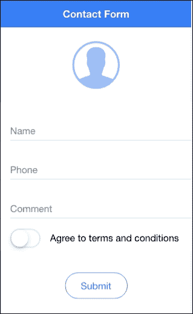

如果用户尝试提交而没有提供有效信息，表单将显示以下错误：

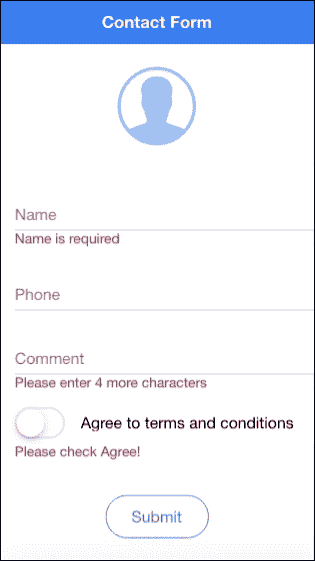

基本上，**姓名**字段是必填的。**电话**字段是数字类型，但为可选。**评论**字段是必填的，用户必须输入至少四个字符。当然，这只是为了演示输入长度。最后，用户必须通过切换输入同意条款和条件。

验证成功后，用户将被带到第二个屏幕，显示上一个屏幕的摘要，如下面的截图所示：

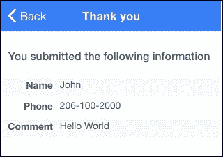

## 准备就绪

此应用程序示例可以在浏览器或物理设备上运行。然而，你可以选择将物理设备连接起来，以验证**电话**字段是否具有数字键盘。

## 如何做到这一点……

仔细阅读以下说明：

1.  使用 `blank` 模板创建一个新的 `MyFormValidation` 应用程序，如图所示，并转到 `MyFormValidation` 文件夹：

    ```js
     $ ionic start MyFormValidation blank --v2
     $ cd MyFormValidation

    ```

1.  打开 `./src/app/app.module.ts` 文件，将其内容替换为以下代码：

    ```js
    import { NgModule } from '@angular/core';
    import { IonicApp, IonicModule } from 'ionic-angular';
    import { MyApp } from './app.component';
    import { HomePage } from '../pages/home/home';
    import { ThankyouPage } from '../pages/thankyou/thankyou';
    import { MyFormService } from '../services/myform';

    @NgModule({
      declarations: [
        MyApp,
        HomePage,
        ThankyouPage
      ],
      imports: [
        IonicModule.forRoot(MyApp)
      ],
      bootstrap: [IonicApp],
      entryComponents: [
        MyApp,
        HomePage,
        ThankyouPage
      ],
      providers: [MyFormService]
    })
    export class AppModule {}
    ```

    你可能会意识到有一个在应用程序中通用的服务，在这里称为 `MyFormService`。此示例还有一个第二页，称为 `ThankyouPage`。

1.  现在，让我们通过首先创建一个目录来创建服务，如下所示：

    ```js
     $ mkdir ./src/services

    ```

1.  在你刚刚创建的组件目录中创建一个名为 `myform.js` 的文件，如下所示：

    ```js
    import {Injectable} from '@angular/core';

    @Injectable()
    export class MyFormService {
      public name: string = '';
      public phone: number;
      public comment: string = '';

      constructor() {
      }
    }
    ```

    为了演示目的，这个例子将保持服务组件简单。

1.  打开并编辑 `./src/pages/home/home.html` 模板，如下所示：

    ```js
    <ion-header>
      <ion-navbar color="primary">
        <ion-title>
          Contact Form
        </ion-title>
      </ion-navbar>
    </ion-header>

    <ion-content>
      <p class="center">
        <ion-icon class="large lighter" primary name="contact"></ion-icon>
      </p>
      <form #f="ngForm" novalidate (ngSubmit)="onSubmit(f)">
        <ion-list>

          <ion-item>
            <ion-label floating>Name</ion-label>
            <ion-input type="text" name="name" required [(ngModel)]="data.name"></ion-input>
          </ion-item>
          <div [hidden]="f.controls.name && (f.controls.name.valid || (f.controls.name.pristine && !isSubmitted))" class="note danger">
            Name is required
          </div>

          <ion-item>
            <ion-label floating>Phone</ion-label>
            <ion-input type="tel" name="phone" [(ngModel)]="data.phone"></ion-input>
          </ion-item>  

          <ion-item>
            <ion-label floating>Comment</ion-label>
            <ion-input type="text" required minlength=4 name="comment" [(ngModel)]="data.comment"></ion-input>
          </ion-item>
          <div *ngIf="(isSubmitted && f.controls.comment && f.controls.comment.pristine) || ((f.controls.comment) && (f.controls.comment.dirty && f.controls.comment.errors))" class="note danger">
            Please enter {{ 4 - (f.controls.comment.errors.minlength ? f.controls.comment.errors.minlength.actualLength : 0) }} more characters
          </div>

          <ion-item class="tos">
            <ion-toggle item-left [(ngModel)]="data.tos" name="tos" type="button" (click)="noSubmit($event)"></ion-toggle>
            <ion-label item-right>Agree to terms and conditions</ion-label>
          </ion-item>

          <div [hidden]="(!isSubmitted) || (f.controls.tos && data.tos)" class="note danger">
            Please check Agree!
          </div>

        </ion-list>

        <div class="center">
          <button ion-button type="submit" round outline>Submit</button>
        </div>
      </form>

    </ion-content>
    ```

    这可能是表单验证过程最复杂的一部分，因为你有许多地方需要嵌入输入的验证逻辑。

1.  打开并替换 `./src/pages/home/home.scss` 文件的内容，如下所示：

    ```js
    .center {
      text-align: center;
    }

    ion-icon.large {
      font-size: 7em;
    }

    ion-icon.lighter {
      opacity: 0.5;
    }

    ion-list > .item:first-child {
      border-top: 0;
    }

    ion-list > .item:last-child, ion-list > ion-item-sliding:last-child .item {
      border-bottom: 0;
    }

    .tos {
      padding-top: 10px;

      ion-toggle {
        padding-left: 0px;  
      }
      .item-inner {
        border-bottom: 0;
      }
    }

    .item ion-toggle {
      padding-left: 0;
    }

    .note.danger {
      padding-left: 16px;
      color: #d14;
    }
    ```

1.  打开 `./src/pages/home/home.ts` 文件进行编辑，以下代码：

    ```js
    import { Component } from '@angular/core';
    import { NavController } from 'ionic-angular';
    import { ThankyouPage } from '../thankyou/thankyou';
    import { MyFormService } from '../../services/myform';

    @Component({
      selector: 'page-home',
      templateUrl: 'home.html'
    })
    export class HomePage {
      private data: any;
      private isSubmitted: Boolean = false;

      constructor(public nav: NavController, private formData: MyFormService) {
        this.nav = nav;
        this.formData = formData;
        this.data = {
          name: '',
          phone: '',
          comment: '',
          tos: false
        }
      }

      onSubmit(myForm) {
        this.isSubmitted = true;
        console.log('onSubmit');
        console.log(myForm);

        if ((myForm.valid) && (myForm.value.tos)) {
          this.formData.name = this.data.name;
          this.formData.phone = this.data.phone;
          this.formData.comment = this.data.comment; 
          this.nav.push(ThankyouPage);
        }
      }

      noSubmit(e) {
        e.preventDefault();
      }
    }
    ```

    你可能会注意到 JavaScript 部分中验证代码不多。这意味着模板处理了大量的验证。还有一个用于 `thankyou` 页面的 `import` 命令，你将不得不创建下一个。

1.  现在，让我们创建 `thankyou` 文件夹，如下所示：

    ```js
     $ mkdir ./src/pages/thankyou

    ```

1.  在你刚刚创建的组件目录中创建一个名为 `thankyou.js` 的文件，如下所示：

    ```js
    import { Component } from '@angular/core';
    import { MyFormService } from '../../services/myform'

    @Component({
      templateUrl: 'thankyou.html'
    })
    export class ThankyouPage {

      constructor(private formData: MyFormService) {
        this.formData = formData;
      }

    }
    ```

    这个页面只是渲染 `MyFormService` 服务的数据。因此，你可以让它非常简单。

1.  在 `./src/pages/thankyou` 文件夹中创建 `thankyou.html`，如图所示：

    ```js
    <ion-header>
      <ion-navbar color="secondary">
        <ion-title>
          Thank You
        </ion-title>
      </ion-navbar>
    </ion-header>

    <ion-content>
      <h6 class="padding">
        You submitted the following information
      </h6>

      <div class="my-table">
        <ion-row>
          <ion-col width-25 class="my-label">Name</ion-col>
          <ion-col width-75>{{ formData.name }}</ion-col>
        </ion-row>
        <ion-row>
          <ion-col width-25 class="my-label">Phone</ion-col>
          <ion-col width-75>{{ formData.phone }}</ion-col>
        </ion-row>
        <ion-row>
          <ion-col width-25 class="my-label">Comment</ion-col>
          <ion-col width-75>{{ formData.comment }}</ion-col>
        </ion-row>
      </div>  
    </ion-content>
    ```

1.  在 `./src/pages/thankyou` 文件夹中创建 `thankyou.scss`，如图所示：

    ```js
    h6.padding {
      color: #4C555A;
      padding: 10px;
    }

    .my-label {
      text-align: right;
      font-weight: bold;
    }

    .my-table {
      ion-row {
        color: #4C555A;
        padding: 0;
        height: 30px;
      }

      ion-row + ion-row {
        margin-top: 0;
      }

      ion-row:nth-child(odd) ion-col {
        background: #F9FAFB;
      }
    }
    ```

1.  编辑 `./app/app.scss` 文件以确保包含两个页面中的 `.scss` 文件，如下所示：

    ```js
    @import '../pages/home/home';
    @import '../pages/thankyou/thankyou';
    ```

1.  前往你的终端，使用以下命令运行应用程序：

    ```js
     $ ionic serve

    ```

## 如何工作…

让我们从包含大部分验证代码的 `home.html` 文件开始。如果你看看这个页面的结构，它非常典型。你有一个 `<ion-navbar>`，其中包含 `<ion-title>`。`<form>` 元素必须位于 `<ion-content>` 区域内。

### 提示

使用 `<form>` 元素是 Angular 2 验证功能正常工作的要求。否则，将没有 `submit` 事件，你无法捕获每个输入的错误。

`form` 有以下属性：

```js
<form #f="ngForm" novalidate (ngSubmit)="onSubmit(f)">
```

要**即时**分配一个局部变量，你使用 `#` 符号。这意味着你希望 `f` 变量指向 `ngForm`，它是 Angular 2 自动创建的。这是一个包含与当前表单相关的一切的特殊对象。建议使用 `novalidate` 来绕过默认的 HTML5 验证，因为你正在使用 Angular 2 进行验证。否则，`form` 将会冲突。`(ngSubmit)` 几乎是一个事件，当 `type=submit` 的 `button` 被触摸或点击时，会触发 `onSubmit(f)` 函数。当你提交表单时，它将传递 `f` 变量，这样你就可以在 `onSubmit` 方法中处理该对象内部的对象。

`form` 模板仅由 `<ion-list>` 和 `<ion-item>` 组成。你只需要知道如何验证每个输入并显示错误。让我们以 `Name` 字段作为第一个例子。这是 `Name` 的 `<ion-input>`：

```js
<ion-input type="text" name="name" required [(ngModel)]="data.name"></ion-input>
```

以下显示的错误：

```js
<div [hidden]="f.controls.name && (f.controls.name.valid || (f.controls.name.pristine && !isSubmitted))" class="note danger">
  Name is required
</div>
```

为了验证，你必须将 `name` 分配为一个局部变量名。这是为了在其他区域使用 `f.controls.name` 来引用该输入。回想一下，`f` 变量之前已经被声明为 `ngForm` 对象。以下是 `ngForm` 的结构视图：

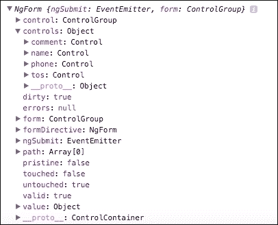

你可以使用 Chrome 开发者控制台查看这一点，因为代码实际上会在你提交表单时给出这个输出。

当以下任一条件成立时，错误信息 `Name is required` 将被隐藏：

+   表单尚未提交。否则，人们在输入任何内容之前就会立即看到错误信息。这不是一个好的用户体验。为了检查这一点，你必须使用一个临时的布尔值，称为 `isSubmitted`。`f.controls.name.pristine` 变量表示输入尚未被修改。这个相反的是 `f.controls.name.dirty`。

+   `f.controls.name.valid` 变量是 `true`。然而，你不能立即检查这个，因为如果输入为空，`name` 对象尚不存在。这就是为什么在检查 `valid` 布尔值之前，你需要检查 `f.controls.name` 的存在性。

没有必要检查电话要求；因此，你只需要分配 `name` 和一个模型，如下所示：

```js
<ion-input type="tel" name="phone" [(ngModel)]="data.phone"></ion-input>
```

对于 `Comment` 字段，需要使用 `required` 和 `minlength=4` 进行验证，如下所示：

```js
<ion-input type="text" required minlength=4 name="comment" [(ngModel)]="data.comment"></ion-input>
```

你可能会认为 `required` 是不必要的，因为如果长度为零，Angular 2 将触发一个错误标志。然而，这并不正确。当用户在输入框中没有输入任何内容时，输入将没有长度，因为变量不存在。这就是为什么你需要检查这两种情况。

对于 `Comment` 字段，错误信息非常有趣，因为它显示了用户需要输入的字符数，如下代码所示：

```js
<div *ngIf="(isSubmitted && f.controls.comment && f.controls.comment.pristine) || ((f.controls.comment) && (f.controls.comment.dirty && f.controls.comment.errors))" class="note danger">
  Please enter {{ 4 - (f.controls.comment.errors.minlength ? f.controls.comment.errors.minlength.actualLength : 0) }} more characters
</div>
```

这里的主要思想是，你只想在表单提交且通过 `f.controls.comment.pristine` 保持原始状态时显示这个 `div`。这意味着用户在表单中没有任何输入。你同样希望在表单为脏且存在错误通过 `f.controls.comment.errors` 时显示消息。如果你检查控制台，你可以在 `f.controls.comment.errors` 对象下看到许多详细的错误列表。为了告诉用户他们还剩下多少字符可以输入，你必须首先检查 `f.controls.comment.errors.minlength`，因为如果该变量不存在，则没有错误或 `comment` 输入为空。如果你不检查这一点，你将在稍后得到一个解析错误。

在你的 `home.ts` 文件中，`onSubmit` 方法必须将 `isSubmitted` 布尔值切换为 `true`，如下代码片段所示：

```js
onSubmit(myForm) {
  this.isSubmitted = true;
  console.log('onSubmit');
  console.log(myForm);

  if ((myForm.valid) && (myForm.value.tos)) {
    this.formData.name = this.data.name;
    this.formData.phone = this.data.phone;
    this.formData.comment = this.data.comment;
    this.nav.push(ThankyouPage);
  }
}
```

然后，你必须对`myForm.valid`和`myForm.value.tos`进行一般性检查。你可能想知道为什么我们在这里检查`tos`而不是在模板内进行验证。原因是，在 Angular 2 中无法验证切换按钮，因为它没有意义，因为它不能是`required`。因此，你必须在这里进行自定义验证，以确保它在表单中是`true`。这意味着用户已经检查了**同意条款和条件**的切换按钮。

这是一个可能是在 Ionic 2（目前为 Beta 21）中存在的细节错误：

```js
noSubmit(e) {
  e.preventDefault();
}
```

对于每个切换按钮，它默认充当`type=submit`按钮，因为没有分配`type`属性。这就是为什么你需要通过调用`preventDefault()`来取消`submit`事件。

### 小贴士

参考 W3 网站，在[`www.w3.org/TR/html-markup/button.html`](https://www.w3.org/TR/html-markup/button.html)，以获取关于`button`元素默认行为的信息。

`thankyou`页面非常直观，因为你只需在模板中解析`formData`对象，从`MyFormService`服务中获取数据。

## 相关内容

查看以下链接以获取更多信息：

+   更多关于 Angular 2 文档中的`form`的信息，你可以访问[`angular.io/docs/ts/latest/guide/forms.html`](https://angular.io/docs/ts/latest/guide/forms.html)和[`angular.io/docs/ts/latest/api/forms/index/NgForm-directive.html`](https://angular.io/docs/ts/latest/api/forms/index/NgForm-directive.html)

+   ionic 文档有一个专门针对 Ionic 输入组件的页面，你可以在这里找到[`ionicframework.com/docs/v2/resources/forms/`](https://ionicframework.com/docs/v2/resources/forms/)

+   它还列出了你可以用于验证或键盘强制的 HTML5 输入类型的好列表，你可以在[`ionicframework.com/html5-input-types/`](http://ionicframework.com/html5-input-types/)找到这些类型。

# 通过使用静态 JSON 文件使用模拟 API 检索数据

作为前端和应用程序开发者，你经常在一个团队中工作，其中另一个人负责后端 API。然而，当你开发前端时，并不总是有可能有后端可用。在最终后端 API 尚未准备好的情况下，你必须*模拟*后端。

在这个菜谱中，你将学习如何使用`http`服务调用 REST API。API 端点将只是位于你本地机器上的静态 JSON。你还将学习如何利用占位符图像来满足设计要求。应用程序将显示图像源列表和描述，如下面的截图所示：

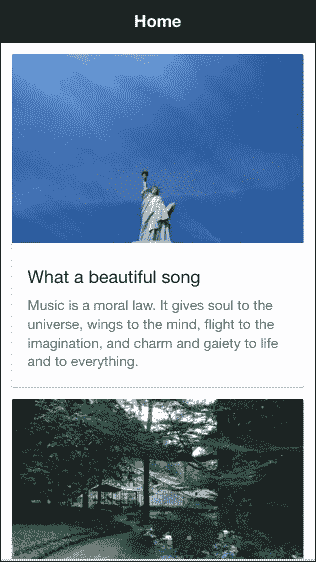

## 准备工作

这个应用程序示例可以在浏览器或物理设备上运行。但是，*模拟*的后端服务器必须在你的本地计算机上运行。

## 如何操作...

这里是必须遵循的说明：

1.  首先，让我们快速创建一个**假**的后端服务器。为此，您必须安装`http-server`：

    ```js
     $ sudo npm install -g http-server

    ```

1.  创建一个文件夹来存储您的`.json`文件。让我们称它为`MockRest`，如图所示：

    ```js
     $ mkdir MockRest
     $ cd MockRest

    ```

1.  创建`test.json`文件，并填写以下内容作为 REST 响应：

    ```js
    [
      {
        "title": "What a beautiful song",
        "category": "objects",
        "description": "Music is a moral law. It gives soul to the universe, wings to the mind, flight to the imagination, and charm and gaiety to life and to everything."
      },
      {
        "title": "The world we live in",
        "category": "nature",
        "description": "Look deep into nature, and then you will understand everything better."
      },
      {
        "title": "Life experiences",
        "category": "people",
        "description": "People who know little are usually great talkers, while men who know much say little."
      }
    ]
    ```

    基本上，每次您发送 REST 请求时，您都应该收到前面的内容作为响应。随着您的后端开发者更新 REST 响应，您始终可以相应地更改`test.json`文件的内容。

1.  从`MockRest`文件夹中的终端调用`http-server`以启动您的后端服务器，如图所示：

    ```js
     $ http-server --cors=Access-Control-Allow-

    ```

1.  通过`http://localhost:8080/test.json`来验证您是否可以看到 JSON 内容。如果不行，您可能与其他 Web 服务器存在端口冲突。您需要确保没有其他应用程序使用端口`8080`。

1.  在完成您的后端后，打开另一个终端窗口，使用`blank`模板创建一个新的`MyRestBackend`应用，并进入`MyRestBackend`文件夹，如图所示：

    ```js
     $ ionic start MyRestbackend blank --v2
     $ cd MyRestbackend

    ```

    ### 小贴士

    您必须不要停止后端服务器或创建一个在`MockRest`文件夹内的 Ionic 项目。它们是两个独立的项目文件夹。

1.  打开`html.html`文件，将其内容替换为以下代码：

    ```js
    <ion-header>
      <ion-navbar>
        <ion-title>
          Home
        </ion-title>
      </ion-navbar>
    </ion-header>

    <ion-content padding>
      <ion-card #myCard *ngFor="let item of quotes.data">
        
        <ion-card-content>
          <ion-card-title>
            {{ item.title }}
          </ion-card-title>
          <p>
            {{ item.description }}
          </p>
        </ion-card-content>
      </ion-card>
    </ion-content>
    ```

    此应用示例使用来自[`source.unsplash.com/`](https://source.unsplash.com/)的免费照片，因为您可以轻松查询以获取满足您需求的随机照片。

1.  打开`home.ts`并使用以下代码进行编辑：

    ```js
    import { Component } from '@angular/core';
    import { NavController } from 'ionic-angular';
    import { QuoteService } from '../../services/quote'

    @Component({
      selector: 'page-home',
      templateUrl: 'home.html'
    })
    export class HomePage {

      constructor(public navCtrl: NavController, public quotes: QuoteService) {
        this.quotes = quotes;
        this.quotes.getQuotes();    
      }

    }
    ```

    您尚未创建`QuoteService`服务。然而，您可能知道这个服务将使用`getQuotes()`方法调用**假**的后端服务器以获取 JSON 内容。

1.  对样式表`home.scss`进行以下小修改：

    ```js
    ion-card {
      img {
        background-color: #f4f4f4;
      }
    }
    ```

1.  使用以下命令创建`./src/services`文件夹：

    ```js
     $ mkdir ./src/services

    ```

1.  在`services`文件夹中创建`quote.ts`文件，并复制以下代码：

    ```js
    import { Injectable } from '@angular/core';
    import { Http } from '@angular/http';

    @Injectable()
    export class QuoteService {
      private http: any;
      public data: any;

      constructor(http: Http) {
        this.http = http;
      }

      getQuotes() {
        this.http.get("http://localhost:8080/test.json")
          .subscribe(res => {
            this.data = res.json();
            console.log(this.data);
          }, error => {
            console.log(error);
          });
      }

    }
    ```

1.  打开并编辑`./src/app/app.module.ts`以声明`QuoteService`，如图所示：

    ```js
    import { NgModule } from '@angular/core';
    import { IonicApp, IonicModule } from 'ionic-angular';
    import { MyApp } from './app.component';
    import { HomePage } from '../pages/home/home';
    import { QuoteService } from '../services/quote'

    @NgModule({
      declarations: [
        MyApp,
        HomePage
      ],
      imports: [
        IonicModule.forRoot(MyApp)
      ],
      bootstrap: [IonicApp],
      entryComponents: [
        MyApp,
        HomePage
      ],
      providers: [QuoteService]
    })
    export class AppModule {}
    ```

1.  前往您的终端并运行应用，如图所示：

    ```js
    $ ionic serve
    ```

1.  您将注意到页面为空，**控制台**显示以下错误：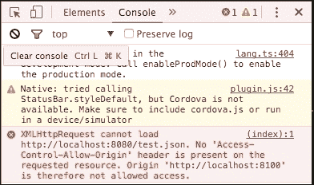

    这意味着您的浏览器（在这种情况下，Chrome）不允许从`http://localhost:8100`调用 REST API 到`http://localhost:8080`。您需要安装**Allow-Control-Allow-Origin**（**CORS**）插件，例如[`chrome.google.com/webstore/detail/allow-control-allow-origi/nlfbmbojpeacfghkpbjhddihlkkiljbi?hl=en`](https://chrome.google.com/webstore/detail/allow-control-allow-origi/nlfbmbojpeacfghkpbjhddihlkkiljbi?hl=en)，用于 Chrome。之后，如图所示打开 CORS：

    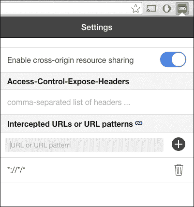

1.  刷新您的浏览器以查看更新的应用。

## 它是如何工作的...

您的**假**后端简单地返回当前`MockRest`文件夹中的任何文件。随着您从后端开发者那里获得更多**样本**响应，您可以将它们复制到这个文件夹中，以提供额外的后端端点。

### 注意

本节不提供如何处理 POST 请求和复杂场景的示例，其中响应取决于请求参数。您可能希望将处理临时情况的代码保持尽可能简单，因为它们不是生产代码。建议为每个 POST 请求返回相同的内容。

让我们看看`quote.ts`，因为它是发起`Http`请求的主要地方。首先，您需要导入`Injectable`和`Http`，您可以如下操作：

```js
import {Injectable} from '@angular/core';
import {Http} from '@angular/http';
```

使用`@Injectable`装饰器允许其他页面和组件将`QuoteService`作为依赖项使用。`Http`服务（或类）由 Angular 2（而非 Ionic 2）提供，这与 Angular 1 中的`$http`提供者类似。然而，`Http`将返回一个**可观察**对象，以便您可以*订阅*它。以下所示的`getQuotes()`方法是此文件最重要的部分：

```js
  getQuotes() {
    this.http.get("http://localhost:8080/test.json")
      .subscribe(res => {
        this.data = res.json();
        console.log(this.data);
      }, error => {
        console.log(error);
      });
  }
```

`this.http`对象必须从构造函数中注入。然后，它将通过`this.http.get()`触发 GET 请求，就像`$http`提供者一样。然而，在 Angular 2 中，没有`.then()`函数，但您必须`subscribe`到对象。ES6 的一个新特性是*箭头*函数，正如您通过`res => {}`所看到的。这与其他语言中的 lambda 函数类似（例如 Python）。您不需要声明函数的名称，也不必每次都键入*function*。此外，它自动传递参数（在这种情况下是`res`）和函数内部的`this`上下文。

### 注意

您可以在 TypeScript 文档中了解更多关于箭头函数的信息，请参阅[`www.typescriptlang.org/docs/handbook/functions.html`](https://www.typescriptlang.org/docs/handbook/functions.html)。

来自您的*模拟*后端的 REST 响应将被分配给`QuoteService`服务的`this.data`，如下所示：

```js
this.data = JSON.parse(res._body);
```

如果您看到浏览器控制台，它将类似于以下截图：

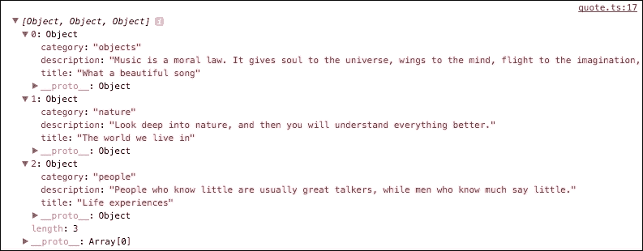

在`home.html`模板中，还有一个很好的技巧是，在照片下载并渲染时显示灰色占位符，而不是将内容向下推，如下面的代码片段所示：

```js
<ion-card #myCard *ngFor="let item of quotes.data">
    
```

以下截图显示了照片加载之前的快速示例：

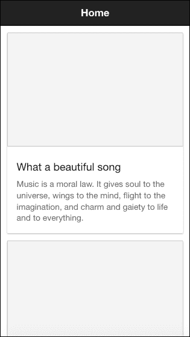

为了让``标签具有确切的大小，您必须使用`[height]="myCard.clientWidth * 390 / 600"`进行高度计算。这是因为照片的尺寸是 600 x 390。`myCard`对象是从`ion-card`创建的本地对象。这个`myCard`对象将能够访问`ion-card` DOM 的所有属性，包括通过`clientWidth`的宽度。您可能已经注意到，这完全是纯 JavaScript，与 Ionic 或 Angular 本身无关。

## 参见

+   关于 Angular 2 `Http`提供者的更多信息，你可以访问官方文档[`angular.io/docs/ts/latest/api/http/index/HttpModule-class.html`](https://angular.io/docs/ts/latest/api/http/index/HttpModule-class.html)。

# 集成 Stripe 进行在线支付

在本节中，你将学习如何集成真实的后端服务进行支付流程。赚取收入是创建应用的重要方面。虽然有许多其他收集支付的方法，但 Stripe 是一个常见的支付系统，并且可以很好地与 Ionic 集成。此外，由于你不会**存储**信用卡信息，因此不需要提供高级别的安全性和合规性（即 PCI）。

你的应用不会通过真实的支付方式处理，因为你可以使用 Stripe 的公共测试密钥。应用将要求输入一些字段来创建令牌。观察以下应用截图：

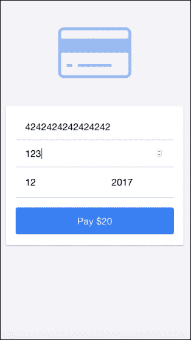

如果你点击**支付$20**按钮，它将带你进入下一个屏幕，在那里你可以获取支付令牌，如下面的截图所示：

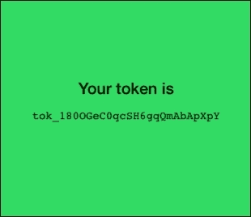

### 提示

实际上，你的后端调用 Stripe 进行授权和处理的步骤还有额外的步骤。然而，这不在本节的范围内。Stripe 文档在 Node.js 方面有一个很好的教程页面[`stripe.com/docs/api/node#authentication`](https://stripe.com/docs/api/node#authentication)。

## 准备工作

没有必要在物理设备上进行测试，因为 Ionic 2 和 Stripe 在浏览器中运行得很好。

## 如何操作...

仔细阅读以下说明：

1.  如果你没有 Stripe 账户，你需要注册[`stripe.com`](https://stripe.com)。

1.  登录并前往[`dashboard.stripe.com/test/dashboard`](https://dashboard.stripe.com/test/dashboard)。

1.  点击右上角的用户名并选择**账户设置**，如下面的截图所示：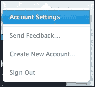

1.  选择**API 密钥**标签。

1.  复制以下所示的**测试发布密钥**，并将其放置在某个位置，因为稍后你需要用它来编写 JavaScript 代码：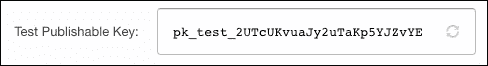

    现在，回到终端。

1.  使用`blank`模板创建一个新的`StripePayment`应用，如下所示，并进入`StripePayment`文件夹：

    ```js
     $ ionic start StripePayment blank --v2
     $ cd StripePayment

    ```

1.  打开`./src/index.html`文件，并在`<body>`标签中插入以下所示行：

    ```js
    <script type="text/javascript" src="img/"></script>
    ```

    ### 注意

    这是将`Stripe`对象全局加载到你的应用中。这不是 Angular 2 推荐的方法，因为任何在组件内部使用的东西都必须通过`import`指令导入。然而，在撰写本书时，angular-stripe 对 Angular 2 不可用。因此，没有正确执行此操作的方法。前面的方法将运行得很好。

1.  打开`./src/pages/home/home.html`文件，并使用以下代码修改内容：

    ```js
    <ion-content class="gray-bg">
      <p class="center">
        <ion-icon class="icon-large" name="card"></ion-icon>
      </p>

      <ion-card>
        <ion-card-content>
          <ion-list>

            <ion-item>
              <ion-input type="number" name="cc" [(ngModel)]="ngForm.cc" placeholder="Number"></ion-input>
            </ion-item>

            <ion-item>
              <ion-input type="number" name="cvc" [(ngModel)]="ngForm.cvc" placeholder="CVC"></ion-input>
            </ion-item>

            <ion-item>
              <ion-input item-left type="number" name="month" [(ngModel)]="ngForm.month" placeholder="Month"></ion-input>
              <ion-input item-right type="number" name="year" [(ngModel)]="ngForm.year" placeholder="Year"></ion-input>
            </ion-item>

            <button type="button" ion-button bottom block (click)="onSubmit()">Pay $20</button>

          </ion-list>
        </ion-card-content>
      </ion-card>

    </ion-content>
    ```

    Stripe 只需要信用卡号码、CVC 和到期日期来创建用于收费的令牌。客户姓名和地址是可选的；因此，您不需要在此处包含它们。

1.  然后，将`./src/pages/home/home.ts`的内容替换为以下代码：

    ```js
    import { Component } from '@angular/core';
    import { NavController } from 'ionic-angular';
    import { ThankyouPage } from '../thankyou/thankyou'
    declare var Stripe: any;

    @Component({
      selector: 'page-home',
      templateUrl: 'home.html'
    })
    export class HomePage {
      private token: string = '';
      private ngForm: any = {
          cc: '',
          cvc: '',
          month: '',
          year: '',
          amount: 2000    
      };

      constructor(public nav: NavController) {
        this.nav = nav;
        console.log(Stripe);
        Stripe.setPublishableKey('YOUR STRIPE PUBLIC KEY HERE');
      }

      onSubmit() {
        console.log(this.ngForm);
        Stripe.card.createToken({
          number: this.ngForm.cc, //'4242424242424242',
          cvc: this.ngForm.cvc, //'123',
          exp_month: this.ngForm.month, //12,
          exp_year: this.ngForm.year, //2017,
          amount: 2000
        }, (status, response) => this.stripeResponseHandler(status, response));
      }

      stripeResponseHandler(status, response) {

        if (response.error) {
          // Show the errors on the form
          console.log('error');
          console.log(response.error.message);
        } else {
          // response contains id and card, which contains additional card details
          this.token = response.id;
          // Insert the token into the form so it gets submitted to the server
          console.log('success');
          console.log('Sending token param:');
          console.log(this.token);
          this.nav.push(ThankyouPage, {token: this.token});
        }
      }

    }
    ```

    您需要在此处更改您的**测试发布密钥**，通过将**YOUR STRIPE PUBLIC KEY HERE**替换为您之前复制的自己的密钥。

1.  使用以下代码编辑`./src/pages/home/home.scss`：

    ```js
    .center {
      text-align: center;
    }

    .gray-bg {
      background-color: #f4f4f7;
    }

    .icon-large {
      font-size: 150px;
      color: #387ef5;
      opacity: 0.5;
    }

    .list-ios > .item-block:first-child {
      border-top: 0;  
    }

    ion-card ion-list .item {
      border-bottom: 1px solid #c8c7cc;
    }

    ion-list .item-inner {
      border-bottom: 0;
    }

    ion-card-content .button-block {
      margin-top: 16px;
       }
    ```

1.  通过创建一个名为`./src/pages/thankyou`的新文件夹，来创建显示令牌 ID 的`thankyou`页面，如下所示：

    ```js
    $ mkdir ./src/pages/thankyou

    ```

1.  在`thankyou`文件夹中创建`thankyou.html`文件，并复制以下代码：

    ```js
    <ion-content class="green-bg">
      <h4 class="center">
        Your token is
      </h4>
      <p class="center">
        <code>
          {{ token }}
        </code>
      </p>
    </ion-content>
    ```

    实际上，没有必要向用户显示令牌 ID。这只是一个示例，用于获取用于收费的令牌 ID。

1.  在`thankyou`文件夹中创建`thankyou.ts`文件，并复制以下代码：

    ```js
    import { Component } from '@angular/core';
    import { NavController, NavParams } from 'ionic-angular';

    @Component({
      selector: 'thank-you',
      templateUrl: 'thankyou.html'
    })
    export class ThankyouPage {
      private token: string = '';

      constructor(public nav: NavController, public params: NavParams) {
        this.token = this.params.get('token');
        console.log('Getting token param:');
        console.log(this.token);
      }

    }
    ```

1.  创建`thankyou.scss`文件，使用以下代码修改主题：

    ```js
    .green-bg {
      color: black;
      background-color: #32db64;
    }

    h4.center {
      padding-top: 150px;
    }

    .center {
      text-align: center;
    }
    ```

1.  由于`thankyou.scss`文件在项目中是新的，您需要将其包含在`./src/app/app.scss`中。在代码底部插入此行：

    ```js
    @import '../pages/thankyou/thankyou';
    ```

1.  打开并编辑`./src/app/app.module.ts`，如下声明`ThankyouPage`：

    ```js
    import { NgModule } from '@angular/core';
    import { IonicApp, IonicModule } from 'ionic-angular';
    import { MyApp } from './app.component';
    import { HomePage } from '../pages/home/home';
    import { ThankyouPage } from '../pages/thankyou/thankyou'

    @NgModule({
      declarations: [
        MyApp,
        HomePage,
        ThankyouPage
      ],
      imports: [
        IonicModule.forRoot(MyApp)
      ],
      bootstrap: [IonicApp],
      entryComponents: [
        MyApp,
        HomePage,
        ThankyouPage
      ],
      providers: []
    })
    export class AppModule {}
    ```

1.  前往您的终端并运行应用：

    ```js
    $ ionic serve

    ```

1.  为了测试目的，您可以使用`4242424242424242`作为信用卡号码，`123`作为`cvc`，以及`12/2017`作为到期日期。

## 它是如何工作的…

这是 Stripe 收费过程：

1.  用户填写支付表单并点击**提交**按钮。

1.  前端（您的 Ionic 应用）将使用`Stripe`对象调用 Stripe API，并发送所有支付信息。

1.  Stripe 将返回一个令牌 ID，这基本上是一种确认一切正确并且现在可以收费的方式。

1.  前端将使用令牌 ID 发送到其后端（不包含信用卡信息）以授权收费。

1.  后端将调用另一个 Stripe API 表示“我现在要收费”。此时，Stripe 将向后端返回`success`事件。

1.  然后，后端将向前端返回`success`事件。

1.  前端应渲染一个新页面，例如`thankyou`页面。

如前所述，本章不会涵盖此应用的后端部分，因为它不专注于 Ionic。您可以使用任何语言构建后端，例如 Node.js、PHP 或 Python。

让我们看看`home.ts`，因为大多数 Stripe API 处理都位于那里。首先，您需要进行一个`declare`，如图所示，因为`Stripe`是一个全局对象，它包含在`index.html`中：

```js
declare var Stripe: any;
```

如果您不进行`declare`，应用仍然可以运行，但您将收到 TypeScript 的错误。

当用户提交表单时，将触发以下方法：

```js
  onSubmit() {
    console.log(this.ngForm);
    Stripe.card.createToken({
      number: this.ngForm.cc, //'4242424242424242',
      cvc: this.ngForm.cvc, //'123',
      exp_month: this.ngForm.month, //12,
      exp_year: this.ngForm.year, //2017,
      amount: 2000
    }, (status, response) => this.stripeResponseHandler(status, response));
  }
```

当你调用 `Stripe.card.createToken` 时，Stripe 对象将在后台触发一个 API 调用到 [`stripe.com/`](https://stripe.com/)，并提交 JSON 数据。你可能意识到这个示例根本就没有使用 `ngModel`，但你可以直接从 `ngForm` 内部获取表单值。这个功能是通过你在 `home.html` 中的以下代码实现的：

```js
<button type="button" ion-button bottom block (click)="onSubmit()">Pay $20</button>
```

一旦 Stripe 返回你的令牌 ID，它将调用以下箭头函数：

```js
(status, response) => this.stripeResponseHandler(status, response)
```

在这里使用箭头函数的原因是因为你在 `stripeResponseHandler` 方法内的代码需要 `HomePage` 类的 `this` 上下文。这是一种访问令牌变量的好方法。观察以下代码：

```js
  stripeResponseHandler(status, response) {

    if (response.error) {
      // Show the errors on the form
      console.log('error');
      console.log(response.error.message);
    } else {
      // response contains id and card, which contains additional card details
      this.token = response.id;
      // Insert the token into the form so it gets submitted to the server
      console.log('success');
      console.log('Sending token param:');
      console.log(this.token);
      this.nav.push(ThankyouPage, {token: this.token});
    }
  }
```

`response.id` 将包含来自 Stripe 的令牌 ID。否则，你可以使用 `response.error.message` 来处理错误。在这个例子中，因为它只传递令牌 ID 到下一页，所以你可以简单地作为参数 `{token: this.token}` 发送它：

```js
this.nav.push(ThankyouPage, {token: this.token});
```

在你的 `thankyou.ts` 文件中，你可以使用以下代码访问参数 `token`：

```js
this.params.get('token');
```

## 参考以下内容

+   要了解更多关于 Stripe API 的信息，你可以查看官方文档 [`stripe.com/docs/stripe.js`](https://stripe.com/docs/stripe.js)

+   你可以在 [`stripe.com/docs/examples`](https://stripe.com/docs/examples) 找到更多其他语言的示例，你可以进行实验。
