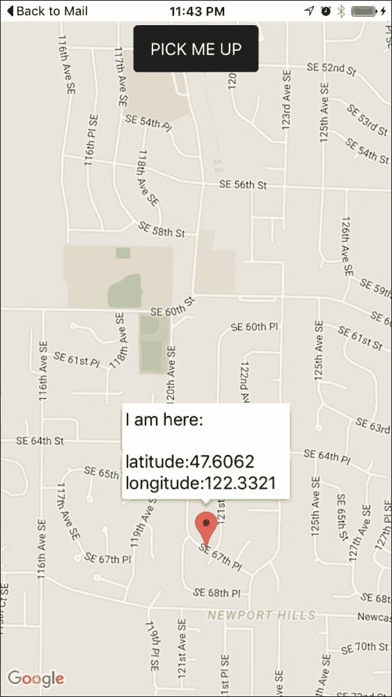

# 第七章. 使用 Ionic Native 支持设备功能

在本章中，我们将介绍与原生设备功能支持相关的以下任务：

+   使用相机插件拍照

+   使用社交分享插件共享内容

+   使用 InAppBrowser 显示服务条款

+   使用 Google Maps 插件和地理编码支持创建出租车应用

# 简介

在本章中，你将学习如何访问设备的一些常见功能，例如相机、联系人列表、电子邮件和地图。其中一些功能可以在仅 JavaScript 的环境中编写，但性能并不与原生支持相媲美。

Cordova 有一个非常受支持的社区和许多插件。你可能想查看 [`plugins.cordova.io/`](http://plugins.cordova.io/) 以了解有哪些选择。幸运的是，你不需要直接处理这些插件。你将使用基于 Cordova 和 Angular 2 的 Ionic Native ([`ionicframework.com/docs/v2/native/`](http://ionicframework.com/docs/v2/native/)) 服务。请注意，由于兼容性问题，你必须使用 Ionic Native 而不是 ngCordova 来支持 Ionic 2。你只能使用 ngCordova 来支持 Ionic 1.x。

# 使用相机插件拍照

对于本节，你将制作一个应用，使用设备相机拍照或从设备相册加载现有图片。图片可以是 Base64 格式，也可以保存在与你的应用相关的本地文件系统中。以下是该应用的截图：


这里是高级流程：

+   访问 Cordova 相机插件以触发相机捕获并获取 Base64 或 URI 格式的图像

+   在 `` DOM 对象上解析 Base64 数据或 URI

+   如果是 URI 格式，显示 URI

+   捕获切换组件的事件

+   使用水平滚动显示长数据（例如，URI）

## 准备工作

你应该准备一个物理设备来测试相机功能。你可以通过模拟器运行代码，但不同平台上的文件系统支持可能会有所不同。

## 如何做到这一点...

以下是在添加相机支持时的说明：

1.  开始一个空白项目（例如，`MyCamera`）并进入该文件夹：

    ```js
    $ ionic start MyCamera blank --v2
    $ cd MyCamera

    ```

1.  使用以下代码添加 Cordova 相机插件：

    ```js
    $ ionic plugin add cordova-plugin-camera

    ```

    ### 小贴士

    你不再需要单独添加 ngCordova。此外，你不应该直接使用 `cordova add` 命令行；相反，使用 `ionic plugin add`

    你应该能够看到在 `/plugins` 文件夹中添加了一个新的文件夹 `org.apache.cordova.camera`。

1.  将 `./src/pages/home/home.html` 替换为以下代码：

    ```js
    <ion-header>
      <ion-navbar>
        <ion-title>
          Camera
        </ion-title>
      </ion-navbar>
    </ion-header>

    <ion-content padding>
      <ion-row class="center">
        <ion-col width-50>
          <button ion-button (click)="getPicture(1)">Show Camera</button>  
        </ion-col>
        <ion-col width-50>
          <button ion-button (click)="getPicture(0)">Show Album</button>  
        </ion-col>
      </ion-row>

      <ion-item class="no-border">
        <ion-label>Return image file URI</ion-label>
        <ion-toggle energized [(ngModel)]="useURI">
    	</ion-toggle>
      </ion-item>

      <ion-card>
        
        <ion-card-content>
          <ion-card-title>
            <div *ngIf="useURI">
              Using URI
            </div>
            <div *ngIf="!useURI">
              Using Base64
            </div>
          </ion-card-title>
          <p *ngIf="useURI">
            Your URI is {{ imageData }}
          </p>
          <p *ngIf="!useURI">
            Your Base64 image has {{ (imageData + '').length }} bytes
          </p>
        </ion-card-content>
      </ion-card>
    </ion-content>
    ```

    由于你只有一个页面，这个模板将显示两个按钮和一个显示图像的区域。

1.  将 `./src/pages/home/home.ts` 替换为以下代码：

    ```js
    import { Component, Input } from '@angular/core';
    import { NavController } from 'ionic-angular';
    import { Camera } from 'ionic-native';

    @Component({
      selector: 'page-home',
      templateUrl: 'home.html'
    })
    export class HomePage {
      public imageData: string;
      @Input('useURI') useURI: Boolean = true;

      constructor(public navCtrl: NavController) {
      }

      getPicture(sourceType){
        Camera.getPicture({
            quality: 50,
            allowEdit: true,
            encodingType: Camera.EncodingType.JPEG,
            saveToPhotoAlbum: false,
            destinationType: this.useURI ? Camera.DestinationType.FILE_URI : Camera.DestinationType.DATA_URL,
            targetWidth: 800,
            targetHeight: 800,
            sourceType: sourceType
        }).then((imageData) => {
            if (this.useURI) {
              this.imageData = imageData;
            } else {
              this.imageData = "data:image/jpeg;base64," + imageData;
            }
        }, (err) => {
            console.log(err);
        });
      }  
    }
    ```

    只有一个方法：`getPicture()`。此方法将返回照片数据，以便模板可以渲染。

1.  将 `/app/pages/home/home.scss` 替换为以下代码：

    ```js
    .center {
      text-align: center;
    }

    .no-border .item-inner {
      border-bottom: 0;
    }
    ```

    样式上只有少数的改动，这样你可以保持它们简单。

1.  将你的设备连接到电脑。

1.  前往终端并执行以下命令行以运行 iOS：

    ```js
    $ ionic run ios

    ```

    ### 注意

    如果你无法使用前面的命令行将应用推送到物理设备，你可以使用`ionic run ios --device`来指定 CLI，使其使用物理设备而不是模拟器。

    如果你想在 Android 设备上运行应用，请使用以下代码：

    ```js
    $ ionic run android

    ```

1.  当你运行应用并拍照时，你应该会看到如下截图所示的应用界面：

## 它是如何工作的...

`Camera.getPicture()`只是 Cordova 相机插件中的`navigator.camera.getPicture()`的一个抽象。如果你已经熟悉 Cordova 或 Ionic 1 中的 ngCordova，这应该非常熟悉。让我们从模板开始。你有以下两个按钮，它们触发相同的`getPicture()`方法：

+   `<button ion-button (click)="getPicture(1)">显示相机</button>`

+   `<button ion-button (click)="getPicture(0)">显示相册</button>`

这些只是访问照片的不同方式：要么从相机本身，要么从手机相册中的现有照片。为了使照片渲染，你需要将照片数据传递到`src`属性，如下所示：

```js

```

注意，你只想在`imageData`存在且包含数据时显示此``标签。`imageData`变量可以是 Base64 或照片的内部 URL。为了指定此选项，有一个切换按钮，如下所示：

```js
<ion-toggle energized [(ngModel)]="useURI"></ion-toggle>
```

你将在类中使用`useURI`变量，如图所示，以确定返回照片数据的格式。

```js
@Input('useURI') useURI: Boolean = true;
```

`useURI`和`sourceType`都将用于`getPicture()`函数，如下所示：

```js
Camera.getPicture({
    quality: 50,
    allowEdit: true,
    encodingType: Camera.EncodingType.JPEG,
    saveToPhotoAlbum: false,
    destinationType: this.useURI ? Camera.DestinationType.FILE_URI: Camera.DestinationType.DATA_URL,
    targetWidth: 800,
    targetHeight: 800,
    sourceType: sourceType
}).then((imageData) => {
    if (this.useURI) {
      this.imageData = imageData;
    } else {
      this.imageData = "data:image/jpeg;base64," + imageData;
    }
}, (err) => {
    console.log(err);
});
```

调整质量、`targetWidth`和`targetHeight`到低值，这样照片不会太大，否则可能会使设备崩溃，尤其是在内存不足的情况下。当你返回 Base64 数据时，必须在字符串前加上`data:image/jpeg;base64`。

这里没有讨论的一项功能是向服务器发送图像数据的能力。常见的场景是从文件系统中上传文件。由于数据大小是原始二进制大小的两倍，所以发送 Base64 数据不是一个好主意。

## 还有更多...

只需使用 JavaScript 就可以创建类似 Instagram 的滤镜效果。你可以利用现有的库，例如 Filterous ([`github.com/girliemac/Filterous`](https://github.com/girliemac/Filterous))，直接修改图像画布。

在 GitHub 上有一个 Instagram 插件([`github.com/vstirbu/InstagramPlugin`](https://github.com/vstirbu/InstagramPlugin))，适用于 Cordova。你可以编写一些额外的代码将图像传递到 Instagram。不过，用户必须首先在手机上安装 Instagram。当你计划在 Instagram 执行照片滤镜操作之前做一些酷炫的图像处理（例如，添加有趣的文字）时，这个想法很不错。

您甚至可以添加 Cordova 的社交网络插件，并将生成的图片发布到推特或 Facebook。

# 使用社交分享插件分享内容

如果您开发一个具有可分享内容的应用程序，您可能希望利用设备的原生功能通过设备授权的社交媒体账户进行分享。使用这种方法有几个好处。首先，用户不需要每次分享时都打开一个单独的浏览器来登录他们的社交媒体账户。其次，所有信息都可以通过编程方式填写，例如标题、正文、链接或图片。最后，由于这是设备的原生功能，菜单选择允许用户看到他们已经熟悉的多个账户，从而进行选择。社交分享插件可以极大地提升用户体验。

这是您将要构建的应用程序：


当用户点击 **分享** 按钮时，应用程序将显示以下原生按钮菜单，用于选择社交媒体账户：


如果用户选择推特，将弹出一个包含所有预先填写信息的弹出窗口，如下所示：


在推特上发布后，用户可以直接返回应用程序，而无需离开。

## 准备工作

您应该准备好一个物理设备或模拟器，以便测试社交分享功能。

## 如何操作...

以下是指令：

1.  开始一个空白项目（例如，`LinkSocialShare`），如下所示，并进入该文件夹：

    ```js
    $ ionic start LinkSocialShare blank --v2
    $ cd LinkSocialShare

    ```

1.  使用以下命令行添加 Cordova 摄像头插件：

    ```js
    $ ionic plugin add cordova-plugin-x-socialsharing

    ```

1.  打开 `./src/pages/home/index.html` 并将其内容替换为以下代码：

    ```js
    <ion-header>
      <ion-navbar>
        <ion-title>
          Home
        </ion-title>
      </ion-navbar>
    </ion-header>

    <ion-content>
      <ion-card>

        <ion-item>
          <h2 #messageSubject>Ionic Developer</h2>
          <p>May 5, 2016</p>
        </ion-item>

        

        <ion-card-content>
          <p #messageBody>Wow Ionic 2 is so awesome.I gotta share this to other people.</p>
        </ion-card-content>

        <ion-row>
          <ion-col>
            <button ion-button color="primary"clear small icon-left>
              <ion-icon name="thumbs-up"></ion-icon>
              <div>12 Likes</div>
            </button>
          </ion-col>
          <ion-col>
            <button ion-button color="primary" clear small icon-left
              (click)="sendShare(messageBody.innerText, messageSubject.innerText,'http://ionicframework.com/docs/v2/')">
              <ion-icon name="ios-share"></ion-icon>
              <div>Share</div>
            </button>
          </ion-col>
          <ion-col center text-center>
            <ion-note>
              11h ago
            </ion-note>
          </ion-col>
        </ion-row>

      </ion-card>
    </ion-content>
    ```

这是一个非常简单的页面，包含卡片元素。**点赞**按钮仅出于美观考虑，没有代码实现。然而，所有的 JavaScript 逻辑都将集中在 **分享** 按钮上：

1.  打开 `./src/pages/home/home.ts`，如下所示：

    ```js
    import { Component } from '@angular/core';
    import { NavController } from 'ionic-angular';
    import { SocialSharing } from 'ionic-native';

    @Component({
      selector: 'page-home',
      templateUrl: 'home.html'
    })
    export class HomePage {

      constructor(public navCtrl: NavController) {
      }

      sendShare(message, subject, url) {
        SocialSharing.share(message, subject, null, url);
      }
    }
    ```

1.  前往终端并执行以下任意一条命令行：

    ```js
    $ ionic run ios
    $ ionic run android

    ```

## 它是如何工作的...

您可以开始查看模板，因为社交媒体内容就是从这里提取的。主题值来自 `#messageSubject` 本地变量，如下所示：

```js
<ion-item>
  <h2 #messageSubject>Ionic Developer</h2>
  <p>May 5, 2016</p>
</ion-item>
```

在前面的例子中，主题是 `Ionic Developer`，因为您稍后将会访问 `messageSubject.innerText`。`messageSubject` 只是对您的 H2 DOM 节点的引用。

类似地，主体内容来自 `#messageBody`，如下所示：

```js
<ion-card-content>
  <p #messageBody>Wow Ionic 2 is so awesome. I gotta share this to other people.</p>
</ion-card-content>
```

当用户点击 **分享** 按钮时，将触发 `sendShare()` 方法，如下所示：

```js
<button ion-button color="primary" clear small icon-left
          (click)="sendShare(messageBody.innerText,messageSubject.innerText, 'http://ionicframework.com/docs/v2/')">
```

让我们看看您的 `home.ts` 文件，以了解 `sendShare()` 函数是如何工作的。

首先，您需要从 Ionic Native 中导入 `SocialSharing` 模块，如下所示：

```js
import { SocialSharing } from 'ionic-native';
```

Ionic 2 使得这非常方便，因为您不需要单独安装 ngCordova。Ionic Native 实际上是项目创建时自带的一个默认选项。

要分享你的内容并触发社交媒体菜单，逻辑，如图所示，非常简单：

```js
sendShare(message, subject, url) {
  SocialSharing.share(message, subject, null, url);
}
```

如果你想要分享一个文件，你可以将第三个参数（其中是 `null`）替换为用户本地文件系统的 URL。这在你想让人们通过电子邮件发送 PDF 或 JPG 或者在 Facebook 上发布时非常有用。

## 更多内容...

+   要查看 Social Share 插件的最新更新，你可以访问文档页面 [`ionicframework.com/docs/v2/native/social-sharing/`](http://ionicframework.com/docs/v2/native/social-sharing/)

# 使用 InAppBrowser 显示服务条款

在许多应用程序中，你有时需要用户在接受服务条款之前才能继续到下一页。典型的方法是创建一个弹出模态或新页面来显示服务条款。一旦用户阅读完毕，他们可以点击 **完成** 或 **返回** 按钮。然而，如果你的服务条款内容发生变化，你可能需要要求用户更新应用程序。在许多情况下，用户不会经常更新应用程序。因此，他们接受的服务条款可能比你的当前版本要旧。因此，有必要将服务条款内容与应用程序本身分开维护。InAppBrowser 插件是最佳解决方案，因为你可以将用户指向已经在你的网站上存在的相同的服务条款页面。

应用程序将只有一个简单的复选框和按钮来演示 InAppBrowser 的工作方式：


一旦用户点击 **请同意我们的条款** 复选框，他们就会转到 InAppBrowser 页面：


在阅读完服务条款内容后，他们可以点击 **完成** 并使用启用的 **下一步** 按钮返回上一页：


## 准备工作

你应该准备一个物理设备来测试 InAppBrowser，因为作为 iframe 它在浏览器中不会工作。

## 如何操作...

这里是说明：

1.  创建一个空的 Ionic 应用（例如，`OnlineTOS`）并 `cd` 到该文件夹，如图所示：

    ```js
    $ ionic start OnlineTOS blank --v2
    $ cd OnlineTOS

    ```

1.  使用以下命令安装 InAppBrowser 插件：

    ```js
    $ ionic plugin add cordova-plugin-inappbrowser

    ```

1.  在项目文件夹中打开 `/config.xml` 并在 `<access origin="*"/>` 之下插入以下两行，如图所示：

    ```js
    <allow-navigation href="http://*/*" />
    <allow-navigation href="https://*/*" />
    ```

    这将告诉 Cordova 允许导航到任何网站是安全的。否则，设备安全将阻止 InAppBrowser。你可以在 Cordova 文档页面 [`cordova.apache.org/docs/en/latest/reference/cordova-plugin-whitelist/`](https://cordova.apache.org/docs/en/latest/reference/cordova-plugin-whitelist/) 上了解更多信息。

1.  打开 `./src/pages/home/index.html` 并替换为以下代码：

    ```js
    <ion-content class="home">
      <div class="top-header center">
        <ion-icon name="alert"></ion-icon>
        <br/>
        <h3>
          Important Information
        </h3>
      </div>
      <ion-item>
        <ion-label>Please agree to our terms</ion-label>
        <ion-checkbox dark (click)="openTOS()"></ion-checkbox>
      </ion-item>
      <div class="center">
        <button ion-button class="long" [(disabled)]="!readTOS">Next</button>
      </div>
    </ion-content>
    ```

1.  打开 `./src/pages/home/home.ts` 并替换为以下代码：

    ```js
    import { Component } from '@angular/core';
    import { Platform } from 'ionic-angular';
    import { InAppBrowser } from 'ionic-native';

    @Component({
      selector: 'page-home',
      templateUrl: 'home.html'
    })
    export class HomePage {
      private platform: any;
      public readTOS: Boolean = false;

      constructor(platform: Platform) {
        this.platform = platform;
      }

      openTOS() {
        this.readTOS = !this.readTOS;
        this.platform.ready().then(() => {
          let ref = new InAppBrowser('https://ionic.io/tos','_blank');
          ref.on('exit').subscribe(() => {
            console.log('Exit In-App Browser');
          });
        });
      }
    }
    ```

1.  打开 `./src/pages/home/home.scss` 并替换为以下代码：

    ```js
    .home {
      .item-inner {
        border-bottom: 0;
      }  
    }

    .top-header {
      margin-top: 50px;
      margin-bottom: 50px;

      ion-icon {
        color: #EB6B56;
        font-size: 100px;
      }

      h3 {
        color: #75706B;
      }
    }

    .center {
      text-align: center;
    }

    .long {
      padding: 0 5em;
    }
    ```

    这只是为了给页面提供一些微小的样式。

1.  使用以下命令行在终端中运行应用：

    ```js
    $ ionic run ios
    $ ionic run android

    ```

## 它是如何工作的…

首先，让我们看看 `template home.html`：

```js
  <ion-item>
    <ion-label>Please agree to our terms</ion-label>
    <ion-checkbox dark (click)="openTOS()"></ion-checkbox>
  </ion-item>
  <div class="center">
    <button ion-button class="long" [(disabled)]="!readTOS">Next</button>
  </div>
```

有两个区域你应该注意。当 `<ion-checkbox>` 组件被点击时，它将触发 `openTOS()` 方法，通过 InAppBrowser 打开 URL。**下一步**按钮默认禁用（通过 `readTOS` 变量）。所以，当用户勾选复选框时，这个 `readTOS` 将为 `True`，按钮将被启用。

在你的 `home.ts` 中，你必须首先导入 `InAppBrowser` 模块，如下所示：

```js
import { InAppBrowser } from 'ionic-native';
```

这将使 `InAppBrowser` 对象可用于你的类中。

这里是 `openTOS()` 方法：

```js
  openTOS() {
    this.readTOS = !this.readTOS;
    this.platform.ready().then(() => {
      let ref = new InAppBrowser('https://ionic.io/tos', '_blank');
      ref.on('exit').subscribe(() => {
        console.log('Exit In-App Browser');
      });
    });
  }
```

### 小贴士

你必须将所有内容包裹在 `platform.ready()` 中，因为有时 Cordova 插件加载速度比应用本身慢，如果用户点击按钮太快触发 InAppBrowser，则会导致错误。

要触发 InAppBrowser，你只需调用 `InAppBrowser.open` 并传递以下三个参数：

1.  要加载的 URL。

1.  打开 URL 的目标。只有四个选项——`_self`, `_blank` 和 `_system`。`_self` 将覆盖你的当前 Ionic 应用；因此，你永远不需要使用此选项。`_blank` 通常是你想要的，因为它为你提供了返回应用的方式。最后，`_system` 在应用外部打开一个单独的浏览器。

1.  选项是最后一个参数，你必须传递一个字符串。你可以访问官方文档获取更多信息 ([`github.com/apache/cordova-plugin-inappbrowser#cordovainappbrowseropen`](https://github.com/apache/cordova-plugin-inappbrowser#cordovainappbrowseropen))。一般来说，你只需要设置 `location=true`，这样用户就可以看到当前的 URL。

    ### 小贴士

    Android 和 iOS 有不同的选项；因此，你应该检查 GitHub 页面以比较不同的平台。

InAppBrowser 还有一个 `exit` 事件，你可以通过 `ref.on()` 来监听。当你想要弹出感谢对话框或记录事件（通过 REST API 到你的服务器）时，这很有用。

## 还有更多…

+   要了解 InAppBrowser 的最新更改，你可以访问 [`github.com/apache/cordova-plugin-inappbrowser`](https://github.com/apache/cordova-plugin-inappbrowser)

+   Ionic Native 的 InAppBrowser 的官方支持位于 [`ionicframework.com/docs/v2/native/inappbrowser/`](http://ionicframework.com/docs/v2/native/inappbrowser/)

# 使用 Google Maps 插件和地理编码支持创建出租车应用

今天，许多移动应用利用不同的地图功能，例如显示当前位置、创建路线和提供建议性的商业搜索。本节将展示如何使用 Ionic Native 的 Google Maps 插件提供地图支持。

你将创建一个可以执行以下操作的出租车应用：

+   全屏显示 Google Maps

+   在地图上添加按钮覆盖

+   检测当前设备位置

+   添加任何文本的标记

这是出租车应用的截图：


当用户点击 **PICK ME UP** 按钮时，它将跳转到当前设备位置并显示经纬度信息：



可以使用 HTML5 和 JavaScript 版本的地理位置和地图，而不是 Cordova 插件。然而，你将看到性能上的负面影响。很明显，如果你使用 SDK，地图渲染和优化通常会更快。此外，HTML5 地理位置有时会有一些奇怪的错误，需要用户接受两次权限——一次是应用，一次是内部浏览器对象。

## 准备就绪

Google Maps 插件需要为你的项目提供一个 Google Maps API 密钥。你需要一个 Google 账户并登录才能开始。

1.  导航到 Google APIs 控制台 [`code.google.com/apis/console/`](https://code.google.com/apis/console/)。

1.  如果你还没有创建项目，请创建一个。只需填写所需的字段：

1.  你需要启用 **Google Maps SDK for iOS**、**Google Maps Android API** 或两者都启用。这取决于你计划支持多少平台。在这个例子中，让我们选择 **Google Maps SDK for iOS**：

1.  点击 **启用 API** 按钮：

1.  前往 **凭证** 创建你自己的密钥：

1.  点击 **创建凭证** | **API 密钥** 选项：

1.  选择限制选项。在以下示例中，你将选择 **iOS apps** 单选按钮：

1.  填写你应用的 Bundle ID。你可能还不知道它是什么，因为 Ionic 会创建一个随机 ID。所以只需填写 `com.ionicframework.starter` 并稍后更改它。

1.  点击 **保存** 按钮。

1.  现在你应该会看到 iOS 应用程序部分的密钥如下：

1.  复制 API 密钥，以便你可以使用它来添加 Cordova Google Maps 插件。

## 如何操作...

让我们从零开始创建一个 Ionic 项目并添加 Google Maps 功能，如下所示：

1.  创建一个空白 Ionic 项目，如图所示，并进入该文件夹：

    ```js
    $ ionic start TaxiApp blank --v2
    $ cd TaxiApp

    ```

1.  使用以下命令行将 iOS 平台版本 3.9.0 替换：

    ```js
    $ ionic platform remove ios
    $ ionic platform add ios@3.9.0
    $ ionic platform add android

    ```

    ### 注意

    你必须特别选择 `ios@3.9.0`，因为当前版本的 Cordova Google Maps 插件仅与此版本兼容。否则，你的构建将失败。如果可能的话，你应该尝试最新的版本。

1.  使用你复制的密钥安装 Google Maps 插件，如下所示，将 `` `YOUR_IOS_API_KEY_IS_HERE `` 替换为你的 iOS API 密钥：

    ```js
    $ cordova plugin add cordova-plugin-googlemaps --variable API_KEY_FOR_IOS="YOUR_IOS_API_KEY_IS_HERE"`

    ```

    如果你同时为 iOS 和 Android 操作，请使用以下命令行：

    ```js
    $ cordova plugin add cordova-plugin-googlemaps --variable API_KEY_FOR_ANDROID="key" --variable API_KEY_FOR_IOS="key"

    ```

    ### 小贴士

    你必须在这里使用 Cordova CLI，因为使用 Ionic CLI 添加带有 API 密钥的 Google Maps 不会起作用。

1.  打开`./src/pages/home/home.html`以修改您的模板，如下所示：

    ```js
    <ion-content [ngClass]="{'no-scroll': mapRendered}">
      <div id="map">
        <button ion-button color="dark" (click)="getMyLocation()">PICKME UP</button>
      </div>
    </ion-content>
    ```

    这里的主要元素是你的具有`map` ID 的`div`，因为那里是你必须注入 Google Maps 对象的地方。

1.  在同一文件夹中编辑你的`./src/pages/home/home.ts`：

    ```js
    import { Component } from '@angular/core';
    import { NavController, Platform } from 'ionic-angular';
    import { GoogleMap, GoogleMapsEvent, GoogleMapsLatLng, GoogleMapsMarkerOptions, GoogleMapsMarker, CameraPosition } from 'ionic-native';

    @Component({
      selector: 'home-page',
      templateUrl: 'home.html'
    })
    export class HomePage {
      public map: GoogleMap;
      public mapRendered: Boolean = false; 

      constructor(public navCtrl: NavController, publicplatform: Platform) {
        this.platform.ready().then(() => {
          this.showMap();
        });
      }

      showMap(){
        let location = new GoogleMapsLatLng(47.6062, -122.3321);
        this.map = new GoogleMap('map', {
          'camera': {
            'latLng': location,
            'tilt': 30,
            'zoom': 15,
            'bearing': 50
          }
        });

        this.map.on(GoogleMapsEvent.MAP_READY).subscribe(()=> {
          console.log('Map is ready!');
          this.mapRendered = true;
        });
      }

      getMyLocation() {
        this.map.getMyLocation().then((location) => {
          var msg = ["I am here:\n",
            "latitude:" + location.latLng.lat,
            "longitude:" + location.latLng.lng].join("\n");

          let position: CameraPosition = {
            target: location.latLng,
            zoom: 15
          };
          this.map.moveCamera(position);    

          let markerOptions: GoogleMapsMarkerOptions = {
            'position': location.latLng,
            'title': msg
          };
          this.map.addMarker(markerOptions).then((marker: GoogleMapsMarker) => {
            marker.showInfoWindow();
          });

        });

      }
    }
    ```

1.  最后，对样式表进行一些小的调整，以便地图可以全屏显示。编辑`./src/pages/home/home.scss`，如图所示：

    ```js
    ion-app._gmaps_cdv_ .nav-decor{
      background-color: transparent !important;
    }

    home-page {
      text-align: center;
      #map {
        height: 100%;
        z-index: 9999;
      }
    }

    .no-scroll {
      .scroll-content {
        overflow-y: hidden;
      }
    }
    ```

1.  使用以下命令行在终端中运行应用程序：

    ```js
    $ ionic run ios --device
    $ ionic run android

    ```

根据平台，你可以使用上述任一命令行。

## 它是如何工作的…

该应用程序的核心主要在于 JavaScript 代码——`home.ts`。为了使用插件对象，你应在顶部声明它，如下所示：

```js
import { GoogleMap, GoogleMapsEvent, GoogleMapsLatLng,GoogleMapsMarkerOptions, GoogleMapsMarker, CameraPosition } from 'ionic-native';
```

虽然看起来有很多移动部件，但基本流程非常简单，如下所示：

1.  无论何时 Ionic 和 Cordova 都准备好了，通过在`HomePage`构造函数中调用`showMap()`来初始化地图，触发`platform.ready().then`。

1.  当用户点击按钮时，应用程序将调用`getMyLocation`以获取位置数据。

1.  这些数据将用于创建标记并将地图的相机移动到该位置的中心。

需要知道的是，`plugin.google.maps.Map.getMap`确实需要一些时间来处理，并且一旦成功创建地图，它将触发一个*ready*事件。这就是为什么你需要添加一个监听器来监听`plugin.google.maps.event.MAP_READY`。这个示例在地图准备好后并没有立即做任何事情，但稍后，你可以添加更多的处理函数，例如自动跳转到当前位置或在上面的地图上添加更多标记。

当用户点击`PICK ME UP`按钮时，将触发`getMyLocation()`方法。返回的位置对象将包含纬度（`location.latLng.lat`）和经度（`location.latLng.lng`）。要移动相机到任何地方，只需通过传递位置坐标（`location.latLng`）调用`map.moveCamera`。要添加标记，请使用位置和标题作为 HTML 调用`map.addMarker`。

## 还有更多...

Cordova Google Maps 插件具有许多其他功能，如下所示：

+   显示信息窗口

+   添加多行标记

+   修改图标

+   文本样式

+   Base64 编码的图标

+   点击标记

+   点击信息窗口

+   创建可拖动的标记

+   拖动事件

+   创建平面标记

由于你无法在原生的 Google Maps 上弹出`div`，因此标记功能非常实用。一些额外的场景如下所示：

+   **触摸标记并跳转到页面**：你只需要监听`plugin.google.maps.event.MARKER_CLICK`事件，并在回调函数中执行所需的任何操作。

+   **显示头像/个人图像作为标记**：`addMarker`确实接受 Base64 图像字符串。因此，你可以在参数标题中传递类似这样的内容——`canvas.toDataURL()`。

注意，Google 对免费 API 使用量有限额。例如，您每秒不能超过一个请求，并且每天只能有几千个请求。这个限额会不断变化，但了解这一点很重要。无论如何，如果您遇到密钥问题，您必须回到 **凭证** 页面并重新生成密钥。为了在您的应用程序中手动更改密钥，您必须编辑 `` `/plugins/ios.json` ``。查找以下两个位置：

```js
"*-Info.plist": {
  "parents": {
    "Google Maps API Key": [
      {
        "xml": "<string>YOUR_IOS_API_KEY_IS_HERE</string>",
        "count": 1
      }
    ]
  }
}
```

伴随以下代码：

```js
"plugin.google.maps": {
  "API_KEY_FOR_IOS": "YOUR_IOS_API_KEY_IS_HERE",
  "PACKAGE_NAME": "com.ionicframework.starter"
}
```

您只需编辑 `YOUR_IOS_API_KEY_IS_HERE` 这一行，并将其替换为您的新的密钥。

与 Google Maps 一起工作有很多种方式。您可以访问 Google Maps 插件的 GitHub 页面了解更多信息，链接为 [`github.com/mapsplugin/cordova-plugin-googlemaps`](https://github.com/mapsplugin/cordova-plugin-googlemaps)。
