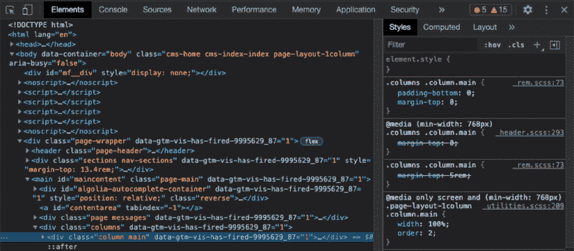
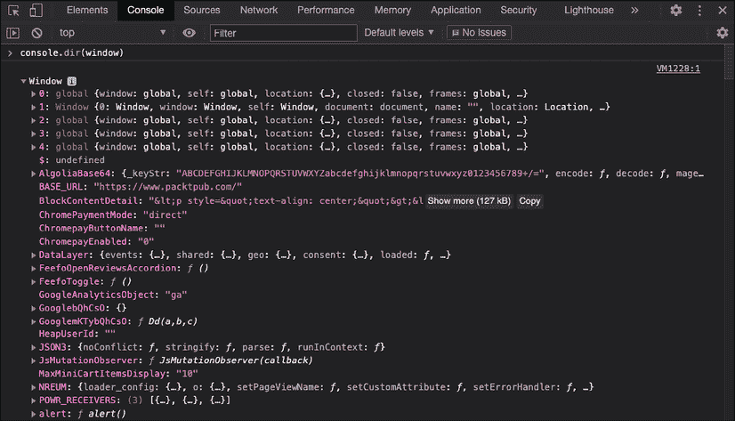
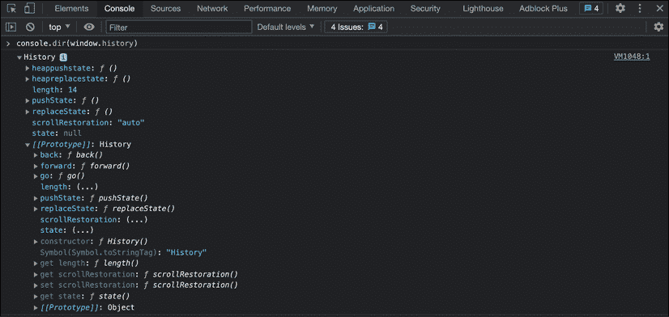
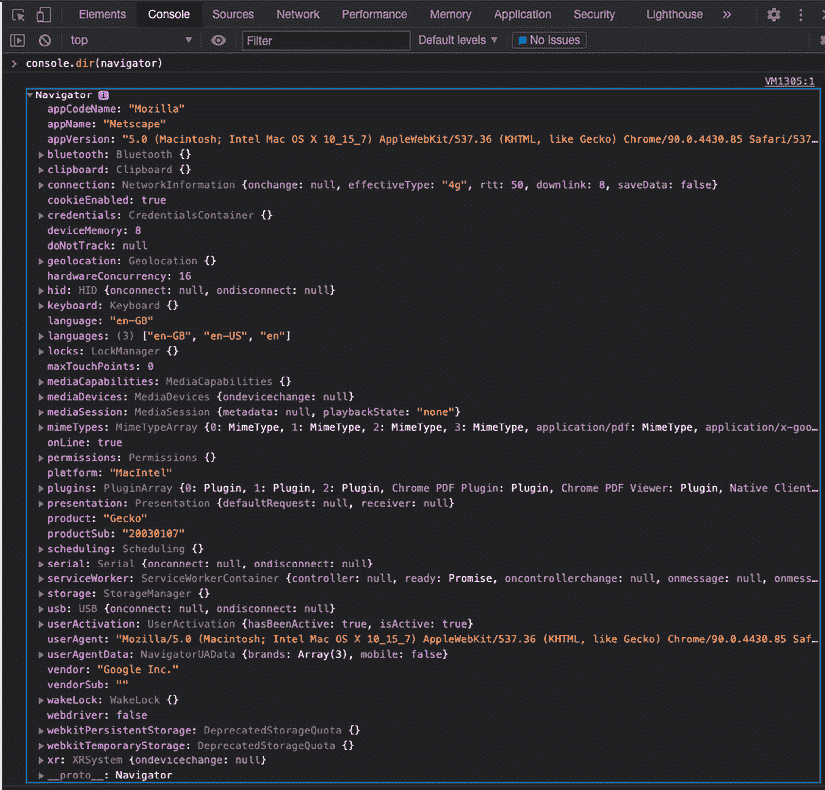
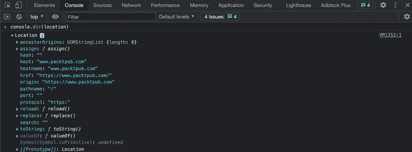
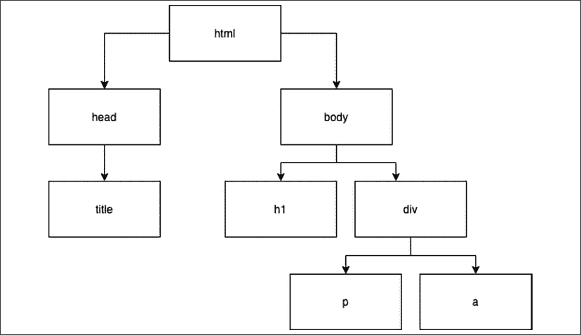
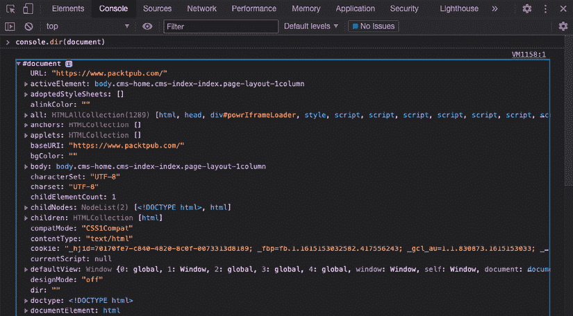

# 9

# 文档对象模型

**文档对象模型** (**DOM**) 比您最初听起来要有趣得多。在本章中，我们将向您介绍 DOM。这是您在网页上使用 JavaScript 之前需要理解的基本概念。它抓取一个 HTML 页面并将其转换为逻辑树。如果您不知道任何 HTML，不用担心。我们从 HTML 快速入门部分开始，如果您熟悉 HTML，可以跳过这一部分。

一旦我们确信我们对 HTML 知识有相同的理解，我们将向您介绍 **浏览器对象模型** (**BOM**)。BOM 包含 JavaScript 与浏览器交互的所有方法和属性。这是与之前访问的页面、浏览器窗口大小以及 DOM 相关的信息。

DOM 包含网页上的 HTML 元素。通过 JavaScript，我们可以选择和操作 DOM 的部分。这导致交互式网页而不是静态网页。所以，简而言之，能够与 DOM 一起工作意味着您能够创建交互式网页！

我们将涵盖以下主题：

+   HTML 快速入门

+   介绍 BOM

+   介绍 DOM

+   DOM 元素的类型

+   选择页面元素

我们可以想象您迫不及待地想要开始，所以让我们深入探讨吧。

注意：练习、项目和自我检查测验的答案可以在 *附录* 中找到。

# HTML 快速入门

**超文本标记语言** (**HTML**) 是塑造网页内容的语言。网络浏览器理解 HTML 代码并以我们习惯的格式展示它：网页。以下是一个非常基础的 HTML 示例：

```js
<!DOCTYPE html>
<html>
  <head>
    <title>Tab in the browser</title>
  </head>
  <body>
    <p>Hello web!</p>
  </body>
</html> 
```

这就是这个基本网页的外观：


图 9.1：基本网站

HTML 代码由元素组成。这些元素包含一个标签和属性。我们将在接下来的章节中解释这些基本概念。

## HTML 元素

如您所见，HTML 由 `<angle brackets>` 之间的单词组成，或元素。任何打开的元素都需要关闭。我们用 `<elementname>` 打开，用 `</elementname>` 关闭。

元素之间的所有内容都是该元素的一部分。在关闭方面有一些例外，但你会根据自己的进度遇到它们。在上一个示例中，我们有许多元素，包括这两个。这是一个带有 `body` 标签的元素，以及一个带有 `p` 标签的内部元素：

```js
 <body>
    <p>Hello web!</p>
  </body> 
```

因此，元素可以包含内部元素。只有当所有内部元素都已关闭时，元素才能关闭。以下是一个示例来演示这一点。以下是正确的方式：

```js
<outer>
  <sub>
    <inner>
    </inner>
  </sub>
</outer> 
```

而下面是错误的做法：

```js
<outer>
  <sub>
    <inner>
  </sub>
    </inner>
</outer> 
```

请注意，这些只是虚构的元素名称。在上一个示例中，我们在关闭 `inner` 元素之前关闭了 `sub`。这是错误的；您必须始终在关闭外部元素之前关闭内部元素。我们称内部元素为子元素，外部元素为父元素。以下是一些正确的 HTML：

```js
<body>
  <div>
    <p>
    </p>
  </div>
</body> 
```

这不是正确的 HTML，因为`div`在其内部元素`p`之前就关闭了：

```js
<body>
  <div>
    <p>
  </div>
    </p>
</body> 
```

不同的元素代表不同的布局部分。我们刚才看到的`p`代表段落。另一个常见的元素是`h1`，它代表一个大标题。更重要的是要了解每个 HTML 页面的三个主要构建元素。HTML 元素、head 元素和 body 元素。

在 HTML 元素中，所有的 HTML 都在这里发生。你的 HTML 页面中只能有一个这样的元素。它是外层元素，所有其他元素都包含在其中。它包含其他两个顶级元素：`head`和`body`。如果你对`head`和`body`的顺序感到困惑，只需想象一个人类；头部在身体之上。

在`head`元素中，我们安排了很多旨在为浏览器而非用户准备的事情。你可以想象一些元数据，比如哪些 JavaScript 脚本和哪些样式表需要包含，以及搜索引擎应该在搜索结果页面上使用什么作为描述。作为 JavaScript 开发者，我们实际上不会对 head 元素做很多操作，除了包含脚本。

这里是一个基本`head`元素的例子：

```js
<head>
    <title>This is the title of the browser tab</title>
    <meta name="description" content="This is the preview in google">
<script src="img/included.js"></script>
</head> 
```

`body`元素主要是将在网页上显示的内容。在 HTML 元素中只能有一个`body`元素。标题、段落、图片、列表、链接、按钮等等，都是我们可能在 body 中遇到元素。它们有自己的标签，例如，`img`用于图片，`a`用于链接。这里有一个包括 body 中常见标签的表格。这绝对不是一个详尽的列表。

| 开启标签 | 结束标签 | 描述 |
| --- | --- | --- |
| `<p>` | `</p>` | 用于创建一个段落。 |
| `<h1>` | `</h1>` | 用于创建一个标题；较小的标题是 h2 到 h6。 |
| `<span>` | `</span>` | 用于需要分离的内容的通用内联容器，例如，用于布局目的。 |
| `<a>` | `</a>` | 用于超链接。 |
| `<button>` | `</button>` | 用于按钮。 |
| `<table>` | `</table>` | 创建一个表格。 |
| `<tr>` | `</tr>` | 创建一个表格行，必须在表格内使用。 |
| `<td>` | `</td>` | 在行内创建一个表格数据单元格。 |
| `<ul>` | `</ul>` | 带有项目符号的无序列表，例如。 |
| `<ol>` | `</ol>` | 带有数字的有序列表。 |
| `<li>` | `</li>` | 有序和无序列表中的列表项。 |
| `<div>` | `</div>` | HTML 页面内的一个部分。它通常用作其他样式或部分的容器，并且可以很容易地用于特殊布局。 |
| `<form>` | `<form>` | 创建一个 HTML 表单。 |
| `<input>` | `</input>` | 创建一个用户可以输入信息的输入字段。这些可以是文本框、复选框、按钮、密码、数字、下拉菜单、单选按钮等等。 |
| `<input />` | 无 | 与 input 相同，但写成没有结束标签的形式，末尾的/使其自闭合。这仅适用于少数几个元素。 |
| `<br>` | 无 | 用于创建换行（转到新行）。它不需要结束标签，因此是一个例外。 |

你能弄清楚这个 HTML 示例的作用吗：

```js
<html>
<head>
    <title>Awesome</title>
</head>
<body>
    <h1>Language and awesomeness</h1>
    <table>
        <tr>
            <th>Language</th>
            <th>Awesomeness</th>
        </tr>
        <tr>
            <td>JavaScript</td>
            <td>100</td>
        </tr>
        <tr>
            <td>HTML</td>
            <td>100</td>
        </tr>
    </table>
</body>
</html> 
```

它创建了一个网页，在标签标题中显示`Awesome`。在页面上，有一个大标题写着`Language and awesomeness`。然后有一个包含三行两列的表格。第一行包含标题`Language`和`Awesomeness`。第二行包含值`JavaScript`和`100`，第三行包含值`HTML`和`100`。

## HTML 属性

在本快速入门课程的最后部分，我们将讨论 HTML 属性。属性会影响它们指定的元素。它们存在于指定的元素内部，并使用等号赋值。例如，`a`（表示超链接）的属性是`href`。这指定了链接将重定向到何处：

```js
<a href="https://google.com">Ask Google</a> 
```

这显示了一个带有文本`Ask Google`的链接。当你点击它时，你将被发送到 Google，这可以通过`href`属性的值来判断。这修改了`a`元素。属性有很多，但就目前而言，你只需要知道它们会修改指定的元素。

这里有一个表格，概述了开始使用 HTML 和 JavaScript 时最重要的属性。为什么这些属性很重要将在下一章中展开。

| 属性名称 | 描述 | 可以用于哪些元素？ |
| --- | --- | --- |
| `id` | 给元素赋予一个唯一的 ID，例如`age`。 | 所有元素 |
| `name` | 用于给元素指定一个自定义名称。 | `input`、`button`、`form`以及我们尚未见过的许多元素 |
| `class` | 可以添加到元素中的特殊元数据。这可能导致特定的布局或 JavaScript 操作。 | 几乎所有在`body`内部的元素 |
| `value` | 设置添加到元素中的初始值。 | `button`、`input`、`li`以及我们尚未见过的几个元素 |
| `style` | 给添加到其中的 HTML 元素指定一个布局。 | 所有元素 |

当你需要它们来练习你的 JavaScript 魔法时，我们将向你介绍其他属性。

好的，这可能是其中较为简短的 HTML 快速入门课程之一。有许多优秀的资源可以找到更多信息。如果你现在需要更多信息或解释，创建并打开一个如下所示的 HTML 文件，然后继续学习！

```js
<!DOCTYPE html >
<html>
<body>
    <a href="https://google.com">Ask google</a>
</body>
</html> 
```

我们现在将接着查看 BOM 及其不同部分。

# BOM

BOM，有时也称为**窗口浏览器对象**，是一个神奇的“魔法”元素，使得你的 JavaScript 代码能够与浏览器进行通信。

窗口对象包含表示浏览器窗口所需的所有属性，例如窗口的大小和之前访问的网页的历史记录。窗口对象具有全局变量和函数，我们可以在探索窗口对象时看到它们。BOM 的确切实现取决于浏览器和浏览器的版本。在浏览这些部分时，这一点很重要要记住。

本章我们将探讨 BOM 的一些最重要的对象：

+   历史

+   导航器

+   位置

除了前面提到的有用对象外，我们还将更详细地考虑 DOM。但首先，我们可以探索 BOM，并使用命令`console.dir(window)`查看其对象。我们将在浏览器控制台中输入这个命令。让我们先讨论如何到达那里。

如果我们转到浏览器检查面板，我们可以访问 HTML 元素和 JavaScript。到达那里的方式略有不同，但通常在浏览器中按`F12`按钮或右键单击你想要查看控制台的网站，然后单击**Inspect element**或 macOS 设备上的**Inspect**。

你应该会看到一个侧边面板（或者如果你已经更改了设置，则是一个单独的窗口）弹出。



图 9.2：在浏览器中检查页面

导航到上面的图像中紧邻**Elements**标签旁边的**Console**标签。你可以输入以下命令并按`Enter`键以获取有关窗口对象的信息：

```js
console.dir(window); 
```

此命令将产生如下视图：



图 9.3：console.dir(window)的部分输出，显示了窗口浏览器对象

`console.dir()`方法显示指定对象的所有属性列表。你可以点击小三角形来打开对象并进一步检查它们。

BOM 包含许多其他对象。我们可以像处理对象时那样访问它们，例如，我们可以通过访问窗口的`history`对象以及`history`对象的长度的方式来获取历史记录的长度（在我的浏览器中），如下所示：

```js
window.history.length; 
```

练习之后，我们将更多地了解`history`对象。

## 练习 9.1

1.  返回你刚刚查看的网站并执行命令`console.dir(window)`。

1.  你能找到嵌套在`window`对象中的`document`对象吗？在控制台中的`window`对象根目录下，你可以导航到名为`document`的对象。

1.  你能找到窗口的高度和宽度（以像素为单位）吗？你可以返回内窗口和外窗口。

## 窗口历史对象

窗口浏览器对象还包含一个`history`对象。实际上，这个对象可以不使用`window`前缀来编写，因为它已经被设置为全局可用，所以我们可以通过在控制台中使用`console.dir(window.history)`或简单地使用`console.dir(history)`命令来获取相同的对象：



图 9.4：历史对象

这个对象实际上是你用来返回上一个页面的。它有一个内置的`go`函数用于这个目的。当你执行这个命令时会发生什么？

```js
window.history.go(-1); 
```

你可以自己在浏览器控制台中尝试一下（确保你在那个标签页中访问了多个页面）。

## 窗口`navigator`对象

在我们刚才看到的窗口对象中，有一个`navigator`属性。这个属性特别有趣，因为它包含了关于我们使用的浏览器的信息，比如它是哪个浏览器，我们使用的是哪个版本，以及浏览器运行在什么操作系统上。

这对于为某些操作系统定制网站很有用。想象一下，一个按钮在不同的操作系统（Windows、Linux 和 macOS）上会有不同的样子。

你可以使用以下命令在控制台中探索它：

```js
console.dir(window.navigator); 
```

如你所见，我们首先访问的是窗口，因为`navigator`是`window`对象的一个对象。所以它是`window`对象的一个属性，我们用点号来指定。换句话说，我们以访问任何其他对象的方式访问这些`window`对象。但是，在这种情况下，由于`navigator`也是全局可用的，我们也可以使用这个命令在不带`window`前缀的情况下访问它：

```js
console.dir(navigator); 
```

这里是`navigator`对象可能的样子：



图 9.5：`navigator`对象

## 窗口位置对象

`window`对象的另一个相当有趣且独特的属性是`location`对象。它包含了当前网页的 URL。如果你覆盖（部分）这个属性，你会强制浏览器跳转到新页面！具体如何操作因浏览器而异，但下一项练习将指导你完成这个过程。

`location`对象包含一些属性。你可以在控制台中使用`console.dir(window.location)`或`console.dir(location)`来查看它们。输出将如下所示：



图 9.6：`location`对象

`location`对象上有许多对象，就像我们之前看到的那些一样。我们可以使用点符号（就像我们之前看到的对象一样）来访问嵌套的对象和属性。所以，例如，在这个浏览器中，我可以输入以下内容：

```js
location.ancestorOrigins.length; 
```

这将获取`ancestorOrigins`对象的长度，它表示我们的页面与多少个浏览上下文相关联。这可以用来确定网页是否在一个意外的上下文中被框架化。不过，并不是所有的浏览器都有这个对象；再次强调，BOM 及其所有元素在每个浏览器中都是不同的。

按照实践练习中的步骤，自己尝试这样的魔法。

### 实践练习 9.2

通过 `window` 对象遍历到 `location` 对象，然后输出当前文件的 `protocol` 和 `href` 属性的值到控制台。

# DOM

DOM 实际上并不复杂，理解起来。它是一种将 HTML 文档的结构以逻辑树的形式显示出来的方式。这是由于一个非常重要的规则，即内部元素必须在外部元素关闭之前关闭。

这里是一个 HTML 片段：

```js
<html>
  <head>
    <title>Tab in the browser</title>
  </head>
  <body>
    <h1>DOM</h1>
    <div>
      <p>Hello web!</p>
      <a href="https://google.com">Here's a link!</a>
    </div>
  </body>
</html> 
```

以下是将其转换为树形结构的方法：



图 9.7：非常基本的网页 DOM 的树结构

如你所见，最外层的元素 **html** 位于树的顶部。下一层 **head** 和 **body** 是它的子元素。**head** 只有一个子元素：**title**。**body** 有两个子元素：**h1** 和 **div**。而 **div** 有两个子元素：**p** 和 **a**。这些通常用于段落和链接（或按钮）。显然，复杂的网页有复杂的树。这个逻辑树和一系列额外的属性构成了网页的 DOM。

一个真实网页的 DOM 无法在这个书的页面上显示。但如果你能在脑海中画出这样的树，这将很快大有帮助。

## 额外的 DOM 属性

我们可以像检查其他对象一样检查 DOM。我们在网站的控制台中执行以下命令（再次强调，`document` 对象是全局可访问的，因此通过 `window` 对象访问它是可能的，但不是必需的）：

```js
console.dir(document); 
```

在这种情况下，我们想查看代表 DOM 的 `document` 对象：



图 9.8：DOM

你真的不需要理解你在这里看到的一切，但它显示了众多内容，其中包括 HTML 元素和 JavaScript 代码。

太好了，现在你已经掌握了 BOM 的基础知识，以及与我们最相关的子对象 DOM。我们之前已经看到了 DOM 的许多属性。对我们来说，查看 DOM 中的 HTML 元素最为相关。DOM 包含了网页上的所有 HTML 元素。

这些 DOM 元素的基本知识，结合一些操作和探索 DOM 的知识，将开启许多可能性。

在下一章中，我们将专注于遍历 DOM、在 DOM 中查找元素以及操作 DOM。我们将编写的代码将真正开始看起来像真正的项目。

## 选择页面元素

`document` 对象包含许多属性和方法。为了在页面上处理元素，你首先必须找到它们。如果你需要更改某个段落的值，你必须先获取这个段落。我们称之为选择段落。选择之后，我们就可以开始修改它了。

要在您的 JavaScript 代码中选择的页面元素以及为了操作元素，您可以使用 `querySelector()` 或 `querySelectorAll()` 方法。这两个方法都可以用来通过标签名、ID 或类选择页面元素。

`document.querySelector()` 方法将返回文档中第一个匹配指定选择器的元素。如果没有找到匹配的页面元素，则返回结果 `null`。要返回多个匹配元素，可以使用 `document.querySelectorAll()` 方法。

`querySelectorAll()` 方法将返回一个静态的 `NodeList`，它表示与指定选择器组匹配的文档元素列表。我们将通过以下 HTML 片段演示 `querySelector()` 和 `querySelectorAll()` 的用法：

```js
<!doctype html>
<html>
  <head>
    <title>JS Tester</title>
  </head>
  <body>
    <h1 class="output">Hello World</h1>
    <div class="output">Test</div>
  </body>
</html> 
```

我们将使用 `querySelector()` 选择 `h1` 元素。因此，如果有多个，它只会获取第一个：

```js
const ele1 = document.querySelector("h1");
console.dir(ele1); 
```

如果您想选择多个元素，可以使用 `querySelectorAll()`。此方法将返回一个数组中匹配选择器的所有元素。在这个例子中，我们将查找 `output` 类的实例，这是通过在类名前加一个点来完成的。

```js
const eles = document.querySelectorAll(".output");
console.log(eles); 
```

选择后，你可以开始使用 DOM 的动态特性：你可以使用 JavaScript 操作元素。内容可以像变量内容一样更改，元素可以被删除或添加，样式可以调整。所有这些都可以使用 JavaScript 和用户与页面交互的方式来实现。我们已经在这里看到了 DOM 中两种最常见的选择方法，`querySelector()` 和 `querySelectorAll()`。实际上，你可以使用这些方法选择任何你可能需要的元素。还有更多，你将在下一章中遇到，以及许多 DOM 可以被操作的方式。

## 练习 9.3

选择页面元素并更新内容、更改样式和添加属性。使用以下代码模板创建一个包含具有 `output` 类的页面元素的 HTML 文件：

```js
<!DOCTYPE html >
<html>
<div class="output"></div>
    <script>
    </script>
</html> 
```

在 `script` 标签内，对输出元素进行以下更改：

1.  将页面元素作为 JavaScript 对象选择。

1.  更新所选页面元素的 `textContent` 属性。

1.  使用 `classList`.`add` 对象方法，将 `red` 类添加到元素上。

1.  将元素的 `id` 属性更新为 `tester`。

1.  通过 `style` 对象，将 `backgroundColor` 属性设置为 `red` 添加到页面元素上。

1.  通过 `document.URL` 获取文档 URL 并更新输出元素的文本，使其包含文档 URL 的值。您可以先在控制台中记录它，以确保您有正确的值。

# 章节项目

## 使用 JavaScript 操作 HTML 元素

以下是一个 HTML 代码示例：

```js
<div class="output">
    <h1>Hello</h1>
    <div>Test</div>
    <ul>
        <li id="one">One</li>
        <li class="red">Two</li>
    </ul>
    <div>Test</div>
</div> 
```

采取以下步骤（并进一步实验）来了解如何使用 JavaScript 代码操作 HTML 元素。

1.  选择具有 `output` 类的元素。

1.  创建另一个名为 `mainList` 的 JavaScript 对象，并仅选择 `output` 元素内的 `ul` 标签。更新该 `ul` 标签的 ID 为 `mainList`。

1.  搜索每个 `div` 的 `tagName`，并将它们作为数组输出到控制台。

1.  使用 `for` 循环，将每个 `div` 标签的 ID 设置为 `id`，其数值表示它们在输出中的出现顺序。仍然在循环中，交替更改 `output` 中每个元素的背景颜色为红色或蓝色。

# 自我检查测验

1.  前往你最喜欢的网站并打开浏览器控制台。输入 `document.body`。你在控制台中看到了什么？

1.  如我们所知，对于对象，我们可以使用赋值运算符写入属性值并分配新值。更新你选择的网页上 `document.body` 对象的 `textContent` 属性，使其包含字符串 `Hello World`。

1.  使用我们关于对象的知识来列出 BOM 对象的属性和值。尝试在 `document` 对象上操作。

1.  现在为 `window` 对象做同样的操作。

1.  创建一个包含 `h1` 标签的 HTML 文件。使用 JavaScript 选择带有 `h1` 标签的页面元素，并将该元素赋值给一个变量。更新该变量的 `textContent` 属性为 `Hello World`。

# 摘要

我们从 HTML 的基础知识开始本章。我们了解到 HTML 由元素组成，这些元素可以包含其他元素。元素有一个标签指定它们的类型，并且它们可以有属性来改变元素或向元素添加一些元数据。这些属性可以被 JavaScript 使用。

我们然后查看 BOM，它代表正在使用的浏览器窗口，并包含其他对象，如 `history`、`location`、`navigator` 和 `document` 对象。`document` 对象被称为 DOM，你很可能会与之交互。文档包含网页的 HTML 元素。

我们还开始考虑如何选择文档元素并使用这些元素来操作网页。这是我们将在下一章继续探索的内容！
