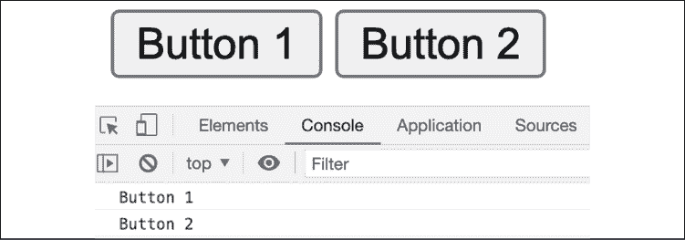
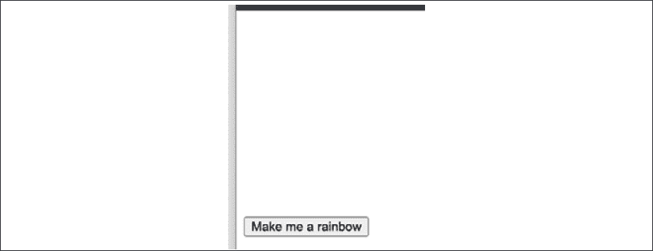
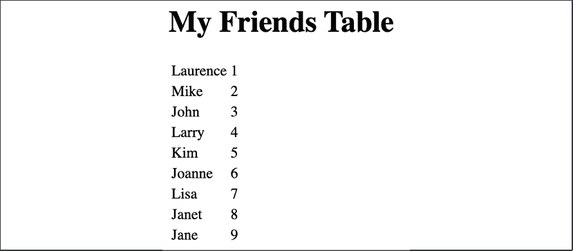

# 10

# 使用 DOM 进行动态元素操作

学习上一章的困难概念将在本章中得到回报。我们将把我们的 DOM 知识再向前迈进一步，学习如何使用 JavaScript 操作页面上的 DOM 元素。首先，我们需要学习如何导航 DOM 并选择我们想要的元素。我们将学习我们如何添加和更改属性和值，以及如何向 DOM 添加新元素。

你还将学习如何给元素添加样式，这可以用来使项目出现和消失。然后我们将向你介绍事件和事件监听器。我们将从简单开始，但到本章结束时，你将能够以多种方式操作网页，并且你将拥有创建基本 Web 应用的知识。掌握这项技能后，天空就是极限。

在旅途中，我们将涵盖以下主题：

+   基本 DOM 遍历

+   访问 DOM 中的元素

+   元素点击处理器

+   这和 DOM

+   操作元素样式

+   更改元素的类

+   操作属性

+   元素上的事件监听器

+   创建新元素

注意：练习、项目和自我检查测验的答案可以在*附录*中找到。

我们已经学到了很多关于 DOM 的知识。为了与我们的网页交互并创建动态网页，我们必须将我们的 JavaScript 技能与 DOM 连接起来。

# 基本 DOM 遍历

我们可以使用我们在上一章中看到的`document`对象来遍历 DOM。这个文档对象包含所有 HTML，是网页的表示。遍历这些元素可以让你到达需要操作的元素。

这不是最常见的方法，但这将有助于你理解它的工作原理。有时，你可能实际上需要这些技术。只是不要慌张：还有其他方法可以做到这一点，它们将在本章中揭晓！

即使对于简单的 HTML 片段，也已经存在多种遍历 DOM 的方法。让我们在我们的 DOM 中寻找宝藏。我们从这个小小的 HTML 片段开始：

```js
<!DOCTYPE html>
<html>
  <body>
    <h1>Let's find the treasure</h1>
    <div id="forest">
      <div id="tree1">
        <div id="squirrel"></div>
        <div id="flower"></div>
      </div>
      <div id="tree2">
        <div id="shrubbery">
          <div id="treasure"></div>
        </div>
        <div id="mushroom">
          <div id="bug"></div>
        </div>
      </div>
    </div>
  </body>
</html> 
```

我们现在想要遍历这个片段的 DOM 以找到宝藏。我们可以通过进入文档对象并从那里开始导航来实现这一点。在浏览器控制台中做这个练习最容易，因为这样你将直接获得关于你在 DOM 中的位置的反馈。

我们可以从文档的`body`属性开始。这包含`body`元素内部的所有内容。在控制台中，我们将输入：

```js
console.dir(document.body); 
```

我们应该得到一个非常长的对象。从该对象到我们的宝藏有几种方法。为了做到这一点，让我们讨论一下子元素和`childNodes`属性。

`childNodes`比`children`更完整。`children`只包含所有 HTML 元素，所以实际上是节点。`childNodes`还包含文本节点和注释。然而，使用`children`，你可以使用 ID，因此它们更容易使用。

要使用子元素到达宝藏，你必须使用：

```js
console.dir(document.body.children.forest.children.tree2.children.shrubbery.children.treasure); 
```

如你所见，在每一个我们选择的元素上，我们都需要再次选择子元素。所以，首先，我们从 body 中获取子元素，然后从这些子元素中选择`forest`。然后从`forest`中，我们想要再次获取其子元素，然后从这些子元素中选择`tree2`。从`tree2`中，我们想要再次获取子元素，从这些子元素中我们需要`shrubbery`。然后最终，我们可以从`shrubbery`中获取子元素并选择`treasure`。

要使用`childNodes`到达宝藏，你将不得不经常使用你的控制台，因为文本和注释节点也包含在其中。`childNodes`是一个数组，所以你必须选择正确的索引来选择正确的子节点。这里有一个优势：它要短得多，因为你不需要单独选择名称。

```js
console.dir(document.body.childNodes[3].childNodes[3].childNodes[1].childNodes[1]); 
```

你也可以将它们组合起来：

```js
console.dir(document.body.childNodes[3].childNodes[3].childNodes[1].children.treasure); 
```

遍历文档的方法有很多。根据你的需求，你可能需要使用一种特定的方法。对于需要 DOM 遍历的任务，通常情况下，如果它有效，它就是一个好的解决方案。

到目前为止，我们看到了如何向下移动 DOM，但我们也可以向上移动。每个元素都知道它的父元素。我们可以使用`parentElement`属性向上移动。例如，如果我们使用宝藏 HTML 示例并在控制台中输入以下内容：

```js
document.body.children.forest.children.tree2.parentElement; 
```

我们回到了`forest`，因为它是`tree2`的父元素。这可以非常有用，特别是当与`getElementById()`等函数结合使用时，我们将在后面更详细地看到。

我们不仅可以上下移动，还可以左右移动。例如，如果我们这样选择`tree2`：

```js
document.body.children.forest.children.tree2; 
```

我们可以通过以下方式到达`tree1`：

```js
document.body.children.forest.children.tree2.previousElementSibling; 
```

并且从`tree1`我们可以通过以下方式到达`tree2`：

```js
document.body.children.forest.children.tree1.nextElementSibling; 
```

作为`nextElementSibling`的替代方案，后者返回下一个元素节点，你可以使用`nextSibling`，它将返回任何类型的下一个节点。

## 练习 10.1

在这个练习中，尝试遍历 DOM 层次结构。你可以使用这个示例 HTML 网站：

```js
<!doctype html>
<html><head><title>Sample Webpage</title></head>
<body>
    <div class="main">
        <div>
            <ul >
                <li>One</li>
                <li>Two</li>
                <li>Three</li>
            </ul>
        </div>
        <div>blue</div>
        <div>green</div>
        <div>yellow</div>
        <div>Purple</div>
    </div>
</body>
</html> 
```

采取以下步骤：

1.  创建并打开上面的示例网页，或者访问你喜欢的网站，并在控制台中通过`console.dir(document)`打开文档主体。

1.  在`body.children`属性中，选择一些子元素。查看它们如何与页面内容匹配。

1.  导航到并输出控制台中的下一个节点或元素。

## 将元素作为对象选择

现在我们知道了如何遍历 DOM，我们可以对元素进行更改。与其使用`console.dir()`，我们只需输入我们想要更改的元素路径。现在我们有了这个元素的 JavaScript 对象，我们可以更改其所有属性。让我们用一个更简单的 HTML 页面来做这个例子。

```js
<!DOCTYPE html>
<html>
  <body>
    <h1>Welcome page</h1>
    <p id="greeting">
      Hi!
    </p>
  </body>
</html> 
```

我们可以通过以下代码遍历到`p`元素，例如：

```js
document.body.children.greeting; 
```

这使我们能够直接操作元素的属性和元素本身！让我们在下一节中执行这种新获得的力量。

### 改变 innerText

`innerText`属性关注元素的开头和结尾之间的文本，如下所示：

```js
<element>here</element> 
```

返回的值将是纯文本 `here`。例如，如果我们去控制台并输入：

```js
document.body.children.greeting.innerText = "Bye!"; 
```

页面上显示的消息立即从 `Hi!` 变为 `Bye!`。`innerText` 返回元素的纯文本内容，在这种情况下没有问题，因为里面只有文本。然而，如果你需要选择元素内的任何 HTML，或者你想添加 HTML，你不能使用这种方法。它将 HTML 解释为文本，并将其直接输出到屏幕上。所以如果我们执行以下操作：

```js
document.body.children.greeting.innerText = "<p>Bye!</p>"; 
```

它将在屏幕上输出 `<p>Bye!</p>`，包括其周围的 HTML，就像它是一个文本字符串一样。为了解决这个问题，你需要使用 `innerHTML`。

### 更改 innerHTML

如果你不仅想处理纯文本，或者可能想用你的值指定一些 HTML 格式，你可以使用 `innerHTML` 属性。这个属性不仅处理纯文本，还可以处理内联 HTML 元素：

```js
document.body.children.greeting.innerHTML = "<b>Bye!</b>"; 
```

这将在屏幕上以粗体显示 **Bye!**，考虑到 `b` 元素而不是简单地将其作为单个字符串值打印出来。

你已经承诺过，你可以以比遍历 DOM 更方便的方式访问元素。让我们在下一节中看看具体是如何做到的。

# 在 DOM 中访问元素

从 DOM 中选择元素有多种方法。在获取元素后，我们能够修改它们。在接下来的章节中，我们将讨论如何通过 ID、标签名、类名和 CSS 选择器获取元素。

我们将使用内置方法来遍历 DOM 并返回符合指定条件的元素，而不是像我们刚才那样逐个遍历。

我们将使用以下 HTML 片段作为示例：

```js
<!DOCTYPE html>
<html>
  <body>
    <h1>Just an example</h1>
    <div id="one" class="example">Hi!</div>
    <div id="two" class="example">Hi!</div>
    <div id="three" class="something">Hi!</div>
  </body>
</html> 
```

让我们从通过 ID 访问元素开始。

## 通过 ID 访问元素

我们可以使用 `getElementById()` 方法通过 ID 获取元素。这个方法返回一个具有指定 ID 的元素。ID 应该是唯一的，因为 HTML 文档只会返回一个结果。对于有效的 ID 没有多少规则；它们不能包含空格，并且至少要有一个字符。与变量命名的约定一样，最好使其描述性，并避免使用特殊字符。

如果我们想立即选择具有 ID 为 `two` 的元素，我们可以使用：

```js
document.getElementById("two"); 
```

这将返回完整的 HTML 元素：

```js
<div id="two" class="example">Hi!</div> 
```

再次强调，如果你有多个具有相同 ID 的元素，它只会返回它遇到的第一个。尽管如此，你应该避免在代码中出现这种情况。

这就是包含在 HTML 页面中的完整文件的样子，而不是简单地查询浏览器控制台：

```js
<html>
  <body>
    <h1 style="color:pink;">Just an example</h1>
    <div id="one" class="example">Hi!</div>
    <div id="two" class="example">Hi!</div>
    <div id="three" class="something">Hi!</div>
  </body>
  <script>
    console.log(document.getElementById("two"));
  </script>
</html> 
```

在这种情况下，它将在控制台中记录具有 `id="two"` 的完整 HTML `div`。

### 练习 10.2

尝试通过 ID 获取元素进行实验：

1.  创建一个 HTML 元素并在元素属性中分配一个 ID。

1.  使用其 ID 选择页面元素。

1.  将选定的页面元素输出到控制台。

## 通过标签名访问元素

如果我们通过标签名请求元素，我们将得到一个数组作为结果。这是因为可能有多个具有相同标签名的元素。它将是一个 HTML 元素集合，或 `HTMLCollection`，这是一个特殊的 JavaScript 对象。它基本上只是一个节点列表。在控制台中执行以下命令：

```js
document.getElementsByTagName("div"); 
```

它将返回：

```js
HTMLCollection(3) [div#one.example, div#two.example, div#three.something, one: div#one.example, two: div#two.example, three: div#three.something] 
```

如您所见，所有具有 `div` 标签的 DOM 元素都被返回。您可以从语法中读取 ID 和类。集合中的前几个是对象：`div` 是名称，`#` 指定 ID，`.` 指定类。如果有多个点，则表示有多个类。然后您可以看到元素再次（`namedItems`），这次作为键值对，其中 ID 作为键。

我们可以使用 `item()` 方法通过索引访问它们，如下所示：

```js
document.getElementsByTagName("div").item(1); 
```

这将返回：

```js
<div id="two" class="example">Hi!</div> 
```

我们也可以通过名称使用 `namedItem()` 方法访问它们，如下所示：

```js
document.getElementsByTagName("div").namedItem("one"); 
```

这将返回：

```js
<div id="one" class="example">Hi!</div> 
```

当只有一个匹配项时，它仍然会返回一个 `HTMLCollection`。只有一个 `h1` 标签，所以让我们演示这种行为：

```js
document.getElementsByTagName("h1"); 
```

这将输出：

```js
HTMLCollection [h1] 
```

由于 `h1` 没有 ID 或类，它只是 `h1`。而且因为它没有 ID，所以它不是 `namedItem`，并且只出现一次。

### 练习 10.3

使用 JavaScript 通过标签名选择页面元素：

1.  首先，创建一个简单的 HTML 文件。

1.  使用相同的标签创建三个 HTML 元素。

1.  在每个元素中添加一些内容，以便您可以区分它们

1.  将一个脚本元素添加到您的 HTML 文件中，并在其中通过标签名选择页面元素并将它们存储在变量中作为一个数组

1.  使用索引值选择中间元素并将其输出到控制台。

## 通过类名访问元素

我们可以为类名做类似的事情。在我们的示例 HTML 中，我们有两个不同的类名：`example` 和 `something`。如果您通过类名获取元素，它将返回一个包含结果的 `HTMLCollection`。以下将获取所有具有类 `example` 的元素：

```js
document.getElementsByClassName("example"); 
```

这将返回：

```js
HTMLCollection(2) [div#one.example, div#two.example, one: div#one.example, two: div#two.example] 
```

如您所见，它只返回了具有 `example` 类的 `div` 标签。它忽略了具有 `something` 类的 `div`。

### 练习 10.4

使用元素的类名选择所有匹配的页面元素。

1.  创建一个简单的 HTML 文件进行工作。

1.  添加三个 HTML 元素，并为每个元素添加相同的类。只要包含相同的元素类，您可以使用不同的标签。在每个元素中添加一些内容，以便您可以区分它们。

1.  将一个脚本元素添加到您的文件中，并在其中通过类名选择页面元素。将结果 `HTMLCollection` 值分配给一个变量。

1.  您可以使用索引值来选择单个 `HTMLCollection` 元素，就像您选择数组元素一样。从索引 0 开始，选择具有类名的页面元素，并将该元素输出到控制台。

## 通过 CSS 选择器访问元素

我们也可以使用 CSS 选择器来访问元素。我们使用`querySelector()`和`querySelectorAll()`来完成。然后我们给出 CSS 选择器作为参数，这将过滤 HTML 文档中的项目，并只返回满足 CSS 选择器的那些。

CSS 选择器可能看起来与你的第一印象略有不同。我们不是在寻找某种布局，而是使用与我们要为某些元素指定布局时相同的语法。我们还没有讨论这个问题，所以我们将在这里简要介绍。

如果我们声明`p`作为 CSS 选择器，这意味着所有标签为`p`的元素。这看起来可能是这样的：

```js
document.querySelectorAll("p"); 
```

如果我们说`p.example`，这意味着所有具有`example`类的`p`标签元素。它们也可以有其他类；只要`example`在其中，就会匹配。我们也可以说`#one`，这意味着选择所有 ID 为`one`的元素。

这种方法与`getElementById()`的结果相同。当你只需要通过 ID 选择时，选择哪一个只是口味问题——这是一个与另一位开发者讨论的绝佳话题。`querySelector()`允许进行更复杂的查询，一些开发者会声称`getElementById()`更易读。其他人会声称你可以在任何地方使用`querySelector()`以保持一致性。这在这个阶段并不重要，但尽量保持一致。

目前不必过于担心所有这些选项；有很多，当你需要时你会弄清楚。这就是如何在 JavaScript 中使用 CSS 选择器。

### 使用`querySelector()`

第一个选项将选择与查询匹配的第一个元素。所以，在控制台中输入以下内容，仍然使用本节开头介绍的 HTML 片段：

```js
document.querySelector("div"); 
```

应该返回：

```js
<div id="one" class="example">Hi!</div> 
```

它只返回第一个`div`，因为那是它遇到的第一个。我们也可以要求一个具有类`.something`的元素。如果你还记得，我们使用点符号来选择类，如下所示：

```js
document.querySelector(".something"); 
```

这将返回：

```js
<div id="three" class="something">Hi!</div> 
```

使用这种方法，你只能使用有效的 CSS 选择器：元素、类和 ID。

#### 练习第 10.5 节练习题

使用`querySelector()`来启用单个元素选择：

1.  创建另一个简单的 HTML 文件。

1.  创建四个 HTML 元素，并为每个元素添加相同的类。只要元素属性中有类，它们可以有不同的标签名。

1.  在每个元素中添加一些内容，以便你可以区分它们。

1.  在一个脚本元素中，使用`querySelector()`来选择具有该类的第一个元素，并将其存储在一个变量中。如果`querySelector()`中有多个匹配结果，它将返回第一个。

1.  将元素输出到控制台。

### 使用`querySelectorAll()`

有时候，只返回第一个实例是不够的，但你想选择所有匹配查询的元素。例如，当你需要获取所有输入框并将它们清空时。这可以通过`querySelectorAll()`来完成：

```js
document.querySelectorAll("div"); 
```

这将返回：

```js
NodeList(3) [div#one.example, div#two.example, div#three.something] 
```

如您所见，它是一个对象类型 `NodeList`。它包含所有匹配 CSS 选择器的节点。我们可以使用 `item()` 方法通过索引获取它们，就像我们对 `HTMLCollection` 所做的那样。

#### 练习 10.6

使用 `querySelectorAll()` 在 HTML 文件中选取所有匹配的元素：

1.  创建一个 HTML 文件，并添加四个 HTML 元素，给每个元素添加相同的类。

1.  在每个元素中添加一些内容，以便您能够区分它们。

1.  在脚本元素内部，使用 `querySelectorAll()` 选取具有该类的所有匹配元素，并将它们存储在一个变量中。

1.  首先将所有元素输出到控制台，然后通过循环逐个输出。

# 元素点击处理程序

HTML 元素在被点击时可以执行某些操作。这是因为可以将 JavaScript 函数连接到 HTML 元素。以下是一个片段，其中指定了与元素关联的 JavaScript 函数：

```js
<!DOCTYPE html>
<html>
  <body>
    <div id="one" onclick="alert('Ouch! Stop it!')">Don't click here!</div>
  </body>
</html> 
```

当 `div` 中的文本被点击时，会弹出一个包含文本 `Ouch! Stop it!` 的弹出窗口。在这里，JavaScript 是直接在 `onclick` 后指定的，但如果页面上有 JavaScript，您也可以像这样引用那个 JavaScript 中的函数：

```js
<!DOCTYPE html>
<html>
  <body>
    <script>
      function stop(){
        alert("Ouch! Stop it!");
      }
    </script>
    <div id="one" onclick="stop()">Don't click here!</div>
  </body>
</html> 
```

此代码执行的是完全相同的事情。正如您所想象的，对于更大的函数，这会是一个更好的实践。HTML 也可以引用加载到页面中的脚本。

也有一种方法可以使用 JavaScript 添加点击处理程序。我们选择要添加点击处理程序的 HTML 元素，并指定 onclick 属性。

这里是一个 HTML 片段：

```js
<!DOCTYPE html>
<html>
  <body>
    <div id="one">Don't click here!</div>
  </body>
</html> 
```

如果您点击它，此时代码不会执行任何操作。如果我们想动态地向 `div` 元素添加点击处理程序，我们可以选择它并通过控制台指定属性：

```js
document.getElementById("one").onclick = function () {alert("Auch! Stop!"); 
} 
```

由于这是在控制台中添加的，所以当您刷新页面时，此功能将消失。

# 这和 DOM

`this` 关键字始终具有相对意义；它取决于它所在的上下文。在 DOM 中，特殊的 `this` 关键字指向它所属的 DOM 元素。如果我们指定一个 `onclick` 并将 `this` 作为参数发送，它将发送 `onclick` 所在的元素。

```js
script tag:
```

```js
<!DOCTYPE html>
<html>
  <body>
    <script>
      function reveal(el){
        console.log(el);
      }
    </script>
    <button onclick="reveal(this)">Click here!</button>
  </body>
</html> 
```

这就是它将记录的内容：

```js
<button onclick="reveal(this)">Click here!</button> 
```

如您所见，它记录了它所在的元素，即 `button` 元素。

我们可以使用类似这样的函数来访问 `this` 的父级：

```js
function reveal(el){
    console.log(el.parentElement);
} 
```

在上面的例子中，body 是按钮的父级。因此，如果我们用新函数点击按钮，它将输出：

```js
<body>
    <script>
      function reveal(el.parentElement){
        console.log(el);
      }
    </script>
    <button onclick="reveal(this)">Click here!</button>
  </body> 
```

我们可以用同样的方式输出元素的任何其他属性；例如，`console.log(el.innerText);` 会打印出我们在 *更改 innerText* 部分看到的内部文本值。

因此，`this` 关键字是指向元素，并且我们可以像我们刚刚学习的那样从这个元素遍历 DOM。这可以非常有用，例如，当您需要获取输入框的值时。如果您发送 `this`，那么您可以读取和修改触发函数的元素的属性。

## 练习 10.7

在一个基本的 HTML 文档中创建一个按钮，并添加 `onclick` 属性。示例将演示如何使用 `this` 引用对象数据：

1.  在你的 JavaScript 代码中创建一个处理点击的函数。你可以将函数命名为 `message`。

1.  在 `onclick` 函数参数中添加此，使用 `this` 发送当前元素对象数据。

1.  在 `message` 函数内部，使用 `console.dir()` 在控制台输出使用 `onclick` 和 `this` 发送到函数的元素对象数据。

1.  在页面上添加第二个按钮，也调用相同的点击函数。

1.  当按钮被点击时，你应该在控制台看到触发点击的元素，如下所示：

图 10.1：实现 onclick 属性

# 操作元素样式

在从 DOM 中选择正确的元素后，我们可以更改应用于它的 CSS 样式。我们可以使用 `style` 属性来完成此操作。以下是操作方法：

1.  从 DOM 中选择正确的元素。

1.  更改此元素的 `style` 属性的右侧属性。

我们将创建一个按钮，该按钮将切换一行文本的显示和隐藏。要使用 CSS 隐藏某些内容，我们可以将元素的 `display` 属性设置为 `none`，例如对于 `p`（段落）元素：

```js
p {
  display: none;
} 
```

我们可以使用以下方法将其切换回可见状态：

```js
p {
  display: block;
} 
```

我们也可以使用 JavaScript 添加此样式。以下是一个简单的 HTML 和 JavaScript 片段，它将切换文本的显示：

```js
<!DOCTYPE html>
<html>
  <body>
    <script>
      function toggleDisplay(){
        let p = document.getElementById("magic");
        if(p.style.display === "none") {
          p.style.display = "block";
        } else {
          p.style.display = "none";
        }
      }
    </script>
    <p id="magic">I might disappear and appear.</p>
    <button onclick="toggleDisplay()">Magic!</button>
  </body>
</html> 
```

如您所见，在 `if` 语句中，我们正在检查它是否正在隐藏，如果是，则显示它。否则，隐藏它。如果你点击按钮并且它当前是可见的，它将消失。如果你在文本消失时点击按钮，它将出现。

使用此样式元素，你可以做各种有趣的事情。你认为点击按钮时它会做什么？

```js
<!DOCTYPE html>
<html>
  <body>
    <script>
      function rainbowify(){
        let divs = document.getElementsByTagName("div");
        for(let i = 0; i < divs.length; i++) {
          divs[i].style.backgroundColor = divs[i].id;
        }
      }
    </script>
    <style>
      div {
        height: 30px;
        width: 30px;
        background-color: white;
      }
    </style>
    <div id="red"></div>
    <div id="orange"></div>
    <div id="yellow"></div>
    <div id="green"></div>
    <div id="blue"></div>
    <div id="indigo"></div>
    <div id="violet"></div>
    <button onclick="rainbowify()">Make me a rainbow</button>
  </body>
</html> 
```

当你首次打开页面时，你会看到以下内容：



图 10.2：点击时将做奇妙事情的按钮

当你点击按钮时：


图 10.3：按钮点击时由 JavaScript 制作的美丽彩虹

让我们回顾一下这个脚本，看看它是如何工作的。首先，HTML 中有几个 `div` 标签，它们都具有某种颜色的 ID。在 HTML 中指定了一个 `style` 标签，它为这些 `div` 标签提供了默认布局，即 30px x 30px 的大小和白色背景。

当你点击按钮时，将执行 `rainbowify()` JavaScript 函数。在这个函数中，以下事情正在发生：

1.  所有 `div` 元素都被选中并存储在数组 `divs` 中。

1.  我们遍历这个 `divs` 数组。

1.  对于 `divs` 数组中的每个元素，我们正在将 `style` 的 `backgroundColor` 属性设置为元素的 ID。由于所有 ID 都代表一种颜色，所以我们看到了彩虹的出现。

如你所想，你可以真正地玩得很开心。只需几行代码，你就可以在屏幕上显示各种东西。

# 改变元素的类

HTML 元素可以有类，正如我们所看到的，我们可以通过类的名称来选择元素。你可能还记得，类经常被用来通过 CSS 给元素一个特定的布局。

使用 JavaScript，我们可以改变 HTML 元素的类，这可能会触发与 CSS 中该类相关联的特定布局。我们将查看添加类、移除类和切换类。

## 向元素添加类

这可能听起来有点模糊，所以让我们看看一个例子，我们将向一个元素添加一个类，在这种情况下，这将添加布局并使元素消失。

```js
<!DOCTYPE html>
<html>
  <body>
    <script>
       function disappear(){
         document.getElementById("shape").classList.add("hide");
       }
    </script>
    <style>
      .hide {
        display: none;
      }
      .square {
        height: 100px;
        width: 100px;
        background-color: yellow;
      }
      .square.blue {
        background-color: blue;
      }
    </style>
    <div id="shape" class="square blue"></div>

    <button onclick="disappear()">Disappear!</button>
  </body>
</html> 
```

在这个例子中，我们在`style`标签中指定了一些 CSS。具有`hide`类的元素有一个`display`: `none`样式，这意味着它们被隐藏。具有`square`类的元素是 100x100 像素，并且是黄色的。但是当它们同时具有`square`和`blue`类时，它们是蓝色的。

当我们点击**消失！**按钮时，`disappear()`函数会被调用。这个函数在脚本标签中指定。`disappear()`函数通过获取具有 ID `shape`的元素的`classList`属性来改变类，这个正方形就是我们看到的。我们在`classList`中添加了`hide`类，因此元素获得了`display:` `none`布局，我们就无法再看到它了。

## 从元素中移除类

我们也可以移除一个类。如果我们从`classList`中移除`hide`类，例如，我们就可以再次看到我们的元素，因为`display: none`布局不再适用。

在这个例子中，我们正在移除另一个类。你能通过查看代码来推断出按下按钮会发生什么吗？

```js
<!DOCTYPE html>
<html>
  <body>
    <script>
      function change(){
        document.getElementById("shape").classList.remove("blue");
      }
    </script>
    <style>
      .square {
        height: 100px;
        width: 100px;
        background-color: yellow;
      }
      .square.blue {
        background-color: blue;
      }
    </style>
    <div id="shape" class="square blue"></div>

    <button onclick="change()">Change!</button>
  </body>
</html> 
```

当按钮被按下时，改变函数会被触发。这个函数会移除`blue`类，从而移除布局中的蓝色背景色，留下黄色背景色，并且正方形会变成黄色。

你可能会想知道为什么正方形一开始是蓝色的，因为它有两个`background-color`的布局被 CSS 分配给了它。这是通过一个积分系统来实现的。当一个样式更具体时，它会获得更多的积分。所以，指定两个没有空格的类意味着它适用于具有这两个类的元素。这比指定一个类更具体。

在 CSS 中引用 ID，`#nameId`会获得更多的积分，并且会优先于基于类的布局。这种分层允许更少的重复代码，但它可能会变得混乱，所以一定要确保将 CSS 和 HTML 很好地结合起来，以获得所需的布局。

## 切换类

在某些情况下，你可能想在元素还没有特定类时添加一个类，但如果它已经有了，就移除它。这被称为切换。有一个特殊的方法可以切换类。让我们改变我们的第一个例子，以便切换`hide`类，这样当我们在第二次点击按钮时，类将出现，第三次点击时消失，依此类推。`blue`类被移除以使其更短；在这个例子中，它除了使正方形变蓝之外没有做任何事情。

```js
<!DOCTYPE html>
<html>
  <body>
    <script>
      function changeVisibility(){
        document.getElementById("shape").classList.toggle("hide");
      }
    </script>
    <style>
      .hide {
        display: none;
      }
      .square {
        height: 100px;
        width: 100px;
        background-color: yellow;
      }
    </style>
    <div id="shape" class="square"></div>

    <button onclick="changeVisibility()">Magic!</button>
  </body>
</html> 
```

点击`Magic!`按钮将添加类到`classList`中，如果它不存在的话，如果它已经存在，则将其移除。这意味着每次你点击按钮时，你都可以看到结果。正方形会不断出现和消失。

# 操作属性

我们已经看到我们可以更改`class`和`style`属性，但有一个更通用的方法可以用来更改任何属性。快速提醒一下，属性是 HTML 元素后面跟着等号的那些部分。例如，这个指向 Google 的 HTML 链接：

```js
<a id="friend" class="fancy boxed" href="https://www.google.com">Ask my friend here.</a> 
```

本例中的属性是`id`、`class`和`href`。其他常见属性包括`src`和`style`，但还有很多其他属性。

使用`setAttribute()`方法，我们可以在元素上添加或更改属性。这将改变页面的 HTML。如果你在浏览器中检查 HTML，你会看到更改后的属性是可见的。你可以从控制台操作并轻松查看结果，或者编写另一个包含此功能的 HTML 文件。在这个 HTML 片段中，你会看到它的实际应用：

```js
<!DOCTYPE html>
<html>
  <body>
    <script>
      function changeAttr(){
        let el = document.getElementById("shape");
        el.setAttribute("style", "background-color:red;border:1px solid black");
        el.setAttribute("id", "new");
        el.setAttribute("class", "circle");

      }
    </script>
    <style>
      div {
        height: 100px;
        width: 100px;
        background-color: yellow;
      }
      .circle {
        border-radius: 50%;
      }
    </style>
    <div id="shape" class="square"></div>

    <button onclick="changeAttr()">Change attributes...</button>
  </body>
</html> 
```

这是点击按钮之前的页面：


图 10.4：带有黄色正方形`div`的页面

点击按钮后，`div`的 HTML 变为：

```js
<div id="new" class="circle" style="background-color:red;border:1px solid black"></div> 
```

如你所见，属性已经更改。`id`从`shape`更改为`new`。`class`从`square`更改为`circle`，并添加了一个`style`。它看起来是这样的：


图 10.5：带有黑色线条的红色圆圈页面

这是一个非常强大的工具，可以以多种方式与 DOM 交互。例如，想象一下可以用来创建图片或甚至明信片的工具。在表面之下，有很多操作正在进行。

这里需要注意的是，JavaScript 与 DOM 交互，而不是与 HTML 文件交互——因此，DOM 是唯一会发生变化的部分。如果你再次点击按钮，你将在控制台看到一个错误消息，因为没有在 DOM 中找到`id="shape"`的元素，因此我们尝试在空值上调用方法。

## 练习 10.8

创建自定义属性：使用名称数组，以下代码将更新元素的 HTML，使用数组中的数据添加 HTML 代码。数组中的项将作为 HTML 代码输出到页面。用户可以点击页面元素，它们将显示页面元素的属性值。



图 10.6：使用名称数组创建自定义属性

由于从现在开始 HTML 将变得更加复杂，而我们只是尝试测试你的 JavaScript，我们将提供所需的 HTML 模板。你可以使用以下 HTML 模板，并将你的答案作为完成的 `script` 元素提供：

```js
<!DOCTYPE html>
<html>
<head>
    <title>Complete JavaScript Course</title>
</head>
<body>
    <div id="message"></div>
    <div id="output"></div>
    <script>
    </script>
</body>
</html> 
```

执行以下步骤：

1.  创建一个名称数组。你可以添加任意多个，所有的字符串值都将输出到页面中的表格内。

1.  将页面元素作为 JavaScript 对象选择。

1.  添加一个函数，并在 JavaScript 代码中调用该函数。该函数可以命名为 `build()`，因为它将构建页面内容。在 `build` 函数中，你将设置 HTML 表格。

1.  创建一个名为 `html` 的表格，并在标签内循环遍历数组的元素，将结果输出到 `html` 表格中。

1.  将名为 `box` 的类添加到具有数组项目索引值的单元格中，并为每个额外的行添加相同的类。

1.  在创建 `tr` 元素内的 HTML 元素时，在主 `row` 元素中创建一个名为 `data-row` 的属性，包含数组中项目的索引值。此外，在元素内添加另一个名为 `data-name` 的属性，它将包含文本输出。

1.  在相同的 `tr` 元素的属性中，也添加 `onclick` 以调用名为 `getData` 的函数，并将当前元素对象作为 `this` 传递给函数参数。

1.  将 HTML 代码表添加到页面中。

1.  创建一个名为 `getData` 的函数，当 HTML `tr` 元素被点击时调用。一旦 `tr` 元素被点击，使用 `getAttribute` 获取行值的属性值和文本输出的内容，并将它们存储在不同的变量中。

1.  使用前一步存储在属性中的值，将值输出到页面上的 `message` 元素中。

1.  当用户点击页面上的元素时，它将显示来自具有 `id` 为 `message` 的元素属性的详细信息。

# 元素上的事件监听器

事件是发生在网页上的事情，比如点击某个元素、将鼠标移至元素上、改变元素等，还有很多。我们已经看到了如何添加 `onclick` 事件处理器。同样地，你可以添加 `onchange` 处理器或 `onmouseover` 处理器。不过有一个特殊条件；一个元素只能有一个事件处理器作为 HTML 属性。所以，如果它有一个 `onclick` 处理器，就不能同时有 `onmouseover` 处理器。到目前为止，我们只看到了如何使用像这样 HTML 属性添加事件监听器：

```js
<button onclick="addRandomNumber()">Add a number</button> 
```

使用 JavaScript 注册事件处理程序也有一种方法。我们称之为事件监听器。使用事件监听器，我们可以给一个元素添加多个事件。这样，JavaScript 就会不断检查，或者说监听，页面上的元素是否发生了特定事件。添加事件监听器是一个两步的过程：

1.  选择你想要添加事件的元素

1.  使用 `addEventListener("event", function)` 语法添加事件

即使是两步，也可以用一行代码完成：

```js
document.getElementById("square").addEventListener("click", changeColor); 
```

这是在获取 ID 为 `square` 的元素，并将 `changeColor` 函数作为点击事件的监听器。注意，在使用事件监听器时，我们从事件类型中移除了 `on` 前缀。例如，这里的 `click` 与 `onclick` 引用相同的事件类型，但我们移除了 `on` 前缀。

让我们考虑另一种添加事件监听器的方法（别担心，我们将在 *第十一章*，*交互内容和事件监听器* 中详细回顾这些方法），通过设置某个对象的 `event` 属性为一个函数。

这里有一个有趣的事实——事件监听器通常是在其他事件中添加的！

我们可以在这种情况下重用我们信任的 `onclick` 监听器，但另一个常见的情况是当网页加载完成时使用 `onload`：

```js
window.onload = function() {
  // whatever needs to happen after loading
  // for example adding event listeners to elements
} 
```

这个函数将被执行。这在 `window.onload` 中很常见，但在许多其他情况下则较少见，例如 `div` 上的 `onclick`（尽管是可能的）。让我们看看我们在网页上查看的第一个事件监听器的例子。当你点击正方形时，你能想出它会做什么吗？

```js
<!DOCTYPE html>
<html>
  <body>
    <script>
      window.onload = function() {
        document.getElementById("square").addEventListener("click", changeColor);
      }
      function changeColor(){
        let red = Math.floor(Math.random() * 256);
        let green = Math.floor(Math.random() * 256);
        let blue = Math.floor(Math.random() * 256);
        this.style.backgroundColor = `rgb(${red}, ${green}, ${blue})`;
      }
    </script>
    <div id="square" style="width:100px;height:100px;background-color:grey;">Click for magic</div>
  </body>
</html> 
```

网页从一个带有文本 `点击进行魔法` 的灰色正方形开始。当网页加载完成后，为这个正方形添加一个事件。每次点击时，`changeColor` 函数都会被执行。这个函数使用随机变量通过 RGB 颜色改变颜色。每次你点击正方形，颜色都会更新为随机值。

你可以向各种元素添加事件。到目前为止，我们只使用了 `click` 事件，但还有很多其他事件。例如，`focus`、`blur`、`focusin`、`focusout`、`mouseout`、`mouseover`、`keydown`、`keypress` 和 `keyup`。这些将在下一章中介绍，所以继续前进！

## 练习 10.9

尝试一种替代方法来实现与 *练习 10.7* 类似的逻辑。使用以下 HTML 代码作为此练习的模板，并添加 `script` 元素的全部内容：

```js
<!doctype html>
<html>
<head>
    <title>JS Tester</title>
</head>
<body>
    <div>
        <button>Button 1</button>
        <button>Button 2</button>
        <button>Button 3</button>
    </div>
    <script>
    </script>
</body>
</html> 
```

按以下步骤操作：

1.  将所有页面按钮选择到一个 JavaScript 对象中。

1.  遍历每个按钮，并在按钮作用域内创建一个名为 `output` 的函数。

1.  在 `output()` 函数中，添加一个 `console.log()` 方法，输出当前对象的 `textContent`。你可以使用 `this` 关键字引用当前父对象。

1.  当你遍历按钮时，附加一个事件监听器，当点击时调用 `output()` 函数。

# 创建新元素

在本章中，您已经看到了许多操作 DOM 的酷炫方法。还有一个重要的方法尚未介绍，那就是创建新元素并将它们添加到 DOM 中。这包括两个步骤，首先是创建新元素，其次是将它们添加到 DOM 中。

这并不像看起来那么难。下面的 JavaScript 就是这样做的：

```js
let el = document.createElement("p");
el.innerText = Math.floor(Math.random() * 100);
document.body.appendChild(el); 
```

它创建了一个类型为`p`（段落）的元素。这是一个位于`document`对象上的`createElement()`函数。在创建时，您需要指定您想要创建的 HTML 元素类型，在这个例子中是`p`，所以像这样：

```js
<p>innertext here</p> 
```

并且作为`innerText`，它正在添加一个随机数字。接下来，它将元素作为 body 的新最后一个子元素添加。您也可以将其添加到另一个元素中；只需选择您想要添加的元素，并使用`appendChild()`方法。

在这里，您可以看到它被整合到一个 HTML 页面中。这个页面有一个按钮，每次按下按钮时，都会添加一个`p`元素。

```js
<!DOCTYPE html>
<html>
  <body>
    <script>
      function addRandomNumber(){
        let el = document.createElement("p");
        el.innerText = Math.floor(Math.random() * 100);
        document.body.appendChild(el);
      }
    </script>
    <button onclick="addRandomNumber()">Add a number</button>
  </body>
</html> 
```

这是按下按钮五次后该页面的截图。

![img/B16682_10_07.png]

图 10.7：点击按钮五次后的随机数字

一旦我们刷新页面，它就又变空了。包含源代码的文件没有改变，我们也没有将其存储在任何地方。

## 练习练习 10.10

购物清单：使用以下 HTML 模板，更新代码以将新项目添加到页面上的项目列表。一旦点击按钮，它将向项目列表添加一个新项目：

```js
<!DOCTYPE html>
<html>
<head>
    <title>Complete JavaScript Course</title>
    <style>
    </style>
</head>
<body>
    <div id="message">Complete JavaScript Course</div>
    <div>
        <input type="text" id="addItem">
        <input type="button" id="addNew" value="Add to List"> </div>
    <div id="output">
        <h1>Shopping List</h1>
        <ol id="sList"> </ol>
    </div>
    <script>
    </script>
</body>
</html> 
```

执行以下步骤：

1.  将页面元素作为 JavaScript 对象选择。

1.  给添加按钮添加一个`onclick`事件监听器。一旦按钮被点击，它应该将输入字段的全部内容添加到列表的末尾。您可以调用`addOne()`函数。

1.  在`addOne()`函数中，创建`li`元素并将其附加到页面上的主列表。将输入值添加到列表项的文本内容中。

1.  在`addOne()`函数中，获取`addItem`输入字段的当前值。使用该值创建一个具有该值的`textNode`，并将其添加到列表项中。将`textNode`附加到列表项。

# 章节项目

## 可折叠的折叠组件

构建一个可折叠和展开的折叠组件，当点击标题标签时，将打开页面元素，隐藏和显示内容。使用以下 HTML 作为模板，添加完成的`script`元素，并使用 JavaScript 创建所需的功能：

```js
<!doctype html>
<html>
<head>
    <title>JS Tester</title>
    <style>
        .active {
            display: block !important;
        }
        .myText {
            display: none;
        }
        .title {
            font-size: 1.5em;
            background-color: #ddd;
        }
    </style>
</head>
<body>
    <div class="container">
        <div class="title">Title #1</div>
        <div class="myText">Just some text #1</div>
        <div class="title">Title #2</div>
        <div class="myText">Just some text #2</div>
        <div class="title">Title #3</div>
        <div class="myText">Just some text #3</div>
    </div>
    <script>
    </script>
</body>
</html> 
```

执行以下步骤：

1.  使用`querySelectorAll()`选择所有具有`title`类的元素。

1.  使用`querySelectorAll()`选择所有具有`myText`类的元素。这些元素的数量应该与`title`元素的数量相同。

1.  遍历所有`title`元素，并添加事件监听器，一旦点击，将选择下一个元素的同级元素。

1.  在`click`动作中选择元素，并使用具有`active`类的`classlist`切换元素的类。这将允许用户点击元素并隐藏或显示下面的内容。

1.  添加一个函数，每次点击元素时都会调用，该函数将从所有元素中移除`class`的`active`。这将隐藏所有带有`myText`的元素。

## 交互式投票系统

以下代码将创建一个动态的人名列表，可以点击，并且它将更新与该名字被点击次数相对应的值。它还包括一个输入字段，允许您将更多用户添加到列表中，每个用户都会在列表中创建另一个可以与之交互的项目，就像默认列表项一样。


图 10.8：创建一个交互式投票系统

使用以下 HTML 代码作为模板来添加 JavaScript，并提供您的答案作为完成的`script`元素。

```js
<!DOCTYPE html>
<html>
<head>
    <title>Complete JavaScript Course</title>
</head>
<body>
    <div id="message">Complete JavaScript Course</div>
    <div>
        <input type="text" id="addFriend">
        <input type="button" id="addNew" value="Add Friend">
    </div>
    <table id="output"></table>
    <script>

    </script>
</body>
</html> 
```

采取以下步骤：

1.  创建一个名为`myArray`的人名数组。这将默认为原始名单。

1.  将页面元素作为 JavaScript 对象选择，以便在代码中轻松选择。

1.  将事件监听器添加到**添加朋友**按钮上。一旦点击，这将从输入字段获取值并将这些值传递给一个函数，该函数将朋友列表添加到页面上。此外，将新朋友的名字添加到您创建的人名数组中。获取输入字段中的当前值并将该值推送到数组中，以便数组与页面上的值匹配。

1.  运行一个函数来构建页面上的内容，使用`forEach()`循环获取数组中的所有项目并将它们添加到页面上。将`0`作为默认的投票计数，因为所有个人都应该从零票开始。

1.  创建一个主函数，该函数将创建页面元素，从父表行`tr`开始，然后创建三个表格单元格`td`元素。向表格单元格添加内容，包括最后一列的投票计数，中间的人名，以及第一列的索引加 1。

1.  将表格单元格添加到表格行中，并将表格行添加到页面上的输出区域。

1.  添加一个事件监听器，当用户点击时，将增加该行的投票计数器。

1.  从行中的最后一列获取文本内容。它应该是当前计数器的值。将计数器加一，并确保数据类型是数字，这样您就可以将其添加到它。

1.  更新最后一列以显示新的点击计数器。

## 挂科游戏

使用数组和页面元素创建一个挂科游戏。您可以使用以下 HTML 模板：

```js
<!doctype html>
<html><head>
    <title>Hangman Game</title>
    <style>
        .gameArea {
            text-align: center;
            font-size: 2em;
        }
        .box,
        .boxD {
            display: inline-block;
            padding: 5px;
        }
        .boxE {
            display: inline-block;
            width: 40px;
            border: 1px solid #ccc;
            border-radius: 5px;
            font-size: 1.5em;
        }
    </style>
</head>
<body>
    <div class="gameArea">
        <div class="score"> </div>
        <div class="puzzle"></div>
        <div class="letters"></div>
        <button>Start Game</button>
    </div>
    <script>
    </script>
</body>
</html> 
```

采取以下步骤：

1.  设置一个包含您想在游戏中使用的单词或短语的数组。

1.  在 JavaScript 中，创建一个主游戏对象，包含一个属性来包含当前单词解决方案，另一个属性来包含解决方案的字母数组。还应创建一个数组来包含页面元素，并与解决方案中每个字母的索引值相对应，最后添加一个属性来计算剩余要解决的字母数并在需要时结束游戏。

1.  将所有页面元素选择到变量中，以便在代码中更容易访问。

1.  为**开始游戏**按钮添加事件监听器，使其可点击，当点击时，应启动一个名为`startGame()`的函数。

1.  在`startGame()`函数内部，检查`words`数组是否还有剩余的单词。如果有，则通过将`.display`对象设置为`none`来隐藏按钮。清除游戏内容并将总数设置为`0`。在游戏对象中的当前单词中分配一个值，该值应该是包含游戏单词的数组中`shift()`的响应。

1.  在游戏解决方案中，使用`split()`将字符串转换为包含单词解决方案中所有字符的数组。

1.  创建一个名为`builder()`的函数，用于构建游戏板。在所有游戏值清除并设置后，在`startGame()`函数中调用该函数。

1.  创建一个单独的函数，用于生成页面元素。在参数中，获取元素的类型、新元素将附加到的父元素、新元素的输出内容以及要添加到新元素的类。使用一个临时变量创建元素，添加类，将其附加到父元素，设置`textContent`，并返回元素。

1.  在`builder()`函数中，该函数在运行`startGame()`时也会被调用，需要清除字母和拼图页面元素中的`innerHTML`。

1.  遍历游戏解决方案数组，获取解决方案中的每个字母。使用`builder()`函数生成页面元素，添加输出值为`-`，设置类，并将其附加到主拼图页面元素。

1.  检查值是否为空，如果是，则清除`textContent`并将边框更新为白色。如果不为空，则增加总数，使其反映必须猜测的总字母数。将新元素推入游戏拼图数组。

1.  创建一个新函数来更新分数，以便可以输出当前剩余的字母数。将其添加到`builder()`函数中。

1.  创建一个循环来表示 26 个字母表中的字母。你可以使用包含所有字母的数组生成字母。字符串方法`fromCharCode()`将返回数字表示形式的字符。

1.  为每个字母创建元素，添加`class`为`box`并将其附加到`letters`页面元素。随着每个元素的创建，添加一个运行名为`checker()`的函数的事件监听器。

1.  一旦点击信件，我们需要调用`checker()`函数，该函数将移除主类，添加另一个类，移除事件监听器，并更新背景颜色。同时调用一个名为`checkLetter()`的函数，将点击信件的值传递给参数。

1.  `checkLetter()`函数将遍历所有解决方案字母。添加一个条件来检查解决方案字母是否等于玩家选择的字母。确保将输入的字母转换为大写，以便可以准确匹配字母。使用游戏谜题数组和从解决方案中的字母索引更新谜题中的匹配字母。索引值在每个中都是相同的，这为将视觉表示与数组中的内容匹配提供了一个简单的方法。

1.  从跟踪剩余待解总字母数的游戏全局对象中减去一个，调用`updatescore()`函数检查游戏是否结束，并更新分数。将谜题的`textContent`设置为移除原始破折号的字母。

1.  在`updatescore()`函数中，将分数设置为剩余字母的数量。如果剩余总数小于或等于零，则游戏结束。显示按钮，以便玩家有选择下一个短语的选项。

# 自我检查测验

1.  以下代码将产生什么输出？

    ```js
     <div id="output">Complete JavaScript Course </div>
        <script>
            var output = document.getElementById('output');
            output.innerText = "Hello <br> World";
        </script> 
    ```

1.  在浏览器页面中可以看到什么输出？

    ```js
     <div id="output">Complete JavaScript Course </div>
        <script>
            document.getElementById('output').innerHTML = "Hello <br> World";
        </script> 
    ```

1.  以下代码将在输入字段中看到什么？

    ```js
     <div id="output">Hello World</div>
        <input type="text" id="val" value="JavaScript">
        <script>
            document.getElementById('val').value = document.getElementById('output').innerHTML;
        </script> 
    ```

1.  在以下代码中，当点击包含单词`three`的元素时，控制台输出什么？当点击包含单词`one`的元素时，输出什么？

    ```js
    <div class="holder">
        <div onclick="output('three')">Three
            <div onclick="output('two')">Two
                <div onclick="output('one')">One</div>
                </div>
            </div>
        </div>
    <script>
        function
        output(val) {
            console.log(val);
        }
    </script> 
    ```

1.  在以下代码中，需要添加哪一行代码来在按钮点击时移除事件监听器？

    ```js
    <div class="btn">Click Me</div>
    <script>
        const btn = document.querySelector(".btn");
        btn.addEventListener("click", myFun);
        function myFun() {
            console.log("clicked");
        }
    </script> 
    ```

# 摘要

在本章中，我们真正将我们的网络技能提升到了新的水平。操作 DOM 允许与网页进行各种交互，这意味着网页不再是一个静态的事件。

我们首先解释了动态网页以及如何遍历 DOM。在手动遍历元素之后，我们了解到使用`getElementBy…()`和`querySelector()`方法选择 DOM 中的元素有更简单的方法。在选择了它们之后，我们有了修改它们、向它们添加新元素以及使用所选元素执行所有 sorts of things 的能力。我们从一些更基本的 HTML 处理器开始，并可以将函数分配给例如 HTML 元素的`onclick`属性。

我们还使用了作为参数传入的`this`参数来访问被点击的元素，并且我们可以以不同的方式修改它，例如，通过更改`style`属性。我们还看到了如何向一个元素添加类，创建新元素，并将它们添加到 DOM 中。最后，我们与元素上的事件监听器一起工作，这真正将我们的动态网页提升到了新的水平。通过事件监听器，我们可以为某个元素指定多个事件处理程序。所有这些新技能都使我们能够在网页浏览器中创建令人惊叹的事物。你现在实际上可以创建完整的游戏了！

下一章将带你将事件处理技能提升到新的水平，并将进一步增强你创建交互式网页的能力（而且也会变得稍微容易一些！）。
