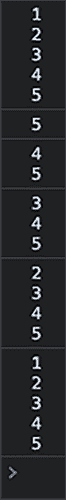
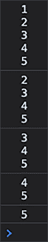

# 交互式内容和事件监听器

你现在已经熟悉了**文档对象模型**（**DOM**）的基本操作。在上一章中，我们探讨了事件，并了解到事件监听器持续监控是否有特定事件发生；当事件发生时，指定的函数（事件）会被调用。

在本章中，我们将在此基础上更进一步，使用事件监听器来创建交互式网页内容。这一章将真正完善你的 DOM 知识。我们将涵盖以下主题：

+   交互式内容

+   指定事件

+   `onload`事件处理器

+   鼠标事件处理器

+   事件目标属性

+   DOM 事件流

+   `onchange`和`onblur`

+   关键事件处理器

+   拖放元素

+   表单提交

+   元素动画

注意：练习、项目和自我检查测验的答案可以在*附录*中找到。

# 介绍交互式内容

交互式内容是指能够响应用户操作的内容。例如，想象一下一个可以在网页浏览器中动态创建明信片或玩游戏的应用程序。

这种交互式内容是通过根据用户交互更改 DOM 来实现的。这些交互可以是任何操作：在输入字段中输入文本、在页面上点击某个位置、用鼠标悬停在某个元素上，或者使用键盘输入某个特定的内容。所有这些都被称为事件。我们已经看到了事件。但实际上还有更多！

# 指定事件

有三种指定事件的方式。我们在上一章中已经看到过这些方法，但现在让我们再次回顾一下。其中一种是基于 HTML 的，另外两种是基于 JavaScript 的。在这个例子中，我们将使用`click`事件作为示例。

## 使用 HTML 指定事件

首先，HTML 方法：

```js
<p id="unique" onclick="magic()">Click here for magic!</p> 
```

以这种方式指定事件的好处是，阅读代码并预测其行为相当容易。一旦你点击段落，`magic()`函数就会被触发。当然，也存在一些缺点：你只能以这种方式指定一个事件，而且也不能动态地更改事件。

## 使用 JavaScript 指定事件

这是使用 JavaScript 实现的第一种方法。

```js
document.getElementById("unique").onclick = function() { magic(); }; 
```

这里发生的事情是我们正在获取表示所选事件的属性，并将我们的函数分配给它。因此，在这种情况下，我们通过其属性值`unique`选择上一节中显示的`p`元素，获取`onclick`属性，并通过将其包裹在匿名函数中将其`magic()`函数分配给它。我们也可以在这里指定确切的函数。我们可以随时用另一个函数覆盖它，使可以触发的事件更加动态。

我们现在也可以指定不同的事件，而 HTML 无法做到这一点。因此，我们也可以给它一个`keyup`、`keydown`或`mouseover`事件，例如——我们将在本章中考虑每种事件类型。

如果我们想要为页面上的所有元素指定事件触发器，我们可以在循环中这样做，以获得更清晰的编码风格。

### 练习 11.1

个性化你的网页。允许用户在常规模式和暗黑模式之间切换页面显示的主题。

1.  在一个简单的 HTML 文档中，设置一个布尔值变量，用于切换颜色模式。

1.  使用`window.onclick`设置一个函数，当点击时在控制台输出一条消息。你可以使用布尔变量的值。

1.  在函数中添加一个条件，检查`darkMode`变量是`true`还是`false`。

1.  如果是`false`，则更新页面样式，将背景颜色设置为黑色，字体颜色设置为白色。

1.  添加一个`else`响应，将背景颜色改为白色，文本颜色改为黑色。同时，相应地更新`darkMode`变量的值。

## 使用事件监听器指定事件

最后一种方法是使用`addEventListener()`方法向元素添加事件。使用这种方法，我们可以为同一事件指定多个函数，例如，当元素被点击时。

我们所探讨的两种方法——使用 HTML 事件和属性赋值——引人注目的是，事件前都会加上`on`前缀。例如，`onclick`、`onload`、`onfocus`、`onblur`、`onchange`等。当我们使用`addEventListener()`方法时，情况并非如此，我们会在事件监听器中指定事件类型，而不使用`on`前缀，如下所示，这是`onclick`的替代方案：

```js
document.getElementById("unique").addEventListener("click", magic); 
```

请注意，我们在魔法函数后面省略了括号。我们不能用这种方式传入参数。如果你必须这样做，你将不得不将功能包装在一个匿名函数中，如下所示：

```js
document.getElementById("unique").addEventListener("click", function() { magic(arg1, arg2) }); 
```

在本章中，我们可以使用这些方法中的任何一种来指定事件。我们主要会使用 JavaScript 选项之一。

### 练习 11.2

创建几个带有颜色名称的`div`，并在`textContent`中添加 JavaScript 以添加对每个元素的`click`事件监听器。当每个元素被点击时，更新页面的背景颜色以匹配`div`中的颜色名称。

# `onload`事件处理程序

我们在上一章中简要介绍了这个事件处理程序。`onload`事件在某个元素加载后触发。这可以出于许多原因是有用的。例如，如果你想使用`getElementById`选择一个元素，你必须确保这个元素已经在 DOM 中加载。这个事件最常用于`window`对象，但也可以用于任何元素。当你使用它时，当窗口对象加载完成后，这个事件就会被触发。以下是使用它的方法：

```js
window.onload = function() {
    // whatever needs to happen after the page loads goes here
} 
```

`onload`类似，但它在`window`和`document`对象中有所不同。这种差异取决于你使用的浏览器。`load`事件在文档加载过程的末尾触发。因此，你会发现文档中的所有对象都在 DOM 中，并且资源已经加载完成。

你也可以在任何元素上使用 `addEventListener()` 方法来处理任何事件。它也可以用于 DOM 中所有内容加载的事件。为此有一个特殊内置的事件：`DOMContentLoaded()`。这个事件可以用来处理 DOM 加载的事件，当事件被设置时，会在页面上的 DOM 构造完成后立即触发。以下是设置它的方法：

```js
document.addEventListener("DOMContentLoaded", (e) => {
    console.log(e);
}); 
```

这将在所有 DOM 内容加载完成后记录到控制台。作为替代，你也会经常在 `body` 标签中看到它，如下所示：

```js
<body onload="unique()"></body> 
```

这是在主体上分配一个名为 `unique()` 的函数，并且当主体加载完成后会触发。你不能通过将 `addEventListener()` 和 HTML 结合使用来组合它们。一个将会覆盖另一个，这取决于网页的顺序。如果你需要在 DOM 加载时发生两个事件，你需要在你的 JavaScript 中调用两个 `addEventListener()`。

## 练习 11.3

使用一个基本的 HTML 文件，下面的练习将演示使用 `DOMContentLoaded` 事件来展示 `window` 对象和 `document` 对象的加载顺序，这是一个在浏览器中 `document` 对象内容加载后触发的事件。即使 `window.onload` 语句先出现，`window` 对象也会随后加载。

1.  在一个基本的 HTML 文件中，创建一个名为 `message` 的函数，该函数需要两个参数，第一个是一个字符串值的消息，第二个是一个事件对象。在函数内部，使用 `console.log` 将事件和消息输出到控制台。

1.  使用 `window` 对象，将一个 `onload` 函数附加到事件对象上。调用该函数，将字符串值 `Window Ready` 和事件对象传递给 `message` 函数以进行输出。

1.  创建第二个函数来捕获 DOM 内容加载，并将一个监听 `DOMContentLoaded` 事件的监听器添加到 `document` 对象上。一旦该事件被触发，将事件对象和字符串值 `Document Ready` 传递给 `message` 输出函数。

1.  改变事件监听器的顺序，将 `document` 事件语句放在 `window onload` 之前：这会影响输出吗？

1.  使用 `document` 对象，添加 `DOMContentLoaded` 事件监听器，该监听器将 `Document Ready` 和触发的事件对象作为参数传递给函数。

1.  运行脚本并查看哪个事件首先被触发；改变事件的顺序以查看输出序列是否改变。

# 鼠标事件处理器

有不同的鼠标事件处理器。鼠标事件是鼠标的动作。这些是我们所拥有的：

+   `ondblclick`：当鼠标双击时

+   `onmousedown`：当鼠标点击在元素上而没有释放点击时

+   `onmouseup`：当鼠标点击在元素上释放时

+   `onmouseenter`：当鼠标移动到元素上时

+   `onmouseleave`：当鼠标离开一个元素及其所有子元素时

+   `onmousemove`：当鼠标移过元素时

+   `onmouseout`：当鼠标离开单个元素时

+   `onmouseover`：当鼠标悬停在元素上时

让我们看看这些在实际中的应用。你认为这会做什么？

```js
<!doctype html>
<html>
  <body>
    <div id="divvy" onmouseover="changeColor()" style="width: 100px; height: 100px; background-color: pink;">
    <script>
      function changeColor() {
        document.getElementById("divvy").style.backgroundColor = "blue";
      }
    </script>
  </body>
</html> 
```

如果你将鼠标移到粉红色的正方形（具有`id` `divvy`的`div`元素）上，它会立即变成蓝色。这是因为 HTML 中添加了`onmouseover`，并指向改变正方形颜色的 JavaScript 函数。

让我们看看一个类似的稍微复杂一点的例子。

```js
<!doctype html>
<html>
  <body>
    <div id="divvy" style="width: 100px; height: 100px; background-color: pink;">
    <script>
      window.onload = function donenow() {
        console.log("hi");
        document.getElementById("divvy").addEventListener("mousedown", function() { changeColor(this, "green"); });
        document.getElementById("divvy").addEventListener("mouseup", function() { changeColor(this, "yellow"); });
        document.getElementById("divvy").addEventListener("dblclick", function() { changeColor(this, "black"); });
        document.getElementById("divvy").addEventListener("mouseout", function() { changeColor(this, "blue"); });
      }
      console.log("hi2");
      function changeColor(el, color) {
        el.style.backgroundColor = color;
      }
    </script>
  </body>
</html> 
```

我们仍然从粉红色的正方形开始。这个`div`上连接了四个事件监听器：

+   `mousedown`：当鼠标按钮被按下但尚未释放时，正方形会变成绿色。

+   `mouseup`：一旦鼠标按钮被释放，正方形会变成黄色。

+   `dblclick`：这是最受欢迎的。你认为双击会发生什么？双击包含两个`mousedown`事件和两个`mouseup`事件。在第二个`mouseup`之前，它不是双击。所以，正方形会变成绿色、黄色、绿色、黑色（然后保持黑色，直到另一个事件被触发）。

+   `mouseout`：当鼠标离开正方形时，它会变成蓝色并保持蓝色，直到上述三个事件之一再次被触发。

这允许进行大量的交互。你可以用这个做很多事情。仅举一个例子，比如说你想要一个非常动态的、由`mouseover`驱动的产品帮助决策工具。它将包含四列，最后三列（从右到左）的内容是动态内容。第一列是用于分类的。第二列包含每个分类的一些更具体的产品分类。第三列包含单个产品，第四列显示产品信息。这需要很多事件监听器，以及大量监听器的删除和添加。

## 练习 11.4

我们的目的是在页面上的元素上根据各种鼠标事件改变背景颜色。在元素上`mousedown`时，元素会变成绿色。当鼠标悬停在元素上时，它会变成红色。当鼠标移出元素边界时，颜色会变成黄色。当鼠标点击时，颜色会变成绿色，当鼠标释放时，它会变成蓝色。这些动作也会在控制台中记录。

1.  在页面上创建一个空白元素并给它分配一个类。

1.  使用元素的类名选择元素。

1.  将一个变量分配给页面上的元素对象。

1.  更新元素的内容，使其显示`hello world`。

1.  使用元素的样式属性，更新高度和宽度，然后给它添加一个默认的背景颜色。

1.  创建一个函数来处理两个参数，第一个是一个字符串形式的颜色值，第二个是触发事件的的事件对象。

1.  在函数中，将颜色值输出到控制台，对于事件，将事件类型输出到控制台。

1.  向元素添加事件监听器：`mousedown`、`mouseover`、`mouseout` 和 `mouseup`。对于这些事件中的每一个，将两个参数发送到您创建的函数：一个颜色值和事件对象。

1.  运行代码并在您的浏览器中尝试它。

# 事件目标属性

每当事件被触发时，一个事件变量就会变得可用。它有许多属性，您可以通过在为事件触发的函数中使用此命令来检查它：

```js
console.dir(event); 
```

这将显示许多属性。目前最有趣的属性之一是 `target` 属性。目标是触发事件的 HTML 元素。因此，我们可以用它来获取网页上的信息。让我们看看一个简单的例子。

```js
<!doctype html>
<html>
  <body>
    <button type="button" onclick="triggerSomething()">Click</button>
    <script>
      function triggerSomething() {
        console.dir(event.target);
      }
    </script>
  </body>
</html> 
```

在这种情况下，`event.target` 是 `button` 元素。在控制台中，将记录 `button` 元素及其所有属性，包括潜在的兄弟元素和父元素。

当有多个输入字段和一个按钮的 HTML 表单时，父属性可能会很有用。表单中的按钮通常是其直接父元素。通过这个父元素，可以获取输入字段的值。以下是一个示例：

```js
<!doctype html>
<html>
  <body>
    <div id="welcome">Hi there!</div>
    <form>
      <input type="text" name="firstname" placeholder="First name" />
      <input type="text" name="lastname" placeholder="Last name" />
      <input type="button" onclick="sendInfo()" value="Submit" />
    </form>
    <script>
      function sendInfo() {
        let p = event.target.parentElement;
        message("Welcome " + p.firstname.value + " " + p.lastname.value);
      }
      function message(m) {
        document.getElementById("welcome").innerHTML = m;
      }
    </script>
  </body>
</html> 
```

这将产生一个小表单，如下所示：


图 11.1：基本 HTML 表单

一旦您在字段中输入数据并点击 **提交**，它看起来就像这样：


图 11.2：带有动态欢迎信息的简单 HTML 表单

使用此命令，`event.target[CIT]` 是 HTML 按钮：

```js
let p = event.target.parentElement; 
```

按钮的父元素，在这个例子中是表单，被存储在 `p` 变量中。`p` 是父元素，它代表表单元素。因此，这个命令将获取输入框的值：

```js
p.firstname.value; 
```

类似地，`p.lastname.value` 获取姓氏。我们还没有看到这一点，但使用 `value` 属性，您可以获取输入元素的值。

接下来，将两个输入值合并并发送到 `message()` 函数。此函数将 div 的内部 HTML 更改为个性化的欢迎信息，这就是为什么 **Hi there!** 会变成 **Welcome Maaike van Putten**。

## 练习 11.5

在页面上更改 div 元素的文本。这个练习将演示您如何从输入字段获取值并将其放置在页面元素中。它还涵盖了跟踪按钮点击和事件目标的相关细节。您可以使用以下 HTML 文档作为模板，然后添加 JavaScript：

```js
<!doctype html>
<html>
<head>
    <title>JS Tester</title>
</head>
<body>
    <div class="output"></div>
    <input type="text" name="message" placeholder="Your Message">
    <button class="btn1">Button 1</button>
    <button class="btn2">Button 2</button>
    <div>
        <button class="btn3">Log</button>
    </div>
    <script>
    </script>
</body>
</html> 
```

采取以下步骤：

1.  使用上述 HTML 作为模板，添加 JavaScript 代码，选择每个页面元素，包括 `div`、输入字段和 `button` 元素。将这些元素对象分配给您的代码中的变量。

1.  创建一个名为 `log` 的空数组，它将用于跟踪和记录所有事件。

1.  创建一个函数，该函数将事件对象详情捕获到对象中，并将其添加到`log`数组。获取事件目标和创建一个对象，将其添加到存储输入值时、事件类型、目标元素的类名和目标元素的标签名的数组中。

1.  在日志函数内部，获取输入内容中的值并将其分配给`div`的`textContent`。

1.  在信息添加到`log`数组后清除`div`内容。

1.  将事件监听器添加到前两个按钮上，将事件对象发送到之前步骤中创建的跟踪函数。

1.  将事件监听器附加到第三个按钮上，将日志内容输出到控制台。

# DOM 事件流

让我们回顾一下当你点击一个与多个元素相关联的元素时会发生什么。

我们将创建嵌套的`div`元素。为了说明这一点，我们在`body`上添加了一个样式。实际上，最好在`head`标签中添加这个样式，甚至更好的是有一个单独的 CSS 文件，但这样读起来更简洁。这就是嵌套`div`元素的外观：


图 11.3：网页中的事件冒泡

以下是与之相关的代码。脚本在底部，将在上面的部分完成后执行。它将为每个`div`添加事件监听器，并将执行的操作是记录`innerText`。对于嵌套`div`元素的最外层元素，这将显示`12345`，每行一个新数字。

所以这里的问题是，它将如何触发事件？比如说我们点击**5**，会执行什么？所有嵌套`div`元素的事件，还是只有**5**的事件？如果它要执行所有这些事件，是按照从内到外的事件顺序执行，还是相反？

```js
<!DOCTYPE html>
<html>
  <body>
    <style>
      div {
        border: 1px solid black;
        margin-left: 5px;
      }
    </style>
    <div id="message">Bubbling events</div>
    <div id="output">
      1
      <div>
        2
        <div>
          3
          <div>
            4
            <div>5</div>
          </div>
        </div>
      </div>
    </div>
    <script>
      function bubble() {
        console.log(this.innerText);
      }
      let divs = document.getElementsByTagName("div");
      for (let i = 0; i < divs.length; i++) {
        divs[i].addEventListener("click", bubble);
      }
    </script>
  </body>
</html> 
```

在这种情况下，它具有默认行为。它将执行所有五个事件，所以每个嵌套`div`都会执行。并且它是从内到外执行的。所以它将从只有**5**的`innerText`开始，然后是**45**，直到最后一个，**12345**：



图 11.4：控制台输出事件冒泡

这被称为**事件冒泡**。当你在一个元素上触发处理器时，就会发生这种情况。它首先运行自己的事件，然后是父元素，依此类推。之所以称为冒泡，是因为它从内部事件向上传播到外部，就像水泡上升一样。

你可以通过在添加事件监听器时将`true`作为第三个参数来改变这种行为：

```js
divs[i].addEventListener("click", bubble, true); 
```

这将是结果：



图 11.5：控制台输出事件捕获

这种从外部元素到内部元素的移动被称为**事件捕获**。现在不再经常使用，但如果你需要实现它，可以使用`addEventListener()`的`useCapture`参数（第三个参数）并将其设置为`true`。默认情况下是`false`。

事件捕获和冒泡允许我们应用一个称为 **事件委托** 的原则。事件委托的概念是，我们不是在 HTML 块中的每个元素上添加事件处理器，而是定义一个包装器并将事件添加到这个包装器元素，然后它也适用于所有子元素。你将在下一个练习中应用这个原则。

## 练习 11.6

此示例将演示事件捕获和页面元素的委托。通过在主元素内部添加事件监听器，此示例将根据事件捕获属性对控制台消息进行排序。

所有具有 `class` 为 `box` 的 `div` 元素将具有相同的事件对象。我们可以将事件目标、`textcontent` 也添加到控制台，以便我们可以知道哪个元素被点击。

使用以下模板：

```js
<!doctype html>
<html>
<head>
    <title>JS Tester</title>
    <style>
        .box {
            width: 200px;
            height: 100px;
            border: 1px solid black
        }
    </style>
</head>
<body>
    <div class="container">
        <div class="box" id="box0">Box #1</div>
        <div class="box" id="box1">Box #2</div>
        <div class="box" id="box2">Box #3</div>
        <div class="box" id="box3">Box #4</div>
    </div>
    <script>

    </script>
</body>
</html> 
```

按照以下步骤操作：

1.  在 JavaScript 代码中，选择所有具有类别的元素，并单独选择主容器元素。

1.  向主容器添加事件监听器，当 `useCapture` 参数设置为 `false` 时输出控制台值 `4`，当 `useCapture` 参数设置为 `true` 时输出 `1`。

1.  对于每个嵌套元素，添加 `click` 事件监听器，当 `useCapture` 参数设置为 `false` 时 `console.log()` 值为 `3`，当 `useCapture` 参数设置为 `true` 时值为 `2`。

1.  点击页面元素以查看页面上的事件委托和输出顺序。

1.  在 `click` 事件中，向盒元素添加到控制台的输出，输出事件目标的 `textContent` 值。

# `onchange` 和 `onblur`

另外两个常与输入框结合使用的事件是 `onchange` 和 `onblur`。`onchange` 在元素改变时被触发，例如，当输入框的值改变时。`onblur` 在对象失去焦点时被触发；例如，当你有一个输入框的光标并且光标移动到另一个输入框时，第一个输入框的 `onblur` 事件将被触发。

```js
onblur and onchange, and there is an extra function.
```

```js
<!DOCTYPE html>
<html>
  <body>
    <div id="welcome">Hi there!</div>
    <form>
      <input type="text" name="firstname" placeholder="First name" onchange="logEvent()" />
      <input type="text" name="lastname" placeholder="Last name" onblur="logEvent()" />
      <input type="button" onclick="sendInfo()" value="Submit" />
    </form>
    <script>
      function logEvent() {
        let p = event.target;
        if (p.name == "firstname") {
          message("First Name Changed to  " + p.value);
        } else {
          message("Last Name Changed to  " + p.value);
        }
      }
      function sendInfo() {
        let p = event.target.parentElement;
        message("Welcome " + p.firstname.value + " " + p.lastname.value);
      }
      function message(m) {
        document.getElementById("welcome").innerHTML = m;
      }
    </script>
  </body>
</html> 
```

`firstname` 输入框有一个 `onchange` 事件。如果输入框中的数据值发生变化，此事件将在输入框失去焦点时立即触发。如果输入框在值未改变时失去焦点，则 `onchange` 不会发生任何操作。这并不适用于分配给 `lastname` 输入框的 `onblur`，即使值没有改变，事件也会被触发。

另一个常与输入框一起使用的事件是 `onfocus`，或者当与事件监听器结合使用时简称为 `focus`。此事件与光标进入输入框相关联，并且当输入框被光标聚焦并且可以输入时，此事件将被触发。

## 练习 11.7

在页面上有两个输入字段时，JavaScript 会监听输入字段内容的变化。一旦输入字段不再聚焦，如果值已经改变，将调用改变事件。`blur` 和 `focus` 也会添加到输入字段，并在这些事件发生时记录到控制台。两个输入元素将具有相同的事件监听器，当你更改输入字段的 内容并移除焦点时，输出文本内容将使用触发事件的输入字段值更新。

使用以下 HTML 模板：

```js
<!doctype html>
<html>
<head>
    <title>JS Tester</title>
</head>
<body> 
    <div class="output1">
    </div>

    <input type="text" placeholder="First Name" name="first"><br>
    <input type="text" placeholder="Last Name" name="last"><br>
    <script> 

    </script>
</body>
</html> 
```

现在按照以下步骤操作：

1.  在 JavaScript 代码中，将 HTML 输出元素放入一个变量对象中，这样你就可以在页面上显示内容了。

1.  选择两个输入字段。你可以使用 `querySelector()` 和 `"input[name='first']"`，这将允许你通过输入字段名称进行选择。

1.  将事件监听器添加到第一个输入和第二个输入。事件监听器应该是一个改变事件，用于跟踪更改的值。这只会在你点击离开输入字段时调用。

1.  创建一个单独的函数来处理内容的输出到页面，更新输出元素的 `textContent`。

1.  将输入字段的值在它们改变时发送到输出元素 `textContent`。

1.  添加四个额外的事件监听器，并监听每个输入的 `blur` 和 `focus` 事件。一旦事件被触发，就在控制台输出事件类型值。

# 关键事件处理器

有几个关键事件。其中之一是 `onkeypress`。`onkeypress` 会在按下键时触发，嗯，你可能已经猜到了，按下意味着在这里按钮被按下然后释放。如果你想事件在按下按钮（在释放之前）立即发生，你可以使用 `onkeydown` 事件。如果你想事件在释放时发生，你可以使用 `onkeyup` 事件。

我们可以用关键事件做很多事情。例如，我们可以限制在输入框中可以输入的字符。每次按键时，我们都可以检查字符并决定是否保留它。

我们可以使用以下方式获取触发事件的键：

```js
event.key; 
```

以下 HTML 代码中有两个输入框。你能看到这里发生了什么吗？

```js
<!doctype html>
<html>
  <body>
    <body>
      <div id="wrapper">JavaScript is fun!</div>
      <input type="text" name="myNum1" onkeypress="numCheck()">
      <input type="text" name="myNum2" onkeypress="numCheck2()">
      <script>
        function numCheck() {
            message("Number: " + !isNaN(event.key));
            return !isNaN(event.key);
        }
        function numCheck2() {
            message("Not a number: " + isNaN(event.key));
            return isNaN(event.key);
        }
        function message(m) {
            document.getElementById('wrapper').innerHTML = m;
        }
      </script>
  </body>
</html> 
```

第一个检查值是否为数字，如果是数字，它将在顶部写 `Number: true`；否则，它将在顶部写 `Number: false`。第二个是检查值是否不是数字；如果不是数字，它将在顶部写 `Not a number: true`；否则，它将在顶部写 `Not a number: false`。

这就是使用 `onkeypress` 事件的一种方法，但我们还能做得更多。我们可以在 `onkeypress` 事件中添加一个 `return` 语句，如下所示：

```js
onkeypress="return numCheck2()"; 
```

如果返回 `true`，则键值被添加到输入框中；如果返回 `false`，则键值不会被添加。

以下代码片段只允许在输入框中输入数字。每当用户尝试输入其他内容时，该函数会限制它。

```js
<!doctype html>
<html>
  <body>
    <body>
      <div id="wrapper">JavaScript is fun!</div>
      <input type="text" name="myNum1" onkeypress="return numCheck()" onpaste="return false">
      <input type="text" name="myNum2" onkeypress="return numCheck2()" onpaste="return false">
      <script>
        function numCheck() {
            message(!isNaN(event.key));
            return !isNaN(event.key);
        }
        function numCheck2() {
            message(isNaN(event.key));
            return isNaN(event.key);
        }
        function message(m) {
            document.getElementById("wrapper").innerHTML = m;
        }
      </script>
  </body>
</html> 
```

如您所见，`return`被包含在 onkeypress 中，以确保只能输入数字。还有一件事可能引起了您的注意：`onpaste="return false"`。这是为了处理那些复制粘贴数字到非数字字段或字符到数字字段，但仍能成功输入非法字符的聪明人。

## 练习 11.8

通过识别按键和检测当元素获得焦点时字符的按键值，我们还可以检测内容是否被粘贴到输入字段中。

1.  在你的 HTML 中创建两个输入字段。添加一个元素以输出内容。

1.  使用 JavaScript 选择页面元素。你可以将一个名为`output`的变量分配给具有`output`类的元素。创建另一个变量`eles`，并使用`querySelectorAll()`选择所有输入字段作为其值。这样，我们可以遍历节点列表并将相同的事件分配给所有匹配的元素。

1.  使用`forEach()`遍历页面上的所有输入元素。将相同的事件监听器添加到所有这些元素上。

1.  添加一个 keydown 事件监听器并检查值是否为数字。如果是数字，则将其添加到输出区域。

1.  在`keyup`事件中，将按键值输出到控制台。

1.  检查输入字段中是否有粘贴操作；如果有，则可以将单词`paste`输出到控制台。

# 拖放元素

对于拖放也有特殊的事件处理器。我们需要一个起点来能够拖放某个东西。让我们创建一个拖放区域的 CSS 和 HTML。

```js
<!doctype>
<html>
  <head>
    <style>
      .box {
        height: 200px;
        width: 200px;
        padding: 20px;
        margin: 0 50px;
        display: inline-block;
        border: 1px solid black;
      }
      #dragme {
        background-color: red;
      }
    </style>
  </head>
  <body>
    <div class="box">1</div>
    <div class="box">2</div>
  </body>
</html> 
```

现在我们还将包括一个将要被拖放和放下的元素。为了标记一个元素为可拖动，我们需要添加`draggable`属性。这是我们将在第二个 div 中包含的代码，第一个 div 围绕它：

```js
 <div class="box"> 1
      <div id="dragme" draggable="true">
        Drag Me Please!
      </div>
    </div> 
```

然后我们需要决定当我们将可拖动元素放下时，我们将要做什么。我们需要在它可以被拖动的框内指定这一点。我们将向两个框都添加功能，以便它可以从一个拖动到另一个，然后再回到第一个。

```js
<div class="box" ondrop="dDrop()" ondragover="nDrop()">
      1
  <div id="dragme" ondragstart="dStart()" draggable="true">
     Drag Me Please!
  </div>
   </div>
<div class="box" ondrop="dDrop()" ondragover="nDrop()">2</div> 
```

以下是将被添加到 body 末尾的脚本：

```js
 <script>
      let holderItem;
      function dStart() {
        holderItem = event.target;
      }
      function nDrop() {
        event.preventDefault();
      }
      function dDrop() {
        event.preventDefault();
        if (event.target.className == "box") {
          event.target.appendChild(holderItem);
        }
      }
    </script> 
```

我们首先在脚本中指定一个变量，用于在拖动时保存的项目。当`ondragstart`事件被触发时，我们将把正在拖动的元素存储在`holderItem`变量中。通常，当你拖动时，由于 HTML 的设计，放下是不允许的。为了允许放下，你需要阻止默认事件，这意味着你想要放下的项目不能被放下。你可以通过以下方式做到这一点：

```js
event.preventDefault(); 
```

通常，在你阻止默认行为之前，你会做一些检查，看看被拖动的元素是否可以放置在那个位置。在上面的例子中，我们检查被拖动的元素的类名是否为 `box`。如果是这样，我们将 `holderItem` 作为子元素添加到盒子中。

我们创建了一个页面，允许将 HTML 元素从一个盒子移动到另一个盒子。如果你尝试在其他任何地方释放它，元素将返回到其原始位置。

## 练习 11.9

这将是一个“我不是机器人”的检查。拖放可以用来确保是在页面上操作的是活生生的人，而不是机器人。这个练习将演示如何在一个活动元素上创建一个视觉拖动效果，其中用户按下鼠标以创建拖动动作，一旦鼠标按钮释放，就会发生放下事件。成功操作将被记录到控制台。

你可以使用以下模板：

```js
<!doctype html>
<html>
<head>
    <title>JS Tester</title>
    <style>
        .box {
            width: 100px;
            height: 100px;
            border: 1px solid black;
            background-color: white;
        }
        .red {
            background-color: red;
        }
    </style>
</head>
<body>
    <div class="box">1
        <div id="dragme" draggable="true">
            Drag Me Please!
        </div>
    </div>
    <div class="box">2</div>
    <script>
    </script>
</body>
</html> 
```

前面的 HTML 为用于放置的元素创建样式，并设置了宽度、高度和边框。它创建了一个名为 `red` 的另一个类，并将红色背景添加到活动元素，以便显示为活动状态，以及两个具有 `box` 元素类别的 `div` 元素，用于放置。最后，我们在其中一个盒子中创建了一个嵌套的 `div`，其 `id` 为 `dragme`，并将 `draggable` 属性设置为 `true`，添加了一些指导性文本以帮助用户。通过以下步骤完成脚本：

1.  在你的 JavaScript 代码中将可拖动元素作为对象选择。

1.  添加一个 `dragstart` 事件的监听器，其中它将可拖动元素的透明度更新为 `0.5`。

1.  添加另一个 `dragend` 事件的监听器，移除不透明度的值。

1.  使用 `querySelectorAll()` 选择所有放下盒子。

1.  向所有放下盒子添加事件监听器，设置当用户触发 `dragenter` 事件时向元素添加 `red` 类。这将向用户指示操作正在进行。

1.  设置 `dragover`，向元素添加 `preventDefault()` 方法以禁用可能已经存在的任何动作。

1.  在 `dragleave` 事件中，移除 `red` 类。

1.  将 `drop` 事件的监听器添加到盒子中，将可拖动元素添加到事件目标。

1.  要以相同的方式作用于所有元素，移除元素的默认行为。你可以使用 `preventDefault()` 方法来禁用可能已经存在的任何动作。

1.  你可以在这些事件中的任何一个上添加控制台日志消息，以更好地跟踪它们。

# 表单提交

当表单提交时，可以触发一个事件。这可以通过不同的方式实现，其中之一是在 `form` 元素上添加 `onsubmit` 属性。

```js
<form onsubmit="doSomething()"> 
```

列出的函数将在提交 `submit` 类型的输入时被触发。

```js
<input type="submit" value="send"> 
```

我们可以对`form`元素的 HTML 做更多的事情；例如，我们可以重定向到另一个页面。我们必须指定使用`method`属性发送表单值的方式，以及使用`action`属性指定的页面位置。

```js
<form action="anotherpage.html" method="get" onsubmit="doStuff()"> 
```

目前不必担心`get`；这仅仅意味着值通过 URL 发送。当你使用`get`时，URL 看起来是这样的：

```js
www.example.com/anotherpage.html?name=edward 
```

在问号之后，显示的是随 URL 发送的变量，以键值对的形式出现。这是当`edward`被插入`name`时创建 URL 的表单形式。

```js
<!doctype html>
<html>
  <body>
    <form action="anotherpage.html" method="get">
      <input type="text" placeholder="name" name="name" />
      <input type="submit" value="send" />
    </form>
  </body>
</html> 
```

`anotherpage.html`可以使用 URL 中的变量。这可以在`anotherpage.html`的 JavaScript 中这样做：

```js
<!doctype html>
<html>
  <body>
    <script>
      let q = window.location.search; 
      let params = new URLSearchParams(q); 
      let name = params.get("name");
      console.log(name);
    </script>
  </body>
</html> 
```

到目前为止，我们一直在使用`action`和`onsubmit`属性提交表单。`action`会重定向到另一个位置。这可能是不同页面的 API 端点。`onsubmit`指定了当表单提交时触发的事件。

我们还可以使用表单的`onsubmit`事件做更多的事情。还记得`onkeypress`中的`return`用法吗？我们在这里可以做到类似的事情！如果我们让调用的函数返回一个布尔值，那么只有当布尔值为`true`时，表单才会提交。

如果我们想在发送表单之前进行一些表单验证，这将非常有用。看看这段代码，看看你是否能弄清楚何时可以提交。

```js
<!doctype html>
<html>
  <body>
    <div id="wrapper"></div>
    <form action="anotherpage.html" method="get" onsubmit="return valForm()">
      <input type="text" id="firstName" name="firstName" placeholder="First name" />
      <input type="text" id="lastName" name="lastName" placeholder="Last name" />
      <input type="text" id="age" name="age" placeholder="Age" />
      <input type="submit" value="submit" />
    </form>
    <script>
      function valForm() {
        var p = event.target.children;
        if (p.firstName.value == "") {
          message("Need a first name!!");
          return false;
        }
        if (p.lastName.value == "") {
          message("Need a last name!!");
          return false;
        }
        if (p.age.value == "") {
          message("Need an age!!");
          return false;
        }
        return true;
      }
      function message(m) {
        document.getElementById("wrapper").innerHTML = m;
      }
    </script>
  </body>
</html> 
```

此表单包含三个输入字段和一个输入按钮。这些字段是用于姓氏、名字和年龄的。当其中之一缺失时，表单将不会提交，因为函数将返回`false`。还会在表单上方的`div`中添加一条消息，解释出了什么问题。

## 练习 11.10

这将涉及创建一个表单验证器。在这个练习中，你需要检查确保所需的值被输入到输入字段中。代码将检查用户输入的输入值，以匹配那些字段值的预定条件。

1.  设置一个表单，在内部添加三个输入字段：`First`、`Last`和`Age`。添加一个提交按钮。

1.  在 JavaScript 代码中，将表单选择为一个元素对象。

1.  向表单添加一个提交事件监听器。

1.  将`error`的默认值设置为`false`。

1.  创建一个名为`checker()`的函数，该函数将检查字符串的长度并将字符串长度输出到控制台。

1.  为每个字段值添加条件，首先检查值是否存在，如果响应为`false`，则返回错误，然后在将错误变量更改为`true`之前。

1.  使用`console.log()`记录有关错误的详细信息。

1.  对于年龄输入值，检查提供的年龄是否为 19 岁或以上，否则引发错误。

1.  验证结束后，检查`error`是否为`true`；如果是，使用`preventDefault()`停止表单提交。将错误记录到控制台。

# 动画元素

最后，我们想向你展示你可以使用 HTML、CSS 和 JavaScript 进行动画处理。这使我们能够用我们的网页做更多酷的事情。例如，我们可以将动画作为事件触发。这可以用于许多不同的目的，例如，说明解释，将用户的注意力吸引到某个位置，或者玩游戏。

让我们给你一个非常基本的例子。我们可以使用`position`键，并在 CSS 中将其设置为`absolute`。这使得元素的位置相对于其最近的定位父元素。这里，那将是 body。这是当点击按钮时从左到右移动的紫色方块的代码。

```js
<!doctype html>
<html>
  <style>
    div {
      background-color: purple;
      width: 100px;
      height: 100px;
      position: absolute;
    }
  </style>
  <body>
    <button onclick="toTheRight()">Go right</button>
    <div id="block"></div>
    <script>
      function toTheRight() {
        let b = document.getElementById("block");
        let x = 0;
        setInterval(function () {
          if (x === 600) {
            clearInterval();
          } else {
            x++;
            b.style.left = x + "px";
          }
        }, 2);

      }
    </script>
  </body>
</html> 
```

我们需要给`div`块一个绝对位置，因为我们依赖于 CSS 的`left`属性来移动它。为了在某个东西的左边，那个东西必须是绝对的，否则`left`属性不能相对于它定位。在这种情况下，我们需要在`div`的左边一定数量的像素处；这就是为什么我们需要将`div`的位置设置为绝对，这样移动框的位置就可以相对于其父元素的位置了。

当我们点击按钮时，会触发`toTheRight()`函数。这个函数获取`block`并将其存储在`b`中。将`x`设置为`0`。然后我们使用一个非常强大的内置 JavaScript 函数：`setInterval()`。这个函数会持续评估一个表达式，直到`clearInterval()`被调用。当`x`，即我们距离左边的测量值达到 600 时，它会这样做。它每 2 毫秒重复一次，这使得它看起来像在滑动。

你同时也可以设置不同的位置，如`style.top`、`style.bottom`和`style.right`，或者添加新元素来创建雪花效果，或者显示不断行驶的汽车。有了这个工具箱，天空就是极限。

## 练习第 11.11 节练习题。

在这里，我们将点击紫色方块，并观察它在页面上移动。这个练习将演示在页面上创建一个简单交互元素的事件的创建。紫色方块每次被点击时都会移动；一旦它达到页面的边界，它将根据它撞击的侧面从左到右或从右到左改变方向。

1.  设置元素的样式，在设置`position`为`absolute`之前设置`height`和`width`。

1.  创建一个你想要在页面上移动的元素。

1.  使用 JavaScript 选择并存储元素。

1.  设置一个包含`speed`、`direction`和`position`值的对象。

1.  添加一个事件监听器，以便在元素被点击时触发。

1.  将间隔计数器的默认值设置为`30`。

1.  如果计数器小于 1，则结束间隔并清除它。

1.  一旦间隔运行了 30 次使用`x`的值，元素将静止并等待再次被点击。

1.  在运动过程中，检查位置值是否大于 800 或小于 0，这意味着需要改变方向。`direction` 值将提供运动的方向。如果运动将盒子移出容器的边界，我们需要将其送回另一个方向。这可以通过乘以负一来实现。如果值是正的，它将变成负的，将元素送向左边。如果值是负的，它将变成正的，将元素送向右边。

1.  更新元素的 `style.left` 位置值，分配更新后的位置值。添加 `px`，因为分配给样式的值是一个字符串。

1.  将结果输出到控制台。

# 章节项目

## 构建你自己的分析。

确定页面中点击了哪些元素，并记录它们的 ID、标签和类名。

1.  在你的 HTML 中创建一个主容器元素。

1.  在主元素内部添加四个元素，每个元素都有一个 `class` 为 `box` 的类和一个唯一的 ID 以及唯一的文本内容。

1.  设置你的 JavaScript 代码以包含一个数组，你可以使用它来跟踪，将每次点击的详细信息添加到其中。

1.  在你的代码中将主容器元素作为变量对象选择。

1.  添加一个事件监听器来捕获对元素的点击。

1.  创建一个处理点击的函数。从事件对象中获取目标元素。

1.  检查元素是否有 ID，这样你就不会跟踪主容器上的点击。

1.  设置一个对象来跟踪值；包括元素的 `textContent`、`id`、`tagName` 和 `className`。

1.  将临时对象添加到你的跟踪数组中。

1.  将你在跟踪数组中捕获的值输出到你的控制台。

## 星级评分系统

使用 JavaScript 创建一个完全交互和动态的星级评分组件。


图 11.6：创建星级评分系统

你可以使用以下 HTML 和 CSS 作为起始模板。提供完成的脚本元素作为你的答案。

```js
<!DOCTYPE html>
<html>
<head>
    <title>Star Rater</title>
    <style>
        .stars ul {
            list-style-type: none;
            padding: 0;
        }
        .star {
            font-size: 2em;
            color: #ddd;
            display: inline-block;
        }
        .orange {
            color: orange;
        }
        .output {
            background-color: #ddd;
        }
    </style>
</head>
<body>
    <ul class="stars">
        <li class="star">&#10029;</li>
        <li class="star">&#10029;</li>
        <li class="star">&#10029;</li>
        <li class="star">&#10029;</li>
        <li class="star">&#10029;</li>
    </ul>
    <div class="output"></div>
    <script>

    </script>
</body>
</html> 
```

执行以下步骤：

1.  将 `ul` 中所有具有 `class` 为 `stars` 的星星选择为一个对象，并为 `output` 元素创建另一个对象。

1.  创建另一个对象来包含对具有 `class` 为 `star` 的元素调用 `querySelectorAll()` 的结果。

1.  遍历结果节点列表，将索引值加 1 的值添加到元素对象中，并添加一个监听点击的事件监听器。将名为 `starRate()` 的函数附加到每个 `star` 元素的 `click` 事件上。

1.  在 `starRate()` 函数中，将使用事件目标和元素对象的星值（在之前步骤中设置）的值添加到输出中。

1.  使用 `forEach()` 遍历所有星星，检查星星元素的索引值是否小于星星值；如果是，则应用 `class` 为 `orange`。否则，从 `classList` 元素中移除 `class` 为 `orange`。

## 鼠标位置跟踪器

跟踪鼠标在元素内的 `x` 和 `y` 位置。当鼠标在元素内移动时，`x` 位置和 `y` 位置值将更新。

1.  创建一个页面元素并向其添加尺寸，包括 `height` 和 `width`。创建一个名为 `active` 的类样式，其 `background-color` 属性为 `red`。最后，创建一个包含文本的输出元素。

1.  选择主要的容器元素并向其添加事件监听器。监听 `mouseover`、`mouseout` 和 `mousemove` 事件。

1.  在 `mouseover` 时添加 `active` 类，在 `mouseout` 时移除 `active` 类。

1.  在 `mousemove` 时调用一个函数，该函数跟踪事件元素的 `clientX` 和 `clientY` 位置，将它们嵌入到可读句子中，并将输出输出到输出元素。

## 盒子点击速度测试游戏

此处的目标是尽可能快地点击出现的红色框。该框将在容器内随机放置，并使用随机值定位。该框将有一个事件监听器，用于跟踪开始和点击时间，以计算点击事件的持续时间。您可以使用以下模板，因为这里的 HTML 有点复杂——只需添加 `<script>` 元素使 HTML 具有交互性！

```js
<!DOCTYPE html>
<html>
<head>
    <title>Click Me Game</title>
    <style>
        .output {
            width: 500px;
            height: 500px;
            border: 1px solid black;
            margin: auto;
            text-align: center;
        }
        .box {
            width: 50px;
            height: 50px;
            position: relative;
            top: 50px;
            left: 20%;
            background-color: red;
        }
        .message {
            text-align: center;
            padding: 10px;
            font-size: 1.3em;
        }
    </style>
</head>
<body>
    <div class="output"></div>
    <div class="message"></div>
    <script>
    </script>
</body>
</html> 
```

使用 JavaScript 处理上述 HTML 代码。

1.  有两个 `div` 元素，一个具有 `output` 类用于游戏区域，另一个具有 `message` 类用于向玩家提供说明。使用 JavaScript 选择这些主要元素作为对象。

1.  使用 JavaScript，在 `output` 元素内创建另一个元素，并创建一个 `div` 作为主要可点击对象。将名为 `box` 的样式附加到新元素，并将其附加到 `output` 元素。

1.  使用 JavaScript 向信息区域添加用户说明：`按开始`。他们需要点击新创建的具有 `box` 类的 `div` 以开始游戏。

1.  创建一个名为 `game` 的全局对象来跟踪计时器和起始时间值。这将用于计算元素显示和玩家点击之间的持续时间（以秒为单位）。将 `start` 设置为 `null`。

1.  创建一个函数，该函数将生成一个随机数并返回一个随机值，参数是要使用的最大值。

1.  向 `box` 元素添加事件监听器。一旦点击，这应该开始游戏。将 `box` 元素的显示设置为 `none`。使用 `setTimeout()` 方法调用名为 `addBox()` 的函数，并将超时设置为随机毫秒值。根据需要调整；这将是在点击对象框显示和消失之间的时间。如果起始值是 `null`，则向加载信息区域添加文本内容。

1.  如果起始值存在，则使用当前 `date` 对象的 `getTime()` 获取 Unix 时间值，从当前时间值中减去游戏开始时间，然后除以 1,000 以获得秒值。将结果输出到 `message` 元素，以便玩家可以看到他们的分数。

1.  创建一个函数来处理点击事件，当计时器结束时添加盒子。更新消息的文本内容为`点击它……`。将游戏的`start`值设置为当前时间的毫秒数。将`block`样式应用于元素，使其在页面上显示。

1.  从可用空间（500 个总容器宽度减去 50 个盒子宽度）设置一个随机位置，在元素的上方和左侧使用`Math.random()`。

1.  玩游戏并根据需要更新样式。

# 自我检查测验

1.  你在哪里可以找到`window.innerHeight`和`window.innerWidth`？

1.  `preventDefault()`的作用是什么？

# 摘要

在本章中，我们处理了相当多的主题，以增加网页的交互性。我们看到了指定事件的不同方式，然后更详细地探讨了不同的事件处理器。当指定的元素（通常是`document`对象）完全加载时，会触发`onload`事件处理器。这非常适合包裹其他功能，因为它避免了选择尚未存在的 DOM 内容。

我们还看到了鼠标事件处理器，用于响应在网页上可以使用鼠标做的所有不同的事情。所有这些事件处理器的使用非常相似，但它们各自启用与用户的不同类型的交互。我们还看到，我们可以通过调用`event.target`来访问触发事件的元素。这个属性持有触发事件的元素。

我们还更详细地探讨了`onchange`、`onblur`和键事件处理器。之后，我们看到了如何在表单提交时触发交互。我们研究了 HTML 的`action`属性，它重定向提交的处理，以及`onsubmit`事件，它处理表单提交。然后我们看到了我们可以使用所有这些事件做一些事情，例如在页面上指定拖放和动画元素。

在下一章中，我们将继续探讨一些更高级的主题，这将把你的现有 JavaScript 技能提升到新的水平！
