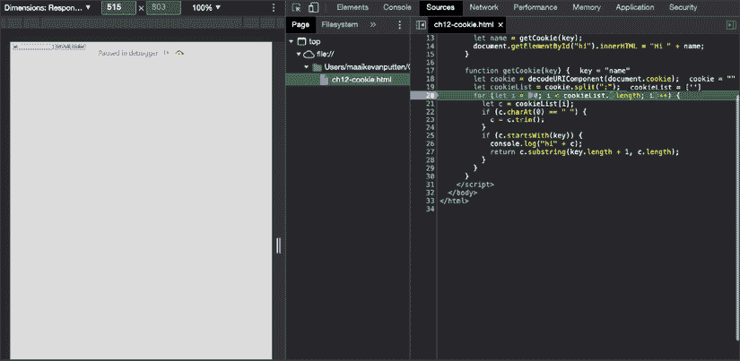
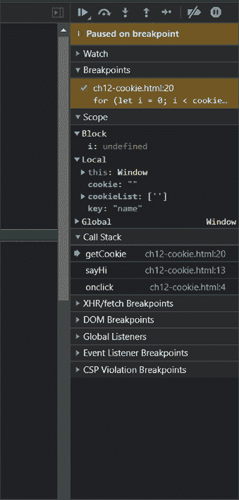
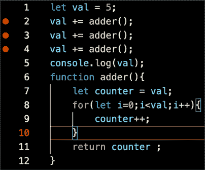
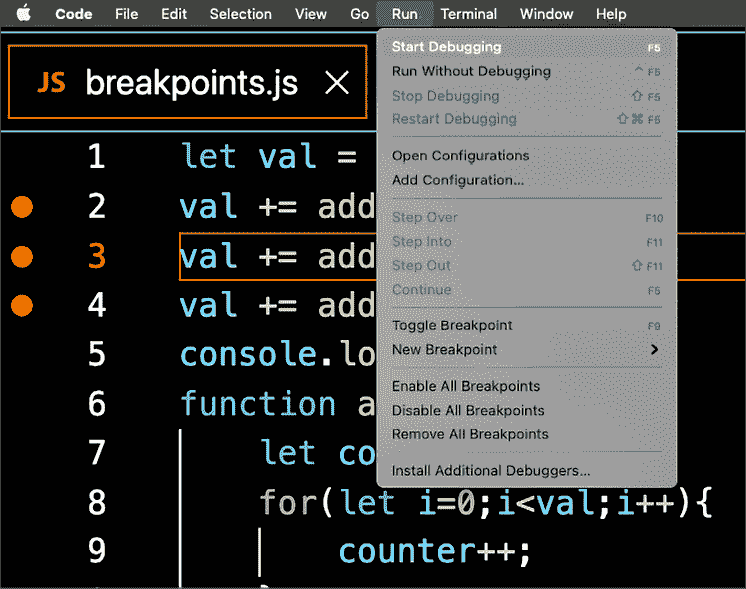
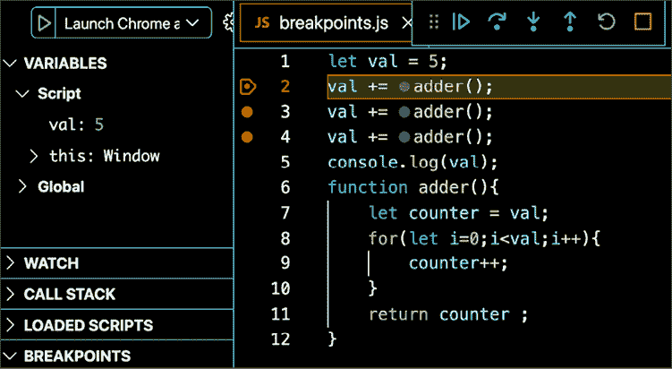
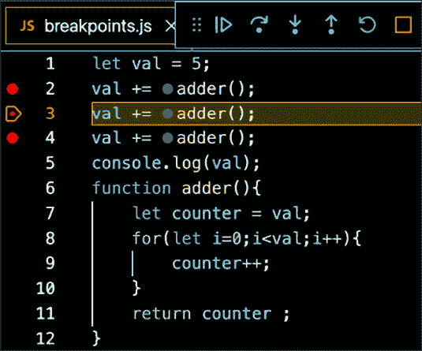
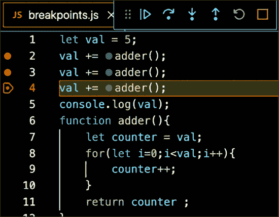

# 12

# 中级 JavaScript

本书到目前为止所提出的概念和解决方案方法并不是解决问题的关键途径。在本章中，我们将挑战你深入思考，保持好奇心，并练习优化解决方案的良好习惯。

在前面的章节中，我们承诺在本章中会有很多精彩的内容，因为一些内置方法的最佳使用需要了解正则表达式，我们将在本章中介绍。还有更多有趣的内容——以下是我们将要涵盖的主题列表：

+   正则表达式

+   函数和参数对象

+   JavaScript 提升

+   严格模式

+   调试

+   使用 cookie

+   本地存储

+   JSON

如你所见，一系列多样化的主题，但都是高级且有趣的。本章中的部分内容并不像你现在可能已经习惯的那样相互关联。它们大多是独立的话题，可以帮助真正增强你的理解，并大大提高你的 JavaScript 知识。

注意：练习、项目和自我检查测验的答案可以在*附录*中找到。

# 正则表达式

**正则表达式**，也称为**regex**，只是描述文本模式的一种方式。你可以把它们看作是更高级的字符串。存在不同的正则表达式实现。这意味着根据解释器的不同，正则表达式的写法可能会有所不同。然而，它们在一定程度上是标准化的，所以你几乎可以用相同的方式为所有版本的正则表达式编写它们。我们将使用正则表达式进行 JavaScript 编程。

正则表达式在许多情况下非常有用，例如当你需要在大文件中查找错误或检索用户正在使用的浏览器代理时。它们也可以用于表单验证，因为使用正则表达式，你可以指定字段条目（如电子邮件地址或电话号码）的有效模式。

正则表达式不仅用于查找字符串，还可以用于替换字符串。到目前为止，你可能认为，“正则表达式真是太神奇了，但有没有什么陷阱呢？”是的，不幸的是，确实有陷阱。一开始，正则表达式可能看起来就像你邻居的猫走过了你的键盘，不小心输入了一些随机的字符。例如，这个正则表达式检查有效的电子邮件：

```js
/([a-zA-Z0-9._-]+@[a-zA-Z0-9._-]+\.[a-zA-Z0-9._-]+)/g 
```

不要害怕，在本节之后，你将能够解读正则表达式中的秘密模式。我们不会详细介绍正则表达式的所有内容，但我们将建立一个坚实的基础，这将使你能够使用它们，并在实践中扩展你的知识。

让我们从简单开始。正则表达式模式指定在两个斜杠之间。这是一个有效的正则表达式表达式：

```js
/JavaScript/ 
```

上述表达式将匹配如果给定的字符串包含单词`JavaScript`。当它匹配时，这意味着结果是正的。这可以用来做很多事情。

我们可以使用 JavaScript 内置的 `match()` 函数来做这件事。这个函数返回正则表达式在结果（如果有）上的匹配（如果有的话），以匹配字符串的起始位置和输入字符串的子字符串形式。

实际上还有其他使用正则表达式的内置函数，但我们会稍后介绍。`match()` 只是一个方便的函数，用来演示正则表达式是如何工作的。你可以在下面看到它的实际应用：

```js
let text = "I love JavaScript!";
console.log(text.match(/javascript/)); 
```

这记录了 `null`，因为它默认是大小写敏感的，因此不匹配。如果我们搜索 `/ava/` 或简单地搜索 `/a/`，它就会匹配，因为它包含 `ava` 和 `a`。如果你想让它不区分大小写，你可以在斜杠后指定一个 `i`。在这个不区分大小写的例子中，表达式将匹配前面的字符串：

```js
console.log(text.match(/javascript/i)); 
```

这实际上会记录结果，因为它现在是大小写不敏感的，从这个角度来看，我们的字符串确实包含 `javascript`。以下是结果：

```js
[
  'JavaScript',
  index: 7,
  input: 'I love JavaScript!',
  groups: undefined
] 
```

结果是一个对象，包含找到的匹配项及其开始索引，以及被检查的输入。组是未定义的。你可以使用圆括号创建组，就像我们在关于组的章节中看到的那样。

你经常可以在 JavaScript 中找到正则表达式与字符串的内置搜索和替换方法的结合，我们将在下一节中介绍。

## 指定多个单词选项

为了指定一定范围的选项，我们可以使用这种语法：

```js
let text = "I love JavaScript!";
console.log(text.match(/javascript|nodejs|react/i)); 
```

在这里，表达式匹配 `javascript`、`nodejs` 或 `react`。到目前为止，我们只匹配第一次出现，然后退出。所以这现在不会找到两个或更多的匹配项——它将输出与之前相同的内容：

```js
let text = "I love React and JavaScript!";
console.log(text.match(/javascript|nodejs|react/i)); 
```

它记录了以下内容：

```js
[
  'React',
  index: 7,
  input: 'I love React and JavaScript!',
  groups: undefined
] 
```

如果我们想要找到所有匹配项，我们可以指定全局修饰符 `g`。它与我们在大小写不敏感搜索中所做的是非常相似的。在这个例子中，我们正在检查所有匹配项，并且它是大小写不敏感的。所有修饰符都在最后一个斜杠之后。你可以像我们下面这样做，同时使用多个修饰符，或者你可以决定只使用 `g`：

```js
let text = "I love React and JavaScript!";
console.log(text.match(/javascript|nodejs|react/gi)); 
```

这返回了 `React` 和 `JavaScript` 作为结果：

```js
[ 'React', 'JavaScript' ] 
```

如你所见，结果现在看起来非常不同。一旦你指定了 `g`，匹配函数将只返回一个匹配单词的数组。在这种情况下，这并不太令人兴奋，因为这些正是我们要求的单词。但与更复杂的模式相比，这可能会更令人惊讶。这正是我们接下来要学习的。

## 字符选项

到目前为止，我们的表达式相当易于阅读，对吧？字符选项是事情开始看起来，嗯，很复杂的地方。比如说我们想要搜索一个只包含一个字符等于 `a`、`b` 或 `c` 的字符串。我们会这样写：

```js
let text = "d";
console.log(text.match(/[abc]/)); 
```

这将返回 `null`，因为 `d` 不是 `a`、`b` 或 `c`。我们可以这样包含 `d`：

```js
console.log(text.match(/[abcd]/)); 
```

这将记录以下内容：

```js
[ 'd', index: 0, input: 'd', groups: undefined ] 
```

由于这是一个字符范围，我们可以将其写得更短，就像这样：

```js
let text = "d";
console.log(text.match(/[a-d]/)); 
```

如果我们想要任何字母，无论是大写还是小写，我们会这样写：

```js
let text = "t";
console.log(text.match(/[a-zA-Z]/)); 
```

我们实际上也可以使用不区分大小写的修饰符来实现相同的效果，但这将应用于整个正则表达式模式，而你可能只需要它应用于特定的字符：

```js
console.log(text.match(/[a-z]/i)); 
```

我们将在这两个前面的选项上得到匹配。如果我们还想包括数字，我们将写：

```js
console.log(text.match(/[a-zA-Z0-9]/)); 
```

如你所见，我们只需连接范围来指定一个字符，就像我们可以为特定字符的可能选项连接起来一样，例如`[abc]`。上面的例子指定了三个可能的范围。它将匹配任何从 a 到 z 的小写或大写字母以及所有数字字符。

这并不意味着它只能匹配一个字符的字符串；在这种情况下，它只会匹配第一个匹配的字符，因为我们没有添加全局修饰符。然而，这些特殊字符不会匹配：

```js
let text = "äé!";
console.log(text.match(/[a-zA-Z0-9]/)); 
```

为了解决复杂字符不匹配表达式的问题，点在正则表达式中作为特殊通配符使用，可以匹配任何字符。那么你认为这会做什么？

```js
let text = "Just some text.";
console.log(text.match(/./g)); 
```

由于它具有全局修饰符，它将匹配任何字符。这是结果：

```js
[
  'J', 'u', 's', 't',
  ' ', 's', 'o', 'm',
  'e', ' ', 't', 'e',
  'x', 't', '.'
] 
```

但如果你只想找到点字符本身的匹配呢？如果你想使特殊字符（在正则表达式中用于指定模式的字符）具有普通含义，或者使普通字符具有特殊含义，你可以使用反斜杠来转义它：

```js
let text = "Just some text.";
console.log(text.match(/\./g)); 
```

在这个例子中，我们通过添加前导反斜杠来转义点。因此，它不作为通配符使用，它将寻找字面匹配。这就是它将返回的内容：

```js
[ '.' ] 
```

有些普通字符在它们前面加上反斜杠后会获得特殊含义。我们不会深入探讨它们，但让我们看看一些例子：

```js
let text = "I'm 29 years old.";
console.log(text.match(/\d/g)); 
```

如果我们转义`d`，`\d`，它匹配任何数字。我们正在进行全局搜索，所以它将指定任何数字。这是结果：

```js
[ '2', '9' ] 
```

我们也可以转义`s`，`\s`，它匹配所有空白字符：

```js
let text = "Coding is a lot of fun!";
console.log(text.match(/\s/g)); 
```

上述例子将只返回几个空格，但制表符和其他类型的空白也被包括在内：

```js
[ ' ', ' ', ' ', ' ', ' ' ] 
```

非常有用的一种是`\b`，它只在单词的开头匹配文本。所以，在下面的例子中，它不会匹配`beginning`中的`in`实例：

```js
let text = "In the end or at the beginning?";
console.log(text.match(/\bin/gi)); 
```

这就是它最终记录的内容：

```js
[ 'In' ] 
```

尽管你可以检查字符是否为数字，但`match()`方法属于`string`对象，所以你在数值变量上实现它。例如，尝试以下操作：

```js
let nr = 357;
console.log(nr.match(/3/g)); 
```

你应该收到一个`TypeError`，表示`nr.match()`不是一个函数。

## 分组

有很多理由将正则表达式分组。无论何时你想匹配一组字符，你都可以用括号将它们括起来。看看这个例子：

```js
let text = "I love JavaScript!";
console.log(text.match(/(love|dislike)\s(javascript|spiders)/gi)); 
```

在这里，它将寻找`love`或`dislike`，后面跟着一个空格字符，然后是`javascript`或`spiders`，并且它会匹配所有出现的情况，而忽略它们是大写还是小写。这就是它将记录的内容：

```js
[ 'love JavaScript' ] 
```

就说我们在这里可以匹配大约四种组合。其中两种对我来说个人感觉更有意义：

+   喜爱蜘蛛

+   不喜欢蜘蛛

+   喜爱 JavaScript

+   不喜欢 JavaScript

当我们知道如何重复它们时，组非常强大。让我们看看如何做到这一点。你经常会发现自己需要重复某个正则表达式片段。我们为此有几个选项。例如，如果我们想匹配一个序列中的任何四个字母数字字符，我们可以简单地写下这个：

```js
let text = "I love JavaScript!";
console.log(text.match(/[a-zA-Z0-9][a-zA-Z0-9][a-zA-Z0-9][a-zA-Z0-9]/g)); 
```

这将产生以下输出：

```js
[ 'love', 'Java', 'Scri' ] 
```

这是一个关于重复的糟糕方法：让我们看看更好的选项。如果我们只想让它出现 0 次或 1 次，我们可以使用问号。所以这是可选字符的例子：

```js
let text = "You are doing great!";
console.log(text.match(/n?g/gi)); 
```

这在 `g` 字符之前可能或可能没有 `n`。因此，这将记录：

```js
[ 'ng', 'g' ] 
```

争论起来，一次并不是重复的例子。让我们看看如何获得更多的重复。如果你想至少出现一次，但也可以更频繁地出现，你可以使用加号：`+`。以下是一个示例：

```js
let text = "123123123";
console.log(text.match(/(123)+/)); 
```

这将匹配组 `123` 一次或多次。由于这个字符串存在，它将找到匹配。这就是将被记录的内容：

```js
[ '123123123', '123', index: 0, input: '123123123', groups: undefined ] 
```

它匹配整个字符串，因为这里只是 `123` 的重复。也有这样的情况，你想要某个正则表达式片段匹配任意次数，这可以用星号 `*` 表示。以下是一个正则表达式模式的示例：

```js
/(123)*a/ 
```

它将匹配任何由 `123` 开头，后面跟着任意数量的 `a`。所以它将匹配以下内容，例如：

+   123123123a

+   123a

+   a

+   ba

关于重复的最后一件事是，我们可以更具体一些。我们使用这种语法 `{min, max}` 来做这件事。以下是一个示例：

```js
let text = "abcabcabc";
console.log(text.match(/(abc){1,2}/)); 
```

这将记录：

```js
[ 'abcabc', 'abc', index: 0, input: 'abcabcabc', groups: undefined ] 
```

它这样做是因为它会匹配 `abc` 一次和两次。正如你所见，我们一直在使用组，但输出中的 `groups` 仍然是 `undefined`。为了指定组，我们必须给它们命名。以下是一个如何做到这一点的示例：

```js
let text = "I love JavaScript!";
console.log(text.match(/(?<language>javascript)/i)); 
```

这将输出：

```js
[
  'JavaScript',
  'JavaScript',
  index: 7,
  input: 'I love JavaScript!',
  groups: [Object: null prototype] { language: 'JavaScript' }
] 
```

关于正则表达式，还有更多要说的，但这应该已经能够让你用它做很多酷的事情。让我们看看一些实际例子。

## 实际的正则表达式

正则表达式在许多情况下非常有用——任何你需要匹配特定字符串模式的地方，正则表达式都会派上用场。我们将讨论如何将正则表达式与其他字符串方法结合使用，以及如何使用它来验证电子邮件地址和 IPv4 地址。

### 搜索和替换字符串

在 *第八章*，*内置 JavaScript 方法* 中，我们看到了字符串上的搜索和替换方法。我们原本希望我们的搜索是不区分大小写的。猜猜看——我们可以使用正则表达式来实现这一点！

```js
let text = "That's not the case.";
console.log(text.search(/Case/i)); 
```

在这里添加 `i` 修饰符会忽略大小写之间的区别。此代码返回 `15`，这是匹配的起始索引位置。这不能使用正常的字符串输入来完成。

你认为我们如何使用正则表达式来改变替换方法的行怍，以便我们可以替换字符串的所有实例而不是第一个实例？再次，使用修饰符！我们使用全局修饰符（`g`）来做这件事。为了感受一下区别，看看没有 `g` 的这个表达式：

```js
let text = "Coding is fun. Coding opens up a lot of opportunities.";
console.log(text.replace("Coding", "JavaScript")); 
```

这是它的输出结果：

```js
JavaScript is fun. Coding opens up a lot of opportunities. 
```

没有使用正则表达式时，它只替换第一次遇到的内容。这次，让我们用带有 `g` 全局修饰符的例子来看一下：

```js
let text = "Coding is fun. Coding opens up a lot of opportunities.";
console.log(text.replace(/Coding/g, "JavaScript")); 
```

结果如下：

```js
JavaScript is fun. JavaScript opens up a lot of opportunities. 
```

如您所见，所有实例都被替换了。

#### 练习 12.1

查找和替换字符串。以下练习涉及在指定的字符串值中替换字符。第一个输入字段将指示哪个字符串将被替换，第二个输入字段将指示点击按钮后用哪些字符替换它们。

使用下面的 HTML 作为模板，并添加完成任务的 JavaScript：

```js
<!doctype html>
<html>
<head>
    <title>Complete JavaScript Course</title>
</head>
<body>
    <div id="output">Complete JavaScript Course</div>
    Search for:
    <input id="sText" type="text">
    <br> Replace with:
    <input id="rText" type="text">
    <br>
    <button>Replace</button>
    <script>
    </script>
</body>
</html> 
```

按照以下步骤操作：

1.  使用 JavaScript 选择三个页面元素中的每一个，并将元素对象分配给变量，以便在您的代码中轻松引用。

1.  为按钮添加事件监听器，以便在点击时调用函数。

1.  创建一个名为 `lookup()` 的函数，该函数将在输出元素中查找并替换文本。将输出元素的文本内容分配给名为 `s` 的变量，然后将我们要替换的输入值分配给另一个名为 `rt` 的变量。

1.  使用第一个输入字段的值创建一个新的正则表达式，这将允许您替换文本。使用正则表达式，使用 `match()` 方法检查匹配。将此与一个条件包装起来，如果找到匹配项，则执行代码块。

1.  如果找到匹配项，使用 `replace()` 来设置新值。

1.  使用新创建和更新的文本输出更新输出区域。

### 电子邮件验证

为了创建一个正则表达式模式，我们首先需要能够用文字描述该模式。电子邮件地址由五个部分组成，形式为 `[name]@[domain].[extension]`。

下面是五个部分的解释：

1.  `name`: 一个或多个字母数字字符、下划线、破折号或点

1.  `@`: 文字字符

1.  `domain`: 一个或多个字母数字字符、下划线、破折号或点

1.  `.`: 文字点

1.  `extension`: 一个或多个字母数字字符、下划线、破折号或点

因此，让我们按照正则表达式的步骤来做：

1.  `[a-zA-Z0-9._-]+`

1.  `@`

1.  `[a-zA-Z0-9._-]+`

1.  `\.`（记住，点在正则表达式中是一个特殊字符，所以我们需要转义它）

1.  `[a-zA-Z0-9._-]+`

将所有这些放在一起：

```js
/([a-zA-Z0-9._-]+@[a-zA-Z0-9._-]+\.[a-zA-Z0-9._-]+)/g 
```

让我们看看这个正则表达式在实际中的应用：

```js
let emailPattern = /([a-zA-Z0-9._-]+@[a-zA-Z0-9._-]+\.[a-zA-Z0-9._-]+)/g;
let validEmail = "maaike_1234@email.com";
let invalidEmail = "maaike@mail@.com";
console.log(validEmail.match(emailPattern));
console.log(invalidEmail.match(emailPattern)); 
```

我们在有效和无效的电子邮件地址上测试了该模式，这是输出结果：

```js
[ 'maaike_1234@email.com' ]
null 
```

如您所见，它为有效的电子邮件返回结果，对于无效的电子邮件返回 null（没有匹配）。

#### 练习 12.2

创建一个使用 JavaScript 检查输入字符串值是否使用正则表达式正确格式化的电子邮件的应用程序。查看以下模板：

```js
<!doctype html>
<html>
<head>
    <title>JavaScript Course</title>
</head>
<body>
    <div class="output"></div>
    <input type="text" placeholder="Enter Email">
    <button>Check</button>
    <script>
    </script>
</body>
</html> 
```

按照以下步骤操作：

1.  使用上述模板代码开始创建你的应用程序。在 JavaScript 代码中，选择页面上的`input`、`output`和`button`元素作为 JavaScript 对象。

1.  为按钮添加事件监听器，当点击时运行一段代码，该代码将获取输入字段中的当前值。创建一个空白的响应值，用于填充输出`div`元素的 内容。

1.  使用输入字段中的字符串值和电子邮件格式表达式添加一个测试。如果测试结果为`false`，则更新响应输出为`无效电子邮件`，并将输出颜色更改为`红色`。

1.  如果测试条件返回`true`，则添加一个确认电子邮件格式正确的响应，并将输出文本颜色更改为`绿色`。

1.  将响应值输出到输出元素中。

# 函数和参数对象

JavaScript 通过将参数添加到名为`arguments`的自定义对象中来处理函数中的参数。这个对象非常像数组，我们可以用它来代替参数名。考虑以下代码：

```js
function test(a, b, c) {
  console.log("first:", a, arguments[0]);
  console.log("second:", b, arguments[1]);
  console.log("third:", c, arguments[2]);
}
test("fun", "js", "secrets"); 
```

这将输出：

```js
first: fun fun
second: js js
third: secrets secrets 
```

当你更新其中一个参数时，参数对象会相应地改变。反之亦然；

```js
function test(a, b, c) {
  a = "nice";
  arguments[1] = "JavaScript";
  console.log("first:", a, arguments[0]);
  console.log("second:", b, arguments[1]);
  console.log("third:", c, arguments[2]);
}
test("fun", "js", "secrets"); 
```

这将同时改变`arguments[0]`和`b`，因为它们分别与`a`和`arguments[1]`相关，如输出所示：

```js
first: nice nice
second: JavaScript JavaScript
third: secrets secrets 
```

如果函数调用时传递的参数多于函数签名中声明的参数，可以通过这种方式访问它们。然而，现代的方式是使用剩余参数`(…param)`而不是`arguments`对象。

如果你忘记了剩余参数是什么，可以回顾一下*第六章*，*函数*。

## 练习 12.3

这个练习将演示如何使用类似数组的`arguments`对象并从中提取值。使用`arguments`的长度属性，我们将遍历参数中的项，并返回列表中的最后一个项：

1.  创建一个不带参数的函数。创建一个循环来遍历`arguments`对象的长度。这将允许遍历函数中参数的每个项。

1.  设置一个名为`lastOne`的变量，并赋予其空值。

1.  在遍历参数时，使用`i`的索引将`lastOne`设置为当前参数的值。参数将有一个索引值，可以用来在遍历`arguments`对象时引用值。

1.  返回`lastOne`的值，它应该只返回最后一个参数值作为响应。

1.  输出函数的响应，向函数传递多个参数，并在控制台中记录响应结果。你应该只看到列表中的最后一个项。如果你想看到每一个，可以在查看值时分别将它们输出到控制台，或者构建一个数组，然后在遍历参数时添加每个值。

# JavaScript 提升

在*第六章*，*函数*中，我们讨论了我们有三种不同的变量，`const`，`let`和`var`，我们强烈建议你应该使用`let`而不是`var`，因为它们的范围不同。JavaScript **提升**是原因。提升是将变量的声明移动到它们定义的作用域顶部的原则。这允许你做许多其他语言中不能做的事情，而且有很好的理由。这应该看起来很正常：

```js
var x;
x = 5;
console.log(x); 
```

它只是输出`5`。但是多亏了提升，这也一样：

```js
x = 5;
console.log(x);
var x; 
```

如果你尝试使用`let`来做这件事，你会得到一个`ReferenceError`。这就是为什么最好使用`let`的原因。因为很明显，这种行为很难阅读，不可预测，而且你实际上并不需要它。

发生这种情况的原因是 JavaScript 解释器在处理文件之前将所有的`var`声明移动到文件的顶部。只有声明，不是初始化。这就是为什么如果你在使用它之前没有初始化它，你会得到一个`undefined`的结果。这就是为什么它应该在声明之前初始化。它是为了内存分配而设计的，但副作用是不希望的。

然而，有一种方法可以关闭这种行为。让我们在下一节中看看我们如何做到这一点！

# 使用严格模式

我们可以通过在代码中使用以下命令在一定程度上改变 JavaScript 的理解和宽容行为。这需要成为你代码的第一个命令：

```js
"use strict"; 
```

这里有一些在我们不使用严格模式时可以正常工作的事情：

```js
function sayHi() {
  greeting = "Hello!";
  console.log(greeting);
}
sayHi(); 
```

我们忘记声明`greeting`，所以 JavaScript 通过在顶层添加一个`greeting`变量来为我们做了这件事，它将输出`Hello!`。然而，如果我们启用严格模式，这将给出一个错误：

```js
"use strict";
function sayHi() {
  greeting = "Hello!";
  console.log(greeting);
}
sayHi(); 
```

错误：

```js
ReferenceError: greeting is not defined 
```

你也可以只在特定的函数中使用严格模式：只需将其添加到函数的顶部，它就只为该函数启用。严格模式还会改变一些其他事情；例如，当使用严格模式时，可用作变量和函数名称的单词更少，因为它们很可能会成为 JavaScript 未来需要为其自身语言保留的关键字。

使用严格模式是习惯在框架环境中使用 JavaScript 或稍后编写 TypeScript 的好方法。如今，这通常被认为是一种良好的实践，因此我们鼓励你在有机会时在自己的代码中使用它。然而，当与现有的较老代码一起工作时，这通常不是一个（容易的）选项。

现在我们已经了解了严格模式，是时候深入探讨另一种完全不同的模式：调试模式！调试模式是在你忙于编写或运行应用程序，但以特殊方式运行它以定位任何错误的位置时使用的。

# 调试

调试是一种精细的艺术。一开始，通常很难发现你的代码有什么问题。如果你在浏览器中使用 JavaScript，并且它没有按预期运行，第一步总是打开浏览器的控制台。通常它将包含可以帮助你进一步了解的错误。

如果这不能解决问题，你可以在代码的每一步中记录到控制台，并记录变量。这将给你一些关于正在发生什么的洞察。可能只是你依赖于某个恰好未定义的变量。或者也许你期望从数学计算中得到某个特定的值，但你犯了一个错误，结果与你的预期完全不同。在开发过程中使用`console.log()`来查看正在发生的事情是很常见的。

## 断点

调试的一种更专业的方法是使用断点。这可以在大多数浏览器和集成开发环境中完成。你点击代码前的行（在 Chrome 的**源**面板中，但不同浏览器可能有所不同），就会出现一个点或箭头。当你的应用程序运行时，它会在这一点暂停，给你机会检查变量的值并从那里逐行检查代码。

这样，你将得到一个好的线索，了解发生了什么以及如何修复它。以下是使用 Chrome 中的断点的方法，大多数其他浏览器也有类似的功能。在 Chrome 中，转到**检查**面板的**源**选项卡。选择你想要设置断点的文件。然后你只需点击行号即可设置断点：



图 12.1：浏览器中的断点

然后尝试触发代码行，当它被触发时，它会暂停。在屏幕的非常右侧，我可以检查所有变量和值：



图 12.2：检查断点变量

现在，你可以用细齿梳子一样的方式检查你的代码：使用顶部的播放图标，你可以恢复脚本执行（直到遇到下一个断点或再次遇到相同的断点）。使用顶部的圆形箭头图标，我可以跳到下一行并再次检查下一行的值。

断点有很多选项，我们在这里没有空间全部涵盖。关于如何使用断点调试代码的更多细节，请查看你选择的代码编辑器的文档，或者查看这里的相关 Google Chrome 文档：[`developer.chrome.com/docs/devtools/javascript/breakpoints/`](https://developer.chrome.com/docs/devtools/javascript/breakpoints/)。

### 练习 12.4

在调试过程中，可以在编辑器中跟踪变量值。以下练习将演示如何使用编辑器的断点来检查脚本运行过程中某个点的变量值。这是一个简单的例子，但可以使用相同的过程在执行过程中特定点查找有关较大脚本的信息，或确定问题可能存在的地方。

不同编辑器中断点的操作方式存在细微差别和细微差别，因此请参阅您环境的文档以获取更详细的说明——这旨在让您了解断点在调试时能提供什么。

您可以使用以下简短脚本作为示例：

```js
let val = 5;
val += adder();
val += adder();
val += adder();
console.log(val);
function adder(){
    let counter = val;
    for(let i=0;i<val;i++){
        counter++;
    }
return counter ;
} 
```

如果您在浏览器控制台中测试此脚本，请记住添加`<script>`标签并将脚本作为 HTML 文档打开。

此练习已在桌面编辑器中测试过，但它同样适用于浏览器控制台和其他环境。请按照以下步骤操作：

1.  在您选择的编辑器中打开您的脚本，或打开浏览器**Inspect**面板的**Sources**标签页。点击您想要添加断点的代码行左侧。将出现一个点或其他指示器，以表示已设置断点：

    图 12.3：设置断点

1.  使用您的新断点运行代码：我已经选择了**运行** | **开始调试**，但具体操作可能因您的编辑器而异。如果您正在使用浏览器控制台，可以通过简单地重新加载网页来重新运行代码，并考虑您的新断点：

    图 12.4：添加断点后运行代码

1.  您现在应该能看到调试控制台。将有一个标签页列出代码中的变量和第一个断点处的当前值。在我的编辑器中，它被称为**VARIABLES**，但在 Chrome 浏览器控制台中，它是**Scope**标签页。

1.  您可以使用菜单选项来移动到下一个断点、停止调试或重新启动断点序列。按播放图标移动到下一个断点。它将更新为 5 的值，如第 1 行指定，并在第一个断点处暂停。请注意，突出显示的行尚未运行：

    图 12.5：在控制台中查看变量

1.  再次按播放图标，脚本将运行，直到遇到下一个断点，此时变量的值将因第 2 行的代码而更新：

    图 12.6：在脚本中通过断点前进

1.  再次按播放图标以移动到下一个断点，这将使`val`的值再次增加：

    图 12.7：最后的断点

1.  一旦达到最后一个断点，你将只会看到重新启动或停止调试器的选项。如果你按停止，它将结束调试过程：![Text

    自动生成的描述

图 12.8：浏览器中的断点

在第三次断点之后，`val` 的最终值被揭示为 `135`。写下 `adder()` 函数第一次和第二次调用后的 `val` 值，这些值是通过使用断点揭示给你的。

这是一个基本的练习，但我们邀请你测试使用断点在一些更大的脚本上，并更熟悉你在运行时如何理解你的代码。

## 错误处理

我们已经看到很多错误已经出现了。到目前为止，当程序遇到错误时，我们让它崩溃。处理错误还有其他方法。当我们处理依赖于某种外部输入的代码时，例如 API、用户输入或我们需要读取的文件，我们必须处理这些输入可能引起的错误。

如果我们期望某段代码抛出错误，我们可以用 `catch` 块包围这段代码。它可能抛出的错误将在这个块中被捕获。

你必须小心不要过度使用它，通常当你能够写出更好的代码来避免最初就出现错误时，你通常不想这样做。

这里是一个抛出错误并围绕 `try` 和 `catch` 块的代码示例。假设 `somethingVeryDangerous()` 函数可能会抛出错误：

```js
try {
  somethingVeryDangerous();
} catch (e) {
  if (e instanceof TypeError) {
    // deal with TypeError exceptions
  } else if (e instanceof RangeError) {
    // deal with RangeError exceptions
  } else if (e instanceof EvalError) {
    // deal with EvalError exceptions
  } else {
    //deal with all other exceptions
    throw e; //rethrow
  }
} 
```

如果它抛出错误，它将结束于 `catch` 块。由于 `Error` 可能意味着许多不同的错误，我们将检查我们正在处理的特定错误，并为此错误编写特定的处理程序。我们使用 `instanceof` 运算符检查确切的错误类。错误处理之后，其余的代码将继续正常执行。

你还可以使用 `try` `catch` 块做一件事，那就是添加一个 `finally` 块。这个 `finally` 块会无条件执行，无论是否抛出错误。这对于清理工作非常有用。这里有一个简单的例子：

```js
try {
  trySomething();
} catch (e) {
  console.log("Oh oh");
} finally {
  console.log("Error or no error, I will be logged!");
} 
```

我们不知道这段代码的输出，因为 `trySomething()` 没有定义。如果它抛出错误，它会在控制台记录 `Oh oh`，然后记录 `Error or no error, I will be logged!`。如果 `trySomething()` 没有抛出错误，它只会记录最后一部分。

最后，如果你出于任何原因需要抛出错误，你可以使用 `throw` 关键字，如下所示：

```js
function somethingVeryDangerous() {
  throw RangeError();
} 
```

这在需要处理超出你控制范围的事物时非常有用，例如 API 响应、用户输入或从文件读取的输入。如果发生意外情况，有时你必须抛出一个错误来适当地处理它。

### 练习 12.5

1.  使用 `throw`、`try` 和 `catch`，检查值是否为数字，如果不是，则创建一个自定义错误。

1.  创建一个名为 `val` 的带有一个参数的函数。

1.  使用`try`，并在其中添加一个条件来检查`val`是否为数字，使用`isNaN`。如果是真的，那么抛出一个错误，说明它不是一个数字。否则，在控制台中输出`Got a number`。

1.  使用`catch`捕获任何错误并将错误值输出到控制台。

1.  在函数执行并输出值后添加`finally`，当函数完成时，也包括`val`的值。

1.  向函数发送一个字符串参数和一个数字参数的请求。在控制台中查看结果。

# 使用 cookies

**Cookies**是存储在您的计算机上并由网站使用的小型数据文件。Cookies 是为了存储有关网站用户的信息而发明的。Cookies 是具有特殊模式的字符串。它们包含键值对，这些键值对由分号分隔。

您可以创建一个 cookie 并在以后再次使用它。以下是创建 cookie 的方法：

```js
document.cookie = "name=Maaike;favoriteColor=black"; 
```

当您在客户端运行它时（例如在您的`<script>`标签中），这并不在所有浏览器中都有效。例如，在 Chrome 中，您无法从客户端设置 cookie。您必须从服务器运行代码。（我在这里使用了 Safari，但无法保证未来的支持。）另一种选择是 web 存储 API。

您也可以通过启用某些设置从命令行启动 Chrome，或者在隐私首选项下的设置中启用 cookie。不过，如果您不想这样做，请小心将其关闭。这是从 cookie 中读取的方法：

```js
let cookie = decodeURIComponent(document.cookie);
let cookieList = cookie.split(";");
for (let i = 0; i < cookieList.length; i++) {
  let c = cookieList[i];
  if (c.charAt(0) == " ") {
    c = c.trim();
  }
  if (c.startsWith("name")) {
    alert(c.substring(5, c.length)); 
  }
} 
```

此示例使用`decodeURIComponent()`获取所有 cookie，然后使用`;`分割它们。这给我们留下了一个包含键值对的字符串的数组`cookieList`。接下来，我们遍历所有的键值对。修剪它们（移除前后空白），并查看它们是否以`name`开头。这就是我们的 cookie 键的名称。

如果我们要获取值，我们必须从键之后开始读取，所以至少是键的长度，在这个例子中是 4（name）。这已经把我们带到了索引 3。我们还想跳过索引 4 上的等号，所以我们从索引 5 开始。在这种情况下，我们正在添加一个关于名称的警告。以下是一个使用 cookie 问候用户的简单网站示例：

```js
<!DOCTYPE html>
<html>
  <body>
    <input onchange="setCookie(this)" />
    <button onclick="sayHi('name')">Let's talk, cookie!</button>
    <p id="hi"></p>
    <script>
      function setCookie(e) {
        document.cookie = "name=" + e.value + ";";
      }
      function sayHi(key) {
        let name = getCookie(key);
        document.getElementById("hi").innerHTML = "Hi " + name;
      }
      function getCookie(key) {
        let cookie = decodeURIComponent(document.cookie);
        let cookieList = cookie.split(";");
        for (let i = 0; i < cookieList.length; i++) {
          let c = cookieList[i];
          if (c.charAt(0) == " ") {
            c = c.trim();
          }
          if (c.startsWith(key)) {
            console.log("hi" + c);
            return c.substring(key.length + 1, c.length);
          }
        }
      }
    </script>
  </body>
</html> 
```

如果您正在编写一个新的网站，您可能不应该使用这种方法。然而，无论何时您需要处理旧代码，您很可能会遇到这种情况。现在您知道了它的含义以及如何调整它。这对您来说是个好消息！

## 练习 12.6

让我们创建一个 cookie 构建器。创建几个函数，允许您与页面 cookie 交互，包括通过名称读取 cookie 值、使用名称创建新 cookie 并为其设置一定数量的天数，以及删除 cookie。您可以使用以下 HTML 模板开始：

```js
<!doctype html>
<html>
<head>
    <title>Complete JavaScript Course</title>
</head>
<body>
    <script>
    </script>
</body>
</html> 
```

按照以下步骤操作：

1.  设置您的网页，并在 JavaScript 代码中输出`document.cookie`的值。它应该是空的。

1.  创建一个函数，该函数将接受`cookieName`、`cookieValue`以及你想要设置 cookie 的天数作为参数。

1.  检查`days`是否有效，并在有效代码块中获取当前日期。通过将天数乘以毫秒来为 cookie 设置一个`setTime`值，使其在毫秒数后过期。

1.  将 cookie 过期时间的毫秒数对象转换为 UTC 字符串值。

1.  将`document.cookie`设置为`cookieName = cookieValue`，然后添加过期详情，最后指定`path=/`。

1.  创建一个函数，在指定天数后创建一个带有值和过期的测试 cookie。以相同的方式创建第二个 cookie，当你刷新你的页面时，你应该在控制台看到至少两个 cookie。

1.  创建第二个函数来读取 cookie 值，将值设置为`false`，然后创建一个由分号分割的 cookie 数组。

1.  遍历所有 cookie，并在等号处再次分割。这将给出索引为 0 的第一个项，作为 cookie 的名称。添加一个条件来检查名称是否等于函数参数中请求的名称。如果匹配，则分配索引中第二个项的值，这将是要删除的选定名称的 cookie 的值。在函数中返回`cookievalue`。

1.  使用函数添加两个控制台日志消息，以读取你之前设置的 cookie。在控制台输出 cookie 的值。

1.  要删除 cookie，你需要设置一个早于当前日期的日期。你可以创建一个带有`-1`日期的 cookie，并通过调用 cookie 创建函数发送带有其选定名称的 cookie 以进行删除。

1.  尝试通过名称删除 cookie。

# 本地存储

我们已经将 cookie 视为保存用户数据的一种方式，但实际上有一种更现代的方法来做这件事：**本地存储**。本地存储是一个令人兴奋的话题，它将增强你制作智能网站的能力。使用本地存储，我们可以在我们的网络浏览器中保存键值对，并在新会话中再次使用它们（当浏览器稍后再次打开时）。信息通常存储在用户的计算机上的一个文件夹中，但这一点因浏览器而异。

这使得网站能够存储一些信息并在稍后检索它，即使是在刷新页面或关闭浏览器之后。与 cookie 相比，本地存储的优势在于它们不需要在每次 HTTP 请求中传递，这是 cookie 的情况。本地存储只是在那里等待被访问。

`localStorage`对象是我们之前见过的`window`对象的一个属性。我们需要了解`localStorage`对象上的一些方法才能有效地使用它。首先，我们需要能够在本地存储上获取和设置键值对。每次我们想要保存某物时，我们使用`setItem()`，每次我们想要稍后检索值时，我们使用`getItem()`。以下是这样做的方法：

```js
<!DOCTYPE html>
<html>
  <body>
    <div id="stored"></div>
    <script>
      let message = "Hello storage!";
      localStorage.setItem("example", message);
      if (localStorage.getItem("example")) {
        document.getElementById("stored").innerHTML =
          localStorage.getItem("example");
      }
    </script>
  </body>
</html> 
```

```js
Hello storage! on the page. You can add items to storage by specifying a key and a value with the setItem method. You can access localStorage directly or via the window object. Here we specify example as the key and Hello storage! as the value and save it to local storage. Then we check whether the example key is set in local storage and output the data by writing it to the innerHTML of the div with the ID stored.
```

如果你回到代码中，在第二次加载页面之前关闭`setItem()`行，它仍然会输出该值，因为信息是在第一次运行脚本时存储的，并且从未被删除。尽管如此，本地存储不会过期，但可以手动删除。

我们也可以使用索引来检索一个键。这在我们需要遍历键值对，但不知道键的名称时非常有用。以下是按索引检索键的方法：

```js
window.localStorage.key(0); 
```

在这种情况下，键是`name`。为了获取关联的值，我们可以这样做：

```js
window.localStorage.getItem(window.localStorage.key(0)); 
```

我们也可以这样删除键值对：

```js
window.localStorage.removeItem("name"); 
```

我们可以在一次调用中从本地存储中删除所有键值对：

```js
window.localStorage.clear(); 
```

因此，使用本地存储，你可以在关闭浏览器后保存值。这允许许多“智能”行为，因为现在你的应用能够记住事情，比如你在表单中输入的内容，你在网站上切换的设置，以及你之前查看的内容。

请不要将此视为一个可以用来绕过 cookies 和隐私问题的替代方案。本地存储与 cookies 引发的问题完全相同，只是知名度较低。你仍然需要在网站上提及你正在跟踪用户并存储信息，就像你需要为 cookies 做的那样。

## 练习 12.7

让我们创建一个本地存储购物清单，它将在浏览器本地存储中存储值。这是一个使用 JavaScript 将字符串转换为可使用 JavaScript 对象，然后再将其转换回可以存储在本地存储中的字符串的示例。你可以使用以下模板：

```js
<!doctype html>
<html>
<head>
    <title>JavaScript</title>
    <style>
        .ready {
            background-color: #ddd;
            color: red;
            text-decoration: line-through;
        }
    </style>
</head>
<body>
    <div class="main">
        <input placeholder="New Item" value="test item" maxlength="30">
        <button>Add</button>
    </div>
    <ul class="output">
    </ul>
    <script>
    </script>
</body>
</html> 
```

采取以下步骤：

1.  在 JavaScript 代码中，选择所有页面元素作为 JavaScript 对象。

1.  如果存在本地`tasklist`存储，则创建一个`tasks`数组，其值为本地存储，否则将`tasks`数组设置为空数组。使用`JSON.parse`，你可以将字符串值转换为 JavaScript 中的可使用对象。

1.  遍历`tasklist`数组中的所有项；它们将被存储为对象，具有名称和布尔值表示其选中状态。创建一个单独的函数来构建任务项，并将其添加到页面列表中。

1.  在任务生成函数中，创建一个新的列表项和一个`textNode`。将`textNode`附加到列表项上。将列表项附加到页面输出区域。如果任务被标记为完成，布尔值为`true`，则添加`style`类的`ready`。

1.  为列表项添加一个事件监听器，当点击时切换`ready`类。每次任何列表项发生变化时，你也需要将其存储到本地存储中。创建一个任务构建函数，该函数将存储并确保可视列表与本地存储列表相同。你需要清除当前任务列表数组，并从可视数据中重建，因此需要创建一个处理列表构建的函数。

1.  任务构建函数将清除当前的`tasks`数组，并选择页面上的所有`li`元素。遍历所有列表项，从元素中获取文本值，并检查它是否包含`ready`类。如果包含`ready`类，则将勾选条件标记为 true。将结果添加到`tasks`数组中，这将重建数组以确保它与用户视觉上看到的一致。将数据发送到保存任务函数以将`tasks`数组保存在本地存储中，这样如果页面被刷新，你将看到相同的列表。

1.  在保存任务函数中，将`localstorage`项设置为任务数组。你需要将对象序列化，以便它可以放入本地存储的字符串参数中。

1.  现在，当你刷新页面时，你会看到任务列表。你可以通过点击它们来勾选任务，也可以通过按下提交新项的按钮在输入字段中添加新项。

# JSON

**JSON**代表**JavaScript 对象表示法**，这仅仅是一种数据格式。我们在创建 JavaScript 对象时看到了这种表示法；然而，JSON 并不意味着 JavaScript 对象，它只是使用与 JavaScript 对象类似格式的数据表示方法。它也可以轻松地转换为 JavaScript 对象。

JSON 是一种用于与 API 通信的标准，包括不是用 JavaScript 编写的 API！API 可以接受数据，例如，来自网站表单的数据，以 JSON 格式。如今，API 几乎总是以 JSON 格式发送数据。例如，当你进入网上商店时，产品通常来自连接到数据库的 API 调用。这些数据被转换为 JSON 并返回到网站。以下是一个 JSON 的示例：

```js
{
  "name" : "Malika",
  "age" : 50,
  "profession" : "programmer",
  "languages" : ["JavaScript", "C#", "Python"],
  "address" : {
    "street" : "Some street",
    "number" : 123,
    "zipcode" : "3850AA",
    "city" : "Utrecht",
    "country" : "The Netherlands"
  }
} 
```

这是一个似乎描述一个人的对象。它包含键值对。键总是必须用引号括起来，但值只有在它们是字符串时才必须用引号括起来。因此，第一个键是`name`，第一个值是`Malika`。

值列表（或 JavaScript 数组）用`[]`表示。JSON 对象包含一个`languages`列表，它有方括号，还有一个对象`address`。你可以通过大括号来判断这一点。

实际上，JSON 中只有几种类型：

+   值为以下类型的键值对：字符串、数字、布尔值和 null

+   包含`[`和`]`的列表键值对，这些列表包含列表中的项

+   包含其他 JSON 元素的`{`和`}`之间的键值对，这些元素是其他对象

这三个选项可以组合使用，因此一个对象可以包含其他对象，一个列表可以包含其他列表。我们已经在上面的例子中看到了这一点。我们的对象包含一个嵌套的地址对象。

但这可以进一步嵌套。列表也可以包含对象，这些对象可以包含带有对象的列表、列表，以此类推。这听起来可能有点复杂，这正是重点。尽管它非常简单，但所有这些选项的嵌套仍然会使 JSON 稍微复杂一些。这就是为什么我们将它放在高级主题章节中的原因。

让我们现在看看一个稍微复杂一点的例子：

```js
{
    "companies": [
        {
            "name": "JavaScript Code Dojo",
            "addresses": [
                {
                    "street": "123 Main street",
                    "zipcode": 12345,
                    "city" : "Scott"
                },
                {
                    "street": "123 Side street",
                    "zipcode": 35401,
                    "city" : "Tuscaloosa"
                }
            ]
        },
        {
            "name": "Python Code Dojo",
            "addresses": [
                {
                    "street": "123 Party street",
                    "zipcode": 68863,
                    "city" : "Nebraska"
                },
                {
                    "street": "123 Monty street",
                    "zipcode": 33306,
                    "city" : "Florida"
                }
            ]
        }
    ]
} 
```

这是一个公司列表，上面有两个公司对象。公司有两个键值对：名称和地址列表。每个地址列表包含两个地址，每个地址由三个键值对组成：`street`、`zipcode` 和 `city`。

## 练习 12.8

这个练习将演示如何创建一个有效的 JSON 对象，该对象可以用作 JavaScript 对象。您将创建一个简单的包含名称和状态的列表，可以遍历并将结果输出到控制台。您将加载 JSON 数据到 JavaScript 并输出对象的详细内容：

1.  创建一个包含 JSON 格式数据的 JavaScript 对象。该对象应包含至少两个项目，并且每个项目应是一个包含至少两个配对值的对象。

1.  创建一个可以调用的函数，该函数将遍历 JavaScript JSON 对象中的每个项目，并将结果输出到控制台。使用 `console.log` 将数据项输出到控制台。

1.  调用函数并启动 JavaScript 代码。

## 解析 JSON

有许多库和工具可以将 JSON 字符串解析为对象。可以使用 `JSON.parse()` 函数将 JavaScript 字符串转换为 JSON 对象。从其他地方接收的数据始终是 `string` 类型的值，因此为了将其视为对象，需要将其转换。以下是这样做的方法：

```js
let str = "{\"name\": \"Maaike\", \"age\": 30}";
let obj = JSON.parse(str);
console.log(obj.name, "is", obj.age); 
```

解析后，它可以被视为一个对象。因此，它将在控制台输出 `Maaike is 30`。

有时也需要反过来操作。可以使用 `JSON.stringify()` 方法将对象转换为 JSON 字符串。它将 JavaScript 对象或值转换为 JSON 字符串。您可以在以下操作中看到它的作用：

```js
let dog = {
    "name": "wiesje",
    "breed": "dachshund"
};
let strdog = JSON.stringify(dog);
console.log(typeof strdog);
console.log(strdog); 
```

`strdog` 的类型变为字符串，因为它正在被字符串化。它不再具有 `name` 和 `breed` 属性。这些将变为未定义。此代码片段将在控制台输出以下内容：

```js
string
{"name":"wiesje","breed":"dachshund"} 
```

这对于将 JSON 数据直接存储在数据库中非常有用，例如。

### 练习 12.9

这个练习将演示使用 JSON 方法解析 JSON 并将字符串值转换为 JSON。使用 JavaScript 中的 JSON 方法，将 JSON 格式的字符串值转换为 JavaScript 对象，并将 JavaScript 对象转换为 JSON 对象的字符串表示：

1.  创建一个包含多个项目和对象的 JSON 对象。您可以使用上一课中的 JSON 对象。

1.  使用 JSON 的 `stringify()` 方法，将 JSON JavaScript 对象转换为字符串版本，并将其分配给名为 `newStr` 的变量：`[{"name":"Learn JavaScript","status":true},{"name":"Try JSON","status":false}]`。

1.  使用 `JSON.parse()`，将 `newStr` 值转换回对象，并将其分配给名为 `newObj` 的变量。

1.  遍历 `newObj` 中的项目，并将结果输出到控制台。

### 练习 12.9 答案

```js
let myList = [{
    "name": "Learn JavaScript",
    "status": true
},
{
    "name": "Try JSON",
    "status": false
}
];
const newStr = JSON.stringify(myList);
const newObj = JSON.parse(newStr);
newObj.forEach((el)=>{
    console.log(el);
}); 
```

# 章节项目

## 邮件提取器

使用以下 HTML 作为起始模板，并添加 JavaScript 代码以创建电子邮件提取器函数：

```js
<!doctype html>
<html>
<head>
    <title>Complete JavaScript Course</title>
</head>
<body>
    <textarea name="txtarea" rows=2 cols=50></textarea> <button>Get Emails</button>
    <textarea name="txtarea2" rows=2 cols=50></textarea>
    <script>
    </script>
</body>
</html> 
```

执行以下步骤：

1.  在 JavaScript 中选择两个文本区域和按钮，并将它们设置为 JavaScript 对象。

1.  为按钮添加一个事件监听器，该监听器将调用一个函数，该函数获取第一个 `textarea` 的内容，并过滤出仅接受电子邮件地址。

1.  在提取函数中，获取第一个输入字段的内容。使用 `match()`，从第一个 `textarea` 的内容中返回匹配的电子邮件地址数组。

1.  为了去除任何重复项，创建一个单独的数组，该数组将只包含唯一值。

1.  遍历所有找到的电子邮件地址，并检查每个地址是否已经在 `holder` 数组中，如果没有，则添加它。

1.  使用 `join()` 数组方法，现在可以将找到的电子邮件地址的结果合并在一起，并将其输出到第二个 `textarea`。

## 表单验证器

此项目是一个典型的表单结构示例，其中您检查表单中输入的值，并在内容提交之前进行验证。如果值不符合代码中的验证标准，则向用户返回响应。使用以下 HTML 和 CSS 作为起始模板：

```js
<!doctype html>
<html>
<head>
    <title>JavaScript Course</title>
    <style>
        .hide {
            display: none;
        }
        .error {
            color: red;
            font-size: 0.8em;
            font-family: sans-serif;
            font-style: italic;
        }
        input {
            border-color: #ddd;
            width: 400px;
            display: block;
            font-size: 1.5em;
        }
    </style>
</head>
<body>
    <form name="myform"> Email :
        <input type="text" name="email"> <span class="error hide"></span>
        <br> Password :
        <input type="password" name="password"> <span class="error hide"></span>
        <br> User Name :
        <input type="text" name="userName"> <span class="error hide"></span>
        <br>
        <input type="submit" value="Sign Up"> </form>
    <script>

    </script>
</body>
</html> 
```

执行以下步骤：

1.  使用 JavaScript 选择所有页面元素，并将它们设置为 JavaScript 对象，以便在代码中更容易选择。同时选择所有具有 `error` 类的页面元素作为对象。

1.  为提交添加事件监听器并捕获点击，防止默认表单操作。

1.  遍历所有具有类 `error` 的页面元素，并添加 `hide` 类，这将使它们从视图中消失，因为这是一个新的提交。

1.  使用有效的电子邮件的正则表达式，将结果与电子邮件字段的输入值进行测试。

1.  创建一个函数来响应错误，该函数将从触发事件的元素旁边的元素中移除 `hide` 类。在函数内将该元素设置为焦点。

1.  如果有错误，即输入不匹配所需的正则表达式，将参数传递给您刚刚创建的错误处理函数。

1.  检查密码字段输入值，确保只使用字母和数字。还要检查长度，确保它是 3-8 个字符。如果任一条件不满足，则使用错误函数添加错误，并为用户创建一条消息。将错误布尔值设置为 `true`。

1.  添加一个对象来跟踪表单数据创建，并通过遍历所有输入，将属性名称设置为与输入名称相同，将值设置为与输入值相同来向对象中添加值。

1.  在验证函数结束之前，检查是否仍然存在错误，如果不存在，则提交表单对象。

## 简单数学测验

在这个项目中，我们将创建一个数学测验，允许用户回答数学问题。应用程序将检查用户的回答并评分用户对问题的回答准确性。你可以使用以下 HTML 模板：

```js
<!doctype html>
<html>
<head>
    <title>Complete JavaScript Course</title>
</head>
<body>
    <span class="val1"></span> <span>+</span> <span class="val2"></span> = <span>
        <input type="text" name="answer"></span><button>Check</button>
    <div class="output"></div>
</body>
</html> 
```

执行以下步骤：

1.  在 JavaScript 中，将代码包裹在一个名为`app`的函数中。在`app`函数内部，创建变量对象来包含所有页面元素，以便在脚本中使用，并创建一个名为`game`的空对象。

1.  在页面加载完成后，添加一个`DOMContentLoaded`事件监听器，调用应用初始化。

1.  在`init()`函数中，给按钮添加一个事件监听器，监听点击事件，并将事件跟踪到名为`checker`的函数中。同样在`init`函数中，加载另一个名为`loadQuestion()`的函数。

1.  创建一个用于加载问题的函数，以及另一个可以生成从参数中的最小值和最大值之间的随机数的函数。

1.  在`loadQuestion()`函数中，生成两个随机值并将它们添加到游戏对象中。计算这两个值相加的结果，并将该值分配到游戏对象中。

1.  为需要动态数值计算问题的页面元素分配和更新`textContent`。

1.  当按钮被点击时，使用三元运算符确定问题的答案是否正确。对于正确答案，颜色设置为`green`，对于错误答案，颜色设置为`red`。

1.  创建一个页面元素来输出所有问题并跟踪结果。在`checker()`函数中，向 HTML 中添加一个新的元素，并使用样式颜色来指示正确或错误的响应。显示第一个和第二个值以及答案，并在括号内显示用户的响应。

1.  清除输入字段并加载下一个问题。

# 自我检查测验

1.  以下正则表达式表达式将从以下单词中返回什么？

    ```js
    Expression / ([a-e])\w+/g
    "Hope you enjoy JavaScript" 
    ```

1.  Cookie 是文档对象的一部分吗？

1.  以下代码将对 JavaScript cookie 做什么？

    ```js
    const mydate = new Date();
    mydate.setTime(mydate.getTime() - 1);
    document.cookie = "username=; expires=" + mydate.toGMTString(); 
    ```

1.  以下代码在控制台中的输出是什么？

    ```js
    const a = "hello world";
    (function () {
        const a = "JavaScript";
    })();
    console.log(a); 
    ```

1.  以下代码在控制台中的输出是什么？

    ```js
    <script>
    "use strict";
    myFun();
    console.log(a);
    function myFun() {
        a = "Hello World";
    }
    </script> 
    ```

1.  以下代码的输出是什么？

    ```js
    console.log("a");
    setTimeout(() => {
        console.log("b");
    }, 0);
    console.log("c"); 
    ```

# 摘要

在本章中，我们有一些重要且更高级的主题，我们仍然需要覆盖，但你可能在前面的书中还没有准备好。在本章之后，你应该在几个方面加深了对 JavaScript 的理解，首先是正则表达式。使用正则表达式，我们可以指定字符串的模式，并可以使用这些模式来搜索其他字符串以匹配我们的模式。

我们还考虑了函数和`arguments`对象，通过它们我们可以通过索引访问参数。我们继续探讨了 JavaScript 的提升和严格模式，这使我们能够在使用 JavaScript 时遵循更多规则。习惯在严格模式下使用 JavaScript 通常是一种良好的实践，并且是使用 JavaScript 框架工作的良好准备。

调试和微调也被讨论了：我们可以使用断点或将输出记录到控制台来了解正在发生的事情。妥善处理错误可以防止程序不必要的崩溃。最后，我们探讨了 JavaScript 的 cookie 创建和本地存储的使用，以及 JSON 的使用，这是一种发送数据的语法。我们看到了不同类型的键值对以及如何解析 JSON。我们还看到了如何将键值对存储在`window`对象的`localStorage`中。

本章加深了我们对 JavaScript 的理解，我们学习了一些现代 JavaScript 所需了解的新知识，同时也为处理旧（遗留）代码提供了很多知识。在下一章中，我们将深入探讨一个更高级的主题：并发。这个主题是关于使用 JavaScript 代码进行多任务处理。
