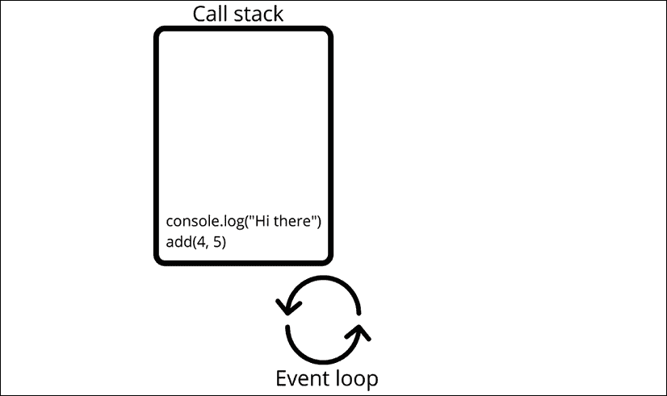
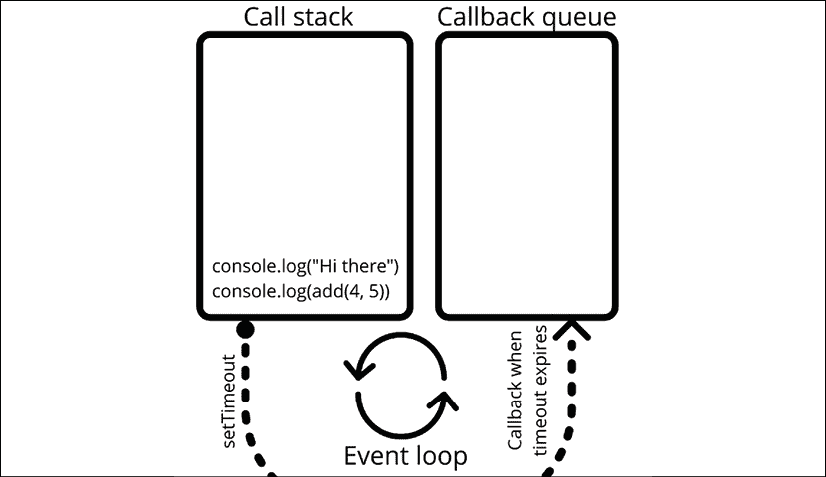
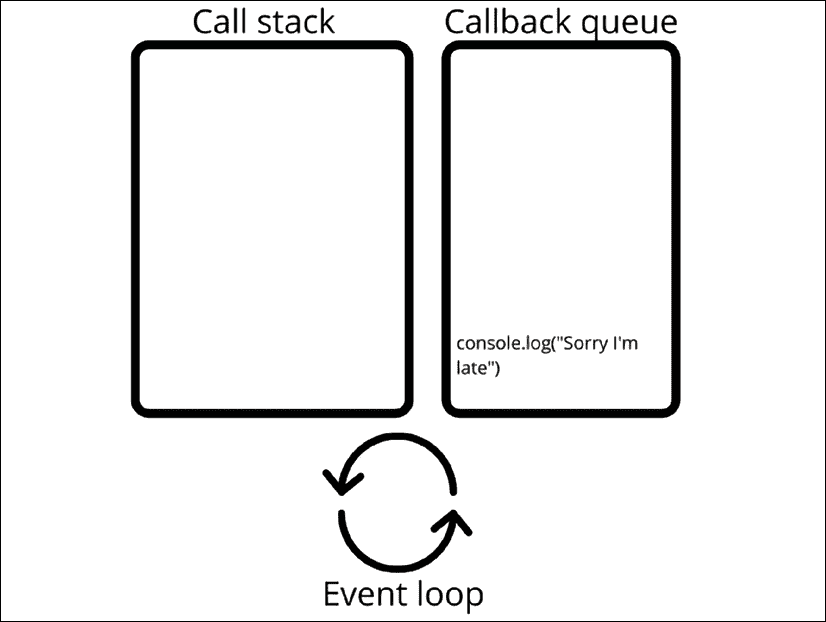

# 13

# 并发

是时候讨论一个更高级的话题了。你已经准备好了！我们将处理异步代码和代码多任务处理的选项。这个概念被称为并发。如果你觉得这一章有点困难，不要担心；这是在 JavaScript 中进行的编程，是高级编程。我们将处理以下主题：

+   并发

+   回调

+   Promise

+   `async`/`await`

+   事件循环

是的，这很困难，但理解如何利用并发确实可以通过加快处理速度来提高程序的性能，这足以让我们深入这个高级话题！

注意：练习、项目和自我检查测验的答案可以在*附录*中找到。

# 介绍并发

**并发**是指事物“同时”或*并行*发生。为了给出一个非代码的例子，让我们来谈谈管理我的家庭。当我在周五晚上回家时，我有一系列的任务：孩子们需要吃饭、洗澡，然后被带到床上，衣服需要叠好，洗衣机需要放衣服，而且公平地说，还有很多其他事情，但这些都足以说明例子。

如果我不能同时做很多事情，这将是一个非常艰难的夜晚，而且会非常晚。我首先会做晚饭——把披萨放进烤箱并站在旁边等待——喂孩子吃饭，然后给他们洗澡，然后把他们带到床上，然后叠衣服，再次打开机器，等待它完成。幸运的是，我能够多任务处理，所以看起来更像是这样：我把披萨放进烤箱，同时，我打开洗衣机并可能叠几件衣服，然后我喂孩子吃饭，在他们洗澡的时候做剩下的衣服，我很快就完成了。

这同样适用于你的电脑和你使用的应用程序。如果它不能同时做很多事情，你可能会非常烦恼。你不可能在写代码的同时检查邮件，你不可能在写代码的同时听音乐，还有很多其他事情。这是你的电脑在不同任务之间切换。同样的事情也可以在应用层面上发生。例如，我们可以调用某个 API，而不等待回复，而是在此期间做些有用的事情。我们可以使用**并发**的概念来实现这一点。

在处理并发时，JavaScript 中有三种策略你需要了解：**回调**、**Promise**以及**async**和**await**关键字。

# 回调

**回调**是我们讨论并发时应该首先理解的东西。好消息是，`回调`原则并不难理解。它只是一个接受另一个函数作为参数的函数，当初始函数的其余部分完成时，这个函数会被调用。换句话说，它只是一个函数调用另一个函数，就像这样：

```js
function doSomething(callback) {  
    callback();
}
function sayHi() {
    console.log("Hi!");
}
doSomething(sayHi); 
```

```js
Hi! printed to the console.
```

这里有一个`回调`原则实际应用的例子：

```js
function judge(grade) {
    switch (true) {
        case grade == "A":
            console.log("You got an", grade, ": amazing!");
            break;
        case grade == "B":
            console.log("You got a", grade, ": well done!");
            break;
        case grade == "C":
            console.log("You got a", grade, ": alright.");
            break;
        case grade == "D":
            console.log("You got a", grade, ": hmmm...");
            break;
        default:
            console.log("An", grade, "! What?!");
    }
}
function getGrade(score, callback) {
    let grade;
    switch (true) {
        case score >= 90:
            grade = "A";
            break;
        case score >= 80:
            console.log(score);
            grade = "B";
            break;
        case score >= 70:
            grade = "C";
            break;
        case score >= 60:
            grade = "D";
            break;
        default:
            grade = "F";
    }
    callback(grade);
}
getGrade(85, judge); 
```

这里有两个函数：`judge()` 和 `getGrade()`。我们用两个参数调用 `getGrade()` 函数：`85` 和函数 `judge()`。注意，在将函数作为参数调用时，我们不包括括号。`judge()` 函数被存储在 `callback` 中。在确定成绩后，存储在回调中的函数（在本例中为 `judge()`）会带着成绩被调用。

这也可以是另一个比判断更有用的函数，例如，根据测试结果发送特定的电子邮件。如果我们想要这样做，实际上我们不需要更改 `getGrade()` 函数；我们只需要编写一个新的函数来做这件事，并用这个新函数作为第二个参数调用 `getGrade()`。

你现在可能非常失望，因为这不是很令人兴奋。在异步上下文中，回调变得非常有价值，例如，当一个函数在调用数据库并调用将要处理数据的 `callback` 函数之前仍在等待数据库的调用结果时。

一些 JavaScript 内置函数使用这种回调原则，例如，`setTimeOut()` 和 `setInterval()` 函数。在超时的情况下，它们将执行一个在特定时间后执行的函数，对于指定的间隔，每隔一定时间执行一次。我们已经看到这些了，但只是为了提醒：

```js
setInterval(encourage, 500);
function encourage() {
    console.log("You're doing great, keep going!");
} 
```

作为参数插入的函数在这里被称为回调。真正理解并发性其实是从回调开始的，但是多层嵌套的回调会使代码难以阅读。

当所有这些都被写成一个函数，并且内部包含匿名函数时，这个函数的缩进也会很多。我们称之为 **回调地狱** 或 **圣诞树问题**（因为代码嵌套得如此之多，看起来像侧放的圣诞树）。

回调是一个很好的概念，但它们可以快速创建出丑陋的代码。通常有一个更好的解决方案，我们保证。

## 练习 13.1

这个练习将演示如何使用回调函数，通过调用回调函数创建一种从函数传递值到另一个函数的方法。我们将使用一个字符串中的全名创建一个问候回调。

1.  创建一个名为 `greet()` 的函数，它接受一个参数 `fullName`。该参数应该是一个数组。将数组的项输出到控制台，并插入到问候消息字符串中。

1.  创建第二个函数，它有两个参数：第一个是一个字符串，用于用户的完整名称，第二个是 `callback` 函数。

1.  使用 `split()` 方法将字符串拆分成一个数组。

1.  将全名数组发送到第一步中创建的 `greet()` 函数。

1.  调用 `callback` 函数的过程。

# Promises

使用 **Promises**，我们可以以稍微更容易维护的方式组织代码的顺序。Promise 是一个特殊的对象，它连接需要产生结果的代码和需要使用这个结果的下一步代码。

当我们创建一个 Promise 时，我们给它一个函数。在下面的例子中，我们使用了一个我们经常看到的约定；我们现场创建一个函数。所以，在参数列表中，我们定义了这个函数，通常也使用箭头函数。这个函数需要两个参数，这些参数是回调函数。我们在这里称它们为 `resolve` 和 `reject`。

你可以随意命名这些参数，但 `resolve` 或 `res` 和 `reject` 或 `rej` 是最常见的。

当调用 `resolve()` 时，假设 Promise 是成功的，并且箭头之间的任何内容都会返回并用作 Promise 对象上 `then()` 方法的输入。如果调用 `reject()`，则 Promise 失败，并且如果存在，Promise 对象上的 `catch()` 方法会使用 `reject()` 函数的参数执行。

这是一大堆信息，一开始可能难以理解，所以这里有一个 Promise 的例子来帮助你：

```js
let promise = new Promise(function (resolve, reject) {
    // do something that might take a while
    // let's just set x instead for this example  
    let x = 20;
    if (x > 10) {
        resolve(x); // on success
    } else {
        reject("Too low");  // on error
    }
});
promise.then(
    function (value) {
        console.log("Success:", value);
    },
    function (error) {
        console.log("Error:", error);
    }
); 
```

我们首先创建一个 Promise。在创建 `Promise` 时，我们不知道 `Promise` 的值将是什么。这个值就是发送给解析函数的参数。它是一种占位符。

所以当我们对 Promise 调用 `then()` 时，我们基本上是在说：找出 Promise 的值，当你知道时，如果 Promise 被解析，则执行一个函数，如果被拒绝，则执行不同的函数。当一个 Promise 既没有被解析也没有被拒绝时，我们说这个 Promise 是挂起的。

`then()` 本身也是一个 Promise，所以当它返回时，我们可以使用结果作为下一个 `then()` 实例的输入。这意味着我们可以链式调用 `then()` 实例，这可以看起来像这样：

```js
const promise = new Promise((resolve, reject) => {
    resolve("success!");
})
    .then(value => {
        console.log(value);
        return "we";
    })
    .then(value => {
        console.log(value);
        return "can";
    })
    .then(value => {
        console.log(value);
        return "chain";
    })
    .then(value => {
        console.log(value);
        return "promises";
    })
    .then(value => {
        console.log(value);
    })
    .catch(value => {
        console.log(value);
    }) 
```

这将记录：

```js
success!
we
can
chain
promises 
```

解析函数是用箭头函数实现的。`return` 语句是下一个函数的 `value` 输入。你可以看到最后一个块是一个 `catch()` 函数。如果任何一个函数导致拒绝，并且因此 Promise 被拒绝，那么这个 `catch()` 块就会被执行，并打印出 `reject()` 函数发送给 `catch()` 方法的任何内容。例如：

```js
const promise = new Promise((resolve, reject) => {
    reject("oops... ");
})
    .then(value => {
        console.log(value);
        return "we";
    })
    .then(value => {
        console.log(value);
        return "can";
    })
    .then(value => {
        console.log(value);
        return "chain";
    })
    .then(value => {
        console.log(value);
        return "promises";
    })
    .then(value => {
        console.log(value);
    })
    .catch(value => {
        console.log(value);
    }) 
```

这将只记录 `oops…`，因为第一个 Promise 被拒绝而不是解析。这对于创建需要等待另一个过程完成的异步过程非常有用。我们可以尝试执行一组特定的操作，如果出现问题，可以使用 `catch()` 方法来处理。

## 练习第 13.2 节的练习题

在这个练习中，你将创建一个计数器，它将使用 Promise 按顺序输出值。

1.  设置一个以 `Start Counting` 为值的 Promise。

1.  创建一个名为 `counter()` 的函数，该函数有一个参数，用于获取值并将其输出到控制台。

1.  使用四个 `then()` 实例设置 Promise 的下一个函数，这些实例应该将值输出到计数器函数中，并返回一个值，该值将为后续的 `then()` 实例提供输入。返回的值应该是 `one`，然后是 `two`，然后是 `three`。控制台屏幕输出应该是以下内容：

    ```js
    Start Counting
    One
    Two
    Three 
    ```

# async 和 await

我们刚刚看到了 `Promise` 语法。使用 `async` 关键字，我们可以让一个函数返回一个 Promise。这使得 Promise 更易于阅读，看起来很像同步（非并发）代码。我们可以像上一节学的那样使用这个 Promise，或者我们可以使用更强大的 `await` 关键字来等待 Promise 完成。`await` 只在异步函数中有效。

在异步上下文中，我们也可以等待其他 Promise，如下例所示：

```js
function saySomething(x) {
    return new Promise(resolve => {
        setTimeout(() => {
            resolve("something" + x);
        }, 2000);
    });
}
async function talk(x) {
    const words = await saySomething(x);
    console.log(words);
}
talk(2);
talk(4);
talk(8); 
```

你能弄清楚这段代码做了什么吗？我们连续三次调用异步函数 `talk()`，没有中断。每次函数调用都在等待 `saySomething()` 函数。`saySomething()` 函数包含一个新 Promise，它通过 `setTimeout()` 函数在两秒后解析为 `something` 加 `x` 的值。所以两秒后，三个函数同时完成（或者对人类眼睛来说是这样的）。

如果 `talk()` 函数不是异步的，它会因为 `await` 关键字而抛出 `SyntaxError`。`await` 只在异步函数中有效，所以 `talk()` 必须是异步的。如果没有这个例子中的 `async` 和 `await`，它将把函数 `saySomething()` 的结果，一个挂起的 `Promise`，以文字形式存储，并且每次函数调用时都记录一次：

```js
Promise { <pending> }
Promise { <pending> }
Promise { <pending> } 
```

我们现在已经看到了并发的基石。这应该为你在现实生活中处理并发做好准备。并发确实是一个高级话题；调试它可能会有些麻烦，但正确应用时在性能方面确实值得。

## 练习 13.3

这个练习将演示如何使用 `await` 在 `async` 函数中等待一个 `Promise`。使用 `await` 和 `async` 创建一个带有 `timeout()` 的计数器，并增加全局计数器值。

1.  为计数器创建一个全局值。

1.  创建一个函数，它接受一个参数。返回一个新 Promise 的结果，设置一个 `setTimeout()` 函数，该函数将包含解析实例。

1.  在 `setTimeout()` 中增加计数器的值，每秒增加一。用计数器的值和函数参数中的变量值解析 Promise。

1.  创建一个异步函数，将全局计数器的值和函数参数的值输出到控制台。

1.  创建一个变量来捕获 `await` 函数返回的解析值。将结果输出到控制台。

1.  创建一个循环，迭代 10 次，增加值并调用 `async` 函数，将增量变量的值作为参数传递给函数。

结果应该看起来像以下这样：

```js
ready 1 counter:0
ready 2 counter:0
ready 3 counter:0
x value 1 counter:1
x value 2 counter:2
x value 3 counter:3 
```

# 事件循环

我们希望以解释 JavaScript 在底层如何处理异步和并发来结束本章。JavaScript 是一种单线程语言。在这个上下文中，线程意味着一个**执行路径**。如果只有一个路径，这意味着任务将不得不相互等待，并且一次只能发生一件事情。

这个单一的执行器是**事件循环**。这是一个执行实际工作的进程。你可能对此感到疑惑，因为你刚刚学习了并发和异步同时执行事情。好吧，尽管 JavaScript 是单线程的，但这并不意味着它不能外包一些任务并等待它们返回。这正是 JavaScript 能够以多线程方式执行事情的原因。

## 调用栈和回调队列

JavaScript 使用**调用栈**，它必须执行的所有操作都排队在这里。事件循环是一个不断监控这个调用栈的进程，每当有任务要做时，事件循环就会逐个执行。最上面的任务先执行。

这里有一个小脚本：

```js
console.log("Hi there");
add(4,5);
function add(x, y) {
    return x + y;
} 
```

这是此脚本的调用栈和事件循环的可视化。



图 13.1：事件循环和调用栈的可视化

这里没有多线程在进行。但是它在这里：

```js
console.log("Hi there");
setTimeout(() => console.log("Sorry I'm late"), 1000);
console.log(add(4, 5));
function add(x, y) {
    return x + y;
} 
```

`setTimeout()`任务被外包给浏览器的 Web API（关于 API 的更多内容请见*第十五章*，*下一步*）。当它完成时，这会出现在一个特殊的地方：**回调队列**。当调用栈为空（并且只有在这种情况下！）时，事件循环会检查回调队列以查找要执行的工作。如果有任何等待的回调，它们将逐个执行。在每次操作之后，事件循环都会首先检查调用栈上的工作。

这是`setTimeout()`外包情况下的可视化：



图 13.2：`setTimeout`外包的可视化

当`setTimeout()`到期时，事件循环将完成调用栈上的所有工作，并检查回调队列，并执行那里的任何任务：



图 13.3：回调队列上的任务的可视化

这就是它将输出的内容：

```js
Hi there
9
Sorry I'm late 
```

让我们看看你是否很好地阅读了上面的文本。你认为当我们将计时器设置为`0`时会发生什么，就像这里一样？

```js
console.log("Hi there");
setTimeout(() => console.log("Sorry I'm late"), 0);
console.log(add(4,5));
function add(x, y) {
    return x + y;
} 
```

这将输出完全相同的内容。当计时器为`0`时，`setTimeout()`也将被外包。回调立即放入回调队列，但事件循环甚至不会检查回调队列，直到调用栈为空。所以它仍然会在`9`之后打印`Sorry I'm late`，尽管计时器为`0`。

# 章节项目

## 密码检查器

使用允许密码的数组，这个练习将创建一个应用程序来检查这些密码字符串值是否存在于一个列出所有接受密码的数组中。设置一个 Promise 来检查密码是否有效，并根据结果以状态为 true 解析或以状态为 false 拒绝。返回检查结果。

1.  创建一个允许密码的数组。

1.  创建一个登录函数，该函数将检查参数是否是包含在密码数组中的值。您可以使用`indexOf()`或`includes()`方法检查数组中的值并返回结果的布尔值。

    `includes()`方法是一个数组方法，可以检查某个值是否包含在数组中的项中。它将根据结果返回一个布尔值。

1.  添加一个返回 Promise 的函数。使用`resolve`和`reject`，返回一个 JavaScript 对象，其中包含布尔值`true`或`false`以指示密码的有效性状态。

1.  创建一个检查密码的函数，将密码发送到登录函数，并使用`then()`和`catch()`输出拒绝的密码或解析的密码的结果。

1.  向检查函数发送几个密码，一些在数组中，一些不在。

# 自我检查测验

1.  修复以下代码中的错误以使用`callback`函数：

    ```js
    function addOne(val){
      return val + 1;
    }
    function total(a, b, callback){
      const sum = a + b;
      return callback(sum);
    }
    console.log(total(4, 5, addOne())); 
    ```

1.  记录以下代码的结果：

    ```js
    function checker(val) {
      return new Promise((resolve, reject) => {
        if (val > 5) {
          resolve("Ready");
        } else {
          reject(new Error("Oh no"));
        }
      });
    }
    checker(5)
      .then((data) => {console.log(data); })
      .catch((err) => {console.error(err); }); 
    ```

1.  需要添加哪些代码行到前面的函数中，以确保函数运行后始终有一个结果，该结果确保单词`done`输出到控制台？

1.  更新以下代码，使函数返回一个 Promise：

    ```js
    function myFun() {
      return "Hello";
    }
    myFun().then(
      function(val) { console.log(val); },
      function(err) { conole.log(err); }
    ); 
    ```

# 摘要

在本章中，我们讨论了并发。并发使我们的代码能够同时做很多事情，我们可以使用回调、Promise 以及`async`和`await`关键字来确定事情的顺序。在您的应用程序和页面上实现这些功能将大大提高用户体验！现在的用户需求很高；如果一个网站加载不够快，他们会跳转（例如，回到 Google）。并发有助于更快地交付结果。

接下来的两章将介绍使用 JavaScript 进行现代 Web 开发，并将涉及 HTML5、JavaScript 以及现代 JavaScript 框架，这些框架是真正的变革者。
