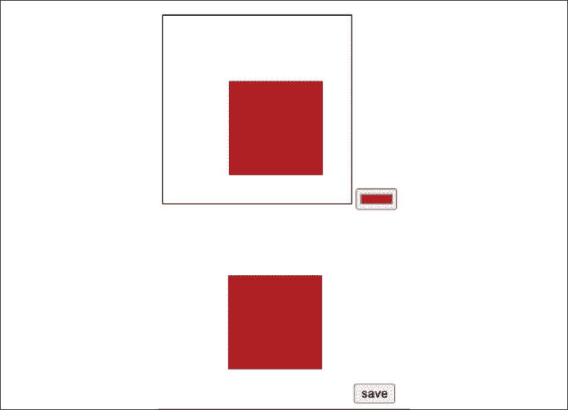

# HTML5、Canvas 和 JavaScript

HTML5 于 2012 年发布，并于 2014 年成为标准，这导致浏览器支持各种新功能。HTML5 的引入影响了通过 JavaScript 可用的可能性领域。自从 HTML5 引入以来，JavaScript 在图形、视频、图形交互等方面的选项大大增加，并且变革如此之大，以至于实际上导致了浏览器对 Flash 的支持终止。

HTML5 通过添加新元素，如`<header>`，使网页结构更加合理。同时，DOM 也有很大的改进，这导致了性能的提升。还有一些其他的新增功能，你将在本章中看到一些。这里值得提一下的另一个有趣（且有用）的新增功能是`<canvas>`元素，我们将在本章中介绍它。

JavaScript 已经为我们提供了许多惊人的功能，但与 HTML5 结合时，在创建动态交互式 Web 应用方面有更多的可能性。这种组合使我们能够提升我们的内容展示水平。现在我们可以在浏览器中处理文件，以及绘制 HTML5 画布，并向其添加图像和文本。

在本章中，我们将探讨 HTML5 为我们带来的令人惊叹的事物。这些主题并不直接相关，但它们有一个共同点，那就是它们都是通过强大的 HTML5 和 JavaScript 团队以及当然，它们都是有趣且有用的。它们将使你能够为你的应用程序的用户创造更加动态和交互式的体验。

本章将涵盖以下主题：

+   使用 JavaScript 介绍 HTML5

+   本地文件读取器

+   地理位置信息

+   HTML5 画布

+   动态画布

+   使用鼠标在画布上绘制

+   保存动态图像

+   页面上的媒体内容

+   数字无障碍

注意：练习、项目和自我检查测验的答案可以在*附录*中找到。

# 使用 JavaScript 介绍 HTML5

HTML5 正式上是 HTML 的一个版本。与它的前辈相比，它是一个巨大的进步，使我们能够在网络浏览器中制作完整的应用程序，甚至可以在离线状态下访问。当你看到工作描述中的 HTML5 时，它通常不仅仅是指 HTML。通常，HTML5 与 JavaScript、CSS、JSON 等其他技术的组合也包括在内。

自从 HTML5 以来，我们页面的结构得到了改善。我们有新的元素，如`<header>`、`<nav>`和`<article>`。我们可以使用`<video>`元素播放视频，这意味着我们不再需要 Flash，因为 HTML5 已经提供了这些功能。正如我们之前提到的，我们可以使用`<canvas>`元素在页面上创建视觉元素或表示动画、图表等视觉内容。一些过去必须使用 JavaScript 完成的事情现在可以仅使用 HTML 完成，例如向网页添加视频和音频。

DOM 的更改也提高了网页的加载时间。在本章中，我们将深入探讨一些 HTML5 特定功能。让我们从从浏览器访问文件开始。

# 本地文件读取器

自从 HTML5 以来，我们终于可以使用在浏览器中运行的 JavaScript 与本地文件进行交互，这是一个真正令人惊叹的功能。使用此功能，我们可以从我们的设备上传文件到我们的 Web 应用程序，并在应用程序中读取它们。这意味着我们可以将文件附加到表单中，例如，这在许多情况下都很好，无论我们出于何种目的需要上传某种类型的文件，例如，将简历添加到在线工作申请中。

让我们首先确保你使用的浏览器支持此功能。我们可以运行一个简单的脚本来检查它是否支持：

```js
<!DOCTYPE html>
<html>
  <body>
    <div id="message"></div>
    <script>
      let message = document.getElementById("message");
      if (window.FileReader) {
        message.innerText = "Good to go!";
      } else {
        message.innerText = "No FileReader :(";
      }
    </script>
  </body>
</html> 
```

如果你在这个文件中打开它，当你的浏览器支持文件读取时，它应该会显示 **一切正常**！如果它显示 **No FileReader :(**，请尝试更新你的浏览器或使用另一个浏览器。可以工作的浏览器示例包括 Chrome 和 Firefox。

## 上传文件

上传文件实际上比你想象的要简单。我们通过添加一个类型为 `file` 的输入来表示我们想要上传一个文件。以下是一个基本的脚本，它就是这样做的：

```js
<!DOCTYPE html>
<!DOCTYPE html>
<html>
  <body>
    <input type="file" onchange="uploadFile(this.files)" />
    <div id="message"></div>
    <script>
      let message = document.getElementById("message");
      function uploadFile(files) {
        console.log(files[0]);
        message.innerText = files[0].name;
      }
    </script>
  </body>
</html> 
```

它提供了一个带有 **选择文件** 按钮的空白 HTML 页面，以及其后的 **未选择文件** 注释。点击按钮会弹出文件系统，你可以选择一个文件。选择文件后，JavaScript 会被触发。正如你所看到的，我们正在发送在身体中激活的属性文件。这是一个文件列表。因此，我们正在获取列表中的第 0 个索引，即列表中的第一个元素。文件以对象的形式表示。

文件对象在这里被记录到控制台，这使你能够看到所有属性及其相关值。一些重要的属性是 `name`、`size`、`type` 和 `lastModified`，但还有很多其他属性。

我们将文件的名称放入我们的 `div` 消息的 `innerText` 中。因此，在屏幕上，你将看到文件名出现在 `div` 中。我们可以为多个文件做类似的事情。以下是同时上传多个文件的方法：

```js
<html>
  <body>
    <input type="file" multiple onchange="uploadFile(this.files)" />
    <div id="message"></div>
    <script>
      let message = document.getElementById("message");
      function uploadFile(files) {
        for (let i = 0; i < files.length; i++) {
          message.innerHTML += files[i].name + "<br>";
        }
      }
    </script>
  </body>
</html> 
```

我们已经将多个属性添加到我们的输入元素中。这改变了按钮上的文本；不再是 **选择文件**，而是现在说 **选择文件**，因此我们可以选择多个文件。

我们还通过添加循环稍微改变了我们的上传函数。并且，我们不再使用 `innerText`，而是现在使用 `innerHTML`，因为这样我们就可以使用 HTML 换行符插入一个换行。它将在屏幕上的输入框下方输出所有选定的文件名。

## 读取文件

有一个用于读取文件的特殊 JavaScript 对象。它有一个非常合适的名字：`FileReader`。以下是我们可以如何使用它来读取一个文件。

```js
<!DOCTYPE html>
<html>
  <body>
    <input type="file" onchange="uploadAndReadFile(this.files)" />
    <div id="message"></div>
    <script>
      let message = document.getElementById("message");
      function uploadAndReadFile(files) {
        let fr = new FileReader();
        fr.onload = function (e) {
          message.innerHTML = e.target.result;
        };
        fr.readAsText(files[0]);
      }
    </script>
  </body>
</html> 
```

正如你所看到的，我们必须指定为了将我们的 HTML 和 JavaScript 连接到文件需要发生什么。我们通过添加一个 `onload` 事件作为发送事件数据的匿名函数来完成此操作。

可以使用`FileReader`对象上的`readAs()`方法之一来读取数据。我们在这里使用了`readAsText()`，因为我们正在处理文本文件。这触发了实际的读取，并在完成后触发`onload`函数，将读取的结果添加到我们的消息中。这接受所有文件类型，但并非所有文件类型都有意义。

为了看到有意义的内容，我们必须上传包含纯文本的内容，例如`.txt`、`.json`和`.xml`。有了这些，我们还可以将文件发送到服务器或处理日志文件的内容。

## 练习 14.1

本练习将演示在您的网页中上传和显示本地图像文件的过程。使用以下 HTML 和 CSS 作为起始模板：

```js
<!doctype html>
<html>
<head>
    <title>Complete JavaScript Course</title>
    <style>
        .thumb {
            max-height: 100px;
        }
    </style>
</head>
<body>
    <input type="file" multiple accept="image/*" />
    <div class="output"></div>
    <script>

    </script>
</body>
</html> 
```

按以下步骤完成脚本元素：

1.  在您的 JavaScript 代码中，将页面元素作为变量对象中的值选择。

1.  向`input`字段添加事件监听器。应更改事件触发器，以便它立即调用读取器函数。

1.  创建一个函数来处理所选文件的读取。

1.  使用事件对象，选择触发事件的元素。获取该输入中选择的文件，并将它们分配给`files`变量。

1.  遍历所有选定的文件。

1.  在循环中将文件索引设置为名为`file`的变量。

1.  将图像文件设置为从用户输入字段中选择的循环内的文件。

1.  将新创建的`img`标签添加到页面中，创建一个页面区域以输出内容，并将新的页面元素附加到它上。

1.  创建一个新的`FileReader`对象。

1.  向`fileReader`对象添加一个`onload`事件监听器，创建并调用一个匿名函数，将图像的源设置为来自目标元素的输出。将您刚刚创建的图像对象作为参数传递给该函数。

1.  使用`readAsDataURL()`，获取当前文件对象并将其传递到文件读取器对象中，以便在`onload`完成后使用，并将其添加到页面中。

1.  您现在可以从计算机中选择多个图像文件，并在网页上显示它们。

# 使用地理位置获取位置数据

我们现在将查看窗口对象`navigator`，看看我们是否可以定位浏览器的用户。这可以用于许多事情，例如，建议用户附近的餐厅位置。我们可以通过检查`navigator.geolocation`来查看`GeoLocation`。这是其中一种方法：

```js
<!DOCTYPE html>
<html>
  <body>
    <script>
      window.onload = init;
      function init() {
        console.dir(navigator.geolocation);
      }
    </script>
  </body>
</html> 
```

如果你查看日志，你可以看到`GeoLocation`对象包含的内容，其中一种方法是通过获取用户的当前位置。以下是使用方法：

```js
<!DOCTYPE html>
<html>
  <body>
    <script>
      window.onload = init;
      function init() {
        navigator.geolocation.getCurrentPosition(showGeoPosition);
      }
      function showGeoPosition(data) {
        console.dir(data);
      }
    </script>
  </body>
</html> 
```

这可能比你预期的要复杂一些，这是因为`getCurrentPosition()`方法接受另一个方法作为参数。位置数据被发送到这个函数，而这个函数将使用这些数据作为输入。因此，我们必须将`console.dir()`包裹在一个外部函数（称为`showGeoPosition()`）中，该函数接受一个参数并输出这些数据，这样我们就可以在控制台中看到这些数据。然后我们可以将这个函数发送到`getCurrentPosition()`函数，并查看数据。

如果你运行这个程序，你应该会得到一个`GeolocationPosition`对象，其中包含一个`coords`属性，包含你的纬度和经度。浏览器可能会提示你是否同意分享你的位置。如果没有任何提示，请确保你的计算机的首选项和设置允许浏览器使用你的位置。

使用这个功能，你可以获取用户的地理位置，并根据它显示个性化的内容，或者为了其他目的收集他们的位置数据，例如分析访客的位置或根据用户的位置显示建议。

# HTML5 画布

我们已经提到过`<canvas>`元素是 HTML5 中的新元素了吗？这是一个令人惊叹的工具，可以帮助你创建动态的 Web 应用程序。以下是设置画布的方法：

```js
<!DOCTYPE html>
<html>
  <body>
    <canvas id="c1"></canvas>
    <script></script>
  </body>
</html> 
```

当你打开这个页面时，你将看不到任何内容。为什么？嗯，画布元素默认是一个白色的矩形，在白色背景上你无法看到它。你可以添加一些 CSS 来给画布添加边框或给主体添加背景颜色，这样你的画布就会显现出来。

但是，我们可能想在上面放置一些内容，并且我们需要 JavaScript 来实现这一点。让我们使用 JavaScript 在上面创建一个“绘图”：

```js
<!DOCTYPE html>
<html>
  <head>
    <style>
      canvas {
        border: 1px solid black;
      }
    </style>
  </head>
  <body>
    <canvas id="c1"></canvas>
    <script>
      let canvas = document.getElementById("c1");
      let ctx = canvas.getContext("2d");
      canvas.width = 500; //px
      canvas.height = 500; //px
      ctx.fillRect(20, 40, 100, 100);
    </script>
  </body>
</html> 
```

画布的上下文被读取并存储在`ctx`变量中（上下文的常见缩写）。我们需要这个变量来在画布上绘制。我们将画布的尺寸更改为`500`像素乘以`500`像素。这不同于使用 CSS 设置宽度和高度；这添加了 HTML 属性的`width`和`height`。

在画布的上下文中使用`fillRect()`方法，我们可以在画布上绘制一个矩形。它接受四个参数。前两个是图形应该添加到画布上的*x*和*y*坐标。最后两个是矩形的宽度和高度。在我们的例子中，它是一个正方形。以下是结果的样子：


图 14.1：fillRect()方法在我们 500 像素乘以 500 像素的画布上的结果

我们还可以更改我们绘制的颜色。你可以通过替换上一个 HTML 文档中的 JavaScript 代码，用以下代码来得到一个粉红色的方块：

```js
 <script>
      let canvas = document.getElementById("c1");
      let ctx = canvas.getContext("2d");
      canvas.width = 500; //px
      canvas.height = 500; //px
      ctx.fillStyle = "pink";
      ctx.fillRect(20, 40, 100, 100);
    </script> 
```

我们现在刚刚使用了单词 *pink*，但你也可以使用十六进制颜色代码为 `fillStyle` 属性工作，例如，对于粉红色可以是这样的：`#FFC0CB`。前两个字符指定红色量（这里为 `FF`），第三和第四个字符指定绿色量（`C0`），最后两个字符指定蓝色量（`CB`）。这些值从 `00` 到 `FF`（十进制数中的 0 到 255）不等。

你可以使用 canvas 做的事情远不止绘制。让我们看看如何将文本添加到我们的画布上。

## 练习 14.2

我们将实现形状，并使用 HTML5 canvas 元素通过 JavaScript 在网页上绘制。使用 JavaScript 绘制一个矩形。输出将类似于以下内容：


图 14.2：练习结果

按以下步骤操作：

1.  将 canvas 元素添加到页面中。

1.  将宽度和高度设置为 640 像素，并使用 CSS 为元素添加 1 像素的边框。

1.  在 JavaScript 中，选择 canvas 元素并将 `Context` 设置为 `2d`。

1.  将填充样式设置为红色。

1.  使用矩形创建形状的输出。

1.  设置矩形的轮廓。

1.  清除矩形内部的填充，使其透明并显示背景颜色。

# 动态画布

我们可以绘制更复杂的形状，添加图像和文本。这使得我们可以将我们的画布技能提升到下一个层次。

## 向画布添加线条和圆形

这里我们将看到如何绘制线条和圆形。以下是一段示例代码，用于绘制线条：

```js
<!DOCTYPE html>
<html>
  <head>
    <style>
      #canvas1 {
        border: 1px solid black;
      }
    </style>
  </head>
  <body>
    <canvas id="canvas1"></canvas>
    <script>
      let canvas = document.getElementById("canvas1");
      let ctx = canvas.getContext("2d");
      canvas.width = 100;
      canvas.height = 100;
      ctx.lineWidth = 2;
      ctx.moveTo(0, 20);
      ctx.lineTo(50, 100);
      ctx.stroke();
    </script>
  </body>
</html> 
```

线宽设置为 `2` 像素。这首先将焦点放在 `0` (*x*) 和 `20` (*y*)。这意味着它位于画布的非常左侧边缘，距离顶部 `20` 像素。这个画布较小；它是 `100` x `100` 像素。第二个点是 `50` (*x*) 和 `100` (*y*)。这就是线的样子：


图 14.3：绘制线条到画布的结果

在我们转向文本之前，这是绘制圆形的方法。

```js
<!DOCTYPE html>
<html>
  <head>
    <style>
      #canvas1 {
        border: 1px solid black;
      }
    </style>
  </head>
  <body>
    <canvas id="canvas1"></canvas>
    <script>
      let canvas = document.getElementById("canvas1");
      let ctx = canvas.getContext("2d");
      canvas.width = 150;
      canvas.height = 200;
      ctx.beginPath();
      ctx.arc(75, 100, 50, 0, Math.PI * 2);
      ctx.stroke();
    </script>
  </body>
</html> 
```

我们使用 `arc()` 方法来创建曲线或圆形。它需要五个参数：

+   画布上的起始位置 x

+   画布上的起始位置 y

+   圆的半径

+   起始角度（以弧度为单位）

+   结束角度（以弧度为单位）

因此，如果我们不想画圆形，而是画半圆形，例如，我们必须指定不同的起始和结束角度（以弧度为单位）。这次我们使用了 `stroke()` 方法来实际绘制，而不是 `fill()` 方法：


图 14.4：使用 arc() 方法绘制圆形的结果

`stroke()` 只绘制线条，而 `fill()` 则填充整个形状。

在 canvas 中，形状和线条将根据它们绘制的顺序叠加。你首先绘制的形状会在后面的形状下面。当你实际在画布上绘画时，情况正是如此。你将在下一个练习中看到这一点。

### 练习 14.3

在这个练习中，你将使用画布绘制一个棒人：


图 14.5：在网页浏览器画布元素内的练习结果

1.  创建页面元素并准备在画布上绘制。

1.  从你的画布对象的顶部中心大致开始路径。

1.  使用`arc()`设置左眼的位置，大约在刚刚绘制的弧的中心顶部左侧，然后添加另一个弧来绘制右眼。创建一个半圆来代表嘴巴（半圆的弧度角是π）并填充所有。

1.  将绘制位置移动到中心并绘制一个代表鼻子的线条。

1.  用从弧的中心向下的线条绘制身体，创建左臂，然后移动绘制位置来绘制右臂，其宽度是左臂的两倍。回到中心并继续向下绘制左腿，回到中心，绘制右腿的线条。

1.  移动到顶部，设置颜色为蓝色，并绘制一个代表帽子的三角形。

## 添加文本到画布

我们也可以以类似的方式向画布添加文本。在这个例子中，我们设置了一个字体和字体大小，然后将文本写入画布：

```js
<!DOCTYPE html>
<html>
  <head>
    <style>
      #canvas1 {
        border: 1px solid black;
      }
    </style>
  </head>
  <body>
    <canvas id="canvas1"></canvas>
    <script>
      let canvas = document.getElementById("canvas1");
      let ctx = canvas.getContext("2d");
      canvas.width = 200;
      canvas.height = 200;
      ctx.font = "24px Arial";
      let txt = "Hi canvas!";
      ctx.fillText(txt, 10, 35);
    </script>
  </body>
</html> 
```

使用`fillText()`方法来添加文本。我们必须指定三个参数：文本、*x*位置和*y*位置。这里是结果：


图 14.6：使用`fillText()`方法的结果

我们已经指定文本从顶部开始的位置为`35`像素。我们可以指定文本的其他方面，例如，如下所示：

```js
ctx.textAlign = "center"; 
```

在这里，我们使用画布上的`textAlign`属性来指定文本应该如何对齐。

### 练习 14.4

我们将处理文本并在你的画布元素中添加文本。以下练习将演示如何动态添加文本并在你的画布元素内定位它。练习代码的结果将类似于这个图示：


图 14.7：练习结果

采取以下步骤：

1.  创建一个简单的 HTML 文档，并将画布元素添加到你的页面中。将高度和宽度设置为`640`，并为元素添加一个`1`像素的边框，以便你可以在页面上看到它。

1.  将页面元素作为 JavaScript 变量中的值选择。

1.  创建一个包含消息`Hello World`的字符串变量。

1.  使用`font`属性设置字体样式，使用`fillStyle`属性设置蓝色填充颜色。你还可以将文本对齐到左侧。

1.  使用`fillText`将文本添加到画布上，并设置文本的*x*和*y*位置。

1.  设置新的字体和红色颜色。

1.  创建一个循环，并使用循环变量的值向页面画布元素添加文本。

## 向画布添加和上传图像

我们可以向画布添加一个图像。我们可以简单地从我们的页面中获取一个图像，并将其添加到我们的画布上：

```js
<!DOCTYPE html>
<html>
  <head>
    <style>
      canvas {
        border: 1px solid black;
      }
    </style>
  </head>
  <body>
    <canvas id="c1"></canvas>
    
    <script>
      window.onload = function () {
        let canvas = document.getElementById("c1");
        canvas.height = 300;
        canvas.width = 300;
        let ctx = canvas.getContext("2d");
        let myImage = document.getElementById("flower");
        ctx.drawImage(myImage, 10, 10);
      };
    </script>
  </body>
</html> 
```

我们在这里将其包裹在一个`onload`事件监听器中，因为我们想确保在从 DOM 中获取图像之前图像已经加载完成，否则画布将保持空白。我们使用`drawImage()`方法将图像添加到画布上。它需要三个参数：*图像*、*x*位置和*y*位置。

我们也可以在另一个画布内部使用一个画布。我们这样做的方式与使用图像时完全一样。这是一个非常强大的功能，因为它使我们能够使用用户输入的一部分绘图，例如。让我们看看如何做到这一点的一个例子：

```js
<!DOCTYPE html>
<html>
  <head>
    <style>
      canvas {
        border: 1px solid black;
      }
    </style>
  </head>
  <body>
    <canvas id="canvas1"></canvas>
    <canvas id="canvas2"></canvas>
    <canvas id="canvas3"></canvas>
    <script>
      let canvas1 = document.getElementById("canvas1");
      let ctx1 = canvas1.getContext("2d");
      ctx1.strokeRect(5, 5, 150, 100);
      let canvas2 = document.getElementById("canvas2");
      let ctx2 = canvas2.getContext("2d");
      ctx2.beginPath();
      ctx2.arc(60, 60, 20, 0, 2 * Math.PI);
      ctx2.stroke();
      let canvas3 = document.getElementById("canvas3");
      let ctx3 = canvas3.getContext("2d");
      ctx3.drawImage(canvas1, 10, 10);
      ctx3.drawImage(canvas2, 10, 10);
    </script>
  </body>
</html> 
```

我们创建了三个画布，其中两个添加了形状，第三个是前两个的组合。看起来是这样的：


图 14.8：结果：三个带有形状的画布

我们还可以将图像上传到画布上。当您想向用户展示刚刚上传的内容的预览时，例如个人资料图片，这非常有用。这非常类似于从网页中抓取``元素并使用该元素，但这次我们需要从上传的文件中读取数据，创建一个新的图像元素，然后将该图像绘制到画布上。

以下代码就是这样做：

```js
<html>
  <head>
    <style>
      canvas {
        border: 1px solid black;
      }
    </style>
  </head>
  <body>
    <input type="file" id="imgLoader" />
    <br>
    <canvas id="canvas"></canvas>
    <script>
      let canvas = document.getElementById("canvas");
      let ctx = canvas.getContext("2d");
      let imgLoader = document.getElementById("imgLoader");
      imgLoader.addEventListener("change", upImage, false);
      function upImage() {
        let fr = new FileReader();
        fr.readAsDataURL(event.target.files[0]);
        fr.onload = function (e) {
          let img = new Image();
          img.src = event.target.result;
          img.onload = function () {
            canvas.width = img.width;
            canvas.height = img.height;
            ctx.drawImage(img, 0, 0);
          };
          console.log(fr);
        };
      }
    </script>
  </body>
</html> 
```

每当输入字段的输入发生变化时，`upImage()`方法就会被执行。这个方法做了一些事情，所以让我们来分解一下。首先，我们创建一个新的`FileReader`并添加上传的文件。在这种情况下只有一个，所以我们使用索引`0`。与我们已经看到的`readAsText()`不同，我们现在使用`readAsDataURL()`，我们可以用它来读取图像。

这将触发`onload`事件。在我们的情况下，这会创建一个可以稍后添加到画布中的新图像。作为一个源，我们添加我们读取操作的结果，当图像加载完成后，我们将画布的大小更改为图片的大小，然后将图片添加进去。

这些新技能将使您能够在画布上处理图像，绘制自己的图像，从其他地方上传图像，甚至重用网页上的图像。这在许多情况下都很有用，例如，创建基本动画，或者创建上传新个人资料图片到用户个人资料的功能。

### 练习 14.5

我们将练习将本地图像上传到画布。以下练习将演示如何从您的本地计算机上传图像，并在浏览器中的画布元素内显示它们。

1.  设置页面元素，并添加一个输入字段来上传图像。将画布元素添加到页面中。

1.  在 JavaScript 中，选择输入字段和画布元素作为 JavaScript 对象。

1.  添加一个事件监听器，在输入字段内容发生变化时调用上传函数。

1.  创建上述函数来处理图像上传到画布的操作。使用 `FileReader` 创建一个新的 `FileReader` 对象。在 `reader.onload` 事件中，创建一个新的图像对象。

1.  将 `onload` 监听器添加到图像对象中，以便在图像加载时，将画布的高度和宽度设置为图像高度和宽度的一半。使用 `ctx.drawImage()`，将图像添加到画布上。

1.  将 img 的源设置为输入值的输出结果。

1.  使用读取器对象并调用 `readAsDataURL()` 将文件输入值转换为可读的 base64 图像数据格式，该格式可用于画布中。

## 向画布添加动画

使用我们迄今为止看到的方法，我们已经开始创建动画。我们通过使用循环和递归，结合 `timeout()` 来实现这一点。这些带有（短）时间间隔的绘图会导致动画。让我们从一个基本的动画开始：

```js
<!DOCTYPE html>
<html>
  <head>
    <style>
      canvas {
        border: 1px solid black;
      }
    </style>
  </head>
  <body>
    <canvas id="canvas"></canvas>
    <script>
      window.onload = init;
      var canvas = document.getElementById("canvas");
      var ctx = canvas.getContext("2d");
      canvas.height = 500;
      canvas.width = 500;
      var pos = {
        x: 0,
        y: 50,
      };
      function init() {
        draw();
      }
      function draw() {
        pos.x = pos.x + 5;
        if (pos.x > canvas.width) {
          pos.x = 0;
        }
        if (pos.y > canvas.height) {
          pos.y = 0;
        }
        ctx.fillRect(pos.x, pos.y, 100, 100);
        window.setTimeout(draw, 50);
      }
    </script>
  </body>
</html> 
```

这将从位置 `5`，`50` 开始绘制一个正方形。然后 `50` 毫秒后，它将在位置 `10`，`50` 处绘制另一个正方形，然后是 `15`，`50`。它将不断通过 `5` 改变这个 *x* 值，直到 *x* 大于画布的宽度，此时它被设置为零。这样，该行最后一点白色画布也会被着色成黑色。

目前，它更像是创建一条线，而不是移动的正方形。这是因为我们不断将着色部分添加到画布上，但没有将其重置为之前的颜色。我们可以使用 `clearRect()` 方法来做这件事。此方法接受四个参数。前两个参数是绘制要清除的矩形的起点（即 *x*，*y*）。第三个参数是要清除的矩形的 `width`，最后一个参数是 `height`。为了清除整个画布，我们必须编写：

```js
ctx.clearRect(0, 0, canvas.width, canvas.height); 
```

将此添加到我们之前示例中的 draw 函数的开头，结果是一个移动的正方形而不是一条粗线被绘制出来，因为之前的正方形没有被保留，但画布每次都会重置，正方形是从头开始绘制的。

### 练习 14.6

我们将练习在页面上动画化形状和移动对象。这个练习将演示如何使用 HTML5 画布元素和 JavaScript 在页面上移动一个对象。


图 14.9：红色圆圈在画布对象边界内移动

按以下步骤创建一个红色圆圈，然后将其移动到画布边界内，看起来像是在反弹：

1.  创建画布并给它应用 1 像素的边框。

1.  使用 JavaScript 选择画布页面元素并准备在画布上绘图。

1.  创建变量来跟踪 *x* 和 *y* 位置，以及 *x* 方向速度和 *y* 方向速度。你可以将这些设置为默认值 `1`，而 *x* 和 *y* 的起始位置可以是画布尺寸的一半。

1.  创建一个函数来绘制球。这将把球绘制成*x*和*y*位置的红色球弧。此外，球的尺寸应该作为一个变量设置，以便可以从它计算出边界。填充并关闭路径。

1.  创建一个函数来移动球，并将该函数的间隔设置为 10 毫秒。

1.  在上述移动函数中，清除当前矩形并使用绘制球函数绘制球。

1.  检查球的位置。如果球在画布边界之外，你需要改变方向。这可以通过将方向乘以-1 来实现。使用新值更新*x*和*y*的位置。

# 使用鼠标在画布上绘图

我们已经有了所有创建一个我们可以用鼠标在上面绘图的画布的原料。让我们带你了解一下。我们将从设置画布开始：

```js
<!DOCTYPE html>
<html>
  <head>
    <style>
      canvas {
        border: 1px solid black;
      }
    </style>
  </head>
  <body>
    <canvas id="canvas"></canvas>
    <input type="color" id="bgColor" />
    <script>
      let canvas = document.getElementById("canvas");
      let ctx = canvas.getContext("2d");
      canvas.width = 700;
      canvas.height = 700;
    </script>
  </body>
</html> 
```

在我们的脚本元素中，我们将添加一个当窗口加载完成时的方法。当窗口加载完成后，我们需要添加一些事件监听器：

```js
window.onload = init; // add this line to the start of the script
function init() {
  canvas.addEventListener("mousemove", draw);
  canvas.addEventListener("mousemove", setPosition);
  canvas.addEventListener("mouseenter", setPosition);
} 
```

我们希望在鼠标移动时进行绘图，并且希望在鼠标移动时更改画布上的当前位置。这也是我们在`mouseenter`时想要做的事情。让我们编写设置位置的代码。这将添加到脚本元素中。我们还需要添加位置变量，它再次应该在脚本开始时声明：

```js
let pos = {
  x: 0,
  y: 0,
}; 
```

以及设置位置的函数：

```js
function setPosition(e) {
  pos.x = e.pageX;
  pos.y = e.pageY;
} 
```

这个函数在`mousemove`和`mouseenter`事件上被触发。触发此事件的事件具有`pageX`和`pageY`属性，我们可以使用这些属性来获取鼠标的当前位置。

在画布上绘图的最后一个必备元素是`draw()`方法。下面是它可能的样子：

```js
function draw(e) {
   if (e.buttons !== 1) return;
   ctx.beginPath();
   ctx.moveTo(pos.x, pos.y);
   setPosition(e);
   ctx.lineTo(pos.x, pos.y);
   ctx.lineWidth = 10;
   ctx.lineCap = "round";
   ctx.stroke();
} 
```

我们从一个可能看起来很奇怪的东西开始，但这是一个确保鼠标实际上被点击的绝佳技巧。我们不希望在没有任何鼠标按钮被点击时进行绘图。这个方法通过在未点击时从方法中返回来防止这种情况。

然后我们开始绘制路径。我们始终有一个当前的*x*和*y*，所以它们被设置为坐标一，然后我们再次设置它们，并使用这些新坐标来绘制线条。我们给它一个圆角线条端点以实现平滑的线条，并设置线条宽度为`10`。然后我们绘制线条，只要鼠标在移动，`draw()`函数就会被再次调用。

应用程序现在可以打开并作为一个功能性的绘图工具使用。我们还可以在这里为用户提供更多选项，例如，添加一个颜色选择器来更改用户绘制的颜色。为了做到这一点，我们将在 HTML 中添加一个颜色选择器，如下所示：

```js
<input type="color" id="bgColor" /> 
```

然后在 JavaScript 中通过添加一个事件监听器来更改选定的颜色，当输入框的值发生变化时：

```js
let bgColor = "pink";
let bgC = document.getElementById("bgColor");
bgC.addEventListener("change", function () {
    bgColor = event.target.value;
}); 
```

我们从粉红色开始，并用用户在颜色选择器中选择的颜色覆盖它。

## 练习 14.7

我们将创建一个在线绘图板，并包括宽度、颜色和擦除当前绘图的动态值。使用以下 HTML 作为此项目的模板，以添加 JavaScript 代码：

```js
<!doctype html>
<html>
<head>
    <style>
        canvas {
            border: 1px solid black;
        }
    </style>
</head>
<body>
    <div class="controls">
        <button class="clear">Clear</button> <span>Color
            <input type="color" value="#ffff00" id="penColor"></span> <span>Width
            <input type="range" min="1" max="20" value="10" id="penWidth"></span> </div>
    </div>
    <canvas id="canvas"></canvas>
    <script>

    </script>
</body>
</html> 
```

执行以下步骤：

1.  在 JavaScript 中将页面元素作为变量对象选择。获取输入字段并选择按钮作为对象。

1.  为按钮添加事件监听器，以运行一个函数来清除当前画布。在 clear 函数中，使用`confirm()`方法检查用户是否想要擦除画布绘图。如果他们确认使用`clearRect()`，则删除画布元素的内容。

1.  为*x*和*y*设置全局位置对象，并通过添加鼠标事件的事件监听器来更新位置。如果鼠标移动被触发，则调用 draw 函数。设置位置以更新鼠标位置，将全局位置值设置为鼠标的*x*和*y*。

1.  在 draw 函数中，检查鼠标按钮是否被按下，如果没有，则添加`return`。如果按下，我们就可以在画布上绘制。设置新的路径并移动到*x*和*y*的位置。开始一条新线，从颜色输入字段获取`strokestyle`值，并从输入宽度值设置`linewidth`值。添加`stroke()`方法以将新线添加到页面上。

# 保存动态图像

我们可以将画布转换为图像，然后作为下一步将其保存。为了将其转换为图像，我们需要在脚本元素中添加以下内容：

```js
let dataURL = canvas.toDataURL();
document.getElementById("imageId").src = dataURL; 
```

我们正在将画布转换为数据 URL，这将成为我们图像的来源。我们希望在点击保存按钮时发生此操作。以下是按钮：

```js
<input type="button" id="save" value="save" /> 
```

事件监听器：

```js
document.getElementById("save").addEventListener("click", function () {
  let dataURL = canvas.toDataURL();
  document.getElementById("holder").src = dataURL;
}); 
```

现在每当点击保存按钮时，它将使用从画布生成的数据 URL 更新图像。画布元素内的任何内容都将转换为 base64 数据图像值，并添加到页面的 img 标签内。

在以下示例中，有一个 200x200 像素的画布和一个相同大小的空图像。当选择一种颜色时，在画布上绘制一个 100x100 像素的正方形。当点击保存按钮时，这个画布被转换为图像。然后可以保存这个图像。以下是示例的代码：

```js
<!doctype html>
<html>
<head>
    <style>
        canvas {
            border: 1px solid black;
        }
    </style>
</head>
<body>
    <canvas id="canvas"></canvas>
    <input type="color" id="squareColor" />
    <br>
    
    <input type="button" id="save" value="save" />
    <script>
        const canvas = document.getElementById("canvas");
        const ctx = canvas.getContext("2d");
        canvas.width = 200;
        canvas.height = 200;
        const penColor = document.getElementById("squareColor");
        penColor.addEventListener("change", function () {
            color = event.target.value;
            draw(color);
        });
        document.getElementById("save").addEventListener("click", function () {
            let dataURL = canvas.toDataURL();
            document.getElementById("holder").src = dataURL;
        });
        function draw(color) {
            ctx.fillStyle = color;
            ctx.fillRect(70, 70, 100, 100);
        }
    </script>
</body>
</html> 
```

以下是保存图像后的样子：



图 14.10：保存图像的结果

# 页面上的媒体

页面上有特殊的媒体元素。我们将向您展示如何添加音频和视频，以及如何在网页上嵌入 YouTube。

将音频播放器添加到页面非常简单：

```js
<!DOCTYPE html>
<html>
  <body>
    <audio controls>
      <source src="img/sound.ogg" type="audio/ogg">
      <source src="img/sound.mp3" type="audio/mpeg">
    </audio>
  </body>
</html> 
```

如果你希望用户能够控制暂停和播放以及音量，请指定`controls`属性。如果你想让它自动播放，你必须添加`autoplay`属性。通过源元素，你指定可以播放的音频文件。浏览器将只选择一个，并且会选择它支持的第一个（从上到下）。

将视频添加到网页上与添加音频非常相似。以下是这样做的方法：

```js
<video width="1024" height="576" controls>
    <source src="img/movie.mp4" type="video/mp4">
    <source src="img/movie.ogg" type="video/ogg">
</video> 
```

经常你会想要链接到 YouTube。以下是这样做的方法：

```js
<iframe
    width="1024"
    height="576"
    src="img/v6VTv7czb1Y"
>
</iframe> 
```

你将不得不使用`iframe`元素。这是一个特殊的元素，它允许在当前网页内嵌入另一个网页。然后你可以将 YouTube 嵌入链接作为源。`embed`之后的最后一段代码来自视频 URL。

视频的高度和宽度属性可以被改变以使视频变大或变小。如果你想全屏显示，你可以这样更改宽度和高度：

```js
<iframe
  width="100%"
  height="100%"
  src="img/v6VTv7czb1Y"
>
</iframe> 
```

如果你只想让它占据屏幕的一部分，你可以相应地调整宽度和高度属性。

你也可以使用`autoplay`属性来自动播放这些视频。如果你在多个视频上使用自动播放，那么它们都不会自动播放，以保护访客免受网页上所有噪音的干扰。如果你的视频在浏览器中开始发出噪音，这通常被认为是令人烦恼的。添加`muted`属性可以避免这种情况。

# HTML 中的数字无障碍性

对于视觉障碍人士或无法使用鼠标的人来说，数字无障碍性非常重要。为了使用互联网，即使视力很小或没有视力，也需要屏幕阅读器。这是一款特殊的软件，它读取屏幕上的内容或使用连接到计算机的特殊设备将其转换为盲文。无法使用鼠标的人通常会依赖语音来给计算机下达指令。

早期的网络应用在无障碍性方面非常糟糕。幸运的是，WAI-ARIA 创建了一个技术规范，说明了如何使互联网数字无障碍。如果正确实现，动态部分可以被识别，通过向 HTML 添加语义和元数据，它对外部工具的使用性更好。

语义可能是这里最重要的部分之一。这归结为使用正确的 HTML 元素来实现正确的目的。如果某个元素应该被点击，最好将其制作成`<button>`元素，而不是例如`<span>`。如果它是一个按钮，那么可以使用`Tab`键导航到它，并使用`Enter`键点击它。

这同样适用于标题。你可以使用特殊类创建看起来像标题的东西，并给它一个布局，但屏幕阅读器正在寻找`h1`、`h2`和`h3`。你应该始终使用标题元素来表示标题。这有助于屏幕阅读器并提高你网站的可用性。而且作为一个额外的好处，它还有助于你在 Google 上获得更高的排名，因为爬虫也会检查标题以了解你网站上什么内容是重要的。

使用描述性的标签和链接文本也很重要。如果链接部分只是**点击此处**，那没有帮助。像**点击此处注册夏季活动**这样的描述要好得多。

在这本书的整个过程中，我们也对我们的输入框做了一些错误的事情。为了使输入字段可访问，您必须添加一个标签元素。这将使屏幕阅读器更容易识别输入框的内容。所以这通常是不良的做法：

```js
<input type="text" id="address" /> 
```

这要好得多，因为现在屏幕阅读器也可以读取它了（因此视力受损的人可以理解它）：

```js
<label for="address">Address:</label>
<input type="text" id="address" /> 
```

最后一个你可能已经知道的是图像的`alt`属性。如果屏幕阅读器遇到图像，它将读取`alt`描述。所以请确保这些描述是描述性的，即使图像不是很重要。由于显然无法知道它不是重要的，因为你无法看到图像，所以你唯一知道的是你无法看到一些图片。以下是添加`alt`文本的方法：

```js
 
```

这些技巧对于练习和测试目的并不是很重要，但当你准备创建专业应用程序时，它们非常有用。考虑到可访问性会使你的应用程序对每个人来说都更容易访问。而且正如我所说，谷歌（目前）将通过提高你的排名来奖励这种良好的行为，你的应用程序将更有利可图，因为更多的人可以使用它！

# 章节项目

## 创建矩阵效果

此练习将创建一个从顶部到底部移动的文本连续动画。最终产生的效果将显示字符在画布元素中向下移动，并在接近屏幕底部时消失和淡出，因为将会有更多的新字符添加到画布中替代它们。随机字符可以是 0 或 1，并且将根据数字在相应位置上就位，这代表字符绘制的垂直位置。

画布将被填充为黑色背景，这将使用不透明度在重新绘制时创建淡出效果：


图 14.11：期望的矩阵效果

请按照以下步骤操作：

1.  创建一个简单的 HTML 文档，并在 JavaScript 中创建一个画布元素，并将`getContent`元素作为`2d`添加。

1.  选择那个画布元素，并将高度和宽度属性设置为 500x400。将其添加到文档的主体中。

1.  创建一个名为`colVal`的空数组，并创建一个循环向数组中添加若干项，这些项的值将为 0。您需要添加到数组中的项数可以通过将宽度除以十来确定，这应该是每列之间的宽度。数组中的值将是您将要设置的`fillText()`方法的起始垂直位置。

1.  创建一个主要矩阵函数，以 50 毫秒的间隔运行。

1.  将`fillStyle`设置为黑色，不透明度为.05，这样当它覆盖在现有元素上时，会产生一种渐变效果。

1.  将画布字体颜色设置为绿色。

1.  使用数组映射，迭代`colVal`数组中当前的所有项，该数组包含输出文本的垂直位置。

1.  在映射中设置要显示的字符。我们希望它在 0 和 1 之间交替，因此使用`Math.random()`生成文本输出的 0 或 1 值。你可以使用三元运算符来完成此操作。

1.  使用索引值乘以 10 来设置 x 的位置，这是每个新字母的开始。使用`colVal`数组中的索引，这将创建移动字符的单独列。

1.  使用 ctx `fillText()`方法在画布中创建字符，将输出字符设置为随机的 0 或 1 值，使用`posX`作为列*x*位置，以及`posY`，它是`colVal`数组中项的值，作为输出*y*轴的位置。

1.  添加一个条件来检查*y*的位置是否大于 100 加上 0-300 的随机值。数字越大，它在*y*位置上的下落时间就越长。这是随机的，所以不是所有数字都结束在同一个位置。这将产生初始下落后的一种错落效果。

1.  如果*y*的位置没有超过随机值和 100，则将索引项的值增加 10。将这个*y*的值重新分配给`colVal`数组中的项，这样它就可以在下一个迭代中使用。这将使字母在下一个绘制回合中在画布上向下移动 10 像素。

## 倒计时时钟

这个练习将产生一个实时倒计时时钟，它将显示输入日期字段中剩余的天数、小时、分钟和秒。调整输入日期字段将更新倒计时时钟。它还将使用本地存储来捕获和保存输入字段的值，因此如果刷新页面，输入字段将仍然保留日期值，倒计时时钟可以继续从输入字段向下计数到该日期值。你可以使用以下 HTML 模板：

```js
<!doctype html>
<html>
<head>
    <title>JavaScript</title>
    <style>
        .clock {
            background-color: blue;
            width: 400px;
            text-align: center;
            color: white;
            font-size: 1em;
        }
        .clock>span {
            padding: 10px;
            border-radius: 10px;
            background-color: black;
        }
        .clock>span>span {
            padding: 5px;
            border-radius: 10px;
            background-color: red;
        }
        input {
            padding: 15px;
            margin: 20px;
            font-size: 1.5em;
        }
    </style>
</head>
<body>
    <div>
        <input type="date" name="endDate">
        <div class="clock"> <span><span class="days">0</span> Days</span> <span><span class="hours">0</span>
                Hours</span> <span><span class="minutes">0</span> Minutes</span> <span><span class="seconds">0</span>
                Seconds</span>
        </div>
    </div>
    <script>
    </script>
</body>
</html> 
```

我们已经创建了页面元素，包括类型为日期的输入，主要的`clock`容器，并为`days`、`hours`、`minutes`和`seconds`添加了 span 标签。它们已经根据需要进行了标记并应用了 CSS 样式。

你可以采取以下步骤：

1.  将页面元素作为 JavaScript 对象选择，以及将主时钟输出区域作为 JavaScript 对象的值。

1.  为`timeInterval`创建变量以及一个全局布尔值，该布尔值可以用来停止时钟计时器。

1.  检查本地存储中是否已经设置了倒计时项。如果有，则使用该值。

1.  创建一个条件和函数来启动时钟，将其设置为保存的值，并将输入字段日期值设置为本地存储中保存的值。

1.  添加一个事件监听器，当输入字段的值改变时调用一个函数。如果已改变，清除间隔并设置新的`endDate`值到本地存储中。

1.  使用新的`endDate`输入值启动时钟的启动时钟函数。

1.  创建一个用于启动计时的函数，该函数用于启动计数器。在该函数内，你可以创建一个更新计数器并将新的时钟时间值输出到页面时钟容器区域的函数。

1.  在此函数内，检查`timeLeft`是否小于计数器时间。创建一个单独的函数来处理此情况。如果它更少，停止计时器。

1.  如果剩余时间更多且在对象内有值，则通过属性名输出对象，并将你在剩余时间函数对象中使用的属性名与你在网页元素中使用的类名匹配，以便它们匹配，你可以节省重写它们的时间。遍历所有对象值并将它们分配到`innerHTML`页面元素中。

1.  在剩余时间函数中，获取当前日期。使用`Date.parse()`解析日期并计算直到计数器结束的总毫秒数。将总天数、小时数、分钟数和秒数作为响应对象返回，以便在更新函数中使用。

1.  如果计数器为假且已通过结束时间，则清除间隔。如果计数器仍然有效，设置间隔每 1,000 毫秒运行一次更新函数。

## 在线绘画应用

创建一个绘图应用，用户可以在画布元素中使用鼠标绘图。当用户在画布元素内且点击鼠标按钮时，按住按钮会在画布元素内添加线条，产生绘图效果。绘图铅笔的颜色和宽度可以动态更改以增加功能。此外，此应用还将包括一个按钮来保存并从画布元素下载图像，以及清除当前画布内容。

你可以使用以下模板并添加 JavaScript 代码：

```js
<!doctype html>
<html>
<head>
    <title>Canvas HTML5</title>
    <style>
        #canvas {
            border: 1px solid black;
        }
    </style>
</head>
<body>
    <canvas id="canvas" width="600" height="400"></canvas>
    <div>
        <button class="save">Save</button>
        <button class="clear">clear</button>
        <span>Color: <input type="color" value="#ffff00" id="penColor"></span>
        <span>Width: <input type="range" min="1" max="20" value="10" id="penWidth"></span>
    </div>
    <div class="output"></div>
    <script>
    </script>
</body>
</html> 
```

我们创建了一个保存按钮和一个清除按钮，一个用于颜色输入的 HTML5 颜色类型输入框，以及范围类型来获取笔宽度的数值。我们还添加了页面元素用于画布和输出区域。

请按照以下步骤操作：

1.  使用 JavaScript，将所有页面元素作为 JavaScript 对象选择，并设置画布元素用于绘图。

1.  设置一个变量来跟踪笔的位置。

1.  在画布上添加一个事件监听器来跟踪鼠标移动。更新笔位置到`lastX`和`lastY`位置，然后将位置设置为`clientX`和`clientY`。创建一个在笔位置绘图的函数并调用绘图函数。

1.  对于`mousedown`，将`draw`设置为`true`，对于`mouseup`和`mouseout`，将`draw`设置为`false`。

1.  在绘图函数中，从笔的位置值开始移动路径，并将笔的样式设置为笔的颜色，将笔的宽度设置为笔的宽度。这些可以通过点击输入并更新它们的 HTML 值来更改。添加笔的样式并关闭绘图路径。

1.  为清除按钮添加事件监听器。如果点击，创建一个函数来确认用户想要删除并清除绘图，然后如果确认，调用`clearRect()`来清除画布内容。

1.  为保存图片添加另一个事件监听器。当点击时，它应该调用一个函数，该函数使用`toDataURL`作为基于 64 的图像数据获取画布对象。你可以将其记录到控制台以查看其外观。

1.  创建一个 img 元素并将其预置于输出区域元素。将`src`路径设置为`dataURL`值。

1.  要设置图片下载，创建一个锚点标签，将其附加到 HTML 页面元素内的任何位置，并创建一个文件名。你可以使用`Math.random()`生成一个唯一的文件名。将超链接设置为下载属性，并将`href`路径设置为`dataURL`路径，然后使用`click()`方法触发点击。一旦点击，就删除链接元素。

# 自我检查测验

1.  以下哪种说法是准备绘图的正确方式？

    ```js
    const canvas = document.getElementById("canvas");
    const ctx = canvas.getContext("2d");
    var canvas = document.getElementById("canvas");
    var ctx = getContext("canvas");
    var ctx = canvas.getContext("canvas"); 
    ```

1.  以下代码将做什么？

    ```js
    <canvas id="canvas"></canvas>
    <script>
        var canvas = document.getElementById("canvas");
        var ctx = canvas.getContext("2d");
        canvas.height = 600;
        canvas.width = 500;
        ctx.beginPath();
        ctx.fillStyle = "red";
        ctx.arc(50, 50, 50, 0, Math.PI * 2);
        ctx.fill();
        ctx.closePath();
    </script> 
    ```

    +   没有错误，代码有误

    +   画一个红色方块

    +   画一个红色圆圈

    +   画半个圆

1.  在画布元素内绘制线条需要哪三种方法，以及它们的顺序是什么？

# 摘要

在本章中，我们讨论了许多使用 HTML5 对我们 JavaScript 工具箱的改进。这些新技能将真正增强我们构建交互式 Web 应用的能力。我们从本地文件读取器开始，它使我们能够使用几种方法上传和读取文件，例如`readAsText()`方法。然后我们看到了如何获取用户的`GeoLocation`。这可以很好地用于个性化建议，例如，用于餐厅或停车位。

画布是我们在网页上可以做到的另一项惊人的功能。画布允许我们绘图、写文本、添加图像（通过绘制和上传），以及创建完整的动画。所有这些都可以使用画布上的方法完成。

我们然后查看页面上的媒体以及如何添加音频和视频。最后，我们讨论了数字可访问性的主题以及如何确保你的网站对所有人都是可访问的，无论是否有屏幕阅读器。

到目前为止，我们可以这么说，你已经做到了！你已经通过许多基本和高级的 Web 开发主题。在最后一章，我们将探讨你下一步要采取的步骤，将你的技能提升到下一个层次，超越纯 JavaScript，这正是本书的重点。
