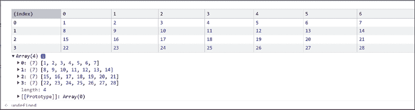
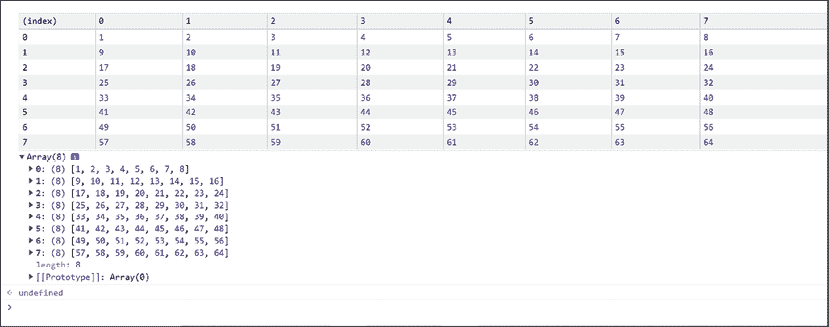
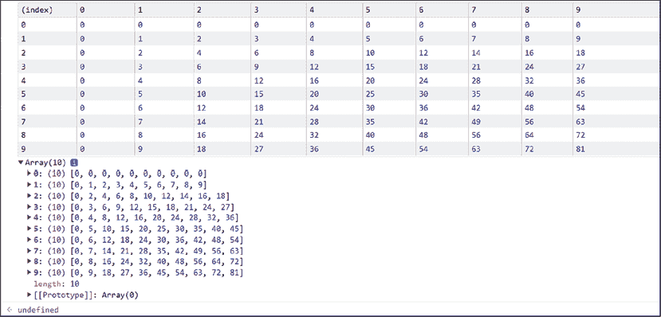
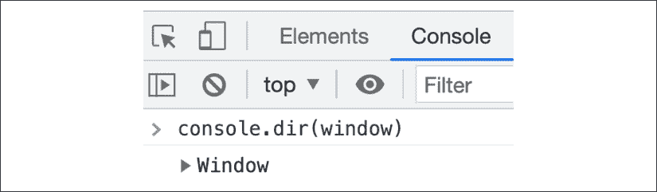
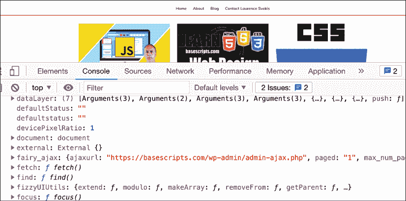
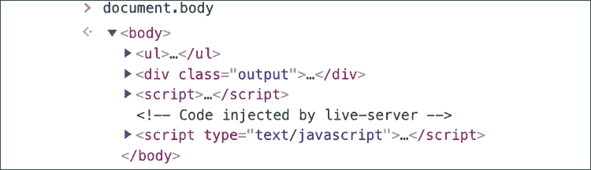
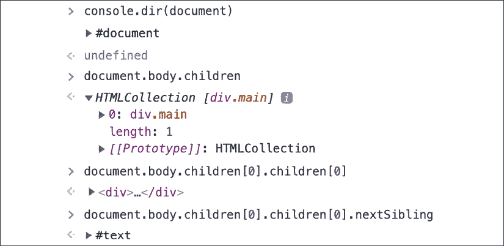

# 附录 – 练习题、项目和自我检查测验答案

# 第一章，JavaScript 入门

## 练习题

### 练习题 1.1

```js
4 + 10
14
console.log("Laurence");
Laurence
undefined 
```

### 练习题 1.2

```js
<!DOCTYPE html>
<html>

<head>
  <title>Tester</title>
</head>

<body>
  <script>
    console.log("hello world");
  </script>
</body>

</html> 
```

### 练习题 1.3

```js
<!DOCTYPE html>
<html>

<head>
  <title>Tester</title>
</head>

<body>
  <script src="img/app.js"></script>
</body>

</html> 
```

### 练习题 1.4

```js
let a = 10; // assign a value of 10 to variable a
console.log(a); // This will output 10 into the console
/*
This is a multi-line
Comment
*/ 
```

## 项目

### 创建 HTML 文件和链接 JavaScript 文件

```js
<!doctype html>
<html>
  <head>
    <title>JS Tester</title>
  </head>
  <body>
    <script src="img/myJS.js"></script>
  </body>
</html>
// console.log("Laurence");
/*
This is my comment
Laurence Svekis
*/ 
```

## 自我检查测验

1.  `<script src="img/myJS.js"></script>`.

1.  编号

1.  通过使用`/*`和`*/`打开和关闭它。

1.  使用`//`注释掉该行。

# 第二章，JavaScript 基础

## 练习题

### 练习题 2.1

```js
console.log(typeof(str1));
console.log(typeof(str2));
console.log(typeof(val1));
console.log(typeof(val2));
console.log(typeof(myNum)); 
```

### 练习题 2.2

```js
const myName = "Maaike";
const myAge = 29;
const coder = true;
const message = "Hello, my name is " + myName + ", I am " + myAge+" years old and I can code JavaScript: " + coder + "."; 
console.log(message); 
```

### 练习题 2.3

```js
let a = window.prompt("Value 1?");
let b = window.prompt("Value 2?");
a = Number(a);
b = Number(b);
let hypotenuseVal = ((a * a) + (b * b))**0.5;
console.log(hypotenuseVal); 
```

### 练习题 2.4

```js
let a = 4;
let b = 11;
let c = 21;
a = a + b;
a = a / c;
c = c % b;
console.log(a, b, c); 
```

## 项目

### 英里到千米的转换器

```js
//Convert miles to kilometers. 
//1 mile equals 1.60934 kilometers.
let myDistanceMiles = 130;
let myDistanceKM = myDistanceMiles * 1.60934;
console.log("The distance of " + myDistanceMiles + " miles is equal to " + myDistanceKM + " kilometers"); 
```

### BMI 计算器

```js
//1 inch = 2.54 centimetres.
//2.2046 pounds in a kilo
let inches = 72;
let pounds = 180;
let weight = pounds / 2.2046; // in kilos
let height = inches * 2.54; // height in centimetres
console.log(weight, height);
let bmi = weight/(height/100*height/100);
console.log(bmi); 
```

## 自我检查测验

1.  字符串

1.  数字

1.  行 2

1.  `world`

1.  `Hello world!`

1.  无论用户输入什么

1.  `71`

1.  `4`

1.  `16`和`536`

1.  `true`

    `false`

    `true`

    `true`

    `false`

# 第三章，JavaScript 多值

## 练习题

### 练习题 3.1

```js
const myList = ["Milk", "Bread", "Apples"];
console.log(myList.length);
myList[1] = "Bananas";
console.log(myList); 
```

### 练习题 3.2

```js
const myList = [];
myList.push("Milk", "Bread", "Apples");
myList.splice(1, 1, "Bananas", "Eggs");
const removeLast = myList.pop();
console.log(removeLast);
myList.sort();
console.log(myList.indexOf("Milk"));
myList.splice(1, 0, "Carrots", "Lettuce");
const myList2 = ["Juice", "Pop"];
const finalList = myList.concat(myList2, myList2);
console.log(finalList.lastIndexOf("Pop"));
console.log(finalList); 
```

### 练习题 3.3

```js
const myArr = [1, 2, 3];
const bigArr = [myArr, myArr, myArr];
console.log(bigArr[1][1]);
console.log(bigArr[0][1]); 
console.log(bigArr[2][1]); 
```

### 练习题 3.4

```js
const myCar = {
    make: "Toyota",
    model: "Camry",
    tires: 4,
    doors: 4,
    color: "blue",
    forSale: false
};
let propColor = "color";
myCar[propColor] = "red";
propColor = "forSale";
myCar[propColor] = true;
console.log(myCar.make + " " + myCar.model);
console.log(myCar.forSale); 
```

### 练习题 3.5

```js
const people = {friends:[]};
const friend1 = {first: "Laurence", last: "Svekis", id: 1};
const friend2 = {first: "Jane", last: "Doe", id: 2};
const friend3 = {first: "John", last: "Doe", id: 3};
people.friends.push(friend1, friend2, friend3);
console.log(people); 
```

## 项目

### 操作数组

```js
theList.pop(); 
theList.shift(); 
theList.unshift("FIRST"); 
theList[3] = "hello World"; 
theList[2] = "MIDDLE"; 
theList.push("LAST"); 
console.log(theList); 
```

### 公司产品目录

```js
const inventory = [];
const item3 = {
    name: "computer",
    model: "imac",
    cost: 1000,
    qty: 3
}
const item2 = {
    name: "phone",
    model: "android",
    cost: 500,
    qty: 11
}
const item1 = {
    name: "tablet",
    model: "ipad",
    cost: 650,
    qty: 1
}
inventory.push(item1, item2, item3);
console.log(inventory);
console.log(inventory[2].qty); 
```

## 自我检查测验

1.  是的。你可以在使用`const`声明的数组中重新分配值，但不能重新声明数组本身。

1.  `Length`

1.  输出如下：

    ```js
    -1
    1 
    ```

1.  你可以执行以下操作：

    ```js
    const myArr = [1,3,5,6,8,9,15];
    myArr.splice(1,1,4);
    console.log(myArr); 
    ```

1.  输出如下：

    ```js
    [empty × 10, "test"]
    undefined 
    ```

1.  输出如下：

    ```js
    undefined 
    ```

# 第四章，逻辑语句

## 练习题

### 练习题 4.1

```js
const test = false;
console.log(test);
if(test){
    console.log("It's True");
}
if(!test){
    console.log("False now");
} 
```

### 练习题 4.2

```js
let age = prompt("How old are you?");
age = Number(age);
let message;
if(age >= 21){
    message = "You can enter and drink.";
}else if(age >= 19){
    message = "You can enter but not drink.";
}else{
    message = "You are not allowed in!";
}
console.log(message); 
```

### 练习题 4.3

```js
const id = true;
const message = (id) ? "Allowed In" : "Denied Entry";
console.log(message); 
```

### 练习题 4.4

```js
const randomNumber = Math.floor(Math.random() * 6);
let answer = "Something went wrong";
let question = prompt("Ask me anything");
switch (randomNumber) {
    case 0:
        answer = "It will work out";
        break;
    case 1:
        answer = "Maybe, maybe not";
        break;
    case 2:
        answer = "Probably not";
        break;
    case 3:
        answer = "Highly likely";
        break;
    default:
        answer = "I don't know about that";
}
let output = "You asked me " + question + ". I think that " + answer;
console.log(output); 
```

### 练习题 4.5

```js
let prize = prompt("Pick a number 0-10");
prize = Number(prize);
let output = "My Selection: ";
switch (prize){
    case 0: 
        output += "Gold ";
    case 1:
        output += "Coin ";
        break;
    case 2:
        output += "Big ";
    case 3:
        output += "Box of ";
    case 4:
        output += "Silver ";
    case 5:
        output += "Bricks ";
        break;
    default:
        output += "Sorry Try Again";
}
console.log(output); 
```

## 项目

### 评估数字游戏答案

```js
let val = prompt("What number?");
val = Number(val);
let num = 100;
let message = "nothing";
if (val > num) {
    message = val + "  was greater than " + num;
} else if (val === num) {
    message = val + "  was equal to " + num;
} else {
    message = val + " is less than " + num;
}
console.log(message);
console.log(message); 
```

### 朋友检查游戏答案

```js
let person = prompt("Enter a name");
let message;
switch (person) {
    case "John" :
    case "Larry" :
    case "Jane" :
    case "Laurence" :
    message = person + " is my friend";
    break;
    default :
    message = "I don't know " + person;
}
console.log(message); 
```

### 石头剪刀布游戏答案

```js
const myArr = ["Rock", "Paper", "Scissors"]; 
let computer = Math.floor(Math.random() * 3); 
let player = Math.floor(Math.random() * 3); 
let message = "player " + myArr[player] + " vs computer " + myArr[computer] + " "; 
if (player === computer) { 
    message += "it's a tie"; 
} else if (player > computer) { 
    if (computer == 0 && player == 2) { 
        message += "Computer Wins"; 
    } else { 
        message += "Player Wins"; 
    } 
} else { 
    if (computer == 2 && player == 0) { 
        message += "Player Wins"; 
    } else { 
        message += "Computer Wins"; 
    } 
} 
console.log(message); 
```

## 自我检查测验

1.  `one`

1.  `这是那个`

1.  `login`

1.  `欢迎，这是一个用户：John`

1.  `醒醒，是早晨了`

1.  结果：

    +   `true`

    +   `false`

    +   `true`

    +   `true`

1.  结果：

    ```js
    100 was LESS or Equal to 100
    100 is Even 
    ```

# 第五章，循环

## 练习题

### 练习题 5.1

```js
const max = 5;
const ranNumber = Math.floor(Math.random() * max) + 1;
//console.log(ranNumber);
let correct = false;
while (!correct) {
    let guess = prompt("Guess a Number 1 - " + max);
    guess = Number(guess);
    if (guess === ranNumber) {
        correct = true;
        console.log("You got it " + ranNumber);
    } else if (guess > ranNumber) {
        console.log("Too high");
    } else {
        console.log("Too Low");
    }
} 
```

### 练习题 5.2

```js
let counter = 0;
let step = 5;
do {
    console.log(counter);
    counter += step;
}
while (counter <= 100); 
```

### 练习题 5.3

```js
const myWork = [];
for (let x = 1; x < 10; x++) {
    let stat = x % 2 ? true : false;
    let temp = {
        name: `Lesson ${x}`, status: stat
    };
    myWork.push(temp);
}
console.log(myWork); 
```

### 练习题 5.4

```js
const myTable = [];
const rows = 4;
const cols = 7;
let counter = 0;
for (let y = 0; y < rows; y++) {
    let tempTable = [];
    for (let x = 0; x < cols; x++) {
        counter++;
        tempTable.push(counter);
    }
    myTable.push(tempTable);
}
console.table(myTable); 
```



### 练习题 5.5

```js
const grid = [];
const cells = 64;
let counter = 0;
let row;
for (let x = 0; x < cells + 1; x++) {
    if (counter % 8 == 0) {
        if (row != undefined) {        
            grid.push(row);
        }
        row = [];
    }
    counter++;
    let temp = counter;
    row.push(temp);

}
console.table(grid); 
```



### 练习题 5.6

```js
const myArray = [];
for (let x = 0; x < 10; x++) {
    myArray.push(x + 1);
}
console.log(myArray);

for (let i = 0; i < myArray.length; i++) {
    console.log(myArray[i]);
}
for (let val of myArray) {
    console.log(val);
} 
```

### 练习题 5.7

```js
const obj = {
    a: 1,
    b: 2,
    c: 3
};
for (let prop in obj) {
    console.log(prop, obj[prop]);
}
const arr = ["a", "b", "c"];
for (let w = 0; w < arr.length; w++) {
    console.log(w, arr[w]);
}

for (el in arr) {
    console.log(el, arr[el]);
} 
```

### 练习题 5.8

```js
let output = ""; 
let skipThis = 7; 
for (let i = 0; i < 10; i++) { 
  if (i === skipThis) { 
    continue; 
  } 
  output += i; 
} 
console.log(output); 
```

或者，可以使用以下代码，将`continue`替换为`break`：

```js
let output = "";
let skipThis = 7;
for (let i = 0; i < 10; i++) {
  if (i === skipThis) {
    break;
  }
  output += i;
}

console.log(output); 
```

## 项目

### 数学乘法表

```js
const myTable = [];
const numm = 10;
for(let x=0; x<numm; x++){
    const temp = [];
    for(let y = 0; y<numm; y++){
        temp.push(x*y);
    }
    myTable.push(temp);
}

console.table(myTable); 
```



## 自我检查测验

1.  结果：

    ```js
    0
    3
    6
    9 
    ```

1.  结果：

    ```js
    0
    5
    1
    6
    2
    7
    [1, 5, 7] 
    ```

# 第六章，函数

## 练习题

### 练习题 6.1

```js
function adder(a, b) {
return a + b;
}
const val1 = 10;
const val2 = 20;
console.log(adder(val1, val2));
console.log(adder(20, 30)); 
```

### 练习题 6.2

```js
const adj = ["super", "wonderful", "bad", "angry", "careful"];

function myFun() {
    const question = prompt("What is your name?");
    const nameAdj = Math.floor(Math.random() * adj.length);
    console.log(adj[nameAdj] + " " + question );
}
myFun(); 
```

### 练习题 6.3

```js
const val1 = 10;
const val2 = 5;
let operat = "-";
function cal(a, b, op) {
  if (op == "-") {
    console.log(a — b);
  } else {
    console.log(a + b);
  }
}
cal(val1, val2, operat); 
```

### 练习题 6.4

```js
const myArr = [];

for(let x=0; x<10; x++){
  let val1 = 5 * x;
  let val2 = x * x;
  let res = cal(val1, val2, "+");
  myArr.push(res);
}
console.log(myArr);
function cal(a, b, op) {
  if (op == "-") {
    return a - b;
  } else {
    return a + b;
  }
} 
```

### 练习题 6.5

```js
let val = "1000";
(function () {
    let val = "100"; // local scope variable
    console.log(val);
})();
let result = (function () {
    let val = "Laurence";
    return val;
})();
console.log(result);
console.log(val);
(function (val) {
    console.log(`My name is ${val}`);
})("Laurence"); 
```

### 练习题 6.6

```js
function calcFactorial(nr) { 
    console.log(nr);
    if (nr === 0) { 
        return 1; 
    } 
    else { 
        return nr * calcFactorial(--nr); 
    } 
} 
console.log(calcFactorial(4)); 
```

### 练习题 6.7

```js
let start = 10; 
function loop1(val) { 
    console.log(val); 
    if (val < 1) { 
        return; 
    } 
    return loop1(val - 1); 
} 
loop1(start); 
function loop2(val) { 
    console.log(val); 
    if (val > 0) { 
        val--; 
        return loop2(val); 
    } 
    return; 
} 
loop2(start); 
```

### 练习题 6.8

```js
const test = function(val){
    console.log(val);
}
test('hello 1');

function test1(val){
    console.log(val);
}
test1("hello 2"); 
```

## 项目

### 创建递归函数

```js
const main = function counter(i) {
    console.log(i);
    if (i < 10) {
        return counter(i + 1);
    }
    return;
}
main(0); 
```

### 设置超时顺序

```js
const one  = ()=> console.log('one'); 
const two  = ()=> console.log('two'); 
const three = () =>{
    console.log('three'); 
    one(); 
    two(); 
}
const four = () =>{
    console.log('four');  
    setTimeout(one,0); 
    three();
}
four(); 
```

## 自我检查测验

1.  `10`

1.  `Hello`

1.  答案：

    ```js
    Welcome
    Laurence
    My Name is Laurence 
    ```

1.  `19`

1.  `16`

# 第七章，类

## 练习题

### 练习题 7.1

```js
class Person { 
    constructor(firstname, lastname) { 
    this.firstname = firstname; 
    this.lastname = lastname; 
    } 
} 
let person1 = new Person("Maaike", "van Putten");
let person2 = new Person("Laurence", "Svekis");
console.log("hello " + person1.firstname);
console.log("hello " + person2.firstname); 
```

### 练习题 7.2

```js
class Person { 
    constructor(firstname, lastname) { 
    this.firstname = firstname; 
    this.lastname = lastname;
    } 
    fullname(){
        return this.firstname + " " + this.lastname;
    }
} 
let person1 = new Person("Maaike", "van Putten");
let person2 = new Person("Laurence", "Svekis");
console.log(person1.fullname());
console.log(person2.fullname()); 
```

### 练习题 7.3

```js
class Animal {
    constructor(species, sounds) {
        this.species = species;
        this.sounds = sounds;
    }
    speak() {
        console.log(this.species + " " + this.sounds);
    }
}
Animal.prototype.eat = function () {
    return this.species + " is eating";
}
let cat = new Animal("cat", "meow");
let dog = new Animal("dog", "bark");
cat.speak();
console.log(dog.eat());
console.log(dog); 
```

## 项目

### 员工跟踪应用程序

```js
class Employee {
    constructor(first, last, years) {
        this.first = first;
        this.last = last;
        this.years = years;
    }
}
const person1 = new Employee("Laurence", "Svekis", 10);
const person2 = new Employee("Jane", "Doe", 5);
const workers = [person1, person2];
Employee.prototype.details = function(){
    return this.first + " " + this.last + " has worked here " +
           this.years + " years";
}
workers.forEach((person) => {
    console.log(person.details());
}); 
```

### 菜单项价格计算器

```js
class Menu {
    #offer1 = 10;
    #offer2 = 20;
    constructor(val1, val2) {
        this.val1 = val1;
        this.val2 = val2;
    }
    calTotal(){
        return (this.val1 * this.#offer1) + (this.val2 * this.#offer2);
    }
    get total(){
        return this.calTotal();
    }
}

const val1 = new Menu(2,0);
const val2 = new Menu(1,3);
const val3 = new Menu(3,2);
console.log(val1.total);
console.log(val2.total);
console.log(val3.total); 
```

## 自我检查测验

1.  `class`

1.  使用以下语法：

    ```js
    class Person {
        constructor(firstname, lastname) {
            this.firstname = firstname;
            this.lastname = lastname;
        }
    } 
    ```

1.  继承

1.  答案：

    +   `True`

    +   `False`

    +   `True`

    +   `True`

    +   `False`

1.  B

# 第八章，内置 JavaScript 方法

## 练习题

### 练习题 8.1

```js
const secretMes1 = "How's%20it%20going%3F";    
const secretMes2 = "How's it going?";
const decodedComp = decodeURIComponent(secretMes1);
console.log(decodedComp);
const encodedComp = encodeURIComponent(secretMes2);
console.log(encodedComp);
const uri = "http://www.basescripts.com?=Hello World";
const encoded = encodeURI(uri);
console.log(encoded); 
```

### 练习题 8.2

```js
const arr = ["Laurence", "Mike", "Larry", "Kim", "Joanne", "Laurence", "Mike", "Laurence", "Mike", "Laurence", "Mike"];
const arr2 = arr.filter ( (value, index, array) => {
    console.log(value,index,array.indexOf(value));
    return array.indexOf(value) === index;
});
console.log(arr2); 
```

### 练习题 8.3

```js
const myArr = [1,4,5,6];
const myArr1 = myArr.map(function(ele){
    return ele * 2;
});
console.log(myArr1);
const myArr2 = myArr.map((ele)=> ele*2);
console.log(myArr2); 
```

### 练习题 8.4

```js
const val = "thIs will be capiTalized for each word";
function wordsCaps(str) {
    str = str.toLowerCase();
    const tempArr = [];
    let words = str.split(" ");
    words.forEach(word => {
        let temp = word.slice(0, 1).toUpperCase() + word.slice(1);
        tempArr.push(temp);
    });
    return tempArr.join(" ");
}
console.log(wordsCaps(val)); 
```

### 练习题 8.5

```js
let val = "I love JavaScript";
val = val.toLowerCase();
let vowels = ["a","e","i","o","u"];
vowels.forEach((letter,index) =>{
    console.log(letter);
    val = val.replaceAll(letter,index);
});
console.log(val); 
```

### 练习题 8.6

```js
console.log(Math.ceil(5.7));
console.log(Math.floor(5.7));
console.log(Math.round(5.7));
console.log(Math.random());
console.log(Math.floor(Math.random()*11)); // 0-10
console.log(Math.floor(Math.random()*10)+1); // 1-10;
console.log(Math.floor(Math.random()*100)+1); // 1-100;
function ranNum(min, max) {
    return Math.floor(Math.random() * (max - min + 1)) + min;
}
for (let x = 0; x < 100; x++) {
    console.log(ranNum(1, 100));
} 
```

### 练习题 8.7

```js
let future = new Date(2025, 5, 15);
console.log(future);
const months = ["January", "February", "March", "April", "May", "June", "July", "August", "September", "October", "November", "December"];
let day = future.getDate();
let month = future.getMonth();
let year = future.getFullYear();
let myDate = `${months[month-1]} ${day} ${year}`;
console.log(myDate); 
```

## 项目

### 单词打乱器

```js
let str = "JavaScript";

function scramble(val) {
    let max = val.length;
    let temp = "";
    for(let i=0;i<max;i++){
        console.log(val.length);
        let index = Math.floor(Math.random() * val.length);
        temp += val[index]; 
        console.log(temp); 
        val = val.substr(0, index) + val.substr(index + 1);
        console.log(val);
    }
    return temp;
}
console.log(scramble(str)); 
```

### 倒计时器

```js
const endDate = "Sept 1 2022";
function countdown() {
    const total = Date.parse(endDate) - new Date();
    const days = Math.floor(total / (1000 * 60 * 60 * 24));
    const hrs = Math.floor((total / (1000 * 60 * 60)) % 24);
    const mins = Math.floor((total / 1000 / 60) % 60);
    const secs = Math.floor((total / 1000) % 60);
    return {
        days,
        hrs,
        mins,
        secs
    };
}
function update() {
    const temp = countdown();
    let output = "";
    for (const property in temp) {
        output += (`${property}: ${temp[property]} `);
    }
    console.log(output);
    setTimeout(update, 1000);
}
update(); 
```

## 自我检查测验

1.  `decodeURIComponent(e)`

1.  `4`

1.  `["Hii", "hi", "hello", "Hii", "hi", "hi World", "Hi"]`

1.  `["hi", "hi World"]`

# 第九章，文档对象模型

## 练习题

### 练习题 9.1



### 练习题 9.2

```js
console.log(window.location.protocol);
console.log(window.location.href); 
```

### 练习题 9.3

```js
<script>
    const output = document.querySelector('.output');
    output.textContent = "Hello World";
    output.classList.add("red");
    output.id = "tester";
    output.style.backgroundColor = "red";
    console.log(document.URL);
    output.textContent = document.URL;
</script> 
```

## 项目

### 使用 JavaScript 操作 HTML 元素

```js
const output = document.querySelector(".output");
const mainList = output.querySelector("ul");
mainList.id = "mainList";
console.log(mainList);
const eles = document.querySelectorAll("div");
for (let x = 0; x < eles.length; x++) {
    console.log(eles[x].tagName);
    eles[x].id = "id" + (x + 1);
    if (x % 2) {
        eles[x].style.color = "red";
    } else {
        eles[x].style.color = "blue";
    }
} 
```

## 自我检查测验

1.  你应该会看到一个表示 HTML 页面 `body` 对象内包含的元素列表的对象。

1.  `document.body.textContent = "Hello World";`

1.  代码如下：

    ```js
    for (const property in document) {
        console.log(`${property}: ${document[property]}`);
    } 
    ```

1.  代码如下：

    ```js
    for (const property in window) {
        console.log(`${property}: ${document[window]}`);
    } 
    ```

1.  代码如下：

    ```js
    <!doctype html>
    <html>
    <head>
        <title>JS Tester</title>
    </head>
    <body>
        <h1>Test</h1>

        <script>
            const output = document.querySelector('h1');
            output.textContent = "Hello World";
        </script>
    </body>
    </html> 
    ```

# 第十章，使用 DOM 动态操作元素

## 练习题

### 练习题 10.1



### 练习题 10.2

```js
<!doctype html>
<html>
<head>
    <title>Canvas HTML5</title>
</head>
<body>
    <div id="one">Hello World</div>
    <script>
        const myEle = document.getElementById("one");
        console.log(myEle);
    </script>
</body>
</html> 
```

### 练习题 10.3

```js
<!doctype html>
<html>
<head>
    <title>Dynamic event manipulation</title>
</head>
<body>
    <div>Hello World 1</div>
    <div>Hello World 2</div>
    <div>Hello World 3</div>
    <script>
        const myEles = document.getElementsByTagName("div");
        console.log(myEles[1]);
    </script>
</body>
</html> 
```

### 练习题 10.4

```js
<!doctype html>
<html>
<head>
    <title>Canvas HTML5</title>
</head>
<body>
    <body>
        <h1 class="ele">Hello World</h1>
        <div class="ele">Hello World 1</div>
        <div class="ele">Hello World 3</div>
    <script>
        const myEles = document.getElementsByClassName("ele");
        console.log(myEles[0]);
    </script>
</html> 
```

### 练习题 10.5

```js
<!doctype html>
<html>
<head>
    <title>Canvas HTML5</title>
</head>
<body>
    <body>
        <h1 class="ele">Hello World</h1>
        <div class="ele">Hello World 1</div>
        <div class="ele">Hello World 3</div>
        <p class="ele">Hello World 4</p>
    <script>
        const myEle = document.querySelector(".ele");
        console.log(myEle);
    </script>
</html> 
```

### 练习题 10.6

```js
<!doctype html>
<html>
<head>
    <title>JS Tester</title>
</head>
<body>
    <div class="container">
        <div class="myEle">One</div>
        <div class="myEle">Two</div>
        <div class="myEle">Three</div>
        <div class="myEle">Four</div>
        <div class="myEle">Five</div>
    </div>
    <script>
        const eles = document.querySelectorAll(".myEle");
        console.log(eles);
        eles.forEach((el) => {
            console.log(el);
        });
    </script>
</body>
</html> 
```

### 练习题 10.7

```js
<!doctype html>
<html>
<head>
    <title>JS Tester</title>
</head>
<body>
    <div>
        <button onclick="message(this)">Button 1</button>
        <button onclick="message(this)">Button 2</button>
    </div>
    <script>
        function message(el) {
            console.dir(el.textContent);
        }
    </script>
</body>
</html> 
```

### 练习题 10.8

```js
 <script>
        const message = document.querySelector("#message");
        const myArray = ["Laurence", "Mike", "John", "Larry", "Kim",
                         "Joanne", "Lisa", "Janet", "Jane"];
        build();
        //addClicks();
        function build() {
            let html = "<h1>My Friends Table</h1><table>";
            myArray.forEach((item, index) => {
                html += `<tr class="box" data-row="${index+1}"
                         data-name="${item}" onclick="getData(this)">
                         <td>${item}</td>`;
                html += `<td >${index + 1}</td></tr>`;
            });
            html += "</table>";
            document.getElementById("output").innerHTML = html;
        }
        function getData(el) {
            let temp = el.getAttribute("data-row");
            let tempName = el.getAttribute("data-name");
            message.innerHTML = `${tempName } is in row #${temp}`;
        }
    </script> 
```

### 练习题 10.9

```js
 <script>
        const btns = document.querySelectorAll("button");
        btns.forEach((btn)=>{
            function output(){
                console.log(this.textContent);
            }
            btn.addEventListener("click",output);
        });
    </script> 
```

### 练习题 10.10

```js
 <script>
        document.getElementById("addNew").onclick = function () {
            addOne();
        }
        function addOne() {
            var a = document.getElementById("addItem").value;
            var li = document.createElement("li");
            li.appendChild(document.createTextNode(a));
            document.getElementById("sList").appendChild(li);
        }
    </script> 
```

## 项目

### 可折叠手风琴组件

```js
 <script>
        const menus = document.querySelectorAll(".title");
        const openText = document.querySelectorAll(".myText");
        menus.forEach((el) => {
            el.addEventListener("click", (e) => {
                console.log(el.nextElementSibling);
                remover();
                el.nextElementSibling.classList.toggle("active");
            })
        })
        function remover() {
            openText.forEach((ele) => {
                ele.classList.remove("active");
            })
        }
    </script> 
```

### 交互式投票系统

```js
 <script>
        window.onload = build;
        const myArray = ["Laurence", "Mike", "John", "Larry"];
        const message = document.getElementById("message");
        const addNew = document.getElementById("addNew");
        const newInput = document.getElementById("addFriend");
        const output = document.getElementById("output");
        addNew.onclick = function () {
            const newFriend = newInput.value;
            adder(newFriend, myArray.length, 0);
            myArray.push(newFriend);
        }
        function build() {
            myArray.forEach((item, index) => {
                adder(item, index, 0);
            });
        }
        function adder(name, index, counter) {
            const tr = document.createElement("tr");
            const td1 = document.createElement("td");
            td1.classList.add("box");
            td1.textContent = index + 1;
            const td2 = document.createElement("td");
            td2.textContent = name;
            const td3 = document.createElement("td");
            td3.textContent = counter;
            tr.append(td1);
            tr.append(td2);
            tr.append(td3);
            tr.onclick= function () {
                console.log(tr.lastChild);
                let val = Number(tr.lastChild.textContent);
                val++;
                tr.lastChild.textContent = val;
            }
            output.appendChild(tr);
        }
    </script> 
```

### 挂挂人游戏

```js
 <script>
        const game = { cur: "", solution: "", puzz: [], total: 0 };
        const myWords = ["learn Javascript", "learn html",
                         "learn css"];
        const score = document.querySelector(".score");
        const puzzle = document.querySelector(".puzzle");
        const letters = document.querySelector(".letters");
        const btn = document.querySelector("button");
        btn.addEventListener("click", startGame);
        function startGame() {
            if (myWords.length > 0) {
                btn.style.display = "none";
                game.puzz = [];
                game.total = 0;
                game.cur = myWords.shift();
                game.solution = game.cur.split("");
                builder();
            } else {
                score.textContent = "No More Words.";
            }
        }
        function createElements(elType, parentEle, output, cla) {
            const temp = document.createElement(elType);
            temp.classList.add("boxE");
            parentEle.append(temp);
            temp.textContent = output;
            return temp;
        }
        function updateScore() {
            score.textContent = `Total Letters Left : ${game.total}`;
            if (game.total <= 0) {
                console.log("game over");
                score.textContent = "Game Over";
                btn.style.display = "block";
            }
        }
        function builder() {
            letters.innerHTML = "";
            puzzle.innerHTML = "";
            game.solution.forEach((lett) => {
                let div = createElements("div", puzzle, "-", "boxE");
                if (lett == " ") {
                    div.style.borderColor = "white";
                    div.textContent = " ";
                } else {
                    game.total++;
                }
                game.puzz.push(div);
                updateScore();
            })
            for (let i = 0; i < 26; i++) {
                let temp = String.fromCharCode(65 + i);
                let div = createElements("div", letters, temp,"box");

                let checker = function (e) {
                    div.style.backgroundColor = "#ddd";
                    div.classList.remove("box");
                    div.classList.add("boxD");
                    div.removeEventListener("click", checker);
                    checkLetter(temp);
                }
                div.addEventListener("click", checker);
            }
        }
        function checkLetter(letter) {
            console.log(letter);
            game.solution.forEach((ele, index) => {
                if (ele.toUpperCase() == letter) {
                    game.puzz[index].textContent = letter;
                    game.total--;
                    updateScore();
                };
            };
            )
        }
    </script> 
```

## 自我检查测验

1.  `Hello <br> World`

1.  `Hello`

    `World`

1.  `Hello World`

1.  当点击 `three` 时，输出为 `three`。当点击 `one` 时，输出为：

    `one`

    `two`

    `three`

1.  `btn.removeEventListener("click", myFun);`

# 第十一章，交互式内容和事件监听器

## 练习题

### 练习题 11.1

```js
<!DOCTYPE html>
<html>
<head>
    <title>Laurence Svekis</title>
</head>
<body>
    <script>
        let darkMode = false;
        window.onclick = () => {
            console.log(darkMode);
            if (!darkMode) {
                document.body.style.backgroundColor = "black";
                document.body.style.color = "white";
                darkMode = true;
            } else {
                document.body.style.backgroundColor = "white";
                document.body.style.color = "black";
                darkMode = false;
            }
        }
    </script>
</body>
</html> 
```

### 练习题 11.2

```js
<!doctype html>
<html>
<body>
    <div>red</div>
    <div>blue</div>
    <div>green</div>
    <div>yellow</div>
    <script>
        const divs = document.querySelectorAll("div");
        divs.forEach((el)=>{
            el.addEventListener("click",()=>{
                document.body.style.backgroundColor = el.textContent;
            });
        })
    </script>
</body>
</html> 
```

### 练习题 11.3

```js
<!doctype html>
<html>
<head>
    <title>JS Tester</title>
</head>
<body>
    <script>
        document.addEventListener("DOMContentLoaded", (e) => {
            message("Document ready", e);
        });
        window.onload = (e) => {
            message("Window ready", e);
        }
        function message(val, event) {
            console.log(event);
            console.log(val);
        }
    </script>
</body>
</html> 
```

### 练习题 11.4

```js
<!doctype html>
<html>
<head>
    <title>JS Tester</title>
</head>
<body>
    <div class="output"></div> 
    <script>
        const output = document.querySelector(".output");
        output.textContent = "hello world";
        output.style.height = "200px";
        output.style.width = "400px";
        output.style.backgroundColor = "red";
        output.addEventListener("mousedown", function (e) {
            message("green", e);
        });
        output.addEventListener("mouseover", function (e) {
            message("red", e);
        });
        output.addEventListener("mouseout", function (e) {
            message("yellow", e);
        });
        output.addEventListener("mouseup", function (e) {
            message("blue", e);
        });
        function message(elColor, event) {
            console.log(event.type);
            output.style.backgroundColor = elColor;
        }
    </script>
</body>
</html> 
```

### 练习题 11.5

```js
 <script>
        const myInput = document.querySelector("input[name='message']");
        const output = document.querySelector(".output");
        const btn1 = document.querySelector(".btn1");
        const btn2 = document.querySelector(".btn2");
        const btn3 = document.querySelector(".btn3");
        const log = [];
        btn1.addEventListener("click", tracker);
        btn2.addEventListener("click", tracker);
        btn3.addEventListener("click", (e) => {
            console.log(log);
        });
        function tracker(e) {
            output.textContent = myInput.value;
            const ev = e.target;
            console.dir(ev);
            const temp = {
                message: myInput.value,
                type: ev.type,
                class: ev.className,
                tag: ev.tagName
            };
            log.push(temp);
            myInput.value = "";
        }
    </script> 
```

### 练习题 11.6

```js
 <script>      
        const main = document.querySelector(".container");
        const boxes = document.querySelectorAll(".box");
        main.addEventListener("click", (e) => {
            console.log("4");
        },false);
        main.addEventListener("click", (e) => {
            console.log("1");
        },true);

        boxes.forEach(ele => {
            ele.addEventListener("click", (e) => {
                console.log("3");
                console.log(e.target.textContent);
            },false);
            ele.addEventListener("click", (e) => {
                console.log("2");
                console.log(e.target.textContent);
            },true);

        });
    </script> 
```

### 练习题 11.7

```js
 <script>
        const output = document.querySelector(".output1");

        const in1 = document.querySelector("input[name='first']");
        const in2 = document.querySelector("input[name='last']");
        in1.addEventListener("change", (e) => {
            console.log("change");
            updater(in1.value);
        });
        in1.addEventListener("blur", (e) => {
            console.log("blur");
        });
        in1.addEventListener("focus", (e) => {
            console.log("focus");
        });
        in2.addEventListener("change", (e) => {
            console.log("change");
            updater(in2.value);
        });
        in2.addEventListener("blur", (e) => {
            console.log("blur");
        });
        in2.addEventListener("focus", (e) => {
            console.log("focus");
        });
        function updater(str) {
            output.textContent = str;
        }
    </script> 
```

### 练习题 11.8

```js
<!doctype html>
<html>
<head>
    <title>JS Tester</title>
</head>
<body>
    <div class="output"></div>
        <input type="text" name="myNum1">
        <input type="text" name="myNum2">
    <script>
        const eles = document.querySelectorAll("input");
        const output = document.querySelector(".output");
        eles.forEach(el => {
            el.addEventListener("keydown", (e) => {
                if (!isNaN(e.key)) {
                    output.textContent += e.key;
                }
            });
            el.addEventListener("keyup", (e) => {
                console.log(e.key);
            });
            el.addEventListener("paste", (e) => {
                console.log('pasted');
            });
        });
    </script>
</body>
</html> 
```

### 练习题 11.9

```js
 <script>
        const dragme = document.querySelector("#dragme");
        dragme.addEventListener("dragstart", (e) => {
            dragme.style.opacity = .5;
        });
        dragme.addEventListener("dragend", (e) => {
            dragme.style.opacity = "";
        });
        const boxes = document.querySelectorAll(".box");
        boxes.forEach(box => {
            box.addEventListener("dragenter", (e) => {
                e.target.classList.add('red');
            });
            box.addEventListener("dragover", (e) => {
                e.preventDefault();
            });
            box.addEventListener("dragleave", (e) => {
                //console.log("leave");
                e.target.classList.remove('red');
            });
            box.addEventListener("drop", (e) => {
                e.preventDefault();
                console.log("dropped");
                e.target.appendChild(dragme);
            });
        });
        function dragStart(e) {
            console.log("Started");
        }
    </script> 
```

### 练习题 11.10

```js
<!doctype html>
<html>
<head>
    <title>JS Tester</title>
</head>
<body>
    <form action="index2.html" method="get">
        First: <input type="text" name="first">
        <br>Last: <input type="text" name="last">
        <br>Age: <input type="number" name="age">
        <br><input type="submit" value="submit">
    </form>
    <script>
        const form = document.querySelector("form");
        const email = document.querySelector("#email");
        form.addEventListener("submit", (e) => {
            let error = false;
            if (checker(form.first.value)) {
                console.log("First Name needed");
                error = true;
            }
            if (checker(form.last.value)) {
                console.log("Last Name needed");
                error = true;
            }
            if (form.age.value < 19) {
                console.log("You must be 19 or over");
                error = true;
            }
            if (error) {
                e.preventDefault();
                console.log("please review the form");
            }
        });
        function checker(val) {
            console.log(val.length);
            if (val.length < 6) {
                return true;
            }
            return false;
        }
    </script>
</body>
</html> 
```

### 练习题 11.11

```js
<!doctype html>
<html>
<style>
    div {
        background-color: purple;
        width: 100px;
        height: 100px;
        position: absolute;
    }
</style>
<body>
    <div id="block"></div>
    <script>
        const main = document.querySelector("#block");
        let mover = { speed: 10, dir: 1, pos: 0 };
        main.addEventListener("click", moveBlock);
        function moveBlock() {
            let x = 30;
            setInterval(function () {
                if (x < 1) {
                    clearInterval();
                } else {
                    if (mover.pos > 800 || mover.pos < 0) {
                        mover.dir *= -1;
                    }
                    x--;
                    mover.pos += x * mover.dir;
                    main.style.left = mover.pos + "px";
                    console.log(mover.pos);
                }
            }, 2);
        }
    </script>
</body>
</html> 
```

## 项目

### 构建自己的分析工具

```js
<!doctype html >
<html>
<head>
    <title>JS Tester</title>
    <style>.box{width:200px;height:100px;border:1px solid black}</style>
</head>
<body> 
    <div class="container">
        <div class="box" id="box0">Box #1</div>
        <div class="box" id="box1">Box #2</div>
        <div class="box" id="box2">Box #3</div>
        <div class="box" id="box3">Box #4</div>
    </div> 
    <script>      
        const counter = [];  
        const main = document.querySelector(".container");
        main.addEventListener("click",tracker);
        function tracker(e){
            const el = e.target;
            if(el.id){
            const temp = {};
            temp.content = el.textContent;
            temp.id = el.id;
            temp.tagName = el.tagName;
            temp.class = el.className;
            console.dir(el);
            counter.push(temp);
            console.log(counter);
            }
        }
    </script>
</body>
</html> 
```

### 星级评分系统

```js
 <script>
        const starsUL = document.querySelector(".stars");
        const output = document.querySelector(".output");
        const stars = document.querySelectorAll(".star");
        stars.forEach((star, index) => {
            star.starValue = (index + 1);
            star.addEventListener("click", starRate);
        });
        function starRate(e) {
            output.innerHTML =
                `You Rated this ${e.target.starValue} stars`;
            stars.forEach((star, index) => {
                if (index < e.target.starValue) {
                    star.classList.add("orange");
                } else {
                    star.classList.remove("orange");
                }
            });
        }
    </script> 
```

### 鼠标位置追踪器

```js
<!DOCTYPE html>
<html>
<head>
    <title>Complete JavaScript Course</title>
    <style>
        .holder {
            display: inline-block;
            width: 300px;
            height: 300px;
            border: 1px solid black;
            padding: 10px;
        }

        .active {
            background-color: red;
        }
    </style>
</head>
<body> 
    <div class="holder">   
        <div id="output"></div>   
    </div>   
    <script>     
        const ele = document.querySelector(".holder");
        ele.addEventListener("mouseover",
            (e) => { e.target.classList.add("active"); });
        ele.addEventListener("mouseout",
            (e) => { e.target.classList.remove("active"); });
        ele.addEventListener("mousemove", coordin);
        function coordin() {
            let html = "X:" + event.clientX + " | Y:" + event.clientY;
            document.getElementById("output").innerHTML = html;
        }
    </script>
</body>
</html> 
```

### 盒子点击速度测试游戏

```js
 <script>
        const output = document.querySelector('.output');
        const message = document.querySelector('.message');
        message.textContent = "Press to Start";
        const box = document.createElement('div');
        const game = {
            timer: 0,
            start: null
        };
        box.classList.add('box');
        output.append(box);
        box.addEventListener('click', (e) => {
            box.textContent = "";
            box.style.display = 'none';
            game.timer = setTimeout(addBox, ranNum(3000));
            if (!game.start) {
                message.textContent = 'Loading....';
            } else {
                const cur = new Date().getTime();
                const dur = (cur - game.start) / 1000;
                message.textContent = `It took ${dur} seconds to click`;
            }
        });
        function addBox() {
            message.textContent = 'Click it...';
            game.start = new Date().getTime();
            box.style.display = 'block';
            box.style.left = ranNum(450) + 'px';
            box.style.top = ranNum(450) + 'px';
        }
        function ranNum(max) {
            return Math.floor(Math.random() * max);
        }
    </script> 
```

## 自我检查测验

1.  `Window 对象模型`

1.  `preventDefault()` 方法如果可以取消事件，则会取消该事件。属于该事件的默认行为将不会发生。

# 第十二章，中级 JavaScript

## 练习题

### 练习题 12.1

```js
 <script>
        const output = document.getElementById("output");
        const findValue = document.getElementById("sText");
        const replaceValue = document.getElementById("rText");
        document.querySelector("button").addEventListener("click", lookUp);
        function lookUp() {
            const s = output.textContent;
            const rt = replaceValue.value;
            const re = new RegExp(findValue.value, "gi");
            if (s.match(re)) {
                let newValue = s.replace(re, rt);
                output.textContent = newValue;
            }
        }
    </script> 
```

### 练习题 12.2

```js
 <script>
        const output = document.querySelector(".output");
        const emailVal = document.querySelector("input");
        const btn = document.querySelector("button");
        const emailExp =
            /([A-Za-z0-9._-]+@[A-Za-z0-9._-]+\.[A-Za-z0-9]+)\w+/;
        btn.addEventListener("click", (e) => {
            const val = emailVal.value;
            const result = emailExp.test(val);
            let response = "";
            if (!result) {
                response = "Invalid Email";
                output.style.color = "red";
            } else {
                response = "Valid Email";
                output.style.color = "green";
            }
            emailVal.value = "";
            output.textContent = response;
        });
    </script> 
```

### 练习题 12.3

```js
function showNames() {
    let lastOne = "";
    for (let i = 0; i < arguments.length; i++) {
        lastOne = arguments[i];
    }
    return lastOne;
}
console.log(showNames("JavaScript", "Laurence", "Mike", "Larry")); 
```

### 练习题 12.4

```js
15
45 
```

### 练习题 12.5

```js
function test(val) {
    try {
        if (isNaN(val)) {
            throw "Not a number";
        } else {
            console.log("Got number");
        }
    } catch (e) {
        console.error(e);
    } finally {
        console.log("Done " + val);
    }
}
test("a");
test(100); 
```

### 练习题 12.6

```js
 <script>
        console.log(document.cookie);
        console.log(rCookie("test1"));
        console.log(rCookie("test"));
        cCookie("test1", "new Cookie", 30);
        dCookie("test2");
        function cCookie(cName, value, days) {
            if (days) {
                const d = new Date();
                d.setTime(d.getTime() + (days * 24 * 60 * 60 * 1000));
                let e = "; expires=" + d.toUTCString();
                document.cookie = cName + "=" + value + e + "; path=/";
            }
        }
        function rCookie(cName) {
            let cookieValue = false;
            let arr = document.cookie.split("; ");
            arr.forEach(str => {
                const cookie = str.split("=");
                if (cookie[0] == cName) {
                    cookieValue = cookie[1];
                }
            });
            return cookieValue;
        }
        function dCookie(cName) {
            cCookie(cName, "", -1);
        }
    </script> 
```

### 练习题 12.7

```js
 <script>
        const userTask = document.querySelector(".main input");
        const addBtn = document.querySelector(".main button");
        const output = document.querySelector(".output");
        const tasks = JSON.parse(localStorage.getItem("tasklist")) || [];
        addBtn.addEventListener("click", createListItem);
        if (tasks.length > 0) {
            tasks.forEach((task) => {
                genItem(task.val, task.checked);
            });
        }
        function saveTasks() {
            localStorage.setItem("tasklist", JSON.stringify(tasks));
        }
        function buildTasks() {
            tasks.length = 0;
            const curList = output.querySelectorAll("li");
            curList.forEach((el) => {
                const tempTask = {
                    val: el.textContent,
                    checked: false
                };
                if (el.classList.contains("ready")) {
                    tempTask.checked = true;
                }
                tasks.push(tempTask);
            });
            saveTasks();
        }
        function genItem(val, complete) {
            const li = document.createElement("li");
            const temp = document.createTextNode(val);
            li.appendChild(temp);
            output.append(li);
            userTask.value = "";
            if (complete) {
                li.classList.add("ready");
            }
            li.addEventListener("click", (e) => {
                li.classList.toggle("ready");
                buildTasks();
            });
            return val;
        }
        function createListItem() {
            const val = userTask.value;
            if (val.length > 0) {
                const myObj = {
                    val: genItem(val, false),
                    checked: false
                };
                tasks.push(myObj);
                saveTasks();
            }
        }
    </script> 
```

### 练习题 12.8

```js
let myList = [{
        "name": "Learn JavaScript",
        "status": true
    },
    {
        "name": "Try JSON",
        "status": false
    }
];
reloader();
function reloader() {
    myList.forEach((el) => {
    console.log(`${el.name} = ${el.status}`);
    });
} 
```

### 练习题 12.9

```js
let myList = [{
    "name": "Learn JavaScript",
    "status": true
},
{
    "name": "Try JSON",
    "status": false
}
];
const newStr = JSON.stringify(myList);
const newObj = JSON.parse(newStr);
newObj.forEach((el)=>{
    console.log(el);
}); 
```

## 项目

### 邮件提取器

```js
 <script>
        const firstArea = document.querySelector(
            "textarea[name='txtarea']");
        const secArea = document.querySelector(
            "textarea[name='txtarea2']");
        document.querySelector("button").addEventListener("click", lookUp);
        function lookUp() {
            const rawTxt = firstArea.value;
            const eData = rawTxt.match(
                /([a-zA-Z0-9._-]+@[a-zA-Z0-9._-]+\.[a-zA-Z0-9._-]+)/gi);
            const holder = [];
            for (let x = 0; x < eData.length; x++) {
                if (holder.indexOf(eData[x]) == -1) {
                    holder.push(eData[x]);
                }
            }
            secArea.value = holder.join(',');
        }
    </script> 
```

### 表单验证器

```js
 <script>
        const myForm = document.querySelector("form");
        const inputs = document.querySelectorAll("input");
        const errors = document.querySelectorAll(".error");
        const required = ["email", "userName"];
        myForm.addEventListener("submit", validation);
        function validation(e) {
            let data = {};
            e.preventDefault();
            errors.forEach(function (item) {
                item.classList.add("hide");
            });
            let error = false;
            inputs.forEach(function (el) {
                let tempName = el.getAttribute("name");
                if (tempName != null) {
                    el.style.borderColor = "#ddd";
                    if (el.value.length == 0 && 
                    required.includes(tempName)) {
                        addError(el, "Required Field", tempName);
                        error = true;
                    }
                    if (tempName == "email") {
                        let exp = /([A-Za-z0-9._-]+@[A-Za-z0-9._-]+\.[A-Za-z0-9]+)\w+/;
                        let result = exp.test(el.value);
                        if (!result) {
                            addError(el, "Invalid Email", tempName);
                            error = true;
                        }
                    }
                    if (tempName == "password") {
                        let exp = /[A-Za-z0-9]+$/;
                        let result = exp.test(el.value);
                        if (!result) {
                            addError(el, "Only numbers and Letters",
                                     tempName);
                            error = true;
                        }
                        if (!(el.value.length > 3 &&
                        el.value.length < 9)) {
                            addError(el, "Needs to be between 3-8 " +
                                     "characters", tempName);
                            error = true;
                        }
                    }
                    data[tempName] = el.value;
                }
            });
            if (!error) {
                myForm.submit();
            }
        }
        function addError(el, mes, fieldName) {
            let temp = el.nextElementSibling;
            temp.classList.remove("hide");
            temp.textContent = fieldName.toUpperCase() + " " + mes;
            el.style.borderColor = "red";
            el.focus();
        }
    </script> 
```

### 简单数学测验

```js
<!doctype html>
<html>
<head>
    <title>Complete JavaScript Course</title>
</head>
<body>
    <span class="val1"></span> <span>+</span> 
    <span class="val2"></span> = <span>
        <input type="text" name="answer"></span><button>Check</button>
    <div class="output"></div>
    <script>
        const app = function () {
            const game = {};
            const val1 = document.querySelector(".val1");
            const val2 = document.querySelector(".val2");
            const output = document.querySelector(".output");
            const answer = document.querySelector("input");
            function init() {
                document.querySelector("button").addEventListener(
                    "click", checker);
                loadQuestion();
            }
            function ranValue(min, max) {
                return Math.floor(Math.random() * (max - min + 1) +
                                  min);
            }
            function loadQuestion() {
                game.val1 = ranValue(1, 100);
                game.val2 = ranValue(1, 100);
                game.answer = game.val1 + game.val2;
                val1.textContent = game.val1;
                val2.textContent = game.val2;
            }
            function checker() {
                let bg = answer.value == game.answer ? "green" : "red";
                output.innerHTML +=
                    `<div style="color:${bg}">${game.val1} +
                     ${game.val2} = ${game.answer} (${answer.value})
                     </div>`;
                answer.value = "";
                loadQuestion();
            }
            return {
                init: init
            };
        }();
        document.addEventListener('DOMContentLoaded', app.init);
    </script>
</body>
</html> 
```

## 自我检查测验

1.  匹配的范围是从 `a` 到 `e`，并且区分大小写。它将返回单词的其余部分：`enjoy avaScript`。

1.  是的。

1.  它将清除网站上的 cookies。

1.  `hello world`

1.  变量 a 未定义。

1.  `a`

    `c`

    `b`

# 第十三章，并发

## 练习题

### 练习题 13.1

```js
function greet(fullName){
    console.log(`Welcome, ${fullName[0]} ${fullName[1]}`)
}
function processCall(user, callback){
    const fullName = user.split(" ");
    callback(fullName);
}
processCall("Laurence Svekis", greet); 
```

### 练习题 13.2

```js
const myPromise = new Promise((resolve, reject) => {
    resolve("Start Counting");
});
function counter(val){
    console.log(val);
}
myPromise
  .then(value => {counter(value); return "one"})
  .then(value => {counter(value); return "two"})
  .then(value => {counter(value); return "three"})
  .then(value => {counter(value);}); 
```

### 练习题 13.3

```js
 let cnt = 0;
    function outputTime(val) {
        return new Promise(resolve => {
            setTimeout(() => {
                cnt++;
                resolve(`x value ${val} counter:${cnt}`);
            }, 1000);
        });
    }
    async function aCall(val) {
        console.log(`ready ${val} counter:${cnt}`);
        const res = await outputTime(val);
        console.log(res);
    }
    for (let x = 1; x < 4; x++) {
        aCall(x);
    } 
```

## 项目

### 密码检查器

```js
const allowed = ["1234", "pass", "apple"];
function passwordChecker(pass) {
    return allowed.includes(pass);
}
function login(password) {
    return new Promise((resolve, reject) => {
        if (passwordChecker(password)) {
            resolve({
                status: true
            });
        } else {
            reject({
                status: false
            });
        }
    });
}
function checker(pass) {
    login(pass)
        .then(token => {
            console.log("Approve:");
            console.log(token);
        })
        .catch(value => {
            console.log("Reject:");
            console.log(value);
        })
}
checker("1234");
checker("wrong"); 
```

## 自我检查测验

1.  更新后的代码如下：

    ```js
    function addOne(val){
      return val + 1;
    }
    function total(a, b, callback){
      const sum = a + b;
      return callback(sum);
    }
    console.log(total(4, 5, addOne)); 
    ```

1.  控制台将显示错误信息 `Error: 哎呀`。

1.  更新后的代码如下：

    ```js
    function checker(val) {
      return new Promise((resolve, reject) => {
        if (val > 5) {
          resolve("Ready");
        } else {
          reject(new Error("Oh no"));
        }
      });
    }
    checker(5)
      .then((data) => {console.log(data); })
      .catch((err) => {console.error(err); })
      .finally(() => { console.log("done");}); 
    ```

1.  更新后的代码如下：

    ```js
    async function myFun() {
      return "Hello";
    }
    myFun().then(
      function(val) { console.log(val); },
      function(err) { conole.log(err); } 
    ```

# 第十四章，HTML5，Canvas 和 JavaScript

## 练习题

### 练习 14.1

```js
 <script>
        const message = document.getElementById("message");
        const output = document.querySelector(".output");
        const myInput = document.querySelector("input");
        myInput.addEventListener("change", uploadAndReadFile);
        function uploadAndReadFile(e) {
            const files = e.target.files;
            for (let i = 0; i < files.length; i++) {
                const file = files[i];
                const img = document.createElement("img");
                img.classList.add("thumb");
                img.file = file;
                output.appendChild(img);
                const reader = new FileReader();
                reader.onload = (function (myImg) {
                    return function (e) {
                        myImg.src = e.target.result;
                    };
                })(img);
                reader.readAsDataURL(file);
            }
        }
    </script> 
```

### 练习 14.2

```js
<!doctype html>
<html>
<head>
    <title>Canvas HTML5</title>
    <style>
        #canvas {
            border: 1px solid black;
        }
    </style>
</head>
<body>
    <canvas id="canvas" width="640" height="640">Not Supported</canvas>
    <script>
        const canvas = document.querySelector('#canvas');
        const ctx = canvas.getContext("2d");
        ctx.fillStyle = "red";
        ctx.fillRect(100, 100, 500, 300); //filled shape
        ctx.strokeRect(90, 90, 520, 320); // outline
        ctx.clearRect(150, 150, 400, 200); //transparent
    </script>
</body>
</html> 
```

### 练习 14.3

```js
<!doctype html>
<html>
<head>
    <title>Canvas HTML5</title>
    <style>
        #canvas {
            border: 1px solid black;
        }
    </style>
</head>
<body>
    <canvas id="canvas" width="640" height="640">Not Supported</canvas>
    <script>
        const canvas = document.querySelector("#canvas");
        const ctx = canvas.getContext("2d");
        ctx.beginPath();
        ctx.fillStyle = "red";
        ctx.arc(300, 130, 100, 0, Math.PI * 2);
        ctx.fill();
        ctx.beginPath();
        ctx.fillStyle = "black";
        ctx.arc(250, 120, 20, 0, Math.PI * 2);
        ctx.moveTo(370, 120);
        ctx.arc(350, 120, 20, 0, Math.PI * 2);
        ctx.moveTo(240, 160);
        ctx.arc(300, 160, 60, 0, Math.PI);
        ctx.fill();
        ctx.moveTo(300, 130);
        ctx.lineTo(300, 150);
        ctx.stroke();
        ctx.beginPath();
        ctx.moveTo(300, 230);
        ctx.lineTo(300, 270);
        ctx.lineTo(400, 270);
        ctx.lineTo(200, 270);
        ctx.lineTo(300, 270);
        ctx.lineTo(300, 350);
        ctx.lineTo(400, 500);
        ctx.moveTo(300, 350);
        ctx.lineTo(200, 500);
        ctx.stroke();
        ctx.beginPath();
        ctx.fillStyle = "blue";
        ctx.moveTo(200, 50);
        ctx.lineTo(400, 50);
        ctx.lineTo(300, 20);
        ctx.lineTo(200, 50);
        ctx.fill();
        ctx.stroke();
    </script>
</body>
</html> 
```

### 练习 14.4

```js
<!doctype html>
<html>
<head>
    <title>Canvas HTML5</title>
    <style>
        #canvas {
            border: 1px solid black;
        }
    </style>
</head>
<body>
    <canvas id="canvas" width="640" height="640">Not Supported</canvas>
    <script>
        const canvas = document.querySelector("#canvas");
        const ctx = canvas.getContext("2d");
        ctx.beginPath();
        ctx.fillStyle = "red";
        ctx.arc(300, 130, 100, 0, Math.PI * 2);
        ctx.fill();
        ctx.beginPath();
        ctx.fillStyle = "black";
        ctx.arc(250, 120, 20, 0, Math.PI * 2);
        ctx.moveTo(370, 120);
        ctx.arc(350, 120, 20, 0, Math.PI * 2);
        ctx.moveTo(240, 160);
        ctx.arc(300, 160, 60, 0, Math.PI);
        ctx.fill();
        ctx.moveTo(300, 130);
        ctx.lineTo(300, 150);
        ctx.stroke();
        ctx.beginPath();
        ctx.moveTo(300, 230);
        ctx.lineTo(300, 270);
        ctx.lineTo(400, 270);
        ctx.lineTo(200, 270);
        ctx.lineTo(300, 270);
        ctx.lineTo(300, 350);
        ctx.lineTo(400, 500);
        ctx.moveTo(300, 350);
        ctx.lineTo(200, 500);
        ctx.stroke();
        ctx.beginPath();
        ctx.fillStyle = "blue";
        ctx.moveTo(200, 50);
        ctx.lineTo(400, 50);
        ctx.lineTo(300, 20);
        ctx.lineTo(200, 50);
        ctx.fill();
        ctx.stroke();
    </script>
</body>
</html> 
```

### 练习 14.5

```js
<!doctype html>
<html>
<head>
    <title>Canvas HTML5</title>
    <style>
        #canvas {
            border: 1px solid black;
        }
    </style>
</head>
<body>
    <div><label>Image</label>
        <input type="file" id="imgLoader" name="imgLoader">
    </div>
    <div><canvas id="canvas"></canvas></div>
    <script>
        const canvas = document.querySelector("#canvas");
        const ctx = canvas.getContext("2d");
        const imgLoader = document.querySelector("#imgLoader");
        imgLoader.addEventListener("change", handleUpload);
        function handleUpload(e) {
            console.log(e);
            const reader = new FileReader();
            reader.onload = function (e) {
                console.log(e);
                const img = new Image();
                img.onload = function () {
                    canvas.width = img.width / 2;
                    canvas.height = img.height / 2;
                    ctx.drawImage(img, 0, 0, img.width / 2,
                                  img.height / 2);
                }
                img.src = e.target.result;
            }
            reader.readAsDataURL(e.target.files[0]);
        }
    </script>
</body>
</html> 
```

### 练习 14.6

```js
<!doctype html>
<html>
<head>
    <title>Canvas HTML5</title>
    <style>
        #canvas {
            border: 1px solid black;
        }
    </style>
</head>
<body>
    <div><canvas id="canvas"></canvas></div>
    <script>
        const canvas = document.getElementById("canvas");
        const ctx = canvas.getContext("2d");
        const ballSize = 10;
        let x = canvas.width / 2;
        let y = canvas.height / 2;
        let dirX = 1;
        let dirY = 1;
        function drawBall() {
            ctx.beginPath();
            ctx.arc(x, y, ballSize, 0, Math.PI * 2);
            ctx.fillStyle = "red";
            ctx.fill();
            ctx.closePath();
        }
        function move() {
            ctx.clearRect(0, 0, canvas.width, canvas.height);
            drawBall();
            if (x > canvas.width - ballSize || x < ballSize) {
                dirX *= -1;
            }
            if (y > canvas.height - ballSize || y < ballSize) {
                dirY *= -1;
            }
            x += dirX;
            y += dirY;
        }
        setInterval(move, 10);
    </script>
</body>
</html> 
```

### 练习 14.7

```js
 <script>
        window.onload = init;
        const canvas = document.getElementById("canvas");
        const ctx = canvas.getContext("2d");
        canvas.style.border = "1px solid black";
        const penColor = document.querySelector("#penColor");
        const penWidth = document.querySelector("#penWidth");
        document.querySelector(".clear").addEventListener(
            "click", clearImg);
        canvas.width = 700;
        canvas.height = 700;
        let pos = {
            x: 0,
            y: 0,
        };
        function init() {
            canvas.addEventListener("mousemove", draw);
            canvas.addEventListener("mousemove", setPosition);
            canvas.addEventListener("mouseenter", setPosition);
        }
        function draw(e) {
            if (e.buttons !== 1) return;
            ctx.beginPath();
            ctx.moveTo(pos.x, pos.y);
            setPosition(e);
            ctx.lineTo(pos.x, pos.y);
            ctx.strokeStyle = penColor.value;
            ctx.lineWidth = penWidth.value;
            ctx.lineCap = "round";
            ctx.stroke();
        }
        function setPosition(e) {
            pos.x = e.pageX;
            pos.y = e.pageY;
        }
        function clearImg() {
            const temp = confirm("Clear confirm?");
            if (temp) {
                ctx.clearRect(0, 0, canvas.offsetWidth,
                              canvas.offsetHeight);
            }
        }
    </script> 
```

## 项目

### 创建矩阵效果

```js
<!doctype html>
<html>
<head>
    <title>Canvas HTML5</title>
</head>
<body>
    <div class="output"></div>
    <script>
        const canvas = document.createElement("canvas");
        const ctx = canvas.getContext("2d");
        canvas.setAttribute("width", "500");
        canvas.setAttribute("height", "300");
        document.body.prepend(canvas);
        const colVal = [];
        for(let x=0;x<50;x++){
            colVal.push(0);
        }
        function matrix() {
            ctx.fillStyle = "rgba(0,0,0,.05)";
            ctx.fillRect(0, 0, canvas.width, canvas.height);
            ctx.fillStyle = "green";
            colVal.map((posY, index) => {
                let output = Math.random()<0.5?0:1;
                let posX = (index * 10) + 10;
                ctx.fillText(output, posX, posY);
                if (posY > 100 + Math.random() * 300) {
                    colVal[index] = 0;
                } else {
                    colVal[index] = posY + 10;
                }
            });
        }
        setInterval(matrix, 50);
    </script>
</body>
</html> 
```

### 倒计时时钟

```js
<script>
        const endDate = document.querySelector("input[name='endDate']");
        const clock = document.querySelector(".clock");
        let timeInterval;
        let timeStop = true;
        const savedValue = localStorage.getItem("countdown") || false;
        if (savedValue) {
            startClock(savedValue);
            let inputValue = new Date(savedValue);
            endDate.valueAsDate = inputValue;
        }
        endDate.addEventListener("change", function (e) {
            e.preventDefault();
            clearInterval(timeInterval);
            const temp = new Date(endDate.value);
            localStorage.setItem("countdown", temp);
            startClock(temp);
            timeStop = true;
        });
        function startClock(d) {
            function updateCounter() {
                let tl = (timeLeft(d));
                if (tl.total <= 0) {
                    timeStop = false;
                }
                for (let pro in tl) {
                    let el = clock.querySelector("." + pro);
                    if (el) {
                        el.innerHTML = tl[pro];
                    }
                }
            }
            updateCounter();
            if (timeStop) {
                timeInterval = setInterval(updateCounter, 1000);
            } else {
                clearInterval(timeInterval);
            }
        }
        function timeLeft(d) {
            let currentDate = new Date();
            let t = Date.parse(d) - Date.parse(currentDate);
            let seconds = Math.floor((t / 1000) % 60);
            let minutes = Math.floor((t / 1000 / 60) % 60);
            let hours = Math.floor((t / (1000 * 60 * 60)) % 24);
            let days = Math.floor(t / (1000 * 60 * 60 * 24));
            return {
                "total": t,
                "days": days,
                "hours": hours,
                "minutes": minutes,
                "seconds": seconds
            };
        }
    </script> 
```

### 在线绘画应用

```js
 <script>
        const canvas = document.querySelector("#canvas");
        const ctx = canvas.getContext("2d");
        const penColor = document.querySelector("#penColor");
        const penWidth = document.querySelector("#penWidth");
        const btnSave = document.querySelector(".save");
        const btnClear = document.querySelector(".clear");
        const output = document.querySelector(".output");
        const mLoc = {
            draw: false,
            x: 0,
            y: 0,
            lastX: 0,
            lastY: 0
        };
        canvas.style.border = "1px solid black";
        btnSave.addEventListener("click", saveImg);
        btnClear.addEventListener("click", clearCanvas);
        canvas.addEventListener("mousemove", (e) => {
            mLoc.lastX = mLoc.x;
            mLoc.lastY = mLoc.y;
            //console.log(e);
            mLoc.x = e.clientX;
            mLoc.y = e.clientY;
            draw();
        });
        canvas.addEventListener("mousedown", (e) => {
            mLoc.draw = true;
        });
        canvas.addEventListener("mouseup", (e) => {
            mLoc.draw = false;
        });
        canvas.addEventListener("mouseout", (e) => {
            mLoc.draw = false;
        });
        function saveImg() {
            const dataURL = canvas.toDataURL();
            console.log(dataURL);
            const img = document.createElement("img");
            output.prepend(img);
            img.setAttribute("src", dataURL);
            const link = document.createElement("a");
            output.append(link);
            let fileName = Math.random().toString(16).substr(-8) +
                ".png"
            link.setAttribute("download", fileName);
            link.href = dataURL;
            link.click();
            output.removeChild(link);
        }
        function clearCanvas() {
            let temp = confirm("clear canvas?");
            if (temp) {
                ctx.clearRect(0, 0, canvas.width, canvas.height);
            }
        }
        function draw() {
            if (mLoc.draw) {
                ctx.beginPath();
                ctx.moveTo(mLoc.lastX, mLoc.lastY);
                ctx.lineTo(mLoc.x, mLoc.y);
                ctx.strokeStyle = penColor.value;
                ctx.lineWidth = penWidth.value;
                ctx.stroke();
                ctx.closePath();
            }
        }
    </script> 
```

## 自我检查测验

1.  `const canvas = document.getElementById('canvas');`

    `const ctx = canvas.getContext('2d');`

1.  绘制一个红色圆圈。

1.  `moveTo()`, `lineTo()`, `stroke()`

    ```js
    ctx.moveTo(100, 0);
    ctx.lineTo(100, 100);
    ctx.stroke(); 
    ```

# 第十五章，下一步

## 练习题

### 练习 15.1

```js
[
    {
        "name": "Learn JavaScript",
        "status" : true
    },
    {
        "name": "Try JSON",
        "status" : false
    }
]
const url = "list.json";
fetch(url).then(rep => rep.json())
.then((data) => {
data.forEach((el) => {
        console.log(`${el.name} = ${el.status}`);
    });
}); 
```

## 项目

### 使用 JSON

```js
<!DOCTYPE html>
<html>
    <head><title>Working with JSON Project</title></head>
    <body>
        <script src="img/myscript.js"></script>
    </body>
</html>
// myscript.js
let url = "people.json";
fetch(url)
.then(response => response.json())
.then(data => {
    console.log(data);
    data.forEach(person => {
        console.log(`${person.first} ${person.last} - ${person.topic}`);
    });
});
// people.json 
[
    {
        "first": "Laurence",
        "last": "Svekis",
        "topic": "JavaScript"
    },
    {
        "first": "John",
        "last": "Smith",
        "topic": "HTML"
    },
    {
        "first": "Jane",
        "last": "Doe",
        "topic": "CSS"
    }
] 
```

### 列表制作项目

```js
<!DOCTYPE html>
<html>
<head>
    <title>JavaScript List Project</title>
</head>
<body>
    <div class="output"></div>
    <input type="text"><button>add</button>
    <script>
        const output = document.querySelector(".output");
        const myValue = document.querySelector("input");
        const btn1 = document.querySelector("button");
        const url = "list.json";
        btn1.addEventListener("click", addToList);
        let localData = localStorage.getItem("myList");
        let myList = [];
        window.addEventListener("DOMContentLoaded", () => {
            output.textContent = "Loading......";
            if (localData) {
                myList = JSON.parse(localStorage.getItem("myList"));
                output.innerHTML = "";
                myList.forEach((el, index) => {
                    maker(el);
                });
            } else {
                reloader();
            }
        });
        function addToList() {
            if (myValue.value.length > 3) {
                const myObj = {
                    "name": myValue.value
                }
                myList.push(myObj);
                maker(myObj);
                savetoStorage();
            }
            myValue.value = "";
        }
        function savetoStorage() {
            console.log(myList);
            localStorage.setItem("myList", JSON.stringify(myList));
        }
        function reloader() {
            fetch(url).then(rep => rep.json())
            .then((data) => {
                myList = data;
                myList.forEach((el, index) => {
                    maker(el);
                });
                savetoStorage();
            });
        }
        function maker(el) {
            const div = document.createElement("div");
            div.innerHTML = `${el.name}`;
            output.append(div);
        }
    </script>
</body>
</html> 
```

## 自我检查测验

1.  预先编写的 JavaScript 模块，您可以使用它们来加速您的开发过程。

1.  打开控制台并输入 `$` 或 `jQuery`，如果您得到一个 `jQuery` 对象作为响应，则页面有对 `$` 或 `jQuery` 的引用。

1.  UnderscoreJS.

1.  在文件目录的终端中输入 `node` 和文件名。
