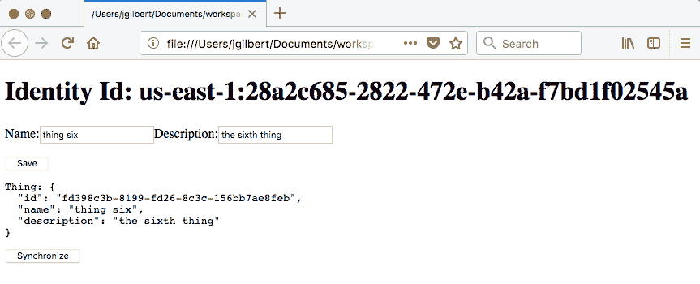
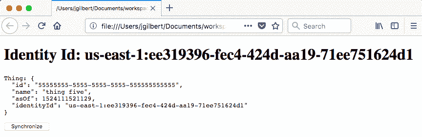

# 第二章：应用事件源和 CQRS 模式

本章将涵盖以下示例：

+   创建数据湖

+   应用事件优先的事件源模式变体

+   创建微事件存储

+   使用 DynamoDB 应用数据库优先的事件源模式变体

+   使用 Cognito 数据集应用数据库优先的事件源模式变体

+   在 DynamoDB 中创建物化视图

+   在 S3 中创建物化视图

+   在 Elasticsearch 中创建物化视图

+   在 Cognito 数据集中创建物化视图

+   重放事件

+   索引数据湖

+   实现双向同步

# 简介

云原生是自治的。它赋予自给自足的全栈团队能够快速进行精益实验，并自信地持续交付创新。这里的关键词是*自信*。我们利用完全托管的云服务，如函数即服务、云原生数据库和事件流，以降低运行这些先进技术的风险。然而，在这种快速变化的速度下，我们无法完全消除人为错误的可能性。为了在变化的速度下保持稳定，云原生系统由边界明确、隔离和自治的服务组成，这些服务通过防波堤隔开，以最小化任何给定服务出现故障时的破坏范围。每个服务都是完全自给自足的，即使相关服务不可用，也能独立运行。

遵循响应式原则，这些自治服务利用事件流进行所有服务间通信。事件流通过在云原生数据库中存储以物化视图形式复制的跨服务数据，将数据库内部结构颠倒。这种云原生数据在服务之间形成一道防波堤，有效地将云转变为数据库，以最大化响应性、弹性和容错性。**事件源**和**命令查询责任分离**（**CQRS**）模式对于创建自治服务至关重要。本章包含了一些示例，展示了如何使用完全托管、无服务器的云服务来应用这些模式。

# 创建数据湖

事件溯源模式的主要好处之一是它记录了系统内所有状态变化的历史记录。这些事件存储库也可以用来重放事件以修复损坏的服务和初始化新组件。例如，**AWS Kinesis**这样的云原生事件流，仅存储事件很短的时间，从 24 小时到 7 天不等。**事件流**可以被视为一个临时或时间性的事件存储，用于常规的、接近实时的操作。在*创建一个微事件存储*配方中，我们将讨论如何创建专门针对单个服务的事件存储。在这个配方中，我们将在 S3 中创建一个数据湖。**数据湖**是一个永久性的事件存储，以原始格式永久收集和存储所有事件，具有完整的保真度和高度的耐用性，以支持审计和重放。

# 准备工作

在开始此配方之前，您需要一个**AWS Kinesis Stream**，例如在*创建事件流*配方中创建的那个。

# 如何操作...

1.  从以下模板创建项目：

```js
$ sls create --template-url https://github.com/danteinc/js-cloud-native-cookbook/tree/master/ch2/data-lake-s3 --path cncb-data-lake-s3
```

1.  使用`cd cncb-data-lake-s3`命令导航到`cncb-data-lake-s3`目录。

1.  检查以下内容的`serverless.yml`文件：

```js
service: cncb-data-lake-s3

provider:
  name: aws
  runtime: nodejs8.10

functions:
  transformer:
    handler: handler.transform
    timeout: 120

resources:
  Resources:
    Bucket:
      Type: AWS::S3::Bucket
      DeletionPolicy: Retain
    DeliveryStream:
      Type: AWS::KinesisFirehose::DeliveryStream
      Properties:
        DeliveryStreamType: KinesisStreamAsSource      
        KinesisStreamSourceConfiguration: 
          KinesisStreamARN: ${cf:cncb-event-stream-${opt:stage}.streamArn}
          ...
        ExtendedS3DestinationConfiguration:
          BucketARN:
            Fn::GetAtt: [ Bucket, Arn ]
          Prefix: ${cf:cncb-event-stream-${opt:stage}.streamName}/
          ...

  Outputs:
    DataLakeBucketName:
      Value:
        Ref: Bucket
```

1.  检查以下内容的`handler.js`文件：

```js
exports.transform = (event, context, callback) => {
  const output = event.records.map((record, i) => {
    // store all available data
    const uow = {
      event: JSON.parse((Buffer.from(record.data, 'base64')).toString('utf8')),
      kinesisRecordMetadata: record.kinesisRecordMetadata,
      firehoseRecordMetadata: {
        deliveryStreamArn: event.deliveryStreamArn,
        region: event.region,
        invocationId: event.invocationId,
        recordId: record.recordId,
        approximateArrivalTimestamp: record.approximateArrivalTimestamp,
      }
    };

    return {
      recordId: record.recordId,
      result: 'Ok',
      data: Buffer.from(JSON.stringify(uow) + '\n', 'utf-8').toString('base64'),
    };
  });

  callback(null, { records: output });
};
```

1.  使用`npm install`安装依赖项。

1.  使用`npm test -- -s $MY_STAGE`运行测试。

1.  检查`.serverless`目录中生成的内容。

1.  部署堆栈：

```js
$ npm run dp:lcl -- -s $MY_STAGE

> cncb-data-lake-s3@1.0.0 dp:lcl <path-to-your-workspace>/cncb-data-lake-s3
> sls deploy -v -r us-east-1 "-s" "john"

Serverless: Packaging service...
...
Serverless: Stack update finished...
...
Stack Outputs
DataLakeBucketName: cncb-data-lake-s3-john-bucket-1851i1c16lnha
...
```

1.  在 AWS 控制台中检查堆栈、数据湖存储桶和 Firehose 传输流。

1.  使用以下命令从单独的终端发布事件：

```js
$ cd <path-to-your-workspace>/cncb-event-stream
$ sls invoke -r us-east-1 -f publish -s $MY_STAGE -d '{"type":"thing-created"}'
{
    "ShardId": "shardId-000000000000",
    "SequenceNumber": "49582906351415672136958521360120605392824155736450793474"
}
```

1.  允许 Firehose 缓冲时间处理，然后检查 S3 存储桶中创建的数据湖内容。

1.  完成以下命令后，请移除堆栈：`npm run rm:lcl -- -s $MY_STAGE`。

在处理完所有其他配方后，请移除数据湖堆栈。这将允许您观察数据湖累积所有其他事件。

# 它是如何工作的...

数据湖最重要的特征是它永久存储数据。真正满足这一要求的方法是使用对象存储，例如 AWS S3。S3 提供了 11 个 9 的耐用性。换句话说，S3 在给定一年内提供了 99.999999999%的对象耐用性。它也是完全管理的，并提供生命周期管理功能，将对象老化到冷存储。请注意，存储桶使用`DeletionPolicy`设置为`Retain`定义，这表明即使堆栈被删除，我们仍然想确保我们不会不当地删除这些宝贵的数据。

我们使用 Kinesis Firehose 是因为它执行将事件写入存储桶的重型工作。它基于时间和大小提供缓冲，压缩，加密和错误处理。为了简化此配方，我没有使用压缩或加密，但建议您使用这些功能。

此配方定义了一个交付流，因为在这本烹饪书中，我们的流拓扑只包含一个流，即 `${cf:cncb-event-stream-${opt:stage}.streamArn}`。在实践中，您的拓扑将包含多个流，并且您将为每个 Kinesis 流定义一个 Firehose 交付流，以确保数据湖能够捕获所有事件。我们将 `prefix` 设置为 `${cf:cncb-event-stream-${opt:stage}.streamName}/`，这样我们就可以通过流轻松区分数据湖中的事件。

数据湖的另一个重要特征是数据以原始格式存储，未经修改。为此，`transformer` 函数装饰了有关特定 Kinesis 流和 Firehose 交付流的全部可用元数据，以确保收集所有可用信息。在 *重放事件* 配方中，我们将看到如何利用这些元数据。此外，请注意，`transformer` 添加了换行符 (`\n`) 以便于未来数据处理。

# 应用事件溯源模式的事件首先变体

事件溯源是设计最终一致云原生系统的一个关键模式。上游服务在其状态变化时产生事件，下游服务消费这些事件并根据需要产生自己的事件。这导致一系列事件，其中服务协作以产生一个业务流程，该流程最终实现一致性解决方案。链中的每一步都必须作为一个原子工作单元实现。云原生系统不支持分布式事务，因为它们无法以经济高效的方式水平扩展。因此，每一步必须更新一个，并且只有一个系统。如果必须更新多个系统，则每个系统都按一系列步骤更新。在这个配方中，我们利用事件溯源模式的事件首先变体，其中原子工作单元是写入事件流。数据的最终持久性委托给下游组件。

# 如何操作...

1.  从以下模板创建项目：

```js
$ sls create --template-url https://github.com/danteinc/js-cloud-native-cookbook/tree/master/ch2/event-first --path cncb-event-first
```

1.  使用 `cd cncb-event-first` 命令导航到 `cncb-event-first` 目录。

1.  检查包含以下内容的 `serverless.yml` 文件：

```js
service: cncb-event-first

provider:
  name: aws
  runtime: nodejs8.10
  iamRoleStatements:
    - Effect: Allow
      Action:
        - kinesis:PutRecord
      Resource: ${cf:cncb-event-stream-${opt:stage}.streamArn}

functions:
  submit:
    handler: handler.submit
    environment:
      STREAM_NAME: ${cf:cncb-event-stream-${opt:stage}.streamName}
```

1.  检查名为 `handler.js` 的文件，其内容如下：

```js
module.exports.submit = (thing, context, callback) => {
  thing.id = thing.id || uuid.v4();

  const event = {
    type: 'thing-submitted',
    id: uuid.v1(),
    partitionKey: thing.id,
    timestamp: Date.now(),
    tags: {
      region: process.env.AWS_REGION,
      kind: thing.kind,
    },
    thing: thing,
  };

  const params = {
    StreamName: process.env.STREAM_NAME,
    PartitionKey: event.partitionKey,
    Data: Buffer.from(JSON.stringify(event)),
  };

  const kinesis = new aws.Kinesis();

  kinesis.putRecord(params, (err, resp) => {
    callback(err, event);
  });
};
```

1.  使用 `npm install` 安装依赖项。

1.  使用 `npm test -- -s $MY_STAGE` 运行测试。

1.  检查 `.serverless` 目录中生成的内容。

1.  部署堆栈：

```js
$ npm run dp:lcl -- -s $MY_STAGE

> cncb-event-first@1.0.0 dp:lcl <path-to-your-workspace>/cncb-event-first
> sls deploy -v -r us-east-1 "-s" "john"

Serverless: Packaging service...
...
Serverless: Stack update finished...
...
functions:
  submit: cncb-event-first-john-submit
...
```

1.  在 AWS 控制台中检查堆栈和函数。

1.  使用以下命令调用 `submit` 函数：

```js
$ sls invoke -f submit -r us-east-1 -s $MY_STAGE -d '{"id":"11111111-1111-1111-1111-111111111111","name":"thing one","kind":"other"}'

{
    "type": "thing-submitted",
    "id": "2a1f5290-42c0-11e8-a06b-33908b837f8c",
    "partitionKey": "11111111-1111-1111-1111-111111111111",
    "timestamp": 1524025374265,
    "tags": {
        "region": "us-east-1",
        "kind": "other"
    },
    "thing": {
        "id": "11111111-1111-1111-1111-111111111111",
        "name": "thing one",
        "kind": "other"
    }
}
```

1.  查看日志：

```js
$ sls logs -f submit -r us-east-1 -s $MY_STAGE

START ...
2018-04-18 00:22:54 ... params: {"StreamName":"john-cncb-event-stream-s1","PartitionKey":"11111111-1111-1111-1111-111111111111","Data":{"type":"Buffer","data":[...]}}
2018-04-18 00:22:54 ... response: {"ShardId":"shardId-000000000000","SequenceNumber":"4958...2466"}
END ...
REPORT ... Duration: 381.21 ms    Billed Duration: 400 ms ... Max Memory Used: 34 MB    
```

1.  完成使用 `npm run rm:lcl -- -s $MY_STAGE` 后，请删除堆栈。

# 它是如何工作的...

在这个菜谱中，我们实现了一个名为 `submit` 的命令函数，它将是后端前端服务的一部分。遵循事件溯源模式，我们通过只写入单个资源来使这个命令原子化。在某些场景中，例如启动长期业务流程或跟踪用户点击，我们只需要 **fire-and-forget**。在这些情况下，事件优先变体最为合适。命令只需要快速执行，并尽可能减少偶然性。我们将事件写入高度可用、完全管理的云原生事件流，并相信下游服务最终会消费该事件。

逻辑将域对象包装在标准事件格式中，正如在 第一章 的 *创建事件流和发布事件* 菜谱中讨论的那样，*开始使用云原生*。指定了事件 `type`，使用域对象 ID 作为 `partitionKey`，并装饰了有用的 `tags`。最后，将事件写入由 `STREAM_NAME` 环境变量指定的流。

# 创建一个微事件存储库

在 *创建数据湖* 菜谱中，我们将讨论事件溯源模式如何为系统提供所有状态变更事件的审计跟踪。事件流本质上提供了一个近似实时的事件存储，为下游的事件处理器提供数据。数据湖提供了一个高度耐用的永久事件存储，是官方记录的来源。然而，我们有一个中间需求。单个流处理器需要能够获取支持其处理需求的具体事件。在这个菜谱中，我们将实现一个由 **AWS DynamoDB** 拥有并针对特定服务需求定制的微事件存储库。

# 如何做...

1.  从以下模板创建项目：

```js
$ sls create --template-url https://github.com/danteinc/js-cloud-native-cookbook/tree/master/ch2/micro-event-store --path cncb-micro-event-store
```

1.  使用 `cd cncb-micro-event-store` 命令进入 `cncb-micro-event-store` 目录。

1.  查看以下内容的 `serverless.yml` 文件：

```js
service: cncb-micro-event-store

provider:
  name: aws
  runtime: nodejs8.10
  iamRoleStatements:
    - Effect: Allow
      Action:
        - dynamodb:PutItem
        - dynamodb:Query
      Resource:
        Fn::GetAtt: [ Table, Arn ]
  environment:
    TABLE_NAME:
      Ref: Table

functions:
  listener:
    handler: handler.listener
    events:
      - stream:
          type: kinesis
          ...
  trigger:
    handler: handler.trigger
    events:
      - stream:
          type: dynamodb
          arn:
            Fn::GetAtt: [ Table, StreamArn ]
          batchSize: 100
          startingPosition: TRIM_HORIZON

resources:
  Resources:
    Table:
      Type: AWS::DynamoDB::Table
      Properties:
        TableName: ${opt:stage}-${self:service}-events
        AttributeDefinitions:
          ...
        KeySchema:
          - AttributeName: partitionKey
            KeyType: HASH
          - AttributeName: eventId
            KeyType: RANGE
        ...
        StreamSpecification:
          StreamViewType: NEW_AND_OLD_IMAGES
```

1.  查看以下内容的 `handler.js` 文件：

```js
module.exports.listener = (event, context, cb) => {
  _(event.Records)
    .map(recordToEvent)
    .filter(byType)
    .flatMap(put)
    .collect()
    .toCallback(cb);
};

...
const byType = event => event.type.matches(/thing-.+/);

const put = event => {
  const params = {
    TableName: process.env.TABLE_NAME,
    Item: {
      partitionKey: event.partitionKey,
      eventId: event.id,
      event: event,
    }
  };

  const db = new aws.DynamoDB.DocumentClient();
  return _(db.put(params).promise());
};

module.exports.trigger = (event, context, cb) => {
  _(event.Records)
    .flatMap(getMicroEventStore)
    .tap(events => console.log('events: %j', events))
    .collect().toCallback(cb);
};

const getMicroEventStore = (record) => {
  const params = {
    TableName: process.env.TABLE_NAME,
    KeyConditionExpression: '#partitionKey = :partitionKey',
    ExpressionAttributeNames: {
      '#partitionKey': 'partitionKey'
    },
    ExpressionAttributeValues: {
      ':partitionKey': record.dynamodb.Keys.partitionKey.S
    }
  };

  const db = new aws.DynamoDB.DocumentClient();
  return _(db.query(params).promise());
}
```

1.  使用 `npm install` 安装依赖。

1.  使用 `npm test -- -s $MY_STAGE` 运行测试。

1.  查看在 `.serverless` 目录中生成的内容。

1.  部署堆栈：

```js
$ npm run dp:lcl -- -s $MY_STAGE

> cncb-micro-event-store@1.0.0 dp:lcl <path-to-your-workspace>/cncb-micro-event-store
> sls deploy -v -r us-east-1 "-s" "john"

Serverless: Packaging service...
...
Serverless: Stack update finished...
...
functions:
  listener: cncb-micro-event-store-john-listener
  trigger: cncb-micro-event-store-john-trigger
...
```

1.  在 AWS 控制台中查看堆栈、函数和表。

1.  使用以下命令从单独的终端发布事件：

```js
$ cd <path-to-your-workspace>/cncb-event-stream
$ sls invoke -r us-east-1 -f publish -s $MY_STAGE -d '{"type":"thing-updated","partitionKey":"11111111-1111-1111-1111-111111111111","thing":{"new":{"name":"thing one","id":"11111111-1111-1111-1111-111111111111"}}}'

{
    "ShardId": "shardId-000000000000",
    "SequenceNumber": "49583553996455686705785668952922460091805481438885707778"
}
```

1.  查看监听函数的日志：

```js
$ sls logs -f listener -r us-east-1 -s $MY_STAGE

START ...
2018-04-18 01:18:55... {"type":"thing-updated","partitionKey":"11111111-1111-1111-1111-111111111111","thing":{"new":{"name":"thing one","id":"11111111-1111-1111-1111-111111111111"}},"id":"fcc03460-42c7-11e8-8756-f75e650b2731","timestamp":1524028734118,"tags":{"region":"us-east-1"}}
2018-04-18 01:18:55.394 (-04:00)    b42aaa92-8a9a-418d-8e22-ecc54e9966f6    params: {"TableName":"john-cncb-micro-event-store-events","Item":{"partitionKey":"11111111-1111-1111-1111-111111111111","eventId":"fcc03460-42c7-11e8-8756-f75e650b2731","event":{"type":"thing-updated","partitionKey":"11111111-1111-1111-1111-111111111111","thing":{"new":{"name":"thing one","id":"11111111-1111-1111-1111-111111111111"}},"id":"fcc03460-42c7-11e8-8756-f75e650b2731","timestamp":1524028734118,"tags":{"region":"us-east-1"}}}}
END ...
REPORT ... Duration: 149.24 ms    Billed Duration: 200 ms ... Max Memory Used: 35 MB    
```

1.  查看触发函数的日志：

```js
$ sls logs -f trigger -r us-east-1 -s $MY_STAGE

START ...
2018-04-18 01:18:56 ... event: {"Records":[{"eventID":"b8dbee2d9f49ee05609a7e930ac204e7","eventName":"INSERT",...,"Keys":{"eventId":{"S":"fcc03460-42c7-11e8-8756-f75e650b2731"},"partitionKey":{"S":"11111111-1111-1111-1111-111111111111"}},...}]}
2018-04-18 01:18:56 ... params: {"TableName":"john-cncb-micro-event-store-events",...,"ExpressionAttributeValues":{":partitionKey":"11111111-1111-1111-1111-111111111111"}}
2018-04-18 01:18:56 ... events: {"Items":[{"eventId":"2a1f5290-42c0-11e8-a06b-33908b837f8c","partitionKey":"11111111-1111-1111-1111-111111111111","event":{"id":"2a1f5290-42c0-11e8-a06b-33908b837f8c","type":"thing-submitted","partitionKey":"11111111-1111-1111-1111-111111111111","thing":{"name":"thing one","kind":"other","id":"11111111-1111-1111-1111-111111111111"},"timestamp":1524025374265,"tags":{"region":"us-east-1","kind":"other"}}},{"eventId":"fcc03460-42c7-11e8-8756-f75e650b2731","partitionKey":"11111111-1111-1111-1111-111111111111","event":{"id":"fcc03460-42c7-11e8-8756-f75e650b2731","type":"thing-updated","partitionKey":"11111111-1111-1111-1111-111111111111","thing":{"new":{"name":"thing one","id":"11111111-1111-1111-1111-111111111111"}},"timestamp":1524028734118,"tags":{"region":"us-east-1"}}}],"Count":2,"ScannedCount":2}
END ...
REPORT ... Duration: 70.88 ms    Billed Duration: 100 ms     Memory Size: 1024 MB    Max Memory Used: 42 MB    
```

1.  完成后，使用 `npm run rm:lcl -- -s $MY_STAGE` 删除堆栈。

# 它是如何工作的...

在实现流处理器函数时，我们通常需要比当前事件对象中可用的信息更多。在发布事件时包含所有在发布上下文中可用的相关数据是一种最佳实践，这样每个事件就代表系统在发布时的一个微快照。当这些数据不足时，我们需要检索更多数据；然而，在云原生系统中，我们努力消除所有同步的跨服务通信，因为这会降低服务的*自主性*。相反，我们创建一个针对特定服务需求的微事件存储。

首先，我们实现一个用于从流中获取所需事件的`listener`函数和`filter`。每个事件都存储在 DynamoDB 表中。你可以存储整个事件或仅存储所需的信息。在存储这些事件时，我们需要通过仔细定义`HASH`和`RANGE`键来整理相关事件。例如，我们可能希望整理特定域对象 ID 的所有事件或特定用户 ID 的所有事件。在这个例子中，我们使用`event.partitionKey`作为哈希键，但你也可以从任何可用数据中计算哈希键。对于范围键，我们需要一个在哈希键内唯一的值。如果`event.id`实现了基于 V1 UUID，那么它是一个不错的选择，因为它们是基于时间的。Kinesis 序列号也是一个不错的选择。`event.timestamp`是另一个替代方案，但可能存在在哈希键内事件创建时间完全相同的情况。

与 DynamoDB 流关联的`trigger`函数在`listener`保存事件后接管。触发器调用`getMicroEventStore`来根据为当前事件计算的哈希键检索微事件存储。此时，流处理器在内存中拥有所有相关的数据。微事件存储中的事件按历史顺序排列，基于用于范围键的值。流处理器可以使用这些数据来实现其业务逻辑。

使用 DynamoDB 的 TTL 功能来防止微事件存储无限制地增长。

# 在 DynamoDB 上应用事件溯源模式的数据库优先变体

在上一个食谱中，*应用事件溯源模式的“事件优先”变体*，我们讨论了事件溯源模式如何使我们能够设计由一系列原子步骤组成的最终一致性的系统。在云原生系统中不支持分布式事务，因为它们无法有效地扩展。因此，每个步骤必须更新一个，并且只有一个系统。在本食谱中，我们将利用事件溯源模式的 **数据库优先** 变体，其中原子工作单元是写入单个云原生数据库。云原生数据库提供了一种 **变更数据捕获** 机制，允许进一步逻辑原子触发，将适当的 **领域事件** 发布到事件流以进行进一步的下层处理。在本食谱中，我们将使用 **AWS DynamoDB** 和 **DynamoDB Streams** 来演示实现此模式。

# 如何操作...

1.  从以下模板创建项目：

```js
$ sls create --template-url https://github.com/danteinc/js-cloud-native-cookbook/tree/master/ch2/db-first-dynamodb --path cncb-db-first-dynamodb
```

1.  使用 `cd cncb-db-first-dynamodb` 命令进入 `cncb-db-first-dynamodb` 目录。

1.  检查名为 `serverless.yml` 的文件，其内容如下：

```js
service: cncb-db-first-dynamodb

provider:
  name: aws
  runtime: nodejs8.10
  iamRoleStatements:
    - Effect: Allow
      Action:
        - dynamodb:PutItem
      Resource:
        Fn::GetAtt: [ Table, Arn ]
    - Effect: Allow
      Action:
        - kinesis:PutRecord
      Resource: ${cf:cncb-event-stream-${opt:stage}.streamArn}

functions:
  command:
    handler: handler.command
    environment:
      TABLE_NAME:
        Ref: Table
  trigger:
    handler: handler.trigger
    events:
      - stream:
          type: dynamodb
          arn:
            Fn::GetAtt: [ Table, StreamArn ]
          ...
    environment:
      STREAM_NAME: ${cf:cncb-event-stream-${opt:stage}.streamName}

resources:
  Resources:
    Table:
      Type: AWS::DynamoDB::Table
      Properties:
        TableName: ${opt:stage}-${self:service}-things
        AttributeDefinitions:
          ...
        KeySchema:
          - AttributeName: id
            KeyType: HASH
        ...
        StreamSpecification:
          StreamViewType: NEW_AND_OLD_IMAGES
```

1.  检查名为 `handler.js` 的文件，其内容如下：

```js
module.exports.command = (request, context, callback) => {
  const thing = {
    id: uuid.v4(),
    ...request,
  };

  const params = {
    TableName: process.env.TABLE_NAME,
    Item: thing,
  };

  const db = new aws.DynamoDB.DocumentClient();
  db.put(params, callback);
};

module.exports.trigger = (event, context, cb) => {
  _(event.Records)
    .map(toEvent)
    .flatMap(publish)
    .collect()
    .toCallback(cb);
};

const toEvent = record => ({
  id: record.eventID,
  type: `thing-${EVENT_NAME_MAPPING[record.eventName]}`,
  timestamp: record.dynamodb.ApproximateCreationDateTime * 1000,
  partitionKey: record.dynamodb.Keys.id.S,
  tags: {
    region: record.awsRegion,
  },
  thing: {
    old: record.dynamodb.OldImage ?
      aws.DynamoDB.Converter.unmarshall(record.dynamodb.OldImage) :
      undefined,
    new: record.dynamodb.NewImage ?
      aws.DynamoDB.Converter.unmarshall(record.dynamodb.NewImage) :
      undefined,
  },
});

const EVENT_NAME_MAPPING = {
  INSERT: 'created',
  MODIFY: 'updated',
  REMOVE: 'deleted',
};

const publish = event => {
  const params = {
    StreamName: process.env.STREAM_NAME,
    PartitionKey: event.partitionKey,
    Data: Buffer.from(JSON.stringify(event)),
  };

  const kinesis = new aws.Kinesis();
  return _(kinesis.putRecord(params).promise());
}
```

1.  使用 `npm install` 命令安装依赖项。

1.  使用 `npm test -- -s $MY_STAGE` 命令运行测试。

1.  检查 `.serverless` 目录中生成的内容。

1.  部署栈：

```js
$ npm run dp:lcl -- -s $MY_STAGE

> cncb-db-first-dynamodb@1.0.0 dp:lcl <path-to-your-workspace>/cncb-db-first-dynamodb
> sls deploy -r us-east-1 "-s" "john"

Serverless: Packaging service...
...
Serverless: Stack update finished...
...
functions:
  command: cncb-db-first-dynamodb-john-command
  trigger: cncb-db-first-dynamodb-john-trigger
```

1.  在 AWS 控制台中检查栈、函数和表。

1.  使用以下命令调用函数：

```js
$ sls invoke -r us-east-1 -f command -s $MY_STAGE -d '{"name":"thing one"}'
```

1.  查看命令函数的日志：

```js
$ sls logs -f command -r us-east-1 -s $MY_STAGE
START ...
2018-04-17 00:29:13 ... request: {"name":"thing one"}
2018-04-17 00:29:13 ... params: {"TableName":"john-cncb-db-first-dynamodb-things","Item":{"id":"4297c253-f512-443d-baaf-65f0a36aaaa3","name":"thing one"}}
END ...
REPORT ... Duration: 136.99 ms    Billed Duration: 200 ms     Memory Size: 1024 MB    Max Memory Used: 35 MB    
```

1.  查看触发函数的日志：

```js
$ sls logs -f trigger -r us-east-1 -s $MY_STAGE
START ...
2018-04-17 00:29:15 ... event: {"Records":[{"eventID":"39070dc13de0eb76548506a977d4134c","eventName":"INSERT",...,"dynamodb":{"ApproximateCreationDateTime":1523939340,"Keys":{"id":{"S":"4297c253-f512-443d-baaf-65f0a36aaaa3"}},"NewImage":{"name":{"S":"thing one"},"id":{"S":"4297c253-f512-443d-baaf-65f0a36aaaa3"}},"SequenceNumber":"100000000006513931753",...},...}]}
2018-04-17 00:29:15 ... {"id":"39070dc13de0eb76548506a977d4134c","type":"thing-created","timestamp":1523939340000,"partitionKey":"4297c253-f512-443d-baaf-65f0a36aaaa3","tags":{"region":"us-east-1"},"thing":{"new":{"name":"thing one","id":"4297c253-f512-443d-baaf-65f0a36aaaa3"}}}
2018-04-17 00:29:15 ... params: {"StreamName":"john-cncb-event-stream-s1","PartitionKey":"4297c253-f512-443d-baaf-65f0a36aaaa3","Data":{"type":"Buffer","data":[...]}}
2018-04-17 00:29:15 ... {"ShardId":"shardId-000000000000","SequenceNumber":"4958...3778"}
END ...
REPORT ... Duration: 326.99 ms    Billed Duration: 400 ms ... Max Memory Used: 40 MB    
```

1.  检查数据湖存储桶中收集的事件。

1.  完成操作后，使用 `npm run rm:lcl -- -s $MY_STAGE` 命令删除栈。

# 它是如何工作的...

在本食谱中，我们实现了一个 `command` 函数，该函数将是后端前端服务的一部分。遵循事件溯源模式，我们通过只写入单个资源来使此命令原子化。在许多场景中，例如数据的编写，我们需要写入数据并确保它立即可供读取。在这些情况下，*数据库优先* 变体最为合适。命令只需快速执行，并尽可能减少偶然性。我们将 **领域对象** 写入高可用、完全管理的云原生数据库，并相信数据库的 **变更数据捕获** 机制将处理下一步。

在本食谱中，数据库是 DynamoDB，变更数据捕获机制是 DynamoDB Streams。`trigger` 函数是一个流处理器，它从指定的 DynamoDB 流中消费事件。我们通过将 `StreamSpecification` 添加到表的定义中启用流。

流处理器逻辑将领域对象包装在标准事件格式中，如 第一章 中 *Getting Started with Cloud-Native* 的 *创建事件流和发布事件* 菜谱所述。DynamoDB 生成的 `record.eventID` 被重用作领域事件 ID，数据库触发器的 `record.eventName` 被转换为领域事件类型，领域对象 ID 用作 `partitionKey`，并添加了有用的 `tags`。领域对象的 `old` 和 `new` 值包含在事件中，以便下游服务可以按其认为合适的方式计算增量。

最后，事件被写入由 `STREAM_NAME` 环境变量指定的流中。请注意，触发函数类似于 *event-first* 变体。它只需要快速执行，并尽可能减少偶然性。我们将事件写入单个资源，即高度可用、完全管理的云原生事件流，并相信下游服务最终会消费该事件。

# 使用 Cognito 数据集应用事件源模式的数据库优先变体

在 *应用事件源模式的 event-first 变体* 菜谱中，我们讨论了事件源模式如何使我们能够设计最终一致的系统，这些系统由一系列原子步骤组成。云原生系统中不支持分布式事务，因为它们无法有效扩展。因此，每个步骤必须更新一个，并且只有一个系统。在这个菜谱中，我们利用事件源模式的 *database-first* 变体，其中原子工作单元是写入单个云原生数据库。云原生数据库提供了一种更改数据捕获机制，允许进一步逻辑原子触发，将适当的领域事件发布到事件流以供进一步下游处理。在菜谱中，我们使用 **AWS Cognito 数据集**演示了此模式的 **离线优先** 实现。

# 如何操作...

1.  从以下模板创建项目：

```js
$ sls create --template-url https://github.com/danteinc/js-cloud-native-cookbook/tree/master/ch2/db-first-cognito --path cncb-db-first-cognito
```

1.  使用 `cd cncb-db-first-cognito` 命令导航到 `cncb-db-first-cognito` 目录。

1.  检查名为 `serverless.yml` 的文件，内容如下：

```js
service: cncb-db-first-cognito

provider:
  name: aws
  runtime: nodejs8.10
  ...

functions:
  trigger:
    handler: handler.trigger
    events:
      - stream:
          type: kinesis
          arn:
            Fn::GetAtt: [ CognitoStream, Arn ]
          ...
    environment:
      STREAM_NAME: ${cf:cncb-event-stream-${opt:stage}.streamName}

resources:
  Resources:
    CognitoStream:
      Type: AWS::Kinesis::Stream
      Properties:
          ShardCount: 1

    IdentityPool:
      Type: AWS::Cognito::IdentityPool
      Properties:
        CognitoStreams:
          StreamName:
            Ref: CognitoStream
    ...

  Outputs:
    identityPoolId:
      Value: 
        Ref: IdentityPool
    identityPoolName:
      Value: 
        Fn::GetAtt: [ IdentityPool, Name ]
```

1.  检查 AWS 控制台中名为 `handler.js` 的文件，内容如下：

```js
module.exports.trigger = (event, context, cb) => {
  _(event.Records)
    .flatMap(recordToSync)
    .map(toEvent)
    .flatMap(publish)
    .collect().toCallback(cb);
};

const recordToSync = r => {
  const data = JSON.parse(Buffer.from(r.kinesis.data, 'base64'));
  return _(data.kinesisSyncRecords.map(sync => ({
    record: r,
    data: data,
    sync: sync,
    thing: JSON.parse(sync.value)
  })));
}

const toEvent = uow => ({
  id: uuid.v1(),
  type: `thing-created`,
  timestamp: uow.sync.lastModifiedDate,
  partitionKey: uow.thing.id,
  tags: {
    region: uow.record.awsRegion,
    identityPoolId: uow.data.identityPoolId,
    datasetName: uow.data.datasetName
  },
  thing: {
      identityId: uow.data.identityId, // the end user
      ...uow.thing,
  },
  raw: uow.sync
});

...
```

1.  使用 `npm install` 安装依赖。

1.  使用 `npm test -- -s $MY_STAGE` 运行测试。

1.  检查 `.serverless` 目录中生成的内容。

1.  部署栈：

```js
$ npm run dp:lcl -- -s $MY_STAGE

> cncb-db-first-cognito@1.0.0 dp:lcl <path-to-your-workspace>/cncb-db-first-cognito
> sls deploy -v -r us-east-1 "-s" "john"

Serverless: Packaging service...
...
Serverless: Stack update finished...
...
functions:
  trigger: cncb-db-first-cognito-john-trigger

Stack Outputs
identityPoolName: IdentityPool_P6awUWzjQH0y
identityPoolId: us-east-1:e51ba12c-75c2-4548-868d-2d023eb9398b
...
```

1.  检查 AWS 控制台中的栈、函数和身份池。

1.  更新名为 `./index.html` 的文件，并使用之前输出的 `identityPoolId`。

1.  在浏览器中打开名为 `./index.html` 的文件，输入 `name` 和 `description`，然后点击 `Save` 和 `Synchronize`，如图所示：



1.  查看日志：

```js
$ sls logs -f trigger -r us-east-1 -s $MY_STAGE

START ...
2018-04-19 00:50:15 ... {"id":"2714e290-438d-11e8-b3de-2bf7e0b964a2","type":"thing-created","timestamp":1524113413268,"partitionKey":"fd398c3b-8199-fd26-8c3c-156bb7ae8feb","tags":{"region":"us-east-1","identityPoolId":"us-east-1:e51ba12c-75c2-4548-868d-2d023eb9398b","datasetName":"things"},"thing":{"identityId":"us-east-1:28a2c685-2822-472e-b42a-f7bd1f02545a","id":"fd398c3b-8199-fd26-8c3c-156bb7ae8feb","name":"thing six","description":"the sixth thing"},"raw":{"key":"thing","value":"{\"id\":\"fd398c3b-8199-fd26-8c3c-156bb7ae8feb\",\"name\":\"thing six\",\"description\":\"the sixth thing\"}","syncCount":1,"lastModifiedDate":1524113413268,"deviceLastModifiedDate":1524113410528,"op":"replace"}}
2018-04-19 00:50:15 ... params: {"StreamName":"john-cncb-event-stream-s1","PartitionKey":"fd398c3b-8199-fd26-8c3c-156bb7ae8feb","Data":{"type":"Buffer","data":[...]}}
END ...
REPORT ... Duration: 217.22 ms    Billed Duration: 300 ms ... Max Memory Used: 40 MB    
```

1.  完成后，使用 `npm run rm:lcl -- -s $MY_STAGE` 删除栈。

# 工作原理...

在这个菜谱中，我们正在实现一个离线优先的解决方案，其中 ReactJS 客户端应用程序将所有更改存储在本地存储中，然后在可连接时将数据同步到云中的 Cognito 数据集。这种场景在移动应用程序中非常常见，因为移动应用程序可能并不总是连接。AWS Cognito 数据集与 **AWS Identity Pool** 中的特定用户相关联。在这个菜谱中，身份池支持未认证的用户。匿名访问是移动应用程序的另一个常见特征。

纯粹的 ReactJS 应用程序在 `./index.html` 文件中实现。它包含一个用户输入数据的表单。`保存` 按钮通过 Cognito SDK 将表单数据保存到本地存储。`同步` 按钮使用 SDK 将本地数据发送到云。在典型应用程序中，这种同步通常在应用程序的正常流程中由事件触发，例如在保存、加载和退出之前。在 *在 Cognito 数据集中创建物化视图* 菜谱中，我们展示了同步也会从云中检索数据。

Cognito 的更改数据捕获功能是通过 **AWS Kinesis** 实现的。因此，我们创建了一个名为 `CognitoStream` 的 Kinesis 流，专门用于我们的 Cognito 数据集。`trigger` 函数是一个流处理器，它从该流中消费同步记录。流处理器的 `recordToSync` 步骤从每个同步记录中提取域对象，该对象以 JSON 字符串的形式存储。`toEvent` 步骤将域对象包装在标准事件格式中，正如在 第一章 中“创建事件流并发布事件”菜谱所讨论的那样。最后，事件被写入由 `STREAM_NAME` 环境变量指定的流。请注意，触发函数类似于事件优先的变体。它只需要快速执行，并尽可能减少偶然性。我们将事件写入单个资源，即高度可用、完全管理的云原生事件流，并相信下游服务最终会消费该事件。

# 在 DynamoDB 中创建物化视图

**命令查询责任分离**（**CQRS**）模式对于设计由边界、隔离和自主服务组成，并具有适当防波堤以限制服务出现故障时的破坏半径的云原生系统至关重要。这些防波堤通过在下游服务中创建物化视图来实现。

上游服务负责使用事件溯源模式写入数据的命令。下游服务通过创建专门针对其需求的物化视图来承担其自身的查询责任。这种 **复制** 数据增加了可伸缩性，减少了延迟，并允许服务在完全 **自主** 的情况下运行，即使上游源服务不可用。在这个配方中，我们将实现一个 AWS DynamoDB 中的物化视图。

# 如何操作...

1.  从以下模板创建项目：

```js
$ sls create --template-url https://github.com/danteinc/js-cloud-native-cookbook/tree/master/ch2/materialized-view-dynamodb --path cncb-materialized-view-dynamodb
```

1.  使用 `cd cncb-materialized-view-dynamodb` 命令导航到 `cncb-materialized-view-dynamodb` 目录。

1.  查看名为 `serverless.yml` 的文件，其内容如下：

```js
service: cncb-materialized-view-dynamodb

provider:
  name: aws
  runtime: nodejs8.10
  iamRoleStatements:
    ...
  environment:
    TABLE_NAME:
      Ref: Table

functions:
  listener:
    handler: handler.listener
    events:
      - stream:
          type: kinesis
          arn: ${cf:cncb-event-stream-${opt:stage}.streamArn}
          ...
  query:
    handler: handler.query

resources:
  Resources:
    Table:
      Type: AWS::DynamoDB::Table
      Properties:
        TableName: ${opt:stage}-${self:service}-things
        AttributeDefinitions:
          ...
        KeySchema:
          - AttributeName: id
            KeyType: HASH
        ...
```

1.  查看名为 `handler.js` 的文件，其内容如下：

```js
module.exports.listener = (event, context, cb) => {
  _(event.Records)
    .map(recordToEvent)
    .filter(forThingCreated)
    .map(toThing)
    .flatMap(put)
    .collect()
    .toCallback(cb);
};

...
const forThingCreated = e => e.type === 'thing-created';

const toThing = event => ({
  id: event.thing.new.id,
  name: event.thing.new.name,
  description: event.thing.new.description,
  asOf: event.timestamp,
});

const put = thing => {
  const params = {
    TableName: process.env.TABLE_NAME,
    Item: thing,
  };

  const db = new aws.DynamoDB.DocumentClient();
  return _(db.put(params).promise());
};

module.exports.query = (id, context, callback) => {
  const params = {
    TableName: process.env.TABLE_NAME,
    Key: {
      id: id,
    },
  };

  const db = new aws.DynamoDB.DocumentClient();
  db.get(params, callback);
};
```

1.  使用 `npm install` 安装依赖项。

1.  使用 `npm test -- -s $MY_STAGE` 运行测试。

1.  查看 `.serverless` 目录中生成的内容。

1.  部署堆栈：

```js
$ npm run dp:lcl -- -s $MY_STAGE

> cncb-materialized-view-dynamodb@1.0.0 dp:lcl <path-to-your-workspace>/cncb-materialized-view-dynamodb
> sls deploy -r us-east-1 "-s" "john"

Serverless: Packaging service...
...
Serverless: Stack update finished...
...
functions:
  listener: cncb-materialized-view-dynamodb-john-listener
  query: cncb-materialized-view-dynamodb-john-query
```

1.  在 AWS 控制台中查看堆栈、函数和表。

1.  从另一个终端使用以下命令发布事件：

```js
$ cd <path-to-your-workspace>/cncb-event-stream
$ sls invoke -r us-east-1 -f publish -s $MY_STAGE -d '{"type":"thing-created","thing":{"new":{"name":"thing two","id":"22222222-2222-2222-2222-222222222222"}}}'
{
 "ShardId": "shardId-000000000000",
 "SequenceNumber": "49583553996455686705785668952916415462701426537440215042"
}
```

1.  查看日志中的 `listener` 函数：

```js
$ sls logs -f listener -r us-east-1 -s $MY_STAGE
START ...
2018-04-17 00:54:48 ... event: {"Records":[...]}
2018-04-17 00:54:48 ... {"id":"39070dc13de0eb76548506a977d4134c","type":"thing-created","timestamp":1523939340000,"tags":{"region":"us-east-1"},"thing":{"new":{"name":"thing two","id":"22222222-2222-2222-2222-222222222222"}}}
2018-04-17 00:54:48 ... params: {"TableName":"john-cncb-materialized-view-dynamodb-things","Item":{"id":"22222222-2222-2222-2222-222222222222","name":"thing two","asOf":1523939340000}}
END ...
REPORT ... Duration: 306.17 ms    Billed Duration: 400 ms ... Max Memory Used: 36 MB    
```

1.  调用 `query` 命令：

```js
$ sls invoke -r us-east-1 -f query -s $MY_STAGE -d 22222222-2222-2222-2222-222222222222
{
    "Item": {
        "id": "22222222-2222-2222-2222-222222222222",
        "name": "thing two",
        "asOf": 1523939340000
    }
}
```

1.  完成后使用 `npm run rm:lcl -- -s $MY_STAGE` 删除堆栈。

# 它是如何工作的...

在这个配方中，我们实现了一个 `listener` 函数，该函数消费上游事件并填充一个由 **Backend For Frontend** （**BFF**） 服务使用的物化视图。这个函数是一个 *流处理器*，就像我们在 第一章 *云原生入门* 中讨论的 *创建流处理器* 配方中提到的那样。该函数对所需事件执行 `filter` 操作，然后在 `map` 步骤中将数据转换到所需的物化视图中。物化视图已优化以支持 BFF 所需的查询要求。只存储必要的数据，并使用最优的数据库类型。在这个配方中，数据库类型是 DynamoDB。当数据频繁变化时，DynamoDB 是物化视图的一个好选择。

注意记录中包含了 `asOf` 时间戳。在最终一致性的系统中，向用户提供 `asOf` 值非常重要，这样他们就可以访问数据的延迟。最后，数据存储在高度可用、完全管理的云原生数据库中。

# 在 S3 中创建物化视图

在 *在 DynamoDB 中创建物化视图* 的配方中，我们讨论了 CQRS 模式如何使我们能够设计边界明确、隔离和自主的服务。这使得服务即使在它们的上游依赖不可用的情况下也能运行，因为我们已经消除了所有同步的跨服务通信，转而将所需数据在专用的物化视图中本地复制和缓存。在这个配方中，我们将在 AWS S3 中实现一个物化视图。

# 如何操作...

1.  从以下模板创建项目：

```js
$ sls create --template-url https://github.com/danteinc/js-cloud-native-cookbook/tree/master/ch2/materialized-view-s3 --path cncb-materialized-view-s3
```

1.  使用 `cd cncb-materialized-view-s3` 命令导航到 `cncb-materialized-view-s3` 目录。

1.  查看名为 `serverless.yml` 的文件，其内容如下：

```js
service: cncb-materialized-view-s3

provider:
  name: aws
  runtime: nodejs8.10
  iamRoleStatements:
    ...

functions:
  listener:
    handler: handler.listener
    events:
      - stream:
          type: kinesis
          arn: ${cf:cncb-event-stream-${opt:stage}.streamArn}
          ...
    environment:
      BUCKET_NAME:
        Ref: Bucket

resources:
  Resources:
    Bucket:
      Type: AWS::S3::Bucket

  Outputs:
    BucketName:
      Value:
        Ref: Bucket
    BucketDomainName:
      Value:
        Fn::GetAtt: [ Bucket, DomainName ]
```

1.  查看名为 `handler.js` 的文件，其内容如下：

```js
module.exports.listener = (event, context, cb) => {
  _(event.Records)
    .map(recordToEvent)
    .filter(forThingCreated)
    .map(toThing)
    .flatMap(put)
    .collect()
    .toCallback(cb);
};

...
const forThingCreated = e => e.type === 'thing-created';

const toThing = event => ({
  id: event.thing.new.id,
  name: event.thing.new.name,
  description: event.thing.new.description,
  asOf: event.timestamp,
});

const put = thing => {
  const params = {
    Bucket: process.env.BUCKET_NAME,
    Key: `things/${thing.id}`,
    ACL: 'public-read',
    ContentType: 'application/json',
    CacheControl: 'max-age=300',
    Body: JSON.stringify(thing),
  };

  const s3 = new aws.S3();
  return _(s3.putObject(params).promise());
};
```

1.  使用 `npm install` 安装依赖。

1.  使用 `npm test -- -s $MY_STAGE` 运行测试。

1.  查看在 `.serverless` 目录中生成的内容。

1.  部署堆栈：

```js
$ npm run dp:lcl -- -s $MY_STAGE

> cncb-materialized-view-s3@1.0.0 dp:lcl <path-to-your-workspace>/cncb-materialized-view-s3
> sls deploy -r us-east-1 "-s" "john"

Serverless: Packaging service...
...
Serverless: Stack update finished...
...
functions:
  listener: cncb-materialized-view-s3-john-listener

Stack Outputs
BucketName: cncb-materialized-view-s3-john-bucket-1pp3d4c2z99kt
BucketDomainName: cncb-materialized-view-s3-john-bucket-1pp3d4c2z99kt.s3.amazonaws.com
...
```

1.  在 AWS 控制台中查看堆栈、函数和桶。

1.  使用以下命令从单独的终端发布事件：

```js
$ cd <path-to-your-workspace>/cncb-event-stream
$ sls invoke -r us-east-1 -f publish -s $MY_STAGE -d '{"type":"thing-created","thing":{"new":{"name":"thing three","id":"33333333-3333-3333-3333-333333333333"}}}'
{
    "ShardId": "shardId-000000000000",
    "SequenceNumber": "49583553996455686705785668952918833314346020725338406914"
}
```

1.  查看日志：

```js
$ sls logs -f listener -r us-east-1 -s $MY_STAGE
START ...
2018-04-17 22:49:20 ... event: {"Records":[...]}
2018-04-17 22:49:20 ... {"type":"thing-created","thing":{"new":{"name":"thing three","id":"33333333-3333-3333-3333-333333333333"}},"id":"16a7b930-42b3-11e8-8700-a918e007d88a","partitionKey":"3de89e9d-c48d-4255-84fc-6c1b7e3f8b90","timestamp":1524019758148,"tags":{"region":"us-east-1"}}
2018-04-17 22:49:20 ... params: {"Bucket":"cncb-materialized-view-s3-john-bucket-1pp3d4c2z99kt","Key":"things/33333333-3333-3333-3333-333333333333","ACL":"public-read","ContentType":"application/json","CacheControl":"max-age=300","Body":"{\"id\":\"33333333-3333-3333-3333-333333333333\",\"name\":\"thing three\",\"asOf\":1524019758148}"}
2018-04-17 22:49:20 ... {"ETag":"\"edfee997659a520994ed18b82255be2a\""}
END ...
REPORT ... Duration: 167.66 ms    Billed Duration: 200 ms ... Max Memory Used: 36 MB    
```

1.  在更新 `bucket-suffix` 之后，调用以下命令从 S3 获取数据：

```js
$ curl https://s3.amazonaws.com/cncb-materialized-view-s3-$MY_STAGE-bucket-<bucket-suffix>/things/33333333-3333-3333-3333-333333333333 | json_pp
{
 "asOf" : 1524019758148,
 "name" : "thing three",
 "id" : "33333333-3333-3333-3333-333333333333"
}
```

1.  在删除堆栈之前，使用控制台删除桶中的对象。

1.  完成后，使用 `npm run rm:lcl -- -s $MY_STAGE` 删除堆栈。

# 它是如何工作的...

在这个菜谱中，我们实现了一个 `listener` 函数，该函数消费上游事件并填充一个由 Backend For Frontend 服务使用的物化视图。这个函数是一个流处理器，就像我们在第一章 *Getting Started with Cloud-Native* 中讨论的 *创建流处理器* 菜谱中提到的那样。该函数对所需事件执行 `filter` 操作，然后在 `map` 步骤中将数据转换到所需的物化视图中。物化视图已优化以支持 BFF 所需的查询需求。只存储必要的数据，并使用最优的数据库类型。

在这个菜谱中，数据库类型是 S3。当数据变化不频繁时，S3 是物化视图的一个好选择，并且它可以缓存在 CDN 中。请注意，记录中包含了 `asOf` 时间戳，以便用户可以访问数据的延迟。

# 在 Elasticsearch 中创建物化视图

在 *在 DynamoDB 中创建物化视图* 菜谱中，我们讨论了 CQRS 模式如何使我们能够设计出有界、隔离和自主的服务。这使得服务即使在它们的上游依赖不可用时也能运行，因为我们已经消除了所有同步的跨服务通信，转而将所需数据在专用的物化视图中本地复制和缓存。在这个菜谱中，我们将实现一个 AWS Elasticsearch 中的物化视图。

# 如何操作...

1.  从以下模板创建项目：

```js
$ sls create --template-url https://github.com/danteinc/js-cloud-native-cookbook/tree/master/ch2/materialized-view-es --path cncb-materialized-view-es
```

1.  使用 `cd cncb-materialized-view-es` 命令导航到 `cncb-materialized-view-es` 目录。

1.  查看名为 `serverless.yml` 的文件，其内容如下：

```js
service: cncb-materialized-view-es

provider:
  name: aws
  runtime: nodejs8.10
  iamRoleStatements:
    ...
  environment:
    DOMAIN_ENDPOINT:
      Fn::GetAtt: [ Domain, DomainEndpoint ]

...

functions:
  listener:
    handler: handler.listener
    events:
      - stream:
          type: kinesis
          arn: ${cf:cncb-event-stream-${opt:stage}.streamArn}
          ...
  search:
    handler: handler.search

resources:
  Resources:
    Domain:
      Type: AWS::Elasticsearch::Domain
      Properties:
        ...

  Outputs:
    DomainName:
      Value:
        Ref: Domain
    DomainEndpoint:
      Value:
        Fn::GetAtt: [ Domain, DomainEndpoint ]
```

1.  查看名为 `handler.js` 的文件，其内容如下：

```js
const client = require('elasticsearch').Client({
  hosts: [`https://${process.env.DOMAIN_ENDPOINT}`],
  connectionClass: require('http-aws-es'),
  log: 'trace',
});

module.exports.listener = (event, context, cb) => {
  _(event.Records)
    .map(recordToEvent)
    .filter(forThingCreated)
    .map(toThing)
    .flatMap(index)
    .collect()
    .toCallback(cb);
};

...
const forThingCreated = e => e.type === 'thing-created';

const toThing = event => ({
  id: event.thing.new.id,
  name: event.thing.new.name,
  description: event.thing.new.description,
  asOf: event.timestamp,
});

const index = thing => {
  const params = {
    index: 'things',
    type: 'thing',
    id: thing.id,
    body: thing,
  };

  return _(client.index(params));
};

module.exports.search = (query, context, callback) => {
  const params = {
    index: 'things',
    q: query,
  };

  client.search(params, callback);
};
```

1.  使用 `npm install` 安装依赖。

1.  使用 `npm test -- -s $MY_STAGE` 运行测试。

1.  查看在 `.serverless` 目录中生成的内容。

1.  部署堆栈：

部署 Elasticsearch 域可能需要 1-20 分钟以上。

```js
$ npm run dp:lcl -- -s $MY_STAGE

> cncb-materialized-view-es@1.0.0 dp:lcl <path-to-your-workspace>/cncb-materialized-view-es
> sls deploy -v -r us-east-1 "-s" "john"

Serverless: Packaging service...
...
Serverless: Stack update finished...
...
functions:
  listener: cncb-materialized-view-es-john-listener
  search: cncb-materialized-view-es-john-search

Stack Outputs
...
DomainEndpoint: search-cncb-ma-domain-gw419rzj26hz-p2g37av7sdlltosbqhag3qhwnq.us-east-1.es.amazonaws.com
DomainName: cncb-ma-domain-gw419rzj26hz
...
```

1.  在 AWS 控制台中查看堆栈、函数和 Elasticsearch 域。

1.  使用以下命令从单独的终端发布事件：

```js
$ cd <path-to-your-workspace>/cncb-event-stream
$ $ sls invoke -r us-east-1 -f publish -s $MY_STAGE -d '{"type":"thing-created","thing":{"new":{"name":"thing four","id":"44444444-4444-4444-4444-444444444444"}}}'

{
    "ShardId": "shardId-000000000000",
    "SequenceNumber": "49583655996852917476267785004768832452002332571160543234"
}
```

1.  查看 `listener` 函数的日志：

```js
$ sls logs -f listener -r us-east-1 -s $MY_STAGE

START ...
2018-04-19 01:54:33 ... {"type":"thing-created","thing":{"new":{"name":"thing four","id":"44444444-4444-4444-4444-444444444444"}},"id":"0e1a68c0-4395-11e8-b455-8144cebc5972","partitionKey":"8082a69c-00ee-4388-9697-c590c523c061","timestamp":1524116810060,"tags":{"region":"us-east-1"}}
2018-04-19 01:54:33 ... params: {"index":"things","type":"thing","id":"44444444-4444-4444-4444-444444444444","body":{"id":"44444444-4444-4444-4444-444444444444","name":"thing four","asOf":1524116810060}}
2018-04-19 01:54:33 ... {"_index":"things","_type":"thing","_id":"44444444-4444-4444-4444-444444444444","_version":1,"result":"created","_shards":{"total":2,"successful":1,"failed":0},"_seq_no":0,"_primary_term":1}
END ...
REPORT ... Duration: 31.00 ms    Billed Duration: 100 ms ... Max Memory Used: 42 MB    
```

1.  调用 `search` 命令：

```js
$ sls invoke -r us-east-1 -f search -s $MY_STAGE -d four

{
    ...
    "hits": {
        "total": 1,
        "max_score": 0.2876821,
        "hits": [
            {
                "_index": "things",
                "_type": "thing",
                "_id": "44444444-4444-4444-4444-444444444444",
                "_score": 0.2876821,
                "_source": {
                    "id": "44444444-4444-4444-4444-444444444444",
                    "name": "thing four",
                    "asOf": 1524116810060
                }
            }
        ]
    }
}
```

1.  完成后使用 `npm run rm:lcl -- -s $MY_STAGE` 删除栈。

# 它是如何工作的...

在本食谱中，我们实现了一个 `listener` 函数，该函数消费上游事件并填充一个由 Backend For Frontend 服务使用的物化视图。这个函数是一个流处理器，就像我们在第一章 *Getting Started with Cloud-Native* 中讨论的 *创建流处理器* 食谱中提到的那样。该函数对所需事件执行 `filter` 操作，然后在 `map` 步骤中将数据转换到所需的物化视图中。物化视图已优化以支持 BFF 所需的查询要求。只存储必要的数据，并使用最优的数据库类型。在本食谱中，数据库类型是 Elasticsearch。当数据必须被搜索和过滤时，Elasticsearch 是物化视图的一个好选择。请注意，记录中包含了 `asOf` 时间戳，以便用户可以访问数据的延迟。

# 在 Cognito 数据集中创建物化视图

在 *在 DynamoDB 中创建物化视图* 食谱中，我们讨论了 CQRS 模式如何使我们能够设计边界明确、隔离和自主的服务。这允许服务在它们的上游依赖不可用时运行，因为我们已经消除了所有同步的跨服务通信，转而将所需数据在本地物化视图中复制和缓存。在本食谱中，我们将在 AWS Cognito 数据集中实现一个离线优先的物化视图。

# 如何操作...

1.  从以下模板创建项目：

```js
$ sls create --template-url https://github.com/danteinc/js-cloud-native-cookbook/tree/master/ch2/materialized-view-cognito --path cncb-materialized-view-cognito
```

1.  使用 `cd cncb-materialized-view-cognito` 命令导航到 `cncb-materialized-view-cognito` 目录。

1.  检查以下内容的 `serverless.yml` 文件：

```js
service: cncb-materialized-view-cognito

provider:
  name: aws
  runtime: nodejs8.10
  iamRoleStatements:
    ...

functions:
  listener:
    handler: handler.listener
    events:
      - stream:
          type: kinesis
          arn: ${cf:cncb-event-stream-${opt:stage}.streamArn}
          ...
    environment:
      IDENTITY_POOL_ID:
        Ref: IdentityPool

resources:
  Resources:
    IdentityPool:
      Type: AWS::Cognito::IdentityPool
      ...

  Outputs:
    identityPoolId:
      Value: 
        Ref: IdentityPool
    identityPoolName:
      Value: 
        Fn::GetAtt: [ IdentityPool, Name ]
```

1.  检查以下内容的 `handler.js` 文件：

```js
module.exports.listener = (event, context, cb) => {
  _(event.Records)
    .map(recordToEvent)
    .filter(forThingCreated)
    .map(toThing)
    .flatMap(put)
    .collect()
    .toCallback(cb);
};

...
const forThingCreated = e => e.type === 'thing-created';

const toThing = event => ({
  id: event.thing.new.id,
  name: event.thing.new.name,
  description: event.thing.new.description,
  identityId: event.thing.new.identityId, // the end user
  asOf: event.timestamp,
});

const put = thing => {
  const params = {
    IdentityPoolId: process.env.IDENTITY_POOL_ID,
    IdentityId: thing.identityId,
    DatasetName: 'things',
  };

  const cognitosync = new aws.CognitoSync();

  return _(
    cognitosync.listRecords(params).promise()
      .then(data => {
        params.SyncSessionToken = data.SyncSessionToken;
        params.RecordPatches = [{
          Key: 'thing',
          Value: JSON.stringify(thing),
          Op: 'replace',
          SyncCount: data.DatasetSyncCount,
        }];

        return cognitosync.updateRecords(params).promise()
      })
  );
};
```

1.  使用 `npm install` 安装依赖项。

1.  使用 `npm test -- -s $MY_STAGE` 运行测试。

1.  检查 `.serverless` 目录中生成的内容。

1.  部署栈：

```js
$ npm run dp:lcl -- -s $MY_STAGE

> cncb-materialized-view-cognito@1.0.0 dp:lcl <path-to-your-workspace>/cncb-materialized-view-cognito
> sls deploy -v -r us-east-1 "-s" "john"

Serverless: Packaging service...
...
Serverless: Stack update finished...
...
functions:
  listener: cncb-materialized-view-cognito-john-listener

Stack Outputs
identityPoolName: IdentityPool_c0GbzyVSh3Ws
identityPoolId: us-east-1:3a07e120-f1d8-4c85-9c34-0f908f2a21a1
...
```

1.  在 AWS 控制台中检查栈、函数和身份池。

1.  使用前一个输出的 `identityPoolId` 更新名为 `index.html` 的文件。

1.  在浏览器中打开名为 `index.html` 的文件并复制身份 ID 以用于下一步。

1.  使用以下命令在单独的终端中发布事件：

```js
$ cd <path-to-your-workspace>/cncb-event-stream
$ sls invoke -r us-east-1 -f publish -s $MY_STAGE -d '{"type":"thing-created","thing":{"new":{"name":"thing five","id":"55555555-5555-5555-5555-555555555555", "identityId":"<identityId from previous step>"}}}'

{
    "ShardId": "shardId-000000000000",
    "SequenceNumber": "49583655996852917476267784847452524471369889169788633090"
}
```

1.  查看日志：

```js
$ sls logs -f listener -r us-east-1 -s $MY_STAGE

START ...
2018-04-19 00:18:42 ... {"type":"thing-created","thing":{"new":{"name":"thing five","id":"55555555-5555-5555-5555-555555555555","identityId":"us-east-1:ee319396-fec4-424d-aa19-71ee751624d1"}},"id":"bda76e80-4388-11e8-a845-5902692b9264","partitionKey":"c9d4e9e5-d33f-4907-9a7a-af03710fa50f","timestamp":1524111521129,"tags":{"region":"us-east-1"}}
2018-04-19 00:18:42 ... params: {"IdentityPoolId":"us-east-1:3a07e120-f1d8-4c85-9c34-0f908f2a21a1","IdentityId":"us-east-1:ee319396-fec4-424d-aa19-71ee751624d1","DatasetName":"things"}
2018-04-19 00:18:43 ... {"Records":[{"Key":"thing","Value":"{\"id\":\"55555555-5555-5555-5555-555555555555\",\"name\":\"thing five\",\"asOf\":1524111521129,\"identityId\":\"us-east-1:ee319396-fec4-424d-aa19-71ee751624d1\"}","SyncCount":1,"LastModifiedDate":"2018-04-19T04:18:42.978Z","LastModifiedBy":"123456789012","DeviceLastModifiedDate":"2018-04-19T04:18:42.978Z"}]}
END ...
REPORT ... Duration: 340.94 ms    Billed Duration: 400 ms ... Max Memory Used: 33 MB    
```

1.  在浏览器中打开名为 `index.html` 的文件并按同步按钮从物化视图中检索数据：



1.  完成后使用 `npm run rm:lcl -- -s $MY_STAGE` 删除栈。

# 它是如何工作的...

在这个示例中，我们实现了一个`listener`函数，该函数消费上游事件并填充一个由 Backend For Frontend 服务使用的物化视图。这个函数是一个流处理器，就像我们在第一章中讨论的*创建流处理器*示例中提到的。该函数对所需事件执行`filter`操作，然后在`map`步骤中将数据转换到所需的物化视图中。物化视图已优化以支持 BFF 所需的查询需求。只存储必要的数据，并使用最佳数据库类型。

在这个示例中，数据库类型是 Cognito 数据集。当网络可用性间歇性时，Cognito 数据集是物化视图的一个好选择，因此需要采用离线优先的方法将数据同步到用户的设备。数据还必须针对特定用户，以便可以根据用户的`identityId`定位到用户。由于连接的间歇性，记录中包含`asOf`时间戳，以便用户可以访问数据的延迟。

# 回放事件

事件源和数据湖模式的优势之一是它们允许我们在必要时回放事件以修复损坏的服务和初始化新的服务，甚至服务的新版本。在这个示例中，我们将实现一个实用程序，该实用程序从数据湖中读取选定的事件并将它们应用到指定的 Lambda 函数。

# 准备工作

在开始此示例之前，您需要本章中*创建数据湖*示例中创建的数据湖。数据湖应包含本章其他示例生成的事件。

# 如何操作...

1.  从以下模板创建项目：

```js
$ sls create --template-url https://github.com/danteinc/js-cloud-native-cookbook/tree/master/ch2/replaying-events --path cncb-replaying-events
```

1.  使用以下命令导航到`cncb-replaying-events`目录：`cd cncb-replaying-events`。

1.  查看名为`./lib/replay.js`的文件，其内容如下：

```js
exports.command = 'replay [bucket] [prefix]'
exports.desc = 'Replay the events in [bucket] for [prefix]'

const _ = require('highland');
const lodash = require('lodash');
const aws = require('aws-sdk');
aws.config.setPromisesDependency(require('bluebird'));

exports.builder = {
    bucket: {
        alias: 'b',
    },
    prefix: {
        alias: 'p',
    },
    function: {
        alias: 'f',
    },
    dry: {
        alias: 'd',
        default: true,
        type: 'boolean'
    },
    region: {
        alias: 'r',
        default: 'us-east-1'
    },
}

exports.handler = (argv) => {
    aws.config.logger = process.stdout;
    aws.config.region = argv.region;

    const s3 = new aws.S3();
    const lambda = new aws.Lambda();

    paginate(s3, argv)
        .flatMap(obj => get(s3, argv, obj))
        .flatMap(event => invoke(lambda, argv, event))
        .collect()
        .each(list => console.log('count:', list.length));
}

const paginate = (s3, options) => {
    let marker = undefined;

    return _((push, next) => {
        const params = {
            Bucket: options.bucket,
            Prefix: options.prefix,
            Marker: marker // paging indicator
        };

        s3.listObjects(params).promise()
            .then(data => {
                if (data.IsTruncated) {
                    marker = lodash.last(data.Contents)['Key'];
                } else {
                    marker = undefined;
                }

                data.Contents.forEach(obj => {
                    push(null, obj);
                })
            })
            .catch(err => {
                push(err, null);
            })
            .finally(() => {
                if (marker) { // indicates more pages
                    next();
                } else {
                    push(null, _.nil);
                }
            })
    });
}

const get = (s3, options, obj) => {
    const params = {
        Bucket: options.b,
        Key: obj.Key
    };

    return _(
        s3.getObject(params).promise()
            .then(data => Buffer.from(data.Body).toString())
    )
        .split() // EOL we added in data lake recipe transformer
        .filter(line => line.length != 0)
        .map(JSON.parse);
}

const invoke = (lambda, options, event) => {
    let payload = {
        Records: [
            {
                kinesis: {
                    partitionKey: event.kinesisRecordMetadata.partitionKey,
                    sequenceNumber: event.kinesisRecordMetadata.sequenceNumber,
                    data: Buffer.from(JSON.stringify(event.event)).toString('base64'),
                    kinesisSchemaVersion: '1.0',
                },
                eventID: `${event.kinesisRecordMetadata.shardId}:${event.kinesisRecordMetadata.sequenceNumber}`,
                eventName: 'aws:kinesis:record',
                eventSourceARN: event.firehoseRecordMetadata.deliveryStreamArn,
                eventSource: 'aws:kinesis',
                eventVersion: '1.0',
                awsRegion: event.firehoseRecordMetadata.region,
            }
        ]
    };

    payload = Buffer.from(JSON.stringify(payload));

    const params = {
        FunctionName: options.function,
        InvocationType: options.dry ? 'DryRun' : 
           payload.length <= 100000 ? 'Event' : 'RequestResponse',
        Payload: payload,
    };

    return _(
        lambda.invoke(params).promise()
    );
}
```

1.  使用以下命令安装依赖项：`npm install`。

1.  使用以下命令部署堆栈：`npm run dp:lcl -- -s $MY_STAGE`。

1.  使用以下命令回放事件：

```js
$ node index.js replay -b cncb-data-lake-s3-john-bucket-396po814rlai -p john-cncb-event-stream-s1 -f cncb-replaying-events-john-listener -dry false
[AWS s3 200 0.288s 0 retries] listObjects({ Bucket: 'cncb-data-lake-s3-john-bucket-396po814rlai',
  Prefix: 'john-cncb-event-stream-s1',
  Marker: undefined })
[AWS s3 200 0.199s 0 retries] getObject({ Bucket: 'cncb-data-lake-s3-john-bucket-396po814rlai',
  Key: 'john-cncb-event-stream-s1/2018/04/08/03/cncb-data-lake-s3-john-DeliveryStream-13N6LEC9XJ6DZ-3-2018-04-08-03-53-28-d79d6893-aa4c-4845-8964-61256ffc6496' })
[AWS lambda 202 0.199s 0 retries] invoke({ FunctionName: 'cncb-replaying-events-john-listener',
  InvocationType: 'Event',
  Payload: '***SensitiveInformation***' })
[AWS lambda 202 0.151s 0 retries] invoke({ FunctionName: 'cncb-replaying-events-john-listener',
  InvocationType: 'Event',
  Payload: '***SensitiveInformation***' })
[AWS lambda 202 0.146s 0 retries] invoke({ FunctionName: 'cncb-replaying-events-john-listener',
  InvocationType: 'Event',
  Payload: '***SensitiveInformation***' })
count: 3
```

1.  查看日志：

```js
$ sls logs -f listener -r us-east-1 -s $MY_STAGE
START ...
2018-04-17 23:43:14 ... event: {"Records":[{"kinesis":{"partitionKey":"ccfd67c3-a266-4dec-9576-ae5ea228a79c","sequenceNumber":"49583337208235522365774435506752843085880683263405588482","data":"...","kinesisSchemaVersion":"1.0"},"eventID":"shardId-000000000000:49583337208235522365774435506752843085880683263405588482","eventName":"aws:kinesis:record","eventSourceARN":"arn:aws:firehose:us-east-1:123456789012:deliverystream/cncb-data-lake-s3-john-DeliveryStream-13N6LEC9XJ6DZ","eventSource":"aws:kinesis","eventVersion":"1.0","awsRegion":"us-east-1"}]}
END ...
REPORT ... Duration: 10.03 ms    Billed Duration: 100 ms ... Max Memory Used: 20 MB    

...  
```

1.  完成后，使用以下命令删除堆栈：`npm run rm:lcl -- -s $MY_STAGE`。

# 工作原理...

在这个示例中，我们实现了一个**命令行界面**（CLI）程序，该程序从数据湖 S3 存储桶读取事件并将它们发送到特定的 AWS Lambda 函数。在回放事件时，我们不重新发布事件，因为这会将事件广播给所有订阅者。相反，我们希望将事件回放到特定的函数中，以修复特定的服务或初始化新的服务。

在执行程序时，我们提供数据湖 `bucket` 的名称和特定的路径 `prefix` 作为参数。`prefix` 允许我们仅回放部分事件，例如特定月份、日期或小时。程序使用 `Highland.js` 库进行功能反应式编程。我们使用 `generator` 函数遍历桶中的对象并将每个对象`推入`流中。**背压**是这种编程方法的主要优势，我们将在第八章 设计故障中讨论。如果我们像在命令式编程风格中那样在循环中检索桶中的所有数据，那么我们可能会耗尽内存和/或压倒 Lambda 函数并收到节流错误。

相反，我们通过流式传输提取数据。当下游步骤准备好进行更多工作时会提取`下一个`数据块。这触发了生成函数在程序准备好更多数据时从 S3 分页数据。

当在数据湖存储桶中存储事件时，Kinesis Firehose 会将事件缓冲，直到达到最大时间量或最大文件大小。这种缓冲最大化了保存事件时的写入性能。在转换这些文件的数据时，我们使用 EOL 字符分隔事件。因此，当我们`获取`一个特定文件时，我们利用 Highland.js 的 `split` 函数一次流式传输文件中的每一行。split 函数还支持**背压**。

对于每个事件，我们根据命令行参数指定的`函数`进行`调用`。这些函数旨在监听来自 Kinesis 流的事件。因此，我们必须将每个事件包装在这些函数期望的 Kinesis 输入格式中。这也是为什么我们在 *创建数据湖* 配方中将事件保存到数据湖时包含了 Kinesis 元数据的原因之一。为了最大化吞吐量，只要有效负载大小在限制范围内，我们就以 `Event` InvocationType 异步调用 Lambda。否则，我们以 `RequestReponse` InvocationType 同步调用 Lambda。我们还利用 Lambda 的 `DryRun` 功能，以便在实际上更改之前查看可能被回放的事件。

# 数据湖索引

数据湖是为云原生系统提供系统内所有事件的审计跟踪并支持事件回放能力的关键设计模式。在 *创建数据湖* 的配方中，我们实现了提供高持久性的数据湖的 S3 组件。然而，如果我们可以找到相关数据，数据湖才有用。在这个配方中，我们将索引 Elasticsearch 中的所有事件，以便我们可以搜索事件进行故障排除和业务分析。

# 如何操作...

1.  从以下模板创建项目：

```js
$ sls create --template-url https://github.com/danteinc/js-cloud-native-cookbook/tree/master/ch2/data-lake-es --path cncb-data-lake-es
```

1.  使用 `cd cncb-data-lake-es` 命令导航到 `cncb-data-lake-es` 目录。

1.  查看名为 `serverless.yml` 的文件，其内容如下：

```js
service: cncb-data-lake-es

provider:
  name: aws
  runtime: nodejs8.10

plugins:
  - elasticsearch

functions:
  transformer:
    handler: handler.transform
    timeout: 120

resources:
  Resources:
    Domain:
      Type: AWS::Elasticsearch::Domain
      Properties:
        ...

    DeliveryStream:
      Type: AWS::KinesisFirehose::DeliveryStream
      Properties: 
        DeliveryStreamType: KinesisStreamAsSource      
        KinesisStreamSourceConfiguration: 
          KinesisStreamARN: ${cf:cncb-event-stream-${opt:stage}.streamArn}
          ...
        ElasticsearchDestinationConfiguration: 
          DomainARN: 
            Fn::GetAtt: [ Domain, DomainArn ]
          IndexName: events
          IndexRotationPeriod: OneDay
          TypeName: event
          BufferingHints: 
            IntervalInSeconds: 60
            SizeInMBs: 50
          RetryOptions: 
            DurationInSeconds: 60
          ...
          ProcessingConfiguration: ${file(includes.yml):ProcessingConfiguration}

    Bucket:
      Type: AWS::S3::Bucket

    ...

  Outputs:
    ...
    DomainEndpoint:
      Value:
        Fn::GetAtt: [ Domain, DomainEndpoint ]
    KibanaEndpoint:
      Value:
        Fn::Join:
          - ''
          - - Fn::GetAtt: [ Domain, DomainEndpoint ]
            - '/_plugin/kibana'
    ...
```

1.  查看名为 `handler.js` 的文件，其内容如下：

```js
exports.transform = (event, context, callback) => {
  const output = event.records.map((record, i) => {
    // store all available data
    const uow = {
      event: JSON.parse((Buffer.from(record.data, 'base64')).toString('utf8')),
      kinesisRecordMetadata: record.kinesisRecordMetadata,
      firehoseRecordMetadata: {
        deliveryStreamArn: event.deliveryStreamArn,
        region: event.region,
        invocationId: event.invocationId,
        recordId: record.recordId,
        approximateArrivalTimestamp: record.approximateArrivalTimestamp,
      }
    };

    return {
      recordId: record.recordId,
      result: 'Ok',
      data: Buffer.from(JSON.stringify(uow), 'utf-8').toString('base64'),
    };
  });

  callback(null, { records: output });
};
```

1.  使用 `npm install` 安装依赖。

1.  使用 `npm test -- -s $MY_STAGE` 运行测试。

1.  查看在 `.serverless` 目录中生成的内容。

1.  部署栈：

部署 Elasticsearch 域可能需要超过 20 分钟。

```js
$ npm run dp:lcl -- -s $MY_STAGE

> cncb-data-lake-es@1.0.0 dp:lcl <path-to-your-workspace>/cncb-data-lake-es
> sls deploy -v -r us-east-1 "-s" "john"

Serverless: Packaging service...
...
Serverless: Stack update finished...
...
functions:
  transformer: cncb-data-lake-es-john-transformer

Stack Outputs
DeliveryStream: cncb-data-lake-es-john-DeliveryStream-1ME9ZI78H3347
DomainEndpoint: search-cncb-da-domain-5qx46izjweyq-oehy3i3euztbnog4juse3cmrs4.us-east-1.es.amazonaws.com
DeliveryStreamArn: arn:aws:firehose:us-east-1:123456789012:deliverystream/cncb-data-lake-es-john-DeliveryStream-1ME9ZI78H3347
KibanaEndpoint: search-cncb-da-domain-5qx46izjweyq-oehy3i3euztbnog4juse3cmrs4.us-east-1.es.amazonaws.com/_plugin/kibana
DomainArn: arn:aws:es:us-east-1:123456789012:domain/cncb-da-domain-5qx46izjweyq
...
```

1.  在 AWS 控制台中查看栈、函数和 Elasticsearch 域。

1.  从单独的终端使用以下命令发布事件：

```js
$ cd <path-to-your-workspace>/cncb-event-stream
$ sls invoke -r us-east-1 -f publish -s $MY_STAGE -d '{"type":"thing-created"}'

{
 "ShardId": "shardId-000000000000",
 "SequenceNumber": "49583655996852917476267785049074754815059037929823272962"
}
```

允许 Firehose 缓冲时间处理，因为缓冲间隔是 60 秒。

1.  查看一下 `transformer` 函数的日志：

```js
$ sls logs -f transformer -r us-east-1 -s $MY_STAGE   
```

1.  使用前面的 `KibanaEndpoint` 输出和 `https` 协议打开 Kibana。

1.  选择 `Management` 菜单，将索引模式设置为 `events-*`，然后按 `Next step` 按钮。

1.  选择 `timestamp` 作为 `Time Filter field name`，然后按 `Create Index pattern`。

1.  选择 `Discover` 菜单以查看索引中的当前事件。

1.  完成后使用 `npm run rm:lcl -- -s $MY_STAGE` 删除栈。

# 它是如何工作的...

数据湖是一个宝贵的信息来源。Elasticsearch 特别适合索引这种粗粒度的时间序列信息。**Kibana** 是 Elasticsearch 的数据可视化插件。Kibana 是一个创建包含数据湖中事件统计信息的仪表板和基于事件内容的即席搜索以排查系统问题的优秀工具。

在这个菜谱中，我们使用 Kinesis Firehose，因为它承担了将事件写入 Elasticsearch 的繁重工作。它基于时间和大小提供缓冲，隐藏了 Elasticsearch 批量索引 API 的复杂性，提供错误处理，并支持索引轮换。在自定义的 `elasticsearch` Serverless 插件中，我们创建索引模板，该模板定义了 `index_patterns` 和用于影响索引轮换的 `timestamp` 字段。

这个菜谱定义了一个交付流，因为在本书中，我们的流拓扑只包含一个流，即 `${cf:cncb-event-stream-${opt:stage}.streamArn}`。在实际应用中，您的拓扑将包含多个流，并且您将为每个 Kinesis 流定义一个 Firehose 交付流，以确保所有事件都被索引。

# 实现双向同步

云原生系统被设计为支持系统的持续演进。上游和下游服务被设计为可插拔的。新的服务实现可以添加，而不会影响相关服务。此外，持续部署和交付需要能够并行运行服务的多个版本并同步不同版本之间的数据。当新版本完成并且功能开启后，简单地移除旧版本。在这个配方中，我们将使用 **数据库优先** 的 Event Sourcing 模式的 **锁定** 模式来增强双向同步，而不会导致事件的无限循环。

# 如何操作...

1.  从以下模板创建两个项目：

```js
$ sls create --template-url https://github.com/danteinc/js-cloud-native-cookbook/tree/master/ch2/bi-directional-sync --path cncb-1-bi-directional-sync

$ sls create --template-url https://github.com/danteinc/js-cloud-native-cookbook/tree/master/ch2/bi-directional-sync --path cncb-2-bi-directional-sync
```

1.  查看每个项目中名为 `serverless.yml` 的文件，其内容如下：

```js
service: cncb-1-bi-directional-sync

provider:
  name: aws
  runtime: nodejs8.10
  iamRoleStatements:
    ...
  environment:
    SERVERLESS_PROJECT: ${self:service}
    ...

functions:
  command:
    handler: handler.command
  trigger:
    handler: handler.trigger
    events:
      - stream:
          type: dynamodb
          ...
  listener:
    handler: handler.listener
    events:
      - stream:
          type: kinesis
          ...
  query:
    handler: handler.query

resources:
  Resources:
    Table:
      ...
```

1.  查看名为 `handler.js` 的文件，其内容如下：

```js
module.exports.command = (request, context, callback) => {
  const thing = {
    id: uuid.v4(),
    latch: 'open',
    ...request,
  };

  ...
  db.put(params, callback);
};

module.exports.trigger = (event, context, cb) => {
  _(event.Records)
    .filter(forLatchOpen)
    .map(toEvent)
    .flatMap(publish)
    .collect()
    .toCallback(cb);
};

const forLatchOpen = e => e.dynamodb.NewImage.latch.S === 'open';

const toEvent = record => ({
  id: record.eventID,
  ...
  tags: {
    region: record.awsRegion,
    source: process.env.SERVERLESS_PROJECT
  },
  thing: ...,
});

...

module.exports.listener = (event, context, cb) => {
  _(event.Records)
    .map(recordToEvent)
    .filter(forSourceNotSelf)
    .filter(forThingCrud)
    .map(toThing)
    .flatMap(put)
    .collect()
    .toCallback(cb);
};

...
const forSourceNotSelf = e => e.tags.source != process.env.SERVERLESS_PROJECT;
...

const toThing = event => ({
  id: event.thing.new.id,
  ...
  latch: 'closed',
});

...
```

1.  使用 `cd cncb-1-bi-directional-sync` 命令导航到 `cncb-1-bi-directional-sync` 目录。

1.  使用 `npm install` 命令安装依赖项。

1.  使用 `npm test -- -s $MY_STAGE` 命令运行测试。

1.  查看在 `.serverless` 目录中生成的内容。

1.  部署堆栈：

```js
$ npm run dp:lcl -- -s $MY_STAGE

> cncb-1-bi-directional-sync@1.0.0 dp:lcl <path-to-your-workspace>/cncb-1-bi-directional-sync
> sls deploy -r us-east-1 "-s" "john"

Serverless: Packaging service...
...
Serverless: Stack update finished...
...
functions:
  command: cncb-1-bi-directional-sync-john-command
  trigger: cncb-1-bi-directional-sync-john-trigger
  listener: cncb-1-bi-directional-sync-john-listener
  query: cncb-1-bi-directional-sync-john-query
```

1.  在 AWS 控制台中查看堆栈、函数和表。

1.  使用 `cd cncb-2-bi-directional-sync` 命令导航到 `cncb-2-bi-directional-sync` 目录。

1.  对 `cncb-2-bi-directional-sync` 项目重复步骤 5-9。

1.  使用 `cd cncb-1-bi-directional-sync` 命令导航回 `cncb-1-bi-directional-sync` 目录。

1.  调用 `command` 函数将数据保存到第一个服务：

```js
$ sls invoke -r us-east-1 -f command -s $MY_STAGE -d '{"id":"77777777-7777-7777-7777-777777777777","name":"thing seven"}'
```

1.  查看日志以了解 `command` 和 `trigger` 函数：

```js
$ sls logs -f command -r us-east-1 -s $MY_STAGE

START ...
2018-04-24 02:02:11 ... event: {"id":"77777777-7777-7777-7777-777777777777","name":"thing seven"}
2018-04-24 02:02:11 ... params: {"TableName":"john-cncb-1-bi-directional-sync-things","Item":{"id":"77777777-7777-7777-7777-777777777777","latch":"open","name":"thing seven"}}
END ...
REPORT ... Duration: 146.90 ms    Billed Duration: 200 ms ... Max Memory Used: 40 MB    

$ sls logs -f trigger -r us-east-1 -s $MY_STAGE
START ...
2018-04-24 02:02:13 ... event: {"Records":[{"eventID":"494ec22686941c0d5ff56dee86df47dd","eventName":"INSERT",...,"Keys":{"id":{"S":"77777777-7777-7777-7777-777777777777"}},"NewImage":{"name":{"S":"thing seven"},"id":{"S":"77777777-7777-7777-7777-777777777777"},"latch":{"S":"open"}},...},...}]}
2018-04-24 02:02:13 ... {"id":"494ec22686941c0d5ff56dee86df47dd","type":"thing-created",...,"tags":{"region":"us-east-1","source":"cncb-1-bi-directional-sync"},"thing":{"new":{"name":"thing seven","id":"77777777-7777-7777-7777-777777777777","latch":"open"}}}
...
END ...
REPORT ... Duration: 140.20 ms    Billed Duration: 200 ms ... Max Memory Used: 35 MB    
```

1.  使用 `cd cncb-2-bi-directional-sync` 命令导航到 `cncb-2-bi-directional-sync` 目录。

1.  查看日志以了解 `listener` 和 `trigger` 函数：

```js
$ sls logs -f listener -r us-east-1 -s $MY_STAGE

$ sls logs -f trigger -r us-east-1 -s $MY_STAGE
```

1.  调用 `query` 函数从第二个服务检索同步数据：

```js
$ sls invoke -r us-east-1 -f query -s $MY_STAGE -d 77777777-7777-7777-7777-777777777777
```

1.  完成后，使用 `npm run rm:lcl -- -s $MY_STAGE` 命令移除两个堆栈。

# 它是如何工作的...

云原生系统被设计为可以演进的。随着时间的推移，功能需求将发生变化，技术选项也将得到改善。然而，一些变化不是增量性的，或者不支持立即从一个实现切换到另一个实现。在这些情况下，需要同时运行同一功能的多个版本。如果这些服务产生数据，那么需要在服务之间同步数据变化。如果没有采用适当的**锁定**机制，这种双向同步将产生无限的消息循环。

此配方基于事件源模式的数据库优先变体。服务一的用户调用命令函数。`命令`函数通过将域对象上的`latch`设置为`open`来打开`latch`。`触发`函数的`forLatchOpen`过滤器只允许在`latch`为`open`时发布事件，因为打开的`latch`表示更改起源于服务一。服务一中的`listener`函数的`forSourceNotSelf`过滤器忽略事件，因为`source`标签表示事件起源于服务一。服务二中的`listener`函数在保存数据之前关闭`latch`，通过将域对象上的`latch`设置为`closed`。服务二中的`触发`函数不发布事件，因为`closed`的`latch`表示更改并非起源于服务二。

当命令起源于服务二时，相同的流程会展开。你可以添加第三个、第四个服务以及更多，所有服务都将保持同步。
