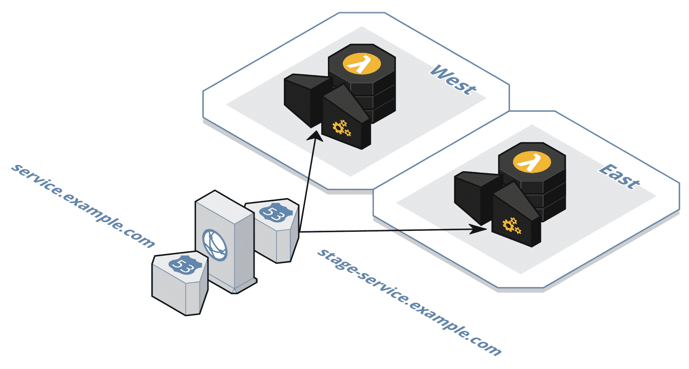
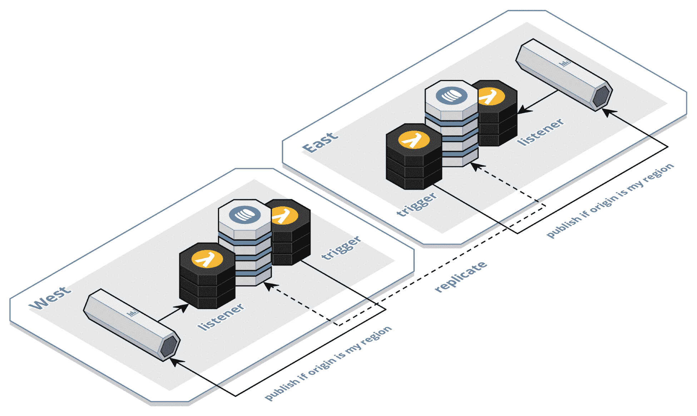
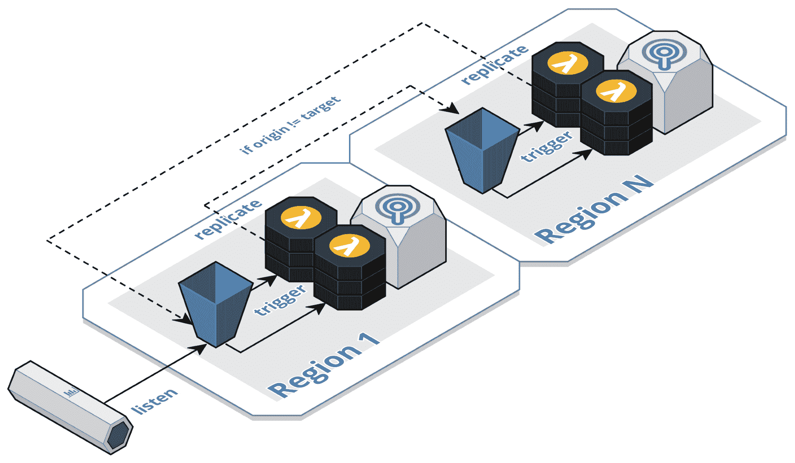

# 部署到多个区域

在本章中，将涵盖以下食谱：

+   实现基于延迟的路由

+   创建区域健康检查

+   触发区域故障转移

+   使用 DynamoDB 实现区域复制

+   实现轮询复制

# 简介

并不是某个云提供商是否会经历一个值得报道的区域中断的问题，而是何时会发生。这是不可避免的。根据我的经验，这种情况大约每两年发生一次。当这种事件发生时，许多系统没有其他选择，在发生中断期间变得不可用，因为它们只设计为在单个区域内的多个可用区工作。与此同时，其他系统几乎不会在可用性方面出现任何波动，因为它们已经被设计为跨多个区域运行。底线是，真正的云原生系统利用区域隔舱，并在多个区域运行。幸运的是，我们利用了已经跨可用区运行的完全托管、增值云服务。这使团队能够将精力重新集中在创建一个活动-活动、多区域系统上。本章中的食谱从三个相互关联的视角涵盖了多区域主题——同步请求、数据库复制和异步事件流。

# 实现基于延迟的路由

许多系统会做出有意识的决策，不跨多个区域运行，因为这根本不值得额外的努力和成本。当以活动-被动模式运行时，这一点完全可以理解，因为额外的努力不会产生容易看到的效益，直到发生区域中断。当以活动-活动模式运行时，它将每月运行成本加倍，这也是可以理解的。相反，无服务器云原生系统可以轻松部署到多个区域，并且由于交易量成本在各个区域之间分散，成本的增加是微不足道的。本食谱演示了如何在多个区域运行 AWS API Gateway 和基于 Lambda 的服务，并利用 Route53 在这些活动-活动区域之间路由流量以最小化延迟。

# 准备工作

您需要一个已注册的域名和一个**Route53 托管区域**，您可以在本食谱中使用它来为将要部署的服务创建子域名，例如我们在*将自定义域名与 CDN 关联*食谱中讨论的那样。您还需要在`us-east-1`和`us-west-2`区域为您的域名获取通配符证书，正如我们在*创建用于传输加密的 SSL 证书*食谱中讨论的那样。

# 如何操作...

1.  从以下模板创建项目：

```js
$ sls create --template-url https://github.com/danteinc/js-cloud-native-cookbook/tree/master/ch10/latency-based-routing --path cncb-latency-based-routing
```

1.  使用`cd cncb-latency-based-routing`导航到`cncb-latency-based-routing`目录。

1.  查看名为`serverless.yml`的文件，其内容如下：

```js
service: cncb-latency-based-routing

plugins:
  - serverless-multi-regional-plugin

provider:
  ...
  endpointType: REGIONAL

custom:
  dns:
    hostedZoneId: ZXXXXXXXXXXXXX
    domainName: ${self:service}.example.com
    regionalDomainName: ${opt:stage}-${self:custom.dns.domainName}
    us-east-1:
      acmCertificateArn: arn:aws:acm:us-east-1:xxxxxxxxxxxx:certificate/...
    us-west-2:
      acmCertificateArn: arn:aws:acm:us-west-2:xxxxxxxxxxxx:certificate/...
  cdn:
    region: us-east-1
    aliases:
      - ${self:custom.dns.domainName}
    acmCertificateArn: ${self:custom.dns.us-east-1.acmCertificateArn}

functions:
  hello:
    ...
```

1.  更新`serverless.yml`文件中的以下字段：

    +   `custom.dns.hostedZoneId`

    +   `custom.dns.domainName`

    +   `custom.dns.us-east-1.acmCertificateArn`

    +   `custom.dns.us-west-2.acmCertificateArn`

1.  审查名为`handler.js`的文件。

1.  使用`npm install`安装依赖项。

1.  使用`npm test`运行测试。

1.  审查`.serverless`目录中生成的内容。

1.  使用`npm run dp:lcl:**w** -- -s $MY_STAGE`在`us-west-2`区域部署堆栈。

1.  在 AWS 控制台中审查`us-west-2`区域的堆栈和资源。

1.  测试服务的`regional`端点并注意负载中返回的区域：

```js
$ curl -v https://$MY_STAGE-cncb-latency-based-routing.example.com/$MY_STAGE/hello

{"message":"Your function executed successfully in us-west-2!"}
```

1.  使用`npm run dp:lcl:**e** -- -s $MY_STAGE`在`us-east-1`区域部署堆栈。

部署 CloudFront 分发可能需要 20 分钟或更长时间。

1.  在 AWS 控制台中审查`us-east-1`区域的堆栈和资源。

1.  测试服务的`global`端点并注意负载中返回的区域，如果你不是最接近`us-west-2`区域，则应与上述不同：

```js
$ curl -v https://cncb-regional-failover-service.example.com/hello

{"message":"Your function executed successfully in us-east-1!"}
```

1.  完成后删除堆栈：

```js
$ npm run rm:lcl:e -- -s $MY_STAGE
$ npm run rm:lcl:w -- -s $MY_STAG
```

# 它是如何工作的...

在这个菜谱中，我们正在将单个服务部署到两个区域——`us-east-1`和`us-west-2`。从 API 网关和 Lambda 函数的角度来看，我们只是在每个区域创建两个不同的 CloudFormation 堆栈。我们有两个脚本——`dp:lcl:**e**`和`dp:lcl:**w**`，这两个脚本之间的唯一区别是它们指定了不同的区域。因此，部署到两个区域的努力微乎其微，而且没有额外的成本，因为我们只按交易付费。在`serverless.yml`文件中需要注意的一点是，我们正在为 API 网关定义`endpointType`为`REGIONAL`，这将使我们能够利用 Route53 的区域路由功能：



如前图所示，我们需要配置 Route53 在两个区域之间执行基于*延迟*的路由。这意味着 Route53 将请求路由到请求者最近的位置。`serverless-multi-regional-plugin`封装了这些配置的大部分细节，因此我们只需要在`custom.dns`下指定变量。首先，我们提供托管顶级域名（例如`example.com`）的区域的`hostedZoneId`。接下来，我们定义将用作通过**CloudFront**访问服务的全局`alias`的`domainName`。为此，我们使用服务名称（即`${self:service}`）作为顶级域名的子域名来唯一标识一个服务。

我们还需要定义一个 `regionalDomainName`，以便在所有区域提供一个通用名称，这样 CloudFront 就可以依赖 Route53 来选择最佳的访问区域。为此，我们使用阶段（即 `${opt:stage}-${self:custom.dns.domainName}`）作为前缀，并请注意，我们将其与破折号连接，以便与简单的通配符证书（如 `*.example.com`）一起使用。区域 `acmCertificateArn` 变量指向每个区域中你的通配符证书的副本，如 *准备就绪* 部分所述。API Gateway 要求证书位于与服务相同的区域。CloudFront 要求证书位于 `us-east-1` 区域。CloudFront 是一项全球服务，因此我们只需要从 `us-east-1` 区域部署 CloudFront 分发。

所有对全局端点（`service.example.com`）的请求都将路由到最近的 CloudFront 边缘位置。CloudFront 然后将请求转发到区域端点（`stage-service.example.com`），Route53 将请求路由到最近的区域。一旦请求进入一个区域，对服务（如 Lambda、DynamoDB 和 Kinesis）的所有请求都将保持在区域内，以最小化延迟。所有状态更改都将复制到其他区域，正如我们在 *使用 DynamoDB 实现区域复制* 和 *实现轮询复制* 配方中讨论的那样。

我强烈建议查看生成的 *CloudFormation* 模板，以了解所有创建的资源细节。

# 创建区域健康检查

云原生系统中的健康检查与传统健康检查的关注点不同。传统的健康检查在实例级别运行，以确定集群中何时需要替换特定的实例。然而，云原生系统使用完全托管、增值的云服务，因此没有实例需要管理。这些无服务器功能提供了特定区域内可用区的高可用性。因此，云原生系统可以专注于在区域之间提供高可用性。本配方演示了如何断言给定区域内使用的增值云服务的状态。

# 准备就绪

要完整完成此配方，您需要一个 Pingdom ([`www.pingdom.com`](https://www.pingdom.com)) 账户。

# 如何操作...

1.  从以下模板创建项目：

```js
$ sls create --template-url https://github.com/danteinc/js-cloud-native-cookbook/tree/master/ch10/regional-health-check --path cncb-regional-health-check
```

1.  使用 `cd cncb-regional-health-check` 命令导航到 `cncb-regional-health-check` 目录。

1.  查看名为 `serverless.yml` 的文件，其内容如下：

```js
service: cncb-regional-health-check

provider:
  name: aws
  runtime: nodejs8.10
  endpointType: REGIONAL
  iamRoleStatements:
    ...

functions:
  check:
    handler: handler.check
    events:
      - http:
          path: check
          method: get
    environment:
      UNHEALTHY: false
      TABLE_NAME:
        Ref: Table

resources:
  Resources:
    Table:
      Type: AWS::DynamoDB::Table
      ...
```

1.  查看名为 `handler.js` 的文件，其内容如下：

```js
module.exports.check = (request, context, callback) => {
  Promise.all([readCheck, writeCheck])
    .catch(handleError)
    .then(response(callback));
};

const db = new aws.DynamoDB.DocumentClient({
  httpOptions: { timeout: 1000 },
  logger: console,
});

const readCheck = () => db.get({
  TableName: process.env.TABLE_NAME,
  Key: {
    id: '1',
  },
}).promise();

const writeCheck = () => db.put({
  TableName: process.env.TABLE_NAME,
  Item: {
    id: '1',
  },
}).promise();

const handleError = (err) => {
  console.error(err);
  return true; // unhealthy
};

const response = callback => (unhealthy) => {
  callback(null, {
    statusCode: unhealthy || process.env.UNHEALTHY === 'true' ? 503 : 200,
    body: JSON.stringify({
      timestamp: Date.now(),
      region: process.env.AWS_REGION,
    }),
    headers: {
      'Cache-Control': 'no-cache, no-store, must-revalidate',
    },
  });
};
```

1.  使用 `npm install` 安装依赖项。

1.  使用 `npm test` 运行测试。

1.  查看在 `.serverless` 目录中生成的内容。

1.  在 `us-east-1` 和 `us-west-2` 区域部署堆栈：

```js
$ npm run dp:lcl:e -- -s $MY_STAGE
...
  GET - https://0987654321.execute-api.us-east-1.amazonaws.com/john/check

$ npm run dp:lcl:w -- -s $MY_STAGE
...
  GET - https://1234567890.execute-api.us-west-2.amazonaws.com/john/check
```

1.  在 AWS 控制台中查看两个区域的堆栈和资源。

1.  对于每个区域，调用堆栈输出中显示的端点，如下所示：

```js
$ curl -v https://0987654321.execute-api.us-east-1.amazonaws.com/$MY_STAGE/check
$ curl -v https://1234567890.execute-api.us-west-2.amazonaws.com/$MY_STAGE/check
```

1.  在您的 **Pingdom** 账户中为每个区域端点创建一个 **Uptime** 检查，间隔为 `1 分钟`。

1.  完成后，请删除堆栈：

```js
$ npm run rm:lcl:e -- -s $MY_STAGE
$ npm run rm:lcl:w -- -s $MY_STAGE
```

# 它是如何工作的...

传统的健康检查通常断言实例能够访问它操作所需的全部资源。区域健康检查做的是同样的事情，但是从整个区域的角度来看。它断言系统使用的所有增值云服务（即资源）在给定区域内都运行正常。如果任何一个资源不可用，我们将根据 *触发区域故障转移* 菜谱中的讨论，将整个区域故障转移。

健康检查服务被实现为一个基于 `REGIONAL` API 网关的服务，并部署到每个区域。然后我们需要定期在每个区域调用健康检查，以确认该区域是健康的。我们可以让 Route53 ping 这些区域端点，但它会频繁地 ping，以至于健康检查服务可能会成为你整个系统中最昂贵的服务。作为替代方案，我们可以使用外部服务，例如 **Pingdom**，在每个区域每分钟调用一次健康检查。对于许多系统来说，每分钟一次已经足够，但对于流量极高的系统，可能从 Route53 提供的更高频率中受益。

健康检查需要确认所需资源可用。健康检查本身隐含地确认 API 网关和 Lambda 服务可用，因为它建立在那些服务之上。对于所有其他资源，它将需要执行某种 ping 操作。在这个菜谱中，我们假设 DynamoDB 是所需资源。健康检查服务定义了自己的 DynamoDB 表，并在每次调用时执行 `readCheck` 和 `writeCheck`，以确认服务仍然可用。如果任一请求失败，则健康检查服务将失败并返回 `503` 状态码。为了测试，该服务提供了一个 `UNHEALTHY` 环境变量，可以用来模拟失败，我们将在下一个菜谱中使用它。

# 触发区域故障转移

正如我们讨论的，在 *创建区域健康检查* 菜谱中，我们的区域健康检查断言系统使用的所有完全管理、增值云服务都正常运行。当这些服务中的任何一个出现故障或错误率足够高时，最好是整个区域故障转移到下一个最佳活动区域。这个菜谱演示了如何使用 **CloudWatch Alarms** 将区域健康检查连接到 Route53，以便 Route53 可以将流量导向健康的区域。

# 准备工作

您需要一个已注册的域名和一个**Route53 托管区域**，您可以使用此配方为要部署的服务创建子域名，例如我们在*将自定义域名与 CDN 关联*配方中讨论的那样。您还需要在`us-east-1`和`us-west-2`区域为您的域名获取通配符证书，例如我们在*创建用于传输加密的 SSL 证书*配方中讨论的那样。

# 如何做到这一点...

1.  从以下模板创建服务并检查项目：

```js
$ sls create --template-url https://github.com/danteinc/js-cloud-native-cookbook/tree/master/ch10/regional-failover/check --path cncb-regional-failover-check

$ sls create --template-url https://github.com/danteinc/js-cloud-native-cookbook/tree/master/ch10/regional-failover/service --path cncb-regional-failover-service
```

1.  使用`cd cncb-regional-failover-check`进入`cncb-regional-failover-check`目录。

1.  查看名为`serverless.yml`的文件，其内容如下：

```js
service: cncb-regional-failover-check
...
functions:
  check:
    ...

resources:
  Resources:
    Api5xxAlarm:
      Type: AWS::CloudWatch::Alarm
      Properties:
        Namespace: AWS/ApiGateway
        MetricName: 5XXError
        Dimensions:
          - Name: ApiName
            Value: ${opt:stage}-${self:service}
        Statistic: Minimum
        ComparisonOperator: GreaterThanThreshold
        Threshold: 0
        Period: 60
        EvaluationPeriods: 1

    ApiHealthCheck:
      DependsOn: Api5xxAlarm
      Type: AWS::Route53::HealthCheck
      Properties:
        HealthCheckConfig:
          Type: CLOUDWATCH_METRIC
          AlarmIdentifier:
            Name:
              Ref: Api5xxAlarm
            Region: ${opt:region}
          InsufficientDataHealthStatus: LastKnownStatus

  Outputs:
    ApiHealthCheckId:
      Value:
        Ref: ApiHealthCheck
```

1.  查看名为`handler.js`的文件。

1.  使用`npm install`安装依赖项。

1.  使用`npm test`运行测试。

1.  查看在`.serverless`目录中生成的内容。

1.  在`us-east-1`和`us-west-2`区域部署堆栈：

```js
$ npm run dp:lcl:e -- -s $MY_STAGE
...
  GET - https://0987654321.execute-api.us-east-1.amazonaws.com/john/check

$ npm run dp:lcl:w -- -s $MY_STAGE
...
  GET - https://1234567890.execute-api.us-west-2.amazonaws.com/john/check
```

1.  在 AWS 控制台中查看两个区域的堆栈和资源。

1.  使用`cd cncb-regional-failover-service`进入`cncb-regional-failover-service`目录。

1.  查看名为`serverless.yml`的文件，其内容如下：

```js
service: cncb-regional-failover-service

plugins:
  - serverless-multi-regional-plugin
...
custom:
  dns:
    ...
    us-east-1:
      ...
      healthCheckId: xxxxxxxx-xxxx-xxxx-xxxx-xxxxxxxxxxxx
    us-west-2:
      ...
      healthCheckId: xxxxxxxx-xxxx-xxxx-xxxx-xxxxxxxxxxxx
...
```

1.  在`serverless.yml`文件中更新以下字段：

    +   `custom.dns.hostedZoneId`

    +   `custom.dns.domainName`

    +   `custom.dns.us-east-1.acmCertificateArn`

    +   从`east`健康检查堆栈的输出中获取`custom.dns.us-east-1.healthCheckId`

    +   `custom.dns.us-west-2.acmCertificateArn`

    +   从`west`健康检查堆栈的输出中获取`custom.dns.us-west-2.healthCheckId`

1.  使用`npm install`安装依赖项。

1.  使用`npm test`运行测试。

1.  查看在`.serverless`目录中生成的内容。

1.  在`us-west-2`和`us-east-1`区域部署堆栈：

```js
$ npm run dp:lcl:w -- -s $MY_STAGE
$ npm run dp:lcl:e -- -s $MY_STAGE
```

部署 CloudFront 分发可能需要 20 分钟或更长时间。

1.  在 AWS 控制台中查看两个区域的堆栈和资源。

1.  测试服务的`global`端点并注意负载中返回的区域：

```js
$ curl -v https://cncb-regional-failover-service.example.com/hello

{"message":"Your function executed successfully in us-east-1!"}
```

1.  前往 AWS 控制台中路由到您请求的区域对应的`cncb-regional-failover-check-<stage>-check` Lambda 函数，将`UNHEALTHY`环境变量更改为`true`并保存函数。例如，前面的输出显示`us-east-1`，因此更新`us-east-1`中的函数。

1.  在几分钟内多次调用该区域的健康检查端点以触发故障转移：

```js
$ curl -v https://0987654321.execute-api.us-east-1.amazonaws.com/$MY_STAGE/check
```

1.  测试服务的`global`端点并注意区域已更改：

```js
$ curl -v https://cncb-regional-failover-service.example.com/hello

{"message":"Your function executed successfully in us-west-2!"
```

1.  在 AWS 控制台中查看 Route53 健康检查的状态。

1.  完成后删除堆栈：

```js
$ cd cncb-regional-failover-service
$ npm run rm:lcl:e -- -s $MY_STAGE
$ npm run rm:lcl:w -- -s $MY_STAGE
$ cd ../cncb-regional-failover-check
$ npm run rm:lcl:e -- -s $MY_STAGE
$ npm run rm:lcl:w -- -s $MY_STAGE
```

# 它是如何工作的...

我们的区域健康检查服务设计为当所需的一个或多个服务返回错误时返回`5xx`状态码。我们在健康检查服务中添加了一个名为`Api5xxAlarm`的 CloudWatch 警报，该警报监控给定区域的 API Gateway `5xxError`指标，并在一分钟内至少有一个`5xx`时发出警报。您可能需要根据具体需求调整警报的灵敏度。接下来，我们向服务中添加了一个名为`ApiHealthCheck`的 Route53 健康检查，它依赖于`Api5xxAlarm`并输出`ApiHealthCheckId`供其他服务使用。最后，我们将`healthCheckId`与每个区域中每个服务的 Route53 RecordSet 关联起来，例如`cncb-regional-failover-service`。当警报状态为`Unhealthy`时，Route53 将停止将流量路由到该区域，直到状态再次变为`Healthy`。

在这个配方中，我们使用了`UNHEALTHY`环境变量来模拟区域故障，并手动调用服务以触发警报。正如我们在*创建区域健康检查*配方中讨论的那样，健康检查通常由另一个服务（如 Pingdom）定期调用，以确保区域健康状态有持续的流量。为了增加覆盖率，我们还可以通过从警报中删除`ApiName`维度来检查区域中所有服务的`5xx`指标，但仍依赖于 ping 健康检查服务来断言状态，当没有其他流量时。

# 在 DynamoDB 中实现区域复制

在区域故障发生时，及时跨区域复制数据对于提供无缝的用户体验非常重要。在正常执行期间，区域复制将在近实时发生。在区域故障期间，应预期数据复制会变慢。我们可以将其视为延期的最终一致性。幸运的是，我们的云原生系统被设计为最终一致性。这意味着它们可以容忍过时的数据，无论数据何时变得一致。本配方展示了如何创建全局表以跨区域复制 DynamoDB 表，并讨论了为什么我们不复制事件流。

# 准备工作

在开始此配方之前，您需要在`us-east-1`和`us-west-2`区域拥有一个 AWS Kinesis Stream，例如在*创建事件流*配方中创建的那个。

# 如何操作...

1.  从以下模板创建项目：

```js
$ sls create --template-url https://github.com/danteinc/js-cloud-native-cookbook/tree/master/ch10/dynamodb-global-table --path cncb-dynamodb-global-table
```

1.  使用`cd cncb-dynamodb-global-table`命令导航到`cncb-dynamodb-global-table`目录。

1.  查看名为`serverless.yml`的文件，其内容如下：

```js
service: cncb-dynamodb-global-table
...

plugins:
  - serverless-dynamodb-autoscaling-plugin
  - serverless-dynamodb-global-table-plugin

custom:
  autoscaling:
    - table: Table
      global: true
      read:
        ...
      write:
        ...

resources:
  Resources:
    Table:
      Type: AWS::DynamoDB::Table
      Properties:
        TableName: ${opt:stage}-${self:service}-things
        ...
        StreamSpecification:
          StreamViewType: NEW_AND_OLD_IMAGES
```

1.  查看名为`handler.js`的文件，其内容如下：

```js
...
module.exports.trigger = (event, context, cb) => {
  _(event.Records)
    .filter(forOrigin)
    .map(toEvent)
    .flatMap(publish)
    .collect()
    .toCallback(cb);
};

const forOrigin = e => e.dynamodb.NewImage['aws:rep:updateregion'] &&
  e.dynamodb.NewImage['aws:rep:updateregion'].S === process.env.AWS_REGION;
...
```

1.  使用`npm install`命令安装依赖项。

1.  使用`npm test -- -s $MY_STAGE`命令运行测试。

1.  查看`.serverless`目录中生成的内容。

1.  在`us-east-1`和`us-west-2`区域部署堆栈：

```js
$ npm run dp:lcl:e -- -s $MY_STAGE
...
Serverless: Created global table: john-cncb-dynamodb-global-table-things with region: us-east-1
...

$ npm run dp:lcl:w -- -s $MY_STAGE
...
Serverless: Updated global table: john-cncb-dynamodb-global-table-things with region: us-west-2
...
```

1.  在两个区域的 AWS 控制台中查看栈和资源。

1.  调用`command`函数将数据保存到`us-east-1`区域：

```js
$ sls invoke -f command -r us-east-1 -s $MY_STAGE -d '{"id":"77777777-4444-1111-1111-111111111111","name":"thing one"}'
```

1.  调用`query`函数从`us-west-2`区域检索数据：

```js
$ sls invoke -f query -r us-west-2 -s $MY_STAGE -d 77777777-4444-1111-1111-111111111111
{
    "Item": {
        "aws:rep:deleting": false,
        "aws:rep:updateregion": "us-east-1",
        "aws:rep:updatetime": 1534819304.087001,
        "id": "77777777-4444-1111-1111-111111111111",
        "name": "thing one",
        "latch": "open"
    }
}
```

1.  查看两个区域中`trigger`和`listener`函数的日志：

```js
$ sls logs -f trigger -r us-east-1 -s $MY_STAGE
$ sls logs -f listener -r us-east-1 -s $MY_STAGE
$ sls logs -f trigger -r us-west-2 -s $MY_STAGE
$ sls logs -f listener -r us-west-2 -s $MY_STAGE
```

1.  完成后，删除两个栈：

```js
$ npm run rm:lcl:e -- -s $MY_STAGE
$ npm run rm:lcl:w -- -s $MY_STAGE
```

# 它是如何工作的...

**DynamoDB 全局表**负责在所有与全局表关联的区域表中复制数据，并保持数据同步，这一切都在近乎实时完成。`serverless-dynamodb-global-table-plugin`将创建全局表，并设计用于与`serverless-dynamodb-autoscaling-plugin`一起工作。对于每个将`global`标志设置为 true 的表，当服务部署到第一个区域时，插件将创建全局表。对于后续的区域部署，插件将区域表添加到全局表中。每个区域表必须具有相同的名称，启用流，并具有相同的自动扩展策略，这由插件处理。插件不处理的一件事是，当全局表最初部署时，所有表都必须为空。

我们将从快乐的路径场景开始，其中没有区域中断，一切运行顺利，并逐步通过以下图表。当数据写入某个区域的表，例如`us-east-1`时，数据将被复制到`us-west-2`区域。`us-east-1`区域的`trigger`也会被调用。该触发器有一个`forOrigin`过滤器，它会忽略所有`aws:rep:updateregion`字段不等于当前`AWS_REGION`的事件。否则，触发器将向当前区域的 Kinesis Stream 发布事件，并且所有订阅者将在当前区域执行并复制自己的数据到其他区域。当前服务的`listener`将忽略它自己产生的任何事件。在`us-west-2`区域，复制完成后，`trigger`也会被调用，但`forOrigin`过滤器将短路逻辑，因此不会向 Kinesis 发布重复事件，也不会在该区域的所有订阅者中重新处理。重复事件处理的不效率和可能的无穷复制循环是最好不复制事件流，而是依赖于叶数据存储复制的原因：



注意，这个配方基于*实现双向同步*配方中的代码，因此您可以查看该配方以获取有关代码的更多详细信息。

在区域故障转移期间，在最佳情况下，用户的数据已经复制，故障转移过程将完全无缝。用户的下一个命令将在新区域执行，事件链将在新区域处理，最终结果将复制回故障区域。当存在一些复制延迟时，**会话一致性**有助于使故障转移过程看起来无缝，正如我们在*利用会话一致性*配方中所讨论的那样。然而，在区域故障转移期间，失败的区域中的一些订阅者可能会落后于处理区域流中剩余的事件。幸运的是，区域中断通常意味着失败区域中的吞吐量较低，而不是没有吞吐量。这意味着将事件处理的结果复制到其他区域会有更高的延迟，但它们最终会变得一致。为最终一致性设计的用户体验，例如移动设备上的电子邮件应用程序，将轻松处理这种拖延的最终一致性。

尝试跟踪哪些事件已处理以及哪些事件卡在失败区域中的复杂性是最好不复制事件流的另一个原因。在无法容忍这种拖延的最终一致性情况下，新区域中的最新事件可以依赖会话一致性以获取更准确的信息，并使用*使用逆 oplock 实现幂等性*和*使用事件溯源实现幂等性*配方中讨论的技术来处理从缓慢恢复的区域接收到的顺序错误的旧事件。

# 实现轮询复制

在我们的多语言持久性架构中，并非所有数据库都支持像 AWS DynamoDB 那样的即插即用区域复制，但我们仍然需要将它们的数据复制到多个区域以提高延迟并支持区域故障转移。本配方演示了如何使用 AWS S3 作为代理为任何数据库添加区域复制。

# 如何操作...

1.  从以下模板创建项目：

```js
$ sls create --template-url https://github.com/danteinc/js-cloud-native-cookbook/tree/master/ch10/round-robin-replication --path cncb-round-robin-replication
```

1.  使用`cd cncb-round-robin-replication`导航到`cncb-round-robin-replication`目录。

1.  检查名为`serverless.yml`的文件，其内容如下：

```js
service: cncb-round-robin-replication
...
functions:
  listener:
    ...
  trigger:
    ...
  search:
    ...
  replicator:
    handler: replicator.trigger
    events:
      - sns:
          arn: 
            Ref: BucketTopic
          topicName: ${self:service}-${opt:stage}-trigger
    environment:
      REPLICATION_BUCKET_NAME: ${self:custom.regions.${opt:region}.replicationBucketName}

custom:
  regions:
    us-east-1:
      replicationBucketName: cncb-round-robin-replication-${opt:stage}-bucket-WWWWWWWWWWWWW
    us-west-2:
      replicationBucketName: cncb-round-robin-replication-${opt:stage}-bucket-EEEEEEEEEEEEE
...
```

1.  检查名为`replicator.js`的文件，其内容如下：

```js
module.exports.trigger = (event, context, cb) => {
  _(event.Records)
    .flatMap(messagesToTriggers)
    .flatMap(get)
    .filter(forOrigin)
    .flatMap(replicate)
    .collect()
    .toCallback(cb);
};

...
const forOrigin = uow => uow.object.Metadata.origin !== process.env.REPLICATION_BUCKET_NAME;
...
const replicate = uow => {
  const { ContentType, CacheControl, Metadata, Body } = uow.object;

  const params = {
    Bucket: process.env.REPLICATION_BUCKET_NAME,
    Key: uow.trigger.s3.object.key,
    Metadata: {
      'origin': uow.trigger.s3.bucket.name,
      ...Metadata,
    },
    ACL: 'public-read',
    ContentType,
    CacheControl,
    Body,
  };

  const s3 = new aws.S3(...);
  return _(
    s3.putObject(params).promise()
    ...
  );
};
```

1.  使用`npm install`安装依赖项。

1.  使用`npm test -- -s $MY_STAGE`运行测试。

1.  检查`.serverless`目录中生成的内容。

1.  在`us-east-1`和`us-west-2`区域部署堆栈：

```js
$ npm run dp:lcl:e -- -s $MY_STAGE
$ npm run dp:lcl:w -- -s $MY_STAGE
```

1.  在`serverless.yml`中更新`replicationBucketName`变量，以便`us-east-1`复制到`us-west-2`，反之亦然，然后重新部署堆栈。

1.  在 AWS 控制台中检查堆栈和资源。

1.  使用以下命令从单独的终端发布事件：

```js
$ cd <path-to-your-workspace>/cncb-event-stream
$ sls invoke -f publish -r us-east-1 -s $MY_STAGE -d '{"type":"thing-created","thing":{"new":{"name":"thing two","id":"77777777-5555-1111-1111-111111111111"}}}'
```

1.  使用以下 curl 命令在 `us-west-2` 区域搜索数据：

```js
$ curl https://<API-ID>.execute-api.us-west-2.amazonaws.com/$MY_STAGE/search?q=two | json_pp

[
   {
      "id" : "77777777-5555-1111-1111-111111111111",
      "url" : "https://s3.amazonaws.com/cncb-round-robin-replication-john-bucket-1cqxst40pvog4/things/77777777-5555-1111-1111-111111111111",
 "name" : "thing two"
 }
]
```

1.  查看两个区域中 `trigger` 和 `listener` 函数的日志：

```js
$ sls logs -f replicator -r us-east-1 -s $MY_STAGE
...
2018-08-19 17:00:05 ... [AWS s3 200 0.04s 0 retries] getObject({ Bucket: 'cncb-round-robin-replication-john-bucket-1a3rh4v9tfedw',
  Key: 'things/77777777-5555-1111-1111-111111111111' })
2018-08-19 17:00:06 ... [AWS s3 200 0.33s 0 retries] putObject({ Bucket: 'cncb-round-robin-replication-john-bucket-1cqxst40pvog4',
  Key: 'things/77777777-5555-1111-1111-111111111111',
  Metadata:
   { origin: 'cncb-round-robin-replication-john-bucket-1a3rh4v9tfedw' },
  ACL: 'public-read',
  ContentType: 'application/json',
  CacheControl: 'max-age=300',
  Body: <Buffer ... > })
...

$ sls logs -f replicator -r us-west-2 -s $MY_STAGE
...
2018-08-19 17:00:06 ... [AWS s3 200 0.055s 0 retries] getObject({ Bucket: 'cncb-round-robin-replication-john-bucket-1cqxst40pvog4',
  Key: 'things/77777777-5555-1111-1111-111111111111' })
2018-08-19 17:00:06 ... {... "object":{..."Metadata":{"origin":"cncb-round-robin-replication-john-bucket-1a3rh4v9tfedw"}, ...}}
...
```

1.  在移除堆叠之前，请先在每个区域清空水桶

1.  完成后，请移除两个堆叠。

```js
$ npm run rm:lcl:e -- -s $MY_STAGE
$ npm run rm:lcl:w -- -s $MY_STAGE
```

# 它是如何工作的...

在这个配方中，我们在 Elasticsearch 中创建了一个**物化视图**，并希望允许用户搜索他们最近区域的数据库。然而，Elasticsearch 不支持区域复制。正如我们在 *使用 DynamoDB 实现区域复制* 配方中讨论的那样，我们不希望复制事件流，因为该解决方案复杂且难以理解。相反，如图所示，我们将在每个区域将一个 S3 桶放在 Elasticsearch 前面，并利用 S3 触发器来更新 Elasticsearch 以及实现循环复制方案：



注意，这个配方基于 *实现搜索 BFF* 配方中的代码，因此您可以查看该配方以获取有关代码的更多详细信息。

该服务监听当前区域的 Kinesis 流，并将数据写入当前区域的 S3 桶，这会生成一个路由到 SNS 主题的 S3 触发器。一个函数响应该主题并在当前区域创建 Elasticsearch 中的物化视图。同时，一个 `replicator` 函数也响应相同的主题。复制器将 S3 桶中对象的全部内容复制到由 `REPLICATION_BUCKET_NAME` 环境变量指定的下一个区域的匹配桶。这反过来在该区域生成一个触发器。再次，一个函数响应该主题并在该区域创建 Elasticsearch 中的物化视图。该区域的 `replicator` 也响应并试图将对象复制到下一个区域。这个过程将 `trigger` 和 `replicate` 循环进行，直到 `forOrigin` 过滤器看到原始桶（即 `uow.object.Metadata.origin`）等于当前复制器的目标（即 `process.env.REPLICATION_BUCKET_NAME`）。在这个配方中，我们有两个区域——`us-east-1` 和 `us-west-2`。数据起源于东部区域，因此东部复制器将数据复制到西部桶（`1cqxst40pvog4`）。西部复制器不会将数据复制到东部桶（`1a3rh4v9tfedw`），因为原始桶是东部桶。

这种循环复制技术是一种简单且成本效益高的方法，它建立在现有的事件架构之上。请注意，我们无法利用内置的 S3 复制功能来实现此目的，因为它只复制到单个区域，并且不会产生连锁反应。然而，我们可以像在 *为灾难恢复复制数据湖* 配方中讨论的那样，将这些桶添加 S3 复制以进行备份和灾难恢复。
