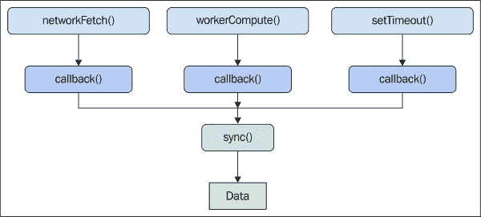
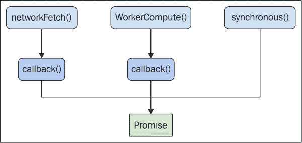
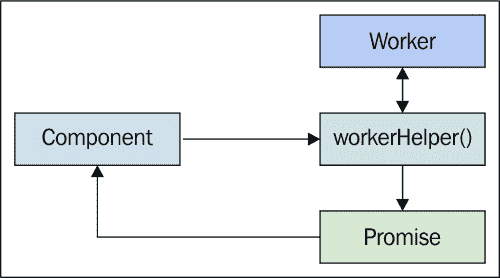
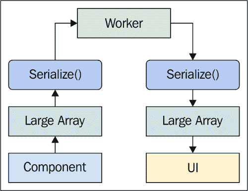
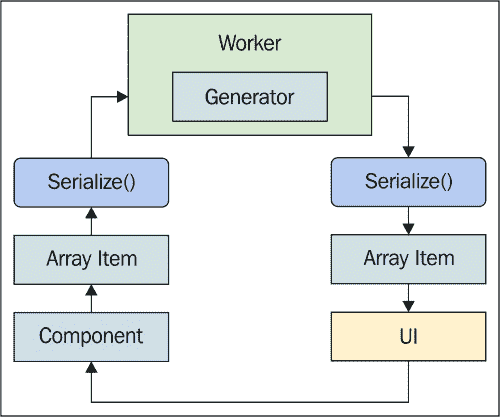
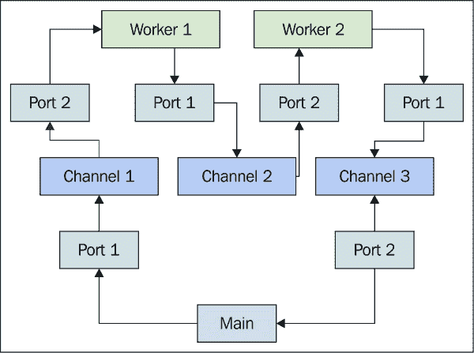
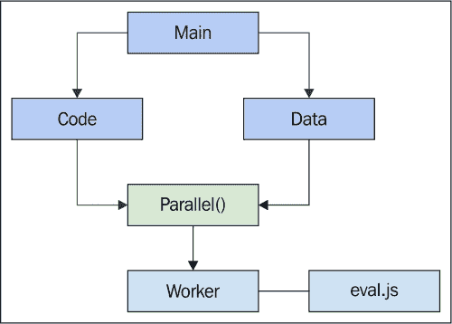

# 第七章。抽象并发

到目前为止，我们在代码中明确地建模了并发问题。使用承诺，我们同步了两个或多个异步操作。使用生成器，我们即时创建数据，避免了不必要的内存分配。最后，我们了解到 Web 工作者是利用多个 CPU 核心的得力助手。

在本章中，我们将把这些想法融入到应用代码的上下文中。也就是说，如果并发是默认的，那么我们需要尽可能让并发不显眼。我们将从探索各种技术开始，这些技术将帮助我们封装我们使用的组件中的并发机制。然后，我们将通过使用承诺来促进工作通信，直接改进前两章中的代码。

一旦我们能够使用承诺来抽象工作通信，我们将探讨在生成器的帮助下实现懒工作者的方法。我们还将介绍使用`Parallel.js`库进行工作抽象的概念，以及工作池的概念。

# 编写并发代码

并发编程很难做对。即使是在构造的示例应用中，大部分的复杂性都来自于并发代码。我们显然希望代码可读，同时保持并发的优势。我们希望从系统中的每个 CPU 上获取最大利益。我们只想在需要的时候计算所需的内容。我们不希望代码像意大利面一样杂乱无章地连接几个异步操作。在开发应用时，专注于所有这些并发编程的方面会分散我们真正应该关注的焦点——那些赋予应用价值的功能。

在本节中，我们将探讨我们可能使用的各种方法来隔离我们应用的其他部分，以避免棘手的并发部分。这通常意味着即使底层没有真正的并发发生，也要将并发作为默认模式。最终，我们不希望我们的代码包含 90%的并发技巧和 10%的功能。

## 隐藏并发机制

在整个代码中暴露并发机制的问题是它们彼此之间都有所不同。这放大了我们可能已经陷入的回调地狱。例如，并非所有的并发操作都是从远程资源获取数据的网络请求。异步数据可能来自工作者或某些本身也是异步的回调。想象一下这样一个场景：我们有三个不同的数据源用于计算我们需要的值——所有这些都是异步的。以下是问题的说明：



此图中所示的数据是我们应用代码中关注的东西。从我们所构建的功能的角度来看，我们对其之上的任何东西都不感兴趣。因此，我们的前端架构需要封装与并发相关的复杂性。这意味着我们的每个组件都应该能够以相同的方式访问数据。除了我们所有的异步数据源之外，这里还有一个需要考虑的复杂问题——当数据不是异步的，而是来自本地源时怎么办？同步本地数据源和 HTTP 请求怎么办？我们将在下一节中介绍这个问题。

## 没有并发

虽然我们正在编写一个并发 JavaScript 应用，但并非每个操作都是固有的并发操作。例如，如果一个组件请求另一个组件它已经存储在内存中的数据，那么这不是一个异步操作，会立即返回。我们的应用可能充满了这样的操作，其中并发性根本不适用。这就是挑战所在——我们如何无缝地将异步操作与同步操作混合？

简单的答案是我们在每个地方都做出了并发的默认假设。承诺使这个问题变得可操作。以下是一个使用承诺封装异步和同步操作的示例：



这看起来与之前的图表非常相似，但有两大重要区别。我们添加了一个`synchronous()`操作；这个操作没有回调函数，因为它不需要。它不需要等待任何其他东西，所以它会立即返回。其他两个函数与之前的图表中的函数一样；它们都依赖于回调函数将数据输入我们的应用。第二个重要区别是存在一个承诺对象。它取代了`sync()`操作和数据概念。或者更确切地说，它将它们融合成了同一个概念。

这就是承诺的关键特性——它们能够为我们抽象出同步问题的通用能力。这不仅适用于网络请求，也适用于 Web Worker 消息，或任何依赖回调的异步操作。我们需要稍微调整一下思维，将数据视为我们承诺它最终会到达。但是，一旦我们填补了这个心理差距，并发性就默认开启了。就我们的功能而言，并发性是默认的，而且我们在操作系统幕后所做的一切都不会造成任何干扰。

现在，让我们将注意力转向一些代码。我们将创建两个函数：一个异步函数和一个简单的函数，它只是返回一个值。我们的目标是使使用这些函数的代码相同，尽管值生成的方式存在重大差异：

```js
// An asynchronous "fetch" function. We use "setTimeout()"
// to pass "callback()" some data after 1 second.
function fetchAsync(callback) {
    setTimeout(() => {
        callback({ hello: 'world' });
    }, 1000);
}

// The synchronous fetch simply returns the data.
function fetchSync() {
    return { hello: 'world' };
}

// A promise for the "fetchAsync()" call. We pass the
// "resolve" function as the callback.
var asyncPromise = new Promise((resolve, reject) => {
    fetchAsync(resolve);
});

// A promise for the "fetchSync()" call. This promise
// is resolved immediately with the return value.
var syncPromise = new Promise((resolve, reject) => {
    resolve(fetchSync());
});

// Creates a promise that'll wait for two promises
// to complete before resolving. This allows us
// to seamlessly mix synchronous and asynchronous
// values.
Promise.all([
    asyncPromise, 
    syncPromise 
]).then((results) => {
    var [ asyncResult, syncResult ] = results;

    console.log('async', asyncResult);
    // → async { hello: 'world' }

    console.log('sync', syncResult);
    // → sync { hello: 'world' }
});
```

这里的权衡是增加了承诺的复杂性，围绕着一个函数原本简单返回的值。但在现实中，这种复杂性被封装在承诺中，如果我们不是在编写并发应用程序，我们显然需要关注这些问题。好处是巨大的。当一切都是承诺值时，我们可以安全地排除导致讨厌的并发错误的矛盾。

# 使用承诺进行工作者通信

我们现在明白了将原始值作为承诺处理如何使我们的代码受益。现在是时候将这个概念应用到 Web 工作者上了。在前面的两章中，我们的代码开始看起来有点难以处理，因为我们实际上是在尝试模拟承诺擅长处理的许多样板工作。我们首先尝试通过创建辅助函数来解决这个问题，这些辅助函数为我们包装了工作者通信，并返回承诺。然后我们将尝试另一种涉及在较低级别扩展 Web 工作者接口的方法。最后，我们将查看一些更复杂的同步场景，这些场景涉及多个工作者，例如上一章中的那些。

## 辅助函数

如果我们能以承诺解决的形式获取 Web 工作者的响应，那将是理想的。但是，我们需要首先创建这个承诺——我们如何做到这一点呢？嗯，我们可以手动创建承诺，其中发送给工作者的消息是在承诺执行函数内部发送的。但是，如果我们采取这种方法，我们并没有比引入承诺之前好多少。

技巧是将发送给工作者的消息以及从工作者接收到的任何消息都封装在单个辅助函数中，就像这里所展示的那样：



让我们看看一个实现这种模式的示例辅助函数。首先，我们需要一个执行某些任务的工作者——我们从这个开始：

```js
// Eat some CPU cycles...
// Taken from http://adambom.github.io/parallel.js/
function work(n) {
    var i = 0;
    while (++i < n * n) {}
    return i;
}

// When we receive a message, we post a message with the
// id, and the result of performing "work()" on "number".
addEventListener('message', (e) => {
    postMessage({
        id: e.data.id,
        result: work(e.data.number)
    });
});
```

在这里，有一个工作者，它会对我们传递给它的任何数字进行平方。这个`work()`函数故意设计得较慢，这样我们就可以看到当 Web 工作者完成任务的用时比平时长时，整个应用程序的表现。它还使用了一个 ID，就像我们在之前的 Web 工作者示例中看到的那样，这样它就可以与发送消息的代码进行协调。现在让我们实现使用这个工作者的辅助函数：

```js
// This will generate unique IDs. We need them to
// map tasks executed by web workers to the larger
// operation that created them.
function* genID() {
    var id = 0;

    while (true) {
        yield id++;
    }
}

// Creates the global "id" generator.
var id = genID();

// This object holds the resolver functions from promises,
// as results comeback from workers, we look them up here,
// based on ID.
var resolvers = {};

// Starts our worker...
var worker = new Worker('worker.js');

worker.addEventListener('message', (e) => {
    // Finds the appropriate resolver function.
    var resolver = resolvers[e.data.id];

    // Deletes it from the "resolvers" object.
    delete resolvers[e.data.id];

    // Pass the worker data to the promise by calling
    // the resolver function.
    resolver(e.data.result);
});

// This is our helper function. It handles the posting of
// messages to the worker, and tying the promise to the
// worker responses.
function square(number) {
    return new Promise((resolve, reject) => {
        // The ID that's used to tie together a web 
        // worker response, and a resolver function.
        var msgId = id.next().value;

        // Stores the resolver so in can be used later, in
        // the web worker message callback.
        resolvers[msgId] = resolve;

        // Posts the message - the ID and the number
        // argument.
        worker.postMessage({
            id: msgId,
            number: number
        });
    });
}

square(10).then((result) => {
    console.log('square(10)', result);
    // → square(10) 100
});

square(100).then((result) => {
    console.log('square(100)', result);
    // → square(100) 10000
});

square(1000).then((result) => {
    console.log('square(1000)', result);
    // → square(1000) 1000000
});
```

如果我们关注`square()`函数的使用方式，即传递一个数字参数并返回一个承诺作为结果，我们可以看到这符合我们之前关于默认使代码并行的讨论。例如，我们可以完全从这种场景中移除工作者，只需简单地改变辅助函数解决它返回的承诺的方式，其余的代码将继续按原样运行。

辅助函数策略只是简化使用承诺的工作线程通信的一种方法。也许我们可以决定我们不一定需要维护一大堆辅助函数。接下来，我们将探讨一种比辅助函数更细粒度的方法。

## 扩展`postMessage()`

与积累大量辅助函数相比，我们可以采取更通用的路线。辅助函数没有错；它们直接且简洁。如果我们真的有数百个，它们的价值会迅速贬值。更通用的方法是一直使用`worker.postMessage()`。

让我们看看我们是否可以使这个方法返回一个承诺，就像我们上一节中的辅助函数一样。这样，我们继续使用细粒度的`postMessage()`方法，但改进了我们的同步语义。首先，这是工作线程代码：

```js
addEventListener('message', (e) => {

    // The result we're posting back to the main
    // thread - it should always contain the
    // message ID.
    var result = { id: e.data.id };

    // Based on the "action", compute the response
    // "value". The options are leave the text alone,
    // convert it to upper case, or convert it to
    // lower case.
    if (e.data.action === 'echo') {
        result.value = e.data.value
    } else if (e.data.action === 'upper') {
        result.value = e.data.value.toUpperCase();
    } else if (e.data.action === 'lower') {
        result.value = e.data.value.toLowerCase();
    }

    // Simulate a longer-running worker by waiting
    // 1 second before posting the response back.
    setTimeout(() => {
        postMessage(result);
    }, 1000);
});
```

这与我们迄今为止在 web 工作线程代码中看到的内容并没有什么根本的不同。现在，在主线程中，我们必须找出如何改变`Worker`的接口。让我们现在就做这件事。然后，我们将尝试向这个工作线程发送一些消息，并作为响应解析承诺：

```js
// This object holds the resolver functions from promises,
// as results comeback from workers, we look them up here,
// based on ID.
var resolvers = {};

// Keep the original implementation of "postMessage()"
// so we can call it later on, in our custom "postMessage()"
// implementation.
var postMessage = Worker.prototype.postMessage;

// Replace "postMessage()" with our custom implementation.
Worker.prototype.postMessage = function(data) {
    return new Promise((resolve, reject) => {

        // The ID that's used to tie together a web worker
        // response, and a resolver function.
        var msgId = id.next().value;

        // Stores the resolver so in can be used later, in
        // the web worker message callback.
        resolvers[msgId] = resolve;

        // Run the original "Worker.postMessage()"
        // implementation, which takes care of actually
        // posting the message to the worker thread.
        postMessage.call(this, Object.assign({
            id: msgId
        }, data));
    });
};

// Starts our worker...
var worker = new Worker('worker.js');

worker.addEventListener('message', (e) => {

    // Finds the appropriate resolver function.
    var resolver = resolvers[e.data.id];

    // Deletes it from the "resolvers" object.
    delete resolvers[e.data.id];

    // Pass the worker data to the promise by calling
    // the resolver function.
    resolver(e.data.value);
});

worker.postMessage({
    action: 'echo',
    value: 'Hello World'
}).then((value) => {
    console.log('echo', `"${value}"`);
    // → echo "Hello World"
});

worker.postMessage({
    action: 'upper',
    value: 'Hello World'
}).then((value) => {
    console.log('upper', `"${value}"`);
    // → upper "HELLO WORLD"
});

worker.postMessage({
    action: 'lower',
    value: 'Hello World'
}).then((value) => {
    console.log('lower', `"${value}"`);
    // → lower "hello world"
});
```

好吧，这正是我们所需要的，对吧？我们可以直接将消息数据发送到工作线程，响应数据则通过承诺解析返回给我们。作为额外的奖励，如果我们愿意，实际上可以在这个新的`postMessage()`函数实现周围包装辅助函数。使这一切工作起来的主要技巧是存储对原始`postMessage()`的引用。然后，我们覆盖 web 工作线程属性`postMessage`，而不是函数本身。最后，我们可以重用它来添加必要的协调和承诺的好处。

## 同步工作线程结果

最后两个部分的代码已经足够减少我们的 web 工作线程回调地狱到一个更可容忍的水平。事实上，现在我们已经掌握了如何通过`postMessage()`返回承诺来封装 web 工作线程通信，我们准备开始简化任何不使用此方法的混乱工作线程代码。到目前为止，我们所查看的示例已经从承诺中受益匪浅，它们很简单；没有这些抽象并不会是世界末日。

那么，当我们映射一组数据然后减少映射集合的场景呢？我们可能会回忆起在第六章 *实践并行性* 中，映射/减少代码变得有些复杂。这主要是因为所有与尝试执行映射/减少操作代码纠缠在一起的工人通信样板代码。让我们看看使用我们的承诺技术是否会有所改善。首先，我们将创建一个非常基础的工作线程：

```js
// Returns a map of the input array, by squaring
// each number in the array.
addEventListener('message', (e) => {
    postMessage({
        id: e.data.id,
        value: e.data.value.map(v => v * v)
    });
});
```

我们可以使用这个工作线程来传递映射数组。因此，我们将创建两个，并在两个工作线程之间分配工作量，如下所示：

```js
function onMessage(e) {

    // Finds the appropriate resolver function.
    var resolver = resolvers[e.data.id];

    // Deletes it from the "resolvers" object.
    delete resolvers[e.data.id];

    // Pass the worker data to the promise by calling
    // the resolver function.
    resolver(e.data.value);
}

// Starts our workers...
var worker1 = new Worker('worker.js'),
    worker2 = new Worker('worker.js');

// Create some data to process.
var array = new Array(50000)
    .fill(null)
    .map((v, i) => i);

// Finds the appropriate resolver function to call,
// when the worker responds with data.
worker1.addEventListener('message', onMessage);
worker2.addEventListener('message', onMessage);

// Splits our input data in 2, giving the first half
// to the first worker, and the second half to the
// second worker. At this point, we have two promises.
var promise1 = worker1.postMessage({
    value: array.slice(0, Math.floor(array.length / 2))
});

var promise2 = worker2.postMessage({
    value: array.slice(Math.floor(array.length / 2))
});

// Using "Promise.all()" to synchronize workers is
// much easier than manually trying to reconcile
// through worker callback functions.
Promise.all([ promise1, promise2 ]).then((values) => {
    console.log('reduced', [].concat(...values)
        .reduce((r, v) => r + v));
    // → reduced 41665416675000
});
```

当我们只需要将数据发布到工作者，并从两个或更多工作者同步数据时，我们实际上有动力编写并发代码——现在它看起来和我们的应用代码一样。

# 懒工作者

是时候从不同角度审视 Web Workers 了。我们最初使用工作者的基本原因是我们想要在相同的时间内计算比过去更多的内容。正如我们现在所知，这样做涉及到消息的复杂性、分而治之的策略。我们必须将数据放入和取出工作者，通常作为一个数组。

生成器帮助我们懒加载地计算。也就是说，我们不想在真正需要之前计算某些东西或分配内存。Web Workers 会使得这种懒加载变得困难或不可能实现吗？或者我们可以利用生成器来懒加载和并行计算？

在本节中，我们将探讨与在 Web Workers 中使用生成器相关的一些想法。首先，我们将查看与 Web Workers 相关的开销问题。然后，我们将编写一些使用生成器在工作者之间传递数据的代码。最后，我们将看看我们是否可以懒加载地通过一系列生成器传递数据，所有这些生成器都位于 Web Workers 中。

## 减少开销

主线程可以将昂贵的操作卸载给 Web Workers，在另一个线程中运行它们。这意味着 DOM 能够绘制挂起的更新并处理挂起的用户事件。然而，我们仍然面临分配大型数组以及更新 UI 所需时间的开销。尽管使用了 Web Workers 进行并行处理，但我们的用户仍然可能面临速度减慢，因为没有更新到 UI，直到整个数据集被处理。以下是这种一般模式的可视化：



这是一个单工作者处理数据的通用路径；当有多个工作者时，也适用同样的方法。采用这种方法，我们无法避免需要两次序列化数据，并且需要两次分配。这些开销仅仅是方便工作者之间的通信，与我们试图实现的应用功能关系不大。

由于工作者通信所需的数组和序列化开销通常不是什么大问题。然而，对于更大的集合，我们可能会面临真正的性能问题，这些问题源于我们用来提高性能的机制。因此，从另一个角度审视工作者通信是有益的，即使最初并不必要。

这里是大多数工作者采取的通用路径的一种变体。不是预先分配和序列化大量数据，而是将单个项目在工作者之间传递。这给了 UI 使用已处理的数据更新的机会，在所有处理数据到达之前。



## 在工作者中生成值

如果我们想在工作者生成结果时更新 UI，那么它们不能在所有计算完成后将结果集打包为数组发送回主线程。在这个过程中，UI 会坐那里不响应用户。我们想要一个更懒惰的方法，一次生成一个值，这样 UI 就可以更早地更新。让我们构建一个示例，将输入发送到 Web 工作者，并以比我们在本书中迄今为止看到的更细粒度的方式发送结果：

首先，我们将创建一个工作者；它的代码如下：

```js
// Eat some CPU cycles...
// Taken from http://adambom.github.io/parallel.js/
function work(n) {
    var i = 0;
    while (++i < n * n) {}
    return i;
}

// Post the result of calling "work()" back to the
// main thread.
addEventListener('message', (e) => {
    postMessage(work(e.data));
});
```

这里没有什么石破天惊的。这正是我们之前已经使用过的`work()`函数，通过不高效地平方一个数字来故意减慢我们的代码。在工作者内部没有使用实际的生成器。这是因为我们真的不需要一个，我们稍后会看到原因：

```js
// Creates an "update()" coroutine that continuously
// updates the UI as results are generated from the
// worker.
var update = coroutine(function* () {
    var input;

    while (true) {
        input = yield;
        console.log('result', input.data);
    }
});

// Creates the worker, and assigns the "update()"
// coroutine as the "message" callback handler.
var worker = new Worker('worker.js');
worker.addEventListener('message', update);

// An array of progressively larger numbers.
var array = new Array(10)
    .fill(null)
    .map((v, i) => i * 10000);

// Iterate over the array, passing each number to the
// worker as an individual message.
for (let item of array) {
    worker.postMessage(item);
}
// → 
// result 1
// result 100000000
// result 400000000
// result 900000000
// result 1600000000
// result 2500000000
// result 3600000000
// result 4900000000
// result 6400000000
// result 8100000000
```

传递给我们的工作者的每个数字比前一个数字处理起来更昂贵。因此，在向用户显示任何内容之前处理整个输入数组会给人一种应用程序挂起或损坏的感觉。但在这里并非如此，因为尽管每个数字处理起来都很昂贵，但我们正在将结果作为它们可用时发送回去。

我们执行的工作量与我们通过传递数组并返回数组作为输出所执行的工作量相同。然而，这种方法只是改变了事情发生的顺序。我们已经引入了协作多任务处理——在一个任务中计算一些数据，在另一个任务中更新 UI。完成工作所需的总时间是相同的，但对用户来说，感觉要快得多。最终，我们应用程序的用户可感知性能是唯一重要的性能指标。

### 注意

我们将输入作为单个消息传递。我们也可以将输入作为数组传递，分别发布结果，并得到相同的效果。然而，这可能只是无用的复杂性。按照目前的模式，这种对应关系是自然的——输入项目，输出项目。如果不需要，就不要改变它。

## 惰性工作者链

如我们在第四章中看到的，*使用生成器的惰性求值*，我们可以组装生成器的链。这就是我们如何以惰性方式实现复杂功能；一个项目通过一系列在传递给下一个生成器之前转换项目的生成器函数流动，直到它达到调用者。如果没有生成器，我们可能不得不分配大量的中间数据结构，仅仅是为了将数据从一个函数传递到下一个函数。

在本节之前，我们看到了使用 Web 工作者实现类似于生成器的模式是可能的。由于我们在这里面临类似的问题，我们不希望分配大型数据结构。我们可以通过在更细粒度级别传递项来避免这样做。这还有一个额外的优点，即保持 UI 响应，因为我们能够在工作者从最后一个项到达之前更新它。鉴于我们可以通过工作者做到这一点，我们能否在此基础上构建并组装更复杂的工作者处理节点链？

例如，假设我们有一组数字和几个转换。在我们能在 UI 中显示它们之前，我们需要按照特定的顺序执行这些转换。理想情况下，我们会设置一个工作者的链，其中每个工作者负责执行其指定的转换，然后将输出传递给下一个工作者。最终，主线程会得到一个可以显示在 DOM 中的值。

这个目标的问题在于其中涉及到的复杂通信。由于专用工作者只与创建它们的线程通信，将结果发送回主线程，然后传递给链中的下一个工作者，如此等等，几乎没有什么优势。然而，事实证明，专用工作者可以直接通信，而不涉及主线程。在这里，我们可以使用一种称为通道消息的东西。这个想法很简单；它涉及到创建一个通道，该通道有两个端口——消息在一个端口上发布，在另一个端口上接收。

我们一直在使用消息通道和端口。它们是内置于 Web 工作者中的。这就是消息事件和`postMessage()`方法模式来源的地方。

以下是我们如何使用通道和端口连接我们的 Web 工作者的可视化：



正如我们所见，每个通道使用两个消息端口。第一个端口用于发布消息，而第二个端口用于接收消息事件。唯一使用主线程的时候是当处理链首次启动时，通过向第一个通道发布消息，以及从第三个通道接收消息时。

不要让六个用于工作者通信的端口让我们感到害怕，让我们写一些代码；也许在那里它看起来会更容易接近。首先，我们将创建链中使用的工作者。实际上，它们是同一工作者的两个实例。以下是代码：

```js
addEventListener('message', (e) => {

    // Get the ports used to send and receive messages.
    var [ port1, port2 ] = e.ports;

    // Listen for incoming messages of the first port.
    port1.addEventListener('message', (e) => {

        // Respond on the second port with the result of
        // calling "work()".
        port2.postMessage(work(e.data));
    });

    // Starts both ports.
    port1.start();
    port2.start();
});
```

这很有趣。在这个工作进程中，我们有可以工作的消息端口。第一个端口用于接收输入，第二个端口用于发送输出。`work()` 函数简单地使用我们熟悉的通过浪费 CPU 周期来观察工作进程行为的方法，对给定的数字进行平方。在我们的主线程中，我们想要创建这个工作进程的两个实例，以便我们可以将一个数字传递给第一个实例进行平方。然后，它不将结果传回主线程，而是将结果传递给下一个工作进程，数字再次被平方。通信路径应该与之前的图非常相似。让我们看看一些使用消息通道连接工作进程的代码：

```js
// Starts our workers...
var worker1 = new Worker('worker.js');
var worker2 = new Worker('worker.js');

// Creates the message channels necessary to communicate
// between the 2 workers.
var channel1 = new MessageChannel();
var channel2 = new MessageChannel();
var channel3 = new MessageChannel();

// Our "update()" coroutine logs worker responses as they're
// delivered.
var update = coroutine(function* () {
    var input;

    while (true) {
        input = yield;
        console.log('result', input.data);
    }
});

// Connects "channel1" and "channel2" using "worker1".
worker1.postMessage(null, [
    channel1.port2,
    channel2.port1
]);

// Connects "channel2" and "channel3" using "worker2".
worker2.postMessage(null, [
    channel2.port2,
    channel3.port1
]);

// Connects our coroutine "update()" to any messages
// received on "channel3".
channel3.port2.addEventListener('message', update);
channel3.port2.start();

// Our input data - an array of numbers.
var array = new Array(25)
    .fill(null)
    .map((v, i) => i * 10);

// Posts each array item to "channel1".
for (let item of array) {
    channel1.port1.postMessage(item);
}
```

除了我们想要发送给工作进程的数据外，我们还可以发送一个我们想要传递给工作进程上下文的消息端口列表。这就是我们向工作进程发送前两条消息所做的事情。消息数据是 `null`，因为我们没有对它做任何事情。实际上，这是我们直接发送给工作进程的唯一消息。其余的通信都是通过我们创建的消息通道进行的。昂贵的计算发生在工作进程中，因为消息处理程序就驻留在那里。

# 使用 Parallel.js

`Parallel.js` 库的目标是使与 Web Workers 的交互尽可能无缝。实际上，它处理了本书的一个关键目标——隐藏并发机制，并允许我们专注于我们正在构建的应用程序。

在本节中，我们将探讨 `Parallel.js` 用于工作进程通信的方法以及将代码传递给工作进程的一般方法。然后，我们将通过一些使用 `Parallel.js` 创建新工作进程的代码进行说明。最后，我们将探索库提供的内置的 map/reduce 功能。

## 它是如何工作的

在本书中，我们使用过的所有工作进程都是我们自己创建的。我们在工作进程中实现了消息事件处理，计算了一些值，然后发布了响应。使用 `Parallel.js`，我们不实现工作进程。相反，我们实现函数，这些函数随后被传递给由库管理的工作进程。

这为我们解决了一些头疼的问题。我们所有的代码都在主线程中实现，这意味着使用我们在主线程中实现的函数更容易，因为我们不需要使用 `importScripts()` 将它们导入到 Web Workers 中。我们也不需要手动通过创建带有脚本路径的脚本来启动 Web Workers。相反，我们让 `Parallel.js` 为我们创建新的工作进程，然后，我们可以通过向它们传递函数和数据来告诉工作进程要做什么。那么，这究竟是如何工作的呢？

工作者需要一个脚本参数。如果没有有效的脚本，工作者将无法工作。`Parallel.js` 有一个直接的 `eval` 脚本。这是库创建的任何工作者接收到的脚本。然后，主线程中的 API 组装要工作者评估的代码，并在需要与工作者通信时发送它。

这是可行的，因为 `Parallel.js` 并不旨在通过工作者提供大量功能。相反，目标是使工作者通信机制尽可能无缝，同时提供最小功能。这使得我们能够仅构建与我们的应用程序相关的并发功能，而不是一大堆我们永远不会使用的其他功能。

下面是使用 `Parallel.js` 和其 `eval` 脚本将数据和代码传递给工作者的说明：



## 启动工作者

`Parallel.js` 库有一个关于工作的概念。工作的主要输入是工作将要处理的数据。工作的创建并不直接与后台工作者的创建相关联。工作者与 `Parallel.js` 的工作不同；当我们使用库时，我们不直接与工作者交互。一旦我们有了工作实例，并且它提供了我们的数据，我们就使用工作方法来调用工作者。

最基本的方法是 `spawn()`，它接受一个函数作为参数，并在一个网络工作者中运行它。我们传递给它的函数可以返回结果，这些结果随后作为由 `spawn()` 返回的可解析对象。让我们看看一些使用 `Parallel.js` 通过网络工作者启动新任务的代码示例：

```js
// An input array of numbers.
var array = new Array(2500)
    .fill(null)
    .map((v, i) => i);

// Creates a new parallel job. No workers have been
// created at this point - we only pass the constructor
// the data we're working with.
var job = new Parallel(array);

// Start a timer for our "spawn()" job.
console.time(`${array.length} items`);

// Creates a new web worker, passing it our data and
// this function. We're slowly mapping each number in
// the array to it's square.
job.spawn((coll) => {
    return coll.map((n) => {
        var i = 0;
        while (++i < n * n) {}
        return i;
    });

// The return value of "spawn()" is a thenable. Meaning
// we can assign a "then()" callback function, just as
// though a promise were returned.
}).then((results) => {
    console.timeEnd(`${array.length} items`);
    // → 2500 items: 3408.078ms
});
```

好吧，这真的很酷；我们不必担心任何单调的网络工作者生命周期任务。我们有一些数据和想要应用于这些数据的函数，我们希望与其他页面上的工作并行运行它。最棒的是，从 `spawn()` 方法返回的熟悉的可解析对象完美地融入我们的并发应用程序中，其中其他所有内容都被视为承诺。

我们记录我们的函数处理我们给出的输入数据所需的时间。为此任务，我们只启动一个网络工作者，因此结果达到的时间与在主线程中计算的时间相同。除了释放主线程以处理 DOM 事件和重绘外，没有客观的性能提升。我们将看看我们是否可以使用不同的方法来提高并发级别。

### 注意

当我们完成与 `spawn()` 创建的工作者的操作时，该工作者会立即终止。这为我们释放了内存。然而，没有并发级别来控制 `spawn()` 的使用，我们可以连续调用它 100 次。

## 映射和归约

在最后一节中，我们使用`spawn()`方法创建了一个工作线程。`Parallel.js`还有一个`map()`方法和一个`reduce()`方法。我们的想法是让事情变得更容易。通过将函数传递给`map()`，库将自动将其应用于工作数据中的每个项目。类似的语义也适用于`reduce()`方法。让我们通过编写一些代码来看看它是如何工作的：

```js
// An input array of numbers.
var array = new Array(2500)
    .fill(null)
    .map((v, i) => i);

// Creates a new parallel job. No workers have been
// created at this point - we only pass the constructor
// the data we're working with.
var job1 = new Parallel(array);

// Start a timer for our "spawn()" job.
console.time('job1');

// The problem here is that Parallel.js will
// create a new worker for every array element, resulting
// in parallel slowdown.
job1.map((n) => {
    var i = 0;
    while (++i < n * n) {}
    return i;
}).reduce((pair) => {

    // Reduces the array items to a sum.
    return pair[0] + pair[1];
}).then((data) => {
    console.log('job1 reduced', data);
    // → job1 reduced 5205208751

    console.timeEnd('job1');
    // → job1: 59443.863ms
});
```

哎呀！这里的性能损失相当大——这是怎么回事？我们在这里看到的是一种称为并行减速的现象。这种减速发生在并行通信开销过多的情况下。这个特定例子中发生这种情况的原因是`Parallel.js`在`map()`中处理数组的方式。每个数组项都会通过一个工作者。这并不意味着“创建了`2500`个工作者——每个数组元素一个。创建的工作者数量最多为四个或`navigator.hardwareConcurrency`的值——这是我们在这本书前面看到的类似语义。

真正的开销来自于发送到工作者和从工作者接收的消息——5000 条消息！这显然不是最优的，正如代码中的计时器所示。让我们看看我们是否可以在保持大致相同的代码结构的同时，对这些数字进行大幅改进：

```js
// A faster implementation.
var job2 = new Parallel(array);

console.time('job2');

// Before mapping the array, split the array into chunks
// of smaller arrays. This way, each Parallel.js worker is
// processing an array instead of an array item. This avoids
// sending thousands of web worker messages.
job2.spawn((data) => {
    var index = 0,
        size = 1000,
        results = [];

    while (true) {
        let chunk = data.slice(index, index + size);

        if (chunk.length) {
            results.push(chunk);
            index += size;
        } else {
            return results;
        }
    }
}).map((array) => {

    // Returns a mapping of the array chunk.
    return array.map((n) => {
        var i = 0;
        while (++i < n * n) {}
        return i;
    });
}).reduce((pair) => {

    // Reduces array chunks, or numbers, to a sum.
    return (Array.isArray(pair[0]) ?
            pair[0].reduce((r, v) => r + v) : pair[0]) +
        (Array.isArray(pair[1]) ?
            pair[1].reduce((r, v) => r + v) : pair[1]);
}).then((data) => {
    console.log('job2 reduced', data);
    // → job2 reduced 5205208751

    console.timeEnd('job2');
    // → job2: 2723.661ms
});
```

在这里，我们可以看到产生了相同的结果，而且速度要快得多。区别在于我们首先将数组切割成更小的数组块。这些数组是传递给工作者的项目，而不是单个数字。因此，映射工作也需要稍微改变，不再是平方一个数字，而是将较小的数组映射到平方数的数组。减少逻辑稍微复杂一些，但总体上，我们的方法仍然是相同的。最重要的是，我们移除了导致第一次实现性能不佳的严重消息传递瓶颈。

### 注意

就像`spawn()`方法在返回时清理工作者一样，`map()`和`reduce()`的`Parallel.js`方法也是如此。释放工作者的缺点是每次调用这些方法时都需要重新创建它们。我们将在下一节中解决这个挑战。

# 工作池

本章的最后部分涵盖了工作池的概念。在前面的`Parallel.js`部分中，我们遇到了一个问题，即工作者（workers）频繁地被创建和终止。这造成了大量的开销。如果我们知道我们能够处理的并发级别，那么为什么不分配一个静态大小的工人池来承担工作呢？

创建工作池的第一个设计任务是分配工作者。下一步是将作业按顺序分配给池中可用的工人。最后，我们需要考虑到所有工作者都忙碌时的忙碌状态。让我们这样做。

## 分配池

在我们考虑分配工作线程池之前，我们需要查看总的工人池抽象。我们希望它看起来和表现如何？理想情况下，我们希望池抽象看起来和表现像一个普通的专用工人。我们可以向池发送消息并得到一个响应的承诺。因此，虽然我们不能直接扩展 Worker 原型，但我们可以创建一个新的抽象，该抽象与 Worker API 非常相似。

让我们看看一些代码。这是我们将要使用的初始抽象：

```js
// Represents a "pool" of web worker threads, hidden behind
// the interface of a single web worker interface.
function WorkerPool(script) {

    // The level of concurrency, or, the number of web
    // workers to create. This uses the 
    // "hardwareConcurrency" property if it exists.
    // Otherwise, it defaults to 4, since this is
    // a reasonable guess at the most common CPU topology.
    var concurrency = navigator.hardwareConcurrency || 4;

    // The worker instances themselves are stored in a Map,
    // as keys. We'll see why in a moment.
    var workers = this.workers = new Map();

    // The queue exists for messages that are posted while,
    // all workers are busy. So this may never actually be
    // used.
    var queue = this.queue = [];

    // Used below for creating the worker instances, and 
    // adding event listeners.
    var worker;

    for (var i = 0; i < concurrency; i++) {
        worker = new Worker(script);
        worker.addEventListener('message', function(e) {

            // We use the "get()" method to lookup the
            // "resolve()" function of the promise. The
            // worker is the key. We call the resolver with
            // the data returned from the worker, and
            // can now reset this to null. This is important
            // because it signifies that the worker is free
            // to take on more work.
            workers.get(this)(e.data);
            workers.set(this, null);

            // If there's queued data, we get the first
            // "data" and "resolver" from the queue. Before
            // we call "postMessage()" with the data, we
            // update the "workers" map with the new
            // "resolve()" function.
            if (queue.length) {
                var [ data, resolver ] = queue.shift();
                workers.set(this, resolver);
                this.postMessage(data);
            }
        }.bind(worker));

        // This is the initial setting of the worker, as a
        // key, in the "workers" map. It's value is null,
        // meaning there's no resolve function, and it can
        // take on work.
        this.workers.set(worker, null);
    }
}
```

当创建一个新的 `WorkerPool` 时，给定的脚本用于在池中启动所有工作线程。`workers` 属性是一个 `Map` 实例，工作线程实例本身是键。我们之所以将工作线程存储为映射键，是为了能够轻松查找要调用的适当解析函数。

当给定的工作线程响应时，我们添加到每个工作线程的 `message` 事件处理程序被调用，这就是我们找到等待调用的解析函数的地方。由于给定的工作线程在完成当前任务之前不会接受新的工作，所以我们不可能调用错误的解析函数。

## 调度任务

现在我们将实现 `postMessage()` 方法。调用者将使用此方法向池中的某个工作线程发送消息。调用者不知道哪个工作线程会满足他们的请求，也不关心。他们获得一个承诺作为返回值，并且当工作线程响应时，承诺被解决：

```js
WorkerPool.prototype.postMessage = function(data) {

    // The "workers" Map instance, where all the web workers
    // are stored.
    var workers = this.workers;

    // The "queue" where messages are placed when all the
    // workers are busy.
    var queue = this.queue;

    // Try finding an available worker.
    var worker = this.getWorker();

    // The promise is immediately passed back to the caller,
    // even if there's no worker available.
    return new Promise(function(resolve) {

        // If a worker is found, we can update the map,
        // using the worker as the key, and the "resolve()"
        // function as the value. If there's no worker, then
        // the message data, along with the "resolve()"
        // function get pushed to the "queue".
        if (worker) {
            workers.set(worker, resolve);
            worker.postMessage(data);
        } else {
            queue.push([ data, resolve ]);
        }
    });
};
```

这是承诺执行函数，它负责找到第一个可用的工人并在此处发送我们的消息。当找到可用的工人时，我们也在我们的 `workers` 映射中设置工人的解析函数。如果没有可用的 `workers` 在池中，发送的消息将进入 `queue`。这是因为在 `message` 事件处理程序中清空队列。这是因为当工作线程带着消息回来时，意味着工作线程可以接受更多的工作，并且在返回空闲状态之前会检查是否有任何排队的内容。

`getWorker()` 方法是一个简单的辅助函数，用于为我们找到下一个可用的工人。我们知道，如果 `workers` 映射中的 `resolver` 函数设置为 null，则工作线程可以接受任务。最后，让我们看看这个工作池的实际应用：

```js
// Create a new pool, and a workload counter.
var pool = new WorkerPool('worker.js');
var workload = 0;

document.getElementById('work')
    .addEventListener('click', function(e) {

        // Get the data we're going to pass to the
        // worker, and create a timer for this workload.
        var amount = +document.getElementById('amount').value,
            timer = 'Workload ' + (++workload);

        console.time(timer);

        // Pass the message to the pool, and when the promise
        // resolves, stop the timer.
        pool.postMessage(amount).then(function(result) {
            console.timeEnd(timer);
        });

        // If messages are getting queued, our pool is 
        // overworked display a warning.
        if (pool.queue.length) {
            console.warn('Worker pool is getting busy...');
        }
    });
```

在这个使用场景中，我们有一些表单控件将参数化工作发送到工作线程。数字越大，工作所需的时间越长；它使用我们的标准 `work()` 函数，该函数会缓慢地平方数字。如果我们使用一个大的数字并频繁地点击发送消息到池的按钮，那么最终我们会耗尽池中的资源。如果出现这种情况，我们将显示一个警告。然而，这只是为了故障排除目的——当池忙碌时，发送的消息并没有丢失，它们只是被排队。

# 摘要

本章的重点一直是从我们的代码中移除显眼的并发语义。这仅仅提高了我们应用程序成功的可能性，因为我们会有易于维护和构建的代码。我们首先解决的问题是通过使一切并发来编写并发代码。当没有猜测的成分时，我们的代码是一致的，并且对并发错误的抵抗力更小。

然后，我们探讨了我们可以采取的各种方法来抽象 Web 工作者的通信。辅助函数是一个选择，扩展`postMessage()`方法也是一个选择。当我们需要 UI 保持响应时，我们解决了一些 Web 工作者的局限性。尽管我们的大数据集处理得更快，但我们仍然有更新 UI 的问题。这是通过将 Web 工作者视为生成器来完成的。

我们不必自己编写所有这些 JavaScript 并行化工具。我们花了一些时间来查看`Parallel.js`库的各种功能和限制。我们通过查看 Web 工作池来结束本章，这些工作池减少了与工作创建和终止相关的许多开销，并且极大地简化了任务分配和结果协调的方式。

前端并发主题的内容就到这里。现在是我们转换方向，用 NodeJS 来探讨后端 JavaScript 并发的时候了。
