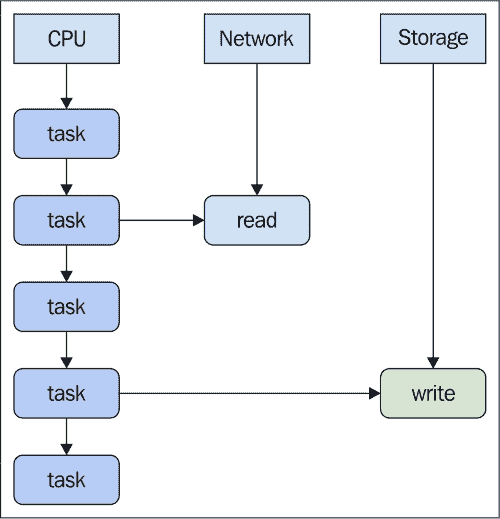
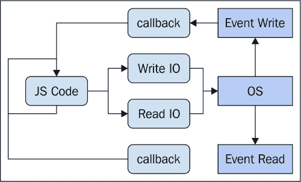
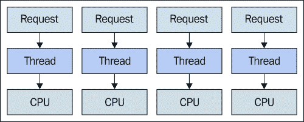
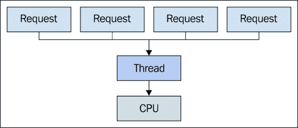
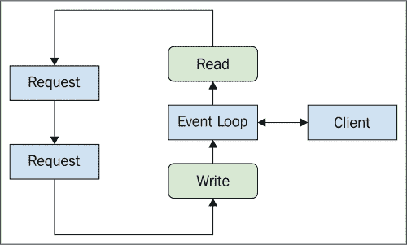
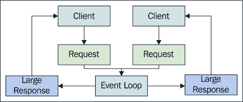
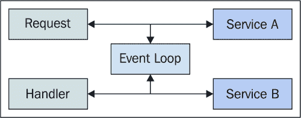
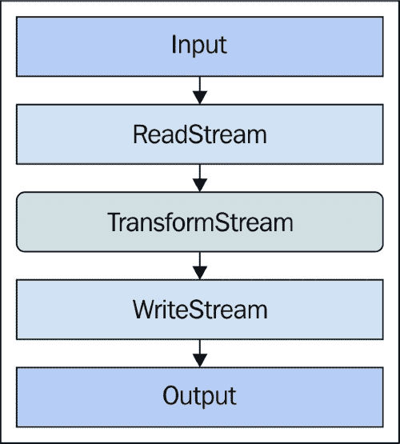

# 第八章：使用 Node.js 的事件驱动 I/O

Node.js 利用 Chrome JavaScript 引擎 V8，提供高性能的服务器环境。Node.js 的适用范围不仅限于 Web 服务器——这只是它最初被构思的问题空间。实际上，它是为了解决全球 Web 程序员面临的某些复杂的并发问题而创建的。

本章的目的是解释 Node 如何处理并发，以及我们需要如何编写 Node.js 代码以充分利用这个环境。Node 与其他 Web 服务器环境最明显的区别是它使用单个线程来处理请求，并依赖于事件驱动的 I/O 以实现高并发。然后我们将深入探讨为什么在 Web 环境中采用事件驱动的 I/O 方法是有意义的。

由于 I/O 事件循环基于网络和文件操作，我们将在本章的剩余部分探讨各种网络和文件 I/O 示例。

# 单线程 I/O

Node.js 的一个常见误解是它实际上仅限于一个 CPU，无法实现真正的并行处理。事实是 Node 经常使用多个控制线程。我们将在本章后面探讨这些概念。也许是因为 I/O 事件循环具有误导性，因为它确实是在单个线程、单个 CPU 上运行的。

本节的目标是介绍 I/O 循环的概念，为什么它对大多数 Web 应用后端来说是个好主意，以及它是如何克服多线程方法在并发中面临的挑战的。

### 注意

以下章节涵盖了更高级的 Node 并发主题，包括事件循环可能对我们造成的影响。虽然事件循环是一个新颖的想法，但它并不完美；针对任何给定的并发问题，每个解决方案都有其负面的权衡。

## I/O 操作缓慢

某个 Web 应用基础设施中最慢的部分是网络 I/O 和存储 I/O。这些操作相对较快，主要归功于过去几年物理硬件的改进，但与在 CPU 上进行的软件任务相比，I/O 就像乌龟一样慢。从性能的角度来看，Web 应用之所以具有挑战性，是因为有很多 I/O 操作发生。我们不断地从数据库中读取和写入，并将数据传输到客户端浏览器。I/O 性能是 Web 应用领域的一个主要难题。

事件驱动 I/O 的基本突破在于它实际上利用了 I/O 操作缓慢的事实。例如，假设我们有 10 个 CPU 任务排队等待，但首先我们需要将某些内容写入磁盘。如果我们必须等待写入操作完成才能开始任务，那么这些任务将比实际需要的时间长得多。在事件驱动 I/O 中，我们发出写入命令，但不会等待低级操作系统的 I/O 写入操作完成。相反，我们在 I/O 进行的同时继续执行我们的 10 个 CPU 任务。

下面是一个 CPU 任务在单个线程中运行，而 I/O 任务在后台发生的示意图：



不论给定任务需要执行哪种类型的 IO，它都不会阻止其他任务运行。这就是事件驱动 IO 架构能够在单线程中运行的原因。NodeJS 擅长这种类型的并发——并行执行大量的 IO 工作。然而，我们确实需要了解在操作系统级别发生的这些 IO 操作的状态。接下来，我们将看看 Node 是如何使用这些事件来解决特定文件描述符的状态的。

## IO 事件

我们的应用程序代码需要某种方式知道 IO 操作已完成。这就是 IO 事件发挥作用的地方。例如，如果在我们 JavaScript 代码的某个地方启动了一个异步读取操作，操作系统将处理实际的文件读取。当读取完成，内容在内存中时，操作系统触发一个 IO 事件，表示 IO 操作已完成。

所有主要操作系统都以某种形式支持这些类型的 IO 事件。NodeJS 使用低级的`C`库来管理这些事件，并且它还考虑了各种平台差异。以下是 node IO 事件循环的示意图，将各种 IO 任务发送到操作系统并监听相应的 IO 事件：



如此图表所示，任何 IO 操作都在事件循环之外处理。事件循环本身只是一个包含要运行的 JavaScript 代码任务的队列。这些通常是 IO 相关的任务。正如我们所见，IO 事件的产物是一个被推入队列的回调函数。在 Node 中，JavaScript 不会等待 IO 完成。前端类似的情况是渲染引擎不会等待在 web worker 中完成较慢的计算任务。

大部分这些操作对我们来说是透明的，发生在用于执行 IO 的 NodeJS 模块内部。我们只需要关注回调函数。如果回调函数听起来不吸引人，那么我们刚刚花费了几个章节来解决与回调地狱相关的并发问题是个好事。这些思想在 Node 中主要适用；此外，我们将在下一章中讨论一些 Node 特有的同步技术。

## 多线程挑战

多年来，如果服务 Web 请求的主要方法一直是多线程，那么关于事件驱动 IO 的争议究竟是什么？此外，将所有 JavaScript 代码运行在单个 CPU 上几乎无法充分利用我们可能运行的具有多核的系统。即使我们在虚拟化环境中运行，我们也可能拥有并行化的虚拟硬件。简短的回答是，这两种方法都没有问题，因为它们都使用不同的策略来解决类似的问题。当我们向任一方向极端发展时，我们都需要重新思考我们的方法；例如，我们开始处理更多的 IO 或更多的计算。

在 Web 环境中，常见的情况是在执行 IO 操作上花费的时间比昂贵的 CPU 燃烧活动更多。当我们的应用程序的用户与之交互时，我们通常需要在网络上进行 API 调用，然后我们需要从文件系统读取或写入。然后，我们需要通过网络进行响应。除非这些请求在其计算中进行一些重数的计算，否则大部分时间都花在 IO 操作上。

那么，是什么使得 IO 密集型应用程序不适合多线程方法呢？好吧，如果我们想要生成新的线程或者使用线程池，将会涉及到大量的内存开销。想象一下，一个处理请求的线程就像是一个拥有自己内存块的过程。如果我们有很多传入的请求，那么我们可以并行处理它们。然而，我们仍然需要进行 IO。在没有事件循环的情况下进行 IO 同步要复杂一些，因为我们必须在等待 IO 操作完成的同时保持当前正在服务的请求的线程打开。

当我们开始处理非常大的 IO 量时，这种模型很难进行扩展。但是，对于普通应用程序来说，没有必要放弃它。同样，如果我们的应用程序转变为需要大量 CPU 功率的任何请求，单线程的事件循环可能就不够了。现在我们已经基本了解了什么使得 IO 事件循环成为 IO 密集型 Web 应用程序的一个强大概念，是时候看看事件循环的其他特性了。

# 连接越多，问题越多

在本节中，我们将探讨构建运行在互联网连接世界中的应用程序所面临的挑战。在这个动荡的环境中，意外的事情可能会发生；主要是，大量的用户使用导致大量的同时用户连接。在本节中，我们将探讨在部署到面向互联网的环境时需要关注的事物类型。然后我们将探讨 C10K 问题——10,000 个用户连接到具有有限硬件资源的应用程序。我们将以更深入地查看实际在 NodeJS 事件循环中运行的的事件处理器来结束本节。

## 部署到互联网

互联网是一个部署我们应用程序的有利可图且残酷的环境。我们的用户只需要一个浏览器和一个 URL。如果我们提供人们想要的东西，并且对这种东西的需求持续增长，我们很快就会面临连接挑战。这可能是一种逐渐增加的流行度，或者是一种突然的激增。在两种情况下，我们处理这些可扩展性挑战的责任。

由于我们的应用程序面向公众，我们很可能有专注于社交的功能，这些功能在计算上有所疏漏。另一方面，这通常意味着“有大量的连接，每个都在执行自己的 I/O 密集型操作。”这似乎非常适合 IO 事件循环，就像在 NodeJS 中找到的那样。

互联网实际上是测试我们应用程序灵活性的完美环境。如果有一个想要更多而付出更少的观众群体，你就能在这里找到。假设我们的应用程序是有用且受欢迎的，我们可以亲自看到我们如何应对数万个连接。我们可能也没有庞大的基础设施作为后盾，因此我们必须对我们的硬件资源负责。

NodeJS 的并发能否高效地应对这样的环境？当然可以，但要注意；这个观众群体对失败的请求或甚至次优性能零容忍。

## C10K 问题

丹·凯格尔（Dan Kegel）首次思考 C10K 问题是在 1999 年（[`www.kegel.com/c10k.html`](http://www.kegel.com/c10k.html)）。因此，最初的构想已经接近 20 岁了；自那时以来，硬件已经取得了长足的进步。然而，将 10,000 个并发用户连接到应用程序的想法至今仍然相关。事实上，也许现代版本的问题应该是 C25K，因为对于大多数人认为负担得起的服务器硬件或虚拟硬件来说，我们可以挤出比 1999 年更多的性能。

问题范围扩大的第二个原因是互联网用户群体的增长。与 1999 年相比，连接的人和设备数量增加了一个数量级。C10K 的本质没有改变，那就是对于大量连接，不需要庞大的基础设施来支持它的高速性能。例如，这里有一个图表显示传入请求被映射到系统上的线程：



随着连接用户数量的增加，请求的数量也在增加。我们很快就需要使用这种方法扩展我们的物理基础设施，因为它本质上依赖于并行处理请求。事件驱动的 IO 循环也并行处理请求，但使用不同的策略，如下所示：



当我们的应用程序因为 CPU 数量无法处理连接数量时，这一点在这里有很大的不同。这是因为我们的 JavaScript 代码在一个线程、一个 CPU 上线性运行。然而，我们在 IO 循环中运行的 JavaScript 代码的类型起着重要作用，正如我们接下来将要看到的。

## 轻量级事件处理器

对于 NodeJS，我们的假设是，相对而言，我们不会花费太多时间执行 JavaScript 代码。换句话说，当一个请求到达 Node 应用程序时，处理该请求的 JavaScript 代码是短暂的。它确定所需的 I/O 操作，可能通过从文件系统中读取某些内容并退出，将控制权交还给 I/O 循环。

然而，并没有什么可以强制我们的 JavaScript 代码小而高效。有时，由于应用程序功能的改变或引入了将产品引向另一个方向的新功能，CPU 密集型代码是不可避免的。如果这种情况发生，我们必须采取必要的纠正设计步骤，因为一个失控的 JavaScript 处理器可能会破坏我们所有的连接。

让我们来看看 Node 事件循环、适合 JavaScript 任务类型以及可能引起问题的类型：

```js
// Eat some CPU cycles...
// Taken from http://adambom.github.io/parallel.js/
function work(n) {
    var i = 0;
    while (++i < n * n) {}
    return i;
}

// There's no handlers in the queue, so this is
// executed immediately.
process.nextTick(() => {
    console.log('first handler');
});

// The previous handler was quick to exit, so this
// handler is executed without delay.
process.nextTick(() => {
    console.log('second handler');
});

// Starts immediately because the previous handler
// exited quickly. However, this handler executes
// some CPU intensive code.
process.nextTick(() => {
    console.log('hogging the CPU...');
    work(100000);
});

// This handler isn't run immediately, because the
// handler before this one takes a while to complete.
process.nextTick(() => {
    console.log('blocked handler');
});
```

`process.nextTick()` 函数是 Node I/O 事件循环的入口点。实际上，这个函数在核心 Node 模块中被广泛使用。每个事件循环迭代都被称为一个 tick。所以，通过调用这个函数并传递一个回调，我们实际上是在说——把这个函数添加到下一个循环迭代中要调用的函数队列中。

在给定的循环迭代中，可能会有数百甚至数千个回调需要处理。这并不重要，因为这些回调中没有任何一个是等待 I/O 的。因此，单个线程足以处理 Web 请求，除非我们开始执行消耗大量 CPU 周期的任务。前一个示例中的一个处理器就做了这件事。它需要几秒钟才能返回，而在这个过程中，事件循环会卡住。在 CPU 资源密集型处理器之后添加的处理程序不会运行。当有数千个连接的客户端正在等待响应时，后果是灾难性的。

### 注意

我们将在下一章深入探讨这个问题，当我们查看创建具有各自事件循环的 Node 进程集群时。

# 事件驱动的网络 I/O

NodeJS 在处理 HTTP 请求方面表现出色。这是因为给定的请求生命周期在客户端和服务器之间传输的时间很长。在这段时间里，Node 处理其他请求。在本节中，我们将探讨 Node 的 HTTP 网络功能，以及它们如何适应 I/O 事件循环。

我们将从基本 HTTP 请求开始，探讨它们如何成为许多 Node 模块和项目的基础。然后，我们将转向向客户端发送流式响应，而不是一次性发送大量数据。最后，我们将探讨 Node 服务器如何代理请求到其他服务。

## 处理 HTTP 请求

NodeJS 中的`http`模块负责处理创建和设置 HTTP 服务器时所有琐碎的细节。毫不奇怪，这个模块被许多创建 Web 服务器的 Node 项目广泛使用。它甚至有一个辅助函数，可以为我们创建服务器，并设置用于响应传入请求的回调函数。这些回调函数接收一个`request`参数和一个`response`参数。请求包含从客户端发送的信息，我们通常从这个对象中读取。响应包含发送回客户端的信息，我们通常写入这个对象。以下是一个将这些概念放入 IO 事件循环上下文的可视化：



起初，客户端直接与事件循环通信可能看起来有些不合常理。实际上，这实际上是对真正发生的事情的一个很好的近似。`request`和`response`对象只是我们 JavaScript 代码中可访问的抽象。它们的存在是为了帮助我们读取和写入正确的套接字数据。这些抽象将正确数据传递给套接字或读取正确的套接字数据。在两种情况下，我们的代码都推迟到事件循环，在那里真正的客户端通信发生：

现在我们来看一些基本的 HTTP 服务器代码。

```js
// We need the "http" module for HTTP-related
// code.
var http = require('http');

// Creates the server instance, and sets of the
// callback function that's called on every request
// event for us.
var server = http.createServer((req, res) => {

    // The response header is always going to be plain
    // text.
    res.setHeader('Content-Type', 'text/plain');

    // If the request URL is "hello" or "world", we
    // respond with some text immediately. Otherwise,
    // if the request URL is "/", we simulate a slow
    // response by using "setTimeout()" to finish the
    // request after 5 seconds.
    if (req.url === '/hello') {
        res.end('Hello');
    } else if (req.url === '/world') {
        res.end('World');
    } else {
        setTimeout(() => {
            res.end('Hello World');
        }, 5000);
    }
});

// Starts the server.
server.listen(8081);
console.log('listening at http://localhost:8081');
```

在这个例子中，我们向浏览器发送纯文本。我们对 URL 进行快速检查，并相应地调整内容。但是默认路径中有些有趣的地方，我们使用`setTimeout()`将响应延迟 5 秒。所以如果我们访问`http://localhost/`，页面会旋转 5 秒后才显示任何内容。这里的想法是展示事件循环的异步性。当这个请求等待发生某些事情时，所有其他请求都会立即得到服务。我们可以通过在另一个标签页中加载`/hello` URL 或`/world` URL 来测试这一点。

## 流式响应

在上一个例子中，我们通过一次调用就写完了整个 HTTP 响应内容。这通常是可行的，特别是在我们的情况下，因为我们只向连接的套接字写入了一小部分字符。对于某些应用程序，对给定请求的响应可能会比这大得多。例如，如果我们实现了一个 API 调用，并且客户端请求了一个实体集合，而每个实体都有几个属性呢？

当我们从请求处理器向客户端传输大量数据时，我们可能会遇到麻烦。即使我们不是在进行 CPU 密集型计算，我们仍然会消耗 CPU，并在将大量数据写入响应时阻塞其他请求处理器。以下是这个问题的说明：



问题不一定在于响应这些大型响应，而在于当有很多这样的响应时。在本章的早期，我们讨论了建立和维护大量连接用户的问题，因为这是我们应用程序一个非常可能的情况。所以，返回相对大量数据的问题在于应用程序整体性能的下降。每个用户都会体验到非最佳性能，这绝对不是我们想要的。

我们可以使用流技术来解决这个问题。我们不必一次性写出整个响应，而是可以分块写出。当数据块被写入响应流时，事件循环可以自由处理队列中的请求。总的来说，我们可以避免任何一个请求处理程序从事件循环中占用比绝对必要更长的时间。让我们看看一个例子：

```js
// We need the "http" module.
var http = require('http');

// Creates some sample data, an array of 
// numbers.
var array = new Array(1000)
    .fill(null)
    .map((v, i) => i);

// Creates the HTTP server, and the request
// callback function.
var server = http.createServer((req, res) => {
    var size = 25,
        i = 0;

    // This function is called when we need to
    // schedule a chunk of data to be written to
    // the response.
    function schedule() {

        // Here's the actual scheduling, 
        // "process.nextTick()" let's other handlers, 
        // if any, run while we're streaming our writes
        // to the response.
        process.nextTick(() => {
            let chunk = array.slice(i, i + size);

            // If there's a chunk of data to write, 
            // write it, then schedule the next round by
            // calling "schedule()". Otherwise, we can
            // "end()" the response.
            if (chunk.length) {
                res.write(chunk.toString() + '\n');
                i += size;
                schedule();
            } else {
                res.end();
            }   
        }); 
    }   

    // Kicks off the stream writing scheduler.
    schedule();
});

// Starts the server.
server.listen(8081);
console.log('listening at http://localhost:8081');
```

这个例子通过返回纯文本中的数字列表来响应用户请求。如果我们在这个浏览器中查看这个页面，我们实际上可以看到数字是如何分块的，因为它们由换行符分隔。这只是为了说明目的；在实践中，我们可能会将响应作为一个大列表使用。重要的是，我们的请求处理程序不再贪婪，因为通过使用流方法，我们与其他请求处理程序共享事件循环。

## 代理网络请求

我们的主要 NodeJS 网络服务器不需要满足每个请求的每一个方面。相反，我们的处理程序可以联系构成我们应用程序骨干的其他系统，并请求它们的数据。这是一种微服务的形式，这也是这个讨论范围之外的话题。让我们把这些服务视为帮助我们组合更大应用程序整体的独立部分。

在 Node 请求处理程序中，我们可以创建其他 HTTP 请求，这些请求与这些外部服务进行通信。这些请求使用与创建它们的处理程序相同的事件循环。例如，当服务响应数据时，它触发一个 IO 事件，并运行相应的 JavaScript 代码。以下插图显示了这种设置是如何工作的：



让我们看看我们能否编写一个请求处理程序，它实际上是位于不同服务器上的其他服务的组合。我们首先实现一个用户服务，它允许我们检索特定用户信息。然后，我们将实现一个偏好服务，它允许我们获取特定用户设置的偏好。以下是用户服务代码：

```js
var http = require('http');

// Our sample user data.
var users = [
    { name: 'User 1' },
    { name: 'User 2' },
    { name: 'User 3' },
    { name: 'User 4' }
];

var server = http.createServer((req, res) => {

    // We'll be returning JSON data.
    res.setHeader('Content-Type', 'application/json');

    var id = /\/(\d+)/.exec(req.url),
        user;

    // If a user is found from the ID in the URL, return
    // a JSON string of it. Otherwise, respond with a 404.
    if (id && (user = users[+id[1]])) {
        res.end(JSON.stringify(user));
    } else {
        res.statusCode = 404;
        res.statusReason = http.STATUS_CODES[404];
        res.end();
    }

});

server.listen(8082);
console.log('Users service at http://localhost:8082');
```

这非常直接。我们有一些示例用户数据存储在数组中，当请求到达时，我们尝试根据 ID（数组索引）找到特定的用户对象。然后，我们以 JSON 字符串的形式响应。偏好服务使用完全相同的方法。以下是代码：

### 注意

注意，每个服务器都在不同的端口上启动。如果您通过在本书中运行代码来跟进，此示例需要在命令行上启动三个网络服务器。如果支持，例如在 OS X 上，打开三个终端标签页（或打开三个终端窗口）可能最容易。

```js
// Our sample preference data.
var preferences = [
    { spam: false },
    { spam: true },
    { spam: false },
    { spam: true }
];

var server = http.createServer((req, res) => {

    // We'll be returning JSON data.
    res.setHeader('Content-Type', 'application/json');

    var id = /\/(\d+)/.exec(req.url),
        preference;

    // If the ID in the URL finds a sample preference,
    // return the JSON string for it. Otherwise,
    // respond with a 404.
    if (id && (preference = preferences[+id[1]])) {
        res.end(JSON.stringify(preference));
    } else {
        res.statusCode = 404;
        res.statusMessage = http.STATUS_CODES[404];
        res.end();
    }
});

server.listen(8083);
console.log('Preference service: http://localhost:8083');
```

现在，我们可以编写我们的主要服务器，其中包含请求处理器，这些处理器会调用这些服务。以下是代码的示例：

```js
var http = require('http');

var server = http.createServer((req, res) => {

    // Looks for a user ID in the URL.
    var id = /\/(\d+)/.exec(req.url);

    // If there's no ID in the URL, don't
    // even try handling the request.
    if (!id) {
        res.end();
        return;
    }

    // This promise is resolved when the call to
    // the "users" service responds with data. This
    // service is another server, running on port
    // 8082.
    var user = new Promise((resolve, reject) => {
        http.get({
            hostname: 'localhost',
            port: 8082,
            path: `/${id[1]}`
        }, (res) => {
            res.on('data', (data) => {
                resolve(JSON.parse(data.toString()));
            });
        });
    });

    // This promise is resolved when the call to
    // the "preference" service responds with data. This
    // service is just another web server, running
    // on port 8082.
    var preference = new Promise((resolve, reject) => {
        http.get({
            hostname: 'localhost',
            port: 8083,
            path: `/${id[1]}`
        }, (res) => {
            res.on('data', (data) => {
                resolve(JSON.parse(data.toString()));
            });
        });
    });

    // Once both the user and the preference services have
    // responded, we have all the data we need to render 
    // the page.
    Promise.all([ user, preference ]).then((results) => {
        let user = results[0],
            preference = results[1];

        res.end(`
            <p><strong>Name:</strong> ${user.name}</p>
            <p><strong>Spam:</strong> ${preference.spam}</p>
        `);
    });
});

server.listen(8081);
console.log('Listening at http://localhost:8081');
```

现在，我们需要确保所有三个服务都在运行——用户服务、偏好服务以及用户直接交互的主服务。它们都在不同的端口上运行，因为它们都在同一台机器上作为网络服务器运行。在实践中，这些服务可以在任何地方运行——这是它们吸引力的一部分。

# 事件驱动的文件输入/输出

现在我们对 NodeJS 中的网络输入/输出有了相当好的了解，是时候将我们的注意力转向文件系统输入/输出了。在本节之后，我们将看到文件和网络套接字在事件循环中是如何被同等对待的。Node 会为我们处理这些细微的差异，这意味着我们可以编写一致的代码。

首先，我们将查看从文件中读取，然后是向文件写入。我们将通过查看从文件到文件的流式传输来结束本节，其中在之间进行数据转换。

## 从文件读取

让我们从读取整个文件内容到内存中的简单示例开始。这将帮助我们了解如何进行异步文件输入/输出：

```js
// We need the "fs" module to read files.
var fs = require('fs');
var path = require('path');

// The file path we're working with.
var filePath = path.join(__dirname, 'words');

// Starts the timer for reading our "words" file.
console.time('reading words');

// Reads the entire file into memory, then fires
// a callback with the data.
fs.readFile(filePath, (err, data) => {
    console.timeEnd('reading words');
    // → reading words: 5ms

    console.log('size',
        `${(data.length / 1024 / 1024).toFixed(2)}MB`);
    // →  size 2.38MB
});
```

在我们传递给 `fs.readFile()` 的回调函数中，我们可以访问包含文件内容的内存中的 `Buffer` 对象。当操作系统实际进行文件读取，并且缓冲区被填充结果时，IO 事件循环中的其他处理器会继续运行。这就像从网络套接字读取一样，也是为什么会有一个回调被添加到事件队列中，一旦数据被读取就会调用它。

以这种方式一次性读取文件的问题在于，这可能会在 Node 之外在操作系统级别产生影响。我们在这里用作示例的文件大小相当适中，但如果我们尝试从一个更大的文件中读取呢？如果有几个请求处理器尝试读取同一个文件呢？也许我们不应该一次性读取整个文件，而是每次只读取数据块？如果存在任何资源竞争，这将减轻竞争。让我们看看一种替代方法：

```js
// Creates a promise that's resolved once all the 
// file chunks have been read into memory.
var contents = new Promise((resolve, reject) => {

    // Opens the "filePath" for reading. The file
    // descriptor, like a file identifier, is needed
    // when we call "fs.read()" later on.
    fs.open(filePath, 'r', (err, fd) => {

        // Set up some variables needed for reading
        // a file one chunk at a time. We need to know
        // how big the file is, that does in "size". The
        // "buffer" is where the chunks go as they're
        // read. And we have the "chunk" size, and the
        // number of "bytes" read so far.
        var size = fs.fstatSync(fd).size,
            buffer = new Buffer(size),
            chunk = 1024,
            read = 0;

        // We wrap this reading iteration in a named
        // function because it's recursive.
        function schedule() {

            // The reading of a chunk always happens in
            // the next tick of the IO loop. This gives
            // other queued handlers a chance to run while 
            // we're reading this file.
            // process.nextTick(() => {

                // Makes sure the last chunk fits evenly
                // into the buffer.
                if ((read + chunk) > size) {
                    chunk = size - read;
                }

                // Reads the chunk of data into the buffer,
                // and increments the "read" counter.
                fs.read(fd, buffer, read, chunk, read);
                read += chunk;

                // Check if there's still data to read. If
                // yes, "schedule()" the next "read()". If
                // no, resolve the promise with the "buffer".
                if (read < size) {
                    schedule();
                } else {
                    resolve(buffer);
                }
            });
        }

        // Kicks off the reading and scheduling process.
        schedule();
    });
});

// When the promise is resolved, show how many words
// were read into the buffer by splitting them by
// newlines.
contents.then((buffer) => {
    console.log('words read',
        buffer.toString().split('\n').length);
    // → words read 235887
});
```

这里，我们得到完全相同的结果，只是我们将单个 `fs.readFile()` 调用分解为几个更小的 `fs.read()`。我们还在这里使用一个承诺来使回调处理更加直接。

### 注意

你可能想知道为什么我们不使用循环来遍历块并发出`fs.read()`调用。相反，我们使用`process.nextTick()`来安排读取调用。如果我们遍历块，每个`read()`调用都会按顺序添加到事件队列中。因此，我们最终会有一系列连续的`read()`调用，没有任何其他处理程序被调用。这违背了拆分`fs.readFile()`的目的。相反，`process.nextTick()`允许在`read()`调用之间运行其他处理程序。

## 写入文件

将数据写入文件的工作方式与从文件中读取非常相似。实际上，写入稍微容易一些，因为我们不需要在内存中维护任何数据；我们只需担心将内存中的数据写入磁盘即可。让我们先看看一些使用一次调用将数据块写入文件的代码。这在反向读取整个文件时是等效的：

```js
// We need the "fs" and the "path" modules for
// working with files.
var fs = require('fs');
var path = require('path');

// The two files we'll be working with.
var filePath1 = path.join(__dirname, 'output1'),
    filePath2 = path.join(__dirname, 'output2');

// The sample array we'll be writing to files.
var array = new Array(1000)
    .fill(null)
    .map((v, i) => i);

// Starts a timer for writing the entire array to
// the file in one shot.
console.time('output1');

// Performs the file write and stops the timer when
// it's complete.
fs.writeFile(filePath1, array.toString(), (err) => {
    console.timeEnd('output1');
});
```

看看，没什么难的。我们使用`fs.writeFile()`将我们数组的字符串表示写入文件。然而，这有可能在操作系统级别阻止其他事情发生；特别是如果我们一次写入大量数据。让我们尝试将写入操作分解成几个更小的调用，就像我们在之前的读取示例中所做的那样：

```js
// Creates a promise that's resolved when all chunks
// have been written to file.
var written = new Promise((resolve, reject) => {

    // Opens the file for writing, and the callback
    // starts writing chunks.
    fs.open(filePath2, 'w', (err, fd) => {
        var chunk = 50,
            i = 0;

        // The recursive scheduler places the call
        // to perform the write into the IO event loop
        // queue.
        function schedule() {
            process.nextTick(() => {

                // The chunk of data from "array" to 
                // write.
                let slice = array.slice(i, i + chunk);

                // If there's a chunk to write, write it.
                // If not, close the file and resolve the
                // promise.
                if (slice.length) {
                    fs.write(fd, slice.toString(), i);
                    i += chunk;
                    schedule();
                } else {
                    fs.close(fd);
                    resolve();
                }
            });
        }

        // Kicks of the chunk/write scheduler.
        schedule();
    });
});

// When the promise is resolved, it means the file has been
// written.
written.then(() => {
    console.log('finished writing');
});
```

这与我们在分块读取中采取的方法相同。主要区别在于我们写入一个文件，并且涉及的组件更少。此外，承诺在没有值的情况下解决，这是可以接受的，因为调用者可以将此值视为`null`，并仍然知道文件已成功写入磁盘。在下一节中，我们将查看读取和写入文件的更简洁版本。

## 流式读取和写入

到目前为止，我们已经讨论了分块读取文件以及将数据分成块并逐个写入磁盘。其优势在于，在读取或写入数据时，我们将控制权交给了其他代码，可能是其他操作系统调用。优势在于，当我们处理大量数据时，一个硬件资源永远不会被读取或写入操作所垄断。

实际上，我们正在实现流式读取和写入。在本节中，我们将查看 NodeJS 为各种组件（包括文件）实现的流式接口。我们之前编写的用于流式读取和写入的代码在某些地方有点冗长。正如我们所知，我们不想在可以避免的地方使用样板并发代码。我们尤其不想在代码库中到处散布。让我们看看一种不同的方法来流式读取和写入文件：

```js
// All the modules we need.
var fs = require('fs');
var path = require('path');
var stream = require('stream');

// Creates a simple upper-case transformation
// stream. Each chunk that's passed in is
// "pushed" to the next stream in upper-case.
var transform = new stream.Transform({
    transform: function(chunk) {
        this.push(chunk.toString().toUpperCase());
    }
});

// The file names we're using.
var inputFile = path.join(__dirname, 'words'),
    outputFile = path.join(__dirname, 'output');

// Creates an "input" stream that reads from
// "inputFile" and an "output" stream that writes
// to "outputFile".
var input = fs.createReadStream(inputFile),
    output = fs.createWriteStream(outputFile);

// Starts the IO by building the following 
// pipeline: input -> transform -> output.
input.pipe(transform);
transform.pipe(output);
```

我们基本上是将一个文件复制到另一个文件中，并在过程中对数据进行一些小的修改。幸运的是，NodeJS 的流式处理功能使得执行这种转换变得容易，无需编写大量的样板代码来读取输入然后再写入输出。几乎所有这些操作都在 Transform 类中被抽象化。以下是我们之前代码创建的管道的示例：



# 摘要

本章向您介绍了 NodeJS 中的并发。前提是 Node 应用程序将执行大量的 I/O 操作，并且相对于内存中发生的其他计算，I/O 操作较慢。Node 实现了一个 I/O 循环，这是一种机制，当给定的 I/O 资源准备好输入或输出时，它会通知我们的代码。

我们看到了这种模型的一些优缺点。另一种方法涉及在 CPU 级别依赖并行性，当存在大量慢速 I/O 操作时，这可能会带来挑战。相反，当存在大量 I/O 时，I/O 循环方法不会受到相同的影响，但当有昂贵的 CPU 任务要执行时，它会受到很大的影响。

我们在本章的剩余部分查看了一些网络和文件 I/O 示例。在下一章中，我们将继续探索 NodeJS，通过查看一些更高级的主题，其中一些可以帮助我们在应用程序计算成本增加时进行扩展。
