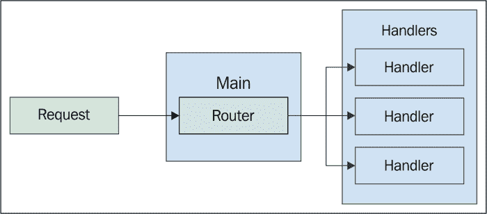
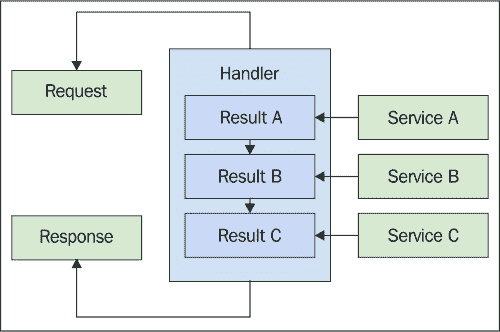
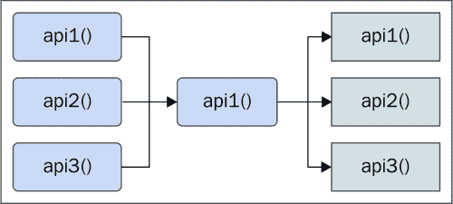
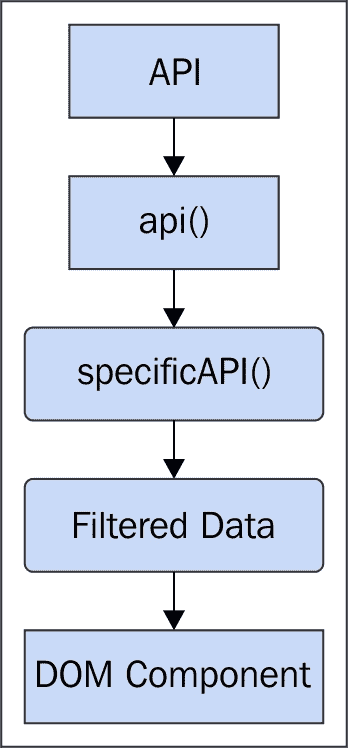

# 第十章. 构建并发应用程序

现在我们已经涵盖了 JavaScript 在并发方面提供的主要领域。我们看到了浏览器以及 JavaScript 解释器如何适应这个环境。我们研究了帮助编写并发代码的少量语言机制，并学习了如何在后端编写并发 JavaScript。在本章中，我们将通过构建一个简单的聊天应用程序来尝试将这些内容综合起来。

值得注意的是，这并不是对前面章节中涵盖的各个主题的基本重复，这没有任何实际意义。相反，我们将更多地关注在应用程序初始实施过程中必须做出的并发决策，并在适当的地方调整本书中学习到的早期想法。我们代码中使用的并发语义的设计比实际使用的机制更为重要。

我们将从实施前的简要探索开始。然后，我们将查看我们构建的应用程序更详细的需求。最后，我们将通过实际实施过程，这个过程分为前端和后端两部分。

# 入门

通过查看带有代码片段的示例来介绍一个特定主题是一个很好的途径。这正是我们在本书中处理 JavaScript 并发时所做的大部分工作。在第一章中，我们介绍了一些并发原则。我们应该并行化我们的代码以利用并发硬件。我们应该无干扰地同步并发操作。我们应该通过尽可能推迟计算和分配来节省 CPU 和内存。在整个章节中，我们看到了这些原则如何应用于 JavaScript 并发的不同领域。它们也适用于开发初期，当我们没有应用程序或试图修复应用程序时。

我们将从这个观点开始，即并发是默认模式。当并发是默认的，一切都是并发的。我们将再次探讨为什么这是一个如此重要的系统特性。然后，我们将看看这些原则是否适用于已经存在的应用程序。最后，我们将探讨我们可能构建的应用程序类型，以及它们如何影响我们对并发的处理方式。

## 并发优先

如我们所知，并发是困难的。无论我们如何粉饰它或我们的抽象多么稳固，它都与我们大脑的工作方式背道而驰。这听起来不可能，不是吗？这绝对不是事实。与任何困难问题一样，正确的做法几乎总是分而治之的变体。在 JavaScript 并发的情况下，我们希望将问题分解为不超过几个真正小、易于解决的问题。一个简单的方法是在我们真正坐下来编写任何代码之前，仔细审查潜在的并发问题。

例如，假设我们基于这样的假设：我们很可能会在代码的各个阶段频繁遇到并发问题。这意味着我们可能需要花费大量时间进行前期并发设计。像生成器和承诺这样的概念在开发的早期阶段是有意义的，并且让我们更接近最终目标。但其他想法，如函数式编程、map/reduce 和 Web Workers，可以解决更大的并发问题。这难道意味着我们想在尚未真正在我们的应用程序中遇到的问题上花费大量设计时间吗？

另一种方法是减少在前期并发设计上的时间投入。这并不是说我们可以忽视并发；那样做会违背本书的整个前提。相反，我们基于这样的假设：我们目前还没有任何并发问题，但将来很可能会有。换一种说法，我们继续编写默认并发的代码，而不投资于尚未存在的并发问题解决方案。本书中一直使用的原则，再次帮助我们首先解决重要问题。

例如，我们希望在可能的情况下并行化我们的代码，以便充分利用系统上的多个 CPU。思考这个原则迫使提出问题——我们真的关心利用八个 CPU 来处理一个一个 CPU 就能轻松处理的事情吗？只需一点努力，我们就可以以这种方式构建我们的应用程序，这样我们就不会因为对不真实的并发问题进行无谓的争论而使自己瘫痪。想想如何在开发的早期阶段促进并发。想想，这种实现如何使未来的并发问题难以处理，什么是一个更好的方法？在本章的后面部分，我们的演示应用程序将致力于以这种方式实现代码。

## 并发改造

既然在前期过多思考并发问题是不明智的，那么一旦这些问题发生，我们该如何着手解决它们呢？在某些情况下，这些问题可能是严重的问题，以至于使接口无法使用。例如，如果我们尝试处理大量数据，我们可能会通过尝试分配过多的内存来使浏览器标签崩溃，或者 UI 可能会简单地冻结。这些都是需要立即关注的问题，而且通常没有时间上的奢侈。

我们可能遇到的另一种情况是，在不太关键的情况下，并发实现可以从客观上改善用户体验，但如果我们不立即修复它，应用程序也不会失败。例如，假设我们的应用程序在初始页面加载时进行了三次 API 调用。每次调用都等待前一个调用完成。但，实际上这些调用之间没有实际的依赖关系；它们不需要从彼此那里获取响应数据。将这些调用修复为并行执行相对风险较低，并且可以提高加载时间，可能超过一秒。

这些更改如何容易或困难地重构到我们的应用程序中，最终取决于应用程序的编写方式。正如前文所述，我们不想花太多时间去思考那些不存在的并发问题。相反，我们的初始重点应该是默认促进并发。因此，当这些情况出现，我们需要实现一个解决实际问题的并发解决方案时，这并不困难。因为我们已经是在以代码编写的方式思考并发了。

我们同样可能会遇到一个没有考虑并发性的应用程序。在尝试修复需要并发解决方案的问题时，这些情况处理起来会更复杂。我们经常会发现，我们只需要对大量代码进行重构才能修复一些基本问题。当我们在时间紧迫的情况下，这会变得很困难，但一般来说，这可以是一件好事。如果一个遗留应用程序开始逐个重构以更好地促进并发，那么我们会更好。这仅仅使得下一个并发问题更容易解决，并且促进了良好的编码风格——默认并发。

## 应用程序类型

在实施初期阶段，我们需要密切关注的是我们正在构建的应用程序类型。没有通用的编写代码以促进并发的途径。这是因为每个应用程序都以自己独特的方式并发。显然，并发场景之间存在一些重叠，但一般来说，我们可以肯定我们的应用程序将需要自己的特殊处理。

例如，花大量时间和精力去设计围绕 Web Workers 的抽象是否合理？如果我们应用程序几乎不做任何 Web 请求，去考虑实现 API 响应的承诺值就没有意义。最后，如果我们没有高请求/连接率，我们真的想要在我们的 Node 组件中考虑进程间通信的设计吗？

技巧不是忽略这些低优先级的项目，因为一旦我们忽略了应用程序中并发的一些维度，下周一切都会改变，我们将完全无法准备应对这种情况。相反，我们不应该在并发环境中完全忽略这些应用程序维度，我们需要针对常见情况进行优化。最有效的方法是深入思考我们应用程序的本质。通过这样做，我们可以轻松地找到在并发方面我们代码中要解决的最佳候选问题。

# 要求

现在是时候将我们的注意力转向实际构建一个并发应用程序了。在本节中，我们将简要概述我们将要构建的聊天应用程序，从应用程序的总体目标开始。然后，我们将其他要求分解为“API”和“UI”。我们很快就会进入一些代码，请放心。

## 总体目标

首先，为什么还要另一个聊天应用程序？好吧，有两个原因；首先，它不是一个真正的应用程序，我们不是为了重新发明轮子而构建它；我们是为了在应用程序的背景下学习并发 JavaScript 而构建它。其次，聊天应用程序有很多动态部分，可以帮助你展示你在本书中学到的某些并发机制。话虽如此，这将是一个非常简单的聊天应用程序——我们在一章中只有这么多的空间。

我们将要实现的聊天概念与大多数其他熟悉的聊天应用程序相同。有聊天本身，带有主题标签，还有用户和消息。我们将实现这些，而不会做太多其他的事情。甚至 UI 本身也将是一个典型的聊天窗口的简化版本。再次强调，这是为了将代码示例保持在并发环境中的相关内容。

为了进一步简化事情，我们实际上不会将聊天持久化到磁盘；我们只是在内存中保留一切。这样，我们可以将注意力集中在应用程序中的其他并发问题上，而且很容易运行而无需设置存储或处理磁盘空间。我们还将跳过聊天的一些其他常见功能，如打字通知、表情符号等。它们与我们试图学习的内容无关。即使移除了所有这些功能，我们也会看到并发设计和实现可以变得多么复杂；更大的项目更具挑战性。

最后，而不是使用身份验证，这个聊天应用程序将更多地服务于短暂的用途场景，其中用户想要快速创建一个不需要注册的聊天。因此，聊天创建者将创建一个聊天，这将创建一个可以与参与者共享的唯一 URL。

## API

我们的聊天应用 API 将使用简单的 Node HTTP 服务器实现。它不使用任何 Web 框架，只使用几个小型库。这样做没有其他原因，只是因为应用程序足够简单，使用框架不会以任何方式增强本章的示例。在现实世界中，无论如何，请使用简化你代码的 Node Web 框架——本书的教训——包括本章——仍然适用。

响应将是我们的聊天数据的 JSON 字符串。只有对应用程序基本功能至关重要的最基本 API 端点将被实现。以下是 API 端点所需的内容：

+   创建一个新的聊天

+   加入现有聊天

+   在现有聊天中发布一条新消息

+   获取现有聊天

很简单，对吧？这看似简单。由于没有过滤功能，这需要在前端处理。这是故意的；缺少功能的 API 很常见，前端的一个并发解决方案可能是结果。当我们开始构建 UI 时，我们将再次讨论这个话题。

### 注意

为此示例应用程序实现的 NodeJS 代码还包括用于提供静态文件的处理器。这实际上更多的是一种便利措施，而不是反映生产环境中应该发生的事情。你能够轻松运行此应用程序并与之互动比复制生产环境中静态文件的服务方式更重要。

## 用户界面

我们的聊天应用的用户界面将仅由一个 HTML 文件和一些辅助的 JavaScript 代码组成。HTML 文档中包含三个页面——只是简单的`div`元素，具体如下：

+   **创建聊天**：用户提供主题和他们的名字。

+   **加入聊天**：用户提供他们的名字并被重定向到聊天。

+   **查看聊天**：用户可以查看聊天消息并发送新消息。

这些页面的作用相当直观。最复杂的页面是查看聊天，但这并不太难。它显示来自任何参与者的所有消息列表，包括我们自己，以及用户列表。我们将必须实现一个轮询机制，以保持此页面的内容与聊天数据同步。在样式方面，我们不会做太多，只是做一些非常基本的布局和字体调整。

最后，由于用户可能会频繁加入聊天，它们是短暂的、临时的。毕竟，如果我们每次创建或加入聊天时都不必总是输入我们的用户名，那就太好了。我们将添加一个功能，以保持用户名在浏览器本地存储中。

好的，是时候写一些代码了，准备好了吗？

# 构建 API

我们将从 NodeJS 后端开始实施。这是我们构建必要 API 端点的地方。我们并不一定必须首先构建后端。实际上，很多时候，UI 设计驱动 API 设计。不同的开发机构有不同的方法；我们之所以首先做后端，没有特别的原因。

我们将首先实现基本的 HTTP 服务和请求路由机制。然后，我们将探讨使用协程作为处理函数。我们将通过查看每个处理函数的实现来结束本节。

## HTTP 服务器和路由

我们不会使用比核心的 `http` 节点模块更多的东西来处理 HTTP 请求。在实际应用中，我们更有可能使用一个负责为我们处理大量模板代码的 Web 框架，那么我们可能会有一个可用的路由组件。我们的需求与这些路由器中找到的需求非常相似，所以为了简单起见，我们在这里自己实现。

我们将使用 `commander` 库来解析命令行选项，但这实际上并不那么简单。这个库很小，在我们项目的早期引入它只是为了更容易地添加新的配置选项到我们的服务器。让我们看看一个图表，展示我们的主程序如何适应环境：



我们主模块的职责是启动 HTTP 服务器并设置一个处理路由的处理函数。路由本身是正则表达式到处理函数的静态映射。正如我们所见，处理函数存储在单独的模块中。那么现在让我们看看我们的主程序：

```js
// The core Node modules we'll need.
var http = require('http');

// Commander is an "npm" package, and is very helpful
// with parsing command line arguments.
var commander = require('commander');

// Our request handler functions that respond to
// requests.
var handlers = require('./handlers');

// The routes array contains route-handler parings. That 
// is, when a given route RegExp matches against the 
// request URL, the associated handler function is 
// called.
var routes = [
    [ /^\/api\/chat\/(.+)\/message/i, 
        handlers.sendMessage ],
    [ /^\/api\/chat\/(.+)\/join$/i, handlers.joinChat ],
    [ /^\/api\/chat\/(.+)$/i, handlers.loadChat ],
    [ /^\/api\/chat$/i, handlers.createChat ],
    [ /^\/(.+)\.js$/i, handlers.staticFile ],
    [ /^\/(.*)$/i, handlers.index ]
];

// Adds command line options using the "commander" library,
// and parses them. We're only interested in the "host" and
// the "port" values right now. Both options have default
// values.
commander
    .option('-p, --port <port>', 
        'The port to listen on', 8081)
    .option('-H --host <host>', 
        'The host to serve from', 'localhost')
    .parse(process.argv);

// Creates an HTTP server. This handler will iterate over
// our "routes" array, and test for a match. If found, the
// handler is called with the request, the response, and
// the regular expression result.
http.createServer((req, res) => {
    for (let route of routes) {
        let result = route[0].exec(req.url);

        if (result) {
            route1;
            break;
        }
    }
}).listen(commander.port, commander.host);

console.log(`listening
at http://${commander.host}:${commander.port}`);
```

这就是我们的处理路由机制的范围。我们所有的路由都定义在 `routes` 变量中，随着我们的应用程序随时间变化，这里的路由变化也会发生。我们还可以看到，使用 `commander` 从命令行获取选项相当简单。在这里添加新选项也很容易。

我们给 HTTP 服务器提供的请求处理函数可能永远不会需要改变，因为它实际上并不满足任何请求。它所做的只是遍历路由，直到路由正则表达式与请求 URL 匹配。当这种情况发生时，请求被传递给处理函数。所以，让我们把注意力转向实际的处理函数实现。

## 协程作为处理函数

正如我们在本书的前几章中看到的，在我们的前端 JavaScript 代码中引入回调地狱并不需要太多。这正是承诺派上用场的地方，因为它们允许我们封装讨厌的同步语义。结果是，在我们的组件中，我们尝试实现产品功能时，代码既干净又易于阅读。我们是否在 Node HTTP 请求处理函数中也遇到了同样的问题？

在更简单的处理程序中，不，我们不会面临这个挑战。我们只需要查看请求，弄清楚如何处理它，然后执行它，并在发送响应之前更新响应。在更复杂的场景中，在我们能够响应之前，我们必须在请求处理程序中进行各种异步活动。换句话说，如果我们不小心，回调地狱是不可避免的。例如，我们的处理程序可能需要从其他网络服务获取一些数据，它可能执行数据库查询，或者它可能写入磁盘。在这些所有情况下，我们需要在异步操作完成时执行回调；否则，我们永远不会完成我们的响应。

在第九章，“高级 NodeJS 并发”中，我们探讨了使用`Co`库在 Node 中实现协程。如果我们能在我们的请求处理程序函数中做类似的事情会怎么样？也就是说，让它们成为协程而不是普通的可调用函数。最终目标将是产生以下类似的东西：



在这里，我们可以看到我们从这些服务中获得的价值在我们的代码中表现为简单的变量。它们不必是服务；然而，它们可以是任何异步操作。例如，我们的聊天应用程序需要解析从 UI 发布的表单数据。它将使用`formidable`库来完成这项工作，这是一个异步操作。解析后的表单字段被传递给回调函数。让我们将这个操作包裹在一个承诺中，看看它是什么样子：

```js
// This function returns a promise, which is resolved
// with parsed form data as an object.
function formFields(req) {
    return new Promise((resolve, reject) => {

        // Use the "IncomingForm" class from the
        // "formidable" lib to parse the data. This
        // "parse()" method is async, so we resolve or
        // reject the promise in the callback.
        new formidable.IncomingForm()
            .parse(req, (err, fields) => {
                if (err) {
                    reject(err);
                } else {
                    resolve(fields);
                }
            });
    });
}
```

当我们想要表单字段时，我们有一个承诺要与之合作，这是好的。但现在，我们需要在协程的上下文中使用该函数。让我们逐一查看我们的请求处理程序，看看如何使用`formFields()`函数将承诺值作为同步值处理。

## 创建聊天处理程序

创建聊天处理程序负责创建一个新的聊天。它期望一个主题和一个用户。它将使用`formFields()`函数来解析发送到这个处理程序的表单数据。在它将新的聊天存储在全局`chat`对象中（记住，这个应用程序将所有内容存储在内存中）之后，处理程序以 JSON 字符串的形式响应聊天数据。让我们看看处理程序代码：

```js
// The "create chat" API. This endpoint
// creates a new chat object and stores it in memory.
exports.createChat = co.wrap(function* (req, res) {
    if (!ensureMethod(req, res, 'POST')) {
        return;
    }

    // Yield the promise returned by "formFields()".
    // This pauses the execution of this handler because
    // it's a co-routine, created using "co.wrap()".
    var fields = yield formFields(req);

    // The ID for the new chat.
    var chatId = id();

    // The timestamp used for both the chat, and the
    // added user.
    var timestamp = new Date().getTime();

    // Creates the new chat object and stores it. The
    // "users" array is populated with the user that
    // created the chat. The "messages" array is empty
    // by default.
    var chat = chats[chatId] = {
        timestamp: timestamp,
        topic: fields.topic,
        users: [{
            timestamp: timestamp,
            name: fields.user
        }],
        messages: []
    };

    // The response is the JSON encoded version of the
    // chat object. The chat ID is added to the response
    // since it's stored as a key, not a chat property.
    res.setHeader('Content-Type', 'application/json');
    res.end(JSON.stringify(Object.assign({
        id: chatId
    }, chat)));
});
```

我们可以看到`createChat()`函数从这个模块导出，因为它被我们的路由器在主应用程序模块中使用。我们还可以看到处理程序函数是一个生成器，并且它被`co.wrap()`包裹。这是因为我们希望它成为一个协程而不是一个普通函数。对`formFields()`的调用说明了我们在上一节中讨论的思想。注意，我们生成了承诺，并返回了解决后的值。函数在发生时阻塞，这非常重要，因为这正是我们能够保持我们的代码干净且没有过多的回调的原因。

### 注意

我们的手册程序使用了一些实用函数。出于页面空间的考虑，这里没有涵盖这些函数。然而，它们包含在这本书的代码中，并在注释中进行了说明。

## 加入聊天处理程序

加入聊天处理程序是用户能够加入其他用户创建的聊天的方式。用户首先需要与他们共享的聊天 URL。然后，他们可以提供他们的名字，并将消息发送到这个端点，该端点的聊天 ID 作为 URL 的一部分编码。这个处理程序的工作是将新的用户推送到聊天的用户数组中。现在让我们看看处理程序代码：

```js
// This endpoint allows a user to join an existing
// chat that's been shared with them (a URL).
exports.joinChat = co.wrap(function* (req, res, id) {
    if (!ensureMethod(req, res, 'POST')) {
        return;
    }

    // Load the chat from the memory - the "chats"
    // object.
    var chat = chats[id[1]];

    if (!ensureFound(req, res, chat)) {
        return;
    }

    // Yield to get the parsed form fields. This
    // function is a co-routine created using "co.wrap()".
    var fields = yield formFields(req);

    chat.timestamp = new Date().getTime();

    // Adds the new user to the chat.
    chat.users.push({
        timestamp: chat.timestamp,
        name: fields.user
    });

    // Responds with the JSON encoded chat string. We
    // need to add the ID separately as it's not a
    // chat property.
    res.setHeader('Content-Type', 'application/json');
    res.end(JSON.stringify(Object.assign({
        id: id[1],
    }, chat)));
});
```

我们可能注意到这个处理程序和创建聊天处理程序之间有很多相似之处。我们检查正确的 HTTP 方法，返回 JSON 响应，并将处理程序函数包装为协程，这样我们就可以以完全避免回调函数的方式解析表单。主要区别在于我们更新现有的聊天，而不是创建一个新的。

### 注意

将新的`user`对象推送到`users`数组的代码会被认为是存储聊天。在实际应用中，这意味着以某种方式将数据写入磁盘——很可能是调用数据库库。这意味着需要发起异步请求。幸运的是，我们可以遵循与我们的表单解析相同的技巧——让它返回一个承诺，并利用已经存在的协程。

## 加载聊天处理程序

加载聊天处理程序的工作正好符合其名称——使用在 URL 中找到的 ID 加载指定的聊天，并以该聊天的 JSON 字符串响应。以下是执行此操作的代码：

```js
// This endpoint loads a chat. This function
// isn't wrapped as a co-routine because there's
// no asynchronous actions to wait for.
exports.loadChat = function(req, res, id) {

    // Lookup the chat, using the "id" from the URL
    // as the key.
    var chat = chats[id[1]];

    if (!ensureFound(req, res, chat)) {
        return;
    }

    // Respond with the JSON encoded string version
    // of the chat.
    res.setHeader('Content-Type', 'application/json');
    res.end(JSON.stringify(chat));
};
```

这个函数没有`co.wrap()`调用，也没有生成器。这是因为不需要。并不是说这个函数作为生成器被包装为协程是有害的，只是浪费。

### 注意

这实际上是我们，即开发者，有意识地决定避免在不合理的地方使用并发的一个例子。将来这个处理程序可能会有所改变，如果确实如此，我们就会有工作要做。然而，权衡的结果是我们现在有更少的代码，运行速度更快。这对阅读它的人来说是有益的，因为它看起来不像一个异步函数，而且它也不应该被当作这样的函数来对待。

## 发送消息处理程序。

我们需要实现的最后一个主要 API 端点是发送消息。这是任何给定聊天中的用户能够发布一条消息，其他所有聊天参与者都可以消费的方式。这与加入聊天处理程序类似，除了我们将新的消息对象推送到消息数组。让我们看看处理程序代码；现在这个模式应该开始变得熟悉了：

```js
// This handler posts a new message to a given chat. It's
// also a co-routine function since it needs to wait for
// asynchronous actions to complete.
exports.sendMessage = co.wrap(function* (req, res, id) {
    if (!ensureMethod(req, res, 'POST')) {
        return;
    }

    // Load the chat and ensures that it's found.
    var chat = chats[id[1]];

    if (!ensureFound(req, res, chat)) {
        return;
    }

    // Get's the parsed form fields by yielding the
    // promise returned from "formFields()".
    var fields = yield formFields(req);

    chat.timestamp = new Date().getTime();

    // Pushes the new message object to the "messages" 
    // property.
    chat.messages.push({
        timestamp: chat.timestamp,
        user: fields.user,
        message: fields.message
    });

    res.setHeader('Content-Type', 'application/json');
    res.end(JSON.stringify(chat));
});
```

当加入聊天时，同样的想法适用。在真实应用中，修改聊天对象可能是一个异步操作，而现在，我们的协程处理程序模式已经为我们准备好了，以便在适当的时候进行这个更改。这就是这些协程处理程序的关键，使得向处理程序添加新的异步操作变得容易，而不是非常困难。

## 静态处理程序

构成我们聊天应用最后一批处理程序的最后一组是静态内容处理程序。它们的工作是从文件系统向浏览器提供静态文件，例如`index.html`文档和我们的 JavaScript 源文件。通常，这是在 node 应用之外处理的，但我们将包括它们，因为在某些时候，直接使用现成的电池包会更简单：

```js
// Helper function used to serve static files.
function serveFile(req, res, file) {

    // Creates a stream to read the file.
    var stream = fs.createReadStream(file);

    // End the response when there's no more input.
    stream.on('end', () => {
        res.end();
    });

    // Pipe the input file to the HTTP response,
    // which is a writable stream.
    stream.pipe(res);
}

// Serves the requested path as a static file.
exports.staticFile = function(req, res) {
    serveFile(req, res,
        path.join(__dirname, req.url));
};

// By default, we want to serve the "index.html" file.
exports.index = function index(req, res) {
    res.setHeader('ContentType', 'text/html');

    serveFile(req, res,
        path.join(__dirname, 'index.html'));
};
```

# 构建用户界面

我们现在有一个 API 要针对；是时候开始构建我们聊天应用的用户界面了。我们将从思考如何与刚刚构建的 API 通信开始，然后实现这一部分。接下来，我们将构建实际需要的 HTML 来渲染这个应用使用的三个页面。从这里，我们将转向前端可能最具挑战性的部分——构建 DOM 事件处理程序和操作器。最后，我们将看看是否可以通过添加一个 Web Worker 来提高应用响应性。

## 与 API 通信

我们 UI 中的 API 通信路径本质上是并发的——它们通过网络连接发送和接收数据。因此，为了我们应用架构的最佳利益，我们最好花时间将同步机制从整个系统中尽可能隐藏起来。为了与我们的 API 通信，我们将使用`XMLHttpRequest`类的实例。然而，正如我们在本书的前几章中看到的，这个类可能会引导我们走向回调地狱。

我们知道，解决方案是使用一个承诺来支持对所有 API 数据的统一接口。这并不意味着我们需要反复抽象`XMLHttpRequest`类。我们创建了一个简单的实用函数，它为我们处理并发封装，然后我们创建了几个针对相应 API 端点的特定小函数。下面是一个说明这个想法的图示：



与异步 API 端点通信的这种方法具有良好的可扩展性，因为添加新功能只需要添加一个小函数。所有的同步语义都被封装在一个`api()`函数中。现在让我们看看代码：

```js
// A generic function used to send HTTP requests to the
// API. The "method" is the HTTP method, the "path" is
// the request path, and the "data" is the optional
// request payload.
function api(method, path, data) {

    // Returns a promise to the called, resolved with
    // the API response, or failure.
    return new Promise((resolve, reject) => {
        var request = new XMLHttpRequest();

        // Resolves the promise using the parsed JSON
        // object - usually a chat.
        request.addEventListener('load', (e) => {
            resolve(JSON.parse(e.target.responseText));
        });

        // Rejects the promise when there's a problem with
        // the API.
        request.addEventListener('error', (e) => {
            reject(e.target.statusText || 'unknown error');
        });

        request.addEventListener('abort', resolve);

        request.open(method, path);

        // If there's no "data", we can simply "send()"
        // the request. Otherwise, we have to create a
        // new "FormData" instance to properly encode
        // the form data for the request.
        if (Object.is(data, undefined)) {
            request.send();
        } else {
            var form = new FormData();

            Object.keys(data).forEach((key) => {
                form.append(key, data[key]);
            });

            request.send(form);
        }
    });
}
```

这个函数非常容易使用，支持我们所有的 API 使用场景。我们很快将要实现的较小的 API 函数可以简单地返回这个`api()`函数返回的承诺。没有必要比这更复杂。

然而，这里还有另一件事我们需要考虑。如果我们回顾这个应用的要求，API 没有任何过滤功能。这对 UI 来说是个问题，因为我们不会重新渲染整个聊天对象。消息可以频繁发布，如果我们重新渲染大量消息，屏幕在渲染 DOM 元素时可能会出现闪烁。因此，我们显然需要在浏览器中过滤聊天消息和用户；但这件事应该在何处发生？

让我们在并发的背景下思考这个问题。假设我们决定在一个直接操作 DOM 的组件中执行过滤。这在某种程度上是好的，因为它意味着我们可以有多个独立组件使用相同的数据，但以不同的方式过滤。当数据转换与 DOM 非常接近时，调整并发的任何类型都很难。例如，我们的应用程序不需要灵活性。只有一个组件渲染过滤后的数据。但是，它可能从并发中受益。以下图表说明了另一种方法，其中我们实现的 API 功能执行过滤：



采用这种方法，API 函数与 DOM 的隔离程度足够高。如果我们愿意，我们可以在稍后引入并发。现在，让我们看看一些具体的 API 函数，以及我们可以根据需要附加到给定 API 调用的过滤机制：

```js
// Filters the "chat" object to include only new users
// and new messages. That is, data with a newer
// "timestamp" than when we last checked.
function filterChat(chat) {
    Object.assign(chat, {

        // Assigns the filtered arrays to the
        // corresponding "chat" properties.
        users: chat.users.filter(
            user => user.timestamp > timestamp
        ),
        messages: chat.messages.filter(
            message => message.timestamp > timestamp
        )
    });

    // Reset the "timestamp" so we can look for newer
    // data next time around. We return the modified
    // chat instance.
    timestamp = chat.timestamp;
    return chat;
}

// Creates a chat using the given "topic" and "user".
// The returned promise is resolved with the created
// chat data.
function createChat(topic, user) {
    return api('post', 'api/chat', {
        topic: topic,
        user: user
    });
}

// Joins the given "user" to the given chat "id".
// The returned promise is resolved with the
// joined chat data.
function joinChat(id, user) {
    return api('post', `api/chat/${id}/join`, {
        user: user
    }).then(filterChat);
}

// Loads the given chat "id". The returned promise
// is resolved with filtered chat data.
function loadChat(id) {
    return api('get', `api/chat/${id}`)
        .then(filterChat);
};

// Posts a "message" from the given "user" to the given
// chat "id". The returned promise is resolved with
// filtered chat data.
function sendMessage(id, user, message) {
    return api('post', `api/chat/${id}/message`, {
        user: user,
        message: message
    }).then(filterChat);
}
```

`filterChat()` 函数足够简单。它只是修改给定的 `chat` 对象，只包含新用户和消息。新消息是指那些时间戳大于这里使用的 `timestamp` 变量的消息。过滤完成后，`timestamp` 会根据聊天的 `timestamp` 属性更新。如果没有变化，这个值可能保持不变，但如果有所变化，这个值会更新，以确保不会返回重复的值。

我们可以看到，在我们的特定 API 函数中，`filterChat()` 函数被传递给承诺作为解析器。因此，我们在这里仍然保持了一定的灵活性。例如，如果不同的组件需要以不同的方式过滤聊天，我们可以引入一个新的函数，使用相同的方法，并添加一个不同的承诺解析器函数，以相应地进行过滤。

## 实现 HTML

我们的 UI 需要一些 HTML 才能渲染。聊天应用程序足够简单，只需要一个 HTML 页面。我们可以将 DOM 结构组织成三个`div`元素，每个元素代表我们的页面。每个页面的元素本身很简单，因为在这个开发阶段没有多少动态部分。我们的首要任务是功能性——构建功能正常的功能。同时，我们应该考虑并发设计。这些项目肯定比考虑，比如说，小部件和虚拟 DOM 渲染库更相关。这些是重要的考虑因素，但它们也比处理有缺陷的并发设计更容易解决。

让我们看看与我们的 UI 一起使用的 HTML 源。为这些元素定义了一些 CSS 样式。然而，它们是微不足道的，这里没有涵盖。例如，隐藏类用于切换给定页面的可见性。默认情况下，一切都被隐藏。处理这些元素的显示是我们的事件处理器的责任——我们将在下一部分介绍这些：

```js
<div id="create" class="hide">
    <h1>Create Chat</h1>
    <p>
        <label for="topic">Topic:</label>
        <input name="topic" id="topic" autofocus/>
    </p>
    <p>
        <label for="create-user">Your Name:</label>
        <input name="create-user" id="create-user"/>
    </p>
    <button>Create</button>
</div>
<div id="join" class="hide">
    <h1>Join Chat</h1>
    <p>
        <label for="join-user">Your Name:</label>
        <input name="join-user" id="join-user" autofocus/>
    </p>
    <button>Join</button>
</div>
<div id="view" class="hide">
    <h1></h1>
    <div>
        <div>
            <ul id="messages"></ul>
            <input placeholder="message" autofocus/>
        </div>
        <ul id="users"></ul>
    </div>
</div>
```

## DOM 事件和操作

我们现在已经建立了一些 API 通信机制和 DOM 元素。让我们将注意力转向我们应用程序的事件处理器，以及它们如何与 DOM 交互。我们需要解决的最复杂的 DOM 操作活动是绘制聊天。也就是说，显示参与聊天的消息和用户。让我们从这里开始。我们将实现一个`drawChat()`函数，因为它可能将在多个地方使用：

```js
// Updates the given "chat" in the DOM.
function drawChat(chat) {

    // Our main DOM components. "$users" is the
    // list of users in the chat. "$messages" is the
    // list of messages in the chat. "$view" is the
    // container element for both lists.
    var $users = document.getElementById('users'),
    $messages = document.getElementById('messages'),
    $view = document.getElementById('view');

    // Update the document title to reflect the chat
    // "topic", display the chat container by removing
    // the "hide" class, and update the title of the
    // chat in bold heading.
    document.querySelector('title')
        .textContent = chat.topic;
    $view.classList.remove('hide');
    $view.querySelector('h1')
        .textContent = chat.topic;

    // Iterates over the messages, making no assumptions
    // about filtering or anything like that.
    for (var message of chat.messages) {

        // Constructs the DOM elements we'll need for
        // the user portion of the message.
        var $user = document.createElement('li'),
            $strong = document.createElement('strong'),
            $em = document.createElement('em');

        // Assemble the DOM structure...
        $user.appendChild($strong);
        $user.appendChild($em);
        $user.classList.add('user');

        // Add content - the user name, and time the message
        // was posted.
        $strong.textContent = message.user + ' ';
        $em.textContent = new Date(message.timestamp)
            .toLocaleString();

        // The message itself...
        var $message = document.createElement('li');
        $message.textContent = message.message;

        // Attach the user portion and the message portion,
        // to the DOM.
        $messages.appendChild($user);
        $messages.appendChild($message);
    }

    // Iterates over the users in the chat, making no
    // assumptions about the data, only displaying it.
    for (var user of chat.users) {
        var $user = document.createElement('li');
        $user.textContent = user.name;

        $users.appendChild($user);
    }

    // Make sure that the user can see the newly-rendered
    // content.
    $messages.scrollTop = $messages.scrollHeight;

    // Return the chat so that this function can be used
    // as a resolver in a promise resolution chain.
    return chat;
}
```

关于`drawChat()`函数有两个重要的事项需要注意。首先，这里没有进行聊天过滤。它假设任何消息和用户都是新的，并且简单地将其追加到 DOM 中。其次，我们在渲染 DOM 之后实际上返回了聊天对象。一开始这可能看起来是不必要的，但我们实际上打算将这个函数用作承诺解析器。这意味着如果我们想在`then()`链中添加更多的解析器，我们必须通过返回它来传递数据。

让我们看看加载事件来强调前面的观点。在聊天渲染后，我们需要做一些额外的工作。为此，我们可以简单地通过另一个`then()`调用链来链下下一个函数：

```js
// When the page loads...
window.addEventListener('load', (e) => {

    // The "chatId" comes from the page URL. The "user"
    // might already exist in localStorage.
    var chatId = location.pathname.slice(1),
        user = localStorage.getItem('user'),
        $create = document.getElementById('create'),
        $join = document.getElementById('join');

    // If there's no chat ID in the URL, then we display
    // the create chat screen, populating the user
    // input if it was found in localStorage.
    if (!chatId) {
        $create.classList.remove('hide');

        if (user) {
            document.getElementById('create-user')
               .value = user;
        }

        return;
    }

    // If there's no user name found in localStorage,
    // we display the join screen which allows them
    // to enter their name before joining the chat.
    if (!user) {
        $join.classList.remove('hide');
        return;
    }

    // We load the chat, draw it using drawChat(), and
    // start the chat polling process.
    api.postMessage({
        action: 'loadChat',
        chatId: chatId
    }).then(drawChat).then((chat) => {

        // If the user isn't part of the chat already,
        // we join it. This happens when the user name
        // is cached in localStorage. If the user creates
        // a chat, then loads it, they'll already belong
        // to the chat.
        if (chat.users.map(u => u.name).indexOf(user) < 0) {
            api.postMessage({
                action: 'joinChat',
                chatId: chatId,
                user: user
            }).then(drawChat).then(() => {
                poll(chatId);
            });
        } else {
            poll(chatId);
         }
    });
});
```

当页面首次加载时，此处理器会被调用，首先需要根据当前 URL 检查是否有聊天要加载。如果有，我们就通过使用`drawChat()`作为解析器来调用 API 加载聊天。但是，我们还需要执行一些额外的功能，并且这些功能被添加到链中的下一个`then()`解析器中。它的任务是确保用户实际上是聊天的一部分，为此，它需要我们从 API 加载的聊天，这是通过`drawChat()`传递的。在必要时，我们进行进一步的 API 调用以将用户添加到聊天中后，我们开始轮询机制。这就是我们如何保持 UI 与新的消息和加入聊天的用户保持同步的方式：

```js
// Starts polling the API for the given chat "id".
function poll(chatId) {
    setInterval(() => {
        api.postMessage({
            action: 'loadChat',
            chatId: chatId
        }).then(drawChat);
    }, 3000);
}
```

你可能已经注意到，我们使用了一种奇怪的调用方式，几乎就像一个 Web Worker——`api.postMessage()`。这是因为它是一个 Web Worker，这就是我们接下来要讨论的内容。

### 注意

为了节省空间，我们省略了与创建聊天、加入聊天和发送消息相关的其他三个 DOM 事件处理器。与刚刚介绍过的加载处理器相比，它们在并发方面没有不同。

## 添加 API 工作线程

在早期实现 API 通信函数时，我们决定从并发角度来看，将过滤组件与 API 而不是 DOM 耦合更有意义。现在是时候从这个决定中受益，并将我们的 API 代码封装在 Web Worker 中。我们想要这样做的主要原因是`filterChat()`函数有可能锁定响应性。换句话说，对于较大的聊天，这需要更长的时间来完成，文本输入将停止响应用户输入。例如，在我们尝试渲染更新后的消息列表时，没有理由阻止用户发送消息。

首先，我们需要扩展工作线程 API，使`postMessage()`返回一个承诺。这与我们在第七章中做的相同，即*抽象并发*。看看下面的代码：

```js
// This will generate unique IDs. We need them to
// map tasks executed by web workers to the larger
// operation that created them.
function* genID() {
    var id = 0;

    while (true) {
        yield id++;
    }
}

// Creates the global "id" generator.
var id = genID();

// This object holds the resolver functions from promises,
// as results come back from workers, we look them up here,
// based on ID.
var resolvers = {};

var rejectors = {};

// Keep the original implementation of "postMessage()"
// so we can call it later on, in our custom "postMessage()"
// implementation.
var postMessage = Worker.prototype.postMessage;

// Replace "postMessage()" with our custom implementation.
Worker.prototype.postMessage = function(data) {
    return new Promise((resolve, reject) => {

        // The ID that's used to tie together a web worker
        // response, and a resolver function.
        var msgId = id.next().value;

        // Stores the resolver so in can be used later, in
        // the web worker message callback.
        resolvers[msgId] = resolve;

        rejectors[msgId] = reject;

        // Run the original "Worker.postMessage()"
        // implementation, which takes care of 
        // actually posting the message to the 
        // worker thread.
        postMessage.call(this, Object.assign({
            msgId: msgId,
        }, data));
    });
};

// Starts our worker...
var api = new Worker('ui-api.js');

// Resolves the promise that was returned by
// "postMessage()" when the worker responds.
api.addEventListener('message', (e) => {

    // If the data is in an error state, then
    // we want the rejector function, and we call
    // that with the error. Otherwise, call the
    // regular resolver function with the data returned
    // from the worker.
    var source = e.data.error ? rejectors : resolvers,
        callback = source[e.data.msgId],
        data = e.data.error ? e.data.error : e.data;

    callback(data);

    // Don't need'em, delete'em.
    delete resolvers[e.data.msgId];
    delete rejectors[e.data.msgId];
});
```

在第七章中，我们没有涵盖使用拒绝承诺的这种技术的一个细节。例如，如果 API 调用由于某种原因失败，我们必须确保主线程中等待工作线程的承诺被拒绝；否则，会出现奇怪的错误。

现在，我们需要在我们的`ui-api.js`模块中添加一个附加项，其中定义了所有 API 函数，以适应它在 Web Worker 中运行的事实。我们只需要添加以下事件处理器：

```js
// Listens for messages coming from the main thread.
addEventListener('message', (e) => {

    // The generic promise resolver function. It's
    // job is to post data back to the main thread
    // using "postMessage()". It also returns the
    // data so that it may be used further down in
    // the promise resolution chain.
    function resolve(data) {
        postMessage(Object.assign({
            msgId: e.data.msgId
        }, data));

        return data;
    }

    // The generic rejector function posts data back
    // to the main thread. The difference here is that
    // it marks the data as an error. This allows the
    // promise on the other end to be rejected.
    function reject(error) {
        postMessage({
            msgId: e.data.msgId,
            error: error.toString()
        });

        return error;
    }

    // This switch decides which function to call based
    // on the "action" message property. The "resolve()"
    // function is passed as the resolver to each returned 
    // promise.
    switch (e.data.action) {
        case 'createChat':
            createChat(e.data.topic, e.data.user)
                .then(resolve, reject);
            break;
        case 'joinChat':
            joinChat(e.data.chatId, e.data.user)
                .then(resolve, reject);
            break;
        case 'loadChat':
            loadChat(e.data.chatId)
                .then(resolve, reject)
            break;
        case 'sendMessage':
            sendMessage(
                e.data.chatId,
                e.data.user,
                e.data.message
            ).then(resolve, reject);
            break;
    }
});
```

这个`message`事件处理器是我们与主线程通信的方式。`action`属性是我们确定要调用哪个 API 端点的方法。因此，现在，每当我们在聊天消息上执行任何昂贵的过滤操作时，它都在一个单独的线程中。

引入这个工作线程的另一个后果是，它将 API 功能封装成一个统一的整体。现在，可以将 API 网络工作线程组件视为整个 UI 中更小的一个应用程序。

# 增加和改进

这就是我们将在我们的聊天应用程序开发上进行的全部覆盖。我们没有逐行分析代码，但这就是为什么代码作为本书的配套资料提供，以便可以查看其全部内容。前几节的内容是通过编写并发 JavaScript 代码的视角来进行的。我们没有利用这一章之前的所有例子，这会违背并发解决导致用户体验不佳的问题的整个目的。

聊天应用示例的重点是促进并发。这意味着在需要实现并发代码时才实现并发代码，而不是为了实现并发代码而实现并发代码。后者不会使我们的应用比现在更好，也不会使我们处于更好的位置来解决以后出现的并发问题。

我们将本章结束于一些可能值得考虑的聊天应用领域。鼓励读者，也就是你，与聊天应用代码一起工作，看看以下哪些点适用。你将如何支持它们？我们需要改变我们的设计吗？重点是，在我们的 JavaScript 应用中的并发设计不是一次性的，而是一个不断发展的设计任务，它随着我们的应用而变化。

## 集群 API

在第九章《高级 NodeJS 并发》中，你被介绍了 NodeJS 中的 cluster 模块。这个模块可以透明地扩展我们 HTTP 服务器的请求处理能力。该模块通过将 node 进程分叉成几个子进程来实现。由于它们各自是独立的进程，它们各自有自己的事件循环。此外，不需要额外的通信同步代码。

在我们的`app.js`模块中添加这些集群功能并不需要我们付出太多努力。但问题是——我们何时决定集群是有价值的？我们是等到实际出现性能问题，还是自动将其打开？这些事情很难提前知道。现实是，这取决于我们的请求处理程序有多大的 CPU 密集度。这些变化通常是由于软件中添加了新功能而引起的。

我们的聊天应用是否需要集群？也许，将来某天会需要。但处理程序实际上并没有进行任何工作。这可能会改变。也许我们可以继续实现集群功能，同时添加一个选项，让我们可以选择关闭它。

## 清理聊天记录

我们的聊天应用没有持久存储；它将所有聊天数据保存在内存中。这对于我们的特定用例来说是可以的，因为它是为那些想要启动临时聊天以便与他人分享链接而不必经历注册过程的用户而设计的。问题在于，在聊天不再被使用很长时间后，其数据仍然占用内存。最终，这将对我们的 Node 进程造成致命打击。

如果我们决定实现一个清理服务，其任务是在给定时间内定期遍历聊天数据和未修改的聊天记录，那么这些聊天记录将被删除？这将只保留内存中的活跃聊天。

## 异步入口点

我们早期就决定在大多数请求处理器中使用协程。这些处理器使用的唯一异步操作是表单解析行为。然而，任何给定处理器中只保留这一唯一异步操作的可能性很小。特别是随着我们应用的增长，我们将开始依赖更多的核心 NodeJS 功能，这意味着我们将想要将更多异步回调风格的代码包装在承诺中。我们可能也会开始依赖外部服务，无论是我们自己的还是第三方软件。

我们能否将我们的异步架构再向前迈进一步，并为希望扩展系统的用户提供进入这些处理器的入口点？例如，如果请求是创建聊天请求，向任何提供的创建聊天扩展发送请求。这样的任务相当艰巨，且容易出错。但对于具有许多移动部件的大型系统，其中所有部件都是异步的，最好是在系统中标准化异步入口点。

## 谁在输入？

我们在聊天应用中遗漏了一个功能，那就是特定用户的输入状态。这是通知所有其他聊天成员特定用户正在输入消息并存在于几乎每个现代聊天系统中的机制。

在我们当前的设计下，要实现这样的功能需要什么？轮询机制是否足以处理这种不断变化的状态？数据模型是否需要做出很大改变，这样的改变会不会给我们的请求处理器带来问题？

## 离开聊天

我们聊天应用中缺失的一个功能是移除不再参与聊天的用户。例如，其他聊天参与者看到聊天中实际上并不存在的用户，这真的有意义吗？仅仅监听卸载事件并实现一个新的离开聊天 API 端点是否足够，还是还有更多需要考虑的地方？

## 轮询超时

我们刚刚构建的聊天应用几乎没有进行错误处理。特别值得修复的一个案例是在轮询超时时终止轮询机制。通过这种方式，我们是在谈论防止客户端重复失败的请求尝试。假设服务器宕机，或者处理器因为引入的 bug 而简单地失败；我们希望轮询器无限期地空转吗？我们不想让它这样做，而且可能有一些事情可以解决它。

例如，我们需要在轮询开始时通过调用`setInterval()`取消设置的间隔。同样，我们需要一种方法来跟踪连续失败的尝试次数，这样我们就会知道何时关闭它。

# 摘要

希望这次对愚蠢的聊天应用程序的介绍，让你对设计端到端并发 JavaScript 应用程序所涉及的内容有了新的认识。这本书一开始就提供了一个关于并发是什么的高层次概述，特别是在 JavaScript 应用程序的背景下，因为这与其他编程语言环境不同。然后，我们介绍了一些指导原则，以帮助我们在这个过程中前进。

我们对各种语言和环境并发机制进行了有纪律的审视的章节，实际上只是达到目的的一种手段。对我们这些 JavaScript 程序员和架构师来说，最终的目标是一个没有并发问题的应用程序。这是一个宽泛的陈述，但最终，我们在 Web 应用程序中面临的大多数问题都是由于并发设计不足的直接结果。

因此，请使用这些原则。使用 JavaScript 中可用的出色的并发功能。将这两者结合起来，制作出超出用户期望的出色应用程序。当我们编写默认并发的代码时，许多 JavaScript 编程挑战就会消失。
