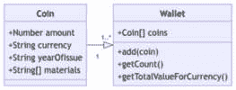

# 第二章：实现结构型设计模式

结构型设计模式为我们提供了处理*连接*不同对象的方法；换句话说，管理对象之间的关系。这包括减少内存使用和在不修改现有类的情况下开发功能的技术。此外，JavaScript 特性使我们能够更有效地应用这些模式。现代 JavaScript 包括一些内置功能，允许我们以更有效的方式实现结构型设计模式。

在本章中，我们将涵盖以下主题：

+   定义结构型设计模式整体，以及代理、装饰、享元和适配器具体实现

+   使用基于类的代理模式实现以及使用 Proxy 和 Reflect 的替代实现

+   利用 JavaScript 对函数的一级支持实现的装饰模式多种实现

+   一种迭代方法，用于在 JavaScript 中实现享元模式，包括使用现代 JavaScript 特性进行的人体工程学改进

+   基于类和函数的适配器实现

在本章结束时，你将能够就何时以及如何在使用 JavaScript 时应用结构型设计模式做出明智的决定。

# 技术要求

你可以在 GitHub 上找到本章的代码文件，网址为[`github.com/PacktPublishing/Javascript-Design-Patterns`](https://github.com/PacktPublishing/Javascript-Design-Patterns)

# 什么是结构型设计模式？

在构建软件时，我们希望能够*连接*不同的代码片段（例如，类和函数），并改变参与这些连接和关系的各方如何交互，而无需跳转到代码库的多个碎片化部分。

结构型设计模式允许我们在模块和类中安全地添加、删除和更改功能。这些模式的“结构”方面是由于我们可以围绕实现进行操作，如果暴露的接口是稳定的。

结构型设计模式是维护关注点分离和不同类和模块的松散耦合，同时保持高开发速度的好方法。

在下一节中，我们将探讨在 JavaScript 中实现代理模式的多种方法。

# 使用 Proxy 和 Reflect 实现代理模式

代理模式涉及提供一个对象（`subject`，或`real`对象），该对象满足一定的接口。`proxy`（一个`placeholder`或`wrapper`对象）控制对`subject`的访问。这允许我们在不改变消费者与`subject`交互的情况下，在`subject`之上提供额外的功能。

这意味着代理需要提供一个与`subject`匹配的接口。

通过使用代理模式，我们可以拦截对原始对象的全部操作，要么将它们传递通过，要么改变它们的实现。这遵循了开闭原则，其中`subject`和`consumer`都封闭于修改，但代理为我们提供了一个钩子来`extend`，这意味着设计是开放的，可以扩展。

## 红色代理实现

我们将从以下实现类开始，它有几个输出字符串的方法：

```js
class Implementation {
  someFn() {
    return 'some-output';
  }
  sensitiveFn() {
    return 'sensitive-output';
  }
}
```

让我们想象输出中的`sensitive`字符串应该被编辑。

下面是一个`RedactionProxy`类可能的样子：

```js
class RedactionProxy {
  constructor() {
    this.impl = new Implementation();
  }
  someFn() {
    return this.impl.someFn();
  }
  sensitiveFn() {
    return this.impl.sensitiveFn().replace('sensitive',
      '[REDACTED]');
  }
}
```

在这种情况下，`RedactionProxy`执行我们所说的`someFn()`调用。换句话说，`RedactionProxy#someFn`只是将`someFn`调用转发到`Implementation`。以下是一个说明：

```js
const redactionProxy = new RedactionProxy();
console.assert(
  redactionProxy.someFn() === newImplementation().someFn(),
    'Proxy implementation calls through to original'
);
```

当涉及到`sensitiveFn`时，`RedactionProxy`实现了与`Implementation`相同的接口，除了它覆盖了输出，将`sensitive`替换为`[REDACTED]`。

这意味着`RedactionProxy`和`Implementation`的接口是相同的，但`RedactionProxy`可以控制哪些方法调用和字段可用，以及它们的实现。以下是一个此行为的示例：

```js
console.assert(
  redactionProxy.sensitiveFn() !== new
    Implementation().sensitiveFn()&&
      redactionProxy.sensitiveFn() === '[REDACTED]-output',
      'Proxy implementation adds new behaviour'
);
```

## 用例

代理模式允许我们拦截对对象的调用（实现或主题），并通过操纵输出或添加副作用来增强它们。

我们对编辑的例子是一个很好的用例，但任何其他类型的工具也是很好的用例。工具可能涉及测量关于函数/字段访问的某些内容（例如，所需的时间）或确保对属性的访问触发某种效果。例如，Vue.js 和 Alpine.js 的**响应性**系统基于代理，其中使用 JavaScript 代理对象来包装响应式数据对象。这允许库（Vue 或 Alpine）检测属性何时被更改，并运行诸如观察者、效果和重新渲染等操作。

## 使用`Proxy`和`Reflect`全局对象改进 JavaScript 中的代理模式

回到我们的例子，当我们需要编辑更多函数时会发生什么？

让我们以一个有三个方法（`someFn`、`sensitiveFn`和`otherSensitiveFn`）的`Implementation`类为例：

```js
class Implementation {
  someFn() {
    return 'sensitive-some-output';
  }
  sensitiveFn() {
    return 'sensitive-output';
  }
  otherSensitiveFn() {
    return 'sensitive-other-output';
  }
}
```

扩展代理的一个简单实现如下，其中每个方法都调用实现的方法，然后在输出中替换`sensitive`：

```js
class RedactionProxyNaive {
  constructor() {
    this.impl = new Implementation();
  }
  someFn() {
    return this.impl.someFn().replace
      ('sensitive', '[REDACTED]');
  }
  sensitiveFn() {
    return this.impl.sensitiveFn().replace('sensitive',
      '[REDACTED]');
  }
  otherSensitiveFn() {
    return this.impl.otherSensitiveFn().
      replace('sensitive', '[REDACTED]');
  }
}
```

这个`Proxy`的实现是有效的，我们可以通过以下代码确保：

```js
console.assert(
  !new RedactionProxyNaive().someFn().includes('sensitive')
    &&
    !new RedactionProxyNaive().sensitiveFn().includes
      ('sensitive') &&
    !new RedactionProxyNaive().otherSensitiveFn().includes
      ('sensitive'),
  'naive proxy redacts correctly'
);
```

我们可以在这里进行的一个改进是提取一个`#redact`私有方法来处理`sensitive`的替换：

```js
class RedactionProxyNaiveRefactored {
  constructor() {
    this.impl = new Implementation();
  }
  #redact(str) {
    return str.replace('sensitive', '[REDACTED]');
  }
  someFn() {
    return this.#redact(this.impl.someFn());
  }
  sensitiveFn() {
    return this.#redact(this.impl.sensitiveFn());
  }
  otherSensitiveFn() {
    return this.#redact(this.impl.otherSensitiveFn());
  }
}
console.assert(
  !new RedactionProxyNaiveRefactored().someFn().includes
    ('sensitive') &&
    !new RedactionProxyNaiveRefactored().sensitiveFn().
      includes('sensitive') &&
    !new RedactionProxyNaiveRefactored()
      .otherSensitiveFn()
      .includes('sensitive'),
  'refactored naive proxy redacts correctly'
);
```

这种方法的缺点是，`Implementation`对象（主题）上的每个方法都需要更改我们的代理实现。

幸运的是，JavaScript 有一个内置的类可以编程管理这些情况。这个 JavaScript 类恰当地被称为`Proxy`。

让我们以以下普通的 JavaScript 对象（这也适用于类实例）为例，它既有字段又有函数：

```js
const obj = {
  someFn() {
    return 'sensitive-some-output';
  },
  sensitiveFn() {
    return 'sensitive-output';
  },
  otherSensitiveFn() {
    return 'sensitive-other-output';
  },
  field: 'sensitive-data',
  sensitiveField: 'redact-everything',
};
```

我们希望能够完全编辑（即保留原始输出的全部内容）那些在字段或方法名称中包含`sensitive`的字段。我们还希望在输出包含字符串`sensitive`时具有值编辑功能，其中将`sensitive`替换为`[REDACTED]`。

为了实现这一点，我们定义了一个将包装我们的`obj`对象的代理。我们使用一个“get trap”实例化代理，这允许我们拦截所有属性访问（包括函数访问）。

`get`函数接收一个`target`和一个`property`。`target`是被包装的对象（`obj`），`property`是被访问的属性。

根据`target[property]`是否是函数，我们将用收集所有参数的包装函数替换它，使用这些参数调用`target[property]`，拦截输出，并将`sensitive`替换为`[REDACTED]`。如果属性名包含`sensitive`（在我们的情况下，使用`sensitiveFn`），我们还将返回`[REDACTED]`。

在`target[property]`不是一个函数的情况下，如果属性名包含`sensitive`，我们将进行完整的编辑，并且替换所有其他属性中的`sensitive`：

```js
const redactedObjProxy = new Proxy(obj, {
  get(target, property, _receiver) {
    if (target[property] instanceof Function) {
      return (...args) => {
        if (property.includes('sensitive')) {
          return '[REDACTED]';
        }
        const output = targetproperty;
        if (typeof output === 'string') {
          return output.replace('sensitive', '[REDACTED]');
        }
        return output;
      };
    }
    if (property.includes('sensitive')) {
      return '[REDACTED]';
    }
    return target[property].replace('sensitive',
      '[REDACTED]');
  },
});
```

以下代码确保我们的代理实现按预期工作。`sensitive`不在任何函数输出或`field`值中：

```js
console.assert(
  !redactedObjProxy.someFn().includes('sensitive') &&
    !redactedObjProxy.sensitiveFn().includes('sensitive') &&
    !redactedObjProxy.otherSensitiveFn().includes
      ('sensitive'),
  'JavaScript Proxy redacts correctly for all functions'
);
console.assert(
  !redactedObjProxy.field.includes('sensitive'),
  'JavaScript Proxy redacts field values by value
    correctly'
);
console.assert(
  redactedObjProxy.sensitiveField === '[REDACTED]',
  'JavaScript Proxy redacts field values by property name
    correctly'
);
```

其中一个关键好处是设置的简单性；所有的编辑逻辑都包含在`get`函数中，这使得它更加集中。

由于逻辑集中，我们能够除了编辑值之外，还能通过属性名添加编辑。

由于我们在函数中丢失了`this`上下文，我们当前的基于代理的方法还存在一些轻微的问题。我们调用`targetproperty`，只要我们的对象不访问`this`，这是可以的。我们将进一步重构我们的实现，以便更容易地进行扩展，同时利用`Reflect`全局内置对象来简化我们的代码。

`Reflect`提供了与`Proxy`陷阱具有相同名称和参数的函数；例如，`Reflect.get(target, property, receiver)`。

我们将提取一个`redact`函数，它接受一个`propertyName`和一个`redactionValue`。它将通过将其抽象为单独的函数来使我们的编辑逻辑更加同步：

```js
const redact = (propertyName, redactionValue) => {
  if (propertyName.includes('sensitive')) {
    return '[REDACTED]';
  }
  if (typeof redactionValue === 'string') {
    return redactionValue.replace('sensitive','[REDACTED]'
    );
  }
  // Could implement redaction of objects/Arrays and so on
  return redactionValue;
};
```

我们可以在必要时使用`redact`，使用`Reflect.get()`作为`target[property]`的快捷方式，并使用`Reflect.apply`来保持`this`上下文：

```js
const redactedObjProxyImproved = new Proxy(obj, {
  get(target, property, receiver) {
    const targetPropertyValue = Reflect.get(target,
      property, receiver);
    if (targetPropertyValue instanceof Function) {
      return (...args) => {
        const output = Reflect.apply(
          targetPropertyValue,
          this === receiver ? this : target,
          args
        );
        return redact(property, output);
      };
    }
    return redact(property, targetPropertyValue);
  },
});
```

我们的编辑在值、函数输出、属性和函数名称上仍然按相同的方式工作：

```js
console.assert(
  !redactedObjProxyImproved.someFn().includes
    ('sensitive') &&
    !redactedObjProxyImproved.sensitiveFn().includes
      ('sensitive') &&
    !redactedObjProxyImproved.otherSensitiveFn().includes
      ('sensitive'),
  'JavaScript Proxy with Reflect redacts correctly for all
    functions'
);
console.assert(
  !redactedObjProxyImproved.field.includes('sensitive'),
  'JavaScript Proxy with Reflect redacts field values
    correctly'
);
console.assert(
  redactedObjProxyImproved.sensitiveField === '[REDACTED]',
  'JavaScript Proxy with Reflect redacts field values
    correctly'
);
```

现在我们已经深入探讨了如何实现代理模式，我们将将其与装饰器模式进行对比，并讨论我们可以使用哪些 JavaScript 工具来实现它。

# JavaScript 中的装饰器

装饰器模式与代理模式类似，因为它涉及到“包装”一个对象。然而，装饰器模式是在运行时向对象添加功能。不同的装饰器可以应用于对象，以向其添加不同的功能。

## 实现

给定以下基于`fetch` API 的`HttpClient`类，我们想要测量通过此客户端发出的请求。`HttpClient`实现了`getJson`，如果`fetch`请求成功则返回 JSON 输出：

```js
class HttpClient {
  async getJson(url) {
    const response = await fetch(url);
    if (response.ok) {
      return response.json();
    }
    throw new Error(`Error loading ${url}`);
  }
}
```

`InstrumentedHttpClient`，这是一个装饰器，可能看起来如下，其中我们暴露了相同的`getJson`方法，但在实例上增加了`requestTimings`字段。

当调用`getJson`时，我们跟踪`HttpClient#getJson`方法调用的开始和结束时间，并将其添加到实例的`requestTimings`中：

```js
class InstrumentedHttpClient {
  constructor(client) {
    this.client = client;
    this.requestTimings = {};
  }
  async getJson(url) {
    const start = performance.now();
    const output = await this.client.getJson(url);
    const end = performance.now();
    if (!Array.isArray(this.requestTimings[url])) {
      this.requestTimings[url] = [];
    }
    this.requestTimings[url].push(end - start);
    return output;
  }
}
```

我们可以使用以下代码确保`InstrumentedHttpClient`按描述工作：

```js
const httpClient = new HttpClient();
const instrumentedClient = new InstrumentedHttpClient
  (httpClient);
await instrumentedClient.getJson
  ('https://ifconfig.io/all.json');
console.assert(
  Object.keys(instrumentedClient.requestTimings).length >0,
  'Tracks request timings'
);
await instrumentedClient.getJson
  ('https://ifconfig.io/all.json');
console.assert(
  instrumentedClient.requestTimings
    ['https://ifconfig.io/all.json'].length === 2,
  'Tracks per URL timings'
);
```

## 用例

装饰器模式，就像代理模式一样，可以用来测量或拦截“主题”上的操作。

一个关键的区别是，装饰器是关于向类添加“新成员”，而不仅仅是保持接口一对一。这就是为什么我们通常保存一个额外的`requestTimings`字段，并从“装饰”类`InstrumentedHttpClient`中访问它。

这意味着多个装饰器可以“堆叠”在彼此之上。例如，我们可以拥有我们的`InstrumentedHttpClient`，它有`requestTimings`，然后创建另一个装饰器类，使用时对时间信息进行有用的处理。这里的一个例子是发送一个“client-time”启发式头，允许服务器在知道客户端将在某个时间点终止连接后停止处理请求。

## 改进/限制

由于 JavaScript 对函数的第一类支持，我们可以使用函数作为装饰的基础，而不是类。

我们的`getJson`函数可能如下所示，与`HttpClient.getJson`方法的逻辑相似：

```js
async function getJson(url) {
  const response = await fetch(url);
  if (response.ok) {
    return response.json();
  }
  throw new Error(`Error loading ${url}`);
}
```

我们可以创建一个`addTiming`方法，该方法将请求时间存储在`allOperationTimings` `Map`实例中。

我们在这里使用了第一类函数的两个方面——我们传递一个函数作为参数（`getJson`）并返回一个函数：

```js
const allOperationTimings = new Map();
function addTiming(getJson) {
  return async (url) => {
    const start = performance.now();
    const output = await getJson(url);
    const end = performance.now();
    const previousOperationTimings =
       allOperationTimings.get(url) || [];
    allOperationTimings.set(url,
      previousOperationTimings.concat(end - start));
    return output;
  };
}
```

使用我们的装饰器函数的方式如下：

```js
const getJsonWithTiming = addTiming(getJson);
```

我们可以调用我们的仪器化函数并检查它是否向我们的`allOperationTimings` `Map`添加了时间：

```js
await getJsonWithTiming('https://ifconfig.io/all.json');
await getJsonWithTiming('https://ifconfig.io/all.json');
console.assert(
  allOperationTimings.size === 1,
  'operation timings tracks by url'
);
console.assert(
  allOperationTimings.get('https://ifconfig.io/all.json').
    length === 2,
  'operation timings tracks number of calls by url'
);
```

你可能注意到的一件事是，我们的`addTiming` *仍然*知道`getJson`接口（它知道传递 URL 参数，并且`getJson`返回一个 Promise 对象）。我们将把它留给读者作为练习来实现，但将`addTiming`转换成一个可以测量任何 JavaScript 函数操作时间的函数是可能的；困难的部分是找到我们操作映射的一个好键。

在本章的下一部分，我们将探讨享元模式。

# JavaScript 中的享元模式

Flyweight 模式是指具有相同值的对象属性子集存储在共享的“轻量级”对象中。

当生成大量具有相同值子集的对象时，Flyweight 模式很有用。

## 实现

来自 Eric Evans 的领域驱动设计中的一个概念是“值对象”。这些值对象具有其内容比其身份更重要的属性。让我们以一个“硬币”作为值对象的例子，其中，在支付的目的上，两枚 50 分硬币是可互换的。

值对象是可互换的且不可变的（50 分硬币不能变成 10 分硬币）。因此，这些类型的对象非常适合 Flyweight 模式。

并非所有“硬币”的特性都是由“价值”驱动的，例如，某些硬币是由某些材料制成的，并且硬币往往在特定年份发行。这两个特性（材料发行年份）可能对收藏家来说很有趣，从这个角度来看，现实中的硬币不仅作为价值对象，两枚 1993 年的硬币在硬币收藏的背景下可能以不同的方式有趣。

因此，我们将我们的 `Wallet` 模型化为包含一个硬币列表，将 `Coin` 模型化为包含金额（以分或其他“小额货币”计）、货币、发行年份和材料列表。



图 2.1：包含关联硬币及其操作方法的类图

我们的 `CoinFlyweight` 将是我们的“值对象”，包含 `amount` 和 `currency`，如下所示：

```js
class CoinFlyweight {
  /**
   * @param {Number} amount – amount in minor currency
   * @param {String} currency
   */
  constructor(amount, currency) {
    this.amount = amount;
    this.currency = currency;
  }
}
```

Flyweight 模式的关键优势在于我们可以重用我们的轻量级对象。为了做到这一点，我们需要通过工厂（如*第一章**，使用创建型设计模式，JavaScript 中的工厂模式）来控制轻量级的实例化。因此，我们定义了 `CoinFlyweightFactory`，它具有一个静态的 `get` 方法，该方法接受轻量级的初始化参数，但只有当内存中不存在具有正确金额和货币的 `CoinFlyweight` 时，才会实例化一个新的 `CoinFlyweight`。它还提供了一个 `getCount` 方法来返回当前实例化的轻量级的数量：

```js
class CoinFlyweightFactory {
  static flyweights = {};
  static get(amount, currency) {
    const flyWeightKey = `${amount}-${currency}`;
    if (this.flyweights[flyWeightKey]) {
      return this.flyweights[flyWeightKey];
    }
    const instance = new CoinFlyweight(amount, currency);
    this.flyweights[flyWeightKey] = instance;
    return instance;
  }
  static getCount() {
    return Object.keys(this.flyweights).length;
  }
}
```

使用 Flyweight 模式的另一个机会是与材料。我们可以类似地创建一个 `MaterialFlyweight` 并通过 `MaterialFlyweightFactory` 重复使用其值：

```js
class MaterialFlyweight {
  constructor(materialName) {
    this.name = materialName;
  }
}
class MaterialFlyweightFactory {
  static flyweights = {};
  static get(materialName) {
    if (this.flyweights[materialName]) {
      return this.flyweights[materialName];
    }
    const instance = new MaterialFlyweight(materialName);
    this.flyweights[materialName] = instance;
    return instance;
  }
  static getCount() {
    return Object.keys(this.flyweights).length;
  }
}
```

最后，我们可以实现 `Coin` 和 `Wallet` 类。我们的 `Coin` 实例有一个 `flyweight` 字段，该字段使用 `CoinFlyweightFactory` 进行填充。`Coin#materials` 字段使用常规数组进行填充，但数组的元素是 `MaterialFlyweight`，使用 `MaterialFlyweightFactory` 加载：

```js
class Coin {
  constructor(amount, currency, yearOfIssue, materials) {
    this.flyweight = CoinFlyweightFactory.get
      (amount, currency);
    this.yearOfIssue = yearOfIssue;
    this.materials = materials.map((material) =>
      MaterialFlyweightFactory.get(material)
    );
  }
}
```

`Wallet` 是一个普通的 JavaScript 对象。它的 `add` 方法创建一个新的 `Coin` 实例并将其推入 Wallet 的 `coins` 字段。`getTotalValueForCurrency` 对给定货币的硬币价值进行求和：

```js
class Wallet {
  constructor() {
    this.coins = [];
  }
  add(amount, currency, yearOfIssue, materials) {
    const coin = new Coin(amount, currency, yearOfIssue,
      materials);
    this.coins.push(coin);
  }
  getCount() {
    return this.coins.length;
  }
  getTotalValueForCurrency(currency) {
    return this.coins
      .filter((coin) => coin.flyweight.currency ===
        currency)
      .reduce((acc, curr) => acc + curr.flyweight.amount, 0);
  }
}
```

钱包可以使用以下方式使用，添加不同面额的 GBP 和 USD：

```js
const wallet = new Wallet();
wallet.add(100, 'GBP', '2023', ['nickel-brass',
  'nickel-plated alloy']);
wallet.add(100, 'GBP', '2022', ['nickel-brass',
  'nickel-plated alloy']);
wallet.add(100, 'GBP', '2021', ['nickel-brass',
  'nickel-plated alloy']);
wallet.add(100, 'GBP', '2021', ['nickel-brass',
  'nickel-plated alloy']);
wallet.add(200, 'GBP', '2021', ['nickel-brass',
  'cupro-nickel']);
wallet.add(100, 'USD', '1990', ['copper', 'nickel']);
wallet.add(5, 'USD', '1990', ['copper', 'nickel']);
wallet.add(1, 'USD', '2010', ['copper', 'zinc']);
```

注意，尽管钱包实例包含八个硬币，但我们创建了六个 `CoinFlyweight` 和五个 `MaterialFlyweight` 实例：

```js
console.assert(
  wallet.getCount() === 8,
  'wallet.add adds coin instances are created once given
    the same cache key'
);
console.assert(
  CoinFlyweightFactory.getCount() === 5,
  'CoinFlyweights are created once given the same
    cache key'
);
console.assert(
  MaterialFlyweightFactory.getCount() === 6,
  'MaterialFlyweights are created once given the same
     cache key'
);
console.assert(
  wallet.getTotalValueForCurrency('GBP') === 600,
  'Summing GBP works'
);
console.assert(
  wallet.getTotalValueForCurrency('USD') === 106,
  'Summing USD works'
);
```

## 用例

Flyweight 模式是一种规范化技术，它以在访问和运行使用此模式的对象的计算时的认知开销为代价，减少了内存占用。当处理大量对象时，Flyweight 可以作为性能优化的手段。

它非常适合作为我们之前章节中展示的价值对象进行建模。唯一的缺点是 `getTotalValueForCurrency`，在那里我们必须读取 `coin.flyweight.currency` 和 `coin.flyweight.amount`。

## 改进/限制

我们可以对我们的 flyweight 钱包/硬币设置进行一些改进。其中一些改进集中在“工厂”上。`flyweights` 不应该从 `get` 函数外部访问，因此我们可以使用 `#flyweights` 使其成为私有字段。我们还可以利用 `Map` 对象，仍然使用相同的缓存键，尽管 `Map` 在可用的键方面具有更大的灵活性，并且具有不同的属性访问接口（`.get(key)` 而不是 `[key]` 访问）。使用 `Map` 意味着我们需要在 `getCount` 中使用 `this.#flyweights.size`：

```js
class CoinFlyweightFactory {
  static #flyweights = new Map();
  static get(amount, currency) {
    const flyWeightKey = `${amount}-${currency}`;
    if (this.#flyweights.get(flyWeightKey)) {
      return this.#flyweights.get(flyWeightKey);
    }
    const instance = new CoinFlyweight(amount, currency);
    this.#flyweights.set(flyWeightKey, instance);
    return instance;
  }
  static getCount() {
    return this.#flyweights.size;
  }
}
```

我们还将做出另一个改变，鉴于将 `materials` 作为 flyweight 并没有带来任何实质性的收益，因此我们将将其恢复为每个 `Coin` 实例存储字符串列表。

同样，我们希望将 `#flyweight` 设置为私有，这将改变 `Coin` 的接口，因为消费者将无法访问 `coin.#flyweight`（它是一个私有字段）。

我们将解决必须读取 `coin.flyweight.amount` 和 `coin.flyweight.currency` 的不匹配问题。我们将提供两个获取器，`get amount()` 和 `get currency()`，分别返回 `this.#flyweight.amount` 和 `this.#flyweight.currency`：

```js
class Coin {
  #flyweight;
  constructor(amount, currency, yearOfIssue, materials) {
    this.#flyweight = CoinFlyweightFactory.get
      (amount, currency);
    this.yearOfIssue = yearOfIssue;
    this.materials = materials;
  }
  get amount() {
    return this.#flyweight.amount;
  }
  get currency() {
    return this.#flyweight.currency;
  }
}
```

如前所述，`Coin` 的接口没有 `flyweight` 属性，因此 `getTotalValueForCurrency` 将会从 `Coin#currency` 和 `Coin#amount` 中读取。至于 `Wallet`，`currency` 和 `amount` 是 `Coin` 实例的字段，尽管它们是获取器：

```js
class Wallet {
  constructor() {
    this.coins = [];
  }
  add(amount, currency, yearOfIssue, materials) {
    const coin = new Coin(amount, currency, yearOfIssue,
      materials);
    this.coins.push(coin);
  }
  getCount() {
    return this.coins.length;
  }
  getTotalValueForCurrency(currency) {
    return this.coins
      .filter((coin) => coin.currency === currency)
      .reduce((acc, curr) => acc + curr.amount, 0);
  }
}
```

我们可以通过使用与代码早期迭代中相同的测试来检查我们的新 `Wallet` 和 `Coin` 实现是否按预期工作：

```js
const wallet = new Wallet();
wallet.add(100, 'GBP', '2023', ['nickel-brass',
  'nickel-plated alloy']);
wallet.add(100, 'GBP', '2022', ['nickel-brass',
  'nickel-plated alloy']);
wallet.add(100, 'GBP', '2021', ['nickel-brass',
  'nickel-plated alloy']);
wallet.add(100, 'GBP', '2021', ['nickel-brass',
  'nickel-plated alloy']);
Wallet.add(200, 'GBP', '2021', ['nickel-brass',
  'cupro-nickel']);
wallet.add(100, 'USD', '1990', ['copper', 'nickel']);
wallet.add(5, 'USD', '1990', ['copper', 'nickel']);
wallet.add(1, 'USD', '2010', ['copper', 'zinc']);
console.assert(
  wallet.getCount() === 8,
  'wallet.add adds coin instances are created once
    given the same cache key'
);
console.assert(
  CoinFlyweightFactory.getCount() === 5,
  'CoinFlyweights are created once given the same
   cache key'
);
console.assert(
  wallet.getTotalValueForCurrency('GBP') === 600,
  'Summing GBP works'
);
console.assert(
  wallet.getTotalValueForCurrency('USD') === 106,
  'Summing USD works'
);
```

我们已经看到如何使用 flyweight 模式通过使用共享值对象来优化内存使用。

在本章的下一部分，我们将探讨本书中涵盖的最后一个结构化设计模式，即 JavaScript 中的适配器模式。

# JavaScript 中的适配器

与其他结构化设计模式类似，适配器模式关注于接口。

在适配器模式的情况下，它涉及到能够在不更改消费者或实现接口的情况下使用新的实现。适配器“适配”接口以匹配消费者的期望。

我们没有改变实现或消费者；相反，我们构建了一个适配器来包装实现并将其插入消费者，而不改变任何一方。

### 实现

让我们从使用简单的内存数据库开始，该数据库使用一个简单的 `IdGenerator` 通过将对象编码为字符串来生成数据库条目的键：

`Database` 有一个 `createEntry` 方法，它使用 `IdGenerator` 生成键来存储给定数据。`Database` 还有一个 `get` 方法，可以通过 ID 回忆条目：

```js
class IdGenerator {
  get(entry) {
    return JSON.stringify(entry);
  }
}
class Database {
  constructor(idGenerator) {
    this.idGenerator = idGenerator;
    this.entries = {};
  }
  createEntry(entryData) {
    const id = this.idGenerator.get(entryData);
    this.entries[id] = entryData;
    return id;
  }
  get(id) {
    return this.entries[id];
  }
}
```

通过将 `Database` 与 `IdGenerator` 实例组合，我们得到一个键值查找数据库实例，其键等于值的 JSON 表示形式：

```js
const naiveIdDatabase = new Database(new IdGenerator());
naiveIdDatabase.createEntry({
  name: 'pear',
});
console.assert(
  naiveIdDatabase.get('{"name":"pear"}').name === 'pear',
  'stringIdDatabase recalls entries by stringified entry'
);
```

现在，将整个条目值编码在键中的简单 ID 生成方法并不理想。一个替代方案是使用 UUID。以下是一个使用 `uuid` npm 模块的 `UuidFactory`。它公开的关键操作是 `generateUuid`：

```js
import { v4 as uuidv4 } from 'uuid';
class UuidFactory {
  generateUuid() {
    return uuidv4();
  }
}
```

要使用 `UuidFactory` 与我们的 `Database`，我们需要一个 `get` 方法而不是 `generateUuid` 方法。这就是我们的适配器发挥作用的地方——我们可以将 `UuidFactory` 包装在一个类中，该类公开 `get(entry)` 但在 `UuidFactor` 实例上调用 `generateUuid`：

```js
class UuidIdGeneratorAdapter {
  constructor() {
    this.uuidFactory = new UuidFactory();
  }
  get(_entry) {
    return this.uuidFactory.generateUuid();
  }
}
```

`UuidIdGeneratorAdapter` 可以作为 `idGenerator` 传递给 `Database`。一切如预期般工作，其中数据库的条目 ID 是 UUID：

```js
const uuidIdDatabase = new Database(new UuidIdGeneratorAdapter());
const uuidEntryId = uuidIdDatabase.createEntry({
  name: 'pear',
});
console.assert(
  uuidIdDatabase.get(uuidEntryId).name === 'pear',
  'uuidIdDatabase recalls entries by uuid'
);
import { validate as isUuid } from 'uuid';
console.assert(isUuid(uuidEntryId), 'uuidIdDatabase generated uuid ids');
```

另一个利用 `entry` 被传递给 `idGenerator.get()` 的事实来生成基于 `entry` 内容的前缀自增 ID 的例子。在这里，`name` 将用作前缀。我们有一个 `Counter` 类，它实现了 `getAndIncrement(prefix)`，它根据前缀（或没有前缀）生成递增 ID：

```js
class Counter {
  constructor(startValue = 1) {
    this.startValue = startValue;
    this.nextId = startValue;
    this.nextIdByPrefix = {};
  }
  getAndIncrement(prefix) {
    if (prefix) {
      if (!this.nextIdByPrefix[prefix]) {
        this.nextIdByPrefix[prefix] = this.startValue;
      }
      const nextId = this.nextIdByPrefix[prefix]++;
      return `${prefix}:${nextId}`;
    }
    return String(this.nextId++);
  }
}
```

再次强调，`getAndIncrement(prefix)` 不符合 `IdGenerator` 接口（没有 `get` 方法）。我们可以将 `Counter` 包装在 `PrefixedAutoIncrementIdGeneratorAdapter` 中，以暴露 `IdGenerator` 接口，但使用 `Counter` 的实现：

```js
class PrefixedAutoIncrementIdGeneratorAdapter {
  constructor() {
    this.counter = new Counter();
  }
  get(entry) {
    return this.counter.getAndIncrement(entry.name);
  }
}
```

我们可以确保前缀逻辑对 `Database` 的工作是正确的，因为它创建的条目键是带有前缀的自增 ID：

```js
const prefixAutoIncrementDatabase = new Database(
  new PrefixedAutoIncrementIdGeneratorAdapter()
);
```

我们可以检查没有设置 `name` 字段的情况是否按预期工作：

```js
const noPrefixIncrementingEntryId1 =
  prefixAutoIncrementDatabase.createEntry({
  type: 'no-prefix',
});
const noPrefixIncrementingEntryId2 =
  prefixAutoIncrementDatabase.createEntry({
  type: 'no-prefix',
});
console.assert(
  noPrefixIncrementingEntryId1 === '1' &&
    noPrefixIncrementingEntryId2 === '2',
  'prefixAutoIncrementDatabase generates autoincrementing
    ids with no prefix if no name property is set'
);
console.assert(
  prefixAutoIncrementDatabase.get
    (noPrefixIncrementingEntryId1).type ===
    'no-prefix' &&
    prefixAutoIncrementDatabase.get
      (noPrefixIncrementingEntryId2).type ===
      'no-prefix',
  'prefixAutoIncrementDatabase recalls entries by
     autoincrementing id'
);
```

并且带有前缀的场景也按照以下示例正确地工作：

```js
const prefixIncrementingEntryIdPear1 =
  prefixAutoIncrementDatabase.createEntry({
  name: 'pear',
});
const prefixIncrementingEntryIdPear2 =
  prefixAutoIncrementDatabase.createEntry({
  name: 'pear',
});
const prefixIncrementingEntryIdApple1 =
  prefixAutoIncrementDatabase.createEntry(
  {
    name: 'apple',
  }
);
console.assert(
  prefixIncrementingEntryIdPear1 === 'pear:1' &&
    prefixIncrementingEntryIdPear2 === 'pear:2' &&
    prefixIncrementingEntryIdApple1 === 'apple:1',
  'prefixAutoIncrementDatabase generates prefixed
    autoincrementing ids'
);
console.assert(
  prefixAutoIncrementDatabase.get
    (prefixIncrementingEntryIdPear1).name ===
    'pear',
  prefixAutoIncrementDatabase.get
    (prefixIncrementingEntryIdPear2).name ===
    'pear',
  prefixAutoIncrementDatabase.get
    (prefixIncrementingEntryIdApple1).name ===
    'apple',
  'prefixAutoIncrementDatabase recalls entries by prefixed
    id'
);
```

## 用例

当你需要使用两个没有特别设计来一起工作的类时，适配器模式非常有用。例如，考虑一个第三方库或模块，它公开了一个函数（例如 `uuid` 模块或甚至是我们场景中的 `UuidFactory`）。我们希望将实现抽象化，在我们的例子中是 `IdGenerator` 接口，它只是一个 `get` 方法，这样任何实现都可以使用。

我们的例子展示了适配器模式的价值。我们能够创建行为非常不同的数据库，而无需更改 `UuidFactory`、`Counter` 或 `Database`。这在需要连接两个第三方模块或自包含且不应更改的模块时非常重要。

因此，使用适配器模式意味着我们可以避免更改难以理解的代码，同时提供所需的功能。

## 改进/限制

类似于*JavaScript 中的装饰器 - 改进/限制*部分，JavaScript 中的一项特性可以帮助实现结构化设计模式，那就是对函数的一级支持。

而不是`IdGenerator`类，我们可以有一个`defaultIdGenerator`函数，它接受一个条目并返回一个字符串：

```js
function defaultIdGenerator(entry) {
  return JSON.stringify(entry);
}
```

`Database`类现在看起来可能如下所示，其中`this.idGenerator(entryData)`被直接调用：

```js
class Database {
  constructor(idGenerator) {
    this.idGenerator = idGenerator;
    this.entries = {};
  }
  createEntry(entryData) {
    const id = this.idGenerator(entryData);
    this.entries[id] = entryData;
    return id;
  }
  get(id) {
    return this.entries[id];
  }
}
```

我们可以通过将其传递的内容序列化为 JSON 来验证原始实现仍然有效：

```js
const naiveIdDatabase = new Database(defaultIdGenerator);
naiveIdDatabase.createEntry({
  name: 'pear',
});
console.assert(
  naiveIdDatabase.get('{"name":"pear"}').name === 'pear',
  'stringIdDatabase recalls entries by stringified entry'
);
```

当我们需要插入 UUID 和前缀生成器时，这种方法特别有效。

`uuidGenerator`函数可以调用`uuidv4()`。我们可以验证`uuidIdDatabase`使用 UUID 作为键来检索条目：

```js
function uuidGenerator() {
  return uuidv4();
}
const uuidIdDatabase = new Database(uuidGenerator);
const uuidEntryId = uuidIdDatabase.createEntry({
  name: 'pear',
});
console.assert(
  uuidIdDatabase.get(uuidEntryId).name === 'pear',
  'uuidIdDatabase recalls entries by uuid'
);
console.assert(isUuid(uuidEntryId), 'uuidIdDatabase
  generated uuid ids');
```

最后，一个`prefixAutoIncrementIdGenerator`可能如下所示。我们正在使用模块作用域变量，这是 JavaScript 的另一个特性：

```js
const startValue = 1;
let nextId = startValue;
let nextIdByPrefix = {};
function prefixAutoIncrementIdGenerator(entry) {
  const prefix = entry.name;
  if (prefix) {
    if (!nextIdByPrefix[prefix]) {
      nextIdByPrefix[prefix] = startValue;
    }
    const nextId = nextIdByPrefix[prefix]++;
    return `${prefix}:${nextId}`;
  }
  return String(nextId++);
}
```

这段代码将位于与其消费者不同的模块中，因此它将是`export function prefixAutoIncrementIdGenerator`，其消费者将导入`{prefixAutoIncrementIdGenerator}`从`'./path-to-module.js'`。

`prefixAutoIncrementIdGenerator`函数与`PrefixedAutoIncrementIdGeneratorAdapter`类的作用类似，生成自增 ID，并在可能的情况下通过`entry.name`进行前缀：

```js
const prefixAutoIncrementDatabase = new Database(
  prefixAutoIncrementIdGenerator
);
const noPrefixIncrementingEntryId1 =
  prefixAutoIncrementDatabase.createEntry({
  type: 'no-prefix',
});
const noPrefixIncrementingEntryId2 =
  prefixAutoIncrementDatabase.createEntry({
  type: 'no-prefix',
});
console.assert(
  noPrefixIncrementingEntryId1 === '1' &&
    noPrefixIncrementingEntryId2 === '2',
  'prefixAutoIncrementDatabase generates autoincrementing
     ids with no prefix if no name property is set'
);
console.assert(
  prefixAutoIncrementDatabase.get
    (noPrefixIncrementingEntryId1).type ===
    'no-prefix' &&
    prefixAutoIncrementDatabase.get
      (noPrefixIncrementingEntryId2).type ===
      'no-prefix',
  'prefixAutoIncrementDatabase recalls entries by
    autoincrementing id'
);
const prefixIncrementingEntryIdPear1 =
  prefixAutoIncrementDatabase.createEntry({
  name: 'pear',
});
const prefixIncrementingEntryIdPear2 =
  prefixAutoIncrementDatabase.createEntry({
  name: 'pear',
});
const prefixIncrementingEntryIdApple1 =
  prefixAutoIncrementDatabase.createEntry(
  {
    name: 'apple',
  }
);
console.assert(
  prefixIncrementingEntryIdPear1 === 'pear:1' &&
    prefixIncrementingEntryIdPear2 === 'pear:2' &&
    prefixIncrementingEntryIdApple1 === 'apple:1',
  'prefixAutoIncrementDatabase generates prefixed
    autoincrementing ids'
);
console.assert(
  prefixAutoIncrementDatabase.get
    (prefixIncrementingEntryIdPear1).name ===
    'pear',
  prefixAutoIncrementDatabase.get
    (prefixIncrementingEntryIdPear2).name ===
    'pear',
  prefixAutoIncrementDatabase.get
    (prefixIncrementingEntryIdApple1).name ===
    'apple',
  'prefixAutoIncrementDatabase recalls entries by prefixed
    id'
);
```

在本章的最后部分，我们讨论了适配器模式以及如何在 JavaScript 中，当消费者期望一个类和一个函数时使用它。

# 摘要

在本章中，我们探讨了结构化设计模式如何使 JavaScript 中功能的扩展成为可能，而无需重新工作接口。

代理设计模式在想要拦截对象调用而不改变接口时非常有用。

相比之下，装饰器设计模式关注的是通过新的实例成员动态添加功能。

轻量级模式可以有效地用于管理大量对象，这对于值对象尤其有用。JavaScript 中存在一些解决方案来解决其一些用户体验上的缺点。

适配器模式允许我们集成具有不同意见和接口的多个类、模块或函数，而无需修改它们。适配器的形状由我们试图连接的现有模块和类决定。

现在我们已经知道了如何使用结构化设计模式来组织不同对象和类之间的关系，在下一章中，我们将介绍如何使用行为设计模式来组织对象之间的通信。
