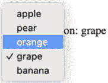

# 第四章：探索响应式视图库模式

响应式视图库模式为我们提供了在需要跳出组件原语时以可扩展和可维护的方式构建应用程序的工具。使用 React 视图库，我们将介绍超越基于组件的组合以向我们的组件注入功能的不同技术——渲染属性、高阶组件、hooks 和提供者模式。

本章我们将涵盖以下主要主题：

+   介绍响应式视图库模式及其使用它们可以带来最大益处的领域

+   渲染属性模式的示例和实现方法

+   实现和使用高阶组件模式

+   使用 hooks 构建 React 函数组件

+   实现提供者模式的多种方式

到本章结束时，您将能够辨别何时以及如何使用响应式视图库模式来构建 React 应用程序。

# 技术要求

要跟随本章，您需要以下内容：

+   **Node.js** **20+**：[`nodejs.org/en`](https://nodejs.org/en)

+   **Npm 8+**：大多数 Node.js 安装都包含

+   在一些示例中使用了[`parceljs.org/`](https://parceljs.org/)，它具有与 Node.js 类似的平台支持

+   **React**：通过 npm 安装 React DOM 和 Formik；在 Web 环境中需要了解[`react.dev/`](https://react.dev/)的基础知识

您可以在 GitHub 上找到本章的代码文件，链接为[`github.com/PacktPublishing/Javascript-Design-Patterns`](https://github.com/PacktPublishing/Javascript-Design-Patterns)

# 什么是响应式视图库模式？

响应式视图库在 JavaScript 和 Web 前端开发中被广泛使用。一些非常流行的选项包括**React**、**Angular**和**Vue**。

响应式视图库提供了一种以更可扩展的方式编写应用程序的方法，允许用户界面（通常是浏览器）对数据的变化做出反应。因此，应用程序开发得到了简化，因为视图库或框架负责处理所有必要的直接操作，以保持底层数据和浏览器之间的同步。

这些库和框架之间一个关键的共同点概念是**组件**，它包含业务逻辑和/或渲染逻辑。组件是应用程序的关键构建块。它可以被重用或不被重用，但它通常封装了一组责任，并在其周围强制执行接口。

组件的一个特性是开发者应该能够将它们用作构建块，并且在不显著改变组件内部的情况下，可以显著改变应用程序的行为。

因此，响应式视图库模式帮助我们以可重用的方式构建组件，但它们也涵盖了处理组件抽象存在不足的情况的技术。

在接下来的章节中，我们将介绍 React 中的渲染属性、高阶组件、钩子和提供者模式。我们将重点关注 React，但这些模式在 Vue 中也有等效的模式。

# 渲染属性模式

当一个组件允许其消费者通过一个函数属性定义该组件的一部分如何渲染时，就会出现渲染属性模式。这些可以是作为函数的子元素或另一个属性，该属性是一个接受一些参数并返回 JSX 的函数。

渲染属性允许一定程度上的控制反转。尽管一个组件可以完全封装渲染和业务逻辑，但它反而将渲染逻辑的一些部分的控制权交给了其消费者。

这种控制反转对于在不共享视觉或实际渲染 UI 的情况下共享逻辑非常有用。因此，这种模式在库中很常见。一个典型的例子是**Formik**，它为消费者提供了如何渲染表单的灵活性，同时提供了一个对表单状态管理逻辑的抽象。

## 用例

让我们从构建一个`CoupledSelect`组件的场景开始，这是一个`select`原生元素的包装器。我们将以数据与渲染紧密耦合的方式构建此组件，这是一个渲染属性何时有用的简单示例。

消费者对`CoupledSelect`的期望是它主要像`select`原生元素那样表现，但有几点需要注意。

我们的`CoupledSelect`组件接受以下属性：

+   **selectedOption**：这设置了选定的选项；它类似于**option**原生元素上的`selected`属性

+   **options**：这是一个字符串数组，它们被渲染为**option**元素

+   **onChange**：这是一个可选的回调，用于使渲染**CoupledSelect**的组件对选项选择做出反应

我们可以如下实现它。`CoupledSelect`将围绕`onChange`，因为它是不必要的：

```js
import React from 'react';
export function CoupledSelect({ selectedOption, options,
  onChange }) {
  const onChangeHandler = (event) => {
    if (onChange) onChange(event.target.value);
  };
}
```

让我们继续讨论渲染逻辑。我们将返回一个具有`onChange={onChangeHandler}`和`value={selectedOption}`的`select`元素，这样选择将同步于`selectedOption`并传播更改：

```js
import React from 'react';
export function CoupledSelect({ selectedOption, options,
  onChange }) {
  const onChangeHandler = (event) => {
    if (onChange) onChange(event.target.value);
  };
  return <select onChange={onChangeHandler}
    value={selectedOption}></select>;
}
```

最后，我们将使用`.map`渲染`props.options`，这将返回一个`<option>`元素，其值和键属性设置为`option`，其内容将是`option`值：

```js
export function CoupledSelect({ selectedOption, options,
  onChange }) {
  // no change to onChangeHandler
  return (
    <select onChange={onChangeHandler}
      value={selectedOption}>
      {options.map((option) => (
        <option value={option} key={option}>
          {option}
        </option>
      ))}
    </select>
  );
}
```

使用我们的`CoupledSelect`可能看起来像以下这样。

我们定义了一个选项数组。在这里，我们将它们结构化为一个具有`value`键的对象列表，该键是一个字符串：

```js
const options = [
  { value: 'apple' },
  { value: 'pear' },
  { value: 'orange' },
  { value: 'grape' },
  { value: 'banana' },
];
```

我们可以通过确保`props.options`是一个字符串数组来使用`CoupledSelect`：

```js
function App() {
  return (
    <>
      <CoupledSelect
        options={options.map((option) => option.value)}
      />
    <>
  );
}
```

接下来，我们可以使用`useState`钩子来保存`selectedOption`。我们将这个特定的状态命名为`selectedOption`，其更新函数为`setSelectedOption`。这将使我们能够使`CoupledSelect`具有交互性：

```js
function App() {
  const [selectedOption, setSelectedOption] = useState();
  return (
    <>
      <p>Selected Option: {selectedOption}</p>
      <CoupledSelect
        selectedOption={selectedOption}
        onChange={(selectedOption) => setSelectedOption
          (selectedOption)}
        options={options.map((option) => option.value)}
      />
    <>
  );
}
```

最后，我们将为`selectedOption`设置一个初始值，以展示`CoupledSelect`组件的功能是如何工作的：

```js
function App() {
  const [selectedOption, setSelectedOption] = useState
    (options[3].value);
  // no change to the returned JSX
}
```

从初始的 `selectedOption` 功能开始，我们可以看到选项数组索引 3 的项 `{ value: 'grape' }` 是初始选中的选项，如图 *图 4**.1* 所示：


图 4.1：CoupledSelect 初始状态，选中葡萄

当打开 `select` 时，`select` 处于正确的状态。



图 4.2：CoupledSelect 选择打开状态，悬停在橙子选项上

最后，当我们选择不同的选项时，`onChange` 处理器也按预期工作。


图 4.3：在 CoupledSelect 选择后的状态中，现在选中了橙子

由于渲染函数中的 `options.map()` 调用，`CoupledSelect` 组件的灵活性有限。由于我们使用选项变量作为选项元素的值，它必须是字符串或数字。该值也等于选项元素的渲染文本内容，但通常情况下，我们希望显示与存储的值不同的内容。这是一个展示与持久性关注的问题。例如，我们无法在不更改 `onChange` 中存储的内容的情况下更改渲染的值。

如果我们想在 `select` 中添加一个 `Fruit:` 前缀，一个简单的方法是实现如下：

```js
<CoupledSelect
  {/* other props don't change */}
  options={options.map((option) => `Fruit:
     ${option.value}`)}
/>
```

不幸的是，这并没有按预期工作，因为初始选择不再起作用：


图 4.4：CoupledSelect 初始状态，初始选择不正确

当打开 `select` 时，似乎一切正常；我们可以看到所有选项的 **Fruit:** 前缀，如图 *图 4**.5* 所示。


图 4.5：CoupledSelect 打开状态，带有 Fruit: 前缀

在选择新选项时，我们可以看到存储在 `selectedOption` 中的是 **Fruit: pear** 而不是 **pear**。


图 4.6：CoupledSelect 选择后的状态 – 注意到选中的选项 Fruit: pear 包含前缀 Fruit:

因此，由于渲染逻辑和数据逻辑的耦合，`CoupledSelect` 组件不能灵活使用。

现在我们将看到如何通过解耦数据和渲染逻辑来缓解这个问题。

## 实现/示例

在我们的 `CoupledSelect` 示例中，我们看到了存储的数据和显示给用户的内容是如何紧密耦合的。现在我们将看到如何使用渲染属性来打破这种耦合。

### 通过使用渲染属性解耦数据逻辑和展示逻辑

使用渲染属性编写 `CoupledSelect` 组件的另一种方法是以下所示。我们传递的附加属性是 `renderOption`，这是一个渲染属性。其余的大部分组件与之前相似，但包括为了完整性：

```js
export function SelectRenderProps({
  selectedOption,
  options,
  renderOption,
  onChange,
}) {
  const onChangeHandler = (event) => {
    if (onChange) onChange(event.target.value);
  };
  return (
    <select onChange={onChangeHandler} value=
      {selectedOption}>
      {options.map((option) => renderOption(option))}
    </select>
  );
}
```

`SelectRenderProps` 组件的使用与 `CoupledSelect` 非常相似。我们需要的唯一附加属性是实现 `renderOption` 属性，我们通过一个返回 `option` 元素的函数来实现它：

```js
function App() {
  return (
    <SelectRenderProps
      selectedOption={selectedOption}
      onChange={(selectedOption) => setSelectedOption
        (selectedOption)}
      options={options.map((option) => option.value)}
      renderOption={(option) => (
        <option value={option} key={option}>
          {option}
        </option>
      )}
    />
  );
}
```

到目前为止，实现与 `CoupledSelect` 非常相似，除了 `SelectRenderProps` 的父组件现在决定如何渲染一个选项。

给定相同的将选项前缀为 `Fruit:` 的要求，我们现在可以按以下方式实现：

```js
<SelectRenderProps
  {/* rest of the props remain unchanged */}
  renderOption={(option) => (
    <option value={option} key={option}>
      Fruit: {option}
    </option>
  )}
/>
```

注意，与我们在 `CoupledSelect` 中所做的方法相反，我们甚至没有触及选项属性。我们唯一的更改是 `renderOption` 属性。我们现在将测试这个示例，并展示将渲染逻辑（使用渲染属性）与数据逻辑解耦对于扩展性来说效果更好。

`SelectRenderProps` 初始状态渲染正确，父组件中包含 `select` 和 **grape**：


图 4.7：SelectRenderProps 初始状态 – 选项和初始选择正确显示

当我们打开 `select` 时，我们可以看到 **Fruit:** 前缀被渲染。


图 4.8：SelectRenderProps 打开状态 – 选项包括 Fruit: 前缀

最后，在选项被选择后，状态更新正确，父组件存储的 `select` 已选择 **Fruit:** **banana**：


图 4.9：SelectRenderProps 选择后的状态 – 选择的项目不包括 Fruit: 前缀

我们现在已经看到了渲染属性如何允许在制作渲染更改时分别编辑渲染逻辑和数据逻辑。

现在我们已经实现了一个基本的渲染属性模式示例，我们将看到库如何利用它为消费者提供灵活性。

### 提供具有灵活呈现的组件时的附加渲染属性模式

React 表单管理库 Formik 使用渲染属性将表单状态返回给消费者。渲染属性是 Formik 组件的子属性。换句话说，在 `<Formik>` 标签打开和 `</Formik>` 标签关闭之间是一个函数，它提供了如值、`isSubmitting` 和 `handleChange` 等属性。

请看以下示例，这是一个单输入表单，它接受一个名称，验证它至少有两个字符长，并允许表单提交。

首先，我们将渲染表单和输入，这些表单将在 `Formik` 中存储 `fields` 值：

```js
import { Formik } from 'formik';
export function FormikIntegrationExample() {
  return (
    <Formik
      initialValues={{ name: '' }}
    >
      {({
        values,
        errors,
        touched,
        handleChange,
        handleBlur,
        handleSubmit,
        isSubmitting,
      }) => (
        <form onSubmit={handleSubmit}>
          <fieldset>
            <input
              type="text"
              id="name"
              name="name"
              onChange={handleChange}
              onBlur={handleBlur}
              value={values.name}
              aria-required="true"
            />
          </fieldset>
        </form>
      )}
    </Formik>
  );
}
```

接下来，我们可以添加提交处理和内联验证错误显示：

```js
import { Formik } from 'formik';
export function FormikIntegrationExample() {
  return (
    <Formik
      initialValues={{ name: '' }}
      validate={(values) => {
        const errors = {};
        if (!values.name) {
          errors.name = 'Required';
        } else if (values.name.length < 2) {
          errors.name = 'Name too short';
        }
        return errors;
      }}
      onSubmit={(values, { setSubmitting }) => {
        setTimeout(() => {
          alert(JSON.stringify(values, null, 2));
          setSubmitting(false);
        }, 400);
      }}
    >
      {({
        /* no change to props in render prop */
      }) => (
        <form onSubmit={handleSubmit}>
          <fieldset>
            <div>
              <label htmlFor="name">
                Name (Required)
                <br />
                {errors.name && touched.name ? (
                  <>Error: {errors.name}</>
                ) : (
                  <>&nbsp;</>
                )}
              </label>
            </div>
            {/* no change to the input */}
          </fieldset>
          <button type="submit" disabled={isSubmitting}>
            Submit
          </button>
        </form>
      )}
    </Formik>
  );
}
```

在初始状态中，我们看到一个包含单个输入和一个提交按钮的表单：


图 4.10：Formik 单个字段和提交按钮在其初始状态，包括名称（必填）标签

当我们点击（或以其他方式聚焦）名称输入然后失焦（*blur* 网络事件）时，验证会触发，让我们知道该字段是必填的。


图 4.11：名称输入失焦验证 - 错误：必填验证错误

如果我们只输入一个字符并失焦，我们会得到一个验证错误，**名称****太短**。


图 4.12：在名称输入中输入 H 触发验证错误 - 错误：名称太短

当输入满足验证标准的名称时，验证错误会被清除。


图 4.13：有效的 Formik 字段清除验证错误

最后，当我们点击**提交**时，我们会收到一个浏览器警报，显示**{ “name”: “****Hugo” }**。


图 4.14：提交时的警报，显示 { “name”: “Hugo” }

现在，让我们看看渲染属性模式的一些限制。

## 限制

渲染属性模式的一个关键限制是它提供的是函数而不是组件的复用和集成单元。很多逻辑最终可能都集中在渲染属性函数本身，而这些逻辑本可以通过创建一个新的组件来更好地服务。

当使用浅渲染器（如 Enzyme 的 `shallow`）时，渲染属性可能会使代码更难测试，因为浅渲染器不会渲染完整的组件树。大量使用渲染属性的组件可能应该使用完整的“挂载”渲染方法，以便渲染组件的所有子组件（包括渲染属性）。

在本节中，我们向您介绍了渲染属性模式，并描述了其用例、示例和限制。

在下一节中，我们将了解另一个响应式视图库模式——高阶组件。

# 高阶组件模式

高阶组件是一个函数，它接受一个组件并返回一个组件。高阶组件的定义与高阶函数类似，JavaScript 支持。高阶函数是接收函数作为参数或返回函数的函数。

高阶组件模式允许我们向组件传递额外的属性。

## 实现/示例

以下是一个简单的渲染属性，`withLocation`，它将`window.location.href`和`window.location.origin`作为属性注入到组件中：

```js
const location = {
  href: window.location.href,
  origin: window.location.origin,
};
export function withLocation(Component) {
  return (props) => {
    return <Component location={location} {...props} />;
  };
}
```

使用高阶组件时使用的模式是将带有本地组件的高阶组件作为默认导出——在本例中，`withLocation(Location)`。`Location`组件是一个简单的组件，它接受由`withLocation`提供的位置并渲染它：

```js
// in `location.jsx` file
function Location({ location }) {
  return (
    <>
      location.href: {location.href}, location.origin:
        {location.origin}
    </>
  );
}
export default withLocation(Location);
```

在`Location`的消费者中，我们导入的`Location`是默认导出——即`withLocation(Location)`：

```js
import Location from './location';
function App() {
  return <Location>;
}
```

`Location`组件根据`withLocation`提供的内容渲染`location.href`和`location.origin`。


图 4.15：`Location`组件根据`withlocation`提供的内容渲染 href 和 origin

我们现在看到了高阶组件的一个简单示例，即其关键好处之一，即执行渲染的组件不需要直接知道信息来源；它可以读取属性。

## 用例

`withLocation`示例已经展示了我们可以使用高阶组件的一个简单原因——为了保持关注点的分离。

在我们的`Location`组件示例中，`Location`直接访问`window.location`是完全可能的。然而，这意味着`Location`组件会意识到全局对象，这可能是不可取的。例如，它可能会使`Location`的单元测试更加困难，因为它正在访问超出其属性的内容。

## 局限性

与所有抽象一样，高阶组件是一层间接层。这意味着追踪一个属性从哪里来可能比从父组件显式传递属性更困难。

当高阶组件来自第三方库（因此更难检查）时，追踪属性变得更加困难。

高阶组件在浏览器渲染方面可能会有成本，因为我们如果在多个高阶组件上堆叠我们的组件，就会将我们的组件包裹在另一个组件中。

例如，以下`ConnectedComponent`使用了三个高级组件：

```js
const ConnectedComponent = withRouter(
  withHttpClient(withAnotherDependency
    (ComponentWithDependencies))
);
```

作为`ConnectedComponent`的消费者，我们可能会渲染四个组件——`withRouter`、`withHttpClient`、`withAnotherDependency`和`ComponentWithDependencies`提供的组件。如果我们有另一种方法注入路由器、HTTP 客户端和另一个依赖项，我们可以将组件数量减少到只有一个，只需要`ComponentWithDependencies`。

这种缺点使我们转向本章的下一个主题——钩子。钩子为我们提供了一种在类似高阶组件的场景中访问数据和逻辑的方法，而不需要渲染额外的组件。钩子是逻辑密集型高阶组件的绝佳替代品。

# 钩子模式

我们现在已经涵盖了在 React 中可能被认为是*遗留*模式的主题——渲染属性和高阶组件。

你会注意到关于高阶组件的 React 文档页面有如下免责声明：“高阶组件在现代 React 代码中不常用。”

附加阅读

**useState** 和 **useEffect** hooks 的 React 文档：

**useState**：[`react.dev/reference/react/useState`](https://react.dev/reference/react/useState)

**useEffect**：[`react.dev/reference/react/useEffect`](https://react.dev/reference/react/useEffect)

因此，到目前为止，我们知道 hooks 允许我们做我们用 render props 做过的事情，而且不再推荐使用高阶组件。这是因为 hooks 提供了一种访问所有 React 原语的方法，包括状态和组件生命周期。

React 提供了内置的 hooks。我们将关注其中的两个：`useState` 和 `useEffect`。hooks 的一个关键特性是我们可以编写自定义 hooks，这些 hooks 是建立在 React 内置 hooks 和其他自定义 hooks 之上的，这意味着我们在 React 中有了分享逻辑的新方法。

## 实现/示例

我们将使用类 React 组件实现简单的数据获取，然后使用 hooks。这将展示在这两种情况下如何处理状态和生命周期事件。

我们将从类组件开始。实现数据获取的常规方式是使用生命周期 hooks；最初的一个通常是 `componentDidMount`。

我们的 `BasketItemsClassical` 组件接受 `httpClient` 和 `basketId`。

组件的构造函数将一个 `state.basketSession` 变量初始化为一个空对象，`{}`：

```js
import React from 'react';
export class BasketItemsClassical extends React.Component {
  constructor(props) {
    super(props);
    this.state = {
      basketSession: {},
    };
  }
```

接下来，我们将添加一个 `setBasketSession` 方法，该方法将调用 `this.setState` 来设置 `basketSession` 为传递的参数。

我们还将添加 `componentDidMount`，它使用 `httpClient.get()` 和 fakestoreapi.com URL 来加载购物车，使用 `basketId` prop：

```js
export class BasketItemsClassical extends React.Component {
  // no change to the constructor
  componentDidMount() {
    this.props.httpClient
      .get(`https://fakestoreapi.com/carts/${this.props.basketId}`)
      .then((session) => this.setBasketSession(session));
  }
  setBasketSession(session) {
    this.setState({ basketSession: session });
  }
}
```

这现在意味着我们应该能够在组件的 `render()` 方法中渲染出 `this.state.basketSession` 的内容：

```js
export class BasketItemsClassical extends React.Component {
  // no change to the constructor, componentDidMount or
     setBasketSession
  render() {
    return <pre>{JSON.stringify(this.state.basketSession,
      null, 2)}</pre>;
  }
}
```

我们的 `BasketItemsClassical` 可以通过传递 `httpClient` 和 `basketId` 作为 props 来使用：

```js
export function BasketClassical({ basketId, httpClient }) {
  return (
    <form>
      <fieldset>
        <label>Class</label>
        <BasketItemsClassical basketId={basketId}
           httpClient={httpClient} />
      </fieldset>
    </form>
  );
}
```

然后，我们可以在 `App` 中使用 `BasketClassical`，如下所示：

```js
const httpClient = {
  async get(url) {
    const response = await fetch(url);
    return await response.json();
  },
};
function App() {
  return (
    <>
      <BasketClassical basketId="5" httpClient={httpClient} />
    </>
  );
}
```

在浏览器中，它显示如下：


图 4.16：加载 JSON 数据的 Basket 类组件

下面是使用 hooks 的相同示例；我们不是使用 `componentDidMount`，而是使用 `useEffect` hook，并且不是在构造函数中使用 `this.state` 和 `this.setState`，而是使用 `useState` hook。为了使用 hooks，我们使用一个 React 函数组件（React 类组件不支持 hooks）：

```js
export function BasketItemsHooks({ basketId, httpClient }) {
  const [basketSession, setBasketSession] = useState({});
  useEffect(() => {
    httpClient
      .get(`https://fakestoreapi.com/carts/${basketId}`)
      .then((session) => setBasketSession(session));
  }, []);
  return <pre>{JSON.stringify(basketSession, null, 2)}</pre>;
}
```

我们的 `BasketItemsHooks` 可以像 `BasketItemsClassical` 一样使用，通过传递 `httpClient` 和 `basketId` 作为 props：

```js
export function BasketHooks({ basketId, httpClient }) {
  return (
    <form>
      <fieldset>
        <label>Hooks</label>
        <BasketItemsHooks basketId={basketId}
          httpClient={httpClient} />
      </fieldset>
    </form>
  );
}
```

我们还需要修改 `App` 以渲染 `BasketHooks` 以及 `BasketClassical`：

```js
// no change to httpClient
function App() {
  return (
    <>
      <BasketClassical basketId="5" httpClient={httpClient} />
      <BasketHooks basketId="5" httpClient={httpClient} />
    </>
  );
}
```

在 HTTP 请求完成后，`BasketHooks`（*图 4**.17*）和 `BasketClassical`（*图 4**.16*）都产生了相同的 JSON 输出。


图 4.17：钩子篮子加载 JSON 数据

钩子方法稍微紧凑一些；每个功能部分都感觉更独立。例如，初始状态在定义钩子版本中状态更新函数的地方处理。在类示例中，`initialisation`状态在构造函数中，状态更新函数是一个方法。在`BasketClassical`示例中，有简化组件的选项，通过移除状态更新方法并使用直接的`this.setState({ bookingSession: session })`调用。

## 用例

关于钩子和类或函数组件的简单思考方式如下：

+   共享逻辑的钩子

+   与渲染相关的逻辑组件

高阶组件和渲染属性模式，这些模式用于分离表现层和业务逻辑，可能不再需要，可以用自定义钩子来替代。

React 钩子和函数组件是开发现代 React 应用的推荐方式。

## 局限性

如 React 文档中详细说明：[`react.dev/reference/react/Component#defining-a-class-component`](https://react.dev/reference/react/Component#defining-a-class-component)。请注意，函数组件是构建 React 组件的推荐方式。

在大量使用类组件的代码库中，应该继续使用高阶组件，而不是将组件迁移到函数中以使用钩子。

React 组件的最后一部分是如何绕过属性钻取问题，并在不改变 React 组件树中每个组件的情况下传递数据。我们用于此的模式是提供者模式，我们将在下一节中介绍。

# 提供者模式

React 中的提供者模式是指树中的某个组件使其数据对所有后代组件可用。这通常是通过使用 React **上下文**原语来实现的。

## 用例 - 属性钻取问题

提供者模式的关键用途是避免**属性****钻取**问题。

大多数情况下，组件的主要输入是从其父组件接收的属性。在 React 中，要在组件之间共享状态，可以使用提升状态的模式。提升状态意味着将相关状态存储在需要共享状态的组件的共同祖先中。

如 React.js 文档所述([`react.dev/learn/sharing-state-between-components`](https://react.dev/learn/sharing-state-between-components))

当你想协调两个组件时，将它们的状态移动到它们的共同父组件中。然后通过它们的共同父组件从上往下传递信息

这可能导致**正钻**，当普通父组件与需要支撑的组件之间有多个组件时。这意味着所有中间组件都将接收支撑，但他们只会使用它们将它们传递给下一层组件。

如 React.js 文档（https://react.dev/learn/passing-data-deeply-with-context#the-problem-with-passing-props）所述

传递属性是明确将数据通过 UI 树传递到使用它的组件的绝佳方式。但是，当您需要将某些属性深度传递到树中，或者许多组件需要相同的属性时，传递属性可能会变得冗长且不方便。最近的共同祖先可能离需要数据的组件很远，将状态提升到那么高的位置可能导致称为“属性钻取”的情况。

提供者模式是解决属性钻取问题的解决方案，因为提供者组件的每个后代都将有权访问它提供的数据。

## 一个实现/示例

让我们回顾一下*钩子模式*部分中的示例，其中 App 渲染`BasketClassical`和`BasketHooks`，分别渲染`BasketItemsClassical`和`BasketItemsHooks`。


图 4.18：包含 BasketClassical、BasketHooks 及其后代的 React 应用树

这说明了属性钻取问题，因为`BasketClassical`和`BasketHooks`在将`basketId`或`httpClient`传递给`BasketItemsClassical`和`BasketItemsHooks`之外没有使用它们。

在 React 中，有多种方式来消费上下文，但一切始于创建一个上下文：

```js
import React, { createContext } from 'react';
const HttpClientContext = createContext(null);
export function HttpClientProvider({ httpClient, children
  }) {
  return (
    <HttpClientContext.Provider value={httpClient}>
      {children}
    </HttpClientContext.Provider>
  );
}
```

`HttpClientContext`是一个初始化为 null 值的上下文。`HttpClientProvider`是一个组件，它接受一个`httpClient`值，将其设置为`HttpClientContext.Provider`将传递给组件树中后代的值。

为了使用`HttpClientContext`，我们可以使用`HttpClientContext.Consumer`：

```js
export const HttpClientConsumer = HttpClientContext.Consumer;
```

`HttpClientContext.Consumer`有一个子渲染属性（函数），它接受上下文的值（在这种情况下，`httpClient`）并返回一些 JSX 进行渲染：

```js
// no change to httpClient
function App() {
  return (
    <HttpClientProvider httpClient={httpClient}>
      {/* what's below could be however deep in the
          component tree */}
      <HttpClientConsumer>
        {(httpClient) => (
          <BasketItemsClassical basketId="5" httpClient=
           {httpClient} />
        )}
      </HttpClientConsumer>
    </HttpClientProvider>
  );
}
```

这在浏览器中产生以下输出：


图 4.19：来自 fakestoreapi.com 的 basketId=5 的 JSON 内容

使用`HttpClientContext.Consumer`直接的方法有点难以操作。相反，我们可以将其包裹在一个高阶组件`withHttpClient`中，该组件消费`HttpClientConsumer`。这里的优点是我们只有一个使用`HttpClientConsumer`的地方：

```js
export function withHttpClient(Component) {
  return (props) => (
    <HttpClientConsumer>
      {(httpClient) => <Component {...props} httpClient=
        {httpClient} />}
    </HttpClientConsumer>
  );
}
```

与我们示例中的高阶组件略有不同，我们将导出 const `Connected`
`BasketItemsClassical`，其值为 `withHttpClient(BasketItemsClassical)`。*连接* 命名法是对大型 React Redux 代码库的回溯，其中组件通常分为 *展示* 和 *容器* 组件。Redux 高阶组件称为 `connect`，所有容器都是连接的：

```js
export const ConnectedBasketItemsClassical =
  withHttpClient(BasketItemsClassical);
```

然后，我们可以如下使用 `ConnectedBasketItemsClassical`。请注意，我们没有传递一个 `httpClient` 属性：

```js
function App() {
  return (
    <HttpClientProvider httpClient={httpClient}>
      {/* what's below could be however deep in the
          component tree */}
      <ConnectedBasketItemsClassical basketId="5" />
    </HttpClientProvider>
  );
}
```

使用 `withHttpClient` 的高阶组件版本输出的值与直接的 `HttpClientConsumer` 实现相同。


图 4.20：来自 fakestoreapi.com 的 basketId=5 的 JSON 内容

使用上下文和提供者模式的最终方法是利用 React 的 `useContext` 钩子。类似于 `HttpClientContext.Consumer` 允许我们访问上下文提供者的值，这个钩子也扮演着同样的角色。因此，`useContext(context)` 的输出是基于钩子在组件树中渲染的位置的当前值。

通常，我们会将 `useContext` 钩子包裹在一个更具描述性的名称中（就像我们对 `HttpClientContext.Consumer` 所做的那样）：

```js
import React, { createContext, useContext } from 'react';
// no changes to HttpClientContext definition or
    HttpClientContextConsumer
export function useHttpClient() {
  const httpClient = useContext(HttpClientContext);
  return httpClient;
}
```

这次，使用 `HttpClientContext` 中的 `httpClient` 需要组件级别的更改。因此，我们将编写以下 `BasketItemsHooksUseContext` 的实现：

```js
export function BasketItemsHooksUseContext({ basketId }) {
  const httpClient = useHttpClient();
  const [basketSession, setBasketSession] = useState({});
  useEffect(() => {
    // @ts-ignore
    httpClient
      .get(`https://fakestoreapi.com/carts/${basketId}`)
      .then((session) => setBasketSession(session));
  }, []);
  return <pre>{JSON.stringify(basketSession,
   null, 2)}</pre>;
}
```

`BasketItemsHooksUseContext` 可以如下使用。请注意，我们并没有传递 `BasketItemsHooksUseContext`，一个 `httpClient` 属性：

```js
function App() {
  return (
    <HttpClientProvider httpClient={httpClient}>
      {/* what's below could be however deep in the
      component tree */}
      <BasketItemsHooksUseContext basketId="5" />
    </HttpClientProvider>
  );
}
```

这种实现再次等同于我们之前使用 `HttpClientConsumer` 和 `HttpClient` 所做的实现。


图 4.21：来自 fakestoreapi.com 的 basketId=5 的 JSON 内容

我们看到了如何使用提供者模式来解决 React 应用中的属性钻探问题。现在，让我们在下一节中看看这种模式的局限性。

## 局限性

提供者模式是一种间接层。有时可能并不明显知道上下文值来自何处，或者有时可能需要更改提供者/上下文形状以在组件级别进行一些更改。例如，当使用钩子与上下文一起时，钩子显示了消费组件和上下文之间的直接链接，但它并不一定显示提供者或上下文内部值的定义方式。

有时，通过大量使用子组件并在单个大的 JSX 返回中组合组件，也可以解决属性钻探问题，如下所示：

```js
function MyComponent() {
  return <ContainerComponent requiredProp={'value'}>
    <OtherComponent prop="other-value"/>
    <FinalComponent prop="final-value"/>
  </ContainerComponent>
}
```

在`MyComponent`中，我们直接将 props 从`MyComponent`传递给`OtherComponent`和`FinalComponent`。如果我们有一个封装`OtherComponent`和`FinalComponent`的`ContainerComponent`，props 将通过`ContainerComponent`传递（它不使用 props，但接收它们，以便将其传递给其子组件）。

# 摘要

在本章中，我们探讨了如何通过响应式视图库模式，在组件范式开始崩溃时，更有效地构建 React 应用程序。

渲染属性模式允许我们通过将渲染控制权交还给组件的消费者来解耦数据逻辑和渲染逻辑。

高阶组件模式允许组件在其 props 上实现逻辑（数据或渲染），而无需关心信息来源。

钩子模式意味着以前仅在类组件中可用的 React 原语现在可以作为自包含的逻辑块提供给函数组件。钩子可以独立于组件组合，这使得钩子成为一个强大的原语，并且可以部分替代渲染属性和高级组件模式。

提供者模式允许 React 组件不仅将数据传递给其子组件，还可以传递给任何子组件。

现在我们已经熟悉了响应式视图库模式，在下一章中，我们将探讨渲染和页面激活策略，以改善 Web 应用程序的性能。
