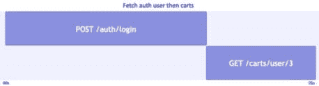
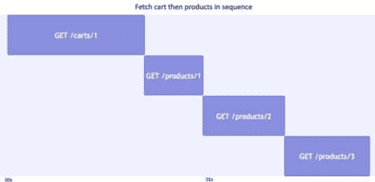
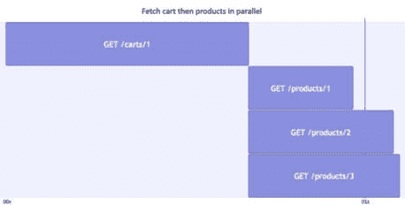

# 7

# 异步编程性能模式

JavaScript 运行时的一个关键优势是事件循环，它将单线程执行模型中的“非阻塞输入/输出”耦合在一起。这意味着只要不是计算密集型系统（即，它们是 I/O 密集型），JavaScript 就非常适合高并发系统。

使用异步和非阻塞 I/O，JavaScript 具有强大的内置功能来编排请求。在本章中，我们将涵盖以下主题：

+   JavaScript 中的顺序和并行异步操作模式，仅使用 Promise 和使用 async/await

+   使用 AbortController 取消和超时 fetch 请求

+   高级异步操作模式：节流、防抖和批处理

在本章结束时，您将能够识别并修复 JavaScript 中异步操作编排可能需要改进的情况。

# 技术要求

您可以在 GitHub 上找到本章的代码文件，网址为 [`github.com/PacktPublishing/Javascript-Design-Patterns`](https://github.com/PacktPublishing/Javascript-Design-Patterns)

# 使用 async/await 和 Promise 控制顺序异步操作

Promise 在 ES2015（ES6）中引入，以及其他现代数据结构。

对于在 ES2015 之前熟悉 JavaScript 的人来说，异步行为是通过基于回调的接口来模拟的，例如，`request(url, (error, response) => { /* do work with response */ })`。Promise 解决的关键问题是异步请求的链式调用和管理并行请求的问题，我们将在本节中介绍。

ES2016 包含了 async/await 语法的基本规范。它建立在 Promise 对象之上，以便编写不涉及“Promise 链”的异步代码，其中不同的 Promise 使用 `Promise().then` 函数进行处理。Promise 功能和 async/await 之间很好地互操作。实际上，调用一个异步函数返回一个 Promise。

我们将首先展示如何使用 Promise 来管理顺序异步操作。我们将使用 Fetch API（它返回一个 Promise）来加载 `fakestoreapi.com/auth/login`。给定用户名和密码，并根据输出，我们将加载该用户的所有相关购物车。随后，我们将使用 `fakestoreapi.com/carts/user/{userId}` 端点来加载该用户的相关购物车。此请求流程在以下图中进行了可视化。



图 7.1：/auth/login 和 /carts/user/{userId} 请求的序列

我们将首先向 `auth/login` 端点发送 POST 请求。我们添加 `.then((res) => res.json())`，这将等待初始 `fetch()` 输出 Promise 解析为“响应”（因此命名为 `res`）。然后我们在响应上调用 `.json()` 方法，这同样是一个 Promise，它解析为 JSON 解码后的响应体：

```js
function fetchAuthUserThenCartsPromiseThen(username,
  password) {
  return fetch('https://fakestoreapi.com/auth/login', {
    method: 'POST',
    body: JSON.stringify({
      username,
      password,
    }),
    headers: {
      'Content-Type': 'application/json',
    },
  }).then((res) => res.json());
}
```

从`res.json()`返回的 Promise 可以在另一个`.then()`回调中访问，在这个回调中我们解析`token`字段，它是一个`jwt-decode`包。

我们从解码的令牌中提取`sub`字段。这是“主题”声明，它告诉我们这个令牌是关于哪个用户的。在`fakestoreapi`令牌的情况下，`userId`被用作“主题”声明。因此，我们可以使用`sub`声明作为在后续 API 调用中加载购物车的用户 ID，即[`fakestoreapi.com/carts/user/`](https://fakestoreapi.com/carts/user/)`{userId}`:

```js
import jwt_decode from 'https://esm.sh/jwt-decode';
function fetchAuthUserThenCartsPromiseThen(username,
  password) {
  return // no change to the fetch() call
    .then((res) => res.json())
    .then((responseData) => {
      const parsedValues = jwt_decode(responseData.token);
      const userId = parsedValues.sub;
      return userId;
    })
    .then((userId) =>
      fetch(`https://fakestoreapi.com/carts/user/${userId}
        ?sort=desc`)
    )
    .then((res) => res.json());
}
```

这个函数可以按以下方式使用。注意，密码不应该存储在生产应用的源代码中（如本例所示）。

当我们调用`fetchAuthUserThenCartsPromiseThen`函数时，它会执行`/auth/login`调用，然后是`/carts/user/{userId}`调用，这意味着我们收到一个包含请求用户相关购物车的数组（注意`userId` = `3`，这是`kevinryan`用户的正确 ID）。

注意，我们在这里使用 async/await 来“扁平化”Promise 输出到`userCartsDataPromiseThen`，我们可以对其断言：

```js
const username = 'kevinryan';
const password = 'kev02937@';
const userCartsDataPromiseThen = await
  fetchAuthUserThenCartsPromiseThen(
  username,
  password
);
assert.deepEqual(userCartsDataPromiseThen, [
  {
    __v: 0,
    date: '2020-01-01T00:00:00.000Z',
    id: 4,
    products: [
      {
        productId: 1,
        quantity: 4,
      },
    ],
    userId: 3,
  },
  {
    __v: 0,
    date: '2020-03-01T00:00:00.000Z',
    id: 5,
    products: [
      {
        productId: 7,
        quantity: 1,
      },
      {
        productId: 8,
        quantity: 1,
      },
    ],
    userId: 3,
  },
]);
```

正如我们在调用`fetchAuthUserThenCartsPromiseThen`的代码中所看到的，async/await 相对于`Promise().then()`链的关键优势是代码结构更类似于同步代码。

在同步代码中，一个操作的输出可以是，例如，分配给一个常量：

```js
const output = syncGetAuthUserCarts();
console.log(output);
```

而在`Promise().then()`中，输出只能在额外的`.then()`回调中访问：

```js
promisifiedGetAuthUserCarts().then((output) => {
  console.log(output);
});
```

`await`允许我们以以下方式结构化代码：

```js
const output = await promisifiedGetAuthUserCarts();
console.log(output);
```

一种思考方式是`await`可以展开 Promise。Promise 的“已解决值”，通常只能在`Promise().then()`回调中访问，可以直接访问。

对于顺序操作，这非常有用，因为它使得代码结构化，每个异步操作都有一个变量赋值集。

`await`运算符在现代运行环境中的 ECMAScript 模块的顶层可用，作为 ES2022 规范的一部分。

然而，为了在函数内部使用`await`，我们需要将函数标记为`async`。这种在`async`函数中使用`await`的用法自 ES2016 以来一直可用。

代码编辑器和 IDE，如 Visual Studio Code，可以将链式`Promise().then()`调用重构为 async/await。在我们的情况下，我们可以构建一个`fetchAuthUserThenCartsAsyncAwait`函数，如下所示。

我们将首先使用`await fetch()`而不是使用`fetch().then(res => res.json())`，然后使用`await authResponse.json()`：

```js
async function fetchAuthUserThenCartsAsyncAwait
  (username, password) {
  const authResponse = await fetch('https://fakestoreapi.com/auth/login', {
    method: 'POST',
    body: JSON.stringify({
      username,
      password,
    }),
    headers: {
      'Content-Type': 'application/json',
    },
  });
  const authData = await authResponse.json();
}
```

我们现在可以访问`authData`。我们可以像之前一样使用`jwt-decode`包解码`authData.token`。这使我们能够访问`sub`（主题）声明，即用户 ID：

```js
Import jwt_decode from 'https://esm.sh/jwt-decode';
async function fetchAuthUserThenCartsAsyncAwait
  (username, password) {
  // no change to /auth/login API call code
  const parsedValues = jwt_decode(authData.token);
  const userId = parsedValues.sub;
}
```

现在我们有了相关的用户 ID，我们可以调用`/carts/user/{userId}`端点来加载用户的购物车：

```js
async function fetchAuthUserThenCartsAsyncAwait
  (username, password) {
  // no change to /auth/login call or token parsing logic
  const userCartsResponse = await fetch(
    `https://fakestoreapi.com/carts/user/${userId}?sort=desc`
  );
  const userCartsResponseData = await userCartsResponse.
    json();
  return userCartsResponseData;
}
```

给定与使用 `Promise().then()` 的方法相同的输入数据，加载的购物车是相同的。请注意，再次强调，密码和凭证不应存储在源代码文件中：

```js
const username = 'kevinryan';
const password = 'kev02937@';
const userCartsDataAsyncAwait = await fetchAuthUserThenCartsAsyncAwait(
  username,
  password
);
assert.deepEqual(userCartsDataAsyncAwait, userCartsDataPromiseThen);
```

这两种方法之间有一个区别是，使用 async/await 时，所有变量都在单个函数作用域中定义，而 `Promise().then()` 方法使用多个函数作用域（对于传递给 `.then()` 的每个回调）。使用单个大函数作用域，变量名不会冲突，这使得代码更加冗长，因为例如，每个 `response` 对象都需要一个限定符来避免变量名冲突，例如 `authResponse` 和 `userCartsResponse`。

单个大函数作用域的好处是，前一个 API 调用的所有输出都可用于后续调用，而无需显式地将它们作为值传递给 `.then()` 中传递的回调函数。

最后，一个特定的 `fetch()` 示例是，由于在执行 `fetch` 和访问 JSON 响应时需要处理多个 Promise，因此 `await` 方法可能会有些“嘈杂”。

请看以下两个示例。首先，使用 async/await，我们为 `fetch` 的 `response` 值分配一个变量：

```js
const response = await fetch(url);
const data = await response.json();
```

接下来，使用 `.then()`，我们只分配一个 `data` 变量，并使用箭头函数来处理 `.json()` 展开操作：

```js
const data = await fetch(url).then((response) => response.json());
```

如您所见，我们的最终示例是 `async/await` 和 `Promise().then()` 的混合，这样代码中最“重要”的部分就显而易见了。我们从 `fetch` 中提取 JSON 输出的具体方法并不一定是我们的逻辑核心，因此可能更好地用 `Promise().then()` 来表达。

通常，这种风格上的细微差别不会发生，因为代码中“不那么重要”的部分，例如我们如何与 fetch API 交互以处理请求到 JSON，往往会抽象化——在这种情况下，在一个某种类型的 HTTP 客户端中。我们预计 HTTP 客户端可以处理检查 `response.ok` 和访问解析后的 JSON 响应体（使用 `response.json()`）。

我们现在已经看到了如何使用仅 Promise 的方法、基于 async/await 的方法以及如何结合使用 async/await 和 Promise 技巧来提高代码的可读性和性能。

# 并行异步操作模式

性能不佳的一个常见原因是运行那些本可以并行完成的操作顺序执行。

例如，一个简单的加载购物车及其包含的产品实现可能如下所示：



图 7.2：从 fakestoreapi 加载购物车及其包含的三个产品

在这种情况下，操作完成时间由以下各项之和组成：

+   **GET /carts/{cartId}** 的请求-响应时间

+   **GET /products/1** 的请求-响应时间

+   **GET /products/2** 的请求-响应时间

+   **GET /products/3** 的请求-响应时间

需要 `/products/{productId}` 调用在 `GET /carts/{cartId}` 调用完成后进行，因为产品 ID 就来自那里。不需要每个产品调用等待前一个调用完成；调用只依赖于 `GET /carts/{cartId}` 调用的数据。这是一个优化机会。我们可以同时开始所有的 `GET /products/{id}` API 调用。我们得到以下序列：



图 7.3：并行加载购物车及其包含的三个产品

在这种情况下，操作完成时间由以下各项的总和组成：

+   **GET /carts/{cartId}** 的请求-响应时间

+   **GET /products/1**、**GET /products/2** 和 **GET /products/3** 之间的最长请求-响应时间

这意味着我们至少节省了两次 API 调用的请求-响应时间。

JavaScript 特别适合这些工作负载，因为它的并发模型基于事件循环。当 JavaScript 等待异步操作完成时，它可以完成其他同步操作。

用通俗易懂的话来说，在 JavaScript 中触发异步操作与在 Java 和 C++ 等流行编程语言中常见的基于线程的并发模型相比，“便宜且轻量”。

JavaScript 中有多种结构允许我们将 Promise 数组转换为解析为数组的 Promise。`Promise.all` 就是其中之一。

实现我们之前描述的场景，即加载购物车然后加载相关产品详情，使用 `Promise.all` 和 `Promise().then` 将如下所示：

首先，我们需要调用 API 来加载购物车并提取响应体中的 JSON：

```js
function fetchCartPromiseThen(cartId = '1') {
  return fetch(`https://fakestoreapi.com/carts/${cartId}`).
    then((res) =>
    res.json()
  );
}
```

一旦加载了 `/carts/{cartId}` URL 的请求，我们就需要设置正确产品 URL 的获取。在获取完成后执行我们代码的模式使用返回的 promise 上的 `.then()`：

```js
function fetchCartPromiseThen(cartId = '1') {
    // no change to previous operations
    .then((cart) => {
      const productUrls = cart.products.map(
        (p) => `https://fakestoreapi.com/products/$
           {p.productId}`
      );
    })
}
```

接下来，我们将使用 `Promise.all` 来使用 `fetch` 加载所有产品 URL。由于我们的目标是返回购物车和产品，我们将 `{ cart }` 作为我们传递给 `Promise.all()` 的数组中的第一个项目。传递给 `Promise.all` 的数组的其余部分将是通过对每个产品 URL 调用 `fetch().then((res) => res.json())` 生成的 Promise。为了做到这一点，我们在数组中的 `...productUrls.map(/* mapping function */)` 上使用展开操作符 (`...`)：

```js
function fetchCartPromiseThen(cartId = '1') {
    // no change to previous operations
    .then((cart) => {
      // no change to productUrls generation
      return Promise.all([
        { cart },
        ...productUrls.map((url) => fetch(url).then
          ((res) => res.json())),
      ]);
    })
}
```

最后，我们将创建一个对象，包含所有购物车字段和一个基于 `/products/{id}` 获取输出的新产品字段：

```js
function fetchCartPromiseThen(cartId = '1') {
    // no change to previous operations
    .then(([prev, ...products]) => {
      return {
        ...prev,
        products,
      };
    });
}
```

我们可以通过加载购物车 ID `1` 来测试函数的输出：

```js
const cartDataFromPromiseThen = await fetchCartPromiseThen
  ('1');
```

购物车正如我们所期望的那样——它返回了三个产品：

```js
assert.deepEqual(cartDataFromPromiseThen.cart, {
  __v: 0,
  date: '2020-03-02T00:00:00.000Z',
  id: 1,
  products: [
    {
      productId: 1,
      quantity: 4,
    },
    {
      productId: 2,
      quantity: 1,
    },
    {
      productId: 3,
      quantity: 6,
    },
  ],
  userId: 1,
});
```

我们响应的 `products` 字段包含正确的项目，位于索引 0、1 和 2 的位置：

```js
assert.deepEqual(cartDataFromPromiseThen.products[0], {
  category: "men's clothing",
  description:
    'Your perfect pack for everyday use and walks in the
     forest. Stash your laptop (up to 15 inches) in the
     padded sleeve, your everyday',
  id: 1,
  image: 'https://fakestoreapi.com/img/
    81fPKd-2AYL._AC_SL1500_.jpg',
  price: 109.95,
  rating: {
    count: 120,
    rate: 3.9,
  },
  title: 'Fjallraven - Foldsack No. 1 Backpack, Fits 15
    Laptops',
});
assert.deepEqual(cartDataFromPromiseThen.
  products[1], {
  category: "men's clothing",
  description:
    'Slim-fitting style, contrast raglan long sleeve, three-button henley placket, light weight & soft fabric for breathable and comfortable wearing. And Solid stitched shirts with round neck made for durability and a great fit for casual fashion wear and diehard baseball fans. The Henley style round neckline includes a three-button placket.',
  id: 2,
  image:
    'https://fakestoreapi.com/img/
       71-3HjGNDUL._AC_SY879._SX._UX._SY._UY_.jpg',
  price: 22.3,
  rating: {
    count: 259,
    rate: 4.1,
  },
  title: 'Mens Casual Premium Slim Fit T-Shirts ',
});
assert.deepEqual(cartDataFromPromiseThen.products[2], {
  category: "men's clothing",
  description:
    'great outerwear jackets for Spring/Autumn/Winter, suitable for many occasions, such as working, hiking, camping, mountain/rock climbing, cycling, traveling or other outdoors. Good gift choice for you or your family member. A warm hearted love to Father, husband or son in this thanksgiving or Christmas Day.',
  id: 3,
  image: 'https://fakestoreapi.com/img/
    71li-ujtlUL._AC_UX679_.jpg',
  price: 55.99,
  rating: {
    count: 500,
    rate: 4.7,
  },
  title: 'Mens Cotton Jacket',
});
```

我们现在已经看到如何利用 `Promise.all` 并行运行多个承诺，并使用一个处理程序处理它们的输出。

你可能已经注意到了我们在 `Promise.all` 中传递 `{ cart }` 对象并从中提取解析数组的第一个项作为上一个响应的“技巧”。正如在 *使用 async/await 和 Promises 控制顺序异步操作* 部分中提到的，这是 `Promise().then()` 链接的限制，每个 `.then()` 函数参数都有自己的作用域：

```js
Promise.resolve({ id: 1 })
  .then((cart) => {
    const productUrls = [];
    return Promise.all([{ cart }, ...productUrls.map(()
      => {})]);
  })
  .then(([prev, ...products]) => {});
```

写这个的另一种方法是存储购物车在函数作用域中：

```js
function fetchCartFunctionVariable() {
  let loadedCart = null;
  return Promise.resolve({ id: 1 })
    .then((cart) => {
      loadedCart = cart;
      const productUrls = [];
      return Promise.all(productUrls.map(() => {}));
    })
    .then((products) => ({
      cart: loadedCart,
      products,
    }));
}
```

这按预期工作。显然，我们已经从 API 中移除了实际的购物车和产品获取逻辑，但与 `{ id: 1 }` 相关的购物车，我们在初始 `Promise.resolve()` 函数调用中解析，是通过 `.then()` 调用缓存的：

```js
assert.deepEqual(await fetchCartFunctionVariable(), {
  cart: { id: 1 },
  products: [],
});
```

另一种在不使用可能难以跟踪的函数作用域变量的情况下改进我们的实现的方法是将它转换为使用 async/await。

我们的逻辑如下。我们首先加载购物车并将 JSON 响应体转换为：

```js
async function fetchCartAsyncAwait(cartId = '1') {
  const cart = await fetch(`https://fakestoreapi.com/carts/${cartId}`).then(
    (res) => res.json()
  );
}
```

一旦加载了购物车，我们就通过根据 `cart.products` 内容（主要是 `productId` 字段）生成 URL 来获取相关产品。我们也使用 `Promise.all` 获取这些 URL：

```js
async function fetchCartAsyncAwait(cartId = '1') {
  // no change to cart fetching
  const productUrls = cart.products.map(
    (p) => `https://fakestoreapi.com/products/${p.productId}`
  );
  const products = await Promise.all(
    productUrls.map((url) => fetch(url).then((res)
      => res.json()))
  );
}
```

最后，我们可以返回购物车和加载的产品：

```js
async function fetchCartAsyncAwait(cartId = '1') {
  // no changes to cart or products fetching
  return {
    cart,
    products,
  };
}
```

实现与我们的之前基于严格 `Promise().then()` 的实现等效，如下检查所证明：

```js
const cartDataFromAsyncAwait = await fetchCartAsyncAwait
  ('1');
assert.deepEqual(cartDataFromPromiseThen.cart,
  cartDataFromAsyncAwait.cart);
assert.deepEqual(
  cartDataFromPromiseThen.products,
  cartDataFromAsyncAwait.products
);
```

在这种情况下使用 async/await 的好处是，再次提高了可读性。语法比链式 `.then()` 调用更不阻碍，我们不必返回 `Promise.all([{ cart }])` 中的第一个响应作为一个项，也不必添加一个存储购物车的函数作用域变量。

我们现在已经看到如何利用 `Promise.all` 来并行完成异步操作，无论是使用 `Promise().then()` 独家方法，还是通过审慎重构为 `async/await` 以简化代码。

接下来，我们将看到如何使用 JavaScript 中的 `AbortController` 取消和超时请求。

# 使用 AbortController 的异步取消和超时

应用程序中性能不佳的另一个原因是执行不必要的操作。在 JavaScript 网络应用程序的上下文中，可能是不必要的“工作”（因此会降低性能）之一是存在不再需要的 HTTP 请求。例如，在一个相册系统或任何分页系统中，当浏览照片时，上一个照片的请求可能还没有完成，下一个请求就已经开始。在这种情况下，之前的请求数据不再必要，因为我们实际上已经完全在不同的页面上。

在这些情况下，取消请求可能是有用的。

`AbortController` 是一个 Web/DOM API，允许我们取消网络请求。它是通过其构造函数 `new AbortController` 创建的，控制请求（可能取消它）是通过 `AbortController().signal` 值完成的，该值是一个 `AbortSignal` 对象。

我们使用 `new AbortController()` 构造函数调用实例化控制器。如果我们想使 `fetch` 调用可取消，我们将 `abortController.signal` 作为 `signal` 选项传递：

```js
function fetchWithCancel(url) {
  const abortController = new AbortController();
  const response = fetch(url, { signal:
    abortController.signal }).then((res) =>
    res.json()
  );
  return {
    response,
  };
}
```

如果我们想取消 `fetch` 请求，我们可以调用 `abortController.cancel`。我们将将其作为 `cancel` 函数添加到 `fetchWithCancel` 返回的输出中：

```js
function fetchWithCancel(url) {
  // no changes to contents
  return {
    // no changes to other keys in the object
    cancel: () => abortController.abort(),
  };
}
```

最后，我们需要确保当我们看到 `AbortError` 时，我们能够处理它。在这种情况下，我们将使用 `Promise().catch` 处理器来处理它，当看到 `AbortError` 时，将返回 `'Aborted'`，否则重新抛出错误。

`AbortError` 错误实例有一个名称属性等于 `'AbortError'`，但还有一个如 `DOMException [AbortError]: This operation was aborted` 的消息，以及其堆栈跟踪：

```js
function fetchWithCancel(url) {
  // no change to abortController initiationisalition
  const response = fetch(url, { signal: abortController.signal })
    .then((res) => res.json())
    .catch((err) => {
      if (err.name === 'AbortError') return 'Aborted';
      throw err;
    });
  // no change to return value
}
```

给定对 fakestoreapi 的两个 API 调用，`/products/1` 和 `/products/2`，我们可以取消其中一个而不影响另一个请求，如下所示，通过调用 `fetchWithCancel` 并将两个 URL 存储在两个变量中。注意，我们还没有使用 `await`。

然后，我们可以使用我们之前构建的 `.cancel()` 函数取消对 `/products/1` 的获取：

```js
const fetchProduct1 = fetchWithCancel
  ('https://fakestoreapi.com/products/1');
const fetchProduct2 = fetchWithCancel('https://fakestoreapi.com/products/2');
fetchProduct1.cancel();
```

结果是，当我们等待 `fetchProduct1.response` 和 `fetchProduct2.response` 时，`fetchProduct1.response` 的输出是 `'Aborted'`，这意味着在 `fetchWithCancel` 中处理了一个 `AbortError` 实例（即，我们的取消成功）。

`fetchProduct2.response` 的输出是产品对象：

```js
assert.deepEqual(await fetchProduct1.response, 'Aborted');
assert.deepEqual(await fetchProduct2.response, {
  category: "men's clothing",
  description:
    'Slim-fitting style, contrast raglan long sleeve, three-button henley placket, light weight & soft fabric for breathable and comfortable wearing. And Solid stitched shirts with round neck made for durability and a great fit for casual fashion wear and diehard baseball fans. The Henley style round neckline includes a three-button placket.',
  id: 2,
  image:
    'https://fakestoreapi.com/img
      /71-3HjGNDUL._AC_SY879._SX._UX._SY._UY_.jpg',
  price: 22.3,
  rating: {
    count: 259,
    rate: 4.1,
  },
  title: 'Mens Casual Premium Slim Fit T-Shirts ',
});
```

手动取消请求是有用的，但更广泛的使用场景是在请求超过一定时间后超时。这对于确保客户有响应式的用户体验很有用。不同的情况需要更长或更短的超时延迟。

我们可以使用 `fetch`、`AbortController` 和 `setTimeout` 实现一个 `fetchWithTimeout` 函数。

我们的功能接受一个 URL 和一个可选的超时时间，我们将默认设置为 `500`（500 毫秒）。类似于我们的手动取消场景（见 `fetchWithCancel`），我们将创建一个 `abortController` 对象，并将它的 `signal` 属性作为选项传递给 `fetch`：

```js
async function fetchWithTimeout(url, timeout = 500) {
  const abortController = new AbortController();
  return fetch(url, { signal: abortController.signal });
}
```

为了在一段时间后取消获取，我们将使用 `setTimeout`。`setTimeout` 处理器将简单地调用 `abortController.abort()`，我们将超时延迟设置为我们的 `timeout` 变量：

```js
async function fetchWithTimeout(url, timeout = 500) {
  // no change to abortController
  setTimeout(() => {
    abortController.abort();
  }, timeout);
  // no change to fetch call or return
}
```

当请求完成所需时间少于 `fetch` 请求所需时间时，我们收到响应数据：

```js
const timedoutFetchShouldSucceedData = await fetchWithTimeout(
  'https://fakestoreapi.com/products/1',500
)
  .then((res) => res.json())
  .catch((error) => {
    if (error.name === 'AbortError') {
      return 'Aborted';
    }
    throw error;
  });
console.assert(
  timedoutFetchShouldSucceedData.id === 1,
  'fetchWithTimeout with 500ms timeout should have
    succeeded'
);
```

当 `fetch` 请求超过配置的超时时，我们收到一个 `AbortError` 实例：

```js
const timedoutFetchShouldAbort = await fetchWithTimeout(
  'https://fakestoreapi.com/products/1',10
)
  .then((res) => res.json())
  .catch((error) => {
    if (error.name === 'AbortError') {
      return 'Aborted';
    }
    throw error;
  });
console.assert(
  timedoutFetchShouldAbort === 'Aborted',
  'fetchWithTimeout with 10ms timeout should have
    aborted but did not'
);
```

我们现在已经看到了如何使用 `AbortController` 手动控制 `fetch` 取消以及如何用它创建一个“带超时”的实用工具。我们可以使用 `AbortController` 来取消不再需要的操作，从而减少网络使用。

接下来，我们将探讨可以帮助优化高请求量情况的更多模式。

# 节流、防抖和批量处理异步操作

节流是一种操作，在达到一定时间之前会丢弃请求。例如，对于 10 毫秒的节流超时，一旦发起一个请求，在接下来的 10 毫秒内不会发送任何请求。如果在 0 毫秒到 10 毫秒之间发起多个请求，只有 10 毫秒超时到期后发送的最后一个请求会被发送。

在 JavaScript 中，这样的节流函数可以如下实现。

高阶函数 `throttle` 接受一个 `fn` 参数并返回一个具有与 `fn` 参数相同输入签名的可执行函数。

当“节流”的 `fn` 函数被调用时，我们设置 `isThrottled = true` 以便能够在第一次调用和配置的超时之间丢弃调用：

```js
function throttle(fn, timeout) {
  let isThrottled = false;
  return (...args) => {
    isThrottled = true;
    return fn(...args);
  };
}
```

现在，我们需要确保在 `isThrottled` 为 `true` 时 `fn` 不会被调用。我们通过从返回的“节流”`fn` 函数中提前返回来实现这一点。

我们保存了“节流”的 `fn` 函数被调用时的参数，以便在超时到期时使用：

```js
function throttle(fn, timeout) {
  // no change to existing variable definitions
  let lastCallArgs = null;
  return (...args) => {
    if (isThrottled) {
      lastCallArgs = args;
      return;
    }
    // no change to "initial call" case
  };
}
```

最后，我们配置 `setTimeout` 以触发节流状态的重置并执行最后的函数调用：

```js
function throttle(fn, timeout) {
  // no change to existing variable definitions
  return (...args) => {
    // no change to short-circuit logic
    setTimeout(() => {
      isThrottled = false;
      return fn(...lastCallArgs);
    }, timeout);
    // no change to "initial call" case
  };
}
```

使用的一个简单例子如下场景，其中在给定时间内可能会发送许多消息。相反，我们希望以每 1 毫秒间隔发送 1 条消息。

我们的 `storeMessage` 函数如下：

```js
let messages = [];
const storeMessage = (message) => {
  messages.push(message);
};
```

我们可以生成一个具有 1 毫秒超时的 `throttledStoreMessage` 函数如下。

当同步调用十次并随后等待计时器完成时，只有第一次（`'throttle-1'`）和最后一次（`'throttle-10'`）调用被记录：

```js
const throttledStoreMessage = throttle(storeMessage, 1);
throttledStoreMessage('throttle-1');
throttledStoreMessage('throttle-2');
throttledStoreMessage('throttle-3');
throttledStoreMessage('throttle-4');
throttledStoreMessage('throttle-5');
throttledStoreMessage('throttle-6');
throttledStoreMessage('throttle-7');
throttledStoreMessage('throttle-8');
throttledStoreMessage('throttle-9');
throttledStoreMessage('throttle-10');
await timeout();
assert.deepEqual(messages, ['throttle-1', 'throttle-10']);
function timeout(ms = 0) {
  return new Promise((r) => setTimeout(r, ms));
}
```

如果我们在 `'throttle-5'` 的调用后重置消息并等待计时器完成，我们将以 `['throttle-1', 'throttle-5', 'throttle-6']` 结束，即第一次调用，以及计时器清除前后的调用。

如果我们在完成所有调用后再次清除计时器，`'throttle-10'` 也会出现在我们的消息列表中，这意味着调用已完成：

```js
messages = [];
throttledStoreMessage('throttle-1');
throttledStoreMessage('throttle-2');
throttledStoreMessage('throttle-3');
throttledStoreMessage('throttle-4');
throttledStoreMessage('throttle-5');
await timeout();
throttledStoreMessage('throttle-6');
throttledStoreMessage('throttle-7');
throttledStoreMessage('throttle-8');
throttledStoreMessage('throttle-9');
throttledStoreMessage('throttle-10');
assert.deepEqual(messages, ['throttle-1', 'throttle-5', 'throttle-6']);
await timeout();
assert.deepEqual(messages, [
  'throttle-1',
  'throttle-5',
  'throttle-6',
  'throttle-10',
]);
```

我们已经看到了如何节流一个函数。现在我们可以看看防抖。

JavaScript 中的 `debounce` 函数接受一个 `fn` 参数，它是一个函数。目标是使防抖的 `fn` 函数在经过一个 `timeout` 期间未被调用时，丢弃所有调用，除了最后的调用。

为了做到这一点，我们应该“延迟”函数调用直到超时完成之后。我们保存 `timeoutId` 引用，以便在防抖的 `fn` 函数再次被调用时取消调用。我们使用 `setTimeout` 并传递防抖的 `fn` 函数被调用的参数：

```js
function debounce(fn, timeout) {
  let timeoutId;
  return (...args) => {
    timeoutId = setTimeout(() => {
      fn(...args);
    }, timeout);
  };
}
```

在当前`debounce`函数的状态下，对`fn`的调用次数将与对去抖动`fn`函数的调用次数一样多；它们只是根据超时时间被排队延迟执行。为了避免这种情况，我们可以使用`clearTimeout(timeoutId)`来取消之前的调用超时：

```js
function debounce(fn, timeout) {
  // no change to variable declarations
  return (...args) => {
    clearTimeout(timeoutId);
    // no change to setTimeout logic
  };
}
```

在这些更改到位后，如果我们创建一个具有 1 毫秒超时的`debouncedStoredMessage`函数并调用它 10 次，它将不会执行，直到我们等待计时器完成：

```js
messages = [];
const debouncedStoredMessage = debounce(storeMessage, 1);
debouncedStoredMessage('debounce-1');
debouncedStoredMessage('debounce-2');
debouncedStoredMessage('debounce-3');
debouncedStoredMessage('debounce-4');
debouncedStoredMessage('debounce-5');
debouncedStoredMessage('debounce-6');
debouncedStoredMessage('debounce-7');
debouncedStoredMessage('debounce-8');
debouncedStoredMessage('debounce-9');
debouncedStoredMessage('debounce-10');
assert.deepEqual(messages, []);
await timeout();
assert.deepEqual(messages, ['debounce-10']);
```

我们可以通过等待第五次调用后的计时器完成来进一步展示这一点。在这种情况下，第五次调用将触发，并且，如果另一个超时窗口清除，第十次调用也将触发：

```js
messages = [];
debouncedStoredMessage('debounce-1');
debouncedStoredMessage('debounce-2');
debouncedStoredMessage('debounce-3');
debouncedStoredMessage('debounce-4');
debouncedStoredMessage('debounce-5');
await timeout();
debouncedStoredMessage('debounce-6');
debouncedStoredMessage('debounce-7');
debouncedStoredMessage('debounce-8');
debouncedStoredMessage('debounce-9');
debouncedStoredMessage('debounce-10');
assert.deepEqual(messages, ['debounce-5']);
await timeout();
assert.deepEqual(messages, ['debounce-5', 'debounce-10']);
```

我们现在已经看到了如何节流和去抖动函数，这允许我们确保操作不会触发不必要的次数。

在一个“边打字边搜索”或“边打字边建议”的输入场景中（有时被称为“预测输入”），需要通过 API 请求获取搜索结果或建议，通常在使用`debounce`等待用户停止打字后再发送请求，或者节流请求，以便在窗口中而不是每次按键时发送 API 请求。

这也可以与其他启发式方法结合使用，以避免因不必要的请求而使 API 服务器过载。例如，通常在输入几个字符之前避免发送请求，因为只有 1 个或 2 个字符的搜索请求太宽泛。

我们已经看到了如何通过节流或去抖动减少请求数量来保护 API。在*并行异步操作模式*部分，我们使用了`Promise.all`来并行发送请求。这也可以是异步操作目标可能过载的另一个场景。为了避免过载情况，批量请求可能很有用。

“批量处理”是一种限制并发的方式，例如，我们不想同时发送 20 个请求（并行），而是一次发送 5 个。

`batch`函数接受一个数组和批量大小，并返回一个数组的数组。嵌套数组的最长长度为“批量大小”。

我们首先计算在`batches`数组中我们需要多少个`batchItem`列表项。为了做到这一点，我们将输入数组的长度除以批量大小，并应用`ceil`函数到该值。换句话说，我们将`inputLength`除以`batchSize`向上取整到下一个最大的整数值。

然后，我们可以使用正确的尺寸（`batchCount`，如计算所得）生成我们的`batches`数组：

```js
function batch(inputArray, batchSize) {
  const batchCount = Math.ceil(inputArray.length /
    batchSize);
  const batches = Array.from({ length: batchCount });
}
```

然后，我们使用`Array.prototype.map()`遍历每个批次。`batches`中的项最初是未定义的，但我们使用项的索引（我们将称之为`batchNumber`）。对于`batches`中的每个项，我们从`batchNumber * batchSize`到`(batchNumber + 1) * batchSize`取项，它们构成了我们的`batches[batchNumber]`数组项的内容：

```js
function batch(inputArray, batchSize) {
  // no change to existing size computations
  return batches.map((_, batchNumber) => {
    return inputArray.slice(
      batchNumber * batchSize,
      (batchNumber + 1) * batchSize
    );
  });
}
```

你会注意到我们使用 `Array.from` 生成数组，然后使用 `Array.prototype.map()` 来填充它，然而，`Array.from()` 支持第二个参数，即映射函数。因此，我们的代码可以是以下这样：

```js
function batch(inputArray, batchSize) {
  const batchCount = Math.ceil(inputArray.length /
    batchSize);
  return Array.from({ length: batchCount }, (_,
    batchNumber) => {
    return inputArray.slice(
      batchNumber * batchSize,
      (batchNumber + 1) * batchSize
    );
  });
}
```

无论如何，我们的 `batch` 函数适用于任何数组，例如，一个 10 个元素的数组可以通过我们的函数正确地分批为 4 或 3 个块：

```js
assert.deepEqual(batch([1, 2, 3, 4, 5, 6, 7, 8, 9, 10, 11], 4), [
  [1, 2, 3, 4],
  [5, 6, 7, 8],
  [9, 10, 11],
]);
assert.deepEqual(batch([1, 2, 3, 4, 5, 6, 7, 8, 9, 10, 11], 3), [
  [1, 2, 3],
  [4, 5, 6],
  [7, 8, 9],
  [10, 11],
]);
```

之前的示例展示了同步示例。对于我们的用例——提高异步操作的性能，我们需要处理 Promise。好消息是 Promise 可以像数组一样存储：

```js
const numberResolverBatches = batch(
  [Promise.resolve(1), Promise.resolve(2), Promise.resolve(3)],
  2
);
console.assert(numberResolverBatches.length === 2);
console.assert(numberResolverBatches[0].length === 2);
console.assert(numberResolverBatches[1].length === 1);
```

然而，要获取 Promise 的批处理输出，我们需要编写一个函数，该函数等待每个批次中的所有 Promise 以顺序解决它们。

这可以通过使用 `for ... of` 循环和 `Promise.all` 来实现，如下所示。我们将解析的值展开：

```js
async function resolveBatches(batchedPromises) {
  const flattenedBatchOutput = [];
  for (const batch of batchedPromises) {
    const resolved = await Promise.all(batch);
    flattenedBatchOutput.push(...resolved);
  }
  return flattenedBatchOutput;
}
const batchOutput = await resolveBatches(numberResolverBatches);
assert.deepEqual(batchOutput, [1, 2, 3]);
```

在我们的示例中，使用 `Promise.resolve()` 调用 `1`、`2` 和 `3` 的确可以批量处理并解决。

我们现在已经看到了如何构建和使用节流、去抖和批处理来提高 JavaScript 中异步操作的性能。

# 摘要

在本章中，我们介绍了使用 Promise 和 async/await 的异步操作编排模式，以管理顺序和并行操作。我们还介绍了高级模式，如请求取消、实现超时、节流和去抖之间的区别，以及如何在异步操作上下文中使用批处理。

为了管理顺序的异步操作，我们可以使用基于 Promise 的方法 `Promise().then()`、async/await，或者混合这两种方法。这有助于保持我们的代码简单，易于推理。对于并行执行，我们可以利用 `Promise.all()` 与 `Promise.then()` 或 async/await。我们还有多种方法来维护异步操作之间的响应数据。

我们可以利用 `AbortController` 来取消请求。我们使用 `AbortController` 和 `setTimeout` 实现了对 `fetch` 响应时间的超时处理。停止正在进行的请求是一个有用的清理步骤，可以通过减少对 API 原始服务的不必要负载来提高性能。

最后，高级异步编程模式通过节流和去抖减少请求的发生。我们还可以通过批处理和解决批次来控制并行请求的并发性。这些方法可以减少不必要的网络流量和对 API 服务器的负载。

现在我们已经涵盖了异步编程性能模式，包括 Promise、async/await 和高级模式，我们可以看看 JavaScript 事件驱动编程的模式。
