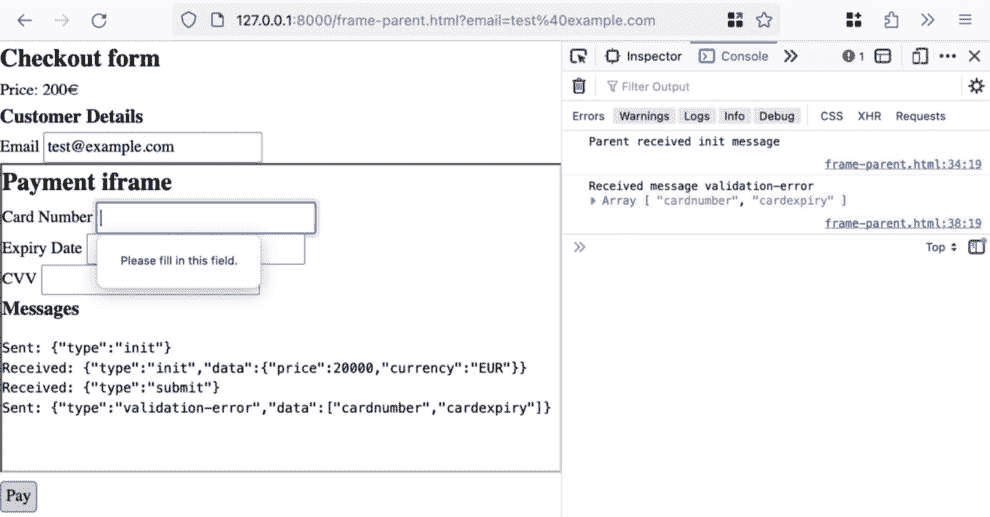

# 事件驱动编程模式

JavaScript 中的事件驱动编程非常普遍，并且是处理某些场景的唯一方式。在事件监听器周围维护性能和安全至关重要。管理不善的事件监听器一直是历史性的错误来源和关键性能问题；我们将通过事件委托模式解决这个问题。在支付环境中，帧和上下文之间的安全消息传递始终至关重要。最近，Web 平台和 JavaScript 正在添加新的原语，这些原语暴露了一个事件/消息接口，用于在上下文之间保持隔离。

在本章中，我们将涵盖以下主题：

+   实现事件委托

+   使用**postMessage**接口在上下文之间进行通信，以下是一个支付 iframe 的示例

+   常见的事件监听器反模式及其修复方法

在本章结束时，您将学会如何使用 JavaScript 中高级的事件驱动编程概念来保持代码的性能和安全性。

# 技术要求

您可以在 GitHub 上找到本章的代码文件，链接为[`github.com/PacktPublishing/Javascript-Design-Patterns`](https://github.com/PacktPublishing/Javascript-Design-Patterns)

# 通过事件委托优化事件监听器

事件委托是一种常见的事件监听器模式，用于从“许多元素，许多事件监听器”转换为“许多元素，单个事件监听器”。在其核心，事件委托将一个事件监听器附加到页面的`Document`上，并在该监听器内部检查事件的`target`，以确定如何处理该事件。

事件委托意味着附加的监听器更少。每个根节点只有一个；如果我们是在文档级别进行事件委托，那么意味着只有一个监听器。另一个好处是，可以在不担心添加或删除相关事件监听器的情况下添加和删除 DOM 节点。

以下序列图详细说明了监听两个按钮点击的实现。


图 8.1：没有事件委托的事件处理

没有事件委托的事件处理可以与事件委托序列进行对比，后者不是为每个事件/元素附加一个处理程序，而是附加一个处理程序并在单个监听器中计算相关操作。


图 8.2：使用事件委托的事件处理

我们将实现一个简单的邮件订阅表单的事件委托，该表单通过客户端 JavaScript 使用`fetch`提交。首先，我们将开始布局一个表单。我们有一个带有`data-newsletter-form`属性的表单，我们将在 JavaScript 中获取它，一个标题，一个标签，一个电子邮件输入框和一个提交按钮：

```js
<form data-newsletter-form>
  <h3>Subscribe to the newsletter!</h3>
  <div>
    <label for="email">Email</label>
    <input
      id="email"
      type="email"
      name="email"
      placeholder="test@example.com"
    />
  </div>
  <button type="submit">Submit</button>
</form>
```

要从事件委托的事件部分开始，我们向文档添加一个点击监听器。这个监听器根据`event.target.tagName`进行切换；`tagName`取大写值，如`P`、`BUTTON`和`DIV`。为了使代码更容易理解，我们将切换到`tagName`的小写版本：

```js
<script>
  document.addEventListener('click', (event) => {
    switch (event.target.tagName?.toLowerCase()) {
    }
  });
</script>
```

当我们检测到按钮元素的点击时，然后检查`event.target`是否在表单内，`event.target`是否为`submit`类型，以及包含事件目标元素的表单是否在其`dataset`中包含`newsletterForm`，换句话说，它是否有`data-newsletter-form`。在这种情况下，我们调用`event.preventDefault`。我们将使用 JavaScript 处理表单提交。

我们通过更改事件目标按钮的内容（到`Submitting`）并设置`disabled`属性来向用户提供反馈，表明表单正在提交，这样在处理程序执行完成之前，表单就不能再次提交：

```js
<script>
  document.addEventListener('click', (event) => {
    switch (event.target.tagName?.toLowerCase()) {
      case 'button': {
        const form = event.target.closest('form');
        if (
          form &&
          event.target.type === 'submit' &&
          'newsletterForm' in form.dataset
        ) {
          event.preventDefault();
          const formValues = new FormData(form);
          event.target.innerText = 'Submitting';
          event.target.setAttribute('disabled',
            'disabled');
          const email = formValues.get('email');
          return;
        }
      }
    }
  });
</script>
```

当我们点击**提交**按钮时，它现在被禁用，其内容设置为**提交中**。


图 8.3：当点击提交按钮时，它被禁用，文本变为提交中

现在，我们将处理提交新闻通讯表单。为了做到这一点，我们需要一个基于`fetch`的函数，该函数将`POST`给定的`email`参数到`jsonplaceholder.typicode.com/users`。然后我们等待`fetch`承诺，并使用`res.json()`提取 JSON 响应：

```js
<script>
  async function submitNewsletterSubscription(email) {
    const res = await fetch
      ('https://jsonplaceholder.typicode.com/users', {
      method: 'POST',
      body: JSON.stringify({
        email,
      }),
      headers: {
        'Content-type': 'application/json; charset=UTF-8',
      },
    });
    return res.json();
  }
  // no change to the document "click" event listener
</script>
```

现在，我们将扩展`button`的`type=submit`处理程序，以调用`submitNewsletterSubscription`。`email`值来自`formValues.get('email')`（表单的电子邮件字段）。当`submitNewsletterSubscription`成功完成（即 Promise 解析）时，我们将重置`submit`按钮以具有`disabled`属性：

```js
<script>
  document.addEventListener('click', (event) => {
    switch (event.target.tagName?.toLowerCase()) {
      case 'button': {
        const form = event.target.closest('form');
        if (
          form &&
          event.target.type === 'submit' &&
          'newsletterForm' in form.dataset
        ) {
          // no change to existing logic
          const email = formValues.get('email');
          submitNewsletterSubscription(email).then((result) => {
            event.target.innerText = 'Submit';
            event.target.removeAttribute('disabled');
          });
        }
        return;
      }
    }
  });
</script>
```

为了突出显示请求/响应，我们将在我们的页面上添加一个`storeLogEvent`函数和一个 API 请求/响应日志：

```js
<div style="height: 300px; overflow: scroll">
  <h3>API Request/Response Log</h3>
  <pre><code></code></pre>
</div>
<script>
  // no change to other functionality
  function storeLogEvent(value) {
    $requestLog = document.querySelector('pre code');
    $requestLog.innerText += value;
    $logParent = $requestLog.closest('div');
    $logParent.scrollTo({ top: $logParent.scrollTopMax,
      behavior: 'smooth' });
  }
</script>
```

我们可以在调用`submitNewsletterSubscription`之前和之后使用`storeLogEvent`：

```js
// -> inside the listener
// -> switch
// -> case 'button'
// -> if (form in ancestors && button type === submit &&
   form has data-newsletter-form)
const email = formValues.get('email');
storeLogEvent(`Request: ${email}`);
submitNewsletterSubscription(email).then((result) => {
  storeLogEvent(`\nResponse: ${JSON.stringify(result,
    null, 2)}\n\n`);
  event.target.innerText = 'Submit';
  event.target.removeAttribute('disabled');
});
```

现在，当我们点击`POST`到`jsonplaceholder`并收到响应时，正如我们可以在以下屏幕截图中所见：


图 8.4：当我们输入电子邮件并点击提交时，API 响应被显示

为了展示在 DOM 元素可以动态添加的情况下事件委托的优势，我们将创建一个**添加表单**按钮，该按钮将向文档中附加一个额外的新闻通讯表单。

首先，我们添加一个带有`data-add-form`的`button`，我们将使用数据属性来检测和处理按钮的点击。

```js
data-add-form attribute by adding if ('addForm' in event.target.dataset). For now, we’ll return early to prevent any further handling code from executing:

```

<script>

document.addEventListener('click', (event) => {

switch (event.target.tagName?.toLowerCase()) {

case 'button': {

if ('addForm' in event.target.dataset) {

return;

}

// 对新闻通讯表单处理没有变化

}

}

});

</script>

```js

 We want to implement the add form functionality, and we want to find a `data-newsletter-form` element and clone it using `.cloneNode(true)`.
We’ll append a random number inside the heading so we can identify when new forms are added and reset the email input. Finally, we append the new node to the `document.body` element using `.appendChild`:

```

<script>

document.addEventListener('click', (event) => {

switch (event.target.tagName?.toLowerCase()) {

case 'button': {

if ('addForm' in event.target.dataset) {

const $newsletterFormTemplate = document.

querySelector(

'[data-newsletter-form]',

);

const newForm = $newsletterFormTemplate.

cloneNode(true);

newForm.querySelector('h3').innerText += `

(${Math.floor(

Math.random() * 100,

)})`;

newForm.querySelector('[name=email]').value = '';

document.body.appendChild(newForm);

return;

}

// 表单处理无变化

}

}

});

</script>

```js

 With no changes to the handling of the newsletter form submission, the cloned form functions just as the initial one does.


Figure 8.5: The effect of submit on multiple forms, one of which was added with an Add a form! button
We’ve now seen how to implement event delegation to prevent having to add event listeners manually to dynamically added DOM nodes. Next, we’ll look at patterns that use the `postMessage` interface between iframes.
Patterns for secure frame/native WebView bridge messaging
Gaining a deep understanding of messaging patterns with `postMessage` in JavaScript is crucial for working in a variety of contexts. `postMessage` is defined on the following Web API objects: `Window`, `MessagePort`, `Worker`, `Client`, `ServiceWorker`, and `BroadcastChannel`.
In other words, `postMessage`-based messaging is useful for document-to-iframe, iframe-to-iframe, document-to-worker, and service worker-to-document communication and that’s only the Web APIs. Due to how widespread the `postMessage` API is, it’s also adopted in non-standard APIs for handling multiple JavaScript contexts. For example, web extensions for Chrome and Firefox contain multiple JavaScript contexts: the devtools panel, proxy, backend, and background script. The `postMessage` API is also used for Android and iOS communication between the native code and WebViews.
The scenario that we’ll go through is about iframes and how they communicate. A common e-commerce use-case is integrating a third-party payment service provider’s hosted card capture form into their e-commerce website. By using a payment service provider and not knowing the customer’s card payment details, the e-commerce vendor can meet **Payment Card Industry Data Security Standard** (**PCI DSS**) compliance more easily.
The container or parent document will be a checkout form, inside of which we’ll iframe a hosted card capture document. The two documents will communicate with `postMessage`. The container document will not read the card details in cleartext. Instead, it will receive a public-key encrypted payload (which can only be decrypted via the paired private key).
Without being careful, it’s possible for `iframe` initialization to cause race conditions. To work around this, we’ll implement the following initialization scheme.
Initially, we’ll load a container document with an `iframe` that has no `src`. Only after we’ve added important event listeners to the `iframe` element, will we add `src`. This means that the `iframe` can’t load before our listeners are attached.


Figure 8.6: Sequence diagram of initialization messaging
We need two files, one at `frame-parent.html` (which will be our application shell) and one at `frame-content.html` (which will represent our iframe’s contents).
Some payment service provider integrations won’t require a fully custom `iframe` (sometimes, a JavaScript SDK is provided that helps manage the `iframe` part of it), but the important thing is that the `iframe` is loaded from an origin (server) that is owned by the payment service provider. We won’t be able to represent this since we’re working locally.
Our `frame-parent.html` HTML looks as follows: a few headings, a `form`, an `input type=email`, an `iframe`, and a submit button. Note that the `iframe` element doesn’t have a `src` attribute. We’ll add that via JavaScript to prevent race conditions:

```

<form>

<h2>结账表单</h2>

<div>

<span>价格: <span>200</span>€</span>

</div>

<div>

<h3>客户详情</h3>

<div>

<label for="email">电子邮件</label>

<input id="email" type="email" name="email"

required="required" />

</div>

</div>

<div>

<iframe id="payment-capture" width="100%"

height="300px"></iframe>

</div>

<div>

<button type="submit">支付</button>

</div>

</form>

```js

 To prevent race conditions when loading the `iframe`, we haven’t set the `src` in the HTML. We want to prevent situations where the `iframe` could load before we’ve attached a `load` event handler to it.
We start by adding a `message` event listener to the container window:

```

<script>

window.addEventListener('message', (event) => {

if (event?.data) {

const { type, data } = JSON.parse(event?.data);

switch (type) {

case 'init': {

console.log('父窗口接收初始化消息');

return;

}

}

}

});

</script>

```js

 Next, we’ll select the payment capture `iframe` and add a `load` event listener to the iframe element. Our handler will send an `init` message with some data to the `iframe` element’s `contentWindow`:

```

<script>

// 事件监听器无变化

const $paymentCaptureIframe = document.querySelector

('#payment-capture');

// iframe 加载时，我们将发送一条消息

$paymentCaptureIframe.addEventListener('load', () => {

$paymentCaptureIframe.contentWindow.postMessage(

JSON.stringify({ type: 'init', data: { price: 20000,

currency: 'EUR' } }),

);

});

</script>

```js

 Finally, we can set the `iframe` element’s `src` attribute so that it loads:

```

<script>

// 消息和 iframe 加载监听器无变化

$paymentCaptureIframe.setAttribute(

'src',

new URL('/frame-content.html', window.location.origin),

);

</script>

```js

 We now need to implement the `frame-content.html` file to receive the message we sent. Our `iframe`, again is mostly a heading and a form with multiple fields. We have `type=hidden` inputs for the price and currency, as well as text inputs for the card number, expiry date, and `Messages` section to illustrate which messages are being sent and received by the iframe:

```

<h2>支付 iframe</h2>

<form>

<input type="hidden" name="price" />

<input type="hidden" name="currency" />

<div>

<label for="cardnumber">卡号</label>

<input required="required" name="cardnumber"

id="cardnumber" type="text" />

</div>

<div>

<label for="cardexpiry">到期日期</label>

<input required="required" name="cardexpiry"

id="cardexpiry" type="text" />

</div>

<div>

<label for="cardcvv">CVV</label>

<input name="cardcvv" id="cardcvv" type="text" />

</div>

</form>

<div>

<h3>消息</h3>

<pre><code></code></pre>

</div>

```js

 In order to handle messages from the parent frame, we’ll add a `message` event listener. It stores all received messages in the `pre code` element we defined earlier.
If the `event.data.type` is `init`, we set the value of our `price` and `currency` inputs:

```

<script>

window.addEventListener('message', async (event) => {

document.querySelector('pre code').innerText +=

`接收: ${event.data}\n`;

const { type, data } = JSON.parse(event.data);

switch (type) {

case 'init': {

document.querySelector('[name=price]').value =

data.price;

document.querySelector('[name=currency]').value =

data.currency;

return;

}

}

});

</script>

```js

 Finally, we send an `init` message when our script finished running. We use `window.parent.postMessage` to achieve this:

```

<script>

// 事件监听器消息无变化

const initMessage = JSON.stringify({ type: 'init' });

document.querySelector('pre code').innerText += `发送:

${initMessage}\n`;

window.parent.postMessage(initMessage);

</script>

```js

 With this code in place, when we load the `frame-parent.html` file in a browser, we see the following. The `iframe` has sent an `init` message and received one as well.


Figure 8.7: Container and iframe contents in their initial state
When we submit the container, we’ll want to ensure the card details are retrieved by the `iframe` and passed back to the container. These details will be encrypted by the `iframe` (which, in our scenario, will be served from a domain from the payment service provider) before being sent to the parent document.
The following diagram details the expected interactions.


Figure 8.8: Container and iframe communication sequence diagram during user interaction
The key change we have to make to the container is to listen for a submit event on the `form` element. We then send a message with `type="submit"` to the iframe:

```

<script>

// iframe 初始化代码无消息

document.querySelector('form').addEventListener('submit',

(事件) => {

event.preventDefault();

$paymentCaptureIframe.contentWindow.postMessage(

JSON.stringify({

type: 'submit',

}),

);

});

</script>

```js

 The `iframe` receives the message and we’ll need to extend our `message` event handler to react to the `submit` message:

```

<script>

window.addEventListener('message', async (event) => {

// no change outside of the switch

switch (type) {

case 'submit': {

$form = document.querySelector('form');

const isFormValid = $form.reportValidity();

if (!isFormValid) {

const fields = [...$form];

const invalidFields = fields

.filter((f) => f.type !== 'hidden' &&

!f.validity?.valid)

.map((f) => f.name);

const message = JSON.stringify({

type: 'validation-error',

data: invalidFields,

});

window.parent.postMessage(message);

document.querySelector('pre code').innerText +=

`Sent: ${message}\n`;

return;

}

}

// no change to other "case" statements

}

});

</script>

```js

 Now that we’ve implemented a new `iframe` to container “validation error” message, we need to handle that message type in `frame-parent.html`. In this case, we’ve already done everything that’s necessary in the `submit` form event handler (which calls `preventDefault()`), so we’ll simply log out the message contents:

```

<script>

window.addEventListener('message', (event) => {

if (event?.data) {

const { type, data } = JSON.parse(event?.data);

switch (type) {

// no change to other "case" statements

case 'validation-error': {

console.log('Received message', type, data);

return;

}

}

}

});

```js

 We can now attempt to click `validation-error` message as received by the frame parent.


Figure 8.9: If you click Pay with the card number and expiry date missing, a validation-error message between the iframe and the container occurs. Also, note the HTML validation error message for the card number field
If we then enter the card number but still don’t enter the expiry date, then the second `validation-error` message only contains the `cardexpiry` field:


Figure 8.10: If you click Pay with the card number entered and the expiry date missing, a validation-error message between the iframe and the container occurs. Also, note the HTML validation error message for the card expiry field
We need a function to take a string (in our case containing a JSON-encoded JavaScript object) and turn it into a base64-encoded ciphertext (encrypted string in base64 format). The payment service provider usually would manage this encryption, so we wouldn’t need this function or to fetch `public-key.json` to enable RSA-OAEP (asymmetric) encryption in the browser.
The code will convert the string to a Uint8Array, fetch a public key, and import it in order to use it with `crypto.subtle.encrypt`. We encrypt the message string (that was converted to a Uint8Array). This yields an `ArrayBuffer` that we encode to base64 by creating a `Uint8Array` object with our data, converting it back to an array and for each character, looking up the relevant character code. Once we have a string containing the character codes, we base64-encode it:

```

<script>

async function encryptToBase64(message) {

const msgUint8 = new TextEncoder().encode(message);

const publicKeyExport = await fetch

('./public-key.json').then((res) =>

res.json(),

);

const publicKey = await crypto.subtle.importKey(

'jwk',

publicKeyExport,

{

name: 'RSA-OAEP',

hash: 'SHA-256',

},

true,

['encrypt'],

);

const encryptedBuffer = await crypto.subtle.encrypt(

{

name: 'RSA-OAEP',

},

publicKey,

msgUint8,

);

return btoa(

return [...new Uint8Array(encryptedBuffer)]

.map((el) => String.fromCharCode(el))

.join(''),

);

}

</script>

```js

 We can now use the `encryptToBase64` function in our `type=submit` message-handling code. Once the validation passes, we’ll serialize the data using `FormData`, `FormData().entries()`, and `Object.fromEntries`. We stringify it before encrypting it to a base64 ciphertext.
Finally, we send a `type=submit-reponse` message to the container document with the encrypted string as the payload:

```

<script>

window.addEventListener('message', async (event) => {

// no change outside of the switch

switch (type) {

case 'submit': {

$form = document.querySelector('form');

// no change to form validity validation

const data = new FormData($form);

const serializableData = Object.fromEntries

(data.entries());

const message = JSON.stringify({

type: 'submit-response',

data: await encryptToBase64

(JSON.stringify(serializableData)),

});

window.parent.postMessage(message);

document.querySelector('pre code').innerText +=

`Sent: ${message}\n`;

return;

}

// no change to other "case" statements

}

});

</script>

```js

 We now need to handle the `type=submit-response` message in `iframe-parent.html`. Again, we’re just extending our `switch(type)` statement with an additional case for `submit-response`. We’ll log some messages, including the `event.data` and extract the values from the container `form` element using `FormData().entries()` and `Object.fromEntries()`. At this point, we could send the `event.data` and the container form data to a backend endpoint to complete the transaction:

```

<script>

window.addEventListener('message', (event) => {

if (event?.data) {

const { type, data } = JSON.parse(event?.data);

switch (type) {

// no change to other "case" statements

case 'submit-response': {

console.log('received submit-response');

console.log(event.data);

const formData = new FormData

(document.querySelector('form'));

Const pageData = Object.fromEntries

(formData.entries());

return;

}

}

}

});

```js

 We can see this in action when we fill out the customer email and the payment details form and click **Pay**:


Figure 8.11: When the form is complete and Pay has been clicked, the iframe receives the submit message and sends back a submit-response message with an encrypted base64 string, which the container page receives
In order to avoid untrusted frames from sending arbitrary messages, we should check `event.origin` against an allowlist.
We’ll add this as a guard clause in the `window.addEventListener` in both `frame-parent.html` and `frame-content.html`. We’ll check the message origins against our allowlist. If the `event.origin` is not in the allowlist, we log a warning and discard the message by doing an early return.
In the case of local development, the origin will be `'http://127.0.0.1:8000'` for both interactions. As throughout this section, in a production use case, the allowed origin for receiving messages in the container window (`frame-parent.html`) would be a domain managed by the payment service provider. The `frame-content.html` equivalent would be what the payment service provider hosts, so the allowed domain would be the URL of the container application:

```

<script>

// handle receiving messages from iframe -> parent

const allowedMessageOrigins = ['http://127.0.0.1:8000'];

window.addEventListener('message', (event) => {

if (!allowedMessageOrigins.includes(event.origin)) {

console.warn(

`Dropping message due to non-allowlisted origin

${event.origin}`,

event,

);

return;

}

// no change to the rest of the message handler

});

</script>

```js

 We’ve now seen how to implement secure messaging between an iframe and the page that contains it. Next, we’ll recap on event listener performance anti-patterns.
Event listener performance antipatterns
Event listener performance antipatterns change over time. For example, when Internet Explorer support was broadly required due to its market share, adding event listeners to DOM nodes and subsequently deleting the nodes would not clean up the event listeners, causing memory leaks. This doesn’t occur anymore in modern browsers.
An event listener antipattern that is often caught by the Lighthouse page performance auditing tool is `scroll` event listeners that aren’t set to be passive. Passive event listeners are more performant because `event.preventDefault()` doesn’t intercept and stop the event’s default behavior. This allows browsers to set the event listener to be non-blocking since the listener can’t act on the event.
Making an event listener passive simply involves passing `{ passive: true }` as the third parameter to `addEventListener()`:

```

document.addEventListener(

'scroll',

(event) => {},

{ passive: true }

);

```js

 Another antipattern is to forgo using debounce or throttle on the event listener handler for high-volume events (scroll is a good example). We covered how to implement debounce and throttle in *Chapter 7**, Asynchronous Programming Performance Patterns*, in the *Throttling, debouncing and batching asynchronous* *operations* section.
The final antipattern is solved by event delegation. At some amount of DOM nodes and event listeners, adding one event listener per potential target starts causing performance implications. Luckily, event delegation solves this problem. It allows us to attach one event listener per event type while maintaining the ability to handle each target differently.
We’ve now covered event listener performance antipatterns to keep an eye out for and how to remediate them.
Summary
In this chapter, we’ve covered advanced event-driven programming patterns to keep a JavaScript code base performant and secure when handling large numbers of events and event listeners.
Event delegation is useful to ensure that the number of event listeners doesn’t grow with the number of DOM nodes in a client-side application where elements are inserted and removed dynamically.
Patterns for secure frame messaging mean we’re able to orchestrate `iframe` initialization and bidirectional communication between an `iframe` and its parent document.
Finally, we covered common event listener performance antipatterns to avoid the common pitfalls of event listener-heavy code bases.
Now that we’re familiar with advanced event-driven programming patterns in JavaScript, in the next chapter, we’ll cover lazy-loading and code-splitting to maximize the performance of JavaScript applications.

```
