# 最大化性能——懒加载和代码拆分

为了最大化 JavaScript 应用程序的性能，减少加载和解释的未使用 JavaScript 的数量是关键。可以用来解决这个问题的方法被称为**懒加载**和**代码拆分**。懒加载和代码拆分允许 JavaScript 的部分按需加载。这与页面加载时下载形成对比，可以大大减少加载和解释的未使用 JavaScript 的数量。

本章我们将涵盖以下主题：

+   动态导入语法以及 Vite 如何根据语法自动进行代码拆分

+   使用 Next.js 进行基于路由的代码拆分以及如何阅读 Bundle Analyzer 报告

+   如何使用**next/dynamic**和**react-intersection-observer**在不同的用户交互中加载 JavaScript 和 React 组件

到本章结束时，你将能够识别并利用各种场景和应用中的懒加载和代码拆分。

# 技术要求

你可以在 GitHub 上找到本章的代码文件，网址为[`github.com/PacktPublishing/Javascript-Design-Patterns`](https://github.com/PacktPublishing/Javascript-Design-Patterns)

# 使用 Vite 进行动态导入和代码拆分

JavaScript 中的动态导入指的是使用`import()`语法导入一个模块。与`import Something from './my-module.js'`这种声明性语法不同，`import()`更像是一个返回 promise 的函数。例如，我们可以将原始导入重写为`const Something = await import('./my-module.js')`。

“动态”部分是指导入不需要在模块评估时完成；它是代码执行的一部分。当与代码拆分结合使用时，这很有用——我们现在将定义它——因为它意味着我们可以避免在需要之前加载和评估某些 JavaScript 代码。

代码拆分是一种技术，将代码构建成多个文件（也称为“块”或“包”），而不是单个文件。代码拆分有助于避免一次性加载所有代码。相反，当与动态导入结合使用时，代码会被拆分成多个文件，只有在必要时才加载其不同部分。这意味着 JavaScript 的加载、解析和编译周期的前期成本更低。

Vite 构建工具支持在动态导入边界处进行代码拆分。

给定以下简单文档，它有一个`id="app"`的`div`并引用一个`main.js`文件，只要`main.js`存在，Vite 就可以运行构建：

```js
<div id="app"></div>
<script src="img/main.js" type="module"></script>
```

现在我们将有两个模块：`main.js`，这是 Vite 将引用的入口点，我们的代码将导入`dynamic.js`模块。

`main.js`将`'Hello from main.js'`注入我们的`app` div。然后它将继续动态加载`dynamic.js`模块，并将`app` div 的内容设置为`dynamic.js`导出的`hello`函数的输出：

```js
document.querySelector('#app').textContent = 'Hello from main.js';
const { hello } = await import('./dynamic.js');
dynamic.js implementation of the hello function:

```

export function hello() {

return 'Hello from dynamic.js';

}

```js

 When running the Vite dev server using `npx vite`, we can see that the dynamically imported `hello` function contents are displayed on the page. Notice that `dynamic.js` is loaded as a separate request to `main.js`; that is code splitting at play.
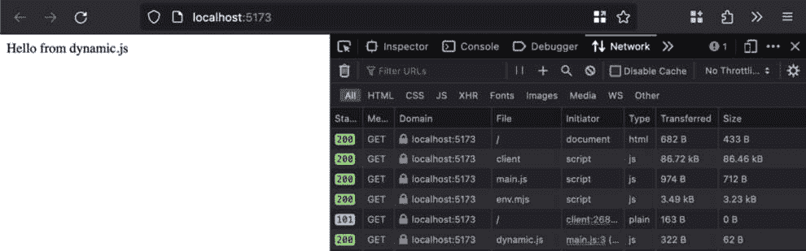

Figure 9.1: “Hello from dynamic.js” on the page with network requests, including a request specifically for dynamic.js
This pattern can be useful to defer loading JavaScript until it’s required – for example, if we want to add client-side tracking of button clicks using `fetch` requests.
We have the following HTML, with two buttons that have a `data-track` property:

```

<!-- no change to app div -->

<div>

<button data-track="button-click">With tracked click

</button>

<button data-track="alt-button-click">Other tracked click

</button>

</div>

<!-- to change to script -->

```js

 We’ll add a `trackInteraction.js` module with a `trackInteraction` function, which will use `fetch` and the `POST` HTTP method to send interaction data to `jsonplaceholder`. If this were a live implementation, we could realistically replace `jsonplaceholder` with Google Analytics or another equivalent service that exposes a client-side JavaScript accessible endpoint:

```

export function trackInteraction(page, type = 'click') {

return fetch

('https://jsonplaceholder.typicode.com/posts', {

method: 'POST',

body: JSON.stringify({

type,

page,

}),

headers: {

'Content-type': 'application/json; charset=UTF-8',

},

}).then((response) => response.json());

}

```js

 Now, the `trackInteraction` module has nothing to do with the page functionality so we want to avoid loading it until it’s needed.
In this case, we’ll attach a click event listener to each element that has a `data-track` attribute. Only when the listener is triggered does the `import('./trackInteraction.js')` statement run:

```

// no change to rest of main.js

document.querySelectorAll('[data-track]').forEach((el) => {

el.addEventListener('click', async (event) => {

const page = window.location.pathname;

const type = event.target.dataset?.track;

const { trackInteraction } = await import

('./trackInteraction.js');

const interactionResponse = await trackInteraction

(page, type);

console.assert(

interactionResponse.type === type &&

interactionResponse.page === page,

'interaction response does not match sent data',

);

});

});

```js

 If we load the Vite dev server and click the **With tracked click** button and the **Other tracked click** button once and then the **With tracked click** button once again, we’ll get the following network requests:
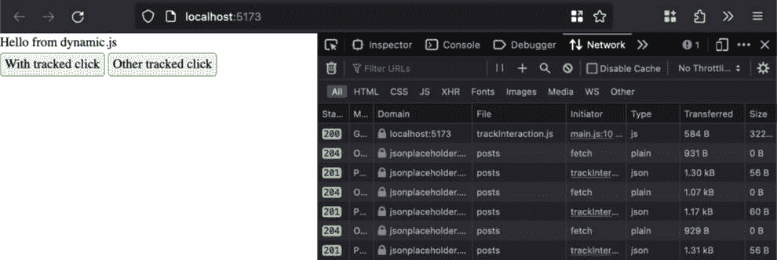

Figure 9.2: Network requests after clicking the “With tracked click,” “Other tracked click,” and “With tracked click” buttons in sequence
On the first click of either button, the `trackInteraction.js` file is loaded and then a `fetch` request is triggered. On subsequent clicks, `trackInteraction.js` is already loaded so the `fetch` requests to `jsonplaceholder` are the only network requests we see.
Note that each `POST` request to `jsonplaceholder` is preceded by an `OPTIONS` request due to browser `OPTIONS` response includes `Access-Control-Allow-…` headers that allow our origin and method.
We’ve now seen what dynamic imports in JavaScript look like and how Vite automatically code splits dynamic imports, which allows us to only load modules that are required “just in time,” thereby allowing us to reduce the upfront JavaScript load/parse/evaluation cost.
Next, we’ll cover route-based code splitting in Next.js and how to inspect generated chunks with the Next.js Bundle Analyzer plugin.
Route-based code splitting and bundling
Let’s begin by defining a **route** in a general web application context and then in a Next.js context.
In a web application, a route comes from the **router** concept; in simple terms, it’s an entry in the router. An entry in the router mechanism can take multiple shapes – for example, in an nginx/Apache/Caddy web server setup, we can have a path to file forwarding or a wildcard forwarding approach. In backend MVC frameworks such as Ruby on Rails, Laravel (PHP), and Django (Python), a route associates a request path to the specific code to be run. The *request path to code to be run* concept also applies to Node.js backend applications using libraries such as Express, Koa, Fastify, and Adonis.js.
Let’s now see how the *route* concept is used in the Next.js filesystem router.
A minimal Next.js project as initialized with `create-next-app` is laid out as follows. Each file in the `pages` directory corresponds to a route. For example, `index.js` is used to render the `/` path of the application. If we had an `about.js` or `about/index.js` file, that would be used to render the `/about` path of the application:

```

.

├── components

├── next.config.js

├── package.json

├── pages

│   └── index.js

└── public

```js

 We defined code splitting in the previous section, *Dynamic imports and code splitting with Vite*. Since a core Next.js feature is the router, it can do what’s called **route-based code splitting**, which is automatic code splitting based on a route or page contents.
A naive route-based code-splitting approach would be to create completely separate sets of bundles for each route. In the context of a React or Next.js application, this is inefficient since we would end up with shared libraries (for example, React and Next.js) in each of the per-page bundles.
What Next.js can do in this case is identify shared code and classify it as `First Load JS shared` `by all`.
This is the sample build output:

```

+ First Load JS shared by all              79.9 kB

├ chunks/framework-cc1b0d6c55d15cb9.js   45.3 kB

├ chunks/main-7c6ad51e94ec3ff5.js        32.8 kB

├ chunks/pages/_app-db3a4be757903450.js  205 B

└ chunks/webpack-8850afd7843acaaa.js     1.55 kB

```js

 We can add the Next.js Bundle Analyzer to check the contents of each chunk:

```

npm install --save @next/bundle-analyzer

```js

 Then, we can configure `next.config.js` to use it. In our case, it looks as follows:

```

const nextConfig = {

// no changes to this config

};

const withBundleAnalyzer = require('@next/bundle-analyzer')({

enabled: process.env.ANALYZE === 'true',

});

module.exports = withBundleAnalyzer(nextConfig);

```js

 To use the bundle analyzer, we can add an `analyze` script to our `package.json file`:

```

{

"//": "// no change to other properties",

"scripts": {

"//": "// no change to other scripts",

"analyze": "cross-env ANALYZE=true next build"

}

}

```js

 This can be run with `npm run analyze`. Its shell output is the same as `npm run build` but it opens a browser window with the bundle analysis file – for example, `.next/analyze/client.html`:

```

npm run analyze

> next-route-based-splitting@0.1.0 analyze
> 
> cross-env ANALYZE=true next build

✓ Linting and checking validity of types

Webpack Bundle Analyzer saved report to /next-route-based-splitting/.next/analyze/nodejs.html

No bundles were parsed. Analyzer will show only original module sizes from stats file.

Webpack Bundle Analyzer saved report to /next-route-based-splitting/.next/analyze/edge.html

Webpack Bundle Analyzer saved report to /next-route-based-splitting/.next/analyze/client.html

✓ Creating an optimized production build

✓ Compiled successfully

✓ Collecting page data

✓ Generating static pages (3/3)

✓ Collecting build traces

✓ Finalizing page optimization

```js

 We can use this to inspect the contents of the `shared` JavaScript in the `framework`, `main`, `pages/_app`, and `webpack` chunks as well as page-specific chunks:
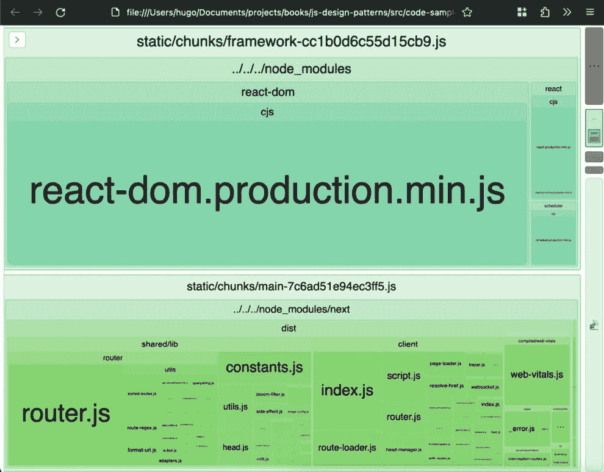

Figure 9.3: The client.html Bundle Analyzer output in the browser
The `framework` bundle includes the following packages from `node_modules`: `react`, `react-dom`, and `scheduler`. Meanwhile, the `main` bundle includes `next` and its submodules such as `shared/lib`, which includes a large `router` chunk, or `next/client`, which is the client-side section of Next.js. Also, it is harder to see in the preceding screenshot, but `main` includes `@swc/helpers/esm`, which is probably an artifact of the Next.js build using the SWC compiler.
We’ve now seen how Next.js supports route-based code splitting and how to inspect the contents of the Next.js-generated bundles using the Next.js Bundle Analyzer report. Next, we’ll see dynamic import patterns to load additional JavaScript under different element visibility and interaction conditions.
Loading JavaScript on element visibility and interaction
In this section, we’ll look at four different scenarios where dynamic or lazy loading of React components and JavaScript modules can be applied in the context of a Next.js application.
The first instance will be whether the component is in the component tree or not – in other words, whether it’s considered to be rendered or not. Next, we’ll look at dynamic imports based on user interaction. We’ll also cover how to handle an interaction that potentially requires a dynamic import of a JavaScript resource. Finally, we’ll show how to dynamically load a React component when an element is visible in the viewport.
Next.js provides a `dynamic` utility (see the documentation at [`nextjs.org/docs/pages/building-your-application/optimizing/lazy-loading`](https://nextjs.org/docs/pages/building-your-application/optimizing/lazy-loading)) that allows us to lazily and dynamically load a React component.
In our case, we have a `components/Hello.jsx` component with a `Hello` component that is a named export:

```

import React from 'react';

export function Hello() {

return <>Hello</>;

}

```js

 We can dynamically load it using `dynamic()` and `import()`. Due to `Hello` being a named export, we need to extract the `Hello` property of the `import()` promise using `.then()`. We set `ssr: false` to showcase how `next/dynamic` allows us to control whether a dynamically loaded component is included in the server-rendered output or not:

```

import React from 'react';

import dynamic from 'next/dynamic';

const DynamicClientSideHello = dynamic(

() => import('../components/Hello.jsx').then(({ Hello })

=> Hello),

{ ssr: false },

);

export default function Index() {

return (

<>

<h1>Next.js route-based splitting and component lazy

loading</h1>

<DynamicClientSideHello />

</>

);

}

```js

 By using `npm run analyze` as configured in the *Route-based code splitting and bundling* section (using the `@next/bundle-analyzer` module), we can inspect the contents of the `chunks/pages/index` chunk; you’ll note that `Hello.jsx` is in a different chunk.
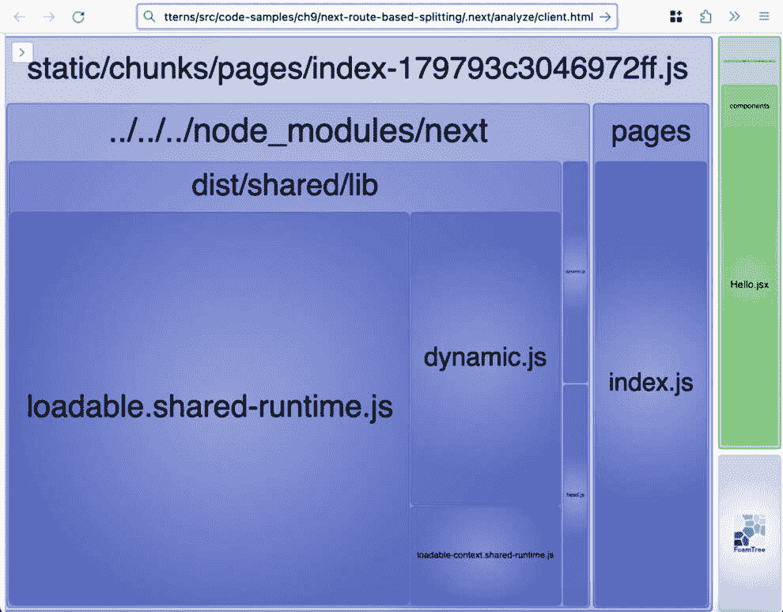

Figure 9.4: Bundle analyzer filtered to “chunks/pages/index” and the chunk containing Hello.jsx
When we run the Next.js dev server using `next dev` and load up the `/` path, we see the following page and network requests. `_next/static/chunks/components_Hello_jsx.js` is loaded last and separately to `_next/static/chunks/pages/index.js`, which means that we are in fact doing a dynamic load of the `Hello.jsx` component.
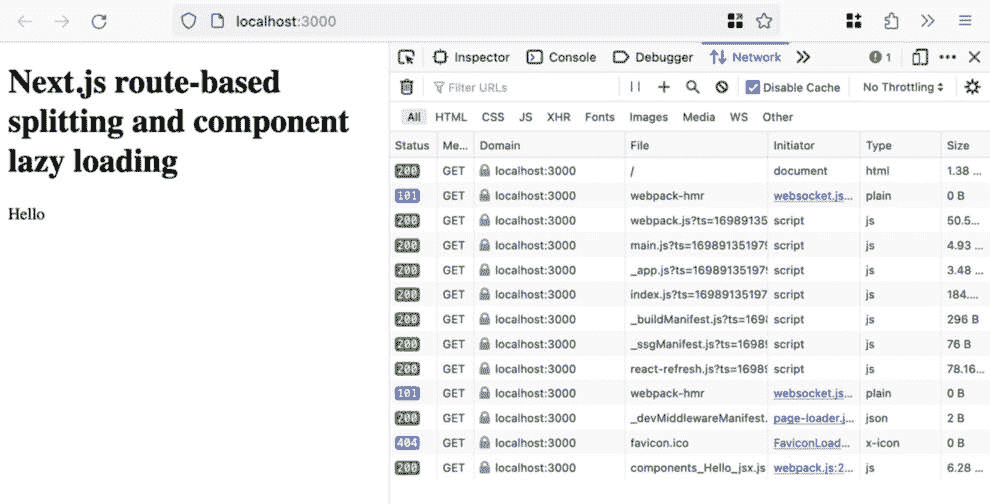

Figure 9.5: Dynamic loading of the Hello.jsx page contents and Network tab
We’ll now showcase using `next/dynamic` inside of the `Index` component based on the component state.
Our example is a *Terms and Conditions* selector that allows the user to select between three options: `NoRender` component (which simply returns `null`), and **Short** and **Long** will dynamically load a component to display.
We’ll start by adding a `components/TermsAndConditionsShort.jsx` component, which contains an `h3` element and a single paragraph of content:

```

import React from 'react';

export function TermsAndConditions() {

return (

<>

<h3>Terms and Conditions Short</h3>

<p>{/* 条款和条件内容 */}</p>

</>

);

}

```js

 We’ll also add a `components/TermsAndConditionsLong.jsx` component, which contains the same `h3` and content but has five paragraphs of content instead of one:

```

import React from 'react';

export function TermsAndConditions() {

return (

<>

<h3>条款和条件 - 长版</h3>

<p>{/* 条款和条件内容 */}</p>

<p>{/* 条款和条件内容 */}</p>

<p>{/* 条款和条件内容 */}</p>

<p>{/* 条款和条件内容 */}</p>

<p>{/* 条款和条件内容 */}</p>

</>

);

}

```js

 Finally, we’ll add a `select` field with relevant `option` values (`None`, `Short`, and `Long`) to `pages/index.js`. We’ll use `useState` to keep track of the currently selected option:

```

import React, { useState } from 'react';

export default function Index() {

const [selectedTermsAndConditions,

setSelectedTermsAndConditions] =

useState('None');

return (

<>

{/* 返回的 JSX 中其余部分无更改 */}

<div>

<label htmlFor="termsAndConditionsType">

条款和条件选择器：

</label>

<select

id="termsAndConditionsType"

onChange={(e) => setSelectedTermsAndConditions

(e.target.value)}

<option value="None">无</option>

<option value="Short">简短</option>

<option value="Long">长</option>

</select>

</div>

</>

);

}

```js

 Finally, we’ll add a `NoRender` component and, based on `selectedTermsAndConditions`, either render `NoRender` or the dynamically loaded `TermsAndConditions` component:

```

import React, { useState } from 'react';

const NoRender = () => null;

export default function Index() {

// useState 无更改

const TermsAndConditions = ['Short', 'Long'].includes(

selectedTermsAndConditions,

)

? dynamic(() =>

import(

`../components/TermsAndConditions$

{selectedTermsAndConditions}.jsx`

).then(({ TermsAndConditions }) =>

TermsAndConditions),

)

: NoRender;

return (

<>

{/* 返回的 JSX 中其余部分无更改 */}

<div>

{/* 标签或选择器无更改 */}

<hr />

<TermsAndConditions />

</div>

</>

);

}

```js

 When we run the next dev server and load the index page, we initially see the `Hello.jsx` one from the previous example.
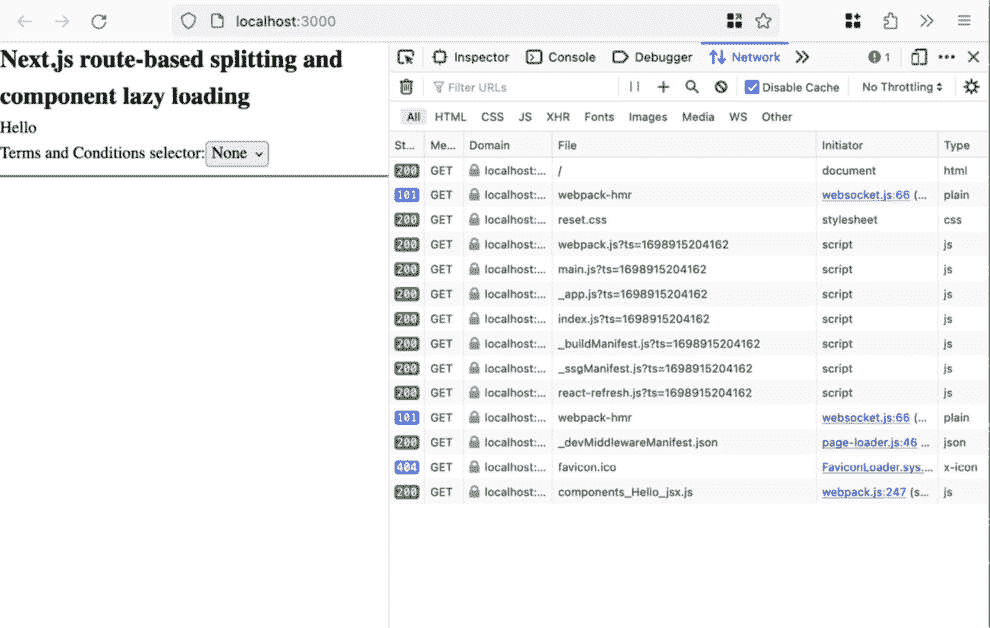

Figure 9.6: Terms and conditions selector initial state with None selected; therefore, no dynamic imports apart from the existing Hello.jsx one
On selection of `_next/static/chunks/components_TermsAndConditionsShort_jsx.js`.
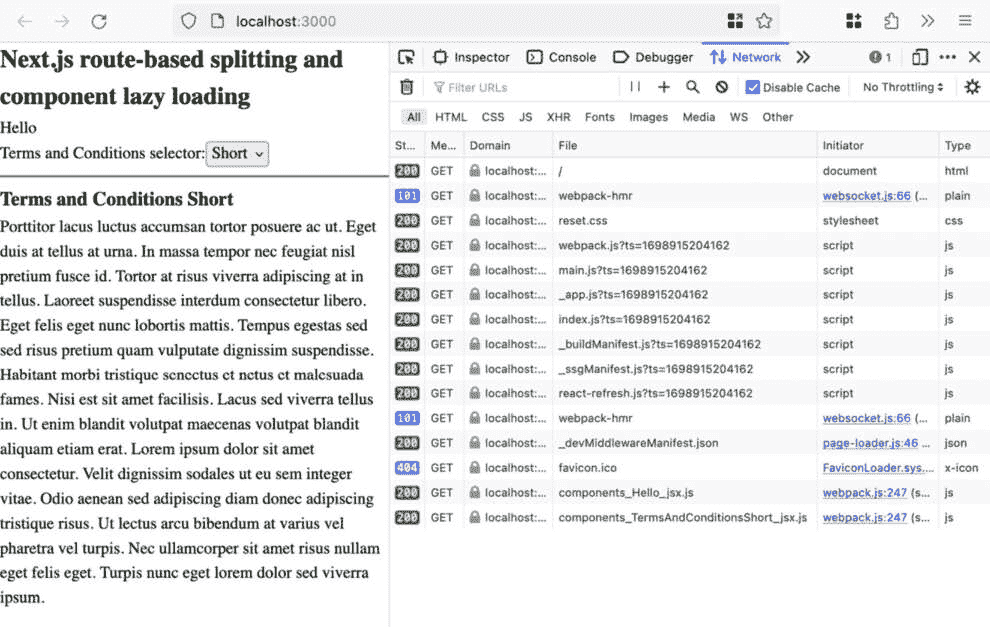

Figure 9.7: Terms and conditions selector when Short is selected; TermsAndConditionsShort.jsx has been dynamically loaded and is displayed
When we select `/_next/static/chunks/components_TermsAndConditionsLong_jsx.js`.
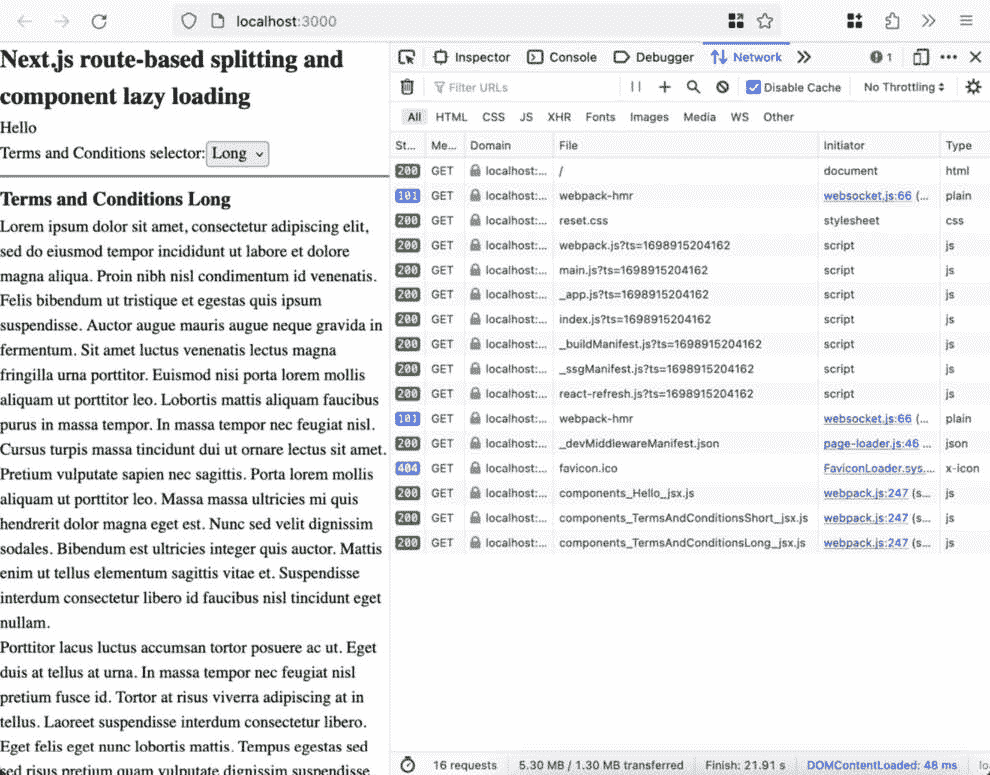

Figure 9.8: Terms and conditions selector when Long is selected; TermsAndConditionsLong.jsx has been dynamically loaded and is displayed
We can also look at the Bundle Analyzer’s `client.html` output using `npm run analyze`; the following has been filtered to the relevant chunks to illustrate how `TermsAndConditionsShort` and `TermsAndConditionsLong` are not included in `chunks/pages/index.js`. There are three “dynamic” chunks (which correlates with our findings from the network requests we observe in the browser): one for `components/Hello.jsx`, one for `components/TermsAndConditionsShort.jsx`, and one for `components/TermsAndConditionsLong.jsx`.
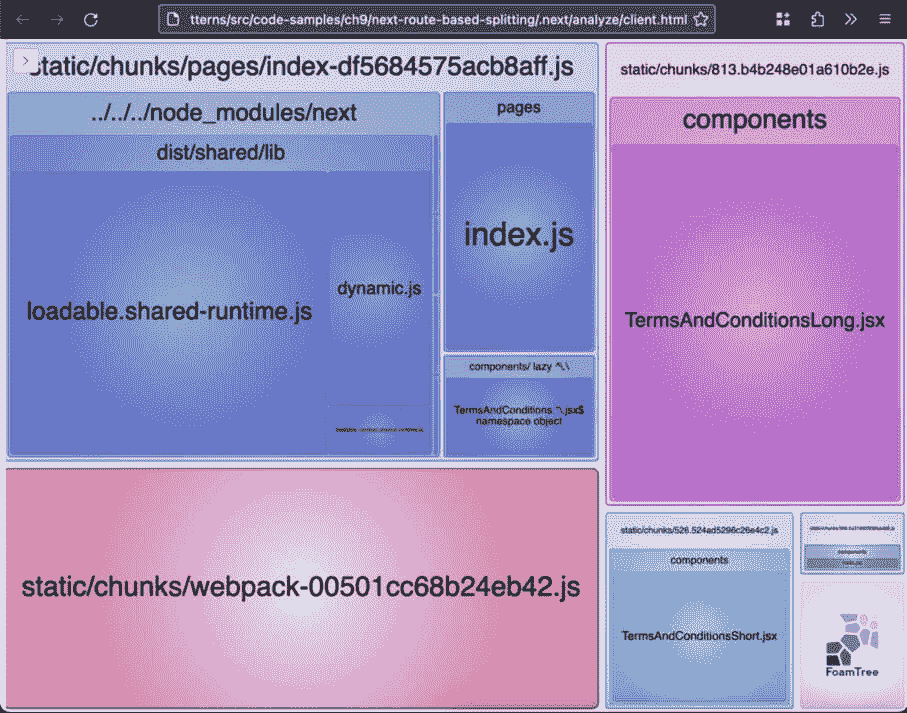

Figure 9.9: Bundle Analyzer output for the page chunk as well as the dynamic chunks (which include the TermsAndConditionsShort and TermsAndConditionsLong components)
We’ve now seen how `dynamic` can be used in response to a user action to dynamically load content based on user-provided data. Next, we’ll revisit dynamic imports of a JavaScript resource (as opposed to React components) while handling a user action in the context of a Next.js application.
We’ll start with a new component, `TermsAndConditionsLongScroll.jsx`, which is functionally the same as `TermsAndCondtionsShort.jsx` or `TermsAndCondtionsLong.jsx` but with 10 paragraphs:

```

import React from 'react';

export function TermsAndConditions() {

return (

<>

<h3>条款和条件 - 长滚动版</h3>

<p>{/* 条款和条件内容 */}</p>

<p>{/* 条款和条件内容 */}</p>

<p>{/* 条款和条件内容 */}</p>

<p>{/* 条款和条件内容 */}</p>

<p>{/* 条款和条件内容 */}</p>

<p>{/* 条款和条件内容 */}</p>

<p>{/* 条款和条件内容 */}</p>

<p>{/* 条款和条件内容 */}</p>

<p>{/* 条款和条件内容 */}</p>

<p>{/* 条款和条件内容 */}</p>

</>

);

}

```js

 We’ll now add a form at the bottom of the page to accept the terms and conditions. We have a long form so it’s nice to be able to go directly to the bottom. To this end, we add a button that, on click, scrolls us to the input checkbox element using a ref.
In our *scroll-to-bottom* handler, we ensure that smooth scrolling is available (some older Safari versions don’t natively support it) by conditionally importing the `scroll-behavior-polyfill` package if `scrollBehavior` is not detected.
Finally, we scroll using the `scrollTargetRef.current.scrollIntoView()` function. `scrollTargetRef` is attached to the checkbox input using the `ref` property:

```

import React, { useRef } from 'react';

export function TermsAndConditions() {

const scrollTargetRef = useRef();

async function handleScroll() {

if (!('scrollBehavior' in document.

documentElement.style)) {

await import('scroll-behavior-polyfill');

}

if (scrollTargetRef.current) {

scrollTargetRef.current.scrollIntoView({

behavior: 'smooth',

block: 'end',

});

}

}

return (

<>

{/* 无标题更改 */}

<button onClick={handleScroll}>滚动到按钮

</button>

{/* 段落无更改 */}

<hr />

<label htmlFor="accept">

<input

id="accept"

name="acceptTerms"

type="checkbox"

ref={scrollTargetRef}

</>

接受条款和条件

</label>

</>

);

}

```js

 Back in `pages/index.js`, we’ll allow `option`) and to be dynamically imported:

```

// Index 外部的导入和定义无更改

export default function Index() {

// 状态值无更改以保持选择状态

const TermsAndConditions = ['Short', 'Long',

'LongScroll'].includes(

selectedTermsAndConditions,

)

? dynamic(() =>

import(

`../components/TermsAndConditions$

{selectedTermsAndConditions}.jsx`

).then(({ TermsAndConditions }) =>

TermsAndConditions),

)

: NoRender;

return (

<>

{/* select 选项外部的内容没有变化 */}

<div>

{/* 标签没有变化 */}

<select

id="termsAndConditionsType"

onChange={(e) => setSelectedTermsAndConditions

(e.target.value)}

{/* 现有的选项没有变化 */}

<option value="LongScroll">LongScroll</option>

</select>

<hr />

<TermsAndConditions />

</div>

</>

);

}

```js

 When we run the next dev server, load the index page, and select `TermsAndConditionsLongScroll.jsx`.
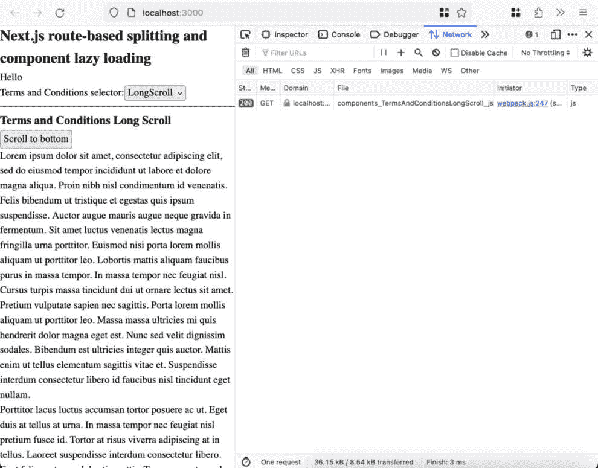

Figure 9.10: TermsAndConditionsLongScroll.jsx selection with dynamic import
In browsers where `behavior: 'smooth'` is supported, when the **Scroll to bottom** button is clicked, no additional JavaScript chunks are loaded and we’re scrolled to the checkbox input after the multiple paragraphs.
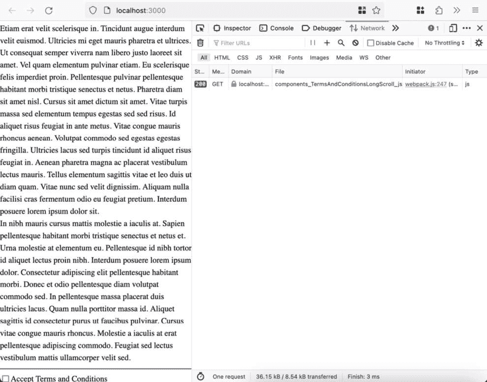

Figure 9.11: TermsAndConditionsLongScroll.jsx selection with dynamic import
On browsers that don’t support `behavior: 'smooth'` for scrolling, `scroll-behavior-polyfill` will be loaded allowing for smooth scrolling to the checkbox.
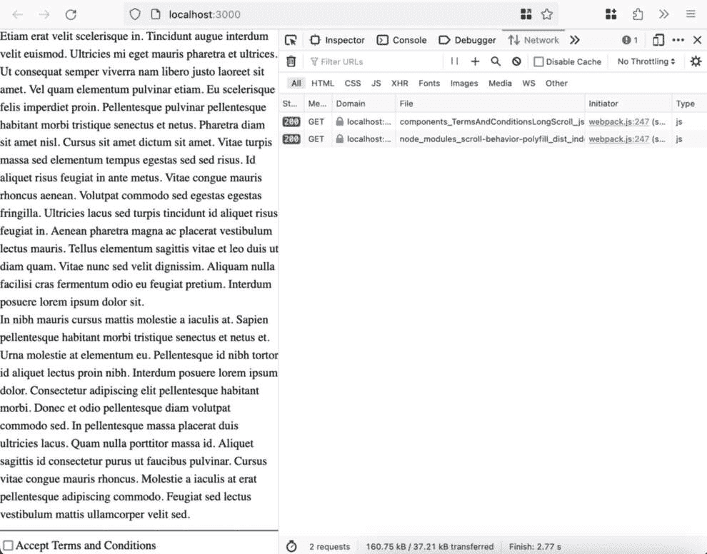

Figure 9.12: TermsAndConditionsLongScroll.jsx selection with dynamic import of the component and of the scroll-behavior-polyfill module
Based on the Bundle Analyzer output (using `npm run analyze` and the `@next/bundle-analyzer` plugin), we can see that there is a chunk that contains `scroll-behavior-polyfill`, along with chunks for `pages/index.js` and one each for `TermsAndConditionsShort.jsx`, `TermsAndConditionsLong.jsx`, and `TermsAndConditionsLongScroll.jsx`.
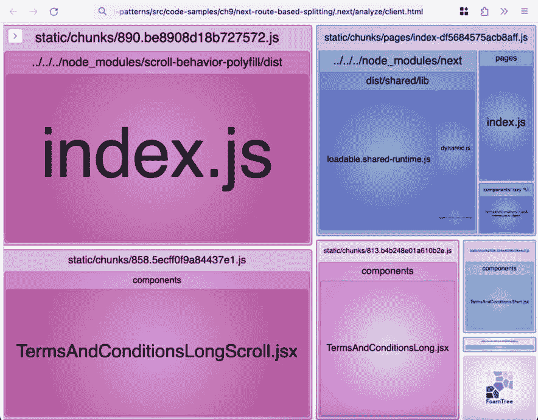

Figure 9.13: Bundle Analyzer output for the pages/index.js chunk as well as relevant dynamic chunks (TermsAndConditionsShort, TermsAndConditionsLong, TermsAndConditionsLongScroll, and scroll-behavior-polyfill)
We’ve now seen that Next.js code splits effectively on native `import()` as well as the provided `dynamic()` utility.
Finally, we’ll see how to use `dynamic()` and the `react-intersection-observer` package to dynamically load content when it is visible.
One other variant of a Terms and Conditions form or similar would be to include additional fields that should be captured when the customer accepts the terms.
In this example, we’ll add a `components/TermsForm.jsx` component with an input for the user’s name and a label for it:

```

从 'react' 模块导入 React。

导出默认函数 TermsForm() {

return (

<form>

<label htmlFor="name">请输入您的名字作为签名

</label>

<input id="name" type="text" />

</form>

);

}

```js

 Next, we’ll want to include it in `components/TermsAndConditionsLongScrollAcceptForm.jsx`. We’ll use `dynamic()` to load the `TermsForm` component.
The rest of our code is similar to the end state of the `TermsAndConditionsLongScroll` components, with a heading, 10 paragraphs, and an `accept` input.
The key exception is the import and usage of the `InView` component from `react-intersection-observer`.
The `InView` component has a children render property that receives, among other properties, the `ref` property, which we can attach to elements whose visibility we’re interested in. Another property of interest to us is the `inView` Boolean, which tells us whether the element on which we put the `ref` prop is in the viewport.
As the rendered output of the `InView` children function, we return a `div` element to which we attach the `ref` property. Inside of the `div`, we render `TermsForm` but only if `inView` is `true`:

```

导入 React from 'react';

导入 dynamic from 'next/dynamic';

导入 { InView } from 'react-intersection-observer';

const TermsForm = dynamic(() => import('./TermsForm.jsx'));

导出函数 TermsAndConditions() {

return (

<>

<h3>长滚动接受条款和条件表单</h3>

{/* 10 段内容 */}

<hr />

<InView>

{({ inView, ref }) => <div ref={ref}>{inView &&

<TermsForm />}</div>}

</InView>

<label htmlFor="accept">

<input id="accept" name="acceptTerms"

type="checkbox" />

接受条款和条件

</label>

</>

);

}

```js

 Finally, we need to add `TermsAndConditionsLongScrollAcceptForm` as a selectable option and a dynamically loaded component:

```

// Index 模块外部没有导入和定义的变化

导出默认函数 Index() {

// useState 没有变化，以保持选择状态

const TermsAndConditions = [

'Short',

'Long',

'LongScroll',

'LongScrollAcceptForm',

].includes(selectedTermsAndConditions)

? dynamic(() =>

导入(

`../components/TermsAndConditions$

{selectedTermsAndConditions}.jsx`

).then(({ TermsAndConditions }) =>

TermsAndConditions),

)

: NoRender;

return (

<>

{/* select 选项外部的内容没有变化 */}

<div>

{/* 标签没有变化 */}

<select

id="termsAndConditionsType"

onChange={(e) => setSelectedTermsAndConditions

(e.target.value)}

{/* 现有的选项没有变化 */}

<option value="LongScrollAcceptForm">

LongScrollAcceptForm</option>

</select>

<hr />

<TermsAndConditions />

</div>

</>

);

}

```js

 Now, when we run the next dev server and load the index page, `LongScrollAcceptForm` is available. When we select it, the `TermsAndConditionsLongScrollAcceptForm.jsx` component is loaded.
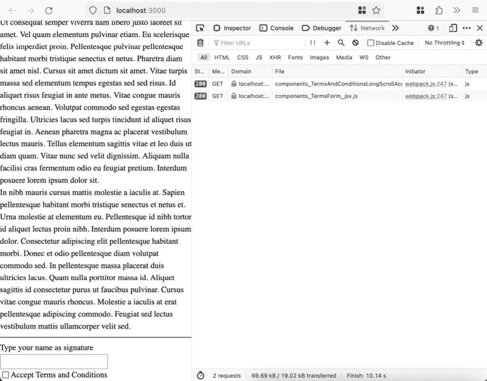

Figure 9.14: LongScrollAcceptForm selected and TermsAndConditionsLongScrollAcceptForm.jsx dynamically loaded
When `TermsAndConditionsLongScrollAcceptForm` is scrolled to the bottom (to the point where the checkbox is visible), the `TermsForm.jsx` component is dynamically loaded and is shown on the page.


Figure 9.15: TermsAndConditionsLongScrollAcceptForm scrolled to the bottom and TermsForm.jsx dynamically loaded
We’ve now seen how to load JavaScript and React components on component visibility and interaction with Next.js.
Summary
In this chapter, we’ve covered various approaches for maximizing the performance of your JavaScript, React, and Next.js applications with lazy loading approaches and code splitting.
First, we showcased how to use the dynamic import syntax in a Vite-powered setup to cause code splitting and illustrated it by importing additional code only when it’s required (during an interaction handler).
Next, we saw how Next.js provides out-of-the-box route-based code splitting while also ensuring modules shared across pages don’t get loaded or output more than once. We also delved into how to validate this using the Next.js Bundle Analyzer plugin.
Finally, we covered how to implement different lazy loading scenarios in Next.js: on presence in the component tree, on change caused by user interaction, importing a JavaScript module during an event handler, and lazy loading on an element entering the viewport.
We now know how to leverage lazy loading and code splitting to maximize application load performance. In the next chapter, we’ll cover asset-loading strategies and how to execute code off the main thread.

```
