# *第三章*: Vue.js 入门

JavaScript 世界在不断发展。近年来，一个新概念出现了：通过创建组件来开发应用程序。

新的基于组件的 Web 应用程序开发 JavaScript 库已经出现，其中主要的是 Angular、React、Svelte 和 **Vue.js**。在这些彼此之间相当相似的库中，我们选择向您介绍 Vue.js，因为它被广泛使用且易于实现。提到的其他库遵循相同的原理。

为什么使用 Vue.js？

Vue.js 的主要优势是能够使用组件来开发应用程序。我们将 Web 应用程序切割成一系列组件（实际上是 JavaScript 文件），然后组装它们以形成最终的应用程序。Vue.js 可以独立于其他组件测试每个组件，并且还可以在其他应用程序中重用它们。

在本章中，我们将研究如何通过创建和使用我们的第一个组件来使用 Vue.js 构建我们的第一个应用程序。

在本章中，我们将涵盖以下主要主题：

+   在 HTML 页面中使用 Vue.js

+   创建我们的第一个 Vue.js 应用程序

+   使用响应性

+   创建我们的第一个组件

+   在组件中添加方法

+   在组件中使用属性

+   使用指令

# 技术要求

您可以在 GitHub 上找到本章的代码文件：[`github.com/PacktPublishing/JavaScript-from-Frontend-to-Backend/blob/main/Chapter%203.zip`](https://github.com/PacktPublishing/JavaScript-from-Frontend-to-Backend/blob/main/Chapter%203.zip)。

# 在 HTML 页面中使用 Vue.js

要在 HTML 页面中使用 Vue.js，只需使用 `<script>` 标签将其库文件插入到页面中。

为了检查 Vue.js 是否正确集成到页面中，让我们在 `Vue.version` 变量中显示库的版本号：

显示 Vue.js 版本号（index.html 文件）

```js
<html>
```

```js
  <head>
```

```js
    <meta charset="utf-8" />
```

```js
    <script src="img/vue@next"></script>
```

```js
  </head>
```

```js
  <body>
```

```js
  </body>
```

```js
  <script>
```

```js
    alert(`Vue.version = ${Vue.version}`);
```

```js
  </script>
```

```js
</html>
```

如果 Vue.js 可在页面上访问，`Vue` 对象通过其 `version` 属性提供对版本号的访问，正如我们可以在以下图中看到：

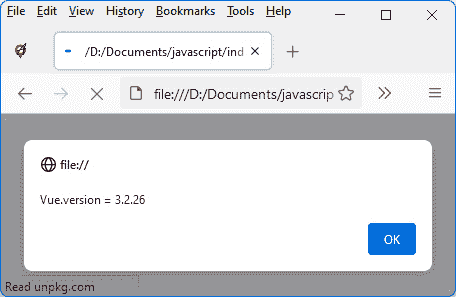

图 3.1 – 显示 Vue.js 版本号

现在我们已经将 Vue.js 集成到我们的 HTML 页面中，让我们着手创建我们的第一个应用程序。

# 创建我们的第一个 Vue.js 应用程序

一旦将 Vue.js 插入到 HTML 页面中，您必须定义页面上 Vue.js 将要使用的 HTML 元素。

通常，您希望在整个 HTML 页面上使用 Vue.js，但也可以仅在某些页面元素上使用它。例如，我们可以使用 jQuery 管理一个 HTML 页面，除了特定的 `<div>` 元素，它将使用 Vue.js 管理。

为了说明这一点，让我们创建一个包含两个 `<div>` 元素的 HTML 页面，其中只有第一个将由 Vue.js 管理：

创建部分由 Vue.js 管理的 HTML 页面

```js
<html>
```

```js
  <head>
```

```js
    <meta charset="utf-8" />
```

```js
    <script src="img/vue@next"></script>
```

```js
  </head>
```

```js
  <body>
```

```js
    <div id="app">First div</div>
```

```js
<div>The rest of the page is not managed by 
```

```js
    Vue.js</div>
```

```js
  </body>
```

```js
  <script>
```

```js
    var app = Vue.createApp({
```

```js
      template : "This div is managed with Vue.js"
```

```js
    });
```

```js
// mount the Vue.js application on the <div> having the 
```

```js
    // id "app"
```

```js
    var vm = app.mount("div#app");    
```

```js
</script>
```

```js
</html>
```

在前面的代码中，我们使用了定义在 `Vue` 对象上的 `Vue.createApp(options)` 方法。`options` 对象用于设置创建 Vue.js 应用程序的选项。`Vue.createApp(options)` 的一个选项是 `template` 选项，它允许我们定义将在页面上显示的视图（即 HTML 显示），这得益于 `app.mount(element)` 方法的调用：

+   `app` 对象是 `Vue.createApp()` 方法调用得到的结果。

+   `element` 参数代表 Vue.js 将在其上起作用的 HTML 元素。

运行前面的程序；我们应该看到以下输出：

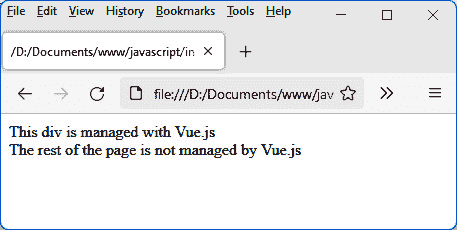

图 3.2 – 第一个 Vue.js 应用程序

在前面的屏幕上，我们可以看到在页面上使用 Vue.js 的结果。第一个 `<div>` 的内容被 `Vue.createApp(options)` 方法的 `options` 参数中编写的模板所替换。第二个 `<div>` 没有被转换。

因此，要使用 Vue.js 管理整个 HTML 页面，只需在页面的 `<body>` 部分指定一个单独的 `<div>` 元素，Vue.js 将会在这个元素上激活。

现在我们来看一下如何使用 Vue.js 的一个重要概念，即程序中定义的变量与它们在 HTML 页面上显示之间的对应关系。这个概念被称为响应性。

# 使用响应性

Vue.js 的一个目标是将显示管理（即 **视图**）和数据管理（即 **模型**）分离。这是在所谓的 **模型-视图-控制器**（**MVC**）模型中经常遇到的概念。

为了说明，假设我们想要显示一个从 0 开始递增的计数器。视图和模型的良好分离将使视图持续显示计数器的值，即使该值在其他地方被更改。这个概念使得不必将显示与显示数据的管理链接起来。为此，我们使用 Vue.js 提供的响应性，通过创建所谓的 **响应式变量**。

响应式变量

如果一个变量的内存修改导致它在显示的地方自动修改，则称该变量为响应式。

在 `Vue.createApp(options)` 方法中定义的 `options` 对象中定义响应式变量。为此，我们在 `options` 对象中添加，并定义 `data()` 方法，该方法必须返回一个包含应用程序所谓的响应式变量的对象。

在我们的 Vue.js 应用程序中使用一个名为 `count` 的响应式变量：

定义一个计数响应式变量

```js
<html>
```

```js
  <head>
```

```js
    <meta charset="utf-8" />
```

```js
    <script src="img/vue@next"></script>
```

```js
  </head>
```

```js
  <body>
```

```js
    <div id="app"></div>
```

```js
  </body>
```

```js
  <script>
```

```js
    var app = Vue.createApp({
```

```js
      template : "The counter is: {{count}}",
```

```js
      data() {
```

```js
// return an object containing the reactive 
```

```js
        // variables
```

```js
        return {
```

```js
          count : 0
```

```js
        }
```

```js
      }
```

```js
    });
```

```js
    var vm = app.mount("div#app");
```

```js
</script>
```

```js
</html>
```

在前面的代码中，`count` 响应式变量是在 `data()` 方法中定义的，该方法返回包含程序的响应式变量 `{ count : 0 }` 的对象。之后可以定义其他变量。

这个响应式变量可以通过 `{{ 和 }}` 的符号在模板中使用。这种符号用于表示 JavaScript 表达式，例如变量的值。

一个所谓的响应式变量的定义使得将显示与变量的值联系起来成为可能。一旦变量被修改，显示也会相应修改。我们可以在以下图中看到计数器的值：

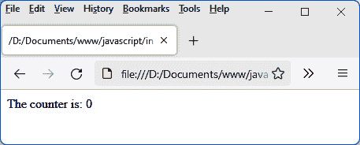

图 3.3 – 显示一个响应式变量

计数器保持在它的初始值：`count`变量被修改。

要做到这一点，让我们按照以下代码每秒增加变量的值：

每秒增加计数变量

```js
<html>
```

```js
  <head>
```

```js
    <meta charset="utf-8" />
```

```js
    <script src="img/vue@next"></script>
```

```js
  </head>
```

```js
  <body>
```

```js
    <div id="app"></div>
```

```js
  </body>
```

```js
  <script>
```

```js
    var app = Vue.createApp({
```

```js
      template : "The counter is: {{count}}",
```

```js
      data() {
```

```js
        // return an object containing the reactive 
```

```js
        // variables
```

```js
        return {
```

```js
          count : 0
```

```js
        }
```

```js
      }
```

```js
    });
```

```js
    var vm = app.mount("div#app");
```

```js
    setInterval(function() {
```

```js
      vm.count += 1;
```

```js
    }, 1000);
```

```js
</script>
```

```js
</html>
```

使用 JavaScript 的`setInterval()`函数，我们每秒增加`count`变量的值。Vue.js 通过`vm.count`提供对`count`变量的访问，其中`vm`是`app.mount()`方法返回的对象。响应式变量成为这个`vm`对象的属性。在之前的代码中，我们可以看到视图和数据处理的分离，这是 MVC 模式所倡导的。变量的增加是在视图外部完成的，这在像 jQuery 这样的库中是不可能的。

我们可以通过 Vue.js 提供的响应性，在以下图中看到增加和显示的自动更新

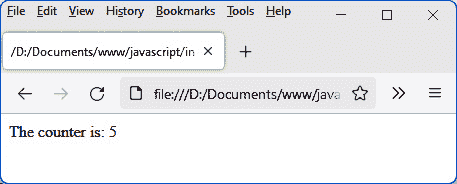

图 3.4 – 增加一个响应式变量

之前的程序非常简单，但在现实中，应用程序当然更加复杂。因此，有必要将应用程序分解成小块，然后将它们组装起来。现在让我们学习如何编写应用程序的一个小部分，称为组件。

# 创建我们的第一个组件

让我们看看如何使用 Vue.js 创建我们自己的组件。

Vue.js 组件将类似于一个新的 HTML 元素。如果需要，它将以 HTML 标签的形式使用，可以将其与新的属性关联。要使用组件，您只需使用相应的标签。

因此，组件是通过创建我们自己的标签来丰富 HTML 代码的一种方式。

如何发现用于构建我们应用程序的组件

您需要做的就是将您想要显示的 HTML 页面视觉上切割成最简单的元素（这些将成为您应用程序的基本组件），然后将几个元素组合在一起形成一个组件，这些组件将组合它们，依此类推，直到您拥有主组件，这将是您的完整应用程序。

例如，如果 HTML 页面上显示了一个元素列表，列表中的每一行对应一个基本组件，而将这些不同组件组合起来的全局列表将与另一个组件相关联。HTML 页面上所有组件的集合对应于主组件，通常命名为`<App>`或`<GlobalApp>`。让我们先学习如何插入组件，然后看看如何创建和使用与之前计数器相对应的`<counter>`组件。

你可以直接在 HTML 页面中创建组件，或者从外部文件中包含它。让我们看看这两种方法。

## 在应用程序文件中插入组件

一个组件可以简单地嵌入到主应用程序 Vue.js 文件中。只需使用 `app.component(name, options)` 方法来创建，如下所示。变量 `app` 对应于 `Vue.createApp()` 返回的对象：

直接在应用程序中创建 <counter> 组件

```js
<html>
```

```js
  <head>
```

```js
    <meta charset="utf-8" />
```

```js
    <script src="img/vue@next"></script>
```

```js
  </head>
```

```js
  <body>
```

```js
    <div id="app"></div>
```

```js
  </body>
```

```js
  <script>
```

```js
    var app = Vue.createApp({
```

```js
      template : "<counter />"
```

```js
    });
```

```js
    app.component("counter", {
```

```js
      template : "The counter is: {{count}}",
```

```js
      data() {
```

```js
        return {
```

```js
          count : 0
```

```js
        }
```

```js
      }
```

```js
    });
```

```js
    var vm = app.mount("div#app");
```

```js
</script>
```

```js
</html>
```

在前面的代码中，变量 `app` 对应于 `Vue.createApp()` 返回的对象。

`app.component(name, options)` 方法与 `Vue.createApp(options)` 的工作原理相同：

+   `name` 参数对应于组件的名称，然后将在 HTML 模板中用作标签。

+   在这两种情况下，`options` 参数类似。有 `template` 部分、`data` 等等。

然后，`<counter>` 组件可以在其他模板中使用，包括为应用程序定义的模板。当你运行前面的代码时，你会看到以下屏幕：

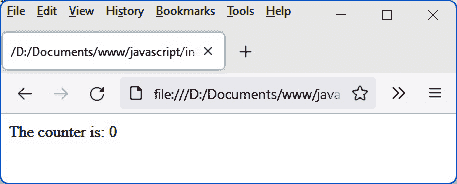

图 3.5 – <counter> 组件

如前图所示，目前计数器保持在 `0`。为了在组件创建后能够写入递增指令，以递增组件中的响应式变量 `count`，必须能够这样做。为此，Vue.js 提供了允许访问每个创建的组件生命周期的内部方法。

组件生命周期的方法之一是 `created()` 方法。当组件被创建时，会调用此方法。你可以使用此方法使用 `setInterval()` 函数每秒写入变量 `count` 的递增。

让我们按照以下方式使用组件的 `created()` 方法：

使用组件的 created() 方法

```js
<html>
```

```js
  <head>
```

```js
    <meta charset="utf-8" />
```

```js
    <script src="img/vue@next"></script>
```

```js
  </head>
```

```js
  <body>
```

```js
    <div id="app"></div>
```

```js
  </body>
```

```js
  <script>
```

```js
    var app = Vue.createApp({
```

```js
      template : "<counter />"
```

```js
    });
```

```js
    app.component("counter", {
```

```js
      template : "The counter is: {{count}}",
```

```js
      data() {
```

```js
        return {
```

```js
          count : 0
```

```js
        }
```

```js
      },
```

```js
      created() {
```

```js
        setInterval(()=>{  // do not use the function()
```

```js
                           // form here,
```

```js
                           // otherwise the "this" object
```

```js
                           // would not be the same
```

```js
          this.count++;
```

```js
        }, 1000);
```

```js
      }
```

```js
    });
```

```js
    var vm = app.mount("div#app");
```

```js
  </script>
```

```js
</html>
```

在前面的代码中，我们使用了 `()=>` 语法而不是 `function()`。这种语法（称为 lambda 函数）是在 JavaScript 的最新版本中引入的，以便允许在回调函数内部保持 `this` 的值，这在当前情况下是必要的。如果你将 lambda 函数 `()=>` 替换为 `function()` 关键字，程序将无法工作，因为 `this` 的值将不同。

运行前面的代码后，你会看到以下输出：

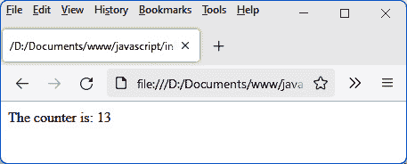

图 3.6 – 在组件中递增计数器

## 从外部文件插入组件

与直接在 HTML 页面中定义组件相比，最好在外部文件中定义它。组件可以通过在 HTML 页面中包含外部文件来在 HTML 页面中使用。为此，我们使用 JavaScript 提供的模块概念。

在外部文件中定义的组件的优势

将组件定义在外部文件中的优势是能够将此文件包含在多个不同的 HTML 页面中，因此可以在多个不同的应用程序中使用该组件。

`<counter>` 组件如下定义在外部 `counter.js` 文件中：

`<counter>` 组件定义（`counter.js` 文件）

```js
const Counter = {
```

```js
  data() {
```

```js
    return {
```

```js
      count: 0
```

```js
    }
```

```js
  },
```

```js
  template : "The counter is: {{count}}",
```

```js
  created() {
```

```js
    setInterval(() => {
```

```js
      this.count += 1;
```

```js
    }, 1000)
```

```js
  }
```

```js
}
```

```js
export default Counter;
```

`<counter>` 组件被定义为具有 `template`、`data` 和 `created` 属性的对象。其定义与之前在 `app.component()` 方法中展示的类似。

`export default Counter` 指令使得组件可以在导入此模块的其他文件中使用。

现在，我们可以将 `<counter>` 组件集成到我们应用程序的主文件中。我们使用 JavaScript 的 `import` 语句来实现这一点。代码如下所示：

将组件导入程序（`index.html` 文件）

```js
<html>
```

```js
  <head>
```

```js
    <meta charset="utf-8" />
```

```js
    <script src="img/vue@next"></script>
```

```js
  </head>
```

```js
  <body>
```

```js
    <div id="app"></div>
```

```js
  </body>
```

```js
  <script type="module">
```

```js
    import Counter from "./counter.js";
```

```js
    var app = Vue.createApp({
```

```js
      components : {
```

```js
        Counter:Counter
```

```js
      },
```

```js
      template : "<counter />"   // or "<Counter />"
```

```js
    });
```

```js
    var vm = app.mount("div#app");
```

```js
  </script>
```

```js
</html>
```

在前面的代码中，为了导入 `counter.js` 文件并使用相应的组件，发生以下操作：

+   `<script>` 标签中的 `type="module"` 属性表示。这允许在 `<script>` 标签的 JavaScript 语句中使用 `import` 语句。

+   我们使用 `import` 语句来导入相应的模块。

+   我们在新的 `components` 部分声明导入的组件。组件被声明为一个对象。该对象中属性的名称对应于组件在模板中使用的名称（`<counter>` 或 `<Counter>`），而值对应于导入的组件的名称（`Counter`）。

    使用 HTTP 而不是 FILE 协议

    然而，由于我们使用 JavaScript 模块的导入，有必要在 HTTP 服务器上运行我们的应用程序，而不是像以前那样简单地拖放。因此，使用了以 `http://localhost` 开头的 URL。如果您需要了解如何安装 HTTP 服务器，例如，您可以使用以下文档：[`developer.mozilla.org/en-US/docs/Learn/Common_questions/set_up_a_local_testing_server`](https://developer.mozilla.org/en-US/docs/Learn/Common_questions/set_up_a_local_testing_server)。

在以下图中，我们可以看到直接在 HTML 页面或在外部文件中创建组件会产生相同的结果：

![图 3.7 – 在 HTTP 服务器上执行 HTML 文件（此处为 localhost）]

](img/Figure_3.7_B17416.jpg)

图 3.7 – 在 HTTP 服务器上执行 HTML 文件（此处为 localhost）

当前组件仅有一个简单的响应式变量。在组件中，可以添加方法供组件使用。现在让我们看看如何实现。

# 在组件中添加方法

我们已经看到如何在组件中使用 `data` 部分创建响应式变量。在组件中还可以创建可以在组件模板中使用的方法。

向组件添加方法有两种方式：

+   第一种方法是在组件的 `methods` 部分定义方法。

+   第二种方法是创建一个所谓的计算属性，它将在组件的 `computed` 部分中定义。

让我们看看这两种实现方式。

## 在 `methods` 部分中定义方法

对于计数器的每次增加，都应该显示它发生的时间。在组件中，一个 `time()` 函数将非常有用，允许我们以 HH:MM:SS 的形式显示时间。这个 `time()` 函数将在组件的 `methods` 部分中定义。

`<counter>` 组件被修改以集成行首时间的显示。我们可以使用以下代码实现所有这些：

显示时间的 `<counter>` 组件（counter.js 文件）

```js
const Counter = {
```

```js
  data() {
```

```js
    return {
```

```js
      count: 0
```

```js
    }
```

```js
  },
```

```js
  template : `{{time()}} &nbsp;&nbsp; The counter is: 
```

```js
  {{count}}`,
```

```js
  created() {
```

```js
    setInterval(() => {
```

```js
      this.count += 1;
```

```js
    }, 1000)
```

```js
  },
```

```js
  methods : {
```

```js
    time() {
```

```js
     // return time as HH:MM:SS
```

```js
     var date = new Date();
```

```js
     var hour = date.getHours();
```

```js
     var min = date.getMinutes();
```

```js
     var sec = date.getSeconds();
```

```js
     if (hour < 10) hour = "0" + hour;
```

```js
     if (min < 10) min = "0" + min;
```

```js
     if (sec < 10) sec = "0" + sec;
```

```js
     return "" + hour + ":" + min + ":" + sec + " ";
```

```js
    }
```

```js
  }
```

```js
}
```

```js
export default Counter;
```

在前面的代码中，`time()` 方法在 `methods` 部分中定义，然后直接在组件模板中的双大括号 `{{` 和 `}}` 内使用。

在 `methods` 部分中定义的方法可以使用该部分的其它方法或 `data` 部分的响应式变量，通过在它们前面加上 `this` 关键字来使用。

结果将在以下图中显示：

![Figure 3.8 – 组件中的时间显示]

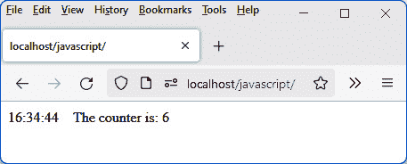

![Figure 3.8 – 组件中的时间显示]

Vue.js 允许你以方法的形式定义新的变量，这些变量将是响应式的。它们被称为计算属性。让我们看看如何创建和使用它们。

## 在 `computed` 部分中定义计算属性

计算属性类似于响应式变量。它是通过对一个或多个响应式变量执行计算得到的结果，并且它也将是响应式的。任何对与该计算属性关联的响应式变量的修改都将立即导致它的修改。

让我们创建一个 `countX2` 属性，它计算 `count` 变量的两倍，如下所示：

在组件中定义计算属性 countX2（counter.js 文件）

```js
const Counter = {
```

```js
  data() {
```

```js
    return {
```

```js
      count: 0
```

```js
    }
```

```js
  },
```

```js
 template : `{{time()}} &nbsp;&nbsp; The counter is: 
```

```js
  {{count}}, double is: {{countX2}}`,
```

```js
  created() {
```

```js
    setInterval(() => {
```

```js
      this.count += 1;
```

```js
    }, 1000)
```

```js
  },
```

```js
  methods : {
```

```js
    time() {
```

```js
     // return time as HH:MM:SS
```

```js
     var date = new Date();
```

```js
     var hour = date.getHours();
```

```js
     var min = date.getMinutes();
```

```js
     var sec = date.getSeconds();
```

```js
     if (hour < 10) hour = "0" + hour;
```

```js
     if (min < 10) min = "0" + min;
```

```js
     if (sec < 10) sec = "0" + sec;
```

```js
     return "" + hour + ":" + min + ":" + sec + " ";
```

```js
    }
```

```js
  },
```

```js
  computed : {
```

```js
    countX2() {
```

```js
      return 2 * this.count;
```

```js
    }
```

```js
  }
```

```js
}
```

```js
export default Counter;
```

前面代码的输出将如下所示：

![Figure 3.9 – 使用计算属性]

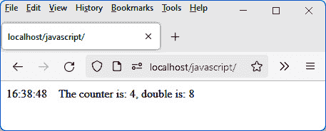

![Figure 3.9 – 使用计算属性]

在前面的图中，我们可以看到 `count` 变量的修改。每秒钟都会自动修改 `countX2` 变量，这得益于它在 `computed` 部分的定义。

我们已经看到了如何在组件中定义方法和响应式变量。现在让我们看看如何通过使用组件的属性来传递参数。

# 在组件中使用属性

组件中的属性允许它传递使用参数。例如，我们可以在 `<counter>` 组件中使用一个 `start` 属性来指示我们从哪个值开始计数。如果没有指定此属性，则默认为 0（即，计数从 0 开始，如前面的代码示例所示）。

为了使组件能够在使用时使用属性，只需在组件的 `props` 部分中指明属性的名称。组件可以使用 `this` 关键字访问属性值（例如，`this.start` 来访问组件中的 `start` 属性）。我们可以在以下代码中看到这一点：

在组件中使用 start 属性（index.html 文件）

```js
<html>
```

```js
  <head>
```

```js
    <meta charset="utf-8" />
```

```js
    <script src="img/vue@next"></script>
```

```js
  </head>
```

```js
  <body>
```

```js
    <div id="app"></div>
```

```js
  </body>
```

```js
  <script type="module">
```

```js
    import Counter from "./counter.js";
```

```js
    var app = Vue.createApp({
```

```js
      components : {
```

```js
        Counter:Counter
```

```js
      },
```

```js
      template : "<counter start='10' />"
```

```js
    });
```

```js
    var vm = app.mount("div#app");
```

```js
  </script>
```

```js
</html>
```

在以下代码中，属性是在使用组件时传递的，就像在传统的 HTML 中做的那样。这里的属性值将是一个字符字符串 `"10"`，而不是值 `10`：

在 `<counter>` 组件（counter.js 文件）中设置 start 属性

```js
const Counter = {
```

```js
  data() {
```

```js
    return {
```

```js
      count : parseInt(this.start),  // we initialize the
```

```js
                                     // count to the value
```

```js
                                     // of start
```

```js
    }
```

```js
  },
```

```js
  template : `{{time()}} &nbsp;&nbsp; The counter is: 
```

```js
  {{count}}, double is: {{countX2}}`,
```

```js
  created() {
```

```js
    var timer = setInterval(() => {
```

```js
      this.count += 1;
```

```js
    }, 1000)
```

```js
  },
```

```js
  methods : {
```

```js
    time() {
```

```js
     // return time as HH:MM:SS
```

```js
     var date = new Date();
```

```js
     var hour = date.getHours();
```

```js
     var min = date.getMinutes();
```

```js
     var sec = date.getSeconds();
```

```js
     if (hour < 10) hour = "0" + hour;
```

```js
     if (min < 10) min = "0" + min;
```

```js
     if (sec < 10) sec = "0" + sec;
```

```js
     return "" + hour + ":" + min + ":" + sec + " ";
```

```js
    }
```

```js
  },
```

```js
  computed : {
```

```js
    countX2() {
```

```js
      return 2 * this.count;
```

```js
    }
```

```js
  },
```

```js
  props : [
```

```js
    "start"
```

```js
  ]
```

```js
}
```

```js
export default Counter;
```

在前面的代码中，注意使用了 `parseInt()` 函数（在 JavaScript 中定义为标准函数）来以整数形式检索 `this.start` 的值。确实，属性是以字符字符串的形式传递的，因此需要将 `this.start` 转换为整数值。

可以避免将属性值转换为整数值。你只需要在使用属性时指明你想要保留 JavaScript 值而不是字符字符串。我们用字符 `:` 前缀属性名，例如，`:start='10'`。在这种情况下，值 `10` 将被传递，而不是字符串 `"10"`。

这使得可以在属性中传递任何类型的值：数值、字符字符串、数组或对象。

在以下图中，我们可以看到计数器从 `start` 属性中指示的值开始：

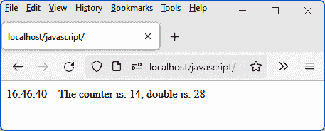

图 3.10 – 在组件中使用 start 属性

因此，我们已经看到了如何在组件中创建新属性。Vue.js 有一些标准属性，可以在所有组件中使用。这些由 Vue.js 创建的特定属性被称为指令。我们现在将研究它们。

# 使用指令

Vue.js 通过提供编写其自身组件的功能来改进 HTML 代码的编写，正如我们在上一节所看到的。该框架还通过向 HTML 元素或创建的组件添加新属性来简化基本 HTML 代码的编写。这些新属性被称为指令。

注意

指令仅用于 HTML 元素或创建的组件，即在组件的 `template` 部分中。

它们的名称以 `v-` 开头，这样就不会与其他现有的 HTML 属性混淆。主要的指令有 `v-if`、`v-else`、`v-show`、`v-for` 和 `v-model`。现在我们将解释它们。

## v-if 和 v-else 指令

`v-if` 指令用于指定条件。如果条件为真，HTML 元素（或组件）将被插入到 HTML 页面中。否则，它将不存在。

让我们使用 `v-if` 指令来表示我们只想在计数器的值小于或等于 20 时显示计数器的值。一旦超过值 20，计数器将不再显示。

在以下代码片段中，我们只指出了组件 `template` 部分的代码，知道其余部分没有修改：

使用 `v-if` 指令

```js
template : `
```

```js
  {{time()}} &nbsp;&nbsp;
```

```js
  <span v-if='count<=20'>The counter is: {{count}}</span>
```

```js
`,
```

使用反引号 `'` 和 `'` 来定义模板可以避免在多行上管理字符串的连接。

应用 `v-if` 指令的 `<span>` 元素只有在以下条件为真时才会包含在 HTML 页面中：如果 `count<=20`。超过 20，则只显示时间，而不显示计数器值。

只要计数器小于或等于 20，它将按以下方式显示：

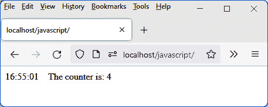

图 3.11 – 显示值小于 20 的计数器

当计数器超过值 20 时，它将不再显示：

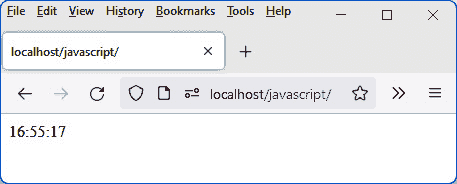

图 3.12 – 计数器超过值 20 时的显示

`v-else` 指令用于在 `v-if` 表达的条件为 `false` 时表示一个替代项。如果 `v-if` 表达的条件为 `false`，则使用 `v-else` 指令的元素将被插入到 HTML 页面中。

让我们使用 `v-else` 指令在计数器超过值 20 时显示另一条消息：

使用 `v-else` 指令

```js
template : `
```

```js
  {{time()}} &nbsp;&nbsp;
```

```js
  <span v-if='count<=20'>The counter is: {{count}}</span>
```

```js
  <span v-else>The counter has exceeded 20, it is: 
```

```js
  {{count}}</span>
```

```js
`,
```

当计数器超过值 20 时，我们现在得到以下结果：

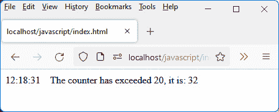

图 3.13 – 计数器超过值 20

## `v-show` 指令

`v-show` 指令与 `v-if` 指令类似。接下来给出一个条件。如果条件为 `true`，则使用该指令的元素将被显示；否则，它不会被显示。

与 `v-if` 指令的区别在于，如果元素未显示，则仅隐藏，但仍然被插入到页面中。而使用 `v-if` 指令时，元素不会被插入（如果条件为 `false`）。

## v-for 指令

`v-for` 指令允许您遍历一组元素或遍历一个对象的所有属性。对于循环的每次迭代，它都会在指令定位的 HTML 元素上插入元素。

让我们假设 `<counter>` 组件是与变量 `counts` 相关的一组计数器，`counts` 是一个 JavaScript 数组。在我们的例子中，每个计数器都是一个字符串（例如，`"Counter 1"`），我们希望以列表的形式显示整个集合（请参阅以下代码片段）。

让我们看看 `v-for` 指令的两种可能形式。

### 使用指令 v-for="count in counts"

让我们使用 `v-for` 指令的第一种形式。它允许访问指令中指定的数组中的每个元素（在我们的例子中，是 JavaScript 的 `counts` 数组）：

以列表形式显示计数器（counter.js 文件）

```js
const Counter = {
```

```js
  data() {
```

```js
    return {
```

```js
      counts : ["Counter 1", "Counter 2", "Counter 3", 
```

```js
      "Counter 4", "Counter 5"]
```

```js
    }
```

```js
  },
```

```js
  template : `
```

```js
    <ul>
```

```js
      <li v-for="count in counts">
```

```js
        <span>{{count}}</span>
```

```js
      </li>
```

```js
    </ul>
```

```js
  `,
```

```js
}
```

```js
export default Counter;
```

在前面的代码中，我们将 `v-for` 指令放置在我们想要重复的元素上（在这种情况下，是 `<li>` 元素）。与 `v-for` 指令关联的值是一个字符串，形式为 `"count in counts"`，我们知道 `counts` 是我们迭代的变量。因此，`count` 变量对应于 `counts` 数组中的每个元素：

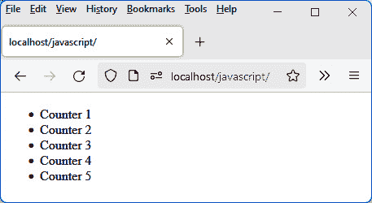

图 3.14 – 使用 v-for 指令

### 使用指令 v-for="count, index) in counts"

`v-for` 指令的第二种形式提供了对数组中每个元素的访问，就像之前一样，但同时也提供了其索引（从 0 开始）：

显示计数器和它们的索引（counter.js 文件）

```js
const Counter = {
```

```js
  data() {
```

```js
    return {
```

```js
      counts : ["Counter 1", "Counter 2", "Counter 3", 
```

```js
      "Counter 4", "Counter 5"]
```

```js
    }
```

```js
  },
```

```js
  template : `
```

```js
    <ul>
```

```js
      <li v-for="(count, index) in counts">
```

```js
        <span>Index {{index}} : {{count}}</span>
```

```js
      </li>
```

```js
    </ul>
```

```js
  `,
```

```js
}
```

```js
export default Counter;
```

运行前面的代码后，显示以下内容：

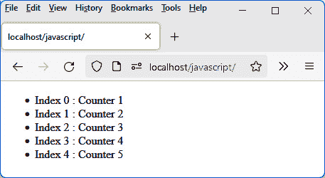

图 3.15 – 在 v-for 指令中使用索引

### 使用带有 v-for 指令的关键属性

`v-for` 指令也可以用于显示大型列表，其中必须保持反应性。也就是说，更改 `v-for` 指令中指定的反应式变量应该更新相应的显示列表。

为了尽可能快地执行更新，Vue.js 使用一个特殊的属性（仅用于此特定情况）命名为 `key`。此属性可以放置在 `v-for` 指令之后。其值必须对列表中的每个项目都是唯一的。例如，索引值对于每个列表元素是唯一的，可以用作 `key` 属性的值：

使用带有 v-for 指令的 key 属性

```js
<li v-for="(count, index) in counts" :key="index">
```

在前面的代码中，属性的值是一个 JavaScript 表达式（变量 `index`）。我们使用 `:key` 而不是 `key`；否则，该属性将始终具有字符串 `"index"` 作为其值（而不是变量 `index` 的值）。

当然，添加 `key` 属性不会产生任何显示变化，但性能上的提升在后续对显示列表的更改中会变得明显（它帮助 Vue.js 跟踪元素并防止不必要的重新渲染）。

## `v-model` 指令

`v-model` 指令用于在交互过程中管理表单元素（字段中的输入、复选框或单选按钮的点击、列表中元素的选取）。

`v-model` 指令用于立即检索输入或选择的结果，而不需要执行任何特定的处理。正是 `v-model` 指令为我们执行了这种更新（反应式变量的更新）。

我们使用 `v-model` 指令的形式 `v-model="varname"`，其中 `varname` 是一个反应式变量的名称，该变量将在输入或选择时更新。

让我们在表单输入字段中使用`v-model`指令。为了清楚地看到使用或不使用它会发生什么，我们显示两个输入字段：一个未使用`v-model`管理，另一个使用：

在表单输入字段中使用 v-model 指令（counter.js 文件）

```js
const Counter = {
```

```js
  data() {
```

```js
    return {
```

```js
      count : 10
```

```js
    }
```

```js
  },
```

```js
  template : `
```

```js
    Without v-model:
```

```js
<input type="text" :value="count" /> &nbsp;&nbsp; 
```

```js
      count = {{count}} <br><br>
```

```js
    With v-model:
```

```js
<input type="text" v-model="count" /> &nbsp;&nbsp; 
```

```js
      count = {{count}}
```

```js
  `,
```

```js
}
```

```js
export default Counter;
```

下面是关于前面程序的几点说明：

+   第一个`<input>`字段不使用`v-model`，只使用`value`属性，其值将根据`count`变量进行更新。

+   第二个`<input>`字段使用与相同`count`变量关联的`v-model`指令。

+   `count`变量的值显示在两个输入字段之后。

当程序启动时，响应式变量`count`的值被传递到第一个输入字段的`value`属性，以及第二个输入字段。这导致了两个输入字段内容的初始化，如下所示：

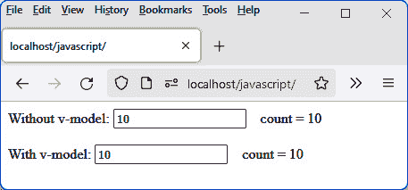

图 3.16 – 程序启动时的显示

如果我们更改第一个输入字段的内容（该字段未使用`v-model`），我们会看到如下所示的内容：

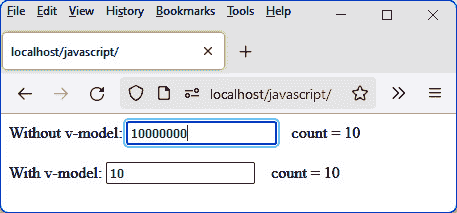

图 3.17 – 不使用 v-model 编辑输入字段

注意，修改输入字段（不使用`v-model`）不会对其关联的响应式变量产生影响。

现在我们来修改由`v-model`管理的第二个输入字段的内容：

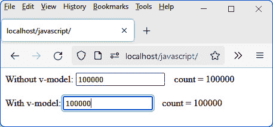

图 3.18 – 使用 v-model 编辑输入字段

我们现在可以看到，使用`v-model`会导致与之关联的响应式变量的立即修改，然后导致第一个输入字段的`value`属性被修改（因为它与响应式变量相关联）。

# 摘要

在本章中，我们主要学习了如何创建一个组件以及与之相关的属性或方法。

现在有必要研究如何管理组件中的用户操作，然后是如何组装组件以形成一个应用程序。
