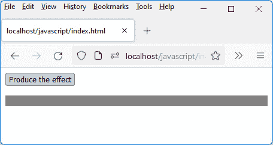

# *第四章*：Vue.js 的高级概念

在本章中，我们将探讨 Vue.js 的高级用法。我们将研究组件中的事件处理，然后组装各种组件以形成一个完整的 Vue.js 应用程序。

为什么了解如何在组件中处理事件很重要？

Vue.js 组件通常是一组 HTML 元素，如构建块，例如按钮、列表和输入字段。因此，了解如何管理这些元素与用户可能采取的行动（如点击按钮、在输入字段中输入值或从列表中选择元素）之间的交互是至关重要的。

同样，为什么了解如何组装组件很重要？

一个 Web 应用程序汇集了许多元素，最终将代表整个应用程序。Vue.js 的原则是将应用程序分解成组件，然后组装它们以形成一个完整的应用程序。我们将学习如何将应用程序分解成组件，然后通过允许它们，例如，共享数据来组装它们。

我们通过展示如何利用 Vue.js 在页面上轻松产生视觉效果来结束本章。

在以下页面中，我们将解释以下主要主题：

+   事件管理

+   组装组件

+   使用视觉效果

# 技术要求

你可以在 GitHub 上找到本章的代码文件：[`github.com/PacktPublishing/JavaScript-from-Frontend-to-Backend/blob/main/Chapter%204.zip`](https://github.com/PacktPublishing/JavaScript-from-Frontend-to-Backend/blob/main/Chapter%204.zip)。

# 事件管理

现在我们来看看如何使用 Vue.js 处理事件。为此，使用 `v-on` 指令，后跟冒号 `:` 和要处理的事件名称。例如，如果你想在一个按钮被点击时执行特定过程，我们将使用按钮上的 `click` 事件，并编写 `v-on:click` 来处理 `click` 事件。指令的值（跟随等号 `=` 的部分）对应于要执行的 JavaScript 表达式（可以是语句或函数调用）。

小贴士

Vue.js 通过更简单地编写 `@click` 来简化编写 `v-on:click`。此规则适用于所有事件。

在这个例子中，我们将实现一个按钮，每次点击都会增加一个响应式变量 `count`。我们还将定义一个在组件的 `methods` 部分中的 `incr()` 方法，用于增加 `count` 变量：

增加计数器 `count`（`counter.js` 文件）

```js
const Counter = {
```

```js
  data() {
```

```js
    return {
```

```js
      count : 0
```

```js
    }
```

```js
  },
```

```js
  template : `
```

```js
    <button @click="count++">Increment counter by 
```

```js
    count++</button> 
```

```js
       &nbsp;&nbsp; count = {{count}} <br><br>
```

```js
    <button @click="incr()">Increment counter by 
```

```js
incr()</button> 
```

```js
      &nbsp;&nbsp; count = {{count}}
```

```js
  `,
```

```js
  methods : {
```

```js
    incr() {
```

```js
      this.count++;
```

```js
    }
```

```js
  }
```

```js
}
```

```js
export default Counter;
```

我们定义了两个按钮，其 `@click` 的值如下：

+   `@click="count++"` (第一个按钮)

+   `@click="incr()"` (第二个按钮)

因此，我们展示了这些书写形式的等价性。

每次点击按钮，计数器都会增加 1。


图 4.1 – 按钮点击管理

在执行处理过程中，可以连续编写多个方法调用（由逗号或分号分隔）。只要这些方法在组件的`methods`部分中定义，就足够了。

例如，`@click="incr();incr()"`允许在每次点击按钮时执行`incr()`方法两次。

我们已经解释了如何在组件的`methods`部分定义的方法中捕获事件并处理它。让我们进一步使用接收事件中传递的参数，例如，知道哪个键盘键被按下。

# 使用`$event`参数

Vue.js 提供了对与事件关联的`Event`对象的访问。然后可以使用该对象获取有关事件的附加信息。信息根据事件类型的不同而不同：

+   鼠标坐标或鼠标上点击的按钮，对于鼠标相关的事件

+   用于键盘相关事件的键盘键，或按下的键的组合（*Ctrl*，*Shift*，*Esc*等）

可以从`$event`变量访问`Event`对象。它可以作为参数传递给处理方法。然后，在事件处理函数中检索此参数。

让我们看看两个示例，说明如何在输入编辑控件中输入字符时使用此参数：

+   通过在输入的数值等于或超过 100 时立即显示错误消息

+   如果编辑控件只能包含数字（这是前一个示例的改进）

## 检查输入的值是否小于 100

让我们使用`$event`参数来检查`counter`输入字段的内容是否小于 100。如果是这样，则使用输入的值更新`count`变量；否则，显示错误消息。

为了实现这一点，我们使用输入字段的`blur`事件，并在事件处理过程中检索输入字段的值。使用响应式的`message`变量来显示错误消息（如果需要）：

注意

当离开输入字段时，例如通过点击输入字段外部，会触发`blur`事件。

如果计数器大于 100（`counter.js`文件），则显示错误消息

```js
const Counter = {
```

```js
  data() {
```

```js
    return {
```

```js
      count : 0,
```

```js
      message : ""
```

```js
    }
```

```js
  },
```

```js
  template : `
```

```js
   count (less than 100): <input type="text" 
```

```js
    :value="count" @blur="valid($event)" />
```

```js
 &nbsp;&nbsp; count = {{count}} 
```

```js
    <br><br>
```

```js
    <span>{{message}}</span>
```

```js
  `,
```

```js
  methods : {
```

```js
    valid(event) {
```

```js
this.message = "";  // reset of the error message 
```

```js
                          // before each check
```

```js
if (event.target.value < 100) this.count = 
```

```js
      event.target.value;
```

```js
      else this.message = "Error: count must be less than 100";
```

```js
    }
```

```js
  }
```

```js
}
```

```js
export default Counter;
```

`$event`参数传递给`valid(event)`处理函数。`event.target`属性提供对 HTML 元素的直接访问。它的`value`属性包含字段的值。

如果输入的值小于 100（这里为 45），则更新计数器：


图 4.2 – 输入授权的值

如果输入的值大于 100（例如，`150`），则显示错误，并恢复计数器的旧值（`45`）。


图 4.3 – 输入禁止的值

然后，我们将查看`$event`参数的另一种用途——只允许输入数字。

## 允许只输入数字

`$event` 参数的另一个用途是只允许在字段中输入数字。其他键盘键被禁止（除了 *退格* 和 *删除* 键，左右箭头键，以及 *Tab* 键）。

为了实现这一点，我们使用 `keydown` 事件，该事件在每次按下键盘上的键时触发：

禁止输入非数字字符（counter.js 文件）

```js
const Counter = {
```

```js
  data() {
```

```js
    return {
```

```js
      count : 0,
```

```js
      message : ""
```

```js
    }
```

```js
  },
```

```js
  template : `
```

```js
    count (less than 100):
```

```js
    <input type="text" :value="count" @blur="valid($event)" 
```

```js
    @keydown="verif($event)"/>
```

```js
      &nbsp;&nbsp; count = {{count}} 
```

```js
    <br><br>
```

```js
    <span>{{message}}</span>
```

```js
  `,
```

```js
  methods : {
```

```js
    valid(event) {
```

```js
      this.message = "";  // reset of the error message 
```

```js
// before each check
```

```js
      if (event.target.value < 100) this.count = event.target.
```

```js
      value;
```

```js
      else this.message = "Error: count must be less than 100";
```

```js
    },
```

```js
    verif(event) {
```

```js
console.log(event.key);   // display in the console 
```

```js
// the value of the key 
```

```js
                                // pressed
```

```js
if (event.key != "Backspace" && event.key != "Delete" 
```

```js
&& 
```

```js
event.key != "ArrowLeft" && event.key != 
```

```js
          "ArrowRight" &&
```

```js
          event.key != "Tab") {
```

```js
        // forbid the key if it is not numeric
```

```js
if (event.key < "0" || event.key > "9") 
```

```js
        event.preventDefault();  // forbidden key
```

```js
      }
```

```js
    }
```

```js
  }
```

```js
}
```

```js
export default Counter;
```

用于过滤键的事件对应于 `keydown`，在按下键盘上的键时被激活。因此，我们指示使用在 `methods` 部分定义的 `verif()` 方法处理每个按键。

使用 event.key 和 event.preventDefault()

`event.key` 参数包含按下的键的代码。对于数值，键码在“0”和“9”之间。为了禁止其他键，我们使用 `event.preventDefault()` 方法（在 JavaScript 中定义），这表示不考虑该事件，因此禁止按键的按下。

我们在 *第三章* 中学习了如何创建组件，以及如何在其中管理事件（本章开头）。一个完整的应用程序由多个组件组成。现在让我们解释如何组装多个组件以形成一个完整的应用程序。

# 组装组件

Vue.js 将应用程序划分为一组组件。然后，这些组件被组装成最终的应用程序。

让我们研究一个如何创建组件然后组装创建的组件的例子。目标是使用三个计数器（与三个输入字段相关联），就像上一个例子中的那样，然后显示这些计数器的总和。当在输入字段中输入数字时，总和会更新。

我们将为此创建两个组件：

+   `<counter>` 组件用于管理一个计数器。

+   `<counters>` 组件允许你一起管理三个计数器并显示总和。

`index.html` 文件将在其 `template` 部分显示 `<counters>` 组件：

index.html 文件

```js
<html>
```

```js
  <head>
```

```js
    <meta charset="utf-8" />
```

```js
    <script src="img/vue@next"></script>
```

```js
  </head>
```

```js
  <body>
```

```js
    <div id="app"></div>
```

```js
  </body>
```

```js
  <script type="module">
```

```js
    import Counters from "./counters.js";
```

```js
    var app = Vue.createApp({
```

```js
      components : {
```

```js
        Counters:Counters
```

```js
      },
```

```js
      template : `
```

```js
        <counters />
```

```js
      `,
```

```js
    });
```

```js
    var vm = app.mount("div#app");
```

```js
  </script>
```

```js
</html>
```

包含的 `counters.js` 文件描述了 `<counters>` 组件。它部分重复了之前章节中解释的内容，并添加了我们现在将描述的新概念。

这些新概念将解释父组件如何通过属性（称为 `props`）与子组件通信，以及子组件如何通过事件和 `$emit()` 方法与父组件通信。

这两个概念使得通过允许它们在子组件和父组件之间进行通信，可以在它们之间组装组件成为可能。

## 使用 $emit() 与父组件通信

让我们首先看看 `<counter>` 组件文件，它描述了一个与输入字段关联的计数器：

`<counter>` 组件（counter.js 文件）

```js
const Counter = {
```

```js
  data() {
```

```js
    return {
```

```js
      count : 0,
```

```js
      old_value : 0
```

```js
    }
```

```js
  },
```

```js
  template : `
```

```js
    <input type="text" v-model="count" 
```

```js
       @keydown="verif($event)" 
```

```js
    @input="calcul()" 
```

```js
       @focus="focus()" 
```

```js
       @blur="blur()" />
```

```js
  `,
```

```js
  methods : {
```

```js
    verif(event) {
```

```js
      if (event.key != "Backspace" && event.key != "Delete" && 
```

```js
          event.key != "ArrowLeft" && event.key != 
```

```js
"ArrowRight" &&
```

```js
          event.key != "Tab") {
```

```js
        // forbid the key if it is not numeric
```

```js
        if (event.key < "0" || event.key > "9") 
```

```js
event.preventDefault();  // key forbidden
```

```js
      }
```

```js
      this.old_value = event.target.value;
```

```js
    },
```

```js
    calcul() {
```

```js
this.$emit("sub", this.old_value || 0);  // subtract 
```

```js
                                               // old value
```

```js
      this.$emit("add", this.count || 0);      // add new value
```

```js
    },
```

```js
    focus() {
```

```js
      if (this.old_value == "0") this.count = "";
```

```js
    },
```

```js
    blur() {
```

```js
      if (!parseInt(this.count)) {
```

```js
        this.old_value = 0; 
```

```js
        this.count = 0;
```

```js
      }
```

```js
    }
```

```js
  },
```

```js
 emits : ["sub", "add"]    // declare events emitted to 
```

```js
                            // the parent
```

```js
}
```

```js
export default Counter;
```

`<counter>`组件已经增加了新的方法，这些方法与新的输入事件相关联。同时，还创建了一个新的响应式变量`old_value`：

+   `old_value`变量包含在按下键盘上的键之前输入字段中的值。

+   `count`变量包含在按下键盘上的键之后输入字段中的值。

为什么要有这种区分？因为要计算所有计数器的总和，每次输入按键时，都需要从字段中移除前一个值（在按键之前）并添加新值（在按键之后）。

每个按键都由`input`事件处理，这里调用`calcul()`方法。由于与三个计数器的总和相关的计算是在较高级别（在父组件`<counters>`中）执行的，你必须向这个父组件指示要减去的总和（`old_value`）和要添加的总数（`count`）。这是通过发送`"sub"`和`"add"`事件，使用`$emit(eventName, value)`方法来完成的。

关于$emit(eventName, value)方法

从组件执行`$emit(eventName, value)`方法会将`eventName`事件发送到父组件，父组件可以使用`@eventName`指令来处理它。如果需要，`value`参数对应于要传输的值。

此外，我们在组件的`emits`部分中指出了该组件可以向其父组件发出的事件列表。

这种在子组件（这里，`<counter>`组件）和其父组件（这里，`<counters>`组件）之间使用事件进行通信的方式是 Vue.js 推荐的方式。

现在让我们看看`<counters>`组件的描述，它包括三个计数器和你在每个字段中输入时的总计计算：

`<counters>`组件（counters.js 文件）

```js
import Counter from "./counter.js";
```

```js
const Counters = {
```

```js
  data() {
```

```js
    return {
```

```js
      total : 0
```

```js
    }
```

```js
  },
```

```js
  components : {
```

```js
    Counter:Counter
```

```js
  },
```

```js
  template : `
```

```js
  Counter 1 : <counter @add="add($event)" 
```

```js
      @sub="sub($event)" /> <br>
```

```js
Counter 2 : <counter @add="add($event)" 
```

```js
      @sub="sub($event)" /> <br>
```

```js
Counter 3 : <counter @add="add($event)" 
```

```js
      @sub="sub($event)" /> <br><br>
```

```js
      Total : {{total}} <br>
```

```js
  `,
```

```js
  methods : {
```

```js
    add(value) {
```

```js
      this.total += parseInt(value);
```

```js
    },
```

```js
    sub(value) {
```

```js
      this.total -= parseInt(value);
```

```js
    }
```

```js
  },
```

```js
}
```

```js
export default Counters;
```

在使用`<counter>`子组件时，`"add"`和`"sub"`事件会在`<counter>`组件的属性中处理。`add(value)`和`sub(value)`处理方法在父组件中注册，这使得每次在键盘上按下数字键时，总数值都可以改变。

当你在字段中输入时，**总计**会更新：


Figure 4.4 – Calculation of the sum of the three counters

我们已经看到了如何使用事件从一个组件向其父组件通信。现在让我们看看如何从组件向其子组件通信。为此，我们使用这里称为 props 的属性。

## 使用 props 与子组件通信

我们已经看到，从子组件向其父组件传递信息是通过事件完成的。反向通信，即从父组件到子组件，是通过称为 `props` 的属性完成的。我们已经在上一章的 *在组件中使用属性* 部分中看到了这些属性的使用。

在这个例子中，我们将改进 `<counters>` 组件，以便我们告诉它我们想要显示的计数器数量。为此，我们在组件中使用 `nb` 属性。例如，我们将编写 `<counters nb="5" />` 来在页面上显示 5 个计数器。每个计数器都按照之前的形式显示，即 `Counter` 后跟从 1 开始的索引（见 *图 4.5*）。

首先，我们将修改 `index.html` 文件，使用 `nb` 属性来编写 `<counters>` 组件。让我们修改之前使用的 `index.html` 文件：

使用 `<counters nb="5" />`（index.html 文件）

```js
<html>
```

```js
  <head>
```

```js
    <meta charset="utf-8" />
```

```js
    <script src="img/vue@next"></script>
```

```js
  </head>
```

```js
  <body>
```

```js
    <div id="app"></div>
```

```js
  </body>
```

```js
  <script type="module">
```

```js
    import Counters from "./counters.js";
```

```js
    var app = Vue.createApp({
```

```js
      components : {
```

```js
        Counters:Counters
```

```js
      },
```

```js
      template : `
```

```js
        <counters nb="5" />
```

```js
      `,
```

```js
    });
```

```js
    var vm = app.mount("div#app");
```

```js
  </script>
```

```js
</html>
```

现在，我们将修改 `counters.js` 文件，将新的 `"nb"` props 集成到组件中：

在 `<counters>` 组件中集成 nb props（counters.js 文件）

```js
import Counter from "./counter.js";
```

```js
const Counters = {
```

```js
  data() {
```

```js
    return {
```

```js
      total : 0
```

```js
    }
```

```js
  },
```

```js
  components : {
```

```js
    Counter:Counter
```

```js
  },
```

```js
  props : ["nb"],
```

```js
  computed : {
```

```js
    NB() {
```

```js
      var tab = [];
```

```js
      for(var i = 0; i < this.nb; i++) tab.push(i+1);
```

```js
      return tab;
```

```js
    }
```

```js
  },
```

```js
  template : `
```

```js
    <div v-for="i in NB">
```

```js
Counter {{i}} : <counter @add="add($event)" 
```

```js
      @sub="sub($event)" />
```

```js
    </div>
```

```js
    <br>
```

```js
    Total : {{total}} <br>
```

```js
  `,
```

```js
  methods : {
```

```js
    add(value) {
```

```js
      this.total += parseInt(value);
```

```js
    },
```

```js
    sub(value) {
```

```js
      this.total -= parseInt(value);
```

```js
    }
```

```js
  },
```

```js
}
```

```js
export default Counters;
```

`"nb"` props 列在组件的 `props` 部分。要显示计数器列表，请在 `<div>` 元素上使用 `v-for` 指令。

如何使用 v-for 指令

对于 `v-for` 指令的值，你必须指定一个数组来遍历。为此，我们将 `"nb"` props 的值转换为一个数组 `[1, 2, 3, …, nb]`。这是通过一个名为 `NB` 的计算属性完成的，它返回所需的数组。

使用 `<counters nb="5">` 组件指示的计数器数量现在已显示。


图 4.5 – 显示五个计数器

我们在这里结束对 Vue.js 组件的研究，这些组件组合在一起形成一个完整的应用程序。

现在，让我们考察 Vue.js 的一个方面，它可以帮助你产生视觉效果，例如，允许使用视觉效果使 HTML 页面上的 HTML 元素出现或消失。

# 使用视觉效果

视觉效果使得通过将视觉动画引入 HTML 页面，使 HTML 页面更加动态。例如，要删除列表中的一个项目，你可以使用透明度效果使其逐渐消失，而不是直接删除而不使用视觉效果。

使用 Vue.js 可以使用视觉效果，特别是使元素从页面中消失或出现。Vue.js 也可以实现不使 HTML 元素从页面中消失或出现的视觉效果（例如，通过点击使元素移动）。有关这些类型动画的更多详细信息，请参阅 [`vuejs.org/guide/extras/animation.html`](https://vuejs.org/guide/extras/animation.html)。我们在这里不解释这些效果，因为可用的文档已经足够清晰，可以用来使用它们。

在本章接下来的内容中，我们将学习与页面上一或多个元素的出现或消失相关的视觉效果。

我们想要帮助出现或消失（使用视觉效果）的元素必须插入到名为 `<transition>` 的组件中。Vue.js 使用此组件来产生效果。

此外，Vue.js 使用了 CSS 类的定义，其中描述了效果的 CSS 属性。只需简单地定义 CSS 类的内容（在下一节中描述），Vue.js 就会在适当的时候使用它们来实现效果。

Vue.js 在元素上使用的 CSS 类取决于元素的状态：它应该出现还是消失？根据其状态（可见或不可见），CSS 类会有所不同。

## 当元素出现时

当 HTML 元素应该出现时，Vue.js 使用的 CSS 类的名称以字符串 `"v-enter"` 开头。类名随后包含后缀 `"-from"` 或 `"-to"`，这将用于描述效果开始时（使用 `"-from"`）或效果结束时（使用 `"-to"`）的元素 CSS 属性。

### Vue.js 使用的 CSS 类

因此，我们将有两个 CSS 类：

+   `v-enter-from`: 这个 CSS 类描述了元素出现效果的开始时的 CSS 属性。

+   `v-enter-to`: 这个 CSS 类描述了元素出现效果的结束时的 CSS 属性。

    注意

    注意，在出现效果的开始时，元素是不可见的，但 `v-enter-from` 类中描述的 CSS 属性会立即应用于它。例如，如果我们将 CSS `opacity` 属性设置为 `1` 应用到 `v-enter-from` 类的 CSS 属性中，元素就会在出现效果开始时立即变得可见。

由于 `v-enter-to` 类描述了效果结束时元素的 CSS 属性，因此当效果完成时，Vue.js 会从元素中移除该 CSS 类。

因此，我们可以看到 CSS 类 `v-enter-from` 和 `v-enter-to` 用于描述元素在效果期间的 CSS 属性，但在效果之后不再在元素上使用（即在效果持续期间之外）。

出现效果将 `v-enter-from` 中描述的 CSS 属性推进到 `v-enter-to` 中描述的属性。为此，Vue.js 使用 `v-enter-active` 类，该类描述了每个 CSS 属性如何演变。

### CSS 类示例内容

让我们看看上述三个 CSS 类（`v-enter-from`、`v-enter-to` 和 `v-enter-active`）的一些示例内容：

`v-enter-from` 类示例

```js
.v-enter-from {
```

```js
  opacity: 0;
```

```js
  background-color:#FFCCCC;
```

```js
}
```

在这里，我们指示元素将在效果的开始时不可见（`opacity:0`）并且具有背景颜色（`background-color:#FFCCCC`）：

`v-enter-to` 类示例

```js
.v-enter-to {
```

```js
  opacity: 0.5;
```

```js
  background-color:black;
```

```js
}
```

在这里，我们指示元素将在效果的结束时半透明（`opacity:0.5`）并且具有黑色背景（`background-color:black`）：

`v-enter-active` 类示例

```js
.v-enter-active {
```

```js
  transition: opacity 2s, background-color 2s;
```

```js
}
```

在这里，我们指出 CSS 的 `opacity` 和 `background-color` 属性必须各自演变两秒钟。由于所有指定的 CSS 属性以相同的时间演变，我们可以通过简写形式简化代码。以下是这样做的方法：

`v-enter-active` 类示例（简写形式）

```js
.v-enter-active {
```

```js
  transition: all 2s;
```

```js
}
```

`all` 关键字覆盖了所有指定的 CSS 属性。

### 使用 CSS 类

现在，让我们展示如何使用这些 CSS 类在程序中使用一个按钮来显示具有效果的段落。按钮的作用将是隐藏或显示段落，当段落出现时，效果将在该段落上发生。

这展示了 Vue.js 如何使用 `v-enter-from`、`v-enter-to` 和 `v-enter-active` CSS 类在元素出现在页面上时产生效果：

使用按钮产生出现效果（index.html 文件）

```js
<html>
```

```js
  <head>
```

```js
    <meta charset="utf-8" />
```

```js
    <script src="img/vue@next"></script>
```

```js
    <style type="text/css">
```

```js
      .v-enter-from {
```

```js
        opacity: 0;
```

```js
        background-color:#FFCCCC;
```

```js
      }
```

```js
      .v-enter-to {
```

```js
        opacity: 0.5;
```

```js
        background-color:black;
```

```js
      }
```

```js
      .v-enter-active {
```

```js
        transition: opacity 2s, background-color 2s;
```

```js
      }
```

```js
    </style>
```

```js
  </head>
```

```js
  <body>
```

```js
    <div id="app"></div>
```

```js
  </body>
```

```js
  <script>
```

```js
    var app = Vue.createApp({
```

```js
      data() {
```

```js
        return {
```

```js
          show: false    // initially hidden
```

```js
        }
```

```js
      },
```

```js
      template : `
```

```js
     <button @click="show=!show">Produce the 
```

```js
        effect</button>
```

```js
        <transition>
```

```js
          <p v-if="show">
```

```js
            Paragraph 1
```

```js
          </p>
```

```js
        </transition>   
```

```js
      `,
```

```js
    });
```

```js
    var vm = app.mount("div#app");
```

```js
  </script>
```

```js
</html>
```

我们已经描述了 `v-enter-from`、`v-enter-to` 和 `v-enter-active` CSS 类的内容，Vue.js 将使用这些类来产生效果。然后我们插入了 `<transition>` 元素，从而允许 Vue.js 知道要在哪个元素上应用效果。

段落在启动时被隐藏（因为响应式变量 `show` 被设置为 `false`）。点击 `show` 变量将其设置为 `true`，这会启动效果。

注意

效果是在段落上启动的，归功于 `<transition>` 组件，它包括要显示的段落。正是这个 `<transition>` 组件让 Vue.js 知道要在哪个元素上产生效果。

注意到效果持续了两个秒，正如 CSS `transition` 属性所指示的，当效果结束时，CSS 类从 `<p>` 元素中移除，此时它变成了一个正常的段落（没有背景颜色，透明度为 1）。所以，你看到段落在效果结束时（在 `v-enter-to` 中指示的）具有 0.5 的透明度，然后在 `v-enter-to` 类被 Vue.js 在效果结束时移除后，突然变为透明度为 1。

注意

因此，最好在 `v-enter-to` 类中指定元素不再产生效果时的 CSS 值，以使效果更加和谐。

让我们运行前面的程序。当程序启动时，段落被隐藏：


图 4.6 – 程序启动时段落被隐藏

点击 `v-enter-from`、`v-enter-to` 和 `v-enter-active` 类后。


图 4.7 – 点击“产生效果”按钮后，段落逐渐出现

在效果结束前，段落具有 `v-enter-to` 类中设置的 CSS 属性，因此其背景颜色为黑色，但透明度为 0.5，背景颜色仍然是灰色，段落文本不可见。



图 4.8 – 效果结束前的段落

在效果结束时，CSS 类被移除，使得段落以正常的方式出现，黑色且没有背景颜色。


图 4.9 – 出现效果结束时的段落

当段落出现后，点击按钮将 `show` 设置为 `false`。

我们已经看到了元素在页面上出现时的不同类和阶段。现在让我们看看当元素从页面上消失时会发生什么。我们会看到元素的出现和消失有很多相似之处。

## 当元素消失时

当元素应该消失时，Vue.js 使用与之前类似的 CSS 类，将字符串 `"enter"` 替换为字符串 `"leave"`。

### Vue.js 使用的 CSS 类

因此，我们将有以下两个 CSS 类：

+   `v-leave-from`：这个 CSS 类描述了元素消失效果的开始时的 CSS 属性。

+   `v-leave-to`：这个 CSS 类描述了元素消失效果结束时的 CSS 属性。

消失效果是将 `v-leave-from` 中描述的 CSS 属性过渡到 `v-leave-to` 中描述的属性。效果完成后，`v-leave-to` 类将从元素的 CSS 类中移除。

为了在这两个类中显示的值之间过渡 CSS 属性，Vue.js 使用 `v-leave-active` CSS 类，它描述了 CSS 属性的过渡。

### CSS 类的示例内容

让我们看看上面提到的三个 CSS 类（`v-leave-from`、`v-leave-to` 和 `v-leave-active`）的一些示例内容：

v-leave-from 类示例

```js
.v-leave-from {
```

```js
  opacity: 1;
```

```js
  background-color:#FFCCCC;
```

```js
}
```

在这里，我们指示元素在效果开始时将完全可见（`opacity:1`）并且将具有背景颜色（`background-color:#FFCCCC`）：

v-leave-to 类示例

```js
.v-leave-to {
```

```js
  opacity: 0;
```

```js
  background-color:black;
```

```js
}
```

在这里，我们指示元素在效果结束时将不可见（`opacity:0`）并且将具有黑色背景颜色（`background-color:black`）：

v-leave-active 类示例

```js
.v-leave-active {
```

```js
  transition: opacity 2s, background-color 2s;
```

```js
}
```

在这里，我们指示 CSS 的 `opacity` 和 `background-color` 属性必须各自演变，每个属性持续两秒钟。由于所有指定的 CSS 属性以相同的时间演变，你可以通过简写形式来简化代码：

v-leave-active 类示例

```js
.v-leave-active {
```

```js
  transition: all 2s;
```

```js
}
```

`all` 关键字覆盖了所有指定的 CSS 属性。

### 使用 CSS 类

现在我们来展示如何在程序中使用这些 CSS 类，使用一个按钮来隐藏带有效果的段落。这个程序几乎和之前一样，但在这里，当段落消失时，我们产生一个效果：

使用按钮产生消失效果（index.html 文件）

```js
<html>
```

```js
  <head>
```

```js
    <meta charset="utf-8" />
```

```js
    <script src="img/vue@next"></script>
```

```js
    <style type="text/css">
```

```js
      .v-leave-from {
```

```js
        opacity: 1;
```

```js
        background-color:#FFCCCC;
```

```js
      }
```

```js
      .v-leave-to {
```

```js
        opacity: 0;
```

```js
        background-color:black;
```

```js
      }
```

```js
      .v-leave-active {
```

```js
        transition: all 2s;
```

```js
      }
```

```js
    </style>
```

```js
  </head>
```

```js
  <body>
```

```js
    <div id="app"></div>
```

```js
  </body>
```

```js
  <script>
```

```js
    var app = Vue.createApp({
```

```js
      data() {
```

```js
        return {
```

```js
          show: true   // visible at start
```

```js
        }
```

```js
      },
```

```js
      template : `
```

```js
        <button @click="show=!show">Produce the effect</button>
```

```js
        <transition>
```

```js
          <p v-if="show">
```

```js
            Paragraph 1
```

```js
          </p>
```

```js
        </transition>   
```

```js
      `,
```

```js
    });
```

```js
    var vm = app.mount("div#app");
```

```js
  </script>
```

```js
</html>
```

`v-leave-from` 类在效果开始时应用。它表示元素是可见的（`opacity` 为 1）并且具有背景颜色 `#FFCCCC`（鲑鱼色）。

`v-leave-to` 类表示当效果结束时 CSS 属性的值。段落变为不可见（`opacity` 为 0）并且具有黑色背景颜色。但随着元素变得越来越不可见（`opacity` 趋向于 0），黑色背景颜色也越来越不明显。

如果我们在 CSS 部分中编写 `enter` 和 `leave` 类，并且每次点击按钮，我们就会得到段落相关的出现或消失的效果。

这里使用的 CSS 类具有固定的名称，无论使用哪种效果。这不允许使用多个效果，因为所有的视觉效果都会使用相同的 CSS 类名称。

为了这个，Vue.js 允许你给每个效果命名，从而能够使用不同的 CSS 类名称。

# 为效果使用名称

类型为 `"v-enter-xxx"` 或 `"v-leave-xxx"` 的类可以被重命名，以表示它们关联的效果。我们只需将字符串 `"v-"` 替换为效果的名称，然后跟一个 `"-"`。

例如，`"v-enter-from"` 将被替换为 `"fade-enter-from"`，以给效果命名为 `"fade"`。然后我们添加 `name="fade"` 属性到 `<transition>` 组件中，表示 `<transition name="fade">`。

这允许我们将多个效果集成到我们的应用程序中，通过定义对应每个效果的 CSS 类。

之前的程序，将名为 `"fade"` 的效果集成到段落中，写法如下：

淡入淡出效果（index.html 文件）

```js
<html>
```

```js
  <head>
```

```js
    <meta charset="utf-8" />
```

```js
    <script src="img/vue@next"></script>
```

```js
    <style type="text/css">
```

```js
      .fade-leave-from {
```

```js
        opacity: 1;
```

```js
        background-color:#FFCCCC;
```

```js
      }
```

```js
      .fade-leave-to {
```

```js
        opacity: 0;
```

```js
        background-color:black;
```

```js
      }
```

```js
      .fade-leave-active {
```

```js
        transition: all 2s;
```

```js
      }
```

```js
      .fade-enter-from {
```

```js
        opacity: 0;
```

```js
        background-color:#FFCCCC;
```

```js
      }
```

```js
      .fade-enter-to {
```

```js
        opacity: 1;
```

```js
        background-color:black;
```

```js
      }
```

```js
      .fade-enter-active {
```

```js
        transition: opacity 2s, background-color 2s;
```

```js
      }      
```

```js
    </style>
```

```js
  </head>
```

```js
  <body>
```

```js
    <div id="app"></div>
```

```js
  </body>
```

```js
  <script>
```

```js
    var app = Vue.createApp({
```

```js
      data() {
```

```js
        return {
```

```js
          show: true
```

```js
        }
```

```js
      },
```

```js
      template : `
```

```js
        <button @click="show=!show">Produce the 
```

```js
effect</button>
```

```js
        <transition name="fade">
```

```js
          <p v-if="show">
```

```js
            Paragraph 1
```

```js
          </p>
```

```js
        </transition>   
```

```js
      `,
```

```js
    });
```

```js
    var vm = app.mount("div#app");
```

```js
  </script>
```

```js
</html>
```

`<transition>` 组件只能有一个元素，这个元素将是效果将要发生作用的元素。要包含多个元素，必须使用 `<transition-group>` 组件，我们将在下面进行解释。

# 在多个元素上产生效果

`<transition>` 组件只能包含一个元素。当必须将效果应用于多个元素时，必须创建多个 `<transition>` 组件或将元素分组在 `<transition-group>` 组件中。在这个例子中，让我们看看如何使用 `<transition-group>` 组件：

使用 `<transition-group>` 组件

```js
<transition-group name="fade">
```

```js
  <p v-if="show">
```

```js
    Paragraph 1
```

```js
  </p>
```

```js
  <p v-if="show">
```

```js
    Paragraph 2
```

```js
  </p>
```

```js
</transition-group>   
```

发生效果的元素（这里，两个段落）被分组在一个 `<transition-group>` 元素中，而不是之前在只有一个段落发生效果时使用的 `<transition>` 元素。

现在，我们将看看如何编写与一些经典效果相关的 CSS 类。

# 常用效果的示例

下面是一些效果的描述。通过几行 CSS 代码，你可以轻松地产生经典的段落缩放（缩放效果）、逐渐消失/出现（透明度效果）以及垂直位移（`ymove` 效果）。你可以自由选择这些效果的名称，并象征性地表示产生的效果。

## 缩放效果

要使用缩放效果（这里称为 `"shrink"`），我们使用 CSS `font-size` 属性。

在效果开始时，段落是正常大小的：


图 4.10 – 消失效果开始时段落是正常大小

一旦点击按钮开始效果，段落会减小到消失。


图 4.11 – 段落减小到消失

一旦段落消失，再次点击按钮后可以重新出现。段落大小会增加，直到达到其正常大小：

处理缩放效果的 CSS 类

```js
.shrink-leave-from {
```

```js
}
```

```js
.shrink-leave-to {
```

```js
  font-size: 0px;
```

```js
}
```

```js
.shrink-leave-active {
```

```js
  transition: all 2s;
```

```js
}
```

```js
.shrink-enter-from {
```

```js
  font-size: 0px;
```

```js
}
```

```js
.shrink-enter-to {
```

```js
}
```

```js
.shrink-enter-active {
```

```js
  transition: all 2s;
```

```js
}
```

CSS 类 `shrink-leave-to` 指示，对于消失效果，字体大小将变为 0px，即段落的字体大小减少到 0，使段落变得不可见。

`shrink-enter-from` CSS 类指示效果从 0px 的字体大小开始，逐渐增长到可见时的正常段落大小。

如果起始类中没有指定 CSS 属性（例如，`shrink-leave-from` 类不包含 `font-size` 属性），这意味着将使用该 CSS 属性的当前值在元素中。

同样，如果到达类中没有指定 CSS 属性（例如，`shrink-enter-to` 类不包含 `font-size` 属性），这意味着我们正在向效果结束时元素将可见的该 CSS 属性的值前进。

## 透明度效果

命名为 `"fade"` 的效果使用 CSS `opacity` 属性。此效果包括将 CSS `opacity` 属性从 0 变化到 1（逐渐使元素出现）或从 1 变化到 0（使其消失）。

例如，这是消失效果。段落正在以透明度逐渐减小到 0 的方式消失。当透明度为 0 时，元素将在屏幕上完全不可见。


图 4.12 – 段落的透明度逐渐减小到 0

一旦段落变得不可见，只需再次点击 **产生效果** 按钮，就可以让它逐渐重新出现：

管理透明度的 CSS 类

```js
.fade-leave-from {
```

```js
}
```

```js
.fade-leave-to {
```

```js
  opacity : 0;
```

```js
}
```

```js
.fade-leave-active {
```

```js
  transition: all 0.5s;
```

```js
}
```

```js
.fade-enter-from {
```

```js
  opacity : 0;
```

```js
}
```

```js
.fade-enter-to {
```

```js
}
```

```js
.fade-enter-active {
```

```js
  transition: all 1s;
```

```js
}
```

`fade-leave-to` CSS 类表示将不透明度变为 0。当前的不透明度（值为 1）是起始值。由于不透明度的初始值在 `fade-leave-from` 中未定义，它将使用元素 CSS 中定义的值（即 1）。

类似地，`fade-enter-from` 类表示元素出现效果开始时的当前不透明度。不透明度的目标值不需要指定，因为它将使用元素的默认 CSS 值，即 1。

## 向下移动效果

要管理此效果（在此处称为 `"ymove"`），我们使用 CSS 属性 `transform`（设置为 `translateY(100px)`）和 `opacity`（设置为 0）。这逐渐将元素向下移动 100 像素，逐渐减少其不透明度至 0。元素在向下移动页面的过程中消失。

例如，当元素开始通过减少其不透明度向下滑动时，显示的内容如下：


图 4.13 – 段落通过减少其不透明度向下移动页面

随着效果的继续，段落向下移动页面，直到达到效果中指定的 100 像素距离。你越接近这个距离，段落的不透明度就降低得越多，直到变得看不见（不透明度为 0）。


图 4.14 – 在效果结束时，段落几乎看不见

一旦段落消失，点击 **产生效果** 按钮会使它从屏幕底部逐渐重新出现：

处理向下移动的 CSS 类

```js
.ymove-leave-from {
```

```js
}
```

```js
.ymove-leave-to {
```

```js
  transform: translateY(100px);
```

```js
  opacity : 0;
```

```js
}
```

```js
.ymove-leave-active {
```

```js
  transition: all 0.5s;
```

```js
}
```

```js
.ymove-enter-from {
```

```js
  transform: translateY(100px);
```

```js
  opacity : 0;
```

```js
}
```

```js
.ymove-enter-to {
```

```js
}
```

```js
.ymove-enter-active {
```

```js
  transition: all 0.5s;
```

```js
}
```

`ymove-leave-to` CSS 类表示我们想要变化的指示 CSS 属性的值。`transform` 属性可以包含 `translateY(100px)` 值，表示执行 100 像素的垂直平移（`Y`）。添加不透明度为 0 使元素通过垂直移动消失。

`ymove-enter-from` CSS 类允许你在出现效果的开始处指定 CSS 属性的值。元素位于垂直距离 100 像素处，不透明度为 0。CSS 属性将演变到 `ymove-enter-to` 类中指定的属性，如果没有在此类中指定任何内容，则通常用于元素的 CSS 属性（不透明度为 1 和垂直距离为 0，即正常位置）是我们将在出现效果期间演变到的属性。

CSS 的 `transform` 属性在产生视觉效果方面非常有用，例如旋转、放大和位移。

这就带我们结束了本章的内容。

# 摘要

在学习了如何处理事件并在外部事件（例如，点击）发生时采取行动之后，在本章中我们看到了如何使用 Vue.js 创建的组件可以组合成完整的应用程序。我们学到了以下内容：

+   要从组件与其父组件之间进行通信，我们使用事件。

+   要从组件与其子组件之间进行通信，我们使用组件的`props`部分中的属性。

最后，为了产生视觉效果，你只需要编写由 Vue.js 管理的 CSS 类。

在下一章中，我们将看到一个应用程序的例子，它允许我们将前几章中学习到的元素付诸实践。
