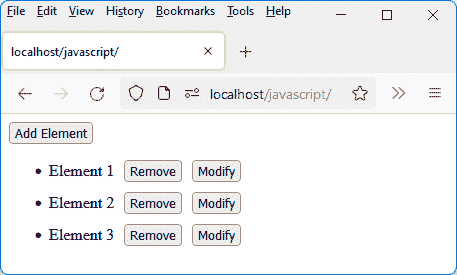
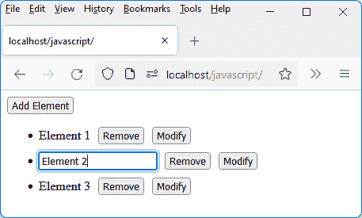
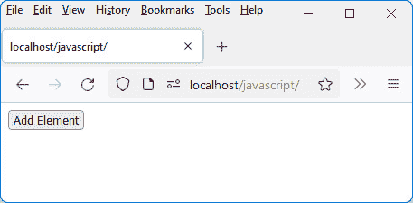
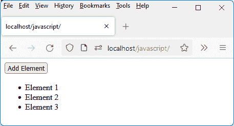
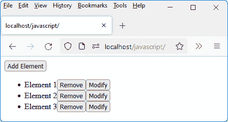
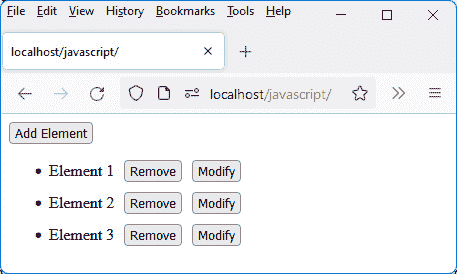
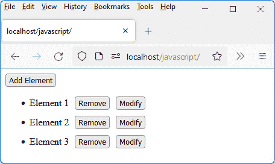
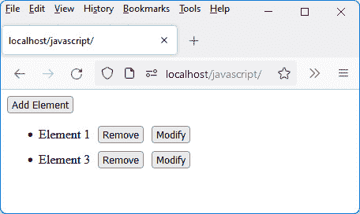
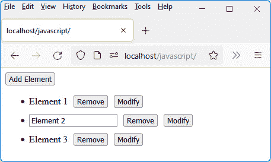
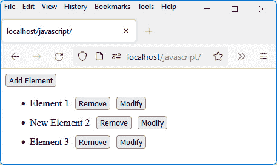

# 第五章：*第五章*：使用 Vue.js 管理列表

在了解了 Vue.js 的基本和高级概念之后，通过本章，让我们通过构建一个应用程序来管理元素列表，来完成我们对 Vue.js 库的学习。

为什么要制作这种类型的应用程序？很简单，因为它允许你执行对页面 HTML 元素的标准操作，例如插入元素、修改它和删除它。

这些是你需要知道如何执行的基本操作，例如，在数据库中管理元素。在本章中，我们将学习如何在屏幕上显示的元素上执行这些操作，在下一部分（我们学习 Node.js 和 MongoDB）中，我们将看到如何同时更新数据库。

本章涵盖了以下主题：

+   将应用程序拆分为组件

+   向列表中添加元素

+   从列表中删除元素

+   修改列表中的元素

但让我们先来发现我们想要用 Vue.js 创建的应用程序的界面。

# 技术要求

你可以在 GitHub 上找到本章的代码文件：[`github.com/PacktPublishing/JavaScript-from-Frontend-to-Backend/blob/main/Chapter%205.zip`](https://github.com/PacktPublishing/JavaScript-from-Frontend-to-Backend/blob/main/Chapter%205.zip)。

# 显示应用程序屏幕

如前所述，我们将构建一个用于管理元素列表的应用程序。在编写我们应用程序的源代码之前，让我们通过解释它们的顺序来展示应用程序的不同屏幕。

初始时，列表为空。**添加元素**按钮允许在每次点击时向列表中插入一个新元素。


图片 5.1 – 启动应用程序时的屏幕

让我们多次点击**添加元素**按钮（这里，点击了三次）：



图片 5.2 – 点击添加元素按钮三次后的效果

每个插入的元素都有列表中元素的索引（从 1 开始）。在列表项后面插入一个**删除**按钮和一个**修改**按钮。

让我们在第二行点击**修改**按钮。项目文本被替换为一个输入字段，光标闪烁以允许编辑。



图片 5.3 – 列表中的第二个元素可以更改

让我们修改输入字段中的文本，输入 `New Element 2`。


图片 5.4 – 编辑列表项

要使元素的修改反映出来，你必须通过在页面上其他地方点击来离开输入字段。


图片 5.5 – 考虑到元素的修改

最后，要删除第一和第三个元素，请点击它们对应的**删除**按钮。


图 5.6 – 删除第一和最后一个元素后

我们已经管理了一个元素列表，并对它执行了基本操作，即插入新元素、修改元素和删除元素。

使用 HTTP 协议

这个应用使用 PHP 服务器来工作，因为只有在使用 HTTP 协议的情况下，JavaScript 模块的导入才能通过 JavaScript 的`import`语句进行。我们将在下一部分（*第九章**，将 Vue.js 与 Node.js 集成）中看到如何使用 Node.js 服务器来实现这一点，同时将其与 MongoDB 数据库结合使用。

我们已经描述了应用的操作以及各种窗口的顺序。现在让我们看看如何使用 Vue.js 构建这个应用。我们首先解释如何将应用分解为不同的组件。

# 将应用拆分为组件

当你使用 Vue.js 创建一个应用时，你必须首先问自己你需要哪些组件来构建它。

在我们的情况下，它将是以下内容：

+   一个将整个应用组合在一起的`<GlobalApp>`组件。正是这个`<GlobalApp>`组件将被集成到我们的`index.html`页面中。它将显示**添加元素**按钮以及下面的元素列表。

+   一个显示列表元素的`<Element>`组件，它将包括元素的文本、**删除**按钮和**修改**按钮。

元素列表将与一个名为`elements`的反应变量相关联，它将是一个数组，包含每个元素的显示文本。这个反应变量将在`<GlobalApp>`组件中注册。当向列表中添加新元素或删除或修改列表中的元素时，它将被修改。

因此，我们应用的核心文件如下：

+   `index.html`文件，这是主文件

+   包含`<GlobalApp>`组件的`global-app.js`文件，它被导入到`index.html`文件中

+   `element.js`文件，它描述了显示列表中的一个元素（即`<Element>`组件），包括元素的文本以及**删除**和**修改**按钮

下面是这些文件的内容：

index.html 文件

```js
<html>
```

```js
  <head>
```

```js
    <meta charset="utf-8" />
```

```js
    <script src="img/vue@next"></script>
```

```js
  </head>
```

```js
  <body>
```

```js
    <div id="app"></div>
```

```js
  </body>
```

```js
  <script type="module">
```

```js
    import GlobalApp from "./global-app.js";
```

```js
    var app = Vue.createApp({
```

```js
      components : {
```

```js
        GlobalApp:GlobalApp
```

```js
      },
```

```js
      template : "<GlobalApp />"
```

```js
    });
```

```js
    var vm = app.mount("div#app");
```

```js
  </script>
```

```js
</html>
```

`index.html`文件显示`<GlobalApp>`组件，这是应用的主组件，我们现在将对其进行描述：

`<GlobalApp>`组件（global-app.js 文件）

```js
import Element from "./element.js";
```

```js
const GlobalApp = {
```

```js
  data() {
```

```js
    return {
```

```js
      elements : []
```

```js
    }
```

```js
  },
```

```js
  components : {
```

```js
    Element:Element
```

```js
  },
```

```js
  template : `
```

```js
    <button>Add Element</button>
```

```js
    <ul></ul>
```

```js
  `,
```

```js
}
```

```js
export default GlobalApp;
```

我们发现反应变量`elements`以及元素的`<ul>`列表目前为空。

下面是对`<Element>`组件的描述。目前它是空的，将在以下章节中丰富：

`<Element>`组件（element.js 文件）

```js
const Element = {
```

```js
  data() {
```

```js
    return {
```

```js
    }
```

```js
  },
```

```js
  template : `
```

```js
  `,
```

```js
}
```

```js
export default Element;
```

使用 HTTP 协议

由于 JavaScript 代码包含模块 `import` 指令，因此需要使用可通过 HTTP 访问的 Web 服务器来显示与 `index.html` 对应的 HTML 页面。`file` 协议在这里不起作用。

让我们在屏幕上显示这段临时代码的结果：



图 5.7 – 使用我们的启动代码显示的结果

在 *图 5.7* 中，我们看到 `<GlobalApp>` 组件的渲染，该组件目前仅显示 **添加元素** 按钮。让我们看看如何处理对该按钮的点击，以便在列表中插入新元素。

# 向列表中添加元素

我们将从向列表中添加项的功能开始。`global-app.js` 文件被修改以处理对 `global-app.js` 文件的点击）。

让我们添加当点击**添加元素**按钮时应运行的代码：

考虑到点击“添加元素”按钮（global-app.js 文件）

```js
import Element from "./element.js";
```

```js
const GlobalApp = {
```

```js
  data() {
```

```js
    return {
```

```js
      elements : []
```

```js
    }
```

```js
  },
```

```js
  components : {
```

```js
    Element:Element
```

```js
  },
```

```js
  template : `
```

```js
    <button @click="add()">Add Element</button>
```

```js
    <ul>
```

```js
<li v-for="(element, index) in elements" 
```

```js
      :key="index">{{element}}</li>
```

```js
    </ul>
```

```js
  `,
```

```js
  methods : {
```

```js
    add() {
```

```js
var element = "Element " + (this.elements.length + 
```

```js
      1);  // "Element X"
```

```js
      this.elements.push(element);
```

```js
    }
```

```js
  }
```

```js
}
```

```js
export default GlobalApp;
```

点击 `click` 事件，该事件调用在 `methods` 部分定义的 `add()` 方法。`add()` 方法将新元素添加到响应式变量 `elements`。

元素列表在组件模板中更新。目前，我们将使用 `<li>` 标签来定义要插入的列表元素，但下面，我们将使用 `<Element>` 组件，该组件将集成 **删除** 和 **修改** 按钮。

现在，让我们验证我们对 `<GlobalApp>` 组件的修改是否有效。为此，多次点击 **添加元素** 按钮。每次点击都会插入列表项，如以下图所示。



图 5.8 – 添加元素按钮点击

这里插入的元素是一个 HTML `<li>` 元素。但是，用 Vue.js 组件替换 `<li>` 元素很有趣，因为它允许使用 Vue.js 的哲学，即最大程度地使用组件。让我们将这个新组件命名为 `<Element>`，它将替换 `<li>` 元素。

## 使用 <Element> 组件

接下来，让我们使用 `<Element>` 组件，而不是之前的 `<li>` 元素。

`<GlobalApp>` 组件被修改以集成 `<Element>` 组件：

在列表中使用 <Element> 组件（global-app.js 文件）

```js
import Element from "./element.js";
```

```js
const GlobalApp = {
```

```js
  data() {
```

```js
    return {
```

```js
      elements : []
```

```js
    }
```

```js
  },
```

```js
  components : {
```

```js
    Element:Element
```

```js
  },
```

```js
  template : `
```

```js
    <button @click="add()">Add Element</button>
```

```js
    <ul>
```

```js
      <Element v-for="(element, index) in elements" 
```

```js
      :key="index" :text="element" />
```

```js
    </ul>
```

```js
  `,
```

```js
  methods : {
```

```js
    add() {
```

```js
      var element = "Element " + (this.elements.length + 
```

```js
      1);
```

```js
      this.elements.push(element);
```

```js
    }
```

```js
  }
```

```js
}
```

```js
export default GlobalApp; 
```

要在列表项中显示的文本作为属性（通过 `props`）传递给 `<Element>` 组件，该组件将在其模板中显示它。我们使用 `text` 属性（或任何其他属性名称）来做到这一点。

`<Element>` 组件被修改以考虑传递的 `text` 属性并显示列表元素。在文本之后插入两个按钮 **删除** 和 **修改**：

使用文本属性和按钮（element.js 文件）

```js
const Element = {
```

```js
  data() {
```

```js
    return {
```

```js
    }
```

```js
  },
```

```js
  template : `
```

```js
    <li> 
```

```js
      <span> {{text}} </span>
```

```js
<button> Remove </button> 
```

```js
      <button> Modify </button>
```

```js
    </li>
```

```js
  `,
```

```js
  props : ["text"],
```

```js
}
```

```js
export default Element;
```

让我们检查结果是否与之前的结果相同（添加了 **删除** 和 **修改** 按钮）。



图 5.9 – 在列表中使用 <Element> 组件

点击列表中的 **移除** 和 **修改** 按钮目前不起作用，但将在接下来的章节中实现。

**移除** 和 **修改** 按钮并排放置，没有间隔。让我们添加一些 CSS 代码来更好地在屏幕上布局它们。

## 使用 CSS 代码更改列表的外观

在处理列表中的按钮点击之前，让我们使用一些 CSS 以更美观的方式显示列表项。

CSS 代码直接在 `index.html` 文件中指示：

使用 CSS 代码显示列表（index.html 文件）

```js
<html>
```

```js
  <head>
```

```js
    <meta charset="utf-8" />
```

```js
    <script src="img/vue@next"></script>
```

```js
    <style type="text/css">
```

```js
      li {
```

```js
        margin-top:10px;
```

```js
      }
```

```js
      ul button {
```

```js
        margin-left:10px;
```

```js
      }
```

```js
    </style>
```

```js
  </head>
```

```js
  <body>
```

```js
    <div id="app"></div>
```

```js
  </body>
```

```js
  <script type="module">
```

```js
    import GlobalApp from "./global-app.js";
```

```js
    var app = Vue.createApp({
```

```js
      components : {
```

```js
        GlobalApp:GlobalApp
```

```js
      },
```

```js
      template : "<GlobalApp />"
```

```js
    });
```

```js
    var vm = app.mount("div#app");
```

```js
  </script>
```

```js
</html>
```

我们可以看到，列表的外观现在更加令人愉悦。



图 5.10 – 使用 CSS 代码改进的元素列表

显示的列表现在有了我们想要的样式！我们现在必须管理对 **移除** 和 **修改** 按钮的点击。让我们从 **移除** 按钮开始。

# 从列表中删除元素

现在，让我们处理对 `elements` 的点击。

注意

事实上，变量 `elements` 是响应式的，任何对这个变量的修改都将导致列表的重新显示。

要做到这一点，在每次点击时，在 `<Element>` 组件中定义的 `remove()` 方法上点击：

考虑到对移除按钮的点击（element.js 文件）

```js
const Element = {
```

```js
  data() {
```

```js
    return {
```

```js
    }
```

```js
  },
```

```js
  template : `
```

```js
    <li> 
```

```js
      <span> {{text}} </span>
```

```js
      <button @click="remove()"> Remove </button> 
```

```js
      <button> Modify </button>
```

```js
    </li>
```

```js
  `,
```

```js
  props : ["text"],
```

```js
  methods : {
```

```js
    remove() {
```

```js
      // process the click on the Remove button
```

```js
    },
```

```js
  },
```

```js
}
```

```js
export default Element;.
```

在本章后面将讨论点击 **移除** 按钮涉及的过程。

注意

要处理对 `elements` 的点击，但由于这位于父组件 `<GlobalApp>` 中，我们必须向这个父组件发送一个事件，请求它从变量 `elements` 中移除元素。

要指明要删除的元素，必须通过其索引来引用。为此，我们需要在创建 `<Element>` 组件时指明元素的索引。因此，我们在这个组件中创建了一个新的属性（命名为 `"index"`）。因此，`remove()` 方法向 `<GlobalApp>` 父组件发送一个 `"remove"` 事件，在参数中指明要从列表中删除的元素的索引。

`<Element>` 组件变为以下形式：

处理移除按钮的点击（element.js 文件）

```js
const Element = {
```

```js
  data() {
```

```js
    return {
```

```js
    }
```

```js
  },
```

```js
  template : `
```

```js
    <li> 
```

```js
      <span> {{text}} </span>
```

```js
      <button @click="remove()"> Remove </button> 
```

```js
      <button> Modify </button>
```

```js
    </li>
```

```js
  `,
```

```js
  props : ["text", "index"],
```

```js
  methods : {
```

```js
    remove() {
```

```js
      // process the click on the Remove button
```

```js
      this.$emit("remove", { index : this.index });
```

```js
    },
```

```js
  },
```

```js
  emits : ["remove"]
```

```js
}
```

```js
export default Element;
```

`<GlobalApp>` 组件被修改以处理接收当点击 **移除** 按钮时发送的 `"remove"` 事件：

处理“remove”事件的接收（global-app.js 文件）

```js
import Element from "./element.js";
```

```js
const GlobalApp = {
```

```js
  data() {
```

```js
    return {
```

```js
      elements : []
```

```js
    }
```

```js
  },
```

```js
  components : {
```

```js
    Element:Element
```

```js
  },
```

```js
  template : `
```

```js
    <button @click="add()">Add Element</button>
```

```js
    <ul>
```

```js
      <Element v-for="(element, index) in elements" 
```

```js
      :key="index" :text="element" 
```

```js
           :index="index"
```

```js
               @remove="remove($event)"
```

```js
      />
```

```js
    </ul>
```

```js
  `,
```

```js
  methods : {
```

```js
    add() {
```

```js
      var element = "Element " + (this.elements.length + 
```

```js
      1);
```

```js
      this.elements.push(element);
```

```js
    },
```

```js
    remove(params) {
```

```js
      var index = params.index;
```

```js
this.elements.splice(index, 1);  // delete element in 
```

```js
                                       // array
```

```js
    }
```

```js
  }
```

```js
}
```

```js
export default GlobalApp;
```

我们在 `<Element>` 组件中指出了新的属性 `index`，这将允许知道元素在列表中的索引。

让我们在列表中添加三个项目（见 *图 5.11*），然后点击第二行的 **移除** 按钮见 *图 5.12*）：



图 5.11 – 向列表中添加三个元素

点击 **移除** 按钮后，我们将看到以下内容：



图 5.12 – 从列表中删除元素 2

通过点击 **删除** 按钮，**元素 2** 已从列表中删除。现在让我们看看如何通过点击 **修改** 按钮来管理元素的修改。

# 修改列表中的元素

修改列表元素分为几个步骤：

1.  点击 `<span>` 元素后) 转换为初始化为元素文本的 HTML `<input>` 元素。

1.  然后我们处理输入字段的退出，通过检索字段中输入的值，然后通过用包含新内容的 `<span>` 元素替换输入字段来处理。

1.  最后，我们通过允许输入控件在点击 **修改** 按钮后自动获得焦点来改进输入。

让我们深入探讨这些不同的步骤。

## 将 <span> 元素转换为 <input> 元素

第一步是将 `<span>` 元素转换为 `<input>` 元素，这将允许修改元素的文本。为此，我们将在 `<Element>` 组件中添加一个新的响应式变量（命名为 `"input"`）。它表示是否将文本显示为 `<span>` 元素（如果 `input` 为 `false`）或者是否显示 `<input>` 输入字段（如果 `input` 为 `true`）。默认情况下，`input` 变量设置为 `false`（文本显示）。当点击 **修改** 按钮时，它将变为 `true`：

将 <span> 元素转换为 <input> 元素（element.js 文件）

```js
const Element = {
```

```js
  data() {
```

```js
    return {
```

```js
      input : false   // display element text by default
```

```js
    }
```

```js
  },
```

```js
  template : `
```

```js
    <li> 
```

```js
      <span v-if="!input"> {{text}} </span>
```

```js
      <input v-else type="text" :value="text" />
```

```js
      <button @click="remove()"> Remove </button> 
```

```js
      <button @click="input=true"> Modify </button>
```

```js
    </li>
```

```js
  `,
```

```js
  props : ["text", "index"],
```

```js
  methods : {
```

```js
    remove() {
```

```js
      // process the click on the Remove button
```

```js
      this.$emit("remove", { index : this.index });
```

```js
    },
```

```js
  },
```

```js
  emits : ["remove"]
```

```js
}
```

```js
export default Element;
```

注意

使用 `v-if` 和 `v-else` 指令来显示元素的文本作为 `<span>` 元素或 `<input>` 元素。

在向列表中插入三个项目后，让我们编辑第二个项目：



图 5.13 – 编辑列表中的第二个项目

现在我们需要展示如何离开输入字段并重新显示文本作为列表元素。

## 离开输入字段

一旦编辑控件被修改，必须检索输入的值以显示它而不是编辑控件。为此，在 `<Element>` 组件中，我们使用 `blur` 事件，这表示我们已经离开了输入字段。

在处理此事件的过程中，检索输入字段的值，通过名为 `"modify"` 的事件将其传输给父 `<GlobalApp>` 组件，例如。当处理接收到的 `modify` 事件时，`<GlobalApp>` 组件在 `elements` 变量中修改元素值。

注意

在父组件中定位的响应式变量的修改必须通过向父组件发送一个事件来完成，父组件将需要处理该事件。

最后，通过在 `<Element>` 组件中重新定位响应式变量 `input` 到 `false`，将输入字段转换为文本。

`<Element>` 组件的修改方式如下所示：

考虑到输入字段的输出（element.js 文件）

```js
const Element = {
```

```js
  data() {
```

```js
    return {
```

```js
      input : false
```

```js
    }
```

```js
  },
```

```js
  template : `
```

```js
    <li> 
```

```js
      <span v-if="!input"> {{text}} </span>
```

```js
      <input v-else type="text" :value="text" 
```

```js
       @blur="modify($event)" />
```

```js
      <button @click="remove()"> Remove </button> 
```

```js
      <button @click="input=true"> Modify </button>
```

```js
    </li>
```

```js
  `,
```

```js
  props : ["text", "index"],
```

```js
  methods : {
```

```js
    remove() {
```

```js
      // process the click on the Remove button
```

```js
      this.$emit("remove", { index : this.index });
```

```js
    },
```

```js
    modify(event) {
```

```js
var value = event.target.value;    // value entered 
```

```js
                                         // in the field
```

```js
      this.input = false;                // delete input field
```

```js
this.$emit("modify", { index : this.index, value : 
```

```js
      value });   // update element in list
```

```js
    }
```

```js
  },
```

```js
  emits : ["remove", "modify"]
```

```js
}
```

```js
export default Element;
```

`<GlobalApp>` 组件也被修改，以处理接收 `"modify"` 事件并因此修改显示的列表：

处理修改事件（global-app.js 文件）

```js
import Element from "./element.js";
```

```js
const GlobalApp = {
```

```js
  data() {
```

```js
    return {
```

```js
      elements : []
```

```js
    }
```

```js
  },
```

```js
  components : {
```

```js
    Element:Element
```

```js
  },
```

```js
  template : `
```

```js
    <button @click="add()">Add Element</button>
```

```js
    <ul>
```

```js
      <Element v-for="(element, index) in elements" 
```

```js
      :key="index" :text="element" 
```

```js
        :index="index"
```

```js
        @remove="remove($event)" @modify="modify($event)"
```

```js
      />
```

```js
    </ul>
```

```js
  `,
```

```js
  methods : {
```

```js
    add() {
```

```js
      var element = "Element " + (this.elements.length + 
```

```js
      1);
```

```js
      this.elements.push(element);
```

```js
    },
```

```js
    remove(params) {
```

```js
      var index = params.index;
```

```js
      this.elements.splice(index, 1);
```

```js
    },
```

```js
    modify(params) {
```

```js
      var index = params.index;
```

```js
      var value = params.value;
```

```js
      this.elements[index] = value;  // new element value
```

```js
    }
```

```js
  }
```

```js
}
```

```js
export default GlobalApp;
```

下图显示了编辑第二个列表项后的结果。



Figure 5.14 – 编辑列表项

我们可以对程序进行的最后一次改进是在点击**修改**按钮后直接将焦点放在输入字段上。让我们看看如何进行。

## 将焦点放在输入字段上

将焦点放在输入字段需要使用定义在**文档对象模型**（**DOM**）中的`focus()`方法。DOM 是在浏览器中实现的 JavaScript 语言中的内部 API。

Vue.js 使得可以在 Vue.js 定义的组件和 DOM 使用的 HTML 元素之间建立关系。为此，我们使用`ref`属性，它使得这两个系统之间可以建立对应关系。

注意

这个`ref`属性可以用于我们组件模板中定义的每个 HTML 元素。但应该仅在必要的情况下使用，例如在这里，使用 DOM 中定义的`focus()`方法，否则将无法访问。

一旦`ref`属性已经定位（在这里，是在允许输入的`<input>`元素上），剩下的就是使用它来将焦点放在输入字段上。那么问题是：我们应该在组件的哪个方法中调用`focus()`方法？

我们必须使用一个确保输入字段已创建的方法。组件中编写的模板必须转换为 HTML 代码并集成到浏览器的内存中（在 DOM 中），然后才能显示。因此，我们看到有一个转换过程发生，这个过程需要一些时间来执行。

Vue.js 定义了一系列方法，当使用组件时，这些方法会自动被调用。在上一章中，我们看到了一个名为`created()`的方法。还有其他方法，特别是`mounted()`和`updated()`方法。

这里是这三个方法的具体细节：

+   当创建组件时，会调用`created()`方法。这是第一个被调用的方法。

+   当组件转换为 HTML 元素并集成到 DOM 中时，会调用`mounted()`方法。因此，我们可以在这个方法中使用 DOM API 访问 HTML 元素。

+   当组件中发生修改时，会调用`updated()`方法。例如，当在`<input>`元素上点击后，该元素变为`<span>`元素（当离开输入字段时）。

我们可以看到，`updated()`方法是我们可以在其中执行将焦点放在输入字段上的处理的方法。但是，由于这个方法在转换为输入字段或简单文本时都会被调用，因此需要检查与`ref`属性中指示的引用相关联的`<input>`元素是否存在。否则，将在控制台中发生可见的错误：

在输入字段出现时立即将其聚焦（element.js 文件）

```js
const Element = {
```

```js
  data() {
```

```js
    return {
```

```js
      input : false
```

```js
    }
```

```js
  },
```

```js
  template : `
```

```js
    <li> 
```

```js
      <span v-if="!input"> {{text}} </span>
```

```js
      <input v-else type="text" :value="text" 
```

```js
       @blur="modify($event)" ref="refInput" />
```

```js
      <button @click="remove()"> Remove </button> 
```

```js
      <button @click="input=true"> Modify </button>
```

```js
    </li>
```

```js
  `,
```

```js
  props : ["text", "index"],
```

```js
  methods : {
```

```js
    remove() {
```

```js
      // process the click on the Remove button
```

```js
      this.$emit("remove", { index : this.index });
```

```js
    },
```

```js
    modify(event) {
```

```js
      var value = event.target.value;
```

```js
      this.input = false;
```

```js
      this.$emit("modify", { index : this.index, value : 
```

```js
      value });
```

```js
    }
```

```js
  },
```

```js
  emits : ["remove", "modify"],
```

```js
  updated() {
```

```js
// check that the ref="refInput" attribute exists, and 
```

```js
    // if so, give focus to the input field
```

```js
    if (this.$refs.refInput) this.$refs.refInput.focus();  
```

```js
  }
```

```js
}
```

```js
export default Element;
```

当在模板中使用`ref`属性时，Vue.js 将其存储在组件的内部`$refs`变量中。因此，如果我们在一个组件模板中写入了`ref="refInput"`，我们可以使用`this.$refs.refInput`来访问相应的 HTML 元素。

让我们检查（见下图）当点击**修改**按钮时，编辑控件是否直接获得焦点。

![图 5.15 – 输入字段直接获得焦点

![Figure 5.15 – The input field gets the focus directly

图 5.15 – 输入字段直接获得焦点

这章内容就到这里结束了。

# 摘要

本章以及其中讨论的示例表明，在不离开页面的情况下，交互式管理 HTML 页面上的元素是非常容易的。

在这里，我们首先将应用分解为不同的组件，然后我们将它们组装起来，通过事件和`props`属性使它们进行通信。通过这个完整的示例，我们学习了如何管理元素列表以执行主要操作，这些操作包括元素的插入、修改和删除。

在接下来的几章中，我们将看到如何使用 Node.js 将我们的应用程序连接到 MongoDB 数据库，从而能够将列表中的元素存储在数据库中。我们将在下一章学习如何与 node.js 模块一起工作。
