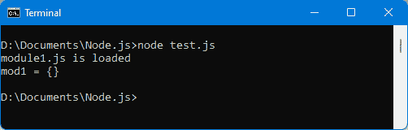
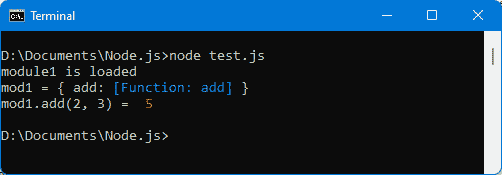
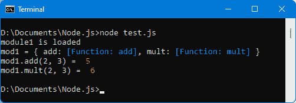
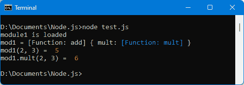
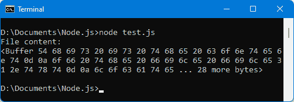
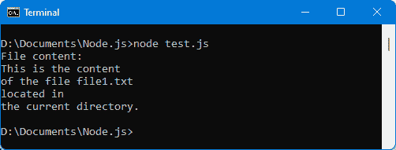
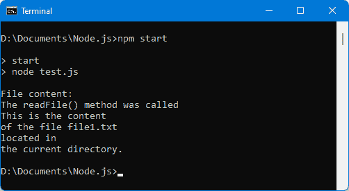
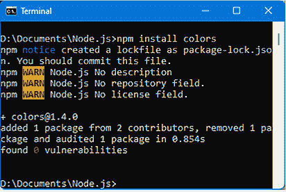
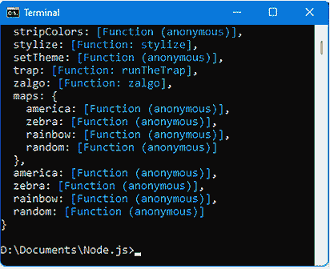
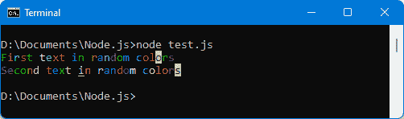

# *第六章*：创建和使用 Node.js 模块

模块是 Node.js 的核心。它们对应于 JavaScript 文件，并可以在我们的应用程序中使用。Node.js 服务器的程序将包含一组模块，即 JavaScript 文件。

有三种类型的模块：

+   我们为我们的应用程序编写的模块。

+   Node.js 内部的模块和可以直接使用的模块。

+   可以使用名为`npm`（npm 代表 Node.js 包管理器）的实用程序从互联网上下载的模块。这个`npm`实用程序与 Node.js 本身一起安装。

在本章中，我们将学习如何创建和使用这些不同类型的模块。

无论使用哪种类型的模块，`require(moduleName)`指令（见下文）都允许将名为`moduleName`的模块包含到当前文件中。模块的功能将随后可访问。

本章涵盖了以下主题：

+   使用我们自己的模块

+   使用内部 Node.js 模块

+   使用 npm 下载的模块

让我们先看看如何使用 Node.js 创建和使用我们自己的模块。

# 技术要求

你可以在 GitHub 上找到本章的代码文件：[`github.com/PacktPublishing/JavaScript-from-Frontend-to-Backend/blob/main/Chapter%206.zip`](https://github.com/PacktPublishing/JavaScript-from-Frontend-to-Backend/blob/main/Chapter%206.zip)。

# 创建和使用我们自己的模块

在这个例子中，我们使用了两个模块，每个模块对应一个 JavaScript 文件：

+   第一个模块（这里命名为`test.js`）将是我们的应用程序的主文件，我们将在命令窗口中使用`node test.js`命令执行该文件。

+   第二个模块（这里命名为`module1.js`）将是我们在主`test.js`模块中想要使用的模块。`module1.js`模块将被丰富以展示其功能如何在外部模块中访问（因此将在主`test.js`模块中使用）。

让我们继续创建这两个模块。

## 创建一个模块

下面是两个文件的内容，`module1.js`和`test.js`：

module1.js 文件

```js
console.log("module1.js is loaded");
```

该模块目前有一个简单的`console.log()`语句。然后模块将被丰富。主模块`test.js`如下所示：

test.js 文件

```js
var mod1 = require("./module1.js");  
```

```js
// or require("./module1") without specifying the .js extension
```

```js
console.log("mod1 =", mod1);
```

在这里，我们使用`require(moduleName)`指令，它允许我们将`moduleName`模块加载到内存中。任何使用`moduleName`模块功能的行为都需要事先执行`require(moduleName)`指令。

`require(moduleName)`指令返回对已加载到内存中的模块的引用。这个引用存储在一个变量中（这里，`mod1`），然后允许访问模块中描述的功能（目前没有）。

`test.js`文件是加载其他模块的主文件。因此，在命令窗口中使用`node test.js`指令执行的是这个`test.js`文件。

![图 6.1 – 使用 require(module)模块]

](img/Figure_6.01_B17416.jpg)

图 6.1 – 使用 require(module)模块

我们可以在这里看到，主模块 `test.js` 的执行调用了 `require("./module1.js")` 指令的调用，这执行了 `module1.js` 文件的内容，因此显示文本是在 `module1.js` 模块中指定的 `console.log()` 语句。

在加载 `module1.js` 之后，`mod1` 变量被初始化，我们随后将能够访问模块后来导出的功能。

在向 `module1.js` 模块添加功能之前，让我们看看如何使用 `node_modules` 目录来管理模块的位置。`node_modules` 目录被 Node.js 用于定位它没有路径的模块。使用此目录简化了在用 `require(moduleName)` 指令将它们加载到内存中时编写模块名称。

## 使用 node_modules 目录

注意，之前的 `require(moduleName)` 语句需要指定模块的访问路径，例如，使用 `"./"` 来指示当前目录。

然而，如果模块在 `node_modules` 目录中，则不需要指定路径，因为我们确信模块在 `node_modules` 目录内（而且更不应该指定）。`node_modules` 目录可以位于主应用程序目录中（称为 *local* `node_modules` 目录）或由 Node.js 创建的专用目录中（称为 *global* `node_modules` 目录：在这种情况下，它是在 Node.js 安装期间自动创建的）。

注意

如果在 `node_modules` 目录（本地或全局）中找不到模块，并且没有指定模块的访问路径，则在用 `require(moduleName)` 指令加载模块时将发生错误。

现在，我们将在主文件 `test.js` 所在的当前目录中创建一个 `node_modules` 目录。让我们将 `module1.js` 文件转移到这个目录，并使用 `require("module1.js")` 语句而不指定模块的路径。您也可以不指定 JavaScript 文件的扩展名来写 `require("module1")`：

包含位于 node_modules 目录中的模块 1（test.js 文件）

```js
var mod1 = require("module1.js");  // or require("module1")
```

```js
console.log("mod1 =", mod1);
```

`module1.js` 文件必须位于本地创建的 `node_modules` 目录中，而 `test.js` 文件则保持在当前目录中，如下所述：

`root/`

`|— node_modules/`

`│ |— module1.js`

`|— test.js`



图 6.2 – 模块从 node_modules 目录加载

我们可以看到，模块确实被 Node.js 找到了，因为 Node.js 在当前目录中创建的 `node_modules` 目录中寻找它。

现在，让我们看看如何使用与模块关联的 `package.json` 文件允许模块的文件在目录中分组。

## 使用 package.json 文件

`node_modules` 目录（无论位于应用程序目录还是 Node.js 安装目录）可以包含许多文件，有时一个模块可以由许多文件和目录组成。将模块与 `node_modules` 目录中的目录关联起来会更容易。

让我们在 `node_modules` 目录内创建 `module1` 目录。`module1` 目录包含 `module1.js` 文件，但也可能包含与此模块相关的其他文件和目录。

文件系统在此显示：

`root/`

`|— node_modules/`

`| |— module1/`

`│ |— module1.js`

`|— test.js`

注意

在 `require(moduleName)` 语句中指示的 `moduleName` 在此情况下表示包含模块文件的 *目录* 名称。

但是，由于在加载模块时必须知道我们首先需要使用目录中的哪个文件（因为在这个目录中可能有多个文件），我们在 `"main"` 键中的 `package.json` 文件中指示了这个对应关系。

`package.json` 文件是一个位于每个 Node.js 模块目录中的 JSON 格式的文本文件。

现在，我们将在 `module1` 模块目录中创建 `package.json` 文件，并在该文件中用 `"module1.js"` 的值指示 `"main"` 键。

文件系统如下：

`root/`

`|— node_modules/`

`| |— module1/`

`│ |— module1.js`

`│ |— package.json`

`|— test.js`

位于 node_modules/module1 目录中的 package.json 文件（package.json 文件）

```js
{
```

```js
  "main" : "module1.js"
```

```js
}
```

我们在 `"main"` 键中指示，在执行 `require("module1")` 指令时必须加载 `module1.js` 文件：

包含位于 node_modules/module1 目录中的 module1（test.js 文件）

```js
var mod1 = require("module1"); //"module1" is the directory name
```

```js
console.log("mod1 =", mod1);
```

注意

请注意，在这种情况下，`require("module1")` 语句中的模块名是 `node_modules` 目录中包含模块的目录名称。因此，我们在这里不能写成 `require("module1.js")` 的形式，这会导致错误。

我们现在可视化 `test.js` 文件的执行：


图 6.3 – 包含 package.json 文件的模块

如果主模块文件命名为 `index.js`，则 `package.json` 文件中的 `"main"` 键是可选的。在所有其他情况下，必须在 `package.json` 中指示 `"main"` 键。

我们知道如何运行一个模块，但到目前为止，模块包含一个简单的 `console.log()` 语句。让我们看看如何向模块添加功能，然后使用它们。

## 向模块添加功能

新创建的 `module1.js` 模块是可访问的，但目前不提供任何功能。让我们看看如何添加一些功能。

### 在模块中导出多个函数

例如，让我们创建一个名为 `add(a, b)` 的函数，它返回 `a` 和 `b` 的和：

在 module1.js 文件中定义的 add(a, b) 函数

```js
console.log("module1 is loaded");
```

```js
function add(a, b) {
```

```js
  return a+b;
```

```js
}
```

```js
module.exports = { 
```

```js
add : add     // make the add() function accessible 
```

```js
                // outside the module
```

```js
}; 
```

要将函数导出至模块外部（并使其对模块用户可用），您只需将其嵌入到每个模块中由 Node.js 定义的 `module.exports` 对象中。`module.exports` 对象中定义的每个键都将是一个模块外部的可访问函数。

因此，我们可以在模块中定义几个函数，这些函数将通过 `module.exports` 对象可访问。

在 `test.js` 文件中使用 `add(a, b)` 函数的方式如下：

在 test.js 文件中使用 add() 函数（test.js 文件）

```js
var mod1 = require("module1");
```

```js
console.log("mod1 =", mod1);
```

```js
var total = mod1.add(2, 3);      // call of the add() function 
```

```js
                                 // defined in module1
```

```js
console.log("mod1.add(2, 3) = ", total);  // displays 5
```

以下显示结果如下：



图 6.4 – 添加到模块中的 add() 函数

让我们在模块中添加第二个函数。例如，函数 `mult(a, b)`，它返回 `a*b`。

如果我们在模块中添加 `mult(a, b)` 函数，它将写成如下所示：

将 `mult(a, b)` 函数添加到模块（module1.js 文件）

```js
console.log("module1 is loaded");
```

```js
function add(a, b) {
```

```js
  return a+b;
```

```js
}
```

```js
function mult(a, b) {
```

```js
  return a*b;
```

```js
}
```

```js
module.exports = {
```

```js
  add : add,
```

```js
  mult : mult
```

```js
}
```

现在，我们将在 `test.js` 文件中使用两个函数 `add()` 和 `mult()`。这验证了模块可以向使用它的其他模块提供多种功能：

使用模块的 add() 和 mult() 函数（test.js 文件）

```js
var mod1 = require("module1");
```

```js
console.log("mod1 =", mod1);
```

```js
var total = mod1.add(2, 3);
```

```js
console.log("mod1.add(2, 3) = ", total);      // 2 + 3 = 5
```

```js
var total = mod1.mult(2, 3);
```

```js
console.log("mod1.mult(2, 3) = ", total);     // 2 * 3 = 6
```

以下显示结果如下：



图 6.5 – 使用模块的两个函数

现在让我们看看如何通过使用模块中的所谓主函数来改进模块概念。

### 允许一个函数成为模块的主函数

通常，模块希望将一个函数设为主函数（模块中定义的其他函数是次要函数）。这允许以简化的形式访问此主函数。

假设（如前所述）`module1` 提供了 `add(a, b)` 函数和 `mult(a, b)` 函数。我们希望 `add()` 函数成为模块的主函数，这意味着我们可以将其作为 `mod1(2, 3)` 而不是 `mod1.add(2, 3)` 在模块外部使用。`mult(a, b)` 函数将保持以 `mod1.mult(2, 3)` 的形式可访问。

注意

注意，在模块中只能定义一个主函数。

在这种情况下，只需在 `module.exports` 对象中指定即可：

将 `add()` 函数作为主模块函数（module1.js 文件）可访问

```js
console.log("module1 is loaded");
```

```js
function add(a, b) {
```

```js
  return a+b;
```

```js
}
```

```js
function mult(a, b) {
```

```js
  return a*b;
```

```js
}
```

```js
// first define the main function
```

```js
module.exports = add;  // the add() function defined outside 
```

```js
                       // the module, is made main
```

```js
// then define the secondary functions
```

```js
module.exports.mult = mult;   // and the mult() function 
```

```js
                              // becomes usable as well
```

注意

在 `module.exports` 对象中按此顺序分配值很重要（首先定义主函数，然后是次要函数）。如果您以其他方向进行分配（`module.exports.mult` 首先分配，然后 `module.exports`），则最后分配的 `module.exports` 将会覆盖已定位在 `module.exports.mult` 中的值。

此外，我们不能再将 `module.exports` 作为对象分配，因为如果我们写成 `module.exports = { mult : mult }`，这将删除之前分配的值。

我们现在使用模块的方式如下：

使用具有主函数的 module1.js 模块（test.js 文件）

```js
var mod1 = require("module1");
```

```js
console.log("mod1 =", mod1);
```

```js
var total = mod1(2, 3);          // instead of mod1.add(2, 3)
```

```js
console.log("mod1(2, 3) = ", total);
```

```js
var total = mod1.mult(2, 3);
```

```js
console.log("mod1.mult(2, 3) = ", total);
```

以下显示结果如下：



图 6.6 – 使用主函数的模块

注意

注意，我们不再使用 `mod1` 变量作为对象，而是现在将其作为函数使用。在 `mod1(a, b)` 的调用中，a 和 b 进行相加，因此，在 `require(moduleName)` 指令中，将变量命名为 `"add"` 而不是 `"mod1"` 更为合适。

我们看到了如何创建和使用我们自己的模块。现在让我们看看如何使用内部 Node.js 模块。

# 使用内部 Node.js 模块

Node.js 已经有内部模块。它们也可以使用之前看到的 `require(moduleName)` 指令来使用。

让我们来看一个内部模块的例子。例如，Node.js 系统中的 `"fs"` 模块。`"fs"` 名称是文件系统的简称。此模块允许您与 Node.js 的内部文件系统进行交互。

现在，我们将使用 `"fs"` 模块来读取文件的内容。

## 读取文件内容

让我们使用 `"fs"` 模块来读取当前目录（`test.js` 文件所在的目录）中名为 `file1.txt` 的文件。以下是该文件的内容：

file1.txt 文件（位于 test.js 文件所在的目录中）

```js
This is the content
```

```js
of the file file1.txt
```

```js
located in
```

```js
the current directory.
```

使用 `"fs"` 模块并显示文件内容的程序如下：

读取并显示文件内容（test.js 文件）

```js
var fs = require("fs");
```

```js
var data = fs.readFileSync("file1.txt");
```

```js
console.log("File content:");
```

```js
console.log(data);
```

我们使用 `"fs"` 模块中定义的 `readFileSync()` 方法。它将文件内容返回到相应的变量中，然后将其显示。



图 6.7 – 使用 “fs” 模块显示文件内容

文件内容以十六进制字符的形式显示。接下来，让我们将文件内容以字符串形式显示。

## 将文件内容以字符串形式显示

文件内容以字节缓冲区（参见 *图 6.7*）的形式显示。Node.js 使操作字节流变得容易。也可以通过在 `readFileSync(name, options)` 方法的第二个参数（`options`）中指定 `{encoding: "utf-8"}` 选项，直接以字符串形式查看文件内容：

将文件内容以字符串形式显示（test.js 文件）

```js
var fs = require("fs");
```

```js
var data = fs.readFileSync("file1.txt", { encoding : "utf-8" });
```

```js
console.log("File content:");
```

```js
console.log(data);
```

结果现在以字符串形式显示（参见以下图）：



图 6.8 – 以字符串形式显示文件内容

文件内容被显示。然而，程序等待文件内容被检索以便显示。通过使用 `readFile()` 方法而不是 `readFileSync()` 方法，可以在等待文件时不会阻塞程序。

## 使用非阻塞文件读取

如果你观察之前的`readFileSync()`方法，你会看到文件内容作为方法调用的返回值被渲染。这意味着在文件读取过程中，Node.js 程序会被阻塞（即使只是几毫秒）。在我们的小型程序中，这并不明显，但在文件读取由成千上万的并发用户执行的情况下（例如，在服务器上），这将减慢对服务器的访问速度。

对于此，Node.js 为所有类似此的阻塞功能提供了一个非阻塞版本的方法。而不是返回方法的结果（如之前所述），我们使用一个作为方法参数的回调函数。在读取文件的情况下，因此我们将使用在`"fs"`模块中定义的`readFile(name, options, callback)`方法。读取文件的结果将通过回调函数作为参数传递。

让我们使用非阻塞形式的文件读取，使用`readFile()`方法代替`readFileSync()`方法：

使用`readFile()`方法读取文件（test.js 文件）

```js
var fs = require("fs");
```

```js
console.log("File content:");
```

```js
fs.readFile("file1.txt", { encoding : "utf-8" }, function(error, data) {
```

```js
  console.log(data);
```

```js
});
```

```js
console.log("The readFile() method was called");
```

注意

回调函数使用`error`和`data`参数（按此顺序），分别对应可能出现的错误消息（如果没有错误则为`null`），以及如果已读取，则为文件内容。`readFile()`方法的第二个参数`options`与`readFileSync(name, options)`方法的选项类似。

结果在此显示：


图 6.9 – 使用非阻塞的`readFile()`方法显示文件内容

我们可以在上述显示的结果中检查到`readFile()`方法确实是非阻塞的。确实，在调用`readFile()`方法之后指示的文本即使在文件尚未被读取和显示的情况下也会在控制台显示，这是使用阻塞方法`readFileSync()`所不可能的。

注意

因此，我们可以看到，在 Node.js 内部模块的使用非常简单，只需使用`require(moduleName)`指令，然后调用该指令返回的对象上的方法。

我们已经看到了如何创建和使用自己的模块，以及如何使用 Node.js 的内部模块。

现在，让我们看看如何使用`npm`命令使用互联网上可用的模块。

# 使用 npm 下载的模块

除了 Node.js 内部的模块，还可以使用 Node.js 提供的`npm`实用工具从互联网导入模块。

为了此，`npm`命令（在命令解释器中）通过指定允许你对导入的模块执行相应操作的参数来使用。

## 使用 npm 命令

这里是`npm`命令的一些常见用法：

+   `npm install moduleName`：在本地 `node_modules` 目录中安装指定的模块。该模块将仅对当前应用程序可用，而对其他应用程序不可用（除非再次安装）。

+   `npm install moduleName -g`：在全局 `node_modules` 目录中安装指定的模块。`-g` 选项允许你指定此模块可以被其他应用程序访问，因为它安装在 Node.js 的 `node_modules` 目录中（全局）。

+   使用 `npm link moduleName`：可能的情况是，全局（使用 `-g` 选项）安装的模块不可访问（在 `require(moduleName)` 语句期间出现模块加载错误）。在这种情况下，需要运行 `npm link moduleName` 命令。

+   `npm ll`：列出已存在于本地 `node_modules` 目录中的模块。

+   `npm ll -g`：列出已存在于全局 `node_modules` 目录中的模块。

+   `npm start`：根据 `"scripts"` 键中指定的命令启动 Node.js 应用程序，然后是 `package.json` 文件的 `"start"` 键。例如，如果你在 `package.json` 文件中指定 `"scripts": { "start": "node test.js" }`，你可以输入 `npm start` 而不是 `node test.js` 来运行 `test.js` 文件。通常使用 `npm start` 来启动 Node.js 应用程序。这将在 `uninstall` 而不是 `install` 的情况下启动应用程序。

以一个例子来说明，让我们在 `test.js` 文件所在的目录中创建以下 `package.json` 文件：

package.json 文件（位于与 test.js 相同的目录中）

```js
{
```

```js
  "scripts" : {
```

```js
    "start" : "node test.js"
```

```js
  }
```

```js
}
```

然后使用 `npm start` 命令来启动程序：



图 6.10 – 使用 npm start 启动 Node.js 应用程序

我们可以看到，`npm start` 命令使得执行 `test.js` 程序成为可能。由于上述机制，`npm start` 命令通常用于启动 Node.js 程序。这将在 `uninstall` 而不是 `install` 的情况下启动应用程序。

现在我们来看看如何通过使用 `npm` 下载来使用其他开发者编写的模块。

## 使用 npm 下载的模块

让我们来看一个使用 `npm` 的例子。在这里，我们将使用 `npm` 来安装名为 `colors` 的模块。它允许你在控制台中显示彩色文本。

### 在 node_modules 本地目录中安装 colors 模块

我们使用 `npm install colors` 命令。以下图显示了 `"colors"` 模块的安装结果。



图 6.11 – 使用 npm 安装 colors 模块

一旦模块通过 `npm` 安装，你可以看到模块的 `colors` 目录已经将自己插入到应用程序的 `node_modules` 本地目录中。

### 使用 colors 模块的功能

了解模块提供的功能的一种方法是通过显示 `require(moduleName)` 指令返回的对象的内容来获得概览：

显示由 require("colors") 返回的 colors 对象的内容（test.js 文件）

```js
var colors = require("colors");
```

```js
console.log("colors = ", colors);
```



图 6.12 – 显示 colors 模块的内容

例如，让我们使用模块中列出的最后一种方法，即 `random()` 方法。它允许您将字符字符串转换为每个字符都有随机颜色的字符串：

使用 colors 模块的 random() 方法（test.js 文件）

```js
var colors = require("colors");
```

```js
console.log(colors.random("First text in random colors"));
```

```js
console.log(colors.random("Second text in random colors"));
```

注意

使用 `random()` 方法，通过在变量名前加上 `require("colors")` 返回的变量名，即模块名，来使用它。

下面的图示显示了每个显示的字符都是随机颜色的效果：



图 6.13 – 使用 colors 模块

我们在这里看到了与 Node.js 一起使用的三种模块类型：

+   为我们自己的需求编写的模块

+   Node.js 中现有的内部模块，例如允许访问 Node.js 内部文件系统的 `fs` 模块

+   可以使用 `npm` 命令下载的模块，例如上面使用的 colors 模块

剩下的就是将这些不同类型的模块用于我们的程序中。我们将在稍后讨论这一点。

这就结束了本章的内容。

# 概述

在本章中，我们学习了如何使用 Node.js 创建和使用模块，这些模块是使用 Node.js 创建的程序的基本组件。

不论模块是由我们自己创建的，是 Node.js 的内部模块，还是通过 `npm` 下载的模块，其使用方式在所有情况下都是相同的。我们使用 `require(moduleName)` 指令，并通过变量返回的值来访问模块的功能。

接下来，我们将研究 Express 模块，这是与 Node.js 一起使用的主要模块之一，它允许我们根据目前广泛使用的 MVC 模式规则轻松地构建我们的应用程序。
