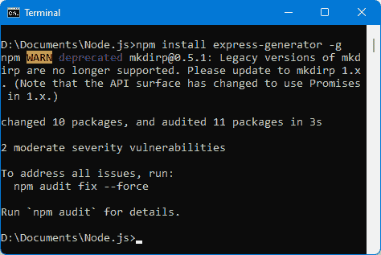
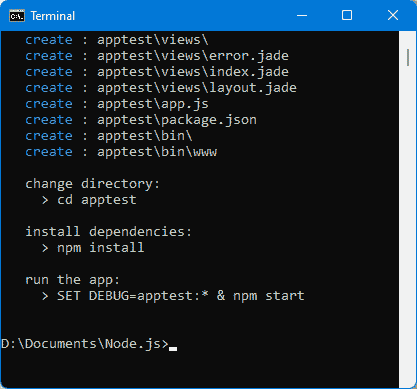
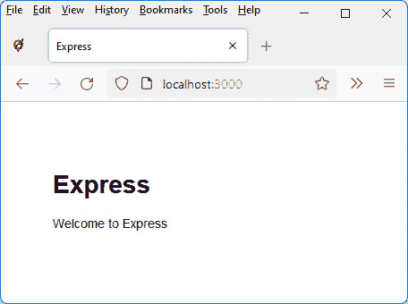
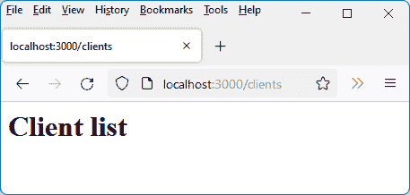
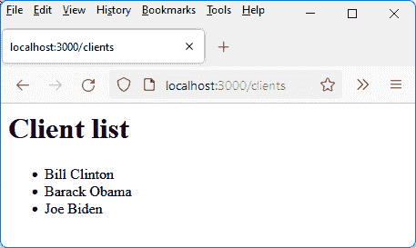
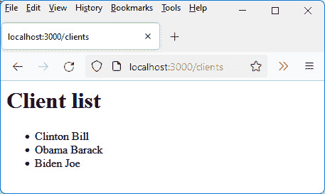

# 第七章：*第七章*：使用 Node.js 的 Express

在上一章中，我们看到了 Node.js 服务器的程序是由不同的模块组成的。许多模块是由 Node.js 开发者创建的，可以使用`npm`实用工具（参见*第六章*，*创建和使用 Node.js 模块*）插入到我们的程序中。其中有一个模块被称为**Express**。它是 Node.js 中最常用的模块之一，因为它允许你根据**模型-视图-控制器**（**MVC**）模型来结构化服务器程序。

在本章中，我们将研究如何使用 Express 模块在尊重 MVC 模型特性的同时创建 Node.js 应用程序。

这里是我们将要讨论的主题：

+   使用 Node.js 的`http`模块

+   安装 Express 模块

+   Express 使用的 MVC 模式

+   使用 Express 的路线

+   使用 Express 显示视图

Node.js 将其内部模块集成了使用 Node.js 内部的`http`模块创建 Web 服务器的可能性。我们首先解释如何使用这个`http`模块，然后我们将看到外部 Express 模块对更易于创建基于 MVC 模型的 Web 应用的贡献。

# 技术要求

你可以在 GitHub 上找到本章的代码文件：[`github.com/PacktPublishing/JavaScript-from-Frontend-to-Backend/blob/main/Chapter%207.zip`](https://github.com/PacktPublishing/JavaScript-from-Frontend-to-Backend/blob/main/Chapter%207.zip)。

# 使用 Node.js 的 http 模块

`http`模块是 Node.js 的内部模块。因此，我们可以通过使用`require("http")`指令直接在我们的程序中访问它。使用这个模块，你可以创建基于 HTTP 协议的 Web 服务器，并在互联网浏览器中显示网页。

为了创建基于 HTTP 的 Web 服务器，我们使用`http.createServer(callback)`方法。作为参数指示的回调函数的形式是`callback(req, res)`，其中`req`对应于接收到的请求，`res`对应于要发送给浏览器的响应。根据接收到的请求，将发送相应的响应。

注意

在`req`参数中，除了其他内容外，还有接收到的请求的 URL，因此可以通过`res`参数根据这个请求返回正确的响应给浏览器。

让我们看看以下程序中如何使用`createServer()`方法：

使用 http 模块创建 Web 服务器（test.js 文件）

```js
var http = require("http");
```

```js
var server = http.createServer(function(req, res) {
```

```js
  // display the received request in the console
```

```js
  console.log("Request received:", req.url);
```

```js
  // indicate that the response is HTML in utf-8
```

```js
  res.setHeader("Content-type", "text/html; charset=utf-8");
```

```js
  // we always send the same response, regardless of the 
```

```js
  // request received
```

```js
  res.write("<h1>")
```

```js
  res.write("Good morning all");
```

```js
  res.write("</h1>");
```

```js
  res.end();
```

```js
});
```

```js
// make the server listen on port 3000 (for example)
```

```js
server.listen(3000);
```

```js
console.log("\nThe server was started on port 3000\n");
```

```js
console.log("You can make a request on:");
```

```js
console.log("http://localhost:3000");
```

`createServer()`方法返回一个对象，这里通过名为`server`的变量使用，我们在其上指示等待来自端口`3000`（在`server.listen(port)`方法中指示的端口）的请求。这意味着每次通过浏览器访问形式为`http://localhost:3000`的 URL 时，先前启动的程序（使用`node test.js`命令）将被激活，并在浏览器中显示结果。

注意

使用 `server.listen(port)` 方法是强制性的，因为仅使用 `http.createServer()` 方法创建服务器是不够的。此服务器还必须监听（使用 `server.listen(port )`）来自连接到此服务器的浏览器（在此处使用类似 `http://localhost:3000` 的 URL）发送的 HTTP 请求。此处使用端口号 `3000`，但也可以使用其他端口号（前提是此端口号未被另一个服务器使用，这会导致访问冲突，不知道端口号上的请求是针对哪个服务器的）。

我们使用 `res.write(string)` 指令向浏览器发送响应。您必须使用 `res.end()` 指令完成响应的发送，这意味着浏览器已接收到所有要显示的元素（服务器等待接收 `res.end()` 指令以显示所有发送的元素）。

注意

使用 `res.setHeader()` 方法设置 HTTP 头字段。在此处，将 `"Content-type"` 设置为 `"text/html; charset=utf-8"`。

让我们通过输入命令 `node test.js` 启动前面的程序。程序显示一条消息，然后等待端口号 `3000` 上的 HTTP 请求：

![Figure 7.1 – 在端口号 3000 上等待的 HTTP 服务器

![Figure 7.01_B17416.jpg]

图 7.1 – 在端口号 3000 上等待的 HTTP 服务器

要测试程序，请在浏览器中显示以 `http://localhost:3000` 开头的 URL。当 HTTP 请求使用端口号 `3000`（服务器正在监听的端口号）时，`createServer(callback)` 方法中指示的回调函数被激活，然后响应被发送到浏览器。

让我们在浏览器中输入 URL `http://localhost:3000`（见下图）：

![Figure 7.2 – 在浏览器中查看 URL http://localhost:3000

![Figure 7.02_B17416.jpg]

图 7.2 – 在浏览器中查看 URL http://localhost:3000

无论在浏览器中指定的 URL 是什么（使用端口号 `3000`），浏览器中的显示都保持不变。要使不同 URL 的显示不同，必须在回调函数中使用 `req.url` 的值来考虑，它包含输入的 URL，并根据接收到的请求返回不同的字符串。

使用 Express 模块可以轻松管理接收到的不同请求，并根据输入的 URL 显示不同的结果。

# 安装 Express 模块

由于 Express 模块是通过 npm 安装的，我们输入 `npm install express` 命令来安装它。

![Figure 7.3 – 使用 npm 安装 Express 模块

![Figure 7.03_B17416.jpg]

.

图 7.3 – 使用 npm 安装 Express 模块

Express 模块现在已安装。

注意

与 Express 相关的一个实用工具也有助于创建我们 Web 应用的架构。这就是 `"express-generator"` 模块（此模块之前包含在 Express 中，但现在已从其中分离出来，因此在此处上传）。

让我们也使用`npm install express-generator -g`命令安装`"express-generator"`模块。我们使用`-g`选项，以便在这个模块中定义的`express`命令可以从任何目录访问。



图 7.4 – 使用 npm 安装“express-generator”模块

注意

你可以通过输入命令`express -h`来验证安装是否正确。如果模块安装正确，窗口中将显示`express`命令的帮助信息（否则将显示错误）。

一旦安装了这两个模块，你就可以创建一个基于 Express 的第一个 Web 应用程序。

要完成这个任务，请输入`express apptest`命令来创建名为`apptest`的应用程序。你应该看到以下结果：



图 7.5 – 使用 Express 创建 apptest 应用程序

此命令创建一个包含运行应用程序的基本文件的`apptest`目录。然后你必须输入显示末尾指示的三个命令：`cd apptest`、`npm install`和`npm start`。

一旦输入了这些命令，打开浏览器并显示 URL `http://localhost:3000`。

这是你将看到的内容：



图 7.6 – 使用 Express 创建的默认应用程序主页

如果我们查看`apptest`目录中创建的应用程序的源文件，我们会看到`app.js`和`package.json`文件，以及`bin`、`node_modules`、`public`、`routes`和`views`目录。这些目录是描述 Express 使用的 MVC 架构的目录，我们将在下面解释。

# Express 使用的 MVC 模式

MVC 模型是一个应用程序架构模型，允许应用程序被分解为不同的部分：模型、视图和控制器：

+   模型对应于应用程序操作的数据。通常，这是来自数据库的数据。Node.js 与 MongoDB 数据库紧密相连，这将在下一章中探讨。

+   视图对应于数据的可视化，例如，输入表单和显示列表。每个显示对应于一个将位于应用程序的`views`目录中的视图。

+   控制器允许在不同视图之间进行导航，取决于数据。为此，我们使用路由（实际上是 URL）来指示要执行的处理。`routes`目录描述了应用程序使用的路由（以及为每个路由执行的处理）。

因此，我们可以看到 MVC 模型使得处理、显示和数据分离成为可能。这种分割在 Web 项目中广泛使用，也是 Express 提出的。

让我们先看看 Express 中路由是如何工作的。这对应于 MVC 模型中的控制器部分。

# 使用 Express 的路由

路由指示基于请求的 URL 要执行的处理。与使用 Node.js 的`http`模块和`createServer(callback)`方法时我们编写的内容相比，这包括根据接收到的`req`请求编写`callback(req, res)`函数的内容。

路由在`app.js`文件中描述，这是 Express 创建的主要文件。让我们检查其内容。

## app.js 文件的初始内容

要了解 Express 中的路由如何工作，请打开位于主应用程序目录中的`app.js`文件，你将看到此文件的内容，如下所示：

app.js 文件

```js
var createError = require('http-errors');
```

```js
var express = require('express');
```

```js
var path = require('path');
```

```js
var cookieParser = require('cookie-parser');
```

```js
var logger = require('morgan');
```

```js
var indexRouter = require('./routes/index');
```

```js
var usersRouter = require('./routes/users');
```

```js
var app = express();
```

```js
// view engine setup
```

```js
app.set('views', path.join(__dirname, 'views'));
```

```js
app.set('view engine', 'jade');
```

```js
app.use(logger('dev'));
```

```js
app.use(express.json());
```

```js
app.use(express.urlencoded({ extended: false }));
```

```js
app.use(cookieParser());
```

```js
app.use(express.static(path.join(__dirname, 'public')));
```

```js
app.use('/', indexRouter);
```

```js
app.use('/users', usersRouter);
```

```js
// catch 404 and forward to error handler
```

```js
app.use(function(req, res, next) {
```

```js
  next(createError(404));
```

```js
});
```

```js
// error handler
```

```js
app.use(function(err, req, res, next) {
```

```js
  // set locals, only providing error in development
```

```js
  res.locals.message = err.message;
```

```js
  res.locals.error = req.app.get('env') === 'development' ? 
```

```js
  err : {};
```

```js
  // render the error page
```

```js
  res.status(err.status || 500);
```

```js
  res.render('error');
```

```js
});
```

```js
module.exports = app;
```

此文件描述了使用 Express 构建的应用程序的工作方式。它使用`app`变量，这是`express()`函数调用的返回值，象征着应用程序。在这个`app`对象上，多次使用`use()`方法，这使得可以为服务器接收到的每个请求添加要执行的处理。

例如，`app.use(logger("dev"))`会在服务器接收到的每个请求上触发`logger()`函数。这就是为什么服务器控制台在每次向服务器发送请求时都会显示浏览器中请求的 URL。

通过在浏览器中显示 URL`http://localhost:3000`和`http://localhost:3000/users`，我们在服务器控制台中获得了以下内容。


图 7.7 – 服务器控制台中 URL 的显示

现在，让我们看看服务器控制台中显示的行的含义。

## 可能存在不同类型的路由

在前面的图中，你会注意到每个 URL 前都显示了单词`GET`：`GET /`，`GET /users`。

单词`GET`表示通过 HTTP 请求的`GET`类型访问 URL`/`或`/users`。`GET`类型是在访问的 URL 显示在浏览器地址栏时使用的，例如，当你直接输入它或点击页面上的链接时。

注意

其他类型的 HTTP 请求也存在。它们使得不必在浏览器地址栏中显示相应的 URL，从而将其隐藏起来。例如，如果从数据库中删除记录的 URL 在浏览器地址栏中可见，则只需刷新页面即可继续从数据库中删除记录。因此，其他类型的 HTTP 请求允许隐藏当前 URL。

除了`GET`之外的其他类型的 HTTP 请求主要是`PUT`、`POST`和`DELETE`类型请求。这些类型的请求在程序中用于表示要对一个或多个数据（称为资源）执行的操作：

+   `GET`表示读取资源。

+   `POST`表示创建资源。

+   `PUT`表示更新资源。

+   `DELETE`表示删除资源。

虽然存在多种类型的 HTTP 请求，但这些都是主要的。它们用于操作资源，允许创建（`POST`）、更新（`PUT`）、删除（`DELETE`）和读取（`GET`）。

注意

路由是将 HTTP 请求与 URL 相关联。例如，`GET /users` 路由将 `/users` URL 与 `HTTP GET` 请求关联起来，而 `DELETE /users` 路由将相同的 `/users` URL 与 `HTTP DELETE` 请求关联起来。尽管这些路由使用相同的 URL，但由于 HTTP 请求不同，它们是不同的路由。

既然我们已经看到了使用的不同类型的 HTTP 请求，让我们看看 Express 如何在内部使用它们。

## 分析 app.js 文件中定义的路由

`app.use()` 方法也用于定义新的路由，即定义每个新 URL 使用时（与关联的请求类型）将执行的处理。

使用 `app.use(url, callback)` 方法定义在指定 URL 激活时将执行的处理。由于此处未指定请求类型，因此将激活回调函数中指示的所有类型的请求处理。要指示请求类型，必须使用类似于 `app.use()` 的方法。这些是 `app.get()`、`app.put()`、`app.post()` 和 `app.delete()` 方法。

注意

形式为 `callback(req, res, next)` 的回调函数将响应返回给浏览器。`next()` 参数对应于在回调结束时需要调用以继续在下一个回调函数中处理（如果要执行的处理由多个回调函数处理）的函数。

在 `app.js` 中已定义的路由是 `/` 和 `/users`，这使得能够运行与这些路由关联的过程。这些路由是示例，用于展示如何在 `app.js` 文件中实现路由。处理指令定义在 `indexRouter` 和 `usersRouter` 函数中。这些函数是用于返回指令 `require('./routes/index')` 和 `require('./routes/users')` 的变量。因此，路由处理是在 `routes` 目录中定义的 `index.js` 和 `users.js` 文件中完成的。

让我们打开这两个文件并分析其内容：

index.js 文件（路由目录）

```js
var express = require('express');
```

```js
var router = express.Router();
```

```js
/* GET home page. */
```

```js
router.get('/', function(req, res, next) {
```

```js
  res.render('index', { title: 'Express' });
```

```js
});
```

```js
module.exports = router;
```

users.js 文件（路由目录）

```js
var express = require('express');
```

```js
var router = express.Router();
```

```js
/* GET users listing. */
```

```js
router.get('/', function(req, res, next) {
```

```js
  res.send('respond with a resource');
```

```js
});
```

```js
module.exports = router;
```

这些文件中的每一个都使用 `router.get(url, callback)` 方法，这意味着路由与 `/` 相关联（它将与 `app.js` 文件中给出的 URL 连接），然后是形式为 `callback(req, res, next)` 的回调函数。`next` 参数对应于如果必须在后续的回调函数中继续处理（如果存在这样的函数，这里的情况就是这样）则需要调用的函数。

在每个回调函数中执行的处理包括发送响应，该响应将在浏览器中显示。在这里，我们使用 `res.send()` 和 `res.render()` 方法，这些方法允许发送响应：

+   `res.send()` 方法类似于 `res.end()`（在 Node.js 的 `"http"` 模块中定义），但它还允许您指明您正在使用 HTML，并且必须在处理过程中使用 `res.send()` 方法，否则将发生错误。

+   `res.render()` 方法允许显示外部文件（称为视图）。视图是用一种特殊语言编写的，这取决于视图的格式。默认情况下，Express 使用的视图是 JADE 文件，但也可以使用其他格式。

在这里，`res.render()` 方法显示的视图对应于位于 `views` 目录中的 `index.jade` 文件。其内容如下：

`index.jade` 文件（视图目录）

```js
extends layout
```

```js
block content
```

```js
  h1= title
```

```js
  p Welcome to #{title}
```

此文件使用一种特定的语法编写，称为 JADE。Express 将在将文件发送到浏览器（只能解释 HTML）之前将其转换为 HTML 代码。

注意

Express 允许使用各种语法编写与视图关联的文件。最常见的是 **JADE** 和 **EJS**。

我们将在本章的 *使用 Express 显示视图* 部分中探索 JADE 语法。

注意，`app.js` 文件允许您配置与视图关联的目录以及视图中所使用的语法。以下是来自 `app.js` 文件的相应说明：

配置视图（`app.js` 文件）

```js
app.set('views', path.join(__dirname, 'views'));
```

```js
app.set('view engine', 'jade');
```

我们已经描述了 `app.js` 文件中已经列出的路由。让我们看看如何在这个文件中创建新路由。

## 在 `app.js` 文件中添加新路由

在 `app.js` 文件中添加新路由可以通过直接在 `app.js` 文件中编写处理程序或创建一个位于 `routes` 目录中的外部文件来完成。

警告

任何对 `app.js` 文件的修改都需要通过执行 `npm start` 命令来重新启动服务器；否则，修改不会被考虑。

让我们看看这两种创建新路由的方法。

### 直接在 `app.js` 文件中添加路由处理

让我们添加一个由 `app.get()` 方法定义的路由 `/clients` 被激活：

添加 GET /clients 路由

```js
app.use('/', indexRouter);
```

```js
app.use('/users', usersRouter);
```

```js
app.get("/clients", function(req, res, next) {
```

```js
  res.send("<h1>Client list</h1>");
```

```js
});
```

结果显示在以下图中（*图 7.8*）。

### 创建一个外部文件来定义路由处理

我们使用与 `app.js` 文件中定义的 `GET /` 和 `GET /users` 路由相同的原理。我们在 `routes` 目录中创建 `clients.js` 文件，该文件将通过 `clientsRouter = require("./routes/clients")` 语句包含在 `app.js` 文件中。路由在 `app.js` 中通过 `app.use("/clients", clientsRouter)` 语句定义。

描述在路由上执行的处理过程的 `clients.js` 文件如下：

`clients.js` 文件（路由目录）

```js
var express = require('express');
```

```js
var router = express.Router();
```

```js
router.get('/', function(req, res, next) {
```

```js
  res.send("<h1>Client list</h1>");
```

```js
});
```

```js
module.exports = router;
```

在这两种情况下，结果都是相同的，如以下图所示。



图 7.8 – 显示 GET /clients 路由

我们使用 Express 中定义的路由系统研究了 MVC 模型中的控制器部分。现在让我们看看 Express 如何帮助我们管理 MVC 模型的视图部分。

# 使用 Express 显示视图

视图是一个外部文件，用于描述你想要查看的显示。已经创建了特定的语法来编程视图，例如，JADE 或 EJS 语法。

`res.render(name, obj)` 方法用于使用在 `obj` 对象中提供的任何属性显示名为 `name` 的视图。视图是一个使用 JADE 语法或其他语法定义在 `views` 目录中的文件。

Express 的一个特性是允许你使用所需的语法创建视图。JADE 语法是 Express 作为标准提供的，但可以通过 `npm` 添加其他语法支持库。

因此，JADE 语法是 Express 默认使用的语法。它使得可以用标签的名称替换 HTML 标签（例如 `<h1>` 简单地变为 `h1`），并且代码中标签的缩进使得可以指定它们的嵌套。也不再需要关闭之前打开的标签，因为缩进允许你看到标签的嵌套。

注意

完整的 JADE 文档可以在[`jade-lang.com/`](https://jade-lang.com/)找到。

让我们使用 JADE 来显示之前的客户列表。我们在 `views` 目录中创建 `clients.jade` 视图，并在 `clients.js` 中指示在访问 `GET /clients` 路由时显示此视图：

clients.js 文件（路由目录）

```js
var express = require('express');
```

```js
var router = express.Router();
```

```js
router.get('/', function(req, res, next) {
```

```js
  res.render("clients");   // display clients.jade view 
```

```js
// (.jade extension is enabled by 
```

```js
                           // default)
```

```js
});
```

```js
module.exports = router;
```

注意，如果你没有指定视图文件的扩展名（例如，通过写入 `res.render("clients")`），将使用 `app.js` 指令中指定的扩展名 `app.set('view engine' , 'jade')`。

如果，另一方面，你指定了视图文件的扩展名，即使它与 `app.js` 中配置的不同，它也将用于显示视图。视图 `clients.jade` 如下所示：

clients.jade 文件（视图目录）

```js
h1 Client list
```

```js
ul
```

```js
  li Bill Clinton
```

```js
  li Barack Obama
```

```js
  li Joe Biden
```

注意标签的缩进。`ul` 标签与 `h1` 标签处于同一级别，否则它会被视为 `h1` 标签的一部分。`li` 标签向右移动以显示它们属于前面的 `ul` 标签。偏移量至少为字符数。由于偏移量，我们不使用 HTML 中的关闭标签。

由于其中一个路由文件已被修改，让我们使用 `npm start` 重启服务器。

注意

编辑与视图相关的文件不需要重启服务器，这与 `app.js` 文件和路由目录中的文件不同。

服务器重启后，再次显示 URL `http://localhost:3000`：



图 7.9 – 使用 JADE 语法显示的视图

在这个例子中，客户列表直接输入到 JADE 视图中。更好的做法是使用`res.render(name, obj)`方法的第二个参数作为参数传递。然后`clients.js`文件变成以下内容：

clients.js 文件（路由目录）

```js
var express = require('express');
```

```js
var router = express.Router();
```

```js
router.get('/', function(req, res, next) {
```

```js
 res.render("clients", { 
```

```js
    clients : [
```

```js
      { firstname : "Bill", lastname : "Clinton" },
```

```js
      { firstname : "Barack", lastname : "Obama" },
```

```js
      { firstname : "Joe", lastname : "Biden" },
```

```js
    ]
```

```js
  });
```

```js
});
```

```js
module.exports = router;
```

`res.render("clients", obj)`方法的`obj`参数是一个包含客户列表的对象。

`clients.jade`视图使用传递的对象如下：

clients.jade 文件（视图中目录）

```js
h1 Client list
```

```js
ul
```

```js
  li #{clients[0].lastname + " " + clients[0].firstname}
```

```js
  li #{clients[1].lastname + " " + clients[1].firstname}
```

```js
  li #{clients[2].lastname + " " + clients[2].firstname}
```

传入参数的`obj`对象在 JADE 视图中使用，这里通过其`clients`属性来使用。

JADE 语法

可以在 JADE 视图中使用 JavaScript 语句，通过将它们包围在`#{`和`}`中来使用。这两个标记之间的一切都将被视为 JavaScript 代码。

你还可以使用 JADE 允许的语法简化，通过在每个`li`标签后直接写上`=`符号。这意味着该行之后的所有内容都必须按 JavaScript 解释。我们可以在这里使用这种简化写法。

让我们按照以下方式编写`clients.jade`视图：

clients.jade 文件（视图中目录）

```js
h1 Client list
```

```js
ul
```

```js
  li= clients[0].lastname + " " + clients[0].firstname
```

```js
  li= clients[1].lastname + " " + clients[1].firstname
```

```js
  li= clients[2].lastname + " " + clients[2].firstname
```

在视图中列出`clients`数组的每个元素，你也可以使用 JADE 语法的`each`语句来遍历 JavaScript 数组执行循环。

因此，`clients.jade`视图变成了以下内容：

clients.jade 文件（视图中目录）

```js
h1 Client list
```

```js
ul
```

```js
  each client in clients
```

```js
    li= client.lastname + " " + client.firstname
```

视图的编写被简化了，但你需要真正注意行的缩进，否则视图将不会显示。



图 7.10 – 由 each 语句显示的客户列表

在这个例子中，我们看到 JADE 语法使得在应用程序的视图中显示数据列表变得很容易。

有了这个，我们就到了本章的结尾。

# 摘要

Express 模块通过允许（多亏了它使用的 MVC 模型）你分离路由管理、显示视图和数据管理，使得高效地构建应用程序成为可能。

我们已经解释了如何使用 Express 默认提供的 JADE 语法编写应用程序的视图。其他语法，例如 EJS 语法，也可以通过通过`npm`下载来获得。

我们还看到了 Express 创建的`app.js`文件的重要性，以及 HTTP 请求如**GET**、**POST**、**PUT**和**DELETE**的使用。我们将在*第九章*，*将 Vue.js 与 Node.js 集成*中看到这些 HTTP 请求在构建一个 MEVN 应用程序（代表 MongoDB, Express, Vue.js, Node.js）中的重要性，该应用程序操作 MongoDB 数据库。

事实上，数据管理通常使用**MongoDB**数据库来完成，我们将在下一章中探讨其使用。
