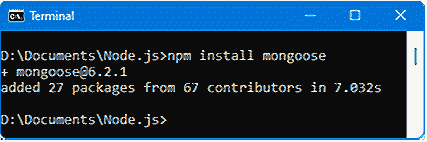
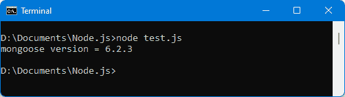
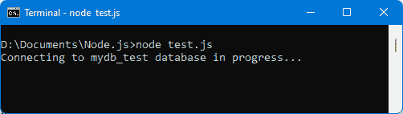
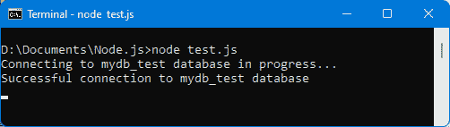
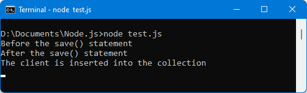
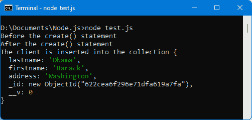
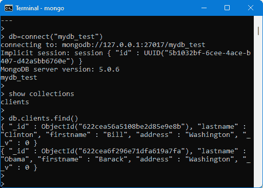

# 第八章：*第八章*：使用 Node.js 与 MongoDB

**MongoDB** 是传统上与 Node.js 关联的数据库。它是一种 NoSQL 类型的数据库，这意味着不会使用 SQL 来访问其中包含的信息。

MongoDB 是一种面向文档的数据库，我们在其中存储所谓的 *文档*；也就是说，任何类型的数据结构，例如写在一张纸上的信息（然后相当于一个文档）。几张纸，因此对应几个文档，形成所谓的 *集合*。

例如，一个文档可以是客户的姓名、姓氏和地址。来自多个客户的聚合信息被称为集合。

在本章中，我们将研究如何结合 Node.js 使用 MongoDB 来存储、读取、删除或更新数据库中的信息。

插入、搜索、更新或删除数据是可以在数据库中执行的主要操作。因此，在本章中，我们将看到如何使用 MongoDB 数据库执行这些操作。

本章涵盖以下主题：

+   安装 MongoDB 和 mongoose 模块

+   连接到 MongoDB 数据库

+   创建文档

+   搜索文档

+   更新文档

+   删除文档

让我们先安装 MongoDB 和 **mongoose** 模块，这将允许在 Node.js 程序中使用 MongoDB。

# 技术要求

您可以在 GitHub 上找到本章的代码文件：[`github.com/PacktPublishing/JavaScript-from-Frontend-to-Backend/blob/main/Chapter%208.zip`](https://github.com/PacktPublishing/JavaScript-from-Frontend-to-Backend/blob/main/Chapter%208.zip)。

# 安装 MongoDB

MongoDB 数据库独立于 Node.js，需要单独安装。为此，请访问网站 [`www.mongodb.com/docs/manual/administration/install-community/`](https://www.mongodb.com/docs/manual/administration/install-community/)。下载适合您系统的版本。

安装 MongoDB 后，通过在命令解释器中输入 `mongo -h` 命令来验证安装是否正确。`mongo` 命令位于 MongoDB 的 `Server/x.x/bin` 目录中，其中 `x.x` 是安装的 MongoDB 版本号。

注意

在撰写本文时，`mongo` 工具在安装 MongoDB 时直接可用。然而，这个工具可能很快就会作为单独的版本提供，并被称为 `mongosh`。在这种情况下，请从 [`www.mongodb.com/docs/mongodb-shell/install/`](https://www.mongodb.com/docs/mongodb-shell/install/) 下载此工具。

`mongo` 命令将被等效的 `mongosh` 命令替换。这两个命令的工作方式相同。

在安装 MongoDB 之后，我们将探讨 mongo（或 mongosh）实用工具。mongo 实用工具使得查看数据库集合的内容变得容易，而无需编写程序行。因此，它对于检查，例如，文档是否已正确插入到集合中，或其删除是否成功，非常有用。让我们看看如何使用 mongo 实用工具。

## 使用 mongo 实用工具

mongo 实用工具使您能够轻松查看数据库及其包含的集合。只需在命令解释器中输入`mongo`命令即可启动 mongo 实用工具。程序随后将等待数据库访问命令，或输入`exit`命令以退出。

这里是 mongo 实用工具中可用的主要命令列表：

+   `show dbs`: 这显示了现有数据库的列表。只有当数据库包含至少一个集合时，数据库才会在此处可见。

+   `db=connect("mydb_test")`: 这是连接到数据库`mydb_test`。然后`db`变量将用于访问数据库集合。

+   `show collections`: 这显示了连接数据库的集合。如果集合包含至少一个文档，则将存在集合。

+   `db.clients.find()`: 这显示了`clients`集合中的所有文档。

+   `db.clients.find({name:"Clinton"})`: 这列出了`clients`集合中名为`Clinton`的文档。

+   `db.clients.find().sort({name:1})`: 这按`name`字段的升序对文档进行排序。使用`{name:-1}`进行降序排序。

+   `db.clients.count()`: 这计算在`clients`集合中找到的文档数量。

+   `db.clients.renameCollection("clients2")`: 这将`clients`集合重命名为`clients2`。

+   `db.clients.drop()`: 这将删除`clients`集合（所有文档都将被删除）。

+   `db.dropDatabase()`: 这将删除连接的数据库（所有集合都将被移除）。

其他命令存在，特别是用于在集合中插入、更新或删除文档的命令。但由于这些操作是通过 mongoose 模块执行的，我们将使用 mongoose 模块来描述它们。

## 安装 mongoose 模块

为了建立 MongoDB 和 Node.js 之间的关系，已经创建了几个 npm 模块。目前最广泛使用的是`mongoose`模块。通过输入`npm install mongoose`命令，它被安装在本目录的`node_modules`目录中。



图 8.1 – 安装 mongoose 模块

一旦通过 npm 下载了 mongoose，我们将检查它是否可用于我们的程序。让我们显示程序的 mongoose 版本。我们将此代码片段写入`test.js`文件：

显示 mongoose 版本（test.js 文件）

```js
var mongoose = require("mongoose");
```

```js
console.log("mongoose version =", mongoose.version);
```

让我们使用`node test.js`命令来运行前面的程序：



![图 8.2 – 检查 mongoose 是否可访问警告如果你加载 mongoose 模块时遇到错误，那可能是因为你全局安装了它（使用 `-g` 选项）。在这种情况下，只需在终端中输入 `npm link mongoose` 命令来消除错误。mongoose 模块将允许我们使用 MongoDB 数据库创建文档、搜索它们、更新它们或销毁它们。这些是在数据库上可以执行的经典操作。但要能够执行这些操作，首先需要连接到数据库。# 连接到 MongoDB 数据库访问 MongoDB 的所有操作都需要与它建立连接。现在让我们看看如何与 MongoDB 建立连接。`mongoose.connect(url)` 指令将 mongoose 模块连接到 `url` 参数指定的数据库。`url` 参数的形式为 `"mongodb://localhost/mydb_test"`，用于连接到本地服务器上的 `mydb_test` 数据库。当第一个文档被插入到数据库中时，数据库实际上将被创建（并且可以通过执行 mongo 实用工具的 `show dbs` 命令来看到）：连接到 mydb_test 数据库（test.js 文件）```jsvar mongoose = require("mongoose");``````jsmongoose.connect("mongodb://localhost/mydb_test");``````jsconsole.log("Connecting to mydb_test database in progress...");```让我们运行之前的程序：



图 8.3 – 数据库连接

为了知道数据库连接是否真正建立，mongoose 在 `mongoose.connection` 对象上发送 `open` 事件（如果连接成功）或 `error` 事件（如果连接失败）。

接下来，我们将考虑这两个事件并将它们集成到之前的程序中。这是通过在 `mongoose.connection` 对象上定义的 `on(event, callback)` 方法来完成的：

注意

`on(event, callback)` 方法用于处理事件的接收并将其与回调函数中描述的处理相关联。

在数据库连接中使用 open 和 error 事件（test.js 文件）

```js
var mongoose = require("mongoose");
```

```js
mongoose.connect("mongodb://localhost/mydb_test");
```

```js
mongoose.connection.on("error", function() {
```

```js
 console.log("mydb_test database connection error")
```

```js
});
```

```js
mongoose.connection.on("open", function() {
```

```js
 console.log("Successful connection to mydb_test 
```

```js
 database");
```

```js
});
```

```js
console.log("Connecting to mydb_test database in progress...");
```

让我们运行之前的程序：




图 8.4 – 成功连接到数据库

我们已经看到了如何连接到数据库。因此，我们将在数据库的集合中创建文档。

# 在 MongoDB 中创建文档

一旦访问了数据库，你就可以在其中创建文档。

文档将被插入到一个 *集合* 中。因此，集合将把一组文档组合在一起。数据库因此将是一组集合，每个集合包含文档。

为了能够插入文档，mongoose 要求我们描述这些文档的结构。为此，我们将使用模式和模型。

## 使用模式和模型描述文档结构

要访问数据库中的文档，必须通过模式和模型来描述这些文档。

定义

*模式* 允许你定义存储在集合中的文档的结构。结构是根据 MongoDB 数据类型定义的。

*模型* 是方案作为 JavaScript 类的表示。它将方案链接到 MongoDB 集合。

让我们看看如何创建方案和模型。

### 创建方案

方案使用 Node.js 内部对象类定义文档的字段。以下是一些类：

+   `String`: 这定义了一个字符字符串。

+   `Number`: 这定义了一个数值字段。

+   `Boolean`: 这定义了一个布尔值。

+   `Array`: 这定义了一个数组。

+   `Buffer`: 这定义了一个字节缓冲区。

+   `Date`: 这定义了一个日期。

+   `Object`: 这定义了一个 JavaScript 对象。

使用 `mongoose.Schema(format)` 方法来定义与文档关联的模式。`format` 参数是一个 JavaScript 对象，它将文档中的每个字段与表示它的类型（在上面的列表中）关联起来。

让我们创建定义客户端的方案。客户端以其 `lastname`、`firstname` 和 `address` 为特征。所有这些字段都是 `String` 类型：

定义与客户端关联的模式（test.js 文件）

```js
var mongoose = require("mongoose");
```

```js
mongoose.connect("mongodb://localhost/mydb_test");
```

```js
var clientSchema = mongoose.Schema({
```

```js
 lastname : String,
```

```js
 firstname : String,
```

```js
 address : String
```

```js
});
```

现在让我们解释如何从方案创建模型。

### 创建模型

然后使用该模式来定义与文档关联的模型。该模型对应于一个 JavaScript 类，该类将用于在集合中创建文档。

`mongoose.model(collection, schema)` 方法返回与方案关联的 JavaScript 类。这个类被称为模型。

使用此类创建的文档将被插入到指定的 `collection` 中。在插入文档之前，集合可能不存在。一个集合至少需要包含一个文档。

摘要

方案指定了存储在集合中的文档的格式，而模型是用于创建每个此类文档的 JavaScript 类。我们使用 `mongoose.model(collection, schema)` 方法调用将文档方案与集合关联起来。这返回一个 JavaScript 类，然后可以用来生成单个文档实例。

让我们创建 `Client` 类，它将创建存储在 `clients` 集合中的客户端。根据模型名称命名集合是传统的，应使用小写且为复数形式：

从方案创建 `Client` 模型（test.js 文件）

```js
var mongoose = require("mongoose");
```

```js
mongoose.connect("mongodb://localhost/mydb_test");
```

```js
var clientSchema = mongoose.Schema({
```

```js
 lastname : String,
```

```js
 firstname : String,
```

```js
 address : String
```

```js
});
```

```js
// creation of the Client class associated with the clients 
```

```js
// collection
```

```js
var Client = mongoose.model("clients", clientSchema);
```

`Client` 类现在可用于创建将插入到 `clients` 集合中的文档。

## 创建文档

创建集合中的文档有两种方法。这些是 `doc.save(callback)` 实例方法和 `create(doc, callback)` 类方法。让我们看看这两种在集合中创建文档的方法。

让我们首先使用 `doc.save(callback)` 实例方法。

### 使用 `doc.save(callback)` 实例方法

客户端文档是通过之前创建的类（通过 `var client = new Client()`）在内存中创建的，然后通过 `client.save()` 方法保存到 `clients` 集合中。

回调函数允许在文档完成插入到集合后进行处理。这在需要等待文档插入到数据库后再继续处理时特别有用：

使用 save() 实例方法保存文档（test.js 文件）

```js
var mongoose = require("mongoose");
```

```js
mongoose.connect("mongodb://localhost/mydb_test");
```

```js
var clientSchema = mongoose.Schema({
```

```js
 lastname : String,
```

```js
 firstname : String,
```

```js
 address : String
```

```js
});
```

```js
// creation of the Client class associated with the clients 
```

```js
// collection
```

```js
var Client = mongoose.model("clients", clientSchema);
```

```js
// create the document in memory
```

```js
var c = new Client({lastname :"Clinton", firstname:"Bill", address:"Washington"});
```

```js
console.log("Before the save() statement");
```

```js
// save the document in the database (clients collection)
```

```js
c.save(function(err) {
```

```js
if (!err) console.log("The client is inserted into the 
```

```js
  collection");
```

```js
});
```

```js
console.log("After the save() statement");
```

回调函数接受 `err` 参数，它对应于可能出现的错误消息（否则，它是 `null`）。

我们得到以下结果：



图 8.5 – 使用 doc.save() 实例方法

使用控制台显示的跟踪信息，我们可以看到消息 `The client is inserted into the collection` 在其他消息之后显示，这意味着插入文档不会阻塞其他任务（即，其他任务可以在等待数据库插入时完成）。

`save()` 方法也可以用作 `Promise` 对象（参见 *第二章*，*探索 JavaScript 的高级概念*）。为此，我们随后使用 `then(callback)` 方法，可能还会跟随着 `catch(callback)` 方法来处理调用 `save()` 方法时出现的错误情况。

在这种情况下，我们编写以下内容：

使用 save() 方法作为 Promise 对象

```js
c.save().then(function(doc) {
```

```js
  console.log(doc);
```

```js
  console.log("The client is inserted into the collection");
```

```js
}).catch(function(err) {
```

```js
  console.log(err);  // display the error
```

```js
});
```

现在，让我们看看使用 `create(doc, callback)` 类方法创建文档的另一种方法。

### 使用 create(doc, callback) 类方法

类方法意味着我们可以使用该方法而不需要实例化一个对象，这与需要创建类对象（使用 `c = new Client()`）的实例方法不同。

要创建与 `{lastname:"Obama", firstname:"Barack", address:"Washington"}` 标识的客户关联的文档，我们会编写以下内容：

使用 Client.create(doc, callback) 类方法保存文档（test.js 文件）

```js
var mongoose = require("mongoose");
```

```js
mongoose.connect("mongodb://localhost/mydb_test");
```

```js
var clientSchema = mongoose.Schema({
```

```js
 lastname : String,
```

```js
 firstname : String,
```

```js
 address : String
```

```js
});
```

```js
// creation of the Client class associated with the clients 
```

```js
// collection
```

```js
var Client = mongoose.model("clients", clientSchema);
```

```js
console.log("Before the create() statement");
```

```js
// save the document in the database (clients collection)
```

```js
Client.create({lastname:"Obama", firstname:"Barack", address:"Washington"}, function(err, doc) {
```

```js
console.log("The client is inserted into the collection", 
```

```js
  doc);
```

```js
});
```

```js
console.log("After the create() statement");
```

`create(doc, callback)` 类方法通过在它前面加上 JavaScript 类的名称（这里，`Client` 类）来使用。

要保存的文档以 JavaScript 对象（JSON 格式）的形式编写，但也可以是使用 `c = new Client()` 实例化的对象。

形式为 `callback(err, doc)` 的回调函数在文档保存在数据库后执行。如果你想在确定文档已保存在集合中时执行某个过程，这个回调函数很有用。

注意

注意，`create(doc, callback)` 方法的回调函数 `callback(err, doc)` 有两个参数 `err` 和 `doc`，分别对应可能的错误和保存在数据库中的文档。

让我们运行前面的程序：



图 8.6 – 使用 Client.create() 类方法

保存的文档具有与模型关联的格式中指示的字段（在此处为 `lastname`、`firstname` 和 `address` 字段），但也包含 `_id` 和 `__v` 字段，这些字段由 MongoDB 自动添加：

+   `_id` 字段是 MongoDB 用于为集合中的每个文档提供唯一标识符的字段。它扮演着主键的角色。

+   `__v` 字段是由 mongoose 添加的字段，与文档版本号相关联。我们在此处不会使用它。

与 `save()` 实例方法一样，`create(doc)` 类方法也可以用作 `Promise` 对象。为此，我们不在 `create(doc)` 方法中使用 `callback` 参数，而是在 `create(doc)` 方法调用之后使用 `then(callback)` 和 `catch(callback)` 方法。

例如，我们也可以编写以下内容：

将 create() 方法用作 Promise 对象

```js
Client.create({lastname:"Obama", firstname:"Barack", address:"Washington"}).then(function(doc) {
```

```js
  console.log("The client is inserted into the collection", 
```

```js
  doc);
```

```js
});
```

在前面的示例中，我们已经将两个文档插入到 `clients` 集合中。让我们使用 mongo 工具显示插入的文档并验证集合中存在的文档。

### 使用 mongo 工具查看插入的文档

要显示插入的文档，请使用 mongo 工具并输入以下命令：

1.  `db=connect("mydb_test")` 用于连接到数据库

1.  `show collections` 用于显示已存在的集合

1.  `db.clients.find()` 用于显示 `clients` 集合中的文档



图 8.7 – 使用 mongo 工具查看文档

因此，我们检查 `clients` 集合中的两个文档确实存在。

让我们看看如何使用 mongoose 模块方法来搜索它们。

# 在 MongoDB 中搜索文档

一旦文档已插入到集合中，就可以使用 `find()` 类方法进行搜索。

注意

`find()` 方法是一个类方法，这意味着它通过在类名前加上与模型关联的类名来使用，例如，`Client.find()`。

`find(conditions, callback)` 方法用于在关联的模型集合中执行搜索，然后在回调函数中检索搜索结果，该回调函数作为参数指示。

让我们深入探讨一下参数：

+   `conditions` 参数是一个 JavaScript 对象，用于指定搜索条件。如果没有指定条件，则不进行任何指示（或指示一个空对象 `{}`）。

+   回调函数的形式为 `callback(err, results)`，其中 `err` 是错误消息（否则为 `null`），`results` 是包含搜索结果的数组（如果没有找到则为空数组 `[]`）。

此外，还有一个 `findOne(conditions, callback)` 类方法，它允许你根据相同的原则找到满足搜索条件的第一个文档。回调函数的形式为 `callback(err, result)`，其中 `result` 是找到的第一个文档。

注意

如果你正在寻找单个文档，例如通过其标识符 `_id`，`findOne(conditions, callback)` 方法将很有用。

你也可以使用 `find(conditions)` 和 `findOne(conditions)` 方法，而不必指定回调函数作为参数。为此，我们使用 `then(callback)` 和 `catch(callback)` 方法来处理找到的文档或发生错误时的事件。我们还可以使用 `exec(callback)` 方法，如以下章节所述。

让我们现在看看如何编写在两个方法 `find()` 和 `findOne()` 中使用的 `conditions` 参数。

## 编写搜索条件

在 `conditions` 参数中，我们指明一个对象，其属性是集合中文档的字段，相关值是字段所寻求的值，形式为 `{field1:value1, field2:value2...}`，例如，`{lastname:"Clinton", firstname:"Bill"}`。

可以使用其他属性作为关键字来表示条件。它们以 `$` 符号开头，例如：`$or`、`$exists`、`$type`、`$where`、`$gt` 和 `$lt`。

注意

可以在此处找到可能的关键字列表：[`docs.mongodb.com/manual/reference/operator/query/`](https://docs.mongodb.com/manual/reference/operator/query/)。

这里有一些条件示例：

+   `{ }`: 集合中的所有文档。你也可以写 `find()`，它与 `find({})` 等价。

+   `{ lastname: "Clinton" }`: 所有姓氏为 `Clinton` 的文档。

+   `{ lastname: "Clinton", firstname: "Bill" }`: 所有姓氏为 `Clinton` 且名字为 `Bill` 的文档。

+   `{ $or: [{ lastname: "Clinton"}, { firstname: "Jimmy" }] }`: 所有姓氏为 `Clinton` 或名字为 `Jimmy` 的文档。

+   `{ lastname: /obama/i }`: 所有姓氏包含字符串 `obama`（不区分大小写）的文档（正则表达式）。

+   `{ address: { $exists: true} }`: 所有 `address` 字段存在的文档，无论其类型（字符串、对象等）。

+   `{ address: { $exists: true, $type: 2 } }`: 所有 `address` 字段存在且类型为 `2`（字符串）的文档。

+   `{"address.city": "Washington" }`: 包含 `address` 字段且该字段本身有一个城市字段，其值为 `Washington` 的所有文档。

+   `{lastname:{$type:2}, $where:"this.lastname.match(/^Clinton|carter$/i)"}`: 所有姓氏为字符串（类型 = `2`）且姓氏以 `Clinton` 或以 `carter` 结尾（不区分大小写）的文档。你必须指明姓氏是字符字符串，否则你可能会在不符合此格式的姓名上遇到错误。

+   `{lastname: { $gt: "J", $lt: "S" }}`: 所有姓氏大于 `"J"` 且小于 `"S"` 的文档。

+   `{lastname: { $in:["Clinton", "Carter", "Obama"] }}` : 所有姓氏为 `Clinton`、`Carter` 或 `Obama` 的文档。

一旦表达出搜索条件，就必须检索和显示找到的结果。让我们看看如何做。

## 检索和显示结果

无论表达的条件是什么，都可以在 `find()` 方法的关联回调函数中检索相应的结果，形式为 `callback(err, results)`。我们还将看到可以使用 `exec(callback)` 方法来检索结果。

让我们看看这两种检索搜索结果的方法。

### 使用 find(conditions, callback) 方法的回调参数

让我们查找所有姓氏为 `Clinton` 或名字为 `Barack` 的客户。结果将在回调函数中显示：

显示姓氏为 “Clinton” 或名字为 “Barack” 的客户（test.js 文件）

```js
var mongoose = require("mongoose");
```

```js
mongoose.connect("mongodb://localhost/mydb_test");
```

```js
var clientSchema = mongoose.Schema({
```

```js
 lastname : String,
```

```js
 firstname : String,
```

```js
 address : String
```

```js
});
```

```js
// creation of the Client class associated with the clients 
```

```js
// collection
```

```js
var Client = mongoose.model("clients", clientSchema);
```

```js
Client.find({ $or : [ { lastname : "Clinton" }, { firstname : "Barack"} ] }, function(err, clients) {
```

```js
  console.log(clients);
```

```js
});
```

我们将获得以下图中显示的结果：


图 8.8 – 使用 find(conditions, callback) 显示搜索结果

回调函数可以在之前的 `find()` 方法中表达，或者在 `find()` 方法之后使用的 `exec()` 方法中指定。现在让我们来考察第二种可能性。

### 使用 `exec(callback)` 方法

另一种检索结果的方法是在 `find(conditions)` 方法之后使用 `exec(callback)` 方法。在这里使用 `find(conditions)` 方法时没有在其参数中指定回调函数，因为回调函数已在 `exec(callback)` 方法中指定。

这种方法的优点是，我们可以在 `find()` 方法和 `exec()` 方法之间插入新方法。例如，如果我们想添加额外的条件，即 `lastname` 字段必须等于 `Clinton`，我们可以编写以下内容：

将搜索条件添加为姓氏为 “Clinton”（test.js 文件）

```js
var mongoose = require("mongoose");
```

```js
mongoose.connect("mongodb://localhost/mydb_test");
```

```js
var clientSchema = mongoose.Schema({
```

```js
 lastname : String,
```

```js
 firstname : String,
```

```js
 address : String
```

```js
});
```

```js
// creation of the Client class associated with the clients 
```

```js
// collection
```

```js
var Client = mongoose.model("clients", clientSchema);
```

```js
Client.find({ $or : [ { lastname : "Clinton" }, { firstname : "Barack"} ] })
```

```js
.where("lastname")
```

```js
.eq("Clinton")
```

```js
.exec(function(err, clients) {
```

```js
  console.log(clients);
```

```js
});
```

注意

`where(field)` 和 `eq(value)` 等方法可以在 `find()` 方法之后链式使用。调用 `exec()` 方法时，搜索将有效执行。其他使用可能性在此描述：[`mongoosejs.com/docs/api/query.html#query_Query-where`](https://example.org/mongoosejs.com/docs/api/query.html#query_Query-where)。

您也可以使用 `exec(callback)` 方法，而不必指定回调函数作为参数。为此，我们使用 `then(callback)` 和 `catch(callback)` 方法来处理找到的文档或发生错误时进行的处理。

我们可以这样写：

将 exec() 方法作为 Promise 对象使用

```js
Client.find({ $or : [ { lastname : "Clinton" }, { firstname : "Barack"} ] })
```

```js
.where("lastname")
```

```js
.eq("Clinton")
```

```js
.exec()
```

```js
.then(function(clients) {
```

```js
  console.log(clients);  // display the clients
```

```js
})
```

```js
.catch(function(err) {
```

```js
  console.log(err);  // display the error
```

```js
});
```

结果将在以下图中显示。


图 8.9 – 使用 `exec(callback)` 方法

我们已经学会了如何创建文档，然后搜索它们。现在让我们看看如何更新它们。

# 在 MongoDB 中更新文档

可以修改集合中的一个或多个文档。分别使用 `updateOne()` 和 `updateMany()` 类方法来修改找到的第一个文档或所有找到的文档。

这两种方法具有类似的参数：

+   `updateMany(conditions, update, callback)` 表示根据指示的 `conditions` 在指定的文档上修改 `update` 对象中指示的数据。更新后，将调用形式为 `callback(err, response)` 的回调函数。

+   `updateOne(conditions, update, callback)` 表示根据指示的 `conditions` 修改第一个找到的文档上的 `update` 对象中指示的数据。更新后，将调用形式为 `callback(err, response)` 的回调函数。

+   在这两种方法中，`conditions` 和 `update` 参数是必须的。

    警告

    如果方法中没有回调函数，你必须随后使用 `then()` 或 `exec()` 方法，否则更新不会完成。

让我们修改 `Clinton` 的地址，现在将是 `纽约`：

使用 updateOne() 修改 "Clinton" 的地址（test.js 文件）

```js
var mongoose = require("mongoose");
```

```js
mongoose.connect("mongodb://localhost/mydb_test");
```

```js
var clientSchema = mongoose.Schema({
```

```js
 lastname : String,
```

```js
 firstname : String,
```

```js
 address : String
```

```js
});
```

```js
// creation of the Client class associated with the clients 
```

```js
// collection
```

```js
var Client = mongoose.model("clients", clientSchema);
```

```js
Client.updateOne({ lastname : "Clinton" }, { address : "New York" }, function(err, response) {
```

```js
  console.log("response =", response);
```

```js
});
```

在这里，我们使用回调函数来显示函数返回的 `response` 参数的内容。我们得到以下结果：

![图 8.10 – 更新文档]

![img/Figure_8.10_B17416.jpg]

图 8.10 – 更新文档

注意

`response.modifiedCount` 字段表示修改的文档数量。

如果你不想在更新结束时执行任何处理，你可以省略回调函数，但在此情况下，你必须随后使用 `then()` 或 `exec()` 方法，否则更新将不会发生。

让我们使用 `exec()` 方法执行更新：

使用 exec() 方法执行更新（test.js 文件）

```js
var mongoose = require("mongoose");
```

```js
mongoose.connect("mongodb://localhost/mydb_test");
```

```js
var clientSchema = mongoose.Schema({
```

```js
 lastname : String,
```

```js
 firstname : String,
```

```js
 address : String
```

```js
});
```

```js
// creation of the Client class associated with the clients 
```

```js
// collection
```

```js
var Client = mongoose.model("clients", clientSchema);
```

```js
Client.updateOne({ lastname : "Clinton" }, 
```

```js
                 { address : "New York" })
```

```js
.exec();    // exec() mandatory!
```

一旦你知道如何创建、搜索和修改文档，你只需要知道如何删除它们。让我们看看如何操作。

# MongoDB 中的文档删除

与 `updateOne()` 和 `updateMany()` 类似，存在两个类方法，即 `deleteOne(conditions, callback)` 和 `deleteMany(conditions, callback)`，允许你删除满足表达条件的第一个文档（`deleteOne()`）或所有文档（`deleteMany()`）。

此外，实例方法 `doc.remove(callback)` 还使得在文档在内存中时删除 `doc` 文档成为可能。

让我们使用 `deleteOne()` 方法从集合中删除 `Clinton`，然后显示集合的新内容：

使用 deleteOne() 删除客户端 "Clinton"（test.js 文件）

```js
var mongoose = require("mongoose");
```

```js
mongoose.connect("mongodb://localhost/mydb_test");
```

```js
var clientSchema = mongoose.Schema({
```

```js
 lastname : String,
```

```js
 firstname : String,
```

```js
 address : String
```

```js
});
```

```js
// creation of the Client class associated with the clients 
```

```js
// collection
```

```js
var Client = mongoose.model("clients", clientSchema);
```

```js
Client.deleteOne({ lastname : "Clinton" }, function(err, response) {
```

```js
  console.log("After Clinton's removal");
```

```js
  console.log("response = ", response);
```

```js
  Client.find(function(err, clients) {
```

```js
    console.log("clients = ", clients);
```

```js
  });
```

```js
});
```

与 `updateOne()` 和 `updateMany()` 方法类似，存在触发数据库更新的回调函数。如果你没有指定回调函数，你必须在这种情况下使用 `then()` 或 `exec()` 方法，否则更新将不会发生。

结果如下图所示：

![图 8.11 – 使用 deleteOne() 删除 "Clinton" 客户端]

![img/Figure_8.11_B17416.jpg]

图 8.11 – 使用 deleteOne() 删除 “Clinton” 客户端

`deleteOne()`（或 `deleteMany()`）方法的回调函数返回的 `response` 对象指示 `deletedCount` 字段，其中包含删除的文档数量。

我们已经依次研究了在 MongoDB 数据库中对文档的四种可能操作，即插入、搜索、修改和删除文档。至此，本章内容结束。

# 摘要

由于使用了 mongoose 等外部模块，MongoDB 的数据管理相对简单，所有数据库上的可能操作都容易实现。

当安装 MongoDB 时可用的 mongo 工具使得查看集合及其包含的文档变得容易。

使用 MongoDB 数据库对于构建客户端-服务器应用程序和维护用户信息至关重要。

剩下的就是看看如何将用 Vue.js 开发的客户端与用 Node.js 开发的服务器端进行互连。我们将在下一章中看到这一点。我们将构建一个 100% 的 JavaScript 应用程序，以展示其简单和高效。
