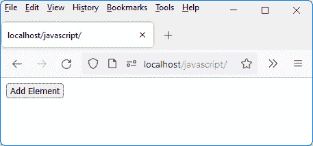
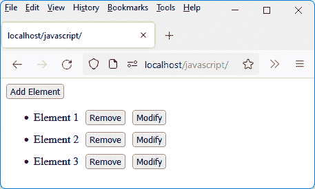
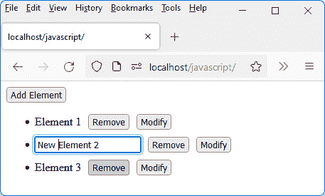
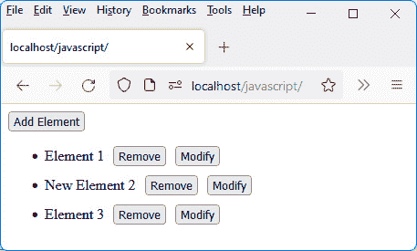
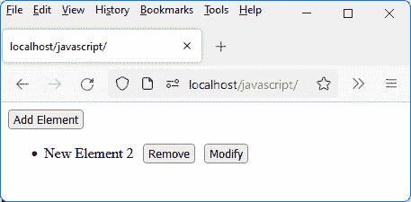
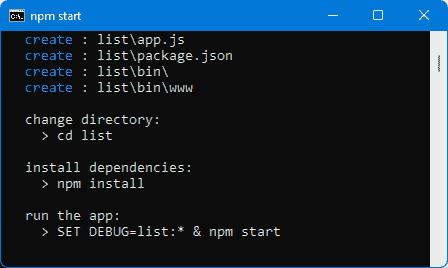
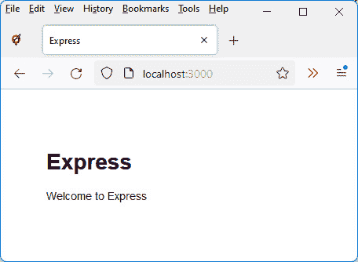
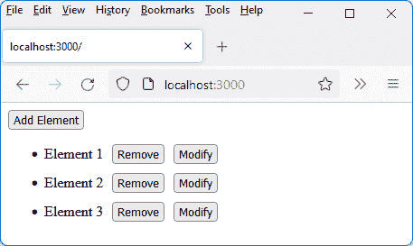
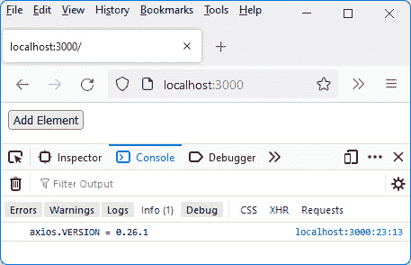
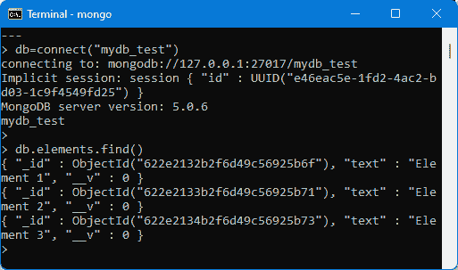

# *第九章*：集成 Vue.js 与 Node.js

在本章中，我们将学习如何使用 Express（根据 MVC 模型）来结构化服务器代码并将 Vue.js 应用程序集成到 Node.js 服务器中，并使用 MongoDB 来存储信息。

对于这一点，我们将使用*第五章*中构建的列表管理应用程序的例子，即*使用 Vue.js 管理列表*。但在这里，我们将使用 Node.js 服务器，并将列表项存储在 MongoDB 数据库中。这将允许它们在必要时重新显示。

最后，我们将获得一个完全由 JavaScript（客户端和服务器端）制成的客户端-服务器应用程序。

本章涵盖以下主题：

+   显示应用程序屏幕

+   使用 Express 构建应用程序

+   MongoDB 数据库结构

+   安装 Axios 库

+   在列表中插入新元素

+   显示列表元素

+   修改列表中的元素

+   从列表中删除元素

应用程序使用与*第五章**使用 Vue.js 管理列表*中已经使用的相同屏幕。我们将在下面重复它们，以便您更容易理解。

# 技术要求

您可以在 GitHub 上找到本章的代码文件：[`github.com/PacktPublishing/JavaScript-from-Frontend-to-Backend/blob/main/Chapter%209.zip`](https://github.com/PacktPublishing/JavaScript-from-Frontend-to-Backend/blob/main/Chapter%209.zip)。

# 显示应用程序屏幕

在这里，我们可视化应用程序的屏幕，允许以下操作：

+   显示已存在的列表（最初为空）

+   在列表末尾插入新元素

+   修改列表中的元素

+   从列表中删除项目

    注意

    访问列表的 URL 是`http://localhost:3000`。这里使用的服务器是运行**Express**模块的 Node.js 服务器。使用的数据库是**MongoDB**。

初始时，列表为空。页面上只存在**添加元素**按钮（见以下图示）：



图 9.1 – 空项目列表

点击**添加元素**按钮多次会创建多个带有文本**元素 X**以及**删除**和**修改**按钮的行（这里我们点击了**添加元素**按钮三次）：



图 9.2 – 向列表中添加三个项目

接下来，让我们修改第二个元素。一个输入字段出现在项目文本的位置。让我们在输入字段中输入`New Element 2`来替换显示在输入字段中的文本：



图 9.3 – 编辑列表中的第二个项目

通过点击输入字段外的地方，输入字段消失，元素的文本被修改：



图 9.4 – 第二个列表项已更改

最后，让我们从列表中移除第一和第三项：



图 9.5 – 移除了第一和第三列表项

现在，当我们刷新之前的窗口时，我们看到列表重新显示了`New Element 2`，从而表明所做的修改确实已存储在数据库中。当我们用 Vue.js 仅在第五章中创建此应用时并非如此，即*使用 Vue.js 管理列表*，因为列表元素没有保存在数据库中：


图 9.6 – 新的列表显示：列表被保留

要创建此应用，我们当然会使用我们在*第五章*中编写的 Vue.js 程序，即*使用 Vue.js 管理列表*。但必须对其进行修改，以便此应用能在带有 Express 模块的 Node.js 服务器上运行，并且显示的数据存储在 MongoDB 数据库中。

在此处，我们将指出之前在*第五章*中编写的`<GlobalApp>`和`<Element>`组件的文件，即*使用 Vue.js 管理列表*，以解释接下来对它们的修改。

下面是`<GlobalApp>`组件：

`<GlobalApp>`组件（global-app.js 文件）

```js
import Element from "./element.js";
```

```js
const GlobalApp = {
```

```js
  data() {
```

```js
    return {
```

```js
      elements : []
```

```js
    }
```

```js
  },
```

```js
  components : {
```

```js
    Element:Element
```

```js
  },
```

```js
  template : `
```

```js
    <button @click="add()">Add Element</button>
```

```js
    <ul>
```

```js
      <Element v-for="(element, index) in elements" 
```

```js
       :key="index" 
```

```js
        :text="element" :index="index"
```

```js
        @remove="remove($event)" @modify="modify($event)"
```

```js
      />
```

```js
    </ul>
```

```js
  `,
```

```js
  methods : {
```

```js
    add() {
```

```js
      var element = "Element " + (this.elements.length + 1);
```

```js
      this.elements.push(element);
```

```js
    },
```

```js
    remove(params) {
```

```js
      var index = params.index;
```

```js
      this.elements.splice(index, 1);
```

```js
    },
```

```js
    modify(params) {
```

```js
      var index = params.index;
```

```js
      var value = params.value;
```

```js
      this.elements[index] = value;
```

```js
    }
```

```js
  }
```

```js
}
```

```js
export default GlobalApp;
```

下面是`<Element>`组件：

`<Element>`组件（element.js 文件）

```js
const Element = {
```

```js
  data() {
```

```js
    return {
```

```js
      input : false
```

```js
    }
```

```js
  },
```

```js
  template : `
```

```js
    <li> 
```

```js
      <span v-if="!input"> {{text}} </span>
```

```js
      <input v-else type="text" :value="text" 
```

```js
       @blur="modify($event)" ref="refInput" />
```

```js
      <button @click="remove()"> Remove </button> 
```

```js
      <button @click="input=true"> Modify </button>
```

```js
    </li>
```

```js
  `,
```

```js
  props : ["text", "index"],
```

```js
  methods : {
```

```js
    remove() {
```

```js
      // process the click on the Remove button
```

```js
      this.$emit("remove", { index : this.index });
```

```js
    },
```

```js
    modify(event) {
```

```js
      var value = event.target.value;
```

```js
      this.input = false;
```

```js
      this.$emit("modify", { index : this.index, value : 
```

```js
      value });
```

```js
    }
```

```js
  },
```

```js
  emits : ["remove", "modify"],
```

```js
  updated() {
```

```js
    // check that refInput exists, and if so, give focus to 
```

```js
    // the input field
```

```js
    if (this.$refs.refInput) this.$refs.refInput.focus();  
```

```js
  }
```

```js
}
```

```js
export default Element;
```

允许您包含`<GlobalApp>`组件的`index.html`文件如下：

index.html 文件

```js
<html>
```

```js
  <head>
```

```js
    <meta charset="utf-8" />
```

```js
    <script src="img/vue@next"></script>
```

```js
    <style type="text/css">
```

```js
      li {
```

```js
        margin-top:10px;
```

```js
      }
```

```js
      ul button {
```

```js
        margin-left:10px;
```

```js
      }
```

```js
    </style>
```

```js
  </head>
```

```js
  <body>
```

```js
    <div id="app"></div>
```

```js
  </body>
```

```js
  <script type="module">
```

```js
    import GlobalApp from "./global-app.js";
```

```js
    var app = Vue.createApp({
```

```js
      components : {
```

```js
        GlobalApp:GlobalApp
```

```js
      },
```

```js
      template : "<GlobalApp />"
```

```js
    });
```

```js
    var vm = app.mount("div#app");
```

```js
  </script>
```

```js
</html>
```

要创建此应用，我们首先创建 Node.js 应用，该应用将托管用 Vue.js 编写的 JavaScript 代码。为此，使用`express`命令创建应用。应用将被命名为*list*（例如），因此我们需要输入`express list`命令来创建此应用，如以下章节所述。

# 使用 Express 构建应用

让我们先使用 Express 创建应用。为此，输入`express list`命令，这将创建名为*list*的应用。此应用将通过 URL `http://localhost:3000` 访问，如*第七章*中所述，即*使用 Express 与 Node.js*。

在当前目录下输入`express list`命令：



图 9.7 – 使用 Express 创建应用列表

通过输入指示的命令启动服务器，即：`cd list`，`npm install`，然后是`npm start`。

通过在浏览器中输入 URL `http://localhost:3000` 启动应用。

我们展示了 Express 标准创建的基本应用（见*图 9.8*）。

如果在加载 Express 模块时发生错误，你可以输入`npm link express`命令以在应用程序中定位 Express 模块。如果加载 mongoose 模块时发生错误，你可以输入`npm link mongoose`命令。

如果一切顺利，你将获得以下结果：



图 9.8 – 使用 Express 创建的标准应用程序

目前的目标是可视化我们使用 Vue.js 创建的列表管理应用程序。它由三个文件组成：

+   启动时需要查看的`index.html`文件

+   描述应用程序主`<GlobalApp>`组件的`global-app.js`文件

+   描述与显示元素行对应的`<Element>`组件的`element.js`文件

Express 应用程序的主目录（`list`目录）包括一个包含`images`、`javascripts`和`stylesheets`子目录的`public`子目录。

让我们将三个文件`index.html`、`global-app.js`和`element.js`直接放入`public`目录下，位于根目录之下。

注意

修改`public`目录中的文件不需要重启服务器。另一方面，修改 Express 应用程序的`app.js`文件则需要使用`npm start`命令重启服务器。

让我们在浏览器中再次查看 URL `http://localhost:3000`。我们将在*第五章*，*使用 Vue.js 管理列表*中构建的 Vue.js 应用程序现在将显示出来。按钮点击也将开始工作。

唯一的区别是，我们的 Vue.js 应用程序运行在 Node.js 服务器上，而不是像在*第五章*，*使用 Vue.js 管理列表*中那样运行在其他应用程序服务器上。



图 9.9 – 在 Node.js 服务器上运行的应用程序

然而，如果显示的页面被刷新，之前显示的列表将被删除，因为目前数据库中显示的信息没有持久化。

现在，我们将看到我们的应用程序如何与 Node.js 服务器和 MongoDB 数据库交互。

# MongoDB 数据库结构

为了构建我们的应用程序，我们将在数据库服务器上执行数据读取和更新。例如，每次点击`elements`集合。实际上，`elements`集合中的每个文档都将代表屏幕上列表中显示的元素文本。

注意

要访问 MongoDB 数据库，你首先需要安装 mongoose 模块（见上一章），这允许你在 JavaScript 中操作数据库文档。

要执行此操作，请在 Express 应用程序的主目录（`list`目录）中输入`npm install mongoose`命令。

`elements`集合将用于在 MongoDB 中存储列表项。`elements`集合中的一个文档将包含与其`text`属性关联的文本。每个文档还将有一个`_id`属性，MongoDB 将为每个插入集合的文档分配一个唯一的值。

注意

数据库的结构使用`listSchema`模式描述，该模式将与用于创建`elements`集合文档的`List`模型相关联。

Express 的`app.js`文件被修改以包含这些定义：

将 List 模型添加到使用 MongoDB 的元素集合（app.js 文件）

```js
var createError = require('http-errors');
```

```js
var express = require('express');
```

```js
var path = require('path');
```

```js
var cookieParser = require('cookie-parser');
```

```js
var logger = require('morgan');
```

```js
var indexRouter = require('./routes/index');
```

```js
var usersRouter = require('./routes/users');
```

```js
var mongoose = require("mongoose");
```

```js
mongoose.connect("mongodb://localhost/mydb_test"); // we 
```

```js
// connect 
```

```js
// to 
```

```js
                                                   // mydb_test
```

```js
var listSchema = mongoose.Schema({
```

```js
 text : String     // text associated with the list item
```

```js
});
```

```js
// association of the List model with the elements collection
```

```js
var List = mongoose.model("elements", listSchema);
```

```js
var app = express();
```

```js
// view engine setup
```

```js
app.set('views', path.join(__dirname, 'views'));
```

```js
app.set('view engine', 'jade');
```

```js
app.use(logger('dev'));
```

```js
app.use(express.json());
```

```js
app.use(express.urlencoded({ extended: false }));
```

```js
app.use(cookieParser());
```

```js
app.use(express.static(path.join(__dirname, 'public')));
```

```js
app.use('/', indexRouter);
```

```js
app.use('/users', usersRouter);
```

```js
// catch 404 and forward to error handler
```

```js
app.use(function(req, res, next) {
```

```js
  next(createError(404));
```

```js
});
```

```js
// error handler
```

```js
app.use(function(err, req, res, next) {
```

```js
  // set locals, only providing error in development
```

```js
  res.locals.message = err.message;
```

```js
  res.locals.error = req.app.get('env') === 'development' ? 
```

```js
  err : {};
```

```js
  // render the error page
```

```js
  res.status(err.status || 500);
```

```js
  res.render('error');
```

```js
});
```

```js
module.exports = app;
```

然后`app.js`文件将被丰富以定义将更新数据库的新路由。这些路由将通过使用`app.use()`方法（如在第七章*章 7*，*使用 Node.js 中的 Express*）中解释的那样创建。以下各节将描述这些路由的创建。

注意

多亏了我们创建的`List`模型，我们将能够访问`List.create()`、`List.find()`等方法，以操作 MongoDB 数据库的`elements`集合中的文档。

为了在客户端（这里指浏览器）和服务器（这里指 Node.js 服务器）之间创建交互，以便更新包含元素列表的数据库，我们在这里使用**Axios JavaScript 库**。

# 安装 Axios 库

我们可以看到，目前我们可以操作在 HTML 页面上显示的列表项，但我们还不能在服务器上的数据库中更新它们。

为了做到这一点，Vue.js 程序必须能够与 Node.js 服务器通信。这可以通过使用 Axios（见[`github.com/axios/axios`](https://github.com/axios/axios)）这样的 JavaScript 库来实现。你所要做的就是将库包含在 HTML 页面中（这里将在`index.html`文件中），以便能够使用其功能。

注意

Axios 库是一个允许浏览器和服务器使用**Ajax 技术**进行通信的库。这项技术允许浏览器和服务器在保持同一 HTML 页面的情况下交换信息，这正是我们在这里想要的。这被称为**单页应用**（SPA）（当应用由单个 HTML 页面组成时）。

让我们在`index.html`文件中包含 Axios 库（使用`<script>`标签），并显示`axios.VERSION`变量的值，该变量包含库的版本号。这验证了 Axios 库是可以访问的：

包含 Axios 库并显示版本号（index.html 文件）

```js
<html>
```

```js
  <head>
```

```js
    <meta charset="utf-8" />
```

```js
    <script src="img/vue@next"></script>
```

```js
    <script src="https://unpkg.com/axios/dist/
```

```js
    axios.min.js"></script>
```

```js
    <style type="text/css">
```

```js
      li {
```

```js
        margin-top:10px;
```

```js
      }
```

```js
      ul button {
```

```js
        margin-left:10px;
```

```js
      }
```

```js
    </style>
```

```js
  </head>
```

```js
  <body>
```

```js
    <div id="app"></div>
```

```js
  </body>
```

```js
  <script type="module">
```

```js
   console.log("axios.VERSION = " + axios.VERSION); 
```

```js
    // display Axios version number
```

```js
    import GlobalApp from "./global-app.js";
```

```js
    var app = Vue.createApp({
```

```js
      components : {
```

```js
        GlobalApp:GlobalApp
```

```js
      },
```

```js
      template : "<GlobalApp />"
```

```js
    });
```

```js
    var vm = app.mount("div#app");
```

```js
  </script>
```

```js
</html>
```

我们简单地在`index.html`文件中添加了 Axios 库（使用`<script>`标签）和显示 Axios 库版本号的指令，这允许我们在之后检查 Axios 库是否可访问。

让我们在浏览器中再次显示页面（使用 URL `http://localhost:3000`）。

我们在控制台中收到一条消息，指示使用的 Axios 版本号（见下图），从而表明我们有权访问 Axios 库的功能：



图 9.10 – 显示 Axios 版本号

现在，让我们看看如何使用 Axios 与服务器交互并更新数据库文档。

目标当然是，当然，通过修改我们已编写的 Vue.js 代码以使用 Axios 库，从而与 Node.js 服务器进行通信，最大限度地利用我们已有的 Vue.js 代码。

因此，我们将修改以下文件（除了之前修改的 `index.html` 文件以包含 Axios 库之外）：

+   用于调用 Axios 库的 `global-app.js` 文件

+   用于将 `element.js` 文件适配到数据库结构的文件

+   用于执行数据库查询的 `app.js` 文件

我们已经看到了如何在程序中安装和使用 Axios。现在让我们看看如何使用它将元素插入到数据库中。

# 在列表中插入新元素

让我们看看如何通过点击**添加元素**按钮将新元素存储到列表中。

与此元素相关的文本必须以**元素 X**的形式传输到服务器。我们将在稍后看到如何在点击**修改**按钮后修改此文本。

在 `<GlobalApp>` 组件中定义的 `add()` 方法用于将新元素插入到显示的列表中。将需要添加使用 Axios 库的指令，以便也将此新元素插入到 MongoDB 的 `elements` 集合中。

在开始使用 Axios 之前，修改使用 Vue.js 编写的 JavaScript 程序是有用的。为此，我们将使用在创建 `<Element>` 组件时的新属性，用 `element` 属性替换 `text` 和 `index` 属性。

## 将文本和索引属性替换为元素属性

在创建元素时，我们目前使用元素的文本和索引，然后它们在 `<Element>` 组件中使用，以显示它（及其文本）或修改或删除它（使用其索引）。

在屏幕上显示的列表中通过索引识别元素在之前是有意义的，但如果我们想修改或删除数据库中的元素，这就不再适用了。这是因为 MongoDB 集合的文档不是通过它们的索引来识别的，而是通过它们的标识符 `_id`。

我们不是在 `<Element>` 组件中传递 `text` 和 `index` 参数，而是通过只传递 `element` 参数来简化，该参数是一个 `{ text, _id }` 对象。`element.text` 字段允许您检索要显示的文本，而 `element._id` 字段允许您访问元素的唯一标识符（例如索引，每个元素都是唯一的）。

我们修改 `global-app.js` 和 `element.js` 文件以考虑这一点。

这些文件以下将进行修改，但将再次修改以考虑与数据库的连接：

global-app.js 文件

```js
import Element from "./element.js";
```

```js
const GlobalApp = {
```

```js
  data() {
```

```js
    return {
```

```js
      elements : []  // array of object { text, _id }
```

```js
                     // (_id = document id in MongoDB)
```

```js
    }
```

```js
  },
```

```js
  components : {
```

```js
    Element:Element
```

```js
  },
```

```js
  template : `
```

```js
    <button @click="add()">Add Element</button>
```

```js
    <ul>
```

```js
     <Element v-for="(element, index) in elements" 
```

```js
       :key="index" :element="element"
```

```js
        @remove="remove($event)" @modify="modify($event)"
```

```js
      />
```

```js
    </ul>
```

```js
  `,
```

```js
  methods : {
```

```js
    add() {
```

```js
      var text = "Element " + (this.elements.length + 1);
```

```js
this.elements.push({text:text, 
```

```js
      _id:this.elements.length});  
```

```js
// to modify to retrieve the real 
```

```js
                         // _id provided by MongoDB
```

```js
    },
```

```js
    remove(params) {
```

```js
      var id = params.id;
```

```js
    // remove the element with this id from the elements 
```

```js
      // array
```

```js
      this.elements = this.elements.filter(
```

```js
      function(element) {
```

```js
        if (element._id == id) return false;
```

```js
        else return true;
```

```js
      });
```

```js
    },
```

```js
    modify(params) {
```

```js
      var id = params.id;
```

```js
      var value = params.value;
```

```js
    // modify the text of the element with this id in the 
```

```js
      // elements array
```

```js
      this.elements = this.elements.map(function(element) {
```

```js
        if (element._id == id) {
```

```js
          element.text = value;
```

```js
          return element;
```

```js
        }
```

```js
        else return element;
```

```js
      });
```

```js
    }
```

```js
  }
```

```js
}
```

```js
export default GlobalApp;
```

关于前面的代码，可以做出以下说明：

+   现在的 `elements` 变量现在变成了一个 `{ text, _id }` 对象的数组。为此，我们在 `add()` 方法中写入指令 `this.elements.push({text:text, _id:this.elements.length})`，通过将一个 `{text, _id}` 形式的对象插入到 `elements` 数组中来实现。

+   `_id` 属性的值在这里是临时的：实际上，你必须检索 MongoDB 在文档保存到数据库时提供的标识符。

+   每个 `<Element>` 组件是通过传递一个表示 `{ text, _id }` 对象的 `element` 属性来构建的（在模板中）。

+   `remove()` 方法必须从列表中删除具有传递的标识符的元素。为此，我们使用 JavaScript 的 `filter()` 方法来保留除具有此标识符的元素之外的所有元素。

+   同样，`modify()` 方法必须修改具有此标识符的列表元素的值。我们使用 JavaScript 的 `map()` 方法来返回一个新元素数组，其中具有此标识符的元素值被修改。

`element.js` 文件变为以下内容：

element.js 文件

```js
const Element = {
```

```js
  data() {
```

```js
    return {
```

```js
      input : false
```

```js
    }
```

```js
  },
```

```js
  template : `
```

```js
    <li> 
```

```js
      <span v-if="!input"> {{element.text}} </span>
```

```js
<input v-else type="text" :value="element.text" 
```

```js
@blur="modify($event)" 
```

```js
                    ref="refInput" />
```

```js
      <button @click="remove()"> Remove </button> 
```

```js
      <button @click="input=true"> Modify </button>
```

```js
    </li>
```

```js
  `,
```

```js
  props : ["element"],
```

```js
  methods : {
```

```js
    remove() {
```

```js
      // process the click on the Remove button
```

```js
      this.$emit("remove", { id : this.element._id });
```

```js
    },
```

```js
    modify(event) {
```

```js
      var value = event.target.value;
```

```js
      this.input = false;
```

```js
      this.$emit("modify", { id : this.element._id, value : 
```

```js
      value });
```

```js
    }
```

```js
  },
```

```js
  emits : ["remove", "modify"],
```

```js
  updated() {
```

```js
    // check that refInput exists, and if so, give focus to 
```

```js
    // the input field
```

```js
    if (this.$refs.refInput) this.$refs.refInput.focus();  
```

```js
  }
```

```js
}
```

```js
export default Element;
```

由于用于创建 `<Element>` 组件的属性名为 `element`，并且对应于一个 `{ text, _id }` 对象，我们使用 `element.text` 和 `element._id` 来显示文本并使用元素的标识符（而不是索引）。

你可以检查程序仍然可以工作，即使尚未建立与服务器建立数据库插入的连接。

注意

我们已经修改了 Vue.js 程序的代码，以便适应 MongoDB 数据库的使用。

现在我们来解释 Axios 库如何允许客户端和服务器相互通信，以便更新 MongoDB 数据库。

## Axios 库在客户端和服务器之间通信的描述

现在我们使用 Axios 将元素插入到数据库中。

Axios 提供了四种主要方法用于在浏览器和服务器之间进行通信，使用 JavaScript 语言。我们在这里使用的是 Node.js 服务器，但 Axios 允许你与任何类型的服务器交互。这四种方法是与可以执行的 HTTP 请求类型相关的：`GET`、`POST`、`PUT` 和 `DELETE`：

+   `axios.get(url, options)`: 这允许你执行一个 `GET` 类型的请求。

+   `axios.post(url, options)`: 这允许你执行一个 `POST` 类型的请求。

+   `axios.put(url, options)`: 这允许你执行一个 `PUT` 类型的请求。

+   `axios.delete(url, options)`: 这允许你执行一个 `DELETE` 类型的请求。

`options` 参数允许你指定将允许服务器执行其处理的附加参数。例如，在我们的应用程序中，我们将在此参数中指示我们想要存储在数据库中的列表元素文本。

注意

所有这些方法都返回一个 `Promise` 对象，这然后允许你使用 `then(callback)` 方法继续操作。`callback(response)` 函数用于在请求发出后检索和分析服务器的响应。

在 *第二章* 的末尾研究了 `Promise` 对象，*探索 JavaScript 的高级概念*。

在每种情况下，我们都需要处理客户端发送的 Axios 请求（在 `<GlobalApp>` 组件关联的 `global-app.js` 文件中），然后在服务器端（在接收 Axios 发起的查询的 `app.js` 文件中）考虑它。

现在让我们看看 `POST` 请求如何允许我们将元素插入到数据库中。

## 使用 Axios 和 POST 类型请求（客户端）

现在让我们看看如何使用 `axios.post()` 方法在列表创建新元素后将其插入到 `elements` 集合中。

注意

我们在这里使用 `POST` 请求来插入项目，但其他类型的请求也会按相同方式工作。然而，使用 `POST` 请求在这里是有意义的，因为它遵循使用 **REpresentational State Transfer** (**REST**) 请求的官方建议。

虽然每个文件只添加了几行，但每次都会在下面显示完整的代码，这样你可以看到更改的位置：

在数据库中添加新元素（客户端 global-app.js 文件）

```js
import Element from "./element.js";
```

```js
const GlobalApp = {
```

```js
  data() {
```

```js
    return {
```

```js
      elements : []  // array of object { text, _id }
```

```js
                     // (_id = document id in MongoDB)
```

```js
    }
```

```js
  },
```

```js
  components : {
```

```js
    Element:Element
```

```js
  },
```

```js
  template : `
```

```js
    <button @click="add()">Add Element</button>
```

```js
    <ul>
```

```js
      <Element v-for="(element, index) in elements" 
```

```js
       :key="index" :element="element"
```

```js
        @remove="remove($event)" @modify="modify($event)"
```

```js
      />
```

```js
    </ul>
```

```js
  `,
```

```js
  methods : {
```

```js
    add() {
```

```js
      var text = "Element " + (this.elements.length + 1);
```

```js
      axios.post("/list", {text:text})     // pass object 
```

```js
// {text:text} to 
```

```js
                                           // server
```

```js
      .then((response) => {
```

```js
this.elements.push({text:text, 
```

```js
        _id:response.data.id});
```

```js
      });
```

```js
    },
```

```js
    remove(params) {
```

```js
      var id = params.id;
```

```js
      // remove the element with this id from the elements 
```

```js
      // array
```

```js
      this.elements = this.elements.filter(
```

```js
      function(element) {
```

```js
        if (element._id == id) return false;
```

```js
        else return true;
```

```js
      });
```

```js
    },
```

```js
    modify(params) {
```

```js
      var id = params.id;
```

```js
      var value = params.value;
```

```js
      // modify the text of the element with this id in the 
```

```js
      // elements array
```

```js
      this.elements = this.elements.map(function(element) {
```

```js
        if (element._id == id) {
```

```js
          element.text = value;
```

```js
          return element;
```

```js
        }
```

```js
        else return element;
```

```js
      });
```

```js
    }
```

```js
  }
```

```js
}
```

```js
export default GlobalApp;
```

`axios.post("/list", {text:text})` 方法激活服务器上的 `/list` URL，使用 `POST` 类型的请求。`text` 参数传递给服务器，以便将其存储在 `elements` 集合中。

作为对服务器调用的回报，服务器返回一个包含在 `data.id` 中的文档标识符的 `response` 对象。然后，该标识符和元素文本存储在 `elements` 数组中。因为 `elements` 数组是 Vue.js 的响应式变量，其更新会导致列表在浏览器中重新显示。

注意

注意在 `then(callback)` 方法中编写的回调函数。我们使用 `=>` 形式（即不使用 `function` 关键字）来保留回调函数中的 `this` 值。如果你使用 `function` 关键字，则 `this` 的值将是 `undefined`，你将无法通过 `this.elements` 访问 `elements` 变量，这会导致错误。

`POST` 请求是由客户端（浏览器）发出的，因此现在必须由服务器处理，以便将新元素插入到集合中。让我们研究如何进行。

## POST 类型请求处理（服务器端）

现在让我们看看服务器如何处理接收到的`POST`请求。它必须在数据库的`elements`集合中创建一个新的文档。服务器的`app.js`文件被修改以考虑`/list` URL 上的`POST`请求：

在数据库中添加新元素（服务器端 app.js 文件）

```js
var createError = require('http-errors');
```

```js
var express = require('express');
```

```js
var path = require('path');
```

```js
var cookieParser = require('cookie-parser');
```

```js
var logger = require('morgan');
```

```js
var indexRouter = require('./routes/index');
```

```js
var usersRouter = require('./routes/users');
```

```js
var mongoose = require("mongoose");
```

```js
mongoose.connect("mongodb://localhost/mydb_test");
```

```js
var listSchema = mongoose.Schema({
```

```js
 text : String
```

```js
});
```

```js
var List = mongoose.model("elements", listSchema);
```

```js
var app = express();
```

```js
// view engine setup
```

```js
app.set('views', path.join(__dirname, 'views'));
```

```js
app.set('view engine', 'jade');
```

```js
app.use(logger('dev'));
```

```js
app.use(express.json());
```

```js
app.use(express.urlencoded({ extended: false }));
```

```js
app.use(cookieParser());
```

```js
app.use(express.static(path.join(__dirname, 'public')));
```

```js
app.use('/', indexRouter);
```

```js
app.use('/users', usersRouter);
```

```js
// creating a new element in the list
```

```js
app.post("/list", function(req, res) {
```

```js
  var text = req.body.text;
```

```js
  List.create({text:text}, function(err, doc) {
```

```js
res.json({id:doc._id});  // send the MongoDB identifier 
```

```js
                             // in the response
```

```js
  });
```

```js
});
```

```js
// catch 404 and forward to error handler
```

```js
app.use(function(req, res, next) {
```

```js
  next(createError(404));
```

```js
});
```

```js
// error handler
```

```js
app.use(function(err, req, res, next) {
```

```js
  // set locals, only providing error in development
```

```js
  res.locals.message = err.message;
```

```js
  res.locals.error = req.app.get('env') === 'development' ? 
```

```js
  err : {};
```

```js
  // render the error page
```

```js
  res.status(err.status || 500);
```

```js
  res.render('error');
```

```js
});
```

```js
module.exports = app;
```

使用`app.post("/list", callback)`方法接收并处理插入新元素到`elements`集合的请求。

Axios `text`参数中发送的文本在服务器上接收在`req.body.text`变量中。通过`List.create()`类方法更新`elements`集合，我们传递`text`参数。在`create()`方法相关的回调函数中，我们检索创建的文档的标识符`doc._id`。

我们将此标识符作为 JSON 对象`{ id : doc._id }`返回给浏览器。我们使用`res.json()`方法进行此操作。此服务器返回在调用先前看到的`axios.post()`方法（`global-app.js`文件）时的`then(callback)`方法中处理。

如果你运行前面的程序，你会看到包含**元素 X**的行在页面上依次插入。但没有任何说明表明数据库已被更新。让我们使用 MongoDB 中可用的工具来验证正确的插入操作。

## 验证数据库中插入操作的正确性

要验证数据库中的插入操作，只需使用`mongo`实用程序，然后输入命令`db.elements.find()`以查看显示的插入文档（假设我们已使用命令`db=connect("mydb_test")`连接了`mydb_test`数据库）。

假设已插入三个列表项，我们得到以下结果：



图 9.11 – 使用 mongo 实用程序查看元素集合的内容

下一步是检索数据库中存储的信息以显示列表项。列表应在页面首次显示时查看，并在插入、修改或删除操作时更新。

# 显示列表元素

在本节中，我们处理页面的首次显示。插入操作已在前面介绍，修改和删除操作将在以下章节中介绍。

注意

要在应用程序启动时显示列表，你必须使用组件的`created()`方法或`mounted()`方法，这些方法在 Vue.js 组件创建时被调用。

要检索元素列表，我们将使用 HTTP `GET`请求。

## 使用 Axios 进行 GET 类型请求（客户端）

这里，我们将向服务器发送一个带有`/list` URL 的`GET`类型请求。使用`axios.get("/list")`指令执行此请求。我们可以在`created()`或`mounted()`方法中使用此指令。这里，我们选择在`created()`方法中使用它：

获取项目列表，客户端（global-app.js 文件）

```js
import Element from "./element.js";
```

```js
const GlobalApp = {
```

```js
  data() {
```

```js
    return {
```

```js
      elements : []  // array of object { text, _id }
```

```js
                     // (_id = document id in MongoDB)
```

```js
    }
```

```js
  },
```

```js
  components : {
```

```js
    Element:Element
```

```js
  },
```

```js
  template : `
```

```js
    <button @click="add()">Add Element</button>
```

```js
    <ul>
```

```js
      <Element v-for="(element, index) in elements" 
```

```js
       :key="index" :element="element"
```

```js
        @remove="remove($event)" @modify="modify($event)"
```

```js
      />
```

```js
    </ul>
```

```js
  `,
```

```js
  methods : {
```

```js
    add() {
```

```js
      var text = "Element " + (this.elements.length + 1);
```

```js
      axios.post("/list", {text:text})
```

```js
      .then((response) => {
```

```js
        console.log(this.elements);
```

```js
        this.elements.push({text:text, 
```

```js
        _id:response.data.id});
```

```js
      });
```

```js
    },
```

```js
    remove(params) {
```

```js
      var id = params.id;
```

```js
      // remove the element with this id from the elements 
```

```js
      // array
```

```js
      this.elements = this.elements.filter(
```

```js
      function(element) {
```

```js
        if (element._id == id) return false;
```

```js
        else return true;
```

```js
      });
```

```js
    },
```

```js
    modify(params) {
```

```js
      var id = params.id;
```

```js
      var value = params.value;
```

```js
      // modify the text of the element with this id in the 
```

```js
      // elements array
```

```js
      this.elements = this.elements.map(function(element) {
```

```js
        if (element._id == id) {
```

```js
          element.text = value;
```

```js
          return element;
```

```js
        }
```

```js
        else return element;
```

```js
      });
```

```js
    }
```

```js
  },
```

```js
  created() {
```

```js
    axios.get("/list")
```

```js
    .then((response) => {
```

```js
      this.elements = response.data.elements.map(
```

```js
       function(element) {
```

```js
         return {_id : element._id, text : element.text }
```

```js
      });
```

```js
    });
```

```js
  }
```

```js
}
```

```js
export default GlobalApp;
```

`axios.get("/list")` 方法向服务器发送请求，然后在 `then(callback)` 方法中处理接收到的响应。和之前一样，接收到的 `response` 对象包含 `data` 属性，其中包含服务器返回的数据（`elements` 字段 – 见下文）。

由于服务器发送了 `elements` 集合的所有文档字段，我们通过 `map()` 方法过滤接收到的列表，以仅保留 `_id` 和 `text` 字段（我们因此删除了与版本号相关的 `__v` 字段，这在这里是不必要的）。

现在我们来看看如何在 Node.js 服务器端处理 `GET` 请求。

## GET 类型请求处理（服务器端）

`GET` `/list` 请求通过在 `app.js` 文件中定义的 `app.get("/list")` 方法被 Node.js 服务器接收。处理将包括读取 `elements` 集合的内容，并以 JSON 形式将其返回到浏览器的 `elements` 属性中。返回集合中的每个项目都有 `_id`、`text` 和 `__v`（文档的版本号）字段：

获取项目列表，服务器端（app.js 文件）

```js
var createError = require('http-errors');
```

```js
var express = require('express');
```

```js
var path = require('path');
```

```js
var cookieParser = require('cookie-parser');
```

```js
var logger = require('morgan');
```

```js
var indexRouter = require('./routes/index');
```

```js
var usersRouter = require('./routes/users');
```

```js
var mongoose = require("mongoose");
```

```js
mongoose.connect("mongodb://localhost/mydb_test");
```

```js
var listSchema = mongoose.Schema({
```

```js
 text : String
```

```js
});
```

```js
var List = mongoose.model("elements", listSchema);
```

```js
var app = express();
```

```js
// view engine setup
```

```js
app.set('views', path.join(__dirname, 'views'));
```

```js
app.set('view engine', 'jade');
```

```js
app.use(logger('dev'));
```

```js
app.use(express.json());
```

```js
app.use(express.urlencoded({ extended: false }));
```

```js
app.use(cookieParser());
```

```js
app.use(express.static(path.join(__dirname, 'public')));
```

```js
app.use('/', indexRouter);
```

```js
app.use('/users', usersRouter);
```

```js
// creating a new element in the list
```

```js
app.post("/list", function(req, res) {
```

```js
  var text = req.body.text;
```

```js
  console.log(text);
```

```js
  List.create({text:text}, function(err, doc) {
```

```js
    res.json({id:doc._id});
```

```js
  });
```

```js
});
```

```js
// retrieving list of elements
```

```js
app.get("/list", function(req, res) {
```

```js
  List.find(function(err, elements) {
```

```js
    res.json({elements:elements});
```

```js
  });
```

```js
});
```

```js
// catch 404 and forward to error handler
```

```js
app.use(function(req, res, next) {
```

```js
  next(createError(404));
```

```js
});
```

```js
// error handler
```

```js
app.use(function(err, req, res, next) {
```

```js
  // set locals, only providing error in development
```

```js
  res.locals.message = err.message;
```

```js
  res.locals.error = req.app.get('env') === 'development' ? 
```

```js
  err : {};
```

```js
  // render the error page
```

```js
  res.status(err.status || 500);
```

```js
  res.render('error');
```

```js
});
```

```js
module.exports = app;
```

使用 `List.find()` 类方法读取 `elements` 集合。我们向浏览器返回 `{ elements : elements }` 对象，我们之前已经看到了它的使用。

每次启动应用程序时都会显示项目列表。只需使用 `npm start` 重新启动服务器，然后重新显示页面 URL，`http://localhost:3000`。

![图 9.12 – 应用程序启动时显示元素列表

![图 9.12 – 应用程序启动时显示元素列表

图 9.12 – 应用程序启动时显示元素列表

我们已经看到了如何插入元素和检索元素列表。接下来，让我们看看如何修改列表中的元素。

# 修改列表中的元素

在这里，我们展示了如何修改列表中的元素，并将此修改保存在数据库中。将使用 `PUT` 类型请求来完成此操作。

## 使用 Axios 进行 PUT 类型请求（客户端）

使用 `axios.put("/list", options)` 方法执行对服务器的 `PUT` 类型请求。我们在 `options` 参数中向服务器传输修改元素的新的文本及其在数据库中的标识符。标识符和新的文本将允许在服务器上更新项目：

修改元素，客户端（global-app.js 文件）

```js
import Element from "./element.js";
```

```js
const GlobalApp = {
```

```js
  data() {
```

```js
    return {
```

```js
      elements : []  // array of object { text, _id } 
```

```js
                     // (_id = document id in MongoDB) 
```

```js
    }
```

```js
  },
```

```js
  components : {
```

```js
    Element:Element
```

```js
  },
```

```js
  template : `
```

```js
    <button @click="add()">Add Element</button>
```

```js
    <ul>
```

```js
      <Element v-for="(element, index) in elements" 
```

```js
      :key="index" :element="element"
```

```js
        @remove="remove($event)" @modify="modify($event)"
```

```js
      />
```

```js
    </ul>
```

```js
  `,
```

```js
  methods : {
```

```js
    add() {
```

```js
      var text = "Element " + (this.elements.length + 1);
```

```js
      axios.post("/list", {text:text})
```

```js
      .then((response) => {
```

```js
        console.log(this.elements);
```

```js
        this.elements.push({text:text, 
```

```js
        _id:response.data.id});
```

```js
      });
```

```js
    },
```

```js
    remove(params) {
```

```js
      var id = params.id;
```

```js
      // remove the element with this id from the elements 
```

```js
      // array
```

```js
      this.elements = this.elements.filter(
```

```js
      function(element) {
```

```js
        if (element._id == id) return false;
```

```js
        else return true;
```

```js
      });
```

```js
    },
```

```js
    modify(params) {
```

```js
      var id = params.id;
```

```js
      var value = params.value;
```

```js
      // modify the text of the element with this id in the 
```

```js
      // elements array
```

```js
      this.elements = this.elements.map(function(element) {
```

```js
        if (element._id == id) {
```

```js
          element.text = value;
```

```js
          return element;
```

```js
        }
```

```js
        else return element;
```

```js
      });
```

```js
// modify the text of the element having this 
```

```js
      // identifier
```

```js
      axios.put("/list", {text:value, id:id});       
```

```js
    }
```

```js
  },
```

```js
  created() {
```

```js
    axios.get("/list")
```

```js
    .then((response) => {
```

```js
      this.elements = response.data.elements.map(
```

```js
      function(element) {
```

```js
        return {_id : element._id, text : element.text }
```

```js
      });
```

```js
    });
```

```js
  }
```

```js
}
```

```js
export default GlobalApp;
```

这里不应该使用 `then(callback)` 方法，因为服务器不会向浏览器返回任何信息。

现在我们来看看服务器端 `PUT` 请求的管理。

## PUT 类型请求处理（服务器端）

服务器在 `app.js` 文件中处理 `PUT` `/list` 请求。处理包括对具有此标识符的集合文档进行更新，使用从浏览器接收到的文本：

修改元素，服务器端（app.js 文件）

```js
var createError = require('http-errors');
```

```js
var express = require('express');
```

```js
var path = require('path');
```

```js
var cookieParser = require('cookie-parser');
```

```js
var logger = require('morgan');
```

```js
var indexRouter = require('./routes/index');
```

```js
var usersRouter = require('./routes/users');
```

```js
var mongoose = require("mongoose");
```

```js
mongoose.connect("mongodb://localhost/mydb_test");
```

```js
var listSchema = mongoose.Schema({
```

```js
 text : String
```

```js
});
```

```js
var List = mongoose.model("elements", listSchema);
```

```js
var app = express();
```

```js
// view engine setup
```

```js
app.set('views', path.join(__dirname, 'views'));
```

```js
app.set('view engine', 'jade');
```

```js
app.use(logger('dev'));
```

```js
app.use(express.json());
```

```js
app.use(express.urlencoded({ extended: false }));
```

```js
app.use(cookieParser());
```

```js
app.use(express.static(path.join(__dirname, 'public')));
```

```js
app.use('/', indexRouter);
```

```js
app.use('/users', usersRouter);
```

```js
// creating a new element in the list
```

```js
app.post("/list", function(req, res) {
```

```js
  var text = req.body.text;
```

```js
  console.log(text);
```

```js
  List.create({text:text}, function(err, doc) {
```

```js
    res.json({id:doc._id});
```

```js
  });
```

```js
});
```

```js
// retrieving list of elements
```

```js
app.get("/list", function(req, res) {
```

```js
  List.find(function(err, elements) {
```

```js
    res.json({elements:elements});
```

```js
  });
```

```js
});
```

```js
// modifying an element in the list
```

```js
app.put("/list", function(req, res) {
```

```js
  var id = req.body.id;
```

```js
  var text = req.body.text;
```

```js
  List.updateOne({_id:id}, {text:text}).exec();
```

```js
  // don't forget exec()!
```

```js
  res.send();  // close the connection to the browser
```

```js
});
```

```js
// catch 404 and forward to error handler
```

```js
app.use(function(req, res, next) {
```

```js
  next(createError(404));
```

```js
});
```

```js
// error handler
```

```js
app.use(function(err, req, res, next) {
```

```js
  // set locals, only providing error in development
```

```js
  res.locals.message = err.message;
```

```js
  res.locals.error = req.app.get('env') === 'development' ? 
```

```js
  err : {};
```

```js
  // render the error page
```

```js
  res.status(err.status || 500);
```

```js
  res.render('error');
```

```js
});
```

```js
module.exports = app;
```

文本和标识符从服务器的 `req.body.text` 和 `req.body.id` 变量中检索。具有此标识符的文档在数据库中使用新文本进行更新。`List.updateOne()` 类方法允许修改此文档，但由于它之后没有使用回调函数，因此必须使用 `exec()` 方法才能在数据库中执行更新。

注意处理结束时的 `res.send()` 指令。它关闭了浏览器与服务器之间的连接。如果连接没有关闭，浏览器将等待服务器的响应，如果服务器没有向浏览器发送任何内容，则服务器将永远不会返回响应。

让我们通过解释如何从列表中删除一个项目来结束。

# 从列表中删除一个元素

最后，我们将学习如何从列表中删除一个元素。为此将使用 DELETE 类型请求。

## 使用 Axios 进行 DELETE 类型请求（客户端）

`axios.delete("/list", options)` 方法用于在服务器上触发 DELETE 类型请求。`options` 参数必须指示要从集合中删除的元素的标识符。

然而，与之前的 `axios.get()`、`axios.put()` 和 `axios.post()` 调用不同，`axios.delete("/list", options)` 调用要求将 `options` 参数写入 `data` 属性（因此写作 `{ data : options }`）。如果您不遵循此约定，它将不会工作。

下面是使用 Axios 库执行 DELETE 请求的说明：

在客户端删除一个元素（global-app.js 文件）

```js
import Element from "./element.js";
```

```js
const GlobalApp = {
```

```js
  data() {
```

```js
    return {
```

```js
      elements : []  // array of object { text, _id } 
```

```js
                     // (_id = document id in MongoDB)
```

```js
    }
```

```js
  },
```

```js
  components : {
```

```js
    Element:Element
```

```js
  },
```

```js
  template : `
```

```js
    <button @click="add()">Add Element</button>
```

```js
    <ul>
```

```js
      <Element v-for="(element, index) in elements" 
```

```js
      :key="index" :element="element"
```

```js
        @remove="remove($event)" @modify="modify($event)"
```

```js
      />
```

```js
    </ul>
```

```js
  `,
```

```js
  methods : {
```

```js
    add() {
```

```js
      var text = "Element " + (this.elements.length + 1);
```

```js
      axios.post("/list", {text:text})
```

```js
      .then((response) => {
```

```js
        console.log(this.elements);
```

```js
        this.elements.push({text:text, 
```

```js
        _id:response.data.id});
```

```js
      });
```

```js
    },
```

```js
    remove(params) {
```

```js
      var id = params.id;
```

```js
      // remove the element with this id from the elements 
```

```js
      // array
```

```js
      this.elements = this.elements.filter(
```

```js
      function(element) {
```

```js
        if (element._id == id) return false;
```

```js
        else return true;
```

```js
      });
```

```js
      axios.delete("/list", { data : {id:id} });    
```

```js
// the options must be written in the data 
```

```js
            // property
```

```js
    },
```

```js
    modify(params) {
```

```js
      var id = params.id;
```

```js
      var value = params.value;
```

```js
      // modify the text of the element with this id in the 
```

```js
      // elements array
```

```js
      this.elements = this.elements.map(function(element) {
```

```js
        if (element._id == id) {
```

```js
          element.text = value;
```

```js
          return element;
```

```js
        }
```

```js
        else return element;
```

```js
      });
```

```js
      axios.put("/list", {text:value, id:id});   
```

```js
            // modify the text of the element having this 
```

```js
            // identifier
```

```js
    }
```

```js
  },
```

```js
  created() {
```

```js
    axios.get("/list")
```

```js
    .then((response) => {
```

```js
      this.elements = response.data.elements.map(
```

```js
      function(element) {
```

```js
        return {_id : element._id, text : element.text }
```

```js
      });
```

```js
    });
```

```js
  }
```

```js
}
```

```js
export default GlobalApp;
```

如前所述，我们使用 `axios.delete(/list", options)` 方法中的 `options` 参数的格式 `{ data : options }`，以确保选项通过 DELETE 方法正确传递。

现在我们来检查服务器在接收到 DELETE 请求时执行的处理。

## DELETE 类型请求处理（服务器端）

服务器使用 `app.delete("/list, callback)` 方法接收 DELETE `/list` 请求。回调函数使用请求中传递的标识符从 `elements` 集合中删除相应的文档：

在服务器端删除一个元素（app.js 文件）

```js
var createError = require('http-errors');
```

```js
var express = require('express');
```

```js
var path = require('path');
```

```js
var cookieParser = require('cookie-parser');
```

```js
var logger = require('morgan');
```

```js
var indexRouter = require('./routes/index');
```

```js
var usersRouter = require('./routes/users');
```

```js
var mongoose = require("mongoose");
```

```js
mongoose.connect("mongodb://localhost/mydb_test");
```

```js
var listSchema = mongoose.Schema({
```

```js
 text : String
```

```js
});
```

```js
var List = mongoose.model("elements", listSchema);
```

```js
var app = express();
```

```js
// view engine setup
```

```js
app.set('views', path.join(__dirname, 'views'));
```

```js
app.set('view engine', 'jade');
```

```js
app.use(logger('dev'));
```

```js
app.use(express.json());
```

```js
app.use(express.urlencoded({ extended: false }));
```

```js
app.use(cookieParser());
```

```js
app.use(express.static(path.join(__dirname, 'public')));
```

```js
app.use('/', indexRouter);
```

```js
app.use('/users', usersRouter);
```

```js
// creating a new element in the list
```

```js
app.post("/list", function(req, res) {
```

```js
  var text = req.body.text;
```

```js
  console.log(text);
```

```js
  List.create({text:text}, function(err, doc) {
```

```js
    res.json({id:doc._id});
```

```js
  });
```

```js
});
```

```js
// retrieving list of elements
```

```js
app.get("/list", function(req, res) {
```

```js
  List.find(function(err, elements) {
```

```js
    res.json({elements:elements});
```

```js
  });
```

```js
});
```

```js
// modifying an element in the list
```

```js
app.put("/list", function(req, res) {
```

```js
  var id = req.body.id;
```

```js
  var text = req.body.text;
```

```js
  List.updateOne({_id:id}, {text:text}).exec();
```

```js
res.send();  // close the connection to the browser
```

```js
});
```

```js
// remove an element from the list
```

```js
app.delete("/list", function(req, res) {
```

```js
  var id = req.body.id;
```

```js
  console.log(req.body.id);
```

```js
  List.deleteOne({_id:id}).exec();   // don't forget exec()!
```

```js
  res.send();  // close the connection to the browser
```

```js
});
```

```js
// catch 404 and forward to error handler
```

```js
app.use(function(req, res, next) {
```

```js
  next(createError(404));
```

```js
});
```

```js
// error handler
```

```js
app.use(function(err, req, res, next) {
```

```js
  // set locals, only providing error in development
```

```js
  res.locals.message = err.message;
```

```js
  res.locals.error = req.app.get('env') === 'development' ? 
```

```js
  err : {};
```

```js
  // render the error page
```

```js
  res.status(err.status || 500);
```

```js
  res.render('error');
```

```js
});
```

```js
module.exports = app;
```

使用 `List.deleteOne({_id:id})` 方法从集合中删除具有此标识符的文档。由于我们在 `List.deleteOne()` 方法中未使用回调函数，因此我们调用 `exec()` 方法以在数据库中执行删除。

此外，注意处理结束时的 `res.send()` 指令。它关闭了浏览器与服务器之间的连接。如果连接没有关闭，浏览器将等待服务器的响应，如果服务器没有向浏览器发送任何内容，则服务器将永远不会返回响应。在这种情况下，您会通过在列表中多次点击 **删除** 按钮并重新加载列表看到意外的结果。

我们已经看到了如何使用 MongoDB 通过像 Axios 这样的库在列表中插入、修改和删除元素，这个库允许浏览器中的 JavaScript 代码与为服务器编写的 JavaScript 代码进行通信。现在，这把我们带到了本章和本书的结尾。

# 摘要

通过这个完整的示例，我们看到了如何在客户端（这里，使用 Vue.js）和服务器端（使用 Node.js 和 MongoDB）使用 JavaScript。

使用单一语言进行所有开发简化了学习，并确保整个应用程序中的一致性极高。

此外，像 Vue.js 这样的工具，允许创建可重用组件，以及基于 MVC 模型的 Express 和 mongoose 等模块，使得在客户端和服务器端正确架构 JavaScript 代码成为可能。

我们还看到了 Axios 库如何使得客户端和服务器之间的通信成为可能。

您现在拥有创建可靠、健壮和结构良好的客户端和服务器应用程序所需的一切，全部使用 JavaScript。

# 感谢

感谢您，亲爱的读者，购买并阅读这本书。它是为了帮助和指导您而写的。我们希望它对您有很大的帮助。

如果是这样的话，我们请求您做出一个非常小但极其重要的贡献——通过您所能利用的方式让我们的书为他人所知，希望它能够继续帮助像您这样的人。非常感谢！
