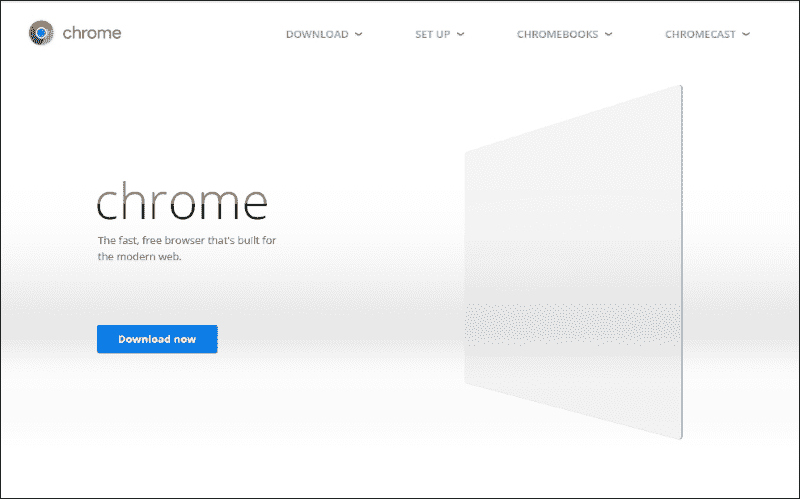
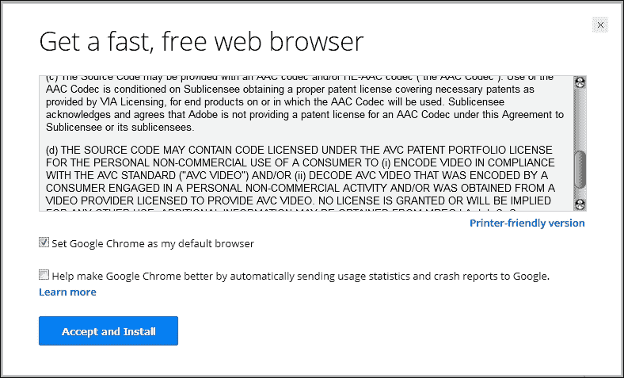
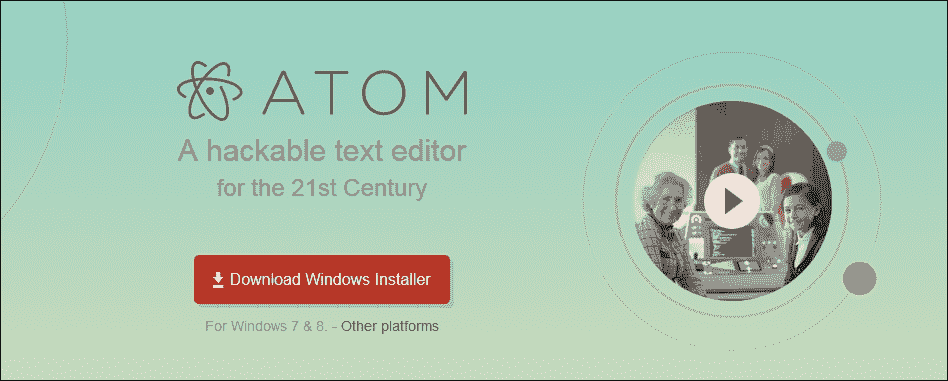
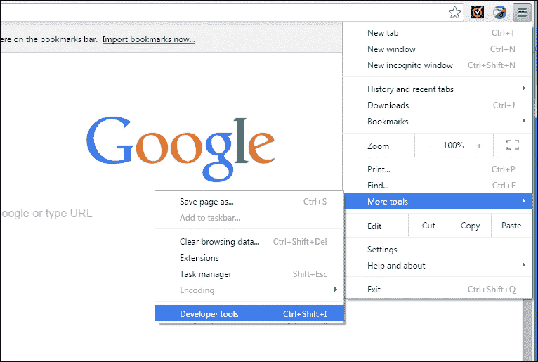
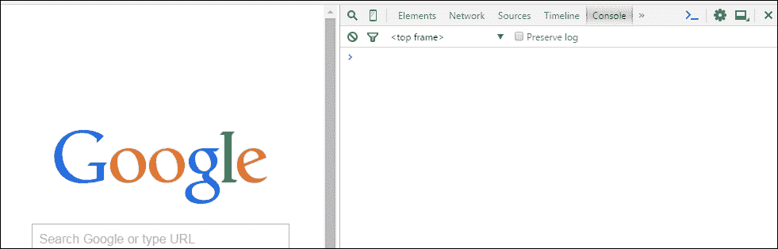
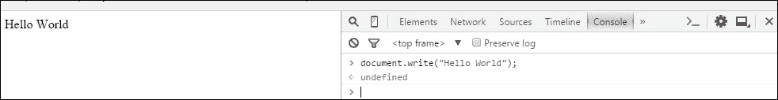
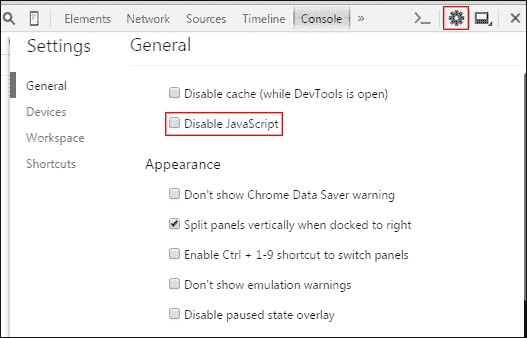
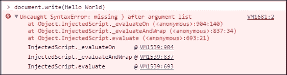

# 第一章。在控制台中探索 JavaScript

在我们开始讨论代码行、对象、变量等等之前，我们需要知道什么是 JavaScript。JavaScript 是一种用于向网页添加交互性和构建网络应用程序的编程语言。静态网站如今并不流行，因此我们使用 JavaScript 来使我们的网站交互式。

有些人也称它为脚本语言，因为它是一种易于使用的语言，并且不需要像其他语言那样的编译器。JavaScript 并非作为通用编程语言设计的，它是为了操作网页而设计的。你可以使用 JavaScript 编写桌面应用程序。JavaScript 还可以访问你的机器硬件。你可以尝试使用 **软件开发工具包**（**SDK**）如 PhoneGap（用于移动设备）或 Microsoft 应用 SDK（用于桌面）来制作桌面应用程序。JavaScript 代码在网页上被解释，然后由浏览器运行。任何现代网络浏览器，例如 Firefox、Safari、Google Chrome、UC 浏览器、Opera 等，都支持 JavaScript。

### 注意

*编译器* 是一种计算机程序，它处理代码并将它们转换为机器语言。使网站 *交互式* 的意思是为网站添加由用户控制的特性。例如，在线注册表单、在线计算器等等。*静态* 网站具有固定的对象和内容，并且向所有访问者显示相同的信息。

基本上，JavaScript 包含在 HTML 页面中或写入一个具有 `.js` 扩展名的单独文件中。如果你对 HTML 一无所知，不要担心，你将在 第三章 *介绍 HTML 和 CSS* 中学习它。那么，你可以在哪里使用 JavaScript？

答案很简单，你可以做以下操作：

+   你可以创建一个活跃的用户界面。

+   你可以控制网络浏览器。

+   你可以验证用户输入（如果他们输入错误）。

+   你可以创建自定义网页，这些网页可以在浏览器中弹出，显示信息或图片。

+   你可以不使用 **通用网关接口**（**CGI**）创建动态页面。CGI 由网络服务器用于处理浏览器的信息。

### 注意

你应该记住的是 JavaScript 不是由 Sun Microsystems 开发的编程语言 Java。

在整本书中，我们将使用 **Google Chrome** 作为默认浏览器，**Atom** 作为文本编辑器。

如果你还没有在计算机上安装这两种软件，则有必要下载并安装它们。

我们将使用 Atom 文本编辑器，因为它是一个跨平台编辑器，具有内置的包管理器，可以进行智能自动完成，并且具有许多其他优点。

# 安装 Google Chrome

要安装 Google Chrome，请访问 [`www.google.com/chrome`](http://www.google.com/chrome)，然后点击 **立即下载**，如图所示：



然后按以下截图所示的**接受和安装**按钮：



安装将根据您的网络速度和机器的硬件配置而完成。

### 注意

如果您不想使用 Google Chrome 作为默认浏览器，请取消选中**将 Google Chrome 设置为我的默认浏览器**。

# 安装 Atom

要安装 Atom 文本编辑器，请点击[`atom.io/`](https://atom.io/)链接，并按以下截图所示，点击**下载 Windows 安装程序**：



将开始下载名为`AtomSetup.exe`的文件。

点击`AtomSetup.exe`文件开始安装 Atom。

### 提示

在安装时确保您赋予它管理员权限以获得更好的性能。

安装完成后，Atom 将自动启动。

如果您使用的是其他平台，请使用**其他平台**链接：

+   如果您是 Mac 用户，请转到[`github.com/atom/atom/releases/latest`](https://github.com/atom/atom/releases/latest)链接并下载`atom-X.X.X-full.nupkg`文件，其中`X.X.X`是 Atom 的版本号。通过双击文件进行安装。

+   如果您是 Ubuntu 用户，您可以点击[`github.com/atom/atom/releases/latest`](https://github.com/atom/atom/releases/latest)链接并下载`atom-amd64.deb`文件。下载后，在同一文件夹中启动您的**终端**，该文件夹是您下载文件后放置文件的位置。然后，输入以下代码：

    ```js
    sudo dpkg --install atom-amd64.deb

    ```

    您可能需要管理员密码才能安装它。安装完成后，您可以通过在终端中输入`Atom`并按*Enter*键来运行 Atom。

# Chrome 开发者工具

让我们看看用于 JavaScript 的**Chrome 开发者工具**，特别是*控制台*。由于 Google Chrome 已下载并安装到您的机器上，请打开 Google Chrome 浏览器，转到菜单（右上角），将鼠标悬停在**更多工具**上，然后选择**开发者工具**，如下所示：



您将看到以下工具：

+   **元素**

+   **网络**

+   **源**

+   **时间线**

+   **配置文件**

+   **资源**

+   **审计**

+   **控制台**

# 我们的第一个程序

现在，让我们检查 JavaScript 是否在您的机器上运行。

从工具中选择**控制台**。如果您找不到**控制台**，请点击**>>**符号，如下所示：



一旦您的控制台打开，请输入以下代码并按键盘上的*Enter*键：

```js
document.write("Hello World");

```

如果您在以下所示左侧面板上看到输出，则表示您已成功在浏览器上配置了 JavaScript：



您将看到的输出如下：

**Hello World**

恭喜！

### 注意

**下载示例代码**

你可以从你购买 Packt 书籍的账户下载所有示例代码文件。[`www.packtpub.com`](http://www.packtpub.com)。如果你在其他地方购买了这本书，你可以访问 [`www.packtpub.com/support`](http://www.packtpub.com/support) 并注册，以便直接将文件通过电子邮件发送给你。

如果你看不到文本，请检查你的代码或使用管理员权限安装 Google Chrome。

你也可以点击控制台的齿轮按钮。检查是否**未取消选中**“禁用 JavaScript”：



你也可以使用这个工具调试你的 JavaScript 代码。

如果你输入了错误的内容；考虑一下你是否忘记了 `Hello World` 字符串的引号，你将得到以下错误：



为了加快编写代码的速度，你可以学习控制台和 Atom 文本编辑器的快捷键。

这里有一些控制台的快捷键：

+   *Ctrl* + *L*: 清除控制台

+   *Tab*: 自动完成常见前缀

+   右箭头：接受建议

+   *Ctrl* + *U*: 清除控制台提示

+   上/下: 下一行/上一行

+   *Enter*: 执行命令

这里有一些 Atom 文本编辑器的快捷键：

+   *Ctrl* + *B*: 浏览打开的文件列表

+   *Ctrl* +*Alt* + *R*: 重新加载 Atom

+   *Ctrl* +*Shift* + *L*: 更改语法高亮

+   *Alt* +*Shift* + *S*: 显示可用的代码片段

+   *Ctrl* +*Shift* + *M*: 预览 Markdown

+   *Ctrl* +*Alt* + *I*: 切换开发者工具

+   *Ctrl* + *N*: 新建文件

+   *Ctrl* +*Shift* + *N*: 新建窗口

+   *Ctrl* + *P*: 打开文件（输入名称以执行搜索）

+   *Ctrl* + *O*: 打开文件

+   *Ctrl* +*Shift* + *O*: 打开文件夹

+   *Ctrl* + *S*: 保存

+   *Ctrl* +*Shift* + *S*: 另存为

+   *Ctrl* + *W*: 关闭标签页

+   *Ctrl* +*Shift* + *W*: 关闭窗口

+   *Ctrl* + *G*: 跳转到行

+   *Ctrl* + *L*: 选择行

+   *Ctrl* +*Shift* + *D*: 复制行

+   *Ctrl* +*Shift* + *K*: 删除行

+   *Ctrl* + Up/Down: 上移/下移行

+   *Ctrl* + */*: 切换注释行

+   *Ctrl* + *Enter*: 在下方新建行

+   *Ctrl* + *[*/*]*: 缩进/取消缩进所选行

+   *Ctrl* + *J*: 合并行

+   *Ctrl* + *Alt* + *.*: 完成括号

+   *Ctrl* + *M*: 跳转到匹配的括号

+   *Ctrl* + *Alt* + *M*: 选择匹配括号内的代码

+   *Ctrl* + *Alt* + */*: 折叠/展开代码

+   *Ctrl* + *Alt* + *F*: 折叠所选代码

+   *Ctrl* + *Alt* + *[*/*]*: 折叠/展开所有代码

+   *Ctrl* + *F*: 在当前文件中查找

+   *Ctrl* + *Shift* + *F*: 在项目中查找

+   *F3*: 查找下一个

+   *Shift* + *F3*: 查找上一个

+   *Ctrl* + *Enter*: 替换所有

+   *Ctrl* + *Alt* + */*: 在搜索中使用正则表达式

+   *Ctrl* + *Shift* + *=*/*-*: 增加或减少文本大小

+   *Ctrl* + *0* (零): 重置文本大小

+   *F11*: 切换全屏

# 为什么我们使用 Chrome 开发者工具？

以下介绍了使用 Chrome 开发者工具的要点：

+   容易看到错误

+   使用行号轻松编辑/调试代码

+   实时输出（无需刷新页面）

# 为什么我们使用 Atom 作为文本编辑器？

以下介绍了使用 Atom 作为文本编辑器的要点：

+   零妥协的 hackability 和 usability 组合

+   一个开源文本编辑器

+   每个 Atom 窗口本质上是一个本地渲染的网页

# 练习

为了增强你对 JavaScript 的了解，编写一个程序来打印你的名字。

# 摘要

在本章中，我们看到了如何下载 Google Chrome 和 Atom，以及如何安装它们。

你学习了如何使用 Chrome 开发者工具（**控制台**）编写你的第一个代码。你还学习了 Chrome 开发者工具和 Atom 文本编辑器的一些快捷键。

你还学习了什么是 JavaScript，为什么学习 JavaScript 很重要，以及 JavaScript 与其他语言的不同之处。

我们现在可以进入 JavaScript 的世界了。

你的旅程从第二章 *使用 JavaScript 解决问题* 开始。
