# 第三章。介绍 HTML 和 CSS

在上一章中，你已经学习了 JavaScript 语法、算术运算符和注释。我们使用控制台来完成这些目的。现在，你想要学习一些有趣的东西，这将为你成为优秀的 JavaScript 程序员铺平道路？在这一章中，我们将研究**超文本标记语言**（**HTML**）语法、**层叠样式表**（**CSS**）语法，以及如何在 HTML 页面中使用 JavaScript。

HTML 是网页的源代码。你加载到网络浏览器上的所有网页都是用 HTML 构建的。访问任何网站（例如，[`www.google.com`](https://www.google.com)），然后在键盘上按*Ctrl* + *U*（在 Mac 上，点击*command* + *U*），你将获得网页的源代码。这在所有现代网络浏览器上都可以工作，例如 Firefox、Google Chrome、UC 等等。

你将看到的全部代码都是 HTML。你也可能找到几行 JavaScript。因此，为了了解网页的结构（页面背后的代码），你需要了解 HTML。这是网络上最容易的语言之一。

# HTML

HTML 是一种标记语言。这意味着什么？嗯，标记语言使用特定的代码来处理和呈现文本，用于格式化、样式和布局设计。有许多标记语言（例如，**商业叙事标记语言**（**BNML**），**ColdFusion 标记语言**（**CFML**），**Opera 二进制标记语言**（**OBML**），**系统生物学标记语言**（**SBML**），**虚拟人类标记语言**（**VHML**）等等）；然而，在现代网络中，我们使用 HTML。HTML 基于**标准通用标记语言**（**SGML**）。SGML 基本上用于设计文档。

### 注意

有许多 HTML 版本。HTML 5 是最新版本。在这本书中，我们将使用 HTML 的最新版本。

在你开始学习 HTML 之前，让我请你想想你最喜欢的网站。网站包含什么？几个网页？你可能看到一些文本、几张图片、一个或两个文本字段、按钮，以及每个网页上的更多元素。这些元素中的每一个都是由 HTML 格式化的。

让我向你介绍一个网页。在你的网络浏览器中，访问[`www.google.com`](https://www.google.com)。你将看到一个如下所示的页面：

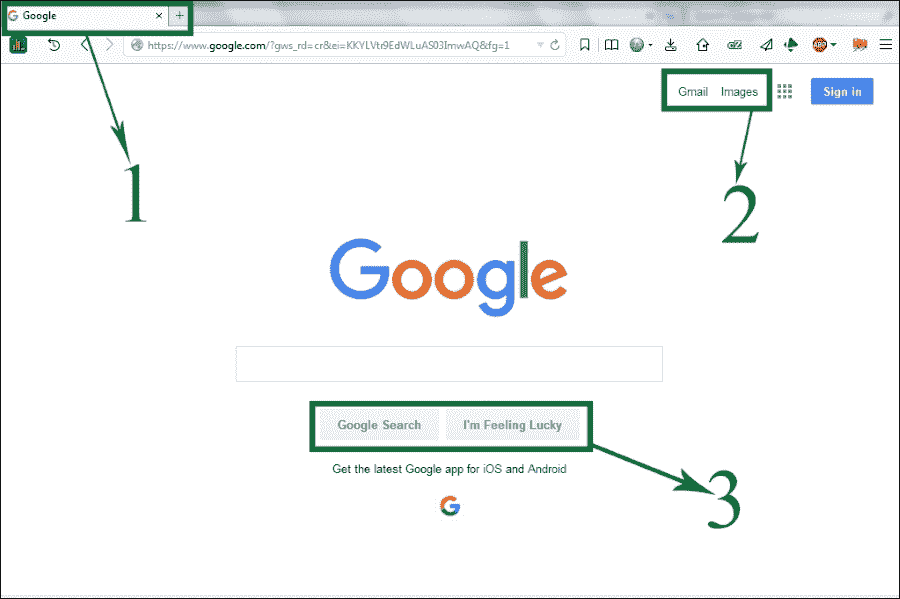

你在浏览器顶部看到的第一件事是网页的标题。让我们观察我们刚刚加载的页面：

+   这里，标记的框，**1**，是我们加载的网页的标题。

+   第二个框，**2**，表示一些链接或文本。

+   页面中间的单词**Google**是一张图片。

+   第三个框，**3**，由两个按钮组成。

+   你能告诉我页面右上角的**登录**是什么吗？是的，它是一个按钮。

让我们演示 HTML 的基本结构。术语*标签*将频繁用于演示结构。

HTML 标签不过是在小于号 (`<`) 和大于号 (`>`) 之间的一些预定义单词。因此，标签的结构是 `<WORD>`，其中 `WORD` 是网络浏览器能识别的预定义文本。这种类型的标签被称为开放标签。还有一种类型的标签，称为闭合标签。闭合标签的结构类似于 `</WORD>`。你只需在小于号后加上一个正斜杠即可。

在本节之后，你将能够使用 HTML 创建自己的网页，其中包含一些文本。HTML 页面的结构类似于以下图像。这个图像有八个标签。让我们介绍所有这些标签及其活动，如下所示：

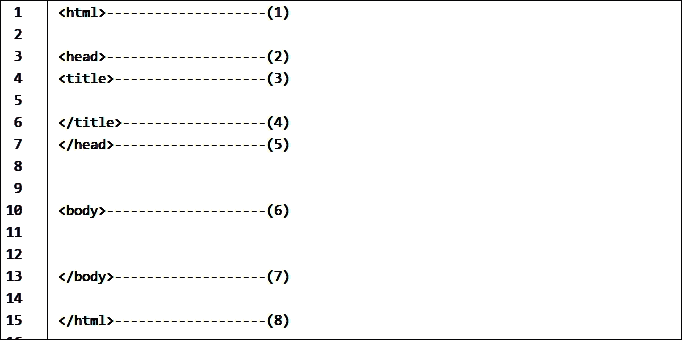

+   **1**：`<html>` 标签是一个开放标签，并在第 **15** 行通过 `</html>` 标签关闭。

    +   这些标签告诉你的网络浏览器，这两个标签之间的所有文本和脚本都是 HTML 文档。

+   **2**：这是 `<head>` 标签，是一个开放标签，并在第 **7** 行通过 `</head>` 标签关闭。

    +   这些标签包含网页的标题、脚本、样式和元数据。

+   **3**：这是 `<title>` 标签，并在第 **4** 行通过 `</title>` 标签关闭。

    +   这个标签包含网页的标题。之前的图像标题是 **Google**。要在网络浏览器上看到这个标题，你需要输入以下内容：

        ```js
        <title> Google </title>
        ```

+   **4**：这是 `<title>` 标签的闭合标签。

+   **5**：这是 `<head>` 标签的闭合标签。

+   **6**：这是 `<body>` 标签，并在第 **13** 行通过 `</body>` 标签关闭。

    你在网页上看到的一切都是在这两个标签之间编写的。每个元素、图片、链接等等都是在这里格式化的。要在浏览器上看到“这是一个网页。”，你需要输入以下内容：

    ```js
    <body>
    This is a web page.
    </body>
    ```

+   **7**：`</body>` 标签在这里关闭。

+   **8**：`</html>` 标签在这里关闭。

## 您的第一个网页

你刚刚学习了 HTML 页面的八个基本标签。你现在可以创建自己的网页了。怎么做到的？为什么不和我一起试试？

1.  打开你的文本编辑器（你已经在第 **1** 章探索控制台中的 JavaScript 中安装了 Atom）。

1.  按 *Ctrl* + *N*，这将打开一个新文件，如下图所示：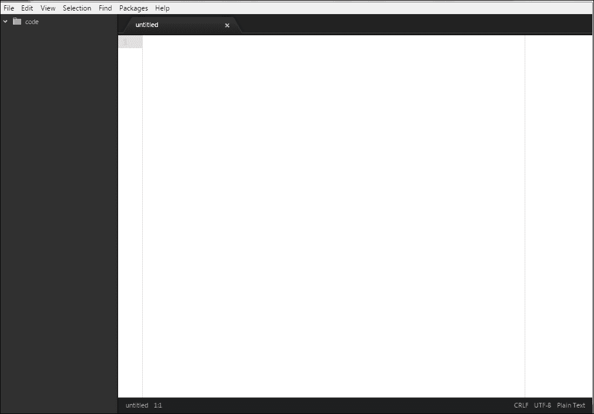

1.  在一个空白页面上输入以下 HTML 代码：

    ```js
    <html>
      <head>
        <title>
          My Webpage!
        </title>
      </head>
      <body>
        This is my webpage :)
      </body>
    </html>
    ```

1.  然后，按 *Ctrl* + *Shift* + *S*，这将提示你将代码保存在电脑上的某个位置：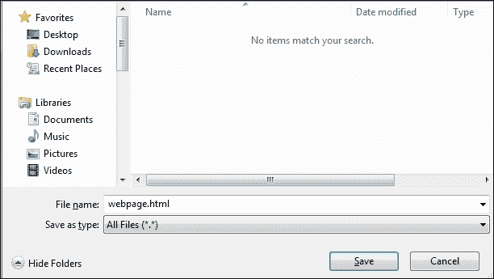

1.  在 **文件名** 字段中输入一个合适的名称。我想将我的 HTML 文件命名为 `webpage`，因此我输入了 `webpage.html`。你可能想知道为什么我添加了扩展名（`.html`）。

    ### 注意

    由于这是一个 HTML 文档，你需要在给网页命名的名称后添加 `.html` 或 `.htm`。`.htm` 扩展名是 `.html` 的旧形式。它被限制在三个字符内保持文件扩展名，因此人们使用 `.htm` 而不是 `.html`。你也可以使用 `.htm`。

1.  点击**保存**按钮。这将在你电脑上创建一个 HTML 文档。前往你刚刚保存 HTML 文件的目录。

    ### 注意

    记住，你可以给你的网页起任何名字。然而，这个名称在浏览器中是不可见的。它不是你网页的标题。一个好的做法是在网页名称中不要保留空白空间。例如，你想要将你的 HTML 文件命名为`This is my first webpage.html`。你的电脑将没有问题在互联网浏览器上显示结果；然而，当你的网站在服务器上时，这个名称可能会遇到问题。因此，我建议你在需要添加空格的地方使用下划线（`_`），例如`This_is_my_first_webpage.html`。

1.  你将找到一个与以下图像类似的文件：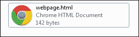

1.  现在，双击文件。你将在互联网浏览器上看到你的第一个网页！！你的第一个网页

你在`<title>`和`</title>`标签之间输入了`My Webpage!`，这就是为什么你的浏览器在第一个选择框中显示了它，**1**。你在`<body>`和`</body>`标签之间输入了`This is my webpage :)`。因此，你可以在第二个选择框中看到浏览器上的文本，**2**。

恭喜！你创建了你的第一个网页！

### 注意

你可以通过右键点击文件并选择**用 Atom 打开**来编辑`webpage.html`文件中的代码和其他文本。在用浏览器重新打开文件之前，你必须保存（*Ctrl* + *S*）你的代码和文本。

## 更多 HTML 标签

有许多 HTML 标签可以用来格式化网页中的文本和对象。我们现在来学习其中的一些如何？

| 说明 | 语法示例 | 浏览器上的结果 |
| --- | --- | --- |
| 粗体文本 | `<b> This is bold </b>` | **This is bold** |
| 斜体文本 | `<i> This is italic </i>` | *This is italic* |
| 下划线文本 | `<u> Underline Text </u>` | 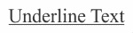 |
| 删除文本 | `<del> Delete me </del>` |  |
| 下标文本 | `CO<sub>2</sub>` | CO2 |
| 上标 | `3x10<sup>8</sup>` | 3x108 |
| 最大标题 | `<h1> Hi Kids! </h1>` | 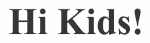 |
| 最小标题 | `<h6> Hi Kids </h6>` |  |
| 段落文本 | `<p>This is a paragraph </p>` | This is a paragraph |
| 换行标签 | `This <br>is <br>a break;` | This is a break; |

### 注意

有六个标题标签（`<h1>`到`<h6>`）。如果需要，你可以为文本添加多个标签。例如：`<b><i><u> JavaScript </b></i></u>`将产生以下输出：。关闭标签的顺序没有特定的要求。最佳实践是按照打开标签的顺序进行。

## HTML 文本着色

要着色 HTML 文本，我们可以输入以下内容：

```js
<font color = "Green"> I am green </font>
```

你可以在两个反引号（`"`）之间输入任何标准颜色名称。你也可以使用十六进制颜色代码，如下所示：

```js
<font color = "#32CD32"> I am green </font>
```

在这里，`32CD32` 是绿色的十六进制代码。看以下图片。左侧是代码，其中我们使用了颜色名称和十六进制代码。在右侧，我们得到了浏览器输出的结果：

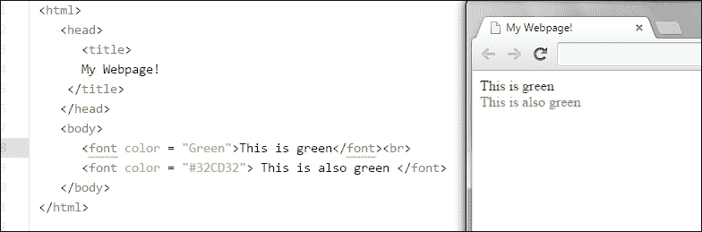

### 注意

十六进制颜色代码由六个数字组成（它是一个十六进制数）。它以井号或哈希符号（`#`）开头，我们在其后放置六个数字的十六进制数。十六进制数代表红色、蓝色和绿色的数量。每两个数字代表 `00` 到 `FF`（十六进制数）。在示例中，我们使用了 `#32CD32` 来表示绿色。`32`、`CD` 和 `32` 分别是红色、蓝色和绿色的数量；分别以十六进制表示。

如果你不知道什么是十六进制数，记住我们使用十进制数，其中使用 10 个数字（0, 1, 2, 3, 4, 5, 6, 7, 8, 和 9）。然而，在十六进制数中，我们使用 16 个数字（0, 1, 2, 3, 4, 5, 6, 7, 8, 9, A, B, C, D, E, 和 F）。

我建议你使用这个网站 ([`html-color-codes.info/`](http://html-color-codes.info/)) 来获取你喜欢的颜色的十六进制代码，而无需考虑十六进制代码。

## 链接 HTML 文本

要超链接文本，我们使用以下形式的锚点标签：

```js
<a href = "http://www.google.com"> Go to Google </a>
```

这段代码的输出将是一个链接。如果你点击这个链接，它将带你到我们用引号括起来的 URL（这里，[`www.google.com`](http://www.google.com)）。

如果你想在浏览器的新标签页中打开链接，你需要添加如下所示的 `target`：

```js
<a href = "http://google.com" target = "_blank" > Go to Google </a>
```

在这里，`target = "_blank"` 是一个属性，告诉浏览器在新标签页中打开链接。还有一些其他属性。你可以在家里尝试它们，并告诉我们你在浏览器上看到的内容。

其他属性包括 `_parent`、`_self` 和 `_top`。以下图片中的代码包含 `_blank` 属性。它将在新标签页中打开 [`google.com`](http://google.com)。我建议你找出其他属性的作用：

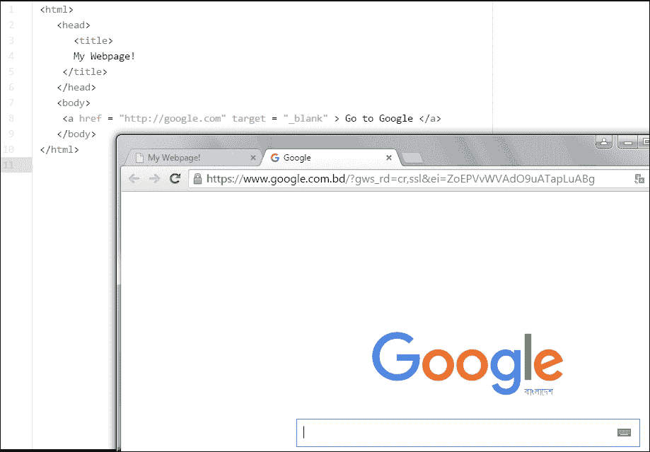

## 插入图片

在 HTML 文档中插入图片非常简单。你只需要找到图片文件的扩展名。我们用来插入图片的标签如下所示：

```js

```

`src` 属性是图片的来源。如果你的图片放置在 HTML 文件的同一目录下，你不需要写出整个文件源。在这本书中，我们将保持我们的图片文件与我们的 HTML 文件在同一目录下。

假设我有一个与保存 HTML 文档相同的文件夹中的图片。图片的名称是 `physics`，其扩展名为 `.png`。现在，为了在 HTML 文档中添加这个图片，我需要添加以下代码：

```js

```

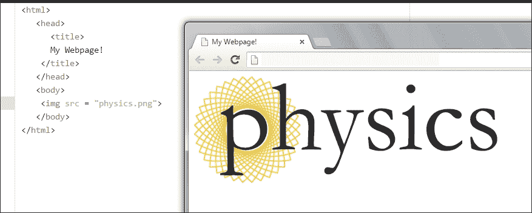

### 注意

在 HTML 文档中，我们使用三种类型的图片。**可移植网络图形**（**PNG**），**图形交换格式**（**GIF**）和**联合照片专家组**（**JPG** 或 **JPEG**）。要找到你图片的扩展名，右键点击你的图片，转到**属性**，然后点击**详细信息**标签，向下滚动直到找到**名称**字段。你将找到带有扩展名的图片名称。根据你的操作系统，此过程可能有所不同。

如果你想要设置图片的高度和宽度，你需要使用两个属性，如下所示：

```js
< img src = "physics.png" width="100" height="40">
```

在这里，`100` 和 `40` 是图片的像素。在 HTML 的早期版本中，它被定义为像素或百分比。

### 注意

像素是图像的最小单位。如果你想在不同屏幕尺寸上看到相同比例的图片，使用百分比（`%`）会更好，否则你可以使用像素（`px`）单位。

输出将类似于以下内容：

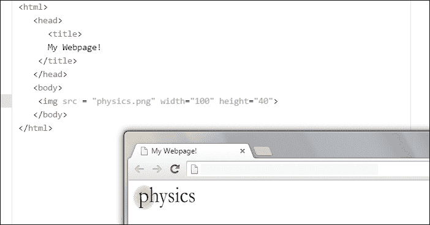

有更多的 HTML 标签；然而，我们已经涵盖了构建网页时使用的标签的大部分。你能想象以下代码的输出吗？

```js
<html>
  <head>
    <title>
      Example
    </title>
  </head>
  <body>
    <h1> This is a headline </h1>
    <h2> This is a headline </h2>
    <h3> This is a headline </h3>
    <h4> This is a headline </h4>
    <h5> This is a headline </h5>
    <h6> This is a headline </h6>
    <b>This is a bold text</b>. But <i>This is an italic text</i>. We can <u> underline</u> our text. <a href = "http://www.google.com">Go to Google </a> <br>
    <font color = "#AA2FF">This is colorful text</font>
    <br>
    
  </body>
</html>
```

输出将类似于以下图片：

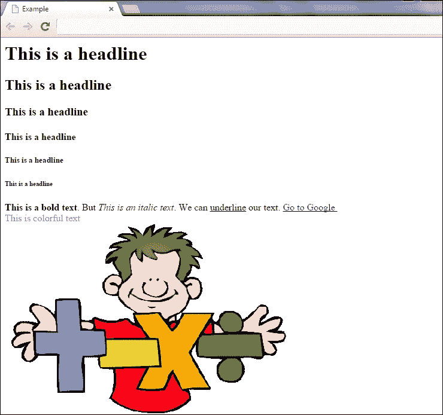

# CSS

如果你想让你的网页变得美观，你必须了解 CSS。CSS 是一种语言，它允许你描述你的网页，为文本着色，更改文本的字体，并修改网页布局。

CSS 语法有两部分：

+   选择器

+   装饰器

在学习 CSS 之前，你需要用 HTML 标签来介绍自己：

```js
<style>

</style>
```

这个标签应该位于 `<head></head>` 标签之间。因此，代码的结构将如下所示：

```js
<html>
  <head>
    <title>
    </title>
    <style>
      // your codes will be typed here
    </style>
  </head>
  <body>
  </body>
</html>
```

CSS 代码将写入 `<style></style>` 标签之间。

要格式化你的文本，你需要记住你使用的文本标签。假设你在 HTML 文档的主体中有一个 `<h1></h1>` 标签中的文本，如下所示：

```js
<h1> This is an example of HTML text. </h1>
```

要应用 CSS，你需要在 `<style> </style>` 标签之间输入以下内容：

```js
<html>
  <head>
    <title>
    </title>
    <style>
      h1 {
      color:green;
      text-decoration: underline;
      text-align: center;
      }
    </style>
  </head>
  <body>
    <h1>This is an example of HTML text </h1>
  </body>
</html>
```

代码的输出将如下所示：

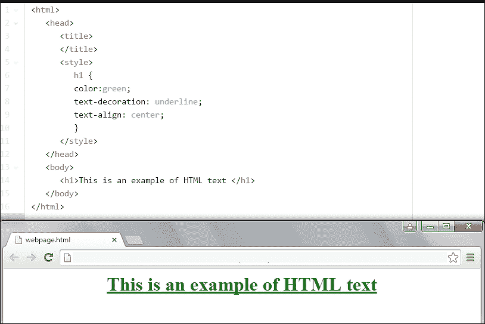

仔细查看代码。我们为 `<h1></h1>` 标签中的文本使用了以下 CSS：

```js
      h1 {
      color:green;
      text-decoration: underline;
      text-align: center;
      }
```

在这里，我们使用了一些 CSS 语法（`color`，`text-decoration` 等）。CSS 有许多语法，也称为属性（每个属性可能包含多个值）。

# HTML 页面上的 JavaScript

你已经学会了如何在控制台使用 JavaScript 打印内容。我们何不在 HTML 页面上做这件事呢？在这样做之前，让我们先介绍一个 HTML 标签，`<script></script>`。我们的 JavaScript 代码将位于这些标签之间。

由于存在许多脚本语言，我们需要在这些标签之间定义我们使用的是哪种语言。因此，我们输入以下内容：

```js
<script type = "text/javascript">
  // Our JavaScript Codes will be here. 
</script>
```

让我们来看一个例子。在上一章中，你学习了如何使用 JavaScript 在控制台中进行基本操作。现在，我们将在一个 HTML 页面的`<script></script>`标签之间执行一些操作。仔细看看以下代码：

```js
<html>
  <head>
    <title>
      JavaScript Example
    </title>
  </head>
  <body>
    <script type="text/javascript">
      var x = 34;
      var y = 93;
      var sum = x+y;
      document.write("The sum of "+x+" and "+y+" is "+sum);
    </script>
  </body>
</html>
```

代码的输出将如下所示：

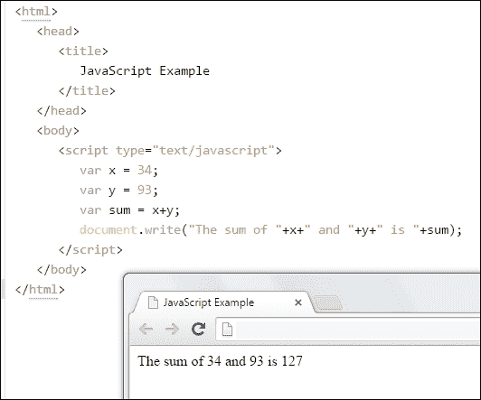

我希望你能自己猜出代码的输出。

# 概述

在本章中，你学习了 HTML、CSS 及其语法和用法。我们还介绍了如何在 HTML 文档中实现 JavaScript。现在，你能够使用 JavaScript 构建自己的网页，并使其变得精彩。我建议你不要跳过本章的任何部分，以便更好地理解下一章，第四章, *深入一点*。
