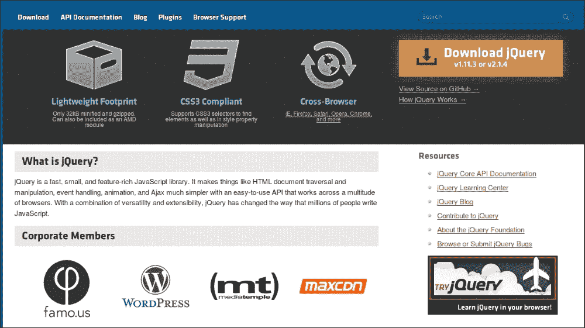
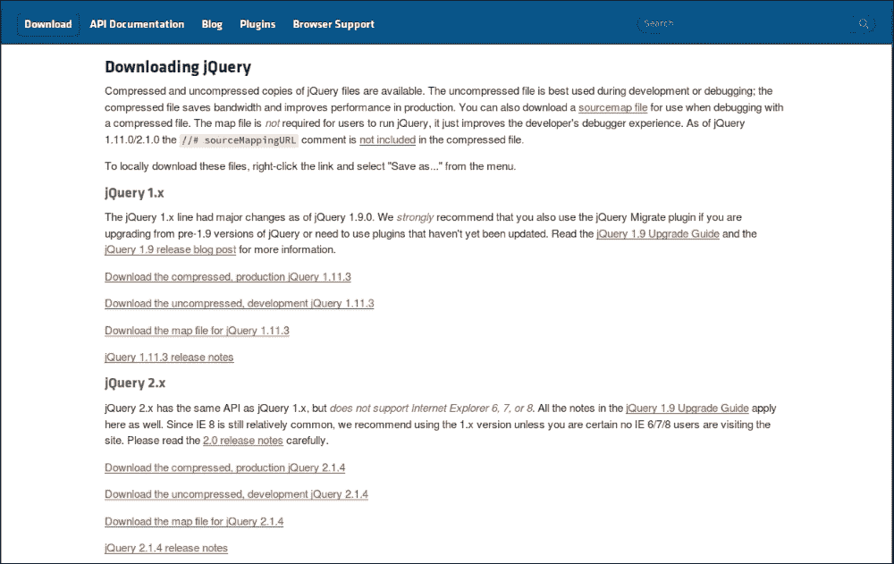
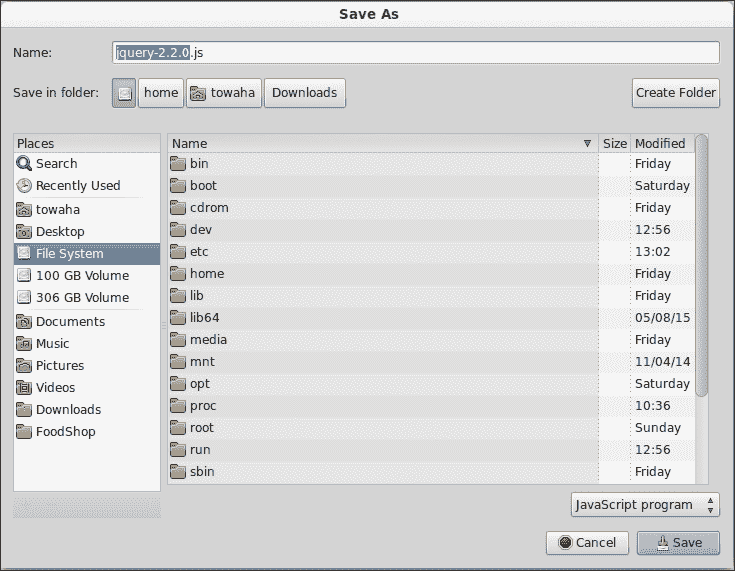
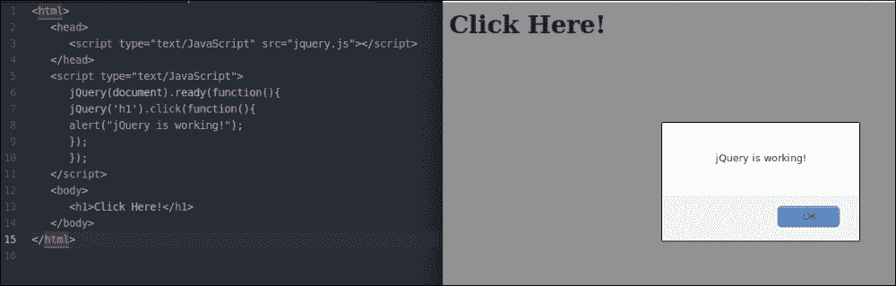
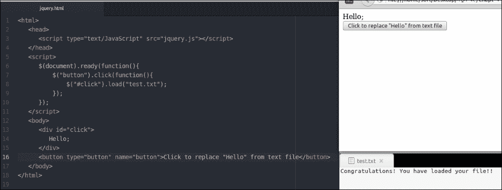
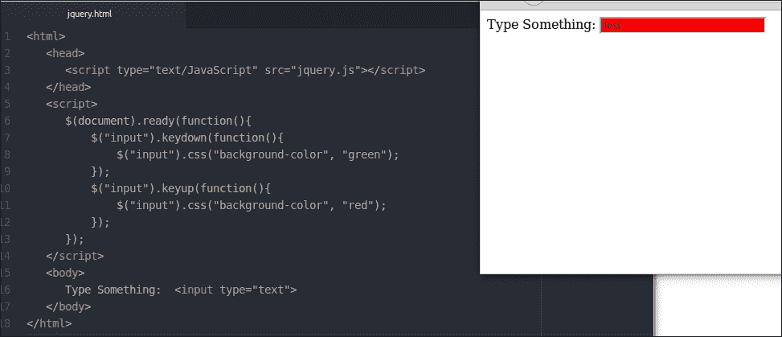
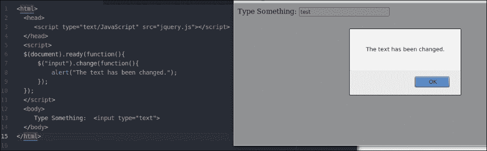
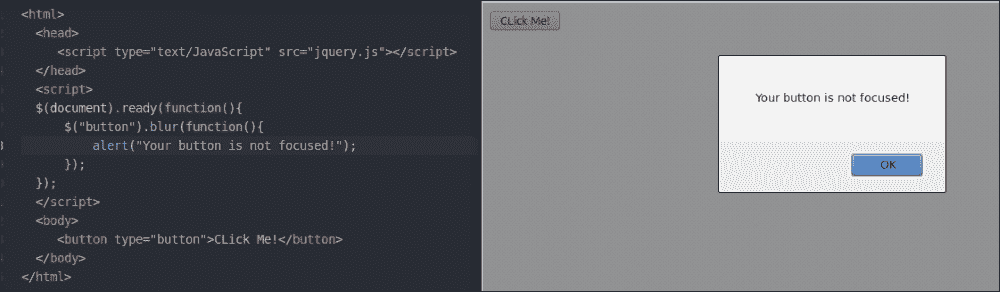
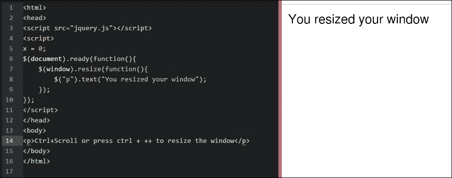
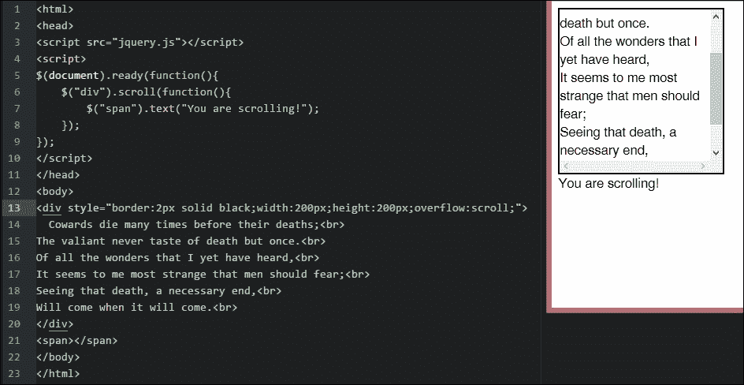

# 第六章。探索 jQuery 的优势

如果你已经阅读了上一章，你可能已经在你的**战舰**游戏中实现了**jQuery**。在本章中，我们将详细讨论 jQuery。

jQuery 库是一个 JavaScript 框架。它于 2006 年发布。人们曾经称它为**jSelect**。我们在网站上使用 jQuery，以便我们可以轻松地使用 JavaScript 并给我们的网页添加效果。你可能认为 jQuery 与 JavaScript 不同。不！jQuery 只是另一个 JavaScript 文件。它是一个非常轻量级的库，可以帮助你用更少的代码更轻松地装饰你的网页。

我们使用 jQuery 的原因如下：

+   它是开源的；如果需要，你可以编辑或修改其代码

+   它是一个小库（大约 150 KB 的文件）

+   jQuery 的社区支持非常强大；你可以很容易地从用户那里得到帮助

+   它用户友好且受欢迎

+   它支持跨浏览器

+   它是公开开发的；你可以通过编辑代码来修复任何错误或添加功能

+   它通过使用 AJAX 帮助开发者构建响应式网站

+   它内置了动画功能，可以帮助开发者轻松地在他们的网站上创建动画

# 安装 jQuery

问题是哪里可以找到 jQuery。嗯，你可以在[`jquery.com/`](http://jquery.com/)找到它。我还在这本书中附上了文件。你可以从那里下载。

如果你访问[`jquery.com/`](http://jquery.com/)，你会看到以下屏幕：



点击**下载 jQuery**按钮。你将被重定向到以下页面：



jQuery 有两个版本：`1.x.x`和`2.x.x`。这两个版本之间只有很少的差异。压缩版本的代码不可读，因为版本中没有空白和注释；然而，未压缩版本代码清晰且格式化，它还包含重要的注释，有助于理解代码和函数的工作。如果你想了解 jQuery 中某个函数的工作原理，我建议你查看 jQuery 的未压缩版本。

在本章中，我们将使用`2.x.x`版本。`2.x.x`的最新版本是`2.2.0`。

### 注意

你可以下载压缩版或未压缩版的 jQuery。

我建议你使用压缩版本，因为它更轻量。

我们将使用未压缩版本，这样你可以学习`jquery.js`，并清楚地了解它是如何工作的。点击**下载未压缩的开发版 jQuery** `2.2.0`后，你将在浏览器中看到 jQuery 库。按键盘上的*Ctrl* + *S*保存文件，如下面的截图所示：



下载 jQuery 后，将其放置在您的计算机上。为了简单起见，将其重命名为`jquery`。

在同一文件夹中创建一个新的 HTML 文件，并在 HTML 文档的`<head></head>`标签中包含`jquery.js`，通过输入以下代码：

```js
<script src="img/jquery.js"></script>
```

要检查你导入的 `jquery.js` 是否工作，输入以下代码。我稍后会解释代码：

```js
<html>
  <head>
    <script type="text/JavaScript" src="img/jquery.js"></script>
  </head>
  <script type="text/JavaScript">
    jQuery(document).ready(function()
    {
      jQuery('h1').click(function()
      {
        alert("jQuery is working!");
      } //click function ends here.
      );
    } // ready function ends here.
    );
  </script>
  <body>
    <h1>Click Here!</h1>
  </body>
</html>
```

打开 HTML 文件后，点击 **Click Here!** 你将看到以下屏幕：



这意味着你的 jQuery 正在正常工作。

让我们讨论一下我们编写的代码。

### 注意

你也可以不下载就安装 jQuery。这种安装方式被称为 **内容分发网络** (**CDN**) 安装。

你需要将以下行添加到你的 HTML 文档中，如果你在线连接，你的浏览器将自动加载 jQuery。

```js
<script type = "text/javascript" src = "http://ajax.googleapis.com/ajax/libs/jquery/2.1.3/jquery.min.js"></script>
```

# 解释代码

现在，让我们讨论一下我们之前使用的代码。我们在代码中使用了以下函数：

```js
jQuery(document).ready(function(){
//our codes. 
});
```

这是一个允许你设置 jQuery 以便使用的 jQuery 函数。你可以像下面这样用美元符号 (`$`) 替换 `jQuery`：

```js
$(document).ready(function(){
//our codes.
});
```

你需要考虑你想要应用 jQuery 的地方。我们在 body 标签中写了 `<h1>Click Here!</h1>`。我们希望当点击 `Click Here!` 时，它能够执行某些操作，这就是为什么我们添加了一个类似于以下格式的 `click` 函数：

```js
  jQuery('h1').click(function(){
    //our codes.
  });
```

如前所述，`jQuery` 可以用 `$` 替换。

我们添加了一个 `alert` 函数，这样当我们点击文本时，会出现一个警告框。

# 深入探讨

让我们详细讨论一下我们经常使用的 jQuery 函数和方法。

所有方法都应该写在 `ready()` 函数中。一些常用的方法如下：

+   Load

+   Keyup

+   Keydown

+   改变

+   Focus

+   模糊

+   调整大小

+   滚动

## load() 方法

使用这个方法，你可以在浏览器中加载一个文件。假设你想要从浏览器中的 `.txt` 文件中获取一些文本。你可以编写以下代码：

```js
<html>
  <head>
    <script type="text/JavaScript" src="img/jquery.js"></script>
  </head>
  <script>
    $(document).ready(function(){
      $("button").click(function(){
        $("#click").load("test.txt");
      });
    });
  </script>
  <body>
    <div id="click">
      Hello;
    </div>
    <button type="button" name="button">Click to replace "Hello" from text file</button>
  </body>
</html>
```

点击按钮后，`click` div 中的文本将更改为 **恭喜！你已经加载了你的文件!!**，如下所示：



## keyup() 和 keydown() 方法

使用这个方法，你可以控制键盘按钮的按键。当按键被按下或未按下时，你可以让浏览器执行某些操作。假设你有一个文本框，你想要从那里获取输入。当按键被按下时，你希望你的文本框变为红色；否则颜色应保持绿色。你可以通过实现/编写以下代码来实现：

```js
<html>
  <head>
    <script type="text/JavaScript" src="img/jquery.js"></script>
  </head>
  <script>
    $(document).ready(function(){
      $("input").keydown(function(){
        $("input").css("background-color", "green");
      });
      $("input").keyup(function(){
        $("input").css("background-color", "red");
      });
    });
  </script>
  <body>
    Type Something:  <input type="text">
  </body>
</html>
```



## change() 方法

要更改一些文本，你可以通过实现以下代码使用此方法：

```js
<html>
  <head>
    <script type="text/JavaScript" src="img/jquery.js"></script>
  </head>
  <script>
  $(document).ready(function(){
    $("input").change(function(){
      alert("The text has been changed.");
    });
  });
  </script>
  <body>
    Type Something:  <input type="text">
  </body>
</html>
```

你的输出将类似于以下图片：



## blur() 和 focus() 方法

要使文本或按钮模糊或聚焦，你可以实现以下代码：

```js
<html>
  <head>
    <script type="text/JavaScript" src="img/jquery.js"></script>
  </head>
  <script>
  $(document).ready(function(){
    $("button").blur(function(){
      alert("Your button is not focused!");
    });
  });
  </script>
  <body>
    <button type="button">CLick Me!</button>
  </body>
</html>
```

你也可以为 `focus()` 方法做同样的事情，如下所示：



## resize() 方法

如果你想看到浏览器调整大小的次数，你可以在你的 HTML 文档中做以下操作：



## scroll() 方法

你可以使用以下代码向鼠标滚动添加动作：

```js
<html>
  <head>
    <script src="img/jquery.js"></script>
    <script>
      $(document).ready(function(){
        $("div").scroll(function(){
          $("span").text("You are scrolling!");
        });
      });
    </script>
  </head>
  <body>
    <div style="border:2px solid black;width:200px; height:200px;overflow:scroll;">
      Cowards die many times before their deaths;<br>
      The valiant never taste of death but once.<br>
      Of all the wonders that I yet have heard,<br>
      It seems to me most strange that men should fear;<br>
      Seeing that death, a necessary end,<br>
      Will come when it will come.<br>
    </div>
    <span></span>
  </body>
</html>
```

当你用鼠标滚动时，你可以在 `scroll()` 函数中看到你创建的事件，如下所示：



# 概述

jQuery 库非常有趣，对于新学习者来说也很容易使用。你只需要练习 jQuery 的方法和函数。网上有很多 jQuery 插件。你还可以将它们下载并安装到你的网页上。使用 jQuery 及其插件，你可以轻松地美化并编写你的网站代码。对我来说，jQuery 最有趣的部分是动画。我将在下一章解释如何使用 jQuery 来实现动画。
