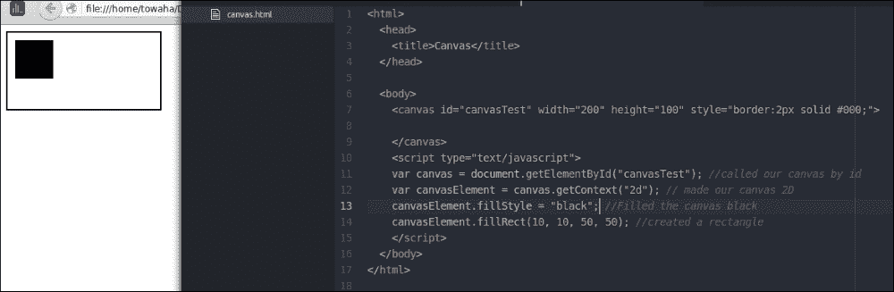
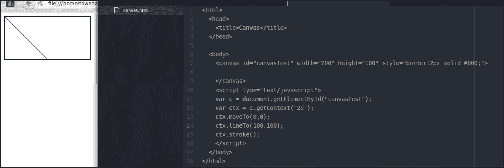
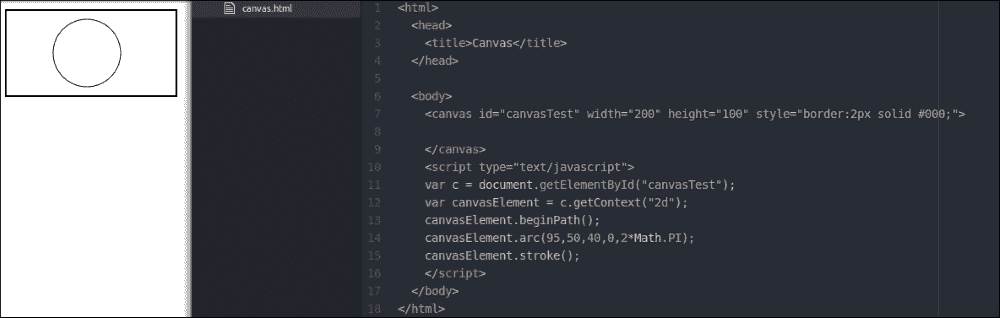
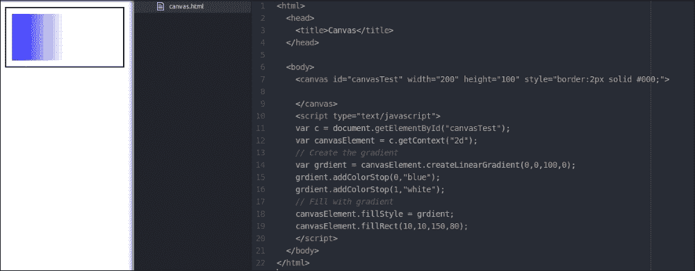
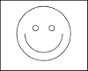
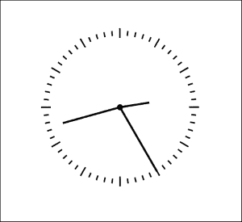

# 第七章. 介绍 Canvas

在本章中，我们将学习 HTML canvas。HTML canvas 可以帮助你在 HTML 页面上绘制图形，特别是图形（例如，圆形、正方形、矩形等）。`<canvas></canvas>` 标签通常由 JavaScript 控制。Canvas 可以绘制文本，这些文本也可以被动画化。让我们看看我们可以使用 HTML canvas 做什么。

# 实现画布

要在你的 HTML 页面上添加画布，你需要在 `<canvas></canvas>` 标签中定义画布的高度和宽度，如下所示：

```js
<html>
  <head>
    <title>Canvas</title>
  </head>
  <body>
  <canvas id="canvasTest" width="200" height="100" style="border:2px solid #000;">

    </canvas>
  </body>
</html>
```

我们定义了画布 ID 为 `canvasTest`，它将被用来与画布交互。我们在画布上使用了内联 CSS。2 像素的实线边框用于更好地查看画布。

# 添加 JavaScript

现在，我们将添加几行 JavaScript 代码到我们的画布中。我们需要在 `<canvas></canvas>` 标签之后立即添加我们的 JavaScript 代码到 `<script></script>` 标签中。

# 绘制矩形

为了测试我们的画布，让我们通过输入以下代码在画布上绘制一个矩形：

```js
<script type="text/javascript">
  var canvas = document.getElementById("canvasTest"); //called our canvas by id
  var canvasElement = canvas.getContext("2d"); // made our canvas 2D
  canvasElement.fillStyle = "black"; //Filled the canvas black
  canvasElement.fillRect(10, 10, 50, 50); //created a rectangle
</script>
```

在脚本中，我们声明了两个 JavaScript 变量。`canvas` 变量用于通过 canvas ID 保存画布的内容，我们在 `<canvas></canvas>` 标签中使用了这个 ID。`canvasElement` 变量用于保存画布的上下文。我们将 `black` 分配给 `fillstyle`，这样当我们填充矩形时，我们想要绘制的矩形就会变成黑色。我们使用了 `canvasElement.fillRect(x, y, w, h);` 来绘制矩形的形状。其中 `x` 是矩形与 *x* 轴的距离；`y` 是矩形与 *y* 轴的距离；而 `w` 和 `h` 分别是矩形的宽度和高度。

完整的代码如下所示：

```js
<html>
  <head>
    <title>Canvas</title>
  </head>
  <body>
    <canvas id="canvasTest" width="200" height="100" style="border:2px solid #000;">
    </canvas>
    <script type="text/javascript">
      var canvas = document.getElementById("canvasTest"); //called our canvas by id
      var canvasElement = canvas.getContext("2d"); // made our canvas 2D
      canvasElement.fillStyle = "black"; //Filled the canvas black
      canvasElement.fillRect(10, 10, 50, 50); //created a rectangle
    </script>
  </body>
</html>
```

代码的输出如下：



# 绘制线条

要在画布上绘制线条，你需要在你的 `<script></script>` 标签中插入以下代码：

```js
<script type="text/javascript">
  var c = document.getElementById("canvasTest");
  var canvasElement = c.getContext("2d");
  canvasElement.moveTo(0,0);
  canvasElement.lineTo(100,100);
  canvasElement.stroke();
</script>
```

这里，`canvasElement.moveTo(0,0);` 用于使我们的线条从画布的(0,0)坐标开始。`canvasElement.lineTo(100,100);` 语句用于使线条对角。`canvasElement.stroke();` 语句用于使线条可见。我建议你更改 `canvasElement.lineTo(100,100);` 和 `canvasElement.moveTo(0,0);` 中的数字，并查看由 canvas 绘制的线条的变化。

以下是代码的输出：



# 快速练习

1.  使用 canvas 和 JavaScript 绘制线条，该线条将与画布的 *y* 轴平行。

1.  绘制一个高度为 300 像素、宽度为 200 像素的矩形。在同一画布上绘制一条与矩形接触的线条。

# 绘制圆形

要在画布上绘制圆形，你需要在你的 `<script></script>` 标签中添加以下代码：

```js
<script type="text/javascript">
  var c = document.getElementById("canvasTest");
  var canvasElement = c.getContext("2d");
  canvasElement.beginPath();
  canvasElement.arc(95,50,40,0,2*Math.PI);
  canvasElement.stroke();
</script>
```

在这里，我们使用了 `canvasElement.beginPath();` 来开始绘制圆形，`canvasElement.arc(95,50,40,0,2*Math.PI);` 用于绘制圆形的形状，以及 `canvasElement.stroke();` 来使圆形可见。

### 注意

`canvasElement.arc(95,50,40,0,2*Math.PI);` 这条语句类似于 `canvasElement.arc(x, y, r, sA, eA, ac);`，

其中 `x` 是从 *x* 轴的起始坐标，`y` 是从 *y* 轴的起始坐标，`r` 是圆的半径，`sA` 是圆的起始角度，`eA` 是圆的结束角度，`ac` 是圆的方向。在这里，`ac` 表示逆时针。

我们代码的输出将是以下图像：



# 绘制线性渐变

让我们绘制一些新内容。我们将绘制一个矩形并使其颜色逐渐淡化。在 `<script></script>` 标签中输入以下代码：

```js
<script type="text/javascript">
  var c = document.getElementById("canvasTest");
  var canvasElement = c.getContext("2d");
  // Create the gradient
  var grdient = canvasElement.createLinearGradient(0,0,100,0);
  grdient.addColorStop(0,"blue"); // here we added blue as our primary color
  grdient.addColorStop(1,"white"); //here we used white as our secondary color. 
  // Fill with gradient
  canvasElement.fillStyle = grdient;
  canvasElement.fillRect(10,10,150,80);
</script>
```

我们添加了 `canvasElement.createLinearGradient(0,0,100,0);` 来创建渐变或淡化效果。我们添加了 `grdient.addColorStop(0,"blue");` 和 `grdient.addColorStop(1,"white");` 来着色矩形。

代码的输出如下所示：



# 快速练习

1.  使用 HTML canvas 绘制以下笑脸。(**提示**：您将需要绘制三个完整的圆和一个半圆。技巧在于您可以通过玩转 canvas 的圆代码来绘制这个图形。):

1.  绘制具有颜色渐变的圆。

# 让我们做一个时钟！

我们将绘制一个模拟时钟并使其像真实时钟一样工作。在 HTML 文档的 body 部分，输入以下代码：

```js
<canvas id="myclock" height="500" width="500"></canvas>
In your <script></script> tags, take the following variables:
Var canvas; // the clock canvas
var canvasElement; // canvas's elements

// clock settings
var cX = 0; 
var cY = 0;
var radius = 150;
```

这里，`cX` 和 `cY` 是我们时钟的中心坐标。我们取 150 px 作为时钟的半径。您可以增加或减少它。

然后，我们需要初始化变量。在定义前面的变量之后，创建一个 `init();` 函数。

函数应类似于以下内容：

```js
function init() {

  canvas = document.getElementById("myclock");
  //Called the element to work on. 
  canvasElement = canvas.getContext("2d");
  //Made the context 2d. 

  cX = canvas.width / 2;
  // we divided by two to get the middle point of X-axis
  cY = canvas.height / 2;
  // we divided by two to get the middle point of Y-axis
  initTime(); //called the initTime() function.
  drawClock(); //Called the drawClock() function to draw the graphics. 

  setInterval("animateClock()", 1000); // Made the animation for each second. Here 1000 is equal to 1 second. 

}
```

让我们初始化时钟的秒针、分针和时针：

```js
function initTime() {
  date = new Date();
  hours = date.getHours() % 12; // Divided by 12 to make our clock 12 hours. 
  minutes = date.getMinutes(); 
  seconds = date.getSeconds();

}
```

这里，`date.getHours()`、`date.getMinutes()` 和 `date.getSeconds()` 将返回您的计算机时间并将它们保存在我们的变量中。

创建另一个函数来使我们的时钟动画化：

```js
function animateClock() {
  //This function will help our 'second' hand to move after an interval. 
  clearCanvas(); // This will clear the canvas 
  refreshTime(); // This will refresh time after 1 second. 
  drawClock();   // This will draw the clock. 

}
```

我们现在将编写 `clearCanvas()`、`refreshTime()` 和 `drawClock()`：

```js
function clearCanvas() {
  canvasElement.clearRect(0, 0, canvas.width, canvas.height);
}
```

这里，`canvasElement.clearRect(0, 0, canvas.width, canvas.height);` 将在特定时间间隔后重置我们的画布。

我们的 `refreshTime()` 函数应如下所示：

```js
function refreshTime() {
  seconds += 1;
  if (Math.floor((seconds / 60)) != 0) { //we divide seconds by 60 until second is equal to zero. 
    minutes += 1; // If 60 second is passed we increment minute by 1\. 
    seconds %= 60; 
  }
  if (Math.floor((minutes / 60)) != 0) { 
    hours += 1; //We increment hour by 1 after 60 minutes. 
    minutes %= 60; 
  }
}
```

在 `refreshTime()` 函数中，我们增加了我们的 `seconds` 变量。因此，每当此函数被调用时，我们的变量将增加 `1`。然后，我们对 `hours` 和 `minutes` 执行了两个条件操作。

现在，让我们绘制时钟：

```js
function drawClock() {
  drawClockBackground(); //This draws clock background. 
  drawSecondsHand(); //This draws clock's second hand. 
  drawMinutesHand(); //This draws clock's minute hand. 
  drawHoursHand(); //This draws clock's hour hand.
}
```

我们将编写 `drawClockBackground()`、`drawSecondsHand()`、`drawMinutesHand()` 和 `drawHoursHand()` 函数：

```js
function drawClockBackground() {
  //this function will draw the background of our clock. We are declaring few variables for mathematical purposes. 
  var correction = 1/300;
  var shift_unit = 1/170;
  var shift_factor = 1/30;
  var angle_initial_position = 2;
  var angle_current_position_begin = 0;
  var angle_current_position_end = 0;
  var repeat = 60;
  var lineWidth = 10;

  for (var i=0; i < repeat; i+=1) {
  //These lines are written for making our clock error free with the angle of the hands (hands' positions)
  angle_current_position_begin = angle_initial_position - (i * shift_factor) - correction;
  angle_current_position_end = angle_current_position_begin + shift_unit;

  if (i % 5 === 0) 
  lineWidth = 20;
  else 
  lineWidth = 10;

  drawArcAtPosition(cX, cY, radius, angle_current_position_begin*Math.PI, angle_current_position_end*Math.PI, false, lineWidth);
  }
  drawLittleCircle(cX, cY);
}
```

在此函数中，我们进行了一些数学运算，并编写了 `drawLittleCircle(cX, cY)` 函数，用于在时钟中心绘制一个小圆。

函数应类似于以下内容：

```js
function drawLittleCircle(cX, cY) {
  drawArcAtPosition(cX, cY, 4, 0*Math.PI, 2*Math.PI, false, 4);
}
```

编写 `drawSecondsHand()` 函数。此函数将绘制秒针，如下所示：

```js
function drawSecondsHand() {
  /* Simple mathematics to find the co ordinate of the second hand; 
    You may know this: x = rcos(theta), y = rsin(theta). We used these here.
    We divided the values n=by 30 because after 5 seconds the second hand moves 30 degree. 
  */ 
  endX = cX + radius*Math.sin(seconds*Math.PI / 30);
  endY = cY - radius*Math.cos(seconds*Math.PI / 30);
  drawHand(cX, cY, endX, endY);
}
```

我们的 `drawMinutesHand()` 函数应该看起来像下面这样。这个函数将绘制我们时钟的分钟指针，如下所示：

```js
function drawMinutesHand() {
  var rotationUnit = minutes + seconds / 60;
  var rotationFactor = Math.PI / 30;
  var rotation = rotationUnit*rotationFactor;
  var handLength = 0.8*radius;
  endX = cX + handLength*Math.sin(rotation);
  endY = cY - handLength*Math.cos(rotation);
  drawHand(cX, cY, endX, endY);
}
```

现在，让我们看看我们的 `drawHoursHand();` 函数。这个函数将绘制小时指针：

```js
function drawHoursHand() {
  var rotationUnit = 5 * hours + minutes / 12;
  var rotationFactor = Math.PI / 30;
  var rotation = rotationUnit*rotationFactor;
  var handLength = 0.4*radius;

  endX = cX + handLength*Math.sin(rotation);
  endY = cY - handLength*Math.cos(rotation);
  drawHand(cX, cY, endX, endY);
}
```

我们在前面的函数中使用了 `drawHand();` 函数。让我们按照以下方式编写这个函数：

```js
function drawHand(beginX, beginY, endX, endY) {
  canvasElement.beginPath();
  canvasElement.moveTo(beginX, beginY);
  canvasElement.lineTo(endX, endY);
  canvasElement.stroke();
  canvasElement.closePath();
}
```

现在，我们将编写我们时钟的最后一个函数，如下面的代码片段所示：

```js
function drawArcAtPosition(cX, cY, radius, start_angle, end_angle, counterclockwise, lineWidth) {
  canvasElement.beginPath();
  canvasElement.arc(cX, cY, radius, start_angle, end_angle, counterclockwise);
  canvasElement.lineWidth = lineWidth;
  canvasElement.strokeStyle = "black";
  canvasElement.stroke();
  canvasElement.closePath();
}
```

我们时钟的完整代码应该看起来类似于以下代码：

```js
<html>
  <head>
    <script type="text/javascript">
      var canvas; 
      var canvasElement;

      // clock settings
      var cX = 0;

      var cY = 0;
      var radius = 150;

      // time settings
      var date;
      var hours;
      var minutes;
      var seconds;

      function init() {
        canvas = document.getElementById("myclock");
        canvasElement = canvas.getContext("2d");

        cX = canvas.width / 2;
        cY = canvas.height / 2;

        initTime();
        drawClock();
        setInterval("animateClock()", 1000);
      }

      // get your system time
      function initTime() {
        date = new Date();
        hours = date.getHours() % 12;
        minutes = date.getMinutes();
        seconds = date.getSeconds();
      }

      // animate the clock
      function animateClock() {
        clearCanvas();
        refreshTime();
        drawClock();
      }

      // clear the canvas
      function clearCanvas() {
        canvasElement.clearRect(0, 0, canvas.width, canvas.height);
      }

      // refresh time after 1 second
      function refreshTime() {
        seconds += 1;
        if (Math.floor((seconds / 60)) != 0) { minutes += 1; seconds %= 60; }
        if (Math.floor((minutes / 60)) != 0) { hours += 1; minutes %= 60; }
      }

      // draw or redraw Clock after time refresh function is called
      function drawClock() {
        drawClockBackground();
        drawSecondsHand();
        drawMinutesHand();
        drawHoursHand();
      }
      function drawHand(beginX, beginY, endX, endY) {
        canvasElement.beginPath();
        canvasElement.moveTo(beginX, beginY);
        canvasElement.lineTo(endX, endY);
        canvasElement.stroke();
        canvasElement.closePath();
      }

      // draw Hand for seconds
      function drawSecondsHand() {
        endX = cX + radius*Math.sin(seconds*Math.PI / 30);
        endY = cY - radius*Math.cos(seconds*Math.PI / 30);
        drawHand(cX, cY, endX, endY);
      }

      // draw Hand for minutes
      function drawMinutesHand() {
        var rotationUnit = minutes + seconds / 60;
        var rotationFactor = Math.PI / 30;
        var rotation = rotationUnit*rotationFactor;
        var handLength = 0.8*radius;

        endX = cX + handLength*Math.sin(rotation);
        endY = cY - handLength*Math.cos(rotation);
        drawHand(cX, cY, endX, endY);
      }

      // draw Hand for hours
      function drawHoursHand() {
        var rotationUnit = 5 * hours + minutes / 12;
        var rotationFactor = Math.PI / 30;
        var rotation = rotationUnit*rotationFactor;
        var handLength = 0.4*radius;

        endX = cX + handLength*Math.sin(rotation);
        endY = cY - handLength*Math.cos(rotation);
        drawHand(cX, cY, endX, endY);
      }

      function drawClockBackground() {
        var correction = 1/300;
        var shift_unit = 1/170;
        var shift_factor = 1/30;
        var angle_initial_position = 2;
        var angle_current_position_begin = 0;
        var angle_current_position_end = 0;
        var repeat = 60;
        var lineWidth = 10;

        for (var i=0; i < repeat; i+=1) {
          angle_current_position_begin = angle_initial_position - (i * shift_factor) - correction;
          angle_current_position_end = angle_current_position_begin + shift_unit;

          if (i % 5 == 0) lineWidth = 20;
          else lineWidth = 10;

          drawArcAtPosition(cX, cY, radius, angle_current_position_begin*Math.PI, angle_current_position_end*Math.PI, false, lineWidth);
        }
        drawLittleCircle(cX, cY);
      }

      function drawArcAtPosition(cX, cY, radius, start_angle, end_angle, counterclockwise, lineWidth) {
        canvasElement.beginPath();
        canvasElement.arc(cX, cY, radius, start_angle, end_angle, counterclockwise);
        canvasElement.lineWidth = lineWidth;
        canvasElement.strokeStyle = "black";
        canvasElement.stroke();
        canvasElement.closePath();
      }
      function drawLittleCircle(cX, cY) {
        drawArcAtPosition(cX, cY, 4, 0*Math.PI, 2*Math.PI, false, 4);
      }

    </script>
  </head>
  <body onload="init()">
    <canvas id="myclock" height="500" width="500"></canvas>
  </body>
</html>
```

如果你可以看到你的代码输出如下面的图像，那么恭喜你！你已经成功使用 canvas 创建了你的 HTML 时钟：



# 摘要

在本章中，我们学习了 HTML canvas 的基础知识。我希望你现在可以使用 HTML canvas 绘制任何东西。你可能玩过在线游戏；它们的大部分组件都是使用 HTML canvas 绘制的。因此，如果你想开发自己的网络应用程序或游戏，你需要了解 canvas。你可以使用 JavaScript 轻松编写代码来绘制和动画化形状。

在下一章中，我们将使用 HTML canvas 开发一个名为 **Rat-man** 的游戏。在开始 第八章，*构建 Rat-man！* 之前，我希望你已经通过本章学到了很多关于 HTML canvas 的知识。如果你已经学到了，那么我们现在就开始开发我们的游戏吧。
