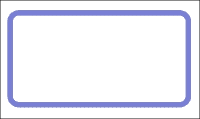
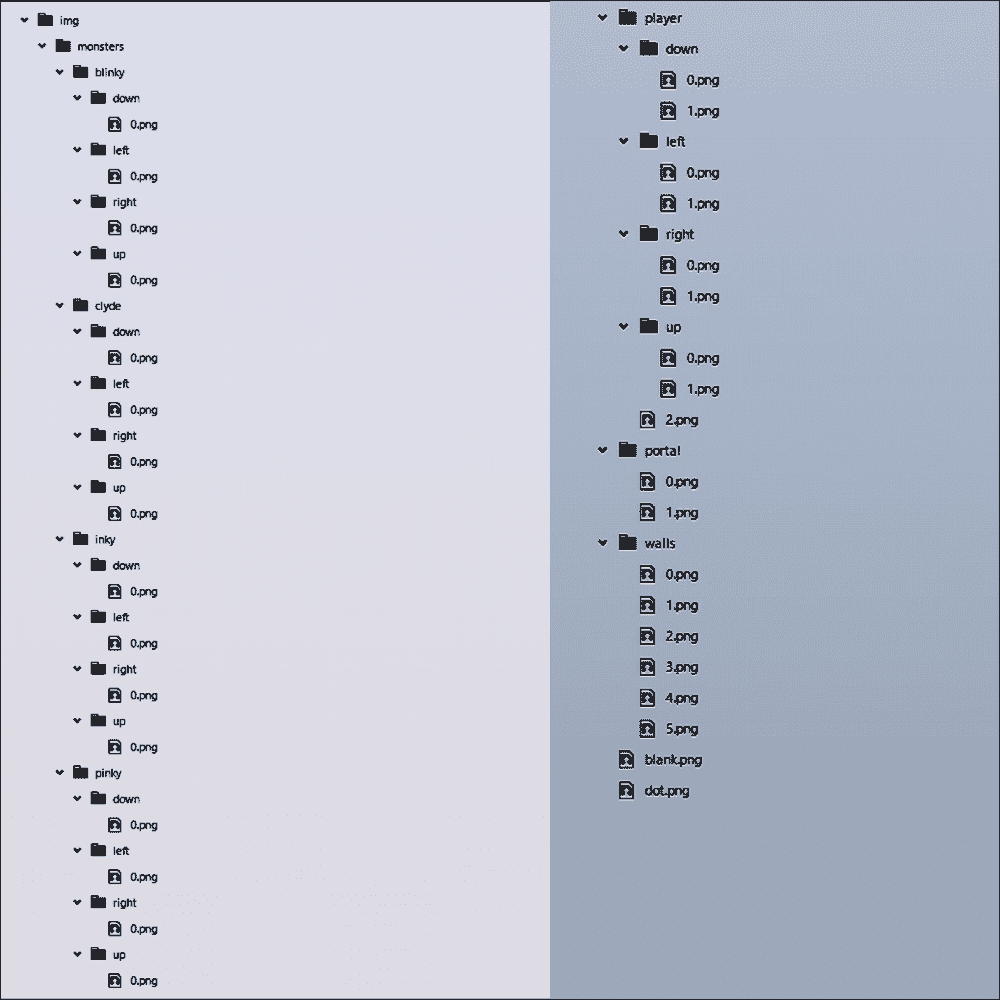
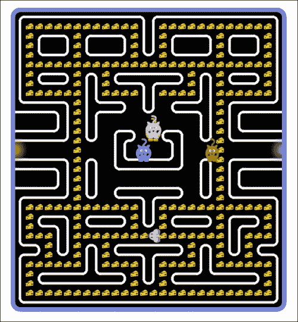
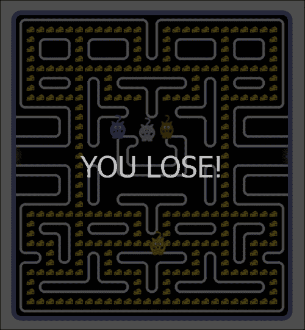
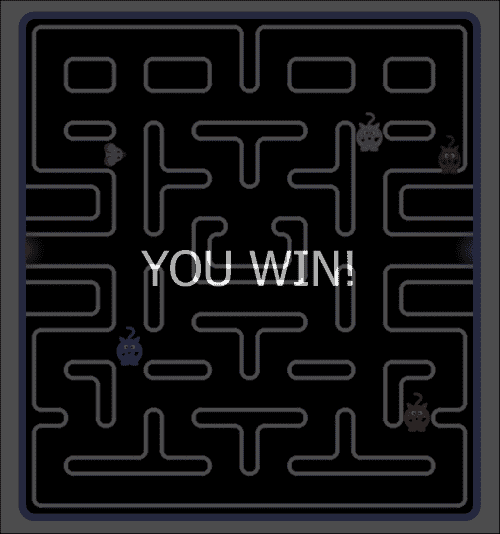

# 第八章。构建 Rat-man！

在本章中，我们将构建一个名为**Rat-man**的游戏，这实际上是一个著名游戏**Pac-Man**的修改版。我们将使用 canvas、JavaScript、CSS 和 HTML 来构建我们的游戏。

让我们先介绍我们游戏的角色：

+   我们的游戏将有一个老鼠。玩家将扮演老鼠的角色。

+   将有四只猫试图抓住老鼠，以及很多奶酪供老鼠吃。

+   游戏的主要目标是吃掉所有奶酪，不被怪物猫抓住。

听起来很有趣，对吧？让我们直接开始吧...

### 注意

为了使我们的代码更整洁，我们将保持我们的 JavaScript、CSS 和图像文件在单独的文件夹中。我们将有三个主要文件夹，名称如下：

+   `css`

+   `img`

+   `scripts`

# 游戏用户界面

为了开始构建我们的游戏，我们需要准备我们的画布。我们的 HTML 文件应类似于以下内容：

```js
<html>
  <head>
  </head>
  <body>
    <canvas id="main_canvas"></canvas>
  </body>
</html>
```

我们的游戏用户界面将在`<body></body>`标签中。我们很快将为我们的画布添加 JavaScript。

在`css`文件夹中，创建一个名为`styles.css`的 CSS 文件，该文件将包含以下代码，用于我们的 HTML `body`、`canvas`和一个播放`button`：

```js
body {
  position: absolute;
  top: 0;
  right: 0;
  bottom: 0;
  left: 0;
  background-color: #ffffff;
  -webkit-background-size: cover;
  -moz-background-size: cover;
  -o-background-size: cover;
  background-size: cover;
  overflow: hidden;
}

canvas {
  position: absolute;
  top: 0;
  right: 0;
  bottom: 0;
  left: 0;
  margin: auto;
  border: 10px solid rgba(63, 72, 204, 0.7);
  border-radius: 20px;
  box-shadow: 0 0 500px 100px #ffffff;
}

button {
  width: 100%;
  height: 100%;
  background-color: #000000;
  color: #FFFFFF;
  font-size: 60px;
  opacity: 0;
  z-index: 1000;
  transition: 5s ease;
  visibility: hidden;
}
```

在同一文件夹中创建另一个 CSS 文件，命名为`reset.css`，并将以下代码添加到 CSS 文件中。此文件将设计游戏的初始屏幕的用户界面：

```js
html, body, div, span, applet, object, iframe,
h1, h2, h3, h4, h5, h6, p, blockquote, pre,
a, abbr, acronym, address, big, cite, code,
del, dfn, em, img, ins, kbd, q, s, samp,
small, strike, strong, sub, sup, tt, var,
b, u, i, center,
dl, dt, dd, ol, ul, li,
fieldset, form, label, legend,
table, caption, tbody, tfoot, thead, tr, th, td,
article, aside, canvas, details, embed, 
figure, figcaption, footer, header, hgroup, 
menu, nav, output, ruby, section, summary,
time, mark, audio, video {
  margin: 0;
  padding: 0;
  border: 0;
  font-size: 100%;
  font: inherit;
  vertical-align: baseline;
}
article, aside, details, figcaption, figure, 
footer, header, hgroup, menu, nav, section {
  display: block;
}

body {
  line-height: 0;
}

ol, ul {
  list-style: none;
}

blockquote, q {
  quotes: none;
}

blockquote:before, blockquote:after,
q:before, q:after {
  content: '';
  content: none;
}

table {
  border-collapse: collapse;
  border-spacing: 0;
}
```

保存这两个文件，并在`<head></head>`标签中使用以下代码将它们包含在你的 HTML 文件中：

```js
<link href="css/styles.css" rel="stylesheet"/>
<link href="css/reset.css" rel="stylesheet"/>
```

如果你现在打开一个浏览器的 HTML 文件，你会看到以下图片：



我们将在前面的矩形中绘制我们的游戏界面。

# 为游戏添加功能

为了添加用户界面和游戏功能，我们需要 JavaScript。在`scripts`文件夹中，我们需要以下 JavaScript 文件：

+   `app.main.js`

+   `app.display_functions.js`

+   `app.init.js`

+   `app.key_handler.js`

+   `app.movement_functions.js`

+   `app.constants.js`

## `app.main.js`文件

我们的`app.main.js`文件应包含以下函数，该函数将处理`app.key_handler.js`文件和你的电脑键盘。它还将调用`app.init.js`文件以初始化我们的变量。

### 注意

这里我们使用了`app.main.js`；你不需要将你的 JavaScript 文件命名为这样。但保持命名约定是一个好习惯。

以下代码是`app.main.js`文件的内容：

```js
(function () {
  "use strict";
  APP.Init();
  APP.timer = setInterval(APP.Show_World, 1000 / APP.GAME_FPS);
  window.addEventListener("keydown", APP.Keydown_Handler, false);
  APP.Reset = function () {
    APP.map.Init();
    APP.player.Init();
    APP.monsters.Init();
    APP.blackout.style.transition = "0s";
    APP.blackout.style.visibility = "hidden";
    setTimeout(function () {
      APP.timer = setInterval(APP.Show_World, 1000 / APP.GAME_FPS);
      APP.blackout.style.opacity = 0;
      APP.blackout.style.transition = "5s ease";
    }, 100);
  };
}());
```

## `app.display_functions.js`文件

在我们的`app.display_functions.js`文件中，我们将编写一个函数，其中我们将包含`APP.Show_world`函数，该函数在`app.init.js`文件中使用。

函数应包含以下代码（参考注释以了解每一步的作用）：

```js
  APP.Show_World = function () {
    var i,
    dots = 0; //initialized cheese number
    dots = APP.map.Draw(); //put our cheese on the canvas
    if (!dots) {
      APP.Game_Over("YOU WIN!"); //if all cheese are ate by the rat, then the screen should display this.
    }
    */This loop is determine if the rat is caught by the cats  */
    for (i = 0; i < APP.MONSTERS_QUANTITY; i++) {
      if (APP.monsters[i].x === APP.player.x) {
        if (APP.monsters[i].y === APP.player.y) {
          APP.Game_Over("YOU LOSE!");
        }
      }
    }
    APP.monsters.Move(); //cats' movement function
    APP.player.Move();  // rat's movement function
    APP.player.Check_For_Dots(); //This function will check number of chees. 
    APP.portals.Show(); //This will display two portals by using these the rat can escape. 
    APP.player.Show(); //This will show the rat on the canvas. 
      /* this function will show the monster on the canvas */
    for (i = 0; i < APP.MONSTERS_QUANTITY; i++) {
      APP.monsters[i].Show();
    }
  };
```

`APP.map.Draw`函数将包含以下代码：

```js
    APP.map.Draw = function () {
      var i, j, image, x, y, dot_counter = 0; //initialized variables. 
      /*this loop will create our game map/maze */
      for (i = 0; i < APP.MAP_WIDTH; i++) {
        for (j = 0; j < APP.MAP_HEIGHT; j++) {
          image = APP.images[APP.map.cells[j][i]];
          x = i * APP.CELL_WIDTH;
          y = j * APP.CELL_HEIGHT;
          APP.context.drawImage(image, x, y);
          if (APP.map.cells[j][i] === APP.DOT_CELL_DIGIT) {
            dot_counter++;
          }
        }
      }
      return dot_counter;
    };
```

对于猫的移动，我们将使用`APP.monsters.Move`函数，以下代码：

```js
    APP.monsters.Move = function () {
      var i;
      /*This loop will define the cats' quantity */
      for (i = 0; i < APP.MONSTERS_QUANTITY; i++) {
        if (APP.monsters[i].frame === APP.monsters[i].speed) {
          if (APP.monsters[i].direction !== APP.Direction.STOP) {
            APP.monsters[i].previus_direction =
            APP.monsters[i].direction;
          }
          APP.monsters[i].Select_Direction(); //Will select the cats' direction.
          APP.monsters[i].Check_Direction(); //Will check the cats' direction.
          APP.monsters[i].Check_Wall();//Will check the surroundings of the canvas or any block. 
        }
        /* These conditions will check the boundaries of the canvas and make the cats move. */
        if (APP.monsters[i].direction !== APP.Direction.STOP) {
          if (APP.monsters[i].up) {
            APP.monsters[i].Move_Up();
          }
          if (APP.monsters[i].down) {
            APP.monsters[i].Move_Down();
          }
          if (APP.monsters[i].left) {
            APP.monsters[i].Move_Left();
          }
          if (APP.monsters[i].right) {
            APP.monsters[i].Move_Right();
          }
        }
      }
    };
```

当使用以下代码调用`APP.player.Move()`函数时，我们的老鼠将会移动：

```js
    APP.player.Move = function () {
      if (APP.player.frame === APP.player.speed) {
        APP.player.Check_Direction();
        APP.player.Check_Wall(); //This will check wall
      }
      /* these conditions will check our rat's valid movements */
      if (APP.player.direction !== APP.Direction.STOP) {
        if (APP.player.up) {
          APP.player.Move_Up(); 
        }
        if (APP.player.down) {
          APP.player.Move_Down();
        }
        if (APP.player.left) {
          APP.player.Move_Left();
        }
        if (APP.player.right) {
          APP.player.Move_Right();
        }
      }
    };
    /*this function will feed our rat the chees */
    APP.player.Check_For_Dots = function () {
      if (APP.map.marks[APP.player.y][APP.player.x] === APP.DOT_MARK) {
        APP.player.bonuses++;
        APP.map.marks[APP.player.y][APP.player.x] = APP.BLANK_MARK;
        APP.map.cells[APP.player.y][APP.player.x] = APP.BLANK_CELL_DIGIT;
      }
    };
```

现在，我们将通过调用以下代码的函数，在移动老鼠的同时使我们的老鼠在画布上可见：

```js
APP.player.Show = function () {
  //initializing our needed variables. 
  var figure_offset = 5,
  frame_number = 2 - Math.floor(this.frame / 3),
  frame_offset = 1 - this.frame / this.speed,
  image, x, y;
  /* conditions for the rat's direction for up, down, left, right*/
  if (this.up) {
    image = this.up_images[frame_number];
    x = (this.x * APP.CELL_WIDTH) - figure_offset;
    y = ((this.y - frame_offset) * APP.CELL_HEIGHT) - figure_offset;

  } else if (this.down) {
    image = this.down_images[frame_number];
    x = (this.x * APP.CELL_WIDTH) - figure_offset;
    y = ((this.y + frame_offset) * APP.CELL_HEIGHT) - figure_offset;

  } else if (this.right) {
    image = this.right_images[frame_number];
    x = ((this.x + frame_offset) * APP.CELL_WIDTH) - figure_offset;
    y = (this.y * APP.CELL_HEIGHT) - figure_offset;

  } else {
    image = this.left_images[frame_number];
    x = ((this.x - frame_offset) * APP.CELL_WIDTH) - figure_offset;
    y = (this.y * APP.CELL_HEIGHT) - figure_offset;

  }
  APP.context.drawImage(image, x, y);
};
```

要在画布上显示我们的猫，我们需要在`APP.Show_Monster()`函数中使用以下代码：

```js
APP.Show_Monster = function () {
  //initializing needed variables. 
  var figure_offset = 15,
  frame_offset = 1 - this.frame / this.speed,
  image, x, y;
  /* binding the cats' directions for 4 directions*/
  if (this.up) {
    image = this.up_images[0];
    x = (this.x * APP.CELL_WIDTH) - figure_offset;
    y = ((this.y - frame_offset) * APP.CELL_HEIGHT) - figure_offset;

  } else if (this.down) {

    image = this.down_images[0];
    x = (this.x * APP.CELL_WIDTH) - figure_offset;
    y = ((this.y + frame_offset) * APP.CELL_HEIGHT) - figure_offset;

  } else if (this.right) {

    image = this.right_images[0];
    x = ((this.x + frame_offset) * APP.CELL_WIDTH) - figure_offset;
    y = (this.y * APP.CELL_HEIGHT) - figure_offset;

  } else {

    image = this.left_images[0];
    x = ((this.x - frame_offset) * APP.CELL_WIDTH) - figure_offset;
    y = (this.y * APP.CELL_HEIGHT) - figure_offset;

  }

  APP.context.drawImage(image, x, y);
};
```

要显示门户，我们需要编写另一个名为`APP.portals.Show ()`的函数，包括以下代码：

```js
    APP.portals.Show = function () {
      //initialized variables and incremented. 
      var offset, frame_offset, sw = +!this.raise;
      frame_offset = sw - this.frame_counter / (this.speed * APP.GAME_FPS); 
      /*controlled frame of the game */
      offset = Math.abs(this.width * frame_offset);
      APP.context.drawImage(this[0].image, this[0].x - offset, this[0].y);
      APP.context.drawImage(this[1].image, this[1].x + offset, this[1].y);
      this.frame_counter++;
      if (this.frame_counter === this.speed * APP.GAME_FPS) {
        this.frame_counter = 0;
        this.raise = !this.raise;
      }
    };
```

游戏结束后，用户需要看到一条消息或使屏幕模糊。为此，我们需要声明另一个名为`APP.Game_Over()`的函数，包括以下代码：

```js
    APP.Game_Over = function (condition) {
      clearInterval(APP.timer);
      APP.blackout = document.getElementById("blackout");
      APP.blackout.textContent = condition;
      APP.blackout.style.visibility = "visible";
      APP.blackout.style.opacity = 0.7;
    };
```

## app.init.js 文件

我们的`app.init.js`文件将包含一个函数。在这个函数中，我们将声明以下变量：

```js
  APP.map = {};
  APP.player = {};
  APP.monsters = [{}, {}, {}, {}];
  APP.portals = [{}, {}];
  APP.images = [];
  APP.timer = {};
  APP.canvas = {};
  APP.context = {};
  APP.blackout = document.getElementById("blackout");
```

编写一个包含更多变量的函数，如下所示：

```js
  APP.Init = function () {
    APP.map.Init();
    APP.player.Init();
    APP.portals.Init();
    APP.monsters.Init();
    APP.images.Init();
    APP.canvas.Init();
  };
```

现在，我们将初始化我们的游戏地图：

```js
APP.map.Init = function () {

  //initializing few variables ; few of them may look ugly, but don't worry they are a little bit random. 
  var i, j, map_in_strings = [
                "5000000000000250000000000002",
                "1777777777777117777777777771",
                "1750027500027117500027500271",
                "1716617166617117166617166171",
                "1740037400037437400037400371",
                "1777777777777777777777777771",
                "1750027527500000027527500271",
                "1740037117400250037117400371",
                "1777777117777117777117777771",
                "4000027140026116500317500003",
                "0000217150036436400217150000",
                "6666117116666666666117116666",
                "0000317116502665026117140000",
                "0000037436153664216437400000",
                "6666667666116666116667666666",
                "0000027526140000316527500000",
                "0000217116400000036117150000",
                "6666117116666666666117116666",
                "0000317116500000026117140000",
                "5000037436400250036437400002",
                "1777777777777117777777777771",
                "1750027500027117500027500271",
                "1740217400037437400037150371",
                "1777117777777777777777117771",
                "4027117527500000027527117503",
                "5037437117400250037117437402",
                "1777777117777117777117777771",
                "1750000340027117500340000271",
                "1740000000037437400000000371",
                "1777777777777777777777777771",
                "4000000000000000000000000003"
            ];
  APP.map.cells = [];
  for (i = 0; i < APP.MAP_HEIGHT; i++) {
    APP.map.cells[i] = [];
    for (j = 0; j < APP.MAP_WIDTH; j++) {
      APP.map.cells[i][j] = +map_in_strings[i].charAt(j);
    }
  }
  APP.map.marks = [];
  /* This loop will determine the map's size */
  for (i = 0; i < APP.MAP_HEIGHT; i++) {
    APP.map.marks[i] = [];
    for (j = 0; j < APP.MAP_WIDTH; j++) {
      if (APP.map.cells[i][j] <= APP.WALL_CELL_DIGIT) {
        APP.map.marks[i][j] = APP.WALL_MARK;
      } else if (APP.map.cells[i][j] === APP.BLANK_CELL_DIGIT) {
        APP.map.marks[i][j] = APP.BLANK_MARK;
      } else if (APP.map.cells[i][j] === APP.DOT_CELL_DIGIT) {
        APP.map.marks[i][j] = APP.DOT_MARK;
      }
    }
  }
};
```

# Rat-man!的图片！

要构建游戏，我们需要一些图片。我们将把所有图片保存在`img`文件夹中。在`img`文件夹中，我们将创建四个文件夹，如下所示：

+   monsters

+   player

+   portal

+   walls

我们将在`img`文件夹中保留两张图片，分别命名为`dot.png`和`blank.png`。

## 怪物文件夹

在`monsters`文件夹中，创建四个以我们猫的名字命名的文件夹。

假设我们的猫的名字如下（你可以随意命名）：

+   blinky

+   inky

+   pinky

+   clyde

每个猫文件夹将包含四个文件夹，用于存放猫的定向图片。文件夹名称如下：

+   `up`

+   `down`

+   `left`

+   `right`

每个方向的文件夹都应该包含我们猫的图片。图片名称应该是`0.png`。

你需要保持你的图片是 50 x 50 px。

## 玩家文件夹

`player`文件夹应该包含四个文件夹，用于我们老鼠的方向。文件夹的命名如下所示：

+   `up`

+   `down`

+   `left`

+   `right`

每个文件夹都应该包含老鼠的定向图片。需要两张图片，`0.png`和`1.png`。一张是张嘴的老鼠，另一张是闭嘴的老鼠。图片需要是 50 x 50 px。

## 门户文件夹

`portal`文件夹应该包含两张门户图片，我们的老鼠将通过这个门户从一端移动到另一端。图片名称应该是`0.png`和`1.png`。

## 墙壁文件夹

`walls`文件夹应该有五张图片来绘制画布中的墙壁。

图片应该命名为`0.png`、`1.png`、`2.png`、`3.png`和`4.png`。这些图片将是墙壁的角落和直线。

我们游戏构建中使用的图片的层次结构表示如下：



# 为我们的猫添加图片

我们将编写四个函数来为我们的猫添加完美的图片。函数应该类似于以下函数：

```js
  APP.monsters[0].Init = function () {
    APP.monsters[0].up_images = [];
    APP.monsters[0].right_images = [];
    APP.monsters[0].down_images = [];
    APP.monsters[0].left_images = [];
    APP.monsters[0].up_images[0] = new Image();
    APP.monsters[0].up_images[0].src = "img/monsters/blinky/up/0.png";
    APP.monsters[0].right_images[0] = new Image();
    APP.monsters[0].right_images[0].src = "img/monsters/blinky/right/0.png";
    APP.monsters[0].down_images[0] = new Image();
    APP.monsters[0].down_images[0].src = "img/monsters/blinky/down/0.png";
    APP.monsters[0].left_images[0] = new Image();
    APP.monsters[0].left_images[0].src = "img/monsters/blinky/left/0.png";
    APP.monsters[0].up = false;
    APP.monsters[0].right = true;
    APP.monsters[0].down = false;
    APP.monsters[0].left = false;
    APP.monsters[0].x = APP.INITIAL_BLINKY_X;
    APP.monsters[0].y = APP.INITIAL_BLINKY_Y;
    APP.monsters[0].frame = APP.INITIAL_BLINKY_FRAME;
    APP.monsters[0].speed = APP.BLINKY_SPEED;
  };
```

我们将把`APP.monsters[0].Init = function ();`函数的索引号改为`APP.monsters[1].Init = function ();`，用于第二只猫。第三和第四只猫分别是`APP.monsters[2].Init = function ()`和`APP.monsters[3].Init = function ()`。

我们还需要更改猫的图片位置和索引号。

为了使用图像初始化墙壁和奶酪，我们需要编写一个函数，如下所示：

```js
  APP.images.Init = function () {
    var i;
    for (i = 0; i <= APP.DOT_CELL_DIGIT; i++) {
      APP.images[i] = new Image();
    }
    APP.images[0].src = "img/walls/0.png";
    APP.images[1].src = "img/walls/1.png";
    APP.images[2].src = "img/walls/2.png";
    APP.images[3].src = "img/walls/3.png";
    APP.images[4].src = "img/walls/4.png";
    APP.images[5].src = "img/walls/5.png";
    APP.images[6].src = "img/blank.png";
    APP.images[7].src = "img/dot.png";
  };
```

# 绘制画布

我们将通过将以下函数添加到`app.init.js`文件中来绘制我们的画布：

```js
APP.canvas.Init = function () {
  APP.canvas = document.getElementById("main_canvas");
  APP.canvas.width = APP.MAP_WIDTH * APP.CELL_WIDTH;
  APP.canvas.height = APP.MAP_HEIGHT * APP.CELL_HEIGHT;
  APP.context = APP.canvas.getContext("2d");
  APP.context.fillStyle = APP.BG_COLOR;
  APP.context.fillRect(0, 0, APP.canvas.width, APP.canvas.height);
};
```

## `app.key_handler.js`文件

现在，在`app.key_handler.js`文件中，我们将编写代码，让玩家能够通过键盘移动我们的老鼠。代码应该看起来类似于以下内容：

```js
APP.Keydown_Handler = function (event) {
  "use strict";
  var KEYS = {
    /* We will initialize the arrow keys first. 37 = left key, 38 
      = up key, 39 = right key and 40 = down key. */
    LEFT    : 37,
    UP      : 38,
    RIGHT   : 39,
    DOWN    : 40
  }; 
  /* This switch-case will handle the key pressing and the rat's 
    movement. */
  switch (event.keyCode) {
    case KEYS.UP:
      APP.player.direction = APP.Direction.UP;
      break;
    case KEYS.RIGHT:
      APP.player.direction = APP.Direction.RIGHT;
      break;
    case KEYS.DOWN:
      APP.player.direction = APP.Direction.DOWN;
      break;
    case KEYS.LEFT:
      APP.player.direction = APP.Direction.LEFT;
      break;
  }
};
```

## `app.movement_functions.js`文件

我们需要查看在按键时墙壁的结束或开始位置。当我们到达边缘时，我们需要停止移动老鼠。因此，我们必须为此设置一些条件。第一个是检查方向。函数可以写成以下内容：

```js
  APP.Check_Direction = function () {
    switch (this.direction) {
      case APP.Direction.UP:
        if (APP.map.marks[this.y - 1][this.x] !== APP.WALL_MARK){
          this.up = true;
          this.down = false;
          this.right = false;
          this.left = false;
          return true;
        }
        break;
      case APP.Direction.DOWN:
        if (APP.map.marks[this.y + 1][this.x] !== APP.WALL_MARK) {
          this.up = false;
          this.down = true;
          this.right = false;
          this.left = false;
          return true;
        }
        break;
      case APP.Direction.RIGHT:
        if (APP.map.marks[this.y][this.x + 1] !== APP.WALL_MARK) {
          this.up = false;
          this.down = false;
          this.right = true;
          this.left = false;
          return true;
        }
        break;
      case APP.Direction.LEFT:
        if (APP.map.marks[this.y][this.x - 1] !== APP.WALL_MARK) {
          this.up = false;
          this.down = false;
          this.right = false;
          this.left = true;
          return true;
        }
        break;
    }
    return false;
  };
```

在检查方向的同时，我们也需要向正确的方向移动。选择方向的函数可以写成以下内容：

```js
APP.Select_Direction = function () {
  var possible_directions = [],
  direction_quantity = 9,
  rnd;
  switch (this.previus_direction) {
    case APP.Direction.UP:
      possible_directions[0] = APP.Direction.UP;
      possible_directions[1] = APP.Direction.UP;
      possible_directions[2] = APP.Direction.UP;
      possible_directions[3] = APP.Direction.UP;
      possible_directions[4] = APP.Direction.UP;
      possible_directions[5] = APP.Direction.UP;
      possible_directions[6] = APP.Direction.RIGHT;
      possible_directions[7] = APP.Direction.DOWN;
      possible_directions[8] = APP.Direction.LEFT;
      break;
    case APP.Direction.RIGHT:
      possible_directions[0] = APP.Direction.RIGHT;
      possible_directions[1] = APP.Direction.RIGHT;
      possible_directions[2] = APP.Direction.RIGHT;
      possible_directions[3] = APP.Direction.RIGHT;
      possible_directions[4] = APP.Direction.RIGHT;
      possible_directions[5] = APP.Direction.RIGHT;
      possible_directions[6] = APP.Direction.UP;
      possible_directions[7] = APP.Direction.DOWN;
      possible_directions[8] = APP.Direction.LEFT;
      break;
    case APP.Direction.DOWN:
      possible_directions[0] = APP.Direction.DOWN;
      possible_directions[1] = APP.Direction.DOWN;
      possible_directions[2] = APP.Direction.DOWN;
      possible_directions[3] = APP.Direction.DOWN;
      possible_directions[4] = APP.Direction.DOWN;
      possible_directions[5] = APP.Direction.DOWN;
      possible_directions[6] = APP.Direction.UP;
      possible_directions[7] = APP.Direction.RIGHT;
      possible_directions[8] = APP.Direction.LEFT;
      break;
    case APP.Direction.LEFT:
      possible_directions[0] = APP.Direction.LEFT;
      possible_directions[1] = APP.Direction.LEFT;
      possible_directions[2] = APP.Direction.LEFT;
      possible_directions[3] = APP.Direction.LEFT;
      possible_directions[4] = APP.Direction.LEFT;
      possible_directions[5] = APP.Direction.LEFT;
      possible_directions[6] = APP.Direction.UP;
      possible_directions[7] = APP.Direction.RIGHT;
      possible_directions[8] = APP.Direction.DOWN;
      break;
  }
  rnd = Math.floor(Math.random() * direction_quantity);
  this.direction = possible_directions[rnd];
};
```

现在，我们必须检查墙壁。我们可以通过在函数中添加一些条件来实现这一点，如下所示：

```js
  APP.Check_Wall = function () {
    if (this.up) {
      if (APP.map.marks[this.y - 1][this.x] !== APP.WALL_MARK) {
        this.up = true;
        this.down = false;
        this.right = false;
        this.left = false;
      } else {
        this.direction = APP.Direction.STOP;
      }
    }

    if (this.right) {
      if (APP.map.marks[this.y][this.x + 1] !== APP.WALL_MARK) {
        this.up = false;
        this.down = false;
        this.right = true;
        this.left = false;
      } else {
        this.direction = APP.Direction.STOP;
      }
    }

    if (this.down) {
      if (APP.map.marks[this.y + 1][this.x] !== APP.WALL_MARK) {
        this.up = false;
        this.down = true;
        this.right = false;
        this.left = false;
      } else {
        this.direction = APP.Direction.STOP;
      }
    }

    if (this.left) {
      if (APP.map.marks[this.y][this.x - 1] !== APP.WALL_MARK) {
        this.up = false;
        this.down = false;
        this.right = false;
        this.left = true;
      } else {
        this.direction = APP.Direction.STOP;
      }
    }
  };
```

箭头键的移动应该定义良好。我们应该为箭头键创建以下函数：

```js
APP.Move_Up = function () {
  if (this.frame === 0) {
    this.frame = this.speed;
    this.y--;
  } else {
    this.frame--;
  }
  if (this.y < 0) {
    this.y = APP.MAP_HEIGHT - 1;
  }
};
APP.Move_Right = function () {
  if (this.frame === 0) {
    this.frame = this.speed;
    this.x++;
  } else {
    this.frame--;
  }
  if (this.x >= APP.MAP_WIDTH) {
    this.x = 0;
  }
};
APP.Move_Down = function () {
  if (this.frame === 0) {
    this.frame = this.speed;
    this.y++;
  } else {
    this.frame--;
  }
  if (this.y >= APP.MAP_HEIGHT) {
    this.y = 0;
  }
};
APP.Move_Left = function () {
  if (this.frame === 0) {
    this.frame = this.speed;
    this.x--;
  } else {
    this.frame--;
  }
  if (this.x < 0) {
    this.x = APP.MAP_WIDTH - 1;
  }
};
```

## `app.constants.js`文件

为了保持我们的游戏画布干净整洁，我们需要使用一些固定变量（例如，地图高度、单元格高度、地图宽度、单元格宽度等）初始化几个变量。我们可以在`app.constants.js`文件中编写以下代码来完成。通过查看代码中的注释，你可以清楚地了解代码将如何工作：

```js
var APP = {};
(function () {
  "use strict";
  //used for map's size and each cell's size
  APP.MAP_WIDTH = 28;
  APP.MAP_HEIGHT = 31;
  APP.CELL_WIDTH = 20;
  APP.CELL_HEIGHT = 20;
  APP.BG_COLOR = "#000000";
  APP.GAME_FPS = 40;
  APP.PLAYER_SPEED = 8;
  APP.INITIAL_PLAYER_FRAME = 8;
  APP.INITIAL_PLAYER_X = 14;
  APP.INITIAL_PLAYER_Y = 23;
  APP.WALL_CELL_DIGIT = 5;
  APP.BLANK_CELL_DIGIT = 6;
  APP.DOT_CELL_DIGIT = 7;
  APP.WALL_MARK = "W";
  APP.BLANK_MARK = "B";
  APP.DOT_MARK = "D";
  APP.PORTAL_BLINKING_SPEED = 2;
  APP.PORTAL_WIDTH = 20;
  APP.FIRST_PORTAL_X = 0;
  APP.FIRST_PORTAL_Y = 265;
  APP.SECOND_PORTAL_X = 510;
  APP.SECOND_PORTAL_Y = 265;
  APP.MONSTERS_QUANTITY = 4;
  APP.INKY_SPEED = 7;
  //for the cat's speed and position. 
  APP.INITIAL_INKY_X = 12;
  APP.INITIAL_INKY_Y = 14;
  APP.INITIAL_INKY_FRAME = 7;
  APP.PINKY_SPEED = 7;
  APP.INITIAL_PINKY_X = 13;
  APP.INITIAL_PINKY_Y = 14;
  APP.INITIAL_PINKY_FRAME = 4;
  APP.BLINKY_SPEED = 7;
  APP.INITIAL_BLINKY_X = 14;
  APP.INITIAL_BLINKY_Y = 11;
  APP.INITIAL_BLINKY_FRAME = 4;
  APP.CLYDE_SPEED = 7;
  APP.INITIAL_CLYDE_X = 15;
  APP.INITIAL_CLYDE_Y = 14;
  APP.INITIAL_CLYDE_FRAME = 7;
  APP.Direction = {
    UP      : "UP",
    RIGHT   : "RIGHT",
    DOWN    : "DOWN",
    LEFT    : "LEFT",
    STOP    : "STOP"
  };
})();
```

# 玩游戏

如果你正确地集成了代码，并且你的 HTML 文件现在看起来类似于以下内容，你现在可以运行 HTML 文件：

```js
<html>
  <head>
    <link href="css/reset.css" rel="stylesheet"/>
    <link href="css/styles.css" rel="stylesheet"/>
  </head>
  <body>
    <canvas id="main_canvas"></canvas>
    <button id="blackout" onclick="APP.Reset()"></button>
    <script src="img/app.constants.js"></script>
    <script src="img/app.init.js"></script>
    <script src="img/app.display_functions.js"></script>
    <script src="img/app.movement_functions.js"></script>
    <script src="img/app.key_handler.js"></script>
    <script src="img/app.main.js"></script>
  </body>
</html>
```

在你的浏览器上运行 HTML 文件后，你将能够看到以下屏幕：



恭喜！你已经成功构建了“鼠人”！

要玩游戏，点击画布上的任何位置，并使用箭头键移动你的老鼠。

如果你失去了所有生命，你将看到以下屏幕：



如果你赢了，你将看到以下屏幕：



# 摘要

我们已经构建了“鼠人”！希望你现在正在玩你构建的游戏。如果你在编码数小时后无法玩游戏，不要担心。保持冷静，再试一次。整个源代码和所需图像都包含在书中。你可以下载并运行它。然而，在这样做之前，我建议你至少尝试两次。让我们继续前进到第九章，*使用面向对象编程整理代码*，以更好地了解创建文件或文件夹以及访问它们的方法。
