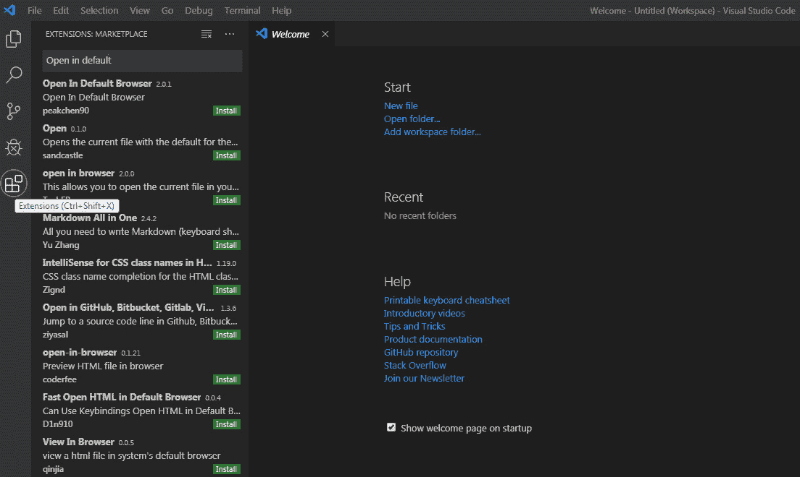
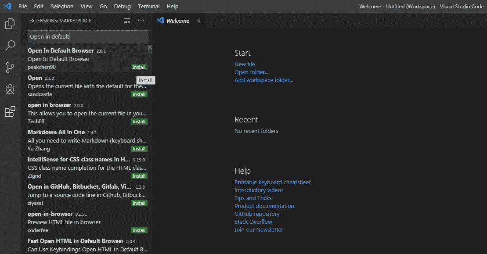
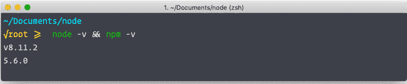

# 前言

## 关于

本节简要介绍了本书的涵盖范围，你开始所需的技术技能，以及完成所有包含的活动和练习所需的硬件和软件要求。

# 关于本书

你已经知道你想要学习 JavaScript，而更智能的学习 JavaScript 的方式是通过实践学习。*《JavaScript 工作坊》* 专注于提升你的实践技能，以便你可以为网络、移动和桌面用户开发前沿的应用程序。除了 HTML 和 CSS 的知识外，JavaScript 是那些希望进入专业网络开发的人的关键技能。你将从真实示例中学习，这些示例可以带来真实的结果。

在 *《JavaScript 工作坊》* 中，你将采取引人入胜的逐步方法来理解 JavaScript 代码。你不必忍受任何不必要的理论。如果你时间紧迫，你可以每天跳入一个单独的练习，或者花一个周末来学习函数式编程。由你选择。按照你的方式学习，你将以一种感觉有成就感的方式建立和加强关键技能。

每一份 *《JavaScript 工作坊》* 的物理副本都能解锁访问互动版。视频详细介绍了所有练习和活动，你将始终有一个指导性的解决方案。你还可以通过评估来衡量自己的水平，跟踪你的进度，并接收内容更新。完成学习后，你甚至可以赚取一个可以在线分享和验证的安全凭证。这是与印刷副本一起提供的优质学习体验。要兑换它，请遵循 JavaScript 书籍开头的说明。

*《JavaScript 工作坊》* 快速直接，是 JavaScript 初学者的理想伴侣。你将像真正的软件开发者一样构建和迭代你的 JavaScript 编码技能，并在学习过程中不断进步。这个过程意味着你会发现你的新技能会持续存在，作为最佳实践的嵌入 – 为未来的几年打下坚实的基础。

## 关于章节

*第一章*，*了解 JavaScript*，介绍了 JavaScript 的基础知识，以便向前迈进并达到熟练水平。本章通过其历史，从现代实现到各种语言用途的附加信息，向你介绍 JavaScript，为接下来要学习的内容提供适当的背景。

*第二章*，*使用 JavaScript*，涵盖了与该语言的一些实际操作。我们将概述一些流行的 JavaScript 编写工具和执行其代码的各种可用运行时。我们将特别关注 JavaScript 的主要目标，以及本身就是一个优秀工具的现代网络浏览器。

*第三章*，*编程基础*，作为在 JavaScript 中工作以及一般编程时涉及的基本概念和结构的介绍。我们将涵盖所有基础知识，从对象类型到条件语句和循环结构，如何编写和调用函数，甚至注释和调试它们的代码。

*第四章*，*JavaScript 库和框架*，专注于纯 JavaScript，以及今天存在的各种框架和库。本章的主要重点是提供一种理解，即虽然对核心语言的扩展可能很好，但有时，核心 JavaScript 就足够了。

*第五章*，*超越基础*，解释了在不同的语言和运行时中数据表示方式的不同。JavaScript 基于 ECMAScript 规范，并具有关于数据表示的明确规则。本章讨论了 JavaScript 中的数据，如何在不同类型之间进行转换，以及类型如何在脚本中传递。

*第六章*，*理解核心概念*，利用本书中的 HTML 页面以及 JavaScript，作为第一个解释事件消息系统的抽象性质。在 JavaScript 中构建有用的 Web 应用程序时，理解这些概念非常有价值。在本章中，你将探索事件消息冒泡和捕获的各种细微差别，以及如何最好地用于控制应用程序中的信息流。你还将看到如何阻止这些事件，以及如何创建自己的自定义事件。本章将为你提供基础工具库，以应对任何大小或复杂性的应用程序。

*第七章*，*揭开盖子*，阐明了很多人认为的“仅仅是 JavaScript”实际上可以被分解成独立的组件：JavaScript 引擎，包括调用栈、内存堆和垃圾回收器；以及 JavaScript 运行时环境，例如浏览器或 Node.js，它包含 JavaScript 引擎，并使引擎能够访问额外的函数和接口，如`setTimeout()`或文件系统接口。我们还将探讨 JavaScript 如何管理内存分配和释放，尽管它是自动管理的，但对于开发者来说，了解涉及的过程对于编写能够使垃圾回收器正确工作的代码非常重要。

*第八章*，*浏览器 API*，介绍了几个最有用和有趣的浏览器 API，这些 API 为我们提供了广泛的功能，我们可以在 JavaScript 应用程序中使用。我们将看到，虽然这些 API 通常通过 JavaScript 访问，但它们不是 JavaScript 引擎编程的 ECMAScript 规范的一部分，也不是 JavaScript 核心功能的一部分。

*第九章*，*使用 Node.js 工作*，指导我们围绕单一编程语言统一整个 Web 应用程序开发，而不是学习不同的语言并为服务器端和客户端构建不同的项目。在本章中，你将了解节点在后台是如何工作的，以及它是如何异步处理请求的。此外，你还将学习不同类型的模块以及如何使用它们。你还将进行许多重要的练习，以获得实际的经验。

*第十章*，*访问外部资源*，探讨了在没有新鲜数据的情况下，网页是静态的且用途有限的这一事实。本章涵盖了使用 Ajax 获取数据的不同方法，主要是从 RESTful 服务中获取。

*第十一章*，*编写整洁且易于维护的代码*，介绍了编写整洁且易于维护代码的最佳实践。你会了解到使用整洁编码技术的重构代码比之前更长。但你会发现，与原始代码相比，代码更加整洁，更容易理解和测试。这种编程风格的价值在复杂现实世界的应用中体现得更为明显，因此以这种方式工作是一种良好的实践。开发人员和技术负责人需要决定哪些标准和整洁编码实践适合他们特定的项目。

*第十二章*，*使用下一代 JavaScript*，探讨了市场上用于 JavaScript 高级开发的多种工具。我们将学习如何在旧浏览器中使用最新的 JavaScript 语法，以及识别在其他语言中开发 JavaScript 应用程序的不同选项。我们还将探索与 JavaScript 兼容的各种包管理器，如 npm 和 Yarn，以及几个不同的框架，如 AngularJS、React 和 Vue.js。最后，我们将探讨一些服务器端库，如 Express、Request 和 Socket.IO。

*第十三章*，*JavaScript 编程范式*，教你 JavaScript 是一种多范式编程语言。我们可以用它以过程式、面向对象和函数式设计模式编写代码。在任何编程语言的学习阶段，人们通常以过程式的方式编码，而不是规划，他们大部分的注意力都放在执行上，并理解该特定编程语言的概念。但是，当涉及到现实生活中的实际执行时，**面向对象编程**范式，或**OOP**，是一个可扩展的选项。

*第十四章*，*理解函数式编程*，讨论了函数式编程与其他编程范式（如命令式和面向对象方法）相当不同，并且需要一些习惯。但是，如果正确应用，它是一种非常强大的方式，可以使程序结构更加声明性、正确，并且具有更少的错误。即使您在项目中不使用纯函数式编程，也有很多有用的技术可以单独使用。这对于 `map`、`reduce` 和 `filter` 数组方法尤其如此，它们有广泛的应用。本章涵盖的主题将帮助您增强在函数式风格中追求编程项目所需的技能。

*第十五章*，*异步任务*，讨论了异步任务如何允许程序的主线程在等待数据、事件或另一个进程的结果时继续执行，从而实现更快的用户界面和一些形式的并行处理。语言最近的增强，如承诺和 `async`/`await` 关键字，简化了这种开发，并使编写干净和可维护的异步代码变得更加容易。

注意

您可以访问[`courses.packtpub.com/`](https://courses.packtpub.com/)上的奖励章节

## 习惯用法

文本中的代码单词、数据库表名、文件夹名、文件名、文件扩展名、路径名、虚拟 URL、用户输入和 Twitter 处理方式如下所示：

“`if`、`else if` 和 `else` 语句为您提供了四种选择或跳过代码块的结构。”

您在屏幕上看到的单词，例如在菜单或对话框中，也以这种方式出现在文本中：“按 *F12* 键启动调试器或从菜单中选择 `更多工具` | `开发者工具`。”

代码块设置如下：

```js
function logAndReturn( value ) {
  console.log("logAndReturn:" +value );
  return value;
}
if ( logAndReturn (true) || logAndReturn (false)) {
  console.log("|| operator returned truthy.");
}
```

新术语和重要词汇如下所示：**计时器事件**在您的应用程序中提供强制性的异步功能。它们允许您在一段时间后调用一个函数；一次或重复多次。

长代码片段将被截断，GitHub 上相应的代码文件名将放置在截断代码的顶部。整个代码的永久链接放置在代码片段下方。它应该如下所示：

```js
activity.html
1 <!doctype html>
2 <html lang="en">
3 <head>
4     <meta charset="utf-8">
5     <title>To-Do List</title>
6     <link href=https://fonts.googleapis.com/css?family=Architects+Daughter|Bowlby+One+SC       rel="stylesheet">
7     <style>
8         body {
9             background-color:rgb(37, 37, 37);
10             color:aliceblue;
11             padding:2rem;
12             margin:0;
13             font-family:'Architects Daughter', cursive;
14             font-size: 12px;
15         }
The full code is available at: https://packt.live/2Xc9Y4o
```

## 在开始之前

每次伟大的旅程都是从谦逊的一步开始的。我们即将开始的 JavaScript 编程之旅也不例外。在我们能够使用 JavaScript 做出令人惊叹的事情之前，我们需要准备好一个高效的环境。在这篇简短的笔记中，我们将看到如何做到这一点。如果您在安装过程中有任何问题或疑问，请通过 `workshops@packt.com` 发送电子邮件给我们。

## 安装 Visual Studio Code

安装 Visual Studio Code（VSCode）的步骤如下：

1.  从[`packt.live/2BIlniA`](https://packt.live/2BIlniA)下载最新的 VSCode：

    图 0.1：下载 VSCode

1.  打开下载的文件，按照安装步骤进行，完成安装过程。

## 安装“在默认浏览器中打开”扩展程序

1.  打开你的 VSCode，点击扩展图标，并在搜索栏中输入“在默认浏览器中打开”，如下截图所示：

    

    

1.  点击“安装”以完成安装过程，如下截图所示：




## 下载 Node.js

Node.js 是开源的，你可以从其官方网站[`nodejs.org/en/download/`](https://nodejs.org/en/download/)下载适用于所有平台。它支持所有三个主要平台：Windows、Linux 和 macOS。

### Windows

访问他们的官方网站并下载最新的稳定版.MSI 安装程序。过程非常简单。只需执行`.MSI`文件，并按照说明在系统上安装它。会有一些关于接受许可协议的提示。你必须接受这些协议，然后点击“完成”。就这样了。

### Mac

你必须从官方网站下载.pkg 文件并执行它。然后，按照说明进行操作。你可能需要接受许可协议。之后，按照提示完成安装过程。

### Linux

为了在 Linux 上安装 Node.js，请以 root 身份按以下顺序执行以下命令：

+   `$ cd /tmp`

+   `$ wget http://nodejs.org/dist/v8.11.2/node-v8.11.2-linux-x64.tar.gz`

+   `$ tar xvfz node-v8.11.2-linux-x64.tar.gz`

+   `$ mkdir -p /usr/local/nodejs`

+   `$ mv node-v8.11.2-linux-x64./* /usr/local/nodejs`

在这里，你首先将当前活动目录更改为系统的临时目录（`tmp`）。其次，从官方发行目录下载`node`的`tar`包。第三，将`tar`包提取到`tmp`目录。此目录包含所有编译和可执行文件。第四，在系统中为`Node.js`创建一个目录。在最后一个命令中，你将所有编译和可执行文件移动到该目录。

### 验证安装

安装过程完成后，你可以在 Node.js 目录中执行以下命令来验证是否正确安装：

```js
$ node -v && npm -v
```

它将输出当前安装的 Node.js 和 npm 版本：





这里显示的是系统上安装了 Node.js 的 8.11.2 版本，以及 npm 的 5.6.0 版本。

## 安装代码包

从 GitHub 在[`github.com/PacktWorkshops/The-JavaScript-Workshop`](https://github.com/PacktWorkshops/The-JavaScript-Workshop)下载代码和相关文件，并将它们放置在您本地系统上名为`C:\Code`的新文件夹中。请参考这些代码文件以获取完整的代码包。
