# 1. 了解 JavaScript

概述

到本章结束时，你将能够在一个网络浏览器中定位 JavaScript 元素以及其他代码元素；识别各种网络浏览器支持的 JavaScript 的不同版本；构建简单的 JavaScript 命令；讨论现代 JavaScript 的各种方法；描述 JavaScript 的功能，并在网络浏览器中创建一个警告框弹出窗口。

本章描述了 JavaScript 的基础知识，以便我们能够继续前进，并掌握这种广泛使用的编程语言。

# 简介

JavaScript 是一种有着有趣起源的语言。在其早期，它并没有受到太多的重视——该语言被广泛接受、功能正确的唯一用途是执行客户端表单数据的验证。许多开发者只是复制粘贴简单的代码片段，在构建的网站上执行单一的操作。所有这些代码片段所做的只是非常简单的动作，例如向用户显示一个警告或提供日期倒计时——简单的逻辑。

现在，JavaScript 已经完全不同了——它具有 literally 构建整个 HTML 文档、实时修改 CSS 样式以及从各种远程来源安全传输和解释数据的能力。在过去，HTML 是网络上的主要技术，而在当今时代，JavaScript 才是王者。

任何对 JavaScript 的介绍都需要对语言的历史和起源有一个基础的了解，以便继续前进并掌握该语言。本章从历史到现代实现介绍了 JavaScript，还提供了关于语言各种用途的额外信息，以便我们为接下来要讨论的内容提供一个适当的背景。

# 什么是 JavaScript 以及它是如何被使用的？

JavaScript 是一种弱类型、多范式、事件驱动、面向对象的编程语言。它包括处理字符串、日期、数组、对象等的能力。它通常用于浏览器环境中的客户端，但也可以用于其他环境，如服务器和桌面应用程序。运行时环境对 JavaScript 非常重要——特别是因为它本身并不包括任何网络、文件、图形或存储能力。

## JavaScript 与其他语言的比较

如果你以 Java 或 Python 等其他语言的经验来接近 JavaScript，可能会觉得有点奇怪。虽然许多语言（如 Java）必须编译才能运行，但 JavaScript 是直接运行的，不需要额外的步骤。

尽管 JavaScript 在许多环境和许多用途中被使用，但它在本质上仍然是三种原生于网络的编程语言之一。其他两种语言是 HTML 语义标记语言和 CSS 样式布局语言。这三种语言在目的和功能上彼此非常不同，但它们都旨在在单一环境中协同工作。让我们来了解一下：

+   **超文本标记语言** (**HTML**)：这是这三种语言中最基础的，因为它定义了组成 HTML 页面的元素，并定义了向用户呈现的基本信息流。

+   **层叠样式表** (**CSS**)：这是用来定义一组样式布局规则，它为定义的 HTML 元素添加视觉装饰和高级布局。

+   **JavaScript**(**JS**)：这是用来使网页具有交互性的，也是本书的重点内容。

对于这三种语言，有一个基本的理解是关注点的分离，即 HTML 提供内容结构，CSS 提供样式和布局，JavaScript 提供交互性。虽然这种理解仍然占主导地位，但许多框架并不完全遵守这种分离，并以某种形式将这些各种语言混合在一起。一些开发者对此表示可以接受，而另一些则不行。当进入这个领域时，这确实是一个需要注意的问题，但最终取决于你根据自己的特定需求选择哪种立场。在我看来，对于这样的问题没有绝对的答案。

## 练习 1.01：语言发现

让我们继续检查一个网站，看看我们是否可以发现 HTML、JavaScript 和 CSS 是如何表示的。你可以选择任何你喜欢的网站来做这个练习。

注意

本书中的所有示例和截图都将使用 Google Chrome 作为首选的网页浏览器。你可以使用你喜欢的浏览器，尽管一些步骤在不同浏览器之间可能会有所不同。

让我们开始吧：

1.  在你的网页浏览器中，在地址栏输入一个 URL，然后按*Enter*/*Return*键来加载所选资源。例如，让我们使用[`angular.io/`](https://angular.io/)——Angular 网站。当然，你可以选择任何你想要探索的网站。

1.  现在，在浏览器视图中任何地方右键单击以召唤上下文菜单。选择允许你查看页面源代码的选项。在 Chrome 中，这个选项被标记为“查看页面源代码”。

1.  页面的源代码将随后出现在一个新标签页中。你可以检查页面的结构，并从原始源代码中挑选出各种 HTML、CSS 和 JavaScript 元素：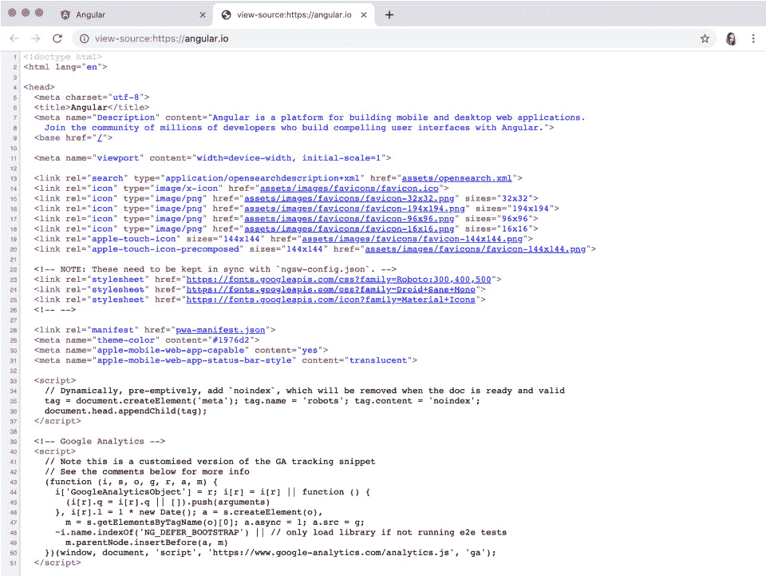

    图 1.1：通过检查原始源代码可以学到很多东西

1.  源代码暴露后，向下滚动并识别页面结构中的各种 HTML 元素。你可能会找到一个`<head>`标签和一个`<body>`标签（这是必需的），以及页面中的各种`<p>`和`<h1>`到`<h6>`标签。

    这里是一些基本 HTML 内容的示例（实际上并非来自 Angular 网站）：

    ```js
    <body>
    <h1>Welcome!</h1>
    <p>Angular is a framework used to build web applications.</p>
    <p>Create high-performing and accessible applications using Angular.</p>
    </body>
    ```

1.  现在，尝试定位嵌入到`<style>`元素中的 CSS 规则，或者甚至是一个链接的 CSS 文件。这里是一些嵌入的 CSS 示例：

    ```js
    <style>
    color: red; 
    margin-top: 40px; 
    position: relative; 
    text-align center;
    </style>
    ```

    这里还有一个链接的 CSS 文件：

    ```js
    <link rel="stylesheet"href="styles.css">
    ```

1.  最后，我们将定位一些 JavaScript。与 CSS 类似，JavaScript 可以通过`<script>`标签嵌入到页面中，或者通过类似机制链接整个 JavaScript 文件。在这里，我们正在定位一些嵌入的 JavaScript：

    ```js
    <script>
    function writeMessage() {
    document.getElementById("message").innerHTML = "Hello From JavaScript!";
    }
    </script>
    ```

    这里是一个链接的 JavaScript 文件：

    ```js
    <script src="img/main.js"></script>
    ```

    选择查看像这样的公共网页的源代码曾经是了解网络技术的一种常见方式。

    注意

    在各种网站和示例中，你可能会看到在`<script>`标签中包含一个`type`属性，指定`type="text/javascript"`。在 HTML5 中，这不再是必需的，而是默认属性。如果你必须针对 HTML 的早期版本，你需要指定它。

到目前为止，我们已经介绍了 JavaScript 编程语言，并检查了它的主要运行环境（网络浏览器）。我们还简要地看了看 JavaScript 与 HTML 和 CSS 的关系，作为三种原生网络技术之一。

在下一节中，我们将探讨 JavaScript 的历史以及它是如何随着时间演变的。

# JavaScript 语言简史

我们已经看到 JavaScript 通常是如何在 Web 环境中集成的，但这个语言是如何产生的呢？我们需要回到 20 世纪 90 年代初，了解在那个时代网络是什么样子，然后我们才开始谈论 JavaScript 本身。

这个故事实际上始于 Netscape 和他们创建的名为**Netscape Navigator**的网络浏览器。这个新浏览器基于成功的 Mosaic 网络浏览器，目的是将其商业化。在那个时期，根据你与谁交谈，Netscape Navigator 是开发人员选择的网络浏览器。在十年中期的某个时候，微软发布了其**Internet Explorer**浏览器，这引发了第一次浏览器大战。

## Netscape Mocha 和 LiveScript

大约在同一时间，Netscape 聘请 Brendan Eich 为 Netscape 的网络浏览器开发一种编程语言。Eich 从 Scheme（Lisp）、Self 以及最重要的是 Java 中获得了灵感。这项语言的工作，当时称为**Mocha**，最初（并且臭名昭著地）在仅 10 天的时间内完成。随着初始版本的完成，Netscape 更改了他们的名称，并开始将其称为**LiveScript**。

结果表明，LiveScript 作为一个语言名称，就像 Mocha 一样，只是一个临时的名称，直到 Netscape 与另一家大型公司合作，推进了网络开发双管齐下的理念。

## Sun Microsystems 和 Java

流行的 Java 语言通过与 Netscape 和 Sun Microsystems 的合作而发挥作用。Sun 将网络视为 Java 的下一步，而 Netscape 正在寻找在即将到来的与 Microsoft 的战争中寻求盟友，因此形成了联盟。Eich 正在开发的语言从那时起被命名为**JavaScript**，因为它旨在在网页浏览器中与 Java 协同工作，作为一种更易于添加交互性的方法。

这意味着 Java 语言将是*严肃*的开发者用来编写网页交互内容的选择，而 JavaScript 将提供类似的交互功能，但更多地面向*业余爱好者*和那些想要摆弄的人。

注意

当然，实际情况与这截然不同。JavaScript 在 Java 之前就被很好地整合到了浏览器中，而一旦 Java 加入，它只能通过 applet 来实现。随着 Java applet 在很久以前就失去了流行，我们现在只剩下 JavaScript，而不是最初设想的两种语言，尽管*JavaScript*这个名字已经固定下来。

## Ecma International 和 ECMAScript

Ecma 组织采用了并标准化了该规范，并将该语言本身更名为 ECMAScript，JavaScript 成为了该规范的商业实现。Ecma International 仍然是开发和发布 ECMAScript 规范及其所有新版本的机构，这些规范最终影响了 JavaScript 语言。

在本节中，我们了解了 JavaScript 是如何产生的，并进行了快速练习，展示了如何在网页浏览器中实时检查它。此时，你应该对 JavaScript 的确切含义、来源以及它是如何工作的有一个相当好的了解。

在下一节中，我们将通过查看 JavaScript 在 ECMA 标准化之后的版本历史，来了解这个语言背后的更多历史。

# ECMAScript（和 JavaScript）的版本

现在 JavaScript 获得了 Ecma International 的标准化和 ECMAScript 规范，它也需要遵循标准的版本化实践。对于语言的前几个迭代，这对开发者来说意义不大。然而，正如你将看到的，随着需求增长和语言的发展，ECMAScript 将会有重大变化。在某些情况下，这些变化会影响到 JavaScript，在其他情况下则完全消失。

## ECMAScript 1 (1997)

第一个进行标准化的版本基本上是从 LiveScript 中编码其特性的。这个版本有时被称为**ECMAScript 第一版**。

它通常对应于 JavaScript 版本 1.3。

## ECMAScript 2 (1998)

这个版本除了对现有标准的编辑以更好地符合之外，几乎没有变化。它可能应该被标记为版本 1.1。

它也通常对应于 JavaScript 版本 1.3。

## ECMAScript 3 (1999)

这个版本的 ECMAScript 添加了一些基本但预期的（必要的）语言增强。其中最重要的之一是引入了 `try…catch` 条件结构，它为更基本的 `if…else` 语句提供了一个替代方案，允许更复杂的错误处理。还引入了 `in` 操作符。这通常对应于 JavaScript 版本 1.5。

## ECMAScript 4（未发布）

这个版本包括了真正的类、模块、生成器、静态类型以及许多后来添加到规范中的语言特性。

注意

最终，由于委员会和公司内部的斗争，ECMAScript 4 完全被废弃。取而代之的是，它被 ECMAScript 3 的增量改进所取代，也称为 ECMAScript 3.1。

在这个时候，Adobe 决定基于新的 ECMAScript 版本（ActionScript 3.0）对 ActionScript 语言进行一次全面的修订。这是一个尝试将 Flash Player 背后的语言与通常托管它的浏览器紧密对齐的尝试。以下是一个基本的 ActionScript 3.0 类的示例——请注意，它与之前的 ECMAScript 版本相当不同：

```js
package com.josephlabrecque {
import flash.display.MovieClip;
public class Main extends MovieClip {
public function Main() {
// constructor code
}
}
}
```

## ECMAScript 5 (2009)

实际上，这个版本是 ECMAScript 3.1，版本 4 完全被废弃。这与其说是实质性的发布，不如说是更多政治动机的发布，尽管它包括了来自 ECMAScript 4 的某些错误修复，以及严格模式、JSON 支持，以及用于处理数组的一些额外方法。

这通常对应于 JavaScript 版本 1.8.5，并且是今天大多数浏览器遵循的 JavaScript 版本。

## ECMAScript 6（2015）

包括箭头函数、映射、类型化数组、承诺等在内的许多功能都是随着这个版本的 ECMAScript 一起引入的，其中许多是现代 JavaScript 开发的基石。这个规范还允许编写类和模块——终于。以下表格解释了 ES6 的浏览器支持情况：

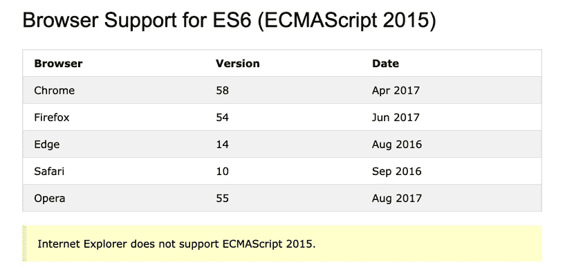


图 1.2：通过 w3schools.com 的 ECMAScript 2015 浏览器支持表

这个版本的 JavaScript 通常由现代网络浏览器支持，并且是一个主要的功能性发布。

## ECMAScript 7（2016），ECMAScript 8（2017）和 ECMAScript 9（2018）

2015 年之后的所有版本都是增量式的，每年对 ECMAScript 6 中确立的内容进行修改。这发生的原因有很多：

+   它确立了这个语言是稳定、成熟的，无需进行重大破坏。

+   它允许开发者和浏览器供应商轻松跟上所采用的变化和增强。

+   它为新规范版本提供了一个稳定的发布周期：

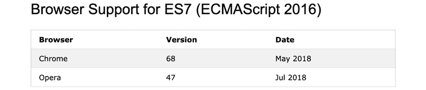


图 1.3：通过 w3schools.com 的 ECMAScript 2016 浏览器支持表

当使用 ECMAScript 2015（或“ES6”）及更高版本编写时，您可能需要将 JavaScript 转译为以前的版本，以便它可以在当前网络浏览器的 JavaScript 引擎中被理解。虽然这是一个额外的步骤，但近年来处理此类任务的工具已经变得更加易于使用。

## 练习 1.02：我能使用这个功能吗？

没有一种简单的方法可以判断哪些版本的 JavaScript 被哪些浏览器支持——一个更可靠的方法是测试您希望使用的功能是否被当前运行代码的引擎支持。让我们看看`Can I Use`表格：

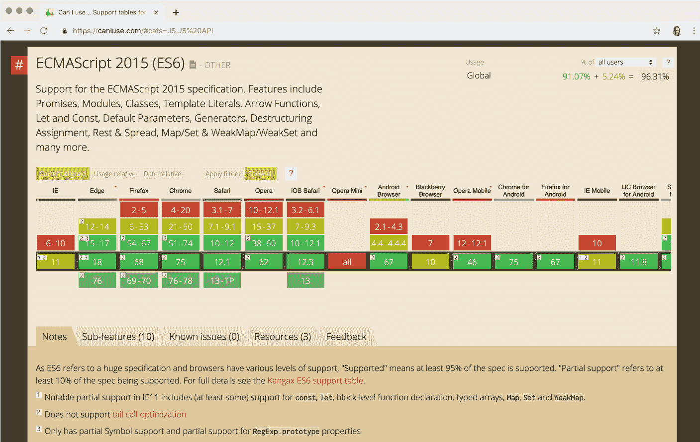

图 1.4: "Can I Use" 表格显示 ECMAScript 2015 在不同浏览器中的支持情况

为了帮助我们做到这一点，互联网上有许多资源和服务跟踪 JavaScript 功能以及每个浏览器中的支持水平。其中最流行的大概是 `SVG`、HTML5 等。

让我们继续检查 `Promise.prototype.finally` 的支持情况，该功能首次在 ECMAScript 2018 中实现：

1.  打开一个网络浏览器，并指示它加载 [`caniuse.com/`](https://caniuse.com/)。注意，您可以直接从主页访问最新的和最常搜索的功能，而无需搜索：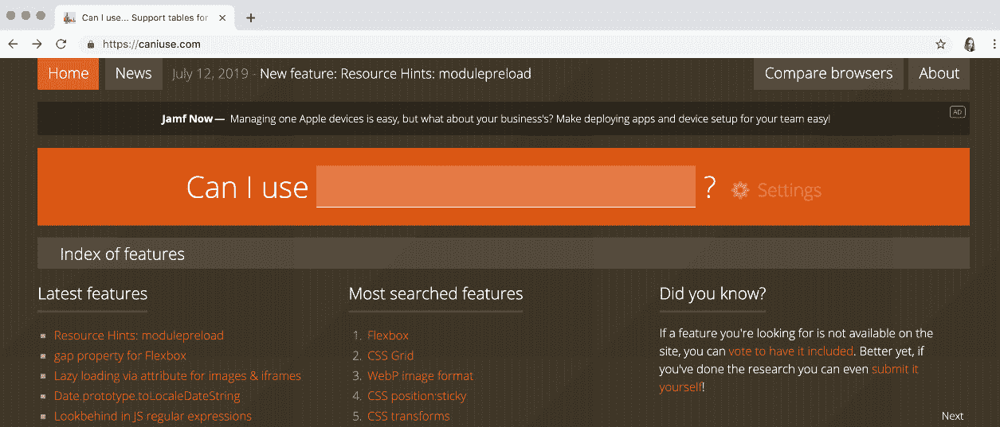

    图 1.5: Can I Use 网站

1.  我们正在寻找特定的事物。在顶部找到搜索区域，它写着 `finally`，因为我们想查看哪些浏览器支持 `Promise.prototype.finally`。我们的搜索结果将自动显示在一个彩色网格中：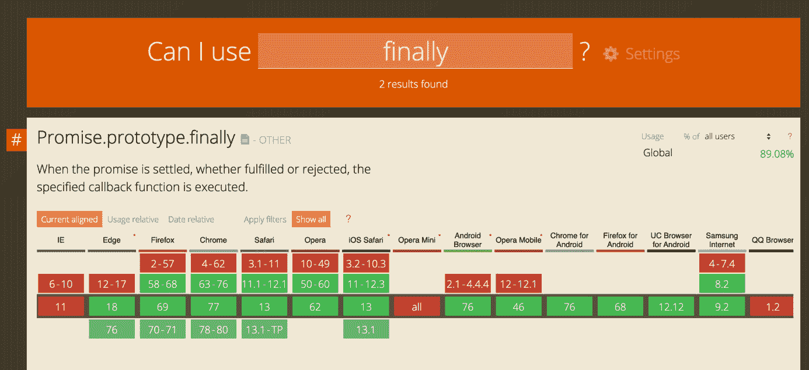

    图 1.6: Promise.prototype.finally 的浏览器支持网格

    注意，某些块是红色的，而其他块是绿色的。红色表示该功能不受支持，绿色表示该功能受支持。您还可能看到黄色，表示部分支持。

1.  如果您想查看与特定浏览器版本相关的具体信息，将光标悬停在指示的版本或版本范围内，将出现一个小覆盖层，其中包含额外的信息，例如版本发布日期甚至该版本的统计数据：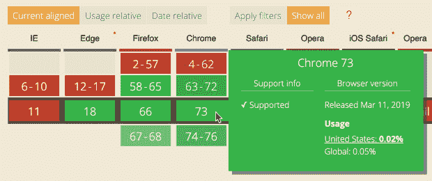

图 1.7: Chrome 73 的具体支持信息

在界面中继续搜索其他选项——有很多可以探索。

在本节中，我们回顾了 ECMAScript 的不同版本，并探讨了 JavaScript 的功能，这些功能源于那些特定的规范，以及这些功能如何在今天的网络浏览器中得到支持。

在下一节中，我们将探讨如何访问网页浏览器开发者工具，以便更好地了解 JavaScript 的执行情况——甚至可以在浏览器中实时编写 JavaScript。

# 访问网页浏览器开发者工具

随着我们讨论的每个主题，我们对 JavaScript 与网页浏览器之间关系的理解变得越来越清晰。在前一个练习中，我们看到了如何深入挖掘并发现不同网页浏览器对 JavaScript 功能支持的各个级别。这直接引导我们查看各种浏览器本身，以及每个浏览器内用于检查甚至编写 JavaScript 代码的工具。

浏览器是按照 HTML 和 CSS 等标准构建的。然而，在解释这些标准以及每个主要网页浏览器提供的工具方面存在许多差异。当为网页浏览器编写 JavaScript 时，了解如何访问和使用浏览器开发者工具——*尤其是* JavaScript 控制台选项卡——是很重要的。

## Google Chrome

在撰写本文时，Chrome 是最受欢迎的网页浏览器——这一事实对普通用户和开发者都适用。Chrome 首次于 2008 年 9 月发布，现在可在多个桌面和移动操作系统上使用。

注意

您可以从 [`www.google.com/chrome/browser/`](https://www.google.com/chrome/browser/) 下载 Google Chrome。

要在 Chrome 中访问开发者工具和 JavaScript 控制台，您可以在视口中任何位置右键单击，然后从出现的菜单中选择 `Inspect`。或者，按 `F12`。一旦开发者工具打开，点击 `Console` 选项卡，就可以在 Chrome 本身内检查和编写 JavaScript 代码：

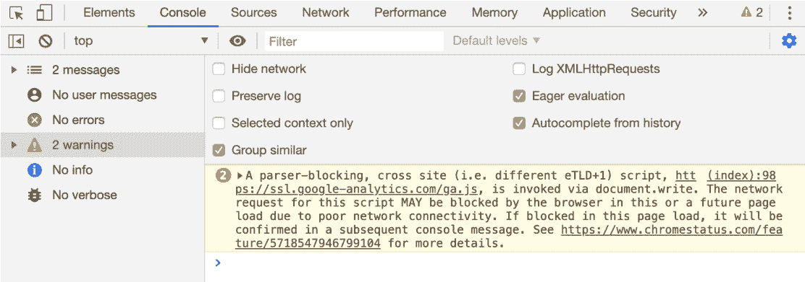

图 1.8：Google Chrome 开发者工具

使用 Chrome 开发者工具，您可以过滤显示错误、警告或甚至只是像 `console.log()` 返回的信息这类内容。您甚至可以在浏览器中使用 `Console` 选项卡视图编写 JavaScript，正如您很快就会看到的。还有一个 `Sources` 选项卡，允许修改和调试代码。

## Microsoft Edge

曾经作为世界上使用最广泛的网页浏览器而统治一时的 Internet Explorer，其最终版本为 IE11。但这并不意味着微软已经放弃网页浏览器，因为随着 Windows 10 的发布，新创建的 Edge 浏览器于 2015 年 7 月作为替代品提供给用户。

注意

Microsoft Edge 随 Windows 10 系统一起安装（[`www.microsoft.com/windows`](https://www.microsoft.com/windows)）。

要在 Edge 中访问开发者工具和 JavaScript 控制台，您可以在视口中任何位置右键单击，然后从出现的菜单中选择 `Inspect Element`。或者，按 `F12`：

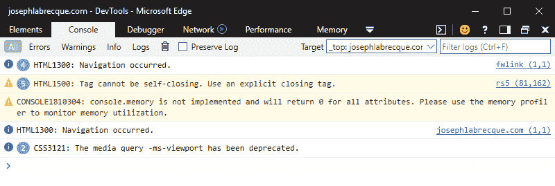

图 1.9：Microsoft Edge 开发者工具

Microsoft Edge 的开发者工具相当丑陋，不是吗？与其他浏览器一样，Edge 的开发者工具包括一个`控制台`和一个 JavaScript`调试器`视图。类似于 Chrome，你还可以在代码执行时过滤`控制台`中出现的输出类型。

注意

到目前为止，Microsoft Edge 正在基于 Chromium 基础进行重写。这意味着 Chrome、Opera、Safari 和 Edge 最终将使用底下的完全相同的浏览器技术。

## Apple Safari

在 Apple macOS 和 iOS 操作系统上，Safari 是默认的网页浏览器，并且与这些机器的用户体验紧密集成。类似于 Windows 和 Internet Explorer/Edge，许多用户永远不会偏离他们机器上预装的浏览器。

Safari 曾经甚至可在 Windows 上使用，但随着 2012 年 Windows 最终版本的发布，开发已停止。

注意

Apple Safari 随 Apple macOS([`www.apple.com/macos/`](https://www.apple.com/macos/))安装。

要访问 Safari 中的开发者工具和 JavaScript 控制台，你必须首先调整浏览器本身的一些偏好设置。让我们开始吧：

1.  首先，通过选择`应用程序`菜单中的`Safari` | `偏好设置`来访问偏好设置对话框。

1.  在`偏好设置`对话框中，点击名为`高级`的标签页。

1.  一旦`高级`标签页的内容出现，查看底部并启用`在菜单栏中显示开发菜单`选项：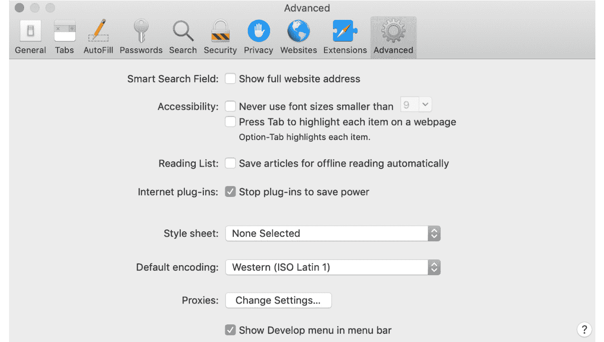

    图 1.10：Apple Safari 高级偏好设置

1.  启用该选项后，关闭`偏好设置`对话框。

1.  现在，从`应用程序`菜单中选择新启用的`开发`选项，然后选择`显示 JavaScript 控制台`以显示开发者工具。你还可以右键单击并选择`检查元素`。

好消息是，一旦启用`开发`菜单，它将在会话之间保持启用状态。你只需打开开发者工具即可访问这些功能：

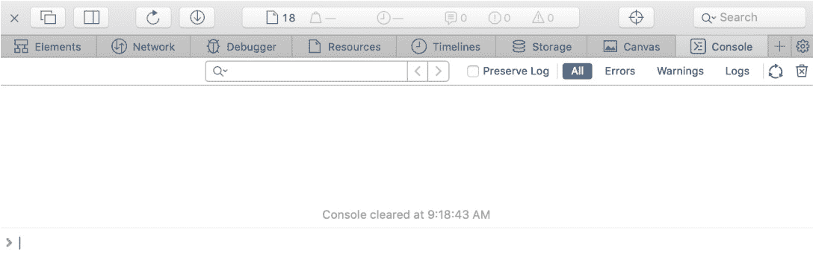

图 1.11：Apple Safari 开发者工具

今天，Safari 似乎在采用某些功能方面似乎落后于大多数其他浏览器，但你会发现 Apple 在开发者工具中的`控制台`和`调试器`视图版本是一样的。

# 变量的介绍

在几乎任何语言中，包括 JavaScript，编程的第一步是理解常见的变量。变量可以被视为某个数据片段的标识符。要在 JavaScript 中声明变量，我们使用保留字`var`：

```js
var name; 
```

在前面的例子中，我们使用`name`标识符声明了一个变量。我们的变量还没有任何与之关联的数据。为此，我们必须使用赋值运算符：

```js
name = "Joseph";
```

由于变量名已经声明，我们在此第二步中不再需要使用`var`来声明它。我们只需通过其`name`来引用变量，然后跟一个赋值运算符`=`，然后是一个值，在这个例子中是`"Joseph"`。当然，你在这里可能想使用你自己的名字。

我们为了约定和可读性，在每个代码行末尾使用`;`。请注意，我们也可以在单行代码中执行变量声明和赋值：

```js
var name = "Joseph";
```

现在，你已经了解了如何声明和分配数据值给变量的基础知识。

## 练习 1.03：编程第一步

让我们继续在开发者工具控制台中逐步执行一些 JavaScript 代码，然后再继续。如果你在上一个部分中仍然打开了浏览器开发者工具。如果没有，请参阅本章的“访问网络浏览器开发者工具”部分以访问控制台。

由于控制台现在可在网络浏览器中使用，我们将逐步执行一些基本的 JavaScript 声明：

1.  在控制台中，输入以下代码并按*Enter*键：

    ```js
    var myCity= "London";
    ```

    这声明了一个具有标识性名称`myCity`的变量。这将允许你在以后调用此变量。

1.  由于这个变量现在已在内存中定义，我们可以随时访问它。在控制台中输入以下内容并按*Enter*键：

    ```js
    alert("Welcome to " + myCity + "!");
    ```

    一个带有`"Welcome to London!"`信息的提示框将出现在浏览器视口中。为了实现完整的问候，我们还将使用`+`运算符将额外的字符串信息添加到变量中。这允许我们在输出中混合变量值和纯文本数据。

现在，你知道了如何将值写入命名变量，以及如何通过变量名读取这些值。

## 活动一.01：在网页浏览器中创建一个弹窗提示框

在本活动中，你将调用 JavaScript 并见证其与网络浏览器的紧密关系。你将学习如何在浏览器环境中使用浏览器开发者工具执行一个提示框。

注意

在以下说明和输出图像中，我们将使用 Google Chrome。其他浏览器可能会有所不同。

**步骤**：

1.  按*F12*键打开开发者工具。或者，右键单击可能显示一个菜单，你可以从中选择“检查”。

1.  激活“控制台”标签页。开发者工具可能默认显示此视图。如果不显示，则可能有一个可以点击以激活的“控制台”标签页。

1.  在控制台中，输入 JavaScript 命令。

1.  按*Return*/*Enter*键执行代码。

**预期输出**：

输出应类似于以下内容：


图 1.12：出现带有我们信息的提示框

注意

本活动的解决方案可在第 710 页找到。

在本节中，我们探讨了如何访问各种流行浏览器中的网络浏览器开发者工具，并查看了一些可以访问的不同视图。

在下一节中，我们将概述 JavaScript 的具体用途，并大致了解该语言的能力。

# JavaScript 功能概述

没有 JavaScript，网络将是一个相当平淡且非交互式的体验。作为与 HTML 和 CSS 一起构建网络的核心理技术之一，JavaScript 对于今天使用这些技术的任何人来说都至关重要。JavaScript 允许我们执行复杂交互，将数据传输到您的应用程序中，并在网页视图中显示重构的值。它甚至有能力构建、销毁以及修改整个 HTML 文档。

## 客户端表单验证

表单在网络上无处不在——HTML 规范包括各种输入、复选框、单选组、文本区域等等。通常，在数据到达服务器之前，你可能会想要一些逻辑来查找用户输入的某些格式特性或其他异常。你可以在点击“提交”按钮后触发初始客户端验证，或者甚至在每个输入失去焦点时：


图 1.13：登录表单验证

这可能是网络中 JavaScript 最常见的用途之一：你可以提供基本的反馈，让用户知道他们犯了错误——在这种情况下，无效的登录凭证。

## JavaScript 小部件或组件

不论是使用由组件库如 **Bootstrap** 或 **jQuery UI** 提供的 JavaScript 片段，还是由特定供应商和服务提供的代码，人们已经使用 JavaScript 包括功能小部件和组件超过二十年了。这确实是网络中 JavaScript 最常见的用途之一。

通常，你会得到一些代码，这些代码通常由 HTML 和 JavaScript 组成。当它在页面上运行时，通常有一个嵌入的 JavaScript 库，它可以调用函数，或者是一个远程库，它将空白片段转换成特定目的的完整功能内容：


图 1.14：可嵌入的 Twitter 小部件

JavaScript 基于组件或小部件的最佳例子之一是 Twitter 时间线嵌入。你还会发现类似的可嵌入类型用于 Instagram 和其他社交网络。几乎所有这些都使用 JavaScript 将动态内容插入文档中。

注意

这与 `<iframe>` 嵌入不同，因为使用 `<iframe>` 元素时，你只是在从远程资源中拉入内容，而不是动态构建它。

## XML HTTP 请求 (XHR)

这种技术源于 **富互联网应用**（**RIA**）的概念，这种概念在世纪初由 Adobe Flash Player 和 Microsoft Silverlight 等技术主导。RIA 的优点在于，你不再需要刷新整个浏览器视图来查看浏览器 DOM 中呈现的数据的变化。使用像 Flash Player 这样的视觉交互层，可以在应用程序中使用 ActionScript 执行所有与在后台检索数据相关的任务，用户界面随后根据检索到的数据进行更改。这样，用户得到了更好的体验，因为整个文档不需要在每次与服务器交互时都加载和重新加载。

随着开发者开始寻找不使用额外技术完成同样事情的方法，**XMLHttpRequest**（**XHR**）作为 Microsoft Internet Explorer 1999 年的一部分被引入，称为 **XMLHTTP**。其他浏览器制造商认识到这种实现的明显好处，继续在其解释中将其标准化为 **XMLHttpRequest**。

注意

在这个更现代的命名之前，XHR 通常被称为异步 JavaScript 和 XML，简称 AJAX。当人们提到 AJAX 时，他们指的是 XHR API。

按 *F12* 并导航到 `网络` | `预览` 以在浏览器中查看 XHR 网络预览：

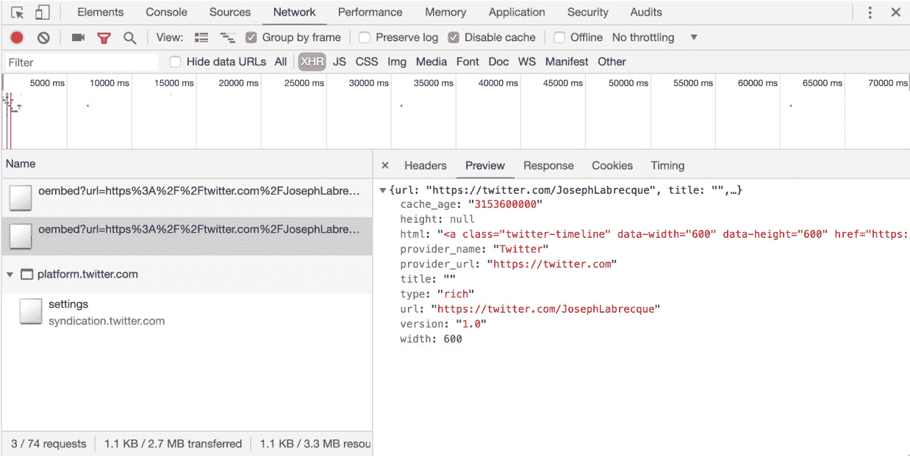

图 1.15：Chrome 中的 XHR 网络预览

浏览器开发者工具都有一种检查与当前网站相关的文件和数据传输到浏览器的方法。对于 XHR，你可以查看原始头信息、格式化预览以及更多内容。

## 存储本地数据

网络浏览器已经能够以 `data:value` 对的形式存储本地数据一段时间了，这允许在应用程序的客户端实现某种会话记忆。随着应用程序复杂性的增加，最终出现了在浏览器中存储更复杂本地数据的需求。

现在我们有了 `LocalStorage`，它是比 cookie 更好的版本，但它仍然缺乏真正数据库的能力。

如果你确实需要访问用于你的网络应用程序的真正客户端数据库，你将想要探索 **Indexed Database**（**IndexedDB**）API。IndexedDB 是一个真正的客户端数据库，允许复杂的数据结构、关系以及你从数据库中期望的一切。

注意

一些网络浏览器也有访问 Web SQL 数据库的能力——但这是不被网络标准机构认为合适的，通常应该避免。

你可以通过深入开发者工具来检查你访问的任何网站的本地存储。在 Google Chrome 中，你将在 `应用程序` 视图中找到本地存储：

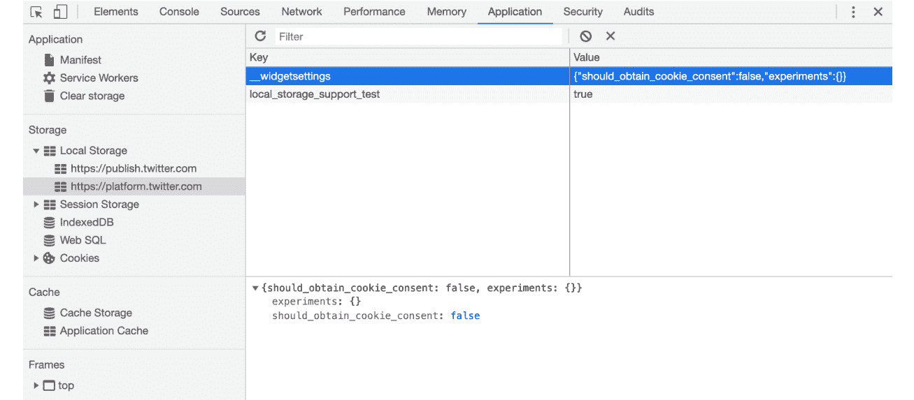

图 1.16：Chrome 中的本地存储检查

## DOM 操作

JavaScript 可以修改、创建和销毁 **文档对象模型**（**DOM**）内的元素和属性。这是 JavaScript 的一个非常强大的方面，几乎所有现代开发框架都以某种方式利用了这一功能。类似于 XHR，使用 JavaScript 在客户端执行这些修改时，浏览器页面不需要刷新。

我们将在下一章中看到一个基于此的特定项目，你将有机会亲身体验这个任务。

## 动画和效果

回顾网络在婴儿期，一切都是一个非常静态的体验。页面在浏览器中提供，由文本和超链接组成。根据年份，我们通常看到黑色衬线字体与白色背景，偶尔会有蓝色/紫色的超链接。

最终，图像和不同的视觉风格属性也变得可用，但真正改变的是各种扩展的出现，如 **Macromedia Shockwave** 和 **Flash Player**。突然之间，丰富的体验，如交互式视频、动画、游戏、音频播放、特殊效果等，都变得触手可及。

网络标准机构正确地认识到，所有这些功能不应被锁定在不同的浏览器插件之后，而应该是使用核心网络技术作为原生网络体验的一部分。当然，其中最重要的是 JavaScript，尽管 JavaScript 通常依赖于与 HTML 和 CSS 的紧密关系来实现功能。以下截图显示了使用 `CreateJS` 库创建的交互式动画：


图 1.17：使用 CreateJS JavaScript 库的交互式动画

现在，我们有了丰富的内容创建类型实现，这些类型之前仅通过第三方插件可用。例如 `CreateJS` 这样的库允许实现大量的效果、游戏应用、交互、动画等，并使用原生 JavaScript。

注意

在这个开发领域的可能性方面，有许多示例，你可以查看 Google Doodles 存档，网址为 [`www.google.com/doodles`](https://www.google.com/doodles)。

在本节中，我们探讨了 JavaScript 在当今网络中的一些常用功能。在接下来的章节中，我们将更深入地探讨这些功能。

# 摘要

在本章中，我们花了一些时间来构建一个知识基础，这将构成本书其余部分的结构。我们从历史概述开始，然后考察了 ECMAScript 与 JavaScript 之间的关系。接着，我们通过访问各种浏览器的开发者工具来探索 JavaScript。在完成了一次动手实践并使用浏览器开发者工具编写了一些 JavaScript 代码之后，我们以对 JavaScript 功能的概述结束了本章。这包括 DOM 操作、本地数据存储、表单验证以及其他示例，以帮助我们正确思考在 JavaScript 中工作的可能性。

在下一章中，我们将通过使用**集成开发环境**（**IDE**）和检查 JavaScript 的语法规则来更详细地探讨如何使用 JavaScript。我们将更深入地研究网络浏览器，将其视为多种 JavaScript 运行时之一。我们还将更详细地探讨浏览器开发者工具的使用，并亲自动手操作浏览器元素及其相关属性。
