# 第二章：2. 使用 JavaScript

概述

到本章结束时，你将能够操作现代**集成开发环境**（**IDE**）；识别和描述基本的 JavaScript 结构；描述不同的 JavaScript 环境；识别流行网络浏览器开发者工具中的主要视图及其用途，并构建 HTML 元素以及修改它们的各种属性。

在本章中，你将了解一些流行的 JavaScript 编写工具，以及使用现代网络浏览器执行代码的各种可用运行时。

# 简介

在前一章中，我们探讨了 JavaScript 的历史概述，并考察了该语言与标准 ECMAScript 的关系。然后，我们通过访问各种浏览器的开发者工具来探索 JavaScript。

现在我们已经以更深入的方式熟悉了 JavaScript，是时候通过实际操作来学习这门语言了。首先，我们将概述一些流行的 JavaScript 编写工具和可用于执行代码的各种运行时。安装这些工具后，我们可以开始编写一些 JavaScript 代码，以便熟悉语言的语法和结构——如何以有意义的方式编写代码以及如何在网络环境中包含它。

在本章中，我们将特别关注大多数 JavaScript 环境的主要目标，以及本身就是一个伟大工具的现代网络浏览器。在前一章中，我们探讨了如何在不同网络浏览器中访问开发者工具的概述。在本章中，我们将进一步探讨这些工具如何在 JavaScript 开发中得以应用。

最后，我们将更深入地研究网络浏览器交互，并探讨如何使用常见的 JavaScript 函数来控制网络浏览器中元素的样式和内容。本章中的所有代码都将使用我们即将介绍的编辑器编写。

# 集成开发环境（IDE）

JavaScript 是一种在运行时解释的语言，因为我们不需要事先编译它。还有其他非直接编写 JavaScript 的方法，例如通过转译或编译，但我们将稍后回顾这些内容。在我们深入到与 JavaScript 一起工作和编写代码之前，我们应该检查使用专用开发环境来编写和管理我们的 JavaScript 代码的好处。

使用与您所使用的平台和语言相匹配的 IDE，与简单的文本编辑器相比，可以提供许多好处。例如，IDE 通常包括以下功能：

+   检查、格式化和其他清理工具

+   集成**终端**和命令行访问

+   编程语言**调试工具**

+   输入时提供强大的代码补全和提示

+   代码片段和预定义的代码内容

+   内置编译器（取决于语言和平台）

+   潜在的 **模拟功能**——尤其是在处理移动开发时

## GitHub 的 Atom

Atom 是一个免费且开源的编辑器，由 GitHub 维护，适用于 Microsoft Windows、Apple macOS 以及各种 Linux 发行版。由于该编辑器是由 GitHub 创建的，因此它的一项主要功能是与他们在编辑器内提供的其他服务的紧密集成：

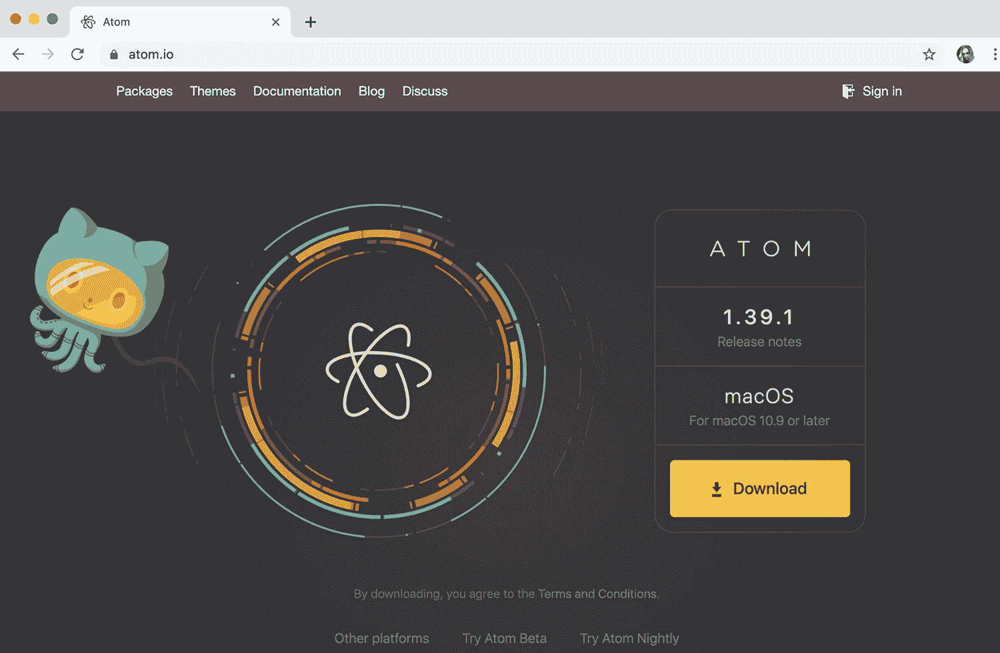

图 2.1：GitHub for Atom

该编辑器具有插件系统，允许用户添加对各种语言和主题的支持。Atom 可以从 https://atom.io/ 免费下载和安装。

## Sublime Text

几年前虽然是一个非常受欢迎的编辑器，但这里仍值得提及，因为许多开发者使用这个 IDE 进行 JavaScript 以及更多开发。Sublime Text 支持 Microsoft Windows、Apple macOS 以及各种 Linux 发行版。最新版本于 2019 年发布：

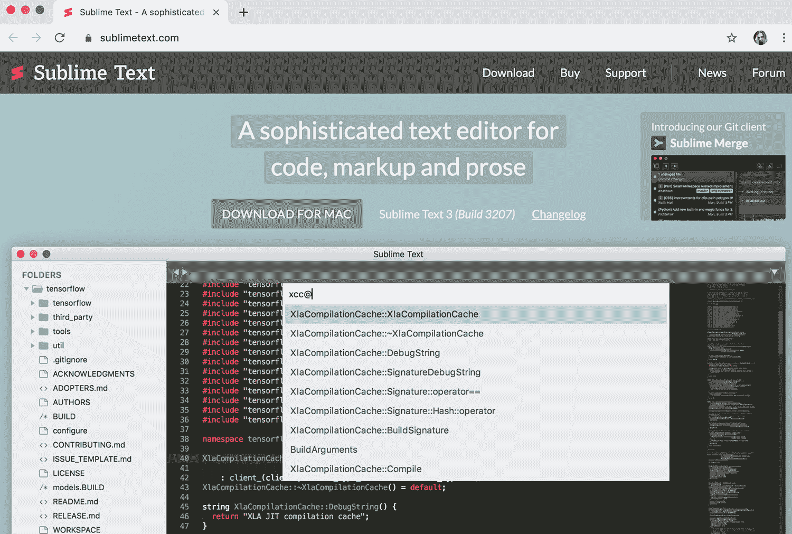

图 2.2：Sublime Text

Sublime Text 可以从 [`www.sublimetext.com/`](https://www.sublimetext.com/) 下载并安装作为免费评估工具；然而，如果您想长期使用，则需要购买它。

## Adobe Dreamweaver

之前是 Macromedia 的财产，Adobe 收购了该公司，并停止了他们现有的网页编辑产品 Adobe GoLive 的开发，转而加强了 Dreamweaver 的支持。自那时以来，该应用程序已经经历了多次重写和调整，但重点始终在视觉编辑视图和针对开发者的裸代码形式之间分裂。Dreamweaver 内置的代码编辑器基于 Adobe 的开源 Brackets ([`packt.live/2WWMUH6`](https://packt.live/2WWMUH6)) 项目：


图 2.3：Adobe Dreamweaver

您可以从 [`www.adobe.com/products/dreamweaver.html`](https://www.adobe.com/products/dreamweaver.html) 下载并安装 Dreamweaver 进行试用，但为了继续使用，必须购买。

## JetBrains WebStorm

从 JetBrains 可获得各种编辑器和工具。其中许多在复杂性和功能方面相互构建。当主要寻找用于编写 JavaScript、HTML 和 CSS 的网页编辑器时，JetBrains WebStorm 是一个好的选择，但它处理项目和关联文件管理的方式确实有一定的学习曲线：

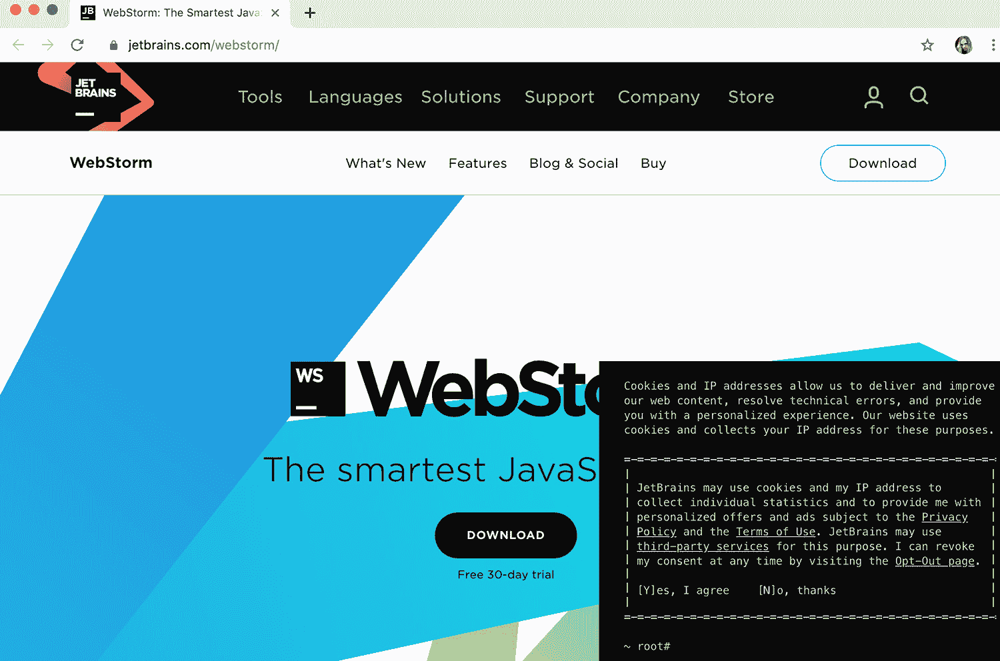

图 2.4：JetBrains WebStorm

WebStorm 可以从 [`www.jetbrains.com/webstorm/`](https://www.jetbrains.com/webstorm/) 下载并安装为免费试用，之后有多种购买选项可供选择。与教育机构有关联的人可以申请免费许可证，并每年更新。

## Microsoft Visual Studio Code

对于本模块，我们将使用 Visual Studio Code 作为我们的 IDE。这个软件应用是来自微软的免费、跨平台 IDE，每月都会更新。它允许你以非常有效的方式使用原生 Web 技术——同时也有通过扩展支持其他语言和功能的能力。Visual Studio Code 在所有类型的开发者中都非常受欢迎：


图 2.5：Microsoft Visual Studio Code

Visual Studio Code 可以从[`code.visualstudio.com/`](https://code.visualstudio.com/)免费下载和安装。

注意

下载和安装 IDE 的过程可以在本书的*前言*中找到。

# JavaScript 项目和文件管理

现在我们已经安装了开发环境，我们需要考虑一些最佳实践，关于我们在本地机器上存储项目的地方，以及如何在每个项目中组织文件夹和文件。我们还将通过一个小练习来演示如何将项目（包括所有相关文件）加载到 Visual Studio Code 中。

## 项目文件夹和文件

建议在你的本地机器上留出一个目录，用于放置你可能正在工作的所有项目。例如，你可以在本地磁盘上创建一个名为`Projects`的目录，然后在其中创建特定的项目文件夹——每个项目一个。这样，你可以确保所有项目都位于一个地方。你甚至可以创建一个到`Projects`文件夹的快捷方式，以便随时轻松访问：

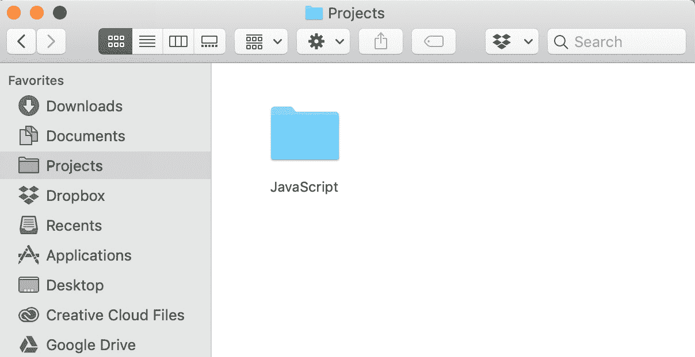

图 2.6：macOS 上的项目目录示例

个体项目将存在于主`Projects`目录中的特定文件夹中。根据你工作的项目数量，你可能需要创建许多子文件夹。每个项目都应该有一个清晰的名字，以便于识别。

## 练习 2.01：创建工作项目目录

让我们看看如何创建一个目录，以便我们可以包含我们的工作项目以及所有相关的文件和子文件夹：

1.  在你的`文件系统`中，找到一个易于访问并且你的账户有完全读写权限的地方，因为你将在这个位置写入文件。如果你已经有一个现有的`Projects`目录，这很可能是一个理想的位置。

1.  在这个文件夹中，创建一个新的文件夹，并将其命名为`JavaScript`，或者你选择的任何其他名字，如下所示：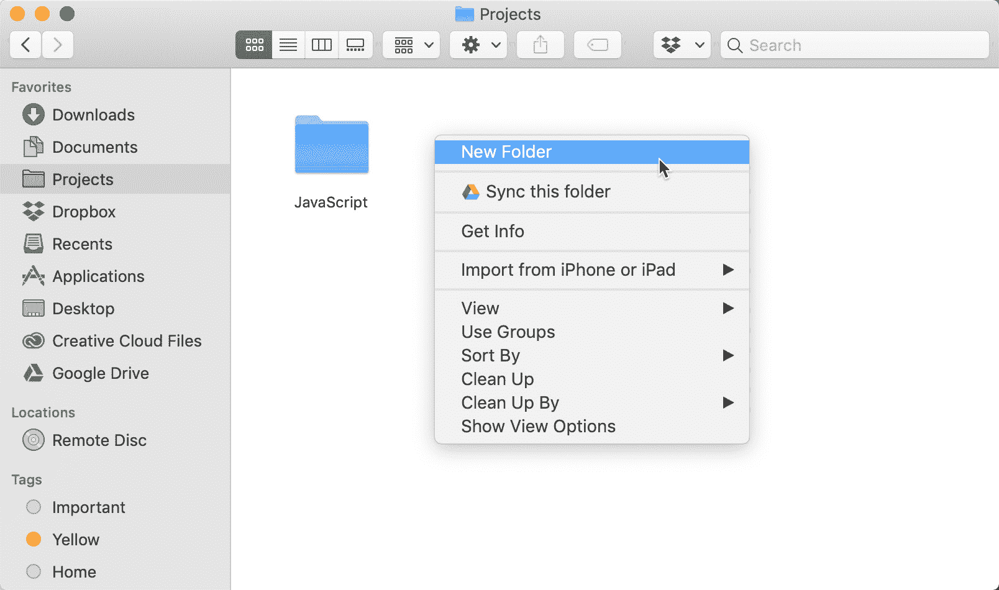

    图 2.7：在 macOS 上创建新文件夹

1.  在创建好新的项目文件夹后，导航到其父目录。你可能已经在那里，或者可能需要在上一个级别在`文件系统`中向上移动。这完全取决于你的操作系统以及你如何创建文件夹。

1.  使用你的鼠标、触控笔或触摸板，将工作项目文件夹从文件资源管理器拖动到 Visual Studio Code 应用程序窗口中：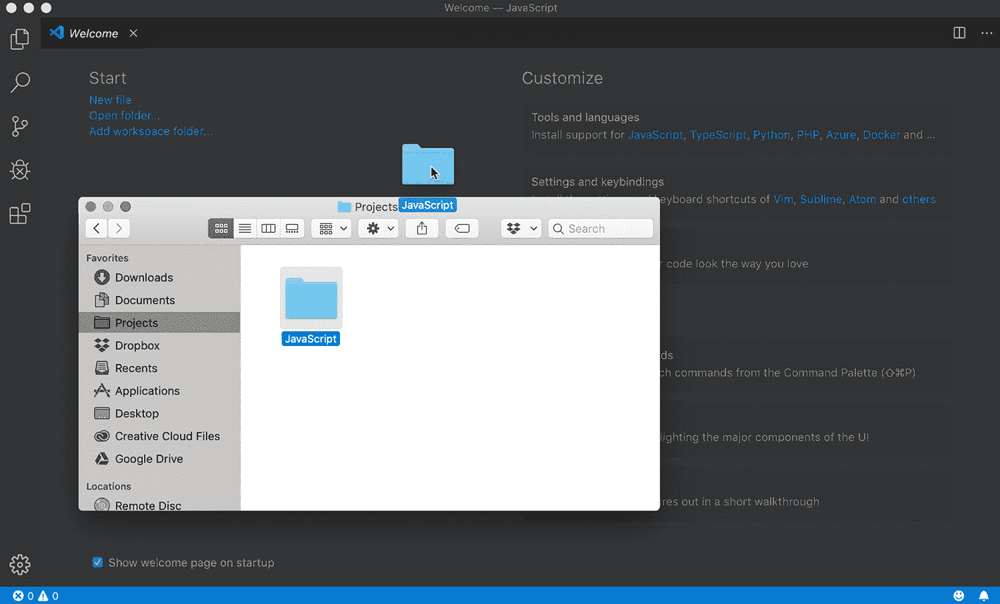

    图 2.8：将项目加载到 Visual Studio Code 中

1.  Visual Studio Code 中当前标签页的内容将被遮挡，这表明你可以将文件夹释放到上面。请继续这样做。

1.  这将有效地将你拖放到 Visual Studio Code 界面的文件夹设置为你的工作项目文件夹。查看左侧窗格并导航其中的文件和文件夹：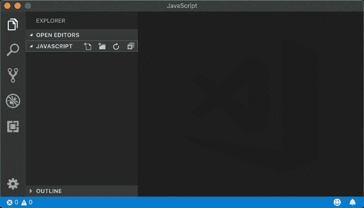

图 2.9：声明的当前工作项目文件夹

新创建的文件夹现在是 Visual Studio Code 中的工作项目文件夹。通常，你会在最左侧的侧边栏中看到文件和文件夹的列表。我们还没有创建任何文件或文件夹，所以那里什么也没有。

注意

你也可以通过从应用程序菜单中选择**文件** | **打开**来声明工作项目文件夹，并浏览到该文件夹。

Visual Studio Code，就像许多其他编辑器一样，会记住你在其中打开的项目，并在你下次打开应用程序时显示它们的列表。

在本节中，你了解了在你的本地机器上保持有组织的文件夹结构对于管理所有项目的重要性。我们还看到了如何为项目创建一个新的工作文件夹，然后在我们的代码编辑器中打开它。

在下一节中，我们将使用我们刚刚创建的项目来开始编写和检查 JavaScript 语法和常见结构元素。

# JavaScript 语法和结构

现在我们已经安装了 IDE 并确定了如何在代码编辑器中管理工作项目文件夹，是时候看看如何在这样的环境中编写和排序 JavaScript 代码了。我们首先需要做的是在`Project`文件夹中创建一组文件，因为我们将在这里编写我们的 JavaScript 指令。我们将在工作项目文件夹中创建一组文件，并将它们相互绑定。

## 练习 2.02：创建项目模板

JavaScript 最常运行的环境是在网页浏览器中。为了在这个环境中运行 JavaScript，它必须以某种方式包含在宿主 HTML 文件中。让我们创建一个基本的 HTML 文件和一个 JavaScript 文件，并指示浏览器在运行时在 HTML 中加载我们的 JavaScript 文件。让我们开始吧：

1.  在你的 IDE（Visual Studio Code）中打开你之前创建的工作项目文件夹。由于我们还没有创建任何文件，所以最左侧的窗格中不会列出任何文件：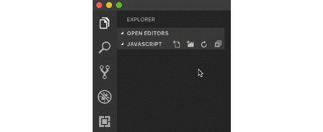

    图 2.10：当前项目不包含文件

1.  如果你将鼠标悬停在这个最左侧的区域，你会注意到项目名称右侧出现了一些图标。这些图标中最左边的一个允许创建新的文件。旁边的那个允许创建新的文件夹。点击`index.html`以查看新创建文件的扩展名。名称`index`告诉我们这个文件是我们项目的*根*或*索引*HTML 文件。`.html`扩展名通知我们和电脑这个文件的性质：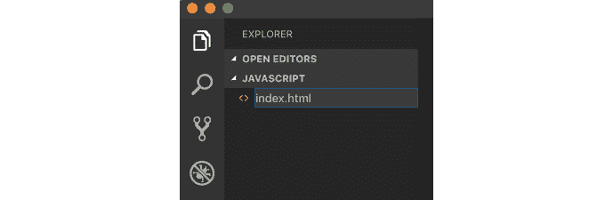

    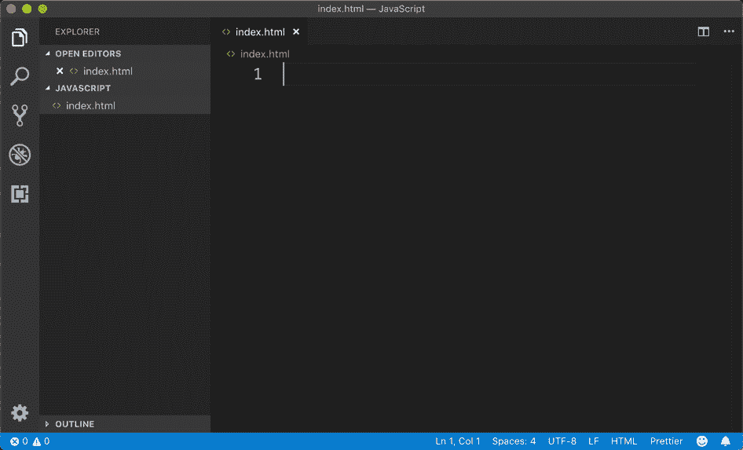

    ![图 2.13：文件存在且已打开，但它是空的 1.  输入以下样板 HTML 代码以设置文件的结构：    ```js    <!DOCTYPE html>    <html lang="en">      <head>        <meta charset="utf-8">        <title>JavaScript Project</title>      </head>      <body>        <h1>Just an HTML page...</h1>      </body>    </html>    ```1.  我们将文件声明为 HTML 并建立`<head>`标签和`<body>`标签。HTML 文档的头部包含不可见的数据，例如声明字符集和标题。HTML 文档的主体包含可见元素，如文本和图像。请注意，你必须使用**文件** | **保存**或通过使用*命令*/*Ctrl* + *S*来保存文件：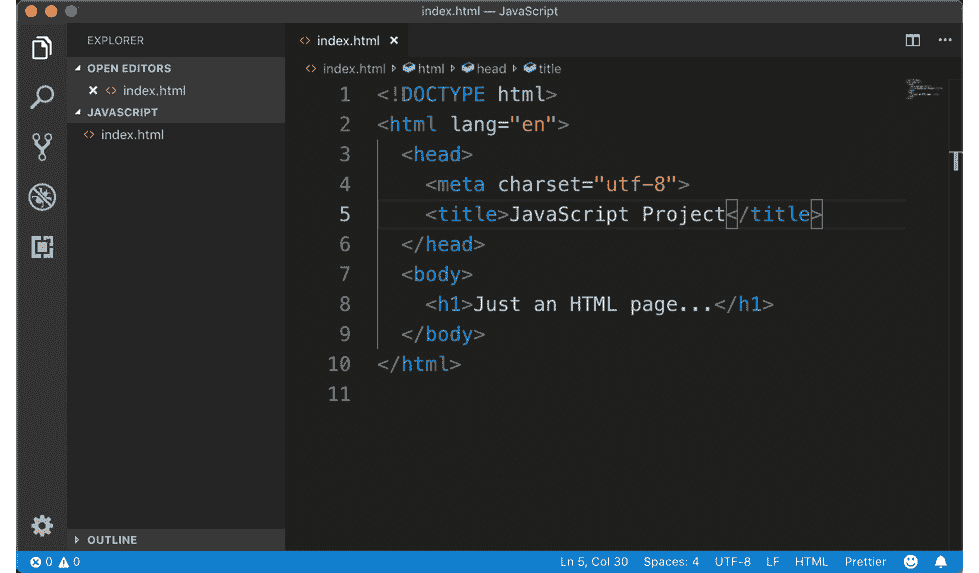

    ![图 2.14：我们的初始 HTML 标记结构 1.  再次创建一个新文件，这次命名为`app.js`。这将表明这是应用程序的主要 JavaScript 文件。`.js`文件扩展名表明这是一个外部 JavaScript 文件。1.  新的 JavaScript 文件将像 HTML 文件一样打开。正如你所看到的，它最初也是空的。输入以下 JavaScript 代码：    ```js    console.log("app.js JavaScript Included!");    ```1.  确保再次保存 JavaScript 文件，通过从应用程序菜单导航到`文件` | `保存`或使用键盘快捷键`命令`/`Ctrl` + `S`：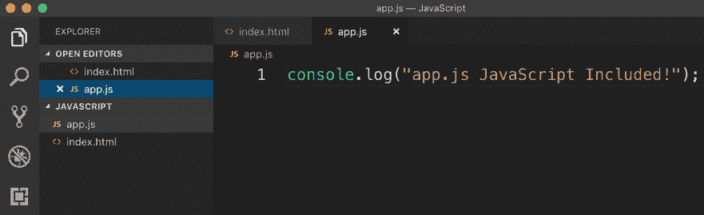

    ![图 2.15：你现在应该既有 JavaScript 文件也有 HTML 文件 1.  为了将新创建的 JavaScript 文件绑定到我们的 HTML 中，以便它可以在网页浏览器中运行，我们必须在 HTML 文件本身中引用它。切换到标题为`<title>`的 HTML 文件，并在`<head>`元素的关闭标签之前：    ```js    <script src="img/app.js"></script>    ```1.  `<script>`标签用于包含外部`.js`文件，就像我们在这里做的那样，或者它可以用来在 HTML 中直接表示一段 JavaScript 代码。完整的 HTML 文件代码现在应该如下所示：    ```js    <!DOCTYPE html>    <html lang="en">      <head>        <meta charset="utf-8">        <title>JavaScript Project</title>        <script src="img/app.js"></script>      </head>      <body>        <h1>Just an HTML page...</h1>      </body>    </html>    ```1.  在 HTML 中添加了新的一行代码后，再次保存文件。在 Visual Studio Code 中，项目资源管理器中的文件标签页中有一个小而满的圆盘表示有未保存的更改：

    ![图 2.16：有未保存更改的文件 1.  在网络浏览器中运行 `index.html` 文件。打开**开发者工具**并激活**控制台**视图。如果一切顺利，你将看到我们指示 JavaScript 输出的消息：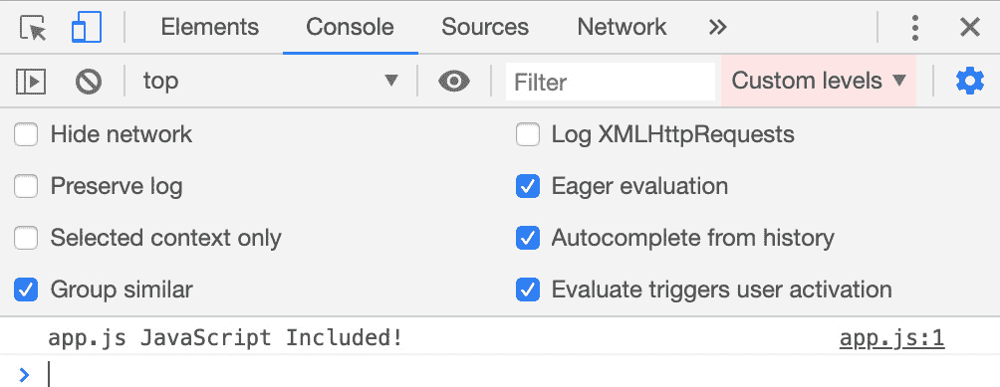

图 2.17：生成的控制台输出

我们现在知道我们的项目模板已经配置正确，因为 HTML 正在运行并且有效地调用了 JavaScript 文件中的代码。我们现在有了网络应用程序的起点——包括结构（HTML）和逻辑（JavaScript）组件。

## 基本 JavaScript 语法

了解任何编程语言的基本语法对于正确编写它来说非常重要。要开始编写 JavaScript，你需要知道如何声明变量、将数据赋给变量以及正确地终止命令。

JavaScript 中的变量是一个 `var` 关键字。以下是一个变量声明的例子：

```js
var myName;
```

要实际给这个变量赋值并让它做一些有用的事情，我们必须使用赋值运算符，`=`。以下是给变量赋值的相同语句：

```js
var myName = "Joseph";
```

注意

在这个例子中，我们正在将一个字符串值赋给变量。我们可以将许多不同类型的值或数据赋给变量，我们将在下一章中了解更多关于这些内容。

你会注意到，我们在每个变量声明后也放置了一个**分号**，无论我们是否给它赋值。虽然这样做并不是绝对必要的，但以这种方式使用分号可以终止一个命令。然而，多个命令应该放在多行中，如下所示：

```js
var firstName = "Joseph";
var lastName = "Labrecque";
console.log("Hello, " + firstName + " " + lastName);
```

我们将字符串值赋给 `firstName` 和 `lastName` 变量，然后使用 `console.log()` 方法以及一些使用 `+` 运算符的字符串连接来形成一个消息并将其输出到浏览器控制台。在浏览器中执行时，它看起来像这样：

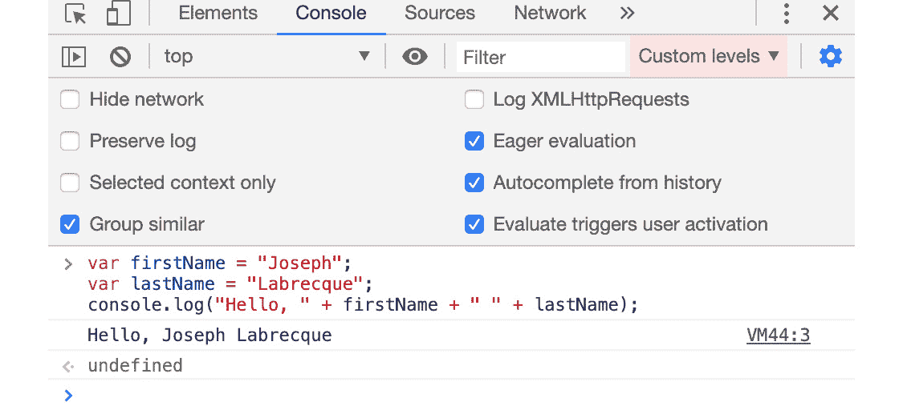

图 2.18：生成的输出信息

注意

术语**连接**简单地指的是将普通字符串和字符串变量值连接在一起，就像我们在这里所做的那样。

关于语法，你需要知道的就是这些，以开始学习。不用担心——当你到达第五章，即“超越基础”时，会有更多关于语法的详细信息。

## JavaScript 执行顺序

这一节在某种程度上回顾了上一章中的例子，说明了 JavaScript 可以在网页文档中的各种包含方式。这里有两种选择：要么在 HTML 文档的 `<head>` 标签或 `<body>` 标签中包含一个外部 JavaScript 文件，要么直接在文档本身中嵌入代码，同样在上述位置之一。

无论你如何在 HTML 文档中包含 JavaScript，网页浏览器都会从上到下执行。文档的`<head>`标签内的任何 JavaScript 都会在`<body>`标签内的任何内容之前执行。当然，你可以在函数中封装 JavaScript 代码块，以便在调用时执行，这实际上在某些方面绕过了这个规则。

## 练习 2.03：验证执行顺序

让我们进行一个小练习，看看对于任何 JavaScript，文档的`<head>`部分是否会先于`<body>`标签内的任何内容执行。让我们开始吧：

1.  在本章的练习文件中，你会找到一个名为`order.html`的文档。在 Visual Studio Code 中打开它，你会看到以下 HTML 代码：

    ```js
    <!doctype html>
    <html lang="en">
    <head>
        <meta charset="utf-8">
        <title>JavaScript Execution Order</title>
    </head>
    <body>
        <h1>JavaScript Execution Order</h1>
        <p>View the browser console to see the effective order of execution.</p>
    </body>
    </html>
    ```

1.  你会注意到目前还没有 JavaScript，所以让我们在这个演示中插入一些代码片段。在文档的`<head>`标签内的`<title>`元素下方添加以下代码：

    ```js
    <script>console.log('Within the HEAD');</script>
    ```

1.  现在，将此代码片段直接添加到文档的`<body>`标签内的`<h1>`元素上方：

    ```js
    <script>console.log('Within the BODY');</script>
    ```

1.  最后，我们在`<body>`标签关闭之前添加另一行代码：

    ```js
    <script>console.log('At the very END');</script>
    ```

    文档现在应该看起来像这样：

    ```js
    <!doctype html>
    <html lang="en">
    <head>
        <meta charset="utf-8">
        <title>JavaScript Execution Order</title>
        <script>console.log('Within the HEAD');</script>
    </head>
    <body>
        <script>console.log('Within the BODY');</script>
        <h1>JavaScript Execution Order</h1>
        <p>View the browser console to see the effective order of execution.</p>
        <script>console.log('At the very END');</script>
    </body>
    </html>
    ```

1.  在你的网页浏览器中运行此文档，同时打开开发者工具的控制台视图。你将能够验证，是的——代码确实是从上到下处理的，正如我们解释的那样：![图 2.19：执行顺序验证

    ![图 C14377_02_19.jpg]

图 2.19：执行顺序验证

JavaScript 中的`console.log()`命令会将括号内的任何数据写入控制台。这是调试 JavaScript 的最简单方法，尽管这将在下一章中进一步探讨。

在本节中，我们了解了几种关于 JavaScript 结构和语法的 重要基础，尤其是当涉及到网页浏览器环境时。

在下一节中，我们将探讨 JavaScript 可以运行的其它环境。

# JavaScript 环境概述

到目前为止，在我们的旅程中，我们只接触到了现代网页浏览器作为 JavaScript 运行时的角色，但即使在浏览器中，也有各种 JavaScript 引擎作为不同的 JavaScript 运行时。例如，Chrome 有**V8 引擎**，而 Firefox 通过**SpiderMonkey**运行 JavaScript。几乎每个浏览器都有自己的独特引擎。

除了基于浏览器的运行时之外，还有其他运行时。我们将查看我们现在可用的各种运行时。

## 基于浏览器的 JavaScript

在 JavaScript 作为语言的历史中，最常用的环境无疑是网页浏览器。我们已经对此特定的运行时谈了很多，所以我们将不会再次花时间讲解所有这些内容：

![图 2.20：V8——网页浏览器中的 JavaScript

![图 C14377_02_20.jpg]

图 2.20：V8——网页浏览器中的 JavaScript

使用网络浏览器作为 JavaScript 运行时的好处如下：

+   网络浏览器是世界上分布最广泛的软件平台之一。

+   浏览器包含一组内置的开发者工具，用于调试和监控 JavaScript。

+   浏览器是 JavaScript 以及所有其他语言的绝对主要运行时，其他所有运行时都跟随它。

您可以在各自网站了解每个浏览器运行时的更多信息。要了解更多关于 Chrome 背后的运行时引擎 V8 的信息，请访问[`v8.dev/`](https://v8.dev/)。

## 基于服务器的 JavaScript

随着网络浏览器中 JavaScript 引擎性能的提高，人们开始怀疑是否可能有其他应用场景和特定的运行时——特别是在基于服务器的环境中。2009 年，随着**Node.js**的创建，这一想法成为现实。在这之前的一年，谷歌开源了其强大的 V8 JavaScript 引擎。这使得开发者能够实现 V8，以及特定的操作系统绑定，从而产生 Node.js 的第一个版本：

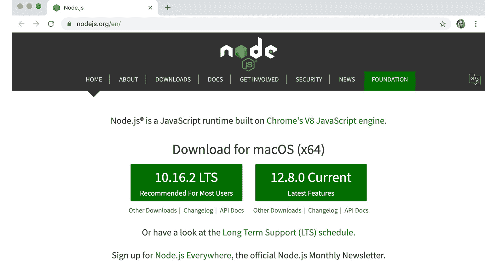

图 2.21：Node.js——服务器上的 JavaScript

使用基于服务器的 JavaScript 运行时的好处包括以下：

+   代码的无线程执行。

+   事件是完全非阻塞的。

+   效率和性能与客户端分离。

您可以在[`nodejs.org/`](https://nodejs.org/)了解更多关于 Node.js 的信息。

## 桌面 JavaScript

虽然不是 JavaScript 运行的新环境，但桌面应用程序是一个随着额外运行时和库成熟而成熟的增长领域。构建桌面应用程序最流行的解决方案是 Electron。类似于其他框架，当为 Electron 开发应用程序时，您将使用原生网络技术，这些技术最终会被封装在任何目标桌面操作系统上的原生关注容器中。

Electron 应用程序可以针对 Apple macOS、Microsoft Windows 或 Linux，并且都是内置 JavaScript：

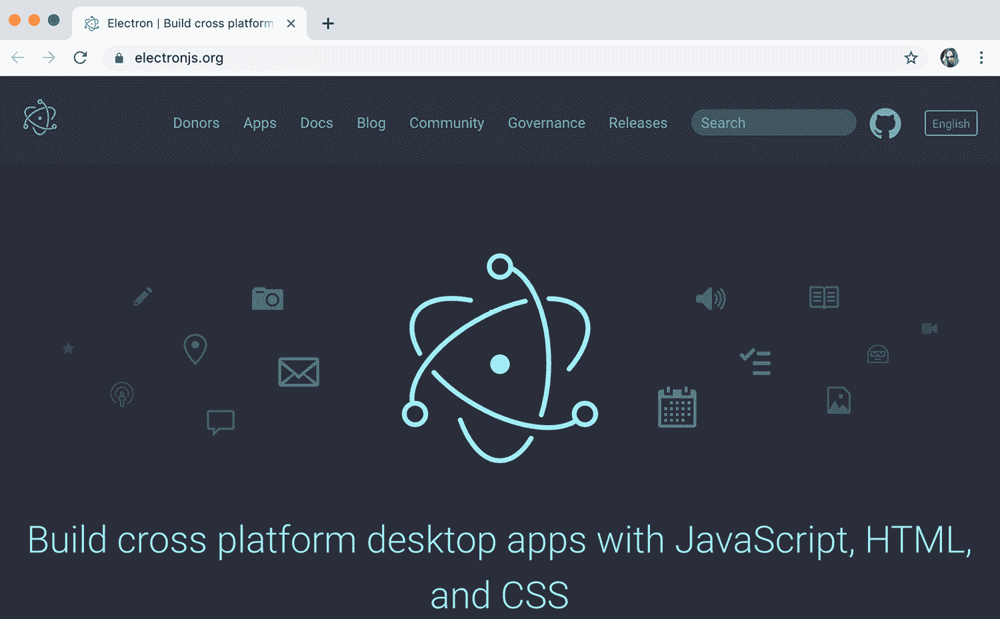

图 2.22：Electron——桌面上的 JavaScript

使用以桌面为中心的 JavaScript 运行时的好处包括以下：

+   能够使用原生网络技术编写桌面应用程序的能力。

+   大多数功能都是平台无关的，因此，通常不需要特定的操作系统命令。

您可以在[`electronjs.org/`](https://electronjs.org/)了解更多关于 Electron 的信息。

## 移动 JavaScript

自从 iPhone 和 Android 几年前首次亮相以来，移动设备已经变得非常庞大。当然，开发者们希望进入这个市场份额，幸运的是，多年来已经出现了很多相当不错的解决方案，这些解决方案利用了 JavaScript。在相当长的一段时间里，Apache Cordova 和 Adobe PhoneGap 是将网络技术转化为功能型移动应用的主要框架。最近，像 **Ionic** 这样的技术对于使用 Angular、React 和 Vue 等基于 JavaScript 的常见框架的人来说变得极其流行。使用许多这些工具，你还可以使用纯 JavaScript：

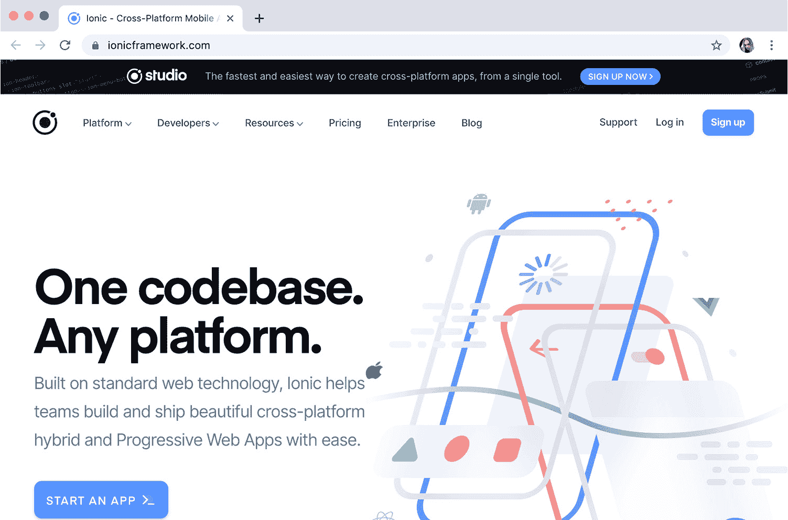

 上了解更多关于 Ionic 的信息。

到目前为止，我们已经简要概述了现代 JavaScript 的各种主要运行环境。

在下一节中，我们将再次关注我们在第一章中介绍的网络浏览器，同时更加关注它们工具中一些更有用视图的特定功能。

# 深入了解网页浏览器开发者工具

在上一章中，我们简要介绍了使用浏览器开发者工具的工作方式。我们将扩展我们对浏览器开发者工具的探索，并检查在网页浏览器中处理 JavaScript 时最常用的视图样本。

当然，还有许多其他视图和选项，这里没有提及，而且当我们从 Google Chrome 内部检查这些时，它们在整体外观和功能使用上会因浏览器而异。不过，这应该能给你一个很好的想法，无论你首选的浏览器是什么。

注意

要访问 Google Chrome 中的开发者工具，请按 `F12` 键。

## 元素视图

当你第一次探索浏览器开发者工具时，你可能会看到的主要视图很可能是元素视图。这个视图非常有用，因为它以非常结构化的方式展示了网页文档的所有元素以及相关的内容和属性。你还会注意到，在这个视图中，你可以探索各种样式和事件监听器。选择一个元素将显示 CSS 规则和任何相关的事件监听器：

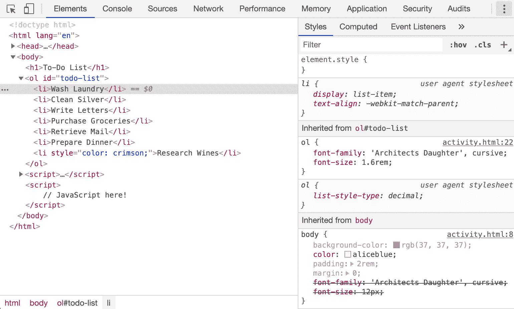

图 2.24：网页文档元素视图

虽然从 JavaScript 的角度来看，你可能认为在这个视图中没有显示任何有用的内容，但实际上你可以访问整个 **DOM** 结构，并可以监控这个结构和相关的属性，以验证和探索你通过代码所做的更改。

## 控制台视图

这是迄今为止我们互动最多的开发者工具视图，可能是编写和测试 JavaScript 代码时最重要的视图。任何错误和警告都将在此视图中显示，你还可以在代码在文档中执行时获取你想要的数据的输出。使用 JavaScript 方法 `console.log()` 将在控制台视图中显示各种有用的数据，供你探索，你甚至可以通过与视图本身相关的各种选项来定制显示的数据类型：

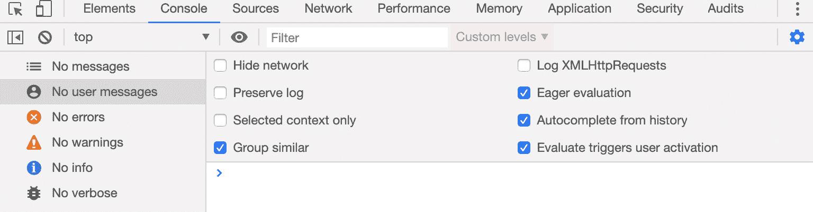

图 2.25：浏览器控制台输出

每个网络浏览器都有一个控制台视图，尽管不同浏览器中此视图的具体使用可能不同，但基本用法保持不变。

## 源视图

在任何类型的编程中，设置断点以有效地暂停代码执行并在特定状态下调试程序的能力是至关重要的。使用源视图，我们可以在网页浏览器本身内有效地做到这一点。

这个视图为我们提供了一种选择，可以查看当前运行的任何 HTML 或 JavaScript 文件的源代码，并在特定行设置断点，以便在遇到断点时使运行时暂停。一旦暂停，我们就可以使用源视图中的其他工具以某种方式检查我们的代码：

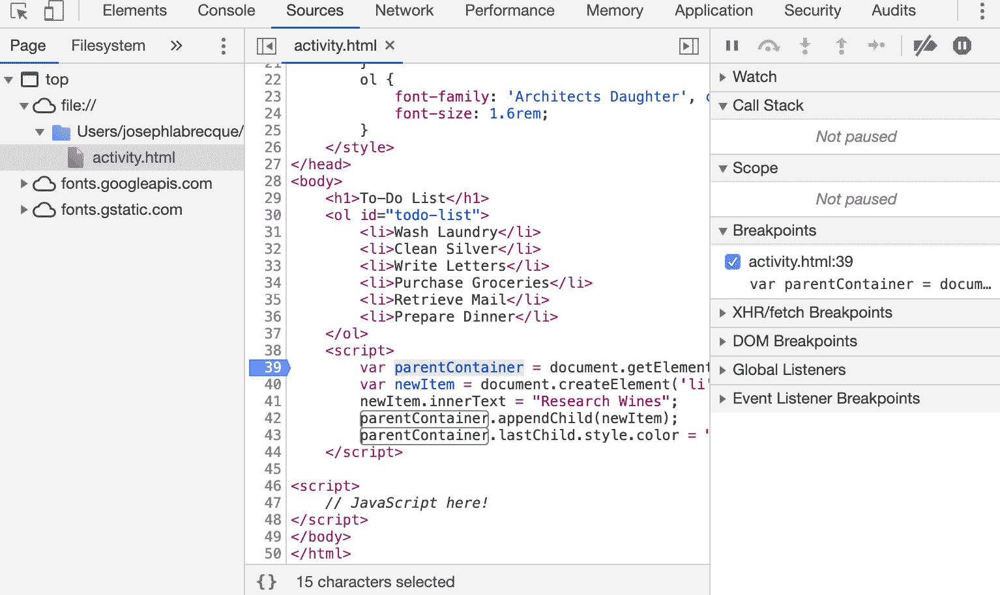

图 2.26：在网页浏览器中调试 JavaScript

在前面的屏幕截图中，我们在 HTML 文件的第 39 行设置了断点，该行包含嵌入的 JavaScript 代码。当代码执行暂停在此特定行时，我们可以非常详细地检查程序的状态。

## 网络视图

在我们继续之前，我们将查看的最后一个开发者工具视图是网络视图。这个视图允许你跟踪应用程序中传输的所有内容。HTML 文档、JavaScript 文件、CSS 文件，甚至是不可见的内容，如 **XMLHttpRequests (XHR)** 和其他幕后数据传输，都会在这里为你记录和测量，以便你检查。如果你想查看特定类型的网络活动并隐藏其他所有内容，顶部甚至有一个方便的过滤器：

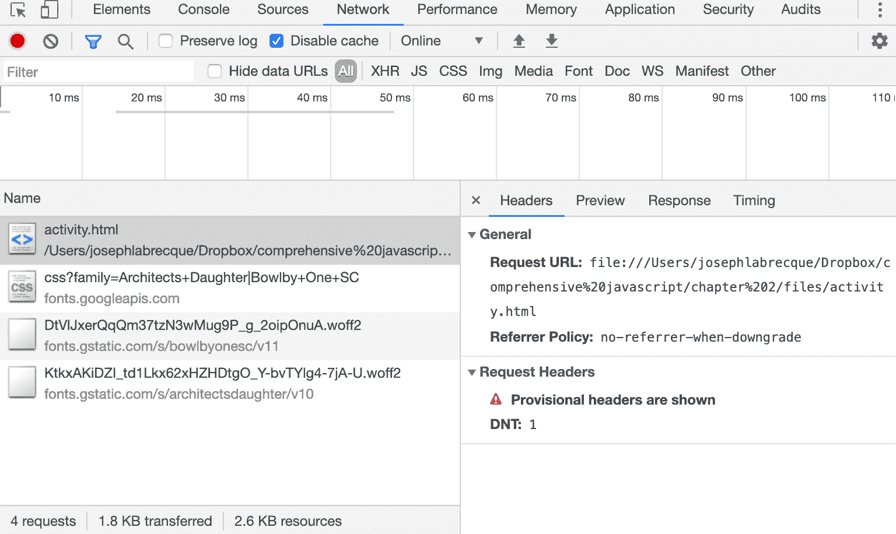

图 2.27：在网页浏览器中查看网络活动

你需要注意**网络**视图的一个重要方面是**禁用缓存**是一个工具选项。在测试程序时，如果你正在对外部加载的**.js**文件进行许多更改，禁用浏览器缓存是一个特别好的主意，因为它将防止这些文件在测试时被浏览器缓存。

在本节中，我们花了更多的时间熟悉一些网络浏览器开发者工具中的有用视图。

在下一节中，我们将查看一个实际操作活动，它允许通过 JavaScript 代码直接操作 HTML 元素及其属性。

# 使用 JavaScript 进行 HTML 元素操作

我们多次提到了 JavaScript 直接操作 HTML 文档中元素的能力。现在，我们将亲自看看这种语言是如何被利用来执行这种操作的。

在进行活动之前，有几个概念需要理解，这样你才知道 HTML 元素是如何工作的。正如你通过示例所看到的，HTML 中的元素通常由一个开始标签和一个结束标签组成，其中通常包含文本数据。如果你想到 HTML 中的`<p>`标签或段落元素，该元素内的文本，即在开始和结束标签之间，是显示给用户的文本。

如果我们需要定位一个特定的 HTML 元素来操作，使用`getElementById()` JavaScript 方法是最佳选择。当然，相关的元素必须包含一个 ID 属性，这样它才能按预期工作。

例如，我们可能有一个简单的 HTML 无序列表，其中包含一组三个列表项：

```js
<ul id="frameworks">
    <li>Angular</li>
    <li>Vue</li>
    <li>React</li>
</ul>
```

如果我们想通过代码来操作这个列表，我们可以用一些简单的 JavaScript 来实现。首先，我们必须存储对列表本身的引用。由于列表元素有一个值为`frameworks`的`id`属性，我们可以使用以下代码来存储对这个元素的引用：

```js
var frameworksList = document.getElementById('frameworks');
```

创建了引用后，我们现在可以轻松地创建和添加一个新的子元素：

```js
var newFramework = document.createElement('li');
newFramework.innerText = "Apache Royale";
frameworksList.appendChild(newFramework);
```

我们甚至可以调整新添加元素的样式属性：

```js
frameworksList.lastChild.style.color = "crimson";
```

`getElementById()`是一个 JavaScript 函数，它返回一个具有特定 ID 属性且与特定字符串完全匹配的元素。HTML 元素的 ID 属性必须是唯一的。

一旦我们通过使用`getElementById()`在 JavaScript 中获得了对任何元素的引用，我们就可以通过`children.length`子属性来获取其子元素的引用，并最终通过调用长度属性来获取存在的子元素数量。

此外，任何作为这些元素一部分定义的属性也可以用 JavaScript 代码来操作。在这个活动中，我们将调整`style`属性——实际上修改了特定元素内容的视觉外观。

在本节中，我们看到了如何使用纯 JavaScript 代码直接操作 HTML 元素及其相关属性。现在您应该对这种语言的能力有了一个很好的了解。

## 活动 2.01：向/在待办事项列表中添加和修改项目

在此活动中，我们将检查一个小型基于网页视图的起始部分，该视图旨在列出一系列待办事项。您需要为以下代码创建一些模板，这些代码目前是静态的 HTML 和 CSS，并带有占位符 `<script>` 标签。然后您需要向待办事项列表中添加一个项目“研究葡萄酒”，并将新添加的项目字体颜色改为猩红色。最后，您需要验证此代码的执行顺序。

此活动将有助于巩固 HTML、CSS 和 JavaScript 之间的联系。以下代码展示了 JavaScript 如何影响 HTML 节点的视觉显示样式，甚至影响其元素内容：

```js
activity.html
1 <!doctype html>
2 <html lang="en">
3 <head>
4     <meta charset="utf-8">
5     <title>To-Do List</title>
6     <link href=https://fonts.googleapis.com/css?family=Architects+Daughter|Bowlby+One+SC  rel="stylesheet">
7     <style>
8         body {
9             background-color:rgb(37, 37, 37);
10             color:aliceblue;
11             padding:2rem;
12             margin:0;
13             font-family: 'Architects Daughter', cursive;
14             font-size: 12px;
15         } 
The full code is available at: https://packt.live/2Xc9Y4o
```

此活动的步骤如下：

1.  您将自行创建 HTML 文件，并将前面的模板 HTML 代码粘贴进去以开始。此文件符合针对 HTML5 规范的标准 HTML 文档。它由 `<head>` 标签和 `<body>` 标签组成，并且 `<body>` 标签内部嵌套着用户在网页浏览器中可以看到的视觉元素和数据。此外，在此文件中，您将看到一组在 `<style>` 标签内的 CSS 样式规则，这些规则为视觉 HTML 元素提供了额外的特定颜色、字体和大小。CSS 引用了从远程 Google Fonts ([`fonts.google.com/`](https://fonts.google.com/)) 服务加载的额外样式字体信息。

1.  为我们的列表分配一个 ID，以便通过代码识别它。

1.  创建一个新的变量，并使用 ID 通过 `getElementById()` 方法直接引用此元素。

1.  创建一个新的 HTML 列表项元素。

1.  在列表项中填充一个数据值。

1.  通过将其附加到已存在的选择父容器中，将其添加到视觉文档中。

1.  改变现有元素的颜色。

1.  通过计算列表项的初始数量来验证我们命令的执行顺序。

1.  然后，在代码执行后，计算列表项的最终数量。

1.  刷新浏览器视图并观察控制台。

    注意

    此活动的解决方案可以在第 712 页找到。

# 摘要

在本章中，我们探讨了不同的流行 IDE 用于编写和维护 JavaScript 代码，并选择了 Visual Studio Code 作为本书此部分的默认编辑器。然后我们使用此编辑器来检查 JavaScript 文件结构、语法和项目管理任务。随后，我们对不同的 JavaScript 运行时环境进行了简要概述——从浏览器到桌面、远程服务器和移动设备。最后，我们更详细地了解了可用的各种网络浏览器开发者工具，并进行了允许操作 HTML 元素及其各种属性的活动的操作。

在下一章中，我们将探讨在 JavaScript 中工作时涉及的基本概念和结构，从对象类型到条件语句和循环结构的基础知识，如何编写和调用函数，甚至如何注释和调试代码。
