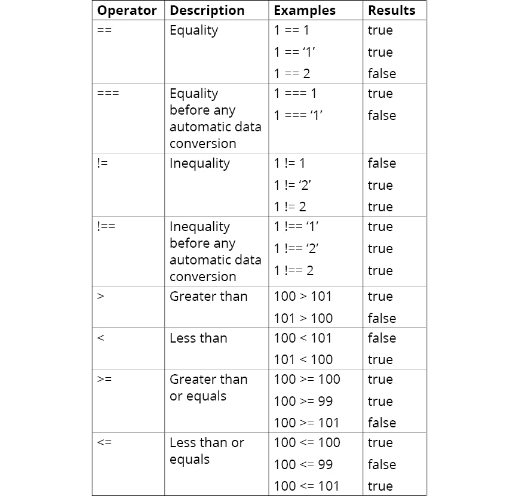

# 3. 编程基础

概述

到本章结束时，你将能够展示 JavaScript 的语法和结构；编写注释和调试代码；实现条件逻辑和循环；编写函数并在代码中调用它们；以及构建对用户输入做出反应并更新 DOM 的事件。

本章旨在介绍在 JavaScript（实际上，是编程的一般过程）中工作时涉及的基本概念和结构。

# 简介

在上一章中，你被介绍了一些流行的 JavaScript 工具和现代网络浏览器可用的各种执行代码的运行时。我们还探讨了网络浏览器的交互，并看到了如何使用**集成开发环境**（**IDE**）中的常见 JavaScript 函数来控制网络浏览器中元素的样式和内容。

你已经看到了大量的 JavaScript 代码；然而，理解每个函数的作用是任何优秀开发人员的关键技能。本章作为 JavaScript 编程中涉及的基本概念和结构的介绍，我们将涵盖所有基础知识，从对象类型到条件语句和循环结构，如何编写和调用函数，甚至注释和调试它们的代码。

从使用变量存储和计算数据到使用`if/else`语句对不同变量应用条件，本章将是你在 JavaScript 学习路径上最重要的垫脚石之一。对布尔值、字符串、对象、数组、函数、参数等的深入了解将提高你的开发技能。

# 数据类型

编程全部关于操作数据。数据可以代表诸如人名、温度、图像尺寸、磁盘存储量以及讨论组帖子上的总点赞数等值。

程序中的所有数据都有数据类型。在 JavaScript 中，你通常首先学习的使用的数据类型是数字、字符串、布尔值、对象、数组和函数。数字、字符串和布尔值数据类型代表单个值。对象代表更复杂的数据。函数用于编写程序。

一些常见的 JavaScript 数据类型及其用途和描述如下：

+   **数字**：任何正数或负数的整数，通常称为整数和浮点数，可以在数学运算中使用。它们用于产品价格、结账总额、帖子上的点赞数、圆周率几何值，也可以用作随机数。

+   **字符串**：任何一组有效的字符，这些字符不能或不应用于计算操作。它们用于对讨论帖子进行注释，可以是公司名称、街道地址、地点名称、账户号码、电话号码或邮政编码。

+   **布尔值**: 表示真和假的任何值。它用于检查表单是否可以提交，密码是否符合其所需的字符，订单余额是否符合免费运输条件，以及按钮是否可以点击。

+   **对象**: 一个无序的值集合，称为属性，以及代码，称为方法，它们旨在协同工作。它用于现实世界的对象，例如订单、秒表、时钟、日期或微波炉。它们也可以用于软件对象，例如网页文档、网页上的 HTML 元素、CSS 样式规则或 HTTP 请求。

+   **函数**: 一种特殊的数据类型对象，表示一段代码。代码可以使用可选的输入数据，并可选择返回数据。它们可以用于数据转换，如温度转换，在列表中查找值，更新 HTML 元素的样式，向网络服务器发送数据，在屏幕上显示消息，或检查有效数据输入格式，如电子邮件地址。

## 数据表示

程序中使用表达式来表示数据。如果你曾经使用过电子表格程序，那么表达式与单元格公式类似。表达式可以解析为表示特定数据类型的值。

表达式可以分解为更小的部分，如下所示：

+   文字值

+   运算符

+   变量

+   返回数据的函数

+   对象属性

+   返回数据的对象方法

学习表达式的良好起点是文字值、运算符和变量。函数和对象将在本章后面单独介绍，并且我们将通过它们在表达式中的使用来重新审视它们。

### 文字值

文字值写入到编程代码中。文字值是静态的。这意味着每次执行代码行时它们都有相同的值，并且不能更改。

文字数据需要根据其数据类型的规则进行格式化。数字、字符串和布尔值是一个良好的起点，这样我们就可以理解文字值的格式化。函数和对象文字将在后面的主题中介绍。以下是一些它们的类型及其规则以及每个有效和无效案例的示例：

+   `1000000`, `101`, `9.876`, 和 `-0.1234`。无效的例子包括 `1,000,000`, `$1000000`, 和 `1 000 000`。

+   `'ABC Company'`, `"Earth's Moon"`, `"She yelled \"duck\"!"`, `'She yelled "duck"!'` 等。无效的例子包括 `ABC Company` 和 `"She yelled "duck"!"`。

+   `true` 和 `false` 是有效示例，而无效的例子包括 `True`, `TRUE`, `FALSE`, 和 `False`。

### 在表达式中使用运算符

运算符用于执行算术、组合文本、进行逻辑比较以及将值赋给变量和属性。

我们所讨论的运算符可以按以下方式分组：

+   算术

+   字符串

+   分组

+   比较

+   逻辑

+   typeof

对于数学计算，我们使用算术运算符。字符串运算符允许我们将表达式的部分组合成一个字符串值。以下表格描述了某些算术运算符及其示例：


图 3.1：算术运算符

假设我们可以使用 `+`，这是连接运算符。它将非字符串数据类型转换为字符串。以下代码显示了三个单独的示例：

```js
"Blue" + "Moon"
"Blue" + " " + "Moon"
"$" + 100 * .10 + " discount"
```

每个示例的输出如下：

```js
"BlueMoon"
"Blue Moon"
"$10 discount"
```

表达式不是按从左到右的顺序进行评估的。相反，它们是根据预设的运算符顺序进行评估的，这被称为运算符优先级。例如，乘法运算符的优先级高于加法运算符。您可以使用分组运算符来覆盖运算符的优先级。它强制在评估表达式中的其余部分之前先评估它所包含的表达式。

例如，`()` 运算符控制表达式评估的优先级：

```js
1 + 2 * 3
(1 + 2) * 3
10 + 10 * 5 + 5
(10 + 10) * (5 + 5)
```

前述每个示例的输出如下：

```js
7 
9
65
100
```

比较数据是编程的重要组成部分。比较数据的结果要么是 true（真），要么是 false（假）。可以使用比较运算符（有时称为关系运算符）将表达式的一部分与另一部分进行比较。以下表格描述了某些比较运算符及其示例：



图 3.2：比较运算符

可以使用逻辑运算符比较表达式的多个部分。这些有时被称为布尔运算符。以下是一些布尔运算符及其描述和示例：


图 3.3：逻辑运算符

并非所有运算符都是符号。一个非常有用的运算符是 `typeof`。它以字符串形式显示数据类型。该运算符全部为小写字母。使用分组运算符来获取使用其他运算符的表达式的类型。

例如，`typeof` 运算符控制表达式评估的优先级：

```js
typeof 100
TypeOf 100
typeof "100"
typeof true
typeof (1 > 2)
typeof (2 + " dozen eggs")
```

前述每个示例的输出如下：

```js
number
Uncaught SyntaxError: …
boolean
boolean
string
string
```

注意

周围使用空格包围运算符是一个好的做法。例外情况是不在分组运算符 `( )` 和逻辑非运算符 `!` 前后使用空格。

## 练习 3.01：实现表达式和运算符

在这个练习中，您将交互式地将数字、字符串和比较表达式输入到网络浏览器控制台窗口中，并查看结果。让我们开始吧。在您的网络浏览器中打开 `data-expressions.html` 文档：

1.  使用您的网络浏览器打开开发者控制台窗口。

    在接下来的几个步骤中，我们将使用数字数据和算术运算符实现几个表达式。在以 `>` 符号开始的行上键入项目。控制台窗口将在以 `<` 符号开始的行上显示响应。

1.  编写以下代码来加两个字面整数值：

    ```js
    > 200 + 200
    \\output
    < 400
    ```

1.  编写以下代码来除以字面整数值：

    ```js
    > 1000 / 4
    \\Output
    < 250
    ```

1.  现在，编写以下代码来除以一个整数：

    ```js
    > 150.75 / 3
    \\Output
    < 50.25
    ```

1.  乘法有更高的运算符优先级，以下代码展示了这一点：

    ```js
    > 100 + 100 * 2
    \\Output
    < 300
    ```

1.  我们可以使用括号来改变运算符的优先级顺序，如下所示：

    ```js
    > (100 + 100) * 2
    \\Output
    < 400
    ```

1.  要显示实数的类型，我们可以使用`typeof`，如下所示：

    ```js
    >typeof 987.123
    \\Output
    < "number"
    ```

1.  让我们尝试以下命令：

    ```js
    > 123 456 789
    \\Output
    < Uncaught SyntaxError: Unexpected number
    ```

    输出是语法错误，因为您不能以这种格式（例如`123 456` `789`不被识别为数字，但`123456789`是）包含数字。

1.  我们可以使用`>`运算符来比较两个整数，如下所示：

    ```js
    > 100 > 200
    \\Output
    < false
    ```

1.  同样，我们可以使用`<`运算符来比较两个整数：

    ```js
    > 100 < 200
    \\Output
    < true
    ```

1.  现在，我们可以切换到处理字符串数据。让我们看看当我们使用双引号作为分隔符输入字面字符串时的输出：

    ```js
    > "Albert Einstein"
    \\Output
    < "Albert Einstein"
    ```

    下面的几个代码片段将展示使用字面字符串的不同示例。

1.  如果不使用分隔符使用字面字符串会导致错误，因为 JavaScript 无法识别此类输入：

    ```js
    > Albert Einstein
    \\Output
    < Uncaught SyntaxError: Unexpected identifier
    ```

1.  您可以使用双引号字面字符串。假设您想返回双引号内的语句。您可以将双引号放在单引号之间：

    ```js
    > 'The quote "The only source of knowledge is experience" is attributed to Albert Einstein'
    \\Output
    < The quote "The only source of knowledge is experience" is attributed to Albert Einstein
    ```

1.  使用`\`转义字符来使用分隔符。这将特殊字符转换为字符串字符：

    ```js
    > "The quote \"The only source of knowledge is experience\" is attributed to Albert Einstein"
    \\Output. Notice the escape character is removed.
    < The quote "The only source of knowledge is experience" is attributed to Albert Einstein
    ```

1.  没有分隔符的非数学数字，例如电话号码，将被转换为数字：

    ```js
    > 123-456-7890
    \\Output. Expression converted to number
    < -8223
    ```

1.  由于我们使用的是`""`，非数学数字，例如电话号码，将如下所示：

    ```js
    > "123-456-7890"
    \\Output
    < "123-456-7890"
    ```

1.  我们还可以将数字和字面字符串组合起来，如下所示：

    ```js
    > 100 - 10 + " Main Street"
    \\Output. 
    < "90 Main Street" 
    When string is in expression JavaScript attempts to convert all other elements to a string.
    ```

1.  我们可以使用`==`运算符来比较具有相同大小写的两个字符串：

    ```js
    > "Albert Einstein" == "Albert Einstein"
    \\Output
    < true
    ```

1.  现在，让我们尝试比较两个不同大小写的字符串：

    ```js
    > "Albert Einstein" == "ALBERT EINSTEIN"
    \\Output
    < false
    ```

1.  当我们使用`==`运算符比较具有相同数值的数字和字符串时，会发生数据类型转换。以下代码片段展示了这一点：

    ```js
    > 100 == "100"
    \\Output. Data type conversion takes place
    < true
    ```

1.  如果我们希望在比较之前不进行数据类型转换，我们需要使用`===`运算符，如下所示：

    ```js
    > 100 === "100"
    \\Output. No data type conversion
    < false
    ```

在前面的练习中，我们使用了几个运算符和表达式。这些运算符和表达式的实际应用案例会根据正在开发的应用类型而有所不同。然而，前面的练习是使用这些运算符在实际程序中的良好起点。请注意，到目前为止，我们使用的示例都是使用字面值。然而，在现实世界的应用中，情况可能并非总是如此。通常，在程序执行过程中，值会动态变化，在这种情况下，在表达式中使用变量变得不可避免。下一节将向您展示您如何在表达式中使用变量和常量。

### 在表达式中使用变量和常量

变量和常量是分配给值的符号名称。变量的值可以在分配后更改。分配给常量的值不能更改。变量和常量涉及以下项目：

+   声明关键字

+   名称

+   赋值运算符

+   表达式

+   数据类型

变量和常量需要使用`var`和`let`。对于常量，声明关键字是`const`。

变量和常量需要`=`。变量的数据类型是动态的，与表达式相同。

声明变量时不需要赋值。常量必须在声明时赋值。

看看以下声明变量但不赋值的示例：

```js
var firstName
var totalLikes
var errorMessage
var isSold
```

没有赋值的变量仍然有数据类型。这种数据类型被称为`typeof`运算符检测未定义的数据类型。

下面是一些声明变量并赋值的示例：

```js
var firstName = "Albert"
var totalLikes = 50
var errorMessage = "Something terrible happened"
var isSold = false
```

以下是一些将值赋给先前声明的变量的示例：

```js
firstName = "Marie"                         
totalLikes = 50
errorMessage = "Something terrible happened"
isSold = false
```

## 练习 3.02：使用网络浏览器控制台处理变量

在这个练习中，您将使用网络浏览器控制台窗口来处理变量。您将练习声明变量、赋值和检查它们的类型。让我们开始吧：

1.  在您的网络浏览器中使用[`packt.live/370myse`](https://packt.live/370myse)中的`variables.html`文件。

1.  使用您的网络浏览器打开开发者控制台窗口。

1.  将项目输入到以`>`符号开始的行上。控制台窗口将在以`<`符号开始的行上显示响应。

1.  声明一个名为`firstName`的变量：

    ```js
    > var firstName
    \\Value is expressed as undefined
    < undefined
    ```

1.  写出变量的数据类型：

    ```js
    >typeoffirstName
    \\Output
    < "undefined"
    This is expected as we have not defined our variable with any value.
    ```

1.  将字符串值`Albert`赋给`firstName`变量：

    ```js
    >firstName = "Albert"
    \\Output
    < "Albert"
    ```

1.  要找出输入的数据类型，使用`typeof`关键字，如下所示：

    ```js
    >typeoffirstName
    \\Output
    < "string"
    As expected, our input is correctly identified as beginning a string.
    ```

1.  要找出`firstName`变量所持有的值，我们只需编写以下代码：

    ```js
    >firstName
    \\Output
    < "Albert"
    Until now, we have used strings. In the next step, we will define a new variable and store a number value in it.
    ```

1.  声明一个变量并将其赋给一个数值表达式：

    ```js
    > var totalLikes = 50
    \\Output. Console may express value when declared but before assigned
    < undefined
    ```

1.  写出`totalLikes`的值：

    ```js
    >totalLikes
    \\Output
    < 50
    ```

1.  为了确定数据类型，我们再次使用`typeof`，如下所示：

    ```js
    >typeoftotalLikes
    < "number"
    ```

    到目前为止，我们还没有改变变量所持有的值。我们将在下一步中这样做。

1.  这是更改`totalLikes`所持值的代码：

    ```js
    >totalLikes = totalLikes + 1
    \\Output. New value is expressed
    < 51
    ```

    我们可以使用比较运算符`>`来比较变量所持有的值与参考值。这将在下一步中完成。

1.  使用以下代码比较`totalLikes`的值：

    ```js
    >totalLikes> 100
    < false
    ```

    结果显然是假的，因为`totalLikes`当前值为`51`。

    现在，让我们定义一个新的变量并使用布尔表达式。

1.  声明一个变量并将其赋给一个布尔表达式：

    ```js
    > var isSold = false
    \\Output. Console may express undefined data type when declared but before assigned.
    < undefined
    ```

1.  写出数据类型，如下所示：

    ```js
    >typeofisSold
    < "boolean"
    ```

现在，您已经交互式地与声明变量、为它们赋值以及在表达式中使用它们进行了工作。我们使用不同的输入定义了变量，如字符串、数字和布尔值。您还使用了`typeof`运算符来揭示变量的数据类型。现在，我们将继续到另一个重要主题——函数。

### 返回值的函数

函数可以被编写为返回一个值。在这种情况下，我们可以在表达式中使用它们。当我们使用一个函数时，它也被称作调用函数。

要在表达式中使用函数，您需要包含函数名，后跟括号。如果函数需要输入，它被放置在括号内作为有效的表达式。这些被称为参数。如果需要多个参数，它们用逗号分隔。

这些示例假设函数将返回一个值。

看看这个示例，它是关于表达不需要参数的函数的：

```js
getTotal() 
isLoggedIn()
```

这个示例展示了如何表达一个参数被表示为数字字面值的函数：

```js
getCelsiusFromFahrenheit(32)
```

这个示例展示了如何使用字面值表达具有多个参数的函数：

```js
getSearchResults("Pet Names", 25)
```

最后，这个示例展示了如何使用变量表达具有多个参数的函数：

```js
var amount = 100000
var decimals = 2
var decimalSeparator = "."
var thousandsSeparator = ","
formatCurrency(amount, decimals, decimalSeparator, thousandsSeparator)
```

当你在表达式中看到一个函数时，把它想象成代表一个值。

## 练习 3.03：在表达式中使用函数

在这个练习中，我们将使用一个预定义的函数，然后在表达式中使用它。这个练习将展示您如何调用、检查和返回数据类型，以及在表达式中使用函数。为了这个练习的目的，我们将使用定义为`getDiceRoll`的函数。让我们开始吧：

1.  在您的网络浏览器中打开`use-functions.html`文档。

1.  使用您的网络浏览器打开网页开发者工具中的`控制台窗口`。

    网页中有一个名为`getDiceRoll`的函数。它返回一个掷出的骰子的值。它有一个参数。这个参数允许你提供要掷的骰子数量。在以`>`符号开始的行上输入项目。控制台窗口将在以`<·`符号开始的行上显示响应。

1.  表达数据类型。请注意，没有括号的函数名被使用：

    ```js
    >typeofgetDiceRoll
    \\Expressed as a function type. It also assures us that there is a function.
    <·function
    ```

1.  表达返回值的数据类型。请注意，带有括号的函数名被使用：

    ```js
    >typeofgetDiceRoll()
    \\Function return value is a number. We do not see the actual value.
    <·"number"
    ```

1.  使用以下代码调用函数：

    ```js
    >getDiceRoll()
    \\Your value will be 1 to 6\. Repeat a few times.
    <·3
    ```

    我们也可以在数学表达式中调用函数。

1.  在数学表达式中调用该函数：

    ```js
    > 100 * getDiceRoll()
    \\Your value will be 100 to 600 Repeat a few times.
    <·300
    ```

    我们也可以在比较表达式中调用函数。

1.  在比较表达式中调用函数：

    ```js
    >getDiceRoll() == 4
    \\You may need to repeat a few times to get a true result.
    <·true
    ```

    到目前为止，我们还没有为我们的函数传递任何参数。然而，请记住，我们确实有这个选项，因为我们的函数被定义为接受单个参数。这个参数定义了将要掷的骰子数量。让我们在下一步尝试传递一个参数。

1.  调用并传递掷骰子数量的参数为 2：

    ```js
    >getDiceRoll(2)
    \\You will receive values from 2 to 12.
    <·11
    ```

函数对于 JavaScript 编程至关重要。为了让您入门，我们只展示了如何使用预定义的函数。您将在本章的后面学习如何编写自己的函数。然而，您可能会遇到需要使用已经创建的函数的场景。这个练习是一个很好的起点，向您展示如何做到这一点。

## 对象数据类型

JavaScript 是围绕对象数据设计的，因此理解它很重要。有一些 JavaScript 对象是为我们预先准备好的，您作为程序员将创建对象。在两种情况下，JavaScript 对象都是由 **属性** 和 **方法** 组成的：

属性：一个具有指定名称的值。它们一起通常被称为名称/值对。值可以是任何类型，即数据、数字、字符串、布尔值或对象。属性值可以动态更改。

方法：执行动作的函数。

### 预制对象

JavaScript 提供了一些预制对象，我们可以使用它们来帮助我们开始学习如何编程。JavaScript 中内置了许多有用的对象。网络浏览器提供了一组称为文档对象模型（DOM）的对象集合。

预制对象的例子如下：

+   `window` 是 DOM 中的一个对象。它能够访问网络浏览器的打开窗口。通常被认为是一个顶层 DOM 对象，包含其他由网络浏览器创建的对象作为其属性，它有设置计时器事件和打印的方法。

+   `console` 是 DOM 中的一个对象。它提供了向网络浏览器控制台窗口输出的能力。它也是窗口对象的一个属性。

+   `document` 是 DOM 中的一个对象。它能够访问网页的 HTML 元素、样式和内容。它也是窗口对象的一个属性。

+   `location` 是 DOM 中的一个对象。它包含有关当前 URL 的信息。它是窗口对象的一个属性。

+   `Math` 是一个内置对象。它包含数学常数，如 Pi，以及如舍入等函数。

+   `Date` 是一个内置对象。它提供日历日期和时间操作。

## 练习 3.04：使用预制对象

在这个练习中，我们将实验 JavaScript 在网络浏览器中可用的预制对象的属性和方法。我们将使用随机、舍入、向上取整和向下取整方法从预定义对象中调用数学对象。让我们开始吧：

1.  在您的网络浏览器中打开 `objects-ready-made.html` 文档。

1.  使用您的网络浏览器打开网页开发者控制台窗口。

1.  首先，我们将从网络浏览器文档对象开始。在以 `>` 符号开始的行上输入项目。控制台窗口将在以 `<·` 符号开始的行上显示响应。

1.  显示文档对象的标题属性：

    ```js
    >document.title
    \\Output
    << "JavaScript Data and Expression Practice | Packt Publishing"
    ```

1.  现在，显示文档对象的 `doctype` 属性：

    ```js
    >document.doctype
    \\Output
    <<!doctype html>
    ```

1.  显示文档对象的 `lastModified` 属性：

    ```js
    >document.lastModified
    \\Your output may have a different time and date value.
    < "09/09/2019 21:58:25"
    ```

1.  声明一个变量，并使用文档对象的 `getElementById` 方法将其赋值给 `HTMLElement` 对象变量：

    ```js
    > var pageHeadEle = document.getElementById('page-heading')
    \\Console may express undefined data type when declared but before assigned. 
    <·undefined
    ```

1.  显示 `pageHeadEleHTMLElement` 对象：

    ```js
    >pageHeadEle
    \\Output
    <<div id="page-heading" class="heading-section">
    <h1 class="center-text">JavaScript Data and Expression Practice</h1>
    </div>
    ```

1.  写入 `pageHeadEle object innerHTML` 属性：

    ```js
    >pageHeadEle.innerHTML
    \\Output
    <·"
    <h1 class="center-text">JavaScript Data and Expression Practice</h1>
      "
    ```

1.  现在，让我们看看 JavaScript 内置的 `Math` 对象。写入 `Math` 对象的 PI 属性：

    ```js
    >Math.PI
    \\Output
    < 3.141592653589793
    ```

1.  调用 `Math` 对象的 `random` 方法：

    ```js
    >Math.random()
    < 0.9857480203668554
    ```

    `Math.random()` 方法返回一个介于 `0` 和 `1` 之间的随机数，包括这两个数。每次调用都会返回不同的值。

1.  调用 `Math` 对象的 `random` 方法：

    ```js
    >Math.random()
    <·0.3588305599787365
    ```

1.  调用 `Math` 对象的 `random` 方法：

    ```js
    >Math.random()
    <·0.45663802022566413
    ```

1.  使用 `Math` 对象的 `round` 方法：

    ```js
    >Math.round(10.5)
    <·11
    ```

1.  使用 `Math` 对象的 `round` 方法：

    ```js
    >Math.round(10.4)
    <·10
    ```

    `Math.round()` 方法返回四舍五入到最接近整数的数字。

1.  使用 `Math` 对象的 `ceil` 方法：

    ```js
    >Math.ceil(10.5)
    <·11
    ```

    `Match.ceil()` 方法返回大于或等于给定参数的下一个最小整数值。

1.  使用 `Math` 对象的 `ceil` 方法：

    ```js
    >Math.ceil(10.4)
    <·11
    ```

1.  使用 `Math` 对象的 `floor` 方法：

    ```js
    >Math.floor(10.4)
    <·10
    ```

    `Math.floor()` 方法返回小于或等于给定参数的前一个最大整数值。

1.  使用 `Math` 对象的 `floor` 方法：

    ```js
    >Math.floor(10.6)
    <·10
    ```

1.  这是获取随机骰子值的表达式。floor 方法的参数是一个表达式，即 `Math.random() * 6`。其结果加 1：

    ```js
    >Math.floor(Math.random() * 6) + 1
    \\Output
    < 1
    ```

JavaScript 中有许多现成的对象可供使用。它们的使用方式与其他函数和变量类似，只是我们调用函数时使用方法，调用变量时使用属性。

### 自定义对象

在开发现实世界应用时，你经常需要创建对象。它们帮助你组织一组相互协作的数据和函数。想想你可能为计时器对象使用的属性和方法。

你可以看我们如何命名属性和方法如下：

+   `elapsedTime` 是一个数字类型的数据属性。它显示自计时开始以来经过的秒数。

+   `resultsHistory` 是一个对象类型的数据属性。它显示之前的计时列表。

+   `isTiming` 是一个布尔类型的数据属性。它显示其计时状态。

+   `isPaused` 是一个布尔类型的数据属性。它显示是否暂停的状态。

+   `start` 是一个函数类型的数据方法。它开始计时并将 `elapsedTime` 设置为 `0`。

+   `pause` 是一个函数类型的数据方法。它暂停计时。

+   `resume` 是一个函数类型的数据方法。它恢复计时。

+   `stop` 是一个函数类型的数据方法。它停止计时并将结果添加到 `resultsHistory`。

### 对象点表示法

要引用对象属性和方法，你使用点表示法。这是对象名称，后面跟着一个点，然后是属性或方法的名称。让我们以 `stopWatch` 对象为例：

```js
stopWatch.elapsedTime
stopWatch.start()
stopWatch.start()
stopWatch.stop()
```

方法名称后需要跟括号。如果方法需要数据输入，则数据放在括号内。

### 数组对象

数组是表示值列表的对象。列表中的每个项称为元素。要初始化数组，你可以将其设置为数组字面量。数组字面量是一组用方括号括起来的逗号分隔的表达式，如下所示：

```js
["Saab", "Ford", "BMW", "GM"]
```

数组中的元素可以是不同的数据类型。通常，所有元素都是相同的数据类型：

```js
["Milk", false, 123, document, "Gold", -.9876]
```

文字数组中的元素可以是表达式，但它们将被评估，并且只存储表达式的值：

```js
[price - cost, Math.random(), document.title, someVariable / 2]
```

变量和对象属性可以包含数组：

```js
let todoList = [
 "Wash Laundry",
 "Clean Silver",
 "Write Letters",
 "Purchase Groceries",
 "Retrieve Mail",
 "Prepare Dinner"
]
game.scores = [120, 175, 145, 200]
```

数组元素可以是数组：

```js
notes = [
 [
  "Wash Laundry",
  "Clean Silver",
  "Write Letters"
 ], 123, "999-999-9999"
]
```

具有有用属性和方法的数组对象如下：

+   `length` 是一个数字数据类型的属性，它显示数组中的项目数量。

+   `push` 是一个数字数据类型的方法，它将一个元素添加到数组的末尾并返回新的长度。

+   `unshift` 是一个数字数据类型的方法，它将一个元素添加到数组的开头并返回新的长度。

+   `shift` 是一个混合数据类型的方法，它移除第一个元素并返回被移除元素的值。

+   `pop` 是一个混合数据类型的方法，它移除最后一个元素并返回被移除元素的值。

+   `concat` 是一个函数数据类型的方法，它将两个或多个数组合并为一个新数组。

### 使用控制台对象

`console` 对象有一个名为 `log` 的方法，我们可以使用它来测试 JavaScript 程序中的表达式。它接受由逗号分隔的不限数量的表达式。我们输入到控制台窗口的所有表达式都将与 `console.log` 方法一起工作。它评估这些表达式，并在控制台中返回它们的结果。多个表达式由空格分隔。

在接下来的练习中，我们将使用 `console.log` 方法。让我们看看它的语法：

```js
console.log(expression 1[, expression 2][, expression n])
```

这里有一些 `console.log` 方法的示例：

```js
console.log("Odd number count started!");
console.log("Iteration:", i);
console.log("Number:", number);
console.log(oddsCount + " odd numbers found!");
console.log(document);
```

# 语法

程序遵循一组规则，这些规则定义了关键字、符号和结构。这被称为语法。我们已经学习了 JavaScript 中许多用于表示数据、变量和表达式的语法规则。你将需要命名对象、属性、方法、变量和函数。

以下是一组基本的规则和约定。约定是最佳实践的另一种说法。尽管不遵循约定不会导致你的代码出现问题，但它们可以使你的代码更难以理解，并且可能不被其他程序员接受，例如，他们可能在面试你时要求查看你的代码示例。

函数和变量的命名规则和约定如下：

+   26 个大小写字母（**A-Z, a-z**）。

+   任何字符但第一个字符可以是 10 个数字（**0-9**）之一。

+   没有空格、破折号或逗号。下划线（**_**）字符是可以接受的。

+   大小写遵循驼峰式命名法。这意味着所有字符都是小写，除了单词的首字母以及复合词名中的第一个单词的首字母。

+   没有 JavaScript 保留字；例如，你不能使用 `typeof`、`var`、`let` 和 `const`。

## 代码语句末尾的分号

一些编程语言要求每个可执行代码语句的末尾都要有一个分号 `;`。JavaScript 没有这个要求，除非你在 JavaScript 文件的同一行上有多个可执行代码语句。

在每个可执行代码语句的末尾要求分号 `;` 更多的是个人或开发团队的选择。由于分号字符 `;` 在其他语言中经常使用，程序员通常更喜欢在 JavaScript 中使用它们，这样他们就能养成使用它们的习惯，并且可以节省更多的时间来处理语法错误。如果你选择使用分号字符 `;`，那么请保持一致性。

## 代码行与语句

JavaScript 源文件中的每一行都不需要是单独的可执行代码行。你可以将一行可执行代码拆分成多个源文件行，或者在一个源文件行上放置多行可执行代码。这种灵活性允许你格式化代码，使其更容易阅读和编辑。

以下是一行使用单个源文件行的可执行代码：

```js
let todoList = ["Laundry", "Letters", "Groceries", "Mail", "Dinner"]
```

然而，使用多行源文件行可能更可取，如下所示：

```js
let todoList = [
 "Laundry",
 "Letters",
 "Groceries",
 "Mail",
 "Dinner"
]
```

如果你使用 `;` 在前一行代码之后，你可以在同一行上有超过一行代码：

```js
var bid = 10; checkBid(bid)l
```

你将了解到，当 JavaScript 文件准备发布时，你可以选择性地使用优化程序将源文件中的所有行压缩成一行。这样，行尾的不可见字符就被移除，使文件更小。

## 注释

你可以在代码中添加注释，因为它们在程序执行时会被忽略。注释可以帮助我们在未来记住代码的功能，并告知可能需要使用或与你的代码一起工作的其他程序员。

注释是防止代码在测试中执行的有用工具。例如，假设你有一行或多行代码没有按预期工作，你想尝试替代代码。当你尝试替代方案时，你可以对有问题的代码进行注释。

JavaScript 有内联注释，也称为单行注释。这使用双斜杠 `//`。当程序执行时，双斜杠之后直到行尾的所有文本都被忽略。

让我们看看一些内联注释的例子。以下注释解释了下一行代码：

```js
// Hide all result message elements
matchedMsgEle.style.display = 'none';
```

行尾的注释正在解释代码：

```js
let numberGuessed = parseInt(guessInputEle.value); // NaN or integer
```

JavaScript 有块级注释，也称为多行注释。这使用组合的斜杠星号字符来标记注释的开始，以及组合星号斜杠的反向来标记注释的结束。当程序执行时，`/*` 和 `*/` 之间的所有文本都被忽略。让我们看看各种块级注释。

以下是一个包含代码的多行块级注释。这段代码片段将不会被执行：

```js
/* This is a block comment.
It can span multiple lines in the file.
Code in a comment is ignored such as the next line.
var profit = revenue - cost;
 */
```

块级注释可以是文件中的一行：

```js
/* This is a block comment. */
```

以下是一个使用`JDoc`块注释为函数的示例：

```js
/**
 * Shuffles array elements
 * @param {array} sourceArray - Array to be shuffled.
 * @returns {array} - New array with shuffled items 
*/
function getNewShuffledArray(sourceArray){
   // Statements for function
}
```

也有一些工具使用语法从注释中生成你的代码文档（例如，JDoc）。这些工具读取你的源代码并生成你的代码文档指南。注释增加了网页的带宽，因此当你检查网页时，通常看不到源代码中的注释。这是因为，通常，原始的 JavaScript 文件并没有发布，而是发布了一个压缩版本。压缩 JavaScript 文件的工具会默认删除注释。注释对学习很有帮助。鼓励你在代码中添加注释，解释代码的功能。

# 条件和循环流程

JavaScript 中的语句按加载顺序顺序处理。这个顺序可以通过条件或循环代码语句来改变。控制语句的不同部分如下：

+   代码块 `{…}`

+   条件流程语句，如`if...else`、`switch`、`try catch finally`

+   循环语句，如`for`、`do...while`、`while`、`for...in`和`for...of`

+   其他控制语句，如`labeled`、`break`和`continue`

我们将在下一节中详细描述这些内容。

## 代码块

代码块是放置在开闭花括号之间的语句。其语法如下：

```js
//Code block     
{                
   //Statement   
   //Statement   
   //Statement   
}
```

代码块本身并不提供任何语句流程优势，直到你将它们与条件或循环语句结合使用。

## 条件流程语句

条件语句使用逻辑表达式从一组语句中选择要处理的语句。

### if...else 语句

`if`、`else...if`和`else`语句为你提供了四种选择或跳过代码块的结构。

### if 语句

`if`语句中的代码在表达式评估为`true`时处理，如果表达式评估为`false`则跳过。其语法如下：

```js
if(boolean expression){
   //Statement
   //Statement
   //Statement
}
if(boolean expression)
   //Single statement
```

这显示了`if`语句的流程。如果布尔表达式为`true`，则处理代码。如果为`false`，则跳过代码：


图 3.4：if 流程图

## 练习 3.05：编写 if 语句

在这个练习中，你将使用`if`语句测试 1 到 6 之间的偶数，并在你的网络浏览器控制台窗口中测试结果。让我们开始吧：

1.  在你的网络浏览器中打开`if-statement.html`文档。

1.  使用你的网络浏览器打开网页开发者控制台窗口。

1.  在你的代码编辑器中打开`if-statement.js`文档，将其所有内容替换为以下代码，然后保存：

    ```js
    var diceValue = Math.floor(Math.random() * 6) + 1;
    console.log("Dice value:", diceValue);
    if(diceValue % 2 != 0){
    console.log("Is an odd number.");
    }
    ```

1.  `Math.random()`函数随机生成一个从`1`到`6`的整数，并在控制台显示。在这里，`if`语句表明，如果数字除以二的余数不为零，即`diceValue % 2 != 0`，则`if`表达式为真，并在控制台显示`console.log()`消息。

1.  在你的网页浏览器中重新加载 `if-statement.html` 网页，同时打开控制台窗口。重复操作，直到你看到两个示例的版本：

    ```js
    // Example of output if the number is odd.
      Dice value: 3
      Is an odd number.
    // Example of output if the number is even.
      Dice value: 4
    ```

1.  使用加粗的行编辑 `if-statement.js` 文档，然后保存它：

    ```js
    var diceValue = Math.floor(Math.random() * 10) + 1;
    console.log("Dice value:", diceValue);
    console.log("Is an odd number.");
    }
    ```

    因为 `if` 语句中只有一行代码，所以不需要代码块括号。

1.  在你的网页浏览器中重新加载 `if-statement.html` 网页，同时打开控制台窗口。你应该期望得到相同的结果。

1.  编辑 `if-statement.js` 文档，将高亮行添加到 `console.log()` 并保存：

    ```js
    var diceValue = Math.floor(Math.random() * 6) + 1;
    console.log("Dice value:", diceValue);
    if(diceValue % 2 != 0)
    console.log("Is an odd number.");
    console.log('"You have to be odd to be number one", Dr. Seuss');
    ```

1.  在你的网页浏览器中重新加载 `if-statement.html` 网页，同时打开控制台窗口：

    ```js
    // Example of output if the number is odd.
      Dice value: 3
      Is an odd number.
      "You have to be odd to be number one", Dr. Seuss
    // Example of output if the number is even.
      Dice value: 2
    "You have to be odd to be number one", Dr. Seuss
    ```

    无论数字是偶数还是奇数，都会显示苏斯博士的引言。

1.  使用加粗的行编辑 `if-statement.js` 文档中的行并保存。我们在这里添加了代码块定界符：

    ```js
    console.log("Is an odd number.");
    console.log('"You have to be odd to be number one", Dr. Seuss');
    }
    ```

1.  在你的网页浏览器中重新加载 `if-statement.html` 网页，同时打开控制台窗口：

    ```js
    // Example of output if the number is odd. The Dr. Seuss quote is included when the value is an odd number.
      Dice value: 3
    Is an odd number.
    "You have to be odd to be number one", Dr. Seuss
    // Example of output if the number is even. The Dr. Seuss quote is skipped when the value is an even number.
      Dice value: 2
    ```

你可以看到根据 `if` 语句的逻辑表达式得到不同的结果。

### if 语句和 else 语句

你可以将一个 `if` 语句与一个 `else` 语句结合使用。如果表达式评估为 `true`，则处理 `if` 语句中的代码，并跳过 `else` 语句中的代码。如果表达式为 `false`，则发生相反的情况；也就是说，跳过 `if` 语句中的代码，并处理 `else` 语句中的代码。语法如下：

```js
if(boolean expression){
   //Statement
   //Statement
   //Statement
}else{
   //Statement
   //Statement
   //Statement
}
if(boolean expression)
   //Single statement
else
   //Single statement
```

`if...else` 的工作流程可以从以下流程图中看出：


图 3.5：if else 流程图

## 练习 3.06：编写 if...else 语句

在这个练习中，我们使用随机数来模拟抛硬币。随机值等于或大于 .5 表示正面，小于 .5 表示反面。我们将假设每个情况都需要多行语句。让我们开始吧：

1.  在你的网页浏览器中打开 `if-else-statements.html` 文档。

1.  使用你的网页浏览器打开开发者控制台窗口。

1.  在你的代码编辑器中打开 `if-else-statements.js` 文档，将其全部内容替换为以下代码，然后保存：

    ```js
      var tossValue = Math.random();
    console.log("Random toss value:", tossValue);
    if(tossValue>= .5){
      console.log("Heads");
    }
    ```

    `tossValue` 变量是一个从 0 到 1 的值，不包括 1。目前，仅使用一个 `else` 语句来表示正面投掷。

1.  在你的网页浏览器中重新加载 `if-else-statements.html` 网页，同时打开控制台窗口。重复操作，直到你看到两个示例的版本：

    ```js
    // Example of output if the number is .5 or greater.
    Random toss value: 0.8210720135035767
    Heads
    // Example of output if the number is less than .5\. 
    Random toss value: 0.4565522878478414
    //random()gives out a different value each time
    ```

    注意

    你得到的结果可能与这里展示的不同。

1.  编辑 `if-else-statements.js` 文档，添加以下加粗的代码，然后保存它：

    ```js
    if(tossValue>= .5){
      console.log("Heads");
    }else{
      console.log("Tails");
    }
    ```

    如果 `if` 语句表达式为 `true`，则处理其块中的语句，并跳过 `else` 块中的语句。如果 `if` 块表达式为 `false`，则只处理 `else` 块中的语句。

1.  在你的网页浏览器中重新加载 `if-else-statements.html` 网页，同时打开控制台窗口：

    ```js
    // Example of output if the number is .5 or greater.
    Random toss value: 0.9519471939452648
    Heads
    // Example of output if the number is less than .5\. 
    Random toss value: 0.07600044264786021
    Tails
    ```

再次强调，你将看到根据 if 语句的逻辑表达式产生不同的结果。考虑一下 if 语句如何处理屏幕上切换点赞图标的情况。

### 带有多个 else...if 语句的 if 语句

除了 if 语句外，你还可以有一个或多个`else...if`语句。每个 if 语句和每个 else...if 语句都有自己的表达式。如果第一个语句中的代码表达式评估为`true`，则进行处理，并跳过所有其他语句中的代码。如果没有表达式评估为`true`，则跳过所有代码语句。语法如下：

```js
if(boolean expression){
   //Statement
   //Statement
   //Statement
}else if(boolean expression){
   //Statement
   //Statement
   //Statement
}else if(boolean expression){
   //Statement
   //Statement
   //Statement
}
if(boolean expression)
   //Single statement
else if(boolean expression)
   //Single statement 
else if(boolean expression)
   //Single statement
```

以下流程图说明了除了 if 语句外，还包含一个或多个`else...if`语句。每个布尔表达式按遇到的顺序评估。如果第一个表达式为`true`，则处理代码，并跳转到最后一个 else...if 语句之后的代码：


图 3.6：if 和多个 else...if 流程图

### if 语句、多个 else...if 语句和 else 语句

可以在最后一个 else...if 语句之后有一个 else 语句。如果第一个语句中的代码表达式评估为`true`，则进行处理，并跳过所有其他语句中的代码。如果没有表达式评估为`true`，则处理 else 语句中的代码。语法如下：

```js
if(boolean expression){      
   //Statement
   //Statement
   //Statement
}else if(boolean expression){
   //Statement
   //Statement
   //Statement
}else if(boolean expression){
   //Statement
   //Statement
   //Statement
}else{
   //Statement
}
if(boolean expression)
   //Single statement
else if(boolean expression)
   //Single statement 
else if(boolean expression)
   //Single statement
else
   //Single statement
```

以下流程图说明了包含 else 语句、else if 语句和 if 语句的情况。如果所有布尔表达式都为假，则处理 else 块中的代码：


图 3.7：else 语句，以及 else...if 语句和 if 语句

## 练习 3.07：编写带有多个 if else 语句和 else 语句的 if 语句

在这个练习中，我们将构建一个简单的游戏，该游戏从 1 到 21（包括 21）生成四个随机游戏数字。其中一个是玩家的得分，一个是目标得分，一个是幸运得分，最后一个是不幸得分。玩家获得 20 倍于玩家得分的钱包。有五种可能的结果，每种结果都会给玩家的钱包分配不同的赢或输：

+   玩家的得分与幸运得分相同，而幸运得分和不幸得分不同。钱包增加的金额是幸运值加上玩家得分乘以`10`。

+   玩家的得分等于不幸得分，而幸运得分和不幸得分不同。钱包减少到零。

+   玩家的得分等于目标得分。钱包增加的金额是`21`与目标得分之差乘以`10`。

+   玩家的得分超过目标得分。钱包增加的金额是玩家得分与目标得分之差乘以`10`。

+   目标分数击败了玩家的分数。钱包减少目标分数与玩家分数之间的差值乘以`10`。

    完成步骤如下：

1.  在您的网络浏览器中打开`if-else-if-else-statements.html`文档。

1.  使用您的网络浏览器打开网页开发者`控制台窗口`。

1.  在您的代码编辑器中打开`if-else-if-else-statements.js`文档，将其全部内容替换为以下代码，然后保存：

    ```js
    var target = Math.floor(Math.random() * 21) + 1;
    var player = Math.floor(Math.random() * 21) + 1;
    console.log("Target score:", target);
    console.log("Player score:", player);
    if (player >= target){
     console.log("Player wins: beats target by " + (player - target));
    }else{
     console.log("Player loses: misses target by " + (target - player));
    }
    ```

    我们将首先使用`if`语句块匹配目标或超过它，即`if (player >= target)`。声明“玩家输：低于目标”的`else`语句块涵盖了低于目标的情况。

1.  在您的网络浏览器中打开控制台窗口，重新加载`if-else-if-else-statements.html`网页。重复此操作，直到您看到这三个示例的版本。

    玩家分数超过目标的示例如下：

    ```js
    Target score: 5
    Player score: 13
    Player wins: beats target by 8
    ```

    以下是玩家分数匹配目标的示例。在这种情况下，消息不支持该逻辑：

    ```js
    Target score: 14
    Player score: 14
    Player wins: beats target by 0
    ```

    目标分数超过玩家分数的示例如下：

    ```js
    Target score: 19
    Player score: 1
    Player loses: misses target by 18
    ```

    现在，我们可以添加一些代码来处理玩家匹配目标的情况。

1.  编辑`if-else-if-else-statements.js`文档，添加以下加粗代码，然后删除删除线代码并保存：

    ```js
    console.log("Player score:", player);
    if (player == target){
     console.log("Player wins: ties target " + target);
    }else if (player > target){
     console.log("Player wins: beats target by " + (player - target);
    }else{
    ```

    添加一个新的`if`语句块来处理玩家与目标平局的条件。原始的`if`语句块被替换为`else...if`语句块，该语句块仅测试玩家值超过目标的情况。

1.  在您的网络浏览器中打开控制台窗口，重新加载`if-else-if-else-statements.html`网页。重复此操作，直到您看到这三个示例的版本。

    玩家分数超过目标的示例如下：

    ```js
    Target score: 7
    Player score: 14
    Player wins: beats target by 7
    ```

    以下是一个玩家匹配目标的示例。在这种情况下，消息不支持该逻辑：

    ```js
    Target score: 3
    Player score: 3
    Player wins: ties target 3
    ```

    目标分数超过玩家分数的示例如下：

    ```js
    Target score: 10
    Player score: 5
    Player loses: misses target by 5
    ```

1.  编辑`if-else-if-else-statements.js`文档，使用以下加粗代码更新它，然后保存。

    为幸运数和不幸数添加了一个变量，并将它们输出到控制台，以便我们可以观察它们：

    ```js
    var target = Math.floor(Math.random() * 21) + 1;
    var player = Math.floor(Math.random() * 21) + 1;
    var lucky = Math.floor(Math.random() * 21) + 1;
    var unlucky = Math.floor(Math.random() * 21) + 1;
    console.log("Target score:", target);
    console.log("Player score:", player);
    console.log("Lucky score:", lucky);
    console.log("Unlucky score:", unlucky);
    ```

1.  接下来，当幸运值不等于不幸值且玩家值等于幸运值时，我们添加一个`if`语句块。使用逻辑`&&`运算符处理这两个必需的测试，两者都必须为真。

    此条件优先于其他获胜和失败条件的`if`语句，因此它需要在这些语句之前。添加以下加粗代码并删除删除线代码：

    ```js
    if (lucky != unlucky && player == lucky){
     console.log("Player wins: matches lucky score.");
    }else if (player == target){
     console.log("Player wins: ties target " + target);
    }
    ```

1.  我们还希望有一个条件，当幸运值不等于不幸值，且玩家值等于不幸值时。再次，使用逻辑`&&`运算符处理这两个必需的测试，两者都必须为真。

    此条件优先于其他获胜和失败条件的`if`语句，因此它需要在这些语句之前。插入以下加粗代码：

    ```js
    if (lucky != unlucky && player == lucky){
     console.log("Player wins: matches lucky score.");
    }else if (lucky != unlucky && player == unlucky){
     console.log("Player loses: matches unlucky score.");
    }else if (player == target){
    ```

1.  在你的网页浏览器中重新加载`if-else-if-else-statements.html`网页，同时打开控制台窗口。重复此操作，直到你看到这两个示例的版本。

    以下是一个玩家匹配幸运数字但未匹配不幸数字的示例：

    ```js
    Target score: 7
    Player score: 14
    Lucky score: 16
    Unlucky score: 20
    Player wins: matches lucky score
    ```

    以下是一个玩家匹配不幸数字但未匹配幸运数字的示例：

    ```js
    Target score: 4
    Player score: 9
    Lucky score: 3
    Unlucky score: 9
    Player loses: matches unlucky score.
    ```

1.  编辑`if-else-if-else-statements.js`文档，用以下加粗的代码更新它，然后保存。

    初始钱包值是玩家得分的`10`倍。它与其他游戏数据一起显示：

    ```js
    var unlucky = Math.floor(Math.random() * 21) + 1;
    var wallet = player * 20;
    console.log("Target score:", target);
    console.log("Unlucky score:", unlucky);
    console.log("Player initial wallet:", wallet);
    ```

    如果匹配到幸运数字，钱包将增加玩家的得分和幸运数字得分乘以`10`：

    ```js
    if (lucky != unlucky && player == lucky){
     console.log("Player wins: matches lucky score.");
     wallet += (lucky + player) * 10;
    ```

    如果匹配到不幸数字，钱包将减少到零：

    ```js
    }else if (lucky != unlucky && player == unlucky){
     console.log("Player loses: matches unlucky score.");
     wallet = 0;
    ```

    如果玩家的得分与目标得分相同，钱包将增加`21`与目标得分之间的差值：

    ```js
    }else if (player == target){
     console.log("Player wins: ties target " + target);
     wallet += (21 - target) * 10;
    ```

    如果玩家的得分超过目标得分，钱包将增加差值乘以`10`：

    ```js
    }else if (player > target){
     console.log("Player wins: beats target by " + (player - target));
     wallet += (player - target) * 10;
    ```

    `else`语句块将钱包减少到目标和玩家之间的差值。它绑定到`10`，但不低于零。

    在`if`、`if else`和`else`块语句之后，显示玩家的最终钱包：

    ```js
    }else{
     console.log("Player loses: misses target by " + (target - player));
     wallet = Math.max(0, wallet - (target - player) * 10);
    }
    console.log("Player final wallet:", wallet);
    ```

1.  在你的网页浏览器中重新加载`if-else-if-else-statements.html`网页，同时打开控制台窗口。重复此操作，直到你看到每个示例的版本。

    以下是一个目标得分超过玩家得分，并且从钱包扣除的金额超过钱包余额的示例。在这种情况下，钱包减少到零：

    ```js
    Target score: 4
    8 Player score: 1
    Lucky score: 6
    Unlucky score: 4
    Player initial wallet: 20
    Player loses: misses target by 3
    Players final wallet: 0
    ```

    以下是一个玩家得分超过目标得分的示例。钱包增加了超过目标得分的差值的`10`倍：

    ```js
    Target score: 10
    Player score: 18
    Lucky score: 21
    Unlucky score: 10
    Player initial wallet: 360
    Player wins: beats target by 8
    Players final wallet: 440
    ```

    以下是一个玩家得分匹配目标得分的示例。钱包增加了`21`与目标得分之间的差值的`10`倍：

    ```js
    Target score: 19
    Player score: 19
    Lucky score: 4
    Unlucky score: 7
    Player initial wallet: 380
    Player wins: ties target 19
    Players final wallet: 400
    ```

    以下是一个玩家匹配幸运数字但未匹配不幸数字的示例。钱包增加了玩家和目标乘以`10`：

    ```js
    Target score: 19
    Player score: 1
    Lucky score: 1
    Unlucky score: 7
    Player initial wallet: 20
    Player wins: matches lucky score.
    Players final wallet: 40
    ```

    以下是一个玩家匹配不幸数字但未匹配幸运数字的示例。钱包减少到`0`：

    ```js
    Target score: 8
    Player score: 13
    Lucky score: 10
    Unlucky score: 13
    Player initial wallet: 260
    Player loses: matches unlucky score.
    Players final wallet: 0
    ```

这是一个相当长的练习。它展示了多个具有不同逻辑表达式的`if`语句如何协同工作以产生一个结果。你可能会注意到逻辑表达式的顺序可以产生影响，因为在这种情况下，幸运和不幸的值需要在目标值表达式之前解决。改变顺序会产生一系列不同的结果。

### `break`语句

`break`语句用于循环语句和`switch`语句的块中。当在循环语句和`switch`语句的块中遇到`break`语句时，程序流程将继续在块的下一行继续。语法如下：

```js
break
break label
```

当它在一个带标签的语句块中使用时，需要使用第二种语法形式。你将在本章后面了解更多关于带标签语句的信息。接下来的练习将使用`break`语句。

### switch 语句

`switch`语句定义了一个由`case`语句和可选的`default`语句分隔的代码块。`case`语句后面跟着`switch`语句表达式的可能值，然后是一个冒号`:`。可选地，代码可以跟在`case`语句后面。`default`语句后面只跟一个冒号`:`。

它是如何工作的？`switch`语句的表达式被评估，然后处理第一个与`switch`语句表达式值匹配的`case`语句后面的代码，直到遇到`break`语句。然后，跳过任何剩余的代码。如果没有`case`语句的值匹配，并且存在`default`语句，则处理`default`语句后面的代码。否则，不处理任何代码。语法如下：

```js
switch(expression){
   case expression_value:      
      //Optional statement(s)   
      break; //optional        
   case expression_value:      
     //Optional statement(s)   
      break; //optional        
   default:      
      //Statement(s)            
}
```

以下是一个说明`switch`语句的流程图：


图 3.8：switch 语句流程图

## 练习 3.08：编写并测试 switch 语句

我们将通过模拟一个游戏来使用`switch`语句，玩家可以使用键盘移动他们的游戏棋子。他们可以用`A`键向左移动，用`S`键向右移动，用`W`键向上移动，用`Z`键向下移动。为了模拟从`keyNames`字符串中随机选择键（大写或小写），将使用一个变量。让我们开始吧：

1.  在您的网络浏览器中打开`switch-statement.html`文档。

1.  使用您的网络浏览器打开开发者控制台窗口。

1.  在您的代码编辑器中打开`switch-statement.js`文档，将其全部内容替换为以下代码，然后保存：

    ```js
    var keyNames = "WASDwasd";
    var keyName = keyNames.charAt(Math.floor(Math.random() * keyNames.length));
    console.log("keyName:", keyName);
    ```

    `Math.floor(Math.random() * keys.length)`表达式从`0`到`7`选择一个数字，然后由`charAt`使用该数字从`keyNames`字符串变量中选择字符。

1.  通过在您的网络浏览器中打开控制台窗口并重新加载`switch-statement.html`网页进行几次测试。您的结果将显示从`ADWSadws`字符中的选择。以下是一些控制台输出的示例：

    ```js
    keyName: a
    keyName: S
    ```

1.  编辑`switch-statement.js`文档，使其包含以下加粗的行，然后保存它。

    `switch`语句表达式如下：

    ```js
    console.log("keyName:", keyName); 
    switch (keyName.toLowerCase()){
    ```

    `switch`语句表达式将字符转换为小写，以便每个 case 语句可以检查一个值。在这里，我们正在检查 case 值是否等于 switch 项：

    ```js
     case "a":
      console.log("move left"); //This block will execute when break; // keyName is a
     case "d":
      console.log("move right");//This block will execute when break; // keyName is d
     case "w":
      console.log("move up");//This block will execute when break; // keyName is w
     case "s":
      console.log("move down");//This block will execute when break; // keyName is s

    }
    ```

    `switch`语句使用一个表达式，然后根据与 case 语句匹配的结果来确定要处理的代码行。需要注意的是，如果没有`break`语句，一旦一个 case 语句与表达式值匹配，就会处理`switch`语句末尾的所有代码。这当多个 case 语句使用相同的代码时可能是一个优点。`default`语句允许在没有任何 case 语句与表达式值匹配时处理的代码。然而，请记住，`default`语句不是必需的。在这个例子中，如果用户按错了键，什么也不会发生，这在游戏控制台中很常见。

1.  在您的网络浏览器中重新加载`switch-statement.html`网页，同时打开控制台窗口。以下是一些示例结果：

    ```js
    keyName: S
    move down
    keyName: d
    move right
    ```

    让我们使用`IJKL`键执行相同的任务。我们将使用`I`键向上，`J`键向左，`K`键向右，`M`键向下。

    编辑`switch-statement.js`文档，包括以下加粗的行并保存。

    首先，添加新的键字母：

    ```js
    var keyNames = "WASDwasdIJKMijkm"; 
    ```

    接下来，为每个添加 case 语句：

    ```js
     case "a":
     case "j":
      console.log("move left");
      break;
     case "d":
     case "k":
      console.log("move right");
      break;
     case "w":
     case "i":
      console.log("move up");
      break;
     case "s":
     case "m":
      console.log("move down");
      break;
    }
    ```

    如果 case 语句后面没有跟`break`，则也会处理下一个 case 语句的代码。

1.  在您的网络浏览器中重新加载`switch-statement.html`网页，同时打开控制台窗口。以下是一些示例结果：

    ```js
    keyName: J
    move left
    keyName: w
    move up
    ```

    模拟代码不会生成与`case`语句不匹配的任何键。如果有，整个`switch`语句将被跳过。`switch`语句可以通过使用`default`语句来处理其他情况。

1.  编辑`switch-statement.js`文档，包括以下加粗的行，然后保存。首先，让我们添加一些测试字符：

    ```js
    var keyNames = "WASDwasdIJKMijkmRTXPrtxp";
    ```

    接下来，让我们添加`default`语句：

    ```js
     case "m":
      console.log("move down");
      break;
     default:
      console.log("invalid key");
      break;
    }
    ```

1.  在您的网络浏览器中重新加载`switch-statement.html`网页，同时打开控制台窗口。重复此操作，直到您看到表示无效键的结果：

    ```js
    keyName: R
    invalid key
    ```

在这个练习中，如果用户按错了键，什么也不会发生，这在游戏控制台中很常见。

## 循环语句

循环代码块也被称为迭代块。它们被设计为在循环语句表达式变为 false 之前继续处理其块中的代码。迭代是一个术语，用来表示通过循环的一次。

注意

一个不会终止的循环被称为无限循环。网络浏览器可能会显示一个对话框，提供终止长时间运行的循环的选项。

### for 语句

`for`语句会重复执行代码，直到重复表达式变为`false`。其语法如下：

```js
for(initialize statement; repeat expression; post expression){
   //Statement
   //Statement
}
```

以下流程图描述了`for`语句的工作方式：


图 3.9：for 语句流程图

当第一次到达 `for` 语句时，会处理 `initialize` 语句。它通常设置一个在重复表达式中使用的变量。后表达式会改变重复表达式中的值。在循环中的最后一行代码处理完毕后，会处理后表达式，然后处理重复表达式。如果重复表达式仍然为真，则再次处理循环块中的第一个语句。后表达式通常使用称为增量（increment）和减量（decrement）的算术运算符以及赋值加法和减法运算符。以下是一些更多算术运算符的示例：


图 3.10：更多算术运算符

## 练习 3.09：编写并测试 for 循环

这个练习演示了使用 `for` 语句创建递增计数器和递减计数器。让我们开始吧：

1.  在你的网页浏览器中打开 `for-statement.html` 文档。

1.  使用你的网页浏览器打开开发者控制台窗口。

1.  在你的代码编辑器中打开 `for-statement.js` 文档，将其全部内容替换为以下代码，然后保存：

    ```js
    for(var i = 1; i<= 5; i++){
     console.log(i);
    }
    ```

    这个示例是一个递增计数器的循环。`initialize` 语句声明了 `i` 变量并将其赋值为 `1`。这是循环第一次迭代时的值。在循环结束时，会评估重复表达式，如果为真，则会处理循环之后的行。后表达式使用增量运算符在每次循环结束时增加 `i 1` 变量的值。

1.  在你的网页浏览器中打开 `for-statement.html` 网页，并确保 `控制台窗口` 是开启的。以下是一些结果：

    ```js
    1
    2
    3
    4
    5
    ```

1.  使用以下加粗的行编辑 `for-statement.js` 文档，然后保存它：

    ```js
    for(var i = 5; i>= 1; i--){
     console.log(i);
    }
    ```

    这个示例说明了递减计数器的循环。在这个例子中，后表达式使用减量运算符。重复表达式被修改为为真，直到 `i` 变量的值是 `1` 或更小。`initialize` 语句声明了 `i` 变量并将其设置为 `5`。

1.  在你的网页浏览器中打开 `for-statement.html` 网页，并确保控制台窗口是开启的。以下是一些结果：

    ```js
    5
    4
    3
    2
    1
    ```

1.  使用以下加粗的行编辑 `for-statement.js` 文档，然后保存它：

    ```js
    for(var i = 2; i<= 10; i+=2){
     console.log(i);
    }
    ```

    这个示例展示了使用加法赋值运算符创建一个递增计数器循环，每次增加 `2`，从 `2` 开始，到 `10` 结束。

1.  在你的网页浏览器中打开 `for-statement.html` 网页，并确保控制台窗口是开启的。以下是一些结果：

    ```js
    2
    4
    6
    8
    10
    ```

`for` 循环是用于重复执行代码的计数迭代的工作马。通过遍历数组，你会发现它的用途更加广泛。

### do...while 语句

`do...while`语句是一个循环，它会执行代码直到重复表达式的值变为假。重复表达式在所有语句处理完毕后评估，从而确保它们至少被处理一次。语法如下：

```js
do{
   //Statement
   //Statement
} while(repeat expression
do
   //Single statement
while(repeat expression)
```

如果你在其他地方使用分号（;），则需要在`while`行的末尾放置一个分号。

下面是`do…while`语句的流程图：


图 3.11：do...while 语句流程图

## 练习 3.10：编写 do...while 循环并测试它

在这个练习中，你将使用`do…while`循环来模拟两个骰子直到它们具有相同值时的迭代。让我们开始吧：

1.  在你的网络浏览器中打开`do-while-statements.html`文档。

1.  使用你的网络浏览器打开开发者控制台窗口。

1.  在你的代码编辑器中打开`do-while-statements.js`文档，将其所有内容替换为以下代码，然后保存：

    ```js
    do{
     var die1 = Math.floor(Math.random() * 6) + 1;
     var die2 = Math.floor(Math.random() * 6) + 1;
     console.log("Die 1:", die1, "Die 2:", die2);
    }while(die1 != die2);
    ```

    第二行和第三行各自计算一个`1`到`6`之间的随机数并将其存储在一个变量中。这些变量显示在第三行。这些行总是执行一次。如果`die1`和`die2`变量的值不相等，则`while`条件为真。如果值相等，表达式为假，循环重复。如果不相等，则处理`do…while`循环之后的任何语句。

1.  在你的网络浏览器中打开`do-while-statements.html`网页，并打开控制台窗口进行几次测试。由于随机值的不同，你的结果可能会有所不同。

    以下是一个多次迭代的示例结果：

    ```js
    Die 1: 1 Die 2: 3
    Die 1: 2 Die 2: 3
    Die 1: 3 Die 2: 4
    Die 1: 4 Die 2: 5
    Die 1: 3 Die 2: 3
    ```

    以下示例显示了单次迭代的输出。`do…while`循环语句总是逐个处理：

    ```js
    Die 1: 5 Die 2: 5
    ```

1.  编辑`do-while-statements.js`文档，使其包含以下加粗的行，然后保存：

    ```js
    let iterations = 0;
    do{
     iterations++;
     var die1 = Math.floor(Math.random() * 6) + 1;
     var die2 = Math.floor(Math.random() * 6) + 1;
     console.log("Die 1:", die1, "Die 2:", die2);
    }while(die1 != die2);
    console.log("The matched value is: ", die1);
    console.log("Number of iterations: ", iterations);
    ```

    第一行`let iterations`声明了一个名为 iterations 的变量并将其赋值为`0`。然后，在`do…while`循环中，iterations 变量`iterations++`增加`1`。循环结束后，匹配的值和 iterations 将被显示。

1.  在控制台窗口打开的情况下，通过重新加载`do-while-statements.html`网页进行几次测试。由于随机值的不同，你的结果可能会有所不同。

    以下是一个多次迭代的示例结果：

    ```js
    Die 1: 1 Die 2: 3
    Die 1: 2 Die 2: 3
    Die 1: 5 Die 2: 4
    Die 1: 3 Die 2: 1
    Die 1: 4 Die 2: 4 
    The matched value is:  4
    Number of iterations:  5
    ```

    以下是一个单次迭代的示例结果：

    ```js
    Die 1: 4 Die 2: 4
    The matched value is:  4
    Number of iterations:  1
    ```

### while 语句

`while`语句是一个循环，如果重复表达式是`true/false`，则会执行代码。重复表达式在执行任何代码之前评估，因此如果第一次评估为`false`，则可能不会处理任何代码。语法如下：

```js
while(repeat expression){
   //Statement
   //Statement
}
while (repeat expression)
   //Single statement
```

`while`语句的流程如下所示：


图 3.12：while 块中的代码语句

## 练习 3.11：编写 while 循环并测试它

在这个练习中，我们将使用 `while` 循环来模拟需要掷出偶数所需的骰子滚动次数。让我们开始吧：

1.  在您的网络浏览器中打开 `while-statement.html` 文档。

1.  使用您的网络浏览器打开开发者控制台窗口。

1.  在您的代码编辑器中打开 `while-statement.js` 文档，将其全部内容替换为以下代码，然后保存：

    ```js
    let iterations = 0;
    while (iterations <10){
     console.log("iterations:", iterations);
     iterations ++;
    }
    ```

    这只是一个重复 10 次的 `while` 循环的初始外壳。`while` 循环的重复表达式在 `iterations` 变量低于 `10` 的值时为真。第一次评估表达式时，`iterations` 变量为 `0`。在 `while` 循环内部，`iterations` 变量在第一行增加 `1`，并在每次循环迭代中从 `0` 增加到 `9`。

1.  在您的网络浏览器中打开 `while-statement.html` 网页，并打开控制台窗口。

    结果显示 `iterations` 变量从 `0` 增加到 `9`，共进行了 `10` 次迭代：

    ```js
    iterations: 0
    iterations: 1
    iterations: 2
    iterations: 3
    iterations: 4
    iterations: 5
    iterations: 6
    iterations: 7
    iterations: 8
    iterations: 9
    ```

1.  使用以下加粗的行编辑 `while-statement.js` 文档，然后保存。这将添加一行以显示每次迭代的骰子滚动：

    ```js
     die = Math.floor(Math.random() * 6) + 1;
     console.log("die:", die);
     iterations ++;
    ```

1.  在您的网络浏览器中打开控制台窗口，并重新加载 `while-statement.html` 网页。

1.  您将看到一个包含 10 个骰子值的列表。您的值可能会有所不同：

    ```js
    die: 2
    die: 5
    die: 2
    die: 4
    die: 2
    die: 3
    die: 4
    die: 2
    die: 6
    die: 1
    ```

1.  使用以下加粗的行编辑 `while-statement.js` 文档，然后保存。

    这将添加一个 `if` 块来测试骰子滚动的偶数。如果为 `true`，则 `break` 语句终止 `while` 循环，并处理其后的行。`while` 循环之后的两个行显示发生了多少次迭代以及那次迭代的骰子滚动值：

    ```js
    let die;
    while (iterations <10){
     die = Math.floor(Math.random() * 6) + 1;
     if (die % 2 == 0){
      break;
     }
     iterations ++;
    }
    console.log("Number of iterations: ", iterations + 1);
    console.log("Die value: ", die);
    ```

1.  通过在网络浏览器中打开控制台窗口并重新加载 `while-statement.html` 网页进行几次测试：

    ```js
    Number of iterations:  1
    Die value:  2
    ```

`while-loop` 使用布尔表达式来确定它包含的代码是否发生了任何迭代。在这种情况下，如果迭代变量大于 `10`，则不会发生任何迭代。

### for...in 语句

`for...in` 语句允许我们遍历对象数据类型。`for` 表达式中的变量持有对象名称值对中的一个名称，即对象的属性和方法名称。其语法如下：

```js
for (variable in object){
   //Statement
   //Statement
}
for (variable in object)
   //Single statement
```

您可以使用 `const`、`var` 或 `let` 声明变量。

## 练习 3.12：编写并测试 for...in 循环

这个练习将 for...in 循环应用于现成的 `location` 对象和程序员创建的对象。您可以通过使用它们来访问对象名称和值。让我们开始吧：

1.  在您的网络浏览器中打开 `for-in-statement.html` 文档。

1.  使用您的网络浏览器打开开发者控制台窗口。

1.  在您的代码编辑器中打开 `for-in-statement.js` 文档，将其全部内容替换为以下代码，然后保存：

    ```js
    for (let name in location) {
     console.log(name);
    };
    ```

    这会迭代网络浏览器创建的 `location` 对象。

1.  在您的网络浏览器中打开控制台窗口，并重新加载 `for-in-statement.html` 网页。

    以下输出显示了 `location` 对象的所有属性和方法名称：

    ```js
    replace
    href
    ancestorOrigins
    origin
    protocol
    host
    hostname
    port
    pathname
    search
    hash
    assign
    reload
    toString
    ```

1.  编辑 `for-in-statement.js` 文档，添加以下加粗文本，然后保存：

    ```js
    for (let name in location) {
     console.log(name, ":", location[name]);
    };
    ```

    这将添加属性或方法的值。

1.  在你的网页浏览器中打开控制台窗口，重新加载 `for-in-statement.html` 网页。假设网页是从本地文件文件夹打开的，而不是使用 http 或 https，则值可能会有所不同：

    ```js
    replace : ƒ () { [native code] }
    href : file://PATH_TO/for-in-statement.html
    ancestorOrigins :DOMStringList {length: 0}
    origin : file://
    protocol :
    host :
    hostname :
    port :
    ```

    pathname : /PATH_TO/for-in-statement.html

    ```js
    search :
    hash :
    assign : ƒ assign() { [native code] }
    reload : ƒ reload() { [native code] }
    toString : ƒ toString() { [native code] }
    ```

1.  编辑 `for-in-statement.js` 文档，将其替换为以下代码，然后保存：

    ```js
    var stopWatch = {
     elapsedTime: 0,
     resultsHistory: [],
     isTiming: true,
     isPaused: true,
     start: function(){console.log("start");},
     pause: function(){console.log("pause");},
     resume: function(){console.log("resume");},
     stop: function(){console.log("stop");}
    };
    ```

1.  在下面添加以下代码，以便我们可以遍历对象：

    ```js
    for (const name in stopWatch) {
     console.log(name, ":", stopWatch[name]);
    };
    ```

1.  在你的网页浏览器中打开控制台窗口，重新加载 `for-in-statement.html` 网页。

    以下是在控制台窗口中的输出示例：

    ```js
    elapsedTime : 0
    resultsHistory : []
    isTiming : true
    isPaused : true
    start : ƒ (){console.log("start");}
    pause : ƒ (){console.log("pause");}
    resume : ƒ (){console.log("resume");}
    stop : ƒ (){console.log("stop");}
    ```

当代码依赖于需要存在的特定属性或名称时，遍历对象的方法和属性可能会有所帮助。

### for...of 语句

`for...of` 语句关注可迭代的对象。并非所有对象都是可迭代的。虽然我们不会介绍如何创建自己的可迭代对象，但有一些现成的可迭代对象，你可能发现 `for∙∙∙of` 块很有用。其语法如下：

```js
for (variable of object){
   //Statement
   //Statement
}
for (variable of object)
   //Single statement
```

你可以使用 `const`、`var` 或 `let` 声明变量。

### 练习 3.13：编写一个 for...of 循环并测试它

本练习使用 `for...of` 语句，该语句是为可迭代对象设计的。你将学习一些对象可能不是可迭代对象，并生成错误。对于可迭代对象，我们使用数组和字符串。让我们开始吧：

1.  在你的网页浏览器中打开 `for-of-statement.html` 文档。

1.  使用你的网页浏览器打开开发者控制台窗口。

1.  在你的代码编辑器中打开 `for-of-statement.js` 文档，将其全部内容替换为以下代码，然后保存：

    ```js
    var stopWatch = {
     elapsedTime: 0,
     resultsHistory: [],
     isTiming: true,
     isPaused: true,
     start: function(){console.log("start");},
     pause: function(){console.log("pause");},
     resume: function(){console.log("resume");},
     stop: function(){console.log("stop");}
    };
    ```

1.  在下面添加以下代码，以便我们可以遍历对象：

    ```js
    for (let name of stopWatch) {
     console.log(name, ":", stopWatch[name]);
    };
    ```

1.  在你的网页浏览器中打开控制台窗口，重新加载 `for-of-statement.html` 网页。

    将会发生错误。我们需要对对象进行编码，使其可迭代才能使其工作；然而，我们目前并没有学习如何做到这一点：

    ```js
    Uncaught TypeError: stopWatch is not iterable
    ```

1.  在你的代码编辑器中编辑 `for-of-statement.js` 文档，将其全部内容替换为以下代码，然后保存。

    字符串最终被证明是可迭代的：

    ```js
    let anyString = 'abcxyz123';
    for (const value of anyString) {
     console.log(value);
    }
    ```

1.  在你的网页浏览器中打开控制台窗口，重新加载 `for-of-statement.html` 网页：

    ```js
    a
    b
    c
    x
    y
    z
    1
    2
    3
    ```

1.  在你的代码编辑器中编辑 `for-of-statement.js` 文档，按照以下代码中的加粗部分进行更改，然后保存。

    字符串最终被证明是可迭代的：

    ```js
    let anyString = 'abcxyz123';
    /*
    for (let value of anyString) {
     console.log(value);
    }
    */
    for (var i = 0; i<anyString.length; i++) {
     console.log(anyString.charAt(i));
    }
    ```

1.  在你的网页浏览器中打开控制台窗口，重新加载 `for-of-statement.html` 网页。你将得到相同的结果。`for of` 循环的优势在于它更加简洁：

    ```js
    a
    b
    c
    x
    y
    z
    1
    2
    3
    ```

1.  在你的代码编辑器中编辑 `for-of-statement.js` 文档，将其全部内容替换为以下代码，然后保存。

    数组是可迭代的：

    ```js
    let bowlingScores = [150, 160, 144, 190, 210, 185];
    for (const value of bowlingScores) {
     console.log(value);
    }
    ```

1.  在你的网络浏览器中重新加载`for-of-statement.html`网页，同时打开`console`窗口：

    ```js
    150
    160
    144
    190
    210
    185
    ```

1.  在你的代码编辑器中编辑`for-of-statement.js`文档，按照以下代码中加粗的部分进行更改，然后保存它。

    一个数组是可迭代的：

    ```js
    let bowlingScores = [150, 160, 144, 190, 210, 185];
    /*
    for (const value of bowlingScores) {
     console.log(value);
    }
    */
    for (var i = 0; i<bowlingScores.length; i++) {
     console.log(bowlingScores[i]);
    }
    ```

1.  在你的网络浏览器中重新加载`for-of-statement.html`网页，同时打开控制台窗口。你将得到相同的结果：

    ```js
    150
    160
    144
    190
    210
    185
    ```

当代码依赖于需要存在的特定属性或名称以使其工作的时候，遍历对象的方法和属性可能会有所帮助。

### `continue`语句

`continue`语句用于在循环或标记循环的当前迭代中停止执行，并开始执行下一个循环迭代。然后`loop`语句确定是否应该发生另一个迭代。语法如下：

```js
continue
continue label
```

第二种语法用于在标记语句块内使用。我们将在本章后面了解更多关于标记语句的内容。

### 标记语句

`Labeled`语句用于创建循环流程和条件流程。它命名`block`语句或`loop`语句。语法如下：

```js
label : {
   //Statement
   //Statement
}
label : loop statement
```

当`loop`语句被命名时，语句将在引用该标签的块内处理，直到遇到`break`语句或`continue`语句。

当遇到`break`语句时，程序流程将继续在由`break`语句引用的标记语句块之后的行上继续。如果遇到`continue`语句，程序流程将继续在由`continue`语句引用的块的第一行上继续。`continue`语句要求标记语句是一个循环。`break`语句和`continue`语句都必须出现在它们引用的标记语句块内。它们不能出现在它们引用的标记语句块之外。它们可以出现在嵌套的标记块中，并引用外部标记块。标记语句较少使用，因为它们容易造成混乱或难以理解的程序流程。

注意

避免或找到方法从代码中消除所有标记语句是一种良好的实践。条件语句和将代码划分为函数或对象方法是标记语句的替代方案。

让我们看看使用标记循环语句的一个示例。循环标记了`for`语句，它运行 10 次迭代。每次迭代生成一个从`1 到 12`的随机数。如果数字是偶数，则`continue`语句从`for`语句的开始处开始：

```js
console.log("Odd number count started!");
let oddsCount = 0;
odd_number:
 for (let i = 1; i<= 10; i++){
  console.log("Iteration:", i);
  var number = Math.floor(Math.random() * 12) + 1;
  if (number % 2 == 0){
   continue odd_number;
  }
  oddsCount ++;
  console.log("Number:", number);
 }
console.log(oddsCount + " odd numbers found!");
```

上述代码片段的输出如下：

```js
Odd number count started!
Iteration: 1
Iteration: 2
Iteration: 3
Iteration: 4
Number: 7
Iteration: 5
Iteration: 6
Number: 5
Iteration: 7
Iteration: 8
Iteration: 9
Number: 3
3 odd numbers found!
```

可以通过更好地使用`if`语句来消除标签，以实现相同的结果：

```js
console.log("Odd number count started!");
let oddsCount = 0;
for (let i = 1; i<= 10; i++){
 console.log("Iteration:", i);
 var number = Math.floor(Math.random() * 12) + 1;
 if (number % 2 != 0){
  oddsCount ++;
  console.log("Number:", number);
 }
}
console.log(oddsCount + " odd numbers found!");
```

输出相同，但值不同：

```js
Odd number count started!
Iteration: 1
Iteration: 2
Number: 9
Iteration: 3
Number: 5
Iteration: 4
Iteration: 5
Number: 5
Iteration: 6
Iteration: 7
Number: 9
Iteration: 8
Iteration: 9
Number: 1
Iteration: 10
Number: 7
6 odd numbers found!
```

# 编写和调用函数

函数是编写 JavaScript 程序的基本构建块。函数是一组可以可选接收数据输入并提供数据输出的语句。函数中的语句在函数被调用之前不会使用。调用函数也称为调用函数。

## 定义函数

JavaScript 提供了几种定义函数的方法。我们将探讨函数声明、函数表达式和箭头函数表达式作为定义函数的方式。

### 函数声明

你可以将函数定义为语句。这被称为函数定义或声明。其语法如下：

```js
function name(optional parameter list) {
   //Statements
   //Optional return statement
}
```

它以函数关键字开始一行代码。它后面跟着一个名称。名称是函数在其他代码中如何出现的方式。逗号分隔的参数列表是函数输入值的名称。参数是函数内部的变量。它们被括号包围。然后是包含代码的代码块。一旦声明了函数，它就可以通过单独的一行代码或表达式来调用。在其用作表达式的场合，函数通常返回数据。

当一个 JavaScript 函数被声明为一个语句时，它可以通过出现在它之前的语句来调用。这被称为提升。

让我们看看定义和调用函数声明的例子。这个例子没有参数，返回单次掷骰子的值：

```js
function getDiceRollValue(){
  return Math.floor(Math.random() * 6) + 1;
}
```

由于它返回一个值，我们可以将其用作表达式。以下是一个例子，其中它在加法表达式中使用，以获取两个骰子的滚动值：

```js
var rollValue = getDiceRollValue() + getDiceRollValue();
```

我们可以通过创建一个参数来改进函数，使其返回一组指定数量的骰子的值。在这里，参数是掷骰子的数量：

```js
function getDiceRoll(numberOfDice){
 var rollValue = 0;
 for (let i = 1; i<= numberOfDice; i++){
  rollValue += Math.floor(Math.random() * 6) + 1;
 }
 return rollValue;
}
```

调用模拟两次掷骰子的改进表达式只需要我们传递参数值。在这个例子中，参数被表示为一个数字字面量：

```js
var rollValue = getDiceRollValue(2);
```

在这个例子中，参数被表示为一个变量：

```js
var numberOfDice = 2;
var rollValue = getDiceRollValue(numberOfDice);
```

参数可以是可选的，否则可能会传递错误的数据。因此，函数通常有代码来验证参数或提供默认值。在这个例子中，JavaScript 内置函数 `parseInt` 的参数被用来将参数转换为整数。其结果使用内置函数 `isNaN` 进行测试，该函数在数字不是数字或数字小于 `1` 时返回 `true` 或 `false`。如果这些中的任何一个是真的，则参数值被设置为 `1`。如果不是，则提供的数字被传递：

```js
function getDiceRoll(numberOfDice){
 numberOfDice = (isNaN(parseInt(numberOfDice)) || numberOfDice< 1) ?1 :numberOfDice;
 var rollValue = 0;
 for (let i = 1; i<= numberOfDice; i++){
  rollValue += Math.floor(Math.random() * 6) + 1;
 }
 return rollValue;
}
```

现在，函数总是返回一个骰子的滚动值，无论参数是否错误或没有参数。在这两个例子中，都返回了一个骰子的滚动值：

```js
var rollValue = getDiceRoll();
var rollValue = getDiceRoll("BOGUS");
```

## 练习 3.14：将函数作为语句编写并调用它

本练习将定义一个函数作为语句，然后使用它。我们将创建的函数将接受一个参数并返回一个数组。如果参数可以验证为数字，则数组中的每个项目都有一个从 `0` 索引项开始的数字，该数字代表个位值，1 索引项代表十位值，依此类推。

我们将在本练习中使用 `console` 对象的 `log` 方法。记住，方法是一个属于对象的函数，因此它可以有参数。`log` 方法可以接受无限数量的参数。让我们开始吧：

1.  在你的网页浏览器中打开 `function-declare.html` 文档。

1.  使用你的网页浏览器打开网页开发者控制台窗口。

1.  在你的代码编辑器中打开 `function-declare.js` 文档，将其全部内容替换为以下代码，然后保存。

    这声明了函数。它的名字是 `getDigitsOfNumber`。它有一个名为 `num` 的参数。它返回 `digits` 数组：

    ```js
    function getDigitsOfNumber(num){
     var digits = [];
     console.log("num:", num);
     return digits;
    }
    ```

1.  在你的网页浏览器中打开 `function-declare.html` 网页，并确保控制台窗口已打开。

    没有输出，因为函数没有被调用。

1.  编辑 `function-declare.js` 文档，将以下加粗文本添加到文件末尾，然后保存。

    在这个例子中，函数被表达出来而没有被调用。调用一个函数需要在函数名周围添加括号：

    ```js
     return digits;
    } 
    console.log("getDigitsOfNumber:", getDigitsOfNumber);
    ```

1.  在你的网页浏览器中打开 `function-declare.html` 网页，并确保控制台窗口已打开。

    函数被当作数据来处理并显示：

    ```js
    getDigitsOfNumber: ƒ getDigitsOfNumber(num){
     var digits = [];
     console.log("num:", num);
     return digits;
    }
    ```

1.  编辑 `function-declare.js` 文档，使用以下加粗文本更新文件末尾，然后保存。

    这在赋值语句中调用函数以创建 `test456` 变量：

    ```js
     return digits;
    }
    var test456 = getDigitsOfNumber(456);
    console.log("test456:", test456);
    ```

    这将添加属性或方法的值。

1.  在你的网页浏览器中打开 `function-declare.html` 网页，并确保控制台窗口已打开。输出第一行显示了函数被调用时显示的 `num` 参数。第二行输出是 `test456` 变量被设置为函数返回的空数组：

    ```js
    num: 456
    test456: =>[]
    ```

1.  编辑 `function-declare.js` 文档，在文件开头添加以下加粗文本，然后保存。这显示了在声明之前调用函数。这演示了提升（hoisting）。

    ```js
    var test123 = getDigitsOfNumber(123);
    console.log("test123:", test123);
    function getDigitsOfNumber_1(num){
    ```

1.  在你的网页浏览器中打开 `function-declare.html` 网页，并确保控制台窗口已打开。这些是在函数声明前后调用的结果：

    ```js
    num: 123
    test123: =>[]
    num: 456
    test456: =>[]
    ```

1.  编辑 `function-declare.js` 文档，使用以下加粗文本更新它，然后保存。

    函数的第二行将任何负数转换为正数，并截断任何小数。`if`语句检查以确保`num`参数包含一个数字。`while`循环会一直重复，直到`num`参数变为零。在循环内部，通过除以 10 并使用余数将个位值添加到`digits`数组中。然后，从`num`参数中移除个位值：

    ```js
    function getDigitsOfNumber(num){
     var digits = [];
     num = Math.floor(Math.abs(num));
     if(!isNaN(num)){
      while(num != 0) {
       digits.push(num % 10);
       num = Math.floor(num / 10);
      }
     }
     return digits;
    }
    ```

1.  在控制台窗口打开的情况下，使用你的网络浏览器重新加载`function-declare.html`网页。

    每个数组显示了测试值数字拆分为数组。零数组索引有个位值，一数组索引有十位值，二索引位置有百位值：

    ```js
    test123: =>(3) [3, 2, 1]
    test456: =>(3) [6, 5, 4]
    ```

1.  编辑`function-declare.js`文档，将以下加粗文本添加到文件末尾，然后保存。你可以根据可能的输入和预期输出对函数进行各种测试。这里有一些供你尝试。

    没有使用中间变量来处理这些新行。函数可以在可以使用表达式的任何地方使用。在这些添加中，它被用作`log`方法参数的表达式：

    ```js
    var test456 = getDigitsOfNumber(456);
    console.log("test456:", test456);
    console.log('5:', getDigitsOfNumber(5));
    console.log('4563:', getDigitsOfNumber(4563));
    console.log('123.654:', getDigitsOfNumber(123.654));
    console.log('-123.654:', getDigitsOfNumber(-123.654));
    console.log('"1000"', getDigitsOfNumber("1000"));
    console.log('"1,000"', getDigitsOfNumber("1,000"));
    console.log('"B37"', getDigitsOfNumber("B37"));
    console.log('"37B"', getDigitsOfNumber("37B"));
    ```

1.  在控制台窗口打开的情况下，使用你的网络浏览器重新加载`function-declare.html`网页。

    这里是输出结果。预期结果应该是一个包含所有数字或空数组的数组。评估每个输出并验证这是否是结果。如果输出是空数组，确定原因：

    ```js
    test123: =>(3) [3, 2, 1]
    test456: =>(3) [6, 5, 4]
    5: =>[5]
    4563: =>(4) [3, 6, 5, 4]
    123.654: =>(3) [3, 2, 1]
    -123.654: =>(3) [3, 2, 1]
    "1000" =>(4) [0, 0, 0, 1]
    "1,000" =>[]
    "B37" =>[]
    "37B" =>[]
    ```

在这个练习中，我们定义了一个接受一个参数并返回数组的函数。在这个练习中，我们使用了`console`对象的`log`方法。

## 函数表达式

在这个变体中，你可以将函数作为表达式的一部分来定义。函数没有名称。然而，由于函数是一种数据类型，它可以被分配给变量。然后，可以使用变量来调用函数。语法如下：

```js
function(optional parameter list) {
   //Statements
   //Optional return statement
}
```

语法相同，只是不需要函数名称。作为表达式的 JavaScript 函数不能通过出现在它之前的语句来调用。

这里是一个定义和调用函数表达式的例子。

这个例子显示了函数作为赋值表达式的一部分。赋值表达式的右侧是没有名称的函数。左侧是变量：

```js
var getDiceValue = function(){
 return Math.floor(Math.random() * 6) + 1;
}
```

在这种情况下，变量可以用来调用函数：

```js
var rollValue = getDiceValue() + getDiceValue();
```

## 练习 3.15：将函数作为表达式编写并调用它

这个练习定义了一个作为表达式的函数，然后使用它。

函数从字符串中返回一个随机字符。字符串是函数的唯一参数。如果参数不是字符串或为空字符串，则返回空字符串。让我们开始吧：

1.  在你的网络浏览器中打开`function-expression.html`文档。

1.  使用你的网络浏览器打开开发者控制台窗口。

1.  在你的代码编辑器中打开`function-expression.js`文档，将其全部内容替换为以下代码，然后保存。

    函数作为一个字面量值，被分配给`getRandomStringCharacter`变量。

    然后，变量将在控制台中显示。记住，除非你包含括号，否则函数不会被调用：

    ```js
    var getRandomStringCharacter = function(source){
     var returnCharacter = '';
     console.log("source:", source);
     return returnCharacter;
    }
    console.log('getRandomStringCharacter', getRandomStringCharacter);
    ```

1.  在你的网页浏览器中打开控制台窗口后，重新加载`function-expression.html`网页。实际函数显示出来了，但并没有按照预期调用：

    ```js
    getRandomStringCharacter ƒ (source){
     var returnCharacter = '';
     console.log("source:", source);
     return returnCharacter;
    }
    ```

1.  编辑`function-expression.js`文档，更新以下加粗文本的行，然后保存。

    现在，我们将调用该函数：

    ```js
     return returnCharacter;
    }
    getRandomStringCharacter();
    getRandomStringCharacter("AEIOU");
    ```

1.  在你的网页浏览器中打开控制台窗口后，重新加载`function-expression.html`网页。

    函数中的`console.log`语句显示每次调用时的`source`参数值。第一次调用没有传递任何参数。`source`参数的数据类型是未定义的：

    ```js
    source: undefined
    source: AEIOU
    ```

1.  编辑`function-expression.js`文档，在函数上方添加以下加粗文本，然后保存。

    现在，我们将在函数定义之前调用该函数：

    ```js
    getRandomStringCharacter();
    var getRandomStringCharacter = function(source){
     var returnCharacter = '';
    ```

1.  在你的网页浏览器中打开控制台窗口后，重新加载`function-expression.html`网页。

    你应该在控制台中看到一个错误。定义为表达式的函数不能在定义之前调用：

    ```js
    Uncaught TypeError: getRandomStringCharacter is not a function
        at function-expression.js:1
    ```

1.  编辑`function-expression.js`文档，更新以下加粗文本，然后保存。

    我们可以移除在定义之前调用函数的行，完成函数的编码。`if`块测试源参数是否未定义且包含字符。在`if`块中，`Math.floor(Math.random() * source.length)`表达式找到一个随机字符位置，其值从 0 到`source`参数的长度减 1。`charAt`字符串方法提取该位置的字符，它将被返回：

    ```js
    var getRandomStringCharacter = function(source){
     if (source !=undefined &&source.length> 0){
      returnCharacter = source.charAt(Math.floor(Math.random() * source.length));
     }
     return returnCharacter;
    }
    ```

    这些行是一组对各种源值的测试。第一个没有传递参数。第二个、第三个和第四个传递了一个字符串。第五个传递了一个数字，最后一个传递了一个布尔值：

    ```js
    console.log('():', getRandomStringCharacter());
    console.log('("AEIOU"):', getRandomStringCharacter('AEIOU'));
    console.log('("JavaScript"):', getRandomStringCharacter('JavaScript'));
    console.log('("124678"):', getRandomStringCharacter('124678'));
    console.log('(124678):', getRandomStringCharacter(124678));
    console.log('(true):', getRandomStringCharacter(true));
    ```

1.  在你的网页浏览器中打开控制台窗口后，重新加载`function-expression.html`网页。

    函数的输出期望在源参数中有一个随机字符。如果它不为空，它将返回一个字符串，对于所有其他值将返回一个空字符串。重新加载网页几次以获取不同的测试结果：

    ```js
    (): 
    ("AEIOU"): U
    ("124678"): 6
    ("JavaScript"): a
    (124678): 
    (true):
    ```

### 箭头函数表达式

箭头函数是在 ES6 中引入的。它们在表达式中定义的方式类似，例如在定义函数表达式时。它们提供了比定义函数表达式更简洁的语法选择。它们的调用方式没有区别。`=>` 符号是定义箭头函数的明显标志。此外，不使用 `function` 关键字。简洁的变体，没有函数体，可以返回带有或不带有 `return` 语句的表达式。这与函数表达式不同，函数表达式需要 `return` 语句来返回值。语法如下：

```js
(optional parameter list) => {
   //Statements
   //Optional return statement
}
(optional parameter list) => //Expression or return statement
```

当只有一个参数被命名时，参数括号是可选的：

```js
parameter => {
   //Statements
   //Optional return statement
}
parameter => //Expression or return statement
```

如果没有参数，则需要括号：

```js
() => {
   //Statements
   //Optional return statement
}
() =>//Expression or return statement
```

JavaScript 箭头函数不能通过出现在其之前的语句来调用。

### 定义和调用箭头函数表达式

此示例展示了没有参数的单语句箭头函数。赋值右侧是未命名的函数。左侧是变量：

```js
var getDiceValue = ()=> Math.floor(Math.random() * 6) + 1;
```

在这种情况下，可以使用变量来调用函数：

```js
var rollValue = getDiceValue() + getDiceValue();
```

此示例展示了具有一个参数的多语句箭头函数。赋值右侧是未命名的函数。左侧是变量：

```js
var getDiceRoll = (numberOfDice) => {
 numberOfDice = (isNaN(parseInt(numberOfDice)) || numberOfDice< 1) ?1 :numberOfDice;
 var rollValue = 0;
 for (let i = 1; i<= numberOfDice; i++){
  rollValue += Math.floor(Math.random() * 6) + 1;
 }
 return rollValue;
}
```

以下是对函数进行调用并传递参数的输出：

```js
var rollValue = getDiceRoll(2);
```

## 练习 3.16：编写并调用箭头函数

此练习将向您展示如何将函数表达式转换为箭头函数。我们将使用的 JavaScript 文件已经包含该函数。让我们开始吧：

1.  在您的网页浏览器中打开 `function-arrow.html` 文档。

1.  使用您的网页浏览器打开开发者 `console window`。

1.  在您的网页浏览器中打开 `function-arrow.html` 网页，并确保 `console window` 已打开。

    第一个、倒数第二个和最后一个结果是空字符串。第二个、第三个和第四个结果显示了字符串中的一个随机字符：

    ```js
    (): 
    ("AEIOU"): U
    ("124678"): 6
    ("JavaScript"): a
    (124678): 
    (true):
    ```

1.  在您的代码编辑器中打开 `function-arrow.js` 文档，对加粗的行进行修改，然后保存：

    ```js
    var getRandomStringCharacter = (source) => {
     var returnCharacter = '';
     if (source !=undefined &&source.length> 0){
      returnCharacter = source.charAt(Math.floor(Math.random() * source.length);
     }
     return returnCharacter;
    }
    ```

1.  在您的网页浏览器中打开 `function-arrow.html` 网页，并确保 `console window` 已打开。

    结果是相同的。第一个、倒数第二个和最后一个结果是空字符串。第二个、第三个和第四个结果显示了字符串中的一个随机字符：

    ```js
    (): 
    ("AEIOU"): I
    ("124678"): 2
    ("JavaScript"): J
    (124678): 
    (true):
    ```

# 响应用户输入事件和更新 DOM

JavaScript 用于与 DOM 交互。这包括响应用户点击按钮等 DOM 生成的事件。它还包括更新内容和 HTML 元素，例如显示通知消息。

DOM 中的元素是对象。JavaScript 提供的 `document` 对象包含元素对象。它还包含访问和更新元素的方法。

## DOM HTML 元素对象

HTML 元素表示为对象。由于它们是对象，我们可以使用方法和属性来操作它们。这些属性和方法是从由网络浏览器提供的 DOM 对象层次结构中继承的，从名为`Node`的对象开始。例如，`ol`元素从以下 DOM 对象层次结构中共享方法和属性：

```js
Node⇒Element⇒HTMLElement⇒HTMLOListElement
```

不必了解所有涉及的对象，但了解它们是有好处的。最好了解一些从所有这些对象中派生出来的属性和方法。以下是从 DOM 元素的上层继承的一些属性和方法：

+   `innerHTML`: 使用源元素，这是元素中包含的 HTML 和内容。

+   `innerText`: 使用源`HTMLElement`，这是元素的渲染文本。

+   `addEventListener(`…`)`: 使用源元素事件目标，这用于注册一个函数以响应事件，例如用户点击元素。

+   `appendChild(`…`)`: 使用源节点，这向父节点添加一个节点；例如，将`li`元素添加到`ol`元素的末尾，或将`p`元素添加到`div`元素的末尾。

## 在 DOM 中获取元素访问权限

以下是一些`document`对象，它们包含我们可以用来从 DOM 中获取一个或多个`HTMLElemen`t 对象的方法：

+   `getElementById(element-id)`: 元素 ID 是元素的 ID 属性。返回一个`HTMLElement`对象。

+   `getElementsByTagName(element-name)`: 元素名称是 HTML 元素的静态名称，例如`body, div, p, footer, ol, 和 ul`。这返回一个`NodeList`对象。`NodeList`对象类似于对象数组。

+   `getElementsByClassName(css-class-name)`: CSS 类名称是元素的类属性。这返回一个`NodeList`对象。`NodeList`对象类似于对象数组。

+   `querySelector(selectors)`: 选择器类似于在 CSS 中使用的选择器。这返回一个匹配的第一个元素的`HTMLElement`对象。

+   `querySelectorAll(selectors)`: 选择器类似于在 CSS 中使用的选择器。这返回一个`NodeList`对象。`NodeList`对象类似于匹配的每个元素的数组。

+   `createElement(tag name)`: 这为提供的 HTML 标签名称创建一个`HTMLElement`对象。

+   `createTextNode(data)`: 这创建一个可以放置在 HTML 元素内部的`Text`对象，例如，在`h1`或`p`元素内部。数据参数是一个字符串。

以下是一个使用`document`对象的`getElementById`方法来访问 DOM 元素的示例。这从一个具有`id`属性为`user-id`的元素 DOM 创建了一个对象：

```js
let userIdEle = getElementById("user-id");
```

这是一个使用 `document` 对象的 `getElementByTagName` 方法来访问 DOM 元素的例子。这创建了一个代表文档中所有 `div` 元素的集合。需要进一步步骤来访问每个元素，例如使用循环：

```js
let divEles = getElementByTagName("div");
```

这创建了一个代表文档中所有使用 `notice` 类的元素的集合。需要进一步步骤来访问每个元素，例如使用循环：

```js
let noticeEles = getElementByClassName("notice");
```

这是一个使用 `document` 对象的 `getElementByClassName` 方法来访问 DOM 元素的例子。这创建了一个代表文档中所有使用 `notice` 类的元素的集合。需要进一步步骤来访问每个元素，例如使用循环：

```js
let noticeEles = getElementByClassName("notice");
```

## 在 DOM 中创建元素和内容

您可能希望 JavaScript 向网页添加 HTML 元素和内容。这是通过更新 DOM 来完成的。`document` 对象有两个用于此的有用方法：

+   `createElement(tag name)`: 为提供的 HTML 标签名创建一个 `HTMLElement` 对象。

+   `createTextNode(data)`: 创建一个可以放置在 HTML 元素内部的文本对象，例如，在 `h1` 或 `p` 元素内部。数据参数是一个字符串。

以下是一个使用 `document` 对象的 `createElement` 方法创建 `li` 元素的例子：

```js
let liEle = document.createElement("li");
```

以下是一个使用 `document` 对象的 `createTextNode` 方法创建 `Milk Moon` 元素的例子：

```js
let elementTextNode = document.createTextNode("Milk Moon");
```

将所有这些放在一起，我们可以将元素和文本节点添加到 DOM 中。考虑以下 HTML 列表，列出 11 月的满月名称：

```js
<ul>
 <li>Flower Moon</li>
 <li>Planting Moon</li>
/ul>
```

假设我们想要将另一个 `li` 元素添加到牛奶月。为此，我们使用 `document` 对象的 `createElement` 方法创建一个 `li` 元素：

```js
let liEle = document.createElement("li");
```

`createElement` 方法返回一个 `HTMLElement` 对象。它提供了 `appendChild` 方法，我们可以在这种情况下使用它。对于 `appendChild` 方法的参数，`document` 对象的 `createTextNode` 方法可以提供所需的文本节点：

```js
liEle.appendChild(document.createTextNode("Milk Moon"));
```

最终生成的 DOM 如下所示：

```js
<ul>
 <li>Flower Moon</li>
 <li>Planting Moon</li>
 <li>Milk Moon</li>
</ul>
```

让我们更进一步，并假设我们有一个包含满月名称的数组：

```js
let mayMoons = [
 "Flower Moon",
 "Planting Moon",
 "Milk Moon"
];
```

现在，我们想要使用数组来填充具有 `id` 属性为 `full-moons` 的 `ul` 元素：

```js
<ul id ="full-moons">
 <li>Grass Moon</li>
 <li>Egg Moon</li>
 <li>Pink Moon</li>
</ul>
```

首先，你可能想要从 `ul` 元素中移除现有的 `li` 元素。你可以通过使用 `document.getElementById` 方法以及元素的 `innerHTML` 属性来完成这个操作：

```js
let moonsEle = document.getElementById("full-moons");
moonsEle.innerHTML = "";
```

接下来，我们可以遍历数组，将 `li` 元素添加到月球名称中：

```js
for (let i= 0; i<= mayMoons.length - 1; i++){
 let liEle = document.createElement("li");
 liEle.appendChild(document.createTextNode(mayMoons.length[i]));
 listEle.appendChild(liEle);
}
```

最终生成的 DOM 如下所示：

```js
<ul id ="full-moons">
 li>Flower Moon</li>
 <li>Planting Moon</li>
 <li>Milk Moon</li>
</ul>
```

## DOM 事件

事件是您可以提供给代码的消息，以便它可以处理它；例如，用户在 HTML 页面上点击按钮。文档模型对象使用 `addEventListener` 方法添加您的代码，以便在事件发生时进行处理。语法如下：

```js
target.addEventListener(event-type, listener)
```

目标是一个具有 `addEventListener` 方法的对象。代表 DOM 中元素的对象具有此方法。

事件类型参数是事件的预定义名称。例如，`click` 是鼠标点击事件的名称。监听器是一个具有“监听”事件能力的对象。函数是具有“监听”事件能力的对象。用作事件监听器的函数有一个参数，即 `Event` 对象。

例如，使用函数字面量的点击事件 `addEventListener` 方法可以写成如下：

```js
helpButtonEle.addEventListener("click", function(e){
 console.log("Something was clicked");
}
```

## 练习 3.17：使用 DOM 操作和事件

这个练习将接受来自网页的输入值，目的是猜测一个从 1 到 10 的数字。使用一个按钮来检查输入值是否与从 1 到 10 生成的随机数匹配。根据是否有匹配，网页上其他元素的 `display` 属性将切换以隐藏或显示该元素。同时，生成的数字也会显示在页面上。让我们开始吧：

1.  在您的网页浏览器中打开 `number-guess.html` 文档。

1.  使用您的网页浏览器打开开发者控制台窗口。

1.  首先，我们可以从网页的 `document` 对象开始。

1.  输入以 `>` 符号开头的行。控制台窗口将在以 `<·` 符号开头的行上显示响应。

1.  在您的代码编辑器中打开 `number-guess.html` 文档。

    让我们回顾一下在 JavaScript 中将要访问的一些元素。首先是 `input` 元素，用于输入猜测值。请注意，它的 `id` 属性值为 `number-guessed`。我们将使用 `id` 属性来获取我们在 JavaScript 中使用的所有元素：

    ```js
    <input id="number-guessed" type="text" maxlength="2">
    ```

    接下来是 `button` 元素。其 `id` 属性值为 `test-button`：

    ```js
    <button id="test-button">Test Your Guess</button>
    ```

    接下来是 `p` 元素。其 `id` 属性值为 `results-msg`。这是所有结果消息的容器。它有一个 `class` 值为 `hidden`。`number-guess.css` 文件将 `hidden` 类的 `display` 属性设置为 `none`：

    ```js
    .hidden{
     display:none;
    }
    ```

    当网页加载时，这个 `p` 元素不会显示。JavaScript 将隐藏或取消隐藏这个元素：

    ```js
    <p id="results-msg"  class="hidden" …</p>
    ```

    在 `p` 元素内部有两个 `span` 元素，包含匹配或不匹配的猜测消息。它们也使用了 `hidden` 类。这是因为，如果它们的父元素被取消隐藏，这些元素将保持隐藏状态，直到代码确定要取消隐藏哪个。每个 `span` 元素都有一个 `id` 属性。JavaScript 将隐藏或取消隐藏这些 `span` 元素中的每一个：

    ```js
    <span id="match-msg" class="hidden">Congratulations!</span><span id="no-match-msg" class="hidden">Sorry!</span>
    ```

    在 `p` 元素内部还有一个 `span` 元素，用于显示猜测的数字。JavaScript 将更新这个：

    ```js
    <span id="number-to-guess"></span>
    ```

1.  在您的代码编辑器中打开 `number-guess.js` 文档，将其所有内容替换为以下代码，然后保存。

    第一行使用 `document` 对象的 `getElementByID` 方法创建了一个具有 `idtest-button` 的元素对象。

    第二行添加了一个名为 `testMatch` 的函数，作为按钮点击事件的监听器。

    以下是 `testMatch` 函数和一条发送到控制台的消息，以便我们可以测试它：

    ```js
    let testButtonEle = document.getElementById('test-button');
    testButtonEle.addEventListener('click', testMatch);
    function testMatch(e){
     console.log("Clicked!");
    }
    ```

1.  在你的网络浏览器中重新加载 `number-guess.html` 网页，同时打开控制台窗口，并点击 `测试你的猜测` 按钮。

    你应该在控制台窗口中看到以下消息：

    ```js
    Clicked!
    ```

1.  编辑 `number-guess.js` 文档，使用粗体文本更新它，然后保存。

    在文件顶部，我们需要访问的 HTML 中的所有元素都已分配给一个变量：

    ```js
    let resultsMsgEle = document.getElementById('results-msg');
    let matchedMsgEle = document.getElementById('match-msg');
    let noMatchMsgEle = document.getElementById('no-match-msg');
    let numberToGuessEle = document.getElementById('number-to-guess');
    let guessInputEle = document.getElementById('number-guessed');
    let testButtonEle = document.getElementById('test-button');
    ```

    接下来，添加 DOM 接口以从输入元素的 `guessInputEle` 对象中获取 `value` 属性。如果用户没有输入整数，`parseInt` JavaScript 内置函数将标记它不是数字。然后，只有当数字在 `1` 到 `10`（包括 `1` 和 `10`）之间时，`if` 语句表达式才是真的：

    ```js
    function testMatch(e){
     let numberGuessed = parseInt(guessInputEle.value);
     if(!isNaN(numberGuessed) &&numberGuessed> 0 &&numberGuessed<= 10){
     }
    }
    ```

    在 `if` 语句块中，第一步是从 `1` 到 `10` 获取一个随机整数。然后，如果输入数字与生成的数字匹配，我们使用 `if...else` 语句块。

    目前，我们可以通过控制台输出进行测试：

    ```js
     if(!isNaN(numberGuessed) &&numberGuessed> 0 &&numberGuessed<= 10){
      let numberToGuess = Math.floor(Math.random() * 10 + 1);
      if (numberGuessed == numberToGuess){
       console.log("MATCHED!");
      }else{
       console.log("NOT MATCHED!");
      }
      console.log("Number guessed:", numberGuessed);
      console.log("Number to match:", numberToGuess);
     }
    ```

1.  在你的网络浏览器中重新加载 `number-guess.html` 网页，同时打开控制台窗口，输入一个从 `1` 到 `10` 的整数，然后多次点击 `测试你的猜测` 按钮。

    这里是两个测试结果：

    ```js
    NOT MATCHED!
    Number guessed: 1
    Number to match: 9
    MATCHED!
    Number guessed: 1
    Number to match: 1
    ```

    尝试无效值，如字母。不应该有输出到控制台。

1.  编辑 `number-guess.js` 文档，使用粗体文本更新它，然后保存。

    现在，我们可以添加更新 DOM 元素的步骤。首先，当按钮被点击时，所有结果元素都是隐藏的：

    ```js
    function testMatch(e){
     matchedMsgEle.style.display = 'none';
     noMatchMsgEle.style.display = 'none';
     resultsMsgEle.style.display = 'none';
     let numberGuessed = parseInt(guessInputEle.value);
    ```

    首先，显示用于消息元素的隐藏容器。然后，根据是否有匹配项，显示显示该结果的元素。最后，在为该数字创建的元素中更新要猜测的数字：

    ```js
     if(!isNaN(numberGuessed) &&numberGuessed> 0 &&numberGuessed<= 10){
      resultsMsgEle.style.display = 'block';
      let numberToGuess = Math.floor(Math.random() * 10 + 1);
      if (numberGuessed == numberToGuess){
       matchedMsgEle.style.display = 'inline';
      }else{
       noMatchMsgEle.style.display = 'inline';
      }
      numberToGuessEle.innerText = numberToGuess;
     }
    ```

1.  在你的网络浏览器中重新加载 `number-guess.html` 网页，同时打开控制台窗口，并多次点击 `测试你的猜测` 按钮输入值。

    匹配输出的结果如下：


图 3.13：匹配值

不匹配输出的结果如下：


图 3.14：不匹配值

无效输入输出的结果如下：


图 3.15：无效输入

## 调试

JavaScript 程序可能无法按预期工作。当这种情况发生时，通常被称为错误。

### 静默失败

观看你的网页的人不会看到任何错误消息，除非他们了解网络开发者控制台。这被称为静默失败方法。静默失败使网页免于向访客显示可能难以理解的错误消息。然而，当访客尝试与网页交互但没有发生任何操作且没有消息时，他们可能会感到困惑。

错误通常分为两大类：语法和逻辑：

+   语法：语法错误是格式不正确的 JavaScript 代码。

+   逻辑：当语法正确的代码没有按预期执行时，会发生逻辑错误。

### 语法错误

你的控制台窗口会显示语法错误，以便它们容易找到和纠正。以下是一个示例，展示了名为`convert-celsius-fahrenheit.js`的 JavaScript 文件第 25 行的错误：


图 3.16：控制台窗口中的语法错误

错误代码包含描述和指向文件行号的链接。当你点击那个链接时，源代码文件将在窗口中打开，并显示相关的行，如下所示：


图 3.17：语法错误的源代码

在这种情况下，错误报告了一个“意外的 else”标记。现在，你需要查看代码以找出语法错误的位置。在这种情况下，是在第 21 行的 if 语句后面缺少了一个`{`。

现在，你可以修复源文件中的语法错误，然后重新加载页面：


图 3.18：加载时的语法错误

语法错误出现在加载时。这意味着当 JavaScript 文件被浏览器加载时，语法错误被揭示出来。

然而，语法错误可以在运行时出现。这发生在代码执行时，而它不需要在加载时发生，例如在按钮点击时，如下面的截图所示：


图 3.19：网页上执行的代码

这里是一个示例，展示了用户在网页上点击“转换”按钮后代码的执行情况，用户看不到任何错误。点击按钮时没有任何反应。如果浏览器控制台窗口是打开的，我们将看到那个引起问题的语法错误。

错误消息还包括一个调用堆栈。调用堆栈是一系列被调用的函数和方法，它们被用来到达错误消息中报告的行。这个调用堆栈显示了包含失败行的`getFahrenheit`函数。然后，它显示该函数是在分配给`HTMLButtonElement`对象的`convertButtonClickEventHandler`方法内部被调用的。注意，调用堆栈中的每个项目都会将你带到文件中的一个行。

我们从错误消息中的一部分链接开始，它打开源视图窗口并带你到第 38 行。错误行后面跟着一个注释，显示了正确的行。你可以看到这是一个简单的省略了赋值操作符的错误。现在必须修复源文件中的代码行，然后重新加载。然后再次点击“转换”按钮，以查看语法错误是否已修复。

## 逻辑错误

当代码在语法上正确但未按预期执行时，会发生逻辑错误。逻辑错误通常是由于数据和使用或计算不正确的值而引起的。

当 JavaScript 程序遇到逻辑错误时，它会停止执行剩余的代码语句。通常没有错误消息可以追踪。

这使得逻辑错误更难以解决，你希望使用调试工具来帮助解决它们。

## 调试

修复错误被称为调试。调试需要工具、技能和技术。它通常涉及纠正源代码。

使用`console.log`方法和在控制台窗口中显示值是我们可以使用的一种工具。这允许你在程序的某些点上查看值，以查看它们是否是预期的值。这种方法的一个缺点是，这要求你在源代码中放置`console.log`方法，最终需要作为最佳实践将其删除。另一个问题是，`console.log`方法的参数可能是潜在的错误。

另一个选择是使用调试器。顶部的桌面网络浏览器都有 JavaScript 调试器。

## 调试器

为了帮助解决逻辑错误，你通常需要一个调试器。调试器是一种允许你暂停程序、跟踪每个步骤并检查这些步骤的数据值的工具。大多数桌面网络浏览器都将其调试器内置在其网络开发者视图中。以下是一个 Chrome 网络浏览器开发者工具的调试器示例：


图 3.20：为 Chrome 网络浏览器设置断点

它最重要的功能之一是设置断点。断点会暂停代码的执行。在这个例子中，第 34 行有一个断点。它不仅显示在“断点”面板中，还显示在源窗口中，行号上有符号。行号上的符号实际上是一个切换，用于设置或清除断点。当你有多个断点分散在代码中，并且需要启用或禁用它们而不必在源窗口中找到代码行时，“断点”面板非常有用。

一旦代码执行到达断点，你就可以通过将鼠标指针悬停在代码上检查表达式。还有一个窗口，它将所有数据值组织起来，以便检查。例如，在下面的屏幕截图中，`guessedNumber`变量显示为`5`：


图 3.21：调试器工具中组织的数据值

一旦执行被暂停，你可以使用调试器菜单控制代码的执行：


图 3.22：调试器菜单

前四个选项是一个好的开始地方：

+   **摘要**：第一个选项重新启动 JavaScript 代码的执行，直到结束或达到另一个断点。

+   **覆盖步骤**：第二个选项不会进入函数，而是进入它调用的所有代码。这很有用，因为可能不仅有您编写的许多函数，还有编写的第三方函数，这些函数不需要逐个检查。

+   **进入步骤**：第三个选项会进入一个函数，您可以在其中继续。您可以将其视为逐行执行。

+   **退出步骤**：第四个选项是退出函数到调用它的行。

## 活动三.01：待办事项列表打乱程序

本活动将帮助您构建一个待办事项列表网页。我们将使用 JavaScript 来加载列表，并在加载后打乱列表。HTML 文件中已添加一个标签为“打乱”的按钮，并将`ol`元素分配了 ID，`todo-list`。

本活动的概要步骤如下：

1.  使用`activity.js`文件编写您的代码。如果您愿意，它包含您可能使用的编码提示注释。它还包括一个名为`getNewShuffledArray`的函数。

1.  您需要从 JavaScript 中加载`li`元素`todo`项，然后允许用户随机化列表。您可以将活动分为两部分来处理。

    在`todo`列表项中创建一个函数，使用`ol`元素和数组作为参数来更新 HTML DOM 列表项。该函数将删除之前的`li`元素，并遍历数组以添加具有数组参数中值的新的`li`元素。在继续之前进行测试。您可以在[`packt.live/2XcP1GU`](https://packt.live/2XcP1GU)找到 HTML 文件。

1.  在`todo`项中，并使用您之前编写的函数来更新`ol`元素的列表项。它还将使用`getNewShuffledArray`函数随机打乱数组并返回打乱后的数组。

本活动的输出如下：


图 3.23：待办事项列表打乱程序

注意

本活动的解决方案可在第 715 页找到。

# 摘要

JavaScript 编程是一种解决问题的努力。它严重依赖于数据和数据表达式。在本章开头，我们提到数据可以是人们的名字、温度、图像尺寸、磁盘存储量以及讨论组帖子上的总点赞数。数据可以是用户界面的值，例如屏幕坐标、大小、滚动值、颜色和字体。

一个 JavaScript 程序是一系列使用数据的步骤。程序从一个事件开始。事件可能是当网络浏览器完成网页加载时，鼠标事件，例如点击或鼠标悬停在屏幕上的某个位置，例如按钮或图像，或者当从请求 JavaScript 的 Web 服务器接收到一些数据时。

一旦程序开始，它将按顺序执行代码语句，并由`if`、`switch`、`for`和`while`等流程控制语句指导。

代码被组织成称为函数的单元。函数包含可能需要在程序的不同部分重复使用但具有不同数据和不同结果的代码。函数可以接受数据作为输入值并返回一个结果；例如，以华氏度作为输入，以摄氏度作为输出。

网页的 JavaScript 程序通常处理 DOM。DOM 只是由网络浏览器创建的一个大对象。它由所有数据和函数组成

在尝试解决每一个编码问题之前，你可能发现其他程序员已经解决了许多常见问题，并将他们的代码以库和框架的形式提供给你使用。例如，你可以使用 JavaScript 和 DOM 来编写代码，通过滑动或淡入淡出用户界面元素来动画化它们。然而，如果有人已经解决了那个编码问题，你可能想使用他们的代码。在下一章中，我们将探讨一些流行的库和框架，它们为网页解决了广泛的问题。
