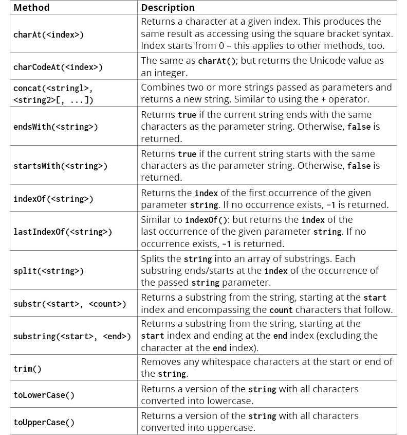

# 5. 超越基础

概述

到本章结束时，您将能够识别 JavaScript 的可变和不可变类型之间的区别；自信地操作每个内置数据类型；将数据从一种类型转换为另一种类型；格式化数据类型以供展示；以及区分表达式和语句。

# 简介

在上一章中，您被带上了对 JavaScript、其运行时和历史的游览。通过高级概览，那一章应该已经让您对 JavaScript 是什么、它能做什么以及它在互联网软件开发行业中的普遍性有了大致的了解。

对于初学者来说，理解代码可能很困难。JavaScript 也不例外。它的灵活性、广泛的语言语法和不同的编码模式可能会让初学者感到难以应对。

本章将带您更接近于用 JavaScript 编写自己的软件应用程序。通过解释基础知识，您将能够不仅理解脚本做什么，而且如何使用 JavaScript 语法进行问题推理。

在本章中，您将仔细研究 JavaScript 的类型系统。所有编程语言都有类型系统。类型实际上决定了变量或函数参数中存储的数据类型。类型通常分为两类：**原始**类型和**复杂数据类型**。

在 JavaScript 中，所有原始数据类型都是不可变的。这意味着值在内存中不能被改变。可以给变量分配新值，但存储在内存中的底层数据不能直接修改。这与 C++等语言的情况不同，在这些语言中，可以使用指针和辅助函数直接在内存中更改值。在 JavaScript 中，当从一个变量传递原始值到另一个变量时，数据会在内存中复制到新变量。因此，更新一个变量不会影响另一个变量。

复杂数据类型的工作方式不同。它们也被称为引用类型。引用类型包括**Object**类型及其所有派生类型，例如**Array**、**Date**和**Function**。所有引用类型都是通过引用传递的，因此得名。因此，如果一个对象通过一个引用被修改，所有共享相同对象的其它引用也会看到它被更新，因为所有的引用都指向内存中的相同数据。

复杂数据类型简单来说就是比原始类型具有更多功能的类型。例如，`Date`值提供了额外的表示方式，而对象可以包含许多嵌套值，例如原始类型和其他复杂数据类型。

注意

函数类型在本章中不会详细解释，而是在介绍原型时将在后面的章节中介绍。

所有原始类型和现有的引用类型都被称为内置数据类型。每种类型都有一个相应的对象，该对象提供用于操作该类型的函数。这些函数可以通过将值作为参数传递给函数来应用于外部数据，或者可以通过将函数作为该类型的成员方法来调用。后者也适用于几个原始类型，尽管它们在 JavaScript 类型系统中不是作为字面对象存在的。然而，这是通过数据的语法上下文实现的。关于这一特性将在本章中进一步解释。

# 创建变量

变量创建是将值赋给符号的手段。在这种情况下，符号是数据的文本表示，类似于一个容器，可以用来在程序中移动数据。它也提高了代码的可读性。创建变量的方式有多种，包括对全局作用域的赋值或使用`var`、`let`或`const`关键字。

## 关于引用的说明

即使在这个早期阶段，也必须强调 JavaScript 的引用功能可能会相当令人困惑。存在`闭包`、`原型`、`全局`和`局部内存栈`、`变量赋值变体`以及`函数调用选项`，这些都可能让经验丰富的程序员感到困惑。上述所有功能都支持 JavaScript 成为一个强大且灵活的编程语言，几乎可以挑战其他大多数平台用于任何目的。虽然这确实加深了 JavaScript 的学习曲线，但掌握这些概念可以带来极大的回报。

本章强调了数据引用的非常基础的知识，并试图尽可能不使问题复杂化。只讨论与全局级别数据相关的引用。

## 全局赋值

不使用`var`、`let`或`const`来赋值变量将变量放入全局作用域。此值将在应用程序的任何地方都可以访问，除非该作用域中存在同名的变量。不使用前缀关键字重新声明相同的变量名将覆盖全局引用，即使它是在不同的作用域中赋值的。

在浏览器环境中全局声明相当于在全局 window 对象上声明一个字段。

## 使用`var`声明

在变量赋值前加上`var`关键字将变量放入函数作用域。这意味着变量只存在于赋值所在的函数中，而不在该函数之外。在全局作用域中使用`var`声明等同于不使用`var`关键字声明。

使用`var`重新声明变量，但在嵌套作用域中，不会覆盖外部作用域中同名的变量。

使用 `var` 关键字，变量可以在它们在同一作用域内使用之后进行作用域（声明）。这是由于变量提升。提升在 *第四章*，JavaScript 库和框架中进行了解释。

## 使用 `let` 声明

`let` 关键字的作用域更窄。虽然 `var` 被认为是函数作用域，但 `let` 关键字是块作用域。这意味着使用 `var` 创建的变量在整个函数作用域级别存在，而使用 `let` 声明的变量在块级别创建和使用，例如在 `if` 条件块或 `for` 循环中。

例如，使用 `let`，可以在 `for` 循环内临时覆盖变量，而不会改变外部函数中具有相同名称的变量。然而，如果使用 `var`，则外部变量将被更改：

```js
var a=0;
for(var a in [0, 1]);
console.log( a ); // ==> a is now 1 (as modified by the loop)
```

在前面的示例中，`for` 循环中声明的变量与外部声明的符号匹配。因此，相同的变量引用被修改。然而，在下面的示例中，结果不同，因为 `let` 声明的变量仅存在于 `for` 循环的上下文中，这意味着相同名称的外部变量保持不变：

```js
var a=0;
for(let a in [0, 1]);
console.log( a ); // ==> a is still 0 (not modified by the loop)
```

与 `var` 不同，`let` 声明的变量不会被提升。如果一个作用域使用 `let` 声明了一个变量，那么在 `let` 声明语句之前（在同一作用域或任何内部作用域）访问该变量将引发错误（这无论外部作用域中是否已创建了具有相同名称的变量）：

```js
glob=1; {glob=2; let glob=3;}  // ==> can't access lexical declaration `glob' before 
initialization
glob=1; {glob=2; var glob=3;} // ==> accepted syntax
```

## 使用 `const` 声明

`const` 关键字与 `let` 关键字具有相同的作用域和提升规则。与 `const` 的区别在于，它假定变量在其整个生命周期内不会改变。使用 `const` 允许 JavaScript 引擎在编译时进行某些优化，因为它期望在运行时数据保持不变。

在嵌套函数作用域中，可以创建具有相同名称的新变量赋值，但使用全局作用域规则将无法修改具有相同名称的变量。

注意

使用 `var` 或 `let` 声明变量，但未分配值，将导致变量包含 `undefined`。将在本章稍后介绍 `undefined` 值。

## 练习 5.01：变量和作用域

在这个练习中，我们将使用浏览器的 JavaScript **读取-评估-打印循环**（**REPL**）来实验变量赋值和作用域。让我们开始吧：

1.  启动您的浏览器并打开开发者工具控制台。在 Chrome 中，您可以通过按 *F12* 键来完成此操作。

1.  确保已选择 `Console` 选项卡：

    图 5.1：控制台选项卡

1.  在 `prompt` 中输入以下命令，每行输入后按 *Enter* 键：

    ```js
    const i = 10;
    console.log(i);
    // ->    10
    ```

    `console.log` 命令将 `i` 的值写入控制台。

1.  接下来，创建一个函数，该函数也初始化具有相同名称的变量，如下所示：

    ```js
    const f = function() {
        var i = 20;
        console.log(i);
    };
    ```

1.  调用函数以打印函数作用域内存在的变量。如果您然后打印全局变量，您将看到它没有被修改：

    ```js
    f();
    // ->    20
    console.log(i);
    // ->    10
    ```

1.  接下来，尝试使用 `let` 关键字：

    ```js
    if (true) {
        let i = 15;
        console.log(i);
    }
    // ->   15
     console.log(i);
    // ->   10
    ```

    如您所见，`let` 赋值仅存在于 if 语句之后的代码块的生命周期内。

1.  关闭浏览器标签页。打开一个新的标签页并再次打开控制台（否则，您将无法重新分配 `i` 作为变量）。现在，尝试使用 `var`。您将看到变量声明引发了错误，因为它与条件块外的 `i` 变量冲突：

    ```js
    i = 10;
    if (true) {
        var i = 15;
        console.log(i);
    }
    // ->    15
    console.log(i);
    // ->    15
    ```


图 5.2：练习 5.01 输出

理解变量周围的范围对于正确执行您的应用程序以及最小化错误非常重要。在工作过程中，尽量在心中记住每个变量的位置和使用情况。利用第十三章中讨论的函数范式，*JavaScript 编程范式*，也将有助于缓解变量作用域中的任何差异。

## 识别变量的类型

到目前为止，您已经创建了变量并将它们的值输出到浏览器的控制台。然而，为了充分利用本章的内容，能够识别变量的内容将非常有帮助。JavaScript 被称为弱类型语言，因为一个变量可以在某一刻持有 `string`，然后又变成 `integer`。

下一个。通过能够识别变量中存储的值的类型，您可以防止尝试处理预期为不同类型的值时发生错误。

`typeof` 关键字就是为了做这件事。通过在变量前加上 `typeof` 关键字，返回的值是表示为 `string` 的变量类型。

`typeof` 关键字使用以下类型映射进行评估：


图 5.3：类型和响应

`null` 类型评估为 "`对象`"。这种异常源于 JavaScript 的早期版本，其中数据类型被内部标记为整数值。对象类型被标记为 0，而 `null` 值存在为一个 `null 指针`（或 `0x00` 作为值）。由于这两个表达式相同，确定 `null` 的类型导致了与对象相同的类型。这种相同的异常至今仍然存在于 JavaScript 中。因此，在确定一个类型是否为对象时，我们还需要将其与 `null` 进行比较：

```js
var value = [1, 2, 3]; // an array - which is also an object
if (typeof value === "object" && value != null) {
    console.log("value is an object");
}
```

## 练习 5.02：从变量中评估类型

在这个练习中，我们将创建一个函数，该函数输出传递给它的任何变量的类型。让我们开始吧：

1.  在命令提示符中，输入以下行以声明函数签名：

    ```js
    var printType = function(val) {
    ```

    此函数接受一个变量，该变量将被用作分析变量。

1.  由于存在 `Null` 值的注意事项，你必须首先检查这一点。在这里，比较 `val` 与 `Null` 并输出相应的信息。如果值确实是 `Null`，那么函数必须返回，以便不再进行比较：

    ```js
      if (val === null) {
        console.log("Value is null");
        return;
      }
    ```

    在这里，你正在比较 `val` 与 `Null` 并输出相应的信息。如果值确实是 `Null`，那么函数必须返回，以便不再进行比较。

1.  如果值不是 `Null`，那么你可以安全地返回值的类型本身：

    ```js
      console.log("Value is", typeof val);
    }
    ```

    `console.log(...)` 将输出传递给它的任何值，并将它们连接到同一行。在这里，你输出一个通用信息，但随后将其与变量的类型连接起来。由于不需要从这个函数传递任何值，并且没有更多的逻辑要执行，因此不需要返回语句来关闭函数。

1.  为了测试这个函数，请在控制台中用不同的值执行它：

    ```js
    printType(12);
    printType("I am a string");
    printType({});
    printType(null);
    ```

    上述代码将产生以下输出：

    ```js
    Value is number
    Value is string
    Value is object
    Value is null
    ```


图 5.4：练习 5.02 输出

你刚刚创建的函数在自我检查方面相当轻量。它本质上使你能够确定传入值的通用类型，但它不足以区分对象类型，包括 JavaScript 的内置对象。无论你传入一个 `Date` 或一个 `Array`，你都会得到相同的输出。

你将在本模块的后面部分发现如何更彻底地确定数据类型。

# 固定类型

固定类型是没有值变化的类型。与数字不同，数字可以有任何数字组合，可选的负号（用于负数），小数点或科学记数法，固定类型始终是一个简单的值或值组。

在 JavaScript 中，可用的固定类型包括 `null`、`undefined` 和 `Booleans`（`true` 和 `false`）。这些值是静态的，不能改变。如果一个变量包含这些值之一，那么它就严格等于该值本身。固定类型更多的是一种情况的表示，而不是实际的数据。例如，`true` 是真实性的固定表示，而 `false` 是虚假性的固定表示。这些值在现实世界中是不可量化的，但它们代表了软件直接处理的逻辑。

## `null` 的值

在数学术语中，`null` 表示一个不存在的值。在 JavaScript 中，`null` 是一个静态值，用来表示没有值。在其他语言中，这相当于 nil 或 void。

`null` 是一个有用的值，用于取消引用变量或在没有值可以返回时从函数返回值。例如，一个函数可能从数组中返回一个对象，如果项目存在，但如果没有，则返回 `null`。

## 未定义的值

`undefined`在许多方面与`null`相似，因此这两个值经常被误用。`undefined`是任何未分配值的变量的值。它也是函数返回的值，该函数没有使用`return`关键字显式返回值，以及它是从没有结果值的语句（一个没有结果的动作）返回的值。

当处理`undefined`时，你应该始终预期它，但绝不要将其分配给变量或从函数中显式返回。在这种情况下，你应该使用`null`。

## 布尔值

`布尔`（Boolean）这个术语是以 19 世纪英国数学家和哲学家乔治·布尔（George Boole）的名字命名的。它用来表示`true`和`false`这两个值。这些值可以分配给变量，并且与它们的值严格等价，就像`null`一样。

布尔值在 JavaScript 支持的所有类型中是独特的，因为它们可以与其他类型和表达式间接比较。例如，本书第三章“编程基础”中描述的逻辑运算符都会返回一个`Boolean`值。

# 布尔运算符

布尔运算符是当组合成表达式时返回`Boolean`值的运算符。大多数布尔运算符是“二元”运算符，接受两个值，每个值位于运算符的两侧。像其他运算符一样，每个值都可以是一个表达式，可以是任何值类型。由于布尔运算符本身形成表达式，因此可以用作其他布尔运算符的输入。

布尔运算符可以分为两类；即比较运算符和逻辑运算符。

## 比较运算符

比较运算符用于比较一个值或表达式的结果与另一个值。在这种情况下，运算符可以被视为一条规则。如果规则成功，则组合表达式的响应返回`true`。否则，它返回`false`。

比较运算符包括以下符号：

![图 5.5：比较运算符及其描述]

![图片 C14377_05_05.jpg]

![图 5.5：比较运算符及其描述]

比较运算符通常用作 if 条件语句和 while 循环语句的条件参数。如果或当条件表达式返回`true`时，表达式的主体块将执行。

以下示例表达式都将返回值`true`：

```js
21 == 9+12;
false != true;
6 > 1;
5 >= 5;
"1" == 1;
```

如果你查看列表中的最后一个示例，你可能会有点惊讶。`==`运算符是一个“值比较运算符”。在显示的示例中，数值 1 和字符串值“1”被认为是相同的值。因此，作为“值比较”运算符的等价运算符将它们视为相等。

为了确定值是否属于同一类型以及是否具有相同的值，应使用“严格比较运算符”：

![图 5.6：等价运算符及其描述]

![图片 C14377_05_06.jpg]

图 5.6：相等运算符及其描述

## 逻辑运算符

逻辑运算符通常用于将 `Boolean` 表达式连接起来。例如，当比较一个 `string` 值的质量时，你可能希望如果 `string` 的长度大于一个值但小于另一个值时执行代码。为了做到这一点，你需要使用 `&&` 运算符将两个比较表达式连接起来。在另一个条件下，你可能希望只有一个表达式为 `true` 时执行代码，在这种情况下，你会使用 `||` 运算符。

以下表格列出了每个逻辑运算符及其功能：


图 5.7：逻辑运算符及其描述

## 练习 5.03：奇数和偶数

在这个练习中，我们将处理一系列数字，并输出描述数字是奇数还是偶数的消息。

我们将使用函数来完成这个练习，这样你就可以尝试不同的起始值。让我们开始吧：

1.  在命令提示符下，创建一个带有几个参数的 `odd_or_even` 函数：

    ```js
    function odd_or_even(counter, last) {
    ```

    `last` 参数将是数值序列的上限值，而 `counter` 参数既是每个循环的起始值，也是当前索引变量。

1.  接下来，使用 `while` 关键字创建你的循环。`while` 将在条件表达式为真时处理代码块。在这个练习中，你将简单地比较 `counter` 与 `last` 参数：

    ```js
      while (counter <= last) {
    ```

    如果 `counter` 变量的值大于 `last` 参数，则 `while` 循环将退出，这也会退出函数。

1.  在 `while` 条件成立后，你现在可以开始描述每次迭代的计数器值。为此，你只需检查 `counter` 的值，并根据其内容给出适当的消息：

    ```js
        if (counter % 2 == 0) { // is true if the remainder of 'counter / 2' is 
    equal to zero
          console.log(counter, "is an even number");
        } else {
          console.log(counter, "is an odd number");
        }
    ```

1.  在关闭 `while` 循环块之前，现在将 `counter` 变量增加 `1`。如果你没有增加，`while` 循环的条件将始终为 `true`，循环将永远不会退出。此外，循环的每次迭代都会处理相同的内容，这不是你想要的结果：

    ```js
      counter = counter + 1;
    ```

1.  关闭 `while` 块和函数。由于我们对该函数的任何最终值不感兴趣，因此不需要从这个函数中返回任何内容：

    ```js
      }
    }
    ```

1.  现在，按照要求传递 `counter` 值和 `last` 值来执行函数。输出应该准确地描述从 `counter` 到 `last` 的所有数字，包括 `last` 本身。

    这是输出：

    ```js
    odd_or_even(1, 5);
    //   1 "is an odd number"
    //   2 "is an even number"
    //   3 "is an odd number"
    //   4 "is an even number"
    //   5 "is an odd number"
    ```


图 5.8：练习 5.03 输出

尝试在调用函数时更改传递的参数。但是，请确保将 `counter` 的值保持在小于或等于 `last` 参数的范围内，否则 `while` 循环将不会执行。

## 测试值的真伪

当用 JavaScript 编写程序时，你将经常需要比较值，通常是在处理条件时。通常，值会与其他值进行比较，但你也可能需要检查值的真值。

测试真值可以意味着许多事情：

+   是否存在值？

+   数组中是否有任何项？

+   字符串的长度是否大于 0？

+   传递的表达式返回`true`吗？

JavaScript 提供了一种方法，可以将单个值传递给条件语句以测试其真值。然而，这有时可能会引起混淆。例如，检查以下示例：

```js
if (0) console.log("reached");  // doesn't succeed
console.log( 0 == false ); // prints true
console.log( 0 === false ); // prints false
```

如果条件是真值，则执行`if`语句的主体。在前面的代码的第一个例子中，数值零被视为假值。正如第二个和第三个例子所示，`false`等于数值零，但只是非严格相等。然而，在第三个例子中，数值零并不严格等同于`false`。这是因为`false`值和假值之间有一个区别。`false`值始终是`false`，但假值可能是几个值之一，包括以下内容：

+   `false`

+   `undefined`

+   `null`

+   `-0`、`+0`或`NaN`

+   一个空字符串

如果值不在前面的列表中，则被认为是真值。

## NOT 运算符

`!`或`NOT`运算符相当独特。它被认为是一个“一元”运算符，因为它只接受它右侧的一个值。通过使用`NOT`运算符，你实际上是否定了它前面的值。以下是一个例子：

```js
var falseValue = !true;
```

在前面的例子中，`falseValue`变量将包含一个`false`的值。

`NOT`运算符的一个非常有用的特性是“双重 NOT”。这是指两个`NOT`运算符组合起来双重否定一个表达式；一个真表达式被否定为`false`，然后又回到`true`，而一个`false`表达式被否定为`true`，然后又回到`false`。

当处理真值或假值表达式时，使用`双重 NOT`运算符会改变这些表达式的结果值，使其成为实际的布尔值。以下是一个例子：

```js
if (!!1 === true) {
  console.log("this code will execute");
}
```

## 布尔运算符优先级

所有运算符都有一个执行顺序，称为“优先级”。这种优先级在数学中也很明显，它是一种确保表达式以可预测的方式执行的手段。

考虑以下代码：

```js
if (true || false && false)
```

前面的例子可以有两种不同的解读方式。这是第一种解读方式：

```js
if ((true || false) && false)
```

这是第二种解读方式：

```js
if (true || (false && false))
```

如果你从左到右遵循代码，就像前面的第一个例子一样，它将返回`false`，因为`&&`运算符是最后执行的。在那里，代码将简化为以下内容：

```js
   true || false && false
= true && false
= false
```

然而，第二种解释会产生不同的结果：

```js
   true || false && false
= true || false
= true
```

为了防止这种歧义，存在运算符优先级规则。优先级适用于 JavaScript 语言中的所有运算符，但在这里我们只列出适用于`Boolean`表达式的那些运算符：


图 5.9：布尔运算符及其关联性

在前面的表中，最上面的行具有最高的优先级，因此首先评估，而最下面的行具有最低的优先级，最后评估。

## 布尔运算符关联性

在前面的表中，每个运算符都被赋予了关联性描述。关联性与表达式的执行方向有关。大多数运算符具有“从左到右”的关联性，这意味着左侧表达式会在右侧表达式之前执行。然而，`NOT` 运算符首先执行其右侧表达式。

关联性可能非常重要，尤其是在表达式中发生副作用时。在以下示例中，位于 `||` 运算符两边的表达式记录参数并返回它：

```js
function logAndReturn( value ) {
  console.log( "logAndReturn: " +value );
  return value;
}
if ( logAndReturn (true) || logAndReturn (false)) {
  console.log("|| operator returned truthy.");
}
```

当执行时，如果 `log_and_return` 函数返回一个真值，那么只有第一次执行会发生，因此只有那个调用使用 `log_and_return` 记录一条消息：与传入的值连接。由于 `||` 运算符是左到右关联的，如果左侧返回 `true`，则整个表达式被认为是真值。因此，右侧永远不会执行。对于这个特定的运算符，右侧只有在左侧为假时才会执行。这种行为也称为短路。

由于 **logAndReturn** 的副作用仅仅是记录值，这为调试提供了一个有用的工具。然而，考虑一个接收对象作为参数、修改它然后返回值的函数：

```js
// Following two variables are set to "anonymous" (simple) objects,
// each with two fields, 'name' and 'happy', set to initial values (both sad)
var john= {name: "John", happy: false};
var lucy= {name: "Lucy", happy: false};
function make_happy( person ) {
  console.log("Making " +person.name+ " happy.");
  person.happy= true;
  return true;
}
if (make_happy(john) || make_happy(lucy)) {
  console.log("John is happy: " +john.happy+ ", Lucy is happy: " +lucy.happy);
}
```

这两个对象遵循相同的结构，`make_happy` 函数可能可以与任一对象一起工作。然而，当调用条件时，只有 `john` 会被更新，因为条件表达式中的 `||` 条件在其左侧满足。

右侧永远不会执行。因此，如果代码依赖于稍后修改两个对象，它将失败。

对于 `&&` 运算符，同样的警告也是适用的。由于 `&&` 运算符表达式只有在两边都为真时才被认为是 `true`，因此只有当左侧执行返回 `true` 时，两边才会执行。

对于 `||` 运算符的关联执行规则在处理变量时特别有用。在某些情况下，如果变量尚未包含值，则最好为其分配一个默认值。在这种情况下，使用 `||` 运算符可以轻松完成这项任务：

```js
distanceLimit = distanceLimit || 5;
```

如果变量已经包含值，则它将保持该值。但是，如果其值为 `null`、`undefined` 或其他假值，则它将被分配值为 5。

类似地，如果你希望在一个先前的变量为真时执行一个函数，使用 `&&` 运算符是很好的选择：

```js
items.length && processItems(items);
```

## 练习 5.04：免费送货资格验证

在这个练习中，我们将创建一个函数，用于确定杂货店的客户是否有资格享受免费送货上门服务。商店只为位于商店 5 英里范围内的客户送货。为了让这个练习更有趣，商店最近决定为位于商店 10 英里范围内的客户提供免费送货服务，但前提是这些客户必须拥有其忠诚度计划的活跃会员资格。此外，如果客户位于商店 1 英里以内，无论其会员状态如何，都不符合免费送货上门的资格。让我们开始吧：

1.  定义你的函数签名。该函数应接受客户家与商店的距离以及他们的会员状态：

    ```js
    function isEligible(distance, membershipstatus) {
    ```

    根据商店的标准，如果客户有资格享受免费送货，则函数返回 `true`；如果他们不符合，则返回 `false`。描述某种内容的 `Boolean` 形式的函数通常被标记为 `is`，例如 `isValid`、`isEnabled` 或 `isGoingToReturnABoolean`。

1.  构建这个函数的主体有两种方式；要么将问题分解成小块并逐步测试参数，要么创建一个检测所有适当结果的单一条件。我们将使用后者来适当展示本章迄今为止的内容。以下 `if` 语句是一个否定检查——它检查客户是否有资格享受免费送货上门服务：

    ```js
    if (distance < 1 || membershipstatus === "active" && distance > 10 || membershipstatus === "inactive" && distance > 5 ) {
    ```

    这是练习的核心。布尔运算符按以下顺序执行，但只有那些确定整体结果所必需的运算符。首先是检查房屋是否位于商店 `1` 英里范围内的相对检查。如果房屋位于商店 `1` 英里以内，则整体结果为 `true`，并且不会评估整个表达式的其余部分。只有当距离为 `1` 英里或更多时，整体结果尚未确定，然后才会继续进行。只有当会员状态为活跃时，才会检查是否超过 `10` 英里。否则，如果会员状态不活跃，则会检查是否超过 `5` 英里。然后，这些结果将与小于 `1` 英里的检查相结合。由于运算符优先级，不需要使用括号进行分组。

1.  如果条件评估为真值，则我们希望报告该人员不符合免费送货的资格：

    ```js
        return false;
    ```

1.  由于函数将在这里简单地停止，如果条件块被执行，只需为任何通过的内容返回 `true`：

    ```js
      }
      return true;
    }
    ```

1.  函数完成后，尝试不同的参数变体来测试它：

    ```js
    console.log( isEligible(.5, "active") );
    // =>   false
    console.log( isEligible(7, "inactive") );
    // =>   false
    console.log( isEligible(7, "active") );
    // =>    true
    ```

![图 5.10：练习 5.04 输出

![img/C14377_05_10.jpg]

图 5.10：练习 5.04 输出

## 为什么你不应该比较布尔值和非布尔表达式

虽然许多非布尔值和对象被认为是真值，但它们可能不等于 `Boolean` `true`：

```js
console.log( 1 == true ); // => true, but:
console.log( 2 == true ); // => false, because true first converts to 1
console.log( 2 == false ); // => also false, because false converts to 0
```

一个好的经验法则是使用 `!!`（双重否定）将非布尔表达式转换为 `Boolean` 类型：

```js
console.log( !!2 == true ); // => true
console.log( !!2 == false ); // => false
```

## 你为什么不应该链式比较表达式

对同一运算符在两个以上表达式上的重复应用称为链式操作。通常，这既实用又清晰：

```js
console.log( 1 + 2 + 3 ); // => 6
console.log( true && true && false ); // => false
```

使用比较运算符进行此过程可能也很诱人，但这样做会得到一个令人惊讶且不正确的结果。在这种情况下，第一次布尔比较的中间结果将提供一个布尔结果。因此，当它与链中的下一个数字进行比较时，JavaScript 引擎会将其转换为`1`（如果是`true`）或`0`（如果是`false`）：

```js
console.log( 1 < 3 < 2 ); // 1<3 => true, but then: true<2 => 1<2 => true!
```

当使用比较运算符时，也会出现类似的混淆：

```js
console.log( 2==2==2 ); // 2==2 => true, but then: true==2 => 1==2 => false!
// Similarly with 0:
console.log( 0==0==0 ); // 0==0 => true, but then: true==0 => 1==0 => false!
// However, not the same with 1:
console.log( 1==1==1 ); // 1==1 => true, then: true==1 => 1==1 => true
```

因此，除非你明确地处理布尔值，否则请避免链式任何比较运算符。

## 三元运算符

到目前为止，我们已经讨论了一元和二元运算符，但 JavaScript 还支持另一个运算符。这个运算符简单地称为三元运算符，它执行与`if...else`类似的功能，但以更紧凑的方式。三元运算符由一个问号（`?`）和一个冒号（`:`）组成，用于表示条件表达式`?`，一个`if`条件下的真表达式和一个`false`条件下的表达式。例如：

```js
var action = (score < 40) ? "Fail" : "Pass";
```

当然，这与以下内容相同：

```js
var action;
if (score < 40) {
  action = "Fail";
} else {
  action = "Pass";
}
```

这里的主要区别在于三元运算符本身就是一个表达式。这与`if`不同，`if`是一个语句（它不返回值）。

三元运算符的条件部分不需要括号包围，但通常被视为如此，以便它紧密地类似于`if`表达式。每个三个表达式的规则很简单，即它们必须是表达式；你不能使用`if`、`while`或另一个此类语句，否则会抛出错误。

由于三元运算符是表达式，因此它们可以嵌套。运算符的每个问号部分都期望跟随一个冒号部分，就像嵌套括号组一样。因此，执行以下操作是可能的，也是可接受的：

```js
var status = (score < 40) ? "Fail" : (score > 90) ? "Outstanding Score" : "Pass";
```

这等同于以下内容：

```js
var status;
if (score < 40) {
  status = "Fail";
} else if (score > 90) {
  status = "Outstanding Score";
} else {
  status = "Pass";
}
```

三元运算符对于保持代码简洁非常有用。有时，使用完整的`if...else`语句会削弱代码的目的，并使其更难以理解。请随意在需要的地方使用三元运算符。

# 处理数字

JavaScript 中的所有数字都是 64 位浮点值。与其他语言不同，JavaScript 中没有内部区分浮点值和整数的差异。JavaScript 提供了几个包含特定于浮点值和整数的函数的对象。然而，这些对象是语义上的。因此，将整数特定的函数应用于一个数字仍然会得到一个浮点值。

数值是 JavaScript 引擎表示的数据的最简单形式。数值是不可变的，这意味着它们的值在内存中不能被修改。如果您将新数值赋给变量，您只是在用新值覆盖旧值。现有值不会被修改。

由于`数字`是通过值传递给变量的，因此两个变量不可能指向相同的`数字`地址空间。因此，处理`数字`值被认为是纯的，前提是你不重新分配变量的值。

## 算术限制

浮点值在 JavaScript 中可能会引起一些问题。由于它们的`二进制`编码，这是 JavaScript 引擎在位中表示`数字`的方式，简单地相加两个浮点数可能不会产生你期望的结果。考虑以下：

```js
0.1 + 0.2;  // outputs 0.30000000000000004
```

在这里，响应应该是`0.3`，但它不是。底层运行时简单地没有以允许它们准确的方式处理值，即使只有一位小数。

如果精度对您的应用程序是必要的，有一些技巧可以提供正确的输出。关于前面的例子，简单地在加法之前将值转换为十进制将提高精度。然后您可以像这样将结果值转换回浮点数：

```js
((0.1 * 10) + (0.2 * 10)) / 10;  // outputs 0.3
```

同样，乘法和除法也存在相同的问题：

```js
0.0032 * 13;  // outputs 0.041600000000000005
```

然而，如果您首先将其转换为`整数`，则结果更准确：

```js
0.0032 * 1000 * 13 / 1000; // outputs 0.0416
```

这种限制不仅限于 JavaScript。实际上，任何使用 64 位 IEEE 754 浮点数的语言都会有相同的限制。互联网上有许多库可以帮助解决这些问题，如果您不愿意自己解决。

注意

JavaScript 可以表示的最大整数值是`9,007,199,254,740,991`和`-9,007,199,254,740,991`。

## Number 对象

正如我们之前提到的，JavaScript 中的数值是原始类型。因此，它们没有属性或方法。然而，与此相反的是，JavaScript 引擎维护了对您的应用程序中数值字面量和变量使用的了解，并通过`number`对象提供语法支持。甚至可以通过原型扩展此对象，这将在第四部分中详细解释。对`Number`对象施加的任何扩展都将可用于您的应用程序中的数值：

```js
5.123.toPrecision(3);
  // returns "5.12"
```

注意，虽然数值可能看起来像是对象，但实际上并非如此。在内存中，数值是非常简单的值。`Number`对象及其由 JavaScript 运行时实现的实现，仅仅提供了与这些值相关的许多对象的好处。

## 数值函数

`Number` 对象包含一系列用于处理数值的函数。像所有对象一样，`Number` 对象提供了一个构造函数，如果使用 `new` 关键字调用，则创建一个 `Number` 对象实例。使用 `Number` 构造函数创建的数字实际上是对象，这与前面的陈述相反，即数字不是对象，这也是造成很多困惑的原因。更有趣的是，结果对象实例可以像任何其他数字一样处理。

除了构造函数之外，还有 `Number` 函数。这个函数的使用方式与 `Number` 构造函数相同，但不需要 `new` 关键字。调用此函数返回一个 `number`，而不是 `object`：

```js
var num1 = 99;
var num2 = Number(99);
var num3 = new Number(99);
console.log(num1 == num2); // outputs 'true'
console.log(num1 == num3); // outputs 'true'
console.log(num2 == num3); // outputs 'true'
console.log(num1, num2, num3); // outputs '99 99 Number {99}'
```

在前面代码中详细说明的所有情况下，结果值可以以相同的方式和规则进行处理，除了处理真值条件。通常，条件将值 `0`（零）视为假值，但从 `new Number(0)` 返回的值是真值，尽管它也是零。

```js
console.log( false==new Number(0) ); // => true, meaning that Number(0) equals to false, but:
if( new Number(0) ) { // => truthy
  console.log("truthy");
}
else {
  console.log("falsey");
}
```

同样，当按类型比较时，从 `new Number(0)` 返回的值是一个对象，而不是数字，因此与数字字面量的严格比较将失败。

`Number` 函数和构造函数都接受任何值类型。如果值类型不能转换为数字，则返回 `NaN`（不是一个数字）：

```js
console.log( Number(true) ); // 1
console.log( Number(false) ); // 0
console.log( Number("5") ); // 5
console.log( Number([]) ); // 0
console.log( Number([1, 2, 3]) ); // NaN
```

当使用 JavaScript 时，建议根本不要使用 `Number` 构造函数，以便代码更易于阅读。

除了 `Number` 函数和构造函数之外，全局的 `Number` 对象还提供了一系列函数，帮助我们识别或解析数值：

![图 5.11：数字函数和它们的描述]

![图片 C14377_05_11.jpg]

图 5.11：数字函数和它们的描述

这些函数都是 `static` 的，因此必须用全局的 `Number` 对象（在许多语言中充当类）作为前缀，除非使用 `parseFloat` 或 `parseInt`。这些函数也是全局的，因此可以像这样调用，而不需要前面的 `Number`：

```js
console.log( Number.parseFloat("1.235e+2") ); // outputs 123.5
console.log( parseFloat("1.235e+2") ); // outputs 123.5 again
```

## 数字方法

由于 JavaScript 解析器在语义上识别数值，因此可以像对实际对象一样调用 Number 对象的实例方法。这些方法中的大多数用于将 `numeric` 值格式化为 `string` 表示形式，这对于在网页中的展示非常有用：

![图 5.12：数字方法和它们的描述]

![图片 C14377_05_12.jpg]

![图 5.12：数字方法和它们的描述]

通过组合使用 `Number` 函数和方法，可以在必要时将数值转换为其他数值，尽管可能会丢失一些精度：

```js
console.log( 123.456.toLocaleString() ); // outputs "123.456"
console.log( 123.456.toFixed(1) ); // outputs "123.5"
console.log( 123.456.toExponential(3) ); // outputs "1.235e+2"
```

然而，在整数字面量（而不是浮点数）上调用这些函数会失败：

```js
console.log( 123.toString() ); // => Uncaught SyntaxError: Invalid or unexpected token
```

当 JavaScript 在一个或多个数字之后看到第一个点时，它假设你想要写一个浮点字面量。有一些解决方案可以解决这个问题：

```js
console.log( 123.0.toString() ); // Append .0\. It will still be represented as an integer (as far as it fits in the integer range)
console.log( (123).toExponential(2) ); // Wrap within parentheses (..)
```

## 数字属性

全局`Number`对象提供了各种常量属性，这在比较你的数值时很有用。其中最重要的是`NaN`。能够在 JavaScript 运行时之外识别数值差异，为你提供了减少代码中错误的方法。例如，观察以下示例：

```js
var num = 999 / 0;
```

当执行时，`num`的结果是被称为无穷大的常量值。由于无法从无穷大添加、减去、乘以或除以其他值，因此对该值进行的任何进一步数学运算也将是无穷大。因此，能够在代码中推断出这种限制将提供早期警告，表明你的逻辑可能存在问题。

数字的其他属性包括以下内容：


图 5.13：数字属性及其描述

`MAX_SAFE_INTEGER`和`MIN_SAFE_INTEGER`都是有趣的价值。考虑以下代码：

```js
Number.MAX_SAFE_INTEGER + 1 === Number.MAX_SAFE_INTEGER + 2;
```

意想不到的是，前面表达式的结果是`true`。这仅仅是因为数字超出了安全边界，因此不再被准确表示。前面表达式的两边使用的精度相同，因此被认为是相等的。

## 练习 5.05：货币格式化器

在这个练习中，我们将创建一个函数，该函数可以将数值参数作为`number`或`string`格式化为具有两位小数的价格值。为了在前面添加货币符号，该函数将接受它作为参数。让我们开始吧：

1.  定义你的函数签名。这个函数将接受两个参数。其中第一个将是小数值，第二个将是货币符号：

    ```js
    function formatPrice(value, currency) {
    ```

1.  在执行时，函数执行的第一项任务应该是验证传入参数的质量。`value`参数必须能够转换为数值，而`currency`参数应该是一个字符`string`。如果`currency`是假的，例如没有传递参数，那么我们可以将其默认值设置为美元符号：

    ```js
      value = Number(value);
      currency = currency || "$";
    ```

1.  在响应错误时，我们可以用多种方式通知调用者出了问题。在这个例子中，我们简单地返回`null`。这样，调用者就会知道除了`string`响应之外，任何其他响应都意味着有些地方不太对劲：

    ```js
      if (Number.isNaN(value) || typeof currency != "string") {
        return null;
      }
    ```

1.  现在我们知道参数是可用的，将它们组合成正确的格式并返回值：

    ```js
      return currency + value.toFixed(2);
    }
    ```

1.  如果你继续执行这个函数，你会看到相应的响应：

    ```js
    console.log( formatPrice(1.99, 32) ); // => null
    console.log( formatPrice(5, "£") ); // => £5.00
    console.log( formatPrice(9.9) ); // => $9.90
    console.log( formatPrice("Ted") ); // => null
    ```


图 5.14：练习 5.05 输出

我们可以在前面的图中看到运行所有四个函数后的输出。在这个练习中，我们创建了一个函数，该函数接受数值参数作为`number`或`string`，并将其格式化为具有两位小数的价格值。

# 处理字符串

与`数字`一样，`字符串`是简单的不可变数据类型，在 JavaScript 运行时作为二进制值的列表进行管理，这些值可以表示为字符。由于它们是不可变的，因此不能被更改。如果你使用提供的方法之一修改`字符串`，实际上是在创建一个新的字符串，并应用了更改。

字符串的文本表示是由引号包围的字符列表。这些引号可以是双引号、单引号（撇号）或反引号：

```js
console.log( "I am a string" );
console.log( 'I am also a string' );
console.log( `I am a special string` );
```

可以将字符串视为一个由单个字符组成的很长列表，就像数组一样，这将在后面讨论。因此，可以查询单个字符或字符组：

```js
["H", "e", "l", "l", "o", ",", " ", "W", "o", "r", "l", "d", "!"]
```

上述代码不是文本的文本表示，而只是字符串可能被感知的类比。由于字符串是列表，因此可以使用字符索引从它们中检索字符。这是通过用方括号符号包围索引来完成的。字符字符串的索引从`0`（零）开始：

```js
"Hello, World!"[7];
// =>   "W"
```

由于字符串是不可变的，因此你不能像这样将替换字符分配给索引：

```js
var msg = "Hello, World!";
console.log( msg[7] = "Z" ); // => "Z"
msg; // =>  "Hello, World!"
```

无法修改`字符串`。相反，你只能根据原始内容创建一个新的。你可以使用运算符重新构造它，或者使用`String`对象提供的许多`字符串`函数之一，这将在稍后描述。

## 特殊字符

由于字符串包含在引号中，因此在字符串内放置相同的引号可能会出现问题。简单地在字符串中键入引号就等同于终止该字符串。这意味着后续的字符可能被视为格式不正确的 JavaScript 代码，或者更糟，可能是可执行的 JavaScript 代码。

避免终止`字符串`的一种方法是在包含`字符串`时使用不同类型的引号。例如，如果字符串包含在双引号中，则可以自由使用单引号。同样，在单引号中包含`字符串`将允许自由使用双引号：

```js
console.log( "I can contain 'single' quotes" );
console.log( 'I can contain "double" quotes' );
```

这对于简单的文本是有效的，但对于需要包含两种引号类型的字符串来说并不那么保险。

JavaScript 语言提供了一种方法来`转义`字符串中包含的字符，以便它们被以不同的方式处理。这是通过在要转义的字符之前加上反斜杠（`\`）字符来完成的。在引号的情况下，转义确保引号字符不被视为字符串终止字符：

```js
"It's useful to be able to \"escape\" quotes"
```

`转义字符`可以与几个其他字符一起使用，以产生不同的效果。它甚至被用来转义转义字符，在这种情况下，反斜杠必须存在于`字符串`中：

```js
"This \\ will create a single backslash"
```

其他支持的转义字符包括以下内容：


图 5.15：转义字符

## 连接

连接是将元素首尾相连以形成新元素的一种方法。就字符串而言，这仅仅是把字符串连接起来形成更长的字符串。

字符串连接使用加号（`+`）符号进行。这被称为方法重载：

```js
"This string " + "and " + "this string " + "are concatenated";
// =>  "This string and this string are concatenated"
```

在连接字符串时，需要注意空格字符的存在。在连接点不会添加任何额外的字符。因此，如果你需要在组合的字符串之间添加空格，你必须自己添加。

由于字符串是不可变的，连接字符串会创建一个新的字符串，你可以将其分配给变量或作为参数传递给函数。原始字符串不受影响。

## 模板字符串

模板字符串是 JavaScript 语言中较新的一个特性。使用反引号（`` ` ``）包围字符串可以改变 JavaScript 引擎对字符串字面量的翻译，并提供了额外的功能。

第一个有趣的功能，也是最常用的功能，是能够在字符串中插入表达式。这是通过在字符串中嵌入以美元（`$`）字符开头的块来实现的。以这种方式组合字符串的好处是使字符串字面量更容易阅读，但也可以极大地简化更复杂的字符串连接需求：

```js
var str = `2 + 2 = ${2 + 2}`;
console.log( str ); // =>  "2 + 2 = 4"
var name = "Jonny";
welcomeStr = `Hello, ${name}!`;
console.log( welcomeStr );  // => "Hello, Jonny!"
```

模板字符串的另一个有用特性是能够使用物理换行符。通过在 JavaScript 代码中应用换行符，这些相同的换行符将出现在解析后的字符串中：

```js
var str = `This is line one
and this is line two`;
console.log( str );
// => "This is line one
// =>  and this is line two"
```

最后，模板表达式可以包含嵌套的模板字符串，从而提供嵌套模板字符串的实现。你将在下一个示例中看到它们。这适用于字符串本身中的更复杂表达式，例如条件或循环。

模板字符串的结果是 JavaScript 中的一个特性，非常适合以更可管理的方式处理页面和其他字符串数据内容。在 JavaScript 开发者曾经寻求第三方库来执行此类任务时，这些库现在不再需要。

## 练习 5.06：电子邮件模板

在这个练习中，你将创建一个函数，该函数接受电子邮件发送服务的组件并将它们组合成电子邮件正文模板。为了使事情更有趣，只有成年人有资格在网站上发表评论。相应地，消息文本将改变。让我们开始吧：

1.  首先，创建一个函数签名。函数的参数决定了可以输入到电子邮件正文的值。如描述中所述，我们需要一个`age`参数：

    ```js
    function sendEmail(name, age, comments) {
    ```

1.  在此基础上，现在检查传递的参数。如果有任何无效的参数，函数将简单地返回`null`：

    ```js
      var age = Number(age);
      if (Number.isNaN(age)
      || typeof name != "string"
      || typeof comments != "string") {
        return null;
      }
    ```

    在这里，我们检查数字是否可以用作有效的数值，以及`name`和`comments`是否是`字符串`。我们也可以选择检查字符串的长度以确保它们有内容，但在这个练习中这不是必要的。

1.  现在我们有了有效的参数，我们需要创建包含提到的嵌套模板表达式的`body`文本：

    ```js
      var body = `A user has posted a comment from the website:
      name: ${name}
      age: ${age}
      status: ${(age < 18) ? `${name} is not a valid user` : `${name} is a valid  user`}
      comments: ${comments}`;
    ```

    如你所见，一个三元运算符表达式用于填充 `status` 行的插值内容。在这里调用一个函数也是可能的，但使用实际的 `if` 条件是不被接受的。这样做的原因是 `if` 条件由一个或多个块组成，这在模板插值语法中是不被接受的。

1.  最后，我们可以通过返回变量来关闭函数。如果你现在执行该函数并传入一些任意的参数，你应该能看到完整的插值字符串：

    ```js
      return body;
    }
    sendEmail("Jane", 27, "Your website is fantastic!");
    // =>  "A user has posted a comment from the website:
    // =>  name: Jane
    // =>  age: 27
    // =>  status: Jane is a valid user
    // =>  comments Your website is fantastic!"
    ```

预期输出如下：


图 5.16：练习 5.06 输出

你选择如何和在哪里连接或插值字符串取决于你。在解决问题时，考虑使用一种引号形式而不是另一种形式是否会使代码更易于阅读，特别是如果有多个开发者将使用该代码。

# 字符串对象

与数字值一样，字符字符串也附带一个有用的对象，即 `String` 对象。同样，`String` 对象提供了围绕字符串的许多函数、方法和属性。

同样类似于 `Number` 对象的是 `String` 函数，它将任何传入的值转换为字符串。`String` 函数通过调用值的 `toString` 函数来实现，我们稍后会讨论这一点。

## 长度属性

`String` 对象，以及字符串本身，只有一个属性：`length` 属性。正如其名所示，`length` 属性返回字符串的长度作为一个整数。由于字符串的索引从零开始，长度总是比最后一个字符索引多一个：

```js
"Hello, World!".length;
// =>  13
```

`length` 属性在迭代字符串或处理其长度尚未已知的大多数字符串方法时特别有用。

## 字符串方法

`String` 对象没有任何 `static` 方法，但它支持许多可用的字符串方法——比 `Number` 对象中可用的方法多得多。本章不会尝试涵盖所有这些方法，但会查看更有用的方法。

在 JavaScript 中处理和操作字符串是一个常见的需求；不仅用于显示文本，而且用于处理数据。通常需要根据不同的标准剪切、排序、修改、添加和删除字符串的片段。因此，JavaScript 提供了你可能想到的几乎所有方法来简化这些任务。

以下表格列出了由 `String` 对象提供的最常用的方法：



图 5.17：字符串方法

## 练习 5.07：句子反转

在这个练习中，你将创建一个函数，该函数接受任何大小的字符串，删除任何空白字符，反转其内容，然后将字符串中或跟在句号字符之后的第一个字符转换为大写。结果应该看起来像来自反转维度的正常句子。这个练习的目的是理解数据转换。在软件开发中，数据转换无处不在。JavaScript 运行时在读取你的代码并将其转换为运行中的应用程序时转换数据。能够以简单的方式转换数据将证明是一项宝贵的技能。让我们开始吧：

1.  从函数签名开始。我们只想接受一个参数，我们将称之为`str`；这是“字符串”的缩写：

    ```js
    function reverse(str) {
    ```

1.  接下来，先执行最简单的任务，即从字符串的开始和结束处删除任何尾随的空白字符。在执行此操作时，你还应确保你实际上正在处理一个字符串值：

    ```js
      str = String(str).trim();
    ```

1.  在参数准备就绪后，你现在应该开始一个循环。这个循环将通过反向遍历参数字符串来构建一个新的字符串。因此，你还需要声明四个额外的变量，即一个临时变量来保存结果值，一个变量来跟踪当前字符串索引，一个变量来存储当前字符，以及一个变量来跟踪下一个非空白字符是否在句子的开始处：

    ```js
      var result = "", index = str.length - 1, chr, isStart = true;
      while (index >= 0) {
    ```

    在前面的代码中，我们确保计数器从字符串的`length`减一的位置开始（字符串的最后一个索引）并且循环只要计数器大于或等于`0`（零）就继续迭代。

1.  在循环进行时，将索引处的字符存储到`chr`变量中：

    ```js
        chr = str[index];
    ```

1.  在存储字符之后，检查前一个迭代是否出现在句子的末尾。如果是，那么你需要将下一个非空白字符转换为大写。否则，你需要将其`小写`：

    ```js
        if (isStart && chr != " ") {
          chr = chr.toUpperCase();
          isStart = false;
        } else {
          chr = chr.toLowerCase();
        }
    ```

    如果字符是句子的开始，那么`isStart`标志需要被重置为`false`，这样下一个迭代就不会重复大写转换。

1.  由于上一次迭代发生了大写转换，检查是否应该在这个迭代中标记一个新的句子：

    ```js
        if (chr == ".") {
          isStart = true;
          if (index == str.length - 1) {
            index--;
            continue;
    ```

    你通过检查句号字符来检测新句子的开始。如果是新句子的开始，那么你设置`isStart`标志，但你还需要确定这是原始字符串的非常末尾。这样做的原因是，你不想将原始字符串的最后一个句号复制到新字符串的开始处，否则结果将以句号开头，这没有意义。如果是这样，你只需通过递减`index`并继续循环来完全跳过该字符。

1.  如果句点不在原始字符串的末尾，做一些调整。你不会想让新的句子以空格和句点结尾——你需要反转这一点。由于空格已经应用于结果，你需要回退一个字符并重新添加所需的输出。由于结果字符串现在已经修改，你需要再次继续到下一次迭代：

    ```js
          } else {
            result = result.substr(0, result.length-1) + ". ";
            index--;
            continue;
          }
        }
    ```

1.  如果循环没有继续，则当前迭代的结果是一个普通字符，它应该简单地附加到结果上。为下一次迭代递减索引并关闭循环。通过将结果返回给调用者来结束函数：

    ```js
         result = result + chr;
         index--;
      }
      return result + ".";
    }
    ```

1.  现在，执行该函数。尝试在单个字符串中传递多个句子以查看完整结果：

    ```js
    reverse("This is the first sentence. This is the second.");
    // =>  "Dnoces eht si siht. Ecnetnes tsrif eht si siht."
    ```

![图 5.18 – 练习 5.07 输出]

![img/C14377_05_18.jpg]

图 5.18：练习 5.07 输出

就这样。你刚刚使用`String`全局对象的方法创建了一个字符串操作函数。当然，这个函数可能不会赢得任何奖项，并且如果提供了包含连续空白字符的字符串，可能工作得不是很好，但它确实可以工作。

## `toString`方法

在 JavaScript 中，每个原始类型都可以使用`String`函数转换为字符串。然而，当处理更复杂类型时，情况并不总是如此。例如，对于一个典型的对象，将其转换为`string`将产生一个固定的结果，无论对象的内容如何：

```js
var obj = {name: "Bob"};
String(obj);
// =>  "[object Object]"
```

原因在于 JavaScript 引擎不理解你希望如何解析数据。这可能仅仅是因为你需要输出形成一个键值表，或者你可能只想得到值列表并丢弃键。可能性是无限的。

因此，JavaScript 提供了`toString`值方法的概念。

`toString`是一个存在于所有数据类型上的方法，但在某些复杂类型上需要被覆盖，前提是你有自己的解析逻辑。当你调用`String`函数并传递一个值时，实际上是在调用该值的`toString`方法：

```js
console.log( String(99) );
// =>   "99"
console.log(  (99).toString() ); // See above about invoking methods on integer literals
// =>  "99"
console.log( [1, 2, 3].toString() );
// =>  "[1, 2, 3]"
```

覆盖`toString`方法只是提供一个同名的替代函数给数据值。例如，要覆盖自定义对象中的`toString`方法，你可以简单地这样做：

```js
var obj = {ted: "bob", toString: function() { return "I am Bob!" }};
obj.toString();
// =>  "I am Bob!"
String(obj);
   "I am Bob!"
```

在本章后面将详细描述处理复杂对象和对象函数。

## 字符串中的数字

`数字`和`字符串`都是原始数据类型，并且都重载了`+`（加法）运算符。然而，两者之间还有更多的联系，这可能会在你不小心的时候对你有所帮助或造成困扰。

有趣的是，JavaScript 中的数字和字符串通常可以互换，这要归功于一个智能的基于上下文的系统。根据情况，JavaScript 将尝试根据可用的参数推断表达式的结果类型。

你已经看到，可以使用 `+` 运算符连接字符串，但数字也可以连接成字符串：

```js
"I am " + 21 + " years old";
// =>  "I am 21 years old"
```

当 JavaScript 解析器识别出传递给 `+` 运算符的数值和字符串值时，它将数字转换为字符串，以便结果是一个简单的字符串连接。这通常被称为基于上下文的类型转换。

当字符串表达式也是数值的表示，并且与其他数值相关运算符（如 `/` 或 `*`）一起使用时，将发生相反的操作。在这种情况下，JavaScript 的基于上下文的类型转换将字符串数字转换为实际数字。以下是一个示例：

```js
"42.7" * 2;
// =>  85.4
```

当我们使用 `+` 运算符以产生预期结果时，JavaScript 总是将非字符串值转换为字符串。如果 `+` 运算符根据字符串表达式的内容以不同的方式工作，将会非常混乱。

当两个表达式都是字符串时，数字也可以进行数学计算，但再次强调，这只会发生在你没有使用 `+` 运算符的情况下：

```js
console.log( "10" * "10" );
// =>  100
console.log( "10" + "10" );
// =>  "1010"
```

如果预期需要将表示为字符串的两个数字相加，例如从文本输入字段读取的值，始终先将它们转换为数字：

```js
 Number("10") + Number("10");
// =>  20
```

# 与函数一起工作

正如你所看到的，JavaScript 函数是带有签名的代码块，命名了在调用时传递给它们的变量。与任何块一样，函数有自己的栈，封装并保护了它们内部声明的数据。

在 JavaScript 中，函数被视为一等类型。这意味着，就像任何其他类型一样，它们可以被分配给变量，作为参数传递给其他函数，并从函数中返回。它们还可以自我调用，这被称为递归，并且是帮助使 JavaScript 成为一个函数式语言的特征。

JavaScript 中有许多函数形式：

+   匿名函数

+   命名函数

+   箭头函数

+   生成器函数

它们之间的区别主要是一些细微的语法变化，这些变化影响了它们的使用方式。在本章中，我们将简要介绍每种函数类型。

## 匿名函数

由于 JavaScript 中的函数是一等类型，它们就像原始类型和对象一样，是一种可转移的资源。到目前为止，函数已经被声明和分配，这意味着它们有一个可调用的名称。然而，函数也是一个具有两种状态的表达式：它的 `声明格式` 和它的 `调用`。

函数可以在签名中不提供名称而存在，这样它就有以下格式：

```js
function (...parameters) {
   ...body
}
```

在 JavaScript 中，可以在声明时不提供函数名称来编写函数。以这种方式创建函数允许它们在调用其他函数时就地创建：

```js
otherFunction( function(a, b) { /* do something */ } );
```

函数也可以分配给变量，当然，在函数调用中也可以作为参数接收。一旦匿名函数被分配给变量，它就变成了一个命名的`函数`，因为变量构成了它的名称：

```js
var echo = function(subject) { console.log(subject); };
echo("Hello, World!");
// =>  "Hello, World!"
```

事实上，到目前为止，您一直在编写具有全局作用域的函数。声明一个命名函数仅仅意味着在当前作用域中声明一个同名的变量，并将它指向该函数。例如，以下两种语法是等价的：

```js
var myFunc = function(i) { return i + 1; };
function myFunc(i) { return i + 1; };
```

声明一个没有分配名称的函数可以被认为是函数字面量。由于函数存在于定义点，它也可以就地执行。这有什么用呢？它可以封装整个程序并避免污染全局命名空间：

```js
( function(a, b) { console.log(a + b); }
)(2, 4);
// =>  6
```

命名空间污染是一个用来描述全局声明的函数和变量的术语。虽然这样做并不被禁止，但可能会出现问题。如果同一网页内的两个库创建了同名全局变量，可能会出现意外的结果。将在后面的章节中讨论创建尊重干净全局环境的应用程序。

## 回调

匿名函数的一个重要用例通常是异步执行的回调。当调用不会立即返回值，但也不会停止立即后续代码的执行时，该代码被认为是“异步”的。

包含异步代码的应用程序需要一种方法来在异步代码运行完成后通知应用程序的其他部分，并且必须返回一个值。在 JavaScript 中，回调长期以来一直被用于这个目的：

```js
function doSomethingAsync(data, callback) {
  async_task(data).then(    // do async request
    function(result) {    // then on return
      callback(result);    // execute callback, passing result data!
    }
   );
   //.. continue with other code ..
}
```

回调的问题在于，如果需要发生多个顺序执行的异步调用，生成的代码文件往往会过度缩进。这个问题有时被亲切地称为“末日金字塔”或“回调地狱”：

```js
asyncOne(data, function(res1) {
  asyncTwo(res1, function(res2) {
    asyncThree(res2, function(res3) {
      //... ad infinitum ..
    });
  });
});
```

如您所见，每次新的请求都会缩进两个字符。在编码过程中，一个应用程序拥有几十个请求的回调链并不罕见，这会导致代码在屏幕的另一侧。开发者可以选择不缩进，因为缩进不是必需的，但这样做会导致代码难以阅读。为了解决这个问题，引入了生成器函数。您将在本章后面了解更多关于生成器函数的内容。

## 练习 5.08：函数参数

在这个练习中，您将创建一个接受两个参数的函数：一个原始数据类型和一个函数。然后，该函数将结合这些参数并返回一个函数作为结果。返回的函数将与其作为参数传递的函数工作方式相同，唯一的区别是它总是将原始原始参数作为其参数。让我们开始吧：

1.  首先，创建函数签名。你知道它将接受两个参数，并且由于它将作为某种柯里化过程（一个在函数式编程中使用的术语），所以这里将使用这个名字：

    ```js
    function curry(prim, fun) {
    ```

    这里没有什么特别的。`curry` 函数就像任何命名函数一样。

    在这种情况下，第一个参数包含的值并不重要。即使它包含 `null`，在这个例子中仍然有效，所以你可以接受任何传入的值。

1.  现在，检查第二个参数是否是函数。如果不是，当它被调用时，如果它是其他值类型，可能会发生错误：

    ```js
      if (typeof fun != "function") return;
    ```

1.  现在是时候来点乐趣了。目的是始终用这个函数的第一个参数填充传入函数的参数列表，无论它被调用多少次。为此，使用局部函数定义：

    ```js
      var ret = function() {
        return fun(prim);
      };
    ```

    如您所见，这里的结果是一个函数，每次调用它时，都会简单地调用 `fun` 函数。`prim` 参数在这里始终不变，所以调用将始终产生相同的结果。

1.  现在，返回新的函数：

    ```js
      return ret;
    }
    ```

1.  让我们试一试。尝试调用函数，同时尝试不同的参数值：

    ```js
    var fun = function(val) { return val + 50 };
    var curry1 = curry(99, fun);
    console.log( curry1() );
    // =>  149
    console.log( curry1() );
    // =>  149
    // calling curry1 will produce the same output however many times 
    // it is called, because it is a fixed, pure function.
    var curry2 = curry("Bob", fun);
    console.log( curry2() );
    // =>  "Bob50"
    ```

    预期的输出将如下所示：

![图 5.19 – 练习 5.08 输出

![img/C14377_05_19.jpg]

图 5.19：练习 5.08 输出

## 箭头函数

箭头函数，有时称为 `fat arrow` 函数，是函数声明的简化语法：

```js
var myFun = (param) => param + 1;
```

如前例所示，箭头函数不需要提供代码块，可以用表达式代替。如果使用表达式，则不需要 `return` 关键字，因为表达式已经返回了一个值。然而，如果使用代码块，则需要 `return` 关键字，因为代码块不是表达式：

```js
var myFun = (param) => {
  return param + 1;
};
```

除了可以不使用代码块外，箭头函数还可以不使用参数列表周围的括号来声明：

```js
var myFun = param => param + 1;
```

然而，前面的代码只有在参数是一个列表的情况下才能工作。这是因为两个或更多参数的列表会形成一个相当模糊的声明。例如，考虑以下内容：

```js
var myFun = a, b, c => a + b + c;
```

在阅读前面的声明时，编译器将不知道你试图实现以下哪个声明字符串：

```js
var myFun = a, b = undefined, (c) => { return a + b + c };
var myFun = a, (b, c) => { return a + b + c };
var myFun = (a, b, c) => { return a + b + c };
```

注意

前两个例子将产生错误，因为它们试图在 `var` 语句中定义箭头函数，但没有将其分配给变量。

## 箭头函数注意事项

虽然箭头函数看起来比常规函数声明更干净、更灵活，但它们的使用也有缺点。第一个缺点是箭头函数不能用作对象构造函数，并且不建议将它们用作对象方法。原因与第二个限制有关；箭头函数没有访问它们自己的 this、arguments 或 super 对象（将在本章后面讨论）。

箭头函数的目的是简单地在工作于匿名函数时提供一个更简洁的语法。箭头函数是我们之前描述的回调地狱的第一个语法武器。因此，箭头函数应该被明智地使用。

## 生成器函数

生成器是 JavaScript 语言中最近且相当复杂的一个新增功能。一旦你开始理解它们，它们将是非常有用的函数，尽管这可能需要一些努力。生成器不提供任何其他方式无法在 JavaScript 语言中执行的手段。因此，本节将仅简要介绍生成器函数的主题，以提醒你它们的有用性。

生成器为序列迭代提供了额外的功能。以下是一个例子：

```js
for (let i = 0; i < 3; i++) {
  callback(i);
};
```

上述代码是一个迭代器。循环迭代三次，从`0`到`2`。每次迭代发生时，都会调用`callback`函数，并将迭代结果传递给它。

现在，循环的问题在于它们是一个封闭的栈。对于任何需要在循环内执行的定制代码，循环需要知道如何处理迭代数据。这是生成器试图克服的限制。

生成器函数的声明与命名函数和无名函数类似，但有一点不同；在`function`关键字之后必须放置一个星号：

```js
var myFun = function*(params) { /*body*/ };
```

注意

箭头函数格式不能用于生成器函数。

在创建函数体时，命名函数和无名函数遵循相同的规则。然而，也有一些不同之处。看看以下基于前面循环的例子：

```js
var myFun = function*() {
  for (let i = 0; i < 3; i++) {
    yield i;
  }
};
```

特别注意`yield`关键字。`yield`是一个从诸如 C++这样的多线程语言中借用的关键字。在这些语言中的用法与这里的用法相似。本质上，通过调用`yield`，你是在请求运行时引擎将控制权交还给调用者。在 JavaScript 中，“控制权交还”包括向调用者发送一个值。在上面的例子中，每次函数`yield`时都会发送一个值，总共会发送三次。

要使用该函数，你必须通过调用函数来创建生成器的一个实例：

```js
var myGen = myFun();
```

一旦你有了生成器实例，你可以获取一个值：

```js
var firstValue = myGen.next().value;
console.log( firstValue );  // firstValue will equal 0;
```

你可以多次调用`next`函数，直到流耗尽。一旦耗尽，返回的值将是`undefined`：

```js
console.log(myGen.next().value);
// =>   1
console.log(myGen.next().value);
// =>  2
console.log(myGen.next().value);
// =>  undefined
```

`next()`函数的返回值是一个包含两个字段的对象：

```js
{value: <value>, done: <boolean>}
```

在前面的例子中，`object`是隐藏的，我们只是返回值以保持事情简单。只要生成器还有更多的`yield`可以返回，`done`值就会返回`true`。一旦生成器耗尽，它将在所有后续对`next()`的调用中返回以下内容：

```js
{value: undefined, done: true}
```

需要注意的是，`yield` 关键字可以在 `generator` 函数中调用任意多次。在前面的例子中，`yield` 关键字是在循环中使用的，但它也可以在其他地方调用：

```js
var myFun = function*() {
  var count = 0
  for (let i = 0; i < 3; i++) {
    yield i;
    count += i;
  }
  yield count;
};
```

生成器函数也可以使用 `return` 关键字。如果使用 `return`，那么返回的值将通过调用 `next()` 来检索，就像产生的值一样。然而，调用 `return` 将结束生成器，这意味着即使函数中存在更多的 `yield` 关键字，也不会从对 `next()` 的调用中返回更多值。

## `this` 关键字

所有函数（除了箭头函数）都可以访问与函数调用栈相关的额外对象。正如我们之前提到的，函数提供了一个栈，它将声明在其中的变量的内存圈起来，同时允许访问在调用函数的函数或块中声明的变量。这通常被称为封装，它保护外部栈免受函数体相关过程的意外破坏，同时也保护函数内部的数据免受外部过程的侵害。

`this` 关键字存在是为了能够在函数执行过程中直接指向当前上下文。虽然函数内部声明的变量是该函数调用栈的直接成员，但函数体的上下文可能具体是另一个块或对象，甚至可能在调用时改变为函数定义之外的特定上下文：


图 5.20：全局、对象和函数图

## `arguments` 关键字

另一个对函数可用的关键字是 `arguments` 关键字。在定义函数签名时，签名括号内列出的参数被称为“命名参数”，而在调用函数时传递给函数的值被认为是“函数参数”。命名参数在函数执行期间尽可能映射到参数。

在调用函数时，你可以传递任意多或少的参数，但它们不需要与函数签名中列出的参数总数相等。如果你指定的参数少于函数签名中命名的参数，那么未提供的参数将简单地具有 `undefined` 的值：

```js
function myFun(param1, param2) {
  console.log(param1, param2);
};
myFun(99);
// =>  99, undefined
```

如果，另一方面，你指定的参数多于该函数列出的参数，那么这些参数仍然对函数可用，尽管没有足够的命名参数；它们只是没有被命名。在这种情况下，你可以使用 `arguments` 关键字访问额外的参数。

注意

`arguments`关键字非常类似于一个数组。您可以像访问数组一样访问它，并且您可以在期望数组的功能中使用它。它甚至有内置的类似数组的函数。然而，`arguments`关键字不是一个数组。

要访问额外的函数参数，您可以通过索引针对`arguments`关键字进行特定目标。例如，如果向函数传递了四个参数，您可以使用以下代码访问`第四个`参数：

```js
var someValue = arguments[3];
```

正如您稍后将在数组中看到的那样，您可以通过调用`length`属性来找出传递给函数调用的参数数量：

```js
var numParams = arguments.length;
```

当与更动态的函数一起工作时，`arguments`对象可以非常有用。

## 调用和 Apply

正如我们之前提到的，JavaScript 是一种非常灵活的语言。由于函数在 JavaScript 中是一等公民，因此语言提供了操作函数的设施。

在这项工作中，最常用的两个工具是`call`和`apply`。

`call`和`apply`函数非常相似：通过启用函数的调用并改变函数调用栈的上下文。

`call`和`apply`之间的区别仅仅是`call`仅用于操作被调用函数的上下文，而`apply`用于相同的目的，并且还可以提供任意数量的参数：

```js
var fun = function () { return arguments.length; };
fun.call(this, 1, 2, 3);
// =>  3
fun.apply(this, [1, 2, 3]);
// =>  3
```

如您所见，要使用`call`，您需要在开发时知道参数的数量。在`apply`中使用的参数可以是任何`长度`，并且不必知道。

## 练习 5.09：动态 Currying

这项练习将是之前练习的延续。由于您现在对 JavaScript 中函数的工作方式了解得更多，我们将通过支持任意数量的参数将`curry`概念提升到更高的水平。让我们开始吧：

1.  从您的`函数签名`开始。然而，由于您希望支持任意数量的参数，函数参数需要放在第一位。此外，由于剩余的参数是`任意的`，因此没有必要定义它们：

    ```js
    var curry = function(fun) { 
    ```

    在继续执行其余逻辑之前，请检查第一个参数是否是一个`函数`：

    ```js
      if (typeof fun != "function") return;
    ```

1.  如您所猜测的，您将使用参数对象来获取参数。然而，您需要操作参数列表，因为您不希望将函数参数传递给自己。正如我们之前提到的，`arguments`对象不是一个数组，所以您需要通过使用`array`函数来操作它，首先将其转换为数组：

    ```js
      var args = Array.prototype.slice.call(arguments);
      args.shift();
    ```

    为了将 `arguments` 转换为 `array`，你需要调用 `array` 实例的原生函数来复制数组。`slice` 函数创建了一个数组的浅拷贝。在这种情况下，它不知道 `arguments` 对象不是一个数组，但仍然可以正常工作，这对于这个用例来说非常完美。`args.shift()` 代码使用新创建的数组的 `shift` 函数移除数组中的第一个元素。由于数组是可变的，就像对象一样，`args` 数组值被永久修改。

1.  现在你有了参数列表，创建你的函数包装器，就像你之前做的那样。然而，这次，`fun` 参数将使用 `apply` 来调用：

    ```js
      var ret = function() {
        var nested_args = Array.prototype.slice.call(arguments);
        return fun.apply(this, args.concat(nested_args));
      }
    ```

    由于参数将被提供给 `curry` 函数和返回的函数，因此每个函数的参数必须合并成一个单独的数组。这正是 `concat` 函数的作用。然后，得到的数组被用作 `fun` 函数的参数。

1.  最后，返回新的函数并关闭 `curry` 函数：

    ```js
      return ret;
    }
    ```

1.  现在，让我们试一试：

    ```js
    var fun = function() { return arguments.length; };
    var cur1 = curry(fun, 1, 2, 3);
    console.log( cur1(4, 5, 6) );
    // =>  6
    var cur2 = curry(fun, 1, 2, 3, 4, 5, 6);
    console.log( cur2(9, 8, 7, 6, 5) );
    // =>  11
    ```

    预期的输出如下：


图 5.21：练习 5.09 输出

你刚刚取得的成就并不小。`Currying` 是函数式编程中的一个强大工具，而你用非常少的代码就完成了这个任务。

## 活动 5.01：简单的数字比较

到目前为止已经涵盖了大量的内容，因此是时候进行一个活动了。在这个活动中，你被要求编写一个函数，该函数将接收一个学生整个学年的课程成绩作为百分比。该函数必须计算每个成绩的平均值，以确定学生是否通过了整个学年的课程。计算将假设以下情况：

+   平均分低于 35% 为 F 级。

+   平均分在 35% – 44% 之间为 D 级。

+   平均分在 45% – 59% 之间为 C 级。

+   平均分在 60% – 74% 之间为 B 级。

+   平均分在 75% 及以上为 A 级。

每个课程作业的成绩可以作为一个 `Number` 或 `String` 传递。不需要其他数据类型，因此不需要错误处理。

活动的概要步骤如下：

1.  创建一个函数。由于我们不知道会有多少个参数，因此不需要参数标签。

1.  提取函数的参数。

1.  获取传递的参数数量并将其存储为一个变量。

1.  将所有参数相加并计算平均值。将这个值存储在一个变量中。

    备注

    如果其他条件都失败了，最终条件始终为真，因此可以跳过该条件。如果函数已经从上一个条件返回，则不会评估每个条件。

1.  根据学生的 `average` 确定成绩并返回。

    备注

    该活动的解决方案可以在第 724 页找到。

这个活动应该强调使用 JavaScript 函数和数据类型解决常见问题的灵活性和简单性。实际上，解决这个问题的方法有很多，但以逻辑、易于阅读的方式尝试总是更可取的。

# 与对象一起工作

在 JavaScript 中，对象是主要的可配置数据结构，所有其他复杂的数据类型都从中扩展，包括`Array`和`Date`。对象像`哈希表`一样工作；它们包含`键`/`值`属性，可以包含任何数据类型，包括函数和其他对象。

对象使用花括号定义，类似于一个块：

```js
var myObject = {};
```

添加到对象中的值是该对象的“成员”。这些成员可以通过点符号访问：

```js
var myObject = {foo: "bar"};
console.log(myObject.foo);
// =>  "bar"
```

属性的键可以带引号或不带引号，但结果完全相同：

```js
var myObject = {param1: 1, "param2": 2};
```

JavaScript 被称为原型语言，这意味着它的面向对象能力是通过在实例化之前将原型值赋给对象来提供的。因此，JavaScript 对象支持`prototype`关键字。原型在本章中过于高级，将在后续章节中详细讨论。

## 对象作为哈希表

对象非常类似于键/值`哈希表`：你可以使用给定的`名称`或`键`为对象分配一个值。这些值是任意的，可以是原始数据类型、函数、对象、数组等等。一旦定义了一个对象，你可以使用点符号进一步为它们分配属性：

```js
var myObject = {};
myObject.age = 21;
console.log(myObject.age);
// =>  21
```

除了通过点符号分配值之外，它们还可以通过命名索引分配，就像一个`数组`：

```js
myObject["age"] = 32;
console.log(myObject.age);
// =>  32
```

结果完全相同，但这些方法之间有一些差异。

当使用点符号时，对象的参数必须使用标准的变量命名规则。这些包括以下内容：

+   只能使用字母、数字、下划线和美元符号。

+   必须以字母、美元符号或下划线符号开头。

+   名称区分大小写（a 和 A 是不同的变量）。

+   不能匹配保留字，如"`while`"或"`if`"。

然而，对象的键不受此约定的限制。通过使用方括号并传递名称作为`字符串`，命名键的范围变得更为广泛。实际上，你可以似乎使用任何选择的`ASCII`字符，包括空白字符，长度最多可达`227`个字符。那就是`134,217,728`个字符！

```js
var obj = {};
obj["   "] = 99;
console.log(obj["   "]);
// =>   99
```

除了字符串之外，数字也可以用作键。这导致对象看起来很像数组。实际上，大部分数组本身也是对象，尽管它们有一些自己的超级能力。

注意

就像字符串可以使用方括号一样，值可以通过使用方括号之间的变量（或表达式）动态地写入和读取对象。

## 对象键和内存

当将对象作为数据存储使用时，可能会诱使您添加和检索各种数据。对象是极其灵活的容器，它们的使用是许多应用程序的基础。然而，与任何语言平台一样，数据会消耗内存。每次向对象添加新的键时，主机计算机都会使用更多的内存。

JavaScript 使用一个相当智能的`垃圾回收器`；其任务是清理废弃的数据。然而，问题在于，如果对象中存在对该数据的引用，则数据可能不会被考虑为废弃。如果处理不当，那么随着你添加更多数据，内存将继续被消耗，最终可能导致浏览器崩溃。这被称为内存泄漏！

从对象中删除数据引用的一种方法是将它替换为其他内容。例如，在 JavaScript 应用程序中，当对象参数不再需要时，通常会将`null`赋值给它们。然而，这种方法的问题在于，虽然原始值已经从对象中分离出来，但新的`null`值已经占据了它的位置。毕竟，null 是一个值。这可能不会造成太大的问题，因为所有的`null`值都指向相同的数据空间，但包含的值并不是占用内存的唯一部分；`key`也是一个开销：

```js
var obj = {key: 99};
obj.key = null;
console.log(obj);
// =>  {key: null}
```

为了完全删除对象中的引用，包括`key`和`value`，应该使用`delete`关键字：

```js
var obj = {key: "data"};
delete obj.key;
console.log(obj);
// =>   {}
```

## 对象和按引用传递

正如我们在本章开头提到的，原始值是不可变的，并且按值存在。当将它们传递给函数或修改它们时，数据会创建一个新的副本，这占据了内存中的不同位置。

在这方面，对象与原始值不同。

对象是`可变`数据。这意味着在您的应用程序中，传递给函数或变量赋值的不是对象数据的副本，而是一直传递原始对象数据的引用。当修改对象时，实际上是修改了原始对象。不会创建新的对象：

```js
var myObj = {key: 99};
function update(obj) {
  obj.key = 22;
  console.log(obj === myObj);  // check they are the same object
}
update(myObj);
// =>   true
console.log(myObj.key);
// =>   22
```

对象之所以如此不同，是因为复制对象数据既慢又占用 CPU 资源。由于对象可以是嵌套的，尝试复制一个具有链接到其上的后代树的对象可能会使主机机器感到痛苦，因此完全不切实际。

由于对象的表现形式不同，在使用它们时必须小心。通过将对象传递给函数来修改对象数据可能是难以发现的错误的原因。

## 对象迭代

由于对象像`hash arrays`一样工作，因此存在函数来处理对象作为`iterable`是有意义的。JavaScript 语言提供了一些函数用于在迭代对象时使用，但它也提供了运算符来实现这一点，如`in`运算符所示。

`in`运算符通过遍历其键将对象转换为`iterable`：

```js
var myObj= {key: "value"};
for (const key in myObj) {
  console.log(myObj[key]);
}
```

同样的功能也可以通过 `Object.keys(myObj)` 函数实现。这里的区别在于它返回一个包含对象键的数组，因此在处理对象时也有其他用途：

```js
var keys = Object.keys(myObj);
for (let i=0; i<keys.length; i++) {
  var key = keys[i];
  console.log(myObj[key]);
}
```

它也可以这样使用：

```js
var keys = Object.keys(myObj);
for (const key of keys) {
  console.log(myObj[key]);
}
```

除了获取对象键作为数组之外，还有一个函数可以用来获取对象的值作为数组：

```js
var values = Object.values(myObj);
for (const value of values) {
  console.log(value);
}
```

最后，如果你需要作为关联对同时获取键和值，JavaScript 提供了 entries 函数来实现这一点。`key`/`value` 对作为数组提供，第一个元素是键，第二个元素是值：

```js
var keyValues = Object.entries(myObj);
for (const kv of keyValues) {
  console.log(kv[0], kv[1]);
}
```

## 对象访问器

正如你可能看到的，对对象的读写是允许的，但这可能不是你想要的。例如，假设你希望创建一个 `gameState` 对象，用来跟踪玩家的得分和剩余的 `enemies`。通过允许随机读写数据，你为错误潜入你的应用程序提供了途径。

让我们来看一个例子：

```js
var gameState = {
  score: 0,
  enemies: 99,
  lives: 3
}
```

现在，限制对这些属性访问的一个解决方案是结合使用函数。以下是一个例子：

```js
var gameState = {
  _score: 0,
  _enemies: 99,
  _lives: 3,
  addToScore: function(value) {
    this._score += value;
  },
  killEnemies: function(num) {
    this._enemies -= num;
  },
  killPlayer: function() {
    this._lives -= 1;
  }
}
```

在这里，成员变量已经被重命名为以下划线开头。这是一种常见的做法，因为任何以下划线开头的值都被认为是不应该直接访问的值。在 *第四章*，*JavaScript 库和框架* 中，你将了解到如何绝对保护对象变量，使得直接访问变得不可能。

现在，虽然前面的实现是合理的，但对象的属性不再可赋值，而是被调用。如果你需要读取这些属性的值，你需要另一组函数，并且这些函数也需要被调用。简而言之，这并不干净。

JavaScript 通过使用访问器（也称为获取器和设置器）来解决这个问题。访问器是一种添加可以像变量一样使用的函数的方式，其中获取器允许检索数据，而设置器允许设置数据。

访问器的语法如下：

```js
<accessor_type> <accessor_name>() {
  .. body..
}
```

让我们重新整理之前的例子，以利用获取器和设置器：

```js
 var gameState = {
   _score: 0,
   _enemies: 99,
   _lives: 3,
   get score() {
     return this._score;
   },
   set score(value) {
     this._score += value;
   },
```

在这里，我们可以看到 `get.score()` 允许获取得分，而 `set.score(value)` 允许设置数据值。

```js
   get enemies() {
     return this._enemies;
   },
   get killEnemies() {
     this._enemies--;
   },
   set killEnemies(num) {
     this._enemies -= num;
   },
   get lives() {
     return this._lives;
   },
   get killPlayer() {
     if (this.enemies <= 0) {
       this._lives = 3;
     } else {
       this._lives--;
     }
   }
 }
```

在这里，我们使用了一些创造性的许可。`score` 可以像任何其他值一样读取和写入，但在写入时，不是替换值，而是将值添加到原始值上，如下所示：

```js
console.log(gameState.score);
// =>   0
gameState.score = 100;
gameState.score = 99;
console.log(gameState.score);
// =>   199
```

`enemies` 的值可以正常读取，但通过调用 `killEnemies` 并传递一个值，可以从当前值中减去它，如果没有传递总量，则从值中减去 `1`：

```js
console.log(gameState.enemies);
// =>   99
gameState.killEnemies = 3;
console.log(gameState.enemies);
// =>   96
gameState.killEnemies;
console.log(gameState.enemies);
// =>   95
```

最后，读取玩家的生命属性将返回当前的生命数，但读取`killPlayer`将减去一个生命，或者如果没有剩余敌人，它将重置生命回到`3`。这可能很有用，例如，如果你想在玩家完成游戏后重置玩家的生命：

```js
console.log(gameState.lives);
// =>   3
gameState.killPlayer;
console.log(gameState.lives);
// =>   2
gameState.killEnemies = 99;
gameState.killPlayer;
console.log(gameState.lives);
// =>   3
```

注意，如果你将设置器的值赋给另一个变量，那么另一个变量将包含传递给设置器的任何内容，而不是设置器逻辑中确定的值。如果没有传递值，那么访问器不是获取器，因此返回`undefined`。

## 练习 5.10：将对象转换为 toString

在这个练习中，你将在对象内部创建一个函数，当在需要`string`值的情况下使用该对象时，该函数提供“格式化打印”功能。该函数将利用我们在本章前面详细介绍的`toString`功能：

1.  首先，创建一个包含许多不同值的对象。添加一些嵌套对象以使事情更有趣：

    ```js
    var obj = {meaningOfLife: 42, foo: "bar", child: {me: "you", other: {him: "her"}}, toString: Object.prototype.toString};
    ```

1.  现在，如果你使用`console.log`输出这个结果，它应该会正常显示，因为控制台是为了调试目的而设计来解析复杂对象的。然而，如果你将对象数据连接成一个字符串，你会得到不期望的结果：

    ```js
    var str = obj + "";
    console.log(str);
    // =>   [object Object]
    ```

1.  为了纠正这个问题，创建一个函数，将对象解析成字符串表示：

    ```js
    var objToString = function(obj, indent) {
      obj = obj || this;
      indent = indent || "";
      var res = "";
    ```

    在这里做的第一件事是接受对象的传递并利用当前对象上下文。这样，函数就可以在它存在的对象上调用，也可以作为传递的参数调用。你需要这样做，以便可以递归地`stringify`父对象中存在的任何子对象。`indent`参数用于跟踪子对象的缩进。对于遇到的每个子级，你都会想要进一步缩进它。这有助于你在打印时可视化对象结构。最后，你还需要`res`变量来存储正在构建的结果字符串表示。

1.  遍历对象的所有键并构建字符串表示：

    ```js
      for (var k in obj) {
    ```

1.  现在，事情变得有点棘手。如果`k`键的值也是一个对象，你也会想要格式化打印它。因此，只需将其传递给同一个函数：

    ```js
        if (typeof obj[k] == "object") {
          res += indent + k + " = {\n";
          res += objToString(obj[k], indent + "- ");
          res += indent + "}";
    ```

    为了嵌套子对象，该子对象的键会加上当前缩进参数的值作为前缀。在返回的字符串中使用开大括号来表示对象。然后增加缩进长度，并将其传递给`objToString`函数的递归调用以进行嵌套迭代。子对象打印后，使用闭合大括号关闭，该大括号也进行了缩进。

1.  如果键的值不是一个对象，那么它可能是一个函数。你将想要跳过这些函数，因为你不能干净地打印它们。其他所有内容都可以像字符串一样附加，但还需要缩进，以防它是子对象字段中的值：

    ```js
        } else if (typeof obj[k] != "function") {
          res += indent + k + " = " + obj[k];
        } else {
          continue;
        }
    ```

1.  接下来，应用一个分隔符，以便每个键都分开。换行符就足够了：

    ```js
        res += "\n";
    ```

1.  最后，关闭循环并返回值：

    ```js
      }
      return res;
    }
    ```

1.  要使这起作用，将 `objToString` 函数附加到起始对象作为 `toString` 函数：

    ```js
    obj.toString = objToString;
    ```

1.  最后，为了测试这一点，只需将对象连接成一个字符串，强制将对象转换为字符串值：

    ```js
    obj + "";
    ```

    输出应该是这样的：

    ```js
    "meaningOfLife = 4
    foo = bar
    child = {
      - me = you
      - other = {
      - - him = her
      - }
    }"
    ```

    预期的输出将如下所示：


图 5.22：练习 5.10 输出

您已创建了一个可用的 `stringifier` 函数，它可以与任何深度的复杂对象一起使用。

# 数组操作

数组是建立在对象之上的另一种复杂对象类型。与对象不同，数组旨在与数据列表一起工作。数组可以通过几种方式创建。第一种称为数组字面量，类似于对象字面量，它只是将定义的数组值传递给变量的简单方法：

```js
var myArray = [1, 2, 3];
var myEmptyArray = [];
```

数组的值没有键，而是使用整数索引以方括号形式访问：

```js
myValue = myArray[3];
```

与其他类型一样，数组类型也有一个构造函数，用于创建数组实例。数组构造函数可以传递值来预填充 `Array`。因此，以下示例是等效的：

```js
var arr1 = [1, 2, 3];
var arr2 = new Array(1, 2, 3);
```

然而，当使用构造函数形式时，传递单个整数值将创建一个具有固定数量的值设置为 `undefined` 的数组：

```js
var arr = new Array(3);
console.log( arr );
// =>   (3) [empty x3]
```

注意，如果开发者打算创建一个只有一个整数值的 `Array`，则 `Array` 构造函数可能会导致意外的结果。因此，使用字面量形式初始化所有数组被视为一种良好的实践。

## 数组和可变性

与对象一样，数组是可变对象。如果您更新了一个传递给函数的数组，原始的 `Array` 也会被修改。

`Array` 对象有几个内置函数，在维护数组使用时的不可变性时很有用。它们不会使数组不可变，但提供了一种在确保它们被复制而不是修改的情况下与数组一起工作的方法。

数组的不可变函数将在 *第四章*，*JavaScript 库和框架* 中详细讨论，当讨论函数式编程方法时。

## 数组迭代

数组可以像对象一样迭代。如果您使用的是 `for...in` 语法，则 `Array` 的元素是索引，这与处理具有数值键的对象时的结果相同：

```js
for (var i in myArray) {
  console.log(myArray[i]);
}
```

如果您需要从开始到结束迭代一个数组，这种格式效果很好，但这并不灵活。为了帮助遍历数组，JavaScript 提供了多个附加功能。

由于数组是一个线性列表，它有一个 `length` 属性。数组对象提供了一个长度属性，它返回数组中的元素数量：

```js
for (let i = 0; i < myArray.length; i++) {
  console.log(myArray [i]);
}
```

数组的起始索引始终是 `0`，而数组的 `length` 属性始终比数组的最后一个索引多 `1`。

除了通过索引从数组中检索值之外，还可以使用`indexOf`函数在数组中搜索值并返回其索引。`indexOf`接受一个参数，即要数组中查找的值：

```js
var arr = [1, "b", true];
arr.indexOf("b");
// =>   1
```

如果找到值，`indexOf`将返回值的索引，如果没有找到，则返回`-1`。匹配可以位于`index 0`或以上，直到但不包括`arr.length`。要在条件语句中使用`indexOf(...)`的结果，比较它并检查它是否大于`-1`：

```js
var searchedValue= "b";
 if ( arr.indexOf(searchedValue)>-1 ) {
   console.log( "match found" );
}
```

注意，`indexOf`寻找元素的匹配值。因此，只有当复杂类型在数组中通过引用存在时，它们才能在数组中找到。以下是一个示例：

```js
var obj = {name: "bob"};
var arr = ["a", 99, obj];
console.log( arr.indexOf(obj) );
// =>   2
console.log( arr.indexOf({name: "bob"}) );
// =>   -1
```

由于结构相同但复杂的类型在值上不被认为是相同的，因此不可能以这种方式在数组中找到复杂对象的实例。

如果数组中存在多个该值的实例，`indexOf`将返回第一个找到的项目索引。该值的所有其他实例都将被忽略。

`indexOf`函数的伴随函数是`lastIndexOf`函数。这个函数与`indexOf`函数工作方式相同，唯一的区别是索引搜索从数组的末尾开始。

## 内置数组函数

数组类型提供了许多在遍历、复制、连接和呈现数组结构时非常有用的函数。以下表格列出了作为数组类型成员的一些重要且有用的函数：


图 5.23：内置数组函数及其描述

# 处理日期

`Date`对象在 JavaScript 中是一个重要的类型，但在任何语言中都是一个复杂的类型。就像`Array`类型一样，`Date`类型是建立在 JavaScript 对象之上的。

日期没有文字格式。因此，它们必须使用`Date`构造函数创建。有四种方法可以做到这一点：

+   空构造函数创建一个包含当前日期和时间的日期。

+   构造函数可以传递一个整数，表示自`1970 年 1 月 1 日`开始经过的毫秒数。

+   提供多个整数参数将指定日期段，例如：

    (年，月，日，小时，分钟，秒，毫秒)

    (年，月，日，小时，分钟，秒)

    (年，月，日，小时，分钟)

    (年，月，日，小时)

    (年，月，日)

    (年，月)

    注意，月份由数字`0`至`11`指定。

+   提供日期的字符串表示：

    ISO 8601 日期格式（例如`"2019-04-25"`或`"2019-04-25T12:00:00Z"`，其中月份、日期和时间填充为两位数字长度）

    美国短日期格式（例如`"04/25/2019"`，日期和月份填充）

    美国长日期格式（例如`"Apr 25 2019"`等）

    注意

    你不能仅仅通过传递年值作为整数来创建一个`Date`实例，因为 JavaScript 引擎将不知道你是指年还是毫秒。然而，你可以通过简单地传递一个年字符串来创建一个`Date`实例。

一旦构建了`Date`对象，就可以对其进行查询。`Date`对象提供了许多用于提取`date`元素的函数。以下表格列出了可用的函数：


图 5.24：Date 对象方法和它们的描述

注意

`Date`提供的每个函数返回一个从 0 开始的值，除了`getDate`方法。这通常会导致混淆和错误，所以请务必记住这一点。

在前表中详细说明的每个函数都有一个等效的集合，除了`getDay`。因此，要更新`Date`实例的小时，你只需调用`setHour`并传递一个整数：

```js
 var d = new Date();
 d.setHours(12);
```

## 解析日期字符串

正如我们之前提到的，`Date`构造函数可以接受一个日期字符串并将其转换为`Date`对象的一个实例。日期在`Date`类型内部以整数的形式表示。因此，`getDate`方法返回日期值的真正解释。

如果你有一个有效的日期字符串，如前所述，你可以通过调用`parse`方法将其转换为日期：

```js
var greatDate = Date.parse("November 3, 1976");
```

然而，`Date.parse`方法的返回值并不返回一个`Date`实例。相反，它返回自`1970 年 1 月 1 日`到该日期的毫秒数。因此，为了创建一个`Date`实例，你必须将这个结果值传递给`Date`构造函数：

```js
var millis = Date.parse("November 3, 1976");
var greatDate = new Date(millis);
```

## 将日期格式化为字符串

`Date`对象提供了自己的`toString`函数。如果你尝试将`Date`实例用作`string`，你将收到一个格式化的字符串：

```js
var d = new Date();
console.log(d);
//  => current time in local timezone, for example:
// Thu Apr 25 2019 12:00:00 GMT+0100 (British Summer Time)
```

然而，这通常不是你需要的格式。如果你希望提供自己的日期字符串格式，你可以覆盖对象的`toString`函数，就像在本章的*与对象一起工作*部分中一样。以下是一个示例：

```js
var toString = function(date) {
  date = date || this;
  var months = [
   "Jan", "Feb", "Mar",
   "Apr", "May", "Jun",
   "Jul", "Aug", "Sep",
   "Oct", "Nov", "Dec"
  ];
  var day = date.getDate();
  var mnth = date.getMonth();
  var year = date.getFullYear();
  return day + ' ' + months[mnth] + ' ' + year;
}
var d = new Date();
d.toString = toString;
console.log(d);
```

此代码的输出将如下所示：

```js
current date in format 25 Apr 2019
```

## 日期数学

JavaScript 没有提供比较、添加或减去日期的函数。然而，在 JavaScript 中计算日期差异或组合日期并不困难。

通常，在比较日期时需要考虑两个任务：

+   两个日期之间的差异是什么

+   向/从日期添加或减去时间

第一个任务相对简单。由于日期可以转换为表示自`1970 年 1 月 1 日`以来的毫秒数的简单整数，因此你希望差异的日期可以简单地表示为毫秒，并且可以比较这个值。以下是一个示例：

```js
var date1 = new Date("Dec 25 2001").getTime();
var date2 = new Date("Dec 25 2019").getTime();
var diff = date2 - date1;
diff
// =>   567993600000
```

现在，有了每个时间单位的毫秒数，你可以将其转换为时间单位。例如，如果你想找出这个差异代表的天数，你只需做以下操作：

```js
var day = 1000 * 60 * 60 * 24;
var numDays = diff / day;
numDays
// =>   6574
```

要获取单位，你只需从毫秒开始，逐步向上。因此，一天是`1,000 毫秒 * 60 秒 * 60 分钟 * 24 小时`。

从日期中添加或减去时间也非常简单。`Date`对象提供的`set`方法为我们提供了一种方法，可以滚动超过下一个最大单位值的值。例如，如果当前日期是`2019 年 4 月 25 日`，添加`10`天将日期更改为`2019 年 5 月 5 日`。此功能适用于所有`set`函数。因此，要添加时间，只需获取你想要添加的时间单位并添加即可：

```js
var d = new Date("Apr 25 2019");
d.setMonth(d.getMonth() + 60);
d
// =>   Thu Apr 25 2024 00:00:00 GMT+0100 (British Summer Time)
// The above result will use your local timezone.
```

## 活动第 5.02 节：创建待办模型

让我们利用本章所学到的所有信息，看看我们记住了什么。为此活动，想象你正在与一组开发者合作，你的项目是创建一个存储待办应用条目的状态模型。该模型将是一个主函数，尽管可以创建并使用其他函数。该函数需要存储一个或多个条目，并将接收“动作”来告诉状态改变。

这些动作将包括以下内容：

+   创建一个新的待办事项

+   删除一个待办事项

+   修改一个待办事项

动作将以给定的动作关键字`CREATE`、`REMOVE`或`MODIFY`传递给状态。

状态中的每个待办事项都将有以下字段：

![图 5.25：活动字段

![img/C14377_05_25.jpg]

图 5.25：活动字段

数据将以动作类型传递给状态函数。如果动作是`CREATE`动作，则将传递所有前面的字段，除了`id`字段。如果是`REMOVE`动作，则只传递`id`。它将以字符串值传递。最后，如果传递了`MODIFY`动作，则将传递所有数据，除了`created_at`值。这是因为`created_at`值不应该改变。

此任务的一个重要部分是确保状态数据被视为不可变，因为项目经理是函数式编程的粉丝，并希望确保尽可能少地将错误添加到应用程序中。在此活动中，不应更改任何对象，包括`数组`和`日期`。相反，必须创建新的对象、`数组`和`日期`，以替换旧值。这同样适用于包含`TODO`条目的数组。

注意

`Array`的`concat`函数返回一个新的`Array`，但其中任何对象仍然是原始值的引用。

最后，当接收到每个动作时，状态函数需要将数据以美观的格式打印到控制台。对于`CREATE`动作，这将是对传入数据的打印，对于`REMOVE`动作，这将是对删除数据的打印。对于`MODIFY`动作，应打印删除和创建的数据。

如果一切按计划进行，你将能够在不担心数据损坏的情况下向你的状态函数添加、删除和修改条目。你可以通过修改发送到状态函数的值来证明这一点。如果状态函数中的条目也被修改，则你的模型不是不可变的。

此活动突出了处理应用程序数据的一种常见方法，这种方法既有效，又不会向应用程序引入错误。通过以纯方式管理数据，你将确保你的开发实践在短时间内产生可靠的结果。

该活动的概述步骤如下：

1.  创建一个函数签名以接受以下内容：

    +   当前状态，即当前待办事项列表

    +   动作，它只是一个字符串值

    +   应用到状态变化的数据

        函数签名将如下所示：

        ```js
        function modelStateChange(state, action, data)
        ```

        在这里，`state` 是模型中当前 `ToDo` 项的数组，`action` 是 `CREATE`、`MODIFY` 或 `REMOVE` 之一，而 `data` 是新的 `ToDo` 数据或匹配要删除的 `ToDo` 项的参数。

1.  为每种动作类型创建一个条件。然后，在条件的主体中，根据需要操作状态。请记住，在条件主体中返回新的状态值。你可能需要创建一个辅助函数来在状态中查找 `ToDo`，因为你需要在 `MODIFY` 和 `REMOVE` 动作中使用此功能。

    记住，这个函数应该始终返回一个新的状态值。这样，就可以干净利落地测试函数，并确保它按预期工作。

    该函数可能被调用的示例如下：

    ```js
    todoState = modelStateChange(_todoState, "MODIFY", {id: curTodo.id, completed: true});
    ```

    注意

    该活动的解决方案可以在第 726 页找到。

# 摘要

本章涵盖了大量的内容。你现在应该对 JavaScript 提供的类型有更深入的了解，但也要了解每种类型之间微妙的关系。了解数据在语言中的表示方式为快速构建应用程序并减少错误提供了坚实的基础。

除了了解数据类型外，你还看到了如何使用方法以及 JavaScript 引擎提供的辅助函数来操作它们。你还看到了如何将数据转换为不同类型，以便实现数据互操作性。

最后，你看到了如何使用控制台和语言提供的基于字符串的数据格式化功能来调试你的数据。

在下一章中，你将开始学习用户交互的道路，并了解如何触发事件来强制你的代码执行某些操作。你还将了解到在浏览器环境中，JavaScript 语言与 HTML DOM 之间的关系。
