# 6. 理解核心概念

概述

到本章结束时，你将能够将超时和间隔应用于应用中，以包含异步功能；识别不同的浏览器事件类型；捕获和处理用户交互；拦截和防止事件；模拟事件以改善应用用户体验；总结不同浏览器支持的输入控件；以及处理表单、表单提交和表单事件处理。

# 简介

在上一章中，你被介绍到了 JavaScript 语言和运行时支持的许多数据类型，包括函数，这是 JavaScript 最令人印象深刻的顶级数据类型。理解数据类型之间的差异是构建实用、高效且无错误的程序的重要第一步。软件应用有多种形式，可能有多种用途。在其最简单形式中，应用可能在执行时读取参数，处理数据，并返回响应。它甚至可能不与其他应用或外部服务交互。终端命令是这一点的良好例子。例如，在 Windows 命令窗口中执行`dir`或在`Linux 终端`中执行`ls`，将简单地读取硬盘上的目录内容，并在终端窗口中显示这些文件和目录的详细信息。Linux 操作系统建立在非常小且简单的应用协同工作以创建更大生态系统的前提之上。这一点的对立面可能是现代多人视频游戏，它们通常对用户交互做出反应，并从远程位置接收流式数据。这些概念中的前者可以被认为类似于一个函数：输入从顶部进入，在函数体内输出到某个地方，通常是函数的末尾。

JavaScript 应用可以促进这一光谱的两端，以及实际上介于两者之间的任何事物。现代浏览器现在完全能够提供构建巨大和处理器密集型 3D 多人游戏的基础，响应来自多个来源的数据，但 JavaScript 也经常用于最简单的任务，例如格式化`字符串`或四舍五入`数字`。

所有这些应用的核心都是`事件`。从概念上讲，事件是执行代码的触发器。例如，这可能是页面加载完成时的就绪状态，或者用户在页面内点击元素时的鼠标事件。通常，没有事件，函数不知道何时执行，因此，什么都不会发生。

在本章中，我们将检查 JavaScript 为在浏览器环境中监听和处理不同类型的事件提供的选项。

# 事件类型

事件简单来说就是 JavaScript 运行时内的一个通知或一个"`触发`"警报。这些通知可以代表几乎所有事物，但它们是在这种事件发生时调用一个或多个你自己的函数的手段。

当网页加载时，浏览器通常会在内容可用时立即显示内容。这意味着在整页下载完成之前，一些内容将呈现给用户。浏览器这样做是为了防止长时间加载的资产阻止其他内容对用户可用。

现在，假设您想在网页中立即调用一个函数来旋转一个图片。嵌入到网页中的 JavaScript 代码在由 JavaScript 引擎解析后能够立即运行，这可能在相关图片可用之前。为了克服这个难题，JavaScript 提供了一个`onload`事件，该事件在所有页面内容下载完成后立即触发。通过在事件触发之前不调用您的函数，您可以确保您的图片可以被旋转。

当然，还有许多其他此类事件。可以说，在 JavaScript 生态系统中存在四种特定类型的事件：

+   **计时器事件**在您的应用程序中提供强制性的异步功能。它们允许您在一段时间后调用一个函数，一次或重复多次。

+   `回调`是在某个操作执行完毕但与您的应用程序中任何其他函数执行并行发生时触发的。这意味着该过程并没有阻止应用程序执行其他任务。

+   `DOM`或键盘事件，是由于用户与您的应用程序交互而触发的事件。

+   **自定义事件**是您自己创建的事件。这些事件可以是几乎任何东西，但通常是在对之前列出的 JavaScript 事件类型之一做出响应时创建的。

您需要的事件类型非常具体，取决于特定的用例。在本章中，我们将检查基于计时器的事件和交互事件。

## 计时器事件

在某些语言中，例如 C，基本应用程序可能使用一个连续的循环来运行。具体来说，应用程序在其`main`函数的生命周期内运行；当此函数返回时，应用程序退出。通常，需要运行一段时间并响应事件的应用程序会使用一个简单的循环。事实上，看到应用程序以类似以下内容开始并不罕见：

```js
int main(int ac, char** av) {
    while (true) {
        // .. do stuff ..
    }
    return 1;
}
```

在这里，应用程序简单地进入一个不确定的循环。如果应用程序需要退出，它将调用一个类似于 JavaScript 的`break`关键字的命令。否则，应用程序将非常乐意运行并按需调用函数。

用 C 语言编写的应用程序能够这样做有几个原因。首先，C 语言是一个多线程平台。这意味着可以在 C 应用程序中创建多个进程，称为线程，并且可以并发运行，前提是底层硬件支持。在最坏的情况下，这些线程会循环，使每个线程都能在 CPU 中利用一段执行时间。另一个原因是 C 应用程序运行得非常接近硬件，并且与 JavaScript 不同，它们不受底层引擎的限制，该引擎决定了执行流程。

由于一个程序可以有一个循环作为其核心，因此可以合理地认为函数将在每次迭代中被调用，或者可以调用。然而，如果函数在每次迭代中都无限期地被调用，这样的过程可能会过于资源密集，或者简单地运行得太快。一个替代方案是使函数条件化，要求它仅在自上次执行以来经过足够的时间后才执行。这就是计时器事件的基本原理。

与 C 语言不同，JavaScript 是一个`单线程`的平台，这意味着它只能在整个应用程序中执行单个线程。线程是 CPU 中的执行空间。如果你只有一个线程，那么一次只能发生一个函数执行序列。在 JavaScript 中，这并不意味着底层引擎不使用或没有访问多个线程；只是你的应用程序只能程序化地访问一个线程。

由于 JavaScript 在虚拟机（也称为引擎）中运行，它遵循一系列规则，这些规则决定了你的代码是如何运行的。JavaScript 虚拟机遵循一个称为事件循环的架构。这意味着前面 C 语言示例中的循环已经在你的应用程序运行的 JavaScript 引擎中发生了。然而，在这个循环中，JavaScript 引擎管理着应用程序中每个函数调用的代码执行，包括调用你自己的函数或 JavaScript 的本地函数。

## 练习 6.01：自定义计时器

正如我们之前提到的，许多来自底层语言的开发者会将循环视为创建定时函数调用的手段。如果一个循环可以无限发生，那么我们只需要检查当前系统时间，并在足够的时间过去后调用函数。例如，在动画处理中，为了控制动画的`速度`，你可能希望确保你的帧更新函数在每次调用之间有足够的时间间隔。如果没有这种控制，你的动画帧将随着 JavaScript 运行时的每个可能的周期更新，这在某些机器上可能非常快，而在较弱的机器上则可能不那么快。在这个练习中，你将实现这样一个循环。让我们开始吧：

1.  首先，你需要三个变量。第一个将存储每次迭代的当前时间（以毫秒为单位），第二个变量将包含自定义计时器函数上次执行的时间（以毫秒为单位），第三个变量将是计时器函数调用之间所需的最低间隔（以毫秒为单位）：

    ```js
    var curTime, lastTime,
      interval = 500;
    ```

1.  接下来，我们打开 `main` 函数和无限循环。类似于前面的例子，我们将简单地使用 `while` 循环并传递一个递减的值：

    ```js
    function main() {  // primary function
      let running = true;  // loop running flag
      while (running) {  // enter loop
    ```

1.  现在，每个迭代需要发生的第一件事是获取当前时间（以毫秒为单位）并将其与上次存储的时间进行比较：

    ```js
        curTime = new Date().getTime();
        lastTime = lastTime || curTime;
        if (curTime - lastTime > interval) {
    ```

    如果 `lastTime` 变量是 `null`，它将被赋予 `curTime` 的值。这样，它将从第一次迭代开始正确执行，因为 `null` 不能从 `integer` 中减去。

1.  如果值足够不同（大于 `interval` 数量），你可以调用你的定时函数。然后你需要更新 `lastTime` 变量，使其等于当前时间，这样函数就不会连续执行，而是等待下一个持续时间发生：

    ```js
          console.log(curTime);
          lastTime = curTime;
          running = false;
    ```

1.  最后，你需要关闭条件语句、循环和函数：

    ```js
        }
      }
    }
    ```

1.  就这样。如果你通过调用 `main()` 来执行函数，你将看到每 `500` 毫秒在控制台输出当前时间：

    ```js
    main(); // ==> 1558632112316
    ```

你刚刚创建的是类似于应用程序循环。许多编程语言支持应用程序循环的概念。事实上，像 C++ 这样的语言要求这样的循环以防止应用程序退出。在这种情况下，循环是一个简单的 "`保持活动状态`" 机制，其中在循环中手动检查潜在的事件。在 JavaScript 中，这样的循环是不必要的。这是因为 JavaScript 引擎已经在幕后提供了这样的循环的帮助，称为事件循环。

## 事件计时器

前一个练习展示了完全合法的代码，并且可以方便地实现一个工作函数调用计时器。然而，以这种方式创建计时器有许多缺点。首先的问题是，由于 JavaScript 是单线程的，整个应用程序将包含在循环中。没有方法可以在不跳出循环的情况下继续处理循环外的数据。

前一个练习的第二个问题是，由于 JavaScript 引擎已经运行自己的事件循环，示例代码实际上执行了两个无限循环，一个嵌套在另一个内部：

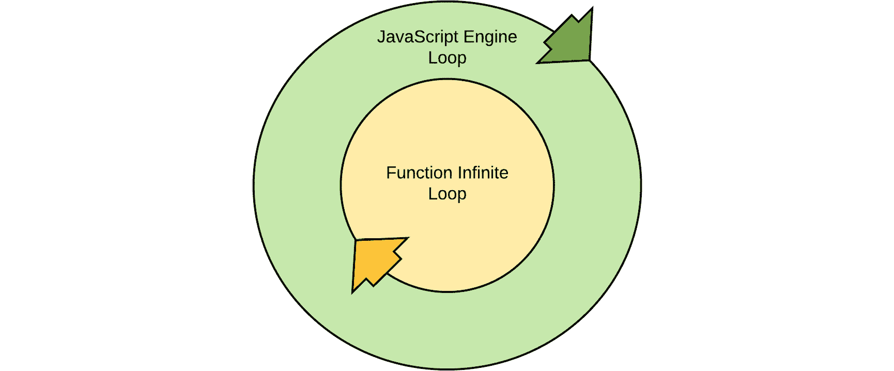

图 6.1：嵌套无限事件循环

由于延迟和重复函数调用是常见的编程需求，JavaScript 语言提供了两个函数，使得计时器简单，无需我们构建自己的循环。这些是 `setInterval` 和 `setTimeout`。

## `setInterval` 函数

`setInterval`是我们之前无限循环的原生实现。前提是，给定一个函数和一个以毫秒为单位的间隔值，JavaScript 将在间隔时间通过时重复执行该函数：

```js
intervalReference = setInterval(timerFun, milliseconds);
```

注意

JavaScript 中的基于时间的执行尽可能接近间隔值。由于底层硬件、操作系统和资源可用性的各种限制，JavaScript 无法保证在执行触发器时的绝对准确性。

我们可以用以下代码重现先前的例子：

```js
var timerFunction = function() {
  var time = new Date().getTime();
  console.log(time);}
setInterval(timerFunction, 500);
// ==> 1558632112316
```

在调用`setInterval`后`500`毫秒以及之后的每个`500`毫秒，这个示例中的函数表达式将被执行。它是异步执行的，所以`setInterval`调用之后的代码将无延迟地执行：

```js
function main() {
  setInterval(() => console.log("executed"), 500);
  console.log("after execution");
  console.log("another message");
}();// ==>   after execution
// ==>   another message
// ==>   executed
// ==>   executed
```

当调用`setInterval`函数时，它本身会返回一个指向结果间隔处理程序的引用，即调用传递的`callback`函数的执行栈。这个引用可以用来在任何时候使用`clearInterval`函数终止间隔循环：

```js
var ref = setInterval(someFunc, 100);
clearInterval(ref);
```

## `setTimeout`函数

`setTimeout`函数与`setInterval`函数工作方式相同，区别在于其传递的`callback`函数只被调用一次。`setTimeout`函数在动画 HTML 页面中的元素或当你希望延迟一段时间的过程时（例如清除一个可见的错误消息或对话框）非常有用：

```js
setTimeout(someFunc, 500);
```

与`setInterval`一样，`setTimeout`函数也返回一个指向其执行处理程序的引用，以便可以使用`clearTimeout`清除定时器。由于`setTimeout`回调只执行一次，在`callback`执行后调用`clearTimeout`没有效果。然而，在它执行之前取消`setTimeout`是完全合理的：

```js
var ref = setTimeout(() => console.log("fire!"), 200);
setInterval(function() {
  console.log("waiting...");
  clearTimeout(ref);
}, 100);
// ==> waiting...
// ==> waiting...
// ==> waiting...
```

通过在第一次定时器迭代后清除其引用，`setTimeout`函数可以被`setInterval`函数模拟，如下所示：

```js
var ref = setInterval(function() {
  console.log("Boo!");
  clearInterval(ref);
}, 500);
// ==> Boo!
```

## 定时器参数

在现代浏览器中（不包括`IE9`及以下版本），`setInterval`和`setTimeout`函数可以接收额外的参数。如果提供了间隔参数之前的任何参数，这些额外的参数将在调用时作为参数传递给`callback`函数。这为自定义定时器函数提供了一种有用的方法：

```js
var handler = function(p1, p2) {
  console.log(p1, p2);
};
setTimeout(handler, 100, "Hello,", "World!");
// ==> Hello, World!
```

如果你预计较老的浏览器会运行你的脚本，可以通过将传递的`callback`包裹在一个匿名函数调用中达到相同的效果：

```js
setTimeout(function() {
  handler("Hello,", "World!");
}, 100);
// ==> Hello, World!
```

## 练习 6.02：实时时钟

现在是时候将你对定时器的知识付诸实践了。在这个练习中，你将创建一个实时页面时钟显示，它会以秒为单位递增，并使用 24 小时数字时钟格式显示完整的时间。这个练习将使用一个 HTML 文件，尽管它很简单。让我们开始吧：

1.  创建一个名为`script`的新文件：

    ```js
    <html>
      <script>
    ```

    `script`标签将包含要在页面中执行的 JavaScript 代码。

1.  接下来，你需要一些占位符变量用于 `seconds`、`minutes`、`hours` 和当前的 `Date` 对象实例：

    ```js
        var secs, mins, hrs, date,
    ```

1.  你将用于计时器的 `handler` 函数也将分配给一个名为 `setTime` 的变量。在其中，你将简单地用当前的时间组件填充前面的变量：

    ```js
        setTime = function() {
          date = new Date();
          hrs = date.getHours();
          mins = date.getMinutes();
          secs = date.getSeconds();
    ```

1.  要将时间输出到页面，你只需更新 `body` 内容。这个模块后面会解释更好的解决方案：

    ```js
        document.body.innerHTML = `${hrs}:${mins}:${secs}`;
    ```

1.  最后，关闭函数并将其分配给一个间隔。将间隔设置为每 `500` 毫秒运行一次，以确保更好的准确性：

    ```js
        }
        setInterval(setTime, 500);
    ```

1.  当 `script` 完成，你应该关闭 `script` 标签块：

    ```js
      </script>
    ```

1.  页面应该以一个包含时钟和关闭 `html` 标签的 `body` 标签块结束：

    ```js
      <body>
      </body>
    </html>
    ```

1.  现在，保存页面并加载到你的浏览器中（或拖动它）。你应该在页面的左上角看到时间显示，并且每秒更新一次。你已经成功构建了第一个基于计时器的 JavaScript 应用程序。

在网页上显示实时时钟是一个实际的应用，尤其是在可能展示全球几个时区时间的公司网站和内部网络中。然而，使用计时器更新页面内容并不仅限于时钟。这个过程同样可以用于更新股票市场价格、实时聊天论坛或几乎任何类型的实时展示。

# JavaScript 事件模型

正如我们之前提到的，JavaScript 引擎使用事件循环。实际上，事件是 JavaScript 引擎及其语言的核心。在最简单的定义中，事件是某种事情发生的通知。这可能是由用户与网页的交互，或者是在浏览器内完成的某个过程的完成。

要使用事件，必须将一个 `callback` 函数分配给事件类型，就像计时器函数一样。然而，通常，事件比简单的计时器更复杂，功能更丰富。

在编程中，事件通知被称为已派发的事件。当 JavaScript 事件被派发时，它们会传递一个事件对象。这对于所有 JavaScript 事件都是成立的。事件对象包含有关派发事件的详细信息，包括事件名称、一个指向包含事件上下文的对象的引用，以及一个指向触发事件的对象的引用。

下表列出了事件对象的属性：

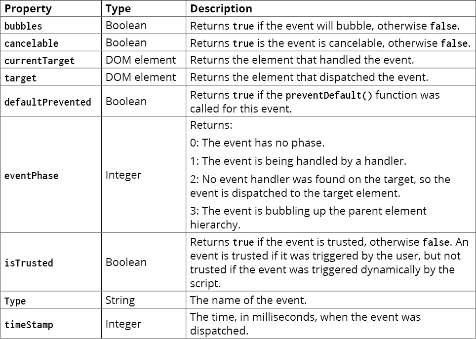

图 6.2：事件对象属性

## 事件冒泡

为了理解事件冒泡，如果我们了解基于浏览器的 HTML 会很有帮助。HTML 是超文本标记语言的缩写，它本身是可扩展标记语言（XML）的衍生。HTML 实际上根本不是一种语言，而是一种声明性信息标记，用于结构化数据，在网站的情况下，是页面内容。

HTML 是一种层次结构，最好将其想象成一个数据树。想象以下页面内容：

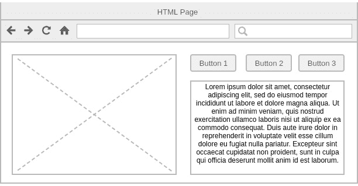

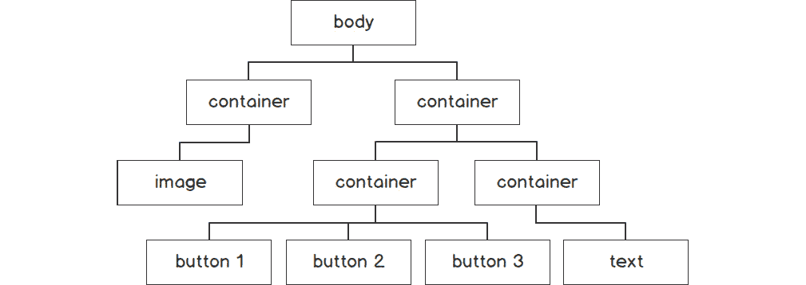

图 6.4：HTML 数据树

前面的树概述了页面的可见内容，但 `body` 节点并不是实际的 HTML 树的顶部。相反，页面内容树从名为 `document` 的节点开始。然后它有一个名为 `html` 的子节点，该节点包含 `body` 节点。

HTML 树中的每个节点在与交互时都会引发事件，即使该节点不是立即可见的。例如，当用鼠标点击页面时，最接近树底部的鼠标箭头下的可见节点将引发一个 `click` 事件。如果已经为该节点分配了一个或多个事件处理器，那么这些处理器将被调用，并将传递一个 `event` 对象。

当事件处理器未分配给该事件的节点或事件被处理但允许事件继续传播时，就会发生事件冒泡。此时，将调用父节点对该特定事件的处理器，并且发生相同的过程。如果事件继续没有被明确阻止，它将 `冒泡` 通过每个父节点，直到达到 `document` 节点。

如果一个节点上存在针对特定事件的多个处理器，任何一个处理器都可以阻止事件，防止其冒泡。不需要所有处理器都阻止事件。

## 遍历节点树

为了处理一个事件，你首先需要向一个节点添加一个事件类型处理器。然而，为了做到这一点，你需要某种方式来获取你希望监听的节点的引用。JavaScript 提供了多种函数，可以根据许多不同的因素选择和获取节点，包括直接命名访问、通过节点树遍历获取以及通过属性值获取。

在你的 HTML 页面中的所有节点中，最容易获取的是 `body` 和 `document` 节点。这两个节点都在全局 `document` 对象上具有简单的属性访问器：

```js
var document = document.documentElement;
var bodyNode = document.body;
console.log(bodyNode);
// ==> <body></body>
```

一旦你有了树的顶部的引用，获取树中其他地方的节点就简单了，只需遍历它。JavaScript 提供了几个属性来获取节点的前一个、兄弟或子节点，每个属性都使用了 `熟悉的关系` 比喻：

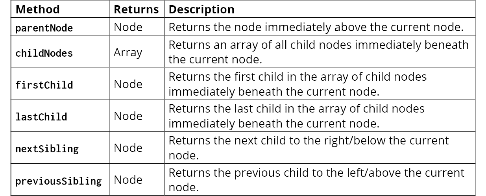

![图 6.5：节点属性及其描述

这些属性都可以从给定的节点中读取。如果找不到相应的节点，则该属性将返回 `null`（或者在 `childNodes` 的情况下返回空数组）：

```js
var image = document.body.firstChild.firstChild;
image
// ==> 
var btn = image.parentNode.nextSibling.firstChild.childNodes[1];
btn
// ==> <button>button 2</button>
```

## 直接节点获取

除了节点树遍历之外，JavaScript 还提供了一种通过提供节点属性过滤器来指定所需节点引用的方法，该过滤器是一个字符串值，它使用特定格式描述所需的节点。

所有 HTML 节点都遵循一定的模式：

+   它们可以打开和关闭，有时在一个标签内完成。

+   它们有一个节点名称或类型。

+   它们可能有一个可选的 `id` 属性，该属性应对于页面是唯一的。

+   它们可能有一个或多个可选的 `class` 名称。

+   它们可能还有其他可选的已知属性，例如 `name`、`styles`、`type`、`value` 或 `src`。

+   它们可能有可选的自定义属性，由页面创建者命名。

节点的签名称为其 `tag`，它定义在尖括号内，节点开始处有一个左向尖括号，节点结束处有一个右向括号。左向括号之后是节点的名称。属性作为 `attribute="value"` 追加到节点上：


图 6.6：HTML 节点结构

节点的结束标签包含节点的名称，并且也被左向和右向的尖括号包围。然而，为了将其与新的开始标签区分开来，其左向尖括号之前有一个正斜杠（`/`）字符。

如果一个节点没有子节点，则可以立即关闭节点而不提供特定的结束标签。这是通过在右向尖括号之前提供正斜杠字符来实现的：

```js

```

节点的属性是其描述。稍后，这些值允许您设置节点的外观和感觉，但它们特别便于节点的数据和身份。因此，向节点添加属性以使其易于获取是完全合法的。`id` 属性就是这样一种值，它仅用于区分标签，并且所有在页面内使用的标签都应该有一个唯一的 `id` 属性，如果有的话。如果存在 `id` 属性，则可以使用 `document` 对象的 `getElementById` 方法获取相关的节点：

```js
var node = document.getElementById("myTagId");
```

由于节点 ID 被认为是唯一的，`getElementById` 方法返回单个节点，或者在找不到匹配节点时返回 `null`。如果由于某种原因，页面包含具有相同 ID 属性值的多节点，则使用该值调用 `getElementById` 将返回页面中找到的第一个元素。

存在其他类似的功能，用于使用其他标签描述符进行查询，例如 `name` 或 `class`。其中大多数返回一个数组，因为预期许多标签可能共享匹配的描述符。以下表格列出了获取标签引用的一些常见函数：

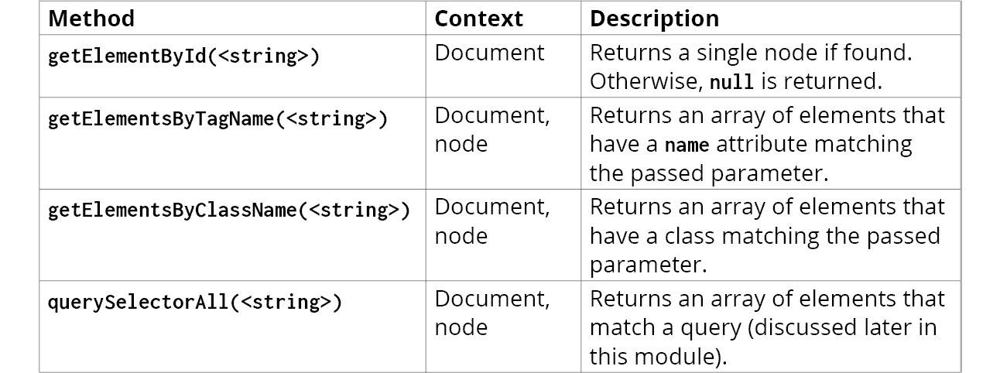

图 6.7：标签引用的常用函数

## 分配和移除事件处理程序

一旦您有了节点引用，您就可以为特定的事件类型分配监听器（或处理程序）。您可以使用 `addEventListener` 函数将监听器分配给节点，该函数接受两个参数，即事件类型作为字符串值和事件处理程序作为函数：

```js
document.body.addEventListener("click", () => alert("I was clicked"));
```

当事件被分发时，事件处理程序会传递一个单一值，称为事件对象。事件对象可能根据处理的事件类型略有不同。实际上，这个对象是特定事件对象类型的实例。例如，基于鼠标的事件，如 `click` 或 `mousedown`，会生成 `MouseEvent` 对象。这些对象与许多其他事件的不同之处在于，它们包含 `x` 和 `y` 值，这些值详细说明了在事件分发时鼠标在网页文档中的坐标：

```js
document.body.addEventListener("click", function(evt) { console.log(evt); });
// ==> MouseEvent {isTrusted: true, screenX: 230, screenY: 499, clientX: 163, clientY: 400, …}
```

在附加事件处理程序时，即使处理程序被分配给相同的事件类型，它也不会覆盖该节点上附加的现有处理程序。实际上，一个节点在任何时候都可能附加任意数量的事件监听器。这样，您的应用程序的多个方面可以独立访问同一对象的相同事件通知，如需。然而，不可能将相同的 `函数引用` 分配给同一事件类型，如下所示：

```js
var display = () => console.log("Clicked");
document.body.addEventHandler("click", () => console.log("I was clicked");
document.body.addEventHandler("click", () => console.log("I was clicked");
document.body.addEventHandler("click", display);
document.body.addEventHandler("click", display);  // this one will not be output
// ==> I was clicked
// ==> I was clicked
// ==> Clicked
```

在前面的示例中，由于 `display` 函数是单一引用，因此第二个监听器分配被简单地忽略。JavaScript 不会重复调用函数超过一次。然而，之前的分配都调用了，因为尽管功能相同，但函数本身具有不同的引用。

如果您想移除事件处理程序，可以使用 `removeEventListener` 方法，该方法接受与其对应方法相同的参数：

```js
document.body.removeEventListener("click", display);
```

`removeEventListener` 方法通过引用查找处理程序关联。这意味着您使用匿名函数所做的任何事件监听器分配都无法使用 `removeEventListener` 方法移除。

注意

如果您销毁了一个附加有事件处理程序的节点，JavaScript 引擎的垃圾回收器不会对其进行清理。在不清理其事件处理程序的情况下移除节点是 JavaScript 中内存泄漏的常见原因，这会导致应用程序性能下降。如果您知道一个节点可能从 `DOM` 中移除，请不要使用匿名函数向它或其子节点添加事件监听器。

## 练习 6.03：标签内容

在这个练习中，您将使用到目前为止所学到的知识来创建一个标签显示。显示将使用页面顶部的三个按钮，底部有一个容器 `div` 标签。当按下按钮时，与按钮处理程序相关的内容将在容器 `div` 标签内显示。让我们开始吧：

1.  首先，创建一个名为**tabs.html**的新文档，并添加起始 HTML：

    ```js
    <html>
      <head>
        <title>Tabbed Display</title>
      </head>
      <body>
    ```

1.  三个按钮将并排放置在一个单独的容器`div`中。每个按钮都将有一个唯一的 ID，这样我们就可以轻松引用它们：

    ```js
        <div>
          <button id="btn1">Tab One</button>
          <button id="btn2">Tab Two</button>
          <button id="btn3">Tab Three</button>
        </div>
    ```

1.  接下来，添加容器`div`。我们将添加一个描述性主体来告知用户页面内容。然而，一旦按钮被按下，该内容将永久消失，并被动态内容所取代：

    ```js
        <div id="container">Click a button!</div>
    ```

1.  当页面的结构就绪后，你现在可以关闭`body`标签并开始`script`块：

    ```js
      </body>  <script>    var btn1 = document.getElementById("btn1"),
          btn2 = document.getElementById("btn2"),
          btn3 = document.getElementById("btn3"),
          container = document.getElementById("container");
    ```

    在这里，我们为需要与之交互的页面中的每个元素创建了一个变量。这使得代码更加整洁和清晰。

1.  接下来，你需要一些内容在按钮被按下时添加，每个按钮一个：

    ```js
        var content1 = "Button 1 was pressed",
          content2 = "Button 2 was pressed",
          content3 = "Button 3 was pressed";
    ```

1.  现在，我们需要连接内容。为此，只需为每个按钮添加一个事件监听器，更新每个容器`div`的内容：

    ```js
        btn1.addEventListener("click", () => container.innerHTML = content1);
        btn2.addEventListener("click", () => container.innerHTML = content2);
        btn3.addEventListener("click", () => container.innerHTML = content3);
    ```

1.  现在，只需关闭打开的标签并保存页面：

    ```js
      </script>
    </html>
    ```

1.  就这样。如果你现在在浏览器中运行页面并点击每个按钮，你应该会看到内容已被更新。

    交互式页面如下：


图 6.8：标签控制练习

这是你对交互式内容的第一次探索。根据用户交互操作页面内容是 JavaScript 的常见需求，也是它擅长的领域。通过仔细规划和良好的编码实践，可以创建出可以模仿几乎所有原生软件应用的 JavaScript 应用程序。

## 冒泡与捕获

到目前为止，你已经看到事件冒泡是从发出事件的节点向上冒泡到树的顶部，但 JavaScript 还提供了一个名为捕获的冒泡的替代方案：

`事件捕获`是指事件处理顺序与冒泡相反，从发出事件的节点到树的底部的捕获通知。这意味着当一个节点被交互时，其附加的事件处理器可能不是第一个拦截事件的。相反，一个父节点（或祖先节点）可能首先接收到事件。如果这些祖先处理器之一阻止了事件，那么引发事件的节点上的处理器可能根本不会被调用：

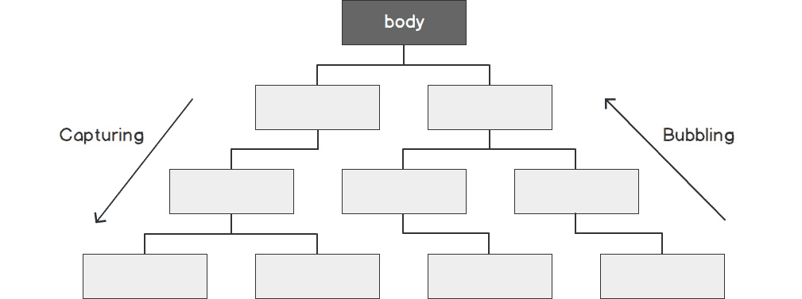

图 6.9：冒泡与捕获

要将事件处理器附加到捕获事件，你只需将一个第三个参数传递给`addEventListener`方法。这个第三个参数被称为`useCapture`参数，是一个布尔值。如果设置为`true`，附加的事件将以捕获模式分配。因此，不向`addEventListener`方法提供`useCapture`参数与提供该参数的`false`相同：

```js
var clickHandler = () => console.log("clicked");
document.body.addEventListener("click", clickHandler);
// ==> clicked
```

附加到捕获事件的处理器位于与冒泡事件监听器不同的空间。在分配捕获事件时，它们不会与冒泡事件冲突。因此，在同一个节点上使用相同的事件类型将函数引用作为冒泡和捕获的事件处理程序，意味着当该事件被派发时，该函数将被调用两次：

```js
var clickHandler = () => console.log("clicked");
document.body.addEventListener("click", clickHandler);
document.body.addEventListener("click", clickHandler, true);
// ==> clicked
// ==> clicked
```

要移除使用`useCapture`设置为`true`添加的事件，你只需将相同的`useCapture`值传递给`removeEventListener`方法：

```js
document.body.removeEventListener("click", clickHandler, true);
```

# JavaScript 事件生命周期

不论哪个节点派发了事件，所有事件通知都从`document`节点开始。然后它们以捕获模式通过树分支向派发事件的节点（即`target`节点）移动。一旦沿该路径的所有适当的捕获处理程序都被调用，事件随后返回到`document`节点，调用所有适当的冒泡处理程序。

当事件沿着树向下传递时，我们称事件处于捕获阶段；当事件返回到`document`节点时，我们称其处于冒泡阶段。当目标节点的处理程序被调用时，无论它是捕获处理程序还是冒泡处理程序，事件都处于目标阶段。

在事件往返旅行的任何一点，它都可能被处理程序阻止，从而防止所有其他事件处理程序被调用。

## 停止事件传播

有时，在处理事件时，你可能需要阻止事件。知道事件可能在页面的其他地方被处理，如果你的应用程序的条件不允许事件继续，那么停止事件可能是有意义的。

例如，如果当用户在`textfield`控件中输入新密码时派发事件，如果密码不符合某些要求，例如字符数太少或包含不允许的字符，那么该事件可能就毫无用处。

JavaScript 提供了两个类似的功能来停止事件：`stopPropagation`和`stopImmediatePropagation`。这两个函数都是事件对象的方法，作为它们的唯一参数传递给事件处理程序。

`stopPropagation`方法将阻止其旅程中进一步节点上的事件处理程序被调用，无论事件是在捕获阶段还是冒泡阶段。然而，如果它们与调用`stopPropagation`的事件处理程序位于同一节点上，它仍然允许所有剩余尚未调用的当前事件类型的事件处理程序执行。`stopImmediatePropagation`方法将停止所有进一步的处理程序，包括当前节点上尚未调用的处理程序：

```js
var handler = function(ev) {
  if (ev.target.value.length < 6) {
    ev.stopImmediatePropagation();
  }
};
```

任何方法都可以在处理程序中的任何位置调用，并且可以在多个处理程序中调用，尽管只有第一个实例会执行。

## 停止事件动作

JavaScript 引擎内部的一些事件会导致动作发生。动作是浏览器对事件的特定响应，它位于你自己的自定义事件处理程序之外。这包括在点击链接时提交`form`或页面重定向。

动作发生在事件冒泡阶段之后，一旦事件完成了其在节点树中的旅程。如果由于调用`stopPropagation`或`stopImmediatePropagation`而停止了事件，动作仍然会发生。

要阻止一个动作，必须调用事件对象的`preventDefault`方法：

```js
var handler = function(ev) {
  ev.preventDefault();
}
```

调用`preventDefault`不会阻止事件通过捕获或冒泡阶段。因此，如果你想阻止事件并防止其动作，你必须调用这两种类型的方法：

```js
var handler = function(ev) {
  ev.stopPropagation();
  ev.preventDefault();
}
```

注意，并非所有事件都可以阻止其触发动作。每个派发的事件都包含一个名为`cancelable`的属性。如果这个属性是`true`，那么可以通过调用它的`preventDefault`方法来取消它。然而，如果属性是`false`，那么调用`preventDefault`将不会对其行为产生任何影响：

```js
var handler = function(ev) {
  if (ev.cancelable) {
    ev.preventDefault();
  }
};
```

`onload`事件就是这样一种无法取消的事件，这是有充分理由的，因为它对于确保浏览器的正常功能至关重要。相反，表单的`onsubmit`事件是可取消的，因为其成功必须由页面的业务逻辑来决定。

## 练习 6.04：条件事件阻止

在这个练习中，你将创建一组链接。每个链接在被点击时都会引发一个`click`事件。在这些链接上方，包含它们的`div`将监听每个链接引发的每个事件，并确定是否应该停止事件传播、停止其动作或两者都停止。让我们开始吧：

1.  让我们从创建一个名为**ev-prev.html**的文档并添加一些 HTML 代码开始：

    ```js
    <html>
      <body>
        <div id="container">
          <a href="https://google.com">Google</a>
          <a href="https://bing.com">Bing</a>
          <a href="https://yahoo.com">Yahoo</a>
        </div>
        <div id="message"></div>
      </body>
    ```

    在这里，我们有一个包含三个链接和一个用于输出消息的次级容器的容器。

1.  接下来，打开一个`script`标签用于 JavaScript，并创建变量来引用`link`容器、链接本身和`message`容器：

    ```js
      <script>
        var container = document.getElementById("container"),
            links = container.children,
            msg = document.getElementById("message");
    ```

1.  当每个链接被点击时，我们希望显示一条消息，显示哪个链接被点击了。因此，我们将向`link`容器附加一个`event listener`，以便当事件冒泡时，处理程序将在那里捕获事件对象并确定哪个链接派发了事件：

    ```js
        container.addEventListener("click", function(ev) {
          msg.innerHTML = `${ev.target.text} clicked`;
          console.log(`${ev.target.text} clicked`);
        });
    ```

1.  然后，我们将为每个链接添加一个行为。第一个将阻止动作，第二个将停止`propagation`，第三个将两者都做：

    ```js
        links[0].addEventListener("click", function(ev) {
          ev.preventDefault();
        });
        links[1].addEventListener("click", function(ev) {
          ev.stopPropagation();
        });
        links[2].addEventListener("click", function(ev) {
          ev.preventDefault();
          ev.stopPropagation();
        });
    ```

1.  最后，关闭`script`标签和`html`标签：

    ```js
      </script>
    </html>
    ```

1.  通过在浏览器中运行此页面，你应该会看到第一个链接将在消息容器中打印`Google`点击，第二个链接将重定向用户到`Bing`网站，而第三个则什么都不做。当点击第二个链接时，消息永远不会显示，因为事件传播在处理程序中被停止。

    现在，你已经成功地将事件序列化并捕获了它们在节点树中冒泡的过程：


图 6.10：事件阻止

# 事件触发器

你已经看到，在与网页交互时，事件是动态分发的，但事件也可以通过你的代码手动触发。

正如我们之前提到的，JavaScript 中的事件是有类型的对象。当一个动态事件被引发时，JavaScript 引擎创建这样一个对象并将其分发。该对象包含一个类型值，它将事件类型作为字符串存储，例如 `click`。

你可以实例化自己的事件对象并分发它们，而不仅仅是依赖于动态创建的事件。你可能有很多原因想要这样做，比如模拟用户交互或轻松调用已分配为事件处理器的代码，而不重复代码。要做到这一点，你只需使用 `new` 关键字创建一个 `Event` 实例，并传递你希望引发的事件类型：

```js
var ev = new Event("click");
```

创建后，你只需使用节点的 `dispatchEvent` 方法来分发它：

```js
someNode.dispatchEvent(ev);
```

调用 `dispatchEvent` 方法的节点成为事件对象的 target 属性。一旦分发，事件就会进入捕获阶段，通过 `DOM` 传递到该节点，然后以正常的方式从它向上冒泡，在移动过程中触发事件监听器。

## 自定义事件

`Event` 对象是 JavaScript 框架提供的最简单的事件类型。实际上，JavaScript 提供的所有其他事件都是简单 `Event` 类型的扩展。然而，`Event` 对象本身并不灵活，并且不提供为事件轻松附加额外数据的方法。为了解决这个问题，JavaScript 语言提供了 `CustomEvent` 类型，即专门为自定义开发者事件设计的事件。

当实例化时，`CustomEvent` 对象接受一个额外的命名参数，称为 `detail`。通过将具有 `detail` 属性的对象作为第二个构造函数参数提供，该属性的值随后对所有拦截该事件的处理器都可用，如下所示：

```js
var event = new CustomEvent("click", {detail: 123});
```

现在，任何可能拦截此事件的处理器都可以通过简单地引用它来检索 detail 值：

```js
var handler = function(ev) {
  var value = ev.detail;  // value is now 123
};
```

`CustomEvent` 不仅用于手动触发原生事件类型；还可以创建自己的事件类型。在创建事件对象时传递给它的名称可以是任何你选择的字符串。通过监听该事件，你能够像处理内置在 JavaScript 引擎中的事件一样处理它：

```js
var event = new CustomEvent("myEvent", {detail: 42});
someContainer.addEventListener("myEvent", someEventHandler);
someNode.dispatchEvent(event);
```

## 原生事件触发器

JavaScript 语言中有许多原生事件类型，一些有动作，一些没有。到目前为止，你已经看到了 `click` 事件的使用，但远不止这些。鼠标事件组就包括 `15` 种不同的事件类型，还有超过 `40` 个不同的事件组，包括以下内容：

+   网络

+   元素聚焦

+   Web sockets

+   CSS 动画和过渡

+   表单

+   打印

+   键盘交互性

+   元素拖放

+   窗口和文档事件

甚至还有通过触摸屏显示交互、虚拟现实头盔、设备电池变化、智能卡事件等发生的事件，还有更多。

## 事件处理器属性

当构建 HTML 页面时，HTML 规范还提供了中缀事件处理表示法。这就是事件处理器在 HTML 节点内部分配的地方。在 HTML 中，中缀事件表示法被称为事件属性。有众多可用的事件属性类型，尽管不如 JavaScript 提供的事件类型多。

事件属性通常具有与它们的原生 JavaScript 事件类型相对应的名称，但前面加上单词 `on`。例如，`click` 事件会被分配给节点作为 `onclick` 属性：

```js
<div id="someNode" onclick="someFunction();"></div>
```

事件属性的价值是一个可执行的 JavaScript 语句，例如函数调用。

DOM 节点只能支持每种类型的一个事件属性；例如，不可能在单个节点中提供两个 `onclick` 属性。然而，通过确保正确使用分号字符来区分不同的语句，事件属性可以在单个属性内执行多个语句：

```js
<div id="someNode" onclick="someFun1(); someFun2();"></div>
```

作为事件属性处理程序调用的函数不会传递事件对象。然而，与典型的事件处理器不同，它们可以用额外的参数调用。例如，要传递包含事件属性节点的一个引用，事件属性函数声明可以传递 `this` 上下文：

```js
<div id="someNode" onclick="someFunction(this);"></div>
```

在这种情况下，`this` 解析为第一个参数，它是对 `div` 节点的引用。

许多开发者认为事件属性是最后的手段，因为它们的包含将视图（HTML）与逻辑（JavaScript）混合在一起。推荐的做法是始终使用 `addEventListener` 动态分配事件处理器。

## 事件和内存

在上一章中，介绍了 `delete` 关键字，并简要提到了内存管理章节。当与事件处理器一起工作时，内存管理变得非常重要。如果一个事件处理器被附加到一个节点上，但该节点随后从页面 `DOM` 中移除，那么它可能不会被 JavaScript 引擎的垃圾回收器（从内存中清理）清理，直到处理器从节点中移除。这尤其适用于事件处理器不是匿名函数的情况。

当使用可能从 `DOM` 中删除的节点的事件时，确保您正确清理您的节点和处理程序。这可能意味着在删除之前移除事件处理器并正确删除变量的内容。

# 与表单一起工作

表单是 HTML 规范的一部分，它独立于 JavaScript 引擎存在，尽管它们也与 JavaScript 完全交互。HTML 表单是使用`form`标签定义的声明性结构。此标签概述了一个可以提交的上下文，其数据被发送到远程服务器位置。

要理解`form`标签的工作原理，了解 HTTP 请求、它们的类型区分以及数据如何在请求中发送是有帮助的。

## HTTP

HTTP 是一个规范，其完整形式为`HyperText Transfer Protocol`。它最初于 1990 年以`HTTP 1.0`的形式发布，并在`RFC 1945`规范中详细说明（其中 1945 是规范编号，而不是年份）。这种传输格式旨在在互联网上传输超文本文档，如`HyperText Markup Language`（HTML）文档。

在 HTTP 规范中，识别了许多可以与`HTTP 请求`一起发送的元数据。这些元数据被称为**头部**，因为它们位于请求包的开始字节中，用于标识如何读取请求。

HTTP 协议提供了一个选项来识别请求包的目的，称为`Method`。有众多`Method`选项可用，尽管它们被接收它们的 HTTP 服务器以不同的方式解析和读取，但它们的使用也可能是简单的上下文相关。最常用的两个 HTTP`Methods`是`GET`和`POST`。

`GET`是一种方法，其简单含义是“`在这个地址获取信息`”，其中地址是请求发送的 URL。当进行`GET`请求时，参数可以作为查询变量或作为路径本身附加到地址上，服务器可以据此以某种方式使用。然而，在`HTTP 协议`的早期版本中，`统一资源定位符`（`URL`）地址仅提供最多`255`个字符，包括协议和域名地址，这对于大量数据，包括文件上传来说很棘手。为了解决这个问题，规范还提供了一个名为`POST`的方法。

`POST`是`GET`的扩展，允许我们包含一个请求`body`。在 HTTP 请求中，`body`是包含在头部之后的包内容；因此，它是实际的包主体：

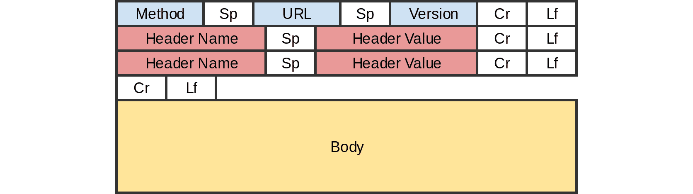

图 6.11：HTTP 包

由于请求包中没有跟随`body`的内容，因此`body`可以比`GET`限制的`255`个字符大得多。

在发送请求的`body`时，发送者可以提供一个`Content-Type`头，该头描述了`body`的格式（或 MIME 类型）。例如，如果`body`是一个`JavaScript Object Notation`（`JSON`）字符串，那么请求的`Content-Type`可能是`application/jpeg`。

## 表单标签

`form`标签自 HTML 公开以来就存在，并在`HTML RFC 1866`规范中有详细说明。`form`标签通常包围了实际表单的元素，对 HTML 页面的用户可见。与任何 HTML 节点一样，`form`标签可以根据需要视觉化或保持不可见：

```js
<form method="POST" action="/data/form-handler.php" enctype="text/plain">
   ...
</form>
```

表单标签的属性包括以下内容：

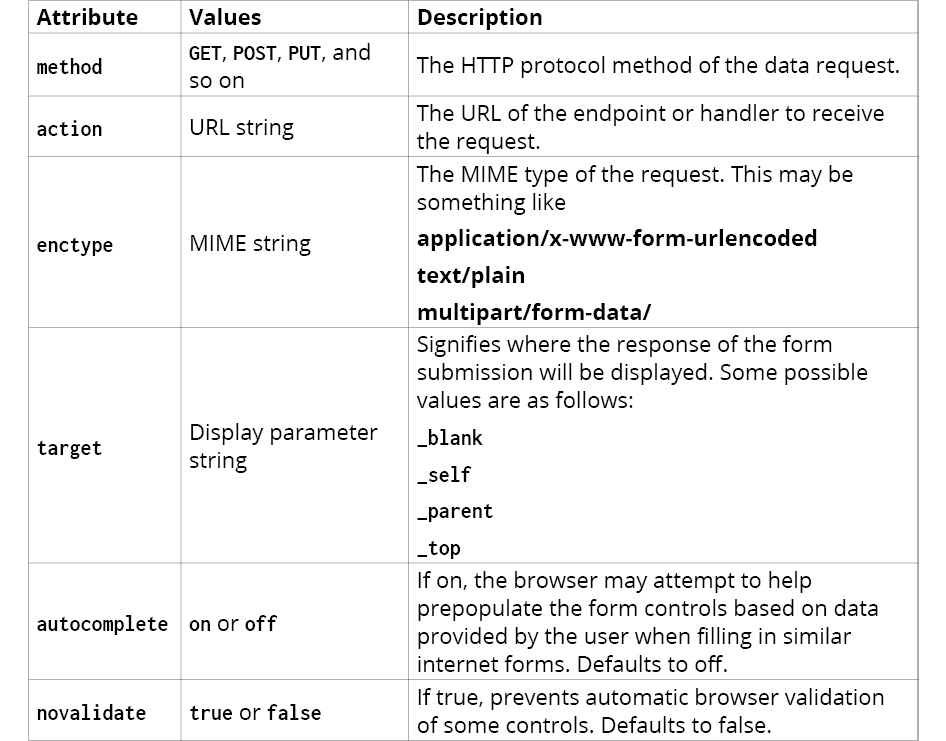

](img/C14377_06_12.jpg)

图 6.12：表单标签属性及其描述

与 HTTP 包规范相比，`method`属性等同于 HTTP 包本身的`method`，`action`与 URL 参数相同，`enctype`与**Content-Type**头值相同。

`form`标签为输入控件组提供了一个逻辑上的请求块。网页中的每个`form`标签都需要提交，以便形成并发送请求。提交可以通过 JavaScript 动态发生，或者通过使用`submit`按钮控件通过用户交互发生：

```js
<form method="POST" action="/data/form-handler.php" target="_top">
  <input type="submit" value="submit" />
</form>
```

当您更喜欢直接的用户交互时，可以使用`submit`或`image`输入控件提交表单，其中后者提供了一种显示样式图形作为提交按钮的方法：

```js
<form method="POST" action="/data/form-handler.php" target="_top">
  <input type="image" src="img/send-btn.png" />
</form>
```

## 使用 JavaScript 提交表单

有时，通过用户交互发送`form`请求可能不合适。相反，表单可能在动画完成后发送数据，或者一旦发现浏览器的功能，就重定向用户。在这些时候，能够使用 JavaScript 动态触发表单的提交非常有帮助。

与所有基于 DOM 的交互一样，首先需要获取表单节点才能提交表单。一旦获取，只需调用其`submit`函数即可提交表单：

```js
var form = document.getElementsByTagName("form")[0];
form.submit();
```

注意，一个页面中可能存在多个表单标签。表单标签可以包括标识和基于样式的属性，就像任何其他标签一样，例如`name`、`id`、`class`和`style`。

## 表单提交事件

`form`标签支持围绕控件和表单处理的一系列有用的事件。其中最有用的事件是`submit`事件。

当表单提交时，会触发`submit`事件，但在实际将请求发送到指定的端点之前。此事件通常用于验证用户提供的表单值，以确保没有明显的错误或确保已填写所有必填字段。

注意

由于`submit`事件在请求发送之前触发，请确保不要使用此事件将用户重定向到另一个页面或执行任何会阻止表单提交完成的事情。如果您希望阻止表单提交，请参阅“防止表单提交”部分。

与许多事件一样，可以使用显式的 HTML 属性语法将`submit`事件处理器分配给表单节点：

```js
<form method="GET" action="/endpoint" onsubmit="myFormHandler()">
```

`submit`事件的功能就像任何其他事件一样，意味着它从`document`节点捕获并冒泡。

## 阻止表单提交

在 HTML 和 JavaScript 中，阻止`表单`提交是一个常见的需求。通常，如果表单验证失败，最好取消提交并向用户显示适当的消息。要取消表单提交，我们可以调用事件的`preventDefault`方法，这将阻止事件的最终操作，就像对其他事件类型所做的那样。另一种方法是函数返回`false`值。

从事件处理器返回`false`与调用事件的`preventDefault`函数具有相同的效果，但它不会停止捕获/冒泡。

如果你的函数正在处理 jQuery 事件，返回`false`与执行`preventDefault`和`stopPropagation`方法调用相同：

```js
function formHandler(ev) {
  if (document.getElementById("password").value().length < 3) {
    alert("Password is too short");
    return false;
  }
};
```

## 重置表单

重置表单意味着将表单恢复到其初始状态。此功能提供了一种将表单恢复到干净状态的方法，或者如果表单已加载默认或原始值，则将这些值返回到每个控制项。

网站用户有时可能需要重置功能，如果他们正在处理复杂值。能够重置表单可以节省用户记住表单中存在的初始值，或者至少快速返回到重新填充表单之前的原始状态。

与提交类似，重置表单可以通过使用重置输入控制项通过用户交互来实现：

```js
<form method="GET" action="/endpoint">
  <input type="reset" value="Reset Form" />
</form>
```

一旦控制项被点击，`表单`将恢复到其初始状态。

重置表单的另一种方法是使用`form`节点的`reset`方法：

```js
document.getElementByTagName("form")[0].reset();
```

注意

`表单`重置操作不能自动撤销。如果需要此功能，首先需要保存表单的所有值，然后逐个重新应用到控制项上。

## 表单重置事件

当重置表单时，浏览器将引发`reset`事件。重置事件的处理器可以显式地应用于 HTML 节点的声明中：

```js
<form method="GET" action="/endpoint" onreset="myResetHandler()">
```

同样，可以通过简单地分配事件处理器来处理表单重置事件：

```js
document.getElementByTagName("form")[0].addEventListener("reset", myResetHandler);
```

## 练习 6.05：简单表单处理

在这个练习中，你将创建一个带有`submit`和`reset`按钮的简单表单。在提交时，表单操作将被取消，但提交的值仍然会被处理并在屏幕上显示。这是创建表单验证系统的第一步。让我们开始吧：

1.  让我们从标准的 HTML 模板开始：

    ```js
    <html>
      <body>
    ```

1.  接下来，创建开头的表单标签。这将赋予一个 ID，以便于获取，并提供一个随机的操作 URL，因为在这个练习中它不会被使用：

    ```js
        <form id="myForm" method="GET" action="http://google.com">
    ```

1.  为了使这更有趣，让我们引入一个简单的`文本`字段控制项。虽然它本身不会被使用，但它将有助于演示重置功能：

    ```js
          <input type="text" value="original text" />
    ```

    输入控制项将在本章下一节中讨论。

1.  现在，你需要两个按钮：一个用于`submit`，一个用于`reset`：

    ```js
          <input type="submit" value="Submit" />
          <input type="reset" value="Reset" />
    ```

1.  最后，让我们关闭 `form` 标签并打开 `script` 标签，准备我们的 JavaScript：

    ```js
        </form>    <script>
    ```

1.  `reset` 按钮处理器将很简单。一旦点击，将在控制台显示一条消息。但是，你不会将处理器附加到按钮的 `click` 事件，因为这样做将无法提供停止 `reset` 的能力，如果你希望这样做的话。相反，事件将被分配给表单的 `reset` 事件：

    ```js
          function resetHandler(ev) {
            console.log("form has been reset");
          };
          document.getElementById("myForm").addEventListener("reset", resetHandler);
    ```

1.  同样，使用 `submit` 处理器，将监听表单的 `submit` 事件。然而，在这种情况下，你将调用 `ev.preventDefault()` 从处理器中，以防止表单实际提交：

    ```js
          function submitHandler(ev) {
            console.log("form has been submitted");
            ev.preventDefault();
          };
          document.getElementById("myForm").addEventListener("submit", submitHandler);
    ```

1.  最后，关闭 `script` 标签和页面：

    ```js
        </script>
      </body>
    </html>
    ```

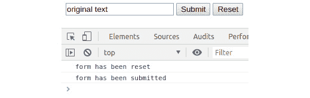

图 6.13：表单按钮

就这样。现在，如果你在浏览器中运行页面，你会看到点击 `submit` 将在控制台显示一条消息，而 `reset` 按钮将显示另一条消息。此外，点击 `reset` 总是将文本字段中的文本恢复到原始文本。

# 表单控制

没有数据发送的表单标签几乎毫无用处。这些数据通常使用 HTML 规范中提供的各种表单控件或小部件提供。在可能的情况下，并且当控件没有子节点时，表单控件通常使用 `input` 节点标签类型。其他控件包括 `select`、`textarea`、`button` 和 `datalist`。我们将在本章的其余部分查看这些控件类型。

## 输入控制

大多数可用于 HTML 表单的控件都是通过 `input` 标签提供的。`input` 标签需要一个 `type` 参数，它显示 HTML 页面中的相对控件：

```js
<input type="text" />
```

在使用 `input` 控制时，现代浏览器中可用的类型如下：

## 按钮控制

`button` 控制看起来非常像 `submit` 和 `reset` 表单按钮。然而，与 `submit` 和 `reset` 不同，`button` 控制没有默认操作：

```js
<input type="button" onclick="buttonHandler();" value="Clickable Button" />
```

`button` 控制还有一个替代的标签格式，我们可以通过使用 `button` 标签来使用它：

```js
<button onclick="buttonHandler();">Clickable Button</button>
```

注意，`input` 格式需要在 `value` 属性中传递一个标签，而 `button` 标签格式需要将按钮文本作为内容传递，使用一个关闭的 `button` 标签，如下所示：


图 6.14：按钮输入控制

按钮控制支持 `click` 事件，或 `onclick` 属性，正如我们在本章前面所解释的。

## 复选框控制

`checkbox` 控制代表“是或否”、“开启或关闭”或“是或否”控制：

```js
<input type="checkbox" checked />
```

在前面的例子中，`checked` 参数是一个无值的属性。当提供时，`checkbox` 默认被选中，并将设置为检查是否重置包含的 `form`。

此实现的另一种方法是提供 `checked` 的值：

```js
<input type="checkbox" checked="checked" />
```

任何无值的属性提供的值都被忽略，因此可以提供任何值：

![图 6.15：复选框输入控件

![图片 C14377_06_15.jpg]

图 6.15：复选框输入控件

`checkbox` 控件支持 `change` 和 `input` 事件。当控制器的 `value` 参数发生变化时，将触发 `input` 事件，而 `change` 事件仅在控制器的 `value` 被提交时触发，例如在失去焦点或按下 *Enter* 键时。通常，当与 `checkbox` 控件一起使用时，这两个事件之间几乎没有区别，尽管被认为始终使用 `change` 事件是更好的选择。

当 `checkbox` 出现在表单中时，只有当它被选中时才会提交其值。如果没有选中，则完全不将任何值传递给处理脚本。

要使用 JavaScript 检查复选框的选中状态，只需查询其 `checked` 参数：

```js
<input type="checkbox" id="check" value="1" checked />
<script>
  var chk = document.getElementById("check");
  console.log(chk.checked);  // ==> true
</script>
```

如果控件被选中，则 `checked` 的值将是 `true`，如果没有选中，则将是 `false`。

要设置控件的 `checked` 状态，只需将一个 `Boolean` 值传递给 `checked` 参数。

## 无线电控制

`radio` 控件类似于 `checkbox` 控件，但除了处理多选选项。与 `checkbox` 控件不同，`radio` 控件不能通过点击来取消选择。相反，必须选择不同的选项，从而在提交 `form` 时至少提供一个结果：

```js
<input type="radio" name="color" value="red" checked />
<input type="radio" name="color" value="blue" />
<input type="radio" name="color" value="green" />
```

`radio` 控件的 `name` 属性提供了分组功能。如果从之前的 `radio` 控件提供了不同的 `name`，则新控件属于不同的组。只有通过点击同一组内的 `radio` 控件，才能取消选择之前选中的 `radio` 控件：

![图 6.16：单选按钮输入控件

![图片 C14377_06_16.jpg]

图 6.16：单选按钮输入控件

与 `checkbox` 控件一样，`radio` 控件是通过 `checked` 属性来选择的。如果页面中存在 `radio` 控件组，但没有设置任何控件为 `checked`，则不会选择任何这些 `radio` 控件。在这种情况下，提交父表单意味着 `radio` 组不会出现在发送的数据中。

要动态检查特定的 `radio` 按钮（从而取消选中当前选中的按钮），需要有一种方法来引用希望检查的特定 `radio` 控件。有几种方法可以实现这一点，例如为组中的每个 `radio` 控件提供唯一的 `id`，但最有效的方法是简单地引用其在组中的索引。例如，要选择组中的第二个 `radio` 按钮，我们可以这样做：

```js
<input type="radio" name="color" value="red" checked /> red
<input type="radio" name="color" value="blue" /> green
<input type="radio" name="color" value="green" /> blue
<script>
  var chk = document.getElementsByName("color")[1];  // select index 1
  chk.checked = true;
</script>
```

`getElementsByName` 返回与传入标准匹配的所有元素的数组。因此，提供索引可以实现对给定元素索引的直接访问。

`radio` 控件支持 `input` 和 `change` 事件，就像 `checkbox` 控件一样。

## 文本控件

`text` 控件是所有 `input` 控件类型中最基本的，用于创建自由文本字段。这些字段允许使用键盘输入单行文本字符串，尽管也可以使用浏览器上下文菜单将其粘贴到其中。通过将 `input` 控件的 `type` 属性设置为 `text` 来创建文本字段：

```js
<input type="text" name="color" value="red" />
```

可以通过提供正则表达式形式的 `pattern` 属性值来限制 `text` 控件的允许内容。例如，可以使用以下代码将文本字段限制为仅接受数值：

```js
<input type="text" name="num" pattern="[0-9]" title="Enter a number" />
```

当使用前面的文本字段时，提交除数字以外的值将导致表单提交终止，并在 `text` 字段旁边显示一个工具提示，提示“输入一个数字”。在这种情况下，表单数据将不会提交：


图 6.17：具有模式属性的文本输入控件

`text` 字段的另一个特性是 `placeholder` 属性。占位符允许在字段本身中存在临时文本：

```js
<input type="text" name="num" placeholder="Enter a number" />
```

此文本不是控件的值，因此提交容器表单不会产生 `placeholder` 值。同样，如果 `placeholder` 可见，查询文本控件的 `value` 属性也不会返回 `placeholder` 值：


图 6.18：具有占位符属性的文本输入控件

## 密码控件

`password` 控件与 `text` 字段控件非常相似，但有一些区别：

```js
<input type="password" name="pass" />
```

与 `password` 控件的主要区别是，控件中存在的任何值都向用户呈现为一系列点，称为散列，而不是作为值文本本身。散列的目的是使值对用户不可读，从而提供一定程度的保护，防止不受欢迎的注意。因此，用户预计已经知道字段中包含的值。在提交表单时，值会以明文形式正确地随表单数据传递：


图 6.19：密码输入控件

与 `text` 控件相比，`password` 控件的另一个区别是，无法突出显示其内容并复制它。尝试复制 `password` 控件的内容将被忽略。这防止恶意用户将 `password` 控件的值复制并粘贴到文本编辑器或其他此类软件中，从而使值文本清晰可读。然而，尽管如此，仍然可以通过 JavaScript 引用控件并以此方式输出其值，如下所示：

```js
<input type="password" id="secureValue" value="secret" />
<script>
var pass = document.getElementById("secureValue");
console.log(pass.value);  // ==> "secret"
</script>
```

## email、tel 和 url 控件

`email`、`tel` 和 `url` 控件是文本字段控件的现代变体。它们可以通过简单地将 email、tel 或 url 作为输入控件的类型属性传递来创建：

```js
<input type="email" />
<input type="tel" />
<input type="url" />
```

单独来看，这些控件在功能上并没有比标准的 `text` 控件提供额外的功能。这些控件的属性、事件和视觉外观都与 `text` 控件以及彼此相同。然而，当与提供屏幕键盘的设备（如手机和平板电脑）一起使用时，这些类型的好处就显现出来了。通过使用这些 `input` 类型之一，而不是 `text` 控件，向其中输入文本时显示的可见键盘通常面向控件的内容类型：

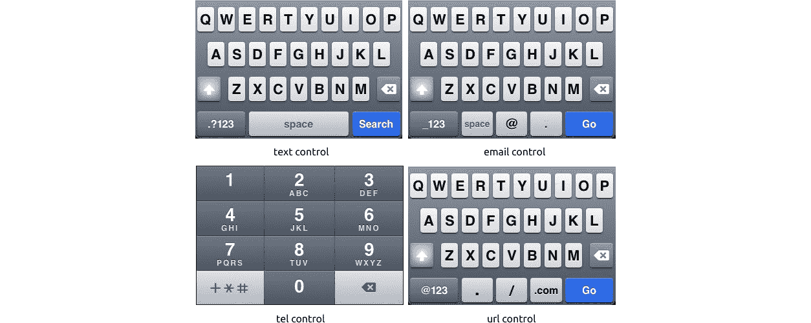

图 6.20：文本、电子邮件、电话和 URL 控件的移动键盘

注意，需要做额外的工作来确保字段的内容适合字段格式。这可以通过使用 `pattern` 属性和表单验证逻辑来实现。

## 隐藏控件

`hidden` 控件是一个非常有用的字段，用于存储要传递给表单处理程序（如远程服务器端点）的数据，而网页的用户不会意识到其存在。正如其名称所暗示的，`hidden` 字段对用户来说是隐藏的，并且没有可见的存在：

```js
<input type="hidden" />
```

当使用 `hidden` 控件时，输入标签提供的许多属性都是无关紧要的，因为它不是用户会与之交互的控件。然而，它的 `value`、`id` 和 `name` 属性将非常有用，并且可以像 `text` 控件一样使用和操作。

## 数字控件

`number` 字段看起来与 `text` 字段相似，但会自然地将所有文本输入约束为数值、加减符号和点符号：

```js
<input type="number" />
```

在某些浏览器中，数字控件还会显示小的上下箭头按钮，可以用来增加或减少包含的值：


图 6.21：数字控件

`number` 控件的内容可以通过使用其 `min`、`max` 和 `step` 属性进一步约束。`min` 和 `max` 属性是自解释的，它们将可能的数字输入值约束到这些属性。例如，提供一个 `min` 值为 0 将确保不能输入负数，而 `max` 值为 100 将确保值永远不会超过 100：

```js
<input type="number" min="0" max="100" />
```

使用 `min` 和 `max` 并不意味着超出这些约束的值不能从键盘物理输入到控件中，而只是说在点击提供的箭头按钮时不能违反这些约束，或者当提交表单时，任何超出这些参数的提供的值都将被接受：


图 6.22：数字控件约束

步进属性提供了一种方法来增加箭头按钮增加或减少值的速率。例如，如果控件中允许大数字，每次点击增加 1 可能不太实用。因此，设置更大的步进值将允许通过更少的点击来改变值：

```js
<input type="number" min="-100000" max="100000" max="100" />
```

当使用步进时，点击箭头按钮时值的改变将以步进值的速率从控件中当前存在的任何值开始改变。因此，设置步进值为 5 不会将包含的值限制为 5 的倍数。

## 图像控制

`image`控件作为一个`img`标签和`submit`输入控件的混合体工作。这里的想法是你可以使用图形图像作为提交按钮。你使用`src`属性指定图像源，就像我们使用`img`标签一样：

```js
<input type="image" src="img/img.png" />
```

使用`image`输入控件的一个额外好处是，一旦点击，鼠标相对于图像的 x 和 y 坐标也会作为`x`和`y`值与表单数据一起发送。如果，例如，你希望在表单提交中将地图上的某个位置注册为一部分，或者如果你希望确定用户点击的图像区域，这可能会非常有用：

```js
<form method="GET" action="/handler.php">
  <input type="image" src="img/img.png" />
</form>
// will submit to a URL like "/handler.php?x=14&y=27
```

`image`控件的可用性意味着表单可以超越 HTML 按钮控件提供的限制进行样式化，并且可能非常受网页设计师的欢迎。

## 文件控件

当上传文件到远程服务器时，`file`控件是必需的。实际上，如果不以某种方式使用`file`控件，就无法动态上传文件。这是由于安全性的原因，在没有用户知情的情况下动态上传文件是不道德的：

```js
<input type="file" name="file" />
```

`file`控件通常以`text`字段和`label`对的形式呈现给用户。可以样式化控件，使得这些项目中的一个或两个对用户不可见。按钮和标签中提供的文本由浏览器固定，并且需要一些极端的样式才能更改。

![图 6.23：文件控制

![img/C14377_06_23.jpg]

图 6.23：文件控制

当使用`file`控件将文件上传到服务器时，设置周围表单的`enctype`参数为`"multipart/form-data"`非常重要。此值告知表单提交在发送到服务器时如何编码数据。如果不这样做，将阻止文件上传，因为文件通常需要多个数据包才能成功传输所有文件的数据字节。

文件控件支持`accept`属性值，该值可以启用接受文件格式类型的过滤。此属性可以支持多个值，但它们必须作为 MIME 类型（文件类型的预定义字符串表示）提供：

```js
<input type="file" name="file" accept="image/png, image/jpeg" />
```

在前面的示例中，只有具有.png、.jpg 或.jpeg 扩展名的文件在通过控件选择文件时才会可见。

## 文本区域控件

虽然 `text` 控件非常适合接受单行文本，但 `textarea` 控件是捕获多行文本值所必需的：

```js
<textarea name="description">
    Some default text.
</textarea>
```

如其名所示，`textarea` 控件支持文本区域，因此它比许多 `input` 控件都要大。与 `button` 标签一样，`textarea` 控件由一个开标签和一个闭标签组成。在标签之间提供的任何文本都构成了其文本内容。

尽管文本区域不使用 value 属性，但其内容仍然可以通过 JavaScript 中的 `value` 属性进行读取和设置，如下所示：

```js
var desc = document.getElementsByName("description")[0];
console.log(desc.value) // ==> outputs "Some default text"
desc.value = "Some other text"; // ==> updates the value of the textarea to "Some other text"
```

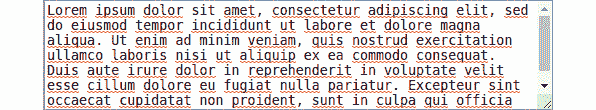

图 6.24：文本区域控件

## 选取控件

`select` 控件提供了下拉列表控件的功能。与 `textarea` 类似，`select` 控件使用一个开标签和一个闭标签，这两个标签共同构成了控件的主体。然而，控件内的项目是通过一个额外的标签提供的，称为 `option`：

```js
<select name="colors">
  <option value="">--Please choose an option--</option>
  <option value="red">Red</option>
  <option value="blue">Blue</option>
  <option value="green">Green</option>
</select>
```

`select` 控件的 `option` 元素通常包含两个值：`value` 属性和 `text` 主体。这些简单地被称为 `value` 和 `text`。在开 `option` 标签和闭 `option` 标签之间的文本是用户在控件中可见的字符串，而 `value` 属性是在选择该特定 `option` 元素时提交表单时要发送的字符串。在添加 `option` 元素时，可以省略 `value` 属性，但这将意味着将 `text` 值与表单数据一起发送。

与复选框和单选按钮类似，可以通过将 selected 属性传递给选项值之一来预先选择一个选项值：

```js
<select name="colors">
  <option value="">--Please choose an option--</option>
  <option value="red" selected>Red</option>
  <option value="blue">Blue</option>
  <option value="green">Green</option>
</select>
```

选取控件可以以两种格式显示。标准格式是一个下拉（或组合）列表控件：


图 6.25：选取控件

如果控件需要支持同时选择多个选项，则会显示第二种格式。因此，控件以永久打开的列表控件形式显示，具有可滚动的选项。`select` 控件可以通过提供 `multiple` 属性来支持多个选定的选项：

```js
<select name="colors" multiple>
  <option value="">--Please choose an option--</option>
  <option value="red">Red</option>
  <option value="blue">Blue</option>
  <option value="green">Green</option>
</select>
```

当显示时，用户在选择项目时必须按住键盘上的 Ctrl 键。如果没有按 Ctrl 键，则选择一个项目将取消选择之前选定的任何项目：


图 6.26：具有多个属性的选取控件

当使用下拉 `select` 控件时，可以通过查询 `select` 控件的 `value` 属性来获取所选 `option` 的值：

```js
var select = document.getElementsByName("colors")[0];
console.log(select.value); // ==> outputs selected color
```

还可以通过查询 `selectedIndex` 属性来输出所选项目的索引。索引值从 0（零）开始，对应第一个元素：

```js
var select = document.getElementsByName("colors")[0];
console.log(select.selectedIndex); // ==> outputs numerical index of selected option
```

然而，当查询多选列表时，事情并不那么简单。如果多个项目被选中，查询`value`属性将简单地返回列表中第一个选中的项目，从而忽略所有其他选中的项目。相反，开发者需要利用`select`控件的`options`属性和`option`项的`selected`属性来识别哪些项目被选中。

`select`控件中的`options`属性返回所有包含在其内的`option`元素，无论它们的选中状态如何。`option`项的`selected`属性只是其选中状态的简单条件；如果选中则为真，如果没有选中则为假。因此，通过结合这两个值，可以通过简单的循环识别选中的`option`元素，如下所示：

```js
var selectedItems = [];
var select = document.getElementsByName("colors")[0];
for (let opt of select.options) {
  if (opt.selected) {
    selectedItems.push(opt.value);
  }
}
console.log(selectedItems); // ==> outputs array of selected values
```

## 活动六.01：对模型进行更改

本章涵盖了大量内容，但你现在应该具备制作可视内容所需的知识。在这个活动中，你的角色是创建一个简单的表单，该表单请求输入新`待办事项`条目的标题和描述。当提交时，这些数据将被发送到我们在上一章中创建的动作处理器。

一旦你的表单就位并且其数据正在被处理，模型功能必须更新以接收这些数据。创建一个能够接收`CREATE`动作事件并将它们适当传递给模型的处理器。

由于模型中没有视觉提示表示数据已成功存储，因此对模型的任何更新都应导致发送通知事件。这样，应用程序的其他区域可以根据数据变化做出相应的响应。你的项目经理要求从模型中发送一个名为`CHANGED`的自定义事件。这将通知任何感兴趣的方，数据已被添加、更新或从模型中删除。

为了验证`CHANGED`事件是否工作，在页面顶部创建一个消息横幅，该横幅将短暂显示消息“`待办事项模型已更新`”。此消息应存在三秒钟，然后被移除。

你的项目经理要求将这些信息作为自定义事件发送，以便由动作处理器捕获。此事件应与模型已识别的动作类型相匹配。因此，请确保以`CREATE`事件的形式发送对象。

将以下 HTML 保存到名为`index.html`的文件中：

```js
<html>
  <head>
    <title>Create TODO</title>
    <script src="img/model.js"></script>
    <script src="img/create_todo.js"></script>
  </head>
  <body onload="loadHandler();">
    <div id="notifications"></div>
    <form id="todo_form" />
      <label>Title:
        <input type="text" id="title" />
      </label>
      <label>Description:
        <textarea id="description"></textarea>
      </label>
      <input type="submit" value="Create TODO" />
    </form>
  </body>
</html>
```

此 HTML 应包括上一章中的模型，但还应包含一个包含此活动逻辑的新 JavaScript 文件。

以下是这个活动的预期输出：

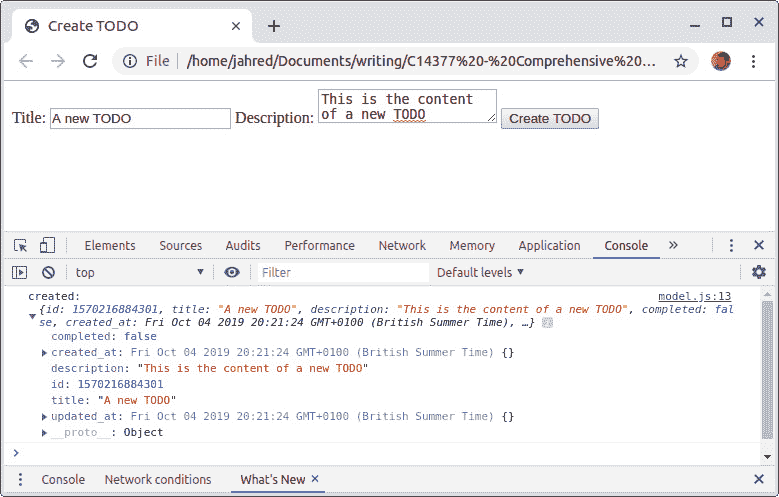

图 6.27：待办事项提交表单

按照以下步骤完成此活动：

1.  向模型添加一个自定义事件处理器。此处理器应接收`CREATE`状态变化，并使用事件主体的新`TODO`详细信息更新模型。

1.  将 `loadHandler` 函数添加到 `create_todo.js` 文件中。这个处理函数应该监听提交按钮的 `click` 事件，但也监听模型发出的自定义 `CHANGED` 事件。

1.  在 `create_todo.js` 文件中添加一个处理函数来处理 `CHANGED` 事件本身。这个处理函数应该暂时在 `notifications` 标签内显示一条 `The TODO model has been updated` 消息。

1.  将 `TODO` 添加到 `create_todo.js` 文件中。这将执行当 `submit` 按钮点击事件被触发时。这个处理函数应该解析表单控件中的值，并在它们有效的情况下，通过一个新的 `CREATE` 自定义事件将它们分发出去。如果任何数据无效，那么应该在 `notifications` 标签中暂时显示足够的错误消息。

1.  当模型更新时，添加一个 `CHANGED` 事件分发。事件体应包含一个添加的类型和一个包含新 `TODO` 详细信息的值。

如果你运行 HTML 页面，你将期望在提交表单时看到消息被写入屏幕。记住，模型将接收和发送事件。它不会被直接联系。处理函数将确保事件被正确附加，并且数据已经被正确解析，以便可以发送到模型。

注意

这个活动的解决方案可以在第 728 页找到。

# 摘要

这本书中第一个使用 JavaScript 在 HTML 页面上，以及第一个解释事件消息系统抽象性质的章节。理解这些概念对于在 JavaScript 中构建有用的网络应用程序非常有价值。

在本章中，你已经探索了事件消息冒泡和捕获的各种细微差别，以及如何使用它们来控制应用程序内部的信息流。你还看到了如何阻止这些事件，以及如何创建你自己的自定义事件。

通过采用本章中你学到的工具和技能，你将拥有一个基础的工具库，这样你就可以处理任何大小或复杂性的应用程序。这些技能将在本书的其余部分得到磨练，同时拓宽你对这个强大语言可能性的认识。

在下一章中，你将更深入地研究 JavaScript 事件循环，并更深入地了解底层技术。
