# 7. 拆卸引擎盖

概述

到本章结束时，你将能够区分单线程和多线程执行；描述 JavaScript 的执行过程；展示调用栈和内存堆如何与其他运行时元素交互；编写与 JavaScript 的垃圾回收过程协同工作的代码；并在浏览器中调试与内存相关的问题。

在本章中，我们将探讨 JavaScript 在浏览器中的执行方式以及它如何管理重要的系统资源，如内存。

# 简介

在前两章中，你学习了 JavaScript 的一些核心概念，了解了`事件循环`的概念，并探讨了 JavaScript 如何处理**内存管理**的过程。在本章中，我们将更详细地探讨这些语言方面，并学习如何编写与 JavaScript 的一些底层功能协同工作的代码。

对于开发者来说，在职业生涯中取得很大进展而没有对 JavaScript 的一些核心概念及其周围的概念有坚实的理解是很常见的。确实，完全有可能成为一名成功的开发者，编写出坚实、具有商业价值的应用程序，而从未完全掌握本章涵盖的主题。

那么，为什么我们应该了解 JavaScript 的内部工作原理呢？我们难道不能只是编写我们的代码，让 JavaScript 处理细节吗？嗯，这种方法的缺点是，有时事情并不完全按照计划进行，我们需要能够理解底层发生了什么，以便重写使应用程序出现错误或性能下降的代码部分。想象一下，你是一名拉力赛车手。你只需要对如何驾驶汽车有基本的了解，就可以沿着赛道驾驶你的汽车。这种技能水平可能让你到达终点线，但绝对不能让你赢得任何比赛。

为了与其他驾驶员区分开来，你需要提高你的技能和经验水平。当然，仅仅练习技能会随着时间的推移而帮助你提高，并让你能够直观地了解幕后发生的事情——这适用于驾驶汽车和用 JavaScript 编写计算机程序——但更深入地了解实际涉及的过程将使你能够自信地制定计划和做出决策，以便你知道具体想要控制系统的哪些部分。

为了提供一个更具体的编程示例，想象一下你正在测试同事的代码，你无法理解为什么页面似乎加载得如此缓慢，为什么在某个操作期间变得无响应，或者为什么应用程序消耗了过多的系统资源。这类性能问题并不一定会破坏应用程序，甚至可能对每个用户都不可见。但它们确实会影响软件的可使用性和用户体验，这对 SEO 页面排名和网站在最终用户中的受欢迎程度有连锁反应。了解底层发生的事情可以帮助你编写更好的代码，更快地调试代码，使你的开发者生活更轻松，并为用户提供更流畅的体验和更成功的应用程序。

通过掌握本章所涵盖的知识，你编写的代码将最大限度地利用 JavaScript 编程语言及其运行时环境。

# JavaScript 执行和事件循环

JavaScript 是一种单线程语言，这意味着它将所有的操作都排成一条线，并逐个执行。许多其他语言是多线程的，也就是说，它们能够同时执行多个操作线程。每种执行方法都有其优缺点，主要围绕效率与复杂度展开，但在这里我们不会深入探讨这些。正如我们马上要看到的，JavaScript 的调用栈会逐个处理操作，按照后进先出（LIFO）的原则。

LIFO 描述的是从数据结构中添加和删除元素的过程——在本例中，是从栈中。正如其名所示，最后添加的元素是第一个被移除的——就像在桌子上堆叠书籍一样。

## JavaScript 运行时

运行时环境是一个允许软件在系统上运行的应用程序。它是正在运行的软件与其运行系统之间的桥梁，并提供对系统资源（如内存和文件系统）以及运行时和环境变量的访问。在 JavaScript 的情况下，运行时通常是——但并不总是——浏览器。

JavaScript 运行时有不同的实现方式，它们处理执行的具体方式各不相同。每个实现都使用了优化，这可能导致实际过程与这里描述的不同。

然而，从理论角度来看，JavaScript 运行时可以有效地分解为几个关键组件和过程：

+   JavaScript 引擎

+   环境/浏览器 API

+   消息队列/回调队列

+   事件循环

将 JavaScript 运行时环境和执行分解为以下关键组件，可以表示如下：

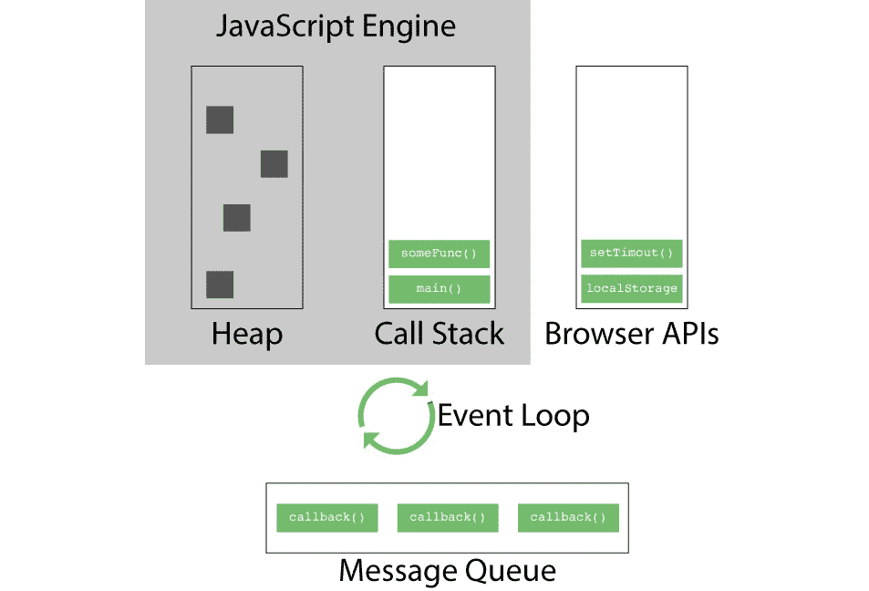


图 7.1：JavaScript 运行时概述

让我们逐一查看这些组件，以更好地理解它们的功能。

## JavaScript 引擎

JavaScript 引擎是一段运行 JavaScript 代码的软件，通过`Node.js`（用于服务器端 JavaScript 执行）等过程，将高级 JavaScript 源代码转换为低级机器代码。V8，像大多数现代浏览器一样，使用**即时编译**过程来执行 JavaScript 代码，这意味着代码是在运行时编译的，而不是像旧编译过程那样提前编译。

我们在这里关注的 JavaScript 引擎的两个元素是**内存堆栈**和**调用栈**，这两者都将在稍后进行解释。请注意，前面的图示显示事件循环是独立于 JavaScript 引擎的，因为通常预期 JavaScript 运行时会实现并管理事件循环。然而，许多 JavaScript 引擎实现了它们自己的事件循环过程，这可以作为运行时环境的后备。

注意

默认情况下，Node 在 V8 JavaScript 引擎上运行。然而，正在开发使用不同引擎的 Node 的替代实现。**Node-ChakraCore**，它使用微软的 ChakraCore JavaScript 引擎，是这样一个项目，并且正在积极开发中。另一个是**SpiderNode**，尽管在撰写本文时，这个项目的发展已经停滞。

## 环境 API

在浏览器的上下文中通常被称为 Web API 或浏览器 API，这些是运行 JavaScript 的环境提供给 JavaScript 的接口。例如，浏览器提供了对`LocalStorage`的访问，以及我们已在前面章节中介绍过的`setTimeout()`和`setInterval()`等方法。在浏览器之外运行的 JavaScript 将有不同的需求，因此运行时会为它提供不同的接口。Node.js 是一个流行的服务器端 JavaScript 运行环境，我们将在本书的后面部分进行介绍。对于 Node.js 来说，拥有文档对象模型（DOM）通常没有太多意义，因此，Node 提供了更适用于服务器端代码的 API，例如用于执行`filesystem`的`FileSystem` API。

如我们很快就会看到的，环境 API 是 JavaScript 执行**异步操作**能力的一个关键组成部分。

## 消息队列

消息队列（也称为`setTimeout`函数的延迟时间已过期，或者当发生事件并且有相应的事件监听器时，例如当用户点击按钮并且按钮附加了点击事件监听器时。这些操作按照**先进先出**（**FIFO**）的顺序发生，就像你在超市结账处找到的队列一样。消息队列本身并不执行函数——它只是一个在调用栈完成其操作之前暂时存放它们的地方。操作执行的时间由事件循环决定。

## 事件循环

事件循环是通过将消息从消息队列添加到调用栈的过程。事件循环监视调用栈和消息队列，如果调用栈为空，则消息队列中最老的消息（第一个）将被推送到栈上执行。只有当栈上的所有函数调用都返回后，后续的消息（函数调用）才会被推送到栈上。

## 调用栈

调用栈跟踪 JavaScript 的函数调用。当一个函数被调用时，一个**栈帧**（由函数的名称（或“匿名”，对于匿名函数）和函数调用者的地址引用组成）被推送到栈顶。如果这个函数调用另一个函数，那么第二个函数的新帧会被推送到栈顶，位于上一个帧之上。当函数返回——无论是显式还是隐式——相应的栈帧就会被从调用栈中弹出，代码执行从函数调用之前的位置继续。与消息队列不同，调用栈以 LIFO（后进先出）的顺序处理帧：栈帧被添加到和从栈顶移除，就像在桌子上堆叠书籍一样。当调用栈为空时，事件循环将决定是否将消息队列中的消息推送到调用栈，或者允许新的栈帧被添加到调用栈以供后续函数调用。

## 内存堆

内存堆是 JavaScript 引擎在运行时用于动态读取和写入对象的未排序内存区域。我们将在本章的后面部分详细讨论 JavaScript 中的内存管理。

## 事件循环实战

本节解释我们将用来演示事件循环实战的代码，并提供关于异步代码执行的一个简要先导。

在你选择的浏览器 JavaScript 控制台或代码编辑器中，三个简单的函数声明如下：

```js
function firstCall() {
  console.log('I'm logged first!!");
  secondCall();
}
function secondCall() {
  console.log('I'm second...");
  thirdCall();
}
function thirdCall() {
  console.log('I'm last.");
}
firstCall();
```

在这个简单的代码片段中，我们声明了三个函数，然后调用这三个函数中的第一个。`firstCall`函数在控制台记录了`'I'm logged first'`字符串，然后调用下一个函数`secondCall()`。这个函数记录了`'I'm second...'`字符串，随后调用我们的第三个函数`thirdCall()`。`thirdCall()`简单地记录了`'I'm last.'`字符串

当我们运行此代码时，你期望在控制台看到什么？希望它非常明显，我们将看到以下日志：

```js
>I'm logged first!!
>I'm second...
>I'm last.
>undefined
```

在这种情况下，每个函数调用都被添加到调用栈中，依次执行，然后从栈顶弹出。因此，我们以正确的顺序看到了来自三个函数的字符串。你可以在以下屏幕截图中看到每个函数调用的栈帧：

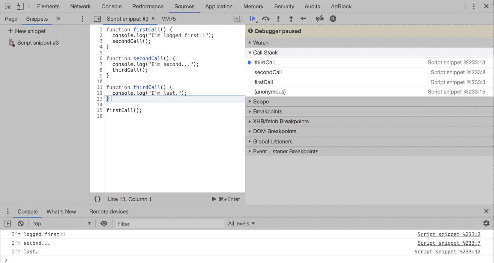

图 7.2：演示调用栈中的执行顺序

现在，让我们通过在第二个函数块中添加一个`setTimeout()`函数来对我们的代码进行一个小改动。所以，让我们看看如果你编写并运行代码，这次三个字符串将如何被记录：

```js
function firstCall() {
  console.log('I'm logged first!!");
  secondCall();
}
function secondCall() {
  setTimeout(function() {
    console.log('I'm second...");
  }, 0);
  thirdCall();
}
function thirdCall() {
  console.log('I'm last.");
}
firstCall();
```

逻辑上讲，我们控制台日志的顺序应该保持不变——毕竟，`setTimeout`的延迟是`0`毫秒，所以它应该会立即在控制台日志中执行，对吧？

然而，我们发现顺序已经改变：

```js
>I'm logged first!!
>I'm last.
>undefined
>I'm second...
```

那么，你认为这里发生了什么？我们将逐行分析源代码，看看 JavaScript 运行时是如何处理每个函数的。

首先，调用`firstCall()`函数，并将一个新的栈帧推入该函数调用的调用栈顶部。该函数包含对控制台对象的`log()`方法的调用，参数是一个字符串类型的值`'I'm logged first!!'`。这在上面的图中被突出显示：

![图 7.3：调用 firstCall() 后的调用栈演示

![图片 C14377_07_03.jpg]

图 7.3：调用 firstCall() 后的调用栈演示

将字符串`'I'm logged first!!'`记录到控制台，调用`secondCall()`函数，并在栈顶为`secondCall()`推入一个新的栈帧。这里与原始代码片段不同之处在于，这个函数包含对`setTimeout()`函数的调用，它是浏览器 API 的一部分，因此这个函数目前被移出主 JavaScript 执行线程。`setTimeout()`函数以`0`毫秒的延迟被调用，之后将一个包含`secondCall()`函数中`console.log()`调用的引用的消息传递到消息队列。现在，这个消息坐在消息队列中，耐心地等待由`event`循环处理：

![图 7.4：演示 setTimeout() 方法被分配到消息队列

![图片 C14377_07_04.jpg]

图 7.4：演示 setTimeout() 方法被分配到消息队列

现在，让我们看看`secondCall()`函数是如何调用`thirdCall()`的。为这次函数调用在调用栈上推入另一个新的栈帧。它使用字符串`'I'm last.'`调用`console.log()`，该字符串被打印到控制台：

![图 7.5：最终函数调用的结束

![图片 C14377_07_05.jpg]

图 7.5：最终函数调用的结束

在这一点上，`thirdCall()`没有其他操作要执行，因此它隐式地将值`undefined`返回给`secondCall()`，并且`thirdCall()`的调用栈帧从调用栈中弹出。然后`secondCall()`将`undefined`返回给`firstCall()`，并且`secondCall()`的调用栈帧从栈中弹出。接下来，`firstCall()`的调用栈帧从栈中弹出，并将`undefined`返回给主进程：

![图 7.6：显示函数返回后的空调用栈

![图片 C14377_07_06.jpg]

图 7.6：显示函数返回后的空调用栈

现在，我们可以看到调用栈上唯一剩下的帧是匿名的主进程，并且主进程没有调用其他函数。事件循环看到调用栈可用，并且消息队列中有一个等待的消息，因此它为待处理消息中引用的回调函数推入一个新的栈帧。这个回调函数是我们的剩余 `console.log()` 调用，带有字符串 `'I'm second…'`：

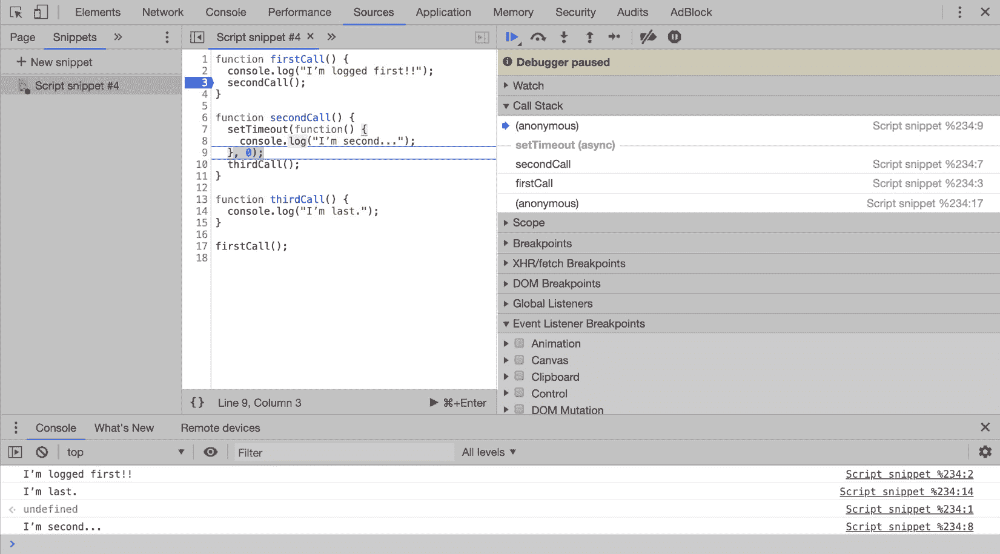

图 7.7：显示 console.log 调用栈帧

最后的 `console.log` 调用被执行，字符串被打印到控制台，然后调用栈帧从调用栈中弹出，再次只留下匿名的主进程留在栈上。

这展示了尽管 JavaScript 是单线程的，但在之前调用的函数等待完成的同时继续执行代码是可能的。除了 `setTimeout` 之外，浏览器还内置了许多其他函数和 API，我们将在下一章中探讨更多这些内容。

## 练习 7.01：与事件循环一起工作

让我们看看如何将这一知识应用到更现实（尽管简单）的应用中。本练习的目的是说明事件循环如何在我们的应用中产生一些意外的行为，并了解我们如何与事件循环一起工作，为我们的应用提供有用的功能。让我们开始吧：

1.  我们将有一个包含两个 `<div>` 元素的 HTML 文件，其 body 中的 ID 分别为 `status` 和 `result`。应用的目的将是运行一个函数并在 `result` div 中显示结果。我们知道我们的函数将需要相当长的时间才能运行，因此我们还将结合状态功能，以便让用户了解应用中正在发生的事情。在这个例子中，我们的主函数将是一个任意计算，需要几秒钟才能完成。在现实生活中，这可能是一类复杂的计算，或者是从外部源（如数据库或 API）获取数据的函数。加载 `index.html` 文件：

    ```js
    <!-- index.html -->
    <!DOCTYPE html>
    <html>
      <head>
        <script src='event-loop.js'></script>
      </head>
      <body>
        <span id='status'></span>
        <span id='result'></span>
      </body>
    </html>
    ```

1.  在一个名为 `event-loop.js` 的单独的 JavaScript 文件中，我们将编写一组函数来构建我们的应用。首先，我们向窗口对象添加一个事件监听器，这样在 DOM 的内容加载完成之前（`DOMContentLoaded` 在浏览器完成 DOM 树结构时触发，不包括任何样式表或图像）其余的代码不会运行：

    ```js
    // event-loop.js
    document.addEventListener('DOMContentLoaded', () => {
    ```

1.  在此之后，我们将两个具有 `status` 和 `result` ID 的 `<span>` 元素分配给两个恰如其分的变量：

    ```js
      let statusSpan = document.getElementById('status');
      let resultSpan = document.getElementById('result');
    ```

1.  接下来，我们定义了两个函数，`showStatus()`和`doCalculation()`。`showStatus()`函数接受一个名为`statusText`的参数，该参数将被设置为`statusSpan`的`innerText`属性，从而在页面上显示我们传递给`showStatus()`的任何文本：

    ```js
      let showStatus = (statusText) => {
        statusSpan.innerText = statusText;
      };
    ```

1.  另一个函数`doCalculation()`执行我们的计算，然后将结果设置到`resultSpan`变量的`innerText`属性中：

    ```js
      let doCalculation = () => {
        let result = 0;
        for(var i = 0; i< 10000000000; i++) {
          result = result + i;
        };
        resultSpan.innerText = `The result is ${result}`;
      };
    });
    ```

1.  因此，为了将这些结合起来，我们可以在`DOMContentLoaded`回调函数的末尾调用函数，如下所示：

    ```js
    showStatus('Calculation running, please wait... Maybe for quite a while...');
    doCalculation();
    showStatus('Calculation finished, here is the result:');
    ```

1.  尝试运行此代码，看看它是否按预期工作。不是很好，对吧？当我们第一次打开页面时，它会加载一段时间，然后显示`Calculation finished`状态和结果。但我们从未看到`Calculation running`状态：

图 7.8：应用程序第一版的结果

那么，为什么我们看不到第一个状态呢？当我们通过设置 DOM 节点的`innerText`属性等方式更新 DOM 时，DOM 树本身会更新，然后浏览器将渲染树重新绘制到浏览器窗口中。这是两个独立的步骤，重绘步骤发生在当前调用栈完成之后。所以，根据我们对事件循环的新理解，我们应该能够看到正在发生的事情。当我们第一次调用`showStatus()`时，DOM 被更新，但浏览器还没有重新绘制页面。然后，调用`doCalculation()`，执行线程被阻塞，直到计算完成。`showStatus()`函数第二次被调用，并带有`Calculation finished`字符串，此时，浏览器使用我们传递给`showStatus()`第二次调用的`Calculation finished`字符串重绘渲染树。

为了使我们的应用程序更符合我们的规范，在查看解决方案之前，先自己尝试一下：

```js
showStatus('Calculation running, please wait... Maybe for quite a while...');
setTimeout(() => {
  doCalculation();
  showStatus('Calculation finished, here is the result:');
},0);
```

通过将`doCalculation()`的调用和`showStatus()`的第二次调用添加到`setTimout()`函数中，在第一次`showStatus()`函数执行后，调用栈被清空，此时浏览器重绘页面，显示预期的`Calculation running`字符串。这是一个更好的实现，因为它让用户了解应用程序正在做什么：


图 7.9：在计算运行时显示状态

## Stack Overflow

调用栈是称为——你猜对了——栈的数据类型的一个例子。你可以简单地将栈视为对象的容器（在调用栈的情况下，栈帧代表函数和参数）。调用栈可以容纳的帧数是有限的。现在，我们将看看调用栈满了会发生什么，这是开发者面临的一个常见问题，也称为栈溢出。（在 V8 JavaScript 引擎中，它有不同的名称，但理论是相同的。）

例如，当开发者尝试编写一个递归函数但未能编写基例和/或终止条件时，这种情况就会发生。此时，递归应该停止。对于新开发者来说，考虑到可能绕过这些点的每个边缘情况可能很棘手。

首先，让我们看看一个简单的栈溢出例子，之后我们将探讨一个更贴近实际的例子。

给定以下代码，让我们看看在调用`callMe()`函数时，JavaScript 引擎会发生什么：

```js
function callMe() {
  nowCallMe();
}
function nowCallMe() {
  callMe();
}
```

这段代码会发生什么应该是相当明显的，但仍然，让我们看看调用栈中这个过程的一些步骤。

当我们调用`callMe()`时，一个新的栈帧被添加到该调用的调用栈中：

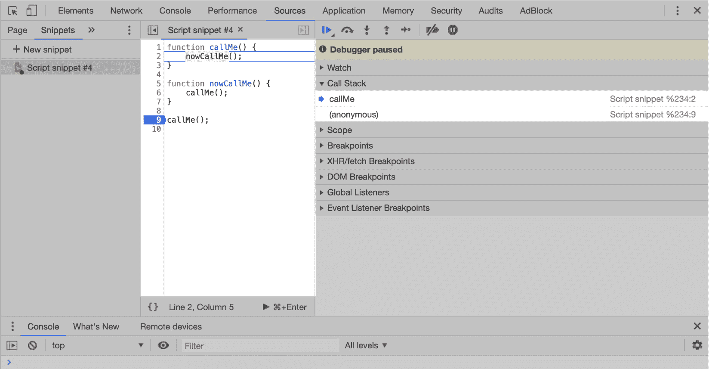

图 7.10：第一个栈帧被添加到调用栈中

在`callMe()`内部，另一个函数`nowCallMe()`被调用，为该函数调用添加一个栈帧到栈中。`nowCallMe()`反过来调用`callMe()`，向调用栈中添加一个新的栈帧，以此类推，两个函数依次调用对方，每次调用都会在栈中添加一个新的栈帧。在这种情况下，JavaScript 执行线程没有其他地方可去——代码中没有条件会导致线程从这个循环中移动：

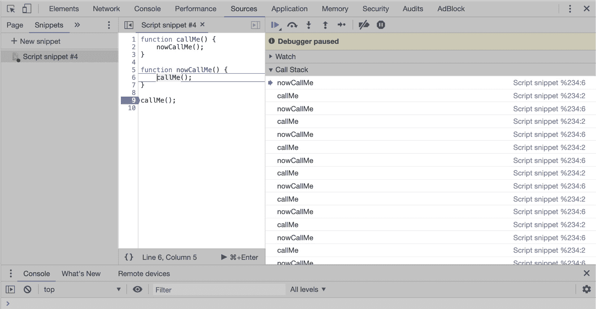

图 7.11：调用栈正在填充栈帧

这个循环会继续向调用栈中添加栈帧，直到栈的极限。在 V8 JavaScript 引擎的实现中，栈中帧数的限制通常在 16,000 左右，尽管它可以更高或更低，这取决于每个帧的内容、使用的变量和其他因素。（在本章末尾，我们将编写一个函数来计算不同 JavaScript 引擎和环境的栈限制。）如果超过这个限制，引擎会抛出一个栈溢出错误，V8 将其称为`Maximum call stack size exceeded`：

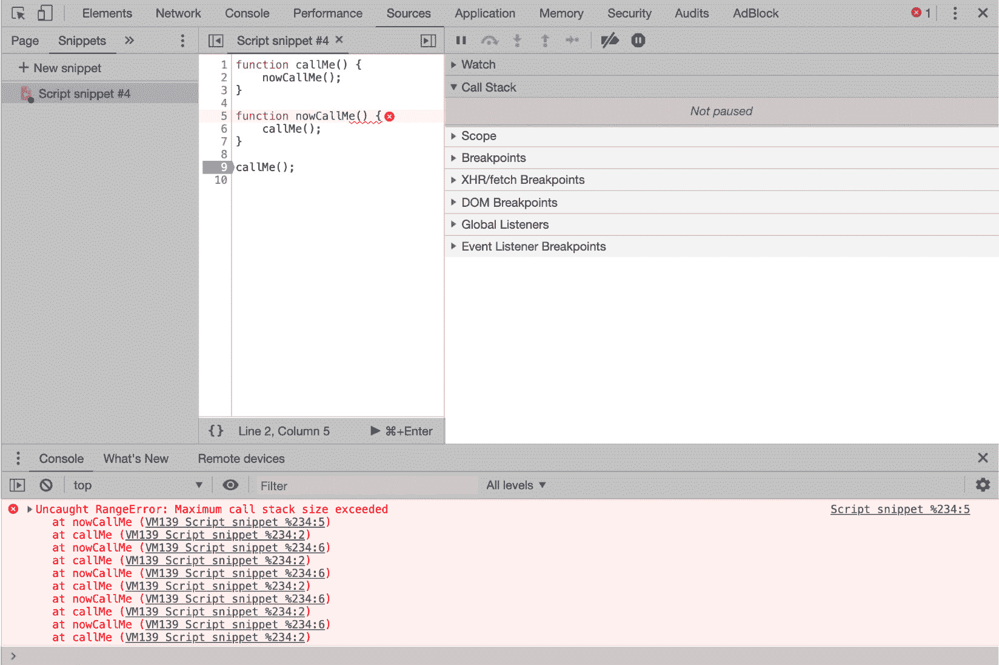

图 7.12：栈溢出错误

注意

可以在 V8 JavaScript 引擎中更改调用栈大小限制。要做到这一点，只需使用带有 `stack-size=[value]` 标志启动环境——无论是 Node、Chrome 还是其他实现——但请注意，这仅应用于调试或实验——你当然不希望编写期望以除默认调用栈大小之外的任何大小运行的代码。

现在，让我们看看一个更贴近现实生活的例子，稍后我们将看看如何修复它：

```js
function countdownByTwo(num) {
  if (num === 0) return console.log(num);
  console.log(num);
  countdownByTwo(num - 2);
}
```

这个函数是 **递归** 的一个例子，我们将在本书的后面部分更详细地探讨。这个函数的作用可能一开始并不明显，所以让我们将其分解成几个步骤。

函数接收一个数字并递归地调用自身，每次调用从 `num` 参数中减去 2。假设我们用 `10` 作为参数调用它，如下所示：

```js
countdownByTwo(10);
```

函数首先检查 `num` 是否等于 `0`，如果是，它将返回一个包含 `0` 值的控制台日志，并且此函数的执行将结束（这是我们的终止条件）。目前，`num` 等于 `10`，所以这个 `if` 语句是 `false`，执行继续到下一行。

下一条记录将 `num` 的值记录到控制台，然后继续到下一行。

现在，函数再次调用自身，这次 `num` 的值减去 2——在我们的例子中是 `8`。这个过程会继续。

通过使用 `10` 作为参数调用前面的函数，我们将看到 `10`、`8`、`6`、`4`、`2` 和 `0` 这些数字按预期记录到控制台。

但如果我们用奇数调用这个函数会发生什么？尝试用 `11` 作为输入调用相同的函数。你会看到我们的终止条件 `num=== 0` 永远不会发生，因为 `num` 从 `1` 变到 `-1`。

## 练习 7.02：Stack Overflow

本练习的目标是重写栈溢出函数，使其能够处理尽可能多的其他输入。考虑所有可能被调用此函数的参数，以及函数将如何处理每一个。让我们开始：

1.  让我们通过一些可能的输入来确保我们考虑到所有可能的情况，从而最大限度地减少错误发生的风险。以下是我们需要小心的一些边缘情况：

    +   `num` 输入是奇数。

    +   输入为 0。

    +   此输入小于 0。

    +   输入为空或不是 `number` 类型。

1.  目前，让我们假设我们希望函数在输入不是数字或为负数时返回，如果输入为 0，则希望函数将 0 记录到控制台并返回。请按以下方式编写函数：

    ```js
    function countdownByTwo(num) {
      if (typeof num !== 'number' || num< 0) return;
      console.log(num);
      countdownByTwo(num - 2);
    }
    ```

    在这里，我们使用`typeof`运算符添加了一个终止条件，以确定输入`num`是否为预期的数字。如果不是数字类型或是一个小于`0`的数字，我们将返回`undefined`。如果`num`是一个数字，并且它大于或等于`0`，那么函数将记录`num`的值，并再次以`num` `–2`调用自身，然后这个循环会重复。

1.  通过对函数进行这些更改，我们考虑了初始输入为奇数的情况，这可能会绕过原始函数中的终止条件。我们还在考虑`num`不是`number`类型的情况；比如说，一个字符串或一个对象。但还有一些不那么明显的边缘情况我们需要注意。让我们看看当我们调用这样的函数时会发生什么：

    ```js
    countdownByTwo('bananas' * 2)
    ```

    结果表明，将`bananas`乘以`2`没有任何意义：JavaScript 无法将结果强制转换为数值，因此它导致了一个`NaN`值。

    这对我们函数意味着什么？为了回答这个问题，我们需要确定`NaN`属性的数据类型。你可能会认为运行`typeof NaN`会返回除了`number`之外的其他任何值，但你会错的。正如我们在上一章中看到的，`NaN`是`Number`对象的一个属性，并且确实属于`number`类型。这导致另一个堆栈溢出，函数会重复记录`NaN`，直到达到最大调用堆栈大小。

1.  当调用函数时使用`Infinity`也会出现类似的问题，因此很明显，我们需要在`isFinite()`函数中添加另一个检查，以返回其输入是否为有限且合法的数字，以处理这些边缘情况：

    ```js
    function countdownByTwo(num) {
      if (typeof num !== 'number' || num< 0 || !isFinite(num)) return;
      console.log(num);
      countdownByTwo(num - 2);
    }
    ```

1.  这个函数被用来移除`typeof`运算符检查。现在，我们为这个函数提供了一套相当健壮的终止情况。可能还有其他检查我们想要实现，例如限制函数将计数从哪个数字开始的大小。例如，如果我们想确保输入小于`10,000`，我们可以修改我们的`if`语句如下：

    ```js
    if (num< 0 || num> 10000 || !isFinite(num)) return;
    ```

这会导致以下输出：


图 7.13：`countdownByTwo()`函数的多种输入输出

在这个练习中，我们看到了一个基本示例，说明了我们可能无意中编写了与 JavaScript 引擎工作不佳的代码，我们应该尽可能处理代码可能遇到的所有不同边缘情况。

到目前为止，在本章中，我们探讨了 JavaScript 运行时，它在概念上是什么，以及它包含的过程和组件。我们详细探讨了 JavaScript 引擎——特别是 V8 实现——以及它的调用堆栈和内存堆如何与其他运行时元素交互。

我们还查看了一种常见的调用栈错误，以及确保我们的代码不会达到最大调用栈大小的办法。

# 内存管理

现在，我们将注意力转向计算机硬件的另一个核心方面——它的内存。内存管理是 JavaScript 中软件开发的一个重要但常常被忽视的方面。内存管理简单来说就是为构成我们程序的各个数据结构分配、使用和释放系统内存。

不同的编程语言在处理内存管理时采用两种主要方法：**显式分配和释放**以及**自动分配和释放**。当用像 C 语言这样的显式内存管理语言编写软件时，软件开发者的任务是告诉编译器何时分配内存以及在任何给定阶段为软件分配多少内存。开发者还必须决定何时该内存不再需要，并明确告诉编译器释放它。这增加了开发者的工作量，并可能导致令人沮丧的错误被引入。

自动内存管理另一方面消除了开发者显式分配和释放内存的需求，这在很大程度上使得开发者的工作变得更简单。编译器在两个主要阶段从操作系统请求内存：编译时的静态分配和运行时的动态分配。现代 JavaScript 引擎使用**即时编译**，它利用了不止一个编译器——一个基线编译器——和一个或多个优化编译器，这些编译器重新编译并缓存代码的部分，使其更高效。这形成了一个编译、优化和反编译/重新编译的连续循环。结果是 JavaScript 代码在运行时持续编译和重新编译，这在一定程度上模糊了静态和动态内存分配阶段。

内存分配步骤基本上是直接的：JavaScript 引擎确定它需要的内存量，并从操作系统请求它。然后根据程序的需求读取和写入内存。内存管理的最后阶段，即释放，是我们需要在此处关注的。

## 垃圾回收器

JavaScript 引擎有一个额外的应用称为垃圾收集器，它处理运行时的内存自动释放。垃圾收集器使用一个称为标记-清除的过程来识别不再需要的对象并将它们从内存中移除。它是通过从一个根对象开始——例如，全局的 window 对象——遍历由根引用的每个对象来完成的。然后它检查那些对象引用的所有子对象和孙对象，从而绘制出从根可访问的所有对象。任何从这个图中断开连接的，因此无法由根对象访问的，都会被标记为删除，并随后从内存中移除：

```js
let cat = {
  name: 'Professor Meow"
}
```

让我们看看以下图表：


图 7.14：对象之间的引用

在这个简单的例子中，根对象有一个对`cat`对象的引用，而`cat`对象有一个对其`name`属性的引用，该属性是一个值为`Professor Meow`的字符串。垃圾收集器将看到这些引用，并将`cat`对象及其`name`属性标记为可访问的，它们不会被收集。

如果我们现在将`cat`重新赋值为`null`，我们将移除根对象和`cat`的`name`属性之间的引用链：

```js
cat = null; 
```

让我们看看以下图表：


图 7.15：引用丢失，内存释放

`cat`对象仍然是全局对象的属性，值为`null`，但任何不是由另一个链接到根对象的`cat`属性引用的`cat`属性都将被垃圾收集器从内存中移除。

我们可以扩展这个例子来展示从多个其他对象引用一个对象如何保留其在内存中的位置：

```js
let mammal = {
  hasTeeth: true,
  furry: true
}
let cat = {
  name: 'Professor Meow",
  class: mammal
}
let dog = {
  name: 'Captain Woof",
  class: mammal
}
```

让我们看看以下图表：


图 7.16：同一对象的多个引用

`cat`、`dog`和`mammal`对象都是全局对象（在垃圾收集器中称为`root`）的属性，`cat`和`dog`对象通过它们的**类**属性引用`mammal`对象。

如果我们现在将`mammal`对象重新赋值为`null`，然后再将`cat`对象重新赋值为`null`，那么通过`cat`对象从`global`对象到`mammal`对象的引用以及它的直接引用都将被断开。然而，由于我们通过`dog`对象对`mammal`对象还有另一个引用，`mammal`对象仍然可以从`global`对象访问，并且不会被垃圾收集器收集。

你可以看到，通过无意中保持对象引用，程序可能会占用比所需更多的内存。这对于大数据集来说尤其令人烦恼。

## 内存泄漏

垃圾回收对我们开发者来说是一个方便的过程，因为它减少了手动管理内存的工作量。但它是一把双刃剑；垃圾回收是自动发生的——我们无法触发垃圾回收过程，也不知道 JavaScript 引擎何时会决定进行垃圾回收运行——因此我们很容易忘记内存管理的潜在陷阱。但是垃圾回收并不是一个完美的过程，或者至少它并不总是按我们可能期望的方式运行。它通常会失败，无法释放实际上不再需要的内存。这不是垃圾回收过程中的错误或错误，这只是问题的一个症状：在执行过程中，一个对象是否会被再次需要的确定性只能由开发者来回答。

当一块内存被分配但保持对根对象的链接，即使在程序中不再需要时，它也永远不会被释放，并且将保持分配状态，从而占用系统内存，直到软件执行结束。这是一个内存泄漏，不难想象它们可以成为大问题，或者频繁发生。当我们在功能强大的机器上开发应用程序时，我们可能不会明显地发现我们的应用程序正在遭受内存泄漏，因此避免常见的错误并密切关注应用程序的内存使用情况是很重要的。

让我们看看一些常见的内存泄漏场景，并看看我们如何避免它们。

## 事件监听器

内存泄漏最常见的方式之一来自事件监听器。考虑以下代码：

```js
document.getElementById('scrollable').addEventListener('scroll', function() {
  console.log('I've been scrolled!")
})
```

在事件监听器中使用匿名回调函数是很常见的，并且它会按预期工作（只要有一个 ID 为`scrollable`的元素）。然而，通过使用匿名函数，我们无法在稍后需要时移除事件监听器，这意味着一旦添加了这个事件监听器，它将在整个程序执行期间保持原位，并且根据函数的不同，每次调用都可能向内存中添加对象。为了解决这个问题，让我们声明一个命名函数，然后将该函数传递给事件监听器：

```js
let scrollHandler = function () {
  console.log('I've been scrolled!")
}
document.getElementById('scrollable').addEventListener('click', scrollHandler)
```

现在我们有了处理函数而不是匿名函数，如果我们想在程序中稍后移除事件监听器，我们可以使用`removeEventListener`方法：

```js
document.getElementById('scrollable').removeEventListener('scroll', scrollHandler)
```

## 分离的 DOM 节点

JavaScript 对 DOM 节点所做的任何引用都将阻止该节点的内存分配被释放，即使该节点随后被从 DOM 中移除。

例如，假设我们有一个想要添加到 DOM 中的图像源数组。将父 DOM 节点存储在一个变量中并通过这个变量引用添加图像是有意义的：

```js
let imageParent = document.getElementById('image-wrapper');
imageSources.forEach(imgSrc => {
  let tempImg = document.createElement('img');
  tempImg.src = imgSrc;
  imageParent.appendChild(tempImg);
});
```

因此，现在，我们已经将所有附加到 DOM 上的图像都处理完毕，但我们还创建了对图像父元素的额外引用；在 DOM 树中有一个引用，通过 JavaScript 变量，即`imageParent`。假设在程序稍后我们需要删除图像父元素：

```js
document.body.removeChild(imageParent);
```

这将删除具有 ID 为`image-wrapper`的 DOM 节点，但变量及其所有附加的子`img`元素仍然被`imageParent`变量引用，并且仍然会占用内存，永远不会被垃圾回收器收集。

在这种情况下，简单的解决方案是在从 DOM 中删除`imageParent`之后，将`imageParent`变量重新赋值为`undefined`。

## 全局变量

由于标记-清除算法会寻找与内存对象图根节点相关联的所有引用，因此全局对象的任何变量（在基于浏览器的 JavaScript 中是`window`对象，在 Node.js 中是`global`对象），都将始终被引用，因此永远不会被垃圾回收器收集。

尽可能避免在全局对象上声明变量是一种良好的实践，换句话说，不要污染全局命名空间。避免这样做有几个很好的理由，其中之一是避免由此产生的内存泄漏。

当变量在全局对象上显式声明时，这通常是相当明显的，但有一些情况可能导致意外的全局变量：

```js
function makeGlobalCat() {
  cat = 'I'm a cat"
}
makeGlobalCat();
```

这个函数创建了一个未声明的变量`cat`，它将隐式地成为`global`对象的一个属性，即使它是在函数内部创建的：

```js
function makeGlobalDog() {
  this.dog = 'I'm a dog"
}
makeGlobalDog();
```

同样，使用`this`关键字将创建一个全局变量。你可以在函数内部使用`var`、`let`或`const`声明一个变量，它将具有该函数的函数级作用域，而不是具有全局作用域，就像未声明的变量那样。在 JavaScript 文件顶部使用`use strict`语句也是一个好主意，这将导致在尝试创建未声明的变量时抛出错误。

## 识别内存泄漏

尽管我们尽了最大努力，内存泄漏仍然可能悄悄地进入我们的代码。它们通常并不明显，因为它们消耗的内存量可能很小，它们可能增长相对较慢，这意味着除非它们在许多小时或几天内持续运行，否则它们可能不会影响应用程序的性能。即使当你发现你有内存泄漏时，找到根本原因也可能很棘手。

## 练习 7.03：识别内存泄漏

让我们用一个简单的例子来看看 Chrome 的开发者工具如何帮助我们识别我们是否有内存泄漏。让我们开始吧。

1.  在 Chrome 中打开一个新标签页，打开`菜单` > `更多工具` > `开发者工具`，然后转到`源`标签页：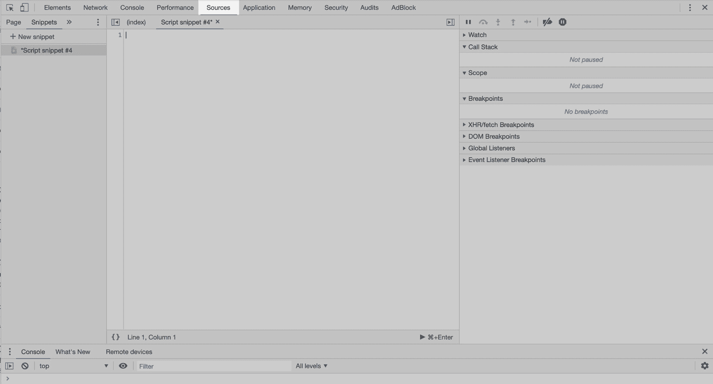

    图 7.17：一个空的代码片段

1.  在窗口的左上角点击 `'+ New snippet'` 并添加以下代码以设置我们的内存泄漏：首先，我们创建一个新的 `div` 类型的 DOM 元素并将其分配给名为 `imageWrapper` 的变量：

    ```js
    // Create a div element
    let imageWrapper = document.createElement('div');
    ```

    注意

    每个现代浏览器都有自己的开发者工具集。然而，对于处理内存泄漏，Chrome 的开发者工具最为有用。

1.  接下来，我们声明三个函数来模拟一些用户与我们的页面交互。第一个函数 `loadImages()` 创建 50 个新的图像元素，并给它们添加一个包含 `1,024 b` 字符串的数据属性。这类似于加载图像并将它们添加到 `imageWrapper`：

    ```js
    function loadImages() {
      for (let i = 0; I < 50; +i) {
        let img = document.createElement('img');
        img.data = new Array(1024).join('b');
        imageWrapper.appendChild(img);
      } // Add 50 child images to the 'imageWrapper'
    }
    ```

1.  下一个函数 `add()` 简单地将 `imageWrapper` 元素添加到文档体的末尾，我们的第三个函数 `remove()` 将用于移除该图像包装器。

    ```js
    function add() {
      document.body.appendChild(imageWrapper);
    } // Add the 'imageWrapper' div to the end of body
    function remove() {
      document.body.removeChild(imageWrapper);
    } // Remove the 'imageWrapper' div from the body
    ```

1.  现在，让我们编写最后一个函数来将这些三个函数结合起来：

    ```js
    function process() {
      for (let i=0;i<1000;i++) {
        loadImages();
        add();
        remove();
      }
    }
    ```

1.  这个最后的函数模拟多次添加和移除图像包装器，因此每次添加 50 张新图像。一个现实世界的例子可能是有图像画廊，用户点击“'next'”按钮来加载下一组图像（在我们的场景中，他们会点击它 1,000 次！）！显然，这将是这样一个功能的相当糟糕的实现，但我们的目的是以简单的方式演示内存泄漏是如何发生的。你的最终代码片段应该看起来像这样：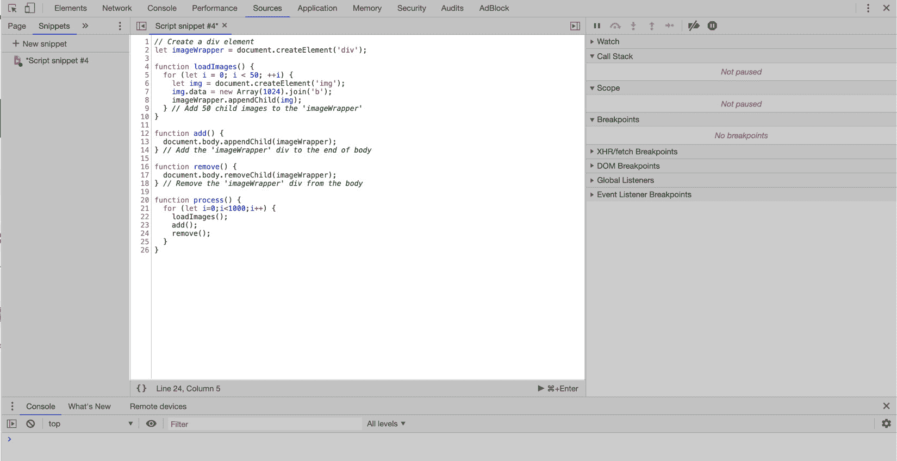

    图 7.18：包含所有 process() 代码的代码片段

1.  现在，点击 `run snippet` 按钮执行代码。

1.  接下来，我们将转到开发者工具的性能标签页，查看我们在添加和移除图像时内存堆中发生的情况。从性能标签页，点击记录按钮开始记录性能配置文件。在记录过程中，在控制台中调用 `process()` 函数，比如三次，然后点击停止按钮。你现在应该会看到一个类似这样的屏幕：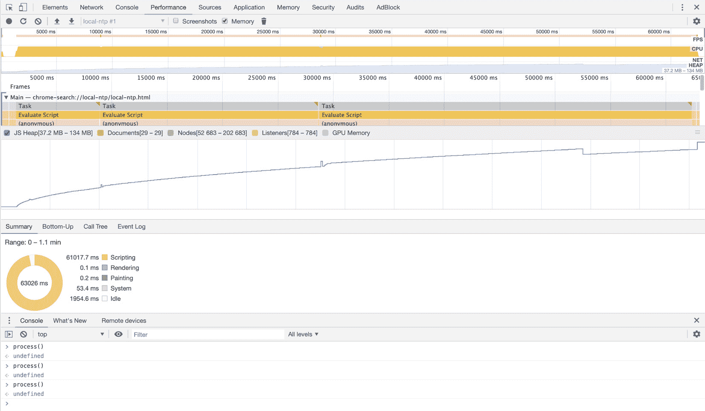

图 7.19：开发者工具性能标签页的内存堆

这是我们刚刚记录的性能配置文件。它可以告诉我们关于我们的应用程序在记录期间使用的系统资源的许多信息。这里蓝色的线条显示了 JavaScript 内存堆随时间使用的情况。在一个没有内存泄漏的应用程序中，我们期望内存使用量随着内存分配而反复上升，并在内存释放后回到一个基本水平，给我们一个 `images`，我们在每次调用 `process()` 后不再需要的图像，因此它们留在内存堆中。如果你注意到一个实际的应用程序随着时间的推移性能下降，或者使用高于预期的系统资源，那么这是一个检查内存泄漏的好地方。

## 练习 7.04：修复内存泄漏

既然我们已经确定存在内存泄漏——如前一个屏幕截图中的 JavaScript 内存堆图所示——我们的下一个任务是修复我们的代码，使其不再包含泄漏。根据你对垃圾回收器和泄漏原因的了解，尝试对之前的代码进行修复，以便垃圾回收器可以看到我们的对象何时不再需要。在每次函数调用后，记录一个性能分析，以查看垃圾回收器是否能够释放内存。你所寻找的是蓝色堆内存分配线随着内存分配而上升，但随后在规律的时间间隔内再次下降，表明内存正在被释放。这是垃圾回收器能够在每次`process()`函数执行后释放内存的迹象。让我们开始吧：

1.  编写一个函数并将其添加到在`process`中调用的现有三个函数：

    ```js
    function resetImageWrapper() {
      imageWrapper = document.createElement('div');
    }
    ```

    在这里，我们添加了一个名为`resetImageWrapper()`的函数，该函数将`imageWrapper`对象重置为空的`div`元素，并将其添加到`process()`函数的`for…loop`中。现在，每次从 DOM 中移除一组图像时，其 JavaScript 中的引用也会被移除，并且可以被垃圾回收器标记为删除。

1.  下一步是在每次处理我们的图像时调用这个新函数，因此我们将它添加到我们的主`process()`函数中：

    ```js
    function process() {
      for (let i = 0; i< 1000; i++) {
        loadImages();
        add();
        remove();
        resetImageWrapper();
      }
    }
    ```

1.  再次，我们将运行性能分析器。前往开发者工具，然后点击“性能”标签页，并点击记录按钮开始性能分析记录。然后，多次调用`process()`函数，并查看内存堆的使用情况：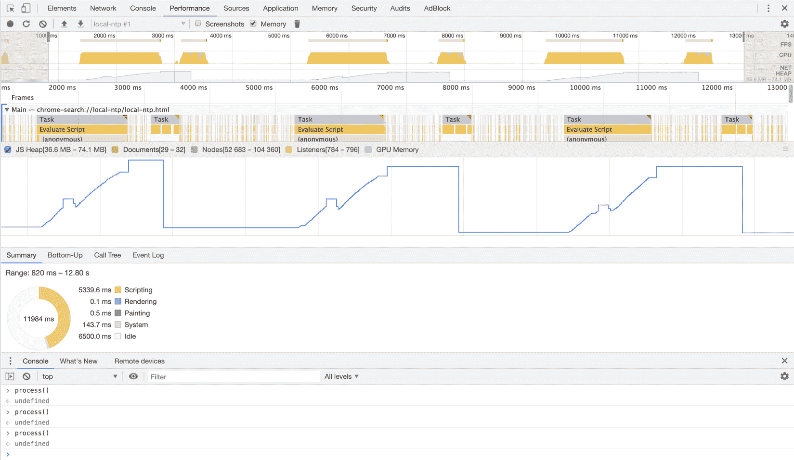

图 7.20：内存堆使用情况

注意

如你或许注意到的，我们代码的问题是我们将每个图像元素的引用及其数据属性的值存储在`imageWrapper`变量中。解决这个问题的一个简单方法是在每次从 DOM 中移除它时重新分配`imageWrapper`变量。

这是一个更健康的内存堆分析图。在每次三个`process()`函数调用之后，垃圾回收器可以看到图像不再被 DOM 或 JavaScript 引用，它们在内存中分配的空间被释放并归还给内存池。

在本节中，我们介绍了处理不同编程语言中内存管理的两种主要技术——手动和自动——并探讨了浏览器的垃圾回收器过程。然后，我们更详细地讨论了自动内存管理的重大缺点和现代浏览器的垃圾收集算法，即内存泄漏。最后，我们概述了我们可以用来识别我们的应用程序何时出现此类泄漏的技术之一。

## 活动 7.01：找出堆栈帧的数量

在本章的早期，我们学习了 JavaScript 的调用栈，并了解到如果向栈中添加过多的栈帧，则可能会生成错误。JavaScript 引擎的每个实现都可以有不同的栈大小限制。在这个活动中，我们将编写一个函数，它将告诉我们何时在触发栈溢出错误之前栈中达到最大数量的栈帧。

活动的概述步骤如下：

1.  添加一个函数，该函数会反复调用自身，导致栈溢出。

1.  计数函数自我调用的次数。（这就像计算推送到调用栈的栈帧数量。）

1.  在栈溢出错误发生后显示最终数字。记住，在栈溢出错误之后不能调用任何新函数！

    该活动的输出将如下所示：

    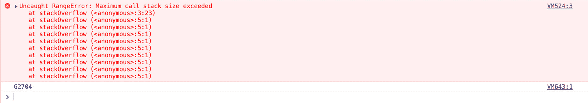

图 7.21：显示在触发栈溢出之前推送到栈中的栈帧数量

注意

该活动的解决方案可以在第 731 页找到。

# 摘要

在本章中，我们看到了许多人认为只是“JavaScript”的代码块实际上可以被分解成单独的组件：JavaScript 引擎，包括调用栈、内存堆和垃圾回收器（以及本章未涵盖的其他重要组件）；以及 JavaScript 运行时环境，如浏览器或 Node.js，它包含 JavaScript 引擎，并为引擎提供访问额外的函数和接口，例如 `setTimeout()` 或文件系统接口。

我们还探讨了 JavaScript 如何管理内存分配和释放，尽管它是自动管理的，但开发者仍然需要记住涉及的过程，以便编写能够使垃圾回收器正确工作的代码。

在下一章中，我们将更详细地探讨环境 API 的不同方面，以便我们可以了解在浏览器和 Node.js 中可以找到的一些不太常用的功能。
