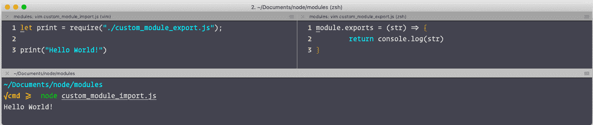

# 9. 使用 Node.js

概述

到本章结束时，你将能够描述 Node.js 的基础知识，并使用 `Node.js` 构建基本的 Web 应用程序；区分同步和异步处理；使用 `Node Package Manager (npm)` 通过命令行界面添加、删除和更新包；使用内置和第三方节点模块；运行 MySQL 和 MongoDB 数据库；并使用 `WebSocket` 构建实时 Web 应用程序，等等。

# 简介

到目前为止，你已经了解了 JavaScript 的基础和核心基础知识。这包括理解使用 JavaScript 代码构建交互式 Web 程序的核心语法。对这种编程语言基础的良好理解将使我们能够了解 Node.js，它超越了浏览器。它是 JavaScript 流行的基础。

在本章中，你将了解 Node.js。在 Node.js 之前，JavaScript 主要用于浏览器中的客户端脚本。2009 年，Ryan Dahl 开发了 Node.js，这是一个跨平台的开源 JavaScript 运行时环境，可以在浏览器之外执行 JavaScript。它允许开发者使用命令行工具并执行服务器端脚本。基本上，它通过单一编程语言统一了整个 Web 应用程序开发过程，而不是开发者需要学习不同的语言并为服务器端和客户端构建不同的项目。

Node.js 不仅被视为一种编程语言，而且是一个可以执行 JavaScript 的环境。它是一种流行的编程语言，在 GitHub 上拥有庞大的仓库，由世界各地的数千名开发者的贡献所维持。在本章中，你将从所有平台上的 Node.js 安装开始，然后了解它在后台的工作方式以及如何异步处理请求。此外，你将学习不同类型的模块以及如何使用它们。你还将进行许多重要的练习，以获得 Node.js 的实际应用经验。有很多东西要学习，所以让我们开始吧。

# Node.js 环境

Node.js 拥有事件驱动的架构，能够异步处理请求。Node.js 采用单线程架构。传统的服务器采用多线程架构，每当有新的请求到来时，就会创建一个新的线程，但 Node.js 在单个线程上处理所有事情。你可能想知道单线程的 Node.js 如何处理数百万个请求。答案是事件循环。JavaScript 在单线程上运行，并通过事件循环架构处理异步操作。任何耗时较长的请求都会被发送到后台，然后处理下一个请求。在继续之前，让我们了解同步处理和异步处理之间的区别。

## 同步与异步

如果程序的执行是按线性序列进行的，那么这就是同步处理。例如，在以下代码块中，将读取并执行整行，然后进程才会移动到下一行：

```js
var fs = require('fs');
var contents = fs.readFileSync('fake.js', 'utf8');
console.log(contents);
```

这个过程在只有一个请求的情况下效果最好。在多个请求的情况下，你必须等待前一个请求完成。这可能会像看草生长一样令人兴奋。为了克服这个问题，你可以异步处理请求。这样，你将任何耗时太长的过程从执行栈中推送到后台，以便其他代码可以执行。一旦后台工作完成，程序将再次推回到执行栈并进一步处理：

```js
var fs = require('fs');
fs.readFile('DATA', 'utf8', function(err, contents) {   
    console.log(contents);
});
console.log('after calling readFile');
```

## 请求处理背景

Node.js 使用一个名为`llibuv`的库。它处理异步 I/O 非常出色。它不是为每个请求启动多个线程，而是在操作系统的内核帮助下非常高效地管理线程池。一旦新的请求落在 Node.js 服务器上，它就会将大部分工作委托给其他系统工作者。一旦后台工作者完成他们的工作，他们就会向注册在该事件上的 Node.js 回调函数发出事件。这个过程在以下图中得到了可视化：

![图 9.1：Node.js 事件循环架构

![img/C14377_09_01.jpg]

图 9.1：Node.js 事件循环架构

Node.js 比多线程系统快得多，即使只有一个线程。因此，Node.js 使用具有线程池管理的事件循环架构，这使得它比竞争对手更强大和更快。

## 什么是回调？

当涉及到异步编程时，回调是一个非常重要的概念。回调是一个可以在其主函数完成时立即执行的功能。回调在 Node.js 中被广泛使用。

回调可能有用的一个典型例子是从文件中读取文本。在读取文件时，你不想服务器等待它完成。文件读取可以由后台工作者处理，一旦完成，它将执行一个事件，该事件将被事件循环处理。然后，该事件将执行回调。

## Node.js Shell

Node.js 自带一个虚拟终端 shell。它提供了一种快速使用 Node.js 的方法。你可以在 shell 中执行表达式。你还可以在 shell 中执行循环并定义函数。要进入 shell，打开你的终端并输入 node。

注意

`REPL`也是一个内置模块。你还可以将其导入到你的模块中。

## 练习 9.01：你的第一个程序

现在你已经了解了 Node.js 环境和它的运作方式，你准备好编写你的第一个脚本，并用 Node.js 执行它。让我们编写我们的第一个非常简单的 Node.js 脚本，我们将只执行两个数字的和，并将输出显示在屏幕上：

1.  创建一个名为`first.js`的文件。在同一目录下打开终端，并添加以下行：

    ```js
    // 1\. define the function
    let add = (a, b) => {  
        return a + b;
    }
    // 2\. Call the defined function
    console.log("Sum of 12 and 34 is", add(12, 34));
    ```

1.  运行函数以获取输出：

![图 9.2：你的第一个程序输出

![img/C14377_09_02.jpg]

图 9.2：你的第一个程序的输出

在这里，你已经编写了一个简单的函数来添加两个数字，你将在调用函数时传递这些数字。然后，你将使用 Node.js 执行此脚本，输出将打印在控制台。

## 如何在 Node.js 应用程序中导入/引入模块

在 Node.js 中导入/引入程序中的其他模块非常简单。你可以使用 `require` 将其他模块导入到你的 Node.js 应用程序中。假设我们需要 Node.js 的一个内置模块在我们的脚本中。我们会使用以下语法：

```js
const path = require('path');
```

这将在 Node.js 模块内以及项目全局或本地安装的任何包中查找包。如果找到，它将导入它；否则，它将抛出异常。在编写模块化代码时，你可以创建自己的自定义包，并使用 `require` 和相对路径导入它们，如下所示：

```js
const myModule = require('./modules/myModule');
```

## 节点包管理器（npm）

与 Node.js 一起工作的好处之一是你可以编写高度模块化的代码。互联网上有数百万个包可供你的项目使用。但随着你在项目中使用的包的数量增加，处理它们的难度也会增加。Node.js 自带自己的包管理器，称为 npm。

npm 有数千个包，所有这些都可以通过其网络门户和命令行界面轻松访问。它用于管理你的应用程序需要的包。你可以通过命令行界面添加、删除和更新包。

注意

`npm` 在所有主要平台上在安装 Node.js 时预先配置。在 Linux 的情况下，如果你在成功安装 Node.js 后访问 `npm` 时遇到问题，那么你必须将 `npm` 的路径添加到 `$PATH` 变量中。在书的 *前言* 部分检查 Linux 安装部分以获取更多详细信息。在 Windows 和 Mac 的情况下，你很可能不会遇到任何问题。

### 标志

一些有用的命令行标志是：

`-g` = 在系统中全局安装包。

`-S` = 将包保存为项目依赖项。类似于 `–save`。

`-D` = 将包保存为 `dev` 依赖项。类似于 `--save-dev`。

`-v` = 检查当前安装的版本。

### 命令

`npm` 的一些非常有用的命令如下所示：

+   `npm` 的 `i` 参数。例如，假设你想将 `express.js` 添加到你的程序中——你会这样做：

    ```js
    $ npm install express //i is the shortcut to install. (npm i express)
    ```

+   `npm`。例如，如果你想在程序中更新 `express.js`，你会使用这个：

    ```js
    $ npm update express
    ```

+   `rm` 参数的 `npm`。例如，假设你想从你的程序中删除之前安装的包（`express.js`）——你可以这样做：

    ```js
    $ npm remove express // rm is the shortcut to remove. (npm rm express)
    ```

+   `npm` 注册表。使用 `publish` 参数将包推送到 `npm` 注册表：

    ```js
    $ npm publish
    ```

+   `search` 参数：

    ```js
    $ npm search express
    ```

## package.json

`package.json`是一个始终位于项目根目录的文件。它是一个清单文件，几乎所有的`Node.js`项目都有。这是`npm`用来管理依赖项的文件。在开始`Node.js`开发之前，每个人都应该了解`package.json`是什么以及它做什么。它基本上有两个主要用途：

+   管理您项目的依赖项

+   提供帮助生成构建、运行测试以及与您的项目相关的其他内容的脚本

您可以在该文件中定义启动脚本，这将帮助您将环境变量注入到您的项目中。您甚至可以使用此文件来配置生产环境和开发环境。

要在项目根目录中创建此文件，请在您的终端中执行以下操作：

```js
$ npminit
```

您将被提示回答一个问题。您可以简单地按*Enter*键跳过它，并在当前目录中创建一个名为`package.json`的文件：


图 9.3：package.json 的示例输出

## 发布一个包

`npm`注册表完全对外开放新包。您可以在`npm`注册表中构建和上传自己的包，为此，您只需要一个包含`package.json`文件的目录。您可以直接编写您的模块并更新`package.json`参数。然后，您使用以下命令将其推送到注册表：

```js
$ npm publish
```

现在，您可以在[`www.npmjs.com`](https://www.npmjs.com)上搜索您的包，任何人都可以将其作为依赖项安装到他们的项目中。

在本节中，您了解了 Node.js 及其工作原理，并编写并执行了您的第一个 Node.js 程序。您学习了如何高效地处理 Node.js 包。您理解了`package.json`的目的和重要性。这只是一个介绍。现在，既然我们已经向您介绍了 Node.js，让我们更深入地探讨如何管理 Node.js 包并在项目中使用它们。

# Node 模块

首先，我们可以这样说，Node.js 模块可以生动地理解应用程序的依赖项。假设您已经创建了一个易于使用的支付应用程序，比如为餐厅设计的。您已经开发了一个支付应用程序。现在，您有了在应用程序中实现 QR 扫描器的想法，以使账单支付更加简单。好吧，您有两个选择。要么自己从头开始创建整个功能，花费时间开发，要么可以使用`npm`的大量模块库存将相同的功能安装到您的应用程序中。

您只需遵循以下步骤即可：

1.  您需要在谷歌上搜索模块名称，例如**QR scanner**，以便在您的 Node 或 Angular 应用程序中使用。

1.  您需要的第一链接是[`www.npmjs.com/`](https://www.npmjs.com/)。在这个库存中，您可以看到许多高效的 Node.js 模块。您可以在那里找到各种各样的模块，用于美化您的终端或修正您的代码。当您找到所需的模块时，您将需要安装并将其与您的应用程序合并。

1.  现在您已经有了模块，您只需在您的应用程序中实现它。最后一步是在您的终端中输入以下命令来安装该模块：

    ```js
    $ npm install <module_name> --save
    ```

1.  这将在您的 `package.json` 文件中将您的模块添加为依赖项。您只需按照技术语法导入或引入它。只需按照已安装模块的指南复制并粘贴函数。现在是运行您应用程序的时候了：

    ```js
    $ npm start
    ```

您现在在几分钟内就为您的应用程序添加了一些奇妙的新功能。

总结一下，Node.js 模块是一个由开发者持续维护的、包含一个或多个 JavaScript 文件的、旨在以最有效和可持续的方式在您的应用程序中执行特定操作的、正确打包的神奇盒子。

您甚至可以创建自己的 Node.js 模块并发布它们。这使您成为开源贡献者。在继续之前，让我们跳到一个关于内置 node 模块的有趣讨论。

## Node.js 模块

Node.js 包含了许多不需要安装的模块。其中之一是基本的 URL 模块。

**URL**

URL 是 Node.js 提供的一个模块，用于将复杂的 URL 字符串拆分为更易读的格式。它可以如下使用：

```js
const url = require('url');
```

此模块提供了一些实用工具，您可以使用它们来解析和解析 URL。如果您仔细查看任何 URL，您会发现它包含一些以复杂格式编写的特定组件：


图 9.4：将 URL 拆分为不同的术语

您可以使用 URL 模块来解决您遇到的任何困难。该模块将 URL 视为一个对象，URL 内部的每个组件都被视为该对象的属性，这意味着您可以轻松访问 URL 的每个部分。

本表中显示了 URL 的一些有用属性：


图 9.5：URL 属性

## 练习 9.02：使用 URL 模块更新 URL 信息

为了理解 URL 的不同属性，让我们做一个练习，我们将尝试更新 URL 的信息，例如路径名和主机。这将帮助我们了解如何操作 URL 对象的属性以更改 URL，当我们需要时：

1.  创建一个空文件，并保存为 `.js` 扩展名。对于这个练习，让我们创建 `url.js`。

1.  首先要做的事情是导入 URL 模块：

    ```js
    const url = require('url');
    ```

1.  现在，让我们使用 URL 模块的 `parse` 函数尝试处理一个 URL：

    ```js
    const url = url.parse('https://www.google.com/maps#horizontal');
    ```

1.  调用 `parse` 函数后，您将得到一个可处理的对象。该对象将包含该 URL 的所有元数据。然后我们可以使用此对象来操作 URL。让我们更改 URL 的主机、路径名和哈希值：

    ```js
    url.host ='maps.google.com'; // https://maps.google.com/maps#horizontal
    url.pathname = '/q'; // https://maps.google.com/q
    url.hash = 'vertical'; // https://maps.google.com/q#vertical
    ```

1.  现在，让我们使用可处理的 URL 对象的 `format` 函数将其格式化为字符串，并使用 `console.log` 函数打印它：

    ```js
    console.log(URL.format(url));
    ```

1.  最后，只需使用 Node.js 执行脚本。它将打印出你使用 URL 对象的属性更新后的新 URL：


图 9.6：URL 程序的输出

在这个练习中，我们学习了如何操作 URL 的属性。我们通过使用 URL 模块提供的不同函数修改了 URL 的不同组件。

## 文件系统

Node.js 部分你可以用来处理文件系统。你可以使用此模块执行各种文件和目录操作，例如创建、更新、读取和删除操作。`try...catch` 语句是一块用于处理使用同步操作发生的异常的语句。这些异常也可以被允许向上冒泡。

注意

在继续前进之前，请了解你将在一个名为 `intro.txt` 的文件上执行所有这些操作，该文件包含 Node.js 的介绍。所以，请确保你已经在项目的根目录中有了包含一些内容的 `intro.txt` 文件，你将在那里编写这些脚本。你可以通过在终端窗口中简单地输入 `node NameofYourFile.js` 来运行和测试脚本，确保你有适当的权限。

你可以使用以下方式使用此模块：

+   `read` 用于使用 `fs.open()` 方法在文件系统中读取文件：

    ```js
    var fs = require('fs');
    fs.readFile('sample.txt', 'utf-8', (err, data) => {
            if (err) { console.log(err) }
            console.log('Data read from file: ', data);
    });
    ```

    这将打印出文件的所有数据到控制台。

+   `append` 通过使用 `fs.appendFile()` 向文件添加特定内容：

    ```js
    var fs = require('fs');
    var data = "\nLearn Node.js with the help of a well built Node.js tutorial.";
    fs.appendFile('sample.txt', data, 'utf8',
    // using the callback function
    function (err) {
    if (err) throw err;
    // if there is no error
        console.log("New data was appended to file successfully.")
    });
    ```

    它会将作为 `appendFile` 函数第二个参数传递的行追加到文件中。

+   在文件系统中重命名文件是通过使用 `fs.rename()` 方法完成的：

    ```js
    var fs = require('fs');
    fs.rename('sample.txt', 'introduction.txt', (err) => {
            if (err) { console.log(err) }
            console.log('Done');
    })
    ```

    此代码将 `intro.txt` 文件重命名为 `introduction.txt` 文件。

+   可以使用 `fs.unlink()` 方法删除文件：

    ```js
    var fs = require('fs');
    fs.unlink('introduction.txt', (err) => {
            if (err) { console.log(err) }
            console.log('Done');
    })
    ```

你使用 `unlink` 从文件系统中删除任何文件。只需传递你想要删除的相对路径或文件名，它将从文件系统中解除链接该文件/路径。

## 操作系统

本节提供了一些与操作系统相关的实用方法。可以使用以下方式导入：

```js
const os = require('os');
```

此模块的一些重要功能如下：

+   `os.arch()`

    此方法将返回 Node.js 二进制文件编译的操作系统 CPU 架构，即 `arm`、`arm64`、`x32`、`x64` 等。如果你正在设计任何架构相关的模块，此模块非常有用。

+   `os.cpus()`

    此方法将返回一个对象数组，其中包含每个 CPU 核心的所有信息。

+   `os.hostname()`

    此方法将返回操作系统的主机名。

+   `os.platform()`

    此方法将返回 Node.js 编译的操作系统平台。这将在 Node.js 的编译时间设置。一些著名的平台包括 Darwin、freebsd、linux、openbsd 和 win32。

+   `os.networkInterfaces()`

    此方法将为我们提供有关已分配网络地址的网络接口的所有信息。它将返回一个对象，每个键将标识一个网络接口。

## 练习 9.03：获取操作系统详细信息

让我们通过一个简单的练习来探索这个模块。在这个练习中，您将使用 Node.js 的 `OS` 模块来获取有关操作系统的详细信息：

1.  您必须在您的 Node.js 脚本中使用 `require` 导入 `os` 模块：

    ```js
    const os = require('os');
    ```

1.  然后，您可以访问此 `os` 对象来调用其属性并获取必要的信息：

    ```js
    console.log(os.arch()); //x32, x64
    console.log(os.platform()); //win32, Win64, Darwin, Linux
    ```

1.  您可以根据脚本运行的架构更改代码执行的流程。

    输出将如下所示：

    ![图 9.7：node 的 REPL 模式内内置的 os 模块的一些有用方法]

    ![img/C14377_09_07.jpg]

图 9.7：node 的 REPL 模式内内置的 os 模块的一些有用方法

在这个练习中，我们学习了一些有用的方法来根据脚本的架构更改代码执行的流程，并获取操作系统的详细信息。

## 路径模块

`path` 模块提供了用于处理文件和目录路径的实用工具。它可以按以下方式导入：

```js
const path = require('path');
```

此模块的一些重要函数包括：

`path.dirname(pathString)`

此方法将返回路径的目录名。它与 Unix 的 `dirname` 命令类似。

`path.extname(pathString)`

此方法将返回路径的扩展名。它将从输入路径中最后一个 .（点）字符开始，到路径的末尾。

`path.format(pathObject)`

此方法将从具有特定键的对象中返回一个路径字符串。这是 `path.parse()` 的相反操作。

`path.join([...pathStrings, pathString... ])`

此方法使用平台特定的分隔符作为分隔符将所有给定的路径段连接在一起，然后规范化结果路径。当您需要程序化地切换目录时，它非常有用。

## 练习 9.04：如何提取和连接目录

让我们通过一个练习来详细探索 `path` 模块。在这个练习中，您将从一个绝对路径和相对路径中提取目录，连接目录，并从一个路径中提取文件扩展名：

1.  创建一个空文件，并以 `.js` 扩展名保存它。对于这个练习，让我们称它为 `path.js`。

1.  现在，让我们提供一些示例目录和文件名供您使用，以观察 `path` 模块如何处理路径。请注意，这些路径与 Windows 相关：

    ```js
    let dir = 'C:/Packt';
    let otherDir = '/assets/images/';
    let file = path.js';
    ```

1.  首先，让我们从一个路径中获取目录。假设您有一个文件的路径（`/Users/YourUserName/Documents/node/modules/myFile.js`），您想提取该文件所在的目录：

    ```js
    // On Windows: "C:/Packt"
    path.dirname(dir+file);
    ```

1.  现在，让我们从路径字符串中提取文件扩展名。为此，您必须使用 `path` 模块的 `extname` 函数：

    ```js
    path.extname(file); // ".js"
    ```

1.  最后，让我们尝试将多个目录和文件连接起来以创建路径。您可以使用 `path` 模块的 `join` 方法来完成此操作：

    ```js
    path.join(dir, otherDir + file)
    ```

1.  现在您有了完整的代码片段，请在终端中运行 `node path.js`：

    ```js
    const path = require('path');
    let dir = "C:/Packt";
    let otherDir = "/assets/images/";
    let file = "path.js";
    console.log(path.dirname(dir + file));
    console.log(path.extname(file));
    console.log(path.join(dir, otherDir + file));
    ```

    上述代码的截图将显示如下：

    

图 9.8：路径程序的输出

我们可以在前面的图中看到目录的路径。我们还学习了如何从路径中提取文件扩展名。

# HTTP

`http` 是 Node.js 中最重要的模块。它帮助您启动一个将监听特定端口的服务器。它将允许您通过 **超文本传输协议**（**HTTP**）传输信息。

`createServer` 函数接受一个函数作为参数，当您向服务器发出任何请求时，该函数将被调用。该函数有两个参数：`req` 和 `res`。第一个参数，请求参数，是一个包含请求所有详细信息的流。例如，如果您使用 `POST` 请求提交表单，那么这个对象将包含其中的所有值。响应参数也是一个流，您可以使用它来更新响应头、状态等：

```js
res.writeHead(200, {'Content-Type': 'application/json'});
```

在这里，您正在更新头部的键，并将状态码写入 `200`，即“OK”。参数与查询的区别在以下图中突出显示：


图 9.9：参数与查询的区别

您也可以从同一个 `req` 对象中获取参数和查询，这将有助于您处理请求。

## 练习 9.05：使用 Node.js 服务器

让我们开始我们的第一个 Node.js 服务器。这将是一个非常基础的服务器，它将仅对所有的请求返回一个“Hello World!”响应。我们将学习如何在特定端口上启动服务器以及如何编写对请求的响应。让我们直接进入编码：

1.  创建一个名为 `http_server.js` 的文件，并将以下内容复制到该文件中，然后保存：

    ```js
    var http = require('http');
    var port = 3000;
    // Start the server instance
    let server = http.createServer( function (req, res) {
            res.write( 'Hello World!' ); // Response content
            res.end(); // End response
    });
    server.listen( port ); // the server object listens on port 3000
    ```

    它应该显示如下：

    

    图 9.10：Node.js 服务器

1.  在您的终端中使用以下命令运行 `http_server.js` 文件：

    ```js
    $ npm i express
    ```

1.  然后打开浏览器并访问 `http://localhost:3000`：


图 9.11：Chrome 中 Node.js 服务器的输出

通过启动服务器，我们可以在浏览器中看到 `Hello World` 响应。我们学习了如何使用 Node.js 服务器以及如何编写对请求的响应。

## 第三方模块

Node.js 拥有一个庞大的包库，其中许多开发者已经编写并发布了供您使用的有用模块。您可以使用 `npm` 简单地下载这些模块并在您的项目中使用它们。`npm` 存储库中有数千个包可用。让我们看看一些可用于 Node.js 的有用第三方包。

## Express.js

`Express` 是 node.js 最受欢迎的框架之一。这也是 Node.js 非常受欢迎的原因之一。它是一个最小化、开源且灵活的 Web 应用程序框架，为 Web 和移动应用程序提供了一套强大的功能。

您可以使用以下命令安装它：

```js
$ npm i express
```

在 `Express` 中启动 Web 服务器非常简单：

```js
const express = require('express')
const app = express()
app.get('/', (req, res) => res.send('Hello World!'))
app.listen(3000, () => console.log('Example app listening on port 3000)));}!'))
```

服务器只需四行代码即可启动并运行。

Express 中的路由

`Express` 对路由处理得非常好。您可以在 Express 中编写模块化的路由。以下代码可以用来设置**基本路由**：

```js
const express = require('express')
const app = express()
// GET
app.get('/', function (req, res) {
  res.send('Hello World!')
})
// POST
app.post('/', function (req, res) {
  res.send('Got a POST request')
})
// PUT
app.put('/user', function (req, res) {
  res.send('Got a PUT request at /user')
})
// DELETE
app.delete('/user', function (req, res) {
  res.send('Got a DELETE request at /user')
})
```

## `bodyParser` 模块

JSON 是一个非常常见的用于互联网上超过 90% 的网络应用程序的数据共享格式。在 JavaScript 中管理 JSON 非常容易，但当涉及到在线共享 JSON 时，它就变得稍微困难一些。为此，我们使用 `bodyParser` 模块。数据在互联网上以缓冲区形式共享。此模块作为请求接收和您的应用程序之间的中间件。它将缓冲区转换为纯 JSON 并将其绑定到请求：

```js
var express = require('express')
var bodyParser = require('body-parser')

var app = express()

// parse application/x-www-form-urlencoded
app.use(bodyParser.urlencoded({ extended: false }))

// parse application/json
app.use(bodyParser.json())

app.use(function (req, res) {
  res.setHeader('Content-Type', 'text/plain')
  res.write('you posted:\n')
  res.end(JSON.stringify(req.body, null, 2))
})
```

## Morgan 日志记录器

`morgan` 是一个日志模块。每次请求击中服务器时，您的应用程序都会记录请求以揭示服务器真实的状态。服务器可以处理多种类型的请求。因此，应用程序必须记录所有请求以检查服务器的健康状况。在服务器上使用日志记录器有很多好处。其中一些列在这里：

+   您可以跟踪服务器每天、每周、每月等处理了多少请求。

+   您可以看到每个请求处理所需的时间。

+   您可以看到被击中的请求类型，例如 `GET`、`POST` 和 `PUT`。

+   您可以看到哪些端点被频繁使用。

+   该模块将维护所有错误日志。

`morgan` 非常容易使用，并且是一个为 Node.js 应用程序配置的中间件 `npm` 模块。您可以通过在终端中输入以下命令来安装它：

```js
$ npm install morgan --save
```

然后在您的应用程序中如下使用它：

```js
var morgan = require('morgan')
```

最后，您只需添加这一行即可在 `morgan` 和您的 Node.js 应用程序之间创建一个中间件：

```js
app.use(morgan(':method :status :url - :response-time ms'));
```

这将打印以下日志：


图 9.12：终端中 Node.js 服务器的输出

在本节中，我们学习了如何在项目中使用内置和第三方 Node.js 包。您学习了如何使用路由以及如何在服务器上记录请求。但这并不是结束；您还可以编写自己的自定义模块。您需要做的只是导出一个入口函数。以下是一个示例：




图 9.13：使用 Node.js 的导出和导入示例

将模块导出视为一个变量。模块导出是一个变量，您可以在其中放置一些值，并且您可以在应用程序需要此文件的地方获取相同的数据。您可以从任何 JavaScript 文件导出函数、JSON、字符串或任何类型的数据到应用程序中的任何其他 JavaScript 文件。

# 与数据库一起工作

当谈到服务器端时，数据库非常重要。所有需要存储以供将来参考的应用程序数据都必须存储在某个地方。在本主题中，您将学习如何使用两种最受欢迎的数据库：MySQL 和 MongoDB。

## 设置数据库

在本节中，我们将处理今天存在的两种主要数据库类型。在继续之前，让我们看看我们可以用哪些方式与数据库建立连接。与数据库建立连接有两种方式：

+   本地：当数据库服务器在您的机器上运行时。

+   远程：当数据库服务器在另一台机器上运行，并且您通过互联网访问它时。

您可以将数据库服务器运行在云中的某个地方，并使用带有凭证的 URL 来访问它。但在这个部分，让我们在本机上设置两个数据库，并使用 Node.js 来连接它们。

两个数据库的安装都非常简单。您可以从它们的官方网站下载最新的捆绑包，并像安装其他应用程序一样安装它们。对于安装指南，您可以遵循它们的官方文档，它非常易于理解。它们还涵盖了在所有不同类型的平台上的安装，例如 Windows 和 Linux。

MySQL: [`packt.live/32ypsRH`](https://packt.live/32ypsRH) MongoDB: [`packt.live/2PY7SDV`](https://packt.live/2PY7SDV)

## 与数据库连接

安装后，您必须启动两个数据库服务器并配置一个用户。这个用户就是您将使用其凭证来访问数据库的用户。出于学习目的，请给这个用户管理员权限，这样您将拥有执行各种类型操作的所有权限。

为了与数据库建立连接，我们需要一些关于服务器机器的信息：

**主机**：主机将是数据库运行的服务器的域名或 IP 地址。

**端口**：这将是在数据库服务器上监听的端口号。默认情况下，MySQL 数据库运行在端口 3306，MongoDB 运行在端口 27017。

**用户**：在这里，我们必须指定数据库任何活跃用户的用户名。我们总是在安装完成后创建一个管理员用户。不建议在生产环境中使用管理员账户，但出于学习目的，我们可以使用它。在生产环境中，我们必须创建一个数据库用户，该用户只有有限的和必要的访问权限。

**密码**：用户的密码将在这里。

**数据库**：在这里，我们必须提到我们想要初始化连接的数据库名称。

我们必须将此配置指定给我们将在与数据库建立连接时使用的数据库驱动程序。例如，在连接到 MySQL 时，我们必须指定此配置：

```js
var connection = MySQL.createConnection({
        host: 'localhost', // 127.0.0.1
        user: 'me',
        password: 'secret',
        database: 'my_db'
});
```

注意

如果没有指定端口号，它将选择端口号的默认值。

在下一节中，我们将学习如何建立连接以及如何使用此连接从 MySQL 和 MongoDB 中获取和保存数据。

## MySQL

MySQL 是一个关系型 SQL 数据库管理系统。它是世界上历史最悠久、最成功、最受欢迎的开源数据库之一。它被广泛用于开发各种基于 Web 的软件应用程序。

MySQL 库是最广泛使用的 `npm` 库之一。数百万的开发者在全球范围内使用这个库。了解配置数据库的最佳方式是通过实践。让我们通过一个非常实用的练习来学习在任何 Node.js 项目中设置数据库的方法。

## 练习 9.06：使用 MySQL 服务器安装、连接和处理响应

让我们进行一个练习，我们将安装一个 MySQL 驱动程序并将其连接到 MySQL 服务器。我们还将查看如何向数据库发送 MySQL 查询以及如何处理响应：

1.  为了使用此模块与 node 一起，您可以将它作为依赖项安装到您的项目中：

    ```js
    $ npm install mysql
    ```

1.  安装完成后，您可以在项目中使用以下方式引入它：

    ```js
    var MySQL = require('mysql');
    ```

1.  在将其导入到项目中后，您必须与数据库建立连接。为此，您可以使用 `createConnection` 方法。

1.  如果一切顺利，连接将就绪。您可以使用以下方式发送 MySQL 查询：

    ```js
    var connection = MySQL.createConnection({
            host: 'localhost',
            user: 'me',
            password: 'secret',
            database: 'my_db'
    });
    connection.connect(function (err) {
            if (err) {
                    console.error('error connecting: ' + err.stack);
                    return;
            }
            console.log('connected as id ' + connection.threadId);
    }
    );
    Code runs connection and logs thread ID to console. From here on, the reader should be able to run queries like,connection.query('SELECT * FROM table, function(err, result, fields)  
    { 
      if (err) throw err;
      console.log(result); 
    });
    ```

    注意

    在关闭连接之前，请注意端口号 3307 是作者的本地端口。标准的 MySQL 端口号是 3306。

    ![图 9.14：在 MySQL 服务器中传递凭证

    ![img/C14377_09_14.jpg]

    图 9.14：在 MySQL 服务器中传递凭证

1.  确保在浏览上一节（*设置数据库*）时传递您之前创建的用户凭证：

    ```js
    connection.query('SELECT 1 + 1 AS solution', function (error, results, fields) {
            if (error) throw error;
            console.log('The solution is: ', results[0].solution);
          });  
    ```

1.  在查询数据库完成后，您可以使用以下方式关闭连接：

    ```js
    connection.end();
    ```

1.  要检查连接，请使用以下查询到数据库：

    ```js
    if(connection.state === 'disconnected'){
         return respond(null, { status: 'fail', message: 'server down'});
       } else ("continue with app code")
    ```

在这个练习中，我们连接到 MySQL 服务器并向数据库发送 MySQL 查询以处理响应。

## MongoDB

MongoDB 是领先的开源 NoSQL 数据库。它是一个用 C++ 编写的面向文档的数据库程序。它使用类似 JSON 的结构来存储数据，这也是它最常用于与 node 应用程序一起使用的原因。它也是 MEAN 栈的一部分，MEAN 栈是目前世界上最受欢迎的技术栈之一。MEAN 栈是 MongoDB、Express.js、AngularJS 和 Node.js 四大主要技术的组合。在 MongoDB 中，表被称为集合，数据行被称为文档。文档以 JSON 格式进行格式化，并且默认情况下是模式无关的。

注意

确保首先运行本地 MongoDB 服务器，然后获取连接的 URI。一个 URI 包含协议、认证、端口和数据库名称，它是一个单一的字符串。你很快就会了解 URI 的格式。

## 练习 9.07：在 MongoDB 中安装和配置连接

让我们在 Node.js 中编写一些代码来帮助我们连接我们的应用程序与 MongoDB。完成这个练习后，你将能够使用 Node.js 安装 MongoDB 并配置与 MongoDB 的连接：

1.  为了安装驱动程序，请在你的终端中使用以下命令：

    ```js
    $ npm install mongodb --save
    ```

1.  然后，在你的应用程序中，使其成为一个要求：

    ```js
    const MongoClient = require('mongodb').MongoClient;
    ```

1.  然后，你必须准备一个连接 URL。它必须采用以下形式：

    ```js
    mongodb://[username:password@]host1[:port1][,...hostN[:portN]]][/[database][?options]]
    ```

1.  你可以使用此 URI 连接到 MongoDB：

    ```js
    const url = 'mongodb://localhost:27017';
    MongoClient.connect(url, function(err, client) {
      assert.equal(null, err);
      console.log("Connected successfully to server");

      const db = client.db(dbName);

      client.close();
    });
    ```

    输出将显示如下：


](img/C14377_09_15.jpg)

图 9.15：与 MongoDB 成功连接

确保在通过“设置数据库”部分时传递你之前创建的用户凭据。

在这个练习中，你了解了我们今天在行业中拥有的主要数据库之一。到目前为止，你已经了解了 MySQL 和 MongoDB 是什么以及如何使用它们与 Node.js 应用一起使用。

# 制作实时 Web 应用

我们的世界非常动态，我们生活在一个实时通信至关重要的时代。无论是与现实生活中的人交谈还是关注板球比分，实时通信和数据都非常重要。Node.js 最好的地方就是其对流和 WebSocket 的支持。Node.js 是创建实时 Web 应用的完美工具。

## WebSocket

WebSocket 提供了一个连续的全双工通信通道。这意味着服务器和客户端可以在单个 TCP 连接上同时进行通信和交换数据。使用 WebSocket，客户端不需要刷新页面就能看到变化。服务器会将数据推送到客户端。WebSocket 有助于促进连接的动态流动，使得两端通信都能以相当高的速度进行。这意味着你现在只需一个连接就可以接收和发送数据。

由于通信中没有延迟，服务器可以实时配置客户端，并且客户端可以持续将其数据与服务器共享，这将允许它分析和优化项目：


](img/C14377_09_16.jpg)

图 9.16：使用 WebSocket 连接的客户端和服务器之间的全双工隧道

WebSocket 连接是通过一个称为 WebSocket 握手的过程来建立的。这个过程从客户端向服务器发起一个常规 HTTP 请求开始。任何附加信息都将包含在这个请求的头部中，告知服务器客户端希望建立 WebSocket 连接。如果服务器已配置 WebSocket，它将接受请求。当握手完成时，初始的 HTTP 连接将被 WebSocket 连接所取代。这个连接使用与 HTTP 相同的底层 TCP/IP 连接。现在，无论是前端还是后端都可以开始发送数据。

## Socket.IO

Socket.IO 是一个库，它使得浏览器和服务器之间实现实时、双向和基于事件的通信变得容易。它被构建来简化 WebSocket 的使用。它只需要两件事：

+   一个 Node.js 服务器

+   一个用于浏览器的 JavaScript 库

它支持自动连接，这意味着如果任何客户端由于任何原因断开连接，它将不断尝试与服务器重新连接。

让我们看看如何在你的项目中安装它。在你的终端中使用以下命令：

```js
$ npm install socket.io --save  
```

接下来，使用你的应用服务器配置它：

```js
const express = require('express')
const app = express();
server.listen(3000);
const io = require('socket.io')(server)
```

`socket.io`现在已与应用服务器配置。你可以使用`io`变量绑定事件和监听器。现在，每当新的客户端与服务器连接时，它将执行一个连接事件，你可以获取有关套接字的所有信息：

```js
io.on('connection', client => {
        client.on('event', data => { /* … */ });
        client.on('disconnect', () => { /* … */ });
      });      
```

就这样。配置 socket.io 与你的应用服务器真的非常简单。

## 练习 9.08：构建聊天应用程序

让我们使用 node 和 socket.io 制作一个实时聊天应用程序。在这个练习中，我们将创建一个应用程序，允许我们为不同的用户启动多个会话，并在用户之间开发实时聊天体验。这将是一个非常基础和简单的聊天应用程序，你将能够创建一个群组，其中：

+   你可以进行实时聊天。

+   多个人可以加入这个群组。

+   每个成员默认将分配一个假名字。

+   你可以更改你的名字。

+   你可以看到任何时间谁正在输入。

在进一步操作之前，让我们来看看我们项目的文件结构：


图 9.17：本练习的文件结构

有两个主要文件：

+   `App.js`：此文件包含所有服务器端配置。在这个文件中，我们将配置`socket.io`，编写所有事件和监听器，并执行请求的路由。

+   `Chat.js`：此文件包含客户端所需的所有代码。

1.  启动服务器，并在`app.js`中配置它以使用`socket.io`，添加以下代码：

    ```js
    const express = require('express')
    const app = express()
    // Listen on port 3000
    server = app.listen(3000)
    // Configuring Socket
    const io = require('socket.io')(server)
    ```

1.  现在，WebSocket 已与服务器配置。让我们创建一些事件和监听器，这将帮助我们与客户端（前端）通信并监听每个连接：

    ```js
    io.on('connection', (socket) => {
            //listen on change_username
            socket.on('change_username', (data) => {
                socket.username = data.username
            })

            //listen on typing
            socket.on('typing', (data) => {
            socket.broadcast.emit('typing',{username : socket.username
    })
    })
    })
    ```

    应用程序正在监听两个事件，`typing`和`change_username`。每当套接字发出这些事件时，它们将被执行。

1.  现在，你已经完成了你的服务器端代码。让我们来处理前端（客户端）。首先，将 socket.io 库导入到客户端。在服务器成功配置后，你可以在浏览器中打开 `http://localhost:3000/socket.io/socket.io.js`，这将下载一个脚本文件。这就是你需要在客户端导入的文件。

1.  在 `index.html` 中添加以下 `script` 标签：

    ```js
    <script src='/socket.io/socket.io.js'></script>
    ```

1.  完整的文件将看起来像这样：

    ```js
    index.html
    2 <html>
    3 <head>
    4     <meta http-equiv="Content-Type" const="text/html;charset=UTF-8" />
    5     <link rel="stylesheet" href="https://stackpath.bootstrapcdn.com/bootstrap/4.3.1/css/boot       strap.min.css"
    6         integrity="sha384-ggOyR0iXCbMQv3Xipma34MD+dH/1fQ784/j6cY/iJTQUOhcWr7x9JvoRxT2MZw1T"           crossorigin="anonymous">
    7     <link rel="stylesheet" type="text/css" href="style.css">
    8     <script src="img/socket.io.js"></script>
    9     <title>Packt - Chat App Exercise</title>
    10 </head>
    11 
    12 <body>
    13     <header>
    14         <h1>Avengers Chatroom</h1>
    15     </header>
    The full code is available at: https://packt.live/2NIGAjn
    ```

1.  让我们通过将客户端连接到服务器来配置客户端。创建一个名为 `chat.js` 的文件，并确保 `index.html` 和 `chat.js` 都在同一目录或文件夹中。如果你想要将文件移动到不同的位置，那么你必须在 `index.html` 中的 `import` 链接中反映这一点。

1.  你必须在 `chat.js` 中声明请求将被转发到的服务器链接：

    ```js
    var socket = io.connect('http://localhost:3000');
    ```

1.  我们使用 `localhost` 是因为服务器运行在我们的本地机器上。它监听由服务器执行的事件。在这种情况下，我们需要监听 `键盘输入`。在 `chat.js` 文件中声明的连接下方输入以下代码片段：

    ```js
    socket.on('typing', (data) => {
    feedback.html("<p><i><b>" + data.username + "</b> is typing a message..." + "</i></p>")
    })

    //Listen on typing
    socket.on('stop_typing', (data) => {
    feedback.html("")
    })
    ```

1.  在你的终端中执行以下命令以启动服务器并监听所有请求：

    ```js
    § npm start
    ```

1.  现在，打开两个 Chrome 实例并访问 `http://localhost:3000`。这两个 Chrome 实例将创建两个会话，这将模拟两个不同的用户。只需开始输入并发送消息，就可以进行实时愉快的对话：

    注意

    代码将在本书的 GitHub 仓库中提供，网址为 [`packt.live/36KWlh0`](https://packt.live/36KWlh0)。


图 9.18：两个进行实时聊天的 Chrome 会话

如图中所示，有两个 Chrome 会话正在运行。这两个会话代表两个用户。他们都可以进行实时聊天。他们甚至可以看到对方是否在输入。

在本节中，你学习了如何使用 socket.io 在 node 中构建实时 Web 应用程序，并构建了一个酷炫的聊天应用程序。

## 活动 9.01：创建一个上传、存储和保存图像详情的 Web 应用程序

网络开发的一个主要部分是上传媒体并在将来引用它。在这个活动中，你将创建一个 Web 应用程序，允许你将图像上传到服务器并在目录中存储它们。为了使其更具挑战性，你还需要将图像详情保存到数据库中以便进一步使用和分析。

注意

此活动需要系统上运行 MySQL 数据库服务器。请在执行此脚本之前确保已安装并运行 MySQL 服务器。

当请求到达服务器时，它将首先重命名文件，然后将图像上传到目录中，在将图像路径作为响应发送回客户端之前：


图 9.19：node 服务器的输出

您应该从服务器端获得以下日志：

![图 9.20：文件已上传到服务器上的图像目录

![img/C14377_09_20.jpg]

图 9.20：文件已上传到服务器上的图像目录

一旦文件成功上传到目录，您应该看到以下 MySQL 输出：

![图 9.21：MySQL 输出

![img/C14377_09_21.jpg]

图 9.21：MySQL 输出

注意

图像文件的详细信息也成功存储在数据库中。

这里有一些步骤将帮助您完成活动：

1.  定义目录结构。

1.  导入所有依赖项。

1.  配置 Node.js 的`morgan`模块，以在控制台记录每个请求的详细信息。

1.  配置您的应用程序以使用 MySQL 数据库。

1.  建立数据库连接以配置`Multer`。

1.  向应用程序添加路由。

1.  启动服务器。

1.  向服务器发送请求上传图像。

    注意

    本活动的解决方案可在第 738 页找到。

# 摘要

到目前为止，您已经几乎涵盖了使用 Node.js 进行 Web 开发的全部基础知识。

您从 Node.js 的介绍开始，编写了您的第一个程序，并运行了它。您了解了 Node 的包管理器和 Node.js 环境。您被引导了解一些有用的内置和第三方 Node.js 模块，并发现了如何在您的应用程序中导入这些模块以及如何使用常见的模块，如`body parse`和`auth`。您使用 Node.js 与数据库建立连接，并学习了如何在数据库中执行查询。

最后，您学习了如何制作实时网络应用程序，并学习了如何构建聊天应用程序。由于 Node.js 内容庞大，还有很多概念需要覆盖，但是您已经拥有了进一步轻松探索 Node.js 所需的知识。在下一章中，您将学习如何使用请求与其他服务进行通信。您将了解不同类型的请求以及如何处理和显示数据。您还将了解**RESTful API**。

让我们继续下一章。
