# 第十章：10. 访问外部资源

概述

在本章结束时，您将能够描述 AJAX、REST、JSON 和 HTTP 到 API 的内容；使用 jQuery 或原生 XMLHttpRequest 等库执行服务调用，并熟悉每种方法的优缺点；使用 JavaScript 通过外部 API 获取数据；使用一些 jQuery 功能进行 UI 和事件处理；并识别支持跨域的 API 并使用跨域请求。

在本章中，我们将介绍使用 AJAX 获取数据的不同方法，主要是从 RESTful 服务中获取。

# 简介

在上一章中，您学习了 Node.js，它运行在服务器端。本章将涵盖服务的另一面——您将学习如何从客户端调用它们。被访问的服务实际上可能是用 Node.js 实现的，但它们通常也运行在其他平台上，如 Java、C# 和 Python。

没有新鲜数据的网页是静态的，用途有限。网络服务是一套技术，为您的网页提供与其他服务器和站点通信的标准，以交换数据。

为了使用不同语言实现的服务能够相互通信，它们需要有一套共同的规则，关于交换的请求和响应应该如何看起来以及如何结构化。因此，存在许多不同的标准和网络服务方法，它们定义了交换数据格式。目前用于网站的最流行组合是 **REST** 与 **JSON**，它代表 **Representational State Transfer** 与 **JavaScript Object Notation**。本章将详细描述您需要了解的所有内容，以便调用 REST 服务为您的网页提供数据。

在网络服务出现之前，网络服务器需要在服务器端收集所有必要的数据，然后渲染最终要提供的 HTML。为了获取新鲜更新，整个页面必须重新绘制。页面用户体验始终受到影响，特别是如果涉及复杂计算或查询，因为用户需要等待重新绘制完成，在此期间无法使用页面上的任何其他功能。

例如，想象一个显示股票报价或电子邮件信息的页面。在以前，您必须在浏览器中重新加载或刷新整个页面，才能查看股票报价是否有更新，或者是否有新邮件。网络服务和动态 HTML 改变了这一点，因为现在页面通常只更新部分内容，而不需要重新加载和重新绘制整个页面。

注意，许多网络服务使用一种称为**SOAP**的不同技术，它代表**简单对象访问协议**，具有**XML**（可扩展标记语言）格式。还有一些新兴的标准也在获得关注，例如谷歌的协议缓冲区。虽然每种技术都有其优点和缺点以及适用的用例，但本书中我们将只关注 REST 和 JSON，因为它们是目前使用最广泛的方法。

# JSON

由于您在本书中一直使用 JavaScript，因此您应该对 JSON 的语法感到非常熟悉，因为它是从 JavaScript 派生出来的，并且与您在前面章节中学到的对象结构非常相似。JSON，通常发音像名字 Jason，轻量级，易于人类阅读和编写，也易于机器解析和处理。

JSON 中使用了两种主要的数据结构：

+   用花括号`{ }`括起来的键值对集合

+   用方括号`[ ]`括起来的值列表

下面是一个示例 JSON 对象，展示了不同的结构和值类型：

```js
sample_json.json
1 {
2     "twitter_username": "@LeoDiCaprio",
3     "first_name": "Leonardo",
4     "last_name": "DiCaprio",
5     "famous_movies": [{
6         "title": "Titanic",
7         "director": "James Cameron",
8         "costars": [
9             "Kate Winslet",
10              "Billy Zane"
11         ],
12         "year": 1997
13     }, {
14         "title": "The Great Gatsby",
15         "director": "Baz Luhrmann",
The full code is available at: https://packt.live/2CDXhWC
```

每个键值对中，键被双引号包围，例如`"key"`，键和值之间放置一个冒号。例如，以下是不正确的，因为键没有双引号：

```js
first_name: "Leonardo"
```

键必须在每个对象内是唯一的，可以是任何有效的字符串，并允许空格字符（尽管在键中使用空格并不总是最好的主意，因为如果使用其他字符，如下划线，编程可能更容易）。每个键值对通过逗号分隔。

值可以是以下类型之一：

+   在前面的示例中`"twitter_username": "@LeoDiCaprio"`。字符串值用双引号括起来。

+   在前面的示例中`"year": 1997`。符号（+或-）和小数也是允许的。数字不需要用双引号括起来。

+   在前面的示例中`"active": true`（布尔值不需要用双引号括起来）。

+   **嵌套数组**：这是一个自身是字符串数组的值。每个字符串都用双引号括起来，并通过逗号分隔。（在这里使用数组是为了允许指定任意数量的联袂演员）。看看下面的示例块：

    ```js
    "costars": [
        "Kate Winslet",
        "Billy Zane"
    ],
    ```

+   `famous_movies`列表。数组中的每个元素都是一个包含与电影相关的字段（包括`title, director, costars`和`year`）的嵌套对象。数组中的嵌套对象通过逗号分隔。

+   在前面的代码片段中`"eye_color": null`。`null`可以用来表示未知或不适用的值。`null`表示时不加引号。

    注意

    关于如何最好地表示此类场景存在一些争议，许多人认为如果某个值未知，则字段根本不应出现，而不是分配一个`null`值。为了本书的目的，我们可以暂时将这个争议放在一边。

空白（空格、制表符和换行符）在 JSON 中通常被忽略（除了字符串之外），并且可以自由使用以提高可读性。

JSON 语法也有一些重要的限制：

+   值必须是之前指定的类型之一，并且不能有更复杂的表达式、计算或函数调用。

+   不允许注释。

## REST

**应用程序编程接口**（**API**）定义了程序之间交流的格式和规则。REST 是一种软件架构风格，已成为今天大多数网站使用的网络服务的既定标准。在这本书中，我们不会陷入 REST 背后的学术理论，而是将重点放在客户端如何调用和使用 RESTful 服务的实际方面。

## 什么是 HTTP？

为了理解 REST，了解万维网的基础技术以及资源是如何被标识和通信的非常重要。简要来说，**超文本传输协议**（**HTTP**）定义了浏览器和服务器在响应各种命令时应采取的操作。

使用**统一资源定位符**（**URL**）通过使用 HTML 页面、图像、文档或视频文件等资源进行标识。URL 具有以下部分：


图 10.1：URL 的组成部分

1.  `http`（不安全）或`https`（用于安全通信）。

1.  **主机名**：指定 IP 地址或域名的位置。

1.  默认情况下，`http`假设为`80`（`https`为`443`）。

1.  **路径**：指向网络服务器上的文件或位置。

1.  参数名称与值之间由等号（`=`）分隔。也可以存在多个参数，通常由和号（`&`）分隔。

大多数 REST API 倾向于使用结合标识符和其他 URL 元素的 URL，而不是在查询字符串中使用参数，例如，一个如`http://myserver.com/user/1234`的 URL。

之前的 URL 代码通常比`http://myserver.com/user?user_id=1234`更受欢迎。

但这种后端风格仍然完全有效，并且绝对被认为是 RESTful 的！

在基本层面上，REST 通过使用 HTTP 动词来对数据进行操作或资源：`GET`用于检索资源，`PUT`用于更新资源，`POST`用于创建新资源，而`DELETE`用于删除数据。

HTTP 请求通常还需要通过头部传递不同的值。HTTP 头部格式包含由冒号分隔的名称-值对。例如，为了表明你希望你的 HTTP 响应中的数据以 JSON 格式提供，通常需要提供以下头部：

```js
Accept: application/json
```

## TheSportsDB

有许多网站和服务通过 API 提供各种类型的数据。TheSportsDB（[`www.thesportsdb.com`](https://www.thesportsdb.com)）就是这样一个网站，它通过其简单的 JSON REST API 提供体育相关数据。

TheSportsDB 是一个涵盖数百种专业和非专业体育（如足球、篮球、棒球、网球、板球和赛车）的体育数据和艺术作品的社区数据库。它提供实时比分、标志、阵容、统计数据、赛程等更多信息：

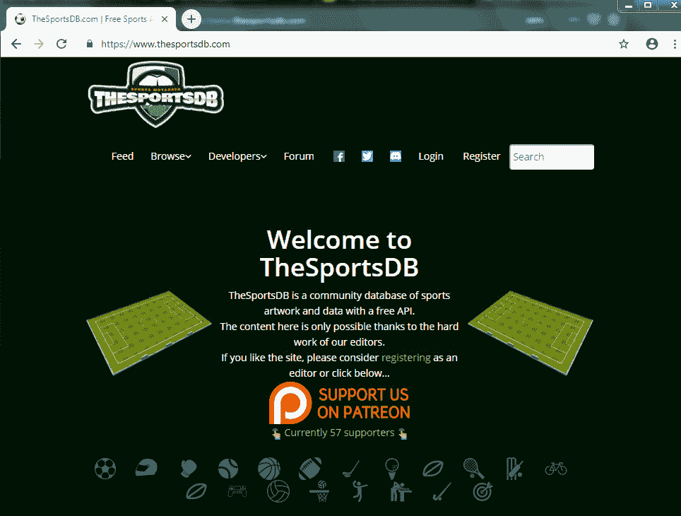

图 10.2：TheSportsDB 的首页和标志

许多 API 要求用户获取 API 密钥才能使用其服务。好消息是，通过测试 API 密钥 `1`，TheSportsDB API 对教育目的或较小应用是免费的。（如果 API 将被频繁使用，鼓励商业应用和大型用户注册。通过 Patreon 的捐赠也是接受的，尽管不是必需的。）

![图 10.3：示例页面，展示如何将来自各种 API 调用的数据组合起来展示球队信息]

结合起来展示球队信息

](img/C14377_10_03.jpg)

图 10.3：示例页面，展示如何将来自各种 API 调用的数据组合起来展示球队信息

注意

完整的 API 文档位于 https://packt.live/2NuwMtd。

## 练习 10.01：使用 REST API 进行调用

在学习如何以编程方式调用它之前，为了更好地了解这个 REST API 及其工作原理，我们将在我们的网页浏览器中直接进行一些调用。

TheSportsDB API 的调用形式为 `https://www.thesportsdb.com/api/v1/json/{APIKEY}/resource_path`。由于我们使用的是免费测试 API 密钥，将 `{APIKEY}` 替换为 `1` 的值。

以下是我们将在练习中使用的 API 调用的摘要。一串 `XXXX` 表示应替换为适当的标识符或值的适当位置：

+   `https://www.thesportsdb.com/api/v1/json/1/all_leagues.php`

+   `https://www.thesportsdb.com/api/v1/json/1/lookup_all_teams.php?id=XXXX`，其中 `XXXX` 是来自联赛列表的 `idLeague` 的值

+   `https://www.thesportsdb.com/api/v1/json/1/eventslast.php?id=XXXX`，其中 `XXXX` 是来自球队列表的 `idTeam` 的值

+   `https://www.thesportsdb.com/api/v1/json/1/lookupteam.php?id=XXXX`，其中，再次，`XXXX` 是来自球队列表的 `idTeam` 的值

以下是一些 API 提供的其他有用方法（但在此处不会具体介绍）：

+   `https://www.thesportsdb.com/api/v1/json/1/searchteams.php?t=XXXX`，其中 `XXXX` 是搜索字符串

+   `https://www.thesportsdb.com/api/v1/json/1/lookup_all_players.php?id=XXXX`，其中 `XXXX` 是来自球队列表的 `idTeam` 的值

+   `https://www.thesportsdb.com/api/v1/json/1/lookupplayer.php?id=XXXX`，其中 `XXXX` 是来自球员列表的 `idPlayer` 的值

+   `https://www.thesportsdb.com/api/v1/json/1/lookuphonors.php?id= XXXX`，其中 `XXXX` 是来自球员列表的 `idPlayer` 的值

+   `https://www.thesportsdb.com/api/v1/json/1/eventsnext.php?id= XXXX`，其中 `XXXX` 是来自球队列表的 `idTeam` 的值

+   `https://www.thesportsdb.com/api/v1/json/1/lookupevent.php?id=XXXX`，其中 `XXXX` 是来自活动列表的 `idEvent` 的值

+   `https://www.thesportsdb.com/api/v1/json/1/eventsnextleague.php?id=XXXX`，其中`XXXX`是从联赛列表中获取的`idLeague`的值

+   `https://www.thesportsdb.com/api/v1/json/1/eventsday.php?d=2019-10-10`

为了获取有关我们最喜欢的运动队的有用数据，首先需要查找该队的 ID。最简单的方法是获取所有可用联赛的列表，找到我们感兴趣的 ID，然后使用此 ID 进行另一个调用。

`TheSportsDB`提供了以下服务调用以获取所有可用联赛的列表。以下说明适用于 Google Chrome，但任何主要浏览器都支持类似的功能：

1.  启动浏览器的新实例。

1.  按下*F12*键以启动调试器（或从菜单中选择`更多工具` | `开发者工具`）。

1.  选择`网络`选项卡，并确保圆圈图标为红色（表示正在记录网络流量）。此时你的屏幕应该看起来类似于以下这样：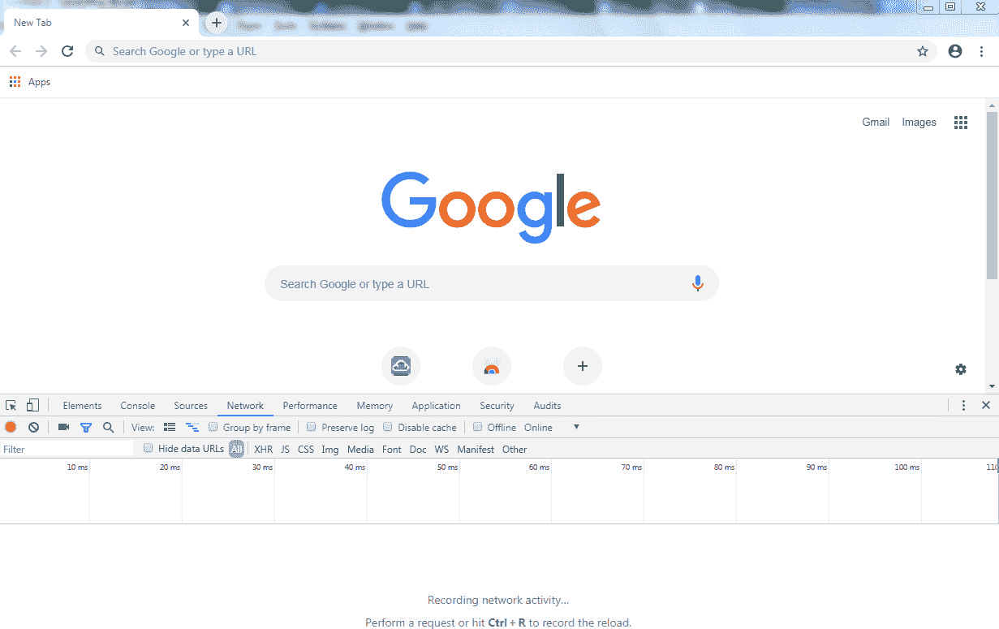

    图 10.4：Chrome 开发者工具中的网络选项卡

1.  将`https://www.thesportsdb.com/api/v1/json/1/all_leagues.php`作为 URL 输入地址栏并按*Enter*。此时你的屏幕应该看起来类似于以下这样：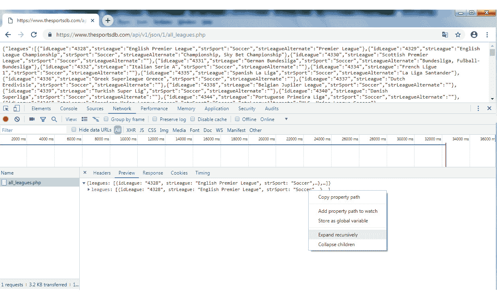

    图 10.5：包含联赛数据的原始 JSON 响应

    注意主窗口中的 JSON 响应列出了所有联赛数据，但它未格式化且不太友好。幸运的是，调试器提供了一个更友好的方式来以可折叠树的形式查看数据。在`网络`选项卡中，选择带有`all_leagues.php`的行，并选择`预览`选项卡。

    你应该在`预览`窗口中看到第一行 JSON 数据。将鼠标悬停在此行上，然后右键单击鼠标按钮以打开上下文菜单。从上下文菜单中选择`递归展开`。现在你会看到更多数据，如以下截图所示。请注意，你可能需要选择`递归展开`两次或三次才能使数据完全展开。

1.  让我们找到我们感兴趣的联赛的数据。按*Ctrl* + *F*并输入`NBA`以找到国家篮球协会的条目。此时你的屏幕应该看起来类似于以下这样：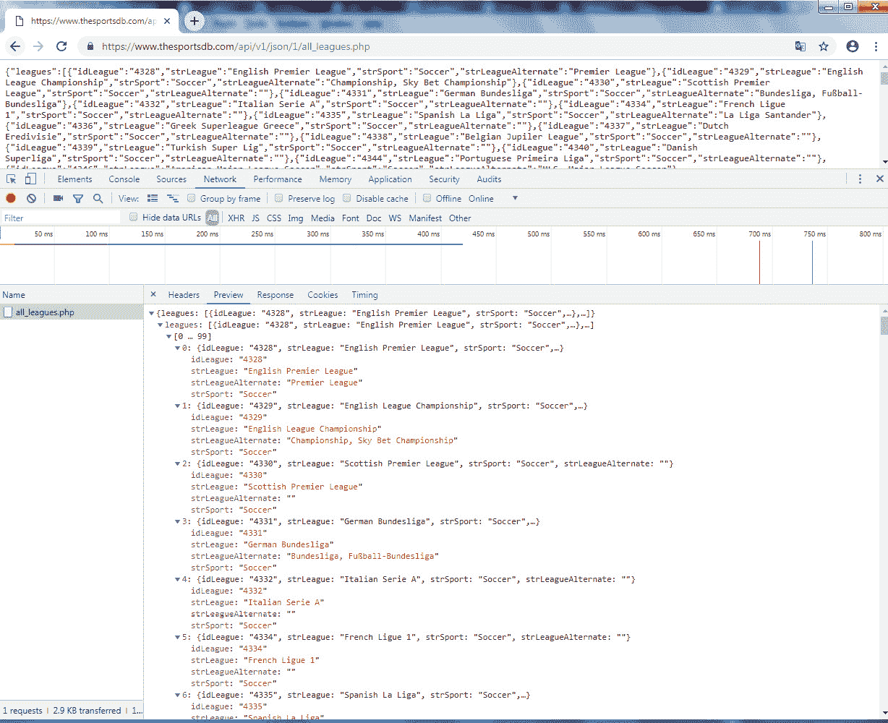

    图 10.6：展开并格式化的 JSON

1.  专注于我们联赛的条目，该条目的完整 JSON 格式如下（为了清晰起见进行了格式化）：

    ```js
    {
        idLeague: "4387"
        strLeague: "NBA"
        strLeagueAlternate: "National Basketball Association"
        strSport: "Basketball"
    }
    ```

    此条目只有几个键值对，但有了`idLeague`键，我们现在知道 API 中的联赛 ID `4387`代表 NBA。现在可以使用此 ID 进行另一个服务调用，以获取有关 NBA 的更多详细信息。

1.  按照之前描述的类似过程，将以下内容作为 URL 输入：

    `https://www.thesportsdb.com/api/v1/json/1/lookup_all_teams.php?id=4387`

    注意 URL 末尾放置的`id`参数，我们在这里插入了之前步骤中找到的`4387` ID。

1.  一旦你扩展了结果集，搜索单词`Knicks`。这次，你需要搜索多个匹配项，直到找到正确的一个，因为单词`Knicks`作为长描述的一部分出现在多个无关条目中。此外，与上次相比，结果条目中将有更多的键值对，但我们将只关注其中的一些。

相关的 JSON 看起来像这样，其中许多字段已被删除：

```js
{
  "idTeam": "134862",
  "strTeam": "New York Knicks",
  "strTeamShort": "NYK",
  "intFormedYear": "1946",
  "strSport": "Basketball",
  "strLeague": "NBA",
  "idLeague": "4387",
  "strStadium": "Madison Square Garden",
  "strStadiumLocation": "New York City, New York",
  "intStadiumCapacity": "19812",
  "strWebsite": "www.nba.com/knicks/?tmd=1",
  "strFacebook": "www.facebook.com/NYKnicks",
  "strTwitter": "twitter.com/nyknicks",
  "strInstagram": "instagram.com/nyknicks",
  "strCountry": "USA",
```

在这里，我们可以看到`idTeam`和`strTeam`键中的团队 ID 和名称，后面跟着与团队历史、球场信息和网站及社交媒体 URL 相关的其他字段。

```js
  "strTeamBadge": "https://www.thesportsdb.com/images/media/team/badge/wyhpuf1511810435.png",
  "strTeamJersey": "https://www.thesportsdb.com/images/media/team/jersey/jfktrl1507048454.png",
  "strTeamLogo": "https://www.thesportsdb.com/images/media/team/logo/yqtrrt1421884766.png",
  "strTeamBanner": "https://www.thesportsdb.com/images/media/team/banner/wvrwup1421885325.jpg",
}
```

最后，有一些链接到各种可用的团队徽章、球衣、标志和横幅图片，我们可以根据需要将这些图片显示在我们的网站上。我们将在接下来的练习中使用这些值。

## HTTP 头部

当我们打开网络监视器时，这是一个记录一些其他有用信息的好时机。点击`头部`标签，你会看到所有 HTTP 请求头部、响应头部以及一些涉及交互的其他细节，类似于以下内容：

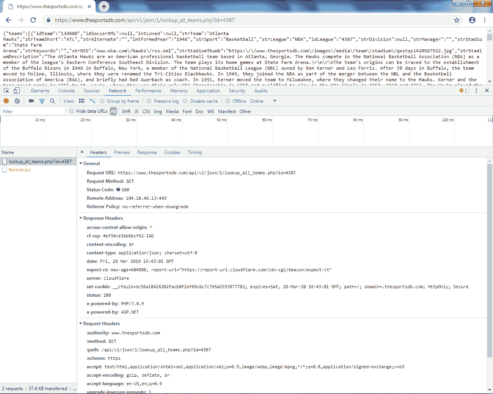

图 10.7：HTTP 头部

以下内容特别值得关注：

+   `请求方法：GET`：输入到浏览器地址栏的 URL 默认为`GET`。

+   `状态码：200`：这表示交互成功。有几个状态码，以下是一些最常见的。后续状态码，编号为`400`或更大，表示发生了各种错误条件：


](img/C14377_10_08.jpg)

图 10.8：状态码及其含义

+   `content-type: application/json; charset=utf-8`：这表示响应以 UTF-8 编码的 JSON 格式。

+   `远程地址：104.18.46.13:443`：这表示处理请求的远程服务器的 IP 地址和端口号。

+   `access-control-allow-origin: *`：这是一个允许跨站请求的头部。关于这一点，将在后面的章节中详细介绍。

+   `accept: text/html,application/xhtml+xml,application/xml;…`：此头部通知服务器调用者希望接受哪些格式的响应。在我们的情况下，需要一些解释。TheSportsDB 被设计为仅支持 JSON 格式的 API，因此即使浏览器发送的接受格式列表中没有指示 JSON，响应仍然是 JSON 格式。（对于可能支持多种格式（如 HTML、XML 或 JSON）的其他 API 来说，情况并非如此。因此，此头部将用于调用者表明他们希望使用哪种格式。）

其他可用的 HTTP 头部虽然不是本次请求的一部分，但值得提及。简要总结一些最常见的头部：

+   `Authorization`：许多资源受到保护，需要凭证才能访问，例如使用用户/密码组合或令牌。此头信息用于以各种格式发送凭证。

+   `Cache-Control`：静态资源或预计在不久的将来不会改变的数据可以被浏览器或客户端缓存，因此如果再次请求，则不需要不必要地获取资源。此响应头指示是否允许缓存。一些最常见的值是`no-cache`和`max-age=<seconds>`，分别表示对象是否可以缓存以及可以缓存多长时间。

+   `Last-Modified`：此响应头指示对象最后修改的时间。

+   `Keep-Alive`：控制持久连接应保持多长时间开放。持久连接是一种特殊类型，用于在同一个连接上发出多个请求时使用，这使得无需关闭和重新建立连接成为可能。

+   `Cookie`/`Set-Cookie`：Cookie 是由网站发送的小数据块，用于保存状态或跟踪用户身份验证、设备和活动。当浏览器或客户端下次向服务器发出请求时，之前发送的 cookie 值将被包含在内。

在本节中，我们介绍了 HTTP、JSON 和 REST Web 服务的基础知识。我们学习了 URL 的组成部分、HTTP 状态码、HTTP 头信息，以及如何使用浏览器调试器调用 REST 服务并获取所需的数据。

在下一个主题中，我们将介绍 AJAX 以及如何使用 jQuery 库通过 JavaScript 代码调用服务。

# AJAX

AJAX 代表异步 JavaScript 和 XML，是一个总称，用于描述一系列用于以各种格式（包括 JSON 和 XML）与服务器和其他站点通信的技术。

大多数 JavaScript 是同步的，这意味着只有一个执行线程，一次只能执行一个操作。如果浏览器真正是同步的，那么网站将难以使用，因为一次只能加载一个资源。想象一下，如果网站上的图片在加载后只绘制一个！有时，请求可能需要很长时间，例如进行计算或复杂的数据库查询。你肯定不希望你的网站在请求处理时变得无响应！

幸运的是，服务调用被设计为允许异步发生多个调用。此外，在发出请求并收到响应之间，主执行线程可以继续执行，并可能发出更多的服务调用。这是 AJAX 中的“*A*”。

JavaScript 已经开发出多种技术和方法来实现同步，其中最直接和最广泛使用的是回调函数。本章将使用回调函数，但其他技术，如 Promise，将在第十五章“异步任务”中探讨。

JavaScript 通过一个名为 `XMLHttpRequest` 的对象提供了一种原生的执行服务调用的方式。通常，人们倾向于使用 JavaScript 内置的本地功能，但在我看来，`XMLHttpRequest` 太底层且难以使用。这是一个利用库会更有意义且真正简化代码的场景。（然而，我们将在本章后面也介绍 `XMLHttpRequest`。）

有几个库可用于执行 REST 调用，我们将从探索 jQuery 的 `ajax()` 和 `getJSON()` 调用开始。

## jQuery

jQuery 是目前最受欢迎的 JavaScript 库之一。它轻量级，极大地简化了与网站相关的许多 JavaScript 编程任务。这些包括：

+   HTML/DOM 操作

+   CSS 样式辅助工具

+   HTML 事件处理

+   AJAX 服务调用辅助工具以及更多

![图 10.9：jQuery 项目的首页]


图 10.9：jQuery 项目的首页

对于 HTML/DOM 和 CSS 操作，jQuery 语法通常遵循选择 HTML 元素并调用方法在元素上执行操作的模式。

基本语法是 `$(selector).action()`，其中：

+   `$` 符号定义/访问 jQuery。

+   `(selector)` 用于定位 HTML 元素。

+   `action()` 表示要在元素上执行的 jQuery 操作。

选择器以美元符号和括号开始：`$()`。它们的语法与在 CSS 代码中选择元素非常相似。使用选择器的最基本案例是通过 HTML ID 选择元素，其中 ID 前缀为井号（`#`）。例如，如果你从以下 HTML 开始：

```js
<div id="test_div">
     <button class="testbutton">Click Me</button>
</div>
```

`$("#test_div"").hide()` 这段代码会使 ID 为 `test_div` 的 `<div>` 元素从视图中隐藏。也可以在同一个元素上以链式方式执行多个操作。例如，`$("#test_div"").html(""Hello World"").show()` 会将文本 `Hello World` 赋予 `<div>` 的主体，并使其重新出现。

以下是由 jQuery 提供的常见 UI 方法：

![图 10.10：用于 UI 目的的常见 jQuery 方法]

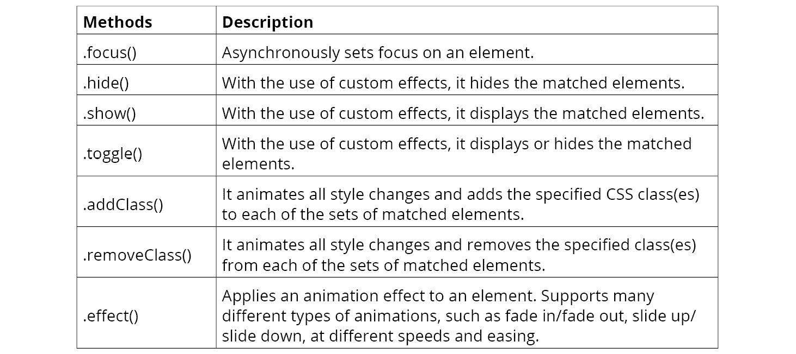

图 10.10：用于 UI 目的的常见 jQuery 方法

jQuery 还可以用来定义处理 HTML 元素事件的函数；例如：

```js
$(".testbutton").click(function() {
    alert("Button Clicked!");
}
```

之前的代码会在按钮被点击时显示一个包含消息 `Button Clicked` 的警告。此外，请注意，在这个例子中使用了类选择器，而不是之前使用的 ID 选择器。类选择器以点（`.`）开头，并选择文档中具有该类名的所有元素（在这个例子中，只有一个元素）。

也可以通过类型、属性、值等多种方式选择多个元素。

以下是由 jQuery 提供的常见事件处理方法：

![图 10.11：用于事件处理的常见 jQuery 方法]

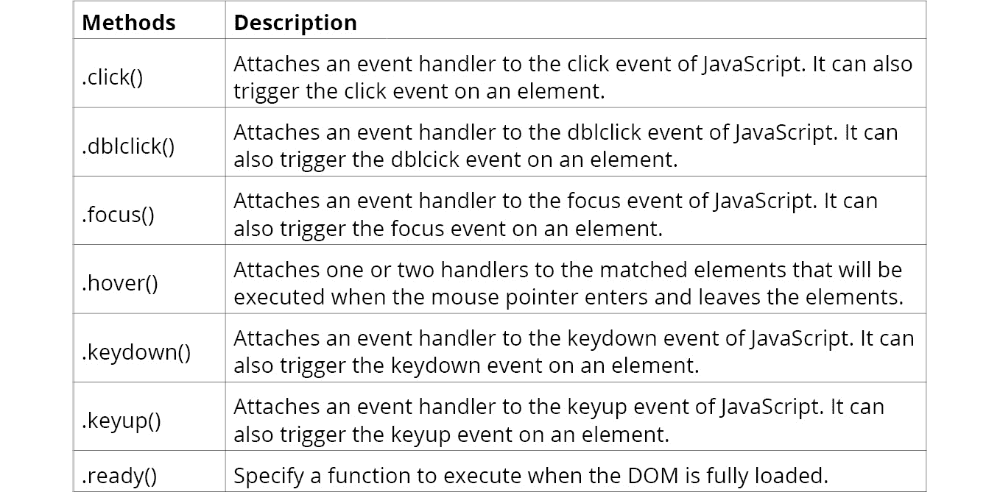

图 10.11：用于事件处理的常见 jQuery 方法

最后，jQuery 提供了一套完整的辅助工具来执行 AJAX 服务调用。这些将在下一个练习中介绍。

前面的段落只是对 jQuery 的简要介绍，但有许多优秀的教程和资源可以帮助你更深入地了解它。

## 练习 10.02：使用 AJAX 和 jQuery 的 ajax() 方法调用服务

现在我们已经了解了 HTTP 和 REST 的机制，我们可以开始编写一些代码了。

jQuery 提供了非常方便的方法，可以极大地简化 AJAX 交互。在这个练习中，我们将首先使用 `$.ajax()` 方法调用 TheSportsDB 服务以找出我们最喜欢的球队在上一场比赛中的得分。我们将使用上一节中获得的团队 ID 作为参数。

1.  首先，我们输入 HTML 代码。打开文本编辑器或 IDE 并创建一个新文件（`exercise2.html`）。

1.  添加 `<html>` 标签和 `<head>` 元素，这些元素简单地包含了 jQuery 库的 JavaScript 文件以及我们即将展示的 JavaScript 源文件，该文件将使用 `exercise2.html` 文件展示：

    ```js
    <html>
      <head>
        <meta charset="utf-8"/>
        <script src="img/jquery.min.    js"></scr ipt>
        <script src="img/exercise2.js"></script>
      </head>
    ```

1.  接下来，添加 `<body>` 标签。`<table>` 包含用于显示最后一场比赛数据的 HTML 标签：

    ```js
    <body>
      <table id="game_table" style="display: none">
    ```

    我们使用表格来辅助布局。表格最初指定为 `display: none` 样式，因为页面加载时数据不完整，我们不想立即显示它。我们将在服务调用返回并提供数据后使其可见。

1.  填充表格的行和列，直到 HTML 的结尾：

    ```js
    exercise2.html
    11   <tr>
    12       <td>Last Game Score:</td>
    13       <td></td>
    14       <td id="game_date"></td>
    15   </tr>
    16   <tr>
    17       <td id="away_team"></td>
    18       <td>vs</td>
    19       <td id="home_team"></td>
    20   </tr>
    21   <tr>
    22       <td id="away_score"></td>
    23       <td></td>
    24       <td id="home_score"></td>
    25   </tr>
    The full code is available at: https://packt.live/37aWtH4
    ```

    表的大部分列都赋予了 ID，例如 `away_team` 和 `away_score`，这样就可以在数据可用时引用它们来填充数据。这也允许我们分别处理每个值，并在需要时为每个值定义不同的样式。

1.  最后，我们到达实际的 JavaScript 代码。将第一个文件保存为 `exercise2.html` 并在文本编辑器或 IDE 中创建一个新文件。

1.  输入 `exercise2.js` 文件的第一行：

    ```js
    $(document).ready(function () {
    ```

    所有 jQuery 函数都以美元符号 `$` 开头，作为快捷方式，后面跟着一个点和函数名。`$(document).ready()` 函数在页面完全加载后调用。在这里使用这个函数很重要，因为此 JavaScript 文件是通过 HTML `<head>` 部分中的 `<script>` 标签在 `<body>` 标签之前包含到文档中的。如果我们的逻辑没有包含在 `$(document).ready()` 函数中，如果引用了尚未加载的 HTML 元素，则可能会出现错误。

1.  按如下方式开始 `$.ajax()` 调用：

    ```js
        $.ajax({
            method: 'GET',
    ```

    `$.ajax()` 调用包含了一系列设置。`method` 设置指示我们想要的调用类型是 `GET`。实际上，如果不指定 `method` 设置，`GET` 是默认值，因此通常没有必要指定。但有时更明确地指定可能更有益。

1.  接下来，我们输入 `dataType` 设置：

    ```js
            dataType: 'json',
    ```

    这指定了我们期望调用响应以 JSON 格式返回，并将 JSON 解析为 JavaScript 对象。这也导致发送了一个类似于`Accept: application/json`的请求头。

1.  接下来输入`url`设置，它指示我们调用的 URL：

    ```js
            url: 'https://www.thesportsdb.com/api/v1/json/1/eventslast.php',
    ```

1.  接下来是`data`设置：

    ```js
            data: {id: 134862},
    ```

    `data`设置指示请求中应发送的参数。由于这是一个`GET`请求，在底层，jQuery 将参数键值对添加到 URL 查询字符串中，在本例中导致`?id=134862`。如果我们想自己添加这个值到 URL 中，我们可以这样做，但在`data`设置中指定参数允许参数与 URL 本身分开。另一个原因是让库处理任何复杂值所需的 URL 编码。

1.  接下来，开始`success`函数，这是一个由 jQuery 在服务调用返回响应时调用的回调函数。到这时，jQuery 将已处理响应并将 JSON 解析为 JavaScript 对象：

    ```js
            success: function (data) {
    ```

1.  这个`eventslast.php`服务调用返回该队的最后五个事件，按最新日期排序，位于`data.results[]`数组中。然而，就我们的目的而言，我们只需要最新的比赛。API 中有一个我们需要注意的怪癖：如果比赛正在进行中，事件将存在于数组中，但得分可能还没有值。对于我们的页面，我们更愿意只显示实际有得分的比赛。输入以下代码：

    ```js
                // find the most recent game that had a score reported
                const lastGame = data.results.find(g => g.intAwayScore != null && 
                                                       g.intHomeScore != null);
    ```

    我们使用`data.results.find()`函数遍历数组并定位具有得分的第一个元素。具体来说，我们寻找`intAwayScore`和`intHomeScore`值非空的第一个事件。接下来，我们将使用以下代码设置各种表格单元格数据：

    ```js
                $("#game_date").html(lastGame.dateEvent);
                $("#away_team").html(lastGame.strAwayTeam);
                $("#home_team").html(lastGame.strHomeTeam);
                $("#away_score").html(lastGame.intAwayScore);
                $("#home_score").html(lastGame.intHomeScore);
    ```

    这些行将对应于 ID 的表格单元格设置为指定的值。在 jQuery 中，可以通过在 ID 前放置一个井号（`#`）字符来通过 ID 选择 HTML 元素。例如，`$("#game_date")`将选择具有`game_date` ID 的`<td>`元素，随后调用的方法将应用于该元素。最后，`html()`调用将导致值被分配给该表格单元格。

1.  一旦所有数据都分配到表格中，我们最终准备好向用户显示表格。输入以下最终代码：

    ```js
                $("#game_table").show();
            }
        });
    });
    ```

    jQuery 有一个`show()`函数，它将`display: none`样式变为可见。因此，`$("#game_table").show()`将选择由`game_table` ID 表示的表格并使其显示。

1.  将文件保存为`exercise2.js`。

1.  将`exercise2.html`文件加载到浏览器中。输出应类似于以下截图：

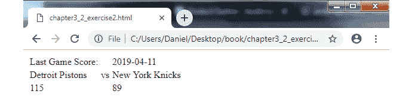

图 10.12：练习 10.02 的结果

注意目前还没有样式（但将在下一个练习中添加）。我们可以看到使用`$.ajax()`方法得分的最喜欢的球队的结果。

在本节中，我们介绍了 AJAX 和 jQuery 的`ajax()`方法来调用服务。我们还介绍了基本的 jQuery 函数，用于向 HTML 元素添加动态内容，并在需要时显示/隐藏它们。

在下一个主题中，我们将进一步使用一个服务的输出作为另一个服务调用的输入。我们还将异步调用多个服务。

## 练习 10.03：更多 AJAX 和 CSS 样式

之前的练习是一个很好的起点，但现在我们想在此基础上做以下事情：

+   使用第一个服务调用获得的结果来显示与比赛和球队相关的附加项目，例如球队标志。

+   通过添加 CSS 样式使网站更具视觉吸引力。

我们将在以下步骤中增强代码：

1.  打开一个文本编辑器或 IDE 并创建一个新的文件。

1.  首先，添加`<html>`标签和`<head>`元素。这几乎与*练习 10.02：使用 AJAX 和 jQuery 的 ajax()方法调用服务*中的代码相同，但增加了使用文件`exercise3.html`的样式表：

    ```js
    <html>
    <head>
      <meta charset="utf-8"/>
      <script src="img/jquery.min.js">  </script>
      <script src="img/exercise3.js"></script>
      <link rel="stylesheet" href="exercise3.css" />
    </head>
    ```

1.  接下来，添加`<body>`。在`<table>`中，第一个`<tr>`行与*练习 10.02：使用 AJAX 和 jQuery 的 ajax()方法调用服务*相同：

    ```js
    <body>
      <table id="game_table" style="display: none">
      <tr>
          <td>Last Game Score:</td>
          <td></td>
          <td id="game_date"></td>
      </tr>
    ```

1.  添加下一个表格行。这是新代码，包含两个包含球队横幅图片的``元素。注意，这些图片也已标记为`class="team_banner"`，因为我们将在稍后定义它们的 CSS 样式：

    ```js
      <tr>
          <td></td>
          <td>vs</td>
          <td></td>
      </tr>
    ```

1.  最后的行和剩余的 HTML 代码与上一个练习相同，同样也包括显示主队和客队得分的槽位：

    ```js
      <tr>
          <td id="away_score"></td>
          <td></td>
          <td id="home_score"></td>
      </tr>
      </table>
    </body>
    </html>
    ```

1.  保存文件并为 JavaScript 代码创建一个新的文件。复制上一个练习中的初始代码：

    ```js
    $(document).ready(function () {
        $.ajax({
            method: 'GET',
            dataType: 'json',
            url: 'https://www.thesportsdb.com/api/v1/json/1/eventslast.php',
            data: {id: 134862},
            success: function (data) {

                // find the most recent game that had a score reported
                const lastGame = data.results.find(g => g.intAwayScore != null && 
                                                       g.intHomeScore != null);

                $("#game_date").html(lastGame.dateEvent);
    ```

1.  一个酷炫的功能是对获胜得分应用特殊样式，或者在平局的情况下对两个得分都应用样式。我们通过以下代码将动态样式分配给适当的得分元素。首先，添加布尔表达式以确定主队是否有获胜得分或是否有平局：

    ```js
                const homeScore = parseInt(lastGame.intHomeScore);
                const awayScore = parseInt(lastGame.intAwayScore);
                const homeWinner = homeScore > awayScore;
                const tie = homeScore == awayScore;
    ```

    如果主队得分高于客队得分，则`homewinner`将等于`true`。注意，在执行比较之前，你需要调用`parseInt()`将数据值转换为整数，因为服务以字符串类型返回得分。

    ```js
                $("#home_score").html(homeScore)
                    .addClass( (homeWinner || tie) ? "winning_score" : "")	
                $("#away_score").html(awayScore)
                    .addClass( (!homeWinner || tie) ? "winning_score" : "");
    ```

    注意使用条件三元运算符的表达式。这个快捷方式与以下代码具有相同的效果：

    ```js
            if (homeWinner == true || tie == true) {
               $("#home_score").addClass("winning_score");
            }
    ```

    注意

    如果我们愿意，这实际上可以进一步改进。jQuery 有一个名为`toggleClass()`的函数，用于此特定用例，其中应条件性地添加一个类。此代码可以重写如下：

    `$("#home_score").html(homeScore)`

    `.toggleClass("winning_score", homeWinner || tie);`

    `toggleClass()`方法接受两个参数。第一个参数是要条件添加（或删除）的类的名称。第二个参数是布尔值或表达式本身。

1.  接下来，我们添加获取球队横幅图片的代码：

    ```js
                getTeamImage(lastGame.idHomeTeam, "#home_img");
                getTeamImage(lastGame.idAwayTeam, "#away_img");
    ```

    `lastGame.idHomeTeam` 和 `lastGame.idAwayTeam` 字段包含最近一场比赛的本地和客场球队的 ID。使用这些 ID，我们将调用 `getTeamImage()` 函数，该函数将为每个球队加载横幅图像，同时也会传入图像的 HTML ID。（此函数将很快定义。）

1.  输入函数的其余部分，与上一个练习中的相同，以实际显示表格：

    ```js
                $("#game_table").show();
            }
        });
    });
    ```

1.  最后，我们来到了 `getTeamImage()` 函数：

    ```js
    function getTeamImage(teamId, imageId) {
        $.getJSON('https://www.thesportsdb.com/api/v1/json/1/lookupteam.php', 
            {id: teamId}, 
             function(data) { 
                 const teamData = data.teams[0];	  
                 $(imageId).attr("src", teamData.strTeamBanner);
            }
        );
    }
    ```

一旦练习完成，最终结果应该类似于以下截图：

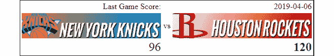

图 10.13：练习的最终结果

这里有几个需要注意的点：

+   我们这次使用了 `$.getJSON()` 而不是 `$.ajax()`。`$.getJSON()` 函数是一个用于 `JSON GET` 请求的快捷方式，默认情况下假定 `dataType="json"`。不需要单独指定 URL、数据参数和 `success` 函数作为设置，因为函数的签名如下，方括号表示最后两个参数是可选的：`$.getJSON( url [, data ] [, success ] )`。

+   `imageId` 被传递进来，以表示将要设置的 HTML 图像元素的 ID。我们将使用 jQuery 选择此图像元素并调用 `attr("src", value)`，这是 jQuery 的实用方法，用于设置 `` HTML 元素的 `src` 字段（类似于 ``）。我们将使用服务调用返回的 `teamData.strTeamBanner` 元素中的值来设置此 `src`。设置 `src` 字段将触发浏览器动态加载相应的图像。

+   `$.getJSON()` 是一个异步调用，这意味着在请求发出后，浏览器不会等待响应，即使在服务调用进行中，执行也会继续（并在收到响应时执行 `success` 回调）。这意味着对 `getTeamImage()` 的调用将实际上发出两个同时的服务调用，并且在请求进行时不会锁定浏览器。

## CSS

我们现在将简要介绍在前一个练习中添加到页面中的 CSS 和样式，以使其更具视觉吸引力。由于这并不是一本关于 CSS 的书，我们只会提供一个简要概述。（有许多优秀的书籍和资源可以深入介绍 CSS。）

样式表通过以下标签包含在 head 元素中：

```js
    <link rel="stylesheet" href="exercise3.css" />
```

CSS 文件的內容如下：

```js
exercise3.css
1 #game_table { 
2     border: 1px solid;
3     display: none; 
4 }
5 
6 #game_table td { 
7     text-align: right;
8 }
9 
10 #away_score, #home_score { 
11     font-size: 24px;
12 }
13 
14  team_banner { 
15     width: 275px; 
The full code is available at: https://packt.live/33K3gVY
```

+   `#game_table` 选择器表示此块中的所有样式都将应用于具有 `game_table` ID 的 HTML 元素。

+   在表格周围放置边框，使其看起来更紧凑。

+   我们将 `display:none` 样式（用于防止在数据加载前显示）移动到样式表中本身，以使 HTML 代码更简洁，避免过多的样式代码。

+   `#game_table td` 选择器表示该块中的样式将应用于具有 ID 为 `game_table` 的表格中出现的所有 `<td>` 元素。在这里，我们表示表格中的所有文本都应该右对齐。

+   选择器中的逗号允许您选择多个元素。在这里，我们表示分数应该有更大的、24 像素的字体。

+   以点开头的选择器（如这里的 `.team_banner`）是另一种选择器。这是一个 `class` 选择器，它将应用于所有指定 `class="team_banner"` 的 HTML 元素。

+   服务器上的横幅图像相当大，但我们只想得到一个缩小到 275 x 50 像素的图像。

+   一种独特的样式，用绿色和粗体表示获胜的分数。

在最后一节中，我们探讨了服务（JSON 和图像）的不同类型响应以及如何使用 jQuery 通过动态 DOM 操作助手来显示它们。我们还看到了如何使用 CSS 添加颜色、字体和其他样式，使我们的屏幕更具视觉吸引力。

# 其他库和 XMLHttpRequest

本节探讨了其他使用 JavaScript 的 AJAX 方法。使用 jQuery 和回调进行 REST 调用的方法只是许多不同选项之一，并且最初作为对新手用户最直接、最容易理解的选择而提出。但这并不意味着这种方法不强大。实际上，在许多情况下，这已经足够了。记住，jQuery 还提供了您可能在应用程序中想要使用的其他功能。

## Axios 和 Fetch API

在本书的这一部分，我们想提到两个可能适合在您的项目中使用的其他流行选择，Axios 和 Fetch API。它们使用诸如承诺等高级概念，因此这里不会涉及，但将在高级模块的 *第十五章，异步任务* 中介绍。（请注意，即使是 jQuery 本身也提供了返回承诺而不是使用回调的 AJAX 方法的变体，但这种用法也不在本章的范围内。）

但现在，我们将在下一节中将 jQuery 与原生的 `XMLHttpRequest` JavaScript 对象进行比较。

## 对比：XMLHttpRequest 和 jQuery

`XMLHttpRequest` 是 JavaScript 中内置的低级类，用于处理服务调用。尽管其名称中有 XML，但 `XMLHttpRequest` 实际上也可以用于其他协议，包括 JSON 和 HTML。

以下是与*练习 10.02：使用 AJAX 和 jQuery ajax() 方法调用服务*等效的代码，以便您可以比较使用 `XMLHttpRequest` 的代码与 jQuery (`xml_http_request_example.js`) 的代码之间的差异：

注意

HTML 部分与文件 `exercise2.html` 中的 *练习 10.02* 相同，但省略 `<head>` 中的 jQuery 库，并将 `js` 脚本 `src` 文件更改为 `xml_http_request_example.js` 而不是 `exercise2.js`

```js
xml_http_request_example.js
1 const url = "https://www.thesportsdb.com/api/v1/json/1/eventslast.php?id=134862"";
2 var xhttp = new XMLHttpRequest();
3 xhttp.open('GET', url);
4 xhttp.setRequestHeader('Accept', 'application/json');
5 xhttp.onreadystatechange = function() {
6     if (this.readyState == 4 && this.status == 200) {
7         const data = JSON.parse(this.response);
8   
9         // find the most recent game that had a score reported
10         const lastGame = data.results.find(g => g.intAwayScore != null && 
11                                                 g.intHomeScore != null);
12   
13         document.getElementById("game_date").innerHTML = lastGame.dateEvent;
14         document.getElementById("away_team").innerHTML = lastGame.strAwayTeam;
15         document.getElementById("home_team").innerHTML = lastGame.strHomeTeam;
The full code is available at: https://packt.live/2q9dErM
```

让我们详细检查前面的示例：

```js
const url = "https://www.thesportsdb.com/api/v1/json/1/eventslast.php?id=134862";
```

当使用`XMLHttpRequest`时，我们需要自己将查询参数附加到 URL 的末尾。在这里，这样做很简单，因为值只是一个简单的数字，但更复杂的值将需要通过调用`encodeURI()`进行 HTTP 编码：

```js
var xhttp = new XMLHttpRequest();
xhttp.open('GET', url);
```

我们实例化`XMLHttpRequest`对象并调用`open`方法，指定方法（`GET`、`POST`等）和 URL：

```js
xhttp.setRequestHeader('Accept', 'application/json');
```

这个低级 API 不像 jQuery 那样处理设置头部：

```js
xhttp.onreadystatechange = function() {...}
```

这是当就绪状态发生变化时将被调用的回调函数。请求可以有多个状态，因此我们需要检查当前状态，如下面的行所示：

```js
if (this.readyState == 4 && this.status == 200) {...}
```

与 jQuery 实现不同，没有`success()`函数被调用。我们必须显式地检查`readyState`和`status`代码。

`readyState`为`4`表示请求已完成且响应就绪。可能的状态有：

+   `0`: 请求未初始化

+   `1`: 建立服务器连接

+   `2`: 接收请求

+   `3`: 处理请求

+   `4`: 请求完成，响应就绪

`状态`为`200`表示`OK`。请参阅*HTTP 头部*部分，了解最常见的 HTTP 状态代码列表：

```js
const data = JSON.parse(this.response);
```

与 jQuery 不同，我们需要通过从响应字段调用`JSON.parse()`来自己解析 JSON 文本：

```js
document.getElementById("game_date").innerHTML = lastGame.dateEvent;
```

`document.getElementById()`函数是 JavaScript 中通过 ID 选择 DOM 元素的本地方式（相当于 jQuery 的`$("#game_date")`函数）。你会通过直接设置`innerHTML`字段来设置元素的文本（而不是像 jQuery 那样调用`html()`函数）：

```js
document.getElementById("game_table").style.display = 'block';
```

设置`style.display`是使隐藏元素再次可见的本地方式，相当于 jQuery 的`show()`方法（尽管显然不那么简单）：

```js
xhttp.send();
```

请求实际上只有在`send()`方法被实际调用时才会发送，因此我们很重要的一点是不要忘记调用它。（与 jQuery 不同，jQuery 会自动发送请求。）

## 使用 jQuery 和 XMLHttpRequest 进行 POST 请求

使用`$.ajax()`进行带有常规参数的`POST`请求与`GET`请求非常相似，除了指定`method="POST"`。然而，`POST`请求有一个额外的功能——以`JSON`格式发送请求数据，而不是默认的`'application/x-www-form-urlencoded'`内容类型。如果你希望这样做，应将`contentType`设置设置为`'application/json'`，并将数据对象包装在`JSON.stringify()`中。以下是一个示例：

```js
$.ajax({
    url: 'http://example.do',
    dataType: 'json',
    type: 'post',
    contentType: 'application/json',
    data: JSON.stringify( {"firstname": "George", "lastname": "Cloony"} ),
    success: function(data){
...
```

与`$.getJSON()`类似，jQuery 还提供了一个用于`POST`请求的快捷方式，称为`$.post()`。不过，它有一个额外的参数，用于指示响应的数据类型。以下是一个示例：

```js
$.post("http://example.do", {
        "firstname": "George",
        "lastname": "Cloony"
    }, function (data) {
        // process the response
    }, 'json'
);
```

对于`XMLHttpRequest`：

+   如果你只是发送标准参数，使用`setRequestHeader("Content-Type", "application/x-www-form-urlencoded")`并在调用`send()`时发送编码后的参数。（如果你的数据复杂，你可能还需要调用`encodeURI()`。）

+   如果你以 JSON 格式发送输入，请在调用`send()`时使用`setRequestHeader("Content-type", "application/json")`，并将数据包裹在`JSON.stringify()`中发送。

+   对于任何一种方法，一个需要注意的问题是，服务返回的代码通常会频繁地是`201 (Created)`而不是`200 (OK)`，所以你想要确保你的代码检查到正确的返回代码。

这里有一个例子：

```js
xhttp.setRequestHeader("Content-type", "application/json");
var data = JSON.stringify({
    "firstname": "George",
    "lastname": "Clooney"
});
xhttp.send(data);
```

## 跨域请求

在选择或实现 REST API 时，有一个重要的规则需要注意，这可能会影响 API 是否适用于你的网站。浏览器有一个称为**同源策略**的安全功能。此策略仅允许在站点上运行的脚本访问同一站点上的 URL 数据，没有具体限制，但阻止脚本访问托管在不同域上的数据。此策略的原因是为了防止不道德的人通过利用浏览器安全漏洞来窃取你的数据或调用恶意服务调用而进行的各种攻击。

例如，如果你的页面托管在[`www.mygreatsite.com/foo.html`](https://www.mygreatsite.com/foo.html)，你将能够通过类似[`www.mygreatsite.com/my_data.json`](https://www.mygreatsite.com/my_data.json)的 URL 访问数据或调用服务。然而，如果域名不同，即使是不同的子域名，如[`www.foobar.mygreatsite.com/my_data.json`](https://www.foobar.mygreatsite.com/my_data.json)，浏览器将返回如下错误：

```js
XMLHttpRequest cannot load https://www.foobar.mygreatsite.com/my_data.json. Origin null is not allowed by Access-Control-Allow-Origin.
```

幸运的是，有几种方法可以绕过这种限制，API 可以实现。这些解决方案的具体实现细节在服务器端，并不在本章的讨论范围内。但重要的是要知道，API 可以设计成跨站点的数据可用。因此，在选择用于项目的 API 时，你需要调查它是否支持跨域。（我们在前面的练习中使用的 TheSportsDB 就是一个这样的网站。）

## CORS 头信息

如果你真的好奇，允许跨站请求的主要技术是通过服务发送一个称为**CORS**的头信息，它代表**跨源资源共享**。如果 API 希望使其服务对任何域名都可用，服务器在响应时可以发送以下响应头：

```js
Access-Control-Allow-Origin: *
```

`*`值表示“任何来源”，但服务器也可以根据其意愿对可以访问的网站进行更严格的限制。这只是一个对更大主题的简要描述。还有一些其他技术可以实现跨域请求，例如使用 JSONP、帧之间的`postMessage()`或本地服务器端代理，但这里不会详细说明。

## 活动十点零一：使用各种技术实现 REST 服务调用

到目前为止，我们只为 HTTP `GET`请求编写了代码。让我们练习使用`POST`。我们在之前的练习中使用的 API，TheSportsDB，只包含 GET 请求，这使得它不适合测试其他 HTTP 方法。幸运的是，有几个专门为测试和原型设计、用于我们目的的虚拟 REST API。我们将使用一个名为**REQ | RES**（在[`reqres.in/`](https://packt.live/37aWtH4)）的免费 API：

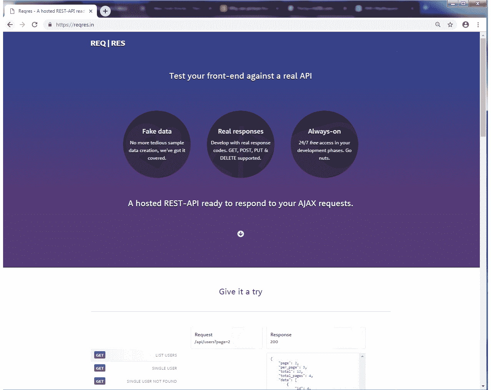

图 10.14：REQ|RES 首页

该 API 在[`reqres.in/api/users`](https://reqres.in/api/users)提供了一个 POST 方法，你可以提供任何字段的 JSON 对象。你将对象作为服务调用的数据，服务响应时会返回相同的对象，但会额外包含`id`和`createdAt`字段。

例如，如果你有以下数据：

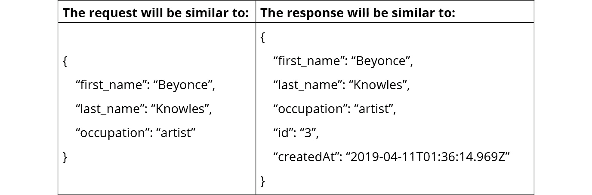

图 10.15：请求和响应示例

你的任务是使用`$.ajax()`方法，然后是`$.post()`方法实现这个服务调用，并最终使用`XMLHttpRequest`方法执行它。然后，将返回的`id`和`createdAt`字段打印到控制台。

请记住，**REQ | RES** API 实际上只是一个用于测试的虚拟服务，它不会实际持久化任何数据，所以不要期望能够检索你稍后发送的数据。

活动的整体步骤如下：

1.  使用`$.ajax()`，设置`method: 'post'`和`dataType: 'json'`。

1.  将你的数据字段放在一个对象`{}`中。

1.  创建一个`success`函数以输出预期的值。

1.  现在，使用`$.post()`。

1.  将你的数据字段放在一个对象`{}`中。

1.  创建一个`success`函数以输出预期的值。

1.  作为`$.post()`的最后一个参数，使用`'json'`值来指示预期的 JSON 返回类型。

1.  最后，创建一个新的`XMLHttpRequest`对象。

1.  调用`open('POST')`。

1.  将`Content-type`和`Accept`请求头设置为适当的值。

1.  创建一个用于`onreadystatechange`的函数，该函数检查状态码为`201 (Created)`，并使用`JSON.parse()`解析 JSON 数据。

1.  对输入数据调用`JSON.stringify()`以将其转换为 JSON 格式。

1.  在调用`send()`时发送 JSON 数据。

代码应该在 Google Chrome 的 JavaScript 控制台中产生如下结果：

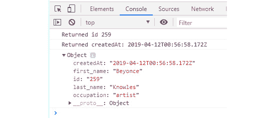

图 10.16：JavaScript 控制台输出

注意

这个活动的解决方案可以在第 742 页找到。

# 摘要

在最后一节中，我们探讨了原生的`XMLHttpRequest`对象以及它与制作服务调用其他库的不同之处。总的来说，正如你所看到的，与 jQuery 相比，原生方法在大多数情况下更为冗长、难以操作且级别较低。除非你有特定的需要更多控制的需求，否则我不建议使用它。

在下一章中，我们将描述正则表达式，它们通常被用来以简洁、灵活和高效的方式匹配模式。我们还将探讨编写清晰易懂代码的最佳实践，这对于你希望代码易于维护并长期存活至关重要。
