# 13. JavaScript 编程范式

概述

到本章结束时，你将能够应用不同的 JavaScript 编程范式；使用原型、继承和匿名函数；列出不同类型的数据作用域和闭包；使用提升声明变量；并解释 JavaScript 内存管理。

在本章中，我们将深入探讨使 JavaScript 成为一个非常多样化和多范式编程语言的核心特性。

# 简介

到目前为止，我们已经了解了 JavaScript 在浏览器级别的重要性以及其在服务器级别的能力。我们学习了如何在系统上安装 Node.js 以及如何编写和执行代码。此外，我们还获得了大量关于 Node.js 内部和外部模块的知识。此外，上一章还涵盖了 Web Sockets 和与数据库的工作。我们都是通过有趣的活动和练习来学习这些内容的。现在，是时候加强这些知识，并学习 JavaScript 的根本概念了。

在本章中，我们将探讨不同类型的 JavaScript 编程范式。在任何编程语言的学习阶段，人们通常以过程式的方式编码；而不是规划，他们把大部分精力放在执行和理解该特定编程语言的概念上。但是，当涉及到解决现实生活中的问题时，过程式的方法并不是一个可扩展的选项。幸运的是，我们有大量的不同类型的代码实现技术，我们可以使用这些技术用编程语言来模拟现实生活中的实体，例如面向对象编程范式，或 **OOP**。

让我们用一个现实世界的例子来说明，我们需要为我们的大学构建一个项目。这里会有教师、职员、学生、系主任等等。实现这个项目的一种方式是为这些实体中的每一个分别编写逻辑，这并不是一个可扩展的选项，而且它也不会是一个灵活的解决方案。另一种方式是使用面向对象的方法，其中我们将创建一个 `Person` 模型，该模型将使用对象中的键来存储人的职位。这样，我们就将人与他们的职位分离开了。我们可以轻松地在 `Person` 或实体（即系主任、教师、学生等）中实现更改。对 `Person` 的所有更改将自动应用于实体，因为它们属于 `Person` 类。我们可以使用很多其他方法来解决相同类型的问题。在本章中，我们将探讨其中的一些。

之后，你将学习原型是什么以及如何使用它们来实现继承。还有很多其他基础知识。让我们开始吧。

# JavaScript 编程范式

编程范式是我们编写代码以解决不同类型问题的方法或方法。由于有大量的编码方式，因此开发者使用了许多编程范式来编写代码。

JavaScript 是一种多范式脚本语言，这意味着它在本质上非常动态，支持各种类型的编程风格，如面向对象、命令式和函数式编程。在这本书中，我们将讨论在开发者中流行的三种主要编程范式。

我们可以将编程范式分为两类：

+   命令式，包括**程序化编程**和**面向对象**

+   声明式，包括**函数式编程**

在本章中，我们将讨论程序化和面向对象编程。函数式编程相当流行，有很多概念需要学习，所以我们专门用一章，名为函数式编程，来涵盖这个主题。

## 程序化范式

正如其名所示，这个范式遵循程序化模式。在这个范式中，我们将整个程序划分为例程和子例程。在这个编码模式中，流程非常线性且同步。它遵循自顶向下的编程方法。它仅仅涉及将期望的结果分解为一些例程和更小的子例程。这些子例程将进一步划分为过程，然后执行以实现期望的结果。

程序化编程使用自顶向下的方法来编写应用程序，而面向对象编程则遵循数据流的之字形方法。在开发大型应用程序时，可重用性是最重要的因素之一。与面向对象编程相比，程序化编程的可重用性较低，这也是面向对象方法在可扩展应用程序中更受欢迎的原因。在用程序化编程开发程序时，我们可能会在没有考虑代码重用的前提下规划程序。

在程序化编程中，数据流是顺序的，但这并不意味着我们不需要规划数据流。在程序化编程中仍然涉及到规划。它采取了一种更加字面的方法。程序化编程应用程序的结构更像是故事格式。程序化方法使开发过程变得更加简单，但消耗的时间更多。

采用程序化范式的优点如下：

+   在网上可以找到大量的学习资源。

+   它有更简单的方式来跟踪流程。

+   程序的实现非常简单。

采用程序化范式的缺点如下：

+   与现实世界难以相关联。

+   数据安全性较低。

+   使用这种方法解决复杂问题比较困难。

程序化方法是在人们开始学习代码时使用的基本方法之一。因此，为了加强我们的概念，始终练习我们刚刚学到的内容是更好的。让我们做一个练习，我们将使用直接的程序化编程来实现一个非常基本和简单的函数。

## 练习 13.01：实现程序化编程

在这个练习中，我们有一个字符串，我们必须将其中的每个单词都转换为大写。按照程序性方法，我们必须以自顶向下的方式实现它。这意味着我们将从第一个语句开始，到最后的语句，我们将得到我们的结果。为了做到这一点，我们必须执行一些操作。让我们逐一查看它们：

1.  首先，让我们创建一个空文件，并将其命名为`procedural.js`。如果您想的话，可以更改名称。

1.  让我们编写一个名为`toCapitalize()`的函数，它将接受一个参数作为输入。输入参数只能是字符串类型：

    ```js
    functiontoCapitalize(input){
       }
    ```

1.  在这个函数内部，让我们首先使用空格将输入字符串分割开。这将把输入字符串分割成单词，并返回所有这些单词的数组：

    ```js
    let arrayOfString = input.split(' ');
    ```

    在这个语句之后，`arrayOfString`将包含一个单词数组，即`['Once', 'upon', 'a', 'time', 'in', 'new', 'york']`。

1.  让我们遍历这个数组：

    ```js
    for(let i=0; i<arrayOfString.length; i++) {
       }
    ```

1.  在这个`for`循环内部，提取所有单词的首字母，并将结果保存到一个变量中：

    ```js
    letfirstChar = arrayOfString[i].charAt(0);
    ```

1.  让我们使用`toUpperCase()`方法将这个字母转换为大写：

    ```js
    firstChar.toUpperCase();
    ```

1.  现在，从输入字符串中移除每个单词的首字母，并用我们刚刚制作的大写字母替换它：

    ```js
    arrayOfString[i] = firstChar.toUpperCase() + arrayOfString[i].slice(1);
    ```

1.  最后，让我们将数组中的所有单词连接起来，包括空格，再次形成一个句子，并将其作为函数的输出返回：

    ```js
    arrayOfString.join(' ');
    ```

1.  现在，我们可以将任何字符串传递给这个函数，它将返回所有单词首字母大写的字符串：

    ```js
    let string = "Once upon a time in new york.";
        console.log(toCapitalize(string));
    ```

1.  让我们使用 Node.js 执行这个脚本并查看输出：

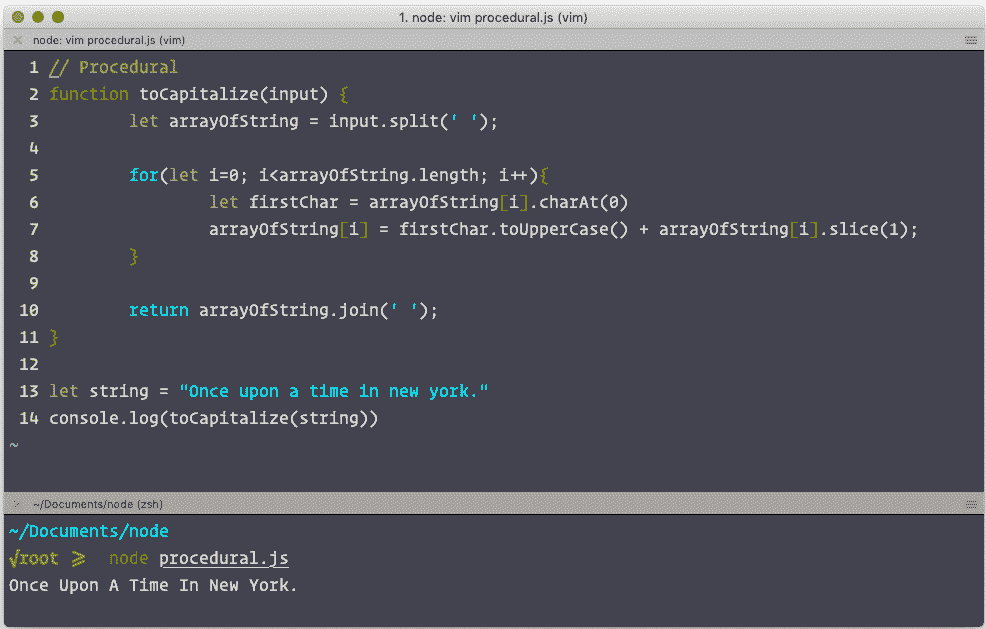

图 13.1：程序性练习的输出

如您所见，我们现在得到了期望的输出：每个单词的首字母都大写。在代码中，我们调用了许多方法，例如`split`、`toUpperCase`、`slice`和`join`。所有这些函数都是自顶向下调用的。我们从这个函数的第一个语句开始，其中包含我们的输入字符串，然后处理输入。在执行这个函数的最后一个语句之后，我们得到了期望的结果。这是一个程序性编程实现的简单例子。接下来，我们将学习如何实现编程中的面向对象方法。

## 面向对象范式

面向对象范式是开发者使用最广泛的范式之一。许多编程语言都倾向于这种范式。其受欢迎的原因在于它能够用代码模拟现实生活中的事物。在这个范式中，我们可以创建代表现实世界实体的对象。

我们使用类来模仿现实世界的类别，然后我们可以从这些类中创建对象，这些对象将充当实体。JavaScript 中的所有类都有一个构造函数，每次我们初始化该对象的新的实例时，它都会执行。我们使用 `Class` 关键字来创建一个类，`constructor` 是每个类内部的一个默认函数：

```js
class Animal{
constructor(category){
}
}
```

在 `constructor` 函数中初始化的任何内容都将具有整个类的范围级别。我们可以使用 `new` 关键字来创建这个对象的实例：

```js
new Animal('Lion');
```

在这里，创建新实例时传递的参数将直接传递给 `constructor` 函数。

## 练习 13.02：实现面向对象编程

面向对象范式是最好的实现方式，因为我们可以将代码与现实生活联系起来。我们创建现实世界实体的类，如汽车、家具和电子产品，并创建这些类的实例来表示现实世界的对象。例如，想象你有一辆来自奥迪制造商的汽车。这辆汽车是一个实体，我们可以将其表示为一个面向对象的类。我们可以创建这个 `car` 类的实例，它将代表你的汽车，并且这个实例将包含关于你的信息，例如汽车的所有者是你，制造商是奥迪。每个实例都将作为该车辆的登记。这样，我们可以在代码和现实世界之间建立关系。

要理解这一点，最好的方式是从现实世界中的例子入手并实现它。让我们考虑一个简单的程序，该程序显示地球上生物的信息。为此，我们必须创建一个生物类，并且我们可以创建该类的多个实例，例如 `Humans`、`Animals` 和 `Plants`。

要开始这个话题，我们首先需要创建一个名为 `Humans` 的类。人类有很多共同的特征，比如年龄、体重、身高，以及肤色和发色，但在这个例子中，我们只对展示他们的年龄、姓名和性别感兴趣：

1.  让我们创建一个空文件，并将其命名为 `humans.js`。

1.  现在，让我们创建一个名为 `Humans` 的类和一个 `constructor` 函数，这个函数将接受 `name`、`age` 和 `gender` 作为参数：

    ```js
    class Humans {
    constructor(name, age, gender) {
            this.name = name;
    this.age = age;
    this.gender = gender;
        }
     }
    ```

1.  让我们在类中创建一个额外的函数，该函数将打印 `name`、`age` 和 `gender` 的值，因为只有这个类的函数才能访问类变量：

    ```js
    info() {
    return console.log(this);
        }
    ```

1.  从我们的 `Humans` 类中，我们现在可以创建一些实例，代表真实的人类：

    ```js
    let Gaurav = new Humans('Gaurav', 24, 'Male');
    let Nishi = new Humans('Nishi', 23, 'Female');
    ```

1.  现在，我们将打印这两个对象。它们将包含我们在创建它们时传递给构造函数的所有信息：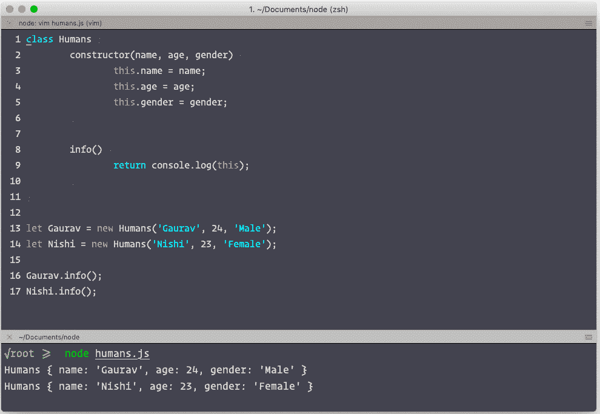

图 13.2：面向对象练习的输出

如您所见，我们现在有两个`Humans`类的实例，每个实例都包含有关一个人的信息。我们可以将这些两个实例视为真实的人类。他们有自己的`name`、`age`和`gender`属性。这在编写代码时将非常有帮助，因为你知道你正在为哪个对象编写逻辑。同样，我们可以将任何现实世界的实体实现为一个类，并可以创建该类的多个对象，这些对象可以代表现实世界的对象。

到目前为止，我们知道使用面向对象编程有很多好处，其中一些非常有用。接下来，我们将探讨这个范式提供的两个非常重要的特性——封装和继承。让我们逐一了解这些概念，并看看我们如何使用 JavaScript 来实现这些概念。

### 封装

使用面向对象编程（OOP）的一个好处是它保护了类中的数据。我们可以向类中添加只有类的方法才能访问的数据。其他类将无法访问这些数据。它就像一个保护盾牌，保护着类。

正如我们在上一个例子中所见，`name`、`age`和`gender`变量的作用域仅限于类。在类中初始化的所有方法都可以访问这些变量。这就是我们如何在类内部保护数据的方式。

### 继承

继承是一种方式，其中一个类可以访问另一个类的属性。在上一个例子中，人类可以有各种各样的职业。因此，我们也可以通过职业来继承`Humans`类。让我们通过一个练习来检验这个概念。在上一个练习中，我们创建了一个包含姓名、性别和年龄信息的`Humans`类。我们将通过创建一个新的类`Teacher`来进一步扩展这个类。这个类将包含`Humans`类的所有属性，以及一些额外的属性，描述他们教授的科目、成绩等。这将给你一个关于类如何扩展以及父类属性如何被其他类继承的直观印象。现在让我们进入代码。

## 练习 13.03：使用`extends`关键字实现继承

让我们创建一个名为`Teacher`的类，它将继承`Humans`类的属性。我们将使用`extends`关键字来继承本练习中的类：

1.  使用`extends`关键字来继承类：

    ```js
    class Teacher extends Humans {
      }
    ```

1.  在这个类中，我们必须将所有必要的参数传递给`constructor`函数。在`constructor`函数内部，我们将调用`super`函数并传递父类所需的参数：

    ```js
    constructor( name, age, gender, subject, grade ) {
            super(name, age, gender);
    this.subject = subject;
    this.grade = grade;
        }
    ```

1.  在这里，`name`、`age`和`gender`是`Humans`类的参数。使用`super`函数，我们将这些参数传递给了`Humans`类，其余的变量，即`subject`和`grade`，是`Teacher`类的一部分。

1.  让我们在`Teacher`类中有一个`info`方法，它会打印出该类的所有变量：

    ```js
    info(){
             return console.log(this);
        }
    ```

1.  在我们完成`Teacher`类的创建后，让我们创建一个它的实例：

    ```js
    let teacher = new Teacher('GauravMehla', 24, 'Male','Science', 'A');
    ```

1.  最后，让我们用 Node.js 运行这个脚本：

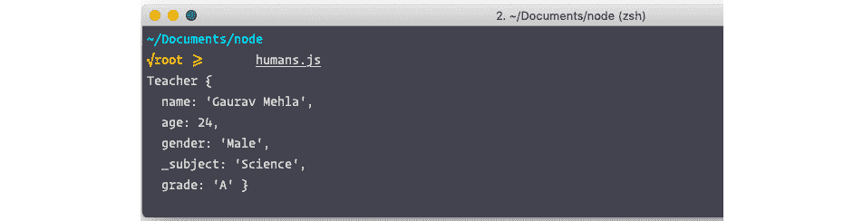


正如输出所示，有一些属性，如 `name`、`age` 和 `gender`，在 `Teacher` 类中不存在。这些属性是从我们实现的 `Humans` 类继承而来的，该类在 *练习 13.02：实现 OOP* 中实现。

现在我们知道了如何使用 JavaScript 实现继承，我们现在可以创建多个 `Teacher` 类的实例，这些实例将继承其父类 `Humans` 的所有属性。

让我们看看采用面向对象范式的优点：

+   **可重用性**：我们可以反复使用已经创建的类，而无需创建新类。

+   **现实生活建模**：我们可以使用面向对象编程（OOP）来模拟现实世界的概念，例如椅子、人或汽车。这使得理解实现变得容易。

+   **并行开发**：类可以独立，这意味着我们可以同时开发多个类。这导致项目开发更快。

+   **团队独立性**：由于面向对象编程支持并行开发，团队可以相互独立工作。

+   **安全开发**：面向对象编程的特性，如继承和封装，隐藏了数据，从而提高了安全性。类的内部数据不能被外部函数访问。

使用面向对象范式的可能缺点：

+   **不必要的代码**：如果没有适当的规划，它可能会创建大量不必要的冗余代码。

+   **代码重复**：由于面向对象编程可以为每个单独的类实现，因此可能导致代码重复。

+   **早期规划**：程序员在设计程序之前应该有一个适当的计划。

+   **项目规模**：使用面向对象编程开发的项目通常比使用其他方法（如过程式范式）开发的项目更大。

在本节中，我们学习了可以使用 JavaScript 的不同编程范式。我们深入探讨了两种最流行的范式——过程式和面向对象。我们讨论了两种范式的不同优缺点。我们还学习了面向对象编程的两个最重要的特性，即封装和继承。

# 基本 JavaScript 概念

编程范式很重要，但要详细了解它们，我们需要对不同的 JavaScript 概念有一个基本的了解。因此，让我们回顾一些 JavaScript 的核心概念，这将帮助您掌握 JavaScript，并更好地理解我们如何使用编程范式来构建可扩展的解决方案。

## 原型和原型继承

对象非常重要，因为它们帮助我们操作 JavaScript 以实现我们想要的功能。在 JavaScript 中有很多创建对象的方法。其中一种方法是通过使用 `constructor` 函数，每次我们创建一个函数时，JavaScript 引擎都会向该函数添加一个 `prototype` 属性。这个 `prototype` 属性是一个默认包含 `constructor` 属性的对象。这个构造函数指向父函数。你可以通过调用 `functionName.prototype` 来看到这个函数。

让我们首先创建一个函数：

```js
functionPersonName(first_name, last_name) {
this.first_name = first_name;
this.last_name = last_name;
this.fullName = function(){
 return [ this.first_name, this.last_name].join(" ");
     }
 }
```

现在，让我们通过输入 `PersonName.prototype` 来检查它的 `prototype` 属性。输出将如下所示：

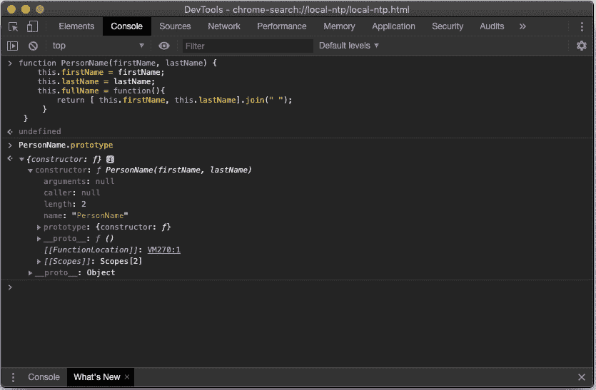

图 13.4：对象的原型属性

如你所见，我们创建了一个名为 `Person` 的函数，JavaScript 自动将其绑定到一个 `prototype` 属性上。你可以打印 `prototype` 并看到有一个 `constructor` 属性，它包含了父函数的所有元数据。

## 什么是原型继承？

如我们所知，JavaScript 中的所有内容都是一个对象。每一个字符串、整数、数组、对象和定义的函数都是其相应父类的一个对象。JavaScript 中的每个对象都包含一个 `proto` 属性（子对象内部的 `__proto__` 键通常被称为 `proto` 属性），它包含了其父类的所有属性。我们可以使用这些 `proto` 属性来实现继承。这些 `prototype` 对象作为模板对象，所有子对象都将从中继承方法和属性。我们也可以使用这个 `prototype` 属性来覆盖父类的属性。这种原型链接被称为原型链。

## 练习 13.04：原型继承实现

在这个练习中，让我们实现一个非常简单的函数，它将接受一个名字和一个姓氏作为参数，并返回全名。完成这个练习后，你应该完全清楚原型继承是如何工作的，以及实现这种输出两种方法的区别：

1.  我们可以在 `PersonName` 父函数内部实现 `firstName` 和 `lastName` 子函数，这样它们就能使用父函数的值。我们可以将这些函数绑定到它们的父原型上，因为父函数总能访问子函数的作用域。让我们实现并观察这两种方法。使用 `F12` 键打开 Google Chrome 开发者工具控制台。

1.  使用这个构造函数创建一些对象，并将代码粘贴到控制台中：

    ```js
    functionPersonName(firstName, lastName) {
    this.firstName = firstName;
    this.lastName = lastName;
    this.fullName = function(){
     return [ this.firstName, this.lastName].join(" ");
         }
     }
    let pName1 = new PersonName("Gaurav", "Mehla");
    ```

    每当我们使用 `constructor` 函数创建对象时，JavaScript 都会向其对象添加一个属性，即 `_proto_`。这个 `_proto_` 属性包含了指向主函数原型的链接，这在下面的输出中可以看到：

    ![图 13.5：使用 `new` 关键字创建的实例的原型属性    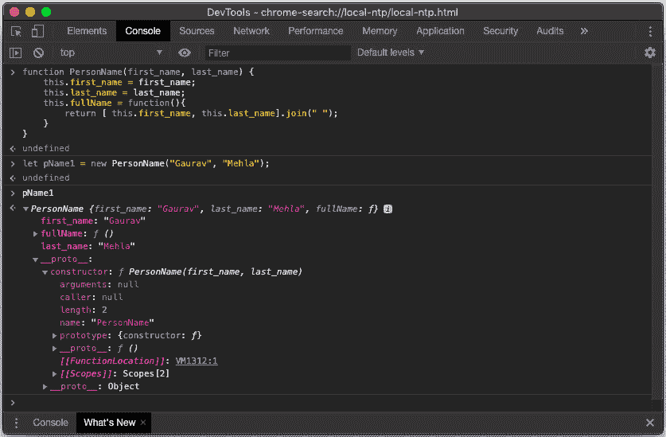

    图 13.5：使用`new`关键字创建的实例的原型属性

    如你所见，`pName1`对象有一个`__proto__`属性，它直接指向其父`PersonName.prototype`的原型。在下一步中，我们可以使用这个`prototype`属性通过 JavaScript 实现继承。

1.  让我们将`fullName`函数绑定到`Person`的`prototype`属性上，而不是在函数内部定义它：

    ```js
    PersonName.prototype.fullName = function(){
        return [this.firstName, this.lastName].join(" ");
    }
    ```

1.  现在，使用`new`关键字创建两个`PersonName`方法的对象：

    ```js
    let pName1 = new PersonName("Gaurav", "Mehla");
     let pName2 = new PersonName("Sarthak", "Sharma");
    ```

1.  在这里使用`new`关键字创建的所有对象现在都将包含一个`proto`属性，该属性将指向其父原型，并且父原型中定义的所有函数和属性都将对所有子对象可访问。换句话说，如果我们创建一个函数并将其绑定到父函数的原型上，那么这个函数将通过原型链对所有对象可访问。现在，使用其对象调用定义在`Person`方法`prototype`属性中的`fullName`函数：

    ```js
    pName1.fullName();
    pName2.fullName();
    ```

    输出如下：

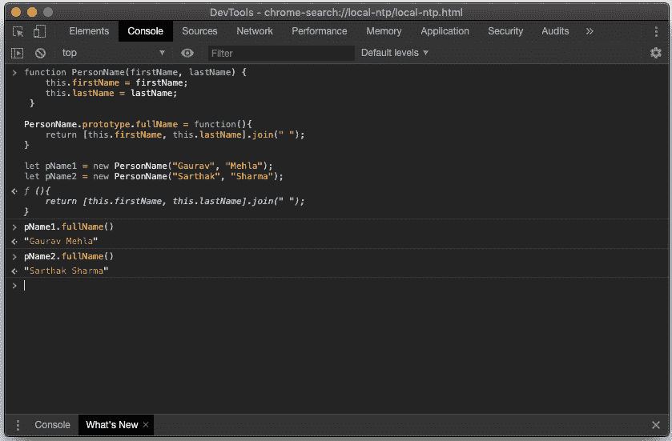

图 13.6：原型链示例

在这个练习中，我们声明了一个构造函数（`PersonName`），然后创建了一个函数（`fullName`）并将其绑定到其原型上。接着，我们使用该函数的构造函数创建了两个子对象。你可以看到这两个对象都可以访问到`fullName`函数，该函数位于它们的父原型中。这样，我们就通过原型链实现了继承，如图*13.7*所示：

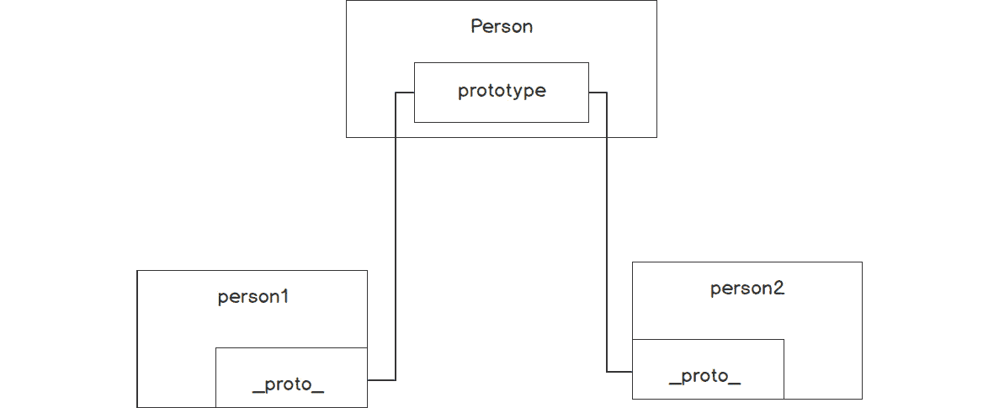

图 13.7：__proto__ 属性的引用

现在，我们可以创建任意多的`PersonName`实例，并且所有这些实例都将始终可以访问`PersonName.fullName`。

我们甚至可以修改原型，并且这些更改将立即反映在其所有子对象中。

## 匿名函数

JavaScript 语言中的对象非常复杂。JavaScript 中的所有东西都是对象。因此，JavaScript 中的函数被视为功能性对象，可以像使用对象一样使用。JavaScript 中的函数也可以作为参数传递给其他函数。任何返回函数的函数都称为函数工厂。让我们来看一个例子：

```js
functioncalculateSum(a, b) {
    return () => {
        return a + b();
    }
}
let sum = calculateSum(10, () =>20);
```

在这个例子中，我们调用了一个函数`calculateSum`，并向它传递了两个参数。一个是数字，另一个是函数。这个函数将返回一个新的函数，该函数将显示传递的函数和结果，如下面的输出所示：

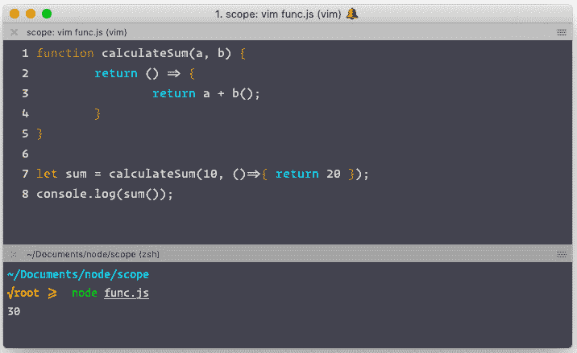

图 13.8：匿名函数的示例

在示例中，您可以看到我们使用了大量未命名的函数。这些函数在 JavaScript 中非常重要。没有特定名称声明的函数称为匿名函数。我们在用 JavaScript 编程时经常使用匿名函数。这类函数在运行时动态声明，并可以作为参数传递给其他函数。例如，`Function () {}` 是匿名函数的典型示例。您可以将此函数的返回值赋给任何变量。以这种方式创建函数允许我们在运行时创建函数。匿名函数主要用于回调。

## 命名函数和无名函数之间的区别

命名函数和无名函数之间的主要区别在于，当您声明一个命名函数时，编译器会为该函数分配一个存储内存块。因此，如果您必须调用它，您可以使用名称来调用它。但是，对于匿名函数，内存块被分配给它们，并返回地址，然后我们可以将其存储在变量中。这有助于我们在不能声明命名函数的地方初始化函数。我们甚至可以通过将函数赋给另一个变量来更改调用此函数的名称。这可以在以下图中表示：

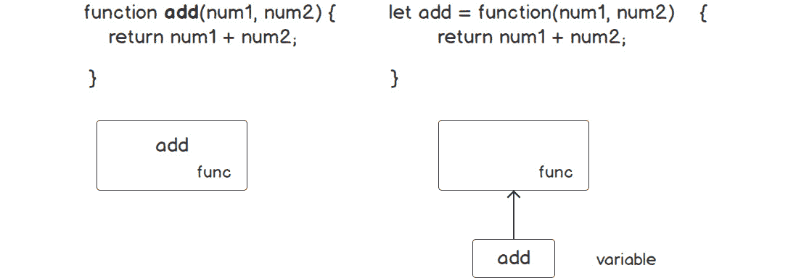

图 13.9：命名函数与匿名函数的比较

# 数据作用域

数据作用域确定在运行时您的代码中变量、函数和对象的访问性。这意味着变量的作用域由变量声明的位置控制。

在 JavaScript 中，存在两种主要的范围类型：

+   全局作用域

+   局部作用域，包括**函数级**和**块级**

## 全局作用域

每个 JavaScript 应用程序都有一个全局作用域，我们可以定义所有函数都可以访问的内容。所有在函数、块和模块外部定义的变量都具有全局作用域。全局变量在整个应用程序的生命周期内都是可用的。

创建全局变量的另一种方式是使用预定义的全局变量，例如 `process`（在 Node.js 中）和 `window`（在浏览器中）。您可以将任何值绑定到这些已定义的全局变量上，并且您可以从应用程序的任何地方访问它们。例如，让我们将 `NODE_VERSION` 值添加到 `process` 的 `env` 属性中：

```js
$ process.env.NODE_VERSION=10.8
```

在程序执行过程中，`process` 变量具有全局作用域。现在，我们可以在程序的任何地方访问我们设置的值（`NODE_VERSION = 10.08`）：

```js
$ console.log(process.env.NODE_VERSION); // "10.08"
```

## 局部作用域

在函数或块内定义的变量处于局部作用域。只有定义在该函数或块内部的函数才能访问这些变量。

### 函数级作用域

在 JavaScript 中，每个函数都有自己的作用域。在该函数内部定义的所有变量和函数将只能访问彼此：

```js
// Function A
function parent(arg1, arg2) {
let name = "gaurav";
let age = 24;
function print(){
console.log(name, age);
}
}
// Function B
function print(){
console.log(name, age); // Error : name, age variable not defined.
}
```

在这里，两个函数有不同的作用域级别。`函数 B`无法访问`函数 A`中定义的变量。以下图中突出了两个函数的作用域：

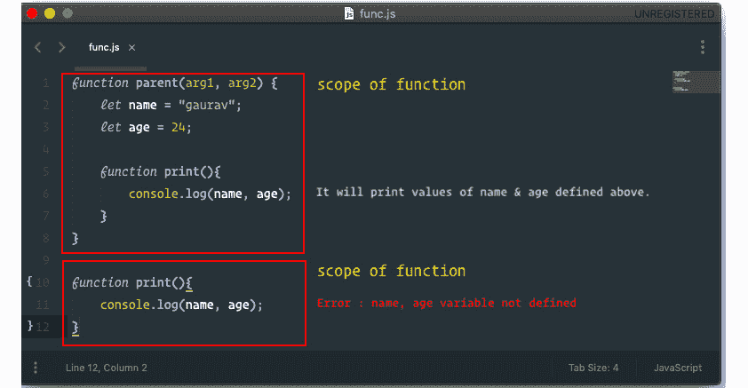

![图 13.10：函数级作用域的示例### 块级作用域块级作用域类似于函数级作用域，但在这类作用域中，我们不初始化任何函数。我们可以在 JavaScript 中创建块来分离变量的作用域：```js// 1st block{let name = "gaurav";let age = 24;console.log(name, age);}// 2nd block{console.log(name, age);}```注意我们在 JavaScript 中使用花括号来创建块。第二个块无法访问第一个块中创建的任何变量。## 提升机制我们现在知道变量和函数的作用域取决于它们声明的位置，但 JavaScript 中有一个有趣的概念，称为**提升**。提升是一个特性，其中解释器将函数和变量的声明移动到它们作用域的顶部。这意味着变量声明在执行任何代码之前被处理。当处理任何作用域时，首先搜索整个作用域中的变量和函数声明。然后，为每个变量和函数分配内存空间。之后，按行执行函数或块的主体。注意提升只移动变量和函数的声明，而不移动赋值。赋值保持在相同的位置。函数首先提升，然后是变量。因此，始终首先声明函数然后处理实现部分是一个好习惯：```js// 1st block{var name;console.log(name);name="gaurav"}// 2nd block{console.log(name);var name = "gaurav";}```在这里，两个块都将返回`undefined`。两个块输出相同。在块内部，声明的位置并不重要。第一个块不会抛出任何与未定义变量相关的错误。## `var`和`let`之间的差异在`var`的情况下，在创建变量定义之后，每个变量都被初始化为未定义值，但在`let`/`const`的情况下，直到声明行才会发生初始化为未定义的操作。在以下代码中，变量处于临时死区，访问它会导致引用错误：```js// 1st block{let name;console.log(name);name="gaurav";}// 2nd block{console.log(name);let name="gaurav"}```让我们执行这个，通过观察`var`和`let`的不同输出来看差异：

图 13.11：`let`关键字的使用

在前面的图中，你可以看到如果我们使用`let`，它会抛出一个引用错误。让我们看看使用`var`关键字时的输出：


图 13.12：`var`关键字的使用

我们可以看到使用`var`关键字为两个块都提供了相同的未定义输出。

## 闭包

闭包是 JavaScript 中的一个特性，其中一个函数定义在另一个函数内部，可以访问父函数的变量。闭包有三个作用域链：

+   自作用域：在其花括号内定义的变量

+   父函数：在父函数中定义的属性

+   全局变量：在全局作用域中定义的属性

让我们来看一个例子：

```js
function outer(arg) {
let count = 1;
function inner() {
console.log(arg, '=', count++);
    }
return inner;
}
varfunA = outer('A');  // outer() invoked the first time
varfunB = outer('B');  // outer() invoked the second time
funA(); // function funA called for first time
funA(); // function funA called for second time
funA(); // function funA called for third time
funB(); // function funB called for first time
```

我们有一个主要函数，即`outer`。然后，我们声明了一个值为`1`的`count`变量。我们还有一个`inner`函数，它正在使用并增加`count`的值。然后，我们返回`inner`函数。前面代码的输出如下：

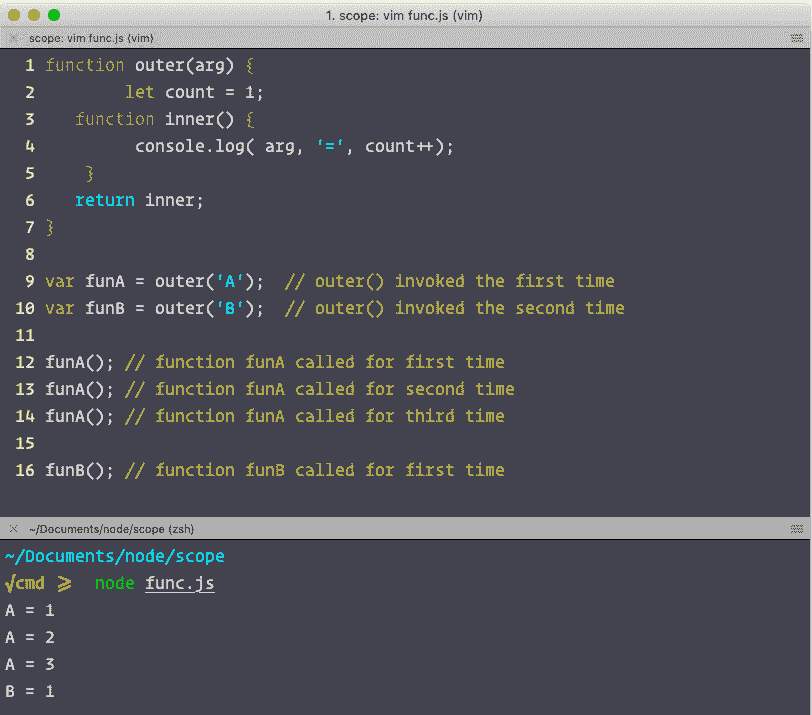

](img/C14377_13_13.jpg)

图 13.13：闭包示例

当我们第一次调用`outer('A')`函数时，我们为`count`变量和`inner`函数创建了一个作用域。然后，我们返回`inner`函数并将其地址保存在`funA()`中。我们对`funB()`也做了同样的事情。

当我们首先调用`funA()`函数时，它能够访问`count`变量，因为它在其父函数中。所以，它打印了`count`的值，并通过添加`1`来更新它。当我们再次调用它时，它再次访问父作用域并获取`count`的更新值。JavaScript 能够实现这一点，归功于闭包。

在本节中，我们学习了 JavaScript 的许多基本功能。我们从原型开始，并使用它们来实现继承。然后，我们学习了匿名和命名函数以及如何使用它们。我们还学习了 JavaScript 中不同类型的数据作用域。最后，我们学习了提升和闭包，这些是 JavaScript 提供的最复杂和最重要的功能之一。

# JavaScript 内存管理

在其他技术语言中，如 C 和 C++，内存分配和释放是一个额外的任务。我们必须在 C 中使用`malloc()`和`free()`函数为我们的变量分配和释放内存。幸运的是，我们不再需要在 JavaScript 中关心内存分配了。JavaScript 内置了垃圾回收器。JavaScript 在对象创建和销毁时自动分配和释放内存。

## 内存生命周期

大多数编程语言的内存生命周期是相同的。无论你使用的是 JavaScript、Python 还是 Java，内存的分配和释放几乎都是相同的。它们都遵循三个步骤：

1.  分配内存。

1.  使用分配的内存。

1.  释放分配的内存。

在低级语言中，第一和最后部分是显式的，这意味着开发者必须编写代码来分配和释放内存，但在像 JavaScript 这样的高级语言中，这通常是隐式的。在编译你的代码时，编译器会检查代码中使用的所有原始数据类型，并计算程序将占用多少内存。然后，它将所需的内存分配到程序的调用栈空间中。这个过程称为静态内存分配。在运行时，内存分配以 LIFO（后进先出）的方式进行，这意味着随着函数的调用和终止，它们的内存被添加到现有内存的顶部，并以 LIFO 顺序移除。

## 静态分配与动态分配

存在两种内存分配类型，静态和动态。静态分配仅在编译时执行。当我们编译代码时，编译器会确定所有静态变量并在那时分配内存。以下是一个示例：

```js
let num = 786;    // allocates memory for a number
let str = 'Hello World';  // allocates memory for a string
```

如其名所示，动态分配仅在运行时执行，因为有时我们不知道数据的确切大小，例如，当将 API 的响应分配给变量时。在这种情况下，我们不知道 API 会发送给我们什么，因此内存将在运行时分配：

```js
let res = response.json();  // allocates memory for json
```

在这个示例中，我们无法提前预测 JSON 对象的大小，因此这个变量将动态分配。静态和动态内存分配之间的主要区别将在下一节中详细说明。

以下为静态内存分配的特点：

+   在编译时分配

+   使用堆存储

+   当已知所需内存量时使用较好

+   使用 LIFO（后进先出）

+   比动态分配执行更快

+   更高效

+   性能更高

以下为动态内存分配的特点：

+   在运行时分配

+   使用堆存储

+   当所需内存量未知时使用较好

+   没有分配顺序

+   比静态分配执行更慢

+   比静态分配效率低

+   由于运行时内存分配，性能较慢

## 释放内存

最困难的任务是确定何时分配的内存不再需要。当需要找到和清除未使用的内存时，JavaScript 的垃圾回收器非常有用。

## 引用计数垃圾回收

找到可用的变量的一种方法是通过找到它们的引用。如果任何变量有多个引用，这意味着可以使用这个变量。但如果我们移除任何变量的所有引用，它就变得无用，并且 JavaScript 将在下一个周期中回收它。

假设我们有一个嵌套对象`obj`。它有一个名为`a`的属性，还有一个名为`b`的属性。现在，`obj`引用`a`，而`a`引用`b`。访问`b`的唯一方法是通过`a`：

```js
let obj = {
a : {
 b : 2
    }
}
```

如果我们将`a`的引用更改为`b`，则`b`将被垃圾回收：

```js
obj.a = null;
```

现在，由于没有对`b`的引用，垃圾回收器将删除它并释放内存。

在本节中，我们学习了 JavaScript 如何自动管理内存，以及它如何为我们进行内存管理。我们了解了静态和堆存储设备，并对 JavaScript 中的垃圾回收器的工作原理进行了概述。我们探讨了引用垃圾回收作为垃圾回收器在 JavaScript 程序中查找和清除未使用内存的许多方法之一。

## 活动练习 13.01：创建计算器应用程序

在本章中，我们学习了在用 JavaScript 编程时可以使用的不同类型的范式。现在，是时候加深我们对这些范式的了解，并确保我们在现实世界中实现范式时知道它们之间的区别。

让我们使用过程式和面向对象两种方法构建一个简单的计算器应用程序，这将为我们提供一个清晰的示例，说明如何以不同的范式实现问题的解决方案。

活动的高级步骤如下：

1.  创建一个空文件并命名为`procedural.js`。

1.  初始化一个数组，该数组将维护函数调用的历史记录。

1.  创建简单的`addition`、`subtraction`、`multiplication`、`division`和`power`函数。

1.  创建一个`history`函数，该函数将维护函数调用的历史记录。

1.  逐个调用所有函数，并使用一些随机数字作为参数。

1.  现在打印历史记录以检查输出。

1.  现在，使用面向对象编程（OOP）构建应用程序。创建一个类并命名为`calculator`。

1.  初始化一个`historyList`数组，该数组将维护所有函数调用的历史记录。

1.  创建简单的`add`、`subtract`、`multiply`、`divide`和`pow`方法。

1.  添加一个额外的函数，该函数将显示操作的历史记录。

1.  创建此类的实例，并使用简单的数字调用其方法以执行数学运算。

1.  调用`calculator`类的`history`方法以检查历史记录。

使用过程式和面向对象两种方法，此代码的输出结果如下：

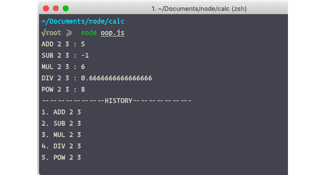

](img/C14377_13_14.jpg)

图 13.14：使用过程式和面向对象方法得到相同输出

注意

此活动的解决方案可以在第 754 页找到。

你将看到，两个脚本的输出完全相同，但我们的实现方式完全不同。这种实现方式告诉我们，解决问题有多种方法。最佳方法取决于许多因素，例如团队规模、项目计划、项目期望等。因此，最终，我们实现了相同问题的相同解决方案。

# 摘要

到目前为止，在这本书中，我们已经涵盖了客户端和服务器端 JavaScript 的执行。你学习了 JavaScript 中作用域的重要性，以及 JavaScript 坚实基础所需的基本知识。

在本章中，我们学习了不同的编程范式。我们讨论了开发者常用的两种流行方法，即过程式和面向对象。然后，我们探讨了原型、数据作用域、提升和闭包的用法。

现在，让我们深入探讨最后一个也是最关键的编程范式，许多开发者都在使用：函数式编程。在下一章中，我们将学习很多关于函数式编程的知识，包括何时以及如何使用它。
