# 14. 理解函数式编程

概述

到本章结束时，你将能够使用纯函数、不可变性、组合和柯里化等函数式编程概念；使用如 filter、map 和 reduce 的高级函数；应用如克隆对象等技术以减少代码中的副作用；并展示减少代码中命令式逻辑和 `for` 循环的策略。

# 简介

在上一章中，我们讨论了 JavaScript 是一种多范式编程语言。可以编写具有过程式、面向对象和函数式设计模式的代码。在本章中，我们将仔细研究函数式编程设计模式。

函数式编程是一种在最近几年变得流行的编程范式，尽管在此之前，大多数 JavaScript 开发者对它并不熟悉。

JavaScript 并不像 Haskell、Scheme 和 Clojure 那样是一种纯粹的函数式语言。然而，如果你选择使用，JavaScript 支持函数式结构和技巧。熟悉其概念并掌握如何使用它们是值得的。

函数式编程有一系列特性。其中，以下是一些重要的特性：

+   纯函数

+   不可变性和避免共享状态、可变数据和副作用

+   声明式而非命令式

+   高阶函数

+   函数组合和管道

+   柯里化函数

+   减少了使用传统的流程控制结构，如 `for`、`while`，甚至 `if`

这些概念将在本章中介绍。如果正确实现，函数式编程可以产生比其他编程方法更可预测、更少错误、更容易测试的代码。

# 纯函数

纯函数是函数式编程的支柱之一。一个函数是纯的，如果它总是对相同的参数返回相同的结果。它也不能依赖于或修改函数作用域之外的变量或状态。

一个不纯函数的简单例子如下：

```js
var positionX = 10;
function moveRight(numSlots) {
    positionX += numSlots;
}
moveRight(5);
```

你可以清楚地看到函数如何在其作用域之外操作一个值，即 `positionX` 全局变量。一个纯函数应该只使用传递给它的参数进行逻辑，而不应该直接修改它们。另一个问题是该函数实际上没有返回值。

考虑以下代码。你能看出为什么它不被认为是纯函数吗？

```js
var positionX = 10;
function moveRight(numSlots) {
    return positionX + numSlots;
}
positionX = moveRight(5);
```

虽然该函数只读取全局变量的值，并没有直接操作该变量，但它仍然不是纯的。为了理解原因，考虑如果你多次以 `numSlots` 参数的值 `5` 调用该函数会发生什么：

+   第一次，结果是 `15`（因为 `positionX` 是 `10`，`10 + 5 = 15`）

+   第二次，结果将是 `20`

+   第三次，结果将是 `25`

换句话说，每次调用都会得到不同的结果。为了使函数纯净，结果必须对于给定的参数值解析为完全相同的值，即`5`。同时，考虑一下编写此函数测试的难度，因为结果是不可预测的。

使此函数纯净的正确方法如下：

```js
var positionX = 10;
function moveRight(x, numSlots) {
    return x + numSlots;
}
positionX = moveRight(positionX, 5);
```

在这个版本中，函数在逻辑中使用的所有数据都作为参数传递，它不会引用函数作用域之外的数据。它也将对于给定参数集始终产生相同的结果：

+   如果`x=10`且`numSlots=5`，结果将始终是`15`。

+   如果`x=15`且`numSlots=5`，结果将始终是`20`。

+   如果`x=20`且`numSlots=5`，结果将始终是`25`。

结果的可预测性使得代码质量更高，更容易对函数进行推理，也更容易编写测试。它还使得代码易于维护且风险较低，如果函数需要重构。

## 副作用

函数式编程中的一个重要概念是与纯净函数密切相关的是减少副作用。副作用是指函数执行某些操作，无论是直接还是间接的，这些操作并非严格为了函数或其返回值的目的。

副作用的例子包括显示警告框、写入文件、在网络上触发服务调用或更改 DOM 的操作。（实际上，当我们在上一个章节的纯函数示例中操作全局变量时，我们也在创建一种称为共享状态的副作用。）

注意

完全没有副作用的程序是不可能的，也是不希望的。毕竟，如果你不能以某种方式看到输出，这个程序有什么用呢？然而，函数式程序员大多数时候的目标是创建纯净函数，并隔离需要输出或副作用的函数和代码部分。保持此类代码的分离有助于你更好地理解软件，以便进行调试、创建更好的测试，以及简化未来的维护和扩展。

## 不可变性

函数式编程中的另一个概念是尽可能优先选择不可变值和对象而不是可变对象。简而言之，不可变对象是指一旦创建后其值就不能改变的值，即使这些对象被使用。接下来，我们将进行一些练习，以展示某些对象，如字符串和数字是不可变的，而数组不是。我们将从以下练习开始字符串的不可变性。

## 练习 14.01：不可变值和对象 – 字符串

在这个练习中，我们将展示字符串是如何不可变的。让我们开始吧：

1.  在 Google Chrome 浏览器中，转到“开发者工具”（在屏幕右上角带有三个点的菜单中选择“更多工具”|“开发者工具”，或者直接按*F12*键）。

1.  JavaScript 有几个内置的不可变对象，例如字符串。创建两个常量 `string1` 和 `string2`，并将变量赋值，使得 `string2` 是 `string1` 的子字符串：

    ```js
    const string1 = "Hello, World!";
    const string2 = string1.substring(7, 12);
    ```

1.  显示两个字符串。在控制台中输入以下内容：

    ```js
    console.log(`string1: ${string1}`);
    console.log(`string2: ${string2}`);
    ```

1.  此代码产生以下输出：


图 14.1：字符串的输出

从这个例子中，你可以看到对 `string1` 执行 `substring()` 操作并没有以任何方式改变 `string1` 的值，这证明了字符串是不可变的。实际上，它产生了一个由给定索引之间的部分字符串字符组成的新字符串。然后，这个结果被设置为 `string2` 变量的值。

## 练习 14.02：不可变值和对象 – 数字

原始类型，如数字，也是不可变的。在这个练习中，我们将对数字执行操作以演示数字的可变性。

1.  创建两个常量 `number1` 和 `number2`，并赋予它们数值，使得 `number2` 是 `number1` 值的一半：

    ```js
    const number1 = 500;
    const number2 = number1 / 2;
    ```

1.  在控制台中显示两个数字对象。输入以下内容：

    ```js
    console.log(`number1: ${number1}`);
    console.log(`number2: ${number2}`);
    ```

1.  此代码产生以下输出：


图 14.2：数字的输出

我们可以看到，对 `number1` 进行计算并将结果设置到新变量中不会影响原始变量。

## 练习 14.03：可变性 – 数组

到目前为止，我们已经探讨了不可变对象。从现在开始，我们将查看不具有这种不可变性的对象示例。在这个练习中，我们将创建一个数组并将其值赋给另一个数组，然后我们将修改其值以演示数组是如何可变的。

1.  创建并定义 `array1`，使其具有三个值元素，即 `'one'`、`'two'` 和 `'three'`：

    ```js
    const array1 = ['one', 'two', 'three'];
    ```

1.  创建另一个数组 `array2`，其值等于 `array1`：

    ```js
    const array2 = array1;
    ```

1.  现在，向 `array2` 添加另一个元素 `'four'`：

    ```js
    array2.push('four');
    ```

1.  在控制台中显示两个输出，如下所示：

    ```js
    console.log(`array1: ${array1}`);
    console.log(`array2: ${array2}`);
    ```

此代码产生以下输出：


图 14.3：数组的输出

在这里，我们将 `array2` 变量赋值给与 `array1` 相同的数组，然后向 `array2` 添加另一个元素（值 `'four'`）。你可能感到惊讶，`array1` 也会受到影响，并添加了相同的元素，这与之前的例子不同。这是因为当对 `array2` 进行赋值时，它并没有创建一个新的数组。相反，它只分配了一个指向原始数组的引用，即 `array1`。操纵任一数组都会影响这两个变量，因为它们实际上是同一个数组。

## 练习 14.04：可变性 – 对象

在这个练习中，我们将向对象属性赋值以演示对象的可变性。

1.  创建一个具有 `name` 和 `show` 属性的对象 `actor1`。将这些属性赋值为 `Sheldon` 和 `BB Theory`：

    ```js
    const actor1 = {
        name: 'Sheldon',
        show: 'BB Theory'
    };
    ```

1.  现在，创建另一个变量，`actor2`，并将其赋值给与`actor1`相同的对象。然后，也为`actor2`添加一个名为`name`的新属性

    ```js
    const actor2 = actor1;
    actor2.name = 'Leonard';
    ```

1.  在控制台中输入以下内容：

    ```js
    console.log("actor1:", actor1);
    console.log("actor2:", actor2);
    ```

1.  这段代码的结果如下：

![图 14.4：对象的输出

![图 14.4：对象的输出

图 14.4：对象的输出

如你所见，`actor1`和`actor2`变量中的对象最终都是完全相同的。`name`属性不仅存在于`actor2`中，正如你可能预期的。这又是由于`actor2`只是对`actor1`的引用，而不是它自己的对象。

另一个值得注意的点。在所有这些例子中，变量都是使用`const`关键字定义为常量的。然而，正如我们在最后两个例子中看到的，我们能够修改对象，并且编译器没有报错。这表明`const`关键字并不等同于说值是不可变的！

`const`实际上意味着编译器阻止你将变量重新赋值给一个新的对象。但它并不限制你改变分配对象的属性或添加数组元素。

下一个部分将展示一些关于如何有效处理可变对象的方法。

## 克隆对象和数组

在上一个练习中，你看到了数组和对象是可变的。那么，如果你需要修改它们怎么办？你如何以安全的方式修改，避免副作用？

首先，有一个简单的数组技术。如果你只是向数组中添加一个元素，你可以使用`Array.prototype.concat`而不是`Array.prototype.push`。区别在于`concat`返回一个包含新元素的新数组副本，而`push`则修改原始数组。

我们可以在以下代码中看到这一点。在这里，`array1`和`array2`现在实际上是不同的对象：

```js
const array1 = ['one', 'two', 'three'];
const array2 = array1.concat('four');
console.log(`array1: ${array1}`);   // output: array1: one,two,three
console.log(`array2: ${array2}`);   // output: array2: one,two,three,four
```

上述代码的输出如下：

```js
array1: one,two,three
and
array2: one,two,three,four
```

对于其他数组的修改或操作对象，你通常需要克隆数组或对象，并在克隆上进行操作。你可能会问，如何制作克隆？这里有一个小技巧：在较新的 JavaScript 版本中（自 ECMAScript 2018 以来），展开语法对数组和对象都有效。使用展开语法，你可以做以下操作：

```js
// Arrays
const array1 = ['one', 'two', 'three'];
const array2 = [...array1];
array2[0] = 'four';
console.log(`array1: ${array1}`);   // output: array1: one,two,three
console.log(`array2: ${array2}`);   // output: array2: four,two,three
// Objects
const actor1 = {
    name: 'Sheldon',
    show: 'BB Theory'
};

const actor2 = {...actor1};
actor2.name = 'Leonard';
//the output for variable actor1 will be displayed.       
console.log("actor1:", actor1);   
```

`const actor1`的输出如下：

```js
    // output: actor1: { name: "Sheldon", show: "BB Theory" }
//the output for variable actor2 will be displayed.
console.log("actor2:", actor2);
```

`const actor2`的输出如下：

```js
    // output: actor2: { name: "Leonard", show: "BB Theory" }
```

注意到在`[...array1]`和`{...actor1}`中有三个连续的点。这些点被称为展开运算符。以这种方式使用展开语法实际上会克隆数组，或者对象中的键值对。

虽然如此，有一个需要注意的地方。这种方法只进行浅拷贝，这意味着只有顶层元素或属性被复制。在顶层之上，只创建引用。这意味着，例如，多维数组或嵌套对象不会被复制。

如果需要深拷贝，一个流行的方法是将对象转换为 JSON 字符串，然后再将其解析回来，类似于以下代码。这对对象和数组都有效：

```js
let object2 = JSON.parse(JSON.stringify(object1));
```

深拷贝方法还有一个额外的优点，即它可以在较旧的 JavaScript 版本上工作。

## 示例数据和练习样本

在我们继续之前，我们需要介绍一个带有样本数据的场景。在接下来的章节中，以下数据将在示例和练习中使用：

```js
const runners = [
    {name: "Courtney", gender: "F", age: 21, timeSeconds: 1505},
    {name: "Lelisa",   gender: "M", age: 24, timeSeconds: 1370},
    {name: "Anthony",  gender: "M", age: 32, timeSeconds: 1538},
    {name: "Halina",   gender: "F", age: 33, timeSeconds: 1576},
    {name: "Nilani ",  gender: "F", age: 27, timeSeconds: 1601},
    {name: "Laferne",  gender: "F", age: 35, timeSeconds: 1572},
    {name: "Jerome",   gender: "M", age: 22, timeSeconds: 1384},
    {name: "Yipeng",   gender: "M", age: 29, timeSeconds: 1347},
    {name: "Jyothi",   gender: "F", age: 39, timeSeconds: 1462},
    {name: "Chetan",   gender: "M", age: 36, timeSeconds: 1597},
    {name: "Giuseppe", gender: "M", age: 38, timeSeconds: 1570},
    {name: "Oksana",   gender: "F", age: 23, timeSeconds: 1617}
];
```

这是一个表示 5 公里赛跑跑步者结果的数组对象。每个跑步者的姓名、性别、年龄和时间都在对象字段中指示。时间以秒为单位记录，便于进行分钟/秒和配速计算。

我们还将定义三个辅助函数来显示数据。它们将使用一些你可能还不熟悉的概念，特别是箭头函数表示法和 `Array.prototype.map` 方法。但别担心——这些概念将在接下来的章节中介绍，并且很快就会变得清晰。

我们第一个辅助函数的目的是将秒数格式化为 `MM:SS`：

```js
   const minsSecs = timeSeconds =>
       Math.floor(timeSeconds / 60) + ":" +
       Math.round(timeSeconds % 60).toString().padStart(2, '0');
```

让我们详细理解一下代码：

+   `minsSecs` 变量定义了一个带有 `timeSeconds` 输入参数的箭头函数。

+   对于分钟部分，`Math.floor()` 方法在将秒数除以 60 时移除了小数部分，从而得到一个整数。

+   对于秒数部分，`Math.round()` 方法返回四舍五入到最接近整数的数字。（注意，我们只想四舍五入小数秒。对于分钟部分，四舍五入是不正确的。）

+   `String.prototype.padStart` 方法在值小于 10 时，会在秒值前面填充一个前导 `0`。秒数本身是通过使用取余运算符 `%` 计算的，它返回除法中的任何余数值。

我们的第二个辅助函数创建一个字符串，以自定义格式打印 `runner` 对象的字段：

```js
        const printRunner = runner =>
            [`Name: ${runner.name}`,
             `gender: ${runner.gender}`,
             `age: ${runner.age}`,
             `time: ${minsSecs(runner.timeSeconds)}`
            ].join('\t');
```

让我们详细理解一下代码：

+   再次使用箭头函数语法。该函数名为 `printRunner` 并有一个 `runner` 输入参数。

+   创建了一个格式化字符串数组，每个字段对应一个 `runner` 对象。

+   最后，通过调用 `Array.prototype.join('\t')` 将所有字符串元素使用制表符分隔符连接在一起，当打印时将形成整齐的列。

最后一个辅助函数打印所有跑步者：

```js
        const printRunners = (runners, listType) =>
            `List of ${listType} (total ${runners.length}):\n` +
                runners.map(printRunner).join('\n');
```

让我们详细地分析上述代码的不同部分：

+   该函数名为 `printRunners` 并接受两个参数：一个 `runners` 数组和一个 `listType`，它描述了正在打印的列表类型。它返回一个字符串。

+   `Array.prototype.map` 用于形成打印的跑步者详细信息。

+   简而言之，`Array.prototype.map` 方法遍历数组的每个元素，对它们执行回调函数，并生成一个包含每个元素转换值的新数组。我们将在稍后详细解释这是如何工作的。

+   但目前，这里的`Array.prototype.map`调用会在每个数组元素上调用之前指定的`printRunner`函数，以获取格式化的字符串。由于`printRunner`函数只接受一个参数，在这种情况下，没有必要显式指定参数，因为它已经隐含了。

+   然后通过调用`Array.prototype.join('\n')`将字符串与换行符连接起来。

要将所有跑者打印到控制台，可以这样调用：

```js
    console.log(printRunners(runners, "all runners"));
```

输出将如下所示：

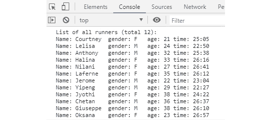

图 14.5：控制台所有跑者的示例输出

# 高阶函数

JavaScript 中的函数是一等公民。这意味着它们可以作为参数值传递给其他函数，甚至可以分配给一个变量。这是使 JavaScript 非常适合函数式编程风格的主要特征之一。

高阶函数是操作其他函数的函数。它们可以通过以下三种方式之一来实现：

+   如果函数接受另一个函数作为参数

+   如果函数返回另一个函数作为其结果

+   在这两种方式中

在前面的章节中，我们已经看到了几个高阶函数，可能你甚至没有意识到。记得响应 DOM 事件的回调函数，或者在*第十章，访问外部资源*中的回调函数，一旦 AJAX 响应就绪就会被调用？这些都是高阶函数的例子，因为这些函数是传递给其他函数的参数。

以下部分将介绍在函数式编程中常用到的三个高阶函数：`Array.prototype.filter`、`Array.prototype.map`和`Array.prototype.reduce`。

## Array.prototype.filter 方法

我们将要查看的第一个函数是`Array.prototype.filter`方法，它很简单。给定一个现有数组，`filter()`会创建一个新数组，其中包含符合指定标准的元素。

语法如下：

```js
var newArray = array.filter(function(item) {
  return condition;
});
```

回调函数会依次对数组的每个元素进行调用。如果条件通过且函数返回`true`，则该元素将被添加到新数组中。如果函数返回`false`，则该元素将被跳过，不会添加到数组中。

注意，返回值是一个新数组。原始数组完全不受此操作的影响。换句话说，如果项目不通过条件，则不会从原始数组中过滤并删除项目。相反，会创建一个新数组，其中包含通过测试的元素。

创建新数组而不是修改现有数组的原因是由于你之前学到的函数式编程的基本原则：不可变性和避免副作用。

我们将在下一节中查看`Array.prototype.filter`的使用示例。

## 复习

然而，在我们查看这些示例之前，我们审慎地退一步回顾基本的 JavaScript 函数语法和箭头函数表示法是明智的。这将确保你对即将到来的内容有一个良好的基础。我们将通过向您展示不同的方式来指定`Array.prototype.filter`的过滤函数来完成这项回顾。

假设我们想要过滤本章前面提到的跑步者数组，只保留女性跑步者。最直接的过滤函数看起来像这样：

```js
function femaleFilter(runner) {
    if (runner.gender === "F") {
        return true;
    }
    return false;
}
```

这个过滤函数将从另一个函数中调用，该函数实际上使用以下代码调用`filter()`：

```js
const getFemaleRunners = runners => runners.filter(femaleFilter);
```

为了使函数独立，它将`runners`数组作为参数。要求`runners`为全局变量并不是一个好的实践。

注意，我们只传递过滤函数的名称`femaleFilter`作为参数，而不是像`femaleFilter()`那样带有括号。我们不希望函数立即执行，如果有括号就会发生这种情况。相反，当不带括号通过名称传递函数时，你实际上是在传递函数对象本身。`filter`方法是一个高阶函数，它接受一个回调函数作为输入，这需要实际的函数对象。

可以使用以下代码显示此过滤的结果：

```js
console.log(
    printRunners(getFemaleRunners(runners), "female runners"));
// output:
// → List of female runners (total 6):
// → Name: Courtney  gender: F     age: 21   time: 25:05
// → Name: Halina    gender: F     age: 33   time: 26:16
// → Name: Nilani    gender: F     age: 27   time: 26:41
// → Name: Laferne   gender: F     age: 35   time: 26:12
// → Name: Jyothi    gender: F     age: 38   time: 24:22
// → Name: Oksana    gender: F     age: 23   time: 26:57
```

注意

应使用此代码显示以下示例的结果。每个示例都应期望得到相同的结果。

我们做得相当不错，但我们可以做得更好。作为替代方案，过滤函数可以直接内联指定：

```js
const getFemaleRunners = runners => runners.filter(
    function(runner) {
        if (runner.gender === "F") {
            return true;
        }
        return false;
    }
);
```

如果我们将过滤测试改为布尔表达式，而不是在`if`语句中显式返回`true`或`false`，我们可以进一步简化这一点：

```js
const getFemaleRunners = runners => runners.filter(
    function(runner) {
        return runner.gender === "F";
    }
);
```

在 JavaScript 的新版本中，自 ES6 以来，这个函数也可以使用箭头函数表达式更简洁地表示：

```js
const getFemaleRunners = runners => runners.filter(runner => {
    return runner.gender === "F";
});
```

最后，请注意，这个函数只有一个参数，并且其主体中只有一个`return`语句。这使得我们可以用以下单行代码使代码更加简洁，该代码省略了开/闭括号和`return`关键字：

```js
const getFemaleRunners = runners =>
    runners.filter(runner => runner.gender === "F");
```

如果需要，过滤函数也可以拆分成它自己的函数并存储在一个变量中，因为函数在 JavaScript 中是一等对象：

```js
const femaleFilter = runner => runner.gender === "F";
const getFemaleRunners = runners => runners.filter(femaleFilter);
```

## 消除 for 循环

`Array.prototype.filter`函数是强大函数式编程技术的绝佳演示，这些技术用于消除循环代码，特别是`for`循环。为了感受传统`for`循环的潜在陷阱，考虑过滤女性跑步者的等效命令式代码：

```js
var femaleRunners = [];
for (var i = 0; i < runners.length; i++) {
    if (runners[i].gender == "F") {
        femaleRunners.push(runners[i]);
    }
}
```

将其与我们在上一节中看到的单行代码进行比较，它做的是同样的事情：

```js
const femaleRunners = runners.filter(runner => runner.gender === "F");
```

强制性循环代码需要使用循环变量`i`。这会将状态突变引入我们的代码中，并可能成为错误的一个来源。尽管在这种情况下，它是一个局部状态，但在所有可能的情况下最好避免使用状态。在未来的某个时刻，存在一个风险，即变量会因未知原因而改变，从而产生难以调试的问题。

使用函数式等价物，可以更直观地看到代码做了什么，更容易测试，并且有更多潜在的复用机会。它没有缩进，没有循环，代码更加简洁和表达性强。

这也展示了函数式代码通常是声明性的，而不是命令性的。它指定了“做什么”（声明性），而不是“如何做”的步骤和流程（命令性）。在这个例子中，函数式代码只是简单地说明了，“过滤掉`runners`参数中性别为女性的数组元素”。与此相比，命令性代码需要多个变量、语句、循环等，它描述的是“如何做”而不是“做什么”。

在接下来的章节中，我们将探讨其他消除循环的数组方法，例如`Array.prototype.map`和`Array.prototype.reduce`。

## `Array.prototype.map`方法

当你想转换数组元素时，会使用`map()`数组方法。它将一个函数应用于调用数组的每个元素，并构建一个由返回值组成的新数组。新数组将与输入数组具有相同的长度，但每个元素的内部内容将被转换（映射）成其他内容。

假设你想计算 5 公里比赛中每位跑步者的平均配速。我们的数据集提供了一个`timeSeconds`字段，这是跑步者完成全程所需的总秒数。5 公里中也有 3.1 英里。因此，要得到每英里的配速，你需要将秒数除以 3.1。

我们可以使用以下代码计算所有跑步者的配速：

```js
const getPaces = runners => runners.map(runner => runner.timeSeconds / 3.1);
const paces = getPaces(runners);
```

这段代码生成一个新数组，其元素具有与输入数组中相同索引的对应跑步者的`pace`值。换句话说，`paces[0]`的值对应于`runner[0]`中的跑步者，`paces[1]`的值对应于`runner[1]`中的跑步者，依此类推。

可以按照以下方式将配速结果打印到控制台：

```js
paces.forEach(pace => console.log(minsSecs(pace)));
// output:
// → 8:05
// → 7:22
// → 8:16
// → 8:27
// ...
```

## 练习 14.05：另一种使用 Array.prototype.map 的方法

关于映射到单值元素的数组的结果在前一节中是有用的，对于某些上下文来说，例如如果你打算随后计算值的总和或平均值。当你只需要原始数字且上下文不重要时，这是可以的。但如果你需要每个元素更多的值或上下文，比如达到特定配速的跑者的名字呢？这个练习展示了另一种我们可以使用 `Array.prototype.map` 来使用原始数据集实现不同结果的方法；例如，获取每个跑者的计算配速。

1.  在 Google Chrome 浏览器中，转到 `开发者工具`（点击屏幕右上角的三个点菜单 | `更多工具` | `开发者工具`，或者直接按 *F12* 键）：

    图 14.6：Google Chrome 浏览器中的开发者工具

1.  在控制台粘贴本章 *示例数据* 部分的样本跑者数据（以 `const runners = [...]` 开头）：

    ```js
    const runners = [
        {name: "Courtney", gender: "F", age: 21, timeSeconds: 1505},
        {name: "Lelisa",   gender: "M", age: 24, timeSeconds: 1370},
        {name: "Anthony",  gender: "M", age: 32, timeSeconds: 1538},
        {name: "Halina",   gender: "F", age: 33, timeSeconds: 1576},
        {name: "Nilani ",  gender: "F", age: 27, timeSeconds: 1601},
        {name: "Laferne",  gender: "F", age: 35, timeSeconds: 1572},
        {name: "Jerome",   gender: "M", age: 22, timeSeconds: 1384},
        {name: "Yipeng",   gender: "M", age: 29, timeSeconds: 1347},
        {name: "Jyothi",   gender: "F", age: 39, timeSeconds: 1462},
        {name: "Chetan",   gender: "M", age: 36, timeSeconds: 1597},
        {name: "Giuseppe", gender: "M", age: 38, timeSeconds: 1570},
        {name: "Oksana",   gender: "F", age: 23, timeSeconds: 1617}
    ];
    ```

1.  在控制台粘贴 `minsSecs()` 辅助函数的代码，也来自本章的 *示例数据* 部分：

    ```js
    const minsSecs = timeSeconds =>
                Math.floor(timeSeconds / 60) + ":" + 
                Math.round(timeSeconds % 60).toString().padStart(2, '0');
    ```

1.  将以下代码输入到控制台：

    ```js
    const getPacesWithNames = runners => runners.map(runner =>
        ({name: runner.name, pace: runner.timeSeconds / 3.1}));
    const pacesWithNames = getPacesWithNames(runners);
    ```

    此代码展示了向数组元素添加上下文的简单方法：而不是从映射函数中返回单个值，可以返回一个包含所需字段的对象。在这种情况下，对象为每个数组元素包含 `name` 和 `pace` 字段。

1.  我们可以通过以下代码查看输出：

    ```js
    // print each value
    pacesWithNames.forEach(paceObj =>
        console.log(`name: ${paceObj.name}\tpace: ${minsSecs(paceObj.pace)}`));
    ```

    执行前面的命令后，你的控制台日志应该看起来像下面的截图所示。注意底部的姓名和配速列表：

    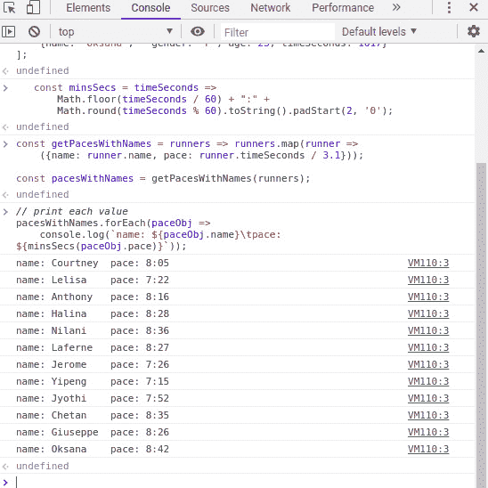

    图 14.7：姓名和配速字段的输出

    你会注意到我们有了原始数据中的所有相同的跑者，但没有性别、年龄或秒数。我们还添加了一个新的值 `pace`，这是通过 `getPacesWithNames` 函数创建的。如果你想让你的数组包含所有原始字段并附加一个额外的 `pace` 字段怎么办？

1.  我们可以使用你之前学到的扩展运算符。在控制台输入以下内容：

    ```js
    const addPacesToRunners = runners => runners.map(runner =>
        ({...runner, pace: runner.timeSeconds / 3.1}));
    ```

1.  `...runner` 扩展运算符有效地克隆了对象中的所有键值对，将它们添加到新的映射值中，并显示输出。将 `addPacesToRunners` 函数添加并运行到你的控制台。

    注意

    将会复制字段。和之前一样，我们不想仅仅修改原始对象以便添加新字段，因为这可能会产生副作用。

1.  以下代码运行函数并在控制台显示结果：

    ```js
    const pacesWithAllFields = addPacesToRunners(runners);
    pacesWithAllFields.forEach(paceObj => console.log(paceObj));
    ```

一旦运行 `forEach()` 函数来遍历 `pacesWithAllFields` 的元素，您应该得到一个包含所有原始数据的跑者列表，但除此之外，还将有一个新的平均配速字段：

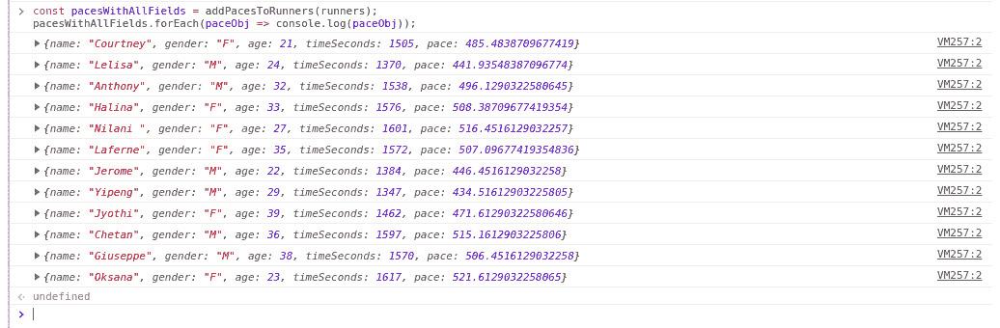

图 14.8：添加配速字段后的 addPacesToRunners 结果

注意

如果您预计代码将在较旧的浏览器中运行，请不要使用展开技术。使用 `Object.assign()` 等替代方案来克隆您的字段。以下是 `addPacesToRunners` 在较旧环境中编码的方式：

`const addPacesToRunners = runners => runners.map(runner =>`

`    Object.assign({}, runner, {pace: runner.timeSeconds / 3.1}));`

或者，像 Babel 这样的转译器支持在较旧的浏览器中扩展语法。

在这个练习中，我们探讨了使用 `Array.prototype.map` 方法以及如何使用函数式编程设计模式来组合函数以创建复杂的结果。我们结合了 `addPacesToRunners`、`minsSecs` 和 `pacesWithNames` 来打印每个跑者的配速，以及原始数据集中的数据。重要的是，我们在不修改原始数据集的情况下添加了额外的配速数据值。因此，使用本练习中的技术可以在映射值时保留上下文。

在下一节中，我们将学习另一个数组方法 `reduce`，它允许我们从数组中取出一组值并将它们计算成一个单一值。

## Array.prototype.reduce 方法

与 `map()` 类似，数组 `reduce()` 方法作用于数组的每个元素。当您需要从它们计算出一个单一值时使用它。

一个简单的例子是如果您需要一组数字的总和：

```js
const sum = [2, 4, 6, 8, 10].reduce((total, current) => total + current, 0);
console.log(sum);
```

前一个函数的输出将如下所示：

```js
// output:
// → 10
```

在这里，`reduce()` 方法接受两个参数：一个组合函数和一个起始值（在这种情况下为 `0`）。它会导致组合函数依次与数组的每个元素一起调用，就像在 `for` 循环中做的那样。对于每次调用，当前元素作为 `current` 值传递，同时传递到目前为止的 `total` 值（有时称为累加器）。

第一次调用组合函数时，`total` 是起始值（`0`），而 `current` 是数组中的第一个数字（`2`）。加法运算，即 `total` `+` `current`，结果是 `2`。

第二次调用组合函数时，`total` 是上一次调用的结果（`2`），而 `current` 是数组中的第二个数字（`4`）。加法运算，即 `total` `+` `current`，结果是 `6`。

这个过程会重复进行，直到数组中剩余的元素都被处理。以下是一个简单的表格，显示了每次调用的值：

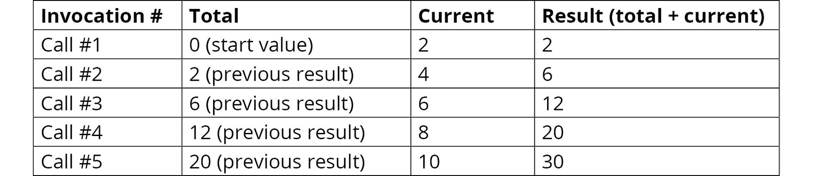

图 14.9：调用值及其结果

这里是另一个可视化这个减少过程，可能有助于你更清楚地看到它：

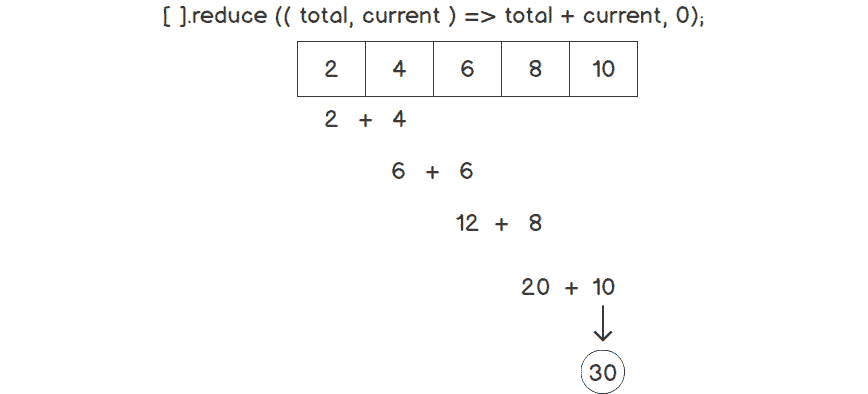

](img/C14377_14_10.jpg)

图 14.10：减少过程的描述

回到使用我们的`runners`数据集，以下是如何使用`reduce()`计算所有跑者的平均配速。但首先，回忆一下上一节中使用的`map()`来计算每个跑者的配速，并将结果返回到一个新数组中的代码：

```js
const getPaces = runners => runners.map(runner => runner.timeSeconds / 3.1);
const paces = getPaces(runners);
```

我们可以使用这些配速来使用`reduce()`计算平均值：

```js
const getAvgPace = paces => paces.reduce(
    (total, currentPace) => total + currentPace, 0) / paces.length;
console.log(minsSecs(getAvgPace(paces)));
```

`reduce()`函数的输出如下：

```js
// output:
// → 8:08
```

首先，在`reduce()`中，我们使用与之前求和数组数字类似的技术计算所有`pace`值的总和。但有一个额外的步骤。我们不是返回总和，而是在返回结果之前将其除以数组的长度。

## 练习 14.06：使用 Array.prototype.reduce 进行分组

如果你想计算按性别分组的所有跑者的平均配速呢？我们可以使用`reduce()`来实现，但这比之前的例子要复杂一些。在这个练习中，我们将实现一种分组方法。

与我们计算直线数字的平均值不同，对于分组平均值，我们需要分两步进行：首先，收集每个性别的总和和计数，然后在第二步中计算平均值。

以下概述了求和和计数步骤的方法：

+   使用一个空对象（`{}`）作为我们的起始值。

+   当遍历数组元素时，获取当前元素性别的到目前为止的组`sum`和`count`统计数据。（如果还没有性别统计数据，则创建一个空的组，并将`sum`和`count`设置为`0`。）

+   将当前元素的配速加到组总和中。

+   将组的计数增加`1`。

这里是完成此操作的步骤：

1.  在 Google Chrome 浏览器中，前往开发者工具（点击屏幕右上角的三个点菜单 | 更多工具 | 开发者工具，或者直接按*F12*键）。

1.  在控制台中粘贴来自本章“示例数据”部分的样本跑者数据（以`const runners = [...]`开始）。

1.  在控制台中粘贴来自本章“示例数据”部分的`minsSecs()`辅助函数的代码。

1.  我们将使用来自“Array.prototype.map()”部分的`pacesWithAllFields`值，该值创建了一个新数组，并为每个元素添加了一个计算出的`pace`字段。在控制台中输入以下内容：

    ```js
    const addPacesToRunners = runners => runners.map(runner =>
        ({...runner, pace: runner.timeSeconds / 3.1}));
    const pacesWithAllFields = addPacesToRunners(runners);
    ```

1.  以下是我们之前概述的第一个求和和计数步骤的代码：

    ```js
    const groupSumPaceByGender = runners => runners.reduce((groups, runner) => {
        const gender = runner.gender;
        groups[gender] = groups[gender] || {pace: 0, count: 0};
        groups[gender].pace += runner.pace;
        groups[gender].count += 1;
        return groups;
    }, {});
    const sumPacesByGender = groupSumPaceByGender(pacesWithAllFields);
    ```

1.  到目前为止，`sumPacesByGender`函数返回的对象将有两个键，代表性别值，即"`M`"和"`F`"。每个键的值也是一个对象，其中包含`pace`和`count`字段，它们包含与键对应的性别的计算统计数据。

1.  在 JavaScript 控制台中显示这样的对象有点笨拙且难以操作。我们需要一个技巧：我们将对象转换为格式化的 JSON 文本并显示它。在控制台中输入以下代码：

    ```js
    console.log(JSON.stringify(sumPacesByGender,null,4));
    ```

    这将输出带有 4 个空格缩进的 JSON：

    ```js
    // output:
    // → { 
    // →     "F": { 
    // →         "pace": 3010.645161290322, 
    // →         "count": 6 
    // →     },
    // →     "M": { 
    // →         "pace": 2840.6451612903224, 
    // →         "count": 6 
    // →     }
    // → }
    ```

1.  现在我们已经确定了每个组的总和和计数，我们可以进行第二步，计算每个组的平均值。我们可以通过使用 `Object.keys()` 获取一个包含对象键的数组（这些键具有值"`M`"和"`F`"），然后使用一个函数调用 `Array.prototype.map()` 来计算每个性别的平均值。在控制台中输入以下内容：

    ```js
    const calcAvgPaceByGender = sumPacesByGender =>
        Object.keys(sumPacesByGender).map(gender => {
            const group = sumPacesByGender[gender];
            return {gender: gender, avgPace: group.pace / group.count};
        }
    );
    const avgPaceByGender = calcAvgPaceByGender(sumPacesByGender);
    ```

1.  让我们编写代码来显示输出：

    ```js
    console.log("Average pace by gender:");
    avgPaceByGender.forEach(entry => console.log(
        `gender: ${entry.gender}  average pace: ${minsSecs(entry.avgPace)}`));
    ```

1.  输出应显示如下：

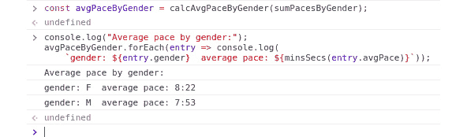


图 14.11：使用 Array.prototype.reduce 对性别配速的结果进行分组

这个输出使我们能够以有效的方式将大量的数据点“减少”为更少的结果。

在这个练习中，我们探讨了使用 `Array.prototype.reduce` 方法进行分组。与之前的练习一样，我们通过组合几个函数来创建一个更复杂的结果，而没有修改原始数据集。首先，我们使用 `addPacesToRunners` 为集合中的每个条目添加了 `pace` 值，然后我们使用 `groupSumPaceByGender` 为每个性别创建了一个分组总和，最后，我们使用 `calcAvgPaceByGender` 来获取比赛中男性和女性平均配速的值。

在下一节中，我们将讨论组合的概念。在本章中，我们已经多次使用了组合，即每次我们通过组合较小的函数来创建一个更大的过程。然而，我们还没有具体探讨这个概念，也没有讨论它在函数式范式中的重要性。我们还将查看 `pipe()` 和 `compose()` 函数，这些函数使得以这种方式组合函数变得更加容易和可读。

## 使用 `compose()` 和 `pipe()` 进行组合

在之前的练习中，我们看到从跑步者数组开始，我们需要三个不同的函数来计算每个性别的平均配速：

+   `addPacesToRunners`: 这用于计算每英里的配速。

+   `groupSumPaceByGender`: 这用于计算每个性别的配速总和。

+   `calcAvgPaceByGender`: 这用于计算每个性别的平均配速。

每个函数都需要前一个函数的结果作为输入来完成其工作。基本上，它做了以下事情，尽管这一点可能直到现在还不明显：

```js
const result1 = addPacesToRunners(runners);
const result2 = groupSumPaceByGender(result1);
const avg = calcAvgPaceByGender(result2);
```

这等价于以下，即使用嵌套函数并移除中间变量：

```js
const avg =
    calcAvgPaceByGender(groupSumPaceByGender(addPacesToRunners(runners)));
```

这是组合的概念：多个简单的函数组合起来构建一个更复杂的函数。每个函数的结果都传递给下一个函数。

我们可以创建称为`compose`和`pipe`的高阶函数，以更通用的方式实现函数组合。暂时不考虑实际的实现，让我们看看函数将如何被使用。使用`compose`，前面的嵌套函数可以这样编写：

```js
const avgWithComposition =
    compose(calcAvgPaceByGender, groupSumPaceByGender, addPacesToRunners);
```

这个函数可以这样使用：

```js
const avgResult = avgWithComposition(runners);
avgResult.forEach(entry => console.log(
    `gender: ${entry.gender}  average pace: ${minsSecs(entry.avgPace)}`));
```

函数的输出如下：

```js
// output:
// → gender: F average pace: 8:22
// → gender: M average pace: 7:53
```

注意，可能有些反直觉，`compose`中的函数实际上是按照与参数列表中给出的相反的顺序调用的，即从右到左。因此，`addPacesToRunners`方法首先使用`runners`参数被调用（即使它是给定列表中的最后一个函数），然后结果传递给`groupSumPaceByGender`，最后这些结果传递给`calcAvgPaceByGender`。

许多人发现这种函数调用顺序不自然，尽管它与我们在上面嵌套函数中调用的顺序一致。`pipe`函数与`compose`类似，但函数的组合方向相反，是从左到右而不是从右到左。`pipe`方法更符合线性思维：首先做 A，然后做 B，然后做 C，而做 A、B 和 C 的函数将按此顺序给出。

使用`pipe`，等效的代码如下：

```js
const avgWithPipe = 
    pipe(addPacesToRunners, groupSumPaceByGender, calcAvgPaceByGender);
const resultPipe = avgWithPipe(runners);
resultPipe.forEach(entry => console.log(
    `gender: ${entry.gender}  average pace: ${minsSecs(entry.avgPace)}`));
// output:
// → gender: F average pace: 8:22
// → gender: M average pace: 7:53
```

## 实现`compose()`和`pipe()`

现在，让我们看看一种实际实现这些函数的方法。实现方式相似，但我们将首先从`pipe`开始，因为它更容易理解。

当使用`Array.prototype.reduce`时，实现变得相当直接：

```js
function pipe(...fns) {
    return input => fns.reduce((prev, fn) => fn(prev), input);
}
```

`pipe`函数接受一个或多个作为参数传递的函数，这些函数通过扩展运算符转换为函数数组，即`...fns`。然后，我们对函数数组应用`reduce`，首先使用`input`参数作为`prev`调用第一个函数`fn`。在下一次调用中，第一个函数的结果（作为`prev`）被传递并用作调用数组中下一个函数的参数。数组中的其余函数以类似的方式处理，最终函数的结果值被返回。

注意，这个函数可以通过使用`full fat-arrow`符号稍微简化一下：

```js
const pipe = (...fns) => input => fns.reduce((prev, fn) => fn(prev), input);
```

关于`compose`函数，回想一下，它几乎与`pipe`相同，只是函数的处理顺序是从右到左而不是从左到右。因此，`compose`的实现基本上也是相同的，但不是使用`Array.prototype.reduce`这个姐妹函数，而是使用`Array.prototype.reduceRight`。`reduceRight`函数从数组的末尾开始处理数组，首先操作数组的最后一个元素，然后操作倒数第二个元素，依此类推。

下面是`compose`函数的实现：

```js
const compose = (...fns) => input =>
    fns.reduceRight((prev, fn) => fn(prev), input);
```

# 函数柯里化

柯里化是将一个接受多个参数的函数分解为一个或多个接受单个参数的额外函数，这些函数最终会解析为一个值。初始函数调用并不接受所有参数，而是返回一个函数，该函数的输入是剩余的参数，其输出是所有参数的预期结果。

这段话有点长，让我们来看一个例子。假设你有一个简单的`sum`函数：

```js
function sum(a, b) {
    return a + b;
}
```

让我们将这个表达式写成箭头符号中的柯里化函数：

```js
const sum = a => b => a + b;
```

注意，这里有两层函数，每个函数都接受一个参数。第一个函数接受一个参数，`a`，然后返回另一个函数，该函数接受第二个参数，`b`。

注意

如果你发现难以理解两个函数层级，这里有一个等效的表达可能有助于理解：

function sum(a) {

return function(b) {

return a + b;

};

};

你也可以用箭头符号来写：

```js
const sum = a => function(b) {
    return a + b;
};
```

要用多个参数调用这个柯里化的`sum`函数，你需要使用以下相当笨拙的语法：

```js
let result = sum(3)(5);    // 8
```

这意味着首先用参数值`3`调用`sum`，然后调用返回的函数，用参数`5`调用。

但通常情况下，你不会这样调用柯里化函数，这正是柯里化的真正用途所在。通常，函数会逐个调用，这允许我们创建中间函数，这些函数“记住”传递给它们的参数。

例如，我们可以创建以下中间函数：

```js
const incrementByOne = sum(1);
const addThree = sum(3);
let result1 = incrementByOne(3); // result1 = 4, equivalent to calling sum(1)(3)
let result2 = addThree(5);       // result2 = 8, equivalent to calling sum(3)(5)
```

这两个中间函数都记住了它们的参数：`incrementByOne`保留参数值`1`（如在`sum(1)`中），而`addThree`记住`3`。这些函数也被称为参数被应用到的函数，但实际结果只有在返回的函数用`b`参数调用时才知道。（注意，尽管部分应用与柯里化函数并不完全相同，因为部分应用可以保留多个参数，而柯里化函数始终只接受一个参数。）

这些本质上是可以被多次重用的新函数。它们也是`compose`或`pipe`的良好候选者，因为这些函数只有一个参数。

## 练习 14.07：组合和柯里化函数的更多用途

在这个练习中，你将进一步探索柯里化和组合。最值得注意的是，你将看到如何创建常见函数的柯里化版本，如`Array.prototype.map`和`Array.prototype.filter`，以组合其他函数。在函数式编程中，常见函数通常需要重构，以便它们可以作为函数链中处理数据的构建块。

这个练习将再次使用`runners`数据集。你需要创建一个函数来扫描数据并返回最年长女跑者的年龄。挑战在于使用`compose`或`pipe`的组合来完成这个任务，从而将一个函数的结果传递给下一个函数。

我们需要做的基本轮廓如下：

+   创建一个仅针对女性跑者过滤数据的函数

+   创建一个函数来映射这些数据，以获取每个跑者的年龄

+   创建一个使用 `Math.max()` 获取最高年龄值的函数

+   将我们迄今为止创建的函数组合起来，并按顺序调用它们以获得最终结果

以下步骤展示了我们如何详细地进行这项操作：

1.  在浏览器窗口的右上角打开 Chrome 菜单，然后选择 `工具` | `开发者工具`。

1.  前往控制台，粘贴本章 *示例数据* 部分的样本运行数据（以 `const runners = [...]` 开头）。

1.  首先，创建一个 `Array.prototype.filter` 的柯里化版本。在控制台中输入以下内容：

    ```js
    const filter = fx => arr => arr.filter(fx);
    ```

1.  在这里，`fx` 是过滤函数，而 `arr` 是要过滤的数组。注意参数的顺序，过滤函数将在数组之前传递。这允许我们将数据处理本身作为最后一步。

1.  与 `filter` 类似，您需要创建一个 `Array.prototype.map` 的柯里化版本。在控制台中输入以下内容：

    ```js
    const map = fx => arr => arr.map(fx);
    ```

    在这里，`fx` 是要调用的函数，用于映射每个数组元素，而 `arr` 是要映射到其他内容的数组本身。

1.  下一个需要重构的函数是 `Math.max()`，它返回传入参数中的最大值。在控制台中输入以下内容：

    ```js
    const max = arr => Math.max(...arr);
    ```

    在这里，`arr` 是要找到最大值的数字数组。默认情况下，`Math.max()` 不接受数组作为参数。然而，通过使用扩展运算符，即 `...arr`，单个数组元素将被作为一系列参数传递给 `Math.max()`，而不是作为数组。

1.  输入 `compose` 函数的实现：

    ```js
    const compose = (...fns) => input => 
        fns.reduceRight((prev, fn) => fn(prev), input);
    ```

1.  您现在可以尝试将这些函数组合在一起了。在控制台中输入以下内容：

    ```js
    const oldestFemaleRunner1 = compose(
        max,
        map(runner => runner.age),
        filter(runner => runner.gender === "F")
    );
    ```

    记住，使用 `compose` 时，操作顺序是从下到上。首先，我们有一个选择女性跑者的过滤函数，使用 `runner.gender === "F"` 表达式。接下来，我们有一个 `map` 函数，从之前 `filter` 函数中解析的女性跑者中 *提取* `age` 属性，并创建一个只包含年龄值的新数组。最后，调用 `max` 以从这些值中获得最大年龄。

1.  我们现在已经组合了所有函数，但还没有实际运行数组数据通过它们来获得结果。为此，在控制台中输入以下内容：

    ```js
    const result1 = oldestFemaleRunner1(runners);
    ```

    现在打印结果：

    ```js
    console.log("Result of oldestFemaleRunner1 is ", result1);
    ```

    您将得到一个输出，说明最年长的女性跑者年龄为 39：

    ```js
    // → output: Result of oldestFemaleRunner1 is 39
    ```

1.  这方法是可行的，但可以对 `femaleFilter` 部分进行一些轻微的改进。为什么不将其制作成一个可重用的函数呢？我们可以这样做：

    ```js
    const femaleFilter = filter(runner => runner.gender === "F");
    ```

    回想一下，`filter`是一个具有两层参数（`fx`和`arr`）的柯里化函数。在这里，我们使用`filter`的第一个参数，`fx`，这会产生一个部分应用函数。这个`femaleFilter`函数现在可以在任何上下文中使用，而不仅仅是这里。

    通过将`femaleFilter`应用于以下组合来测试该函数：

    ```js
    const oldestFemaleRunner2 = compose(
        max,
        map(runner => runner.age),
        femaleFilter
    );
    const result2 = oldestFemaleRunner2(runners);
    console.log("Result of oldestFemaleRunner2 is ", result2);
    ```

    使用`filter`函数时，你会得到一个输出，表明最年长的女性跑者是 39 岁，如下所示：

    ```js
    // → output: Result of oldestFemaleRunner2 is 39
    ```

1.  有些人发现从下到上的处理顺序令人困惑且不直观。幸运的是，我们有`pipe`函数，它的功能与`compose`相同，但顺序是从上到下。首先，输入`pipe`函数本身的实现：

    ```js
    const pipe = (...fns) => input => fns.reduce((prev, fn) => fn(prev), input);
    ```

1.  下面是使用`pipe`的等效实现：

    ```js
    const oldestFemaleRunner3 = pipe(
        femaleFilter,
        map(runner => runner.age),
        max
    );
    const result3 = oldestFemaleRunner3(runners);
    console.log("Result of oldestFemaleRunner3 is ", result3);
    ```

1.  使用管道函数时，你会得到相同的输出，即表明最年长的女性跑者是 39 岁，如下所示：

    ```js
    // → output: Result of oldestFemaleRunner3 is 39
    ```

在这个练习中，我们更详细地研究了组合和柯里化，以及如何将这些结合起来相互补充。我们使用了`filter`的柯里化版本来传递一个针对跑者性别的过滤器，然后将结果传递给`map`函数以获取`age`值，最后使用`Math.max`从`age`值的数组中找到最高值。虽然前面的练习涉及了一些将简单函数组合成更复杂过程的部分，但在这次练习中，我们实际上使用了`compose`来创建一个新的函数，该函数结合了子函数。这使得新函数`oldestFemaleRunner1`可以被其他人使用，而无需考虑底层子函数。

在下一节中，我们将学习递归函数——这是函数式编程的另一个重要方面，但由于 JavaScript 编程语言缺乏尾调用优化（这在其他函数式编程语言中是存在的），因此在 JavaScript 编程语言中有所限制。

# 函数递归

函数式编程的另一种技术涉及函数的自我递归调用。这通常意味着你从一个大问题开始，将其分解成多个相同问题的多个实例，但每次函数调用时，问题都变得更小。

递归的一个常见例子是反转字符串字符的函数，`reverse(str)`。思考一下如何用自身来表述这个问题。假设你有一个字符串，`"abcd"`，并想将其反转成`"dcba"`。认识到`"dcba"`可以重新表述如下：

```js
reverse("bcd") + "a"
```

换句话说，你正在通过移除第一个字符并将剩余字符串的递归调用作为更小的问题来分解输入字符串。以下代码可能更容易理解：

```js
function reverse(str) {
    if (str.length == 1) return str;
    return reverse(str.slice(1)) + str[0];
}
reverse("abcd");   // => output: "dcba"
```

让我们分解一下：

+   `str.length == 1`的`if`条件是基本案例。当输入恰好有一个字符时，就没有东西可以反转了，所以解决方案就是字符本身。

+   否则，使用 `String.slice()` 并以索引 `1` 为参数来获取一个新字符串，该字符串不包含输入的第一个字符。将这个字符串用作 `reverse()` 的递归调用的输入。

+   返回递归调用的结果，加上字符串的第一个字符（`str[0]`）。

这里是调用步骤的逐步进展：

```js
reverse("abcd")  =>  reverse("bcd") + "a"
reverse("bcd")   =>  reverse("cd") + "b"
reverse("cd")    =>  reverse("d") + "c"
reverse("d")     =>  "d"
```

重要的是要意识到这些函数调用在内部执行栈上是嵌套的。一旦达到一个字符的基例，递归最终有一个实际的返回值，这导致栈“展开”。当发生这种情况时，最内层的函数返回一个值，然后是它之前的函数，以此类推，直到执行回传到第一个调用。这导致最内层函数的返回值是 `"d"`，然后是 `"dc"`，`"dcb"`，最后是我们预期的结果：`"dcba"`。

递归可以作为避免需要状态突变和循环的代码的另一种技术。事实上，几乎任何循环都可以用递归实现，一些纯函数式编程语言更喜欢递归。然而，当前的 JavaScript 引擎并没有针对递归进行优化，这限制了它的用途。编写会导致性能缓慢和内存消耗过度的代码太容易了。（已经提出了可以缓解这些问题的未来增强功能，但在此之前，如果你考虑在程序中使用递归，需要非常小心。）

## 练习 14.08：使用 reduce() 创建一副扑克牌

我们已经探讨了 JavaScript 中函数式编程的基本元素和一些使用 runner 数据的数据处理示例。但处理数据不必全是数字计算——实际上可以很有趣。以一副扑克牌为例，从某种意义上说，它只是以某种方式有序排列的数据值集合。在这个练习中，我们将通过组合四个函数：`suits`、`rankNames` 和 `createOrderedDeck` 来创建一副扑克牌。

1.  创建一个名为 `suits` 的函数和另一个名为 `rankNames` 的函数来描述一副扑克牌的花色和数值。它们不是数组，而是返回数组的函数：

    ```js
    const suits =
        () => [
            { suit: "hearts", symbol: '&#9829;' },    // symbol: '♥'
            { suit: 'diamonds', symbol: '&#9830;' },  // symbol: '♦'
            { suit: 'spades', symbol: '&#9824;' },    // symbol: '♠'
            { suit: 'clubs', symbol: '&#9827;' }      // symbol: '♣'
        ];
    const rankNames =
        () => ['A', '2', '3', '4', '5', '6', '7', '8', '9', '10', 'J', 'Q','K'];
    ```

1.  创建一个名为 `ranks` 的函数，该函数接受 `rankNames` 数组作为输入，并返回每个点数映射为键值对。

    ```js
    const ranks =
        rankNames => rankNames.map(rankName => ({ rank: rankName }));
    ```

1.  创建一个名为 `createOrderedDeck` 的函数，该函数接受 `suits` 和 `rank` 作为输入，并返回所有可能的组合（例如，牌组中的每张牌）：

    ```js
    const createOrderedDeck =
        (suits, ranks) => suits.reduce(
            (deck, suit) => {
                const cards = ranks.map(rank => ({ ...rank, ...suit }));
                return deck.concat(cards);
            }, []);
    ```

    我们使用 `Array.prototype.reduce` 并以空数组 `[]` 作为初始值。然后我们“迭代”`suits`，并使用 `Array.prototype.map` 对 `ranks` 进行操作，通过使用扩展运算符 (`...`) 来组合花色和点数。然后 `Array.prototype.concat()` 方法将新牌添加到结果数组中。一旦“嵌套循环”完成，我们就得到了 52 张独特的牌，包含了所有花色和点数的组合。

1.  接下来，我们将通过从`createOrderedDeck`的结果以及我们的`suits`和`ranks`函数创建一个变量来创建一副牌的实例：

    ```js
    const orderedDeck = createOrderedDeck(suits(), ranks(rankNames()));
    ```

1.  为了演示到目前为止所做的工作，打开 Google Chrome 浏览器，转到`开发者工具`，然后粘贴前面的步骤。完成之后，输入`orderedDeck`。你应该得到一个类似于以下截图所示的数组。尝试点击一些项目来查看包含的牌：

![图 14.12：使用`reduce`函数创建的牌堆列表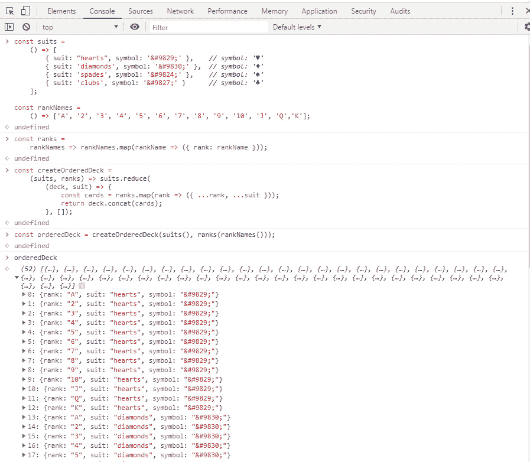

图 14.12：使用`reduce`函数创建的牌堆列表

在这个练习中，我们回顾了本章 earlier 学习到的`reduce`函数，并将其应用于创建牌堆的情况。我们将在下一个练习中在此基础上创建一个函数，该函数可以随机洗牌，这对于游戏来说非常有用。

## 练习 14.09：使用管道方法创建洗牌函数

现在我们有一副有序的牌，我们将看看我们如何可以洗牌。当然，就像所有功能性代码一样，我们将不修改任何现有变量来完成这个操作。

1.  在与上一个练习相同的控制台中，定义我们之前讨论的`pipe`和`map`函数。这里我们不会使用`compose`，但你应该养成在编写功能性代码时为每个程序定义这三个函数的习惯，因为你将大量使用它们：

    ```js
    const compose =
        (...fns) => input => fns.reduceRight((prev, fn) => fn(prev), input);
    const pipe =
        (...fns) => input => fns.reduce((prev, fn) => fn(prev), input);
    const map = fx => arr => arr.map(fx);
    ```

    `addRandom`函数为每个元素添加一个名为`random`的字段。注意随机数本身是从一个单独的`randomizer`方法中获得的。这是为了尽可能保持`addRandom`函数的纯度，并隔离具有副作用代码。

1.  创建一个`randomizer`变量，然后创建一个`addRandom` curry 函数：

    ```js
    const randomizer =
        Math.random;
    const addRandom =
        randomizer => deck => deck.map(card => ({
            random: randomizer(),
            card
        }));
    ```

1.  创建一个`sortByRandom`函数，该函数可以随机排序输入的牌堆：

    ```js
    const sortByRandom =
        deck => [...deck].sort((a, b) => a.random - b.random);
    ```

    此函数根据添加的`random`字段对牌进行排序。使用`spread`操作符(...)在排序之前克隆数组，而不是对原始数组进行排序。

1.  创建一个`shuffle`函数，它接受一副牌和一个随机化值（如果需要更随机的值，可以在需要时更改随机化值，就像在真正的赌场游戏中那样）。然后我们使用`pipe`来创建一个函数，该函数结合了`addRandom`（用于指定我们的随机化器），`sortByRandom`和一个`map`函数。最后，我们将执行我们刚刚创建的`doShuffle`函数，并使用我们的牌堆作为输入：

    ```js
    const shuffle =
        (deck, randomizer) => {
            const doShuffle = pipe(
                addRandom(randomizer),
                sortByRandom,
                map(card => card.card)
            );
            return doShuffle(deck);
        };
    ```

    curried `map`函数的目的是移除之前添加的`random`字段，仅保留与牌本身相关的原始字段。

1.  打开之前练习中的 Google Chrome `开发者工具` 会话。如果您没有保存，您需要输入之前练习中的代码。到那时，输入本练习中的前四个代码片段。有了这些，执行 `shuffle` 函数，使用 `shuffle(orderedDeck, randomizer)`，然后通过点击并观察以下截图来探索返回的对象，以查看牌已经被洗好：

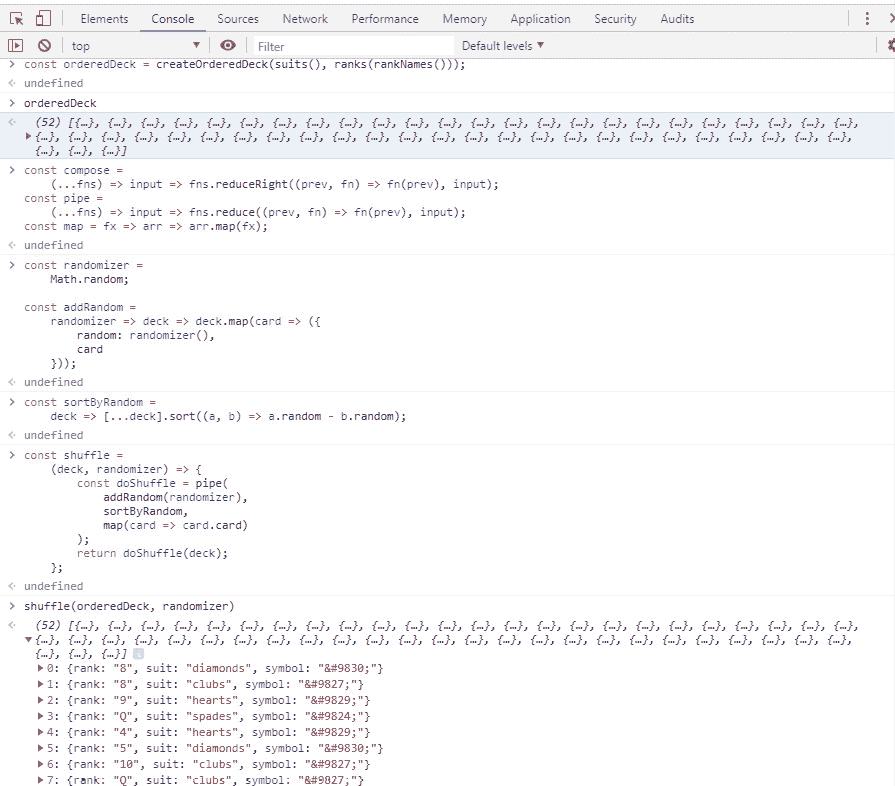

图 14.13：使用 reduce 函数的牌组列表

我们可以看到洗好的牌组是使用 `管道和映射` 函数。现在我们可以继续使用这些函数来处理黑杰克牌局。

# 黑杰克

在本章的剩余部分，我们将使用关于函数式编程的知识来实现一个简单的纸牌游戏黑杰克。

然而，与常规黑杰克不同，我们的游戏只有一个玩家。玩家可以抽取任意数量的牌（`抽牌`），只要总价值不超过 21。

总计是玩家手中牌的价值总和。牌有以下价值：

+   数字牌有它们的面值（例如，红桃 6 的价值为 6）

+   J、Q 或 K 的价值为 10

+   为了简化，A 牌的价值为 1（与常规黑杰克不同，在那里它可以是 1 或 11）

如果总价值超过 21，则手牌爆牌，游戏结束。

## 将牌面值映射到牌上

前两个练习在最终作业中将会非常有用，在最终作业中，你将实现一个黑杰克游戏。你可以直接使用那些代码片段。当然，仅仅知道牌的名字是不够的——你还需要知道每张牌的价值。我们之前探索的 `map` 函数将在这个任务中非常有用。增强 *练习 8：使用 reduce 创建牌组* 中的 `ranks` 柔性函数，将 `rankNames` 转换为 `rank` 和 `value` 字段：

```js
const ranks =
    rankNames => rankNames.map(
        (rank, index) => ({ rank, value: Math.min(10, index + 1) }));
```

此函数利用映射函数中作为可选第二个参数传递的索引。牌面值 "`A`" 在索引 `0`，所以值解析为 `1`（因为公式是 `索引` + `1`）。牌面值 "`2`" 在索引 `1`，所以值解析为 `2`（因为 `索引` + `1` = `2`）。同样的规则适用于其他数字，值解析为与数字相同的值。一旦我们到达 "`J`" 及以上，由于 `Math.min()`，值解析为 `10`。

现在，输入 `orderedDeck` 并探索返回的对象。你会注意到现在所有项目都有一个值，面值牌（`J`、`Q`、`K`）的值都是 10：

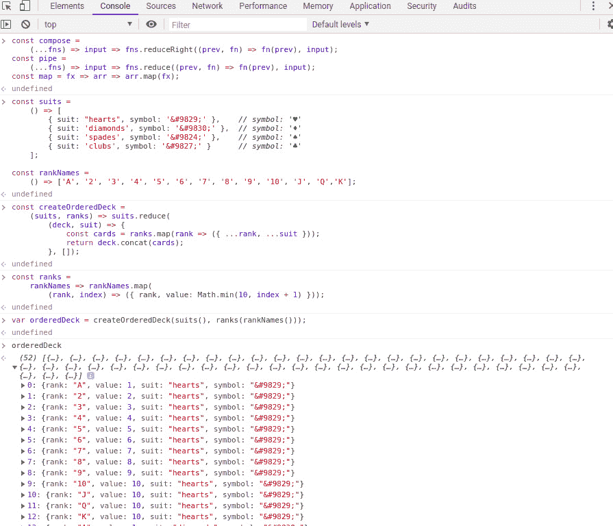

图 14.14：使用排序函数的牌组有序列表

通过我们现在所涵盖的与卡片相关的函数，即函数式编程的基本原理，例如`map`、`reduce`、`compose`和`pipe`，你将为构建自己的卡片游戏打下坚实的基础。

## 活动 14.01：黑杰克卡片函数

本活动的目的是让你使用所学的函数式编程知识创建一些编写黑杰克游戏所需的函数。你将不会编写整个游戏，只是与卡片逻辑相关的核心函数。

在 GitHub 项目中，你会找到一个预构建的 HTML 文件`start.html`，其中包含一些 CSS，你应该将其作为起点使用。

本活动的概要步骤如下：

1.  打开名为`blackjack/start.html`的起始 HTML/CSS 文件。

1.  添加或实现使用花色、牌名和值创建一副牌的函数。

1.  为核心的函数式编程方法编写实现，即`pipe`、`compose`和`map`。

1.  添加抽取一张牌、计算玩家牌的总和、检查手牌是否超过 21 点以及检查游戏是否结束（玩家选择停留或爆牌）的函数。

1.  添加一个更新卡片显示和卡片图像的函数。

1.  添加一个更新状态显示的函数，告诉用户他们手牌的总和。

1.  添加用户可以采取的不同操作的`play`、`hit`和`stay`处理函数。

1.  最后，添加你可能需要的任何不纯函数，例如通过 ID 或类获取元素的辅助函数。

1.  添加设置状态和触发游戏的函数。

完成这些步骤后，你现在应该能够打开 HTML 文件并在浏览器中运行游戏，如下面的截图所示：

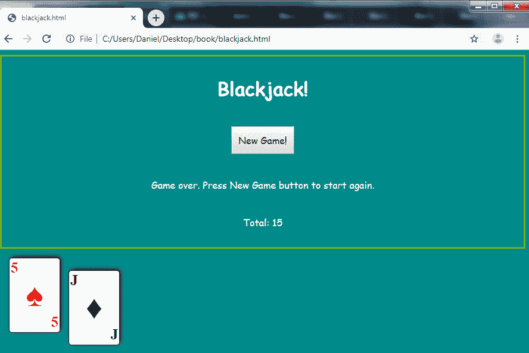

图 14.15：黑杰克游戏的截图

注意

本活动的解决方案可以在第 758 页找到。

老实说，这个黑杰克的实现并不太好玩，也不会因为视觉设计而获奖。然而，它是一个很好的函数式编程演示。看看你是否可以用这段代码作为基础来实现你自己的完整两人版本的游戏。

## 管理黑杰克游戏状态

这个游戏只需要少量状态：即玩家的手牌、游戏牌组和玩家是否选择停留（而不是再抽一张牌）。这种状态管理被隔离到以下代码中：

```js
const createState = (dom) => {
    let _state;
    const getState = () => [..._state];
    const setState =
        (hand, gameDeck, stay = false) => {
            _state = [hand, gameDeck];
            updateCardDisplay(dom, hand);
            updateStatusDisplay(dom, hand, stay);
        };
    return { getState, setState };
}
```

注意最后的`return`语句。只有两个方法`getState`和`setState`最终暴露给调用者，但`_state`变量仍然在闭包中保持安全，并作为面向对象编程中“私有”字段的等价物。此外：

+   为了尽可能隔离产生副作用（side-effects）的代码，有一个单独的参数`dom`，它引用了实际进行 DOM 操作的其它函数。

+   `getState` 函数返回状态字段的克隆（使用扩展运算符 ...），而不是字段中的实际值

+   当调用 `setState` 时，会调用另外两个函数 `updateCardDisplay` 和 `updateStatusDisplay`（即将介绍）来更新显示的相应部分以对应新的状态。这些函数被设计为每次状态改变时动态重新生成所有与状态值相关的 HTML。这样，在显示逻辑本身中就不需要额外的状态。（流行的 Web 框架如 Angular 和 React 以类似的方式更新显示，尽管为了性能进行了一些优化）。

状态是在游戏开始时创建的：

```js
startGame(createState(dom));
```

## 黑杰克游戏逻辑流程

`startGame` 函数本身注册了三个事件处理函数来响应用户可能点击的三个按钮：“新游戏”、“击中”或“停留”：

```js
const startGame = (state) => {
    byId("playBtn").addEventListener("click", playHandler(randomizer, state));
    byId("hitBtn").addEventListener("click", hitHandler(state));
    byId("stayBtn").addEventListener("click", stayHandler(state));
}
```

`playHandler` 函数看起来如下：

```js
const playHandler = (randomizer, { getState, setState }) => () => {
    const orderedDeck = createOrderedDeck(suits(), ranks(rankNames()));
    let gameDeck = shuffle(orderedDeck, randomizer);
    [hand, gameDeck] = draw(gameDeck, 2);
    setState(hand, gameDeck);
};
```

首先创建并洗牌以创建完整的游戏牌组。然后从游戏牌组中抽取两张牌作为手牌。通过调用 `setState` 保存手牌和剩余的游戏牌组（减去抽取的两张牌）（这间接也触发了屏幕显示牌）。

`hitHandler` 函数遵循类似的模式：

```js
const hitHandler = ({ getState, setState }) => () => {
    [hand, gameDeck] = getState();
    [card, gameDeck] = draw(gameDeck, 1);
    setState(hand.concat(card), gameDeck);
};
```

通过调用 `getState` 获取当前手牌和游戏牌组。然后从游戏牌组中抽取一张牌。这张牌被添加到手牌中并通过调用 `setState` 保存（这再次间接触发屏幕显示牌）。

`stayHandler` 较简单。除了在最后一个参数中调用 `setState` 并传入 `true` 以指示玩家已停留外，不进行任何状态修改：

```js
const stayHandler = ({ getState, setState }) => () => {
    [hand, gameDeck] = getState();
    setState(hand, gameDeck, true);
};
```

## 黑杰克游戏显示函数

`updateCardDisplay` 函数如下：

```js
const updateCardDisplay =
    ({ updateHTML }, hand) => {
        const cardHtml = hand.map((card, index) =>
            `<div class="card ${card.suit}"
                style="top: -${index * 120}px;
                       left: ${index * 100}px;">
                <div class="top rank">${card.rank}</div>
                <div class="bigsuit">${card.symbol}</div>
                <div class="bottom rank">${card.rank}</div>
             </div>`);
        updateHTML("cards", cardHtml.join(""));
    };
```

在这个函数中使用 `Array.prototype.map` 确定手牌中每张牌的 HTML，并在最后将它们连接成一个字符串。对样式 `top` 和 `left` 的计算利用了映射函数的可选 `index` 参数，以允许牌有错落的效果。不同的 CSS 类 `top`、`rank`、`bigsuit` 和 `bottom` 用于定位和调整牌的不同部分的大小。花色名称本身也是一个 CSS 类，用于应用正确的花色颜色（黑色或红色）。

与显示相关的另一个函数 `updateStatusDisplay` 的实现如下：

```js
const updateStatusDisplay =
    ({ updateStyle, updateHTML }, hand, stay) => {
        const total = sumCards(hand);
        updateHTML("totalSpan", total);
        const bust = isBust(total);
        const gameover = isGameOver(bust, stay);
        showOrHide(updateStyle, "playBtn", !gameover);
        showOrHide(updateStyle, "hitBtn", gameover);
        showOrHide(updateStyle, "stayBtn", gameover);
        let statusMsg = gameover ?
            "Game over.  Press New Game button to start again." :
            "Select Hit or Stay";
        statusMsg = bust ? "You went bust!!! " + statusMsg : statusMsg;
        updateHTML("statusMsg", statusMsg);
    };
```

这个函数做了几件事情：

+   计算牌的总值并显示

+   通过调用 `isBust` 和 `isGameOver` 来确定游戏是否结束。（如果手牌正在游戏中，则“新游戏”按钮不应可见。如果游戏结束或未激活，则“击中”和“停留”按钮不应可见。见图 14.16。）

+   根据游戏是否结束显示或隐藏不同的按钮

+   根据游戏是否结束来更改状态信息

![图 14.16：当游戏活跃时，击中和停留按钮可见]

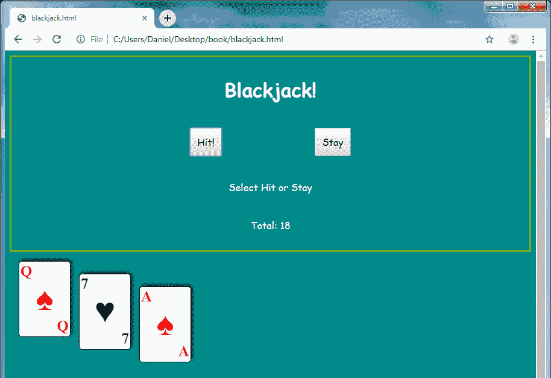

图 14.16：当游戏处于活动状态时，击中和停留按钮是可见的

实际上，这个函数实际上驱动了游戏流程的大部分，因为用户可用的 UI 元素都设置在其中。

## 黑杰克代码列表

前几节涵盖了代码最重要的部分。游戏的完整代码列表如下所示：

[`packt.live/370zgaq`](https://packt.live/370zgaq)

为了简单起见，所有代码都包含在一个文件中，包括所有 CSS 样式和 JavaScript 支持函数。然而，在实际应用中，你应该考虑将文件拆分。

# 摘要

在本章中，你体验了函数式编程。它与命令式和面向对象等其他编程范式相当不同，需要一段时间才能习惯。但一旦正确应用，它是一种非常强大的程序结构方式，使程序更加声明性、正确、可测试，并且错误更少。

即使你不在项目中使用纯函数式编程，也有许多有用的技术可以单独使用。这尤其适用于`map`、`reduce`和`filter`数组方法，它们有广泛的应用。

本章也仅使用了原生 JavaScript 中可用的功能。但请注意，还有许多流行的库可用于辅助函数式编程。这些库简化了函数式编程的实际问题，如不可变性、无副作用函数、组合和自动柯里化。

本章中涉及的主题将帮助你增强在函数式风格中进行编程项目所需的技能。

在下一章中，你将更深入地了解异步编程，包括异步回调的历史、生成器、承诺和 async/await。这将完成你对现代 JavaScript 开发的旅程，为你创建出色的软件做好准备。
