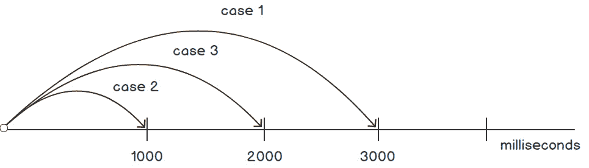

# 第十五章：15. 异步任务

概述

到本章结束时，你将能够实现异步编程及其不同的技术；探索回调地狱和灾难金字塔的陷阱；展示如何使用 promises 在操作完成后执行代码；使用新的`async`/`await`语法使异步代码看起来和感觉上几乎像是顺序代码；并应用 Fetch API 来执行远程服务调用。

# 简介

异步任务允许程序的主线程在等待数据、事件或另一个进程的结果时继续执行，从而实现更快的 UI 响应，并允许某些类型的并行处理。

与其他可以有许多并发线程执行的语言不同，JavaScript 通常在单个线程上运行。到目前为止，你已经详细学习了 JavaScript 的单线程模型是如何通过**事件循环**和相关的**事件队列**来实现的。在底层，浏览器或 Node.js 运行时都有后台线程，它们监听事件或发出服务调用。当捕获到新事件或服务调用响应时，它会被推入事件队列。JavaScript 不断地扫描事件队列，并在可用时触发这些事件的处理器。事件处理器最常见的是回调方法，但还有其他类型，例如*Promises*，你将在本章中学习到。

一些线程的执行时间比其他线程长。在餐厅里，准备牛排比点一杯酒需要更多的时间。然而，由于这些项目之间没有依赖关系，它们可以并行执行。即使酒是在牛排点单后几分钟内点的，也有很大的可能性酒会比牛排先送到，甚至可能是由同一个服务员送来的。这本质上就是异步处理的概念。（为了进一步说明这个类比，当每个项目准备好提供给顾客时，厨房工作人员会将它们放入服务员的*队列*中。服务员会不断检查他们的队列，以寻找更多需要带给餐厅顾客的东西。）

JavaScript 的早期版本主要使用回调函数来实现异步，但创建回调地狱的负面影响很快就会显现，正如你将看到的。然后，在 ECMAScript 2015 中，引入了一种替代方案，称为 Promises，这非常有帮助，但仍然还有一些不足。最近，在 ECMAScript 2017 中，添加了新的关键字和语法，称为`async`/`await`，这进一步简化了异步代码，并在许多方面使其看起来更像是常规顺序代码。你将在接下来的章节中探索这些内容。

在本章中，你还将回顾在第十章 *访问外部资源* 中引入的 *TheSportsAPI*，你曾用它查询和检索有关球队、比赛得分、球员和即将发生的事件的体育相关数据。重新阅读那一章以刷新记忆可能是个好主意，因为我们将在此基础上扩展内容。

# 回调

如你在第十章 *访问外部资源* 中所探索的，回调是 JavaScript 中执行异步功能最古老和最简单的方法。回调是在操作结果准备好后要调用的指定函数。你可以在 jQuery 的 `$.ajax()` 和 `$.getJSON()` 方法中看到这一点，在这些方法中，一旦成功的服务调用响应可用，就会调用一个函数；例如：

```js
$.getJSON('https:/www.somesite.com/someservice',
      function(data) {
      // this function is a callback and is called once
             // the response to the service call is received
      }
    );
```

另一个回调被大量使用的领域是事件处理器。事件可以被视为异步的，因为它们可以在不可预测的时间以任何顺序发生。处理事件的回调通常在调用 `addEventListener()` 时注册并添加到事件队列中。

## setTimeout()

`setTimeout()` 函数是传统的方式，用于在未来的某个时间点异步调度代码执行。它通常使用一个参数来指定在执行之前要等待的毫秒数。

## 练习 15.01：使用 setTimeout() 进行异步执行

这个练习演示了当 `setTimeout()` 参数指定为 `0` 或省略时，执行流程是如何的：

1.  在 Google Chrome 浏览器中，进入“开发者工具”（屏幕右上角带有三个点的菜单）| “更多工具”| “开发者工具”，或者直接按 *F12* 键）。

1.  在“控制台”标签页中，粘贴以下文件的代码，但不要按 *Enter* 键。你可以在文件 `exercise1.js` 中找到代码。

    ```js
    console.log("start");
    setTimeout(function() {
            console.log("in setTimeout");
        }, 0);
    console.log("at end of code");
    ```

    考虑你粘贴的代码。你可能认为 `setTimeout()` 块中的函数会立即执行，因为它被指定在零毫秒后执行。但实际上，情况并非如此。所以，让我们看看输出结果。

1.  在控制台中按 *Enter* 键执行代码。输出将如下所示：

    ```js
    start
    at end of code
    in setTimeout
    ```

    由于异步处理的方式，`setTimeout()` 中的回调被放置在事件队列中以安排稍后处理，而主代码的执行继续进行。回调将在主代码完成后才会执行。

    过度使用 `setTimeout()` 也会导致不良的编码实践，我们将在下一节中看到。

## 回调地狱与死亡金字塔

回调可能是处理异步请求最简单、最直接的方法，但如果你不小心，你的代码可能会很快变得混乱且难以管理。这尤其适用于你需要进行一系列嵌套的异步服务调用，而这些调用依赖于前一个调用的返回数据。

回想一下第十章中的 *TheSportsDB*，在 *访问外部资源* 中。假设你有一个需求，需要获取你最喜欢的球队所获得的荣誉列表。

在大多数情况下，你事先并不知道 API 所需的 `id` 参数的标识符。因此，你首先需要使用 API 服务调用查看团队 ID，以便获取球员列表。但还有一个进一步的注意事项，结果是，为了做到这一点，你现在还需要知道该团队所属联赛的标识符。由于你不知道联赛 ID，你需要使用另一个服务来找到联赛 ID 本身。

对于这样的需求，你可能会得到如下代码片段（如果你现在还不理解这段代码，不要担心，因为稍后会有深入的解释）。你可以在以下位置找到文件 `pyramid_of_doom_example.html` 的代码：

```js
// Pyramid of DOOM!!!
$.getJSON(ALL_LEAGUES_URL, function(leagueData) {
    const leagueId = findLeagueId(leagueData, LEAGUE_NAME);
    $.getJSON(ALL_TEAMS_URL, {id: leagueId}, function(teamData) {
        const teamId = findTeamId(teamData, TEAM_NAME);
        $.getJSON(ALL_PLAYERS_URL, {id: teamId}, function(playerData) {
            playerData.player.forEach(player => {
                $.getJSON(PLAYER_HONORS_URL, {id: player.idPlayer},
                    function(honorData) {
                        printHonors(honorData);
                    }
                );
            });
        });
    });
});
```

换句话说，这是一个案例，为了在一次调用中获取一块数据，依赖于其他调用的结果。每个回调都使用前一个调用的结果来调用进一步的调用。

注意所有由使用回调产生的嵌套块。它从一个函数开始，然后包含另一个函数，然后是函数内的多个级别的更多函数，这导致了一系列无序的结束括号和结束括号字符。这段代码的形状类似于侧向旋转的金字塔，因此有“*末日金字塔*”这个俚语：

在本节中，你回顾了 JavaScript 中异步逻辑的传统实现方式，以及使用回调可能会让你陷入困境并导致难以管理的乱糟糟的代码。你还熟悉了 *TheSportsDB* API，并实现了对其的一些新功能。

近年来，已经开发出几种用于异步处理的回调替代方案，包括 promises 和新的 `async`/`await` 语法。下一节将探讨 promises，它是对回调的重大改进，你将会看到。

# Promises 和 Fetch API

简而言之，promise 是一个封装异步逻辑的对象，它提供方法在操作完成后访问结果或错误。它是对结果值的代理，直到它被知晓，并允许你关联处理函数而不是使用回调。它是对提供已知和可用值的 *承诺*。

为了更好地理解如何使用 promises，你首先将介绍 Fetch API，它大量使用了 promises。然后，我们将回溯并深入探讨 promises 本身的详细描述。

Fetch 是另一个允许你进行网络请求和 REST 服务调用的 API，类似于 jQuery 的 AJAX 方法或原生的 `XMLHttpRequest`。主要区别在于 Fetch API 使用了承诺（这有助于你避免回调地狱）。

典型的 Fetch API 用于 JSON 请求的使用方法看起来像这样：

```js
fetch(someURL)
      .then(response =>response.json())
      .then(jsonData =>parseSomeDataFromResponse(jsonData))
      .then(someData =>doSomethingWithDataObtained(someData))
      .catch(error => console.log(error));
```

`fetch()` 调用会触发 URL 中的服务调用。一旦有有效的响应可用，第一个 `then()` 块中的函数就会被执行。该函数接收响应作为参数，在这种情况下，对它运行 `json()` 方法将文本转换为对象。然后，这个方法调用的结果会被传递给链中的后续 `then()` 方法。错误也可以通过 `catch()` 方法来处理。

## 使用 Fetch API 获取球员荣誉

在本节中，我们将放弃之前用于获取球员荣誉数据的 jQuery 回调方法，转而采用利用承诺的方法（这使我们摆脱了回调地狱的金字塔）。

Fetch API 相对较低级，并不像 jQuery 的 `$.ajax()` 和 `$.getJSON()` 函数那样提供许多免费功能，因此我们将创建一个名为 `myFetch()` 的包装函数，以便在我们的用例中使使用更加方便；具体来说：

+   Fetch 只接受完整的 URL，并且不会为你编码参数。`myFetch()` 函数将包括一个可选的第二个参数 `params`，作为键值对，如果指定，将编码参数值并将结果查询字符串附加到 URL 上。

+   Fetch 不会自动解析 JSON 响应，所以你将包括这个在 `myFetch()` 中。

+   Fetch 不会将 HTTP 状态码视为错误条件，除非代码是 500 或更高。但就我们的目的而言，任何不是 `200 (OK)` 的响应都应被视为错误。你将添加一个检查。

    注意

    此包装器并不适用于所有用例。你应该根据你的特定需求进行定制。

## 练习 15.02：重构荣誉名单以使用 Fetch API

在这个练习中，我们将重构代码以获取你最喜欢的球队的球员所获得的荣誉名单。我们将重构它以使用 Fetch API：

1.  首先，我们将创建一个包含将在本章中使用的常见代码片段的文件。在文本编辑器或 IDE 中输入以下初始代码块。你还可以在 GitHub 上找到文件 `players.js` 的代码，文件位置为：[`packt.live/2KUdBY4`](https://packt.live/2KUdBY4)

    ```js
    // hard coded data for purposes of illustration
    const LEAGUE_NAME = "English Premier League";
    const TEAM_NAME = "Arsenal";
    const BASE_URL = "https://www.thesportsdb.com/api/v1/json/1/";
    const ALL_LEAGUES_URL = BASE_URL + "all_leagues.php";
    const ALL_TEAMS_URL = BASE_URL + "lookup_all_teams.php";
    const ALL_PLAYERS_URL = BASE_URL + "lookup_all_players.php";
    const PLAYER_HONORS_URL = BASE_URL + "lookuphonors.php";
    ```

    此代码包含了我们将要调用的 *TheSportsDB* API 的远程服务的 URL 和数据值。

1.  输入以下 `myFetch()` 方法：

    ```js
    Function myFetch(url, params) {
        if (params) {
            url += "?" + encodeParams(params);
        }
        return fetch(url)
            .then(response => {
                if (!response.ok) {
                    throw new Error(response.status);
                }
                Return response.json()
            }
        );
    }
    ```

    这是之前提到的 `fetch()` 包装函数的实现。首先，如果指定了一个或多个参数键值对，它们将被编码为查询字符串并附加到 URL 上。然后，调用 `fetch()` 函数，当响应可用时执行 `then()`。如果 HTTP 状态码不是 `200 (OK)`，则会抛出错误。这会导致它被 `catch()` 函数（如果已在承诺调用链中定义）捕获。最后，如果一切顺利，它调用 `response.json()` 将 JSON 响应解析为对象，并将其作为另一个承诺返回，以便在后续的 `then()` 函数中传递和解析。

1.  使用以下辅助函数，将键值对参数编码为附加到 URL 查询字符串的参数：

    ```js
    Function encodeParams(params) {
        return Object.keys(params)
            .map(k => encodeURIComponent(k) + '=' +
                      encodeURIComponent(params[k]))
            .join('&');
    }
    ```

1.  现在，编写 `findLeagueId()` 函数：

    ```js
    Function findLeagueId(leagueData, leagueName) {
        const league = leagueData.leagues.find(l => l.strLeague === leagueName);
        return league ? league.idLeague : null;
    }
    ```

    此代码使用 `ALL_LEAGUES_URL` 服务调用的结果，并利用 `find()` 来定位与所需联赛名称匹配的结果。一旦找到，就返回该联赛的 ID（如果没有找到匹配项，则返回 `null`）。

1.  按如下方式编写 `findTeamId()` 函数：

    ```js
    Function findTeamId(teamData, teamName) {
        const team = teamData.teams.find(t => t.strTeam === teamName);
        return team ? team.idTeam : null;
    } 
    ```

    与上一个函数类似，此代码使用 `ALL_TEAMS_URL` 服务调用的结果，并使用 `find()` 来定位所需的球队。

1.  输入 `printHonors()` 函数：

    ```js
    Function printHonors(honorData) {
        if (honorData.honors != null) {
            var playerLI = document.createElement("li");
            document.getElementById("honorsList").append(playerLI);
            var playerName =
                document.createTextNode(honorData.honors[0].strPlayer);
            playerLI.appendChild(playerName);
            var honorsUL= document.createElement("ul");
            playerLI.appendChild(honorsUL);
            honorData.honors.forEach(honor => {
                var honorLI = document.createElement("li");
                honorsUL.appendChild(honorLI);
                var honorText = document.createTextNode(
                    `${honor.strHonour} - ${honor.strSeason}`);
                honorLI.appendChild(honorText);
            });
        }
    }
    ```

    此函数使用 `PLAYER_HONORS_URL` 服务调用的结果创建一个包含 `<ul>` 和 `<li>` HTML 标签的球员荣誉列表。

1.  我们现在已经完成了常用功能。将此文件保存为文件名 `players.js`。

1.  在您的编辑器或 IDE 中创建一个新文件。输入以下文件中的初始代码块。您可以在 GitHub 上找到代码，文件位置为：[`packt.live/2XRGLMO`](https://packt.live/2XRGLMO)

    ```js
    <html>
    <head>
        <meta charset="utf-8"/>
        <script src="img/players.js"></script>
    </head>
    <body>
    Arsenal Player Honors:
    <ul id="honorsList"></ul>
    <script>
    ```

1.  输入以下内容，开始用 Fetch API 的调用替换 jQuery 的 `$.getJSON` 代码：

    ```js
    myFetch(ALL_LEAGUES_URL)
      .then(leagueData => {
          const leagueId = findLeagueId(leagueData, LEAGUE_NAME);
          return myFetch(ALL_TEAMS_URL, {id: leagueId});
      })
    ```

    处理开始于调用 `myFetch()` 包装函数来调用检索所有联赛列表的服务调用。一旦响应可用，就调用 `then()` 方法中指定的函数。

    注意

    没有必要检查 HTTP 错误，并且可以假设响应是有效的，因为在上面的 `myFetch()` 函数调用实现中已经进行了错误检查。您也不需要将 JSON 解析为对象。

    然后调用 `findLeagueId()` 函数来查找您感兴趣的联赛的 ID，这是获取联赛中球队的下一次服务调用所需的。一旦找到，就再次调用 `myFetch()`。`myFetch()` 函数调用返回的承诺随后被返回，以便在后续的 `then()` 块中传递和处理。

1.  输入下一个 `then()` 子句以获取球队 ID：

    ```js
      .then(teamData => {
          const teamId = findTeamId(teamData, TEAM_NAME);
          return myFetch(ALL_PLAYERS_URL, {id: teamId});
      })
    ```

    以类似的方式，一旦第二个服务调用的响应可用，`then()` 块中的函数就会被调用。响应被搜索以找到下一个调用所需的团队 ID，然后再次调用 `myFetch()` 来获取球队中的所有球员。

1.  输入下一个 `then()` 块以获取球队球员名单，这是查询每位球员荣誉所需的信息：

    ```js
        .then(playerData => {
    ```

    浏览器（以及 JavaScript 运行时）完全能够同时处理多个服务调用的调用。

    注意

    一种简单的方法是按顺序或同步方式依次调用所有服务调用，但这样做会导致浏览器（或 JavaScript 运行时）锁定，直到所有服务调用完成，因为 JavaScript 具有单线程模型。

1.  在 `playerData.player` 列表上调用 `map()` 函数，这会导致列表被迭代，并为列表中的每位球员调用 `myFetch()`，因此会向 *TheSportsDB* API 发起多个新的 REST 调用。每个服务调用的结果承诺被收集在 `honorRequests` 变量中：

    ```js
          const honorReqests = playerData.player.map(player =>
              myFetch(PLAYER_HONORS_URL, {id: player.idPlayer}));
    ```

1.  `Promise.all()` 方法在将关联的承诺返回以在下一个 `then()` 块中处理之前，会等待所有服务调用完成。一旦可用，承诺将按服务调用调用的顺序以数组的形式返回。这个数组通过 `forEach()` 进行迭代，为每个响应调用 `printHonors()`：

    ```js
          return Promise.all(honorReqests);
      })
      .then(honorResponses => honorResponses.forEach(printHonors))
    ```

1.  最后，有一个 `catch()` 方法，以防在处理承诺期间发生错误：

    ```js
    .catch(error => console.log(error));
    ```

    这只是将错误记录到控制台（在实际应用中，你应该考虑以某种方式向用户指示发生了错误，例如在 UI 中显示错误消息）。

1.  使用以下内容关闭文件：

    ```js
    </script>
    </body>
    </html>
    ```

练习中的代码导致浏览器出现如下情况：

![图 15.1：玩家荣誉的示例输出

![img/C14377_15_01.jpg]

图 15.1：玩家荣誉的示例输出

在这个练习中，我们重构了代码以使用 Fetch API。这被处理得不同。*TheSportsDB* API 一次只能提供一个服务调用以检索一个玩家的荣誉。因此，要获取球队所有球员的荣誉，你需要对球队中的每位球员调用多个服务调用。这就是异步变得有用的地方。因此，浏览器（以及 JavaScript 运行时）完全能够同时处理多个服务调用的调用。我们将在下一节中改进这一点。

## 性能改进

之前的代码是有效的，但仍有另一个值得改进的地方。由于使用了 `Promise.all()`，直到获取玩家荣誉的所有请求都返回结果之前，都不会显示任何结果。这导致在加载列表时产生了比必要的更长时间的暂停。

如果您在第一个玩家的荣誉数据可用时开始显示列表条目，然后是第二个玩家的荣誉，依此类推，您就可以提高感知性能。即使其他玩家的数据尚未到达，您也可以这样做，只要在显示条目列表时保持正确的玩家顺序即可。

要实现这一点，基本方法是为一个承诺创建一个承诺，将一系列事件附加到该承诺上。您将使用 `myFetch()` 返回的相应玩家的承诺，并将它们逐个附加到序列中，如下面的伪代码所示：

```js
promise
  .then(createPromiseForPlayer1())
  .then(printDataForPlayer1())     // print once data for player 1 is loaded
  .then(createPromiseForPlayer2()) // etc
  .then(printDataForPlayer2())
  .then(createPromiseForPlayer3())
  .then(printDataForPlayer3())
  .then(createPromiseForPlayer4())
  .then(printDataForPlayer4())
```

我们的实现将使用 `forEach()` 来遍历玩家并将他们添加到序列中。序列本身的承诺是通过 `Promise.resolve()` 创建的，这导致一个立即解决且没有返回值的承诺。但这没关系，因为这个承诺只是作为一个占位符，以便通过一系列 `then()` 调用来链接其他项目。

之前看起来是这样的代码：

```js
 .then(playerData => {
      const honorReqests = playerData.player.map(player =>
          myFetch(PLAYER_HONORS_URL, {id: player.idPlayer}));
      return Promise.all(honorReqests);
  })
  .then(honorResponses => honorResponses.forEach(printHonors))
  .catch(error => console.log(error));
```

现在已被以下内容替换。你可以在 GitHub 上的文件 `other/fetch_example_improved.html` 中找到代码。

```js
  .then(playerData => {
      const sequence = Promise.resolve();

      playerData.player.forEach(player =>
          sequence
            .then(() => myFetch(PLAYER_HONORS_URL, {id: player.idPlayer}))
            .then(printHonors));
      return sequence;
  })
  .catch(error => console.log(error));
```

结果序列将最终以一系列 `then()` 子句结束，用于获取并打印每位玩家的荣誉数据，正如前面伪代码中解释的那样。

对于那些更倾向于函数式代码的人来说，这里有一个替代实现。我将让您决定这两个中哪一个更直接、更清晰。

```js
  .then(playerData =>playerData.player.reduce((sequence, player) =>
          sequence
            .then(() =>myFetch(PLAYER_HONORS_URL, {id: player.idPlayer}))
            .then(printHonors)
    , Promise.resolve())
  )
```

## 整理 Fetch 代码

前面展示的代码使用 `then()` 和 `catch()` 方法处理承诺，执行正确，但确实相当冗长且难以操作。我们能做得更好吗？让我们尝试通过重构每个块的处理为每个 `then()` 和 `catch()` 创建单行代码。

下面的代码替换了上面包含的以 `myFetch()` 开始的承诺代码。你可以在 GitHub 上的文件 `other/fetch_tidied.html` 中找到代码。

```js
myFetch(ALL_LEAGUES_URL)
  .then(leagueData =>getTeamsInLeague(leagueData, LEAGUE_NAME))
  .then(teamData =>getPlayersOnTeam(teamData, TEAM_NAME))
  .then(playerData =>getPlayerHonors(playerData))
  .catch(console.log);
```

注意现在代码的整洁程度提高了，你可以更清楚地看到代码执行的过程，仅从函数的命名（即，首先获取所有联赛，然后是正确的联赛，然后是正确的球队，依此类推）就可以看出。

您需要添加的支持函数如下。这些基本上是以前在每个相应的 `then()` 块中的代码，现在被重构为它们自己的函数：

```js
function getTeamsInLeague(leagueData, leagueName) {
    const leagueId = findLeagueId(leagueData, leagueName);
    return myFetch(ALL_TEAMS_URL, {id: leagueId});
}
Function getPlayersOnTeam(teamData, teamName) {
    const teamId = findTeamId(teamData, teamName);
    return myFetch(ALL_PLAYERS_URL, {id: teamId});
}
function getPlayerHonors(playerData) {
    const sequence = Promise.resolve();
    playerData.player.forEach(player =>
        sequence
          .then(() => myFetch(PLAYER_HONORS_URL, {id: player.idPlayer}))
          .then(printHonors));
    return sequence;
}
```

注意

请关注章节末尾的活动，届时将使用其他高级技术，如 currying，进一步清理和简化此代码。

## 一些 Fetch API 使用细节

本节简要总结了之前介绍过的 Fetch API 的某些细节。

注意

一些设置值得关注，但它们的全部细节并不在本章的范围内。这些设置将会被指出，因为如果您的用例需要它们，它们可能对您很重要。

`fetch()` 方法的完整方法签名如下：

```js
fetchResponsePromise = fetch(resource, init);
```

`init`参数允许你为请求分配某些自定义设置。一些可用的选项包括：

+   `method`: 请求方法，例如`GET`和`POST`。

+   `headers`: 应随请求一起发送的任何头部信息，包含在一个`Headers`对象中（如下面的代码片段所示）。

+   `body`: 你想要添加到请求中的任何内容，例如一个`string`、`Blob`或`BufferSource`。通常用于`POST`请求。

+   `credentials`: 如果你访问的资源需要用于身份验证/授权的凭据，你会指定此设置。可能的值包括`omit`、`same-origin`和`include`（`credentials`的完整细节不在本章范围内）。

+   `cache`: 请求要使用的缓存模式。有效值包括`default`、`no-cache`、`no-store`、`reload`、`force-cache`和`only-if-cached`（缓存的完整细节不在本章范围内）。

    一个`POST`请求的示例用法如下：

    ```js
    const url = "http://mysite.com/myservice";
    const data = {param1: 1234};
    let responsePromise = fetch(url, {
        method: 'POST',
        headers: {
            'Content-Type': 'application/json',
        },
        body: JSON.stringify(data)
    })
    .then(response => response.json());
    ```

    `fetch()`方法返回一个解析为`response`对象的 promise，该对象表示请求返回的响应的详细信息。以下是最重要的`response`对象属性；所有属性都是只读的：

+   `Response.headers`: 包含与响应相关的头部信息，作为一个键值对的对象。`headers`对象包含访问它们的方法，例如使用`Headers.get()`获取给定键的值，或使用`Headers.forEach()`遍历键/值条目并对每个调用一个函数；例如：

    ```js
    var headerVal = response.get("Content-Type");
          // application/json
    response.headers.forEach((val, key) => { 
        console.log(key, val); 
    });
    ```

    注意

    对于跨域请求，对可见的头部信息有所限制。

+   `Response.ok`: 一个表示响应是否成功的布尔值。如果状态码在`200-299`范围内，则认为响应是成功的。

+   `Response.status`: 响应的状态码，例如`404`表示`未找到`错误。

+   `Response.statusText`: 与状态码相对应的状态消息文本，例如`200`对应`OK`。

在本节中，你了解了 Promise 及其在 Fetch API 中的应用。你看到了如何检索远程数据以及如何处理错误。

一些开发者觉得 Fetch 比较底层，因此更喜欢其他远程请求的替代方案。一个流行的库是 Axios 库。例如，他们认为 Fetch 不理想的地方，Axios 会自动将 JSON 响应转换为对象，而 Fetch 则需要显式地进行转换。在`catch()`块中处理错误的状态方面也存在差异（因为 Fetch 只认为状态码为`500`或以上的情况为错误，但对于许多用例，任何不是`200`的状态码都应被视为错误条件）。

在大多数情况下，我们不需要在我们的代码中引入另一个依赖项。提到的缺点可以通过创建针对您的特定用例的简单包装器来克服，例如您如何实现了 `myFetch()` 包装器函数。通过包装器访问 API 提供了 Axios 大多数相同的功能，但是您有更多的控制权。

在下一节中，您将详细了解 Promise。

# 关于 Promise 的详细信息

现在，您将深入了解承诺的细节以及它们通常是如何被使用的，不一定是在服务调用的上下文中。

Promise 的构造函数看起来像这样：

```js
new Promise(function(resolve, reject) {
});
```

您将传递一个执行器函数，该函数接受两个参数：`resolve` 和（可选的）`reject`。当承诺被实例化时，此函数会立即执行。您对执行器函数的实现通常会启动一些异步操作。一旦返回值可用，它应该调用传入的 `resolve` 函数或 `reject`（如果有错误或其他无效条件）。如果在执行器函数中抛出错误，它也会导致承诺被拒绝（即使没有显式调用 `reject`）。

用伪代码表示，这类似于以下内容：

```js
const promise = new Promise((resolve, reject) => {
    // do something asynchronous, which eventually calls either:
    //   resolve(someValue);  // fulfilled
    // or
  //   reject("failure reason");  // rejected
});
```

Promise 可以处于三种可能的状态之一：**已解决**、**已拒绝**或**挂起**（尚未解决或拒绝）。一旦承诺不再处于挂起状态（无论是已解决还是已拒绝），就称承诺已解决。

作为简单的例子，考虑一个承诺，其目的是在处理过程中引入故意的 3 秒延迟。您可以使用以下方式使用 `setTimeout()` 实现：

```js
const timeoutPromise = new Promise((resolve, reject) => { 
    setTimeout(() => {
        // call resolve() to signal that async operation is complete
        resolve("Called after three seconds!");
    }, 3000);
});
timeoutPromise.then(console.log);
```

这将导致消息 `Called after three seconds` 打印到控制台。请注意，在此实例中未显式调用 `reject()`（并且如果您愿意，`reject` 参数甚至可以省略）。

现在让我们详细了解一下根据执行器函数的返回值会发生什么。如果函数：

+   `then` 使用返回的值解决。

+   `then` 使用 `undefined` 值解决。

+   `then` 使用抛出的错误作为其值拒绝。

## 练习 15.03：创建一个用于延迟执行的实用函数

在这个练习中，您将生成一个用于在另一个承诺完成后添加延迟的承诺创建实用函数。如果您想要执行异步操作，如服务调用，但又不想立即处理结果，这很有用。然后，通过进行服务调用并在延迟后打印结果来测试此函数：

1.  在 Google Chrome 浏览器中，进入 `开发者工具`（屏幕右上角有三个点的菜单）| `更多工具` | `开发者工具`，或者直接按 *F12* 键）。

1.  在 `控制台` 选项卡中粘贴以下内容并按 *Enter*：您可以在 GitHub 上的文件位置找到代码：[`packt.live/2XM98vE`](https://packt.live/2XM98vE)

    ```js
    function addDelay(ms, promise) {
        return promise.then(returnVal =>
            new Promise(resolve =>
                setTimeout(() => resolve(returnVal), ms)
            )
        );
    }
    ```

    这是我们对这个简单案例的第一个解决方案尝试，其实现与前面的 `timeoutPromise` 代码相似。

1.  你将通过调用 *TheSportsDB* 中的服务来测试它，该服务获取一个联赛的下一场比赛，并将结果打印到控制台（为了测试目的，联赛 ID 已硬编码在 URL 中）。将以下代码粘贴到控制台并按 *Enter*。

    ```js
    const BASE_URL = "https://www.thesportsdb.com/api/v1/json/1/";
    constnextEventUrl = BASE_URL + "eventsnextleague.php?id=4328";
    addDelay(3000, fetch(nextEventUrl))
      .then(response =>response.json())
      .then(nextEvents => console.log(nextEvents.events[0].strEvent));
    ```

    前面的代码在 3 秒后在控制台中显示消息 `Bournemouth vs Norwich`，尽管你的事件可能不同。

    注意

    你也可以使用前面章节中更健壮的 `myFetch()` 包装器而不是 `fetch()`。

![图 15.2：结果截图

![img/C14377_15_02.jpg]

图 15.2：结果截图

在这个练习中，我们学习了如何使用 `addDelay()` 函数添加处理延迟。如果你想要执行一个 `async` 操作，比如服务调用，但又不想立即处理结果，这可以派上用场。在下一节中，我们将进一步改进这个函数。

## 对 addDelay() 的进一步改进

现在，作为额外的奖励，让我们看看你是否可以想到前面练习中 `addDelay()` 实用函数的不同用例，以及你如何指定不同的参数选项来支持这些用例。

前面的练习中的代码运行良好，但如果你想要使其更加无缝，并且只想将延迟指令作为 `then()` 子句之一引入，会怎样？例如：

```js
fetch(nextEventUrl)
  .then(addDelay(1000))
  .then(response =>response.json())
  .then(nextEvents => console.log(nextEvents.events[1].strEvent));
```

这种形式更简洁，更容易看到流程（即获取响应，添加 1 秒的延迟，然后处理）。

为了支持这一点，你现在有两种方式可以指定参数：

+   如果有两个参数存在，这是一个简单的情况，返回的承诺将在延迟结束后完成。

+   如果只有一个参数存在，实际上并没有传递任何承诺。在这里，你将返回一个函数，该函数接受承诺作为参数，预期在调用函数时 `then()` 调用将提供承诺。然后这个函数将对相同的 `addDelay()` 函数进行递归调用，带有两个参数。

我们现在的代码如下：

```js
function addDelay(ms, promise) {
    if (promise === undefined) {
        // In this case, only one param was specified.  Since you don't have
        // the promise yet, return a function with the promise as a param and
        // call addDelay() recursively with two params
        return promise =>addDelay(ms, promise);
    }
    // if you reached this far, there were two parameters
    return promise.then(returnVal =>
        new Promise(resolve =>
setTimeout(() => resolve(returnVal), ms)
        )
    );
}
```

你还应该考虑另一个用例，这将使这个实用函数更加灵活。假设你一开始根本不使用承诺，只想在延迟后返回一个值。

你可以通过使用 `Promise.resolve()` 并传递要转换的值来支持这一点，这本质上将这个值视为一个立即满足的承诺。如果该值已经是承诺，这个调用将没有效果。

注意

在承诺规范指南中提到，在承诺参数上调用 `Promise.resolve()` 是一种最佳实践。

通常，当期望一个参数是 promise 时，也应该允许 thenables 和非 promise 值，在使用之前将参数解析为 promise。你不应该对传入的值进行类型检测，在 promise 和其他值之间重载，或者将 promise 放入联合类型中。

最终的代码如下。你可以在 GitHub 上的文件`other/addDelay.js`中找到这段代码。

```js
function addDelay(ms, promise) {
    if (promise === undefined) {
```

在这种情况下，只指定了一个参数。由于你还没有 promise，返回一个带有 promise 作为参数的函数，并使用两个参数递归地调用`addDelay()`：

```js
        return promise =>addDelay(ms, promise);
    }
```

如果你已经读到这儿，有两个参数：

```js
    return Promise.resolve(promise).then(returnVal =>
        new Promise(resolve =>
setTimeout(() => resolve(returnVal), ms)
        )
    );
}
```

下面是测试三个场景的代码：

```js
const BASE_URL = "https://www.thesportsdb.com/api/v1/json/1/";
const nextEventUrl = BASE_URL + "eventsnextleague.php?id=4328";
```

用例一是指定了两个参数，因此它在延迟后执行 promise：

```js
let p1 = addDelay(3000, fetch(nextEventUrl))
  .then(response => response.json())
  .then(nextEvents => console.log("Use 1: " + nextEvents.events[0].strEvent));
```

用例二是只指定了一个参数，因此它返回一个函数，该函数接受 promise 作为参数，并期望在调用函数时`then()`调用将提供 promise：

```js
let p2 = fetch(nextEventUrl)
  .then(addDelay(1000))
  .then(response =>response.json())
  .then(nextEvents => console.log("Use 2: " + nextEvents.events[1].strEvent));
```

用例三是我们只想在延迟后返回一个值的情况：

```js
let p3 = addDelay(2000, "This is a passed in value")
  .then(result => console.log("Use 3: " + result));
```

输出`All done!`应该写成以下形式：

```js
Promise.all([p1, p2, p3])
  .then(() => console.log("All done!"));
```

前面代码的输出顺序如下：

```js
    Use 2    (after 1 second)
    Use 3    (after 2 seconds)
    Use 1    (after 3 seconds)
```

预期的输出将如下所示：


图 15.3：输出截图

记住，这不是一个顺序代码，尽管它看起来是这样。在处理异步逻辑时，理解这一点很重要：

+   当设置`Use 1`的代码执行时，它安排了函数在 3 秒后回调和执行。但主执行线程立即继续设置`Use 2`，并不会等待 3 秒完成。

+   `Use 2`被安排在未来的 1 秒后执行，并且最终会在`Use 1`之前触发，因此它首先输出。然而，在此发生之前，主执行线程再次立即继续到`Use 3`。

+   `Use 3`被安排在未来的 2 秒后执行。这是第二个触发并产生输出的用例，因为`Use 1`不会在 3 秒后触发。

+   最后，当达到第三个秒时，`Use 1`触发并输出：



图 15.4：用例在图中的展示

在本节中，你学习了如何创建和使用 promise 的细节。Promise 已经成为 JavaScript 的一个重要部分，许多库和 API 都使用它们。Promise 也成为了进一步扩展语言和直接通过新关键字支持它们的基础，正如你很快就会看到的。

下一个部分将探讨`async/await`，它通过新的语法扩展了 promise 的使用。

# Async/Await

JavaScript 最近版本（自 ES2017-ES8 以来）的新增功能使处理异步逻辑变得更加容易、更加透明，并且使你的代码看起来几乎像是同步的。这是 `async/await` 语法，这是近年来语言中最令人兴奋和有用的新增功能之一。我们将直接深入探讨并通过示例了解 `async` 和 `await` 关键字的使用。

现在，我们将展示你将如何修改承诺代码，以便将其从 *Further Refinements to addDelay()* 部分中留下的样子重构为使用 `async/await`。首先，回忆一下看起来像这样的主要处理代码：

```js
myFetch(ALL_LEAGUES_URL)
  .then(leagueData => getTeamsInLeague(leagueData, LEAGUE_NAME))
  .then(teamData => getPlayersOnTeam(teamData, TEAM_NAME))
  .then(playerData => getPlayerHonors(playerData))
  .catch(console.log)
```

当重构为使用 `await` 语法时，它将看起来像以下这样。你可以在 GitHub 上的文件 `other/async_await.html` 中找到代码。

```js
    try {
        let leagueData = await myFetch(ALL_LEAGUES_URL);
        let teamData = await getTeamsInLeague(leagueData, LEAGUE_NAME);
        let playerData = await getPlayersOnTeam(teamData, TEAM_NAME);
        await getPlayerHonors(playerData);
    } catch (err) {
        console.log("caught error: " + err);
    }
```

`await` 关键字表示随后的函数返回一个承诺，并指示浏览器或 JavaScript 运行时等待承诺解决并返回结果。

使用 `await` 实际上只是作为调用 `promise.then()` 的替代的语法糖，结果与如果调用 `promise.then()` 会传递的值相同。但使用 `await` 允许你在变量中捕获结果，看起来就像你正在编写同步代码。

此外，请注意错误处理是如何使用典型的 `try...catch` 块而不是 `catch()` 函数来完成的。这是 `await` 使异步代码更加无缝的另一种方式。

我们还将重构另一个方法：`myFetch()`。之前，它看起来像这样：

```js
function myFetch(url, params) {
    if (params) {
        url += "?" + encodeParams(params);
    }
    return fetch(url)
        .then(response => {
            if (!response.ok) {
                throw new Error(response.status);
            }
            return response.json()
        }
    );
}
```

重新重构后，它将看起来像这样：

```js
async function myFetch(url, params) {
    if (params) {
        url += "?" + encodeParams(params);
    } 
    let response = await fetch(url);
    if (!response.ok) {
        throw new Error(response.status);
    }
    return response.json()
}
```

函数定义前的 `async` 关键字表示该函数始终返回一个承诺。即使函数实际返回的值不是一个承诺，JavaScript 也会自动将其包装在一个承诺中。在这种情况下，返回值是 `response.json()` 调用的结果对象，但实际上返回的是一个包装了这个对象的承诺。（调用端的 `await` 关键字通常用于再次解包值，但也有一些用例需要直接与承诺一起工作。）

还请注意，`fetch()` 函数调用现在前面有一个 `await` 关键字，而不是使用 `then()` 函数的典型承诺 API 来处理它。

你还可以从前面的部分重构另一个函数：`getPlayerHonors()`。这是它之前的样子：

```js
function getPlayerHonors(playerData) {
   const sequence = Promise.resolve();
    playerData.player.forEach(player =>
        sequence
          .then(() => myFetch(PLAYER_HONORS_URL, {id: player.idPlayer}))
          .then(printHonors));
    return sequence;
}
```

记住，这段代码的目的是对多个玩家的玩家荣誉数据进行 REST 服务调用。使用 `async/await` 重构代码可以稍微简化它并删除序列。以下是新代码：

```js
async function getPlayerHonors(playerData) {
    const playerPromises = playerData.player.map(async player =>
        myFetch(PLAYER_HONORS_URL, {id: player.idPlayer}));
    for (constplayerPromise of playerPromises) {
        printHonors(await playerPromise);
    }
}
```

`array.map()` 函数影响所有玩家的迭代，并为每个玩家调用 `myFetch()` 来获取荣誉数据，从而产生一个承诺数组。注意，你在箭头函数的左侧使用了 `async` 关键字。这是完全有效的，并且只是向 `array.map()` 信号该函数返回一个承诺。在处理过程中，`array.map()` 的执行不会等待第一个函数完成后再调用下一个函数。这使得利用 `array.map()` 与 `async` 的技术非常适合并发请求的启动。

之后，使用标准的 `for...loop` 进行第二次迭代，这次是对之前产生的承诺进行迭代。在调用 `printHonors` 时使用 `await` 关键字会导致执行等待承诺解决后再打印可用的结果。此外，由于你在一个循环中，你确保输出以正确的顺序打印。

注意

在使用 `await` 关键字时，还有一个重要的注意事项：它只能在前面带有 `async` 关键字的函数中使用。尝试在普通函数或顶层代码中使用它会导致语法错误。（因此，在接下来的代码中，请注意你将主要处理代码放在一个匿名的 `async` 函数中。）

## 异步生成器和迭代器

对于前面提到的 `getPlayerHonors()` 函数，还有一种实现技术可以考虑使用。这种方法利用了生成器函数，这在 *第五章*，*超越基础* 中有描述。一般来说，生成器是 JavaScript 语言中较新的且相对复杂的功能扩展，而迭代器则更为新颖，因此并非所有浏览器和运行时环境都支持它们。因此，我们不会花费太多时间来解释它们。但我们只是想简要地提及它们，并解释一下如何使用 `async` 与生成器和迭代器一起使用。

下面是具体的实现。你可以在 GitHub 上的文件 `other/async_generator_impl.html` 中找到代码。

```js
async function* getPlayerHonorsGenerator(playerData) {

    const playerPromises = playerData.player.map(async player =>
        myFetch(PLAYER_HONORS_URL, {id: player.idPlayer}));

    for (const playerPromise of playerPromises) {
        yield playerPromise;
    }
}
async function getPlayerHonors(playerData) {
    for await(const player of getPlayerHonorsGenerator(playerData)) {
        printHonors(player);
    }
}
```

第一个 `getPlayerHonorsGenerator()` 函数看起来应该很熟悉，因为它与之前的实现类似，但有一些重要的区别。在 `function` 关键字后面的星号 (`*`) 表示它是一个生成器函数，这意味着它通过后续调用返回多个值。

注意循环中的 `yield` 关键字。当遇到 `yield` 时，执行权会返回给调用者（实际上就是第二个函数）。当再次调用生成器函数时，执行会从循环中间的断点处继续，并返回下一个值。一旦循环结束，所有值都已返回，生成器会发出完成信号。

第二个函数使用 `for-await...of` 迭代器语法调用生成器函数。紧跟在 `for` 之后的 `await` 关键字使其成为一个 `async` 迭代器。在执行迭代时，执行将等待生成器（通过 `yield`）返回的每个 Promise 依次解析，然后再执行循环体。

生成器是一个复杂的话题。然而，通过采用这种技术，你能够以干净的循环语法访问多个异步调用的结果。

## 活动 15.01：将 Promise 代码重构为 await/async 语法

在本章中，你已经探讨了如何将同步代码重构为使用回调、Promise 和 `async/await` 语法。本活动将解决一些悬而未决的问题，并挑战你通过使用之前章节中学到的技能使代码的一些方面变得更好。

完成步骤如下：

1.  首先，回想一下本章 *练习 15.03*，*创建一个用于延迟执行的实用函数* 中的以下代码，该代码使用 Promise 测试了我们的 `addDelay` 函数的三个不同用途。

1.  将其重写为使用 `async/await` 语法。

1.  在本活动的目的下，你不得使用 `Promise.all()`（尽管在常规编程中，这可能是等待多个 Promise 完成的好方法）。

    提示

    请注意你放置 `await` 关键字的位置，因为这三个案例的解析顺序并不一致。

预期输出是：


图 15.5：玩家荣誉的示例输出

注意

本活动的解决方案可以在第 763 页找到。

在我们进入下一个活动之前，我们将简要回顾一下柯里化是什么。柯里化是将一个带有多个参数的函数分解为一个或多个额外的函数，这些函数只接受一个参数，并最终解析为一个值。初始函数调用不接收所有参数，而是返回一个函数，该函数的输入是剩余的参数，其输出是所有参数的预期结果。

## 活动 15.02：进一步简化 Promise 代码以移除函数参数

回到 Promise，我们在整理 Promise 代码以使 `then()` 子句成为单行语句后，结束了 `async/await` 部分。以下是代码再次刷新你的记忆：

```js
myFetch(ALL_LEAGUES_URL)
  .then(leagueData =>getTeamsInLeague(leagueData, LEAGUE_NAME))
  .then(teamData =>getPlayersOnTeam(teamData, TEAM_NAME))
  .then(playerData =>getPlayerHonors(playerData))
  .catch(console.log)
```

这已经相当不错了，但你还能做得更好吗？

现在，我们需要考虑一种简化代码并完全移除函数参数的方法，使其看起来像这样：

```js
myFetch(ALL_LEAGUES_URL)
  .then(getTeamsInLeague(LEAGUE_NAME))
  .then(getPlayersOnTeam(TEAM_NAME))
  .then(getPlayerHonors)
  .catch(console.log)
```

提示

思考一下你如何可能推迟 `getTeamsInLeague()` 和 `getPlayersOnTeam()` 的第一个参数的处理。重构这些函数以返回另一个函数，该函数最终处理此参数，而不是使用你在 *第十四章*，*理解函数式编程* 中学到的柯里化技术。

为了方便起见，原始代码在此重复（`getPlayerHonors()` 函数已经只接受一个参数，因此无需进一步简化以实现此目的）：

```js
function getTeamsInLeague(leagueData, leagueName) {
constleagueId = findLeagueId(leagueData, leagueName);
    return myFetch(ALL_TEAMS_URL, {id: leagueId});
}
function getPlayersOnTeam(teamData, teamName) {
constteamId = findTeamId(teamData, teamName);
    return myFetch(ALL_PLAYERS_URL, {id: teamId});
}
```

完成步骤如下：

1.  在技术 #1 中，重构 `getTeamsInLeague` 使其现在只接受一个参数 `(leagueName)`，而不是两个参数，这两个参数实际上需要来确定完整的结果 `(leagueData, leagueName)`。另一个参数将延迟到以后。

1.  在技术 #1 中，你不再直接从 `myFetch` 返回承诺，而是返回另一个以 `leagueData` 作为参数的柯里化函数。此时它只是一个部分应用函数。

1.  技术 #2 实际上与第一个想法相同，但使用函数变量和多层箭头函数而不是常规函数。

1.  最后，当在 `then()` 子句中调用 `getTeamsInLeague(LEAGUE_NAME)` 时，上面返回的函数将被完全应用，前一个承诺解析的值作为隐含的 `leagueData` 参数传入。

1.  在调用 `getTeamsInLeague(LEAGUE_NAME)` 时，该过程在那时是不完整的，并返回另一个函数来完成它。因此，调用一个部分应用函数。

    该活动的预期输出与 *练习 15.02*，*使用 Fetch API 重构荣誉列表* 相同，它提供了一个玩家荣誉的示例输出。

    注意

    该活动的解决方案可以在第 765 页找到。

# 摘要

就像承诺一样，`async/await` 在 JavaScript 中变得非常重要。你看到了这种语法如何帮助你的代码看起来几乎像是同步代码，并且可以使你的代码更清晰地表达你的意图。它甚至可以通过 `try/catch` 以更标准的方式处理错误。

但这有时具有欺骗性，如果不小心可能会给你带来麻烦。了解异步代码与顺序代码的不同，特别是异步代码是如何由事件循环触发的以及它不会阻塞主执行线程，这一点非常重要。对于承诺本身也是如此，但由于 `async/await` 看起来与同步代码如此相似，很容易忘记这个事实。

话虽如此，`async/await` 仍然非常强大且值得使用。我们已经到达了这本书的结尾。到现在为止，你已经全面了解了 JavaScript 的基础和基础知识。你也已经完全理解了 JavaScript 的语法和结构，无论是用于网页还是其他方面。现在，你准备好构建具有挑战性的智力开发问题，并将其应用于日常工作。
