# 第二章. 你的第一个规范

本章是关于基础知识的，我们将指导你如何编写你的第一个规范，以测试优先的思维方式进行开发，并展示所有可用的全局 Jasmine 函数。到本章结束时，你应该了解 Jasmine 的工作原理，并准备好开始自己进行第一次测试。

# 投资跟踪器应用程序

为了让你开始，我们需要一个示例场景：假设你正在开发一个用于跟踪股票市场投资的程序。

下面的表格截图说明了用户如何在这个应用程序上创建一个新的投资：


这是一个添加投资的表格

这个表格将允许输入定义投资的三个值：

+   首先，我们将输入**符号**，它代表用户正在投资的公司（股票）

+   然后，我们将输入用户购买的**股票**数量（或投资的数量）

+   最后，我们将输入用户为每份股票支付的价格（**股票价格**）

如果你对股市的工作方式不熟悉，想象你正在购买杂货。为了购买，你必须指定你要买什么，你要买多少件，以及你打算支付多少钱。这些概念在投资中可以转化为：

+   一个由符号定义的股票，例如`PETO`，可以理解为一种杂货类型

+   股票数量是你所购买的物品数量

+   股票价格是每个项目的单价

一旦用户添加了投资，它必须与其他投资一起列出，如下面的屏幕截图所示：

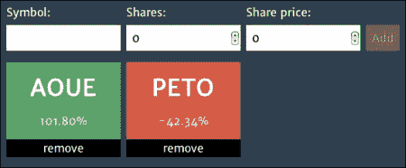

这是一个投资表格和列表

目的是显示他们的投资进展得如何。由于股票价格随时间波动，用户支付的价格与当前价格之间的差额表明这是一项好（盈利）的投资还是一项坏（亏损）的投资。

在前面的屏幕截图中，我们可以看到用户有两个投资：

+   另一个是`AOUE`股票，盈利了`101.80%`

+   另一个是`PETO`股票，损失了`-42.34%`

这是一个非常简单的应用程序，随着我们继续其开发，我们将对其功能有更深入的了解。

# Jasmine 基础知识和 BDD 思维

基于之前提出的应用，我们可以开始编写定义投资的验收标准：

+   对于一项投资，它应该是股票

+   对于一项投资，它应该有投资的股票数量

+   对于一项投资，它应该有支付的股票价格

+   对于一项投资，它应该有一个成本

使用上一章下载的独立分发版，我们首先需要创建一个新的规范文件。此文件可以创建在任何位置，但坚持一种约定是个好主意，Jasmine 已经有一个很好的约定：规范应该放在`/spec`文件夹中。创建一个`InvestmentSpec.js`文件，并添加以下行：

```js
describe("Investment", function() {

});
```

`describe`函数是一个全局 Jasmine 函数，用于定义测试上下文。当在规范中作为第一个调用时，它创建一个新的测试套件（一组测试用例）。它接受两个参数，如下所述：

+   测试套件的名称——在这个例子中，是`Investment`

+   一个将包含所有其规范的`function`

然后，为了将第一个验收标准（给定一项投资，它应该是股票）翻译成 Jasmine 规范（或测试用例），我们将使用另一个全局 Jasmine 函数`it`：

```js
describe("Investment", function() {
  it("should be of a stock", function() {

  });
});
```

它也接受两个参数，如下所述：

+   规范的标题——在这个例子中，是`should be of a stock`

+   一个将包含规范代码的`function`

要运行此规范，将其添加到运行器中，如下所示：

```js
<!-- include spec files here... -->
<script type="text/javascript" src="img/InvestmentSpec.js"></script>

```

通过在浏览器上打开运行器来执行规范。可以看到以下输出：

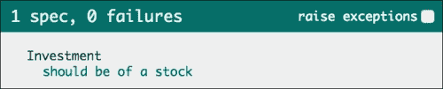

这是第一个规范在浏览器上的通过结果

空规范通过可能听起来很奇怪，但在 Jasmine 中，就像其他测试框架一样，需要失败的断言来使规范失败。

**断言**（或期望）是两个值之间的比较，必须得到一个布尔值。只有当比较的结果为真时，断言才被认为是成功的。

在 Jasmine 中，断言是通过全局 Jasmine 函数`expect`以及一个**匹配器**来编写的，该匹配器指示必须对值进行何种比较。

关于当前规范（预期这是一项股票投资），在 Jasmine 中这会转换为以下代码：

```js
describe("Investment", function() {
  it("should be of a stock", function() {
    expect(investment.stock).toBe(stock);
  });
});
```

将前面高亮的代码添加到`InvestmentSpec.js`文件中。`expect`函数只接受一个参数，该参数定义了**实际值**，换句话说，将要测试的内容——`investment.stock`——并期望链式调用到一个匹配器函数，在这种情况下是`toBe`。这定义了**预期值**`stock`以及要执行的比较方法（相同）。

在幕后，Jasmine 会进行一个比较，检查实际值（`investment.stock`）和预期值（`stock`）是否相同，如果不相同，测试就会失败。

写下断言后，之前通过的规范现在失败了，如下截图所示：

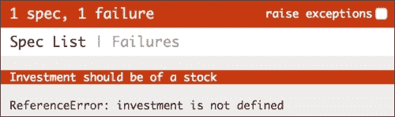

这显示了第一个规范的失败结果

这个规范失败了，因为，正如错误信息所述，`investment`未定义。

这里的主要思想是只做错误指示我们做的事情，所以尽管你可能想写其他内容，但现在让我们先在`InvestmentSpec.js`文件中创建一个名为`investment`的`Investment`实例变量，如下所示：

```js
describe("Investment", function() {
  it("should be of a stock", function() {
    var investment = new Investment();
    expect(investment.stock).toBe(stock);
  });
});
```

不要担心`Investment()`函数还不存在；规范将在下一次运行时请求它，如下所示：

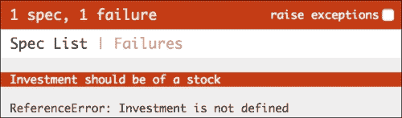

这里规范要求一个`Investment`类

你可以看到错误已经变成了`Investment is not defined`。现在它要求`Investment`函数。因此，在`src`文件夹中创建一个新的`Investment.js`文件，并将其添加到运行器中，如下面的代码所示：

```js
<!-- include source files here... -->
<script type="text/javascript" src="img/Investment.js"></script>
```

为了定义`Investment`，在`src`文件夹内的`Investment.js`文件中写入以下构造函数：

```js
function Investment () {};
```

这使得错误改变。现在它抱怨缺少`stock`变量，如下面的截图所示：

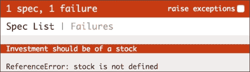

这显示了缺少股票的错误

再次，我们将它请求的代码放入`InvestmentSpec.js`文件中，如下面的代码所示：

```js
describe("Investment", function() {
  it("should be of a stock", function() {
    var stock = new Stock();
    var investment = new Investment();
    expect(investment.stock).toBe(stock);
  });
});
```

错误再次改变；这次是关于缺少`Stock`函数：

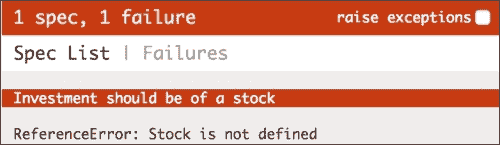

这里规范要求一个`Stock`类

在`src`文件夹中创建一个新的文件，命名为`Stock.js`，并将其添加到运行器中。由于`Stock`函数将是`Investment`的依赖项，我们应该在`Investment.js`之前添加它：

```js
<!-- include source files here... -->
<script type="text/javascript" src="img/Stock.js"></script>
<script type="text/javascript" src="img/Investment.js"></script>
```

将`Stock`构造函数写入`Stock.js`文件：

```js
function Stock () {};
```

最后，错误是关于预期的，如下面的截图所示：

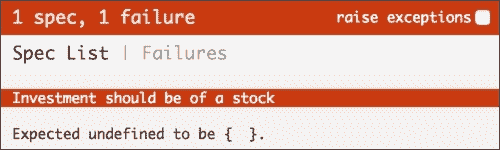

预期未定义，应为`Stock`

为了修复这个问题并完成这个练习，打开`src`文件夹内的`Investment.js`文件，并添加对`stock`参数的引用：

```js
function Investment (stock) {
  this.stock = stock;
};
```

在规范文件中，将`stock`作为参数传递给`Investment`函数：

```js
describe("Investment", function() {
  it("should be of a stock", function() {
    var stock = new Stock();
    var investment = new Investment(stock);
    expect(investment.stock).toBe(stock);
  });
});
```

最后，你将有一个通过规范：

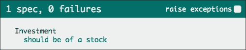

这显示了通过的投资规范

这个练习被精心设计，以展示开发者如何在测试驱动开发中通过向规范提供所需的内容来工作。

### 小贴士

编写代码的动力必须来自失败的规范。除非其目的是修复失败的规范，否则你不应该编写代码。

# 设置和清理

还有三个更多可接受的标准需要实现。列表中的下一个如下：

"给定一个投资，它应该有已投资股份的数量。"

编写它应该和之前的规范一样简单。在`spec`文件夹内的`InvestmentSpec.js`文件中，你可以将这个新标准转换成一个新的规范，称为`should have the invested shares' quantity`，如下所示：

```js
describe("Investment", function() {
  it("should be of a stock", function() {
    var stock = new Stock();
    var investment = new Investment({
      stock: stock,
      shares: 100
    });
    expect(investment.stock).toBe(stock);
  });

  it("should have the invested shares' quantity", function() {
 var stock = new Stock();
 var investment = new Investment({
 stock: stock,
 shares: 100
 });
 expect(investment.shares).toEqual(100);
 });
});
```

你可以看到，除了编写了新的规范外，我们还更改了对`Investment`构造函数的调用，以支持新的`shares`参数。

要做到这一点，我们在构造函数中使用了对象作为单个参数来模拟命名参数，这是 JavaScript 本身不具备的功能。

在`Investment`函数中实现这一点相当简单——在函数声明上不再有多个参数，只有一个，它期望是一个对象。然后，函数从这个对象中探测每个期望的参数，进行适当的分配，如下所示：

```js
function Investment (params) {
  this.stock = params.stock;
};
```

代码现在已重构。我们可以运行测试来查看只有新的规格失败，如下所示：

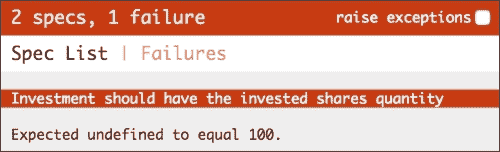

这显示了失败的份额规格

为了修复这个问题，将`Investment`构造函数更改为将分配给`shares`属性，如下所示：

```js
function Investment (params) {
  this.stock = params.stock;
  this.shares = params.shares;
};
```

最后，屏幕上的所有内容都是绿色的：

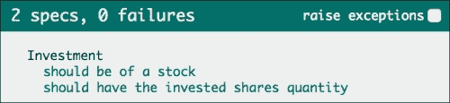

这显示了通过股票的份额规格

但正如你所看到的，以下代码，它实例化了`Stock`和`Investment`，在两个规格中都是重复的：

```js
var stock = new Stock();
var investment = new Investment({
  stock: stock,
  shares: 100
});
```

为了消除这种重复，Jasmine 提供了一个名为`beforeEach`的另一个全局函数，正如其名称所示，它在每个规格之前执行一次。因此，对于这两个规格，它将运行两次——在每个规格之前各运行一次。

通过使用`beforeEach`函数提取设置代码来重构先前的规格：

```js
describe("Investment", function() {
  var stock, investment;

  beforeEach(function() {
    stock = new Stock();
    investment = new Investment({
      stock: stock,
      shares: 100
    });
  });

  it("should be of a stock", function() {
    expect(investment.stock).toBe(stock);
  });

  it("should have the invested shares quantity", function() {
    expect(investment.shares).toEqual(100);
  });
});
```

这看起来更干净；我们不仅消除了代码重复，还简化了规格。由于它们现在的唯一责任是满足期望，因此它们变得更容易阅读和维护。

此外，还有一个**拆卸**函数（`afterEach`），它在每个规格之后执行代码。在需要在每个规格之后进行清理的情况下非常有用。我们将在第六章中看到其应用的示例，*光速单元测试*。

要完成`Investment`的规格说明，请将剩余的两个规格添加到`spec`文件夹中的`InvestmentSpec.js`文件中：

```js
describe("Investment", function() {
  var stock;
  var investment;

  beforeEach(function() {
    stock = new Stock();
    investment = new Investment({
      stock: stock,
      shares: 100,
      sharePrice: 20
    });
  });

  //... other specs

  it("should have the share paid price", function() {
    expect(investment.sharePrice).toEqual(20);
  });

  it("should have a cost", function() {
    expect(investment.cost).toEqual(2000);
  });
});
```

运行规格以查看它们失败，如下面的截图所示：

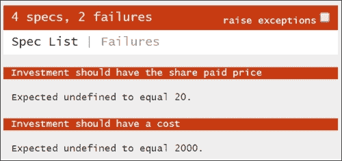

这显示了失败的代价和价格规格

将以下代码添加到`src`文件夹中的`Investment.js`文件中，以修复它们：

```js
function Investment (params) {
  this.stock = params.stock;
  this.shares = params.shares;
  this.sharePrice = params.sharePrice;
  this.cost = this.shares * this.sharePrice;
};
```

最后一次运行规格以查看它们通过：

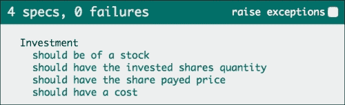

这显示了所有四个投资规格都通过

### 小贴士

在编写修复代码之前始终看到规格失败是很重要的；否则，你怎么知道你真的需要修复它？想象一下这是一种测试测试的方法。

# 嵌套描述

**嵌套描述**在您想要描述规格之间相似行为时很有用。假设我们想要以下两个新的验收标准：

+   给定一个投资，当其股票股价增值时，它应该有一个正的**投资回报率**（**ROI**）

+   给定一个投资，当其股票股价增值时，它应该是一个好的投资

这两个标准在投资的股票股价增值时具有相同的行为。

要将此转换为 Jasmine，你可以在`InvestmentSpec.js`文件中嵌套对`describe`函数的调用（为了演示目的，我移除了其余代码；它仍然在那里）：

```js
describe("Investment", function()
  describe("when its stock share price valorizes", function() {

  });
});
```

它应该表现得像外部的一个，因此你可以添加规范（`it`）并使用设置和清理函数（`beforeEach`，`afterEach`）。

## 设置和清理

当使用设置和清理函数时，Jasmine 也会尊重外部的设置和清理函数，以便它们按预期运行。对于每个规范（`it`），执行以下操作：

+   Jasmine 从外向内运行所有设置函数（`beforeEach`）

+   Jasmine 运行规范代码（`it`）

+   Jasmine 从内向外运行所有清理函数（`afterEach`）

因此，我们可以向这个新的`describe`函数添加一个设置函数，该函数会改变股票的股价，使其高于投资的股价：

```js
describe("Investment", function() {
  var stock;
  var investment;

  beforeEach(function() {
    stock = new Stock();
    investment = new Investment({
      stock: stock,
      shares: 100,
      sharePrice: 20
    });
  });

  describe("when its stock share price valorizes", function() {
    beforeEach(function() {
      stock.sharePrice = 40;
    });
  });
});
```

## 使用共享行为编写规范

现在我们已经实现了共享行为，我们可以开始编写之前描述的验收标准。每个都是，就像之前一样，对全局 Jasmine 函数`it`的调用：

```js
describe("Investment", function() {
  describe("when its stock share price valorizes", function() {
    beforeEach(function() {
      stock.sharePrice = 40;
    });

    it("should have a positive return of investment", function() {
      expect(investment.roi()).toEqual(1);
    });

    it("should be a good investment", function() {
      expect(investment.isGood()).toEqual(true);
    });
  });
});
```

在`Investment.js`文件中添加缺失的功能后：

```js
Investment.prototype.roi = function() {
  return (this.stock.sharePrice - this.sharePrice) / this.sharePrice;
};

Investment.prototype.isGood = function() {
  return this.roi() > 0;
};
```

你可以运行规范并查看它们是否通过：

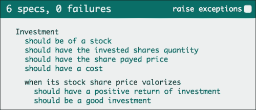

这显示了嵌套的描述规范传递

## 理解匹配器

到现在为止，你已经看到了许多匹配器的使用示例，可能已经感受到了它们是如何工作的。

你已经看到了如何使用`toBe`和`toEqual`匹配器。这些是 Jasmine 中可用的两个基本内置匹配器，但我们可以通过编写自己的匹配器来扩展 Jasmine。

因此，为了真正理解 Jasmine 匹配器是如何工作的，我们需要自己创建一个。

### 自定义匹配器

考虑上一节中的这个期望：

```js
expect(investment.isGood()).toEqual(true);
```

虽然它工作，但表达性不强。想象一下，如果我们能将其重写为：

```js
expect(investment).toBeAGoodInvestment();
```

这与验收标准建立了更好的关系：

因此，这里“应该是一个好的投资”变为“期望投资是一个好的投资”。

实现它相当简单。你可以通过调用`jasmine.addMatchers`函数来完成，理想情况下在设置步骤（`beforeEach`）中。

虽然你可以将这个新的匹配器定义放在`InvestmentSpec.js`文件中，但 Jasmine 已经在`spec`文件夹内的`SpecHelper.js`文件中提供了一个默认位置来添加自定义匹配器。如果你使用的是独立发行版，它已经包含了一个示例自定义匹配器；删除它，让我们从头开始。

`addMatchers`函数接受一个单一参数——一个对象，其中每个属性都对应一个新匹配器。因此，要添加以下新匹配器，将`SpecHelper.js`文件的内容更改为以下内容：

```js
beforeEach(function() {
  jasmine.addMatchers({
    toBeAGoodInvestment: function() {}
  });
});
```

在这里定义的函数不是匹配器本身，而是一个用于构建匹配器的工厂函数。一旦调用，它的目的是返回一个包含比较函数的对象，如下所示：

```js
jasmine.addMatchers({
  toBeAGoodInvestment: function () {
    return {
 compare: function (actual, expected) {
 // matcher definition
 }
    };
  }
});
```

`compare`函数将包含实际的匹配器实现，并且可以通过其签名观察到，它接收两个被比较的值（`actual`和`expected`值）。

对于给定的示例，`investment`对象将在`actual`参数中可用。

然后，Jasmine 期望，作为此`compare`函数的结果，一个具有`pass`属性的布尔值`true`的对象，以指示期望通过，如果期望失败则为`false`。

让我们看看以下`toBeAGoodInvestment`匹配器的有效实现：

```js
toBeAGoodInvestment: function () {
  return {
    compare: function (actual, expected) {
      var result = {};
 result.pass = actual.isGood();
 return result;
    }
  };
}
```

到目前为止，这个匹配器已经准备好供规格说明使用：

```js
it("should be a good investment", function() {
  expect(investment).toBeAGoodInvestment();
});
```

在更改后，规格说明应该仍然通过。但如果一个规格说明失败了怎么办？Jasmine 报告的错误信息是什么？

我们可以通过故意在`src`文件夹中的`Investment.js`文件中打破`investment.isGood`的实现，使其始终返回`false`来看到这一点：

```js
Investment.prototype.isGood = function() {
  return false;
};
```

再次运行规格说明时，Jasmine 生成一个错误信息，指出`Expected { stock: { sharePrice: 40 }, shares: 100, sharePrice: 20, cost: 2000 } to be a good investment`，如下面的截图所示：

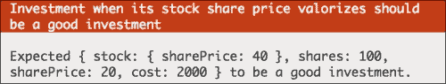

这是自定义匹配器的消息

Jasmine 在生成此错误信息方面做得很好，但它还允许通过匹配器返回的对象的`result.message`属性进行自定义。Jasmine 期望此属性是一个包含以下错误信息的字符串：

```js
toBeAGoodInvestment: function () {
  return {
    compare: function (actual, expected) {
      var result = {};
      result.pass = actual.isGood();
      result.message = 'Expected investment to be a good investment';
      return result;
    }
  };
}
```

再次运行规格说明，错误信息应该会改变：

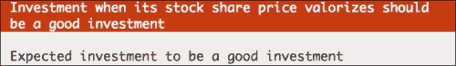

这是自定义匹配器的自定义消息

现在，让我们考虑另一个验收标准：

"给定一项投资，当其股票股价贬值时，它应该是一项不良投资。"

虽然可以创建一个新的自定义匹配器（`toBeABadInvestment`），但 Jasmine 允许通过在匹配器调用之前链式`not`来否定任何匹配器。因此，我们可以写出“一项不良投资”是“不是一个好投资”。

```js
expect(investment).not.toBeAGoodInvestment();
```

通过在`spec`文件夹内的`InvestmentSpec.js`文件中添加新的嵌套`describe`和`spec`，实现这个新的验收标准，如下所示：

```js
describe("when its stock share price devalorizes", function() {
  beforeEach(function() {
    stock.sharePrice = 0;
  });

  it("should have a negative return of investment", function() {
    expect(investment.roi()).toEqual(-1);
  });

  it("should be a bad investment", function() {
    expect(investment).not.toBeAGoodInvestment();
  });
});
```

但有一个问题！让我们打破`Investment.js`文件中的`investment`实现代码，使其始终是一项良好的投资，如下所示：

```js
Investment.prototype.isGood = function() {
  return true;
};
```

再次运行规格说明后，你可以看到这个新的规格说明失败了，但错误信息`Expected investment to be a good investment`是错误的，如下面的截图所示：


这是自定义匹配器的错误自定义否定消息

那是匹配器内部硬编码的消息。要修复它，你需要使消息动态化。

Jasmine 仅在匹配器失败时显示消息，因此使此消息动态化的正确方法是在给定比较无效时考虑应显示什么消息：

```js
compare: function (actual, expected) {
  var result = {};
  result.pass = actual.isGood();

 if (actual.isGood()) {
 result.message = 'Expected investment to be a bad investment';
 } else {
 result.message = 'Expected investment to be a good investment';
 }

  return result;
}
```

如下面的截图所示，这修复了消息：

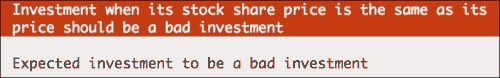

这显示了自定义匹配器的自定义动态消息

现在，这个匹配器可以在任何地方使用。

在继续本章之前，将`isGood`方法再次更改为正确的实现：

```js
Investment.prototype.isGood = function() {
  return this.roi() > 0;
};
```

这个例子缺少的是展示如何将期望值传递给像这样的匹配器的方法：

```js
expect(investment.cost).toBe(2000)
```

结果表明，匹配器可以接收任何数量的期望值作为参数。所以，例如，前面的匹配器可以在`SpecHelper.js`文件中实现，在`spec`文件夹内，如下所示：

```js
beforeEach(function() {
  jasmine.addMatchers({
    toBe: function () {
      return {
        compare: function (actual, expected) {
          return actual === expected;
        }
      };
    }
  });
});
```

通过实现任何匹配器，首先检查是否已经有一个可以完成你想要的功能的匹配器。

更多信息，请查看 Jasmine 网站上的官方文档[`jasmine.github.io/2.1/custom_matcher.html`](http://jasmine.github.io/2.1/custom_matcher.html)。

### 内置匹配器

Jasmine 附带了一些默认匹配器，涵盖了 JavaScript 语言中值检查的基础。要了解它们是如何工作的以及在哪里正确使用它们，就是了解 JavaScript 如何处理类型的旅程。

#### `toEqual`内置匹配器

`toEqual`匹配器可能是最常用的匹配器，每次你想检查两个值之间的相等性时都应该使用它。

它适用于所有原始值（数字、字符串和布尔值）以及任何对象（包括数组），如下面的代码所示：

```js
describe("toEqual", function() {
  it("should pass equal numbers", function() {
    expect(1).toEqual(1);
  });

  it("should pass equal strings", function() {
    expect("testing").toEqual("testing");
  });

  it("should pass equal booleans", function() {
    expect(true).toEqual(true);
  });

  it("should pass equal objects", function() {
    expect({a: "testing"}).toEqual({a: "testing"});
  });

  it("should pass equal arrays", function() {
    expect([1, 2, 3]).toEqual([1, 2, 3]);
  });
});
```

#### `toBe`内置匹配器

`toBe`匹配器的行为与`toEqual`匹配器非常相似；事实上，在比较原始值时，它们给出相同的结果，但相似之处到此为止。

虽然`toEqual`匹配器有一个复杂的实现（你应该看看 Jasmine 的源代码），它会检查一个对象的所有属性和数组的所有元素是否相同，但这里它只是简单使用了**严格的等于操作符**（`===`）。

如果你不太熟悉严格的等于操作符，它与**等于操作符**（`==`）的主要区别在于后者如果比较的值不是同一类型，则会执行类型转换。

### 提示

严格的等于操作符始终认为不同类型的值之间的比较是 false。

这里有一些这个匹配器（以及严格的等于操作符）的工作示例：

```js
describe("toBe", function() {
  it("should pass equal numbers", function() {
    expect(1).toBe(1);
  });

  it("should pass equal strings", function() {
    expect("testing").toBe("testing");
  });

  it("should pass equal booleans", function() {
    expect(true).toBe(true);
  });

  it("should pass same objects", function() {
    var object = {a: "testing"};
    expect(object).toBe(object);
  });

  it("should pass same arrays", function() {
    var array = [1, 2, 3];
    expect(array).toBe(array);
  });

  it("should not pass equal objects", function() {
    expect({a: "testing"}).not.toBe({a: "testing"});
  });

  it("should not pass equal arrays", function() {
    expect([1, 2, 3]).not.toBe([1, 2, 3]);
  });
});
```

建议你在大多数情况下使用`toEqual`操作符，只有在你想检查两个变量是否引用同一个对象时才使用`toBe`匹配器。

#### `toBeTruthy`和`toBeFalsy`匹配器

除了 JavaScript 语言中的原始布尔类型之外，其他所有内容也都有固有的布尔值，通常被认为是**truthy**或**falsy**。

幸运的是，在 JavaScript 中，只有少数值被识别为 falsy，以下是一些`toBeFalsy`匹配器的示例：

```js
describe("toBeFalsy", function () {
  it("should pass undefined", function() {
    expect(undefined).toBeFalsy();
  });

  it("should pass null", function() {
    expect(null).toBeFalsy();
  });

  it("should pass NaN", function() {
    expect(NaN).toBeFalsy();
  });

  it("should pass the false boolean value", function() {
    expect(false).toBeFalsy();
  });

  it("should pass the number 0", function() {
    expect(0).toBeFalsy();
  });

  it("should pass an empty string", function() {
    expect("").toBeFalsy();
  });
});
```

其他所有内容都被认为是 truthy，如下面的`toBeTruthy`匹配器的示例所示：

```js
describe("toBeTruthy", function() {
  it("should pass the true boolean value", function() {
    expect(true).toBeTruthy();
  });

  it("should pass any number different than 0", function() {
    expect(1).toBeTruthy();
  });
  it("should pass any non empty string", function() {
    expect("a").toBeTruthy();
  });

  it("should pass any object (including an array)", function() {
    expect([]).toBeTruthy();
    expect({}).toBeTruthy();
  });
});
```

但是，如果你想检查某个值是否等于实际的布尔值，使用`toEqual`匹配器可能是个更好的主意。

#### 内置的`toBeUndefined`、`toBeNull`和`toBeNaN`匹配器

这些匹配器非常直接，应用于检查`undefined`、`null`和`NaN`值：

```js
describe("toBeNull", function() {
  it("should pass null", function() {
    expect(null).toBeNull();
  });
});

describe("toBeUndefined", function() {
  it("should pass undefined", function() {
    expect(undefined).toBeUndefined();
  });
});

describe("toBeNaN", function() {
  it("should pass NaN", function() {
    expect(NaN).toBeNaN();
  });
});
```

`toBeNull`和`toBeUndefined`都可以写成`toBe(null)`和`toBe(undefined)`，但`toBeNaN`不是这样。

在 JavaScript 中，`NaN`值不等于任何值，甚至不等于`NaN`。因此，尝试将其与自身比较总是返回`false`，如下面的代码所示：

```js
NaN === NaN // false
```

作为良好实践，尽可能使用这些匹配器而不是它们的`toBe`对应物。

#### 内置的`toBeDefined`匹配器

如果您只想检查一个变量是否已定义，而不关心其值，则此匹配器很有用，如下所示：

```js
describe("toBeDefined", function() {
  it("should pass any value other than undefined", function() {
    expect(null).toBeDefined();
  });
});
```

除了`undefined`之外，任何东西都会通过此匹配器，即使是`null`。

#### 内置的`toContain`匹配器

有时，检查数组是否包含元素，或者字符串是否可以在另一个字符串中找到是有用的。对于这些用例，您可以使用`toContain`匹配器，如下所示：

```js
describe("toContain", function() {
  it("should pass if a string contains another string", function()  {
    expect("My big string").toContain("big");
  });

  it("should pass if an array contains an element", function() {
    expect([1, 2, 3]).toContain(2);
  });
});
```

#### 内置的`toMatch`匹配器

虽然`toContain`和`toEqual`匹配器可以在大多数字符串比较中使用，但有时唯一断言字符串值是否正确的方法是通过正则表达式。对于这些情况，您可以使用`toMatch`匹配器与正则表达式一起使用，如下所示：

```js
describe("toMatch", function() {
  it("should pass a matching string", function() {
    expect("My big matched string").toMatch(/My(.+)string/);
  });
});
```

此匹配器通过将实际值（`"My big matched string"`）与预期正则表达式（`/My(.+)string/`）进行比较来工作。

#### 内置的`toBeLessThan`和`toBeGreaterThan`匹配器

`toBeLessThan`和`toBeGreaterThan`匹配器简单，用于执行数值比较——这最好通过以下示例来描述：

```js
  describe("toBeLessThan", function() {
    it("should pass when the actual is less than expected", function() {
      expect(1).toBeLessThan(2);
    });
  });

  describe("toBeGreaterThan", function() {
    it("should pass when the actual is greater than expected", function() {
      expect(2).toBeGreaterThan(1);
    });
  });
```

#### 内置的`toBeCloseTo`匹配器

这是一个特殊的匹配器，用于比较具有定义精度的浮点数——这最好通过以下示例来解释：

```js
describe("toBeCloseTo", function() {
    it("should pass when the actual is closer with a given precision", function() {
      expect(3.1415).toBeCloseTo(2.8, 0);
      expect(3.1415).not.toBeCloseTo(2.8, 1);
    });
  });
```

第一个参数是要比较的数字，第二个参数是数字的小数位数精度。

#### 内置的`toThrow`匹配器

异常是语言展示出错的方式。

例如，在编写 API 时，您可能会决定在参数传递错误时抛出异常。那么，您如何测试这段代码呢？

Jasmine 内置的`toThrow`匹配器可以用来验证是否抛出了异常。

它的工作方式与其他匹配器略有不同。由于匹配器必须运行一段代码并检查是否抛出异常，因此匹配器的**实际**值必须是一个函数。

下面是一个如何工作的例子：

```js
describe("toThrow", function() {
  it("should pass when the exception is thrown", function() {
    expect(function () {
      throw "Some exception";
    }).toThrow("Some exception");
  });
});
```

当测试运行时，匿名函数被执行，如果它抛出`Some exception`异常，则测试通过。

# 概述

本章中，你学习了如何用行为驱动开发（BDD）的思维来驱动你的代码从你的规范出发。你还熟悉了 Jasmine 的基本全局函数（`describe`、`it`、`beforeEach`和`afterEach`），并对在 Jasmine 中创建规范所需的内容有了良好的理解。

你已经熟悉了 Jasmine 匹配器，并知道它们在描述规范意图方面的强大功能。你甚至学会了创建自己的匹配器。

到现在为止，你应该已经熟悉了创建新的规范并驱动你新应用程序的开发。

在下一章中，我们将探讨如何利用本章学到的概念来开始测试网络应用程序，这些应用程序最常见的是 jQuery 和 HTML 表单。
