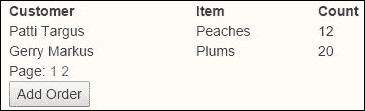

# 第二章 使用数组、嵌套和网格

现在我们已经尝到了 KnockoutJS 的滋味，我们现在准备好学习新的编程技能。在本章中，我们将看到如何扩展我们的 MVVM 技能，以创造更多甜蜜的数据交互体验。本章将重点关注：

+   条件绑定

+   简单嵌套绑定

+   可观察数组

+   分页网格

+   数据集合排序

# 条件绑定

数据绑定是许多与 HTML 标记交互的新库的核心。我们在第一章中看到了绑定，使用`data-bind="..."`绑定。在这里，我们将探讨条件绑定。

我们首先要做的是理解条件绑定的概念。我们的例子旨在说明这个概念。在本章中，我们将很快展示一个更实际的例子。

`if`绑定在 DOM 中的角色与 visible 属性非常相似。不同之处在于，`if`绑定实际上会在 DOM 中添加和移除内容，而 visible 则是交换 CSS 显示样式在可见和不可见之间。

通过复制位于`ko_2/do`文件夹中的`_base.htm`文件，并在`do`文件夹中将其命名为`condition.htm`来创建一个新文件。如果你遇到困难，`done`文件夹中有一个完成的副本。为了使事物看起来更好，我们现在将使用更大的 Bootstrap 模板基础，因为它将给我们更好的展示。你将在标记代码中看到以下区域，这是你将放置本书其余部分代码的地方：

```js
<!-- 
markup code here 
-->
```

你将把其余的代码放在第一章中解释的相同位置。再次强调，这只是为了让我们的工作在阅读本书的其余部分时看起来更好。现在，在`htm`文件的标记部分输入以下代码：

```js
                <label><input type="checkbox" data-bind="checked: showDetails" />&nbsp;Include Condition</label>
                &nbsp;
                <span data-bind="if:showDetails">
                    ( This section shows when the condition is selected. )
                </span>
```

这将给我们一个复选框来切换我们的内容。我们将在页面的`script`部分创建一个名为`showDetails`的变量来绑定内容切换。当复选框被勾选时，内容将被添加，当复选框未被勾选时，内容将被移除。以下是`.htm`文件`script`部分的代码：

```js
myVM = {
    showDetails: ko.observable(false)
}
ko.applyBindings(myVM);
```

这里没有什么复杂的。我们只有一个变量，它将保存我们的真假状态。当变量为真时，内容将被添加，当变量为假时，它将从页面中移除。以下是当值为真时的样子：


在浏览器中运行代码，并通过将复选框设置为勾选和不勾选来切换内容几次，以确保你的代码正在工作。

# Knockout 中数组简介

我们将从一个未绑定的数组开始工作。你会看到 Knockout 足够智能，仍然可以与数组一起工作并正确显示内容。实际上，我们将开始的数组将是一个包含嵌套数据的数组。将高亮的数据添加到我们页面的`script`部分：

```js
myVM = {
showDetails: ko.observable(false),
employee: [
{name:"John Jones", spouse: { name: "Mary Jones"}},
{name:"Bill Williams", spouse: null},
{name:"Sandy Rivers", spouse: { name: "Mark Rivers"}},
]
}
```

当我们在页面上运行`applyBindings`函数时，员工数组数据将自动绑定到 MVVM 系统。我们需要一些标记来告诉我们它实际上已经工作。我建议使用`<hr/>`标签来分隔页面上的内容部分，以便更清晰。现在将以下代码添加到标记部分：

```js
<ul data-bind="foreach: employee">
    <li>Employee: <strong data-bind="text:name"></strong>
        <div data-bind="if: spouse">( Spouse: <strong data- bind="text: spouse.name"></strong> )</div>
        <div data-bind="ifnot: spouse">( AVAILABLE )</div>
    </li>
</ul>
```

现在我们可以使用 Knockout 学习一些新的命令。第一个是`foreach`命令。如果我们有一个数组，我称之为集合，这个命令将会遍历每个项目。我们告诉`foreach`循环遍历员工数组集合。

你接下来会注意到，集合的元素是在项目级别被引用的。换句话说，我们不需要使用`myVM.employee.name`；我们只需简单地使用`name`。这使得代码更加简洁。

你还会看到我们再次使用了`if`命令。我们还加入了相反的逻辑命令`ifnot`。如果返回空结果，那么在功能上它被视为与 false 值相同。这意味着如果一个人没有配偶，他们将被标记为可用。提示：如果你在你的公司页面上运行一个声明谁可用的页面，这可能会引起社会波动，所以这绝对不是公司网页的最佳实践。


当我们运行代码时，我们得到的结果如前一个截图所示。我们看到比尔没有结婚，这与预期不符。由于我们知道发布某人可用的信息不是一个好主意，因此有一个更简单的方法来显示相同的信息，同时跳过有风险的分类。我们将复制代码部分，并使用`with`命令代替`if`命令，如下所示：

```js
<ul data-bind="foreach: employee">
    <li>Employee: <strong data-bind="text:name"></strong>
        <div data-bind="with: spouse">( Spouse: <strong data- bind="text:name"></strong> )</div>
    </li>
</ul>
```

当我们运行`with`命令时，页面看起来是这样的：


现在我并不是说从技术角度来看`with`比`if`更安全。你需要像思考这个例子中的社会问题一样，聪明地思考你的业务逻辑。花几分钟时间思考业务需求，因为那里的问题并不总是技术问题。我们需要确保技术代码处理我们在工作中应该知道的所有业务问题。

## 与数组集合一起工作

让我们将`_base.htm`文件复制到`do`文件夹中的`arrays.htm`，以继续我们在 Knockout 中学习数组集合。首先，将我们的核心标记添加到新页面，如下所示：

```js
<ul data-bind="foreach: employee">
    <li>Employee: <strong data-bind="text:name"></strong>
        <div data-bind="if: spouse">( Spouse: <strong data- bind="text: spouse.name"></strong> )</div>
    </li>
</ul>
```

我们还需要在 `script` 部分创建一个数据模型才能使其工作。以下是为数据部分编写的代码。这里我们将开始使用可观察数组。Knockout 使用比简单变量类型更多的逻辑来处理数组。这些数组可以是简单变量的集合或复杂结构的嵌套行：

```js
myVM = {
    showDetails: ko.observable(false),
    employee: ko.observableArray([
          {name:'John Jones', spouse: { name: "Mary Jones"}},
          {name:'Bill Williams', spouse: null},
          {name:'Sandy Rivers', spouse: { name: "Mark Rivers"}}
    ]),
    alt: ko.observableArray()
}
ko.applyBindings(myVM);
```

运行页面并确保你得到以下结果。当然，如果你修改了数据，你将因探索和享受工作而获得加分。在这种情况下，你的结果将略有不同。


我们将添加四个不同的按钮来体验使用可观察数组在 Knockout 中与数组集合一起工作。在我们这样做之前，这里有我们可以对数组方法执行的操作：

| 函数 | 描述 |
| --- | --- |
| `push()` | 将项添加到集合的末尾 |
| `pop()` | 从集合中移除最后一个项 |
| `unshift()` | 在集合的开始处插入一个新项 |
| `shift()` | 从集合中移除第一个项并返回它 |
| `reverse()` | 交换集合中项的顺序 |
| `sort()` | 对集合的顺序进行排序（需要排序函数） |
| `splice()` | 从集合中从指定的起始点开始移除给定数量的元素 |
| `remove()` | 移除所有等于某个值的值并将它们作为数组返回；这也可以作为函数运行以识别项 |
| `removeAll()` | 从数组列表中移除所有项或移除所有内容并返回移除的项作为数组 |
| `destroy()` | 这是 **Ruby on Rails** (**RoR**) 的 `remove()` 版本，以便让 RoR 开发者更熟悉 |
| `destroyAll()` | 这是 `removeAll()` 的 RoR 版本，以便让 RoR 开发者更熟悉 |

我们将首先向页面添加一个按钮来处理反转数组集合顺序。在这个页面上，我们将通过使用 Knockout 的 MVVM 绑定之外的功能来与数据模型进行交互。我们仍然将与绑定结果进行交互。这将有助于构建内部和外部编码技能，以便在不同场景中使用 Knockout。使用以下代码创建一个按钮：

```js
<button onclick="myVM.employee.reverse()">Reverse Sort Staff</button>
```

你在这里可以看到，我们正在直接从按钮使用数组集合的 `reverse` 方法运行 JavaScript。添加此按钮并再次运行页面。点击按钮后，你会看到数组集合中的所有项现在都已反转。再次点击它，每次点击都会反转项。如果你将前面的截图与下面的截图进行比较，你可以看到数组集合中的项已反转：


虽然这一切都很不错，但动态网站是需要添加和删除数据的网站。我们将在本章中立即开始学习这方面的知识。我们首先要做的是创建一个添加员工的按钮。将以下高亮代码添加到页面的标记部分：

```js
<button onclick="myVM.employee.reverse()">Reverse Sort Staff</button>
&nbsp;
<button onclick="addStaff()">Add Staff</button>

```


你可以看到，我们需要将添加员工到我们页面上的`addStaff`函数附加到按钮的`onClick`事件处理器。我们需要使用我们绑定的数组集合的`push`方法来添加这个函数。将以下函数添加到代码的`script`部分：

```js
function addStaff(){
    myVM.employee.push({name:"Charlie Targus", spouse: {name:"Patti Targus"}});
}
```

现在，当我们运行代码时，它应该会按照预期添加新员工。`push`方法始终会将项目添加到集合的末尾，如下面的截图所示：


让我们刷新页面，并按照以下步骤验证这个假设：

1.  刷新页面。

1.  点击**反转排序员工**按钮。

1.  点击**添加员工**按钮。

1.  再次点击**反转排序员工**按钮。

这里就是你会得到的输出图像：


如果我们只想将项目放在列表顶部，那就太麻烦了。当我们开始处理更大和更大的数据集时，这一点将变得更加明显。为了在数组集合的开始处插入一个项目，我们将使用`unshift`方法代替`push`方法。

### 注意

现在除了我之外，还有谁认为`unshift()`这个术语很奇怪吗？也许这能帮助我们更容易地记住它！

## 移除最后一个项目

我们看到了`push`是如何将项目添加到数据末尾的；现在我们可以看看如何从数组集合中取出最后一个项目。如果你使用`pop`方法，它不会是添加到数据末尾的最后一个项目，而是集合中的最后一个项目。这将是页面上员工列表底部显示的最后一个项目；在我们的例子中，我们将使用以下代码行：

```js
<br/>
<button onclick="myVM.employee.pop()">Remove Staff</button>
```

现在通过**添加员工**按钮添加一个员工，你会得到以下结果：


我们看到一切就像之前一样工作。现在有四名员工。我们现在将使用按钮内的内联 JavaScript 代码移除最后一个项目。这与向数组集合末尾添加项目的`push`函数相反。它会移除数组集合中的最后一个项目。

点击**移除员工**按钮后，你应该看到的视图是：


尝试先点击**反转排序员工**按钮，然后点击**移除员工**按钮。这次，你应该看到**John Jones**从列表底部消失，列表应该看起来像这样：


# 排序时间

显示数据是网页的一个非常常见的用例。也许除了搜索之外，人们最常对数据进行的功能就是排序。我们将探讨如何根据特定的数据字段对数据进行排序。这次，我们将首先创建逻辑。将以下代码输入到 `script` 标签中：

```js
function doSort() {
    myVM.employee.sort(function (left, right) {
        return left.name == right.name ? 0 : (left.name < right.name ? -1 : 1);
    });
}
```

我们将分解那些不熟悉这种 JavaScript 级别的逻辑的人的逻辑：

1.  `sort` 函数传入两个结构。每个结构匹配正在排序的项。变量名可以是任何名称；我们选择 `left` 和 `right` 是因为它们有助于程序员记住哪个变量是哪个。当然，你可以使用你选择的任何变量命名。每个变量包含传入项的整个结构。

1.  `sort` 的基本返回值需要是 true 或 false。这告诉程序是否应该交换这两个项。这就是为什么它们使用三元符号返回值的原因。这些符号可能不是你在高中数学中使用的符号，所以对我们大多数人来说可能是陌生的。以下是一个解释：

    +   首先，有一个逻辑比较，后面跟着 `?` 符号；`?` 前面的值告诉我们结果应该基于真还是假。

    +   第一个值是如果结果为真应该返回的值。

    +   然后有一个冒号来表示如果逻辑评估为假应该返回的结果。

    ### 注意

    你应该在这里看到，如果需要的话，逻辑可以堆叠以执行第二次逻辑评估。这可以在真或假的位置进行。

1.  第二个值将是如果值为假时返回的值。同样，在这个例子中，我们观察到当结果为假时运行的嵌套逻辑。

    这里是相同逻辑的 `if` 语句，以便进行比较：

    ```js
    function doSort() {
        myVM.employee.sort(function (left, right) {
            if (left.name == right.name) {
                return 0;
            } else {
                if (left.name < right.name) {
                    return -1;
                } else {
                    return 1;
                }
            }
        });
    }
    ```

1.  你应该注意到的一件事是，使用三元运算符方法确实有更少的代码。这并不意味着使用 `if` 方法是错误的；只是需要更多的正确代码，而当然，我们输入的代码越多，我们可能花费在调试上的时间就越多。如果你在工作中没有标准并且更喜欢使用 `if` 逻辑，请随意这样做。我的主要目标是向你展示许多经验丰富的开发者所做的事情，这样你就可以理解代码。

1.  现在，让我们在标记中添加调用代码的按钮：

    ```js
    <br/>
    <button onclick="myVM.employee.pop()">Remove Staff</button>
    &nbsp;
    <button onclick="doSort()">Sort Staff</button>

    ```

    在点击排序按钮之前，你应该看到以下内容：

    

    注意，它根据姓氏按字母顺序排序，因为整个姓名存储为单个字段。这正是我们预期的，如果它看起来与以下图像相同，则表示它工作正确：

    

1.  现在，让我们添加一个员工成员以查看它是否与添加的项正确排序：

1.  点击 **排序员工** 按钮以查看我们添加的项是否正确出现在员工列表中：

# 简单网格插件

就像 jQuery 允许自定义插件一样，使用 Knockout 也可以使用插件。在这里，我们将使用一个简单的插件来向我们的页面添加网格功能。此插件还智能地添加了分页。我们还将做一些简单的 CSS 来设置网格，以便在表格单元格之间放松空间。

### 提示

我们使用 jQuery、KnockoutJS、Bootstrap 和其他**DRY（不要重复自己）**库进行编码的原因是它们打包了我们的工作。当这样做时，我们不必重新思考、重新编码或重复我们的工作。使用 jQuery 和 KnockoutJS 等解决方案，我们可以通过添加自己的库扩展来 DRY 我们的代码。简单网格插件就是这样一个例子。

注意，这本书将涵盖足够的细节，到结束时你应该能够修改此插件或构建自己的。然而，你必须足够理解 JavaScript、CSS、HTML 和其他主题，以便获得你寻求的工作以 DRY（不要重复自己）的方式。关于 KnockoutJS，你将从这本书中获得所需的知识。（`simpleGrid`代码是从 KnockoutJS 主站获得的。它不是核心部分，但同样是一段很好的学习代码。）

使用`_base.htm`副本，在`ko_2`的`do`文件夹中创建一个名为`paged.htm`的新页面，用于此练习。我们将进行的第一次修改是在代码底部附近的`include`标签之后添加高亮显示的行，用于 Knockout.js：

```js
<script src="img/knockout.js"></script>
<script src="img/simplegrid.js"></script>
<script>
</script>
```

这添加了我们为简单网格插件所需的逻辑。现在我们可以创建我们练习的标记。在标记部分，添加以下标记：

```js
<div data-bind="simpleGrid: orderVM"></div>
<button data-bind="click: addOrder">Add Order</button>
<button data-bind="click: orderPageOne, enable: orderVM.currentPageIndex">First Page</button>
```

仔细观察`div`标签的`data-bind`属性。你应该注意到一个新的命令属性，称为`simpleGrid`。这不是 Knockout 的默认部分。它是由我们的插件添加的。随后的`orderVM`属性是我们 ViewModel 中的根结构。这段优雅的代码教你如何打包你的代码。它要简单得多，更容易重用你的工作，甚至利用他人的工作。

让我们通过这段代码。首先，我们将在`script`标签部分添加一些用于网格的数据。这段代码将是一个标准的数组集合。请看以下代码：

```js
var initOrders = [
    { name: "John Jones", item: "Apples", qty: 12 },
    { name: "Bill Williams", item: "Pears", qty: 24 },
    { name: "Sandy Rivers", item: "Bananas", qty: 44 },
    { name: "Patti Targus", item: "Peaches", qty: 12 }
];
```

接下来，我们将添加我们的 ViewModel 以使用 Knockout 进行绑定。在页面的`script`部分添加以下代码：

```js
var PagedOrderModel = function (orders) {
    this.orders = ko.observableArray(orders);
    this.orderVM = new ko.simpleGrid.viewModel({
        data: this.orders
    });
};
ko.applyBindings(new PagedOrderModel(initOrders));
```

## 运行代码

这是你将看到的 Knockout 代码的常见方式。让我们运行代码并做一些观察：


我们看到我们的数据显示与预期一致，集合项字段的名称被列在列名中。它还自动在底部添加了一个分页项。这是运行`simpleGrid`插件代码时的默认配置。默认每页 5 条记录。请注意，所有列都挤在一起。让我们首先将以下代码行添加到我们页面上的 CSS 样式：

```js
table { width: 400px;}
```


经过这个简单的修改后，看起来要好得多。如果你使用这个网格并且实际上需要更多对样式的控制，你可以使用 CSS 中的级联逻辑，并将表格嵌套在第二个`div`标签内以创建一个 ID 或类来管理该类中包含的表格。

接下来，我们想要通过设置配置来修改列和默认显示的列数。将以下高亮代码添加到页面的`script`部分：

```js
this.orderVM = new ko.simpleGrid.viewModel({
      data: this.orders,
 columns: [
 { headerText: "Customer", rowText: "name"},
 { headerText: "Item", rowText: "item"},
 { headerText: "Count", rowText: "qty"}
 ],
 pageSize: 3
});
```

在声明了列的详细信息并设置了页面大小之后，我们看到使用 DRY（Don't Repeat Yourself）代码的更大价值。这使我们能够从我们的脚本代码中管理 ViewModel。这是我们在这个阶段的代码结果：


现在，你可以点击到第 2 页，看看这个网格是如何工作的。我们还看到，我们的列使用自定义列名后看起来要好得多。

是时候考虑使用 Knockout 进行编码的最佳实践方法了。打开你的浏览器开发者工具并转到**控制台**。从控制台，我们想要与 ViewModel 交互。尝试在命令提示符中键入以下内容：

```js
> PagedOrderModel.orders()

```

你将得到一个类似于 Chrome 给出的未定义响应。模型在那里并且正在工作，但你突然无法访问模型。这让我第一次遇到这个问题时感到困惑。最大的困惑是我从在线示例中获取的代码，但我遗漏了一个关键点。在线示例没有与命令提示符中的代码交互，也没有与 ViewModel 外部的 JavaScript 代码交互。

问题在于当我们在一个 JavaScript 函数中声明一个`new`对象时，该对象将不会在代码调用之外可用。我们可以通过在方法调用之外创建一个变量来保存对象，然后传递在方法参数中创建的对象来解决此问题。让我们通过以下更改来更改`applyBindings`方法。首先添加声明变量的行，然后更新`applyBindings`方法，如下所示：

```js
pagedOrderModel = new PagedOrderModel(initOrders);
ko.applyBindings(pagedOrderModel);
```

现在，我们可以回到浏览器开发者工具并再次运行页面。然后输入新的命令，注意第一个 P 现在是小写的。JavaScript 区分大小写，所以请确保你的大小写正确：

```js
> pagedOrderModel.orders()

```

现在你应该能看到一个集合项的数组。我展开第一个，这样我们就能在这里看到 Chrome 的结果：


如果你使用 JavaScript 并且它没有连接到你的 ViewModel，那么你可能想要确保你没有犯之前解释过的编码错误。这仅在你需要从 ViewModel 外部连接到 ViewModel 时才是一个问题。

现在是时候在我们的网格下方添加一些按钮，以便进行更多自定义控制了。我们将添加两个按钮：**添加订单**和**第一页**。让我们首先添加**添加订单**按钮。这是我们应该熟悉的代码，因为我们已经在本章的早期使用过它。我们将再次使用它来展示，即使在完全不同的**用户界面**（**UI**）展示中，当我们更新 ViewModel 中的数据时，视图会自动更新。将以下代码添加到页面的`script`部分：

```js
this.addOrder = function(){
       this.orders.push({name:"Gerry Markus", item: "Plums", qty:20});
};
```

当然，我们还需要按钮的标记：

```js
<button data-bind="click: addOrder">Add Order</button>
```

添加按钮后，刷新浏览器。添加订单并点击到数据的第二页，它应该看起来像这样：



我们看到**Gerry Markus**的记录已经被添加。我们可以使用本章中列出的数组方法中的任何代码来做像反转或删除记录这样的事情。

现在，我们还需要添加一个按钮，这将允许我们从 ViewModel 控制网格页面。首先，添加以下标记：

```js
<button data-bind="click: orderPageOne">First Page</button>
```

我们看到点击事件连接到了 ViewModel 方法以跳转到第一页。我们还看到了一个命令来启用页面索引。这将确保我们的索引得到更新。

在这里列出了可以调用`simpleGrid`的一些其他方法。你会注意到其中一些是变量，而其他的是方法调用：

+   `pagedOrderModel.orderVM.columns`

+   `pagedOrderModel.orderVM.data()`

+   `pagedOrderModel.orderVM.currentPageIndex()`

+   `pagedOrderModel.orderVM.itemsOnCurrentPage()`

+   `pagedOrderModel.orderVM.maxPageIndex()`

+   `pagedOrderModel.orderVM.pageSize`

记住，如果你使用这些绑定到 Knockout `data-bind`属性的项，你并不总是需要括号。这个主题在第一章中有所涉及，*KnockoutJS 入门*。

最终的`script`部分应该看起来像这样：

```js
var PagedOrderModel = function(orders) {
    this.orders = ko.observableArray(orders);
    this.addOrder = function(){
          this.orders.push({name:"Gerry Markus", item: "Plums", qty:20});
};
    this.orderPageOne = function(){
          this.orderVM.currentPageIndex(0);
};
    this.orderVM = new ko.simpleGrid.viewModel({
          data: this.orders,
          columns: [
                { headerText: "Customer", rowText: "name"},
                { headerText: "Item", rowText: "item"},
                { headerText: "Count", rowText: "qty"}
          ],
          pageSize: 3
    });
};
```

## 最终排序

恭喜你使用 Knockout 创建了一个相当功能性的代码片段！然而，如果没有排序能力，数据交互将是什么样子呢？我们将看到如何将我们之前所做的排序修改得比之前的示例更动态，只需进行一些简单的修改。你可以继续修改当前页面，或者你可以将页面复制为`sorting.htm`，这就是我们处理它的方式。请注意，这完全是一个选择问题，因为它只会让你的`do`文件夹与我们的`done`文件夹相匹配。

将以下两个按钮添加到你的页面：

```js
<button data-bind="click: sort('name')">Sort By Name</button>
<button data-bind="click: sort('item')">Sort By Item</button>
```

在我们之前的排序示例中，我们在方法调用期间没有传递任何值。在这里，我们传递了数据中的一个字段名称，它告诉我们我们将使用什么进行排序。这遵循了 DRY 编码的主题，因为我们能够为这两个按钮或任何未来的匹配代码使用相同的命令。以下是我们需要添加到实际进行排序的`script`代码：

```js
this.sort = function(by){
    this.orders.sort(function(left,right){
          return left[by] < right[by] ? -1 : 1;
    });
};
```

虽然看起来很简单，但这正是创建一个可重用代码片段所需的所有代码，使我们能够在需要时进行排序。以下是基于名称排序的截图：


这里是基于项目排序的另一个截图：


为什么不创建一个按钮来根据数量进行排序作为练习，看看你是否已经搞明白了。以下截图显示了如果你做对了，表格应该看起来像什么。不过，我们还会做一件事。我们需要确保我们的排序是逆序的，所以先点击**按名称排序**按钮。然后，点击**按数量排序**按钮应该给出以下结果：


现在，我们应该修改表格，以便我们可以进行逆序排序。基本上，我们只需要在我们的代码中将比较排序逻辑传递的左右项的“大于”符号翻转。当然，我们还需要在我们的方法中添加另一个参数，因为我们想重用我们的代码。由于排序方向并不总是传递，我们还将包括一行来设置升序排序作为默认选择，如果没有声明。修改后的`script`代码应该如下所示，变化部分已突出显示：

```js
this.sort = function (by, direction) {
 direction = typeof direction === 'undefined' ?
 'asc' : direction
 if (direction === 'asc') {
        this.orders.sort(function (left, right) {
            return left[by] < right[by] ? -1 : 1;
        });
 } else {
 this.orders.sort(function (left, right) {
 return left[by] > right[by] ? -1 : 1;
 });
 }
};
```

当然，我们还需要为逆序排序设置一组新的按钮：

```js
<button data-bind="click: sort('name','desc')">Reverse By Name</button>
<button data-bind="click: sort('item','desc')">Reverse By Item</button>
<button data-bind="click: sort('qty','desc')">Reverse By Quantity</button>
```

这是带有逆序排序的**计数**列的视图：


# 摘要

如果你曾经使用 JavaScript 或 jQuery 构建过如此多的 JavaScript 页面与数据交互，那么你就会知道为什么这个库值得“Knockout”这个称号。我们仅用两章就获得了使用这个库所获得的强大功能，这是令人信服的。通过本章，你应该已经获得了进行条件绑定、嵌套绑定、可观察数组集合、以数组风格管理添加和删除记录以及排序可观察数组的能力。你甚至快速浏览了 Knockout 插件。

在下一章中，我们将学习如何使用 Knockout 的强大功能来驱动 Web 表单。它们的工作方式不同；对于一些人来说，这是第一个反应。这是一个有趣的第二次反应，紧接着几乎瞬间出现的反应是它更好。事件绑定也是我们将在下一章深入探讨的主题，特别关注 Knockout 在处理网格表单时给予我们的超凡表现。
