# 第三章. 给表单添加 Knockout 触摸感

互联网上最古老的使用之一是分享和收集信息。这种交换包括表单和非表单元素的使用。在本章中，我们将学习如何通过以下重点领域来简化编码和用户交互：

+   事件绑定

+   文本绑定

+   文本输入绑定

+   Web 3.0

+   单选框和复选框绑定

+   选择绑定

+   网格表单

# 事件绑定

让我先说，我没有测试 Knockout 可以绑定的每种类型的事件，但 HTML（或者更确切地说，DOM）中有大量的事件可以测试。似乎随着 HTML5 友好浏览器的增加，我们可用的浏览器数量也在增加。我建议你确保测试以验证是否有任何新事件实际上在目标平台上可用。

当我们绑定一个事件时，它需要一个处理程序。这些处理程序要么是函数，要么是对象上的方法。函数可以是 ViewModel 的一部分，也可以在 ViewModel 的作用域之外。提醒一下，当函数是 ViewModel 的一部分时，我们可以不使用`( )`来分配函数方法。如果我们传递参数，当然我们会使用它们，即使它们是 ViewModel 的一部分。

在视图中我们可能会寻找的常见事件包括`click`、`keypress`、`mouseover`和`mouseout`。还有很多其他事件，但这个列表已经足够让你了解事件是什么，如果你对这个概念是新手的话。

## 绑定标记

我们将首先创建我们页面的 HTML。为这个示例创建一个名为`enable.html`的文件：

```js
<div>
  <div data-bind="event: { mouseover: oneLeft }">
    Move One Left
  </div>
  <div data-bind="event: { mouseover: oneRight }">
    Move One Right
  </div>
  <div style="border:solid 1px black;">
    <div data-bind="css: oneClass">
      ( One )
    </div>
    <div data-bind="css: twoClass">
      ( Two )
    </div>
    <div style="clear:both;"></div>
  </div>
  <button data-bind="event: {mousedown: twoLeft }">Move Two Left</button>
  <button data-bind="event: {mouseup: twoRight }">Move Two Right</button>
</div>
```

我们看到在这段代码中`data-bind`属性有一个事件声明。我们将把前两个元素绑定到`mouseover`事件上。`oneLeft`是一个当鼠标悬停在元素上时绑定会调用的函数。我们再次看到`( )`是不需要的，因为我们将会在 ViewModel 的一部分创建这个函数。

这里中间的两个`div`标签具有元素的类，CSS 属性，由 Knockout 的`data-bind`属性设置。这可能是我们创建额外类的好时机，在我们进行代码方面的工作之前。以下是 CSS 代码：

```js
<style type="text/css">
.putLeft { float:left; }
.putRight { float:right; }
</style>
```

这些是两个非常简单的浮动类。在 ViewModel 中的前两个声明将是观察者，它们持有分配给这些元素的类的值。注意，我们声明这些为类，所以不要以点开始类名。CSS 假设这是这种情况。

```js
<script>
    var vm = {
        oneClass: ko.observable('putLeft'),
        twoClass: ko.observable('putLeft'),
        /* mode code coming */
    };
    </script>
```

如果我们回顾我们的 HTML 标记代码，我们看到事件不是 mouseover，而是 mousedown 和 mouseup。这些 ViewModel 事件处理程序，也称为函数，将调用方法来管理浏览器页面上的框中的**(Two**)项。让我们添加这两组处理程序的代码：

```js
oneLeft: function() {
     this.oneClass('putLeft');
},
oneRight: function() {
    this.oneClass('putRight');
},
twoLeft: function() {
    this.twoClass('putLeft');
},
twoRight: function() {
    this.twoClass('putRight');
}
```

我们所做的只是更改 ViewModel 元素的文本，因为这会更改绑定的 CSS 以匹配。当然，这将使分配的元素在页面上浮动到左边或右边。以下是这个示例的完整代码：

```js
< script >
var vm = {
    oneClass: ko.observable('putLeft'),
    twoClass: ko.observable('putLeft'),
    oneLeft: function () {
        this.oneClass('putLeft');
    },
    oneRight: function () {
        this.oneClass('putRight');
    },
    twoLeft: function () {
        this.twoClass('putLeft');
    },
    twoRight: function () {
        this.twoClass('putRight');
    }
};
ko.applyBindings(vm); < /script>
```

现在，在浏览器中运行代码，你应该会看到当鼠标悬停在盒子上面的项目上时，**(One**) 元素会左右移动。你将需要实际点击盒子下面的项目来使它们执行动作。

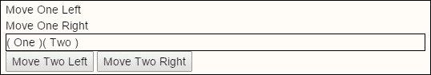

如果我们能拿到这本书来展示结果给您看那就太好了。也许在未来的电子书中这将变得可能，但就目前而言，我们将保持传统方式，实际上输入代码并测试它。

## 绑定可见性的复选框

在这个例子中，我们将创建一个名为 `event.html` 的文件，并将 `_base.html` 复制过来以节省时间。我们将查看参数，并以一种非常优雅的方式完成任务，这在 JavaScript 中是一个过于繁琐的任务。jQuery 让 JavaScript 编码变得更好，但 Knockout 带来了我们从一开始就需要的绑定简单性。

接下来，我们将为我们的示例创建标记。这次我们看到 `data-bind` 与复选框的值变化相关联。第二个输入框与同一个 ViewModel 项目 `bringingSpouse` 相关联。第二个输入框存储输入到 ViewModel 项目 `spouseName` 中的值。当首次加载页面时，它不会存储任何内容，因为输入框将被禁用。

```js
<p>
  Will you be bringing your spouse?
  <input type="checkbox" name="bringspouse" data-bind="checked: bringingSpouse" />
</p>
<p>
  Your Spouse's Name:
  <input type="text" data-bind="value: spouseName, enable: bringingSpouse" />
</p>
```

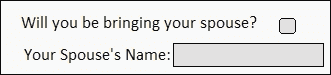

这是驱动自动化逻辑的代码。它只需要两个可观察对象；一个用于保存配偶的名字的值，另一个用于处理真或假，当用户有配偶时切换输入框。

```js
<script>
var vm = {
  bringingSpouse: ko.observable(false),
  spouseName: ko.observable("")
};
ko.applyBindings(vm);
</script>
```

现在，我们可以测试我们的代码，看看它是如何工作的。这就像点击复选框一样简单，之后输入框应该变得可使用，并准备好让您输入配偶的名字，当然，如果适用的话：

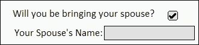

## 修饰键

我们将重新访问我们的 `enable.html` 文件，并学习如何处理一些修改过的事件。在我们的例子中，我们将关注当按下 *Shift* 键时检测事件。如果按下 *Shift* 键，我们将以一种方式处理事件，如果没有按下，我们将以另一种方式处理。首先，让我们使用以下 HTML 代码在屏幕上添加一个重置按钮：

```js
<br/>
<button data-bind="event: {mouseover: reset }">RESET</button>
```

现在，我们将添加页面 `script` 部分中高亮的代码：

```js
var vm = {
    oneClass: ko.observable('putLeft'),
    twoClass: ko.observable('putLeft'),
    oneLeft: function() {
        this.oneClass('putLeft');
    },
    oneRight: function() {
        this.oneClass('putRight');
    },
    twoLeft: function() {
        this.twoClass('putLeft');
    },
    twoRight: function() {
        this.twoClass('putRight');
    },
 reset: function(data, event){
 if(event.shiftKey){
 alert("Don't hold the shift key!");
 } else {
 this.oneClass('putLeft');
 this.twoClass('putLeft');
 }
 }
};
```

当我们按下 *Shift* 键并将鼠标悬停在新的按钮上时，它将弹出一个类似于这样的警告框：

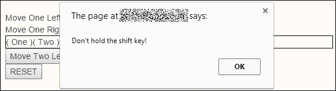

## 默认动作

默认情况下，Knockout 阻止内置的标准浏览器事件发生。如果你想让这些事件运行，只需绑定一个返回 true 的处理程序到该事件。

## 阻止冒泡

你可能还想防止事件冒泡。**冒泡**意味着网页上的一个元素，也称为 DOM 元素，与我们所说的更高级元素之间存在链式关系。在项目有机会处理事件之后，事件随后会沿着链向上传递，以便允许更高层级的元素有机会对事件做出响应。

在我们的鼠标悬停示例中，页面上可能有一个包含按钮的鼠标悬停处理器的区域。如果有，在按钮处理事件后，事件会被传递给更高层元素，以便它也能响应该事件。

控制实际上非常简单。我们只需要通过告诉我们的按钮处理程序返回 false 来阻止事件。当然，在不同的场景中，对于你不希望超出的事件操作，你会在其处理程序中设置返回 false 值，就像我们在这里讨论的使用案例中的按钮一样。

# textInput 绑定

我们显然已经对文本框做了很多绑定。现在，我们将对它们做一些新的操作。我们将在页面上放置一个文本输入和一个文本区域。以下是我们的 HTML 标记，我们将在这里放入一个名为`text.html`的新文件：

```js
<p>Title: <input data-bind="textInput: title" /></p>
<p>Post: <textarea data-bind="textInput: post" /></textarea></p>
<p>
<h2 data-bind="text: title"></h2>
<div data-bind="text: post"></div>
</p>
```

如果我们使用值绑定，我们只有在输入元素失去焦点时才会得到更新。使用`textInput`绑定，我们可以逐个字符得到反馈。让我们添加我们的代码，以便我们可以尝试它：

```js
<script>
function Blog() {
  this.title = ko.observable();
  this.post = ko.observable();
};
blog = new Blog();
ko.applyBindings( blog );
</script>
```

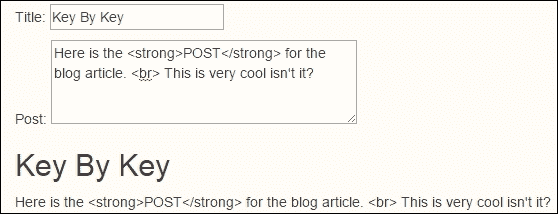

我们可以看到，当我们输入时，页面内容逐个字符更新，但存在一个问题。**Post**中的文本是以文本形式进入页面的。有一个简单的方法可以解决这个问题。我们只需将内容目标从`text`更改为`html`。哦，并且确保你使用小写字母，否则你会遇到问题。现在，再次运行它，它应该看起来像这样：

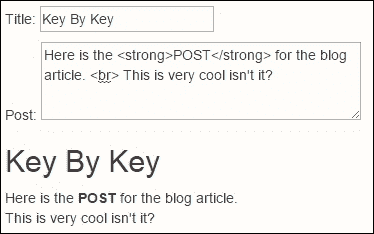

## 动态焦点

在进行动态 AJAX 风格网站时，有许多机会可以增强用户体验。多年前，与桌面应用程序相比，网站是一个死气沉沉的体验。今天，更动态的应用主要取决于每个平台的设计师和开发者的创造力。将用户界面改为更响应式，在用户和你的页面之间建立了一种虚拟关系。利用以下步骤使你的页面动态化：

1.  我们首先将更改文本输入的`data-bind`属性。通过添加逗号，我们可以在一个元素上添加多个数据绑定。我们将向输入添加`hasFocus`绑定器，并将事件目标指向名为`lookAtTitleBox`的处理程序。现在，我们的输入框在代码中应该看起来像这样：

    ```js
    <input data-bind="textInput: title, hasFocus: lookAtTitleBox" />
    ```

1.  接下来，我们将在这个输入框后面添加一个按钮，以展示从代码中动态控制焦点的功能。这意味着我们需要将事件处理器，我们的函数，绑定到按钮的点击事件上。然后，我们将让代码负责将控制权交还给标题输入框。在标题输入框后添加以下标记：

    ```js
    <button data-bind="click: focusTitle">Focus On Title</button>
    ```

1.  现在，我们需要添加输出文本，以便在标题输入获得焦点时在视图中显示：

    ```js
    <span data-bind="visible:lookAtTitleBox">( Enter A Good Title )</span>
    ```

1.  我们最后需要做的是修改我们的 ViewModel，使我们的表单更具交互性。我们将添加两个项目：ViewModel 上的一个可观察属性和一个由视图元素调用的方法：

    ```js
    this.lookAtTitleBox = ko.observable(false);
    this.focusTitle = function(){
      this.lookAtTitleBox(true);
    };
    ```

当页面重新加载时，我们的标题字段默认具有焦点。点击**帖子**以从标题元素中移除焦点。你应该在按钮可见后和标题元素具有焦点时看到焦点文本。现在，当标题元素没有焦点时，点击**聚焦于标题**按钮。通过 Knockout，你会看到我们能够通过在 ViewModel 中切换变量来指定元素的焦点。这是 ViewModel 在 MVVM 导向的应用程序中强大功能的另一个例子。以下是页面重新加载时我们得到的输出：

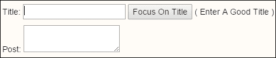

我们为此逻辑的完整代码如下所示：

```js
<!-- Here is the markup code-->
<br/>
<p>Title: <input data-bind="textInput: title, hasFocus: lookAtTitleBox" />
<button data-bind="click: focusTitle">Focus On Title</button>
<span data-bind="visible:lookAtTitleBox">
( Enter A Good Title )
</span>
</p>
<p>Post: <textarea data-bind="textInput: post" /></textarea></p>
<p>
<h2 data-bind="text: title"></h2>
<div data-bind="html: post"></div>
</p>
```

```js
// Here is the script code
<script>
function Blog() {
  this.title = ko.observable();
  this.post = ko.observable();
  this.lookAtTitleBox = ko.observable(false);
  this.focusTitle = function(){
    this.lookAtTitleBox(true);
  };
};
blog = new Blog();
ko.applyBindings( blog );
</script>
```

抽空看看这段代码的优雅简洁。这就是为什么许多 Knockout 程序员感觉 Knockout 对 JavaScript 所做的，就像 jQuery 对 JavaScript 所做的，Knockout 在增强设计和开发体验方面也做了同样多的工作。

嗯，这还不够好。如果目标是提升用户体验，为什么我们不复制这个文件，`text.html`，作为`text3.html`并创建一个 Web 3.0 级别的体验呢？我们将一次性展示所有代码，并对其进行讲解。我们将在以下地方创建点击编辑体验：

```js
<p>
  <span data-bind="click:editTitle">Title</span>:
  <input data-bind="visible: showTitleEditor, textInput: title, hasFocus:showTitleEditor" />
  <span data-bind="visible: !showTitleEditor(), html:title, click: editTitle"></span>
</p>
<p>
  <span data-bind="click:editPost">Post</span>:
  <textarea data-bind="visible: showPostEditor, textInput: post, hasFocus:showPostEditor" /></textarea>
  <span data-bind="visible: !showPostEditor(), html:post, click: editPost"></span>
</p>
```

我们所做的是将标题的输入元素与一个显示标题值内容的 span 元素放在一起。你会注意到它们两者都有相同的项开始`data-bind`属性。就代码稳定性而言，顺序并不重要；这仅仅是我们的编码顺序。文本中的可见项有括号，因为`!`（非）符号意味着我们已经在属性值中输入了 JavaScript 代码。每次我们这样做时，都需要输入括号以使其正确运行。

我们还向标签和标题内容添加了点击事件处理器。我们添加标签的原因是，有时你可能遇到页面加载而没有预先填充标题的情况。这只是一个示例，以表明你仍然可以通过点击标题来访问编辑框。页面加载时，它最初看起来是这样的（记得在之前完成 ViewModel，以便它能正确工作）：

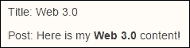

我们希望**帖子**框也有相同的功能，这样你就可以看到我们的代码在标记中的相同之处，只是它是一个`textArea`字段，用于帖子而不是标题。现在，让我们看看我们的 ViewModel 代码：

```js
<script>
function Blog() {
  this.title = ko.observable('Web 3.0');
  this.showTitleEditor = ko.observable(false);
  this.editTitle = function(){
    this.showTitleEditor(true);
  };

  this.post = ko.observable('Here is my <strong>Web 3.0</strong> content!');
  this.showPostEditor = ko.observable(false);
  this.editPost = function(){
    this.showPostEditor(true);
  };
};
blog = new Blog();
ko.applyBindings( blog );
</script>
```

我们看到标题和标题编辑器的可见性值只是 ViewModel 上的简单可观察属性。我们只需要让`editTitle`事件处理程序切换标题输入框的可见状态为 true。Knockout 会为我们正确设置视图和编辑元素的可见性，几乎不需要写代码。我们为帖子元素也做了同样的事情。现在，当我们点击标题内容或标题标签时，我们会看到标题的编辑框如下显示：

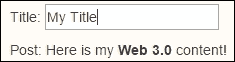

# 无线电和复选框绑定

在表单中处理单选按钮和复选框可能会很麻烦。这是 Knockout 使事情变得简单化的另一个领域。我们的例子将首先创建一个名为`radio.html`的文件。让我们从复选框的标记开始：

```js
<h2>Checkbox</h2>
<p>
  Colors (<span data-bind="text: colors"></span>)<br/>
  <input type="checkbox" value="red" data-bind="checked: colors" /> Red<br/>
  <input type="checkbox" value="green" data-bind="checked: colors" /> Green<br/>
  <input type="checkbox" value="blue" data-bind="checked: colors" /> Blue<br/>
  <input type="checkbox" value="yellow" data-bind="checked: colors" /> Yellow<br/>
  <input type="checkbox" value="purple" data-bind="checked: colors" /> Purple<br/>
</p>
```

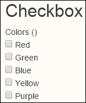

现在，在页面的底部添加一个`script`标签，就像我们在其他页面上做的那样。我们需要一个数组来保存选中项的内容，这就是我们在 ViewModel 中实现此功能所需的所有内容：

```js
function VM() {
  this.colors = ko.observableArray([]);
};
vm = new VM();
ko.applyBindings( vm );
```

通过在`data-bind`属性中绑定选中处理程序，我们会看到`colors`属性会自动填充。`span`标签中的`colors`属性将显示所有当前选中的复选框元素。你甚至可以尝试点击前面的项目来打开和关闭，你会发现它总是将最后选中的项目放在列表的末尾：

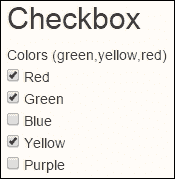

单选按钮的标记非常相似。我们将以相同的方式创建我们的代码，以展示单选按钮集合和复选框集合元素在功能上的差异，如下所示：

```js
<h2>Radio</h2>
<p>
  Shapes (<span data-bind="text: shapes"></span>)<br/>
  <input type="radio" value="square" data-bind="checked: shapes" />Square<br/>
  <input type="radio" value="round" data-bind="checked: shapes" />Round<br/>
  <input type="radio" value="triangle" data-bind="checked: shapes" />Triangle<br/>
  <input type="radio" value="rectangle" data-bind="checked: shapes" />Rectangle<br/>
  <input type="radio" value="oval" data-bind="checked: shapes" />Oval<br/>
</p>
```

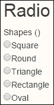

我们只需要在`function VM()`中添加这一行代码：

```js
this.shapes = ko.observableArray([]);
```

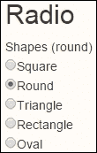

对于单选按钮，点击多少个项目并不重要，因为单选按钮总是限制自己只选择一个项目。在常见的 HTML 中，我们需要给每个单选按钮都加上一个名称，以确保 DOM 知道如何实现这种功能。在这个例子中，我们可以清楚地看到 Knockout 正在为我们处理这些事情。

## 增强的事件集成

我们之前解释过的单选按钮和复选框绑定非常有用，许多经验丰富的开发者可能认为 HTML 编码过于繁琐，需要手动在标记或文档的视图部分输入所有颜色或形状的详细信息。这种类型的事情最好是放在某种数据集合中。这正是我们将要做的，我们将使用另一组复选框，我们将它们标记为**食物**。

在这个例子中，我们将向我们的 ViewModel 添加一个名为`foodItems`的属性。我们还将更进一步，在名为`foods`的变量中设置一些预选值。您会注意到我们的`foodItems`属性有一个结构化的集合，包含两个嵌套项：`item`和`itemDisplay`。确保您的预选项使用`item`值。如果您输入`Milk`而不是`milk`，您可能会困惑为什么它看起来没有正确工作。项目必须有一个 100%的匹配，所以大小写在这里都至关重要。在`function VM()`中添加以下代码：

```js
  this.foodItems = ko.observableArray([
    { item: 'bread', itemDisplay: 'Bread' },
    { item: 'milk', itemDisplay: 'Milk' },
    { item: 'eggs', itemDisplay: 'Eggs' }
  ]);
  this.foods = ko.observableArray(['bread', 'eggs'"]);
```

现在，我们可以在代码的视图部分添加另一组用于食物的复选框。我们也将在这个集合中使用 foreach 绑定。在这里，我们可以传递一个类似 JSON 的结构，以便我们可以为内部的`$data`项创建“食物”的别名。`foreach`内部的每个项目都被指定为`$data`。添加`as`键允许我们为`$data`设置别名“食物”。我们在这里展示了两种使用方法，通过使用`$data.item`和通过使用`food.itemDisplay`（在更动态的示例中）。以下是添加到标记中的代码：

```js
<h2>Checkbox</h2>
<p>
  Foods (<span data-bind="text: foods"></span>)<br/>
<div data-bind="foreach: {data:foodItems, as: 'food'}">
  <input type="checkbox" data-bind="checkedValue: $data.item, checked: $root.foods" />
  <span data-bind="text: food.itemDisplay"></span><br/>
</div>
</p>
```

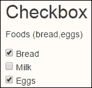

这是我们完整的代码，以防它有助于您在一个地方看到所有内容。Knockout 再次展示了它工作方式上的简单和强大优势。

```js
function VM() {
  this.colors = ko.observableArray([]);
  this.shapes = ko.observableArray([]);
  this.foodItems = ko.observableArray([
    { item: 'bread', itemDisplay: 'Bread' },
    { item: 'milk', itemDisplay: 'Milk' },
    { item: 'eggs', itemDisplay: 'Eggs' }
  ]);
  this.foods = ko.observableArray(["bread","eggs"]);
};
vm = new VM();
ko.applyBindings( vm );
```

# 选择绑定

我们使用 Knockout 与`select`元素的第一例将是用于单项选择。这是我们将在其中放入`colors`的标记：

```js
<p>
  Colors: ( <span data-bind="text: colors"></span> )
  <br/>
  <select data-bind="options: colorOptions, 
              value: colors,
              optionsCaption: 'Choose a color'"></select>
</p>
```

在我们的代码中，我们现在将做一件特别的事情。在我们创建 ViewModel 之后，我们将修改其一个属性，并使用 JavaScript 中常见的`push`函数向`colorOptions`数组添加另一个颜色。这意味着 JavaScript 的一些部分已经非常出色，我们应该继续使用它们。以下是`script`代码：

```js
<script>
function MyModel(){
  this.colorOptions = ko.observableArray(['Red','Green','Blue','Yellow','Green']);
  this.colors = ko.observableArray();
};
myModel = new MyModel();
ko.applyBindings( myModel );
myModel.colorOptions.push('Orange');
</script>
```

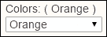

如果我们选择最后添加的项目，**橙子**，我们将看到选择器和显示 span 都显示与前面截图中的值相同。使用这段代码，您可以设置 ViewModel 的`color`属性值，它将自动将选择框设置为匹配的值。您应该在浏览器开发者工具控制台中尝试它。别忘了匹配值的大小写。

现在，我们将使用多选元素。在这种情况下，我们不需要选项标题。我们需要做的是更改`data-bind`处理程序的值到`selectedOptions`处理程序。这允许我们捕获多个项目。只需记住，一个值是单数，而所选选项是复数。我并不是说我们总是必须考虑单数和复数，但在这个情况下我们必须这样做。将以下代码添加到标记中：

```js
<p>
  Shapes: ( <span data-bind="text: shapes"></span> )
  <br/>
  <select size="3" multiple="true"
    data-bind="options: shapeOptions, 
      selectedOptions: shapes"></select>
</p>
```

现在，是时候添加一些代码来处理新的选择元素了。在 ViewModel 中，单选和复选元素的数据编码在实用上没有差异。

```js
this.shapeOptions = ko.observableArray(['Square','Circle','Triangle','Rectange', 'Oval']);
this.shapes = ko.observableArray();
```

如您在以下屏幕截图中所见，这通过允许我们选择多个元素而工作得非常好：

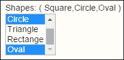

## 使用对象集合选择元素

有时候我们的数据会以值和表示值的显示项目作为两个不同的项目。以下是一个示例，说明在这种情况下如何进行编码：

```js
<p>
  Budget:
  <br/>
  <select data-bind="options: budgets,
        optionsText: 'budgetName',
        value: budget,
        optionsCaption: 'Pick...'"></select>
</p>
<div>
  You have chosen a 
  '<span data-bind="text: budget() ? budget().budgetType : 'undeclared'"></span>'
  budget type.
</div>
```

在`script`标签内，在`MyModel()`中，添加以下代码行：

```js
this.budget = ko.observable();
```

注意`optionsText`不是一个变量，而是集合项目中的结构元素的值。在这里我们使用单个结果，因此我们使用值处理器来保存结果。如果是多个选择，我们将使用`selectedOptions`绑定。以下是添加我们的代码后初始显示的样子。注意类型被设置为`undeclared`：

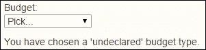

也要注意我们文本绑定中的逻辑。如果没有选择任何项目，预算项目将是一个空项目。在 JavaScript 中，这会返回一个假的结果。然后它会显示冒号后面的项目内容。否则，它将返回冒号前面的项目结果。在这种情况下，我们将从预算项目返回结构元素，用于类型，您将在我们的脚本中看到；我们将其编码为`budgetType`。现在让我们看看`script`代码：

```js
var Budget = function(name, type){
  this.budgetName = name;
  this.budgetType = type;
};
```

上述代码段将在我们声明 ViewModel 的结构之前出现。我们将使用它来声明预算集合中的项目，如下所示。我们使用简单的可观察对象而不是可观察数组，因为我们只返回单个项目。这是一个具有嵌套属性的结构化项目，但在那个级别上它是一个单一的项目，因此这是正确的逻辑：

```js
this.budgets = ko.observableArray([
  new Budget('Electric','expense'),
  new Budget('Bob Pay','income'),
  new Budget('Betty Pay','income'),
  new Budget('Taxes','expense'),
  new Budget('Gas','expense'),
  new Budget('Rental House','income'),
  new Budget('House Payment','expense')
]);
this.budget = ko.observable();
```

现在，让我们看看选择一个项目后的结果。如果我们选择**出租房屋**项目，我们会看到预算类型变为**收入**。这使得与我们的自动化系统进行动态交互变得非常方便，而且手动编码的工作量大大减少。

## 列出管理 Knockout 风格

现在，我们可以将我们的预算系统进一步扩展。我们将创建一个列表编辑器，允许我们添加、删除和排序我们的列表。虽然我们迄今为止所做的大部分工作都非常简单，但这个例子将会不同。这个例子将会简化。它做了更多的事情，所以需要更多的时间。然而，通过 Knockout 的力量，我们将看到简洁性仍然保持不变：

```js
<p>
  <form data-bind="submit:addBudget">
  Budget Editor:
  <hr/>
  Budget:
  <input data-bind="value: newName, valueUpdate: 'afterkeydown'" /><br/>
  Type:
  <select data-bind="options: budgetTypes,
              value: budgetType"></select><br/>
  <button type="submit" data-bind="enable: newName().length">Add Budget</button>
  </form>
</p>
```

在我们的第一段代码中，我们使用了一些之前没有使用过的东西。我们使用了一个`form`标签。通常在使用 Knockout 进行编码时不会使用表单。那么为什么在这个例子中会有所改变？改变的原因是我们将使用表单的`submit`函数作为我们的触发器，以将新的预算项目添加到我们的预算中。这是通过我们的代码中的`addBudget`处理器完成的。以下是我们的`script`代码：

```js
this.newName = ko.observable("");
this.budgetTypes = ko.observableArray(['income','expense']);
this.budgetType = ko.observable();
this.selectedBudgets = ko.observableArray([]);
this.addBudget = function(){
  var myBudget = new Budget(this.newName(),this.budgetType());
  if((this.newName() != "") 
      && (this.budgets.indexOf(myBudget) < 0) ) {
    this.budgets.push(myBudget);
  }
  this.newName("");
};
this.dropBudget = function(){
  this.budgets.removeAll(this.selectedBudgets());
};
this.sortBudgets = function(){
  this.budgets.sort(bCompare);
};
```

大部分代码看起来都很熟悉。可能对一些人来说，唯一可能新的部分是预算的排序。我们使用标准的 JavaScript 样式排序和我们在 ViewModel 外部创建的自定义函数来完成这个操作。自定义函数是 `bCompare` 函数。以下是该函数的代码：

```js
var bCompare = function(left,right){
  if(left.budgetName < right.budgetName) {
    return -1;
}
  if(left.budgetName > right.budgetName) {
    return 1;
}
  return 0;
};
```

这是一个简单的比较函数，JavaScript 用它来与自然流程交互，以确保所有项目都是有序的。再次，我们看到这个编辑表单背后的代码足够简单。让我们看看我们正在构建的列表编辑器。我们没有让它变得花哨，但我们确实在它里面构建了一些很棒的功能：

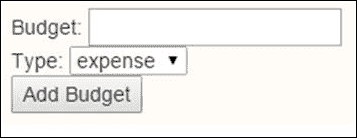

在代码的视图部分有一些特殊的标记，以确保正确绑定，如下所示：

```js
<p>	
  <select size="5" multiple="true"
      data-bind="options: budgets,
              optionsText: 'budgetName',
              selectedOptions: selectedBudgets"></select>
</p>
<p>
  <button data-bind="click: dropBudget">Drop Budget</button>
  <button data-bind="click: sortBudgets">Sort Budgets</button>
</p>
```

现在，如果你正在查看代码，你可能想知道代码有什么特别之处。这只是 Knockout 使事情变得简单和强大。这就是完成这项工作所需的一切。哦，你发现我对 Knockout 印象深刻了吗？我是。Knockout 是使其特殊的地方，因为它为我们做了很多事情，这样我们就可以专注于编程目标，而不是如何实现它们。以下是我们在添加**娱乐**作为支出、排序列表和从列表中删除**汽油**后的截图：

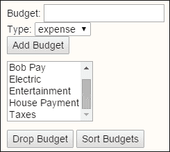

# 唯一名称绑定

IE6 不允许在没有 `name` 属性的情况下检查单选按钮。大多数时候这无关紧要，因为你的单选按钮元素将具有 `name` 属性，以便将它们放入互斥组中。然而，如果你没有添加 `name` 属性，因为在你情况下它是多余的，Knockout 将内部使用 `uniqueName` 在这些元素上以确保它们可以被检查。希望我们中没有人需要使用 IE6，但以防万一，将 `uniqueName` 处理程序添加到 `data-bind` 属性中，如果需要的话，可以像这样：

```js
<input data-bind="value: newName, uniqueName: true" />
```

# 网格表单

现在我们将把我们的预算表单再向前推进一步。我们将把到目前为止我们已经学习到的多个功能组合成一个可编辑的表格。这次我们也将表格包裹在表单中，但你在代码中会看到如何使用表单的双向选项。为这个示例创建一个名为 `grid.html` 的文件。在标记中输入以下内容：

```js
<form action='/serverTargetHandlerHere'>
  <p>You have asked for <span data-bind='text: budget().length'>&nbsp;</span> budget item(s)</p>
  <table data-bind='visible: budget().length > 0'>
    <thead>
      <tr>
        <th>Budget</th>
        <th>Amount</th>
        <th/>
      </tr>
    </thead>
    <tbody data-bind='foreach: budget'>
      <tr>
        <td><input data-bind='value: name, uniqueName: true' /></td>
        <td><input data-bind='value: amount, uniqueName: true' /></td>
        <td><a href='#' data-bind='click: $root.removeBudget'>Delete</a></td>
      </tr>
    </tbody>
  </table>
  <button data-bind='click: addBudget'>Add Budget</button>
  <button data-bind='enable: budget().length > 0,click: save' type''='submit'>Submit</button>
</form>
```

如果你只想将 Knockout 用作自动化的编辑器，并且仍然提交表单，你可以在表单的 `action` 属性中填写详细信息，并仍然以传统的方式提交它。如果你正在与较旧的系统合作，并且你的业务逻辑仍然是基于表单提交的，这可能很有用。这将还允许你逐步进入 Knockout 的世界。这也可能允许你在测试过程中测试功能，而无需完全重写你的系统。

注意，我们正在使用 `foreach` 标记绑定来管理网格中的每一行，对于数据模型中的每一行数据。ViewModel 智能地保持所有这些内容紧密相连并保持最新。我们还添加了 `uniqueName` 逻辑，这是需要在支持 IE6 的应用程序中添加的。现在让我们看看脚本代码：

```js
var BudgetModel = function(budget) {
    var self = this;
    self.budget = ko.observableArray(budget);
    self.addBudget = function() {
        self.budget.push({
            name: "",
            amount: ""
        });
    };
    self.removeBudget = function(budget) {
        self.budget.remove(budget);
    };
    self.save = function(form) {
        alert("Could now transmit to server: " + ko.utils.stringifyJson(self.budget));
        // To actually transmit to server as a regular form post, write this: ko.utils.postJson($("form")[0], self.budget);
    };
};
var budget = new BudgetModel([
    { name: "Food", amount: "560.00"},
    { name: "Utilities", amount: "180.00"},
    { name: "Rent", amount: "620.00"},
    { name: "Insurance", amount: "80.00"}
]);
ko.applyBindings( budget );
```

在这个例子中，我们创建了一个名为 BudgetModel 的标准 ViewModel。再次强调，我们正在使用 JavaScript 数组的 `push` 方法在我们的数组集合中堆叠另一个预算项。我们还有移除预算项的处理程序。如果我们回顾我们的标记，您会看到它使用基于作用域的变量 `$root.removeBudget`。行是通过 `foreach` 功能添加的，因此 Knockout 再次为我们承担了繁重的工作，并且它会知道您正在尝试删除哪一行。不要因为试图弄清楚它而感到压力。把它想象成一部智能手机。您不需要知道它是如何工作的。您需要知道的是如何使用它。

保存方法处理程序被设置为在警告框中显示结果。您本可以使用 jQuery AJAX 将这些结果发送回服务器以进行持久数据存储。您还会看到，正如之前所述，您可以选择将其作为表单发送。选择权在您手中，您可以选择最适合您需求的方法。以下是之前代码的截图：

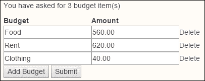

现在尝试这个例子。添加一些行。删除一些行。带有数据的点击 **提交** 按钮，您将在警告框中看到结果。如果没有行而点击它，您会看到它足够智能，可以忽略试图提交空内容的用户。

# 摘要

当处理表单和网格，并保持数据更新时，无论何时何地触及它，这正是 Knockout 从一开始就关注的内容。我希望您正在享受使用这项技术提供的简单但强大的进步来编写网页表单。它使得关注业务逻辑变得更加容易，代码更少。

在下一章中，我们将学习如何使用 JSON 和映射在 Knockout 中集成数据管理。
