# 第四章 编码 – AJAX、属性绑定、映射和实用工具

Knockout 有一个方面可以消除重复的任务。还有这样一个现实，我们从未期望它完成 100%的工作。它也很有道理，我们不希望 Knockout 做这么多，因为它在核心优势方面并不擅长。在这里，我们将学习如何扩展 Knockout 的覆盖范围，以及如何连接到 Knockout 之外的世界并做更多的事情。本章将重点介绍：

+   与 JSON 一起工作

+   映射与手动 ViewModel

+   与 AJAX 请求一起工作

+   解除数据映射

+   管理映射

+   实用函数

在本章中，我们将学习关于 Knockout 的一些常用方面——与 JSON 一起工作以及映射插件。这两个都是简单而强大的枢纽，我们将通过 Knockout 扩展快速应用开发。

# JSON done Knockout style

JSON 是著名的数据打包标准，似乎已经占据了整个互联网。曾经有 XML；RoR 有自己的打包标准；甚至 Adobe 也有可能性能最好的方式来打包和传输客户端与服务器之间的数据，称为**动作消息格式**（**AMF**）。总体赢家似乎还是 JSON，因为它简单，并且基于所有开发平台中最常见的：JavaScript。如果你想了解更多关于 JSON 的信息，你可以访问[`json.org`](http://json.org)。

为了达到我们的目的，让我们创建一个名为`json.html`的文件。我们将要做的第一件事是将 ViewModel 转换为 JSON。大多数现代浏览器都有一个名为`JSON.stringify`的函数，但在 Knockout 中我们并不是这样做的。Knockout 中包含两种方法：

+   `ko.toJS`

+   `ko.toJSON`

第一种方法，`ko.toJS`，将克隆 Knockout 数据到一个不包含任何 Knockout 相关提示或信息的普通副本。第二种方法，`ko.toJSON`，将执行`ko.toJS`操作，然后根据 JSON 标准将其转换为序列化的 JSON 字符串。如果你使用的是较旧的浏览器，如 IE7 或更早版本，你需要获取`json2.js`文件的副本，该文件可在[`github.com/douglascrockford/JSON-js/blob/master/json2.js`](https://github.com/douglascrockford/JSON-js/blob/master/json2.js)找到。

现在将以下代码输入到你的文件中：

```js
<script>
function VM() {
  this.colors = ko.observableArray([]);
  this.shapes = ko.observableArray([]);
  this.foodItems = ko.observableArray([
    { item: 'bread', itemDisplay: 'Bread' },
    { item: 'milk', itemDisplay: 'Milk' },
    { item: 'eggs', itemDisplay: 'Eggs' }
  ]);
  this.foods = ko.observableArray(["bread","eggs"]);
};
vm = new VM();
ko.applyBindings( vm );
</script>
```

现在我们将查看存储在 ViewModel 中的结构。我们将使用 Chrome 作为我们的浏览器，但你可以使用任何带有支持控制台命令的开发工具的浏览器。以下是我们的 ViewModel 转储得到的结果。在控制台中输入`console.log(vm)`以获取存储在`vm`中的结果：

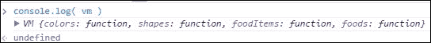

显然，虽然我们的 ViewModel 完全暴露在函数中，但你将习惯于在将内容倒入控制台时忽略`undefined`项`,`。如果你得到预期的结果，那么不要被该项分散注意力。

这里我们使用了两个命令，即`ko.toJS`和`ko.toJSON`。让我们首先使用结构将 ViewModel 输出到控制台。在控制台中输入`console.log( ko.toJS(vm) )`：

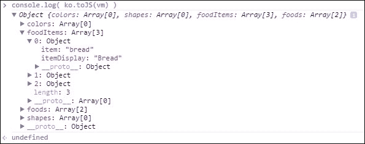

这里，我们看到`console.log`与`dump`。这很好，但如果我们想要将其发送到外部源或使用现代浏览器存储技术存储它，我们通常仍然希望将其作为 JSON 字符串打包。这可以通过使用辅助函数`ko.toJSON`方法来实现，这正是我们接下来要做的。您会看到这次我们的数据被放置在特殊字符的中间。这是 JSON 格式化，如下面的截图所示：

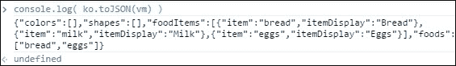

现在，我们将创建`json2.html`来将我们的 JSON 数据拉入我们的应用。我们需要将 JSON 复制并粘贴到我们的应用中，但我们将从与 HTML 文件相同的目录中的另一个文件中执行此操作。在这个例子中，将该文件命名为`json2.txt`。当然，在实时网站上，不要将敏感数据存储在文本文件中。在`json2.txt`文件中，复制您在前一个示例中获得的控制台输出。这是您的 JSON 数据，它应该看起来像这样：

```js
{"colors":[],"shapes":[],"foodItems":[{"item":"bread","itemDisplay":"Bread"},{"item":"milk","itemDisplay":"Milk"},{"item":"eggs","itemDisplay":"Eggs"}],"foods":["bread","eggs"]} 
```

虽然这可能看起来不错，但我们有一个问题。JSON 不能独立存在。它需要在一个变量中才能被管理。我们将按以下方式更改它。我们将使用变量`myJSON`。我们还需要在文本周围加上引号。由于 JSON 通常在内部使用双引号，处理这种情况的传统方法是在数据字符串之前使用单引号，并在末尾使用单引号，如下面的代码所示：

```js
myJSON = '{"colors":[],"shapes":[],"foodItems":[{"item":"bread", "itemDisplay":"Bread"},{"item":"milk","itemDisplay":"Milk"}, {"item":"eggs","itemDisplay":"Eggs"}],"foods":["bread","eggs"]}';
```

以下代码用于我们的`json2.html`文件。我们将使用`script`命令将外部数据拉入页面。人们通常也会将这样的静态文件命名为`json2.json`。我们使用`.text`扩展名是为了强调这里的 JSON 只是一个文本文件：

```js
<script src="img/json2.txt"></script>
<script>
function VM() {
  this.colors = ko.observableArray([]);
  this.shapes = ko.observableArray([]);
  this.foodItems = ko.observableArray([]);
  this.foods = ko.observableArray([]);
};
vm = new VM();
ko.applyBindings( vm );
myData = JSON.parse(myJSON);
vm.foodItems(myData.foodItems);
vm.foods(myData.foods);
</script>
```

这次，我们以结构开始我们的 ViewModel，但没有任何数据。在将 ViewModel 绑定到我们的数据模型后，我们将我们的 JSON 数据字符串转换为标准的 JavaScript 结构。然后，我们使用标准的 JavaScript 将数组传递到 ViewModel 的`foodItems`和`foods`属性。虽然这样做很整洁，但感觉我们实际上并没有做任何有价值的事情。让我们在`script`部分上方添加一些 View 代码，如下所示。这是我们在上一章中使用过的相同代码：

```js
Foods (<span data-bind="text: foods"></span>)<br/>
<div data-bind="foreach: {data:foodItems, as: 'food'}">
  <input type="checkbox" data-bind="checkedValue:$data.item, checked: $root.foods" />
  <span data-bind="text: food.itemDisplay"></span><br/>
</div>
```

我们看到的是一个网页，它拉取外部数据，并自动根据该数据填充视图：

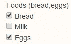

# 映射 - 首次查看

到目前为止，我们一直在本书中手动创建 ViewModel 的映射。对于较小的数据集，这可能是实用且高效的。随着数据集的增大以及更新数据的需求，这将变成一项繁琐的工作，有一个替代方案，许多 Knockout 开发者都喜欢。这是通过映射插件完成的。Knockout 是一个基于 jQuery 的库，在多个方面都是如此。对于 Knockout，也有可能构建和使用称为插件的库。最著名的库是映射库。我已经在本书的下载文件中包含了一个副本。我们将再次查看我们示例中的先前代码，但这次我们将使用映射插件来移动它。

我们这次将为我们的代码创建一个名为`mapping.html`的文件。我们将在 Knockout 调用之后立即包含一个额外的 JavaScript 文件，用于我们的映射插件。你可以在 ZIP 下载的工作示例文件夹中找到这些文件。在我们的情况下，它应该看起来像这样：

```js
<script src="img/json2.txt"></script>
<script src="img/data.js"></script>
```

如果你想创建这两个文件，我们建议你只从本章的`done`文件夹中复制它们，并确保它们与`mapping.html`文件在同一个文件夹中。

# 通过 AJAX 远程连接

使用`script`标签来加载数据显然不是非常复杂。我们将通过再次创建示例来改进这一点，但这次我们将使用 jQuery 来执行我们的 AJAX 请求。我们将把这个代码放在一个名为`ajax.html`的文件中。我们将使用之前相同的 HTML 代码，但我们将添加一个按钮到表单中，使用以下代码行：

```js
Foods (<span data-bind="text: foods"></span>)
<button data-bind="click: pullData">Pull Data</button><br/>
<div data-bind="foreach: {data:foodItems, as: 'food'}">
  <input type="checkbox" data-bind="checkedValue:$data.item, checked: $root.foods" />
  <span data-bind="text: food.itemDisplay"></span><br/>
</div>
```

`pullData`请求将是我们添加到 ViewModel 中的方法/函数。目前，它将用于从服务器获取数据并更新我们浏览器中的视图。以下是本例中我们将使用的`script`代码段：

```js
<script>
function VM() {
  var self = this;
  self.foodItems = ko.observableArray([]);
  self.foods = ko.observableArray([]);
  self.pullData = function(){
    var reqAJAX = "data.json";
    jQuery.getJSON(reqAJAX).done(function(data){
      self.foodItems(data.foodItems);
      self.foods(data.foods);
    });
  };
};
vm = new VM();
ko.applyBindings( vm );
</script>
```

请注意，我将尝试让你养成使用——这是一个我编造的短语，并且我喜欢——“自私的编码”的习惯。因为我们的代码与具有`this`值的交互存在风险，调试`this`问题并不有趣。我们已经学会了使用`self`别名来确保这不会成为一个问题。`.done()`函数是 jQuery 中的一个链式命令，用于处理对服务器的良好请求的完成。请参阅 jQuery 文档以获取更多处理程序；你可以使用这些文档使你的代码更加完全响应。

我们创建了一个名为`pullData`的函数/方法。在数据内部，我们将使用`jQuery.getJSON`请求从服务器拉回我们的数据。我们这次将 JSON 结构复制到一个名为`data.json`的文件中。确保不要将其分配给变量；你只想得到如下的 JSON 结构：

```js
{"colors":[],"shapes":[],"foodItems":[{"item":"bread","itemDisplay":"Bread"},{"item":"milk","itemDisplay":"Milk"},{"item":"eggs","itemDisplay":"Eggs"}],"foods":["bread","eggs"]}
```

现在，让我们看看我们加载页面时的初始屏幕。你应该得到以下内容：

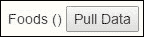

当我们点击**拉取数据**按钮时，我们会看到结果自动更新到以下视图：

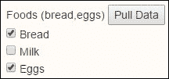

这对于许多开发者来说已经比纯 JavaScript 体验好多了。然而，如果这个表单在页面上有 40 个元素呢？这将是一个很大的代码块来设置 ViewModel 以进行那么多绑定。我们刚刚学习了映射；那么，如果我们包含映射插件并重新编写我们的代码会怎样呢？看看以下代码片段：

```js
<script>
var reqAJAX = "data.json";
vm = {};
jQuery.getJSON(reqAJAX).done(function(data){
  vm = ko.mapping.fromJS(data);
  vm.pullData = function(){
    reqAJAX = "data2.json";
    jQuery.getJSON(reqAJAX).done(function(data){
      ko.mapping.fromJS(data,vm);
    });
  };
  ko.applyBindings( vm );
});
</script>
```

我们可以看到我们的方法中的一些变化。我们本可以直接将文件名放入`getJSON`请求中，但我们只是按照我们喜欢的方式将其作为变量传递。我们还创建了`vm`变量来保存我们的 ViewModel。

AJAX 已经被移出 ViewModel，而 ViewModel 的声明已经被移入 AJAX。与上一个例子相比，它是反过来的。区别在于我们看到数据在页面加载时立即填充到视图中。我们还改变了`pullData`函数的功能。现在，它将被用来对服务器进行第二次调用。通常，我们不会重置这个源文件，因为它将是一个典型的 AJAX 请求，以查看是否有任何更新。由于我们不是为动态服务器编写代码，所以我们在这里通过更改 AJAX 请求的源名称来展示这个场景的模仿。

现在，当我们进行映射时，我们必须在使用`applyBindings`方法之前声明映射功能。这给我们带来了与手动创建每个单独绑定相同的结果。再次强调，对于这样一个简单的表单，这种收益并不明显。当我们到达更大、更复杂的页面时，收益是惊人的。哦，还要注意，当我们对服务器进行额外的调用时，我们将更新数据。我们需要在映射数据后传递 ViewModel 变量。

现在，我们将再次查看通过运行带有更多渐进式 AJAX 的代码我们能得到什么。第一次加载看起来就像是从我们上一个例子中拉取的数据：


我们创建了一个额外的项目；因此，当我们加载更新时，它将变得明显。这个项目是**冰淇淋**。我们还预先选择了这个项目。以下是第二次加载的 JSON 数据结构：

```js
{"colors":[],"shapes":[],"foodItems":[{"item":"bread","itemDisplay":"Bread"},{"item":"milk","itemDisplay":"Milk"},{"item":"eggs","itemDisplay":"Eggs"},{"item":"icecream","itemDisplay":"Ice Cream"}],"foods":["bread","eggs"]}
```

现在我们按下按钮来拉取更新，我们应该看到以下内容：

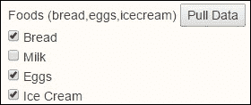

# 解除数据映射

这进展得很好，但我们需要为大多数基于 AJAX 的 Web 应用程序做一些事情。我们需要将数据存储在服务器上。仅仅将数据拉到浏览器是不够的。我们还需要能够将数据推回服务器。我们再次将使用 jQuery 来完成这个功能。当然，我们将展示如何做到这一点的代码，但我们将以不同的方式来处理，因为不同的读者将使用不同的后端，如 ASP.NET、ColdFusion、Node.js、PHP、Python、Ruby 和其他。

这次，除非你想要创建一个新文件，否则只需修改`AJAX.html`文件中的代码。我们将向我们的视图添加另一个按钮，这次连接一个推送数据方法：

```js
<button data-bind="click:pushData">Push Data</button>
```

我们还需要在我们的视图代码的末尾添加一个文本框，以便查看从我们的 ViewModel 中提取的数据。创建一个`textarea`字段来保存结果：

```js
<textarea id="unmapped"></textarea>
```

我们现在需要向我们的 ViewModel 添加另一个方法：

```js
<script>
var reqAJAX = "data.json";
vm = {};
jQuery.getJSON(reqAJAX).done(function(data){
  vm = ko.mapping.fromJS(data);
  vm.pullData = function(){
    reqAJAX = "data2.json";
    jQuery.getJSON(reqAJAX).done(function(data){
      ko.mapping.fromJS(data,vm);
    });
  }; 
  vm.pushData = function(){
    // This next line is just to show unmapped data
    var myData = ko.toJSON(vm);
    jQuery('#unmapped').text(myData);
    /*
    jQuery.post(reqAJAX, myData ).done(function(data){
      // code here to reflect good request
      alert("Your food changes have been stored.");
    });
    */
  };
  ko.applyBindings( vm );
});
</script>
```

我们看到了用于向服务器发送请求的代码。在这个例子中，我们假设我们的服务器能够响应该`reqAJAX`变量中的 URL 并处理进入服务器的数据。如果不能，你只需要将该变量设置为可以接收数据的目标。在这种情况下，数据是以`POST`形式发送的。这和表单使用`POST`方法是一样的。

你应该看到我们只是添加了将结果拉回作为名为`myData`的变量的能力。如果我们再次运行代码，提取数据，并将选择设置为仅鸡蛋和冰淇淋，我们就能测试被推回服务器的数据。注意我们有了将`myData`结果推送到`textarea`字段的 jQuery 命令。以下是我们看到的结果：

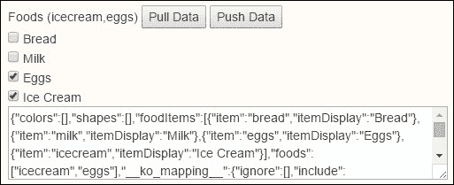

我们似乎遇到了一个与额外数据相关的问题。我们不必管理它，但修复起来并不难。这个问题发生是因为当数据被映射时，它会在内部创建额外的细节。这些细节在取消映射数据时会被带出来。如果你选择的话，可以保留这些细节，或者你可以使用以下代码来修复它。我们将编写一个`console.log`命令，将结构输出到控制台。我们还需要将`myData`更改为返回 JavaScript 结构。

如果我们查看浏览器开发者工具的控制台，我们将看到以下结构用于我们的输出。然后我们将使用`JSON.stringify()`使其准备好 AJAX：

```js
var myData = ko.toJS(vm);
console.log(myData);
delete myData.__ko_mapping__;
myData = JSON.stringify(myData);
jQuery('#unmapped').text(myData);
```

我们看到`myData`变量和用于管理输出的控制台日志的变化。控制台日志中的额外细节是`__ko_mapping__`数据结构的一部分。使用 JavaScript 的删除命令，我们可以直接从我们的结果中移除它。一些函数显示出来了，但当我们使用`stringify`函数时，它不会拉取它们。以下是我们现在得到的内容：

```js
{"colors":[],"shapes":[],"foodItems":[{"item":"bread","itemDisplay":"Bread"},{"item":"milk","itemDisplay":"Milk"},{"item":"eggs","itemDisplay":"Eggs"},{"item":"icecream","itemDisplay":"Ice Cream"}],"foods":["eggs","icecream"]}
```

现在我们正在进行有意义的 AJAX 交互。你可能希望向服务器发送比这里更少的结构。有选项可以进一步裁剪数据，以使事物尽可能紧凑。

哦，对于实时应用，*记住*要移除控制台日志和`textarea`字段。别说我教你把那些留在真实世界的网页上！

# 合并映射数据

有时候你可能想要从多个来源将数据拉入你的 ViewModel。当你这样做时，你可以为每个来源创建一个映射。如果源变量具有相同的名称，它们将覆盖现有的变量。只要基本变量具有不同的名称，它就会将它们合并到 ViewModel 中。如下这样做：

```js
myViewModel = ko.mapping.fromJS(firstData, firstMap);
ko.mapping.fromJS(nextData, nextMap, myViewModel);
```

你得到的是 `firstData` JavaScript 结构与 `firstMap` 映射的组合，再加上 `nextData` JavaScript 结构和 `nextMap` 映射。如果 `nextData` 中有任何重复的基本结构，它们将覆盖现有 `firstData` JavaScript 结构中的相同结构。

# 映射选项

有时候，当你将数据加载到不需要更改的页面应用程序中时，这只是一个静态数据，将其转换为可观察数据会额外消耗处理器时间和内存资源，而没有任何收益。在将数据传递到映射处理程序时，你可以设置哪些项目被映射为可观察项目，使用以下代码行：

```js
var data = {
  a: "a",
  b: [{ b1: "v1" }, { b2: "v2" }],
  c: true
};
var result = ko.mapping.fromJS(data, { observe: "a" });
var result2 = ko.mapping.fromJS(data, { observe: "a", copy: "b" }); //will be faster to map.
```

从 `result` 和 `result2` 变量得到的结果将相同。为什么？这是因为当我们声明 `observe` 项目时，其他项目被认为是复制项目。如果传递单个项目，我们可以在数组外声明它，就像我们用 `a` 做的那样。如果传递多个项目，我们将在数组中声明它们，例如 `["a","c"]`。这将使 `a` 和 `c` 都成为可观察项目。

如果我们只想声明一个要复制的项目，我们可以传递复制的内容，这将直接复制的唯一项目。当然，我们还有能力在映射过程中忽略要复制的项目，使用 `ignore`。

# 工具函数

`ko.utils` 中有许多函数。让我们首先看看标准 Knockout 中的特殊数组方法。

## ko.utils.arrayFilter()

`ko.utils.arrayFilter` 函数允许我们在数组中过滤项目。我们将直接作为代码示例运行这些。我们将创建一个示例 JSON 文件并通过 AJAX 加载它，以保持对学习方法的关注，而不是浪费时间创建示例代码集。我们将创建一个名为 `utility.html` 的页面来运行这些代码，并从那里运行过滤代码。我们的示例标记如下：

```js
<h3>arrayFilter() : staff under 35</h3>
<ul data-bind="foreach: youngStaff">
  <li><span data-bind="text: age() + ' ' + firstName()"></span></li>
</ul>
```

我们的 `script` 代码如下。随着我们继续添加每个示例，我们将添加更多内容，但这里是对工具示例的基本介绍：

```js
<script>
var vm = {};
jQuery.getJSON('utility.json').done(function(data){
  vm = ko.mapping.fromJS( data );
  vm.youngStaff = ko.computed(function(){
    return ko.utils.arrayFilter(vm.arr(), function(item){
      if(item.age() < 35) { return true; }
      return false;
    });
  });
  ko.applyBindings(vm);
});
</script>
```

我们使用数据设置映射，然后开始添加我们的自定义功能。这些可以是自定义函数或计算值。最后，在将所有自定义修改应用到映射后，我们应用绑定。

在我们的代码示例中，我们向您展示了如何使用 `arrayFilter`。`arrayFilter` 函数将逐个传递项目，并将包含在结果集中，其中我们发送一个 true 值来告知它应该被包含。

这里是我们将用于示例的 JSON。我们将在这里展示整个数据集。请注意，如果不想手动输入，JSON 也在我们的 `done` 文件夹下的 `utility.json` 文件中。通常，我会建议手动输入这些示例，以加强你在该主题上的技能：

```js
{"arr":[{"firstName":"James","lastName":"Donald","age":23,"phone":[]},{"firstName":"Adam","lastName":"Thomas","age":46,"phone":[]},{"firstName":"Michelle","lastName":"Ingram","age":32,"phone":[]},{"firstName":"Edward","lastName":"Adams","age":63,"phone":[]},{"firstName":"Veronica","lastName":"Wesson","age":54,"phone":[]},{"firstName":"Greg","lastName":"Simons","age":46,"phone":[]}],"color_1":["red","green","blue","orange"],"color_2":["red","blue","orange","purple"]}
```

此外，我们使用了以下数据集来创建我们的 JSON。我们只是对数据集调用了 `JSON.stringify` 方法。以下是代码：

```js
{
  arr : [
    { "firstName": "James", "lastName": "Donald", "age": 23, "phone": [] },
    { "firstName": "Adam", "lastName": "Thomas", "age": 46, "phone": [] },
    { "firstName": "Michelle", "lastName": "Ingram", "age": 32, "phone": [] },
    { "firstName": "Edward", "lastName": "Adams", "age": 63, "phone": [] },
    { "firstName": "Veronica", "lastName": "Wesson", "age": 54, "phone": [] },
    { "firstName": "Greg", "lastName": "Simons", "age": 46, "phone": [] }
  ],
  color_1 : [ "red","green","blue","orange" ],
  color_2 : [ "red","blue","orange","purple" ]
}
```

我们仍然需要包含我们的 jQuery、Knockout 和 Knockout 映射 JavaScript 文件。当你将所有这些代码组合在一起时，你应在浏览器中看到以下内容：

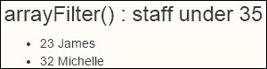

我们看到我们的过滤结果只返回了六个项目中的两个。这是因为其中只有两个小于 35。更有趣的是，这些数据是动态连接到 View 模型的。如果数组通过添加或删除项目而发生变化，屏幕将自动更新。这并不是连接到 jQuery，所以这是一个很好的补充。此外，如果数组项中的值发生变化，比如年龄之一，那么这里的过滤器将自动知道要添加、删除或保留项目在视图列表中。

## `ko.utils.arrayFirst()`

`ko.utils.arrayFirst` 方法会将项目传递给要搜索的函数，直到找到匹配项或声明。它只会从数组中返回一个项目。以下是添加到这个示例中的 View 代码：

```js
<h3>arrayFirst() : first found over 45</h3>
( <span data-bind="text: firstRetire().age()"></span> )
```

这里是添加到理解我们的 `arrayFirst` 工具命令的逻辑。在脚本中绑定设置之前添加它：

```js
vm.firstRetire = ko.computed(function(){
  return ko.utils.arrayFirst(vm.arr(), function(item){
    if(item.age() > 45) return true;
    return false;
  });
}); // arrayFirst
```

与上一个实用方法一样，结果是由返回的 true 值触发的。这个例子中的不同之处在于，第一个 true 值将是唯一返回的值。以下是我们的结果截图：

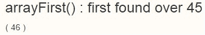

## `ko.utils.arrayMap()`

`ko.utils.arrayMap` 方法允许创建一个扁平化的数组。这意味着有时我们有一个结构数组，只想获取整个结构中的特定项，将其拉回到一个简单的数组中。以下是标记代码：

```js
<h3>arrayMap() : till retirment</h3>
<ul data-bind="foreach: tillRetire">
  <li><span data-bind="text: $data"></span></li>
</ul>
```

这里是需要添加到这个示例中的脚本代码。这次我们不会返回 true 或 false 类型的结果。我们将返回一个值，在这种情况下，将创建一个简单的值数组：

```js
vm.tillRetire = ko.computed(function(){
  return ko.utils.arrayMap(vm.arr(),function(item){
    return 65 - item.age() + ' years till retirement.';
  })
}); // arrayMap()
```

这是您将看到的屏幕结果，使用我们的数据集：

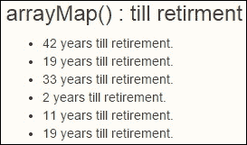

通过修改项目，实际上可以修改传递给过程的结构。这是因为通常，结构和数组是通过在内存中设置对源结构的引用来传递的。这意味着尽管传入的是名称项，但项目指向 ViewModel 中的原始结构。以下是如果我们想修改 ViewModel 中的原始结构可以使用的另一个方法：

```js
vm.tillRetire2 = ko.computed(function(){
  ko.utils.arrayMap(vm.arr(),function(item){
    item.yearsLeft = 65 - item.age() + ' years till retirement.';
  })
}); // arrayMap()
```

结果将是一个嵌套在 ViewModel 数组集合中的值，但该值不会被观察或计算。这意味着虽然它可能工作，但它不会与 Knockout 的所有功能一起工作。因此，在尝试之前应该仔细测试。如果有疑问，为了避免意外功能，请避免这种方法。哦，你也可以删除项目字段，所以请注意，你正在编辑原始结构，如果你手动更改这些内容，任何与之相关的内容都处于风险之中。

## `ko.utils.arrayGetDistinctValues ()`

`ko.utils.arrayGetDistinctValues` 方法允许您从一个数组中移除重复值，只留下唯一的项目。这次我们将处理一个结果集，它是一个数组，因此我们再次在视图的 `data-bind` 属性上使用 foreach 方法：

```js
<h3>arrayMap() : All ages sorted</h3>
<ul data-bind="foreach: allYears">
  <li><span data-bind="text: $data"></span></li>
</ul>
<h3>arrayGetDistinctValues() : Unique ages</h3>
<ul data-bind="foreach: uniqueYears">
  <li><span data-bind="text: $data"></span></li>
</ul>
```

您可能已经注意到这次我们插入了两个段。这是因为 `arrayGetDistinctValues` 修改了另一个数组。我们需要它将要修改的数组。我们将要做的是使用我们的 `arrayMap` 方法创建一个包含所有年龄的数组，然后创建另一个只包含其中唯一值的数组。在我们的脚本代码中，我们再次需要在 `applyBindings` 命令之前设置 `arrayGetDistinctValues`：

```js
vm.allYears = ko.computed(function(){
  return allYears = ko.utils.arrayMap(vm.arr(),function(item){
    return item.age();
  });
}); // arrayMap()
vm.uniqueYears = ko.computed(function(){
  return ko.utils.arrayGetDistinctValues(vm.allYears().sort(),vm);
}); // arrayGetDistinctValues()
```

这里是两组结果截图：

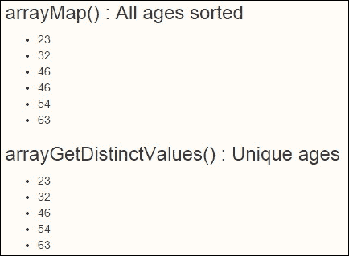

第一组在调用唯一值集时进行了排序。这是需要注意的一点，因为当发生这种情况时可能会令人困惑。我们将其包括在这里，以便提供一些思考的食物，并再次说明需要意识到您可能正在对原始数据集执行命令。如果您遵循最佳实践，您可能会对唯一的年份结果进行排序，如果这是您的目标，而不是在方法中对输入数据进行排序。这也是一个外部变量即使在方法参数中发生排序调用时也能可见的例子。

## ko.utils.arrayForEach()

`ko.utils.arrayForEach` 方法将允许您遍历一个数组。这对于执行总计或其他从总结中提取的逻辑非常有用。例如，您可以返回所有有孩子的工人。虽然最理想的地方可能是从数据库中这样做，但这并不意味着它只能在那里完成。审查我们在哪里以及为什么做事情是良好的实践，以确保我们的应用程序可以按需进行性能和扩展。

我们这次的视图代码将使用非数组值，因此我们不会使用 foreach 方法。我们再次提到这一点的原因是，如果您使用错误的方法，您的页面将无法正确运行。通常，问题可能只是尝试在 ViewModel 的非数组属性上调用数组方法。这是任何开发者都可能面临的常规问题。以下是视图代码：

```js
<h3>arrayForEach() : total ages</h3>
Total Age: <span data-bind="text: totalAge"></span>
```

就怕我在这本书的某个地方没有说过，让我明确一点。在 Knockout 中，一点点的代码就有很大的力量。以下是我们的总年龄处理代码：

```js
  vm.totalAge = ko.computed(function(){
    var years = 0;
    ko.utils.arrayForEach(vm.arr(), function(item){
      years += item.age();
    });
    return years;
  }); // arrayForEach();
```

当然，我们在截图中也得到了总年龄如下：

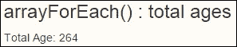

## ko.utils.compareArrays()

这允许您比较数组并返回一个集合，显示来自两个数组的所有项目。如果项目在第二个集合中不存在，则将其显示为已删除。如果项目在第二个集合中但不在第一个集合中，则将其显示为已添加。返回的集合还将显示项目存在的索引。

这里是`compareArrays`上最后一个数组示例的视图代码：

```js
<h3>compareArrays() : 2 Color Arrays</h3>
<ul data-bind="foreach: diff">
  <li><span data-bind="text: $data.value + ' was ' + $data.status"></span></li>
</ul>
```

我们的脚本代码再次很简单，希望通过手动处理每个这些代码，它们对你来说也变得更加自然。以下是`script`代码：

```js
vm.diff = ko.computed(function(){
  return ko.utils.compareArrays(vm.color_1(),vm.color_2());
}); // compareArrays()
```

这里是代码运行的截图：

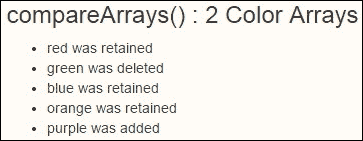

我们想从浏览器开发者工具中包含一个控制台日志，因为我们认为 Chrome 显示了很好的结构：

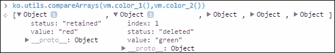

# 纯化我们的计算

现在我们将使用`pureComputed`而不是`computed`来重做代码的`script`部分。术语`pureComputed`是从纯函数作为编程风格的概念中获得的灵感。这并不是你需要理解才能使用的东西，所以不要被名称的语义所困扰，因为就学习这些纯计算如何对我们在这里有所帮助而言，并没有实际的收益。

当 Knockout 有东西在监视时，一个计算项被称为订阅者。因此，它被视为一个订阅者依赖项。如果我们使用`pureComputed`方法而不是`computed`方法，当没有订阅者时，Knockout 不会计算值。这当然通过减少不必要的计算和运行不必要的代码来增加我们的处理速度。这也是避免任何内存问题的另一种方式。

当没有订阅者时，纯计算可观察者被认为是**睡眠状态**。当有订阅者时，它被认为是**监听状态**。对我来说，术语“监听”有点奇怪，因为对我来说它应该是**响应**。尽管如此，这确实是有意义的，因为它是一种计算方法。所以它确实需要监听它用于计算的值。如果这些值中的任何一个发生变化，它需要重新计算其结果。

这里是更新后的脚本代码，移动到更好的`pureComputed`方法：

```js
<script>
var vm = {};
jQuery.getJSON('utility.json').done(function(data){
  vm = ko.mapping.fromJS( data );
  vm.youngStaff = ko.pureComputed(function(){
    return ko.utils.arrayFilter(vm.arr(), function(item){
      if(item.age() < 35) { return true; }
      return false;
    });
  });
  vm.firstRetire = ko.pureComputed(function(){
    return ko.utils.arrayFirst(vm.arr(), function(item){
      if(item.age() > 45) return true;
      return false;
    });
  }); // arrayFirst
  vm.tillRetire = ko.pureComputed(function(){
    return ko.utils.arrayMap(vm.arr(),function(item){
      return 65 - item.age() + ' years till retirement.';
    })
  }); // arrayMap()
  vm.tillRetire2 = ko.pureComputed(function(){
    ko.utils.arrayMap(vm.arr(),function(item){
      item.yearsLeft = 65 –I tem.age() + ' years till retirement.';
    })
  }); // arrayMap()
  vm.allYears = ko.pureComputed(function(){
    return allYears = ko.utils.arrayMap(vm.arr(),function(item){
      return item.age();
    });
  }); // arrayMap()
  vm.uniqueYears = ko.pureComputed(function(){
    return ko.utils.arrayGetDistinctValues(vm.allYears().sort(),vm);
  }); // arrayGetDistinctValues()
  vm.totalAge = ko.pureComputed(function(){
    var years = 0;
    ko.utils.arrayForEach(vm.arr(), function(item){
      years += item.age();
    });
    return years;
  }); // arrayForEach();
  vm.diff = ko.pureComputed(function(){
    return ko.utils.compareArrays(vm.color_1(),vm.color_2());
  }); // compareArrays()
  ko.applyBindings(vm);
});
</script>
```

如果你想知道一个项有多少个依赖项，你可以查看`getDependenciesCount`方法。在你的浏览器开发者工具的控制台中输入以下内容：

```js
vm.allYears.getDependenciesCount()

```

这将显示订阅`allYears`计算方法的项的数量。还有一个函数会告诉我们订阅`allYears`计算方法的项的数量，如下所示：

```js
vm.allYears.getSubscriptionsCount()

```

# 为计算可观察者编写代码文档

我们在这里仅为了参考包含了以下关于可观察者的文档。虽然这些文档在 KnockoutJS 网站上可用，但将它们包含在这里似乎是个好主意，这样你就不必在网站和书籍之间跳来跳去了。

计算可观察者可以使用以下形式之一构建。

## 表格 1

`ko.computed( evaluator [, targetObject, options] )`形式支持创建计算可观察者的最常见情况。它有以下属性：

+   `evaluator`：这是一个用于评估计算可观察者当前值的函数。

+   `targetObject`: 如果提供，它定义了 Knockout 调用你的回调函数时`this`的值。

+   `options`: 这是一个对象，包含计算出的可观察对象的进一步属性。完整的列表见下文。

## 表格 2

`ko.computed( options )` 参数是一个用于创建计算出的可观察对象的单参数形式，它接受一个具有以下任何属性的 JavaScript 对象：

+   `read`: 这是一个必需的函数，用于评估计算出的可观察对象的当前值。

+   `write`: 这是一个可选函数。如果提供，这个函数使得计算出的可观察对象可写。这个函数接收其他代码尝试写入你的计算出的可观察对象的值。你需要提供自定义逻辑来处理传入的值，通常是通过将值写入某些底层可观察对象。

+   `owner`: 这是一个可选函数，如果提供，它定义了 Knockout 调用你的`read`或`write`回调时`this`的值。

+   `pure`: 这是一个可选参数。如果这个参数为真，计算出的可观察对象将被设置为`纯计算出的可观察对象`。这个选项是`ko.pureComputed`构造函数的替代。

+   `deferEvaluation`: 这是一个可选参数。如果这个选项为真，那么计算出的可观察对象的值将不会在创建时立即评估，直到实际尝试访问其值或手动订阅它。

+   `disposeWhen`: 这是一个可选函数。如果提供，这个函数在每次重新评估之前执行，以确定是否应该销毁计算出的可观察对象。如果结果为真，将触发计算出的可观察对象的销毁。

+   `disposeWhenNodeIsRemoved`: 这是一个可选函数。如果提供，当指定的 DOM 节点被 Knockout 移除时，将触发计算出的可观察对象的销毁。这个特性用于在模板和控制流绑定移除节点时销毁用于绑定的计算出的可观察对象。

## 表格 3

`ko.pureComputed( evaluator [, targetObject] )` 形式使用给定的评估函数和可选对象来构建`纯计算出的可观察对象`。与`ko.computed`不同，这个方法不接受`options`参数。

## 表格 4

`ko.pureComputed( options )` 形式使用一个`options`对象来构建纯计算出的可观察对象。它接受之前描述的`read`、`write`和`owner`选项。

# 使用计算出的可观察对象

计算出的可观察对象提供了以下函数：

+   `dispose()`: 这个函数手动销毁计算出的可观察对象，清除所有对依赖项的订阅。如果你想要停止计算出的可观察对象更新或想要清理依赖于不会清理的可观察对象的计算出的可观察对象的内存，这个函数很有用。

+   `extend(extenders)`: 这会将给定的扩展器应用到计算出的可观察对象上。

+   `getDependenciesCount()`: 这个函数返回计算可观察对象的当前依赖项数量。

+   `getSubscriptionsCount()`: 这个函数返回计算可观察对象的当前订阅数量（无论是来自其他计算可观察对象还是手动订阅）。

+   `isActive()`: 这个函数返回计算可观察对象是否可能在将来更新。如果没有依赖项，计算可观察对象是无活动的。

+   `peek()`: 这个函数返回计算可观察对象的当前值，而不创建依赖项。

+   `subscribe( callback [,callbackTarget, event] )`: 这个函数注册了`手动订阅`，以便在计算可观察对象发生变化时接收通知。

# 使用计算上下文

在计算可观察对象的评估函数执行期间，你可以访问`ko.computedContext`来获取有关当前计算属性的详细信息。它提供了以下函数：

+   `isInitial()`: 这是一个函数，如果在当前计算可观察对象的第一次评估期间调用，则返回 true，否则返回 false。对于`纯`计算可观察对象，`isInitial()`始终是未定义的。

+   `getDependenciesCount()`: 这个函数返回当前评估期间检测到的计算可观察对象的依赖项数量。

    ### 注意

    `ko.computedContext.getDependenciesCount()`函数等同于在计算可观察对象本身上调用`getDependenciesCount()`。它之所以也存在于`ko.computedContext`上，是为了提供一个在计算可观察对象尚未完成构建之前，第一次评估期间计算依赖项的方法。

# 摘要

本章为我们打开了大量功能和选项，使网络风格编码变得强大而优雅。对于一些人来说，学会让库为你处理事情是困难的，但这个观点是讽刺的，因为我们编程计算机是为了让其他人让我们的工作为他们管理事情。本章为我们知识和经验增添了几个有价值的技能和选项：

+   我们学习了如何使用 JSON 作为传递数据进出的替代方式，将数据管理集成到 Knockout 中。

+   我们已经看到了 Knockout 映射的强大功能，它使我们的代码变得更加优雅，提高了另一个数量级的优雅性。

+   我们已经介绍了使用 Knockout 进行 AJAX 的基本知识。

+   我们已经学习了如何使用实用函数来获取更高级的集合功能，并且代码行数更少。

+   最后，我们学习了如何使用纯面向计算函数（附带 KnockoutJS 在线文档中的计算文档剪辑）来提高我们的 ViewModel 的性能。

在下一章中，我们将探讨另一种打包方式，以使我们的代码更短、更易于接近、更可持续。模板曾经是后端服务器的领域。下一章将向您展示为什么您需要在后端做更少的事情，而在前端做更多的事情，比以往任何时候都要多！
