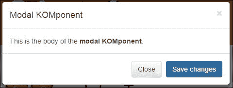

# 第六章.打包优雅

首先，有 HTML 和 JavaScript，然后是 CSS。接下来是 AJAX，它开启了 Web 2.0 时代，正如它所称呼的那样。之后，模板驱使我们进入了一个更加动态、富有创造性的平台。网络开发的下一个进步是自定义 HTML 组件。KnockoutJS 允许我们以一些改变游戏规则的风格直接进入，这对于设计师和开发者来说都是一种优雅的方式。在本章中，我们将关注：

+   组件简介

+   **自带标签**（**BYOT**）

+   增强属性处理

+   创建自己的库

+   **异步模块定义**（**AMD**）——按需资源加载

+   基于组件的 **单页应用程序**（**SPA**）

整个章节都是关于打包你的代码以供重用。使用这些技术，你可以让你的代码更加易于接近和优雅。

# 组件简介

我们希望你在上一章中学习模板时感到愉快。也许对组件最好的解释就是一个带有隔离 `viewModel` 的打包模板。以下是我们在页面上声明 `like` 组件将使用的语法：

```js
<div data-bind="component: "like"''"></div>
```

如果你没有通过组件传递任何参数，这是正确的语法。如果你希望传递参数，你可以使用以下 JSON 风格的结构：

```js
<div data-bind="component:
{name: 'like-widget',params:{ approve: like} }"></div>
```

这将允许我们通过自定义组件传递命名参数。在这种情况下，我们传递了一个名为 `approve` 的参数。这意味着我们通过名为 `like` 的绑定 `viewModel` 变量。看看这将如何编码。创建一个名为 `components.html` 的页面，使用 `_base.html` 文件来加快速度，就像我们在所有其他章节中做的那样。在你的 `script` 部分，创建以下 ViewModel：

```js
<script>
ViewModel = function(){
  self = this;
  self.like = ko.observable(true);
}
;
// insert custom component here
vm = new ViewModel();
ko.applyBindings(vm);
</script>
```

现在，我们将创建我们的自定义组件。以下是我们将用于此第一个组件的基本组件。将代码放在注释处，因为我们想确保它在 `applyBindings` 方法执行之前被添加：

```js
ko.components.register('like-widget', {
  viewModel: function(params) {
    this.approve = params.approve;
    // Behaviors:
    this.toggle = function(){ 
      this.approve(!this.approve()); 
    }.bind(this);
  },
  template:
    '<div class="approve">\
      <button data-bind="click: toggle">\
        <span data-bind="visible: approve" class="glyphicon  glyphicon-thumbs-up"></span>\
        <span data-bind="visible:! approve()" class="glyphicon  glyphicon-thumbs-down"></span>\
      </button>\
    </div>'
});
```

我们的组件有两个部分：`viewModel` 和 `template` 部分。在前一章中，我们学习了如何使用 Knockout 模板。在本章中，我们将使用组件内部的这些细节。

标准的 Knockout 组件使用 `params` 结构将变量传递给组件。我们可以使用这个结构，或者如果你愿意，也可以选择使用 `*self = this*` 方法。除了设置变量结构外，还可以为我们的组件创建行为。如果我们查看模板代码，我们可以看到我们已将点击事件绑定到组件中的 `approve` 设置切换。然后，在按钮内部，通过绑定到 `span` 元素的可见特性，将向用户显示点赞或踩不点赞的图片。是的，我们在这里使用的是 Bootstrap 图标元素而不是图形。以下是初始状态的截图：


当我们点击缩略图图像时，它将在点赞和踩图之间切换。由于我们还传递了一个绑定到页面 ViewModel 的外部变量，因此我们可以看到匹配的 span 文本中的值也会切换。以下是我们在代码的视图部分添加的标记，以产生这些结果：

```js
<div data-bind="component: {name: 'like-widget', params:{ approve: like} }"></div>
<span data-bind="text: like"></span>
```

您也可以使用 jQuery 插件构建此类功能，但可能需要更多的代码来实现双向绑定并匹配我们在这里实现的紧密功能。这并不意味着 jQuery 插件不好，因为这同样是一种与 jQuery 相关的技术。这意味着我们有一些方法可以做得更好。这位作者认为，此类功能仍然可以很好地添加到核心 jQuery 库中。然而，我并不期待他们采纳类似 Knockout 的项目到他们目前拥有的精彩项目集合中，并且不觉得我们应该因此对他们有所偏见。专注于他们最擅长的事情是 Knockout 等库能够提供更广泛选项的原因之一。看起来，他们的决定正在为我们工作，即使它们采取了与我预期不同的方法。

## 动态组件选择

当我们选择组件时，我们应该已经注意到我们使用的是引号声明的。虽然一开始可能看起来更加限制，但请记住，这实际上是一个强大的功能。通过使用变量而不是硬编码的值，您可以动态选择要插入的组件。以下是标记代码：

```js
<div data-bind="component: { name: widgetName, params: widgetParams }"></div>
<span data-bind="text:widgetParams.approve"></span>
```

注意，我们传递了`widgetName`以及`widgetParams`。由于我们以不同的方式绑定结构，因此我们还需要以不同的方式在我们的 span 中显示绑定的值。以下是需要添加到我们的`viewModel`代码中的`script`部分的代码：

```js
  self.widgetName = ko.observable("like-widget");
  self.widgetParams = {
    approve: ko.observable(true)
  };
```

我们将得到相同的外观结果，但请注意，每个点赞按钮都是独立于其他按钮操作的。如果我们页面上放置多于一个相同的元素会发生什么？如果我们这样做，Knockout 组件将独立于其他组件操作。嗯，大多数时候它们是独立操作的。如果我们将它们绑定到相同的变量，它们将不会独立。在你的`viewModel`声明代码中，添加另一个名为`like2`的变量，如下所示：

```js
self.like2 = ko.observable(false);
```

现在，我们将通过复制我们的第一个点赞视图代码来向页面添加另一个点赞按钮。这次，将值从`like`更改为`like2`，如下所示：

```js
<like-widget params="approve: like2"></like-widget>
<span data-bind="text: like2"></span>
```

这次当页面加载时，其他点赞显示为点赞，但这个点赞将显示为踩图。文本还将显示绑定值中存储的**false**。任何点赞按钮都将独立操作，因为每个按钮都绑定到唯一的值。以下是第三个按钮的截图：


## 带上您自己的标签（BYOT）

什么是元素？基本上，元素是一个使用标签语法访问的组件。这是目前官方文档中的表述方式，并且很可能会保持这种方式。它仍然是底层的组件。根据你所处的群体，这种区别可能重要也可能不重要。主要的是，要意识到这种区别，以防有人认为它很重要，这样你就可以在讨论中保持一致。自定义标签是即将到来的 HTML 特性 Web Components 的一部分。Knockout 允许你从今天开始使用它们。以下是视图代码：

```js
<like-widget params="approve: like3"></like-widget>
<span data-bind="text: like3"></span>
```

你可能想要用单个标签而不是成对的标签（即开始和结束标签语法）来编写一些标签。然而，目前，将自定义元素标签声明为单个标签时，每个浏览器都会遇到挑战。这意味着自定义标签或元素目前需要声明为开始和结束标签。

我们还需要使用以下代码为`viewModel`创建`like3`绑定变量：

```js
self.like3 = ko.observable(true);
```

运行代码会给我们带来与`data-bind`方法相同的功能，但现在我们正在创建自己的 HTML 标签。有没有什么时候你想要一个特殊但并不存在的 HTML 标签？现在，使用 Knockout 组件元素风格的编码，你有可能创建出这样的标签。

# 增强属性处理

现在，虽然自定义标签很棒，但将所有内容通过单个`param`属性传递确实有一种不同的感觉。原因在于这个过程与我们在使用`data-bind`编码方法时标签的工作方式相匹配。在下面的例子中，我们将通过单个属性传递内容。这并不是要作为一个`data-bind`方法来工作，但它完全集中在自定义标签元素组件上。

你首先想要做的是确保这个增强功能不会对正常元素造成任何问题。我们通过检查自定义元素的标准前缀来做到这一点。你不需要深入理解这段代码，因为它稍微有些复杂。最简单的方法是使用以下`script`标签包含我们的 Knockout 组件标签：

```js
<script src="img/knockout.komponents.js"></script>
```

在这个标签中，我们有一个代码段，用于将以`kom-`开头的标签转换为使用单个属性而不是属性的 JSON 转换的标签。你可以自由地借用这段代码来创建自己的库。我们将在 GitHub 上创建一组标准的库来为这些组件标签服务。由于 HTML 标签是 Knockout 组件，我们将这些库称为"KOmponents"。资源可以在[`github.com/sosensible/komponents`](https://github.com/sosensible/komponents)找到。

现在，包含了这个库之后，我们将使用我们的视图代码来连接到新的标签。以下是视图中的代码：

```js
<kom-like approve="tagLike"></kom-like>
<span data-bind="text: tagLike"></span>
```

注意，在我们的 HTML 标记中，标签以库前缀开始。这也将要求`viewModel`有一个绑定来传递给这个标签，如下所示：

```js
self.tagLike = ko.observable(true);
```

下面的代码是 Knockout 组件实际“属性感知版本”的代码。不要将此代码放入代码中，因为它已经包含在共享目录中的库中：

```js
// <kom-like /> tag
ko.components.register('kom-like', {
  viewModel: function(params) {
    // Data: value must but true to approve
    this.approve = params.approve;
    // Behaviors:
    this.toggle = function(){ 
      this.approve(!this.approve()); 
    }.bind(this);
  },
  template:
    '<div class="approve">\
      <button data-bind="click: toggle">\
        <span data-bind="visible: approve" class="glyphicon glyphicon-thumbs-up"></span>\
        <span data-bind="visible:! approve()" class="glyphicon glyphicon-thumbs-down"></span>\
      </button>\
    </div>'
});
```

在视图中，随着我们通过命名属性传递信息而不是在参数属性内的 JSON 结构中传递信息，标签发生了变化。我们还确保通过使用前缀来管理这些标签。这样做的原因是我们不希望我们的花哨标签破坏与常规 Knockout 组件一起普遍使用的传递参数的标准方法。

如我们所见，我们再次有一个功能组件，它增加了能够以更熟悉 HTML 标签编码的方式传递值的优势。

# 构建自己的库

再次强调，我们称之为自定义组件 KOmponents。我们将随着时间的推移创建许多库解决方案，并欢迎其他人加入。标签不会为我们做所有事情，因为还有一些限制尚未克服。但这并不意味着我们等待所有功能都准备好后再去做我们现在能做的事情。在前一章中，我们展示了用于使用模板的`KOmponent`标签，这也包含在基本 KOmponent 库中。

在本章的这一部分，我们还将展示一些来自我们的 Bootstrap `KOmponents`库的标签。首先，我们需要包含 Bootstrap `KOmponents`库：

```js
<script src="img/knockout.komponents.bs.js"></script>
```

在我们的脚本中`viewModel`之上，我们需要添加一个函数来使这段代码更简单。有时，在将项目传递给可观察对象时，我们可以使用这样的函数传递更丰富的绑定数据。再次，在脚本中`viewModel`声明之上创建这个函数，如下所示：

```js
var listItem = function(display, students){
  this.display = ko.observable(display);
  this.students = ko.observable(students);
  this.type = ko.computed(function(){
    switch(Math.ceil(this.students()/5)){
      case 1:
      case 2:
        return 'danger';
        break;
      case 3:
        return 'warning';
        break;
      case 4:
        return 'info';
        break;
      default:
        return 'success';
    }
  },this);
};
```

现在，在`viewModel`内部，我们将声明一组数据，以便将其传递给 Bootstrap 样式的`listGroup`，如下所示：

```js
self.listData = ko.observableArray([
  new listItem("HTML5",12),
  new listItem("CSS",8),
  new listItem("JavaScript",19),
  new listItem("jQuery",48),
  new listItem("Knockout",33)
]);
```

我们数组中的每个项目都将包含显示、学生和类型变量。在这里我们使用了 Bootstrap 的许多功能，但将它们全部打包在我们的 Bootstrap 智能标签中。这个标签开始超越最基本的功能。它仍然非常易于实现，但我们不想一次性给你太多内容去吸收，所以我们将不会深入讲解这个标签的详细代码。我们想要展示的是，可以将多少功能封装到自定义 Knockout 标签中。以下是我们将用来调用这个标签并绑定`viewModel`的正确部分的标记：

```js
<kom-listgroup data="listData" badgeField="'students'" typeField="'type'"></kom-listgroup>
```

就这些。你应该注意几个特殊细节。数据作为绑定的 Knockout ViewModel 传递。徽章字段作为字符串名称传递，以在数据集合中声明徽章计数将被提取的字段。对于类型字段也使用了相同的字符串方法。这里的主题是，如果没有足够的学生来维持一个班级，那么在列表组自定义标签中会显示危险颜色。以下是代码在浏览器中运行时的样子：


虽然这很酷，但让我们跳到我们的浏览器工具控制台，并更改其中一个项目的值。假设有一个名为 jQuery 的酷炫网络技术上的类。如果人们没有听说过它，不知道它是什么，而你真的很想上这个课，那会怎么样？嗯，鼓励其他人去看看会很好。你如何知道这个课程是否处于危险水平？嗯，我们可以简单地使用徽章和数字，但使用颜色编码提示有多酷？在控制台中输入以下代码，看看会发生什么变化：

```js
vm.listData()[3].display()

```

由于 JavaScript 从零开始计数第一个项目，我们将得到以下结果：


现在我们知道我们找到了正确的项目，所以让我们在浏览器控制台中使用以下代码将学生计数设置为九：

```js
vm.listData()[3].students(9)

```

注意 jQuery 类的变化。徽章和类型值都已更新。此更新截图显示了我们可以用极少的手动编码发挥多大的力量：


我们还应该花点时间看看如何管理类型。使用函数赋值，我们能够使用 Knockout 计算绑定来处理该值。以下是该部分的代码再次：

```js
this.type = ko.computed(function(){
  switch(Math.ceil(this.students()/5)){
    case 1:
    case 2:
      return 'danger';
      break;
    case 3:
      return 'warning';
      break;
    case 4:
      return 'info';
      break;
    default:
      return 'success';
  }
},this);
```

虽然代码位于`viewModel`声明之外，但它仍然能够正确绑定，使我们的代码即使在用 Knockout 的组件绑定创建的自定义标签内也能运行。

## Bootstrap 组件示例

这是另一个使用 Bootstrap 进行绑定的示例。使用模态显示框的一般最佳实践是将它们放置在代码的较高位置，可能在`body`标签下，以确保不会与代码的其他部分发生冲突。将此标签放置在以下代码的`body`标签下方，如所示：

```js
<kom-modal id="'komModal'" title="komModal.title()" body="komModal.body()"></kom-modal>
```

再次强调，为了使这个功能正常工作，我们还需要在`viewModel`内部做一些声明。将以下代码输入到`viewModel`的声明中：

```js
self.komModal = {
  title: ko.observable('Modal KOMponent'),
  body: ko.observable('This is the body of the <strong>modal KOMponent</strong>.')
};
```

我们还将在页面上创建一个按钮来调用我们的`viewModel`。该按钮将使用 Bootstrap 的一部分绑定。`data-toggle`和`data-target`属性不是 Knockout 绑定功能。尽管如此，Knockout 与它们协同工作得非常好。另一个值得关注的点是标准的 ID 属性，它说明了像这样的按钮如何与模态框交互。这也是使用 KOmponents 或类似库可能有益的另一个原因。以下是标记代码：

```js
<button type="button" data-toggle="modal" data- target="#komModal">Open Modal KOmponent</button>
```

当我们点击按钮时，我们看到的是这个请求者：



现在，为了理解 Knockout 与我们的请求者协同工作的强大功能，请回到你的浏览器工具控制台。在提示符中输入以下命令：

```js
vm.komModal.body("Wow, live data binding!")

```

以下截图显示了变化：


谁知道我们可以使用这种技术构建出什么样的创意模块化盒子。这让我们更接近于创造我们所想象的东西。也许它将使我们更接近于构建客户所想象的那些疯狂事物。虽然这可能不是你使用 Knockout 的主要动机，但当我们想要发挥创意时，有几个障碍会更少会很好。同时，也很棒能够拥有这种将解决方案打包和跨网站重用的能力，而无需复制粘贴和搜索代码，当客户对代码进行更改以进行更新时。

再次提醒，你可以查看这些文件以了解我们如何使这些组件工作。一旦你掌握了使用 Knockout 及其组件的基本知识，它们并不复杂。如果你想要构建自己的组件，它们将帮助你了解如何在技能提升到下一个水平时内部实现。

# 理解 AMD 方法

我们将探讨构成 AMD 风格网站的概念。这种网站方法的目的是按需获取内容。内容，或如在此定义的模块，不需要按特定顺序加载。如果有部分依赖于其他部分，当然，这是可以管理的。我们将使用 *RequireJS* 库来管理我们代码的这一部分。

在这个例子中，我们将创建四个文件，如下所示：

+   `amd.html`

+   `amd.config.js`

+   `pick.js`

+   `pick.html`

在我们的 AMD 页面中，我们将为 RequireJS 功能创建一个配置文件。这就是上述列表中提到的 `amd.config.js` 文件。我们将从以下代码开始创建此文件：

```js
// require.js settings
var require = {
    baseUrl: ".",
    paths: {
        "bootstrap":        "/share/js/bootstrap.min",
        "jquery":           "/share/js/jquery.min",
        "knockout":         "/share/js/knockout",
        "text":             "/share/js/text"
    },
    shim: {
        "bootstrap": { deps: ["jquery"] },
        "knockout": { deps: ["jquery"] },
    }
};
```

我们可以看到，我们正在创建一些别名并设置这些名称指向此页面的路径。当然，这个文件可以为多个页面工作，但在这个例子中，它专门为单个页面创建。在 RequireJS 的配置中，文件名不需要 `.js` 扩展名，正如你所注意到的。

现在，我们将查看我们的 `amd.html` 页面，在那里我们将整合所有内容。我们再次使用本课程中使用的标准页面，如果你预览代码示例中的 `done` 文件，你会注意到这一点。尽管如此，也有一些不同之处，因为并非所有的 JavaScript 文件都需要在开始时调用。RequireJS 为我们很好地处理了这一点。我们并不是说这是 AMD 的标准实践，但它是对这些概念的介绍。

在这个例子中，我们需要包含以下三个脚本文件：

```js
<script src="img/knockout.js"></script>
<script src="img/amd.config.js"></script>
<script src="img/require.js"></script>
```

注意，在调用 `require.js` 库之前需要设置配置设置。设置好之后，我们可以创建代码来在页面上绑定 Knockout。这部分代码位于页面的底部 `amd.html` 脚本中：

```js
<script>
ko.components.register('pick', {
  viewModel: { require: 'pick' },
  template: { require: 'text!pick.html' }
});
viewModel = function(){
  this.choice = ko.observable();
}
vm = new viewModel();
ko.applyBindings(vm);
</script>
```

这段代码的大部分应该看起来非常熟悉。区别在于外部文件被用来设置`pick`组件中`viewModel`和`template`的内容。`require`设置智能地知道要包含`pick.js`文件以供`pick`设置使用。当然，它需要作为字符串传递。当我们包含模板时，你将看到我们在包含的文件前使用了`text!`。在这种情况下，我们还在文件名上声明了扩展名。实际上，文本方法需要知道文本的来源，你将在我们的`amd.config.js`文件中看到我们为文本函数的包含创建了一个别名。

现在，我们将创建`pick.js`文件，并将其放置在与`amd.html`文件相同的目录中。它也可以放在另一个目录中，你只需在组件声明中设置该目录以及文件名即可。以下是我们的 AMD 组件这一部分的代码：

```js
define(['knockout'], function(ko) {
    function LikeWidgetViewModel(params) {
        this.chosenValue = params.value;
        this.land = Math.round(Math.random()) ? 'heads' : 'tails';
    }
    LikeWidgetViewModel.prototype.heads = function() {
        this.chosenValue('heads');
    };
    LikeWidgetViewModel.prototype.tails = function() {
        this.chosenValue('tails');
    };
    return LikeWidgetViewModel;
});
```

注意到我们的代码以`define`方法开始。这是我们 AMD 功能的具体实现。这意味着在我们尝试执行这段代码之前，我们需要确保 Knockout 库已加载。这允许我们按需加载所需的代码。`viewModel`部分内部的代码与我们所查看的其他示例相同，只有一个例外。我们在前一段代码的末尾返回`viewModel`。在这个例子中，我们使用了简写代码来设置`heads`和`tails`的值。

现在，我们将查看我们的模板文件，`pick.html`。这个文件中的代码如下：

```js
<div class="like-or-dislike" data-bind="visible: !chosenValue()">
<button data-bind="click: heads">Heads</button>
<button data-bind="click: tails">Tails</button>
</div>
<div class="result" data-bind="visible: chosenValue">
    You picked <strong data-bind="text: chosenValue"></strong>
    The correct value was <strong data-bind="text: land"></strong>
</div>
```

这个模板遵循我们在上一章中查看的概念。除了使这个例子工作所需的代码外，没有特别之处。目标是允许自定义标签在页面上提供 heads 或 tails 选项。我们还从`viewModel`传递了一个绑定变量。我们将将其传递到三个相同的标签中。

在这个例子中，标签实际上会立即加载内容。目标是熟悉代码的工作方式。我们将在本章末尾进行完整的实践。现在，我们将这段代码放在`amd.html`页面的视图部分：

```js
<h2>One Choice</h2>
<pick params="value: choice"></pick><br>
<pick params="value: choice"></pick><br>
<pick params="value: choice"></pick>
```

注意我们包含了`pick`标签三次。虽然我们正在从`viewModel`传递绑定选择项，但每个标签将随机选择 heads 或 tails。当我们运行代码时，我们会看到以下内容：


由于我们将相同的绑定项传递给了三个标签，当我们点击任何`heads`或`tails`设置时，它将立即将该值传递到`viewModel`，然后`viewModel`将立即将值传递回其他两个标签集。它们都通过`viewModel`绑定相同的变量连接在一起。这是点击**Tails**时我们得到的结果：


嗯，这是我们当时得到的结果。实际上，每次刷新页面，结果都会有很大的变化。现在，我们准备通过结合我们的 AMD 方法和 Knockout 模块来做一些特别的事情。

# 基于组件的 SPA

现在，我们可以看看网络开发中增长最快的趋势之一，即单页应用的概念。这个名称比实际做法更花哨，因为它被笼罩在困惑之中，但我们将在这里帮助你克服这一点。

首先，将你的网站视为一台计算机或移动设备。你可以在系统上安装多个应用程序。这些应用程序可以协同工作或独立工作。虽然我们理解我们的计算系统，但当我们转向网络服务器时，我们似乎会感到困惑。一切并不都是一个应用程序，或者更确切地说，很少应该一切都是一个应用程序。在 Windows 出现之前，你的电子表格和文字处理器被作为一个应用程序一起发货。这非常受欢迎，但随着时间的推移，我们意识到将两个应用程序打包比试图将跨功能构建到一个应用程序中更明智。因此，我们创建了办公套件。

今天，我们正遭受大多数服务器平台所犯错误的影响。当我们的后端服务器语言被创建时，其中许多创建了围绕“应用”这一术语的包装方法。因此，当你用购物车、论坛和博客构建一个网站时，它们都在同一个应用范围内运行。事后看来，我们应该将这些网站范围和将购物“应用”、论坛“应用”和博客“应用”作为“网站”下的项目进行标记。

单页应用似乎也犯了一个同样的错误。其架构和命名约定往往会引起混淆。作为一个经验丰富的开发者，让我自大地给你一个时刻，允许你在这个问题上跳出思维定式。暂时忘记 SPA 这个名称，让我们退后一步，仅仅理解它做了什么。一旦你理解了它做了什么，你将能够明智地想出如何应用它。毕竟，良好的实现，或者它应该是，目标是。

## 最佳开发策略

与最佳开发策略相关的目标有很多。事实是，没有一种单一的最好策略。这类似于在技术圈中普遍分享的真理：这取决于。这意味着在你确定什么最适合之前，你需要知道目标需求。有些人陷入了认为尖端解决方案是最佳策略的误区。有时它们是，但并非普遍如此。这应该是一个提醒，要清醒地做出决定。事实是，除非我们在完成业务，否则技术不会给画面增添任何东西。

技术是强大的。技术是关于知识的。如果我们正确理解了挑战，那么我们可以更好地选择我们的技术、我们的方法和我们的解决方案。有时我们可能会选择 Knockout，有时则只坚持使用 jQuery。有时，我们会引入其他产品的混合，如 RequireJS 等。

### Getting real

我们应该避免的另一件事是尝试应用我们从未实际在任何地方使用过的技术。这是一个高风险的赌注，这也是为什么我希望你在阅读这本书的过程中已经做了代码示例。

我们现在将创建一个解决方案，通俗地说，一个 SPA，使用 Knockout 及其组件来驱动视图。因为概念被称为 SPA，我们将把这些动态加载的视图称为“页面”。我们将基于 AMD 动态加载内容的概念，同时使用一些其他的 SPA 概念。这里的目的是不是要教你所有关于 SPA 的细节，但如果你之前从未尝试过，这将为你提供一个相当不错的起点。

我们的内容，如果你喜欢的话，代码，将被分成一个名为`pages`的目录，每个页面都有自己的模板和`viewModel`文件。之前，我们重复了页面组件的模板和 ViewModel。这次，我们将使用组件来处理页面内容，以及使用组件来声明主视图内容。为了清晰起见，我们为非页面组件创建了一个`components`文件夹；例如，导航栏将被放在`components`文件夹中。

使 SPA 适合基本单页描述的是，浏览器一次只加载一个基本页面。之后，所有内容都被拉入并注入到页面中。因此，从技术上讲，只有一个页面是正确的。页面上内容的显示是即时加载和更新的，但从技术上讲，它仍然是在原始页面上。这将是我们`index.html`文件。如果你查看你的练习根目录，你会看到一个名为`spa`的子目录，另一个名为`myspa`。

如果你想看看一个完成的 SPA，你可以提前看看 SPA 版本。我的建议是逐步构建，并采取探索的方式。只有在你觉得自己犯了错误时，才将其与 SPA 版本进行比较。以下是我们的起点截图，使用`myspa`示例：


这看起来相当简单，但实际上比你想象的要复杂。在架子上，强大的工具通常看起来不起眼。查看主页的代码是值得的。以下是页面的视图或模板文件：

```js
<h2>Home</h2>
<p data-bind=: message'"html"></p>
```

通常，当我们查看 Knockout 以获取绑定数据时，我们正在寻找基本的`viewModel`数据。在这种情况下，我们正在查看`viewModel`组件中的数据。让我们看看组件的代码，并查找我们的消息变量来了解它从哪里来：

```js
define(["knockout", "text!./view.html"], function(ko, homeTemplate) {
  function myViewModel(route) {
    this.message = ko.observable('This is dynamic content presented on the home page.');
  console.log(vmSPA);
  }
  return { viewModel: myViewModel, template: homeTemplate };
});
```

我们在这里再次看到了`define`方法，它告诉我们我们正在使用 RequireJS 正确地处理依赖关系。我们在代码的`myViewModel`部分看到了`viewModel`属性消息。请记住使用`this`类型的作用域，否则属性将无法正确绑定并在`viewModel`中可见。

我们刚刚开始接触 SPA 网站和页面的工具。虽然现在可能还感觉不到它的神奇，但随着你对这里工具的使用，它的美将逐渐显现。就像欣赏伟大艺术家的画笔一样。你无法预见到他们创作出的惊人画作。现在是时候教你如何使用创建强大 SPA 解决方案的工具，并提高你对 Web 开发的掌握能力。

## 编码时间

我们首先将查看我们的单页，其中展示了所有内容。以下是超级无敌一切页面的代码：

```js
<!DOCTYPE html>
<html lang="en">
<head>
  <meta charset="utf-8">
  <meta http-equiv="X-UA-Compatible" content="IE=edge">
  <title>SPA Guide</title>
  <link href="/share/css/bootstrap.min.css" rel="stylesheet">
  <link href="css/styles.css" rel="stylesheet">
  <script src="img/require.config.js"></script>
  <script data-main="app/startup" src="img/require.js"></script>
</head>
<body>
  <div id="page" class="container" data-bind="component: { name: route().page, params: route }"></div>
</body>
</html>
```

我们在这里看到了两个 JavaScript 文件。第一个是配置文件，第二个是 RequireJS 文件。这并不是所有需要的 JavaScript 文件，但 RequireJS 文件将负责引入使网站正常运行所需的核心库。这些库包含在配置文件中。让我们来看看这个文件：

```js
// require.js looks for the following global when initializing
var require = {
    baseUrl: ".",
    paths: {
        "bootstrap":            "/share/js/bootstrap.min",
        "crossroads":           "/share/js/crossroads.min",
        "hasher":               "/share/js/hasher.min",
        "jquery":               "/share/js/jquery.min",
        "knockout":             "/share/js/knockout",
        "knockout-projections": "/share/js/knockout-projections.min",
        "signals":              "/share/js/signals.min",
        "text":                 "/share/js/text"
    },
    shim: {
        "bootstrap": { deps: ["jquery"] }
    }
};
```

这是我们之前在 AMD 示例中使用的相同逻辑。你会注意到我们在代码中使用了多个库。如果你更喜欢这样表达，RequireJS 处理了大部分按需加载或按需加载的工作。

你还会注意到在`index.html`页面的`body`部分有一个 Knockout 绑定的`div`元素，如下所示：

```js
<div id="page" class="container" data-bind="component: { name: route().page, params: route }"></div>
```

这是我们如何提取页面内容并将其驱动到用户视图的方法。如果你是这种应用的新手，可能会觉得有些东西缺失。实际上有一个文件被调用，但并不立即明显。看看调用`require.js`到页面的`script`标签：

```js
<script data-main="app/startup" src="img/require.js"></script>
```

注意`data-main`属性绑定。这告诉页面从`app`文件夹加载`startup.js`文件。让我们来看看这个文件：

```js
define(['jquery', 'knockout', './router', 'bootstrap', 'knockout- projections'], function($, ko, router) {
  // General Components (can be packaged as AMD modules):
  // dynamic page components
  ko.components.register('home-page', { require: 'page/home/home' });
  // static page components
  // Start the application
  vmSPA = function() { 
    this.route = router.currentRoute;
  };
  vm = new vmSPA();
  ko.applyBindings(vm);});
```

我们看到了`RequireJS define`方法，这里不需要返回，因为这里的目的是确保与 Knockout 正确绑定。你还会看到它提前声明了它需要的所有库，基于我们`require.config.js`文件中的设置列表。

接下来，你会看到动态页面组件的注册。目前我们只有一个页面，所以如果你查看`page/home`文件夹，你会看到`home.js`和`view.html`作为那里找到的文件。我们很快就会查看这些文件，但它们是我们页面组件的`viewModel`和`template`项。

大多数单页应用（SPA）的共同特点之一是路由。其他 JavaScript 库处理这个问题，这就是通过`route`属性绑定到我们的全局绑定。所有这些共同工作，在之前的截图中被称作“不那么出色”的页面。`router`文件是我们构建 SPA 时需要处理的最后一个核心组件。让我们看看它的代码：

```js
define(["knockout", "crossroads", "hasher"], function(ko, crossroads, hasher) {

  return new Router({
    routes: [
      { url: '', params: { page: 'home-page' } }
    ]
  });
  function Router(config) {
    var currentRoute = this.currentRoute = ko.observable({});
    ko.utils.arrayForEach(config.routes, function(route) {
      crossroads.addRoute(route.url, function(requestParams) {
      currentRoute(ko.utils.extend(requestParams, route.params));
    });
  });
  activateCrossroads();
  }
  function activateCrossroads() {
          function parseHash(newHash, oldHash) { 
                crossroads.parse(newHash); 
          }
    crossroads.normalizeFn = crossroads.NORM_AS_OBJECT;
    hasher.initialized.add(parseHash);
    hasher.changed.add(parseHash);
    hasher.init();
  }
});
```

再次，我们看到`define`方法在这里发挥作用，正确地管理了依赖关系。还有路由，包括路由，或者将包括路由。目前，只有一个路由，那就是我们的主页视图。这就是我们将处理更多页面视图的地方。这里的其他代码是路由功能所需的，但你不需要比理解 jQuery 核心代码更多地去理解它。所以，如果你想探索它，欢迎你这样做。否则，只需专注于你需要知道的内容，那就是这段代码中的路由数组部分。

## 添加导航

要添加导航，我们需要做两件事。导航组件已经创建好了，所以我们只是将其添加到我们的 SPA 解决方案中。首先，打开`app`文件夹中的`startup.js`文件。在通用组件注释下，添加以下代码行：

```js
  ko.components.register('nav-bar', { require: 'components/nav-bar/nav-bar' });
```

我们需要在调用组件之前注册它们，这就是我们在 SPA 中做这件事的地方。现在，我们将在`index.html`文件的`body`部分顶部添加`nav-bar`标签，如下所示：

```js
<nav-bar params="route: route"></nav-bar>
```

哦，虽然那覆盖了代码，但还需要一件事。为了显示我们的导航，我们需要将内容和页面视图向下移动足够的空间以显示导航。我们在元素上放置了一个页面 ID；所以，打开`css/style.css`文件并输入以下代码：

```js
#page {
  margin-top: 80px;
}
```

好吧，保存并关闭这个文件，因为我们在这个练习中不再需要它了。我们现在有了 SPA 的基本导航栏。现在事情看起来是这样的：


### 添加页面

让我们添加一个**关于**页面。**关于**页面将不同于我们的**主页**，因为它将只包含静态内容。这次我们不会绑定到`viewModel`。在`startup.js`文件中，在静态页面组件注释下，添加以下代码：

```js
  ko.components.register('about-page', {
    template: { require: 'text!page/about/about.html' }
  });
```

注意我们只添加了一个模板，没有`viewModel`。我们还需要添加导航的链接。这里的代码基于 Bootstrap 的使用。这是我们在`components/nav-bar/nav-bar.html`文件中的代码之后添加的：

```js
<li data-bind="css: { active: route().page === 'about-page' }">
<a href="#about">About</a>
</li>
```

我喜欢根据这个路由是否匹配这个页面来管理活动设置有多简单。如果你看看我们注册的组件和`route().page`的比较，你会看到当它们匹配时，值会使页面变得活跃。我们还需要做一件事才能让`about`页面工作——那就是`about`页面组件本身。在`page`文件夹中，将`_base`文件复制为`about`。

创建新页面的最后一件事是将页面添加到我们的`Router`数组中，该数组位于`app`/`router.js`文件中：

```js
{ url: 'about',     params: { page: 'about-page' } }
```

这是我们选择`about`导航项时页面的样子。（如果你遇到显示问题，请重新加载应用程序，一旦更改后它就会工作。）


注意高亮显示工作得非常好，为用户提供反馈以验证他们实际查看的页面。本页面的静态内容和主页面的动态内容为我们理解如何构建 SPA 网站奠定了基础。然而，我们可以做得更好。我们将添加一个页面，允许我们更新用于查看网站的 Bootstrap 皮肤。

### 定制样式的时间

我们将从列出我们在向这种基于 Knockout 的 SPA 网站添加另一个页面时做的事情开始：

1.  将页面组件注册添加到`app`文件夹中的`startup.js`文件。

1.  如果需要，在`nav-bar`标签中添加一个菜单项。

1.  将路由配置添加到`app`文件夹中的`router.js`文件。

1.  在`page`文件夹中创建一个新页面，并添加适当的`viewModel`和`template`代码文件。

这是前三个步骤的代码。首先是`startup.js`文件的注册代码。在`home-page`组件注册之后立即添加此代码，如下所示：

```js
ko.components.register('bootstrap-page', { require: 'page/bootstrap/bootstrap' });
```

然后，我们将添加以下代码到`nav-bar`组件中：

```js
<li data-bind="css: { active: route().page === 'bootstrap-page' }">
<a href="#bootstrap">Bootstrap</a>
</li>
```

接下来，我们将向那个`router.js`文件添加以下代码，以便我们的系统知道如何处理新的路由项。

```js
{ url: 'bootstrap', params: { page: 'bootstrap-page' } },
```

当然，最后一阶段将是创建实际的页面组件文件。再次，我们将复制`_base`文件夹。这次，将复制的文件夹重命名为`boostrap`。在文件夹内，将`_base.js`文件重命名为`bootstrap.js`，然后你就可以开始编码了。以下是开始时的`template`代码。将此代码放置在`page`/`bootstrap`文件夹下的`view.html`文件中，如下所示：

```js
<h2>Bootstrap</h2>
<p data-bind='html: message'></p>
```

这将是放置在`page`/`bootstrap`文件夹下的`boostrap.js`文件中的`viewModel`代码：

```js
define(["knockout", "text!./view.html"], function(ko, bootstrapTemplate) {
  function myViewModel(route) {
    this.message = ko.observable('Welcome to Bootstrap Page.');
  }
  return { viewModel: myViewModel, template: bootstrapTemplate };
});
```

现在，当我们运行此代码时，点击**Bootstrap**导航菜单后，我们得到以下视图。啊，等等！在保存截图之前，我注意到模板的标题不可见。我的 CSS 尚未保存，因此偏移没有正确工作。现在，经过修正，以下是正确的视图。你应该会发现其他视图现在也会正确显示。有多少人在看我的截图时注意到了这一点？在这里，我们再次将截图展示出来：


这确实看起来更好。它也开始成形，并呈现出一个有希望的网站。我们需要进入并修改我们的 ViewModel，使这个页面功能强大。在我们这样做之前，我们需要实际回到主`index.html`文件，并给页面样式标签添加一个`id`属性，如下所示：

```js
<link id="page_style" href="/share/css/bootstrap.min.css" rel="stylesheet">
```

这将允许我们使用 jQuery 来定位和更新页面样式。是的，我们在这里使用 jQuery 而不是 Knockout。这种情况仍然会发生。现在，在`boostrap.js`文件中，将消息变量替换为以下代码：

```js
var self = this;
self.message = ko.observable('Hello from the bootstrap component! \
On this page we will be letting you choose from different <a target="_blank" href="http://bootswatch.com/">Bootswatch</a> themes.');
  self.theme = ko.observable('none');
  self.themes = ko.observableArray([]);
  self.themesVisible = ko.observable(true);
```

### 提示

注意，我们使用斜杠作为换行符来在下一行继续编码。我们中的一些人熟悉这个快捷键，但其他人如果不知道这个技巧可能会感到高兴。

我们接着添加`theme`、`themes`和`themesVisible`属性到我们的 ViewModel 中。我们还需要在页面上添加几个方法。这些将是`loadThemes`和`changeTheme`方法。

`loadThemes`方法将拉取一个基于 JSON 的数据文件，采用 AJAX 风格。我们还将使用 jQuery 来实现这个功能。以下是 JSON 文件的内容。如果你不是打字高手，我建议直接从匹配的 SPA 复制文件。这也会进入`page`/`bootstrap`文件夹：

```js
{
  "theme": [
    { "name": "cerulean", "bg":"light"},
    { "name": "cosmo", "bg":"light"},
    { "name": "cyborg", "bg":"dark"},
    { "name": "darkly", "bg":"dark"},
    { "name": "flatly", "bg":"light"},
    { "name": "journal", "bg":"light"},
    { "name": "lumen", "bg":"light"},
    { "name": "paper", "bg":"light"},
    { "name": "readable", "bg":"light"},
    { "name": "sandstone", "bg":"light"},
    { "name": "simplex", "bg":"light"},
    { "name": "slate", "bg":"dark"	},
    { "name": "spacelab", "bg":"light"},
    { "name": "superhero", "bg":"dark"},
    { "name": "united", "bg":"light"},
    { "name": "yeti", "bg":"light" }
  ]
}
```

现在，我们需要将剩余的代码添加到`page`/`bootstrap`文件夹中的`bootstrap.js`文件中。首先，我们将添加`loadThemes`方法。以下是该方法的代码：

```js
myViewModel.prototype.loadThemes = function() {
  jQuery.getJSON("page/bootstrap/data.json")
.done(function(data){
    self.themes(data.theme);
    self.themesVisible(false);
  }).fail(function(data){
    alert('fail data pull for Bootstrap page');
  });
};
```

这段代码会将数据拉取并直接推送到数据绑定的主题数组中。请注意，我们还包含了一些代码来展示异常处理的基本概念。现在，添加`changeTheme`函数的代码：

```js
myViewModel.prototype.changeTheme = function(data,event) {
  var style = '/share/css/bootswatch/'+data.name+'/bootstrap.min.css';
  jQuery('#page_style').attr('href',style);
  vm.bg(data.bg);
};
```

我们将能够在`viewModel`中绑定这些方法来处理模板代码中的事件触发。不过，我们还需要处理这个功能的一个额外问题。注意方法末尾的`vm.bg(data.bg)`。我们正在设置传入项的值来设置一个全局变量。它告诉系统我们使用的背景是浅色还是深色背景。我们目前不会使用它，但现在我们正在创建它以便稍后使用。为了做到这一点，我们需要在`app`文件夹中的主站`starup.js`文件中添加以下代码段：

```js
vmSPA = function(){ 
  this.route = router.currentRoute;
  this.bg = ko.obervable("light");
};
```

现在，我们可以在`view.html`文件中添加我们的模板代码，位于现有代码下方。请注意，按钮的可见性被管理以改善用户体验。当我们的数据加载完成后，我们将按钮设置为不可见。我们还将图像的点击方法连接到`viewModel`组件上的`changeTheme`方法。此时，组件没有基础变量别名，因此我们将使用`$parent`别名来定位此数据结构父级的方法。看看下面的代码：

```js
<button data-bind="click: loadThemes, visible: themesVisible'">Load Themes</button>
<div class="row" data-bind="foreach: themes">
<div class="col-xs-6 col-md-3" style="text-align: center;">
  </img>
  <br/><br/>
</div>
</div>
```

好的，我们现在都已经连接好了。如果你有问题，可以将代码与`SPA`文件夹中的代码进行比较，因为那里的是正常工作的，并且是这次重构练习示例代码的来源。以下是重新加载并选择 Bootstrap 导航项时的初始截图：


哦，如果你不认识它们，这些皮肤样式是由[bootswatch.com](http://bootswatch.com)为我们提供的开源样式。那里也有商业解决方案。

现在，我们将点击按钮来从基于 JSON 的数据中加载我们的主题。这也可以是一个实时动态服务器位置 URL。点击按钮后，我们得到以下内容：


如果我们向下滚动并点击**超级英雄**，然后移动鼠标，我们会看到以下内容：


### 注意

我不确定为什么我们必须移动鼠标，但大多数情况下这会起作用；当然，如果这是一个实时网站，我们会找出即时更新的方法。

现在，我们可以根据需要选择性地更新样式。如果你切换到不同的页面，你会看到外观保持不变。如果这是一个实时登录网站，我们会使用 AJAX 将用户样式选择存储回服务器。我们也可以选择将它们存储在 cookie 变量中，但这样如果用户切换到另一台机器，他们的选择将不会随之移动。这就是为什么我们建议尽可能将它们存储在服务器上。

### 奖励项目

哦，这本书的这一部分有一个奖励。这本书基于 Knockout 3.2，但 Knockout 3.3 提出了一个很好的变更，这将允许我们使用组件别名来处理组件代码。更新我们的代码以尝试这个功能非常简单。首先，我们需要前往`app`文件夹中的`require.config.js`文件并做出一个更改。我们必须更改 Knockout 别名所指向的文件，如下所示：

```js
"knockout": "/share/js/knockout.3_3_alpha:
```

然后，我们回到`bootstrap`文件夹中的`view.html`文件，将`$parent`变量更改为`$component`。接下来，我们再次运行我们的代码，它应该可以正常工作。这是一段更实用的代码，如果组件中的数据结构更复杂，这种实用的别名将使代码尽可能简单。

### 构建跨页面交互

当我们创建 Bootstrap 页面时，我们按需加载数据。这意味着它不会在用户点击并告诉主题加载之前加载。在这个页面上，数据将立即、自动加载到页面上。展示这两种方法似乎很有帮助，可以让你不必自己弄清楚这些选项。

这次我们将使用 jQuery 页面。我们选择它有几个原因。首先，我们恰好欣赏 jQuery 多年来为社区所做的一切。第二个原因是，我们注意到他们有深色和浅色标志样式。我们借用了他们的图形来展示它们在深色 Bootstrap 主题以及浅色 Bootstrap 主题上的样子。

这里是 jQuery 页面的代码。首先是`startup.js`文件的注册代码。在 Bootstrap 注册后添加此代码：

```js
ko.components.register('jquery-page', 
{ require: 'page/jquery/jquery' });
```

然后我们将添加以下代码到`nav-bar`组件中：

```js
<li data-bind="css: { active: route().page === 'jquery-page' }">
  <a href="#jquery">jQuery</a>
</li>
```

接下来，我们将把这段代码添加到`router.js`文件中，以便我们的系统知道如何处理新的路由项。到目前为止，这是完整的路由代码部分：

```js
return new Router({
  routes: [
    { url: '',          params: {page: 'home-page' } },
    { url: 'about',     params: {page: 'about-page' } },
    { url: 'bootstrap', params: {page: 'bootstrap-page' } },
    { url: 'jquery',     params:{ page: 'jquery-page' } }
  ]
});
```

当然，最后一阶段将是创建实际的页面组件文件。再次，我们将复制`_base`文件夹。这次，将复制品重命名为`jquery`。在文件夹内，将`_base.js`文件重命名为`jquery.js`，然后你就可以开始编码了。我们还有从 SPA 的工作版本中拉取的文件。我们将拉取`data.json`文件和`logos`文件夹。

我们现在可以首先编辑我们的`viewmodel`文件。以下是`jquery.js`文件的代码：

```js
define(['knockout', 'text!./view.html'], function(ko, templateMarkup) {
  function myViewModel(params) {
    var self = this;
    self.message = ko.observable('Hello from the jQuery component!');
    self.project = ko.observableArray();
  jQuery.getJSON('page/jquery/data.json').done(function(data){
      self.project(data.project);
    }).fail(function(){
      alert("AJAX error on jQuery Page View.");
    });
  }
  myViewModel.prototype.logo = function(data,event) {
    var url = 'page/jquery/logos/'+data.base+'-mark- '+vm.bg()+'.gif';
    return url;
  };
  // This runs when the component is torn down. Put here any logic necessary to clean up,
  // for example cancelling setTimeouts or disposing Knockout subscriptions/computeds.
  myViewModel.prototype.dispose = function() { };
  return { viewModel: myViewModel, template: templateMarkup };
});
```

我们再次有我们的`defined`方法，它接受两个项目的值并将它们作为参数传递给函数。声明很简单，只有一个区别。这次，我们将`jQuery JSON`请求的结果传递到`self.project`绑定中。我们再次有非常基本的异常处理，以防出现异常，因为它们是优秀编码的一部分。这次，我们在组件中创建的方法是设置标志名称的方法。以下是我们的`view.html`代码，这样我们可以查看它是如何集成的。注意，在方法内部，我们再次使用主要的 SPA `viewModel`绑定来拉取浅色或深色背景：

```js
<h2>jQuery</h2>
<p data-bind="text: message'"></p>
<div class="row" data-bind="foreach: project">
  <div class="col-md-4">
    
  </div>
  <div class="col-md-8">
    <h3 data-bind="text:$ data.name"></h3>
    <span data-bind="html:$ data.description"></span>
  </div>
  <div class="clearfix"></div>
</div>
```

在这里，我们看到我们的模板将遍历从我们的 AJAX 调用返回的每个项目。请注意，我们正在使用`$component`项作为标志。如果你还没有使用 Knockout 3.3 alpha 代码，或者需要使用其他东西进行部署，你应该将其改回`$parent`以确保在没有该增强功能的情况下也能正确工作。否则，这是标准的模板代码。

在此基础上，以下是使用 jQuery 导航标签进行刷新后的 jQuery 页面外观：


默认情况下，背景设置为浅色，显示的标志也是浅色标志。现在，我们将跳转到 Bootstrap 页面并选择较深的样式。以下是选择该样式后的外观：


现在我们有一个非常漂亮的程序可以展示。虽然它可能无法做到你在任何网站上看到的所有事情，但它所做到的将会给许多客户或朋友留下深刻印象。

# 接下来是什么？

有许多插件和方式可以包装和提升你作为 Knockout 开发者的能力。我将在[`knockout.developers.zone`](http://knockout.developers.zone)上开放一个资源，我们将分享链接和技巧，并希望在未来一年内为 Knockout 开发者举办一两次聚会。

# 摘要

本章汇集了每个章节的概念，并展示了模板与 Knockout 组件中的 ViewModel 协同工作的强大功能。你现在应该有一个坚实的基础，可以以前所未有的方式做更多的事情。你应该知道如何将 jQuery 代码与 Knockout 代码并排混合。

回顾本章内容，我们学习了 Knockout 组件是什么。我们学习了如何使用这些组件来创建交互性强且功能强大的自定义 HTML 元素。我们还学习了如何增强自定义元素，以便使用更常见的属性方法来管理变量。此外，我们还学习了如何使用 AMD 风格的编码方式与 Knockout 结合。同时，我们也学习了如何使用 AJAX 进行一切操作，并将 jQuery 集成到基于 Knockout 的解决方案中。

许多人努力理解 SPA 或单页应用网站的概念。我们已经能够创建一个提供理解和视角的单页应用。实际上，这可能是你下一个网站的起点。

接下来是什么？这取决于你。有一点可以肯定，使用 Knockout 的可能性比之前更广泛。祝您编码愉快，并祝贺您完成 KnockoutJS 的学习！
