# 第一章. 使用 Leaflet 创建地图

在过去的二十年里，基于网络的地图技术迅速发展，从 MapQuest 和 Google 地图到我们手机地图应用中的实时位置信息。过去有一些开源项目用于开发基于网络的地图，例如 MapServer、GeoServer 和 OpenLayers。然而，**环境系统研究院** (**ESRI**) 包含 Flex 和 Silverlight API；这些 API 可以从他们的 ArcServer 服务中创建基于网络的地图。

在过去的几年里，JavaScript 在在线地图领域引起了轰动。2013 年，有一个 JS.geo 会议。受到关注的库是 Leaflet。这是一个用于创建交互式、基于网络的地图的 JavaScript 库。使用它，您可以用尽可能少的 JavaScript 代码行创建一个简单的地图，或者用数百行代码创建复杂、交互式、可编辑的地图。

### 注意

您可以在 [`leafletjs.com`](http://leafletjs.com) 上找到有关 Leaflet 的更多信息。

本书假设您对 HTML 和 CSS 有基本的了解，主要是如何链接外部的 `.js` 和 `.css` 文件以及如何命名和设置 `<div>` 元素的大小。它还假设您对 JavaScript 有一定的了解。

在本章中，我们将介绍以下主题：

+   瓦片图层

+   向量图层

+   弹出窗口

+   自定义函数/响应用户事件

+   移动地图

# 创建简单的基本地图

要使用 Leaflet 创建地图，您需要做以下四件事：

+   引用 JavaScript 和 **层叠样式表** (**CSS**) 文件

+   创建一个 `<div>` 元素来包含地图

+   创建一个 `map` 对象

+   添加瓦片图层（基本图层）

在我们深入构建地图的细节之前，让我们设置一个 HTML 文件，我们可以在整本书中使用它。打开一个文本编辑器并输入以下 HTML：

```js
<!DOCTYPE html><html>
<head><title>Leaflet Essentials</title>
</head>
<body>
</body>
</html>
```

将文件保存为 `LeafletEssentials.html`。我们将在本书的其余部分添加到这个文件中。

### 小贴士

**下载示例代码**

您可以从您在 [`www.packtpub.com`](http://www.packtpub.com) 的账户中下载您购买的所有 Packt 书籍的示例代码文件。如果您在其他地方购买了这本书，您可以访问 [`www.packtpub.com/support`](http://www.packtpub.com/support) 并注册以将文件直接通过电子邮件发送给您。

## 引用 JavaScript 和 CSS 文件

有两种方法可以将 Leaflet 加载到您的代码中：您可以选择引用一个托管文件，或者将副本下载到您的本地计算机上并引用该副本。接下来的两个部分将介绍如何为托管副本或本地副本设置您的环境。

### 使用托管版本

我们不会对原始 CSS 或 JS 文件进行任何修改，因此我们将链接到托管版本。

在文本编辑器中打开 `LeafletEssentials.html`。在 `<head>` 元素中，并在 `</title>` 元素之后，添加以下代码：

```js
<link rel="stylesheet" href="http://cdn.leafletjs.com/leaflet-0.7.3/leaflet.css"0.7.3 />
```

在 `<body>` 标签之后，添加以下代码：

```js
<script src="img/Leaflet"></script>
```

链接是标准的 HTML `<link>` 和 `<script>`。在您的浏览器中打开任一链接，您将看到文件的内容。

### 使用本地副本

使用本地副本与托管副本相同，除了文件路径不同。从 [`leafletjs.com/download.html`](http://leafletjs.com/download.html) 下载 `Leaflet.js` 并将其解压到您的桌面。如果您下载了 `Leaflet-0.7.3.zip`，您应该有一个同名文件夹。在该文件夹中，您将找到一个名为 `images` 的子文件夹和以下三个文件：

+   `Leaflet.css`: 这是一个层叠样式表

+   `Leaflet`: 这是 Leaflet 的压缩版本

+   `Leaflet-src.js`: 这是 Leaflet 的完整版本，面向开发者

在 `LeafletEssentials.html` 的 `<head>` 标签中添加以下代码：

```js
<link rel="stylesheet"href="\PATH TO DESKTOP\leaflet-0.7.3\leaflet.css" />
```

在 `LeafletEssentials.html` 的 `<body>` 标签中添加以下代码：

```js
<script src="img/Leaflet"></script>0.7.3Leaflet
```

您现在有了对 Leaflet 库和 CSS 的本地引用。我们使用 `Leaflet` 文件，因为它更小，加载速度更快。只要您不需要向文件中添加任何代码，您就可以删除 `Leaflet-src.js` 文件。

## 创建一个用于包含地图的 `<div>` 标签

您需要一个放置地图的地方。您可以通过创建一个具有将被地图对象引用的 ID 的 `<div>` 标签来完成此操作。包含地图的 `<div>` 标签需要一个定义的高度。为标签设置高度的最简单方法是使用您创建的 `<div>` 标签中的 CSS。在 `Leaflet` 文件引用之后，将以下代码添加到 `LeafletEssentials.html` 的 `<body>` 标签中：

```js
<div id="map" style="width: 600px; height: 400px"></div>
```

### 小贴士

在 HTML 文件中样式化 `<div>` 标签，而不是 `Leaflet.css` 文件。如果您这样做，地图 `<div>` 的大小将适用于使用它的每个页面。

## 创建一个地图对象

现在您已经有了引用和放置地图的地方，是时候开始使用 JavaScript 编写地图了。第一步是创建一个 `map` 对象。`map` 类接受一个 `<div>` 标签（您在上一步骤中创建的）和 `options`：`L.map(div id, options)`。要创建一个名为 `map` 的地图对象，请在 `LeafletEssentials.html` 中的 `<script>` 元素之后添加以下代码：

```js
var map = L.map('map',{center: [35.10418, -106.62987],
zoom: 10
});
```

或者，您可以使用 `setView()` 方法缩短代码，该方法接受 `center` 和 `zoom` 选项作为参数：

```js
var map = L.map('map').setView([35.10418, -106.62987],10);
```

在前面的代码中，您创建了一个 `map` 类的新实例，并将其命名为 `map`。您可能习惯于使用 `new` 关键字创建类的实例；这在下述代码中显示：

```js
var map = new L.Map();
```

Leaflet 实现了工厂，消除了使用 `new` 关键字的需要。在这个例子中，`L.map()` 被赋予了 `<div>` 地图和两个选项：`center` 和 `zoom`。这两个选项使用纬度和经度将地图定位在屏幕上，以 `<div>` 元素为中心，并按所需级别放大或缩小。`center` 选项接受 `[纬度，经度]` 参数，而 `zoom` 接受一个整数；数字越大，缩放越紧。

### 小贴士

始终分配 `center` 和 `zoom` 选项是一个好习惯。没有什么比看到所有数据都位于阿尔伯克基，新墨西哥州的世界地图更糟糕的了。

## 添加瓦片层

在 Leaflet 中创建您的第一张地图的最后一步是添加瓦片层。瓦片层可以被视为您的底图。这是您将在本书后面添加点、线和多边形的图像。瓦片层是由瓦片服务器提供的一项服务。瓦片服务器通常将层分割成 256 x 256 像素的图像。您通过请求`/z/x/y.png`的 URL 来检索所需的图像。只有这些瓦片被加载。当您平移和缩放时，新的瓦片会被添加到您的地图上。

瓦片层至少需要瓦片服务器的 URL。在这本书中，我们将使用 OpenStreetMap 作为我们的瓦片层。

### 备注

使用 OpenStreetMap 瓦片时，您需要遵守服务条款。TOS 可在[`wiki.openstreetmap.org/wiki/Tile_usage_policy`](http://wiki.openstreetmap.org/wiki/Tile_usage_policy)找到。

OpenStreetMap 瓦片服务器的 URL 如下所示：

```js
L.tileLayer('http://{s}.tile.osm.org/{z}/{x}/{y}.png').addTo(map);
```

在代码中，我们提供了 OpenStreetMaps 的 URL 模板。我们还调用了`addTo()`方法，以便绘制图层。我们需要将`L.map()`作为参数传递给`addTo()`函数。我们在上一节中命名了我们的`L.map()`实例为 map（`var map = L.map()`）。

### 备注

Leaflet 允许方法链：同时在一个对象上调用多个方法。这就是我们在行尾放置`.addTo(map)`时所做的事情，创建了`L.tileLayer()`的实例。不使用链式调用将层添加到地图的更长时间方法是先将实例分配给一个变量，然后从该变量调用`addTo()`，如下所示：

```js
var x = L.tileLayer('http://{s}.tile.osm.org/{z}/{x}/{y}.png');
x.addTo(map);
```

您现在有一个完整的地图，允许您在世界各地平移和缩放。您的`LeafletEssentials.html`文件应如下所示：

```js
<html>
<head><title>Leaflet Essentials</title>
<link rel="stylesheet" href="http://cdn.leafletjs.com/leaflet-0.7.3/leaflet.css" />
</head>
<body>
<script src="img/Leaflet"></script>
<div id="map" style="width: 600px; height: 400px"></div>
<script>
var map = L.map('map', 
{
center: [35.10418, -106.62987],
zoom: 10
});
L.tileLayer('http://{s}.tile.osm.org/{z}/{x}/{y}.png').addTo(map);
</script>
</body>
</html>
```

即使有宽松的间距，您也能用六行 JavaScript 构建一个具有平移和缩放功能的完整世界地图。以下截图显示了完成的地图：

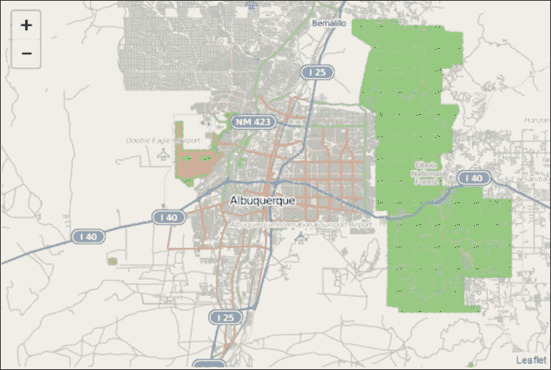

# 瓦片层提供商

现在您已经创建了您的第一张地图，您可能想知道如何更改瓦片层以使用其他内容。有几个瓦片层提供商，其中一些需要注册。本节将向您介绍另外两个选项：Thunderforest 和 Stamen。Thunderforest 提供扩展 OpenStreetMap 的瓦片，而 Stamen 提供更多艺术风格的地图瓦片。这两个服务都可以用来为您的 Leaflet 地图添加不同的底图风格。

Thunderforest 提供五种瓦片服务：

+   OpenCycleMap

+   交通

+   风景

+   户外

+   大地（仍在开发中）

要使用 Thunderforest，您需要将瓦片层指向瓦片服务器的 URL。以下代码显示了如何添加 Thunderforest 瓦片层：

```js
var layer = new L.TileLayer('http://{s}.tile.thunderforest.com/landscape/{z}/{x}/{y}.png');
map.addLayer(layer);
```

上述代码加载了风景瓦片层。要使用其他层，只需将 URL 中的`landscape`替换为`cycle`、`transport`或`outdoors`。以下截图显示了在 Leaflet 中加载的 Thunderforest 风景层：

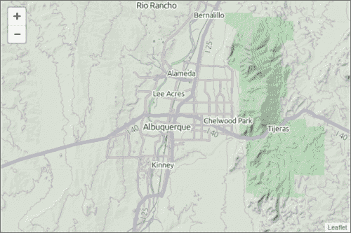

Stamen 提供六个瓦片层；然而，我们只会讨论以下三个层：

+   地形（仅在美国可用）

+   水彩

+   素描

其他三个是燃烧地图、火星和树木，以及出租车与犯罪。燃烧地图和火星层需要 WebGL，而树木和出租车与犯罪仅在旧金山可用。虽然这些地图具有明显的震撼力，但它们对我们这里的用途来说并不实用。

### 注意

了解 Stamen 瓦片层，包括燃烧地图、火星和树木，以及出租车与犯罪，请访问[`maps.stamen.com`](http://maps.stamen.com)。

Stamen 要求你遵循与 Thunderforest 相同的步骤，但还包括添加对 JavaScript 文件的引用。在你的 Leaflet 文件引用之后，添加以下引用：

```js
<script type="text/javascript" src="img/tile.stamen.js?v1.2.4"></script>
```

Stamen 使用`L.StamenTileLayer(tile set name)`而不是`L.TileLayer()`。将瓦片集名称替换为`terrain`、`watercolor`或`toner`。最后，将`addLayer()`添加到地图中，如下面的代码所示：

```js
var layer = new L.StamenTileLayer("watercolor");
map.addLayer(layer);
```

Stamen 的瓦片层并非典型的底图层；它们是地图艺术的杰作。

### 小贴士

Stamen 提供了一个在线工具来编辑地图层并将输出保存为图像。要创建自己的艺术地图图像，请访问[`mapstack.stamen.com`](http://mapstack.stamen.com)。

以下截图显示了在 Leaflet 中加载的 Stamen 水彩层。当你放大时，你会看到更多细节：

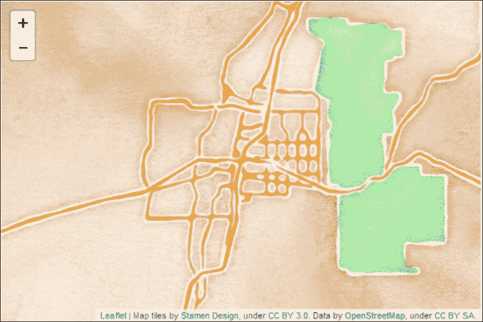

# 添加 Web 地图服务瓦片层

可以添加到 Leaflet 地图的另一种瓦片层类型是**Web 地图服务**（**WMS**）瓦片层。WMS 是通过 HTTP 在网络上请求和传输地图图像的一种方式。它是一个**开放地理空间联盟**（**OGC**）规范。

### 小贴士

关于 WMS 规范的详细技术信息，请参阅 OGC 网站：[`www.opengeospatial.org/standards/wms`](http://www.opengeospatial.org/standards/wms)。

通过了解如何添加瓦片层，并看到几个示例，你可能已经注意到示例中没有卫星图像。你将添加到地图中的第一个 WMS 层是**美国地质调查局**（**USGS**）影像拓扑。

与我们之前使用的`L.tileLayer()`函数类似，`L.tileLayer.wms()`函数接受一个 URL 和一组选项作为参数。以下代码将 WMS 层添加到你的地图中：

```js
varusgs = L.tileLayer.wms("http://basemap.nationalmap.gov/ArcGIS/services/USGSImageryTopo/MapServer/WMSServer", {
layers:'0',
format: 'image/png',
transparent: true,
attribution: "USGS"
}).addTo(map);
```

WMS 的 URL 是从 USGS 网站获取的。你可以在[`basemap.nationalmap.gov/arcgis/rest/services`](http://basemap.nationalmap.gov/arcgis/rest/services)找到其他 WMS 图层。指定的选项是图层名称、格式、透明度和属性。图层名称将在你连接到的服务的信息页面上提供。格式是图像，透明度设置为`true`。由于这个图层覆盖了全球，我们没有在其下方放置其他图层，因此透明度可以设置为`false`。在下一个示例中，你将看到将透明度设置为`true`如何使另一个图层变得可见。最后，有一个设置为 USGS 的属性。当你将属性分配给图层时，Leaflet 会在地图的右下角添加文本值。使用属性很重要，因为它类似于在文本中引用来源。如果不是你的数据，按照惯例，你应该给予应有的认可。很多时候，这也是版权的要求。由于这个图层来自 USGS，它在图层的属性属性中被认可。

### 注意

属性值可以包含超链接，如下面的代码所示：

```js
attribution: "<a href='http://basemap.nationalmap.gov/arcgis/rest/services'>USGS</a>"
```

将 WMS 图层代码插入`LeafletEssentials.html`，你现在应该有一个带有卫星影像的地图。以下截图显示了加载到 Leaflet 中的卫星影像：

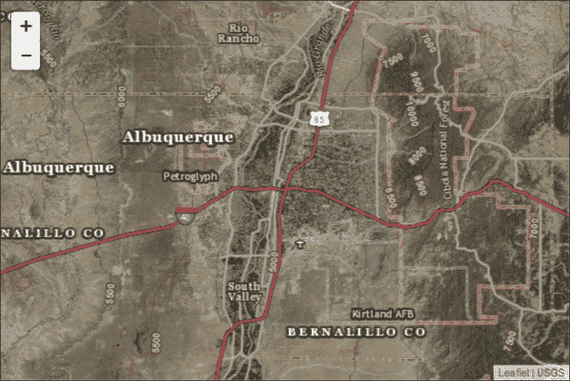

# 多个瓦片图层

在上一个示例中，你添加了一个 WMS 图层并将透明度设置为`true`。你需要这样做的原因是因为你可以在每个图层上添加多个瓦片图层，并且当透明度设置为`true`时，你将能够同时看到它们。在这个示例中，你需要在 USGS 卫星影像上添加**国家气象服务**（**NWS**）雷达瓦片 WMS。

### 注意

**国家海洋和大气管理局**（**NOAA**）提供了一系列 WMS 图层的列表；它们可以在以下链接中找到：

[`nowcoast.noaa.gov/help/mapservices.shtml?name=mapservices`](http://nowcoast.noaa.gov/help/mapservices.shtml?name=mapservices)

添加额外的 WMS 图层遵循与上一个示例相同的格式，但具有不同的 URL、图层名称和属性。在`LeafletEssentials.html`中卫星影像代码之后添加以下代码：

```js
Varnexrad = L.tileLayer.wms("http://nowcoast.noaa.gov/wms/com.esri.wms.Esrimap/obs", {
layers: 'RAS_RIDGE_NEXRAD',
format: 'image/png',
transparent: true,
attribution: "NOAA/NWS"
}).addTo(map);
```

这段代码添加了用于 NWS 雷达镶嵌的 NOAA WMS 层。请注意，URL 和图层已更改，并且归因设置为 `NOAA/NWS`。`RAS_RIDGE_NEXRAD` 层是一个网格，当值开始存在时显示值。该图层的名称可以在 NOAA 网站上找到；你不需要记住 `RAS_RIDGE_NEXRAD` 是天气雷达层。地图上有大量没有数据的部分，由于我们设置了透明度为 `true`，这些空白区域允许卫星图像变得可见。现在你的地图应该显示带有雷达镶嵌的卫星图像，如下面的截图所示：

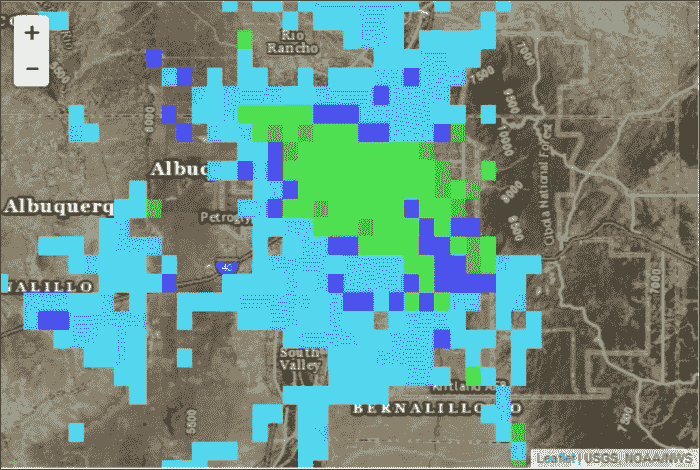

如果你将透明度设置为 `false`，你将允许图层在整个地图上绘制。没有数据区域显示为白色方块，并覆盖下方的卫星图像，如下面的截图所示：

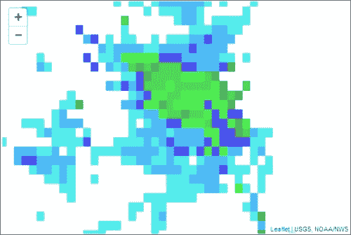

WMS 图层不仅需要作为基础图层；它们也可以用作附加数据。这在之前的示例中已经展示过，你在卫星图像上叠加了雷达。在这个例子中，你使用了卫星图像。你也可以使用来自第一张地图的 OpenStreetMap 瓦片层。再次提醒，只需将透明度设置为 `true`。WMS 图层可以像点、线和多边形一样添加，这将在以下章节中讨论。

# 向你的地图添加数据

到目前为止，你已经学会了如何向地图添加瓦片层。在之前的示例中，你在基础瓦片层上添加了一个 WMS 层。现在，你将学习如何绘制需要添加到瓦片层上的自己的图层。你可以添加到地图上的三个矢量数据的基本几何形状通常被称为点、线和多边形。

在本节中，你将学习如何将标记、折线和多边形添加到你的地图上。

## 点

到目前为止，你的地图并不那么有趣。你经常绘制地图来突出特定的地点或点。Leaflet 有一个 `Point` 类；然而，它并不是用来在地图上简单地添加一个带有图标来指定地点的点。在 Leaflet 中，点是通过 `Marker` 类添加到地图上的。至少，`Marker` 类需要纬度和经度，如下面的代码所示：

```js
Var myMarker = L.marker([35.10418, -106.62987]).addTo(map);
```

### 注意

你可以通过简单地调用 `L.marker([lat,long]).addTo(map);` 来创建一个标记，但将标记分配给一个变量将允许你通过名称与之交互。如果你没有给标记命名，你该如何删除一个特定的标记？

在前面的代码中，你在 `[35.10418, -106.62987]` 点创建了一个标记，然后，就像瓦片层一样，你使用了 `addTo(map)` 函数。这就在指定的纬度和经度上创建了一个标记图标。以下截图显示了地图上的标记：

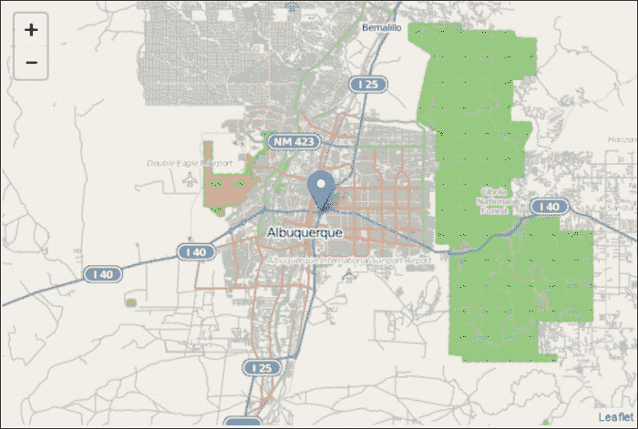

上述示例是一个简化的、几乎无用的标记。`Marker`类有选项、事件和方法，你可以调用它们来使它们更具交互性和实用性。你将在本章后面学习关于方法——特别是`bindPopup()`方法——和事件的内容。

创建标记时，你可以指定 10 个选项，如下所示：

+   `icon`

+   `clickable`

+   `draggable`

+   `keyboard`

+   `title`

+   `alt`

+   `zIndexOffset`

+   `opacity`

+   `riseOnHover`

+   `riseOffset`

选项`clickable`、`draggable`、`keyboard`、`zIndexOffset`、`opacity`、`riseOnHover`和`riseOffset`都设置为默认值。在第四章“创建自定义标记”中，你将详细了解`icon`选项。你应该设置的选项是`title`和`alt`。`title`选项是在你用鼠标悬停在点上时显示的工具提示文本，而`alt`选项是屏幕阅读器用于无障碍阅读的替代文本。这些选项在以下代码中使用：

```js
varmyMarker = L.marker([35.10418, -106.62987],
{title:"MyPoint",alt:"The Big I",draggable:true}).addTo(map);
```

代码通过添加标题和 alt 文本以及使标记可拖动来扩展了原始标记示例。你将在本章的最后部分使用`draggable`选项与一个事件。选项设置与创建我们的地图实例时相同；使用花括号来分组选项，并用逗号分隔每个选项。这就是所有对象设置选项的方式。

## 折线

你将首先学习创建的是一条线。在 Leaflet 中，你将使用`Polyline`类。折线可以表示单个线段或由多个段组成的线。折线和多边形扩展了`path`类。你不需要直接调用`path`，但你有权访问其方法、属性和事件。要绘制折线，你需要提供至少一个经纬度对。折线的选项默认设置，所以除非你想覆盖默认值，否则你不需要指定任何值。以下代码显示了这一点：

```js
var polyline = L.polyline([[35.10418, -106.62987],[35.19738, -106.875]], {color: 'red',weight:8}).addTo(map);
```

在这个示例中，折线是`红色`的，宽度为`8`。`weight`选项默认为`5`。如果你想线条更粗，增加数字。如果你想线条更细，减少数字。要向线条添加更多段，只需像以下代码所示添加额外的纬度和经度值：

```js
var polyline = L.polyline([[35.10418, -106.62987],[35.19738, -106.875],[35.07946, -106.80634]], {color: 'red',weight:8}).addTo(map);
```

### 备注

你需要首先提供一个纬度和经度对，因为一条线至少由两个点组成。之后，你可以声明额外的纬度和经度来扩展你的线。

以下截图显示了添加到地图上的折线：

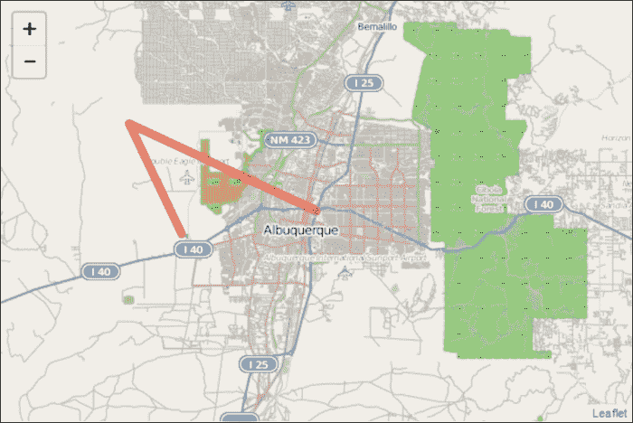

## 多边形

多边形是一个闭合的折线。多边形通常根据边的数量进行分类，如下所示：

+   三角形（3）

+   六边形（6）

+   八边形（8）

Leaflet 有一个用于绘制两个常见多边形的类：圆和矩形。绘制多边形时，你将指定至少三个坐标。三角形是可以绘制的最简单的多边形。这就是为什么你需要提供至少三个点。你不需要在列表末尾指定起始点。Leaflet 会自动为你关闭多边形。要绘制多边形，只需复制具有三个点的折线代码，并将类更改为 `L.polygon()`，如下面的代码所示：

```js
var polygon = L.polygon([[35.10418, -106.62987],[35.19738, -106.875],[35.07946, -106.80634]], {color: 'red',weight:8}).addTo(map);
```

由于 Leaflet 自动关闭多边形，我们的三点折线可以变成多边形。由于 `polyline` 和 `polygon` 继承自 `path`，选项 `color` 和 `weight` 适用于两者。你会注意到 `color` 和 `weight` 指的是多边形的轮廓。在绘制多边形时，你会发现 `fillColor` 和 `fillOpacity` 两个选项很有用：

```js
var polygon = L.polygon([[35.10418, -106.62987],[35.19738, -106.875],[35.07946, -106.80634]], {color: 'red',weight:8,fillColor:'blue',fillOpacity:1}).addTo(map);
```

上述代码绘制了一个边宽为 `8` 的红色三角形。`fillColor` 和 `fillOpacity` 的附加选项设置为 `blue` 和 `1`。如果没有选择 `fillColor` 选项，多边形的填充颜色将设置为默认值。只有当你想要与轮廓不同的填充颜色时，才需要使用 `fillColor`。

### 注意

不透明度是一个介于 `0` 和 `1` 之间的值，其中 `0` 是 100% 不透明度，`1` 是没有不透明度（实心）。

以下截图显示了添加到地图上的红色三角形，其填充颜色为蓝色：

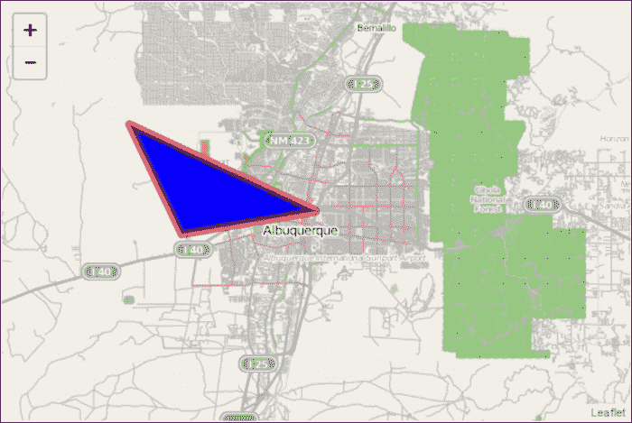

# 矩形和圆

圆和矩形是 Leaflet 中具有内置类的常见多边形。你也可以通过指定所有线段来手动绘制它们，但这将是一条困难的路。

## 矩形

要创建一个矩形，你需要一个 `L.rectangle()` 类的实例，其中包含上左角和下右角的经纬度对作为参数。该类扩展了 `L.polygon()`，因此你可以访问相同的选项、方法和事件：

```js
var myRectangle = L.rectangle([[35.19738, -106.875],[35.10418, -106.62987]], {color: "red", weight: 8,fillColor:"blue"}).addTo(map);
```

上述代码使用了折线和三角形的第一个两个点，但顺序相反（上左和下右）。选项与多边形相同，但去除了不透明度。以下截图显示了添加到地图上的矩形：

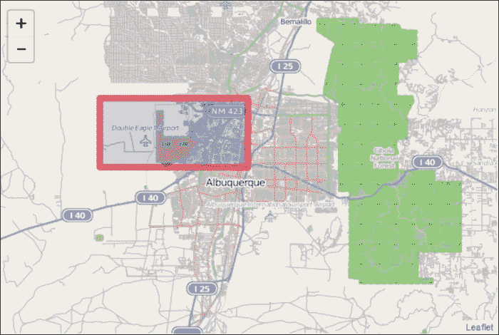

## 圆

要创建一个圆，你需要一个 `L.circle()` 实例，其中包含中心点和一个半径（以米为单位）作为参数。你可以指定与你在矩形中使用的相同选项，因为 `circle` 类扩展了 `path` 类。这在上面的代码中显示：

```js
L.circle([35.10418, -106.62987], 8046.72,{color: "red", weight: 8,fillColor:"blue"}).addTo(map);
```

上述代码指定了中心点、半径为 5 英里（`8046.72` 米），以及与上一个示例中矩形相同的选项。以下截图显示了添加到地图上的圆：

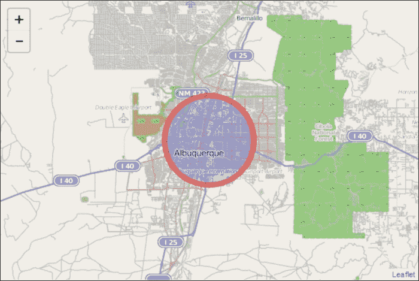

# 多多折线和多多多边形

在之前的示例中，您将每条折线和多边形创建为其自己的图层。当您开始创建真实数据时，您会发现您想在单个图层上创建多个折线或多边形。首先，这更符合现实，同时也使得将类似特征作为一个单一实体处理成为可能。如果您想在单个地图上绘制公园和自行车道，将公园作为 MultiPolygon 添加，将自行车道作为 MultiPolyline 添加是有意义的。然后，您可以向用户提供选项，选择开启或关闭任一图层。

### 小贴士

MultiPolyline 和多边形的括号可能会让人困惑。您需要括号来包含 MultiPolyline 或多边形，每个折线或多边形的括号，以及每个经纬度的括号。

## 多折线

创建 MultiPolyline 的功能与单个折线相同，只是您传递了多个经纬度；每个多边形一个集合。以下代码显示了这一点：

```js
var multipolyline = L.multiPolyline([[[35.10418, -106.62987],[35.19738, -106.875],[35.07946, -106.80634]],[[35.11654, -106.58318],[35.13142, -106.48876],[35.07384, -106.52412]]],{color: 'red',weight:8}).addTo(map);
```

在上述代码中，第一条折线与折线示例相同。添加了第二条折线，其选项也与第一条折线示例相同。以下截图显示了添加到地图上的 MultiPolyline：

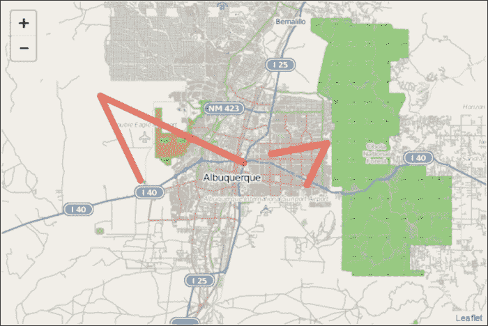

## 多边形

创建 MultiPolygon 与创建 MultiPolyline 相同。由于 Leaflet 会自动关闭折线，只要我们的折线有三个或更多点，我们就可以使用它们。以下代码显示了这一点：

```js
var multipolygon = L.multiPolygon([[[35.10418, -106.62987],[35.19738, -106.875],[35.07946, -106.80634]],[[35.11654, -106.58318],[35.13142, -106.48876],[35.07384, -106.52412]]],{color: 'red',weight:8}).addTo(map).bindPopup("We are the same layer");
```

在上述代码中，您可以看到使用的参数与之前 MultiPolyline 示例中使用的参数相同。当我们创建 MultiPolygon 或多折线时，选项将应用于集合中的每个多边形或折线。这意味着它们都必须具有相同的颜色、权重、不透明度等。在上述代码中有一个新方法：`.bindPopup("我们属于同一图层")`。MultiPolygon 和多折线也共享相同的弹出窗口。弹出窗口将在本章后面讨论。此外，请注意在行 `L.multiPolygon().addTo().bindPopup()` 中的方法链的使用。以下截图显示了添加到地图上的 MultiPolygon：

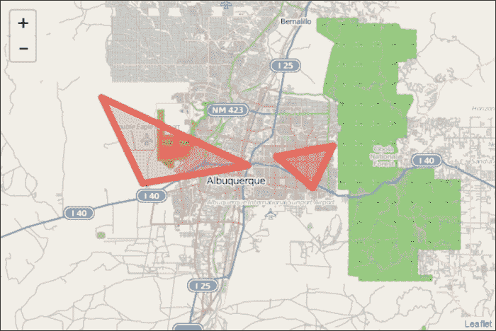

# 图层组

多折线和多边形图层允许您组合多个折线和多边形。如果您想创建不同类型的组图层，例如带有圆圈的标记图层，您可以使用图层组或要素组。

## 图层组

图层组允许您将多个不同类型的图层添加到地图上，并将它们作为一个单一图层进行管理。要使用图层组，您需要定义几个图层：

```js
var marker=L.marker([35.10418, -106.62987]).bindPopup("I am a Marker");
var marker2=L.marker([35.02381, -106.63811]).bindPopup("I am Marker 2");
var polyline=L.polyline([[35.10418, -106.62987],[35.19738, -106.875],[35.07946, -106.80634]], {color: 'red',weight:8}).bindPopup("I am a Polyline");
```

上述代码创建了两个标记和一个折线。请注意，在创建图层后，您将不会像在之前的示例中那样使用 `addTo(map)` 函数。您将让图层组来处理将图层添加到地图上的操作。图层组需要一个包含图层的集合作为参数：

```js
var myLayerGroup=L.layerGroup([marker, polyline]).addTo(map); 
```

在之前的代码中，创建了一个`L.layerGroup()`的实例作为`myLayerGroup`。作为参数传递的图层是`marker`和`polyline`。最后，将图层组添加到地图中。早期的代码显示了三个图层，但只有两个被添加到图层组中。要在创建时不需要作为参数传递图层，您可以使用图层组的`addLayer()`方法。此方法接受一个图层作为参数，如下面的代码所示：

```js
myLayerGroup.addLayer(marker2);
```

现在，所有三个图层都已添加到图层组中，并在地图上显示。以下截图显示了添加到地图中的图层组：

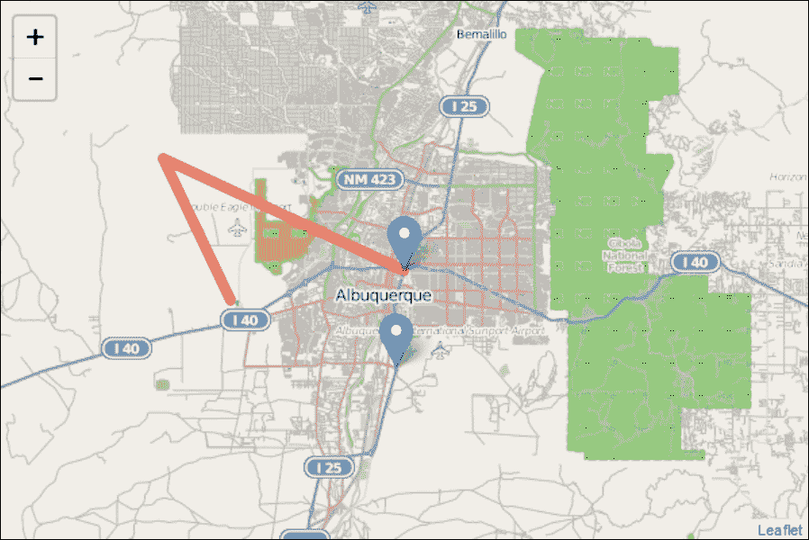

如果您想从图层组中移除一个图层，您可以使用`removeLayer()`方法并传递图层名称作为参数：

```js
myLayerGroup.removeLayer(marker);
```

如果您从组中移除一个图层，它将不再在地图上显示，因为对图层组而不是单个图层调用了`addTo()`函数。如果您想显示图层但不再希望它成为图层组的一部分，可以使用前面代码中显示的`removeLayer()`函数，然后按照早期示例将其添加到地图中。以下代码显示了这一点：

```js
marker.addTo(map);
```

所有样式选项和弹出窗口都需要在创建图层时分配。您不能将样式或弹出窗口分配给整个图层组。这就是特征组可以发挥作用的地方。

## 特征组

特征组类似于图层组，但它扩展了它以允许鼠标事件并包括`bindPopup()`方法。特征组的构造函数与图层组相同：只需传递一组图层作为参数。以下代码显示了一个特征组的示例：

```js
VarmyfeatureGroup=L.featureGroup([marker, marker2, polyline])
     .addTo(map).setStyle({color:'purple',opacity:.5})
     .bindPopup("We have the same popup because we are a group");
```

在前面的代码中，添加的图层与在图层组中添加的相同三个图层。由于特征组扩展了图层组，您可以将样式和弹出窗口一次性分配给所有图层。以下截图显示了添加到地图中的特征组：

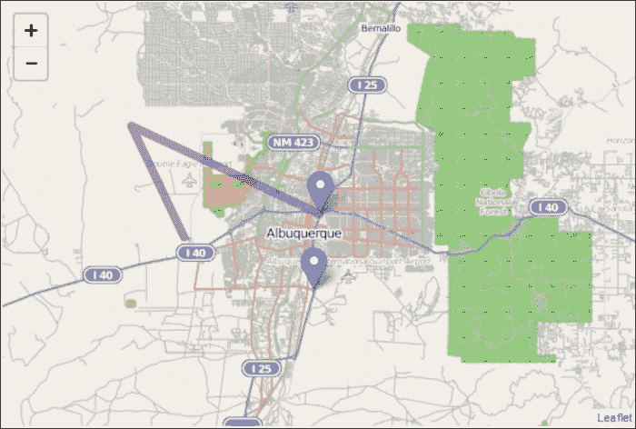

在上一个示例中创建折线时，您将其颜色设置为`红色`。注意现在，由于您通过将颜色设置为`紫色`向特征组传递了样式信息，折线从特征组中获取了信息并丢弃了其原始设置。如果您从特征组中移除折线，它也将从地图中移除。如果您尝试使用`addTo()`方法将折线添加到地图中，就像之前的示例一样，它仍然会是紫色并具有新的弹出窗口。即使您向特征组传递了样式信息，标记仍然是蓝色。`setStyle()`方法仅适用于具有`setStyle()`方法的特征组中的图层。由于折线扩展了`path`类，它具有`setStyle()`方法。标记没有`setStyle()`方法，因此其颜色没有改变。

# 弹出窗口

最后几个示例介绍了弹出窗口。弹出窗口提供了一种使你的图层交互或向用户提供信息的方式。将弹出窗口添加到标记、折线或多边形的最简单方法是使用`bindPopup()`方法。此方法将弹出窗口的内容作为参数。使用我们之前创建的`marker`变量，我们可以用以下代码将弹出窗口绑定到它：

```js
marker.bindPopup("I am a marker");
```

`bindPopup()`方法允许你输入 HTML 作为内容。这在上面的代码中显示：

```js
marker.bindPopup("<h1>My Marker</h1><p>This is information about the marker</p><ul><li>Info 1</li><li>Info 2</li><li>Info 3</li></ul>")
```

当你需要添加大量详细信息时，使用 HTML 在弹出窗口中非常有用。它允许在弹出窗口中使用图片和链接。以下截图显示了添加到地图上的标记的 HTML 格式弹出窗口：

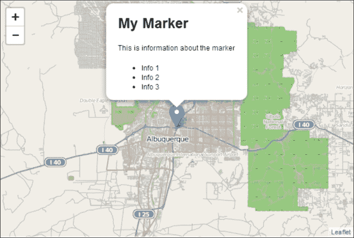

你还可以创建`popup`类的实例，然后将其分配给多个对象：

```js
var mypopup = L.popup({keepInView:true,closeButton:false})
.setContent("<h1>My Marker</h1><p>This is information about the marker</p><ul><li>Info 1</li><li>Info 2</li><li>Info 3</li></ul>");
marker.bindPopup(mypopup);
marker2.bindPopup(mypopup);
```

在前面的代码中，你创建了一个`L.popup()`类的实例，并将其分配给变量`mypopup`。然后，你可以使用`mypopup`作为参数，在`marker`和`marker2`上调用`bindPopup()`方法。这两个标记将具有相同的弹出窗口内容和选项。

在本章的最后部分，你将学习如何创建一个函数，该函数允许你创建带有选项的弹出窗口，并将内容作为参数传递。

# 移动制图

你迄今为止制作的地图已经在桌面端进行了测试。JavaScript 制图的一个好处是，移动设备可以在标准网页浏览器中运行代码，无需任何外部应用程序或插件。Leaflet 可以在 iPhone、iPad 和 Android 等移动设备上运行。任何带有 Leaflet 地图的网页在移动设备上都可以正常工作，无需任何更改；然而，你可能希望为移动设备定制地图，使其看起来像是专门为移动设备构建的。

最后，`L.map()`类有一个`locate()`方法，它使用 W3C 地理位置 API。地理位置 API 允许你通过 IP 地址、无线网络信息或设备上的 GPS 找到并跟踪用户的位置。你不需要知道如何使用 API；当你调用`locate()`时，Leaflet 会处理所有这些。

## HTML 和 CSS

将你的 Leaflet 地图转换为移动版本的第一步是确保它在移动设备上正确显示。当你用手机打开一个网站时，你总能判断开发者是否花了时间使其移动设备可访问。你有多少次在网站上看到页面加载，但你只能看到左上角，你必须放大缩小才能阅读页面。这不是一个好的用户体验。在`LeafletEssentials.html`的`<head>`标签中，在 CSS 文件的`<link>`标签之后，添加以下代码：

```js
<style>

body{
padding: 0;
margin: 0;
    }
html, body, #map {
height: 100%;
        }
</style>
```

在前面的 CSS 代码中，您将`padding`和`margin`值设置为`0`。将网页想象成一个盒模型，其中每个元素都存在于自己的盒子中。每个盒子都有一个外边距，这是它与其他盒子之间的空间，还有一个内边距，这是盒子内内容与盒子边框之间的空间（即使边框没有实际绘制）。将`padding`和`margin`值设置为`0`使`<body>`内容适合页面大小。最后，您将`<html>`、`<body>`和`<div id = 'map'>`元素的`height`值设置为`100%`。

### 注意

在 CSS 中，`#`是 ID 选择器。在代码中，`#map`告诉我们选择具有`id = 'map'`行的元素。在这种情况下，它是我们包含地图的`<div>`元素。

下图显示了网页设置的概览：

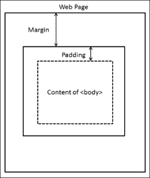

最后一步是在`<head>`部分和`</title>`元素之后添加以下代码：

```js
<meta name="viewport" content="width=device-width, initial-scale=1.0, maximum-scale=1.0, user-scalable=no">
```

上述代码修改了网站通过的可视区域。此代码将可视区域设置为设备宽度，并以 1:1 的比例渲染。最后，它禁用了调整网页大小的功能。然而，这并不会影响您在地图上缩放的能力。

## 使用 JavaScript 创建移动地图

现在您已经配置了网页以在移动设备上正确渲染，是时候添加将获取用户当前位置的 JavaScript 代码了。为此，执行以下步骤：

1.  创建地图实例，但不要使用`setView`：

    ```js
    var map = L.map('map');
    ```

1.  添加瓦片层：

    ```js
    L.tileLayer('http://{s}.tile.osm.org/{z}/{x}/{y}.png').addTo(map);
    ```

1.  定义一个函数以成功找到位置：

    ```js
    Function foundLocation(e){}
    ```

1.  定义一个函数以失败地找到位置：

    ```js
    functionnotFoundLocation(e){}

    ```

1.  为`foundLocation()`和`notFoundLocation()`添加事件监听器：

    ```js
    map.on('locationfound', foundLocation);
    map.on('locationerror', notFoundLocation);
    ```

1.  使用`locate()`设置地图视图：

    ```js
    map.locate({setView: true, maxZoom:10});
    ```

代码创建地图并添加瓦片层。然后跳过函数和事件监听器，并尝试定位用户。如果它能够定位用户，它将运行`foundLocation()`中的代码并将视图设置为用户的纬度和经度。如果不能定位用户，它将执行`notFoundLocation()`中的代码并显示缩放后的世界地图。

为了使此示例更易于使用，将以下代码添加到`notFoundLocation()`中：

```js
function notFoundLocation(e){
alert("Unable to find your location. You may need to enable Geolocation.");}
```

`alert()`函数在浏览器中创建一个弹出窗口，显示传递给它的消息。任何浏览器无法定位用户时，他们都会看到以下消息。虽然一些设备没有定位功能，但有时需要在它们的设置中允许它们：

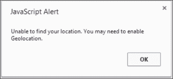

现在，将以下代码添加到`foundLocation()`中：

```js
function foundLocation(e){
varmydate = new Date(e.timestamp);
L.marker(e.latlng).addTo(map).bindPopup(mydate.toString());
     }
```

当用户的位置被找到时，上述代码将执行。`foundLocation(e)` 中的 `e` 是一个事件对象。它在事件被触发并传递给负责处理该特定事件类型的函数时发送。它包含您想要了解的事件信息。在上述代码中，我们首先获取的是 `timestamp` 对象。如果您要在弹出窗口中显示时间戳，您会得到一串数字：**1400094289048**。时间戳是自 1970 年 1 月 1 日 00:00:00 UTC 以来经过的毫秒数。如果您创建一个 `date` 类的实例并将其传递给 `timestamp` 对象，您将收到一个可读的日期。接下来，代码创建一个标记。纬度和经度存储在 `e.latlng` 中。然后您将标记添加到地图上，并绑定一个弹出窗口。弹出窗口需要一个字符串作为参数，因此您可以使用 `date` 类的 `toString()` 方法，或者使用 `String(mydate)` 将其转换为字符串。以下截图显示了用户点击时的日期和时间弹出窗口：

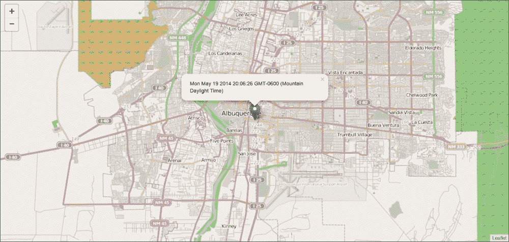

# 事件和事件处理程序

到目前为止，您已经创建了显示数据的地图，并添加了一个在用户点击标记时显示的弹出窗口。现在，您将学习如何处理其他事件，并将这些事件分配给事件处理函数以处理它们，并作为结果执行某些操作。

您首先将学习如何处理 `map` 事件。`map` 类中有 34 个事件可以订阅。本例将重点介绍 `click` 事件。要订阅事件，您使用事件方法 `.on()`；因此，对于 `map` 事件，您使用 `map.on()` 方法并传递事件和处理函数作为参数。这在上面的代码中显示：

```js
map.on('click', function(){alert("You clicked the map");});
```

代码指示 Leaflet 在用户点击地图时发送一个包含文本 **您点击了地图** 的警告弹出窗口。在移动示例中，您创建了一个具有命名函数的监听器，该函数执行 `foundLocation()`。在上述代码中，函数被作为参数放入。这被称为匿名函数。该函数没有名称，因此只能在用户点击地图时调用。

记得移动示例中的 `e` 吗？如果您将 `e` 传递给函数，您就可以获取用户点击的位置的 `longlat` 值，如下所示：

```js
map.on('click',function(e){
var coord=e.latlng.toString().split(',');
var lat=coord[0].split('(');
var long=coord[1].split(')');
alert("you clicked the map at LAT: "+ lat[1]+" and LONG:"+long[0])
});
```

上述代码以更易读的方式进行了排版，但您也可以将其全部放在一行上。该代码显示用户在地图上点击的位置的经纬度。第二行将变量 `coord` 赋值为 `e.latlng` 的值。接下来的两行从值中提取经纬度，以便您可以清晰地显示它们。

您可以通过添加标记来扩展这个示例，只需将代码替换为以下内容：

```js
L.marker(e.latlng).addTo(map);
```

上述代码与移动示例中的代码相同。不同之处在于，在移动示例中，它仅在 `locate()` 成功时执行。在这个例子中，它会在用户每次点击地图时执行。

在标记部分，你创建了一个具有属性 `draggable:true` 的标记。标记有三个与拖动相关的事件：`dragstart`、`drag` 和 `dragend`。执行以下步骤以在 `dragend` 时在弹出窗口中返回标记的经纬度：

1.  创建标记并将可拖动属性设置为 `true`：

    ```js
    varmyMarker = L.marker([35.10418, -106.62987],{title:"MyPoint",alt:"The Big I",draggable:true}).addTo(map);
    ```

1.  编写一个函数将弹出窗口绑定到标记并调用 `getLatLong()` 方法：

    ```js
    myMarker.bindPopup("I have been moved to: "+String(myMarker.getLatLng()));
    ```

1.  订阅事件：

    ```js
    myMarker.on('dragend',whereAmI);
    ```

打开地图并点击标记。按住鼠标左键并将标记拖动到地图上的新位置。释放鼠标左键并再次点击标记以触发弹出窗口。弹出窗口将显示标记的新纬度和经度。

## 自定义函数

你订阅了一个事件并用函数处理了它。到目前为止，你只传递了 `e` 作为参数。在 JavaScript 中，你可以向函数发送任何你想要的内容。此外，函数可以在你的代码的任何地方调用。你不必仅在响应事件时调用它们。在这个简短的例子中，你将创建一个返回弹出窗口的函数，该函数在调用时被触发，而不是由事件触发。

首先，创建一个标记并将其绑定到弹出窗口。对于弹出窗口的内容，输入 `createPopup(Text as a parameter)`。按照以下代码将标记添加到地图中：

```js
var marker1 = L.marker([35.10418, -106.62987]).addTo(map).bindPopup(createPopup("Text as a parameter"));
```

创建第二个标记并将弹出窗口的内容设置为 `createPopup (Different text as a parameter)`：

```js
var marker2 = L.marker([35, -106]).addTo(map).bindPopup(createPopup("Different text as a parameter"));
```

在之前的示例中，你通过传递文本或弹出实例来创建弹出窗口。在这个例子中，你使用字符串作为参数调用函数 `createPopup()`，如下所示：

```js
functioncreatePopup(x){
return L.popup({keepInView:true,closeButton:false}).setContent(x);function createPopup(x){
returnL.popup({keepInView:true,closeButton:false}).setContent(x);
}
```

该函数接受一个名为 `x` 的参数。在标记中，当你调用该函数时，你传递一个字符串。这个字符串被发送到函数并存储为 `x`。当弹出窗口创建时，`setContent()` 方法被赋予 `x` 的值而不是硬编码的字符串。这个函数在你有很多弹出窗口选项并且希望它们都相同的情况下很有用。它限制了你需要重复相同代码的次数。只需将弹出窗口的文本传递给函数，你就可以得到一个新的具有标准化格式选项的弹出窗口。以下截图显示了由自定义函数生成的两个弹出窗口：

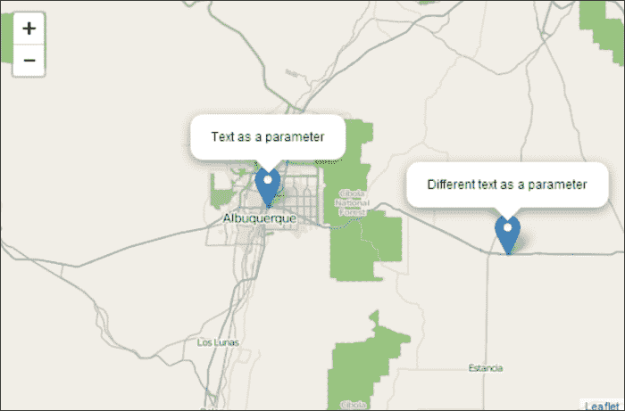

# 摘要

本章涵盖了创建 Leaflet 地图所需的大部分主要主题。你学习了如何添加来自多个提供者的瓦片图层，包括卫星影像。你现在可以向地图中添加点、线和多边形，以及多边形的集合。你可以将不同类型的图层分组到图层或要素集合中。本章还涵盖了对象的样式化和添加弹出窗口。你学习了如何通过响应用件与用户交互，并创建了自定义函数，让你可以通过编写更少的代码来实现更多的编码。

在下一章中，你将学习如何将 GeoJSON 数据添加到你的地图中。
