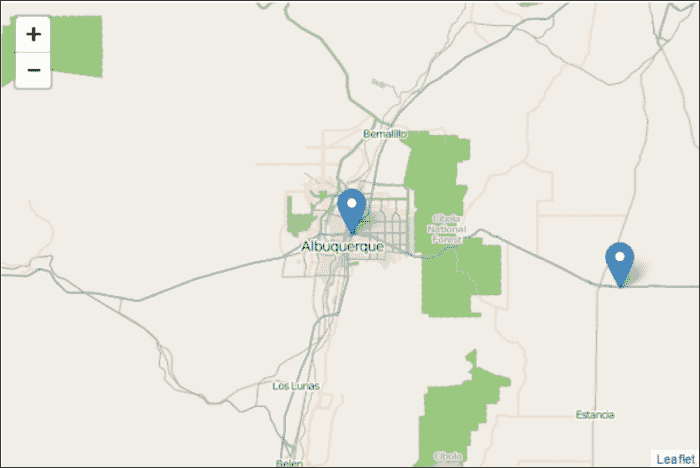
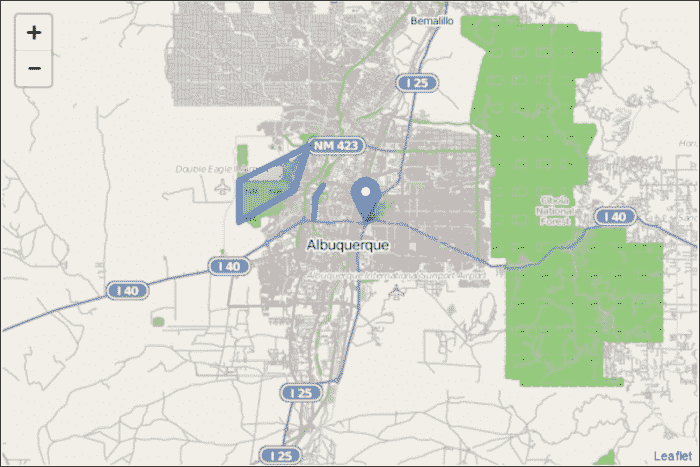
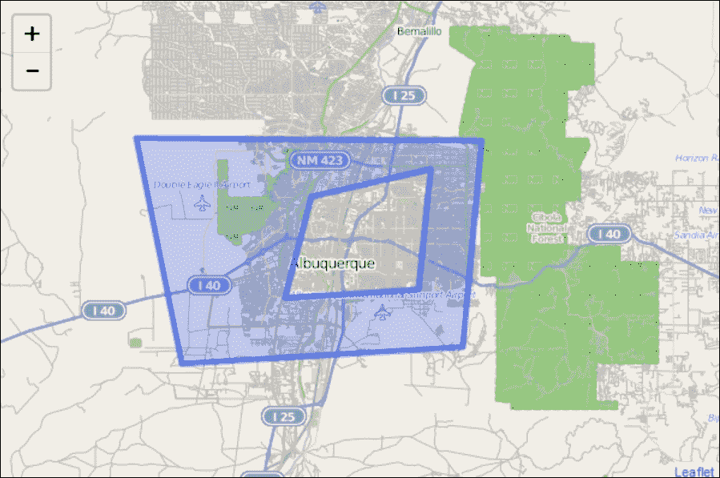
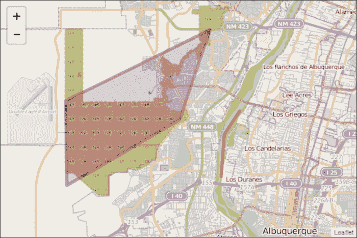
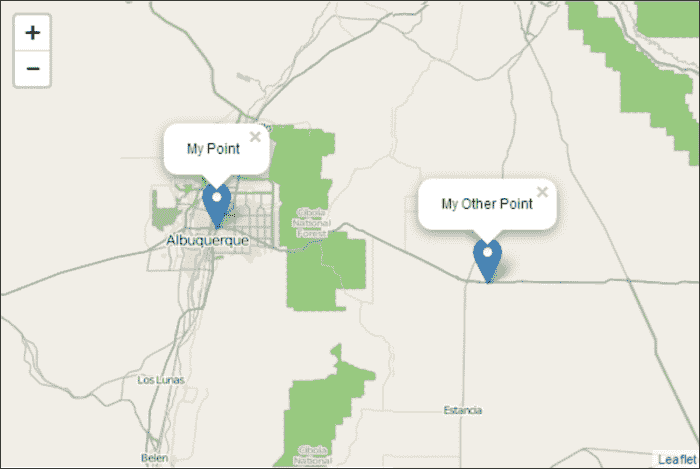
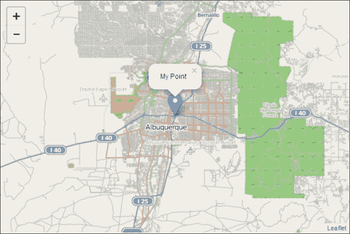

# 第二章. 地图 GeoJSON 数据

在 第一章 *使用 Leaflet 创建地图* 中，所有几何元素——点、线和多边形——都是逐个创建的。您学习了如何使用图层和要素组以及多折线和多边形类创建要素组。在本章中，您将学习如何将 GeoJSON 数据添加到您的地图中。数据将包含多个几何体，并与其相关的描述性数据。

在本章中，我们将涵盖以下主题：

+   什么是 GeoJSON？

+   如何将其添加到您的地图中

+   如何样式化它

+   遍历要素

+   如何从外部源调用 GeoJSON

# 理解 GeoJSON 的根源

在 GeoJSON 之前，有 **JavaScript 对象表示法**（**JSON**），而在 JSON 之前，有 **可扩展标记语言**（**XML**）。随着计算机开始通过互联网相互通信，从服务向客户端发送数据的能力变得更加重要。XML、JSON 和 GeoJSON 是表示和传输数据的格式。XML 是一种尝试创建人类可读的格式，可以存储和发送数据。XML 使用开闭标签来分隔数据。JSON 是 XML 的替代品，更接近 JavaScript 中创建对象的方式。JSON 使用键值对，通常比 XML 小。

# 探索 GeoJSON

GeoJSON 是一种编码几何体的 JSON 格式。GeoJSON 可以编码点、线字符串和多边形。它还允许多部分几何体。您可以编码多点、多线字符串和多边形。这些应该听起来很熟悉，因为它们与您在 第一章 *使用 Leaflet 创建地图* 中学到的绘制几何体非常相似。以下 GeoJSON 代码显示了特征集合中的两个点：

```js
{"type":"FeatureCollection",
  "features":[
      {"type":"Feature",
          "geometry":{
              "type":"Point",
              "coordinates":[-106.62987,35.10418]
                  },
          "properties":{
              "name":"My Point",
              "title":"A point at the Big I"
                  }
      },      {"type":"Feature",
          "geometry":{
              "type":"Point",
              "coordinates":[-106,35]
                  },
          "properties":{
              "name":"MyOther Point",
              "title":"A point near Moriarty and I40"
              }
      }
]
}
```

上述代码中的要素集合不是一个几何体，而是一组与 第一章 中描述的要素层类似的几何体。

要查看完整的 GeoJSON 规范，您可以访问 [`geojson.org/geojson-spec.html`](http://geojson.org/geojson-spec.html)。

### 注意

要查看可以帮助您编写和检查 JSON 的工具，请参阅 [`www.jsoneditoronline.org/`](http://www.jsoneditoronline.org/) 或 [`geojsonlint.com/`](http://geojsonlint.com/)。

# Leaflet.js 中的 GeoJSON

GeoJSON 只是您要添加到地图中的另一种数据格式。它可以作为一个硬编码的变量添加。Leaflet.js 几何体——标记、折线和多边形——可以转换为 GeoJSON。您可以样式化数据，为每个要素应用选项，甚至过滤数据。下一节将涵盖这些主题，从将 GeoJSON 作为硬编码变量添加开始。

## GeoJSON 作为变量

将 GeoJSON 添加到你的地图上最简单的方法是将数据硬编码到一个变量中。在 Leaflet.js 中，你将首先创建一个将包含 GeoJSON 的变量。在以下代码中，由两个点组成的 GeoJSON 数据被分配给 `geojson` 变量：

```js
vargeojson = [{
"type": "Feature",
"geometry": {
"type": "Point",
"coordinates": [-106.62987,35.10418]
          },
  "properties": {
  "name": "My Point",
 "title": "A point at the Big I"
        }
},{
"type": "Feature",
  "geometry": {
      "type": "Point",
       "coordinates": [-106, 35]
               },
"properties": {
      "name": "My Other Point",
       "title": "A point near Moriarty and I40"
                 }
}];
```

一旦你有了前述代码所示的 GeoJSON 数据变量，将其添加到地图上与添加你迄今为止学到的任何其他几何形状没有区别。以下代码将 GeoJSON 添加到地图上：

```js
vargeoJsonLayer = L.geoJson(geojson).addTo(map);
```

前述代码创建了一个 `geoJsonLayer` 变量。这个变量是 `L.geoJson()` 类的一个实例。它接受一个包含 GeoJSON 数据的变量作为参数，然后你将 `.addTo(map)` 链接到末尾。

### 注意

对象是在 第一章 *使用 Leaflet 创建地图* 中使用 `(纬度，经度)` 创建的；然而，请注意，在 GeoJSON 中，格式是 `(经度，纬度)`。

此代码的结果将是一个包含两个标记的地图，如下截图所示：



## GeoJSON 中的多个几何形状

在前述示例中，GeoJSON 仅包含点。虽然 GeoJSON 文件通常只包含一个地理要素，但这不是必需的。Leaflet.js 可以在单个 GeoJSON 文件中加载包含多个几何形状的 GeoJSON。在本例中，你将学习如何创建并添加包含点、线字符串和多边形的 GeoJSON 文件。以下 GeoJSON 代码包含三种不同的几何形状：

```js
vargeojson = [{
"type": "Feature",
"geometry": {
"type": "Point",
"coordinates": [-106.62987, 35.10418]
          },
  "properties": {
  "name": "My Point",
         "title": "A point at the Big I"
        }
},{
"type": "Feature",
  "geometry": {
      "type": "LineString",
        "coordinates":[[-106.67999, 35.14097],
                        [-106.68892, 35.12974],
  [-106.69064, 35.1098]]
               },
"properties": {
      "name": "My LineString",
      "title": "A line along the Rio Grande"
                  }
},{
"type": "Feature",
  "geometry": {
      "type": "Polygon",
       "coordinates":[[[-106.78059, 35.14574],
           [-106.7799, 35.10559],
           [-106.71467, 35.13704],
           [-106.69716, 35.17942],
           [-106.78059, 35.14574]]]
               },
"properties": {
      "name": "My Polygon",
      "title": "Balloon Fiesta Park"
                  }
 }];
```

在单个 GeoJSON 文件中创建不同的几何形状，你只需指定类型并包含适当的坐标，如前述代码所示。对于线字符串，你必须包含至少两个点。在 Leaflet.js 中，多边形不需要你通过在列表末尾包含起始坐标来关闭它们。GeoJSON 确实要求你关闭多边形。前述代码中的多边形以 `[-106.78059, 35.14574]` 开始和结束。前述代码将生成以下截图所示的地图：



### 带孔的多边形

GeoJSON 中的多边形可以是甜甜圈，也就是说，你可以从另一个多边形的中间切出一个多边形。以下代码展示了具有两个多边形（外多边形和内多边形）的多边形特征：

```js
vargeojson = [{
"type": "Feature",
  "geometry": {
      "type": "Polygon",
       "coordinates":[
           [[-106.875, 35.20074],
            [-106.82281, 34.9895],
            [-106.50146, 35.00525],
            [-106.47949, 35.1985],
            [-106.875, 35.20074]],
  [[-106.6745, 35.1463],
 [-106.70403, 35.05192],
 [-106.55296, 35.05979],
 [-106.53854, 35.17212],
 [-106.6745, 35.1463]]
   ]
               },
"properties": {
      "name": "My Polygon with a hole",
       "title": "Donut"
                  }
            }];
```

在前述代码中，第一组点创建了一个四边形。第二组点——下一级缩进——在第一个多边形中间创建了一个四边形。结果如下截图所示：



前述截图中的多边形中间是空心的。如果你向多边形添加一个弹出窗口，它只有在点击蓝色环时才会打开。

## 从 Leaflet.js 对象生成的 GeoJSON

你在第一章，*使用 Leaflet 创建地图*中学习到的每个几何形状都有一个`toGeoJson()`方法。此方法将几何形状转换为可以添加到地图的 GeoJSON 对象。以下代码展示了如何将标记转换为 GeoJSON 图层：

```js
varmyMarker=L.marker([35.10418, -106.62987]);
varmarkerAsGeoJSON = myMarker.toGeoJSON();
vargeoJsonLayer = L.geoJson(markerAsGeoJSON).addTo(map);
```

之前的代码创建了一个标记，正如你在第一章，*使用 Leaflet 创建地图*中“向地图添加数据”部分所做的那样。其次，它调用了`.toGeoJSON()`方法，该方法返回一个 GeoJSON 对象并将其存储为`markerAsGeoJSON`。最后，`markerAsGeoJSON`被添加到地图中作为 GeoJSON。

## 样式化 GeoJSON 图层

GeoJSON 图层有一个`style`选项和一个`setStyle()`方法。使用`style`选项，你可以指定一个将用于样式化图层的函数。以下代码展示了如何使用`style`选项样式化 GeoJSON 图层：

```js
functionstyleFunction(feature){
switch (feature.properties.type) {
case 'LineString': return {color: "red"}; break;
case 'Polygon':   return {color: "purple"}; break;
        }
}
vargeoJsonLayer = L.geoJson(geojson,{style:styleFunction}).addTo(map);
```

之前的代码创建了一个样式函数，该函数根据 GeoJSON 要素名称返回一个颜色。如果是线字符串，则颜色为红色，如果是多边形，则颜色为紫色。

### 注意

你还可以使用其他选项如`stroke`、`weight`、`opacity`和`fillColor`来样式化 GeoJSON 数据。完整的列表可在[`leafletjs.com/reference.html#path-options`](http://leafletjs.com/reference.html#path-options)找到。

最后一行创建 GeoJSON 图层，调用样式函数，然后将它添加到地图中。结果可以在下面的屏幕截图看到：



`setStyle()`方法允许你在样式已经应用之后更改样式或通过使用事件。以下代码展示了如何通过事件调用`setStyle()`方法来更新 GeoJSON 图层的颜色：

```js
functionstyleFunction(){return {color: "purple"}; }
functionnewStyle(){geoJsonLayer.setStyle({color:"green"});}

vargeoJsonLayer = L.geoJson(geojson,{style:styleFunction}).addTo(map);
geoJsonLayer.on('mouseover',newStyle);
geoJsonLayer.on('mouseout',function(e){geoJsonLayer.resetStyle(e.target);});
```

之前的代码首先创建了一个名为`styleFunction()`的函数，该函数在代码的第四行使用`style`选项被调用，如前例所示。它将 GeoJSON 图层的颜色设置为`紫色`。接下来，还有一个名为`newStyle()`的函数，它将颜色设置为`绿色`。最后，有两个事件：`mouseover`和`mouseout`。当用户将鼠标悬停在 GeoJSON 图层上时，会调用`newStyle()`函数，图层被着色为绿色。一旦鼠标从图层上移开，就会调用一个匿名函数。此函数使用 GeoJSON 方法`resetStyle()`传递事件的靶标——GeoJSON 图层，并将图层恢复到其原始样式。

考虑以下示例代码：

```js
function styleFunction(){return {color: "purple"}; }
function newStyle(){geoJsonLayer.setStyle({color:"green"});}
function oldStyle(){geoJsonLayer.setStyle({color:"purple"});}
var geoJsonLayer = L.geoJson(geojson,{style:styleFunction}).addTo(map);
geoJsonLayer.on('mouseover',newStyle);geoJsonLayer.on('mouseout',oldStyle);
```

上述代码首先创建了一个名为`styleFunction()`的函数，该函数在第四行代码中使用`style`选项（如前例所示）被调用。它将 GeoJSON 图层的颜色设置为`紫色`。接下来，还有两个其他函数：`newStyle()`和`oldStyle()`。前者将颜色设置为`绿色`，后者将颜色恢复到原始的`紫色`。最后，有两个事件调用样式函数：`mouseover`和`mouseout`。当用户将鼠标悬停在 GeoJSON 图层上时，调用`newStyle()`函数，图层被着色为`绿色`。一旦鼠标从图层上移开，就调用`oldStyle()`函数，颜色被恢复到`紫色`。

## 遍历要素

在 Leaflet.js 中，你可以在将 GeoJSON 文件中的要素添加到地图之前遍历这些要素并对其执行操作。这可以通过`onEachFeature`、`pointToLayer`或`filter`选项来完成。

### 使用 onEachFeature 附加弹出窗口

Leaflet.js 中的 GeoJSON 图层有一个`onEachFeature`选项，它会在数据中的每个要素上被调用。这可以用来在要素被添加到地图时将其绑定到一个弹出窗口上。以下代码使用`onEachFeature`选项来绑定一个弹出窗口：

```js
L.geoJson(geojson, {
onEachFeature: function(feature,layer) {
layer.bindPopup(feature.properties.title);
    }
}).addTo(map);
```

在上述代码中，对每个要素调用了一个匿名函数。该函数在第三行将弹出窗口绑定到要素的`title`属性值。你可以使用`feature.properties.NameOfProperty`选择要素的任何属性。结果如下面的截图所示：



### 使用 pointToLayer 从点创建图层

`pointToLayer`选项与点一起工作，因为它们与折线和多边形处理方式不同。在下面的代码中，根据每个要素的名称为每个要素创建了一个标记并进行了样式设置：

```js
var options2 = {
draggable: false,
title: "A point near Moriarty and I40"
};
var x;
var y;
L.geoJson(geojsonFeature, {
pointToLayer: function(feature,latlng) {
switch (feature.properties.name) {
case "My Point": x = L.marker(latlng,{draggable:true,title:"A point at the
   Big I"}).bindPopup(feature.properties.name); return x;
case "My Other Point":  y = 
L.marker(latlng,options2).bindPopup(feature.properties.name); 
return y;
        }
    }
}).addTo(map); 
```

上述代码首先创建了一个包含样式信息的 JSON 变量。接下来，创建了标记将要创建的图层作为`x`和`y`。然后，创建了 GeoJSON 图层并使用匿名函数调用了`pointToLayer`选项。该函数包含一个`switch`语句，根据标记的`name`属性来设置标记的样式。第一个`case`语句在创建标记时添加了属性信息。第二个`case`语句传递了包含样式信息的 JSON 变量。两者都有效，所以如果你想要将样式应用到所有要素上，你可以在变量中一次性编写它，并在创建标记时调用它。因为代码将图层分配给了变量`x`和`y`，所以你可以使用`map.removeLayer(x)`来添加或删除图层。

### 使用 filter 显示数据子集

有时候，您可能从外部加载 GeoJSON，但不想显示数据中的所有特征。过滤将允许您根据您设置的准则不显示某些特征。修改之前点对层示例中的 `case` 语句，您将学习如何根据特征的名称过滤数据。以下代码显示了如何进行此操作：

```js
L.geoJson(geojsonFeature, {
filter: function(feature,latlng) {
switch (feature.properties.name) {
case "My Point": return true;
case "My Other Point":  return false;
        }
    }
}).addTo(map);
```

上述代码应与之前的示例类似。您创建 GeoJSON 层，然后传递 `filter` 选项。该选项使用匿名函数。在这个例子中，该函数是一个 `switch` 语句，它接受特征的名称作为参数。由于该函数决定是否显示一个特征，因此返回值是一个布尔值。在这个例子中，如果特征的名称是 `My Other Point`，则它将不会显示。以下截图显示了结果；地图上只添加了一个标记：



# 摘要

在本章中，您学习了如何在 Leaflet.js 中添加和样式化 GeoJSON 层。最后，您学习了如何遍历 GeoJSON 文件中的特征并执行绑定弹出窗口或根据特征中的属性应用样式等操作。GeoJSON 是一种流行且常用的数据格式。了解如何在 Leaflet.js 中使用它是一项重要的技能。本章为您提供了一个坚实的基础，您可以在其中继续学习关于 GeoJSON 的知识。

在下一章中，您将学习如何使用几个可用的插件创建热图。
